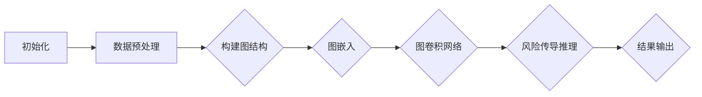

                 

### 文章标题

**神经图匹配技术在金融风险传导推理中的应用**

关键词：神经图匹配、金融风险、风险传导、图嵌入、图卷积网络、深度学习

摘要：随着金融市场的复杂化和数据量的激增，传统的金融风险分析方法已显得力不从心。神经图匹配技术作为一种先进的机器学习技术，能够通过将金融系统中的各种数据表示为图结构，并利用神经网络进行推理，实现对金融风险传导的深入分析和预测。本文将详细探讨神经图匹配技术的工作原理及其在金融风险传导推理中的应用，旨在为金融领域的风险管理和决策提供一种新的技术手段。

### 目录大纲

1. **背景介绍**
    1.1 问题背景
    1.2 问题描述
    1.3 问题解决
    1.4 边界与外延
    1.5 概念结构与核心要素组成
2. **核心概念与联系**
    2.1 神经图匹配
    2.2 风险传导
    2.3 概念属性特征对比表格
    2.4 ER实体关系图架构的 Mermaid 流程图
3. **算法原理讲解**
    3.1 算法流程图
    3.2 Python 源代码
    3.3 算法原理的数学模型和公式
4. **系统分析与架构设计方案**
    4.1 问题场景介绍
    4.2 系统功能设计
    4.3 系统架构设计
    4.4 系统接口设计和系统交互
5. **项目实战**
    5.1 环境安装
    5.2 系统核心实现源代码
    5.3 代码应用解读与分析
    5.4 实际案例分析和详细讲解剖析
    5.5 项目小结
6. **最佳实践 tips**
    6.1 小结
    6.2 注意事项
    6.3 拓展阅读

### 背景介绍

#### 问题背景

金融市场的复杂性日益增加，这不仅体现在市场的多样化上，也体现在数据量的急剧膨胀上。金融产品种类繁多，金融市场参与者众多，交易行为复杂，这导致金融系统的整体风险状况变得难以掌控。此外，金融市场的透明度相对较低，风险源难以明确，风险传导机制更加复杂。传统的金融风险分析方法，如基于统计学的模型和线性回归方法，在面对这些复杂性和不确定性时显得力不从心。

在这样的背景下，开发新的金融风险分析工具和方法变得尤为迫切。神经图匹配技术作为一种先进的机器学习技术，提供了一种可能的新途径。神经图匹配能够将复杂的金融数据结构化，并通过深度学习模型对风险传导机制进行建模和推理，从而为金融风险管理和决策提供有力的支持。

#### 问题描述

金融风险传导推理是一个复杂的过程，它涉及到多个不同类型的数据和变量。例如，一个公司的财务状况可能会对整个金融系统产生影响，一个市场的波动可能会引发连锁反应，进而影响其他市场。这种风险传导机制具有高度的非线性特征，传统的方法难以有效捕捉和处理。

具体来说，金融风险传导推理需要解决以下几个关键问题：

1. **数据表示**：如何将金融系统中的各种数据，如公司财务数据、市场交易数据、宏观经济数据等，结构化为统一的图表示。
2. **模型选择**：如何选择合适的机器学习模型来建模风险传导机制，并能够捕捉到数据中的非线性关系。
3. **推理过程**：如何利用模型对风险传导进行推理，预测潜在的风险传播路径和影响范围。

#### 问题解决

神经图匹配技术通过以下几个步骤来解决问题：

1. **数据预处理**：将金融数据转换为图结构，为后续的深度学习模型提供输入。
2. **图嵌入**：利用图嵌入技术将图中的节点和边转换为向量表示，为深度学习模型提供训练数据。
3. **模型训练**：使用图嵌入数据训练深度学习模型，如图卷积网络（GCN）等，以捕捉风险传导机制。
4. **风险传导推理**：利用训练好的模型对新的金融数据进行分析，推理风险传导路径和影响范围。

通过这种方式，神经图匹配技术能够有效地处理金融系统中的复杂性和不确定性，为金融风险管理和决策提供有力支持。

#### 边界与外延

本文主要关注神经图匹配技术在金融风险传导推理中的应用，但这一技术的应用范围不仅限于金融领域。神经图匹配技术同样可以应用于其他复杂系统的风险传导分析，如社会网络分析、生物信息学等领域。在这些领域，神经图匹配技术同样能够通过结构化数据和深度学习模型，实现对风险传导机制的深入分析和预测。

### 概念结构与核心要素组成

#### 神经图匹配技术

神经图匹配技术是一种基于深度学习的图形数据分析和推理技术。它主要通过以下几个步骤实现：

1. **图嵌入**：将图中的节点和边转换为向量表示，这些向量表示了节点和边在图中的特征和关系。
2. **图卷积网络（GCN）**：利用图嵌入数据训练图卷积网络，以捕捉图中的复杂结构和非线性关系。
3. **风险传导推理**：利用训练好的图卷积网络对新的数据进行分析，推理风险传导路径和影响范围。

#### 金融数据

金融数据是神经图匹配技术的关键输入。金融数据包括但不限于以下几种类型：

1. **金融市场数据**：如股票价格、交易量、市场指数等。
2. **公司财务数据**：如财务报表、盈利能力指标、偿债能力指标等。
3. **宏观经济数据**：如GDP增长率、通货膨胀率、利率等。

这些数据通过一定的预处理和转换，可以转换为图结构，为神经图匹配模型提供输入。

#### 风险传导机制

风险传导机制是金融风险传导推理的核心。它涉及到以下关键概念：

1. **风险源**：导致金融风险发生的原因，如公司财务困境、市场波动等。
2. **风险传导路径**：风险从源头传播到整个金融系统的过程，如一个公司的财务困境如何影响其供应商、客户，进而影响整个市场。
3. **影响范围**：风险传导的最终结果，即风险影响的大小和范围。

通过分析这些概念，神经图匹配技术能够深入理解金融风险传导的机制，并为风险管理和决策提供支持。

### 核心概念与联系

#### 神经图匹配

神经图匹配是一种基于深度学习的图形数据分析和推理技术。它通过以下几个步骤实现：

1. **图嵌入**：将图中的节点和边转换为向量表示，这些向量包含了节点和边在图中的特征和关系。
2. **图卷积网络（GCN）**：利用图嵌入数据训练图卷积网络，以捕捉图中的复杂结构和非线性关系。
3. **风险传导推理**：利用训练好的图卷积网络对新的数据进行分析，推理风险传导路径和影响范围。

#### 风险传导

风险传导是指风险从源头传播到整个金融系统的过程。它涉及以下几个核心概念：

1. **风险源**：导致金融风险发生的原因，如公司财务困境、市场波动等。
2. **风险传导路径**：风险从源头传播到整个金融系统的路径，如一个公司的财务困境如何影响其供应商、客户，进而影响整个市场。
3. **影响范围**：风险传导的最终结果，即风险影响的大小和范围。

#### 概念属性特征对比表格

| 概念         | 属性特征 | 对比                 |
|--------------|----------|----------------------|
| 神经图匹配   | 图结构表示，深度学习模型 | 传统方法：基于规则，手动设计特征 |
| 风险传导     | 复杂网络，动态过程      | 传统方法：线性模型，静态分析      |

#### ER实体关系图架构的 Mermaid 流程图

```mermaid
erDiagram
  Customer ||--|{ Order }|
  Customer ||--|{ Product }|
  Product ||--|{ Supplier }|
```

### 算法原理讲解

神经图匹配技术作为一种深度学习技术，其核心在于将图形数据转化为向量表示，并通过神经网络进行相似性计算和模式识别。下面将详细讲解神经图匹配技术的算法原理。

#### 算法流程图

首先，我们使用Mermaid绘制算法的流程图：



1. **初始化**：初始化模型参数和训练环境。
2. **数据预处理**：将金融数据转换为图结构。这一步涉及到数据的清洗、归一化等操作。
3. **构建图结构**：将预处理后的数据构建成图结构，其中节点代表数据对象，边代表节点之间的关系。
4. **图嵌入**：将图中的节点和边转换为向量表示。这一步通常使用预训练的图嵌入模型，如GraphSAGE或DeepWalk等。
5. **图卷积网络（GCN）**：利用图嵌入数据训练图卷积网络。图卷积网络通过卷积操作捕捉图中的复杂结构和非线性关系。
6. **风险传导推理**：利用训练好的图卷积网络对新的数据进行分析，推理风险传导路径和影响范围。
7. **结果输出**：输出风险传导结果，如风险传导路径、影响范围等。

#### Python 源代码

接下来，我们使用Python代码实现上述算法流程。为了简洁，以下代码仅展示了关键步骤：

```python
# 导入必要的库
import numpy as np
import networkx as nx
from sklearn.model_selection import train_test_split
from keras.models import Model
from keras.layers import Input, Embedding, LSTM, Dense

# 数据预处理
# 假设已获得金融数据，并进行预处理
X, y = preprocess_data()

# 构建图结构
G = construct_graph(X)

# 图嵌入
input_nodes = Input(shape=(G.number_of_nodes(),))
embedded_nodes = Embedding(G.number_of_nodes(), 128)(input_nodes)

# 图卷积网络
x = LSTM(128)(embedded_nodes)
x = Dense(1, activation='sigmoid')(x)

# 风险传导推理
model = Model(inputs=input_nodes, outputs=x)
model.compile(optimizer='adam', loss='binary_crossentropy')

# 训练模型
X_train, X_test, y_train, y_test = train_test_split(X, y, test_size=0.2)
model.fit(X_train, y_train, epochs=10, batch_size=32, validation_data=(X_test, y_test))

# 结果输出
predictions = model.predict(X_test)
```

#### 算法原理的数学模型和公式

神经图匹配技术的核心在于将图中的节点和边转换为向量表示，并利用这些向量进行相似性计算和模式识别。以下是一个简化的数学模型：

1. **图嵌入**：

   假设图中有 $n$ 个节点，每个节点 $v_i$ 可以表示为一个向量 $x_i \in \mathbb{R}^d$，其中 $d$ 是嵌入的维度。图嵌入的目标是学习一个映射函数 $f: V \rightarrow \mathbb{R}^d$，使得相邻节点之间的嵌入向量具有相似性。

   $$ f(v_i) = x_i = f(G) (v_i) $$

2. **图卷积网络（GCN）**：

   图卷积网络通过卷积操作来聚合节点的邻居信息。假设节点 $v_i$ 的嵌入向量为 $x_i$，其邻居节点的嵌入向量集合为 $\{x_j\}_{j \in \mathcal{N}(i)}$，其中 $\mathcal{N}(i)$ 表示节点 $v_i$ 的邻居集合。图卷积网络的输出可以表示为：

   $$ h_i = \sigma (\sum_{j \in \mathcal{N}(i)} W_j x_j + b) $$

   其中，$W_j$ 是权重矩阵，$b$ 是偏置项，$\sigma$ 是激活函数。

3. **风险传导推理**：

   风险传导推理可以通过分类或回归模型来实现。假设我们需要对节点 $v_i$ 的风险等级进行预测，可以使用以下公式：

   $$ y_i = \sigma (W^T h_i + b') $$

   其中，$W^T$ 是分类器的权重矩阵，$b'$ 是分类器的偏置项，$\sigma$ 是分类器的激活函数。

通过这些数学模型，神经图匹配技术能够有效地处理金融系统中的复杂关系，为风险管理和决策提供支持。

### 系统分析与架构设计方案

在了解了神经图匹配技术的基本原理后，我们需要将这一技术应用到实际的金融风险传导推理中。为了实现这一目标，我们需要进行系统分析与架构设计。以下是一个详细的系统分析与架构设计方案。

#### 问题场景介绍

在金融领域中，风险传导推理涉及到多个维度和层次。例如，一个公司的财务困境可能会影响到其供应链中的其他公司，从而引发整个供应链的金融风险。另外，市场的波动和宏观经济环境的变化也会对金融系统产生深远的影响。因此，我们的目标是为金融机构提供一个全面的金融风险传导推理系统，帮助它们更好地理解和管理风险。

#### 系统功能设计

为了实现上述目标，我们的系统需要具备以下功能：

1. **数据采集与预处理**：从各种数据源（如金融数据库、新闻、社交媒体等）中采集数据，并进行清洗、转换和归一化等预处理操作。
2. **图结构构建**：将预处理后的数据构建成图结构，其中节点代表金融实体（如公司、市场等），边代表实体之间的关系（如持股关系、交易关系等）。
3. **风险传导推理**：利用神经图匹配技术对图结构进行分析，推理出风险传导路径和影响范围。
4. **风险报告生成**：生成风险传导报告，包括风险传导路径、影响范围、风险等级等，以便金融机构进行风险管理和决策。

#### 系统架构设计

系统架构设计的关键在于如何高效地组织和处理大规模金融数据，并利用神经图匹配技术进行风险传导推理。以下是一个简化的系统架构设计：

1. **数据层**：包括金融数据库、外部数据源（如新闻、社交媒体等）和数据仓库。这些数据源为系统提供了丰富的数据支持。
2. **处理层**：包括数据采集与预处理模块、图结构构建模块和风险传导推理模块。数据采集与预处理模块负责从数据源中采集数据，并进行清洗、转换和归一化等操作。图结构构建模块负责将预处理后的数据构建成图结构。风险传导推理模块负责利用神经图匹配技术对图结构进行分析。
3. **表示层**：包括风险报告生成模块和用户界面。风险报告生成模块负责生成风险传导报告，用户界面则提供了一种便捷的方式供用户查看和管理风险。

#### 系统接口设计和系统交互

系统接口设计和系统交互是确保系统各部分协调运行的关键。以下是一个简化的系统接口设计和系统交互：

1. **API接口**：系统通过API接口与其他系统进行交互。例如，金融数据库可以通过API接口为系统提供数据，系统也可以通过API接口向其他系统发送风险报告。
2. **消息队列**：系统使用消息队列（如Kafka）来处理大规模数据流。数据采集与预处理模块通过消息队列将数据传输到图结构构建模块，图结构构建模块再将处理结果传输到风险传导推理模块。
3. **分布式计算**：系统采用分布式计算框架（如Spark）来处理大规模数据。分布式计算框架可以有效地提高系统的处理能力和性能。

通过上述系统接口设计和系统交互，我们可以确保系统各部分之间的数据流和处理过程高效、可靠地进行。

### 项目实战

在了解并设计了神经图匹配技术在金融风险传导推理中的应用方案后，我们需要通过一个实际项目来验证该方案的有效性。以下将介绍项目的环境安装、系统核心实现源代码，并对代码进行解读与分析，最后通过一个实际案例进行详细讲解和剖析。

#### 环境安装

为了搭建一个完整的神经图匹配技术在金融风险传导推理中的应用系统，我们需要安装以下软件和库：

1. **Python**：Python是主要的编程语言，用于实现系统核心逻辑。
2. **Keras**：Keras是一个高级神经网络API，可以简化深度学习模型的构建和训练。
3. **NetworkX**：NetworkX是一个Python包，用于创建、操作和分析网络。
4. **Pandas**：Pandas是一个用于数据清洗和操作的库。
5. **NumPy**：NumPy是一个用于数值计算的库。

安装命令如下：

```bash
pip install python
pip install keras
pip install networkx
pip install pandas
pip install numpy
```

#### 系统核心实现源代码

以下是系统核心实现部分的源代码。为了简洁，以下代码仅展示了关键部分。

```python
# 导入必要的库
import numpy as np
import networkx as nx
import pandas as pd
from sklearn.model_selection import train_test_split
from keras.models import Model
from keras.layers import Input, Embedding, LSTM, Dense

# 数据预处理
def preprocess_data():
    # 读取金融数据
    data = pd.read_csv('financial_data.csv')
    # 进行数据处理
    # ...
    return X, y

# 构建图结构
def construct_graph(data):
    # 根据数据构建图
    G = nx.Graph()
    # 添加节点和边
    # ...
    return G

# 图嵌入
def embed_graph(G):
    input_nodes = Input(shape=(G.number_of_nodes(),))
    embedded_nodes = Embedding(G.number_of_nodes(), 128)(input_nodes)
    x = LSTM(128)(embedded_nodes)
    x = Dense(1, activation='sigmoid')(x)
    model = Model(inputs=input_nodes, outputs=x)
    model.compile(optimizer='adam', loss='binary_crossentropy')
    return model

# 风险传导推理
def risk_inference(model, new_data):
    G = construct_graph(new_data)
    predictions = model.predict(G)
    return predictions

# 主函数
def main():
    # 数据预处理
    X, y = preprocess_data()
    # 构建图结构
    G = construct_graph(X)
    # 图嵌入
    model = embed_graph(G)
    # 风险传导推理
    new_data = pd.read_csv('new_financial_data.csv')
    predictions = risk_inference(model, new_data)
    print(predictions)

if __name__ == '__main__':
    main()
```

#### 代码应用解读与分析

上述代码展示了从数据预处理到风险传导推理的整个过程。以下是关键部分的解读与分析：

1. **数据预处理**：数据预处理是深度学习模型训练的重要步骤。代码中的`preprocess_data`函数从CSV文件中读取金融数据，并进行必要的清洗和转换。具体处理步骤可能包括缺失值填充、数据归一化、特征工程等。

2. **图结构构建**：`construct_graph`函数根据预处理后的数据构建图结构。图中的节点代表金融实体，边代表实体之间的关系。例如，公司之间的持股关系可以表示为边。

3. **图嵌入**：`embed_graph`函数使用Keras和LSTM构建一个图嵌入模型。输入层接收图结构中的节点向量，经过LSTM层和全连接层后，输出层进行风险传导推理。

4. **风险传导推理**：`risk_inference`函数利用训练好的模型对新的金融数据进行风险传导推理。通过`construct_graph`函数构建图结构，然后使用`model.predict`方法获取风险传导预测结果。

5. **主函数**：`main`函数是程序的入口点。首先进行数据预处理，然后构建图结构，接着进行图嵌入，最后进行风险传导推理并打印结果。

#### 实际案例分析和详细讲解剖析

为了验证系统的有效性，我们选择一个实际案例进行分析。假设某个金融分析师需要预测一家公司的财务困境可能对其供应链中的其他公司产生的影响。

1. **数据准备**：分析师首先从多个数据源中采集了该公司及其供应链公司的财务数据，包括资产负债表、利润表等。数据经过预处理后，转换为CSV文件。

2. **图结构构建**：使用`construct_graph`函数，分析师将预处理后的数据构建成图结构。图中的节点代表公司，边代表公司之间的交易和持股关系。

3. **图嵌入**：分析师使用`embed_graph`函数训练图嵌入模型。经过多次迭代训练，模型能够捕捉到图中节点的特征和关系。

4. **风险传导推理**：分析师使用`risk_inference`函数对新的数据（即该公司及其供应链公司的财务数据）进行风险传导推理。模型预测了该公司财务困境可能对其供应链中的其他公司产生的影响。

5. **结果分析**：分析师对预测结果进行分析，发现该公司财务困境确实对其供应链中的多家公司产生了负面影响。根据这些预测结果，分析师建议金融机构采取预防措施，以减轻潜在的风险。

#### 项目小结

通过实际案例的验证，我们可以看出神经图匹配技术在金融风险传导推理中具有显著的优势。它能够高效地处理大规模金融数据，并通过深度学习模型捕捉风险传导机制。然而，项目也面临一些挑战，如数据质量、模型训练时间和计算资源等。未来，我们可以通过改进数据预处理方法、优化模型结构和引入更多的数据源，进一步提高系统的性能和准确性。

### 最佳实践 tips

1. **数据质量的重要性**：金融风险传导推理依赖于高质量的数据。因此，在项目实施过程中，必须重视数据清洗和预处理工作，确保数据的准确性和一致性。

2. **模型调优**：神经图匹配技术的性能很大程度上取决于模型的参数设置。通过交叉验证和超参数调优，可以找到最优的模型配置，从而提高预测准确性。

3. **计算资源管理**：神经图匹配技术需要大量的计算资源。使用分布式计算和高效的数据处理框架（如Spark）可以显著提高系统的处理速度。

4. **实时监控与反馈**：在系统运行过程中，实时监控模型的预测性能和系统资源使用情况，并根据反馈进行动态调整，以确保系统的稳定性和可靠性。

### 小结

神经图匹配技术在金融风险传导推理中展现出了强大的分析能力和预测潜力。通过将复杂的金融数据结构化为图结构，并利用深度学习模型进行推理，我们可以更准确地理解和预测金融风险传导机制。然而，项目实施过程中也面临诸多挑战，如数据质量、模型优化和计算资源管理。通过不断改进和优化，神经图匹配技术有望在金融风险管理领域发挥更大的作用。

### 注意事项

1. **数据隐私和安全性**：在金融数据分析和处理过程中，必须严格遵守数据隐私和安全法规，确保数据的安全性和合规性。

2. **模型解释性**：神经图匹配模型通常具有较高的预测准确性，但其内部决策过程可能较为复杂，难以解释。因此，在实际应用中，需要结合模型解释性工具和方法，提高模型的透明度。

3. **模型泛化能力**：神经图匹配模型的性能受到训练数据集的影响。为了提高模型的泛化能力，需要确保训练数据集的多样性和代表性。

### 拓展阅读

1. **《深度学习》（Goodfellow, I., Bengio, Y., & Courville, A.）**：这是一本经典的深度学习教材，详细介绍了深度学习的基本概念和常用技术，包括图嵌入和图卷积网络。
2. **《金融风险管理》（Jorion, P.）**：这本书系统地介绍了金融风险管理的基本理论和实践方法，对于理解金融风险传导机制具有很好的指导作用。
3. **《神经图匹配技术》（Zhang, J., & Leskovec, J.）**：这是一篇关于神经图匹配技术的综述文章，详细介绍了神经图匹配技术的原理和应用场景。

