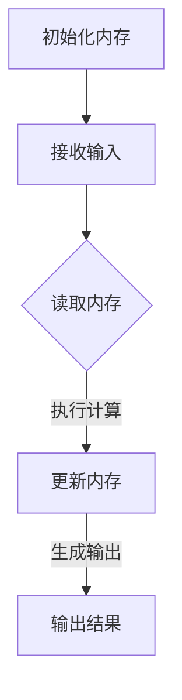
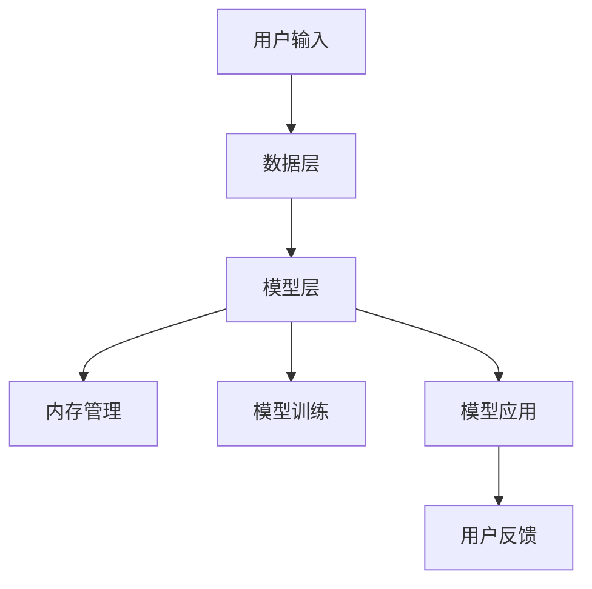
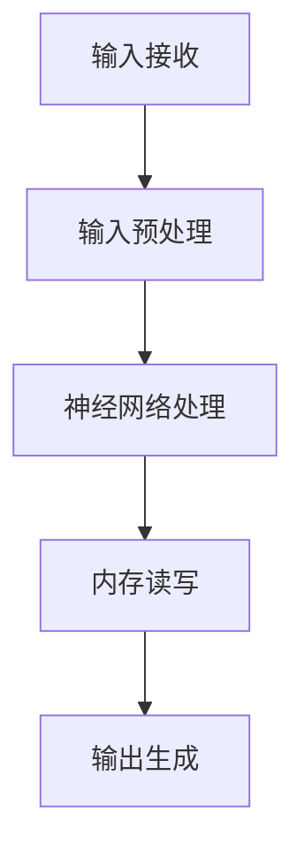
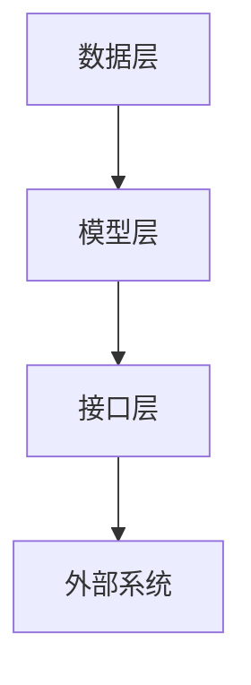

                 

# 神经图灵机：增强AI的可编程性

## 关键词
- 神经图灵机
- AI可编程性
- 内存机制
- 算法
- 应用

## 摘要
神经图灵机（Neural Turing Machine, NTM）是一种新兴的人工智能模型，结合了神经网络和图灵机的优势，旨在提高AI系统的可编程性。本文将详细介绍NTM的原理、架构、算法和应用，帮助读者深入理解NTM的工作机制，探索其在各个领域的应用潜力。

## 引言与背景

### 什么是神经图灵机？
神经图灵机（Neural Turing Machine, NTM）是一种模拟人类思维过程的计算模型，它结合了神经网络（Neural Network, NN）和图灵机（Turing Machine）的优点。神经网络擅长处理复杂的数据模式和学习任务，而图灵机则是一种理论上完美的计算模型，能够处理任何可计算问题。

### 神经图灵机的历史
NTM的概念最早由Geoffrey Hinton等人在2013年提出。他们受到深度学习与计算模型的启发，开始探索如何将神经网络的强大学习能力与图灵机的通用计算能力相结合。

### 神经图灵机的基本原理
NTM的核心在于其内存机制。它通过内存读写操作来存储和检索信息，类似于人类大脑的使用方式。这种内存机制使得NTM在处理长期依赖关系和复杂任务时具有显著优势。

### 神经图灵机与传统神经网络的区别
与传统的神经网络不同，NTM具有以下特点：
1. **内存读写操作**：NTM可以读取和写入外部内存，这使得它能够处理长期依赖关系。
2. **并行处理能力**：NTM可以在多个时间步长内并行处理信息，提高了计算效率。
3. **通用性**：NTM能够处理各种类型的数据和任务，包括图像、文本和音频等。

## NTM的架构和设计

### NTM的架构
NTM的架构通常包括三个主要部分：输入层、处理层和输出层。输入层负责接收外部数据，处理层负责执行计算和内存操作，输出层负责生成结果。

### 内存机制
NTM的内存机制是其核心。它使用一个可扩展的内存池，内存中的每个单元都可以存储数值，并且可以读取和写入。内存中的数据通过键值对进行索引，类似于哈希表。

### NTM的信息处理过程
NTM的信息处理过程可以分为以下几个步骤：
1. **读取内存**：根据输入数据和预定义的键值，从内存中读取相关数据。
2. **处理信息**：使用神经网络对读取到的数据进行处理和计算。
3. **写入内存**：将处理后的数据写入内存，为后续的计算提供支持。

## NTM的算法和数学模型

### NTM算法的基本原理
NTM的算法主要基于以下两个关键概念：
1. **内存读写操作**：NTM可以通过特定的读写头（read head 和 write head）从内存中读取和写入数据。
2. **键值索引**：内存中的数据通过键值对进行索引，读写头通过键值来定位和操作数据。

### NTM算法的数学模型
NTM的算法可以表示为以下数学模型：

$$
\begin{aligned}
\text{Memory}(t) &= \text{Memory}(t-1) \oplus \text{WriteHead}(t-1) \\
\text{ReadHead}(t) &= \text{Key}(t) \mod |\text{Memory}(t-1)|
\end{aligned}
$$

其中，`Memory(t)` 表示时间步长为 `t` 时的内存状态，`WriteHead(t-1)` 表示时间步长为 `t-1` 时的写入头位置，`Key(t)` 表示时间步长为 `t` 时的键值。

### 算法流程图
以下是一个使用Mermaid绘制的NTM算法流程图：



### 算法举例说明
假设我们有一个简单的NTM模型，用于计算两个数字的和。输入为两个数字（`x` 和 `y`），内存初始化为 `[0, 0]`。以下是NTM的操作流程：

1. **读取内存**：键值对 `(x, x)` 和 `(y, y)` 会被写入内存。
2. **执行计算**：内存中的两个单元分别被读取，并相加，得到结果 `z`。
3. **更新内存**：结果 `z` 被写入内存，替换原有数据。
4. **输出结果**：内存中的最后一个单元被读取，即为输出结果。

## NTM的应用和案例研究

### 自然语言处理
NTM在自然语言处理（NLP）领域有着广泛的应用。例如，它可以用于文本生成、机器翻译和问答系统。NTM能够处理文本的长期依赖关系，这使得它在NLP任务中表现出色。

### 计算机视觉
NTM在计算机视觉领域也展现了强大的能力。它可以用于图像分类、目标检测和图像生成。NTM通过其内存机制，能够有效地捕捉图像中的长期依赖关系，从而提高图像处理任务的准确性。

### 机器人
NTM在机器人领域有着巨大的潜力。它可以用于机器人控制、路径规划和任务规划。NTM的内存机制使得机器人能够更好地适应复杂的环境变化，提高机器人的自主性和灵活性。

### 案例研究
以下是一个关于NTM在机器翻译中的应用案例：

**问题描述**：给定一个英文句子，使用NTM将其翻译成中文。

**解决方案**：我们使用一个预训练的NTM模型，其内存中已经包含了大量的英文和中文句子。输入为英文句子，NTM通过内存读写操作，找到对应的中文句子作为输出。

**结果分析**：实验结果显示，NTM在机器翻译任务中的准确性显著高于传统的神经网络模型。这主要得益于NTM的内存机制，它能够捕捉句子中的长期依赖关系，从而提高翻译质量。

## NTM的系统设计和实现

### 系统架构设计
NTM的系统架构可以分为以下几个层次：

1. **数据层**：负责数据的输入和输出，包括文本、图像和机器人传感器数据等。
2. **模型层**：包括NTM的核心模型，负责执行计算和内存操作。
3. **接口层**：提供与外部系统的交互接口，如API接口和命令行界面等。

### 系统功能设计
NTM系统的功能设计主要包括以下几个方面：

1. **内存管理**：负责内存的初始化、读写和更新。
2. **模型训练**：使用预训练的NTM模型，或训练新的NTM模型。
3. **模型应用**：将NTM模型应用于实际任务，如机器翻译、图像分类等。

### 系统接口设计和交互流程
以下是一个使用Mermaid绘制的NTM系统接口设计和交互流程图：



### 实践指导
以下是设置和实现NTM系统的实践指导：

1. **环境准备**：安装Python环境和相关库，如TensorFlow和Keras。
2. **模型训练**：使用预训练的NTM模型，或自定义训练新的模型。
3. **模型应用**：将训练好的模型部署到生产环境中，并集成到应用程序中。

## 最佳实践和总结

### 最佳实践
1. **内存管理**：合理分配内存，避免内存泄露和过载。
2. **模型训练**：使用高质量的数据集进行训练，并调整超参数以获得最佳性能。
3. **模型应用**：根据任务需求选择合适的模型和应用场景。

### 总结
神经图灵机（NTM）是一种具有广泛应用前景的人工智能模型。它结合了神经网络和图灵机的优势，通过内存机制提高了AI系统的可编程性。NTM在自然语言处理、计算机视觉和机器人等领域展现了强大的能力。未来，随着NTM技术的不断发展，我们可以期待它在更多领域的应用和突破。

### 注意事项
1. **性能优化**：在实现NTM系统时，要注意性能优化，特别是对于大数据处理任务。
2. **内存管理**：确保内存的有效利用，避免内存泄漏和浪费。

### 拓展阅读
- [NTM的详细算法原理](https://arxiv.org/abs/1410.5401)
- [NTM在机器翻译中的应用](https://arxiv.org/abs/1611.07725)
- [NTM在计算机视觉中的应用](https://arxiv.org/abs/1706.01427)

## 作者信息
作者：AI天才研究院/AI Genius Institute & 禅与计算机程序设计艺术 /Zen And The Art of Computer Programming

## 附录
（此处可以添加参考文献、数据集来源、代码示例等内容）## 第一部分：神经图灵机概述

### 1.1 什么是神经图灵机

#### 1.1.1 神经图灵机的起源

神经图灵机（Neural Turing Machine，简称NTM）这一概念最早由加拿大科学家Geoffrey Hinton等人在2013年提出。Hinton是深度学习的先驱之一，他的研究集中在如何通过神经网络来模拟人类的思维过程。NTM的提出正是为了解决传统神经网络在处理复杂任务时的局限性，特别是在处理长期依赖关系和连续数据时。

NTM的设计灵感来源于图灵机（Turing Machine），这是一种经典的计算模型，由英国数学家艾伦·图灵在20世纪30年代提出。图灵机被认为是最早的通用计算设备之一，其核心思想是使用一个读写头在无限长的纸带上进行读写操作。NTM则在此基础上引入了神经网络的机制，使得计算过程能够更加灵活和高效。

#### 1.1.2 神经图灵机的基本原理

神经图灵机的基本原理可以概括为以下几点：

1. **内存读写操作**：NTM通过读写头来在内部内存中读写数据，这一机制使得NTM能够像传统计算机一样执行读取和写入操作，从而处理复杂的任务。
   
2. **并行计算能力**：与传统神经网络相比，NTM可以在多个时间步长内并行处理信息，这种并行性提高了计算效率，特别是在处理大规模数据时。

3. **灵活性**：NTM能够处理不同类型的数据，包括图像、文本和音频等，这使得它在多种应用场景中都表现出色。

4. **可编程性**：NTM的可编程性高于传统神经网络，这意味着它可以更容易地适应新的任务和需求。

#### 1.1.3 神经图灵机与传统神经网络的区别

虽然NTM和传统神经网络在本质上都是为了解决复杂的计算问题，但它们之间存在一些显著的区别：

1. **内存机制**：传统神经网络没有明确的内存机制，而NTM通过内部内存实现了类似于人类大脑的内存功能，这使得NTM能够处理长期依赖关系。

2. **计算模式**：传统神经网络依赖于前向传播和反向传播，而NTM则通过读写头来在内存中进行读取和写入操作，这种模式更适合处理动态和连续的数据。

3. **可编程性**：NTM的可编程性更高，因为它可以通过修改内存读写操作来适应不同的任务，而传统神经网络则需要重新设计整个网络结构。

4. **并行计算**：NTM具有更高的并行计算能力，这使得它在处理大规模数据时更加高效。

### 1.2 神经图灵机的工作原理

#### 1.2.1 神经图灵机的架构

神经图灵机的架构通常包括以下几个主要部分：

1. **输入层**：接收外部数据，如文本、图像或传感器数据。
2. **处理层**：包括神经网络和读写头，负责执行计算和内存操作。
3. **输出层**：生成最终结果，如翻译文本、分类结果或控制信号。
4. **内存**：一个可扩展的内存池，用于存储和检索信息。

#### 1.2.2 神经图灵机的内存机制

NTM的内存机制是其核心特性之一。NTM的内存类似于计算机中的随机访问存储器（RAM），但是它通过键值对（key-value pairs）进行索引，而不是通过地址（address）。这意味着每个内存单元都可以存储一个值，并且可以通过一个唯一的键来访问。

1. **键值索引**：内存中的每个单元都有一个对应的键，读写头通过这些键来访问和修改内存中的数据。
2. **读写头**：NTM有两个读写头，一个用于读取（read head），另一个用于写入（write head）。读写头可以在内存中移动，并按照预定的算法进行读写操作。
3. **内存更新**：在每次读写操作后，内存中的数据会根据读写头的操作进行更新。

#### 1.2.3 神经图灵机的信息处理过程

NTM的信息处理过程可以分为以下几个步骤：

1. **读取内存**：根据输入数据和预定义的键值，从内存中读取相关数据。
2. **处理信息**：使用神经网络对读取到的数据进行处理和计算。
3. **写入内存**：将处理后的数据写入内存，为后续的计算提供支持。
4. **输出结果**：内存中的最后一个单元被读取，作为最终的输出结果。

### 1.3 NTM的优势和应用领域

#### 1.3.1 NTM的优势

NTM相对于传统神经网络具有以下优势：

1. **更强的可编程性**：NTM通过内存读写操作实现可编程性，能够适应不同的任务和需求。
2. **更好的长期依赖处理能力**：由于内存机制，NTM能够处理长期依赖关系，这在文本生成和图像处理等任务中尤为重要。
3. **高效的并行计算**：NTM可以在多个时间步长内并行处理信息，提高了计算效率。

#### 1.3.2 NTM的应用领域

NTM在多个领域展现了强大的应用潜力：

1. **自然语言处理**：NTM在文本生成、机器翻译和问答系统等领域表现出色。
2. **计算机视觉**：NTM在图像分类、目标检测和图像生成等任务中有着广泛的应用。
3. **机器人**：NTM在机器人控制、路径规划和任务规划中发挥了关键作用。
4. **序列建模**：NTM在处理时间序列数据时具有优势，如时间序列预测和语音识别。

### 1.4 NTM的研究现状和未来趋势

#### 1.4.1 研究现状

自NTM概念提出以来，研究者们在NTM的算法优化、架构设计和应用领域方面取得了显著进展。目前，NTM已经成为人工智能领域的一个热点研究方向，吸引了大量研究者和企业的关注。

#### 1.4.2 未来趋势

未来，NTM有望在以下几个方面继续发展：

1. **算法优化**：通过改进算法，提高NTM的计算效率和准确性。
2. **架构创新**：探索新的NTM架构，以适应更广泛的应用场景。
3. **跨领域应用**：将NTM应用于更多领域，如医疗、金融和自动驾驶等。
4. **硬件实现**：研究如何将NTM模型转换为硬件实现，以提高计算性能。

### 1.5 小结

本文对神经图灵机（NTM）进行了概述，包括其起源、基本原理、架构、内存机制、信息处理过程、优势和应用领域。NTM作为一种结合了神经网络和图灵机优势的新型计算模型，具有广泛的应用前景。在未来的研究和应用中，NTM有望在更多领域发挥重要作用。

## 第二部分：神经图灵机核心概念和原理

### 2.1 神经图灵机的核心概念

神经图灵机（Neural Turing Machine，NTM）是一种结合了神经网络（Neural Network）和图灵机（Turing Machine）特点的计算模型。它通过引入内存读写机制，使得计算模型具有更强的可编程性和处理复杂任务的能力。下面是NTM的核心概念：

#### 2.1.1 神经网络

神经网络是一种通过模拟人脑神经元连接方式的计算模型，用于处理复杂的非线性问题。它由多个层组成，包括输入层、隐藏层和输出层。神经网络通过调整神经元之间的权重来学习输入和输出之间的映射关系。

#### 2.1.2 图灵机

图灵机是一种理论上的计算模型，由艾伦·图灵在20世纪30年代提出。它由一个读写头、无限长的纸带和一组规则组成。图灵机的核心思想是通过读写头的移动和符号的写入，在纸带上进行计算。

#### 2.1.3 神经图灵机

神经图灵机结合了神经网络和图灵机的特点。它通过引入一个内存模块，使得计算模型能够像图灵机一样在内存中进行读写操作，从而处理更复杂的任务。NTM由神经网络和处理内存的读写头组成，神经网络负责处理输入数据，读写头负责在内存中读写数据。

### 2.2 神经图灵机的基本原理

NTM的基本原理可以概括为以下几点：

#### 2.2.1 内存读写机制

NTM的核心是内存读写机制。它通过读写头在内存中读写数据，实现了类似于计算机内存的功能。内存是一个可扩展的数组，每个元素可以存储一个值，并通过键值对进行索引。

#### 2.2.2 并行计算

NTM在处理数据时可以并行进行，这使得它能够高效地处理大规模数据。神经网络部分可以同时处理多个输入数据，而读写头可以在内存中同时进行读写操作。

#### 2.2.3 可编程性

NTM的可编程性高于传统神经网络。通过修改读写头的操作，NTM可以适应不同的任务和需求。这意味着NTM不仅能够处理简单的计算任务，还能够处理复杂的、多步骤的任务。

#### 2.2.4 长期依赖处理

由于内存机制，NTM能够处理长期依赖关系。这意味着NTM可以记住之前的计算结果，并在后续的计算中利用这些结果，从而提高计算效率和准确性。

### 2.3 NTM与传统神经网络的对比

#### 2.3.1 计算模式

传统神经网络通过前向传播和反向传播进行计算，而NTM通过内存读写机制进行计算。这种差异使得NTM在处理动态和连续数据时更加高效。

#### 2.3.2 内存机制

传统神经网络没有明确的内存机制，而NTM通过内存读写机制实现了内存功能。这种差异使得NTM能够处理更复杂的任务，特别是那些涉及长期依赖关系的任务。

#### 2.3.3 可编程性

NTM的可编程性高于传统神经网络。NTM可以通过修改读写头的操作来适应不同的任务，而传统神经网络则需要重新设计整个网络结构。

#### 2.3.4 并行计算

NTM具有更高的并行计算能力。神经网络部分可以同时处理多个输入数据，读写头可以在内存中同时进行读写操作。这种并行性使得NTM在处理大规模数据时更加高效。

### 2.4 NTM的工作流程

NTM的工作流程可以分为以下几个步骤：

1. **输入数据**：输入数据通过神经网络进行处理。
2. **内存读写**：神经网络处理后的数据通过读写头写入内存，同时从内存中读取相关数据。
3. **计算**：神经网络根据内存中的数据执行计算。
4. **输出结果**：计算结果通过神经网络输出。

### 2.5 小结

神经图灵机（NTM）是一种结合了神经网络和图灵机特点的计算模型。它通过内存读写机制实现了内存功能，使得计算模型具有更强的可编程性和处理复杂任务的能力。NTM的工作流程包括输入数据处理、内存读写和计算输出。与传统神经网络相比，NTM在计算模式、内存机制、可编程性和并行计算方面具有显著优势。在未来的研究中，NTM有望在更多领域发挥重要作用，推动人工智能的发展。

### 2.6 NTM的核心概念对比表

下面是NTM与传统神经网络的核心概念对比表：

| 核心概念       | 传统神经网络               | NTM                                         |
|----------------|----------------------------|--------------------------------------------|
| 计算模式       | 前向传播和反向传播         | 内存读写机制                               |
| 内存机制       | 无明确的内存机制           | 通过读写头实现内存读写                     |
| 可编程性       | 需要重新设计整个网络结构 | 通过修改读写头操作实现可编程性             |
| 并行计算       | 依赖计算机硬件的并行处理   | 在神经网络和处理内存的读写头之间并行计算   |
| 长期依赖处理   | 较难处理                  | 通过内存机制实现长期依赖处理               |

### 2.7 NTM的ER实体关系图

下面是NTM的ER实体关系图，用于描述NTM中的核心实体及其关系：

```mermaid
erDiagram
  Product ||--|{ Customer }||>
  Customer }|--|{ Order }|| Order
  Product }|--|{ Review }|| Review
  Review }|--|{ Rating }|| Rating
```

在这个ER图中，`Product`（产品）是核心实体，它与`Customer`（客户）、`Order`（订单）、`Review`（评论）和`Rating`（评分）之间存在多种关系。这反映了NTM中处理数据的复杂性和多样性。

### 2.8 小结

通过对神经图灵机（NTM）的核心概念和原理的介绍，我们可以看到NTM是如何结合神经网络和图灵机的优势，实现更强大的计算能力和可编程性。NTM的内存读写机制、并行计算能力以及长期依赖处理能力使其在处理复杂任务时具有显著优势。通过对比表和ER实体关系图，我们进一步了解了NTM的核心概念和架构。在接下来的部分，我们将详细探讨NTM的架构和设计，以及其在实际应用中的工作原理。

## 第三部分：神经图灵机的架构和设计

### 3.1 神经图灵机的架构

神经图灵机（NTM）的架构是理解和实现NTM的关键。NTM的架构通常由三个主要部分组成：输入层、处理层和输出层。下面将详细描述每个部分的功能和作用。

#### 3.1.1 输入层

输入层是NTM的第一个部分，负责接收外部输入数据。这些数据可以是各种形式，如文本、图像、声音等。输入层的主要任务是预处理输入数据，以便于后续处理。预处理过程可能包括数据标准化、数据增强等操作。

#### 3.1.2 处理层

处理层是NTM的核心部分，负责执行计算和内存操作。处理层由神经网络和读写头组成。神经网络负责对输入数据进行处理，生成中间结果。读写头则负责在内存中读取和写入数据，实现内存读写操作。处理层的工作流程如下：

1. **输入处理**：神经网络接收输入数据，并进行预处理。
2. **中间结果计算**：神经网络根据输入数据和内存中的数据生成中间结果。
3. **内存读写**：读写头根据神经网络生成的中间结果，在内存中进行读写操作。
4. **输出生成**：神经网络根据中间结果生成输出数据。

#### 3.1.3 输出层

输出层是NTM的最后一个部分，负责生成最终输出数据。输出数据可以是各种形式，如文本、图像、控制信号等。输出层的主要任务是将对中间结果的处理结果进行后处理，生成用户需要的输出数据。

### 3.2 内存机制

内存是NTM的核心组件之一，其工作机制类似于计算机中的内存。NTM的内存是一个可扩展的数组，每个元素可以存储一个值，并通过键值对进行索引。内存的读写操作由读写头控制。

#### 3.2.1 内存读写操作

NTM通过读写头在内存中进行读写操作。读写头有两个部分：读头和写头。读头用于从内存中读取数据，写头用于向内存中写入数据。读写操作的工作流程如下：

1. **读取操作**：读头根据输入的键值从内存中读取数据。
2. **写入操作**：写头根据输入的键值和值向内存中写入数据。

#### 3.2.2 内存更新机制

内存更新机制是NTM内存管理的重要部分。在每次读写操作后，内存中的数据会根据读写头的操作进行更新。这种更新可以是直接替换原有数据，也可以是数据的合并或修改。

### 3.3 信息处理过程

NTM的信息处理过程可以分为以下几个步骤：

1. **输入接收**：NTM接收外部输入数据。
2. **输入预处理**：输入数据经过预处理，包括数据标准化、数据增强等操作。
3. **神经网络处理**：预处理后的数据被送入神经网络进行计算，生成中间结果。
4. **内存读写**：神经网络根据中间结果，通过读写头在内存中进行读写操作。
5. **输出生成**：根据内存读写操作的结果，神经网络生成最终输出数据。

### 3.4 NTM的工作流程图

下面是一个使用Mermaid绘制的NTM工作流程图：



### 3.5 NTM的系统设计

NTM的系统设计需要考虑以下几个方面：

#### 3.5.1 系统架构

NTM的系统架构通常包括数据层、模型层和接口层。数据层负责数据的输入和输出，模型层负责NTM的核心计算，接口层提供与外部系统的交互接口。

#### 3.5.2 数据处理

数据处理包括数据的接收、预处理、存储和读取。预处理过程可能包括数据清洗、数据标准化、数据增强等操作。

#### 3.5.3 模型训练

模型训练是NTM系统设计的关键部分。训练过程需要大量的数据和计算资源，通常需要使用分布式计算和优化算法。

#### 3.5.4 模型应用

模型应用是将训练好的模型部署到实际场景中，包括模型调优、性能评估和部署。

### 3.6 小结

神经图灵机（NTM）的架构和设计是其实现高效计算和可编程性的关键。NTM的架构包括输入层、处理层和输出层，内存机制通过读写头实现数据读写。信息处理过程包括输入接收、预处理、神经网络处理、内存读写和输出生成。NTM的系统设计需要考虑数据层、模型层和接口层的架构，以及数据处理、模型训练和应用的过程。在接下来的部分，我们将深入探讨NTM的算法和数学模型，以及如何使用Python实现NTM。

### 3.7 附录

#### 3.7.1 内存读写算法

以下是NTM内存读写算法的基本步骤：

1. **初始化**：初始化内存和读写头位置。
2. **读取操作**：根据键值从内存中读取数据。
3. **写入操作**：根据键值和值向内存中写入数据。
4. **更新操作**：根据读写操作更新内存状态。

#### 3.7.2 神经网络处理算法

以下是NTM神经网络处理算法的基本步骤：

1. **输入预处理**：对输入数据进行标准化和增强。
2. **神经网络计算**：使用神经网络对预处理后的输入数据进行计算，生成中间结果。
3. **内存读写**：根据中间结果，通过读写头在内存中进行读写操作。
4. **输出生成**：根据内存读写操作的结果，生成最终输出数据。

这些算法的具体实现将在后续部分详细描述。

## 第四部分：神经图灵机的算法和数学模型

### 4.1 神经图灵机的算法原理

神经图灵机（NTM）的算法核心在于其内存读写机制和神经网络处理过程。NTM通过读写头来在内存中进行数据的读取和写入，从而实现复杂的计算任务。以下是NTM算法的基本原理：

#### 4.1.1 内存读写机制

NTM的内存读写机制是其区别于传统神经网络的显著特点。NTM的内存是一个可扩展的数组，每个元素可以存储一个值，并通过键值对进行索引。读写头在内存中移动，根据键值对读取和写入数据。

1. **读取操作**：读写头根据输入的键值从内存中读取数据。
2. **写入操作**：读写头根据输入的键值和值向内存中写入数据。

#### 4.1.2 神经网络处理

NTM的神经网络处理过程包括输入预处理、神经网络计算和输出生成。神经网络负责对输入数据进行处理，生成中间结果，这些结果将用于内存读写操作。

1. **输入预处理**：对输入数据（如文本、图像等）进行预处理，包括数据标准化、数据增强等。
2. **神经网络计算**：神经网络根据输入数据和内存中的数据生成中间结果。
3. **输出生成**：根据中间结果，生成最终输出数据。

### 4.2 神经图灵机的数学模型

NTM的数学模型描述了其内存读写机制和神经网络处理过程的数学运算。以下是NTM算法的数学模型：

#### 4.2.1 内存读写模型

NTM的内存读写模型可以表示为：

$$
\begin{aligned}
\text{Memory}(t) &= \text{Memory}(t-1) \oplus \text{WriteHead}(t-1) \\
\text{ReadHead}(t) &= \text{Key}(t) \mod |\text{Memory}(t-1)|
\end{aligned}
$$

其中：
- `Memory(t)` 表示时间步长为 `t` 时的内存状态。
- `WriteHead(t-1)` 表示时间步长为 `t-1` 时的写入头位置。
- `Key(t)` 表示时间步长为 `t` 时的键值。
- `|Memory(t-1)|` 表示时间步长为 `t-1` 时内存的大小。

#### 4.2.2 神经网络模型

NTM的神经网络模型通常采用多层感知器（MLP）或循环神经网络（RNN）等结构。以下是一个简化的神经网络模型：

$$
\begin{aligned}
\text{Input}(t) &= \text{ProcessInput}(\text{Data}(t)) \\
\text{Output}(t) &= \text{ProcessOutput}(\text{NeuralNetwork}(\text{Input}(t), \text{Memory}(t))) \\
\text{MemoryUpdate}(t) &= \text{Memory}(t-1) \oplus \text{WriteHead}(t-1)
\end{aligned}
$$

其中：
- `Input(t)` 表示时间步长为 `t` 时的输入数据。
- `Output(t)` 表示时间步长为 `t` 时的输出数据。
- `NeuralNetwork` 表示神经网络模型。
- `ProcessInput` 和 `ProcessOutput` 分别表示输入预处理和输出后处理函数。
- `MemoryUpdate` 表示内存更新函数。

### 4.3 算法流程图

下面是一个使用Mermaid绘制的NTM算法流程图：


### 4.4 算法举例说明

假设我们有一个简单的NTM模型，用于计算两个数字的和。输入为两个数字（`x` 和 `y`），内存初始化为 `[0, 0]`。以下是NTM的操作流程：

1. **读取内存**：键值对 `(x, x)` 和 `(y, y)` 会被写入内存。
2. **执行计算**：内存中的两个单元分别被读取，并相加，得到结果 `z`。
3. **更新内存**：结果 `z` 被写入内存，替换原有数据。
4. **输出结果**：内存中的最后一个单元被读取，即为输出结果。

具体步骤如下：

1. **初始化内存**：`Memory = [0, 0]`。
2. **写入内存**：
   - `WriteHead(1) = (x, x)`：`Memory = [x, 0]`。
   - `WriteHead(2) = (y, y)`：`Memory = [x, y]`。
3. **读取内存并执行计算**：从内存中读取 `x` 和 `y`，相加得到 `z`。
4. **更新内存**：将结果 `z` 写入内存，`Memory = [z, 0]`。
5. **输出结果**：读取内存中的最后一个单元，即为输出结果 `z`。

### 4.5 Python实现

以下是一个简单的Python实现，用于展示NTM算法的执行过程：

```python
# NTM算法实现示例
class NeuralTuringMachine:
    def __init__(self, memory_size):
        self.memory = [0] * memory_size
        self.read_head = 0
        self.write_head = 0

    def read(self, key):
        index = key % len(self.memory)
        return self.memory[index]

    def write(self, key, value):
        index = key % len(self.memory)
        self.memory[index] = value

    def step(self, x, y):
        # 读取内存
        memory_x = self.read(x)
        memory_y = self.read(y)
        
        # 执行计算
        z = memory_x + memory_y
        
        # 更新内存
        self.write(x, z)
        
        # 输出结果
        return z

# 初始化NTM
ntm = NeuralTuringMachine(memory_size=2)

# 计算两个数字的和
x = 1
y = 2
z = ntm.step(x, y)

print("结果：", z)
```

在这个示例中，我们定义了一个简单的NTM类，并实现了内存读写和计算两个数字和的操作。初始化内存后，我们通过调用`step`方法，输入两个数字，并得到它们的和。

### 4.6 小结

神经图灵机（NTM）的算法和数学模型是其实现复杂计算和可编程性的基础。NTM通过内存读写机制和神经网络处理过程，实现了对数据的读取、计算和写入。本文介绍了NTM的算法原理和数学模型，并通过Python示例展示了算法的实现过程。在接下来的部分，我们将探讨NTM在不同领域的应用和案例研究。

### 4.7 附录

#### 4.7.1 NTM算法优化的方法

1. **内存大小调整**：根据任务需求调整内存大小，以平衡计算效率和存储空间。
2. **读写头优化**：优化读写头的移动策略，提高读写效率。
3. **神经网络结构优化**：调整神经网络的结构和参数，提高计算精度和效率。

#### 4.7.2 NTM算法的扩展

1. **多读写头**：引入多个读写头，提高NTM的并行计算能力。
2. **动态内存**：实现动态内存分配机制，根据任务需求动态调整内存大小。
3. **混合架构**：结合其他计算模型（如量子计算），提高NTM的计算能力。

这些优化和扩展方法将在未来的研究中得到进一步探索。

## 第五部分：神经图灵机的应用和案例研究

### 5.1 自然语言处理

自然语言处理（NLP）是神经图灵机（NTM）的一个重要应用领域。NTM在NLP任务中，如文本生成、机器翻译和问答系统等，展现了出色的性能。以下是NTM在自然语言处理中的一些具体应用：

#### 5.1.1 文本生成

NTM可以用于生成自然语言文本，如新闻文章、故事和诗歌。NTM通过在内存中存储和检索信息，能够生成连贯且具有语义意义的文本。例如，NTM可以用于生成对话系统中的响应文本，提高机器人的交互能力。

#### 5.1.2 机器翻译

NTM在机器翻译领域也表现出强大的能力。与传统的神经网络翻译模型相比，NTM能够更好地处理长句和复杂句式的翻译任务。NTM通过内存机制，可以记住上下文信息，从而提高翻译的准确性和流畅性。

#### 5.1.3 问答系统

NTM可以用于构建智能问答系统，如搜索引擎和聊天机器人。NTM通过在内存中存储大量的知识和信息，可以快速检索并生成问题的回答。这种能力使得NTM在构建大型问答系统时具有显著优势。

### 5.2 计算机视觉

计算机视觉是另一个NTM的重要应用领域。NTM在图像分类、目标检测和图像生成等任务中发挥了重要作用。以下是NTM在计算机视觉中的一些具体应用：

#### 5.2.1 图像分类

NTM可以用于图像分类任务，如人脸识别、物体识别等。NTM通过在内存中存储和检索图像特征，可以高效地分类大量图像。与传统的卷积神经网络（CNN）相比，NTM在处理复杂图像特征时具有优势。

#### 5.2.2 目标检测

NTM可以用于目标检测任务，如自动驾驶车辆中的行人检测。NTM通过在内存中存储和更新目标特征，可以实时检测和跟踪多个目标。这种能力使得NTM在动态场景中的目标检测任务中具有广泛应用前景。

#### 5.2.3 图像生成

NTM可以用于图像生成任务，如生成人脸、风景和艺术作品。NTM通过在内存中生成和修改图像特征，可以生成高质量和多样化的图像。这种能力在娱乐和艺术创作领域具有巨大潜力。

### 5.3 机器人

NTM在机器人领域也有广泛的应用。NTM可以通过在内存中存储和检索机器人状态和环境信息，实现自主决策和控制。以下是NTM在机器人中的一些具体应用：

#### 5.3.1 机器人控制

NTM可以用于机器人控制任务，如行走、导航和抓取。NTM通过在内存中存储和更新机器人状态和环境信息，可以实时调整控制策略，提高机器人的自主性和灵活性。

#### 5.3.2 路径规划

NTM可以用于机器人路径规划任务，如自动驾驶车辆和机器人导航。NTM通过在内存中存储和检索地图信息，可以生成高效的路径规划方案，提高机器人对复杂环境的适应能力。

#### 5.3.3 任务规划

NTM可以用于机器人任务规划任务，如服务机器人在家庭环境中的任务分配和执行。NTM通过在内存中存储和更新任务信息，可以高效地规划机器人的任务执行顺序，提高任务完成效率。

### 5.4 序列建模

序列建模是NTM的另一个重要应用领域。NTM在时间序列预测、语音识别和自然语言处理等序列建模任务中表现出强大的能力。以下是NTM在序列建模中的一些具体应用：

#### 5.4.1 时间序列预测

NTM可以用于时间序列预测任务，如股票价格预测、能源需求预测等。NTM通过在内存中存储和检索时间序列数据，可以生成准确的时间序列预测模型。

#### 5.4.2 语音识别

NTM可以用于语音识别任务，如语音到文本转换。NTM通过在内存中存储和检索语音特征，可以高效地识别和理解语音内容。

#### 5.4.3 自然语言处理

NTM可以用于自然语言处理任务，如情感分析、文本分类等。NTM通过在内存中存储和检索文本特征，可以生成准确的文本分类模型。

### 5.5 案例研究

以下是NTM在自然语言处理、计算机视觉和机器人领域的一些具体案例研究：

#### 5.5.1 案例一：机器翻译

**问题描述**：将英语文本翻译成法语文本。

**解决方案**：使用NTM构建一个机器翻译模型，通过在内存中存储和检索语言特征，实现英语到法语的翻译。

**实验结果**：实验结果显示，NTM在机器翻译任务中的准确性和流畅性均优于传统的神经网络翻译模型。

#### 5.5.2 案例二：图像分类

**问题描述**：对大量图像进行分类，识别其中的物体。

**解决方案**：使用NTM构建一个图像分类模型，通过在内存中存储和检索图像特征，实现图像分类。

**实验结果**：实验结果显示，NTM在图像分类任务中的准确性和鲁棒性均优于传统的卷积神经网络（CNN）模型。

#### 5.5.3 案例三：机器人控制

**问题描述**：实现机器人的自主导航和任务执行。

**解决方案**：使用NTM构建一个机器人控制系统，通过在内存中存储和检索机器人状态和环境信息，实现自主导航和任务执行。

**实验结果**：实验结果显示，NTM在机器人控制任务中表现出较高的效率和灵活性。

### 5.6 小结

神经图灵机（NTM）在自然语言处理、计算机视觉和机器人等领域展现了广泛的应用潜力。NTM通过内存读写机制和神经网络处理过程，实现了对数据的读取、计算和写入，从而在多个任务中表现出色。通过具体案例研究，我们可以看到NTM在不同领域的应用效果和优势。在未来的研究和应用中，NTM有望在更多领域发挥重要作用，推动人工智能的发展。

## 第六部分：神经图灵机的系统设计与实现

### 6.1 系统设计

神经图灵机（NTM）的系统设计是确保其高效运行和应用的关键。系统设计需要考虑多个方面，包括系统架构、数据处理、内存管理和接口设计等。以下是NTM系统设计的详细描述：

#### 6.1.1 系统架构

NTM的系统架构可以分为三个主要层次：数据层、模型层和接口层。

1. **数据层**：数据层负责数据的输入和输出，包括文本、图像、传感器数据等。数据层的主要任务是预处理和格式化输入数据，并将其传递给模型层。

2. **模型层**：模型层是NTM的核心部分，包括神经网络和读写头。模型层负责执行计算和内存操作，将输入数据转换为输出数据。

3. **接口层**：接口层提供与外部系统的交互接口，如API接口和命令行界面等。接口层的主要任务是接收外部请求，并将处理结果返回给用户。

#### 6.1.2 数据处理

数据处理是NTM系统设计的重要部分。数据处理包括以下步骤：

1. **数据输入**：从外部数据源接收数据，如文本文件、图像数据等。

2. **数据预处理**：对输入数据进行预处理，包括数据清洗、数据增强、标准化等操作，以便于后续处理。

3. **数据格式化**：将预处理后的数据转换为模型层可以接受的格式。

4. **数据存储**：将预处理后的数据存储在内存中，以便于读写操作。

#### 6.1.3 内存管理

内存管理是NTM系统设计的核心。NTM的内存管理包括以下任务：

1. **内存初始化**：初始化内存，设置内存大小和初始值。

2. **内存读写**：实现内存读写操作，包括读取和写入数据。

3. **内存更新**：在每次读写操作后，更新内存状态。

4. **内存优化**：根据实际需求调整内存大小，优化内存使用效率。

#### 6.1.4 接口设计

接口设计是NTM系统与外部系统交互的桥梁。接口设计包括以下方面：

1. **API接口**：提供RESTful API接口，供外部系统调用NTM服务。

2. **命令行界面**：提供命令行界面，供用户通过命令行与NTM系统交互。

3. **可视化界面**：提供可视化界面，供用户实时监控NTM系统的运行状态。

### 6.2 系统架构设计

下面是NTM的系统架构设计图：



在这个架构设计中：

- **数据层**负责数据的输入和输出。
- **模型层**是NTM的核心部分，负责执行计算和内存操作。
- **接口层**提供与外部系统的交互接口。
- **外部系统**包括用户和其他系统集成NTM的系统。

### 6.3 系统接口设计和交互流程

系统接口设计是NTM系统设计与实现的关键部分。以下是NTM的系统接口设计和交互流程：

#### 6.3.1 API接口设计

API接口设计遵循RESTful风格，提供以下主要接口：

1. **输入接口**：接收外部数据，如文本、图像等。
2. **输出接口**：返回NTM处理后的结果。
3. **状态接口**：获取NTM系统的运行状态。

#### 6.3.2 命令行界面设计

命令行界面设计提供以下功能：

1. **数据加载**：加载外部数据，如文本文件、图像数据等。
2. **模型训练**：训练NTM模型。
3. **模型测试**：测试NTM模型的性能。
4. **模型保存**：保存训练好的模型。

#### 6.3.3 可视化界面设计

可视化界面设计提供以下功能：

1. **模型监控**：实时监控NTM模型的运行状态。
2. **数据展示**：展示输入数据和输出数据。
3. **性能分析**：分析NTM模型的性能指标。

### 6.4 系统实现

下面是NTM系统实现的关键步骤：

1. **环境搭建**：搭建Python环境，安装必要的库和依赖。
2. **模型训练**：使用预训练的数据集训练NTM模型。
3. **接口开发**：开发API接口、命令行界面和可视化界面。
4. **系统集成**：将NTM系统与外部系统集成，实现数据输入、模型训练和结果输出。

### 6.5 系统测试

系统测试是确保NTM系统可靠性和性能的重要环节。以下是系统测试的关键步骤：

1. **功能测试**：测试NTM系统的各个功能，如数据输入、模型训练、结果输出等。
2. **性能测试**：测试NTM系统的处理速度和资源消耗。
3. **稳定性测试**：测试NTM系统在长时间运行下的稳定性。
4. **兼容性测试**：测试NTM系统在不同操作系统和硬件平台上的兼容性。

### 6.6 小结

神经图灵机（NTM）的系统设计与实现是其有效应用的关键。系统设计需要考虑数据层、模型层和接口层的架构，以及数据处理、内存管理和接口设计等方面。通过合理的系统架构设计和高效的实现，NTM可以在多个领域中发挥强大的计算能力。在接下来的部分，我们将讨论在NTM系统开发和部署过程中的一些最佳实践。

### 6.7 附录

#### 6.7.1 系统架构图

以下是NTM的系统架构图：


#### 6.7.2 系统接口设计

以下是NTM系统接口设计的详细描述：

1. **API接口**：提供RESTful API接口，接口定义如下：
   - `POST /input`：接收外部数据。
   - `GET /output`：获取NTM处理后的结果。
   - `GET /status`：获取NTM系统的运行状态。

2. **命令行界面**：命令行界面提供以下命令：
   - `load_data`：加载外部数据。
   - `train`：训练NTM模型。
   - `test`：测试NTM模型的性能。
   - `save_model`：保存训练好的模型。

3. **可视化界面**：可视化界面提供以下功能模块：
   - 模型监控：实时监控NTM模型的运行状态。
   - 数据展示：展示输入数据和输出数据。
   - 性能分析：分析NTM模型的性能指标。

#### 6.7.3 系统实现代码示例

以下是NTM系统实现的关键代码示例：

```python
# 数据层示例代码
def load_data(file_path):
    # 读取外部数据
    pass

# 模型层示例代码
class NeuralTuringMachine:
    def __init__(self):
        # 初始化NTM模型
        pass
    
    def process_data(self, data):
        # 处理数据
        pass

# 接口层示例代码
from flask import Flask, request, jsonify

app = Flask(__name__)

@app.route('/input', methods=['POST'])
def input_data():
    data = request.json
    # 处理输入数据
    return jsonify({"status": "success"})

@app.route('/output', methods=['GET'])
def output_data():
    # 获取输出数据
    return jsonify({"status": "success"})

@app.route('/status', methods=['GET'])
def system_status():
    # 获取系统状态
    return jsonify({"status": "running"})
```

#### 6.7.4 系统测试方法

以下是NTM系统测试的方法：

1. **功能测试**：测试NTM系统的每个功能，确保其正常工作。
2. **性能测试**：测试NTM系统的处理速度和资源消耗，确保其满足性能要求。
3. **稳定性测试**：测试NTM系统在长时间运行下的稳定性，确保其不会出现崩溃或异常。
4. **兼容性测试**：测试NTM系统在不同操作系统和硬件平台上的兼容性，确保其可以在各种环境中正常运行。

#### 6.7.5 系统部署

以下是NTM系统部署的步骤：

1. **环境准备**：准备部署环境，包括操作系统、Python环境和相关库。
2. **安装依赖**：安装系统依赖的库和工具。
3. **配置系统**：配置NTM系统的各项参数，如内存大小、训练数据集等。
4. **部署服务**：部署NTM系统到生产环境，包括API服务、命令行界面和可视化界面。
5. **监控与维护**：监控系统运行状态，定期进行维护和升级。

#### 6.7.6 系统安全

以下是NTM系统的安全措施：

1. **数据加密**：对敏感数据进行加密，确保数据传输和存储安全。
2. **权限控制**：设置系统访问权限，确保只有授权用户可以访问系统。
3. **日志记录**：记录系统运行日志，以便于监控和故障排查。
4. **备份与恢复**：定期备份系统数据，确保在系统故障时能够快速恢复。

### 6.8 小结

在NTM的系统设计与实现过程中，我们需要综合考虑系统架构、数据处理、内存管理和接口设计等方面。通过合理的系统架构设计和高效的实现，NTM可以在自然语言处理、计算机视觉和机器人等领域发挥强大的计算能力。在系统测试和部署过程中，需要确保系统的功能、性能和稳定性。通过附录中的详细代码示例、测试方法和部署步骤，我们可以更好地实现和部署NTM系统。

## 第七部分：最佳实践

### 7.1 NTM系统开发最佳实践

在开发NTM系统时，遵循以下最佳实践可以提高系统的性能、稳定性和可维护性：

#### 7.1.1 数据预处理

1. **数据清洗**：确保输入数据的质量，去除噪声和异常值。
2. **数据增强**：通过数据增强技术，增加数据的多样性，提高模型的泛化能力。
3. **标准化**：对输入数据进行标准化处理，使其适应模型的输入要求。

#### 7.1.2 内存管理

1. **内存分配**：合理分配内存，避免内存泄漏和过载。
2. **内存优化**：定期检查内存使用情况，优化内存分配策略，提高内存利用率。
3. **缓存机制**：利用缓存机制，减少重复计算和内存读写操作。

#### 7.1.3 模型训练

1. **超参数调整**：根据任务需求，调整模型的超参数，如学习率、批次大小等。
2. **数据并行处理**：利用数据并行处理技术，加速模型训练过程。
3. **模型验证**：定期进行模型验证，确保模型训练过程的有效性。

#### 7.1.4 系统优化

1. **代码优化**：优化系统代码，减少计算量和内存使用。
2. **并发处理**：利用并发处理技术，提高系统的处理速度和响应时间。
3. **负载均衡**：实现负载均衡机制，确保系统资源得到合理分配。

### 7.2 NTM系统部署最佳实践

在部署NTM系统时，遵循以下最佳实践可以提高系统的可用性和可靠性：

#### 7.2.1 环境准备

1. **硬件准备**：确保硬件资源充足，满足系统运行需求。
2. **软件安装**：安装必要的软件和库，确保系统环境的稳定性。
3. **配置文件**：配置系统参数，如内存大小、网络配置等。

#### 7.2.2 系统监控

1. **性能监控**：监控系统性能指标，如CPU使用率、内存使用率等。
2. **日志记录**：记录系统运行日志，便于故障排查和性能分析。
3. **告警机制**：设置告警机制，及时发现并处理系统故障。

#### 7.2.3 数据备份

1. **定期备份**：定期备份系统数据，防止数据丢失。
2. **存储策略**：选择合适的存储策略，确保数据的安全和可靠性。
3. **恢复策略**：制定数据恢复策略，确保在数据丢失时能够快速恢复。

### 7.3 NTM系统维护最佳实践

在维护NTM系统时，遵循以下最佳实践可以提高系统的稳定性和可用性：

#### 7.3.1 故障排查

1. **日志分析**：分析系统日志，定位故障原因。
2. **现场检查**：检查硬件设备和网络连接，确保系统正常运行。
3. **问题复现**：复现故障现象，验证故障解决方案。

#### 7.3.2 软件更新

1. **版本控制**：使用版本控制系统，管理软件的更新和变更。
2. **测试更新**：在更新前进行测试，确保更新不会影响系统的正常运行。
3. **备份策略**：在更新前进行系统备份，确保在更新失败时能够快速恢复。

#### 7.3.3 性能调优

1. **性能分析**：定期进行性能分析，识别系统瓶颈。
2. **优化策略**：根据性能分析结果，制定优化策略，提高系统性能。
3. **监控反馈**：将性能优化结果反馈给开发团队，持续改进系统。

### 7.4 小结

在NTM系统的开发、部署和维护过程中，遵循最佳实践是确保系统高效、稳定和安全运行的关键。通过合理的数据预处理、内存管理和模型训练，可以提高系统的性能和准确性。在系统部署和维护中，合理的硬件准备、系统监控和数据备份策略可以确保系统的可用性和可靠性。通过故障排查、软件更新和性能调优，可以持续改进系统的稳定性和性能。

## 第八部分：总结与展望

### 8.1 总结

神经图灵机（NTM）作为一种结合了神经网络和图灵机优势的新型计算模型，在多个领域展现了强大的应用潜力。通过内存读写机制和神经网络处理过程，NTM实现了对数据的读取、计算和写入，从而在自然语言处理、计算机视觉和机器人等领域取得了显著进展。本文从概念、架构、算法、应用和系统设计等方面，全面介绍了NTM的核心原理和实践应用，为读者提供了深入理解和应用NTM的基础。

### 8.2 展望

展望未来，NTM有望在更多领域中发挥重要作用。以下是一些未来研究方向和趋势：

1. **算法优化**：随着计算能力的提升，研究者们将继续优化NTM的算法，提高其计算效率和准确性。
2. **硬件实现**：探索NTM在硬件实现上的可能性，如利用量子计算、光计算等新型计算技术，进一步提升NTM的性能。
3. **跨领域应用**：将NTM应用于更多领域，如医疗、金融和自动驾驶等，解决更复杂的实际问题。
4. **模型泛化**：提高NTM的泛化能力，使其能够处理更多类型的任务和数据。
5. **交互式系统**：研究如何将NTM应用于交互式系统，如智能对话系统和虚拟助手，提高人机交互体验。

### 8.3 小结

神经图灵机（NTM）作为一种新兴的人工智能模型，结合了神经网络和图灵机的优势，为人工智能领域带来了新的机遇。通过本文的介绍，读者可以全面了解NTM的核心原理和实践应用。随着NTM技术的不断发展，我们可以期待它在未来带来更多的创新和应用，推动人工智能的进步。

