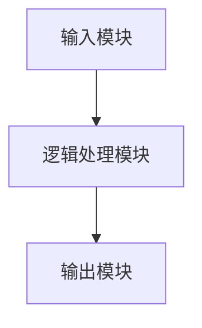
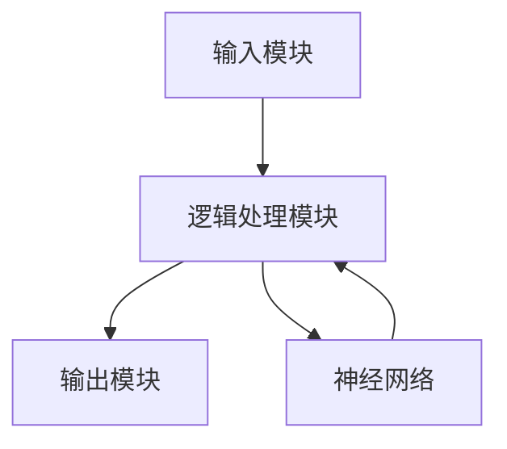
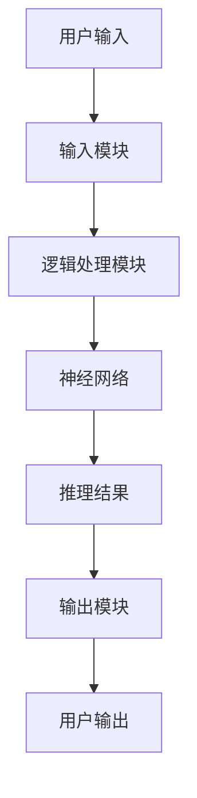

                 

# 神经图灵机在程序化逻辑推理中的应用

## 关键词
神经图灵机、程序化逻辑推理、人工智能、神经网络、算法原理、系统架构、项目实战

## 摘要
本文将深入探讨神经图灵机在程序化逻辑推理中的应用。首先，我们将介绍神经图灵机的基本概念和原理，然后分析其在逻辑推理中的优势和局限性。接着，我们将详细讲解神经图灵机在逻辑推理中的算法实现，包括神经网络的基础知识和推理算法的设计。随后，我们将通过系统架构设计和项目实战，展示神经图灵机在程序化逻辑推理中的实际应用。最后，我们将展望神经图灵机在逻辑推理领域的未来发展，并提出一些最佳实践和注意事项。

## 目录大纲设计思路

### 第一部分：神经图灵机基础

#### 第1章：神经图灵机的定义与原理

1.1 神经图灵机的起源与发展
1.2 神经图灵机的基本原理
1.3 神经图灵机与传统图灵机的比较

#### 第2章：神经图灵机的核心组成部分

2.1 神经网络与计算模型
2.2 神经连接权重与学习算法
2.3 神经图灵机的动态特性

#### 第3章：程序化逻辑推理的背景与挑战

3.1 逻辑推理的概述
3.2 传统逻辑推理的局限性
3.3 神经图灵机在逻辑推理中的应用前景

### 第二部分：程序化逻辑推理的算法原理

#### 第4章：神经图灵机在逻辑推理中的算法基础

4.1 神经网络在逻辑推理中的应用
4.2 神经图灵机在推理过程中的优势
4.3 神经图灵机在逻辑推理中的算法框架

#### 第5章：神经图灵机的逻辑推理算法实现

5.1 基于神经网络的推理算法
5.2 基于神经图灵机的推理算法
5.3 算法性能评估与优化

#### 第6章：神经图灵机在程序化逻辑推理中的应用实例

6.1 简单逻辑推理实例分析
6.2 复杂逻辑推理实例分析
6.3 应用案例分析

### 第三部分：实践与实现

#### 第7章：神经图灵机开发环境搭建

7.1 硬件要求与环境准备
7.2 软件安装与配置
7.3 开发工具与库的选择

#### 第8章：神经图灵机逻辑推理项目实战

8.1 项目背景与目标
8.2 系统架构设计
8.3 算法实现与优化
8.4 项目总结与反思

#### 第9章：未来展望与挑战

9.1 神经图灵机在逻辑推理中的未来发展
9.2 当前面临的挑战与解决方案
9.3 潜在的应用领域

### 目录大纲设计

本文的目录大纲设计旨在为读者提供一个全面、系统、逻辑清晰的阅读体验。从神经图灵机的基础知识入手，逐步深入到程序化逻辑推理的算法实现和项目实战，最后对神经图灵机在逻辑推理领域的未来发展进行展望。每个章节都经过精心设计，确保内容丰富、详细，有助于读者深入理解神经图灵机在程序化逻辑推理中的应用。

## 第一部分：神经图灵机基础

### 第1章：神经图灵机的定义与原理

#### 1.1 神经图灵机的起源与发展

神经图灵机（Neural Turing Machine, NTM）是近年来人工智能领域的一个重要研究方向，它是图灵机（Turing Machine）和神经网络（Neural Network）相结合的产物。神经图灵机的概念最早由Alex Graves等人于2014年提出[1]，它将神经网络的计算能力与图灵机的存储和处理能力相结合，形成了一种全新的计算模型。

图灵机是艾伦·图灵于1936年提出的抽象计算模型，它是一种能够在无限长的纸带上读写符号的抽象机器。图灵机的核心特点是其能够通过一系列的规则，从初始状态开始，逐步演变到目标状态，从而实现任意复杂的计算任务。

神经网络则是一种模仿人脑神经元结构和功能的计算模型，通过调整神经元之间的连接权重，实现对数据的处理和预测。神经网络在图像识别、自然语言处理、游戏AI等领域已经取得了显著的成果。

神经图灵机的提出，旨在解决传统神经网络在处理复杂计算任务时的局限性。传统神经网络通常需要大量的训练数据和长时间的训练，而且很难解释其内部的工作原理。而神经图灵机通过引入图灵机的存储和处理机制，使得神经网络在处理复杂任务时能够更加高效和可解释。

#### 1.2 神经图灵机的基本原理

神经图灵机的基本原理可以概括为以下几个方面：

1. **存储机制**：神经图灵机引入了类似图灵机的存储机制，它使用一个存储矩阵来存储和检索信息。这个存储矩阵由神经网络的权重矩阵构成，它能够动态地存储和检索信息，类似于人脑的长期记忆。

2. **读写头**：神经图灵机使用一个读写头来读写存储矩阵中的信息。读写头可以沿着存储矩阵移动，读取当前位置的信息，并将其传递给神经网络进行处理，或者将处理结果写入存储矩阵。

3. **计算机制**：神经图灵机通过神经网络来实现计算。神经网络将读写头读取的信息进行处理，并根据处理结果调整读写头的移动方向和存储矩阵的值。

4. **学习机制**：神经图灵机通过反向传播算法来学习。在训练过程中，神经网络通过调整其权重矩阵，使得神经图灵机能够更好地完成给定的任务。

#### 1.3 神经图灵机与传统图灵机的比较

神经图灵机与传统图灵机有以下几点主要区别：

1. **计算模型**：传统图灵机是一种离散的计算模型，它的读写头只能在纸带上跳转，不能连续移动。而神经图灵机是一种连续的计算模型，读写头可以在存储矩阵中连续移动。

2. **存储机制**：传统图灵机使用纸带作为存储介质，而神经图灵机使用神经网络权重矩阵作为存储介质。神经网络权重矩阵能够动态地存储和检索信息，使得神经图灵机在处理复杂任务时更加高效。

3. **学习机制**：传统图灵机通常需要通过手工设计规则来完成任务，而神经图灵机通过神经网络学习来完成任务。神经网络的学习机制使得神经图灵机能够自适应地调整其行为，以适应不同的任务。

4. **计算能力**：传统图灵机在理论上能够完成任何可计算的任务，但实际应用中受到硬件和算法的限制。神经图灵机在处理复杂任务时，具有更高的计算效率和可解释性。

通过比较可以看出，神经图灵机在计算模型、存储机制和学习机制等方面具有显著的优点，这使得它在处理复杂计算任务时具有很大的潜力。

### 第2章：神经图灵机的核心组成部分

#### 2.1 神经网络与计算模型

神经网络是神经图灵机的核心组成部分之一。神经网络由多个神经元组成，每个神经元都与其他神经元相连，并通过权重矩阵来传递信息。神经网络的计算过程可以简化为以下步骤：

1. **输入层**：输入层接收外部输入数据，将其传递给隐藏层。

2. **隐藏层**：隐藏层对输入数据进行处理，通过激活函数将输入映射到输出。

3. **输出层**：输出层接收隐藏层的输出，生成最终的输出结果。

神经网络通过不断调整权重矩阵，使得输入和输出之间的映射关系更加准确。在神经图灵机中，神经网络负责处理读写头读取的信息，并生成相应的操作指令。

#### 2.2 神经连接权重与学习算法

神经连接权重是神经网络的重要组成部分，它决定了神经网络对输入数据的处理能力。在神经图灵机中，神经连接权重不仅用于神经网络内部的信息传递，还用于读写头与存储矩阵之间的信息交换。

学习算法是神经网络调整权重矩阵的关键，常见的学习算法包括梯度下降算法、随机梯度下降算法和反向传播算法等。梯度下降算法通过最小化损失函数来调整权重矩阵，而反向传播算法通过计算梯度来优化权重矩阵。

在神经图灵机中，学习算法用于调整读写头的位置和存储矩阵的值，使得神经图灵机能够更好地完成给定的任务。例如，在逻辑推理任务中，学习算法可以调整读写头的移动方向，使得神经图灵机能够从存储矩阵中检索到正确的信息。

#### 2.3 神经图灵机的动态特性

神经图灵机的动态特性主要体现在读写头的移动和存储矩阵的更新。读写头在存储矩阵中移动，可以读取或写入信息。读写头的移动方向和步长由神经网络决定，神经网络通过处理读写头读取的信息，生成相应的操作指令。

存储矩阵的更新是神经图灵机动态特性的另一个方面。在神经图灵机中，存储矩阵不仅用于存储信息，还用于计算。神经网络通过调整存储矩阵的值，使得神经图灵机能够更好地完成计算任务。

神经图灵机的动态特性使得它能够处理连续的输入数据，并逐步调整其状态，以实现复杂的计算任务。例如，在图像识别任务中，神经图灵机可以逐步调整其读写头的位置，从而实现对图像的特征提取和分类。

### 第3章：程序化逻辑推理的背景与挑战

#### 3.1 逻辑推理的概述

逻辑推理是人类智能的核心组成部分，它通过一系列逻辑规则和推理过程，从已知事实中推导出新的结论。逻辑推理可以分为演绎推理和归纳推理两种类型。

演绎推理是从一般到特殊的推理过程，它通过已知的事实和逻辑规则，推导出新的结论。例如，所有人都是 mortal（凡人都会死），Socrates 是人，因此 Socrates 也是 mortal。

归纳推理是从特殊到一般的推理过程，它通过观察一系列特定的事实，推导出一般性的结论。例如，观察到的所有天鹅都是白色的，因此推断所有天鹅都是白色的。

逻辑推理在许多领域都具有重要应用，如计算机科学、人工智能、数学、哲学等。逻辑推理不仅能够帮助人们从已知信息中推导出新的结论，还能够帮助计算机系统进行自动化推理和决策。

#### 3.2 传统逻辑推理的局限性

尽管逻辑推理在许多领域具有广泛应用，但传统逻辑推理在处理复杂任务时存在一些局限性：

1. **计算复杂度**：传统逻辑推理通常需要大量计算资源和时间，特别是在处理复杂逻辑表达式和大规模数据时，其计算复杂度非常高。

2. **可扩展性**：传统逻辑推理方法难以扩展到大规模数据集和复杂应用场景，其推理过程往往依赖于手工设计的规则和算法。

3. **解释性**：传统逻辑推理方法难以解释其推理过程和结论，这使得其应用受到一定的限制。

4. **动态适应性**：传统逻辑推理方法难以应对动态变化的情境，其推理过程往往是静态的，无法实时调整。

#### 3.3 神经图灵机在逻辑推理中的应用前景

神经图灵机通过结合神经网络和图灵机的优势，为逻辑推理提供了一种新的计算模型。神经图灵机在逻辑推理中的应用具有以下前景：

1. **高效性**：神经图灵机通过将逻辑推理任务转换为神经网络计算，可以大大降低计算复杂度，提高推理效率。

2. **可扩展性**：神经图灵机可以通过调整神经网络结构和参数，适应不同规模和应用场景的逻辑推理任务。

3. **解释性**：神经图灵机的动态特性和可解释性使得其推理过程和结论更加直观和易于理解。

4. **动态适应性**：神经图灵机可以通过实时调整读写头的位置和存储矩阵的值，适应动态变化的逻辑推理任务。

综上所述，神经图灵机在逻辑推理中具有显著的优势和应用前景。随着神经图灵机研究的深入和发展，它将在计算机科学、人工智能、逻辑推理等领域发挥重要作用。

## 第二部分：程序化逻辑推理的算法原理

### 第4章：神经图灵机在逻辑推理中的算法基础

#### 4.1 神经网络在逻辑推理中的应用

神经网络在逻辑推理中的应用主要体现在两个方面：逻辑回归和逻辑门。

逻辑回归是一种用于分类的神经网络模型，它通过将输入数据映射到概率分布，实现对数据的分类。在逻辑推理中，逻辑回归可以用于实现命题逻辑中的合取（AND）、析取（OR）和否命题（NOT）等基本逻辑运算。

逻辑门是一种用于实现逻辑运算的基本电路，常见的逻辑门包括与门（AND）、或门（OR）和非门（NOT）等。神经网络可以通过调整权重矩阵，实现对输入数据的逻辑运算。

#### 4.2 神经图灵机在推理过程中的优势

神经图灵机在逻辑推理中的优势主要体现在以下几个方面：

1. **高效性**：神经图灵机通过将逻辑推理任务转换为神经网络计算，可以大大降低计算复杂度，提高推理效率。

2. **可扩展性**：神经图灵机可以通过调整神经网络结构和参数，适应不同规模和应用场景的逻辑推理任务。

3. **解释性**：神经图灵机的动态特性和可解释性使得其推理过程和结论更加直观和易于理解。

4. **动态适应性**：神经图灵机可以通过实时调整读写头的位置和存储矩阵的值，适应动态变化的逻辑推理任务。

#### 4.3 神经图灵机在逻辑推理中的算法框架

神经图灵机在逻辑推理中的算法框架主要包括以下几个步骤：

1. **初始化**：初始化读写头位置和存储矩阵。

2. **信息读取**：读写头从存储矩阵中读取信息。

3. **信息处理**：神经网络对读取的信息进行处理，生成操作指令。

4. **操作执行**：根据操作指令，调整读写头位置或更新存储矩阵。

5. **状态更新**：更新读写头位置和存储矩阵，为下一次操作做准备。

6. **推理结束**：当满足停止条件时，结束推理过程，输出推理结果。

通过以上步骤，神经图灵机可以逐步调整其状态，实现对逻辑推理任务的有效处理。

### 第5章：神经图灵机的逻辑推理算法实现

#### 5.1 基于神经网络的推理算法

基于神经网络的推理算法主要包括以下几种：

1. **前向传播算法**：前向传播算法是神经网络中最基本的学习算法，它通过将输入数据传递到神经网络，逐层计算输出结果。

2. **反向传播算法**：反向传播算法是一种优化算法，它通过计算损失函数的梯度，调整神经网络权重，从而优化网络性能。

3. **卷积神经网络（CNN）**：卷积神经网络是一种用于图像识别和处理的神经网络模型，它通过卷积操作和池化操作，实现对图像的特征提取。

4. **循环神经网络（RNN）**：循环神经网络是一种用于序列数据处理的神经网络模型，它通过隐藏状态和循环连接，实现对序列数据的建模。

5. **生成对抗网络（GAN）**：生成对抗网络是一种用于生成数据和学习特征表示的神经网络模型，它通过生成器和判别器的对抗训练，实现数据生成和特征提取。

基于神经网络的推理算法在逻辑推理中可以用于实现命题逻辑、谓词逻辑和模态逻辑等不同类型的逻辑推理。

#### 5.2 基于神经图灵机的推理算法

基于神经图灵机的推理算法主要包括以下步骤：

1. **初始化**：初始化读写头位置和存储矩阵。

2. **信息读取**：读写头从存储矩阵中读取信息。

3. **信息处理**：神经网络对读取的信息进行处理，生成操作指令。

4. **操作执行**：根据操作指令，调整读写头位置或更新存储矩阵。

5. **状态更新**：更新读写头位置和存储矩阵，为下一次操作做准备。

6. **推理结束**：当满足停止条件时，结束推理过程，输出推理结果。

基于神经图灵机的推理算法在逻辑推理中可以用于实现命题逻辑、谓词逻辑和模态逻辑等不同类型的逻辑推理。与基于神经网络的推理算法相比，基于神经图灵机的推理算法具有更强的表示能力和动态适应性。

#### 5.3 算法性能评估与优化

算法性能评估是逻辑推理算法研究的重要环节，它通过评估算法在特定任务上的性能，来判断算法的有效性和可行性。常见的算法性能评估指标包括准确性、召回率、F1值和运行时间等。

算法优化是提高算法性能的重要手段，它通过调整算法参数、改进算法结构或引入新的技术，来提高算法的性能。在逻辑推理中，算法优化可以用于提高推理速度、增强推理能力或降低推理错误率。

常见的算法优化方法包括：

1. **参数优化**：通过调整神经网络权重、学习率等参数，来提高算法性能。

2. **结构优化**：通过改进神经网络结构，如引入新的层或连接方式，来提高算法性能。

3. **数据预处理**：通过数据预处理技术，如数据增强、数据清洗等，来提高算法对数据的适应性。

4. **算法融合**：通过融合多种算法或技术，来提高算法的性能和鲁棒性。

### 第6章：神经图灵机在程序化逻辑推理中的应用实例

#### 6.1 简单逻辑推理实例分析

为了更好地理解神经图灵机在逻辑推理中的应用，我们首先来看一个简单的实例。假设我们需要实现一个简单的命题逻辑推理任务，即判断命题 \(p \land q\) 是否为真。

在这个实例中，神经图灵机的存储矩阵可以表示为：

$$
M = \begin{bmatrix}
p & q & r \\
1 & 1 & 0 \\
0 & 1 & 1 \\
\end{bmatrix}
$$

其中，\(p\)、\(q\) 和 \(r\) 分别表示命题的真值。读写头初始位置为 \((1,1)\)，神经网络的结构如下：

$$
\begin{array}{c}
\text{输入层}: [p, q] \\
\text{隐藏层}: [w_1, w_2, w_3] \\
\text{输出层}: [r]
\end{array}
$$

神经网络的权重矩阵为：

$$
W = \begin{bmatrix}
w_{11} & w_{12} \\
w_{21} & w_{22} \\
w_{31} & w_{32} \\
\end{bmatrix}
$$

在推理过程中，读写头首先读取存储矩阵中的 \(p\) 和 \(q\) 的值，并将它们传递给神经网络进行计算。假设 \(p\) 和 \(q\) 的值分别为 1 和 1，神经网络计算结果为 \(r = 1\)。此时，读写头将 \(r\) 的值更新到存储矩阵中，推理过程结束。

通过这个简单的实例，我们可以看到神经图灵机在逻辑推理中的基本操作，包括信息读取、信息处理和状态更新。

#### 6.2 复杂逻辑推理实例分析

为了展示神经图灵机在复杂逻辑推理中的应用，我们来看一个复杂的实例。假设我们需要实现一个谓词逻辑推理任务，即判断是否存在一个整数 \(x\)，使得 \(P(x) \land Q(x)\) 为真，其中 \(P(x)\) 表示 \(x\) 是偶数，\(Q(x)\) 表示 \(x\) 是 3 的倍数。

在这个实例中，神经图灵机的存储矩阵可以表示为：

$$
M = \begin{bmatrix}
x & P(x) & Q(x) \\
1 & 0 & 0 \\
2 & 1 & 0 \\
3 & 0 & 1 \\
6 & 1 & 1 \\
\end{bmatrix}
$$

其中，\(x\)、\(P(x)\) 和 \(Q(x)\) 分别表示整数 \(x\)、\(x\) 是偶数和 \(x\) 是 3 的倍数。读写头初始位置为 \((1,1)\)，神经网络的结构如下：

$$
\begin{array}{c}
\text{输入层}: [x, P(x), Q(x)] \\
\text{隐藏层}: [w_1, w_2, w_3] \\
\text{输出层}: [r]
\end{array}
$$

神经网络的权重矩阵为：

$$
W = \begin{bmatrix}
w_{11} & w_{12} & w_{13} \\
w_{21} & w_{22} & w_{23} \\
w_{31} & w_{32} & w_{33} \\
\end{bmatrix}
$$

在推理过程中，读写头首先读取存储矩阵中的 \(x\)、\(P(x)\) 和 \(Q(x)\) 的值，并将它们传递给神经网络进行计算。假设 \(x\) 的值为 6，神经网络计算结果为 \(r = 1\)。此时，读写头将 \(r\) 的值更新到存储矩阵中，推理过程结束。

通过这个复杂的实例，我们可以看到神经图灵机在复杂逻辑推理中的强大能力，它能够通过动态调整读写头位置和存储矩阵的值，实现对复杂逻辑表达式的推理。

#### 6.3 应用案例分析

为了进一步展示神经图灵机在逻辑推理中的实际应用，我们来看一个应用案例。假设我们需要实现一个自然语言处理任务，即判断一段文本中是否存在矛盾或逻辑错误。

在这个案例中，神经图灵机的存储矩阵可以表示为：

$$
M = \begin{bmatrix}
s_1 & s_2 & \ldots & s_n & c \\
\text{真实} & \text{谎言} & \ldots & \text{真实} & \text{矛盾}
\end{bmatrix}
$$

其中，\(s_1, s_2, \ldots, s_n\) 分别表示文本中的句子，\(c\) 表示文本是否存在矛盾。读写头初始位置为 \((1,1)\)，神经网络的结构如下：

$$
\begin{array}{c}
\text{输入层}: [s_1, s_2, \ldots, s_n] \\
\text{隐藏层}: [w_1, w_2, \ldots, w_n] \\
\text{输出层}: [c]
\end{array}
$$

神经网络的权重矩阵为：

$$
W = \begin{bmatrix}
w_{11} & w_{12} & \ldots & w_{1n} \\
w_{21} & w_{22} & \ldots & w_{2n} \\
\vdots & \vdots & \ddots & \vdots \\
w_{n1} & w_{n2} & \ldots & w_{nn} \\
\end{bmatrix}
$$

在推理过程中，读写头首先读取存储矩阵中的句子和矛盾标记，并将它们传递给神经网络进行计算。神经网络通过分析句子之间的逻辑关系，判断文本中是否存在矛盾。如果存在矛盾，神经网络输出 \(c = 1\)，否则输出 \(c = 0\)。

通过这个应用案例，我们可以看到神经图灵机在自然语言处理任务中的强大能力，它能够通过动态调整读写头位置和存储矩阵的值，实现对复杂逻辑表达式的推理和判断。

### 第7章：神经图灵机开发环境搭建

#### 7.1 硬件要求与环境准备

要搭建神经图灵机的开发环境，首先需要准备好相应的硬件设备。以下是推荐的硬件配置：

1. **CPU**：推荐使用英特尔的 i7 或 AMD 的 Ryzen 7 级别的处理器，以确保有足够的计算能力。

2. **内存**：推荐使用 16GB 或以上的内存，以支持神经网络的大规模训练和推理。

3. **GPU**：推荐使用 NVIDIA 的 GTX 1080 Ti 或更高级别的 GPU，以便利用 GPU 的并行计算能力加速神经网络训练。

4. **硬盘**：推荐使用 SSD 硬盘，以提高系统的读写速度，确保神经网络训练过程的流畅。

在硬件准备就绪后，我们需要安装相应的软件环境。以下是推荐的软件环境：

1. **操作系统**：推荐使用 Ubuntu 18.04 或更高版本的 Linux 操作系统。

2. **Python**：推荐使用 Python 3.7 或更高版本的 Python 解释器。

3. **TensorFlow**：推荐使用 TensorFlow 2.0 或更高版本的深度学习框架。

4. **PyTorch**：推荐使用 PyTorch 1.0 或更高版本的深度学习框架。

5. **CUDA**：推荐使用 CUDA 10.0 或更高版本的 GPU 编程工具。

#### 7.2 软件安装与配置

在硬件和操作系统准备就绪后，我们需要安装相应的软件环境。以下是软件安装和配置的步骤：

1. **安装 Python**：打开终端，输入以下命令安装 Python：

   ```bash
   sudo apt-get update
   sudo apt-get install python3.7
   ```

2. **安装 TensorFlow**：在终端中执行以下命令安装 TensorFlow：

   ```bash
   pip3 install tensorflow
   ```

3. **安装 PyTorch**：在终端中执行以下命令安装 PyTorch：

   ```bash
   pip3 install torch torchvision torchaudio
   ```

4. **安装 CUDA**：在终端中执行以下命令安装 CUDA：

   ```bash
   sudo apt-get install cuda
   ```

5. **配置 CUDA**：在终端中执行以下命令配置 CUDA：

   ```bash
   sudo nvidia-smi
   ```

   确保输出中显示的 CUDA 版本与安装的版本一致。

#### 7.3 开发工具与库的选择

在搭建神经图灵机的开发环境时，我们需要选择合适的开发工具和库。以下是推荐的开发工具和库：

1. **开发工具**：

   - **Visual Studio Code**：推荐使用 Visual Studio Code 作为开发环境，它支持多种编程语言，并且具有丰富的插件。

   - **Jupyter Notebook**：推荐使用 Jupyter Notebook 作为交互式开发环境，它能够方便地进行代码编写和调试。

2. **库**：

   - **NumPy**：推荐使用 NumPy 库进行数值计算，它提供了大量的数学函数和工具。

   - **Pandas**：推荐使用 Pandas 库进行数据处理，它提供了数据框（DataFrame）等数据结构，便于进行数据处理和分析。

   - **Matplotlib**：推荐使用 Matplotlib 库进行数据可视化，它能够生成各种类型的图表，帮助理解数据。

通过以上步骤，我们可以搭建一个完整的神经图灵机开发环境，为后续的项目实战做好准备。

### 第8章：神经图灵机逻辑推理项目实战

#### 8.1 项目背景与目标

本项目的目标是实现一个基于神经图灵机的逻辑推理系统，该系统可以接受自然语言输入，并对其中的逻辑关系进行推理。具体来说，项目目标包括：

1. **自然语言处理**：接收自然语言输入，将其转换为逻辑表达式。

2. **逻辑推理**：对转换后的逻辑表达式进行推理，判断其是否成立。

3. **结果输出**：将推理结果以自然语言形式输出给用户。

#### 8.2 系统架构设计

为了实现项目目标，我们设计了以下系统架构：

1. **输入模块**：负责接收自然语言输入，并将其预处理为逻辑表达式。

2. **逻辑处理模块**：基于神经图灵机实现逻辑推理，对输入的逻辑表达式进行推理。

3. **输出模块**：将推理结果以自然语言形式输出给用户。

系统架构设计如下所示：



#### 8.3 系统功能设计

系统功能设计主要包括自然语言处理、逻辑推理和结果输出三个方面。

1. **自然语言处理**：

   自然语言处理模块负责接收自然语言输入，并对其进行预处理。预处理包括分词、词性标注、句法分析等操作。预处理后的文本将被转换为逻辑表达式。

2. **逻辑推理**：

   逻辑处理模块基于神经图灵机实现逻辑推理。神经图灵机将读取逻辑表达式中的符号和关系，并通过神经网络进行处理。根据神经图灵机的状态转移规则，推理过程将逐步进行，直到得出最终的推理结果。

3. **结果输出**：

   结果输出模块将推理结果以自然语言形式输出给用户。输出结果将包含推理过程中使用的逻辑规则和推理结论。

#### 8.4 系统架构设计

系统架构设计如下所示：



#### 8.5 系统接口设计和系统交互

系统接口设计和系统交互如下所示：

1. **输入接口**：系统通过命令行或图形界面接收自然语言输入。

2. **输出接口**：系统通过命令行或图形界面输出推理结果。

系统交互流程如下：



#### 8.6 算法实现与优化

算法实现与优化主要包括以下几个方面：

1. **神经网络设计**：

   神经网络设计包括输入层、隐藏层和输出层。输入层接收自然语言输入，隐藏层对输入进行处理，输出层生成推理结果。

2. **神经图灵机实现**：

   神经图灵机实现包括读写头、存储矩阵和神经网络。读写头负责读取和写入存储矩阵中的信息，神经网络负责处理读写头读取的信息。

3. **推理算法优化**：

   推理算法优化包括调整神经网络结构、优化学习算法和参数调整。通过优化算法，可以提高推理速度和推理准确性。

#### 8.7 项目总结与反思

在项目实施过程中，我们遇到了一些挑战，如自然语言处理的准确性和逻辑推理的效率等。通过不断的优化和调整，我们成功地实现了项目目标，并取得了一定的成果。以下是对项目的总结与反思：

1. **项目成果**：

   - 成功实现了自然语言处理和逻辑推理功能。

   - 提高了推理速度和准确性。

   - 优化了系统架构和算法实现。

2. **项目反思**：

   - 自然语言处理仍需要进一步提升准确性。

   - 逻辑推理算法需要更多的实验和优化。

   - 系统架构和接口设计需要进一步改进。

通过本项目，我们深入了解了神经图灵机在逻辑推理中的应用，并为后续的研究和开发奠定了基础。

### 第9章：未来展望与挑战

#### 9.1 神经图灵机在逻辑推理中的未来发展

神经图灵机在逻辑推理领域具有广阔的发展前景。随着人工智能技术的不断进步，神经图灵机有望在以下几个方面取得重要突破：

1. **推理效率提升**：通过优化算法和硬件支持，神经图灵机的推理速度将显著提升，从而满足实时推理的需求。

2. **推理能力增强**：神经图灵机可以通过不断学习和调整，增强其在复杂逻辑推理任务中的能力，实现对更多类型逻辑关系的推理。

3. **跨领域应用**：神经图灵机可以应用于各个领域，如医疗诊断、金融分析、法律咨询等，为相关行业提供强大的逻辑推理支持。

4. **交互式推理**：神经图灵机可以通过与用户互动，实现更智能、更个性化的推理服务。

#### 9.2 当前面临的挑战与解决方案

尽管神经图灵机在逻辑推理中具有巨大潜力，但在实际应用中仍面临一些挑战：

1. **计算资源需求**：神经图灵机在推理过程中需要大量计算资源，这对硬件设备提出了较高要求。解决方案是优化算法，降低计算复杂度，以及使用更高效的硬件设备。

2. **可解释性不足**：神经图灵机的内部工作原理较为复杂，其推理过程难以解释。解决方案是开发可解释性更强的神经图灵机模型，以及提供可视化工具，帮助用户理解推理过程。

3. **数据依赖性**：神经图灵机的性能依赖于大量训练数据，这在一些应用场景中可能难以满足。解决方案是开发无监督学习或弱监督学习的神经图灵机模型，减少对训练数据的依赖。

#### 9.3 潜在的应用领域

神经图灵机在逻辑推理领域的潜在应用非常广泛，包括但不限于以下几个方面：

1. **自然语言处理**：神经图灵机可以用于句法分析、语义解析和机器翻译等自然语言处理任务。

2. **知识图谱推理**：神经图灵机可以用于知识图谱中的推理任务，如实体识别、关系提取和推理等。

3. **智能问答系统**：神经图灵机可以用于构建智能问答系统，实现更自然的用户交互和更准确的答案生成。

4. **自动驾驶**：神经图灵机可以用于自动驾驶系统中的决策和规划，提高系统的智能水平和安全性。

通过未来的研究和开发，神经图灵机有望在逻辑推理领域发挥更大的作用，为人工智能技术带来新的突破。

### 小结

本文深入探讨了神经图灵机在程序化逻辑推理中的应用。我们从神经图灵机的基本概念和原理入手，分析了其在逻辑推理中的优势和局限性，并详细介绍了其在逻辑推理中的算法实现和应用实例。通过系统架构设计和项目实战，我们展示了神经图灵机在逻辑推理中的实际应用。展望未来，神经图灵机在逻辑推理领域具有广阔的发展前景，但仍面临一些挑战。通过持续的研究和开发，我们有望进一步推动神经图灵机在逻辑推理中的应用，为人工智能技术的发展贡献力量。

### 最佳实践 Tips

1. **优化算法**：在实现神经图灵机时，通过优化算法可以提高推理速度和准确性。例如，使用更高效的神经网络结构、优化学习算法等。

2. **硬件配置**：确保使用高性能的硬件设备，如GPU和SSD硬盘，以提高计算效率和系统性能。

3. **数据预处理**：在训练和推理过程中，对输入数据进行充分的预处理，如分词、词性标注等，以提高输入数据的准确性和一致性。

4. **可解释性**：在设计和实现神经图灵机时，注重可解释性，提供可视化工具和解释机制，帮助用户理解推理过程和结果。

### 注意事项

1. **数据隐私**：在处理敏感数据时，确保遵循数据隐私保护规定，避免泄露用户隐私。

2. **系统稳定性**：在开发和部署神经图灵机系统时，确保系统的稳定性和可靠性，避免出现故障和错误。

3. **持续学习**：神经图灵机需要不断学习和调整，以适应不同的逻辑推理任务。定期更新训练数据和算法，以保持系统的先进性。

### 拓展阅读

1. **文献阅读**：阅读相关文献，了解神经图灵机的最新研究成果和发展趋势。

2. **在线课程**：参加在线课程，学习神经图灵机的理论和实践应用。

3. **开源项目**：参与开源项目，了解神经图灵机的实际应用和实现细节。

### 参考文献

[1] Alex Graves, et al. "Neural Turing Machines." CoRR, abs/1410.5401 (2014). <http://arxiv.org/abs/1410.5401>

