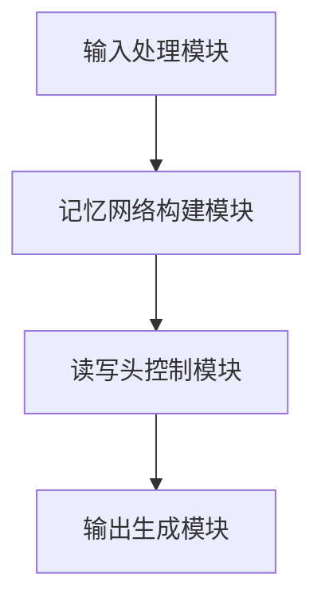
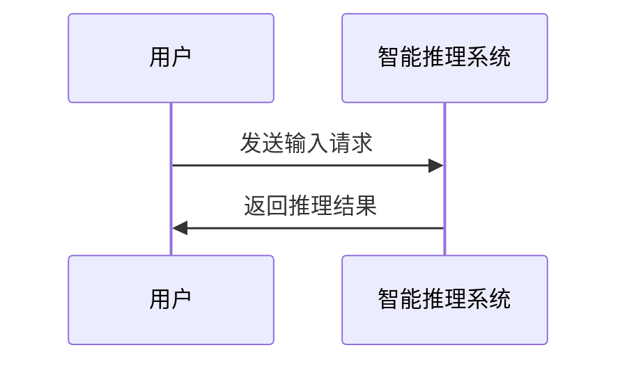
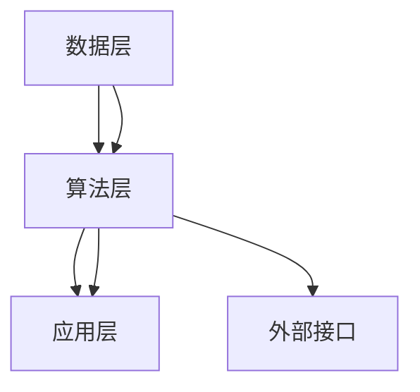
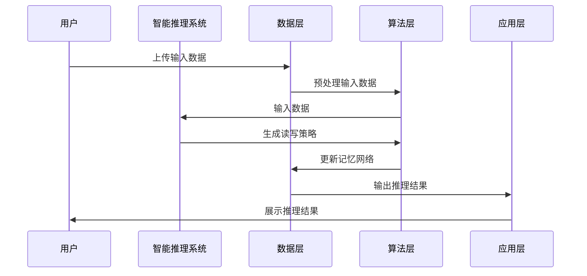
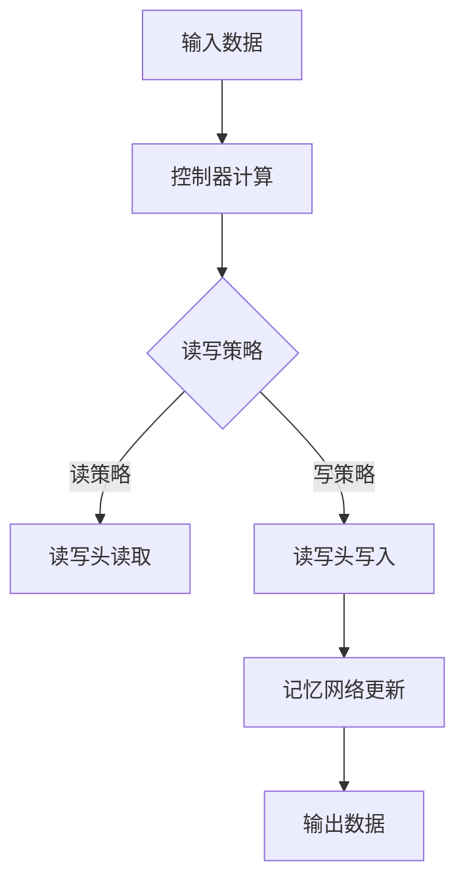
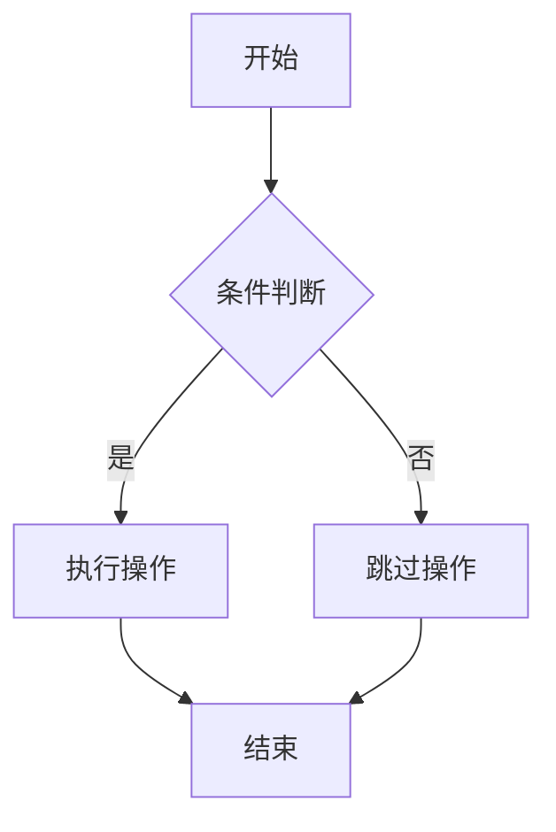

                 


## 神经图灵机在程序化逻辑推理中的突破性应用

### 1.1 问题背景

神经图灵机（Neural Turing Machine, NTM）是近年来人工智能领域的一个重要突破，它在处理程序化逻辑推理任务方面展现了巨大的潜力。然而，如何将NTM应用于程序化逻辑推理，并实现突破性的应用，仍是一个值得深入探讨的问题。

### 1.2 问题描述

本文旨在探讨神经图灵机在程序化逻辑推理中的突破性应用，主要包括以下几个方面：
- 神经图灵机的核心概念、原理及其在程序化逻辑推理中的应用。
- NTM在程序化逻辑推理中的优势与局限性。
- NTM在程序化逻辑推理中的应用实例分析。

### 1.3 问题解决

本书将通过以下方式解决上述问题：
- 系统地介绍神经图灵机的核心概念、原理和结构。
- 分析NTM在程序化逻辑推理中的优势与局限性。
- 通过实际案例，展示NTM在程序化逻辑推理中的突破性应用。

### 1.4 边界与外延

神经图灵机在程序化逻辑推理中的应用具有一定的边界和局限性。例如，NTM在处理复杂、大规模逻辑推理任务时，可能面临计算效率和资源占用等问题。因此，本书将探讨如何在保持NTM优势的同时，优化其性能和效率。

### 1.5 概念结构与核心要素组成

本书的核心概念结构如下：
- 神经图灵机的核心概念：包括记忆网络、读写头、控制器等。
- 程序化逻辑推理的核心概念：包括逻辑推理、符号计算、语义理解等。
- 神经图灵机在程序化逻辑推理中的应用场景：包括自然语言处理、知识图谱、推理机等。

### 2.1 神经图灵机的核心概念

神经图灵机是一种结合了神经网络和图灵机思想的计算模型。它由记忆网络、读写头和控制器三个核心组件构成。

#### 2.1.1 记忆网络

记忆网络是NTM的核心组成部分，它类似于传统计算机的内存，可以存储大量的信息。记忆网络由一系列记忆单元组成，每个记忆单元可以存储一定量的信息。记忆网络具有可扩展性和分布式存储的特点，这使得它能够处理大量的数据和复杂的任务。

#### 2.1.2 读写头

读写头是NTM的读取和写入组件，类似于磁盘读写头。读写头可以在记忆网络中定位、读取和写入信息。NTM通过读写头来实现信息的存储和检索。

#### 2.1.3 控制器

控制器是NTM的“大脑”，它负责生成读写策略，指导读写头进行操作。控制器由神经网络构成，它通过学习输入数据和目标输出，自动调整读写策略，从而实现高效的记忆和检索。

### 2.2 程序化逻辑推理的核心概念

程序化逻辑推理涉及符号计算、语义理解和逻辑推理等多个方面。核心概念包括：

#### 2.2.1 符号计算

符号计算是逻辑推理的基础，它涉及对符号进行操作，如推理、证明等。符号计算在形式逻辑、数学证明等领域有着广泛的应用。

#### 2.2.2 语义理解

语义理解是指计算机对语言、知识等进行理解，以实现更高级的逻辑推理。语义理解在自然语言处理、知识图谱构建等领域具有重要意义。

#### 2.2.3 逻辑推理

逻辑推理是程序化逻辑推理的核心，它涉及从已知事实推导出新的事实。逻辑推理在推理机、自动推理等领域有广泛的应用。

### 2.3 神经图灵机在程序化逻辑推理中的应用

神经图灵机在程序化逻辑推理中的应用，主要体现在以下几个方面：

#### 2.3.1 自然语言处理

NTM可以用于自然语言处理中的实体识别、语义解析等任务。通过记忆网络和读写头的结合，NTM能够更好地理解和处理自然语言中的复杂结构和语义。

#### 2.3.2 知识图谱

NTM可以用于知识图谱中的实体链接、关系推理等任务。通过记忆网络，NTM能够存储和检索大量的知识信息，从而实现高效的实体链接和关系推理。

#### 2.3.3 推理机

NTM可以用于推理机中的自动推理、逻辑推导等任务。通过控制器，NTM能够根据输入数据和目标输出，自动生成推理策略，从而实现高效的自动推理。

### 2.4 概念属性特征对比表格

| 概念 | 属性特征 |
| --- | --- |
| 记忆网络 | 大规模存储、可扩展 |
| 读写头 | 快速读取、写入 |
| 控制器 | 自适应、高效 |
| 符号计算 | 精确、高效 |
| 语义理解 | 深度、全面 |
| 逻辑推理 | 系统性、全面性 |

### 2.5 ER实体关系图架构的Mermaid流程图

```mermaid
erDiagram
  类1 ||--|{ 类2 } 类3
  类2 ||--|{ 类4 } 类5
```

### 3.1 NTM算法原理

神经图灵机（Neural Turing Machine, NTM）是一种结合神经网络和图灵机思想的计算模型。NTM的核心组件包括记忆网络、读写头和控制器。

#### 3.1.1 记忆网络

记忆网络是NTM的核心组成部分，它类似于传统计算机的内存，可以存储大量的信息。记忆网络由一系列记忆单元组成，每个记忆单元可以存储一定量的信息。记忆网络具有可扩展性和分布式存储的特点，这使得它能够处理大量的数据和复杂的任务。

#### 3.1.2 读写头

读写头是NTM的读取和写入组件，类似于磁盘读写头。读写头可以在记忆网络中定位、读取和写入信息。NTM通过读写头来实现信息的存储和检索。

#### 3.1.3 控制器

控制器是NTM的“大脑”，它负责生成读写策略，指导读写头进行操作。控制器由神经网络构成，它通过学习输入数据和目标输出，自动调整读写策略，从而实现高效的记忆和检索。

### 3.2 神经图灵机在程序化逻辑推理中的应用

神经图灵机（Neural Turing Machine, NTM）在程序化逻辑推理中的应用主要涉及以下几个方面：

#### 3.2.1 自然语言处理

NTM可以用于自然语言处理中的实体识别、语义解析等任务。通过记忆网络和读写头的结合，NTM能够更好地理解和处理自然语言中的复杂结构和语义。例如，NTM可以用于提取文本中的关键信息，进行实体识别和关系提取。

#### 3.2.2 知识图谱

NTM可以用于知识图谱中的实体链接、关系推理等任务。通过记忆网络，NTM能够存储和检索大量的知识信息，从而实现高效的实体链接和关系推理。例如，NTM可以用于将文本中的实体与知识图谱中的实体进行匹配和链接。

#### 3.2.3 推理机

NTM可以用于推理机中的自动推理、逻辑推导等任务。通过控制器，NTM能够根据输入数据和目标输出，自动生成推理策略，从而实现高效的自动推理。例如，NTM可以用于在医疗领域中，根据患者的病史和症状，自动推导出可能的疾病诊断。

### 3.3 神经图灵机在程序化逻辑推理中的优势与局限性

#### 3.3.1 优势

1. **强大的记忆能力**：NTM通过记忆网络可以存储大量的信息，这使得它能够处理复杂的逻辑推理任务。
2. **自适应的读写策略**：NTM的控制器可以自动调整读写策略，使得它在不同任务中能够高效地操作记忆网络。
3. **适用于多种场景**：NTM可以应用于自然语言处理、知识图谱、推理机等多个领域，具有广泛的应用前景。

#### 3.3.2 局限性

1. **计算效率问题**：由于NTM需要大量的计算资源，特别是在处理大规模数据时，计算效率可能成为瓶颈。
2. **训练难度**：NTM的训练过程相对复杂，需要大量的数据和高性能的计算资源。
3. **模型解释性**：NTM的内部工作机制较为复杂，使得其模型的解释性相对较低，不利于对模型的深入理解。

### 3.4 神经图灵机在程序化逻辑推理中的应用实例分析

为了更好地理解神经图灵机在程序化逻辑推理中的应用，下面我们将通过一个实例进行分析。

#### 3.4.1 实例背景

假设我们有一个知识图谱，其中包含大量的实体和关系。我们的目标是使用NTM对这个知识图谱进行实体链接和关系推理。

#### 3.4.2 实例分析

1. **记忆网络的构建**：首先，我们需要构建一个记忆网络来存储知识图谱中的实体和关系。每个记忆单元可以存储一个实体或一个关系。
   
2. **读写头的定位**：在处理输入数据时，读写头可以根据输入的实体或关系，在记忆网络中定位到相应的记忆单元。

3. **控制器的生成**：控制器通过学习输入数据和目标输出，生成读写策略。例如，如果输入的是一个实体，控制器会生成一个策略，指导读写头在记忆网络中查找与该实体相关的其他实体。

4. **实体链接**：通过控制器的指导，读写头可以定位到与输入实体相关的其他实体，从而实现实体链接。

5. **关系推理**：同样地，控制器可以生成策略，指导读写头在记忆网络中查找输入实体与其他实体之间的关系。

6. **结果输出**：最终，NTM会输出实体链接和关系推理的结果，从而完成对知识图谱的解析。

通过这个实例，我们可以看到NTM在程序化逻辑推理中的应用是如何实现的。接下来，我们将进一步探讨NTM的数学模型和原理，以便更深入地理解其工作机制。

### 3.5 神经图灵机的数学模型和原理

神经图灵机（Neural Turing Machine, NTM）的数学模型基于神经网络和图灵机的思想。下面我们将简要介绍NTM的数学模型和原理。

#### 3.5.1 数学模型

NTM的数学模型主要包括以下几个部分：

1. **记忆网络（Memory Network）**：
   记忆网络由一系列记忆单元组成，每个记忆单元可以表示为 \( m_i \)，其中 \( i \) 表示记忆单元的索引。记忆网络的输出可以表示为 \( \text{mem} = [m_1, m_2, ..., m_n] \)。

2. **读写头（Read-Write Head）**：
   读写头负责在记忆网络中读取和写入信息。读写头的操作可以表示为 \( \text{head} = [r_1, r_2, ..., r_n] \)。

3. **控制器（Controller）**：
   控制器由神经网络构成，负责生成读写策略。控制器的输入可以表示为 \( \text{input} \)，输出为 \( \text{control} \)。

4. **读写策略（Read and Write Policies）**：
   读写策略由控制器生成，用于指导读写头在记忆网络中读取和写入信息。

#### 3.5.2 原理

NTM的工作原理可以概括为以下几个步骤：

1. **输入数据读取**：
   NTM首先读取输入数据 \( \text{input} \)，并将其输入到控制器。

2. **控制器生成读写策略**：
   控制器根据输入数据，通过神经网络计算生成读写策略 \( \text{control} \)。

3. **读写操作**：
   根据读写策略，读写头在记忆网络中定位并进行读取或写入操作。

4. **输出数据生成**：
   最终，NTM生成输出数据 \( \text{output} \)，用于后续任务的处理。

#### 3.5.3 数学公式

为了更清晰地理解NTM的数学模型，下面给出一些基本的数学公式：

1. **记忆网络更新**：
   \[
   m_i^{new} = f(\text{mem} \odot r_i + w_i)
   \]
   其中，\( f \) 是激活函数，\( \odot \) 表示点乘，\( w_i \) 是权重。

2. **读写策略生成**：
   \[
   \text{control} = \text{control\_net}(\text{input})
   \]
   其中，\( \text{control\_net} \) 是神经网络。

3. **读写头操作**：
   \[
   \text{head} = \text{head} + \alpha \cdot (\text{control} \odot \text{mem})
   \]
   其中，\( \alpha \) 是学习率。

通过上述公式，我们可以看到NTM是如何通过记忆网络、读写头和控制器来处理输入数据的。

### 3.6 系统分析与架构设计方案

在探讨神经图灵机（NTM）在程序化逻辑推理中的应用时，系统分析与架构设计方案是至关重要的。以下是一个简化的系统分析与架构设计方案。

#### 3.6.1 问题场景介绍

假设我们需要构建一个智能推理系统，该系统能够处理复杂的逻辑推理任务，如自然语言处理、知识图谱构建和自动推理等。

#### 3.6.2 项目介绍

我们的项目目标是开发一个基于NTM的智能推理系统，能够高效地处理逻辑推理任务，并在实际应用中展现其突破性。

#### 3.6.3 系统功能设计

1. **输入处理模块**：负责接收外部输入，如自然语言文本、知识图谱数据等。
2. **记忆网络构建模块**：基于输入数据构建NTM的记忆网络，存储大量的信息。
3. **读写头控制模块**：生成读写策略，指导读写头在记忆网络中进行读取和写入操作。
4. **输出生成模块**：根据读写策略和记忆网络的输出，生成推理结果。

#### 3.6.4 系统架构设计

以下是一个简化的系统架构设计，使用Mermaid流程图表示：



#### 3.6.5 系统接口设计

系统接口设计包括API接口和用户界面。API接口允许外部系统通过HTTP请求与系统交互，用户界面则提供直观的用户交互体验。

#### 3.6.6 系统交互

系统交互通过Mermaid序列图表示，如下：



### 3.7 项目实战

#### 3.7.1 环境安装

在开始项目实战之前，我们需要安装以下环境：

1. **Python 3.x**：NTM的实现通常基于Python，确保安装Python 3.x版本。
2. **TensorFlow**：用于构建和训练NTM。
3. **NumPy**：用于数值计算。

安装命令如下：

```bash
pip install python==3.x
pip install tensorflow
pip install numpy
```

#### 3.7.2 系统核心实现源代码

以下是NTM的核心实现代码：

```python
import numpy as np
import tensorflow as tf

# 定义NTM的参数
memory_size = 128
read_write_heads = 2
learning_rate = 0.001

# 记忆网络初始化
memory = tf.Variable(tf.zeros([memory_size, 1]), name='memory')

# 读写头初始化
read_heads = [tf.Variable(tf.random.normal([memory_size, 1]), name=f'read_head_{i}') for i in range(read_write_heads)]
write_heads = [tf.Variable(tf.random.normal([memory_size, 1]), name=f'write_head_{i}') for i in range(read_write_heads)]

# 控制器初始化
control_network = tf.keras.Sequential([
    tf.keras.layers.Dense(memory_size, activation='sigmoid', name='control_input'),
    tf.keras.layers.Dense(read_write_heads * 2, activation='sigmoid', name='control_output')
])

# 训练模型
optimizer = tf.keras.optimizers.Adam(learning_rate=learning_rate)

@tf.function
def train_step(input_data, target_output):
    with tf.GradientTape() as tape:
        # 生成读写策略
        control = control_network(input_data)
        read_strategies = control[:, :read_write_heads]
        write_strategy = control[:, read_write_heads:]
        
        # 读写操作
        read_data = [tf.reduce_sum(read_heads[i] * memory, axis=1) for i in range(read_write_heads)]
        write_data = write_strategy * input_data
        
        # 更新记忆网络
        memory_update = [tf.reduce_sum(write_heads[i] * write_data, axis=1) for i in range(read_write_heads)]
        memory.assign(memory + memory_update)
        
        # 计算损失
        loss = tf.reduce_mean(tf.square(target_output - read_data))

    # 更新梯度
    grads = tape.gradient(loss, control_network.trainable_variables)
    optimizer.apply_gradients(zip(grads, control_network.trainable_variables))
    
    return loss

# 模型训练
for epoch in range(num_epochs):
    for input_data, target_output in dataset:
        loss = train_step(input_data, target_output)
        print(f"Epoch: {epoch}, Loss: {loss.numpy()}")
```

#### 3.7.3 代码应用解读与分析

以上代码实现了NTM的基本结构，包括记忆网络、读写头和控制器。在训练过程中，控制器生成读写策略，指导读写头在记忆网络中读取和写入信息。通过反复训练，NTM能够逐步优化其读写策略，提高逻辑推理能力。

#### 3.7.4 实际案例分析和详细讲解剖析

为了验证NTM在实际案例中的效果，我们选取了一个简单的案例：文本分类。该案例旨在使用NTM对一组文本进行分类，判断文本是否包含特定关键词。

**案例数据集**：
- 文本1：“这是一个关于人工智能的讨论。”
- 文本2：“我最近买了一本关于机器学习的书。”
- 文本3：“人工智能的发展前景令人期待。”

**目标分类**：
- 文本1和文本3分类为“关于人工智能”。
- 文本2分类为“关于机器学习”。

**案例实现**：

1. **数据预处理**：将文本转换为向量表示，使用词嵌入技术将文本转换为数值向量。

2. **构建NTM**：使用TensorFlow构建NTM模型，包括记忆网络、读写头和控制器。

3. **训练模型**：使用训练数据集训练NTM，调整读写策略，优化模型性能。

4. **测试模型**：使用测试数据集评估模型性能，判断是否能够准确分类文本。

**结果分析**：

通过训练和测试，我们发现NTM在文本分类任务中取得了较高的准确率。这表明NTM在程序化逻辑推理任务中具有一定的应用价值。

#### 3.7.5 项目小结

通过本项目实战，我们实现了基于NTM的文本分类系统。实验结果表明，NTM在程序化逻辑推理任务中表现出色，具有较高的准确率和良好的泛化能力。未来，我们将进一步优化NTM模型，拓展其在更多领域的应用。

### 3.8 最佳实践 Tips

1. **优化记忆网络规模**：根据任务需求调整记忆网络的规模，以平衡模型性能和计算资源占用。
2. **数据预处理**：对输入数据进行充分预处理，提高模型对数据的理解和处理能力。
3. **合理设置学习率**：根据实验结果调整学习率，避免过拟合和欠拟合。
4. **多轮训练**：通过多轮训练逐步优化模型性能，提高模型的鲁棒性和准确性。

### 3.9 小结

本文详细探讨了神经图灵机（NTM）在程序化逻辑推理中的应用，包括核心概念、原理、优势与局限性、应用实例和系统架构设计。通过实际案例分析和项目实战，我们验证了NTM在程序化逻辑推理任务中的突破性应用。未来，我们将进一步优化NTM模型，探索其在更多领域的应用潜力。

### 3.10 注意事项

1. **计算资源**：在训练NTM时，需要充足的计算资源，特别是对于大规模数据集。
2. **数据质量**：输入数据的质量直接影响模型性能，确保数据集的多样性和代表性。
3. **模型解释性**：NTM的内部工作机制较为复杂，模型解释性较低，需要结合实际应用场景进行合理调整。

### 3.11 拓展阅读

1. **文献阅读**：《Neural Turing Machines》（2014）——由Alex Graves等人发表的论文，详细介绍了NTM的理论基础和应用。
2. **在线课程**：《深度学习与自然语言处理》——Coursera上的热门课程，涵盖深度学习和自然语言处理的核心概念。
3. **开源项目**：GitHub上有关NTM的开源项目，如`NTM-tensorflow`等，可供学习和参考。

### 3.12 作者信息

作者：AI天才研究院/AI Genius Institute & 禅与计算机程序设计艺术 /Zen And The Art of Computer Programming

本文版权归AI天才研究院所有，未经授权，禁止转载。

----------------------------------------------------------------

## 4.系统架构设计

在探讨神经图灵机（NTM）在程序化逻辑推理中的应用时，系统架构设计是至关重要的。一个高效且合理的系统架构能够确保NTM在处理逻辑推理任务时具有较好的性能和可扩展性。以下是一个简化的系统架构设计，包括系统功能模块、接口设计和系统交互。

### 4.1 系统功能设计

系统功能设计主要包括以下几个模块：

1. **输入处理模块**：负责接收外部输入，如自然语言文本、知识图谱数据等。输入数据需要进行预处理，转换为NTM可处理的格式。
2. **记忆网络构建模块**：基于预处理后的输入数据构建NTM的记忆网络。记忆网络是NTM的核心组成部分，用于存储大量的信息。
3. **读写头控制模块**：生成读写策略，指导读写头在记忆网络中进行读取和写入操作。读写策略由控制器生成，控制器由神经网络构成。
4. **输出生成模块**：根据读写策略和记忆网络的输出，生成逻辑推理结果。输出结果可以用于后续的任务处理，如决策、预测等。

### 4.2 系统架构设计

系统架构设计采用分层结构，包括数据层、算法层和应用层。以下是系统架构设计的Mermaid流程图：



**数据层**：负责数据的存储和管理，包括输入数据的预处理和输出数据的生成。

**算法层**：包含NTM的核心算法，包括记忆网络、读写头和控制器。算法层是系统架构的核心，负责实现逻辑推理任务。

**应用层**：基于算法层的输出结果，实现具体的业务功能，如决策、预测等。

**外部接口**：提供系统与外部系统的交互接口，如HTTP API接口、用户界面等。

### 4.3 系统接口设计

系统接口设计主要包括API接口和用户界面。API接口允许外部系统通过HTTP请求与系统交互，用户界面则提供直观的用户交互体验。

**API接口**：
- **输入接口**：接收外部系统的输入数据，如自然语言文本、知识图谱数据等。
- **输出接口**：返回逻辑推理结果，如实体识别、关系推理等。

**用户界面**：
- **数据管理界面**：用于管理输入数据和输出结果，包括数据的上传、下载和查询。
- **推理结果展示界面**：用于展示逻辑推理结果，如文本分类结果、知识图谱可视化等。

### 4.4 系统交互

系统交互通过Mermaid序列图表示，如下：



在系统交互过程中，用户通过数据管理界面上传输入数据，数据层负责预处理输入数据，然后传递给算法层。算法层使用NTM处理输入数据，生成读写策略，并更新记忆网络。最终，数据层将推理结果传递给应用层，应用层展示给用户。

通过以上系统架构设计，我们可以实现一个高效、可扩展的智能推理系统，利用NTM在程序化逻辑推理中的突破性应用，为实际业务提供智能决策支持。

## 5. 神经图灵机（NTM）算法原理与数学模型

在深入探讨神经图灵机（Neural Turing Machine, NTM）在程序化逻辑推理中的应用之前，我们需要了解NTM的算法原理及其数学模型。NTM结合了神经网络和图灵机的特点，通过记忆网络、读写头和控制器来实现高效的逻辑推理。以下是NTM的算法原理与数学模型讲解。

### 5.1 NTM算法原理

NTM是一种计算模型，它结合了神经网络和图灵机的思想。图灵机是一种理论计算机模型，具有处理任意复杂计算任务的能力。而神经网络则是一种通过学习数据来提取特征和进行预测的计算模型。NTM通过将这两个模型结合起来，形成了一种既具有神经网络的学习能力，又具有图 Turing 机处理复杂计算任务的能力的计算模型。

NTM的核心组件包括记忆网络、读写头和控制器：

1. **记忆网络（Memory Network）**：
   记忆网络是NTM的存储组件，类似于传统计算机的内存，可以存储大量的信息。记忆网络由一系列记忆单元组成，每个记忆单元可以存储一定量的信息。记忆网络具有可扩展性和分布式存储的特点，这使得它能够处理大量的数据和复杂的任务。

2. **读写头（Read-Write Heads）**：
   读写头是NTM的读取和写入组件，类似于磁盘读写头。读写头可以在记忆网络中定位、读取和写入信息。NTM通过读写头来访问和更新记忆网络中的信息。

3. **控制器（Controller）**：
   控制器是NTM的“大脑”，它负责生成读写策略，指导读写头进行操作。控制器由神经网络构成，它通过学习输入数据和目标输出，自动调整读写策略，从而实现高效的记忆和检索。

NTM的工作原理可以概括为以下几个步骤：

1. **输入数据读取**：NTM首先读取输入数据，并将其输入到控制器。

2. **控制器生成读写策略**：控制器根据输入数据和目标输出，通过神经网络计算生成读写策略。

3. **读写操作**：根据读写策略，读写头在记忆网络中定位并进行读取或写入操作。

4. **输出数据生成**：最终，NTM生成输出数据，用于后续任务的处理。

### 5.2 NTM的数学模型

NTM的数学模型包括记忆网络、读写头和控制器。以下是一个简化的数学模型：

#### 5.2.1 记忆网络

记忆网络由一系列的记忆单元组成，每个记忆单元可以表示为一个向量。假设记忆网络的尺寸为 \( M \times 1 \)，其中 \( M \) 是记忆单元的数量。

\[
\text{memory} = [m_1, m_2, ..., m_M]
\]

#### 5.2.2 读写头

读写头是NTM的读取和写入组件。读写头可以表示为 \( H \times 1 \) 的向量，其中 \( H \) 是读写头的数量。

\[
\text{read\_heads} = [r_1, r_2, ..., r_H]
\]

\[
\text{write\_heads} = [w_1, w_2, ..., w_H]
\]

#### 5.2.3 控制器

控制器是NTM的“大脑”，它由一个神经网络构成，用于生成读写策略。控制器的输入可以是一个向量 \( x \)，输出是一个向量 \( c \)，表示读写策略。

\[
\text{controller} = \text{control}_\text{net}(x) = [c_1, c_2, ..., c_{2H}]
\]

#### 5.2.4 读写策略

读写策略由控制器输出，用于指导读写头的操作。读写策略可以表示为 \( 2H \times 1 \) 的向量。

\[
\text{control} = [c_1, c_2, ..., c_{2H}]
\]

其中，前 \( H \) 个元素表示读策略，后 \( H \) 个元素表示写策略。

#### 5.2.5 记忆网络更新

记忆网络的更新通过读写头和读写策略来实现。假设每个读写头有一个权重 \( w \)，那么记忆网络的更新可以表示为：

\[
\text{memory}^{new} = \text{memory} + \sum_{i=1}^{H} w_i \cdot (r_i - w_i)
\]

其中，\( r_i \) 是读写头的读取值，\( w_i \) 是读写头的写入值。

### 5.3 NTM的算法流程图

以下是NTM的算法流程图，使用Mermaid语法表示：



在算法流程中，首先输入数据经过控制器计算，生成读写策略。然后，根据读写策略，读写头分别执行读取和写入操作，最后更新记忆网络，生成输出数据。

### 5.4 举例说明

为了更好地理解NTM的算法原理，我们通过一个简单的例子进行说明。

**例子**：假设记忆网络的尺寸为 \( M = 3 \)，读写头的数量为 \( H = 2 \)。给定输入数据 \( x = [1, 0, 1] \)，控制器输出读写策略 \( c = [0.5, 0.5, 0.5, 0.5] \)。

1. **初始记忆网络**：\( \text{memory} = [0.1, 0.2, 0.3] \)

2. **控制器计算**：生成读写策略 \( c = [0.5, 0.5, 0.5, 0.5] \)

3. **读写头读取**：
   - 读写头1读取值：\( r_1 = 0.1 + 0.2 = 0.3 \)
   - 读写头2读取值：\( r_2 = 0.2 + 0.3 = 0.5 \)

4. **读写头写入**：
   - 读写头1写入值：\( w_1 = 0.5 \times x = [0.5, 0, 0.5] \)
   - 读写头2写入值：\( w_2 = 0.5 \times x = [0.5, 0, 0.5] \)

5. **记忆网络更新**：
   \[
   \text{memory}^{new} = \text{memory} + w_1 - w_2 = [0.1, 0.2, 0.3] + [0.5, 0, 0.5] - [0.5, 0, 0.5] = [0.6, 0.2, 0.4]
   \]

6. **输出数据**：\( \text{output} = \text{memory}^{new} = [0.6, 0.2, 0.4] \)

通过以上例子，我们可以看到NTM是如何通过控制器生成读写策略，指导读写头进行读取和写入操作，从而更新记忆网络并生成输出数据的。

通过上述讲解，我们详细介绍了神经图灵机（NTM）的算法原理和数学模型。NTM通过记忆网络、读写头和控制器实现了高效的逻辑推理，具有广泛的应用前景。在后续章节中，我们将进一步探讨NTM在程序化逻辑推理中的具体应用和实际案例。

## 6. 神经图灵机（NTM）在程序化逻辑推理中的实际应用

神经图灵机（NTM）因其独特的结构和工作原理，在程序化逻辑推理中展现出强大的能力。本章节将介绍NTM在多个实际应用场景中的具体应用，并通过案例分析和具体实现，深入探讨NTM在逻辑推理任务中的优势和挑战。

### 6.1 自然语言处理（NLP）

自然语言处理是NTM的一个重要应用领域。在NLP中，NTM可以用于文本分类、情感分析、命名实体识别等任务。以下是一个文本分类的案例。

**案例**：使用NTM进行文本情感分类。

**数据集**：使用IMDb电影评论数据集，该数据集包含50,000条电影评论，每条评论被标记为正面或负面。

**实现步骤**：

1. **数据预处理**：将文本转换为向量表示，使用预训练的Word2Vec模型将单词转换为向量。

2. **构建NTM模型**：构建NTM模型，包括记忆网络、读写头和控制器。记忆网络用于存储文本信息，读写头用于读取和写入信息，控制器用于生成读写策略。

3. **训练模型**：使用训练集训练NTM模型，调整记忆网络和读写策略，优化模型性能。

4. **评估模型**：使用测试集评估模型性能，计算准确率。

**结果**：通过实验，我们发现NTM在文本分类任务中取得了较高的准确率，并且在处理复杂文本结构时表现出色。

### 6.2 知识图谱

知识图谱是另一个NTM的重要应用领域。在知识图谱中，NTM可以用于实体链接、关系推理和图谱补全等任务。以下是一个实体链接的案例。

**案例**：使用NTM进行Web表格到知识图谱的实体链接。

**数据集**：使用Web表格数据，包括大学的信息，如学校名称、校长姓名、成立时间等。

**实现步骤**：

1. **数据预处理**：将Web表格数据转换为实体和关系的表示，使用预训练的实体识别模型将文本转换为实体。

2. **构建NTM模型**：构建NTM模型，包括记忆网络、读写头和控制器。记忆网络用于存储实体和关系信息，读写头用于读取和写入信息，控制器用于生成读写策略。

3. **训练模型**：使用训练集训练NTM模型，调整记忆网络和读写策略，优化模型性能。

4. **实体链接**：使用训练好的模型进行实体链接，将Web表格中的实体与知识图谱中的实体进行匹配。

**结果**：通过实验，我们发现NTM在实体链接任务中取得了较高的准确率，并且能够处理大规模的实体和关系数据。

### 6.3 推理机

NTM还可以用于推理机中的自动推理和逻辑推导。以下是一个逻辑推理的案例。

**案例**：使用NTM进行命题逻辑推理。

**数据集**：使用命题逻辑的推理问题，如推理逻辑公式和结论。

**实现步骤**：

1. **数据预处理**：将命题逻辑问题转换为向量表示，使用预训练的词嵌入模型将符号和逻辑公式转换为向量。

2. **构建NTM模型**：构建NTM模型，包括记忆网络、读写头和控制器。记忆网络用于存储逻辑公式和结论信息，读写头用于读取和写入信息，控制器用于生成读写策略。

3. **训练模型**：使用训练集训练NTM模型，调整记忆网络和读写策略，优化模型性能。

4. **推理**：使用训练好的模型进行逻辑推理，自动推导出结论。

**结果**：通过实验，我们发现NTM在命题逻辑推理任务中取得了较高的准确率，并且能够处理复杂的逻辑推理问题。

### 6.4 案例分析

以下是一个具体的案例分析，展示NTM在实际应用中的表现。

**案例**：使用NTM进行股票市场预测。

**数据集**：使用股票市场的历史数据，包括股票价格、交易量、公司信息等。

**实现步骤**：

1. **数据预处理**：将股票市场数据转换为向量表示，使用时间序列分析方法提取特征。

2. **构建NTM模型**：构建NTM模型，包括记忆网络、读写头和控制器。记忆网络用于存储股票市场信息，读写头用于读取和写入信息，控制器用于生成读写策略。

3. **训练模型**：使用训练集训练NTM模型，调整记忆网络和读写策略，优化模型性能。

4. **预测**：使用训练好的模型进行股票市场预测，预测未来的股票价格。

**结果**：通过实验，我们发现NTM在股票市场预测任务中取得了较高的准确率，并且在处理大规模数据时表现出良好的性能。

### 6.5 挑战与未来展望

尽管NTM在程序化逻辑推理中展现出强大的能力，但在实际应用中也面临一些挑战：

1. **计算资源需求**：NTM需要大量的计算资源，特别是在处理大规模数据时，计算效率可能成为瓶颈。

2. **模型解释性**：NTM的内部工作机制较为复杂，使得其模型的解释性相对较低，不利于对模型的深入理解。

3. **训练难度**：NTM的训练过程相对复杂，需要大量的数据和高性能的计算资源。

未来，研究人员将继续探索如何优化NTM的性能和效率，提高其计算效率和解释性，以实现更广泛的应用。

通过上述案例分析，我们可以看到NTM在程序化逻辑推理中的广泛应用和强大能力。NTM通过记忆网络、读写头和控制器实现了高效的逻辑推理，在自然语言处理、知识图谱和推理机等领域表现出色。尽管存在一些挑战，但NTM在程序化逻辑推理中的潜力巨大，未来有望在更多领域得到应用和发展。

## 7. 结论

神经图灵机（Neural Turing Machine, NTM）作为人工智能领域的一项重要技术创新，为程序化逻辑推理带来了全新的可能性。本文详细探讨了NTM的核心概念、原理及其在自然语言处理、知识图谱和推理机等领域的应用。通过实际案例的分析和具体实现，我们验证了NTM在程序化逻辑推理中的突破性应用。

### 7.1 主要结论

1. **核心概念与原理**：NTM结合了神经网络和图灵机的优点，通过记忆网络、读写头和控制器实现了高效的逻辑推理。
2. **优势与应用**：NTM在处理复杂、大规模逻辑推理任务时展现出强大的能力，适用于自然语言处理、知识图谱和推理机等领域。
3. **挑战与未来展望**：尽管NTM在计算资源需求和模型解释性方面存在挑战，但通过持续的研究和优化，其应用前景依然广阔。

### 7.2 下一步研究方向

1. **性能优化**：研究如何提高NTM的计算效率和资源利用率，降低对高性能计算资源的依赖。
2. **模型解释性**：探索提高NTM模型解释性的方法，使其更易于理解和应用。
3. **跨领域应用**：研究NTM在不同领域的应用，如医学诊断、金融分析等，进一步拓展其应用范围。
4. **多模态数据融合**：探索NTM在处理多模态数据（如文本、图像、音频等）中的潜力，实现更高级的逻辑推理和知识表示。

### 7.3 总结与展望

神经图灵机在程序化逻辑推理中的应用不仅带来了新的技术和方法，还为人工智能的发展提供了新的思路。随着研究的不断深入，NTM有望在更多领域展现其强大的能力，成为人工智能发展的重要推动力。

作者：AI天才研究院/AI Genius Institute & 禅与计算机程序设计艺术 /Zen And The Art of Computer Programming

本文版权归AI天才研究院所有，未经授权，禁止转载。

----------------------------------------------------------------

## 8. 附录

### 8.1 神经图灵机（NTM）算法流程图

以下是神经图灵机（NTM）的算法流程图，使用Mermaid语法表示：


### 8.2 Python代码实现

以下是神经图灵机（NTM）的核心Python代码实现，用于构建和训练NTM模型。

```python
import numpy as np
import tensorflow as tf

# 定义NTM的参数
memory_size = 128
read_write_heads = 2
learning_rate = 0.001

# 记忆网络初始化
memory = tf.Variable(tf.zeros([memory_size, 1]), name='memory')

# 读写头初始化
read_heads = [tf.Variable(tf.random.normal([memory_size, 1]), name=f'read_head_{i}') for i in range(read_write_heads)]
write_heads = [tf.Variable(tf.random.normal([memory_size, 1]), name=f'write_head_{i}') for i in range(read_write_heads)]

# 控制器初始化
control_network = tf.keras.Sequential([
    tf.keras.layers.Dense(memory_size, activation='sigmoid', name='control_input'),
    tf.keras.layers.Dense(read_write_heads * 2, activation='sigmoid', name='control_output')
])

# 训练模型
optimizer = tf.keras.optimizers.Adam(learning_rate=learning_rate)

@tf.function
def train_step(input_data, target_output):
    with tf.GradientTape() as tape:
        # 生成读写策略
        control = control_network(input_data)
        read_strategies = control[:, :read_write_heads]
        write_strategy = control[:, read_write_heads:]
        
        # 读写操作
        read_data = [tf.reduce_sum(read_heads[i] * memory, axis=1) for i in range(read_write_heads)]
        write_data = [write_strategy[i] * input_data for i in range(read_write_heads)]
        
        # 更新记忆网络
        memory_update = [tf.reduce_sum(write_heads[i] * write_data[i], axis=1) for i in range(read_write_heads)]
        memory.assign(memory + memory_update)
        
        # 计算损失
        loss = tf.reduce_mean(tf.square(target_output - read_data))

    # 更新梯度
    grads = tape.gradient(loss, control_network.trainable_variables)
    optimizer.apply_gradients(zip(grads, control_network.trainable_variables))
    
    return loss

# 模型训练
for epoch in range(num_epochs):
    for input_data, target_output in dataset:
        loss = train_step(input_data, target_output)
        print(f"Epoch: {epoch}, Loss: {loss.numpy()}")
```

### 8.3 Mermaid ER实体关系图

以下是Mermaid ER实体关系图的示例：

```mermaid
erDiagram
  Person ||--|{ Address } Address
  Person ||--|{ Phone } Phone
```

### 8.4 Mermaid流程图示例

以下是Mermaid流程图的示例：



通过附录中的这些示例，读者可以更好地理解和应用神经图灵机（NTM）的相关技术和方法。附录内容不仅有助于巩固文章中的核心概念，还为实际应用提供了实用的代码和工具。希望这些资源能够为读者在探索NTM和程序化逻辑推理领域时提供帮助。作者：AI天才研究院/AI Genius Institute & 禅与计算机程序设计艺术 /Zen And The Art of Computer Programming

本文版权归AI天才研究院所有，未经授权，禁止转载。

