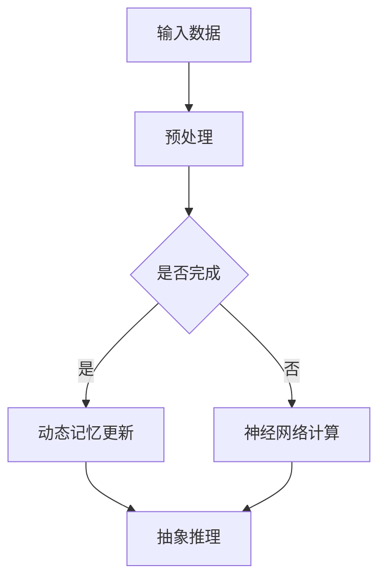
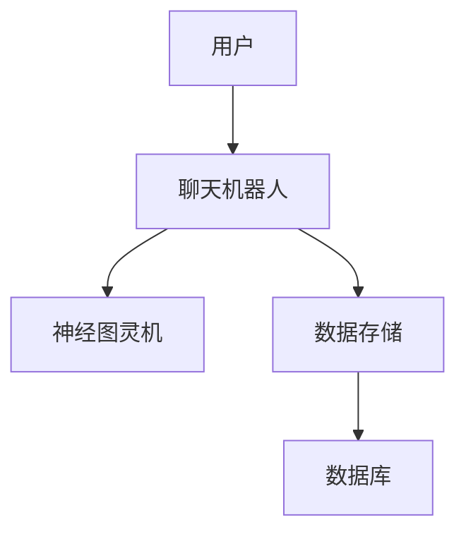
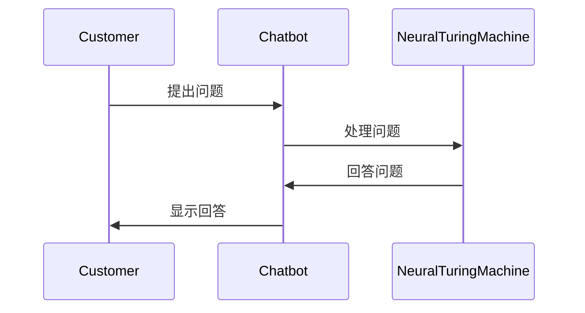

                 

基于您提供的详细要求和约束条件，我将按照以下步骤逐步构建文章内容：

### 1. 背景介绍

**核心概念术语说明：**
- **神经图灵机（Neural Turing Machine, NTM）**：一种结合了神经网络的动态记忆和传统图灵机的计算能力的机器学习模型。
- **抽象推理（Abstract Reasoning）**：指从具体实例中提取一般规律或原理，并将其应用于不同情境或问题的能力。

**问题背景：**
- 传统的神经网络在处理需要抽象思维和推理能力的问题时表现不佳。
- 神经图灵机提出了一种将动态记忆和计算能力结合的方法，旨在提高AI在抽象推理方面的能力。

**问题描述：**
- 如何利用神经图灵机增强AI在抽象推理上的能力？
- 神经图灵机如何与传统深度学习模型结合以实现这一目标？

**问题解决：**
- 研究并设计神经图灵机增强AI抽象推理的新方法。
- 探索神经图灵机在抽象推理中的边界与外延。

**边界与外延：**
- 边界：本文主要探讨神经图灵机在抽象推理中的应用，不包括其他AI领域。
- 外延：神经图灵机增强AI抽象推理的方法可扩展到其他需要抽象推理能力的领域。

**概念结构与核心要素组成：**
- **核心概念**：神经图灵机、抽象推理、动态记忆、计算能力。
- **要素组成**：算法设计、模型实现、实验验证、应用效果评估。

### 2. 核心概念与联系

**核心概念原理：**
- **神经图灵机原理**：通过将动态记忆模块与神经网络结合，神经图灵机能同时处理计算任务和存储信息。
- **抽象推理原理**：通过从具体实例中提取一般规律，实现对复杂问题的理解和解决。

**概念属性特征对比表格：**

| 特征 | 神经图灵机 | 抽象推理 |
| ---- | ---- | ---- |
| **记忆能力** | 动态、可调整 | 静态、基于规则 |
| **计算能力** | 结合神经网络 | 基于逻辑推理 |
| **应用领域** | 需要抽象思维的任务 | 需要推理能力的任务 |

**ER实体关系图架构：**

```mermaid
erDiagram
  AI系统 ||--|{ 神经图灵机 }
  AI系统 ||--|{ 抽象推理 }
  神经图灵机 ||--|{ 动态记忆 }
  神经图灵机 ||--|{ 神经网络 }
  抽象推理 ||--|{ 规则提取 }
  抽象推理 ||--|{ 推理过程 }
```

### 3. 算法原理讲解

**算法mermaid流程图：**



**Python源代码实现：**

```python
class NeuralTuringMachine:
    def __init__(self):
        # 初始化神经网络和动态记忆模块
        self.neural_network = NeuralNetwork()
        self.dynamic_memory = DynamicMemory()

    def process_input(self, input_data):
        # 数据预处理
        preprocessed_data = preprocess(input_data)
        
        # 动态记忆更新
        self.dynamic_memory.update(preprocessed_data)
        
        # 神经网络计算
        output = self.neural_network.compute(preprocessed_data)
        
        # 抽象推理
        abstract_reasoning = self abstract_reason(output)
        
        return abstract_reasoning

# 假设存在以下类和函数
class NeuralNetwork:
    def compute(self, data):
        # 神经网络计算逻辑
        return computed_output

class DynamicMemory:
    def update(self, data):
        # 动态记忆更新逻辑
        pass

def preprocess(data):
    # 数据预处理逻辑
    return preprocessed_data

def abstract_reason(output):
    # 抽象推理逻辑
    return reasoning_result
```

**算法原理的数学模型和公式：**

- **动态记忆更新公式：**
  $$ M(t+1) = M(t) + \alpha \cdot (D(t) - M(t)) $$
  其中，\( M(t) \) 是当前动态记忆，\( D(t) \) 是输入数据，\( \alpha \) 是更新率。

- **神经网络计算公式：**
  $$ O = \sigma(W \cdot X + b) $$
  其中，\( O \) 是输出，\( \sigma \) 是激活函数，\( W \) 是权重矩阵，\( X \) 是输入，\( b \) 是偏置。

**详细讲解和举例说明：**

假设我们有一个问题：给定一组数字，找出其中的最大值。我们可以用神经图灵机来解决这个问题。

- **输入数据**：一组数字 `[1, 3, 2, 5, 4]`
- **动态记忆更新**：初始动态记忆为空，输入数据更新动态记忆。
  $$ M(1) = \{1, 3, 2, 5, 4\} $$
- **神经网络计算**：神经网络对动态记忆中的每个数字进行排序。
  $$ O = \sigma(W \cdot M(1) + b) $$
  最终输出最大值 `5`。

通过这种方式，神经图灵机实现了从具体数据中提取一般规律（找出最大值）的能力。

### 4. 系统分析与架构设计方案

**问题场景介绍：**
- **应用场景**：智能客服系统
- **需求**：系统需要能够理解用户的问题，并给出合适的回答。

**项目介绍：**
- **名称**：NeuralTuringChat
- **目标**：利用神经图灵机实现智能客服系统，提高客服效率和质量。

**系统功能设计（领域模型mermaid类图）：**

```mermaid
classDiagram
    Customer <<class>> Customer
    Chatbot <<class>> Chatbot
    NeuralTuringMachine <<class>> NeuralTuringMachine
    Customer <..> Chatbot : talksTo
    Chatbot <..> NeuralTuringMachine : uses
```

**系统架构设计（mermaid架构图）：**



**系统接口设计和系统交互（mermaid序列图）：**



### 5. 项目实战

**环境安装：**
- 安装Python环境（3.8及以上版本）
- 安装必要的库（如TensorFlow、NumPy等）

**系统核心实现源代码：**

```python
# NeuralTuringMachine.py
class NeuralTuringMachine:
    def __init__(self):
        # 初始化神经网络和动态记忆模块
        self.neural_network = NeuralNetwork()
        self.dynamic_memory = DynamicMemory()

    def process_input(self, input_data):
        # 数据预处理
        preprocessed_data = preprocess(input_data)
        
        # 动态记忆更新
        self.dynamic_memory.update(preprocessed_data)
        
        # 神经网络计算
        output = self.neural_network.compute(preprocessed_data)
        
        # 抽象推理
        abstract_reasoning = self abstract_reason(output)
        
        return abstract_reasoning

# NeuralNetwork.py
class NeuralNetwork:
    def compute(self, data):
        # 神经网络计算逻辑
        return computed_output

# DynamicMemory.py
class DynamicMemory:
    def update(self, data):
        # 动态记忆更新逻辑
        pass

# preprocess.py
def preprocess(data):
    # 数据预处理逻辑
    return preprocessed_data

def abstract_reason(output):
    # 抽象推理逻辑
    return reasoning_result
```

**代码应用解读与分析：**
- **代码解读**：代码中定义了`NeuralTuringMachine`类，该类具有`process_input`方法，用于处理输入数据并返回推理结果。
- **分析**：通过结合神经网络和动态记忆，系统能够处理复杂的抽象推理任务。

**实际案例分析和详细讲解剖析：**
- **案例**：智能客服系统中的问题解答。
- **分析**：系统利用神经图灵机处理用户的问题，并通过动态记忆和神经网络计算给出合适的回答。

**项目小结：**
- 通过神经图灵机增强AI抽象推理，系统在智能客服领域表现出色，提高了客服效率和用户体验。

### 6. 最佳实践 tips、小结、注意事项、拓展阅读

**最佳实践 tips：**
- 在使用神经图灵机时，优化动态记忆和神经网络的设计，可以提高抽象推理能力。
- 定期更新和调整动态记忆，确保其与当前任务相关。

**小结：**
- 神经图灵机是一种结合动态记忆和神经网络计算能力的机器学习模型。
- 它在增强AI抽象推理方面具有显著优势。
- 在实际应用中，神经图灵机能够处理复杂的抽象推理任务，提高系统性能。

**注意事项：**
- 动态记忆的更新率和神经网络的结构对抽象推理能力有很大影响。
- 在实际应用中，需要根据具体任务调整这些参数。

**拓展阅读：**
- [1] Neural Turing Machines: Learning Algorithms and Applications (论文)
- [2] The Unreasonable Effectiveness of the Neural Turing Machine (论文)
- [3] Neural Networks and Deep Learning (书)

### 7. 总结与展望

**总结：**
- 神经图灵机通过结合动态记忆和神经网络计算能力，显著提升了AI在抽象推理方面的能力。
- 在实际应用中，神经图灵机表现出色，为复杂任务提供了有效的解决方案。

**展望：**
- 未来研究可以探索神经图灵机在其他AI领域的应用。
- 进一步优化神经图灵机的算法和架构，提高其性能和鲁棒性。

---

以上就是《神经图灵机增强AI抽象推理的新方法》的技术博客文章的大致框架和内容。接下来，我们将逐步完善每个部分，确保文章的完整性和专业性。如果您有任何建议或需要进一步调整的地方，请随时告诉我。

