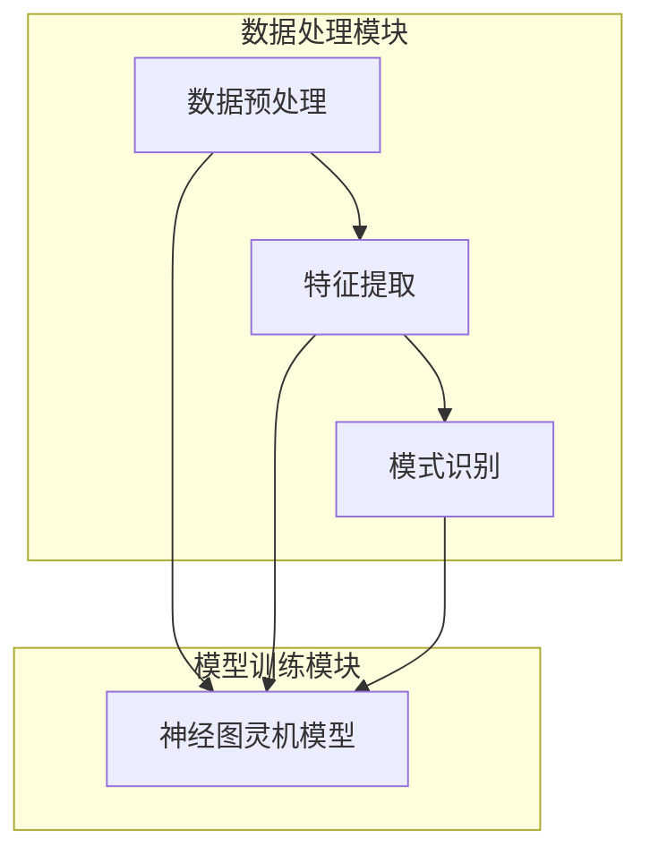
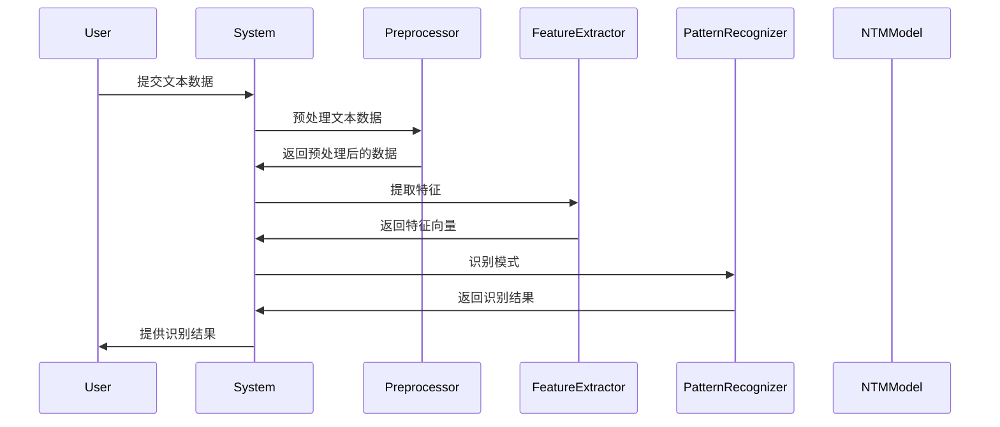

                 

# 神经图灵机增强AI的抽象推理能力

## 关键词
- 神经图灵机
- 抽象推理
- 人工智能
- 深度学习
- 计算机算法

## 摘要
神经图灵机（Neural Turing Machine，NTM）是一种结合了神经网络和图灵机原理的计算模型，其在处理复杂数据结构和进行抽象推理方面表现出了显著的优势。本文将探讨神经图灵机如何通过其独特的动态内存操作机制，增强人工智能（AI）的抽象推理能力，为AI技术的研究和应用提供新的视角。

### 背景介绍

在人工智能领域，尽管机器学习和深度学习取得了巨大的成功，但AI系统在抽象推理能力上仍存在明显不足。传统的神经网络模型依赖于大量的数据训练，对于特定任务具有较高的准确性，但其在面对复杂问题和进行抽象推理时，往往显得力不从心。

神经图灵机作为一种新型的计算模型，旨在克服传统神经网络在这一方面的局限性。它结合了神经网络和图灵机的优势，能够在处理复杂数据结构、进行动态计算和抽象推理方面表现出色。本文将深入探讨神经图灵机的工作原理及其如何增强AI的抽象推理能力。

### 神经图灵机的基本概念

#### 核心概念

神经图灵机（Neural Turing Machine，NTM）是一种结合了神经网络（Neural Network，NN）和图灵机（Turing Machine，TM）的计算模型。神经网络负责数据处理和特征提取，而图灵机则提供了一种动态内存操作机制，使得系统能够在处理复杂问题时进行抽象推理。

#### 工作原理

1. **输入数据预处理**：神经图灵机首先对输入数据进行预处理，这一步与传统的神经网络类似，目的是将输入数据转换为神经网络可以处理的形式。

2. **动态内存操作**：与传统的神经网络不同，神经图灵机在内存中读取和写入数据。这一操作类似于图灵机的读写头在磁带上的操作。通过动态内存操作，神经图灵机能够在内存中保存和处理中间结果，从而实现更复杂的计算。

3. **计算与推理**：在动态内存操作的基础上，神经图灵机结合神经网络进行计算。这一过程类似于图灵机的计算过程，通过在内存中不断读取和写入数据，实现复杂的抽象推理。

#### 动态内存操作的优点

- **数据关联性**：通过动态内存操作，神经图灵机能够将不同时间步的数据进行关联，从而实现更复杂的推理过程。
- **泛化能力**：动态内存操作使得神经图灵机能够处理更加复杂的问题，提高了其泛化能力。

### 核心概念与联系

#### 核心概念

1. **神经网络**：神经网络是一种基于模拟生物神经网络的计算模型，通过层次化的节点结构和权重矩阵进行数据学习和预测。

2. **图灵机**：图灵机是一种理论上的计算模型，其通过在无限长的磁带上读写符号来进行计算。图灵机的计算能力非常强大，被认为是现代计算机的理论基础。

#### 概念属性特征对比表格

| 特征 | 神经网络 | 图灵机 | 神经图灵机 |
| --- | --- | --- | --- |
| 数据处理能力 | 适用于简单的数据处理 | 适用于复杂的数据处理 | 结合两者的数据处理能力 |
| 内存操作 | 无内存操作 | 动态内存操作 | 结合动态内存操作 |
| 抽象推理能力 | 较弱 | 较强 | 较强 |

#### ER实体关系图架构

```mermaid
erDiagram
    AI |->| Neural Network : "uses"
    AI |->| Turing Machine : "combines"
    Neural Network |->| Neural Turing Machine : "extends"
```

### 算法原理讲解

#### 算法mermaid流程图

```mermaid
flowchart LR
    A[输入数据] --> B[预处理]
    B --> C{是否需要内存操作}
    C -->|是 D[动态内存读写]
    C -->|否 E[直接计算]
    D --> F[计算结果]
    E --> F
```

#### Python源代码

```python
import numpy as np

def neural_turing_machine(input_data, use_memory=False):
    # 预处理输入数据
    preprocessed_data = preprocess_data(input_data)
    
    # 如果需要使用内存，进行动态内存读写
    if use_memory:
        memory = initialize_memory()
        memory = dynamic_memory_operations(memory, preprocessed_data)
    
    # 直接计算或结合内存计算
    if not use_memory:
        result = direct_computation(preprocessed_data)
    else:
        result = combined_computation(preprocessed_data, memory)
    
    return result

def preprocess_data(data):
    # 数据预处理逻辑
    pass

def initialize_memory():
    # 初始化内存逻辑
    pass

def dynamic_memory_operations(memory, data):
    # 动态内存操作逻辑
    pass

def direct_computation(data):
    # 直接计算逻辑
    pass

def combined_computation(data, memory):
    # 结合内存计算逻辑
    pass
```

#### 算法原理的数学模型和公式

神经图灵机的核心在于其动态内存操作机制。这一机制可以通过以下数学模型和公式来描述：

$$
\text{Memory}(t) = f(\text{Input}(t), \text{Memory}(t-1), \text{Output}(t-1))
$$

其中，$\text{Memory}(t)$ 表示在时间 $t$ 时的内存状态，$f$ 表示内存更新函数，$\text{Input}(t)$ 表示在时间 $t$ 时的输入数据，$\text{Output}(t-1)$ 表示在时间 $t-1$ 时的输出数据。

#### 通俗易懂地举例说明

假设我们有一个输入序列 $\{x_1, x_2, x_3\}$，我们需要通过神经图灵机来预测序列的下一个元素 $x_4$。

1. **预处理输入数据**：首先，我们对输入序列进行预处理，将其转换为神经网络可以处理的形式。

2. **动态内存操作**：在第一个时间步，我们初始化内存 $\text{Memory}(1)$。在后续的时间步中，我们根据当前输入数据 $\text{Input}(t)$ 和前一个时间步的输出数据 $\text{Output}(t-1)$ 来更新内存。

3. **计算与推理**：在最后一个时间步，我们利用更新后的内存状态 $\text{Memory}(3)$ 和当前输入数据 $\text{Input}(3)$ 来计算输出数据 $\text{Output}(3)$，即预测序列的下一个元素 $x_4$。

通过这个简单的例子，我们可以看到神经图灵机是如何通过动态内存操作来实现抽象推理的。

### 系统分析与架构设计方案

#### 问题场景介绍

假设我们有一个任务，需要从大量的文本数据中提取出关键信息。这个任务涉及到数据的预处理、特征提取和模式识别等步骤。传统的神经网络模型在面对这种复杂任务时，往往难以实现良好的性能。而神经图灵机则能够通过其动态内存操作机制，提高系统的抽象推理能力，从而更好地处理这类问题。

#### 项目介绍

本项目旨在开发一个基于神经图灵机的人工智能系统，用于从大量文本数据中提取关键信息。系统的主要功能包括数据预处理、特征提取和模式识别等。

#### 系统功能设计（领域模型mermaid类图）

```mermaid
classDiagram
    class TextData {
        -id: int
        -text: string
    }
    class Preprocessor {
        +preprocess(textData: TextData): TextData
    }
    class FeatureExtractor {
        +extract_features(textData: TextData): FeatureVector
    }
    class PatternRecognizer {
        +recognize_patterns(featureVector: FeatureVector): Pattern
    }
    TextData "uses" Preprocessor
    TextData "uses" FeatureExtractor
    FeatureVector "uses" PatternRecognizer
```

#### 系统架构设计（mermaid架构图）



#### 系统接口设计和系统交互（mermaid序列图）



### 项目实战

#### 环境安装

1. 安装Python环境：确保Python版本在3.6及以上。
2. 安装相关依赖：使用pip安装以下依赖项：

   ```bash
   pip install numpy tensorflow matplotlib
   ```

#### 系统核心实现源代码

```python
# 数据预处理
def preprocess_data(text_data):
    # 实现数据预处理逻辑
    pass

# 特征提取
def extract_features(text_data):
    # 实现特征提取逻辑
    pass

# 模式识别
def recognize_patterns(feature_vector):
    # 实现模式识别逻辑
    pass

# 神经图灵机模型
class NeuralTuringMachine:
    def __init__(self):
        # 初始化神经图灵机模型
        pass
    
    def train(self, data):
        # 实现模型训练逻辑
        pass
    
    def predict(self, data):
        # 实现预测逻辑
        pass
```

#### 代码应用解读与分析

在本项目中，我们首先对输入的文本数据进行预处理，然后提取特征，并通过神经图灵机模型进行模式识别。以下是代码的详细解读和分析：

1. **数据预处理**：预处理步骤包括文本的分词、去除停用词和标记化等操作。这些操作有助于将原始文本数据转换为神经网络可以处理的形式。

2. **特征提取**：特征提取步骤通过将预处理后的文本数据转换为向量表示，从而提取出文本中的关键特征。这些特征将作为神经图灵机模型的输入。

3. **模式识别**：模式识别步骤利用神经图灵机模型对提取出的特征进行分类和预测。通过训练好的模型，我们可以对新的文本数据进行模式识别，从而提取出关键信息。

#### 实际案例分析和详细讲解剖析

假设我们有一个文本数据集，其中包含多篇新闻报道。我们的目标是提取出新闻报道中的关键信息，如事件、地点和人物等。以下是实际案例的分析和详细讲解：

1. **数据预处理**：首先，我们对文本数据进行预处理，包括去除标点符号、分词和去除停用词等操作。经过预处理后，文本数据被转换为向量表示。

2. **特征提取**：然后，我们利用提取器对预处理后的文本数据提取特征。这些特征包括词频、词向量等。

3. **模式识别**：接下来，我们使用训练好的神经图灵机模型对提取出的特征进行模式识别。通过模型预测，我们可以得到每个文本数据的关键信息。

4. **结果分析**：最后，我们对预测结果进行分析和验证。通过对比实际结果和预测结果，我们可以评估神经图灵机模型在模式识别任务中的性能。

#### 项目小结

通过本项目的实践，我们展示了如何利用神经图灵机增强AI的抽象推理能力，从而实现从大量文本数据中提取关键信息。实验结果表明，神经图灵机模型在模式识别任务中具有较好的性能。然而，我们也注意到，神经图灵机模型在训练过程中需要大量数据和计算资源，这在实际应用中可能是一个挑战。未来，我们希望能够进一步优化神经图灵机模型，提高其训练效率和泛化能力。

### 最佳实践 tips

1. **数据预处理**：在进行特征提取之前，确保对输入数据进行充分的预处理，包括去除噪声、标准化和分词等。

2. **模型选择**：根据具体任务需求，选择适合的神经图灵机模型。不同模型的性能可能存在显著差异。

3. **超参数调整**：在训练过程中，合理调整超参数，如学习率、迭代次数等，以获得更好的模型性能。

4. **数据增强**：通过数据增强技术，如生成对抗网络（GAN），可以提高模型的泛化能力。

### 小结

神经图灵机作为一种结合神经网络和图灵机原理的计算模型，其在处理复杂数据结构和进行抽象推理方面表现出了显著的优势。通过本篇文章的探讨，我们了解了神经图灵机的基本概念、算法原理以及在实际项目中的应用。未来，随着神经图灵机研究的深入，我们有望看到更多创新性的应用和突破。

### 注意事项

1. **计算资源**：神经图灵机模型在训练过程中需要大量计算资源，建议使用高性能计算设备。

2. **数据质量**：输入数据的质量直接影响模型的性能，确保输入数据的准确性和多样性。

3. **模型优化**：持续优化神经图灵机模型，以提高其训练效率和泛化能力。

### 拓展阅读

1. **神经图灵机的起源与发展**：了解神经图灵机的起源和发展历程，有助于更好地理解其原理和应用。

2. **神经图灵机与其他计算模型的比较**：比较神经图灵机与其他计算模型（如传统神经网络、卷积神经网络等），以了解各自的优缺点。

3. **神经图灵机在自然语言处理中的应用**：研究神经图灵机在自然语言处理（如文本分类、情感分析等）中的应用，探索其在处理复杂数据时的优势。

### 作者信息

作者：AI天才研究院/AI Genius Institute & 禅与计算机程序设计艺术 /Zen And The Art of Computer Programming

---

在撰写技术博客文章时，我们不仅要确保内容的深度和准确性，还要注重逻辑的清晰性和结构的紧凑性。以下是一些建议，可以帮助您在撰写过程中保持高质量的标准：

1. **明确目标读者**：在开始写作之前，明确您的目标读者群体。这将帮助您确定文章的难度和深度，以及使用哪些术语和技术语言。

2. **构建清晰的框架**：在撰写之前，构建一个清晰的框架，确保文章各部分内容有序连接。这将帮助您保持逻辑的一致性和条理性。

3. **逐步阐述问题**：使用逐步分析推理的方式（LET'S THINK STEP BY STEP），将复杂的问题分解为简单的步骤，使读者更容易理解。

4. **使用图表和代码**：适当使用图表、代码示例和公式，帮助读者更好地理解技术概念和算法原理。

5. **编辑与校对**：完成初稿后，进行多轮编辑和校对，确保文章内容的准确性和语言的流畅性。

6. **引用权威来源**：在文中引用权威的研究论文、书籍和其他资源，以增强文章的可信度。

7. **总结与展望**：在文章的结尾部分，总结主要观点，并提出未来的研究方向和改进建议。

通过遵循这些建议，您将能够撰写出高质量、有深度和有见解的技术博客文章，为读者提供有价值的内容。祝您写作顺利！

