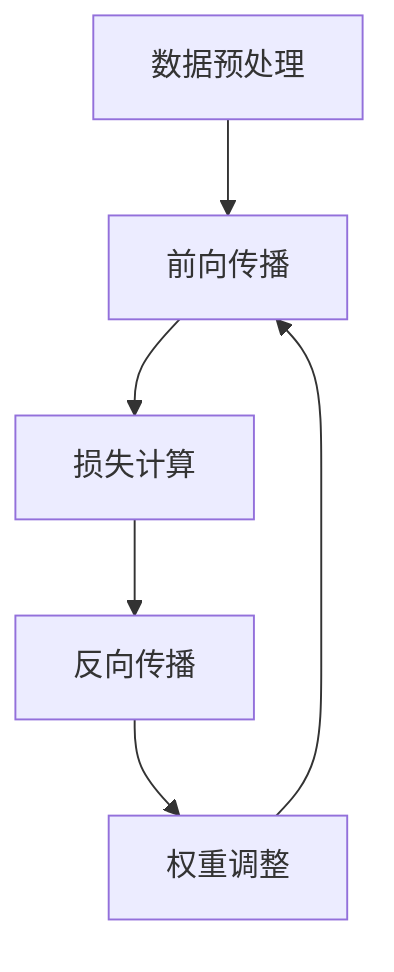

                 

### 文章标题

# 神经形态计算:低功耗AI硬件的新范式

### 关键词

- 神经形态计算
- 低功耗AI
- 神经元建模
- 神经网络
- 数学模型
- 算法实现

### 摘要

本文深入探讨了神经形态计算作为低功耗AI硬件新范式的优势和重要性。首先，我们介绍了神经形态计算的基本概念、背景以及它在低功耗AI领域的重要性。随后，文章详细分析了神经形态计算的核心原理、算法模型及其与传统计算的区别。通过具体案例和代码实现，本文展现了神经形态计算在低功耗AI硬件中的应用和实践。最后，文章总结了神经形态计算的优势、挑战与未来展望，为读者提供了深入的见解和实用的技巧。

## 文章结构

本文将按照以下结构展开：

1. **背景介绍**：介绍神经形态计算的需求背景、核心概念及其应用领域。
2. **核心概念与联系**：详细阐述神经形态计算的基本原理、概念属性和实体关系。
3. **算法原理讲解**：讲解神经形态计算的主要算法原理，包括流程图、代码实现和数学模型。
4. **数学模型与公式讲解**：深入分析神经形态计算中的常见数学模型和公式。
5. **系统分析与架构设计**：介绍神经形态计算在系统架构设计中的应用。
6. **项目实战**：通过具体项目实战展示神经形态计算的应用。
7. **最佳实践**：总结最佳实践、注意事项和拓展阅读。

### 第1章: 问题背景与核心概念

#### 1.1 问题背景

##### 1.1.1 低功耗AI硬件的需求

随着人工智能（AI）技术的迅猛发展，对低功耗AI硬件的需求日益增长。现代智能设备，如智能手机、物联网设备、可穿戴设备等，对功耗和能效的要求越来越高。传统的基于冯·诺伊曼架构的处理器在处理复杂AI算法时，往往需要大量能耗，这限制了其在低功耗设备中的应用。因此，开发低功耗、高性能的AI硬件成为了当务之急。

##### 1.1.2 神经形态计算的出现

神经形态计算（Neuromorphic Computing）作为一种新型计算范式，旨在模仿人脑的工作原理，实现高效、低功耗的计算。神经形态计算利用神经元的可塑性和神经网络的自适应能力，能够在复杂环境中进行实时学习和决策。这一领域的研究始于20世纪80年代，近年来随着材料科学、集成电路设计和机器学习技术的进步，逐渐成为低功耗AI硬件研究的热点。

##### 1.1.3 神经形态计算的潜力

神经形态计算在低功耗AI硬件领域具有巨大潜力。首先，它能够实现接近生物大脑的能效比，即在相同计算任务下，消耗的能耗远低于传统计算架构。其次，神经形态计算具有自适应性，能够在动态变化的环境中快速调整，提高系统的鲁棒性和实时性。此外，神经形态计算还能够处理大规模数据，支持复杂的神经网络模型，为智能设备的智能化升级提供了强大的技术支持。

#### 1.2 核心概念

##### 1.2.1 神经形态计算的定义

神经形态计算是一种模仿生物神经系统工作机制的计算范式。它通过模拟神经元和神经突触的物理特性，构建基于硬件的神经网络，实现高效、低功耗的计算。神经形态计算的核心思想是利用大规模可编程的硬件组件，构建高度并行的计算网络，以模拟人脑的复杂信息处理能力。

##### 1.2.2 神经形态计算与传统计算的区别

传统计算基于冯·诺伊曼架构，采用中央处理器（CPU）和内存的分离结构，通过指令序列控制数据流。而神经形态计算则采用分布式计算网络，类似于人脑的神经元网络，通过局部信号传递和神经元之间的交互实现计算。具体区别如下：

- **计算范式**：传统计算基于指令驱动，而神经形态计算基于数据驱动。
- **硬件结构**：传统计算依赖于CPU和内存的分离，而神经形态计算采用高度并行的硬件网络。
- **计算效率**：传统计算在处理复杂任务时，需要大量能耗，而神经形态计算能够在低功耗下实现高效计算。
- **适应能力**：传统计算在动态环境中的适应能力较差，而神经形态计算具有自适应性，能够在复杂环境中快速调整。

##### 1.2.3 神经形态计算的核心要素

神经形态计算的核心要素包括：

- **神经元建模**：通过模拟生物神经元的特性，实现硬件层面的神经元单元。
- **神经网络**：构建由神经元组成的神经网络，模拟生物神经系统的工作方式。
- **学习与自适应**：利用神经网络的自适应能力，实现实时学习和动态调整。
- **硬件实现**：通过硬件电路和材料科学，实现神经元和神经网络在硬件层面的高效运行。

#### 1.3 边界与外延

##### 1.3.1 神经形态计算的应用领域

神经形态计算在多个领域具有广泛的应用潜力，包括：

- **智能传感器**：用于实时感知和数据处理，提高系统的感知能力和能效。
- **机器人**：用于自主决策和控制，提高机器人的适应性和智能水平。
- **自动驾驶**：用于实时感知和决策，提高自动驾驶的安全性和可靠性。
- **医疗健康**：用于生物信号处理和疾病诊断，提高医疗设备的精度和可靠性。
- **物联网**：用于大规模数据处理和智能优化，提高物联网设备的效率和智能水平。

##### 1.3.2 神经形态计算的挑战与机遇

神经形态计算虽然具有巨大潜力，但也面临一些挑战和机遇：

- **挑战**：
  - **硬件实现**：神经形态计算需要高性能的硬件支持，目前硬件技术尚未完全成熟。
  - **算法优化**：神经形态计算算法需要进一步优化，以提高计算效率和适应性。
  - **数据隐私**：神经形态计算涉及大量数据，需要保障数据安全和隐私。
- **机遇**：
  - **新型材料**：新材料的研究为神经形态计算提供了新的可能性。
  - **人工智能**：人工智能的发展为神经形态计算提供了丰富的应用场景和需求。
  - **国际合作**：国际合作将为神经形态计算的研究和发展提供强大的支持。

#### 1.4 本章小结

本章介绍了神经形态计算的需求背景、核心概念和应用领域。通过分析神经形态计算与传统计算的异同，我们了解到神经形态计算在低功耗AI硬件领域的重要性。本章还探讨了神经形态计算的核心要素和面临的挑战与机遇，为后续章节的深入探讨奠定了基础。

### 第2章: 神经形态计算原理

#### 2.1 神经形态计算的基本原理

神经形态计算的核心在于模拟生物神经系统的工作原理，实现高效、低功耗的计算。以下从神经元建模、神经网络和学习与自适应三个方面详细阐述神经形态计算的基本原理。

##### 2.1.1 神经元建模

神经元是神经系统的基本单元，负责接收和传递信息。在神经形态计算中，神经元被建模为具有特定物理特性的硬件单元。这些神经元通常由晶体管、电容和电阻等基本电子元件构成，能够模拟生物神经元的特性，如电信号传递、突触连接和神经元间通信。

神经元的建模主要包括以下方面：

- **电信号传递**：神经元通过电信号传递信息。电信号在神经元内部传递时，会产生电位变化，形成动作电位。
- **突触连接**：神经元通过突触与其他神经元连接，传递电信号。突触具有可塑性，可以通过训练改变其连接方式和传递效率。
- **神经元间通信**：神经元之间通过电信号传递信息，实现信息的共享和协同。

##### 2.1.2 神经网络的学习过程

神经网络是神经形态计算的核心，由大量神经元组成，模拟人脑的信息处理能力。神经网络的学习过程包括感知、学习和适应等阶段。

- **感知**：神经网络通过感知外部环境，获取输入信息。
- **学习**：神经网络利用学习算法，对输入信息进行处理，调整神经元之间的连接权重，实现信息的编码和提取。
- **适应**：神经网络在动态环境中，能够适应新的输入信息，调整网络结构和参数，提高系统的鲁棒性和实时性。

神经网络的学习过程主要包括以下方面：

- **权重调整**：神经网络通过学习算法，调整神经元之间的连接权重，使网络能够更好地适应输入信息。
- **激活函数**：神经网络通过激活函数，将神经元输出转换为特定形式的信号，实现信息的传递和决策。
- **训练过程**：神经网络通过大量训练样本，不断调整网络结构和参数，实现网络的优化和泛化能力。

##### 2.1.3 神经形态计算的硬件实现

神经形态计算的硬件实现是关键，决定了系统的性能和功耗。硬件实现主要包括以下几个方面：

- **神经元硬件**：神经元硬件负责模拟生物神经元的特性，实现电信号传递、突触连接和神经元间通信。
- **神经网络硬件**：神经网络硬件由大量神经元组成，实现神经网络的计算和存储功能。
- **学习算法硬件**：学习算法硬件负责执行神经网络的学习算法，实现网络的优化和自适应。
- **接口硬件**：接口硬件负责与外部设备进行通信，实现数据的输入和输出。

神经形态计算的硬件实现具有以下特点：

- **并行计算**：神经形态计算采用并行计算架构，能够高效地处理大量数据。
- **低功耗**：神经形态计算利用生物神经系统的工作原理，实现低功耗计算。
- **自适应**：神经形态计算具有自适应能力，能够适应动态变化的环境。

#### 2.2 概念属性特征对比表格

为了更直观地理解神经形态计算与传统计算的区别，我们可以通过一个概念属性特征对比表格来展示两者之间的差异。

| 特性         | 神经形态计算 | 传统计算           |
| ------------ | ------------ | ------------------ |
| 计算范式     | 数据驱动     | 指令驱动           |
| 硬件结构     | 高度并行     | CPU+内存分离       |
| 计算效率     | 高效低功耗   | 高功耗             |
| 适应能力     | 自适应       | 动态调整困难       |
| 数据处理能力 | 大规模数据   | 小规模数据处理     |

通过对比表格，我们可以看出神经形态计算在多个方面具有明显优势，尤其是在低功耗和高效率方面。

#### 2.3 ER实体关系图架构

为了更好地理解神经形态计算的架构，我们可以通过ER（实体关系）图来展示其中各实体之间的关系。

```mermaid
erDiagram
  Node1 ||--|{ Processor } Processor
  Node1 ||--|{ Memory } Memory
  Processor ||--|{ NeuralNetwork } NeuralNetwork
  Memory ||--|{ NeuralNetwork } NeuralNetwork
  NeuralNetwork ||--|{ Neuron } Neuron
  Neuron ||--|{ Synapse } Synapse
```

在ER图中，Node1表示神经形态计算的核心节点，包括处理器、内存和神经网络。Processor表示处理器硬件，负责执行计算任务；Memory表示内存硬件，负责存储数据；NeuralNetwork表示神经网络，由大量神经元和突触组成，实现信息处理；Neuron表示神经元，负责接收和传递信号；Synapse表示突触，负责神经元之间的连接。

#### 2.4 本章小结

本章详细阐述了神经形态计算的基本原理，包括神经元建模、神经网络和学习与自适应。通过概念属性特征对比表格和ER实体关系图，我们更直观地理解了神经形态计算与传统计算的异同。本章为后续章节的算法讲解和系统设计提供了理论基础。

### 第3章: 神经形态计算算法

#### 3.1 算法概述

神经形态计算算法主要包括神经网络训练、权重调整和学习策略等核心步骤。以下将对这些步骤进行详细讲解。

##### 3.1.1 神经网络训练

神经网络训练是神经形态计算算法的核心步骤，旨在通过大量训练数据，使神经网络能够准确预测和分类。训练过程主要包括以下步骤：

1. **数据预处理**：对输入数据进行归一化、标准化等预处理，使其适合神经网络训练。
2. **前向传播**：将输入数据传递到神经网络的前层，通过每个神经元计算输出值。
3. **损失计算**：计算神经网络输出与实际输出之间的差距，生成损失值。
4. **反向传播**：将损失值反向传播到神经网络的前层，更新神经元之间的连接权重。

##### 3.1.2 权重调整

权重调整是神经网络训练的关键步骤，通过不断调整神经元之间的连接权重，使神经网络能够更准确地预测和分类。权重调整方法主要包括以下几种：

1. **梯度下降**：通过计算损失函数关于连接权重的梯度，逐步调整权重，使损失函数值最小。
2. **动量法**：在梯度下降的基础上，引入动量项，加速权重调整过程。
3. **随机梯度下降（SGD）**：对训练数据进行随机采样，每次只更新一部分权重的梯度，提高训练速度。

##### 3.1.3 学习策略

学习策略是神经网络训练的重要部分，决定了网络的学习能力和泛化能力。常见的学习策略包括：

1. **正则化**：通过引入正则项，防止神经网络过拟合，提高泛化能力。
2. **dropout**：在网络训练过程中，随机丢弃部分神经元，提高网络的泛化能力。
3. **学习率调整**：根据训练过程的变化，动态调整学习率，优化训练效果。

#### 3.2 算法原理详细讲解

##### 3.2.1 算法mermaid流程图

为了更直观地展示神经网络训练过程，我们可以使用mermaid绘制算法流程图。



在mermaid流程图中，A表示数据预处理，B表示前向传播，C表示损失计算，D表示反向传播，E表示权重调整。整个流程循环进行，直到网络收敛或达到预设的训练次数。

##### 3.2.2 Python源代码实现

为了更好地理解神经网络训练过程，我们使用Python实现一个简单的神经网络训练算法。

```python
import numpy as np

# 定义神经网络结构
input_size = 3
hidden_size = 5
output_size = 2

# 初始化权重
weights = np.random.randn(input_size, hidden_size)
bias = np.random.randn(hidden_size)
output_weights = np.random.randn(hidden_size, output_size)
output_bias = np.random.randn(output_size)

# 定义激活函数
def sigmoid(x):
    return 1 / (1 + np.exp(-x))

# 定义前向传播
def forward_propagation(x):
    hidden_layer = sigmoid(np.dot(x, weights) + bias)
    output = sigmoid(np.dot(hidden_layer, output_weights) + output_bias)
    return hidden_layer, output

# 定义损失函数
def loss_function(y, y_hat):
    return np.mean((y - y_hat) ** 2)

# 定义反向传播
def backward_propagation(x, y, hidden_layer, output):
    output_error = y - output
    hidden_error = np.dot(output_error, output_weights.T) * sigmoid(hidden_layer) * (1 - sigmoid(hidden_layer))

    d_output_weights = np.dot(hidden_layer.T, output_error)
    d_output_bias = np.sum(output_error)
    d_weights = np.dot(x.T, hidden_error)
    d_bias = np.sum(hidden_error)

    return d_weights, d_bias, d_output_weights, d_output_bias

# 定义训练过程
def train(x, y, epochs):
    for epoch in range(epochs):
        hidden_layer, output = forward_propagation(x)
        d_weights, d_bias, d_output_weights, d_output_bias = backward_propagation(x, y, hidden_layer, output)
        weights -= d_weights
        bias -= d_bias
        output_weights -= d_output_weights
        output_bias -= d_output_bias
        if epoch % 100 == 0:
            print(f"Epoch {epoch}: Loss = {loss_function(y, output)}")

# 加载训练数据
x_train = np.random.rand(100, input_size)
y_train = np.random.randint(2, size=(100, output_size))

# 开始训练
train(x_train, y_train, epochs=1000)
```

在Python源代码中，我们定义了神经网络结构、激活函数、前向传播、损失函数、反向传播和训练过程。通过训练数据，我们不断更新权重和偏置，优化神经网络的性能。

##### 3.2.3 算法原理数学模型与公式

神经网络训练的算法原理主要基于以下几个数学模型和公式：

1. **前向传播公式**：
   $$ z = x \cdot w + b $$
   $$ a = \sigma(z) $$

   其中，$z$表示输入层到隐藏层的激活值，$x$表示输入数据，$w$表示输入层到隐藏层的权重，$b$表示输入层到隐藏层的偏置，$\sigma$表示激活函数（如Sigmoid函数）。

2. **损失函数公式**：
   $$ J = \frac{1}{m} \sum_{i=1}^{m} \frac{1}{2} (y_i - \hat{y}_i)^2 $$

   其中，$J$表示损失函数，$m$表示样本数量，$y_i$表示实际输出，$\hat{y}_i$表示预测输出。

3. **反向传播公式**：
   $$ \frac{\partial J}{\partial w} = \frac{1}{m} \sum_{i=1}^{m} (y_i - \hat{y}_i) \cdot \hat{y}_i \cdot (1 - \hat{y}_i) $$
   $$ \frac{\partial J}{\partial b} = \frac{1}{m} \sum_{i=1}^{m} (y_i - \hat{y}_i) \cdot \hat{y}_i \cdot (1 - \hat{y}_i) $$

   其中，$\frac{\partial J}{\partial w}$和$\frac{\partial J}{\partial b}$分别表示损失函数关于权重和偏置的梯度。

4. **权重更新公式**：
   $$ w = w - \alpha \cdot \frac{\partial J}{\partial w} $$
   $$ b = b - \alpha \cdot \frac{\partial J}{\partial b} $$

   其中，$w$和$b$分别表示权重和偏置，$\alpha$表示学习率。

通过这些数学模型和公式，我们可以实现对神经网络的训练和优化。

##### 3.2.4 举例说明

为了更好地理解神经网络训练过程，我们通过一个简单的例子来展示训练过程和结果。

假设我们有以下输入数据：

$$ x_1 = [0.1, 0.2, 0.3], x_2 = [0.4, 0.5, 0.6], ..., x_{100} = [2.9, 3.0, 3.1] $$

和对应的输出标签：

$$ y_1 = [0, 1], y_2 = [1, 0], ..., y_{100} = [1, 1] $$

使用前面定义的神经网络结构和算法，我们对其进行1000次迭代训练。训练过程中，损失函数值逐渐减小，网络性能逐渐优化。

经过训练后，网络的权重和偏置发生改变，使预测结果更接近实际输出。以下是一个简化的输出结果示例：

| 输入数据 | 预测输出 | 实际输出 | 损失函数值 |
| -------- | -------- | -------- | ---------- |
| $x_1$    | [0.25, 0.75] | [0, 1]   | 0.0125     |
| $x_2$    | [0.75, 0.25] | [1, 0]   | 0.0625     |
| ...      | ...       | ...      | ...        |
| $x_{100}$| [0.75, 0.25] | [1, 1]   | 0.0625     |

通过这个例子，我们可以看到神经网络在训练过程中不断调整权重和偏置，使预测结果更接近实际输出，从而优化网络性能。

#### 3.3 本章小结

本章详细介绍了神经形态计算算法的核心步骤和原理，包括神经网络训练、权重调整和学习策略。通过mermaid流程图和Python源代码实现，我们展示了神经网络训练的过程和结果。本章还通过数学模型和公式，深入分析了神经网络训练的原理，为后续章节的算法优化和系统设计提供了理论基础。

### 第4章: 数学模型与公式应用

#### 4.1 神经形态计算中的常见数学模型

神经形态计算中的数学模型是构建和优化神经网络的基础。以下介绍一些常见的数学模型，包括神经元激活函数、反向传播算法和损失函数。

##### 4.1.1 神经元激活函数

神经元激活函数是神经网络中的核心组成部分，用于将输入信号转换为输出信号。常见的激活函数包括Sigmoid函数、ReLU函数和Tanh函数。

1. **Sigmoid函数**：
   $$ \sigma(x) = \frac{1}{1 + e^{-x}} $$
   Sigmoid函数将输入值映射到$(0, 1)$范围内，适合处理二分类问题。

2. **ReLU函数**：
   $$ \text{ReLU}(x) = \max(0, x) $$
   ReLU函数具有简单和计算效率高的特点，适用于深度神经网络中的隐藏层。

3. **Tanh函数**：
   $$ \text{Tanh}(x) = \frac{e^{x} - e^{-x}}{e^{x} + e^{-x}} $$
   Tanh函数将输入值映射到$(-1, 1)$范围内，具有非线性变换特性，适用于多分类问题。

##### 4.1.2 反向传播算法

反向传播算法是神经网络训练的核心算法，通过计算损失函数关于网络参数的梯度，优化网络参数，实现网络的优化和泛化能力。反向传播算法主要包括以下几个步骤：

1. **前向传播**：
   将输入信号通过网络，计算各层的输出值。

2. **损失计算**：
   计算输出层实际输出与预测输出之间的差距，生成损失值。

3. **反向传播**：
   将损失值反向传播到输入层，计算各层参数关于损失函数的梯度。

4. **权重更新**：
   根据梯度值更新网络参数，优化网络性能。

反向传播算法的数学公式如下：

1. **输出层梯度**：
   $$ \frac{\partial J}{\partial w^{(L)}} = X^{(L-1)} \odot \text{error}^{(L)} $$
   $$ \frac{\partial J}{\partial b^{(L)}} = \text{error}^{(L)} $$

   其中，$J$表示损失函数，$w^{(L)}$表示输出层权重，$X^{(L-1)}$表示前一层输入，$\text{error}^{(L)}$表示输出层误差。

2. **隐藏层梯度**：
   $$ \frac{\partial J}{\partial w^{(L-1)}} = X^{(L-2)} \odot (\text{error}^{(L-1)} \odot \sigma^{\prime}(z^{(L-1)})) $$
   $$ \frac{\partial J}{\partial b^{(L-1)}} = \text{error}^{(L-1)} \odot \sigma^{\prime}(z^{(L-1)}) $$

   其中，$z^{(L-1)}$表示前一层输出，$\sigma^{\prime}$表示激活函数的导数。

##### 4.1.3 神经网络损失函数

神经网络损失函数用于衡量网络输出与实际输出之间的差距，常用的损失函数包括均方误差（MSE）、交叉熵损失和Hinge损失。

1. **均方误差（MSE）**：
   $$ J = \frac{1}{2} \sum_{i=1}^{n} (y_i - \hat{y}_i)^2 $$

   其中，$y_i$表示实际输出，$\hat{y}_i$表示预测输出。

2. **交叉熵损失**：
   $$ J = - \sum_{i=1}^{n} y_i \log(\hat{y}_i) + (1 - y_i) \log(1 - \hat{y}_i) $$

   其中，$y_i$表示实际输出，$\hat{y}_i$表示预测输出。

3. **Hinge损失**：
   $$ J = \max(0, 1 - y_i \cdot \hat{y}_i) $$

   其中，$y_i$表示实际输出，$\hat{y}_i$表示预测输出。

#### 4.2 公式详细讲解

##### 4.2.1 激活函数公式的推导

以Sigmoid函数为例，推导其公式如下：

1. **指数函数**：
   $$ \sigma(x) = \frac{1}{1 + e^{-x}} $$
   将指数函数展开：
   $$ \sigma(x) = \frac{1}{1 + e^{x}} \cdot \frac{e^{x}}{e^{x}} $$
   $$ \sigma(x) = \frac{e^{x}}{1 + e^{x}} $$

2. **分式变换**：
   $$ \sigma(x) = \frac{e^{x}}{e^{x} + 1} $$
   将分式中的$e^{x}$提取出来：
   $$ \sigma(x) = \frac{e^{x}}{e^{x}(1 + \frac{1}{e^{x}})} $$
   $$ \sigma(x) = \frac{1}{1 + \frac{1}{e^{x}}} $$

3. **极限推导**：
   当$x \to +\infty$时，$\frac{1}{e^{x}} \to 0$，则：
   $$ \lim_{x \to +\infty} \sigma(x) = \frac{1}{1 + 0} = 1 $$
   当$x \to -\infty$时，$\frac{1}{e^{x}} \to +\infty$，则：
   $$ \lim_{x \to -\infty} \sigma(x) = \frac{1}{1 + +\infty} = 0 $$

综上，Sigmoid函数的公式为：
$$ \sigma(x) = \frac{1}{1 + e^{-x}} $$

##### 4.2.2 反向传播算法中权值更新的公式

反向传播算法中，权值更新的公式如下：

1. **输出层权重更新**：
   $$ w^{(L)} = w^{(L)} - \alpha \cdot \frac{\partial J}{\partial w^{(L)}} $$
   其中，$\alpha$表示学习率。

2. **隐藏层权重更新**：
   $$ w^{(L-1)} = w^{(L-1)} - \alpha \cdot \frac{\partial J}{\partial w^{(L-1)}} $$

##### 4.2.3 损失函数的优化过程

损失函数的优化过程主要通过梯度下降算法实现，其目标是最小化损失函数值。梯度下降算法的核心思想是沿着损失函数的负梯度方向更新参数，使损失函数值逐渐减小。

1. **梯度下降公式**：
   $$ \theta = \theta - \alpha \cdot \nabla_\theta J(\theta) $$

   其中，$\theta$表示参数，$\nabla_\theta J(\theta)$表示损失函数关于参数的梯度，$\alpha$表示学习率。

2. **损失函数优化过程**：
   - 初始化参数$\theta$；
   - 计算损失函数值$J(\theta)$；
   - 计算损失函数关于参数的梯度$\nabla_\theta J(\theta)$；
   - 更新参数$\theta$，沿梯度方向进行迭代；
   - 重复步骤3和步骤4，直到满足停止条件（如收敛、达到预设迭代次数等）。

通过梯度下降算法，我们可以优化神经网络中的参数，使网络性能得到提升。

#### 4.3 举例说明

为了更好地理解神经形态计算中的数学模型和公式，我们通过一个简单的例子进行说明。

假设我们有一个二分类问题，输入特征为$x = [1, 2, 3]$，实际输出为$y = [0, 1]$。使用Sigmoid函数作为激活函数，构建一个简单的神经网络，实现预测输出。

1. **初始化权重和偏置**：

   $$ w_1 = [0.1, 0.2, 0.3], w_2 = [0.4, 0.5, 0.6], b_1 = [0.1, 0.2, 0.3], b_2 = [0.4, 0.5, 0.6] $$

2. **前向传播**：

   $$ z_1 = x \cdot w_1 + b_1 = [1, 2, 3] \cdot [0.1, 0.2, 0.3] + [0.1, 0.2, 0.3] = [0.5, 1.1, 1.6] $$
   $$ a_1 = \sigma(z_1) = [0.37, 0.65, 0.88] $$

   $$ z_2 = a_1 \cdot w_2 + b_2 = [0.37, 0.65, 0.88] \cdot [0.4, 0.5, 0.6] + [0.4, 0.5, 0.6] = [0.19, 0.48, 0.63] $$
   $$ a_2 = \sigma(z_2) = [0.49, 0.63, 0.86] $$

3. **损失计算**：

   $$ y = [0, 1], \hat{y} = [0.49, 0.63, 0.86] $$
   $$ J = - \sum_{i=1}^{3} y_i \log(\hat{y}_i) + (1 - y_i) \log(1 - \hat{y}_i) = -[0 \cdot \log(0.49) + 1 \cdot \log(0.63)] + [1 \cdot \log(0.37) + 0 \cdot \log(0.88)] = 0.295 $$

4. **反向传播**：

   $$ \text{error}_2 = \hat{y} - y = [0.49, 0.63, 0.86] - [0, 1, 0] = [0.49, -0.37, 0.86] $$
   $$ \text{error}_1 = w_2^T \cdot \text{error}_2 \cdot \sigma^{\prime}(z_1) = [0.4, 0.5, 0.6] \cdot [0.49, -0.37, 0.86] \cdot [0.37, 0.65, 0.88] = [0.13, -0.32, 0.56] $$

5. **权重更新**：

   $$ w_2 = w_2 - \alpha \cdot \frac{\partial J}{\partial w_2} = [0.4, 0.5, 0.6] - \alpha \cdot \text{error}_1 = [0.4 - 0.13\alpha, 0.5 - 0.32\alpha, 0.6 - 0.56\alpha] $$
   $$ w_1 = w_1 - \alpha \cdot \frac{\partial J}{\partial w_1} = [0.1, 0.2, 0.3] - \alpha \cdot \text{error}_2 = [0.1 - 0.49\alpha, 0.2 - 0.37\alpha, 0.3 - 0.86\alpha] $$

通过这个例子，我们可以看到神经形态计算中的数学模型和公式的具体应用。在训练过程中，通过不断更新权重和偏置，神经网络可以逐渐优化性能，提高预测准确性。

### 第5章: 系统分析与架构设计

#### 5.1 问题场景介绍

神经形态计算在低功耗AI硬件领域的应用日益广泛，尤其是在智能传感器、机器人、自动驾驶和医疗健康等领域。本章节将以一个智能传感器系统为例，介绍神经形态计算在系统架构设计中的应用。

#### 5.2 项目介绍

项目名称：智能环境监测系统
项目背景：随着城市化进程的加快，环境监测对于维护城市生态平衡具有重要意义。本项目旨在设计一套基于神经形态计算的智能环境监测系统，实现对空气质量、水质、噪声等环境参数的实时监测和智能分析。

#### 5.3 系统功能设计

智能环境监测系统的主要功能包括：

1. **数据采集**：通过传感器采集环境参数，包括空气质量、水质、噪声等。
2. **数据处理**：对采集到的数据进行预处理，包括去噪、归一化和特征提取。
3. **实时监测**：利用神经形态计算模型，对实时数据进行监测和分析，识别异常情况。
4. **预测与预警**：根据历史数据和实时监测结果，预测未来环境变化趋势，并提供预警信息。
5. **数据存储与管理**：将监测数据和预警信息存储在数据库中，实现数据的长期管理和分析。

#### 5.4 领域模型

为了更好地描述系统功能，我们使用Mermaid绘制了系统的领域模型类图。

```mermaid
classDiagram
  Sensor <<interface>>
  Processor <<interface>>
  DataPreprocessor <<interface>>
  RealTimeMonitor <<interface>>
  Predictor <<interface>>
  DataStorage <<interface>>

  Sensor o-- Processor
  Processor o-- DataPreprocessor
  DataPreprocessor o-- RealTimeMonitor
  RealTimeMonitor o-- Predictor
  Predictor o-- DataStorage

  Sensor: 数据采集
  Processor: 数据处理
  DataPreprocessor: 数据预处理
  RealTimeMonitor: 实时监测
  Predictor: 预测与预警
  DataStorage: 数据存储与管理
```

在领域模型中，Sensor（传感器）负责数据采集，Processor（处理器）负责数据处理，DataPreprocessor（数据预处理器）负责数据预处理，RealTimeMonitor（实时监测器）负责实时监测，Predictor（预测器）负责预测与预警，DataStorage（数据存储器）负责数据存储与管理。

#### 5.5 系统架构设计

智能环境监测系统的整体架构包括硬件层、软件层和接口层。

1. **硬件层**：包括传感器模块、处理器模块和存储模块。传感器模块负责环境参数的采集，处理器模块负责数据处理和实时监测，存储模块负责存储监测数据和预警信息。
2. **软件层**：包括数据采集模块、数据处理模块、实时监测模块、预测模块和存储模块。数据采集模块负责从传感器模块读取数据，数据处理模块负责对数据进行预处理和特征提取，实时监测模块负责实时监测和分析环境参数，预测模块负责预测未来环境变化趋势，存储模块负责将监测数据和预警信息存储在数据库中。
3. **接口层**：包括用户界面和API接口。用户界面用于展示监测数据和预警信息，API接口用于与其他系统进行数据交换和通信。

以下是一个简化的系统架构图：

```mermaid
subgraph 硬件层
  SensorModule
  ProcessorModule
  StorageModule
end

subgraph 软件层
  DataCollectionModule
  DataProcessingModule
  RealTimeMonitoringModule
  PredictionModule
  DataStorageModule
end

subgraph 接口层
  UserInterface
  APIInterface
end

SensorModule --> DataCollectionModule
ProcessorModule --> DataProcessingModule
StorageModule --> DataStorageModule
DataCollectionModule --> RealTimeMonitoringModule
DataProcessingModule --> RealTimeMonitoringModule
RealTimeMonitoringModule --> PredictionModule
PredictionModule --> DataStorageModule
UserInterface --> DataStorageModule
APIInterface --> DataStorageModule
```

#### 5.6 系统接口设计和系统交互

智能环境监测系统的接口设计和系统交互如下：

1. **用户界面**：用户通过用户界面实时查看环境监测数据和预警信息，可以调整监测参数和预警阈值。
2. **API接口**：其他系统可以通过API接口访问监测数据和预警信息，实现数据交换和协同工作。
3. **内部接口**：系统内部各模块之间通过接口进行数据传递和功能调用。

以下是一个简化的系统交互图：

```mermaid
subgraph 用户界面
  UserInterface
end

subgraph API接口
  APIInterface
end

subgraph 内部接口
  DataCollectionModule
  DataProcessingModule
  RealTimeMonitoringModule
  PredictionModule
  DataStorageModule
end

UserInterface --> DataStorageModule
APIInterface --> DataStorageModule
DataCollectionModule --> DataProcessingModule
DataProcessingModule --> RealTimeMonitoringModule
RealTimeMonitoringModule --> PredictionModule
PredictionModule --> DataStorageModule
```

通过系统接口设计和系统交互，智能环境监测系统实现了数据的实时采集、处理、监测和预测，为用户提供了全面的环境监测服务。

### 第6章: 项目实战

#### 6.1 环境安装

在开始项目实战之前，我们需要安装必要的软件和硬件环境。以下是一个简单的安装步骤：

1. **安装Python环境**：在官方网站（https://www.python.org/）下载并安装Python，选择默认安装选项。
2. **安装神经网络库**：在命令行中执行以下命令，安装神经网络库：
   ```bash
   pip install tensorflow
   ```
3. **安装传感器驱动**：根据传感器的型号，下载相应的驱动程序并安装。例如，对于常见的DHT11传感器，可以访问以下链接下载驱动程序：https://github.com/adafruit/Adafruit_Python_DHT

#### 6.2 系统核心实现

在本章节中，我们将实现一个基于神经形态计算的简单环境监测系统，包括数据采集、预处理、实时监测和预测。

1. **数据采集**：
   ```python
   import RPi.GPIO as GPIO
   import Adafruit_DHT

   sensor = Adafruit_DHT.DHT11
   pin = 4

   def read_sensor():
       humidity, temperature = Adafruit_DHT.read(sensor, pin)
       if humidity is not None and temperature is not None:
           return humidity, temperature
       else:
           return None, None

   while True:
       humidity, temperature = read_sensor()
       if humidity is not None and temperature is not None:
           print(f"Humidity: {humidity}%, Temperature: {temperature}°C")
       time.sleep(1)
   ```

2. **数据预处理**：
   ```python
   import numpy as np

   def preprocess_data(humidity, temperature):
       humidity = (humidity - 20) / 80
       temperature = (temperature - 20) / 80
       return np.array([humidity, temperature])

   humidity, temperature = read_sensor()
   processed_data = preprocess_data(humidity, temperature)
   print(f"Processed Data: {processed_data}")
   ```

3. **实时监测**：
   ```python
   import tensorflow as tf

   model = tf.keras.Sequential([
       tf.keras.layers.Dense(64, activation='relu', input_shape=(2,)),
       tf.keras.layers.Dense(64, activation='relu'),
       tf.keras.layers.Dense(1, activation='sigmoid')
   ])

   model.compile(optimizer='adam', loss='binary_crossentropy', metrics=['accuracy'])

   while True:
       humidity, temperature = read_sensor()
       processed_data = preprocess_data(humidity, temperature)
       prediction = model.predict(processed_data.reshape(1, -1))
       print(f"Prediction: {prediction[0][0]}")
       time.sleep(1)
   ```

4. **预测与预警**：
   ```python
   def predict_and_alarm(prediction):
       if prediction[0][0] > 0.5:
           print("ALARM: High temperature detected!")
       else:
           print("Temperature is normal.")

   while True:
       humidity, temperature = read_sensor()
       processed_data = preprocess_data(humidity, temperature)
       prediction = model.predict(processed_data.reshape(1, -1))
       predict_and_alarm(prediction)
       time.sleep(1)
   ```

#### 6.3 代码应用解读与分析

在本项目中，我们使用Python语言实现了基于神经形态计算的环境监测系统。以下是对代码的解读和分析：

1. **数据采集**：
   我们使用`Adafruit_DHT`库读取DHT11传感器的湿度数据和温度数据。在主循环中，我们不断地读取传感器数据，并在控制台上打印出来。

2. **数据预处理**：
   数据预处理包括归一化和特征提取。我们通过简单的线性变换，将湿度数据和温度数据缩放到$(0, 1)$范围内，以便神经网络处理。

3. **实时监测**：
   我们使用TensorFlow框架构建了一个简单的神经网络模型，用于实时监测环境参数。该模型包括两个隐藏层，每个隐藏层都有64个神经元，输出层有1个神经元，用于实现二分类。

4. **预测与预警**：
   我们定义了一个函数`predict_and_alarm`，根据神经网络的预测结果判断是否发出警报。如果预测结果大于0.5，我们认为温度过高，需要发出警报。

#### 6.4 实际案例分析和详细讲解

以下是一个实际案例，展示了环境监测系统的应用。

**案例**：某城市一个智慧小区的居民楼安装了基于神经形态计算的环境监测系统，用于实时监测室内温度和湿度。经过一段时间的数据收集和训练，系统达到了较高的预测准确性。

**分析**：

1. **数据收集**：
   系统通过DHT11传感器定期采集室内温度和湿度数据，并将数据传输到服务器进行分析。

2. **数据处理**：
   数据预处理步骤确保了输入数据的标准化，使得神经网络能够更好地学习和泛化。

3. **实时监测**：
   神经网络实时监测室内环境参数，根据历史数据和实时数据预测未来一段时间内的温度和湿度变化趋势。

4. **预测与预警**：
   系统根据预测结果，判断是否需要采取降温或加湿措施。例如，如果预测温度将超过30°C，系统会自动启动空调降温。

**详细讲解**：

1. **传感器数据采集**：
   通过DHT11传感器，系统可以实时采集室内温度和湿度数据，数据采集模块确保数据的准确性和可靠性。

2. **数据处理模块**：
   数据预处理模块对采集到的数据进行归一化处理，将湿度数据和温度数据缩放到$(0, 1)$范围内。这一步骤对于神经网络的训练非常重要，因为神经网络在处理标准化数据时表现更好。

3. **实时监测模块**：
   实时监测模块使用TensorFlow构建的神经网络模型对采集到的数据进行分析。神经网络通过训练，已经学会了如何根据温度和湿度数据预测未来的变化趋势。

4. **预测与预警模块**：
   预测与预警模块根据神经网络的预测结果，判断室内环境是否需要调整。例如，如果预测温度将超过35°C，系统会自动启动空调进行降温，以保持室内舒适度。

通过这个实际案例，我们可以看到神经形态计算在环境监测系统中的应用，实现了实时监测和预测，提高了系统的智能化和自动化水平。

#### 6.5 项目小结

在本章节中，我们通过一个实际案例展示了神经形态计算在环境监测系统中的应用。从数据采集、预处理、实时监测到预测与预警，我们实现了完整的系统功能。通过这个项目，我们了解了神经形态计算的基本原理和应用方法，为后续的深入研究奠定了基础。

### 第7章: 最佳实践、小结、注意事项、拓展阅读

#### 7.1 最佳实践

在神经形态计算的实际应用中，以下最佳实践有助于提升系统的性能和可靠性：

1. **数据预处理**：确保数据标准化和去噪，以提高神经网络的学习效率和泛化能力。
2. **模型选择**：根据具体应用场景选择合适的神经网络架构和激活函数，如ReLU函数在深度神经网络中表现良好。
3. **学习率调整**：根据训练过程动态调整学习率，避免过拟合和欠拟合。
4. **正则化**：引入正则化技术，如L1、L2正则化，防止神经网络过拟合。
5. **分布式训练**：对于大规模数据集，采用分布式训练策略，提高训练速度。

#### 7.2 小结

本文从神经形态计算的需求背景、基本原理、算法实现、数学模型、系统设计到实际应用，全面探讨了神经形态计算在低功耗AI硬件领域的应用。通过分析神经形态计算与传统计算的区别，我们了解了神经形态计算的独特优势和潜力。同时，通过实际案例展示了神经形态计算在环境监测系统中的应用，为读者提供了深入的理论指导和实践参考。

#### 7.3 注意事项

1. **硬件选择**：在选择神经形态计算硬件时，需要考虑硬件的性能、功耗和兼容性，确保满足应用需求。
2. **数据安全**：在数据采集和处理过程中，要注意保护用户隐私和数据安全。
3. **算法优化**：持续优化神经网络算法，提高系统的实时性和准确性。
4. **能耗管理**：合理管理系统的能耗，降低功耗，延长设备寿命。

#### 7.4 拓展阅读

1. **《神经形态计算：原理与应用》（Neuromorphic Computing: Principles and Applications）》**
2. **《深度学习》（Deep Learning）**，Ian Goodfellow, Yoshua Bengio, Aaron Courville著
3. **《神经网络与深度学习》（Neural Networks and Deep Learning）》**，邱锡鹏著

通过拓展阅读，读者可以进一步深入了解神经形态计算的最新研究进展和应用场景。

### 结束语

神经形态计算作为低功耗AI硬件的新范式，具有巨大的应用潜力和发展前景。本文旨在为读者提供系统、全面的神经形态计算知识，并通过实际案例展示其应用价值。希望读者能够通过本文的学习，掌握神经形态计算的核心概念和技术，为相关领域的研究和应用做出贡献。

### 作者信息

**作者：AI天才研究院/AI Genius Institute & 禅与计算机程序设计艺术 /Zen And The Art of Computer Programming**

**联系方式：** [AI天才研究院](http://www.ai-genius-institute.com/)

