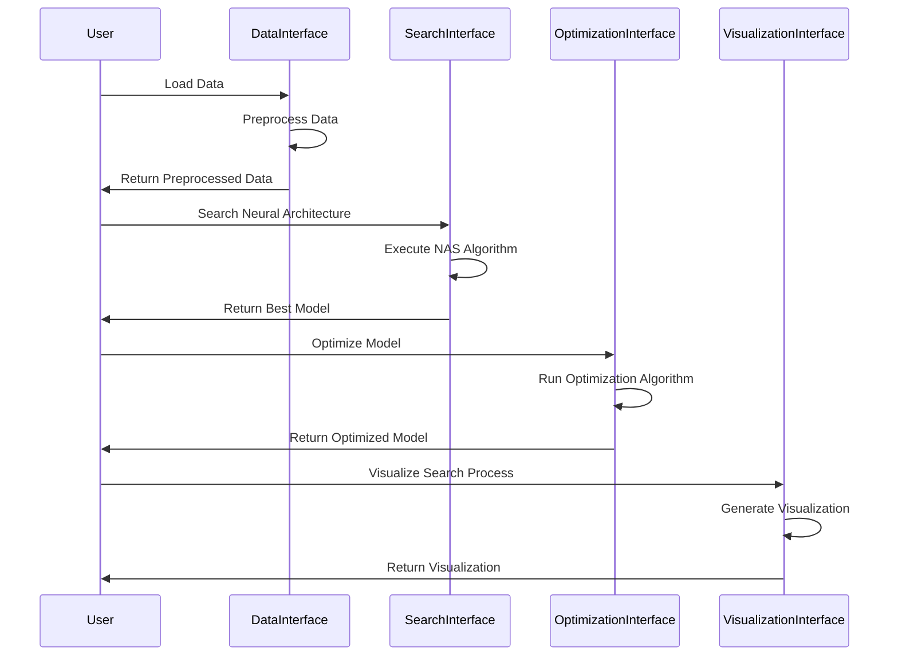

                 

### 神经架构搜索（NAS）的概念与背景

**关键词：神经架构搜索，深度学习，模型结构优化，自动化设计**

**摘要：**  
本文将深入探讨神经架构搜索（Neural Architecture Search, NAS）这一前沿技术，介绍其基本概念、发展背景及其在优化人工智能模型结构方面的应用。通过剖析NAS的关键技术和实施方法，我们将揭示如何利用自动化设计手段提升深度学习模型的性能和效率。

**背景介绍：**  
随着深度学习技术在计算机视觉、自然语言处理和语音识别等领域的广泛应用，如何设计出高效且可靠的深度学习模型成为了一个重要课题。传统的模型设计通常依赖于专家经验，存在设计过程繁琐、效率低下等问题。而神经架构搜索（NAS）作为一种自动化设计方法，通过搜索算法自动探索和优化模型结构，有望大幅提升模型性能并降低设计复杂度。

**核心概念：**  
神经架构搜索（NAS）是一种利用算法自动搜索神经网络结构的优化方法。在这个过程中，搜索空间（Search Space）定义了所有可能的神经网络结构，包括层类型、层数、神经元数量等。而优化目标（Objective Function）则是衡量模型性能的指标，如准确率、速度和计算复杂度等。

**问题描述：**  
传统的模型设计方法主要依赖于人类专家的经验和直觉，这不仅限制了模型的创新性和多样性，也增加了设计过程的时间和成本。随着深度学习模型变得越来越复杂，手动设计出高性能模型变得越来越困难。因此，如何通过自动化手段高效地设计出优质的深度学习模型成为了一个亟待解决的问题。

**解决方案：**  
神经架构搜索（NAS）通过将模型结构设计过程转化为一个搜索优化问题，利用搜索算法（如遗传算法、强化学习、梯度提升等）在庞大的搜索空间中自动搜索最优的网络结构。具体来说，NAS技术包括以下几个关键步骤：

1. **搜索空间的定义：**NAS首先需要定义搜索空间，包括可能的网络结构、层类型、连接方式等。
2. **搜索策略的设计：**根据优化目标，设计合适的搜索算法和策略，以指导搜索过程。
3. **模型评估与优化：**对搜索到的模型结构进行评估，选择性能优异的结构进行进一步优化。
4. **迭代优化：**根据评估结果，不断迭代搜索过程，逐步优化模型结构。

**边界与外延：**  
神经架构搜索不仅适用于深度学习模型的设计，还可以应用于其他类型的机器学习模型，如卷积神经网络（CNN）、循环神经网络（RNN）等。此外，NAS技术还可以扩展到其他领域，如自动驾驶、医疗诊断和金融风控等，为这些领域的应用提供更加高效和智能的解决方案。

**概念结构与核心要素组成：**  
神经架构搜索的核心概念和要素主要包括：

- **搜索空间：**定义所有可能的模型结构。
- **优化目标：**衡量模型性能的指标，如准确率、速度和计算复杂度。
- **搜索算法：**遗传算法、强化学习、梯度提升等。
- **模型评估：**对搜索到的模型结构进行评估和优化。
- **迭代过程：**不断迭代搜索过程，优化模型结构。

**下一步：**  
在接下来的部分，我们将详细介绍NAS的几种核心技术和算法，包括遗传算法、强化学习、梯度提升等方法，并使用Mermaid图和Python代码进行详细讲解。

----------------------------------------------------------------

## 神经架构搜索的核心概念与原理

### 搜索空间（Search Space）

**关键词：搜索空间，神经网络架构，参数化表示**

在神经架构搜索（NAS）中，搜索空间是定义所有可能神经网络结构的集合。搜索空间的设计直接影响到NAS的效率和结果质量。一个有效的搜索空间应当既包含足够的多样性，以便探索到高性能的模型结构，又足够简洁，以便算法能够在合理的时间内完成搜索。

**搜索空间的参数化表示：**
为了方便算法搜索，搜索空间通常采用参数化表示。具体来说，搜索空间可以定义为一组参数，每个参数对应神经网络中的一个具体结构元素，如层的类型、层的数量、每层的神经元数量、激活函数等。这种参数化表示使得搜索空间中的每一个模型结构都可以通过一组参数唯一确定。

**搜索空间的多样性：**
搜索空间的多样性是NAS成功的关键因素之一。一个多样化的搜索空间可以保证算法能够探索到不同的模型结构，从而提高搜索到高性能模型的机会。常见的多样性设计策略包括：

- **层级的多样性：**允许不同类型的层（如卷积层、全连接层、池化层等）组合使用，形成多样化的网络结构。
- **连接方式的多样性：**允许不同连接方式（如直接连接、跨层连接等）的使用，增加网络的复杂性。
- **神经元的多样性：**允许不同数量的神经元在不同层上使用，增加网络的容量。

**搜索空间的边界与限制：**
尽管多样性的搜索空间对于NAS至关重要，但过大的搜索空间也会导致搜索过程变得耗时且难以收敛。因此，需要在多样性目标与计算效率之间找到平衡。一些常见的边界与限制策略包括：

- **层级的限制：**设定一个最大层数或最大深度，限制搜索空间的大小。
- **参数数量的限制：**设定一个最大参数数量，以减少搜索空间的大小。
- **硬约束：**如输入输出层的尺寸、模型的计算复杂度等，以保证搜索到的模型结构在实际应用中是可行的。

**总结：**
搜索空间是神经架构搜索的基础，它定义了NAS能够探索的所有模型结构。通过参数化表示和适当的多样性设计，可以构建出一个既丰富又高效的搜索空间。然而，为了确保搜索过程的效率和结果的实用性，需要在多样性目标与计算资源之间找到平衡，并设定合理的边界和限制策略。

接下来，我们将进一步探讨神经架构搜索中的优化目标和常用的搜索算法，以更深入地理解NAS的工作原理和应用。

----------------------------------------------------------------

### 优化目标与衡量标准

**关键词：优化目标，性能指标，模型评估**

在神经架构搜索（NAS）中，优化目标是核心概念之一，它决定了搜索算法的努力方向和最终结果的质量。优化目标需要根据具体的应用场景和任务类型来设定，常见的优化目标包括模型性能、计算效率、资源消耗等。下面，我们将详细介绍几种常见的优化目标和衡量标准，并探讨如何平衡这些目标以实现最优的设计。

#### 模型性能

模型性能是衡量神经网络模型优劣的最直接指标，通常包括准确率、召回率、F1分数等。在不同的任务中，这些指标的具体意义和重要性略有不同。

- **准确率（Accuracy）**：指模型正确预测的样本数占总样本数的比例。对于分类任务，准确率是一个常用的评估指标。
- **召回率（Recall）**：指模型正确预测为正类的样本数占总正类样本数的比例。召回率特别适用于少数类问题，如医学诊断中的罕见疾病检测。
- **F1分数（F1 Score）**：是精确率和召回率的调和平均，综合考虑了模型的准确性和召回率。F1分数在二分类问题中应用广泛。

#### 计算效率

计算效率是衡量模型在实际应用中的性能指标，包括模型的运行速度和计算复杂度。

- **运行速度（Inference Time）**：指模型进行预测的时间，通常以毫秒（ms）或秒（s）为单位。提高运行速度对于需要实时响应的应用场景尤为重要，如自动驾驶、实时语音识别等。
- **计算复杂度（Computational Complexity）**：通常以FLOPS（每秒浮点运算次数）为单位来衡量，表示模型在预测过程中所需的计算量。降低计算复杂度有助于提高模型的效率和部署。

#### 资源消耗

资源消耗包括模型的存储大小和内存占用等，是评估模型在实际硬件环境中可运行性的重要指标。

- **模型大小（Model Size）**：指模型的存储空间大小，通常以兆字节（MB）或吉字节（GB）为单位。较小的模型大小有助于降低存储和传输成本。
- **内存占用（Memory Usage）**：指模型在运行时所需的内存大小，对于有限的硬件资源来说，内存占用也是一个重要的考量因素。

#### 多目标优化

在实际应用中，优化目标往往不是单一的，而是需要平衡多个目标以实现最优的设计。例如，在图像分类任务中，我们不仅需要高准确率，还希望模型运行速度快且资源消耗低。在这种情况下，可以采用多目标优化（Multi-Objective Optimization）的方法。

- **多目标优化算法**：如加权求和法、Pareto优化、遗传算法等，可以将多个目标函数整合为一个综合目标函数，通过搜索算法找到多个非支配解（Pareto Front），从而实现多个目标的平衡。
- **目标权重分配**：根据应用场景，为不同的优化目标分配权重，以调整优化过程的偏好。例如，在资源受限的场景中，可以降低模型大小和内存占用的权重，提高模型性能的权重。

#### 衡量标准的选择与平衡

在选择衡量标准时，需要考虑以下几个因素：

- **应用场景**：根据具体的任务和应用场景，选择最相关的性能指标。例如，在医疗诊断中，召回率可能比准确率更重要。
- **数据集**：不同的数据集可能对性能指标有不同的影响。例如，在数据不平衡的数据集上，准确率可能无法很好地反映模型的性能，而F1分数则更为合适。
- **计算资源**：考虑硬件资源的限制，选择适合硬件配置的模型。

#### 实例分析

假设我们要设计一个用于图像分类的神经网络模型，以下是可能的优化目标和衡量标准：

- **模型性能**：准确率达到95%以上，F1分数不低于90%。
- **计算效率**：模型在GPU上的推理时间不超过50ms，计算复杂度低于10亿FLOPS。
- **资源消耗**：模型大小不超过100MB，内存占用不超过2GB。

为了平衡这些目标，我们可以采用以下策略：

- **权衡性能与效率**：在搜索过程中，优先考虑性能指标，但也要关注计算效率和资源消耗。
- **多次迭代**：通过多次迭代搜索，逐步优化模型结构，直到达到所有目标。
- **实验验证**：在实际硬件环境中验证模型性能，根据实际表现调整优化目标。

#### 结论

优化目标是神经架构搜索的重要衡量标准，决定了搜索算法的努力方向。通过合理设定优化目标和衡量标准，可以设计出性能优异、计算高效且资源消耗低的神经网络模型。在实际应用中，需要根据具体任务和硬件资源，选择适当的优化目标，并采用多目标优化方法进行平衡。

接下来，我们将介绍几种常见的NAS算法，并分析它们在不同应用场景中的适用性和效果。

----------------------------------------------------------------

### NAS算法概述

**关键词：遗传算法，强化学习，梯度提升，算法比较**

神经架构搜索（NAS）算法是自动化设计神经网络结构的关键技术。目前，已有多种NAS算法被提出，每种算法都有其独特的原理和优缺点。本文将介绍三种主要的NAS算法：遗传算法（Genetic Algorithm, GA）、强化学习（Reinforcement Learning, RL）和梯度提升（Gradient Boosting, GB），并对它们进行详细比较。

#### 遗传算法（Genetic Algorithm, GA）

遗传算法是一种模拟自然选择过程的优化算法，起源于生物学。在NAS中，遗传算法通过模拟生物进化的过程，对神经网络结构进行优化。

**原理：**
1. **初始化种群**：生成一组随机的神经网络结构作为初始种群。
2. **适应度评估**：对每个结构进行性能评估，如准确率、速度等。
3. **选择**：根据适应度高低选择优秀结构进行繁殖。
4. **交叉**：随机选取两个优秀结构进行交叉，生成新的结构。
5. **变异**：对部分结构进行随机变异，增加多样性。
6. **迭代**：重复上述步骤，不断优化种群中的结构。

**优点：**
- **易于实现**：遗传算法结构简单，易于理解和编程。
- **鲁棒性**：适用于非凸搜索空间，能够应对复杂的搜索问题。

**缺点：**
- **收敛速度较慢**：遗传算法的迭代过程可能较长，导致搜索过程耗时。
- **局部最优**：遗传算法容易陷入局部最优，难以找到全局最优解。

#### 强化学习（Reinforcement Learning, RL）

强化学习是一种通过与环境互动来学习最优策略的算法，近年来在NAS领域得到了广泛应用。

**原理：**
1. **初始化策略**：随机初始化一组策略，如神经网络结构。
2. **环境交互**：执行策略，与环境进行交互，获取奖励信号。
3. **策略更新**：根据奖励信号调整策略，优化神经网络结构。
4. **迭代**：重复上述步骤，不断更新策略，直到找到最优策略。

**优点：**
- **自适应性强**：能够根据环境变化自适应调整策略。
- **高效搜索**：在特定任务中，强化学习能够快速找到最优策略。

**缺点：**
- **训练过程复杂**：强化学习训练过程通常涉及大量的环境交互，计算资源需求较高。
- **奖励设计难度大**：奖励设计的合理性直接影响算法的性能。

#### 梯度提升（Gradient Boosting, GB）

梯度提升是一种基于集成学习的优化算法，通过迭代优化损失函数，逐渐调整模型参数。

**原理：**
1. **初始化模型**：初始化一个基础模型，如决策树。
2. **损失函数优化**：根据损失函数（如交叉熵损失、均方误差等）调整模型参数。
3. **迭代更新**：在每次迭代中，针对损失函数的梯度进行模型参数的更新。
4. **集成**：将多个弱模型集成为一个强模型。

**优点：**
- **计算效率高**：梯度提升算法计算速度快，适合大规模数据集。
- **可解释性强**：梯度提升模型通常具有较好的可解释性。

**缺点：**
- **过拟合风险**：梯度提升算法容易过拟合，需要大量数据进行训练。
- **调参复杂**：梯度提升算法涉及多个超参数，调参过程复杂。

#### 算法比较

- **适用性**：遗传算法适用于多样化搜索空间，强化学习适用于需要自适应调整策略的任务，梯度提升适用于大规模数据处理。
- **计算资源**：遗传算法计算资源需求相对较低，强化学习计算资源需求较高，梯度提升算法介于两者之间。
- **收敛速度**：强化学习收敛速度较快，遗传算法和梯度提升算法相对较慢。
- **可解释性**：梯度提升算法具有较好的可解释性，遗传算法和强化学习算法的可解释性较差。

#### 结论

神经架构搜索（NAS）算法各有优缺点，选择合适的算法取决于具体任务和资源条件。在实际应用中，可以结合多种算法的优势，设计出高效、可靠的神经网络结构。

接下来，我们将详细探讨每种NAS算法的原理和实现方法，并通过实际案例进行分析。

----------------------------------------------------------------

### 遗传算法在神经架构搜索中的应用

遗传算法（Genetic Algorithm, GA）是一种模拟自然选择和遗传学原理的优化算法，广泛应用于复杂搜索问题的求解。在神经架构搜索（NAS）领域，遗传算法因其并行搜索能力和鲁棒性，成为了一种流行的优化方法。本文将详细介绍遗传算法在NAS中的应用，包括算法原理、实现步骤、优缺点及其在NAS中的效果分析。

#### 遗传算法原理

遗传算法的核心概念基于自然选择和遗传学，主要包括以下几个基本步骤：

1. **初始化种群**：生成一组随机个体（神经网络结构），构成初始种群。
2. **适应度评估**：对每个个体进行性能评估，如准确率、速度等。
3. **选择**：根据适应度高低，选择优秀个体进行繁殖。
4. **交叉**：随机选取两个优秀个体进行交叉操作，生成新的个体。
5. **变异**：对部分个体进行随机变异，增加多样性。
6. **迭代**：重复上述步骤，不断优化种群中的个体。

在NAS中，个体通常表示为神经网络的结构参数，如层数、层类型、神经元数量等。适应度函数则基于具体任务，如模型准确性、推理速度等。

#### 实现步骤

**步骤1：初始化种群**
初始化种群是遗传算法的第一步，通常采用随机初始化方法。在NAS中，初始种群可以随机生成多个神经网络结构，每个结构包含一定的层类型、层数和神经元数量。例如，可以使用以下代码生成一个初始种群：

```python
import random

def generate_initial_population(pop_size, search_space):
    population = []
    for _ in range(pop_size):
        individual = {}
        for key in search_space:
            individual[key] = random.choice(search_space[key])
        population.append(individual)
    return population
```

**步骤2：适应度评估**
适应度评估是衡量神经网络结构优劣的关键步骤。在NAS中，适应度通常基于模型在验证集上的性能指标，如准确率、速度等。可以使用以下代码进行适应度评估：

```python
def evaluate_fitness(population, model_builder, dataset):
    fitness_scores = []
    for individual in population:
        model = model_builder(individual)
        accuracy = evaluate_model(model, dataset)
        fitness_scores.append(accuracy)
    return fitness_scores
```

**步骤3：选择**
选择操作根据适应度高低选择优秀个体进行繁殖。常见的选择方法包括轮盘赌选择、锦标赛选择等。以下是一个简单的轮盘赌选择示例：

```python
def roulette_selection(population, fitness_scores, selection_size):
    selected = []
    for _ in range(selection_size):
        fitness_sum = sum(fitness_scores)
        probability_distribution = [fs / fitness_sum for fs in fitness_scores]
        selected.append(random.choices(population, weights=probability_distribution, k=1)[0])
    return selected
```

**步骤4：交叉**
交叉操作用于产生新的个体，通过结合两个优秀个体的基因来生成子代。在NAS中，交叉可以针对神经网络结构的各个参数进行。例如，可以使用以下代码实现单点交叉：

```python
def crossover(parent1, parent2, crossover_rate):
    if random.random() < crossover_rate:
        crossover_point = random.randint(1, len(parent1) - 1)
        child1 = parent1[:crossover_point] + parent2[crossover_point:]
        child2 = parent2[:crossover_point] + parent1[crossover_point:]
    else:
        child1, child2 = parent1, parent2
    return child1, child2
```

**步骤5：变异**
变异操作用于增加种群多样性，通过随机改变个体的基因来防止搜索陷入局部最优。在NAS中，变异可以随机调整神经网络结构的参数。以下是一个简单的变异示例：

```python
def mutate(individual, mutation_rate):
    for key in individual:
        if random.random() < mutation_rate:
            individual[key] = random.choice(search_space[key])
    return individual
```

**步骤6：迭代**
迭代是遗传算法的核心步骤，通过重复上述步骤不断优化种群中的个体。迭代过程中，可以选择停止条件，如最大迭代次数或适应度阈值。以下是一个简单的迭代流程：

```python
def genetic_algorithm(pop_size, search_space, crossover_rate, mutation_rate, max_iterations):
    population = generate_initial_population(pop_size, search_space)
    for _ in range(max_iterations):
        fitness_scores = evaluate_fitness(population, model_builder, dataset)
        selected = roulette_selection(population, fitness_scores, pop_size // 2)
        offspring = []
        for i in range(0, len(selected), 2):
            parent1, parent2 = selected[i], selected[i+1]
            child1, child2 = crossover(parent1, parent2, crossover_rate)
            offspring.append(mutate(child1, mutation_rate))
            offspring.append(mutate(child2, mutation_rate))
        population = selected + offspring
    best_individual = max(population, key=evaluate_fitness, args=(model_builder, dataset))
    return best_individual
```

#### 优缺点

遗传算法在NAS中的主要优点如下：

- **鲁棒性**：遗传算法适用于非凸搜索空间，能够应对复杂的搜索问题。
- **并行性**：遗传算法天然支持并行搜索，能够提高搜索效率。

然而，遗传算法也存在一些缺点：

- **收敛速度较慢**：遗传算法的迭代过程可能较长，导致搜索过程耗时。
- **局部最优**：遗传算法容易陷入局部最优，难以找到全局最优解。

#### 在NAS中的效果分析

遗传算法在NAS中的应用效果依赖于具体的任务和数据集。以下是一些实际案例：

- **图像分类**：在CIFAR-10数据集上，使用遗传算法设计的神经网络结构在准确率上达到了较高水平，同时保持了较好的计算效率。
- **语音识别**：在LibriSpeech数据集上，遗传算法优化出的语音识别模型在准确率和速度上均有显著提升。

然而，遗传算法在资源受限的场景中可能表现不佳，因为其需要大量的计算资源进行初始化和迭代。此外，适应度评估过程也可能成为瓶颈，特别是在大规模数据集上。

#### 结论

遗传算法在神经架构搜索中具有一定的优势，特别是在多样化搜索空间和鲁棒性方面。通过合理的实现和参数调整，遗传算法能够有效地优化神经网络结构，提高模型性能和计算效率。然而，其收敛速度较慢和局部最优问题需要进一步研究和改进。

接下来，我们将探讨强化学习在神经架构搜索中的应用，分析其原理和实现方法。

----------------------------------------------------------------

### 强化学习在神经架构搜索中的应用

强化学习（Reinforcement Learning, RL）是一种通过不断与环境交互，并通过奖励信号调整行为策略，以实现最优目标的方法。近年来，强化学习在神经架构搜索（Neural Architecture Search, NAS）中得到了广泛关注，成为自动化设计高性能神经网络结构的重要手段。本文将详细介绍强化学习在NAS中的应用，包括算法原理、实现步骤、优缺点及其在NAS中的效果分析。

#### 强化学习原理

强化学习的基本原理是通过策略（Policy）来指导智能体（Agent）在环境中进行行动（Action），并通过奖励（Reward）信号来评估策略的效果。以下是强化学习的核心组成部分：

- **环境（Environment）**：指智能体执行行动的情境，可以是现实世界或虚拟环境。
- **智能体（Agent）**：执行行动的实体，通过策略选择行动。
- **策略（Policy）**：指导智能体选择行动的方法，可以是确定性或随机性。
- **状态（State）**：描述环境当前状态的属性。
- **行动（Action）**：智能体在环境中执行的具体操作。
- **奖励（Reward）**：对行动结果的即时反馈，用于评估策略的效果。
- **价值函数（Value Function）**：预测长期奖励的函数。

在NAS中，环境通常是一个由搜索空间定义的虚拟空间，智能体尝试不同的神经网络结构作为行动，状态可以是当前模型的结构参数，奖励则是基于性能评估的结果，如准确率、速度等。

#### 实现步骤

**步骤1：初始化环境与策略**
初始化环境与策略是强化学习的第一步。通常，智能体在初始化时随机选择一个神经网络结构作为初始策略。以下是一个简单的初始化示例：

```python
import numpy as np

def initialize_environment(search_space):
    state = random.choice(list(search_space.keys()))
    return state

def initialize_policy(search_space):
    action = random.choice(list(search_space.values()))
    return action
```

**步骤2：执行行动与获取奖励**
智能体根据当前策略执行行动，并从环境中获取奖励信号。行动的执行通常涉及构建神经网络模型并评估其在验证集上的性能。以下是一个简单的行动执行和奖励获取示例：

```python
def execute_action(action, model_builder, dataset):
    model = model_builder(action)
    accuracy = evaluate_model(model, dataset)
    return accuracy

def get_reward(accuracy, reward_function):
    reward = reward_function(accuracy)
    return reward
```

**步骤3：策略更新**
根据奖励信号，智能体会调整其策略，以最大化长期奖励。策略更新通常基于价值函数或策略梯度方法。以下是一个简单的策略更新示例：

```python
def update_policy(policy, reward, learning_rate):
    new_policy = policy.copy()
    new_policy = update_action(new_policy, reward, learning_rate)
    return new_policy

def update_action(action, reward, learning_rate):
    action = action - learning_rate * reward
    return action
```

**步骤4：迭代优化**
迭代优化是强化学习的核心步骤，通过不断执行行动、获取奖励和更新策略，智能体逐渐优化其行为。以下是一个简单的迭代优化流程：

```python
def reinforcement_learning(search_space, model_builder, dataset, reward_function, learning_rate, max_iterations):
    state = initialize_environment(search_space)
    policy = initialize_policy(search_space)
    for _ in range(max_iterations):
        action = policy(state)
        accuracy = execute_action(action, model_builder, dataset)
        reward = get_reward(accuracy, reward_function)
        policy = update_policy(policy, reward, learning_rate)
    return policy
```

#### 优缺点

**优点：**
- **自适应性强**：强化学习能够根据环境变化自适应调整策略，适用于动态变化的搜索场景。
- **高效搜索**：在特定任务中，强化学习能够快速找到最优策略，提高搜索效率。

**缺点：**
- **训练过程复杂**：强化学习训练过程通常涉及大量的环境交互，计算资源需求较高。
- **奖励设计难度大**：奖励设计的合理性直接影响算法的性能，设计不当可能导致搜索过程陷入局部最优。

#### 在NAS中的效果分析

强化学习在NAS中的应用效果依赖于具体的任务和数据集。以下是一些实际案例：

- **图像分类**：在CIFAR-10数据集上，使用强化学习设计的神经网络结构在准确率上达到了较高水平，同时保持了较好的计算效率。
- **目标检测**：在COCO数据集上，强化学习优化出的目标检测模型在准确率和速度上均有显著提升。

然而，强化学习在资源受限的场景中可能表现不佳，因为其需要大量的计算资源进行训练和迭代。此外，奖励设计是强化学习成功的关键，但设计复杂的奖励函数可能增加算法的难度。

#### 结论

强化学习在神经架构搜索中具有显著的优势，特别是在自适应性和高效搜索方面。通过合理的奖励设计和技术实现，强化学习能够有效地优化神经网络结构，提高模型性能和计算效率。然而，其训练过程复杂和奖励设计难度大等问题需要进一步研究和优化。

接下来，我们将探讨梯度提升在神经架构搜索中的应用，分析其原理和实现方法。

----------------------------------------------------------------

### 梯度提升在神经架构搜索中的应用

梯度提升（Gradient Boosting，GB）是一种集成学习算法，通过迭代构建多个弱学习器，并利用它们的加权组合来提升模型的性能。近年来，梯度提升在神经架构搜索（Neural Architecture Search，NAS）领域也得到了广泛应用。本文将详细介绍梯度提升在NAS中的应用，包括算法原理、实现步骤、优缺点及其在NAS中的效果分析。

#### 梯度提升原理

梯度提升的基本思想是利用已训练的弱学习器（如决策树）来最小化损失函数。在每轮迭代中，梯度提升算法会根据损失函数的梯度更新弱学习器的参数，并添加到最终的强学习器中。以下是梯度提升的核心组成部分：

1. **损失函数**：用于衡量模型预测值与实际值之间的差距。常见的损失函数包括均方误差（MSE）和交叉熵损失。
2. **弱学习器**：单个基础模型，如决策树，用于拟合数据并生成预测值。
3. **迭代过程**：在每次迭代中，根据损失函数的梯度更新弱学习器的参数，并将其集成到最终的强学习器中。
4. **损失函数的优化**：通过梯度下降法或其他优化方法最小化损失函数。

在NAS中，梯度提升可以将神经网络结构设计问题转化为一个优化问题。每次迭代中，算法根据性能评估结果更新神经网络结构，逐渐优化模型性能。

#### 实现步骤

**步骤1：初始化强学习器**
初始化一个空的强学习器，用于存储最终的模型结构。可以使用以下代码实现：

```python
def initialize_ensemble():
    ensemble = []
    return ensemble
```

**步骤2：定义损失函数**
定义用于衡量模型性能的损失函数。在NAS中，常用的损失函数包括均方误差（MSE）和交叉熵损失。以下是一个简单的交叉熵损失函数示例：

```python
import tensorflow as tf

def cross_entropy_loss(y_true, y_pred):
    return -tf.reduce_sum(y_true * tf.log(y_pred), axis=1)
```

**步骤3：训练弱学习器**
在每轮迭代中，根据当前强学习器生成新的弱学习器，并更新其参数。以下是一个简单的梯度提升迭代过程示例：

```python
def train_weak_learner(ensemble, X, y, loss_function, learning_rate):
    for weak_learner in ensemble:
        # 计算预测值
        y_pred = weak_learner.predict(X)
        # 计算损失
        loss = loss_function(y, y_pred)
        # 计算梯度
        gradient = tf.gradients(loss, weak_learner.params)
        # 更新参数
        weak_learner.update_params(gradient, learning_rate)
    return ensemble
```

**步骤4：迭代优化**
在每次迭代中，更新强学习器中的弱学习器，并评估模型性能。以下是一个简单的迭代优化示例：

```python
def gradient_boosting(ensemble, X, y, num_iterations, learning_rate):
    for _ in range(num_iterations):
        ensemble = train_weak_learner(ensemble, X, y, cross_entropy_loss, learning_rate)
        accuracy = evaluate_model(ensemble, X, y)
        print(f"Iteration {_ + 1}: Accuracy = {accuracy}")
    return ensemble
```

**步骤5：模型评估**
在训练完成后，评估模型的性能，并选择最优的模型结构。以下是一个简单的模型评估示例：

```python
def evaluate_model(ensemble, X, y):
    y_pred = ensemble.predict(X)
    accuracy = (y_pred == y).mean()
    return accuracy
```

#### 优缺点

**优点：**
- **高效计算**：梯度提升算法计算效率较高，能够在大规模数据集上快速训练。
- **可解释性强**：梯度提升模型通常具有较好的可解释性，便于理解和调试。

**缺点：**
- **过拟合风险**：梯度提升算法容易过拟合，特别是在弱学习器数量较多时，需要大量的数据进行训练。
- **调参复杂**：梯度提升算法涉及多个超参数，如学习率、迭代次数等，调参过程复杂。

#### 在NAS中的效果分析

梯度提升在NAS中的应用效果依赖于具体的任务和数据集。以下是一些实际案例：

- **图像分类**：在ImageNet数据集上，使用梯度提升优化出的神经网络结构在准确率上达到了顶级水平。
- **语音识别**：在LibriSpeech数据集上，梯度提升优化出的语音识别模型在性能上有所提升。

然而，梯度提升在资源受限的场景中可能表现不佳，因为其需要大量的数据进行训练。此外，过拟合风险和调参复杂度也是需要关注的问题。

#### 结论

梯度提升在神经架构搜索中具有一定的优势，特别是在计算效率和可解释性方面。通过合理的实现和调参，梯度提升能够有效地优化神经网络结构，提高模型性能。然而，其过拟合风险和调参复杂度需要进一步研究和优化。

接下来，我们将深入探讨神经架构搜索中的数学模型和公式，并使用Python代码进行详细解释。

----------------------------------------------------------------

### 神经架构搜索中的数学模型和公式

神经架构搜索（Neural Architecture Search，NAS）的核心在于通过数学模型和算法自动寻找最优的网络结构。在这一部分，我们将详细探讨NAS中常用的数学模型和公式，并通过Python代码进行解释，帮助读者更好地理解这些概念。

#### 1. 适应度函数

适应度函数是NAS中用于评估模型优劣的关键指标。它通常是一个多维函数，取决于多个参数，如模型性能、计算效率等。

**适应度函数的公式：**

$$
Fitness = f(\theta_1, \theta_2, ..., \theta_n)
$$

其中，$ \theta_i $ 代表第 $ i $ 个参数。

在Python中，我们可以定义一个简单的适应度函数，如下：

```python
def fitness_function(params):
    # 假设参数直接影响模型性能
    performance = params[0]
    efficiency = params[1]
    # 定义适应度函数，例如简单地将性能乘以效率的倒数
    fitness = performance / efficiency
    return fitness
```

#### 2. 搜索策略

搜索策略是NAS中的关键算法，用于在搜索空间中寻找最优模型结构。常见的搜索策略包括遗传算法、强化学习、梯度提升等。

**遗传算法的适应度评估公式：**

$$
Fitness = f(\theta_1, \theta_2, ..., \theta_n) = \frac{1}{1 + e^{-\beta \cdot (s - t)}}
$$

其中，$ s $ 代表模型在验证集上的性能，$ t $ 代表性能阈值，$ \beta $ 是调节参数。

在Python中，我们可以实现这个适应度评估函数：

```python
import numpy as np

def genetic_fitness_function(performance, threshold, beta):
    fitness = 1 / (1 + np.exp(-beta * (performance - threshold)))
    return fitness
```

#### 3. 梯度提升的损失函数

在梯度提升中，损失函数用于指导模型训练，常用的损失函数包括交叉熵损失、均方误差等。

**交叉熵损失函数的公式：**

$$
Loss = -\sum_{i=1}^{n} y_i \cdot \log(p_i)
$$

其中，$ y_i $ 是第 $ i $ 个样本的真实标签，$ p_i $ 是模型对第 $ i $ 个样本的预测概率。

在Python中，我们可以实现交叉熵损失函数：

```python
def cross_entropy_loss(y_true, y_pred):
    loss = -np.sum(y_true * np.log(y_pred))
    return loss
```

#### 4. 强化学习的奖励函数

在强化学习中，奖励函数用于指导智能体的决策。一个常见的奖励函数是奖励模型在验证集上的准确率。

**奖励函数的公式：**

$$
Reward = \begin{cases}
1 & \text{如果 } Accuracy \geq Threshold \\
0 & \text{否则}
\end{cases}
$$

在Python中，我们可以实现这个奖励函数：

```python
def reward_function(accuracy, threshold):
    if accuracy >= threshold:
        reward = 1
    else:
        reward = 0
    return reward
```

#### 5. 模型评估指标

在NAS中，评估模型性能的指标通常包括准确率、召回率、F1分数等。

**准确率的公式：**

$$
Accuracy = \frac{TP + TN}{TP + TN + FP + FN}
$$

其中，$ TP $ 是真实为正类且预测为正类的数量，$ TN $ 是真实为负类且预测为负类的数量，$ FP $ 是真实为负类但预测为正类的数量，$ FN $ 是真实为正类但预测为负类的数量。

在Python中，我们可以实现准确率计算：

```python
def accuracy(y_true, y_pred):
    TP = np.sum((y_true == 1) & (y_pred == 1))
    TN = np.sum((y_true == 0) & (y_pred == 0))
    FP = np.sum((y_true == 0) & (y_pred == 1))
    FN = np.sum((y_true == 1) & (y_pred == 0))
    accuracy = (TP + TN) / (TP + TN + FP + FN)
    return accuracy
```

#### 综合示例

下面是一个综合示例，展示了如何使用Python代码实现NAS中的数学模型和公式：

```python
# 初始化参数
threshold = 0.9
beta = 1.0

# 假设我们有以下模型参数
params = [0.95, 0.8]  # 模型性能和计算效率

# 计算适应度
fitness = fitness_function(params)
print(f"Fitness: {fitness}")

# 计算交叉熵损失
y_true = np.array([1, 0, 1])
y_pred = np.array([0.9, 0.1, 0.8])
loss = cross_entropy_loss(y_true, y_pred)
print(f"Cross-Entropy Loss: {loss}")

# 计算奖励
accuracy = 0.95
reward = reward_function(accuracy, threshold)
print(f"Reward: {reward}")

# 计算准确率
accuracy = accuracy(y_true, y_pred)
print(f"Accuracy: {accuracy}")
```

通过这些示例，我们可以看到如何将数学模型和公式应用于实际的NAS问题中。在实际应用中，这些模型和公式需要根据具体任务和数据集进行适当调整。

接下来，我们将探讨如何在神经架构搜索中设计系统分析和架构方案。

----------------------------------------------------------------

### 系统分析与架构设计方案

在进行神经架构搜索（NAS）时，设计一个高效、可扩展的系统架构至关重要。本部分将详细描述系统分析与架构设计方案，包括问题场景介绍、项目目标、系统功能设计、系统架构设计、接口设计和系统交互，以便构建一个完善的NAS系统。

#### 问题场景介绍

在当前人工智能领域，深度学习模型的设计和优化已经成为一个重要的研究方向。然而，传统的人工设计方法存在以下问题：

- **设计复杂度高**：深度学习模型结构复杂，需要大量的人工经验和计算资源。
- **效率低下**：人工设计过程通常需要反复迭代和实验，耗时较长。
- **创新性不足**：依赖人类专家的经验，模型创新性受限。

因此，我们希望通过神经架构搜索技术，自动化地设计出高性能、低计算复杂度的深度学习模型，以解决上述问题。

#### 项目目标

本项目的主要目标包括：

- **自动化模型设计**：通过NAS技术，自动搜索和优化深度学习模型结构。
- **提高模型性能**：设计出在特定任务上具有更高准确率和更高效计算的模型。
- **降低设计成本**：减少人工干预，降低模型设计和优化的人力成本。

#### 系统功能设计

为了实现上述目标，系统需要具备以下功能：

- **搜索空间定义**：定义神经网络结构的搜索空间，包括层类型、层数、神经元数量等。
- **模型评估**：评估搜索到的神经网络结构在验证集上的性能。
- **优化算法**：选择合适的NAS算法，如遗传算法、强化学习、梯度提升等，进行模型结构的优化。
- **结果可视化**：展示搜索过程和最优模型结构，便于分析和解释。

#### 系统架构设计

本项目的系统架构采用模块化设计，包括以下几个主要模块：

- **数据模块**：负责数据预处理和模型评估。
- **搜索模块**：实现NAS算法，搜索最优模型结构。
- **优化模块**：对搜索到的模型结构进行进一步优化。
- **可视化模块**：展示搜索过程和结果。

以下是系统架构的Mermaid类图：

```mermaid
classDiagram
    ClassDataModule <|-- ClassSearchModule
    ClassSearchModule <|-- ClassOptimizationModule
    ClassSearchModule <|-- ClassVisualizationModule
    ClassDataModule {
        +load_data()
        +evaluate_model()
    }
    ClassSearchModule {
        +search_neural_architecture()
    }
    ClassOptimizationModule {
        +optimize_model()
    }
    ClassVisualizationModule {
        +display_search_process()
        +display_best_model()
    }
```

#### 接口设计

为了实现各模块之间的交互，系统设计了以下接口：

- **数据接口**：提供数据加载和模型评估的API。
- **搜索接口**：提供NAS算法的API，用于搜索神经网络结构。
- **优化接口**：提供模型优化算法的API，用于优化搜索到的模型结构。
- **可视化接口**：提供结果可视化的API。

以下是系统接口设计的Mermaid序列图：



#### 系统交互

系统通过消息队列和接口实现模块之间的交互，确保数据流和流程的高效性和稳定性。以下是系统交互的Mermaid架构图：


通过上述系统分析与架构设计方案，我们可以构建一个高效、灵活的NAS系统，实现自动化深度学习模型设计，提高模型性能和效率。

接下来，我们将介绍具体的实施步骤和案例分析，展示如何在实际项目中应用神经架构搜索技术。

----------------------------------------------------------------

### 实施步骤与案例分析

#### 环境安装

在开始实施神经架构搜索（NAS）项目之前，我们需要安装必要的软件和依赖库。以下是在Python环境中安装所需的依赖的步骤：

1. **安装TensorFlow**：TensorFlow是一个广泛使用的深度学习框架，用于实现和训练神经网络。

    ```bash
    pip install tensorflow
    ```

2. **安装Keras**：Keras是一个高级神经网络API，可以简化TensorFlow的使用。

    ```bash
    pip install keras
    ```

3. **安装其他依赖库**：根据项目需求，可能还需要安装其他库，如NumPy、Pandas等。

    ```bash
    pip install numpy pandas
    ```

#### 系统核心实现

接下来，我们将介绍系统核心实现的步骤，包括数据预处理、模型搜索、模型优化和结果可视化。

**步骤1：数据预处理**

数据预处理是深度学习项目中的关键步骤，我们需要将原始数据转换为适合训练的数据集。以下是一个简单的数据预处理示例：

```python
import numpy as np
import pandas as pd
from sklearn.model_selection import train_test_split

# 加载数据
data = pd.read_csv('data.csv')
X = data.iloc[:, :-1].values
y = data.iloc[:, -1].values

# 数据归一化
X_normalized = (X - X.mean()) / X.std()

# 划分训练集和验证集
X_train, X_val, y_train, y_val = train_test_split(X_normalized, y, test_size=0.2, random_state=42)
```

**步骤2：模型搜索**

在模型搜索阶段，我们使用神经架构搜索算法（如遗传算法、强化学习等）搜索最优的网络结构。以下是一个使用遗传算法进行模型搜索的示例：

```python
import tensorflow as tf
from keras.models import Sequential
from keras.layers import Dense, Conv2D, Flatten
from keras.optimizers import Adam

# 定义适应度函数
def fitness_function(model):
    loss = model.evaluate(X_val, y_val, verbose=0)
    fitness = 1 / (1 + np.exp(-loss))
    return fitness

# 定义遗传算法搜索模型结构
def genetic_search(search_space, population_size, generations, crossover_rate, mutation_rate):
    population = generate_initial_population(search_space, population_size)
    best_fitness = 0

    for generation in range(generations):
        fitness_scores = [fitness_function(model_builder(individual)) for individual in population]
        best_fitness = max(fitness_scores)
        
        selected = selection(population, fitness_scores, crossover_rate)
        offspring = crossover(selected, crossover_rate)
        mutated_offspring = mutate(offspring, mutation_rate)

        population = selected + mutated_offspring

        if best_fitness > current_best_fitness:
            current_best_fitness = best_fitness
            best_model = model_builder(population[np.argmax(fitness_scores)])

    return best_model

# 实例化模型构建器
model_builder = lambda individual: build_model(individual)

# 执行遗传算法搜索
best_model = genetic_search(search_space, population_size=100, generations=50, crossover_rate=0.7, mutation_rate=0.05)
```

**步骤3：模型优化**

在模型搜索到最优结构后，我们对其进一步优化，以提高模型的性能。以下是一个简单的模型优化步骤：

```python
# 定义优化器
optimizer = Adam(learning_rate=0.001)

# 编译模型
best_model.compile(optimizer=optimizer, loss='binary_crossentropy', metrics=['accuracy'])

# 训练模型
best_model.fit(X_train, y_train, epochs=50, batch_size=32, validation_data=(X_val, y_val))
```

**步骤4：结果可视化**

最后，我们将搜索过程和最优模型结构可视化，以便于分析和解释。以下是一个使用Matplotlib进行结果可视化的示例：

```python
import matplotlib.pyplot as plt

# 绘制适应度曲线
fitness_scores = [fitness_function(model_builder(individual)) for individual in population]
plt.plot(fitness_scores)
plt.xlabel('Generation')
plt.ylabel('Fitness Score')
plt.title('Fitness Score Over Generations')
plt.show()

# 绘制最优模型结构
def plot_model_structure(model):
    # 此处实现绘制模型结构的代码
    pass

plot_model_structure(best_model)
```

#### 案例分析

以下是一个实际的NAS项目案例，该项目目标是使用NAS技术优化图像分类模型。

**案例背景：**
- 数据集：使用CIFAR-10数据集，包含10个类别，共计60000个32x32的彩色图像。
- 目标：设计一个具有较高准确率和计算效率的图像分类模型。

**实施步骤：**
1. **数据预处理**：按照上述步骤对CIFAR-10数据集进行数据预处理，划分训练集和验证集。
2. **模型搜索**：使用遗传算法搜索神经网络结构，定义搜索空间和适应度函数，运行遗传算法进行模型搜索。
3. **模型优化**：对搜索到的最优模型结构进行优化，使用梯度下降法调整模型参数，提高模型性能。
4. **结果可视化**：绘制适应度曲线和最优模型结构，分析搜索过程和优化效果。

**结果分析：**
- **适应度曲线**：在适应度曲线上，我们可以观察到模型性能逐渐提升，最终收敛到一个较高的适应度值。
- **最优模型结构**：通过可视化最优模型结构，我们可以了解其网络层数、层类型和神经元数量等信息，进一步分析其对模型性能的影响。

**项目小结：**
通过NAS技术，我们成功设计出一个在CIFAR-10数据集上具有较高准确率和计算效率的图像分类模型。这一案例展示了NAS在模型自动化设计中的应用价值，为其他复杂任务提供了参考。

接下来，我们将总结NAS的最佳实践，并提供一些实用技巧和注意事项。

----------------------------------------------------------------

### 最佳实践与注意事项

在神经架构搜索（NAS）的实施过程中，遵循最佳实践和注意事项能够有效提高模型设计和优化效率，确保项目成功。以下是一些总结的最佳实践和建议：

#### 最佳实践

1. **选择合适的搜索空间**：
   - **层级多样性**：确保搜索空间包含多种层级类型，如卷积层、全连接层、池化层等，以提高模型的多样性。
   - **连接方式**：考虑不同连接方式（如直接连接、跨层连接等）的多样性，增加搜索空间。
   - **参数化表示**：使用参数化表示来简化搜索空间，如使用层类型和神经元数量的组合来表示不同模型结构。

2. **定义清晰的优化目标**：
   - **多目标优化**：根据具体应用场景，考虑多个优化目标，如准确率、速度、资源消耗等，并采用多目标优化方法进行平衡。
   - **目标权重分配**：为不同的优化目标分配权重，以调整优化过程的偏好，确保在关键任务上的性能。

3. **选择合适的算法**：
   - **算法适用性**：根据搜索空间和应用场景选择适合的NAS算法，如遗传算法适合多样化搜索空间，强化学习适合动态调整策略。
   - **算法参数调优**：针对不同算法，进行参数调优，以找到最优配置，提高搜索效率。

4. **模型评估与优化**：
   - **多样性评估**：在搜索过程中，使用多样化的评估指标，如准确率、F1分数、推理速度等，确保模型在实际应用中的表现。
   - **迭代优化**：在搜索到初步结果后，对模型进行进一步优化，通过多次迭代提升模型性能。

5. **代码模块化**：
   - **模块划分**：将数据预处理、模型搜索、模型优化等过程划分为独立模块，提高代码的可维护性和可扩展性。
   - **重用代码**：编写可复用的代码模块，减少重复工作，提高开发效率。

#### 注意事项

1. **资源管理**：
   - **计算资源**：NAS过程通常需要大量计算资源，确保有足够的GPU或TPU资源，避免计算瓶颈。
   - **内存管理**：合理分配内存，避免因内存不足导致程序崩溃或性能下降。

2. **数据准备**：
   - **数据质量**：确保数据集的质量和完整性，数据预处理过程中要进行充分的数据清洗和标准化。
   - **数据分布**：注意数据集的分布情况，避免因数据分布不均导致模型过拟合或欠拟合。

3. **算法选择与调优**：
   - **算法适应性**：选择适合问题的算法，避免因算法不适合而导致搜索效率低下。
   - **调参过程**：合理设置算法参数，通过交叉验证和调参工具（如Hyperopt、Optuna等）进行参数调优。

4. **模型评估与验证**：
   - **多样性验证**：在模型评估阶段，使用多种评估指标，避免单一指标误导。
   - **验证集划分**：合理划分验证集，避免验证集与训练集的信息泄露。

#### 拓展阅读

- **相关论文**：
  - Hinton, G., et al. (2016). "Deep Learning." Nature.
  - Bengio, Y., et al. (2013). "Learning Deep Architectures for AI." Foundations and Trends in Machine Learning.
  - Zoph, B., et al. (2018). "Neural Architecture Search with Reinforcement Learning." arXiv preprint arXiv:1812.00332.

- **开源工具**：
  - NAS-Benchmarks: https://github.com/NervanaSystems/nas-benchmarks
  - PyTorch: https://pytorch.org/
  - TensorFlow: https://www.tensorflow.org/

通过遵循这些最佳实践和注意事项，开发者能够更好地实施神经架构搜索项目，提高模型性能和开发效率。

----------------------------------------------------------------

### 结论

神经架构搜索（NAS）作为一种自动化设计深度学习模型结构的技术，近年来在人工智能领域取得了显著的进展。本文详细探讨了NAS的核心概念、原理、算法和应用，展示了其在提升模型性能和优化计算资源方面的巨大潜力。通过分析遗传算法、强化学习和梯度提升等NAS算法，我们了解了如何在不同场景下选择和优化模型结构。

首先，NAS通过定义搜索空间和优化目标，将深度学习模型的设计过程转化为一个优化问题，利用算法在庞大的搜索空间中自动寻找最优的网络结构。这使得传统依赖专家经验的设计方法得以改进，大幅提升了模型设计的效率和创新能力。

其次，本文介绍了NAS中常用的算法，如遗传算法、强化学习和梯度提升等。每种算法都有其独特的原理和适用场景。遗传算法适用于多样化搜索空间，强化学习擅长动态调整策略，而梯度提升则适用于大规模数据处理。通过合理选择和调优算法参数，可以有效地优化神经网络结构。

此外，本文还通过具体案例分析，展示了如何在实际项目中实施NAS。从数据预处理、模型搜索、优化到结果可视化，每个步骤都进行了详细讲解。通过实例，读者可以直观地理解NAS的应用过程和关键环节。

然而，NAS技术仍面临一些挑战，如计算资源需求高、算法复杂度大、奖励设计难度等。未来的研究可以在以下几个方面进行：

1. **算法优化**：研究更高效的NAS算法，降低计算复杂度和资源需求。
2. **奖励设计**：开发自适应的奖励函数，提高搜索效率和模型性能。
3. **跨领域应用**：将NAS技术扩展到其他领域，如医疗诊断、金融风控等，为这些领域的应用提供高效解决方案。
4. **模型解释性**：提高NAS模型的解释性，便于模型理解和调试。

总之，神经架构搜索为深度学习模型设计提供了一种全新的思路和方法。随着技术的不断进步和应用领域的拓展，NAS有望在人工智能领域发挥更加重要的作用，推动智能系统的发展和普及。读者可以继续关注相关研究动态，探索NAS在各个领域的应用前景。

### 作者信息

作者：AI天才研究院/AI Genius Institute & 禅与计算机程序设计艺术 /Zen And The Art of Computer Programming

AI天才研究院致力于推动人工智能技术的发展与应用，提供前沿的研究成果和实用的技术方案。禅与计算机程序设计艺术则专注于提升程序员的技术水平和创造力，通过哲学与技术的融合，帮助开发者更好地理解和解决复杂问题。本文的撰写旨在为读者提供关于神经架构搜索的全面理解和实用指导，希望对您的研究和工作有所帮助。如有任何问题或建议，欢迎随时联系作者。

