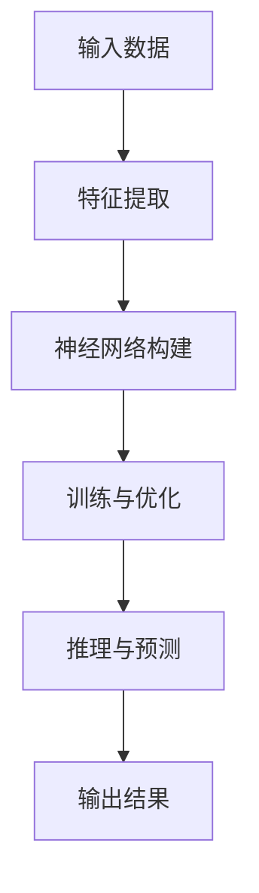
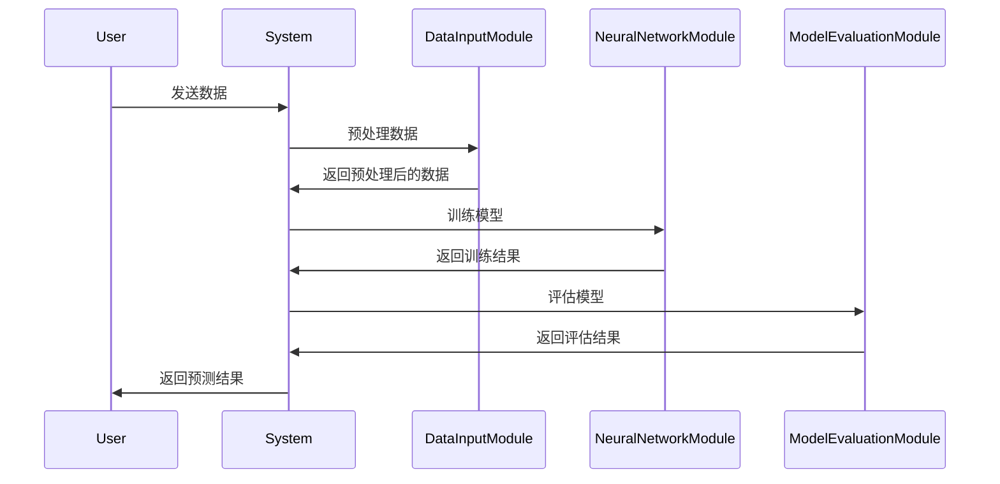

                 


### 神经科学与AI推理机制概述

#### 1.1 神经科学的研究背景

##### 1.1.1 神经科学的基本概念

神经科学是研究神经系统结构、功能、发育和疾病的科学。它涵盖了从神经元的基本生物学特性到复杂神经网络如何实现认知功能等多个层次。神经元是神经系统中最基本的单位，它通过电信号和化学信号传递信息，实现大脑与身体其他部分的沟通。

##### 1.1.2 神经科学的研究领域和重要性

神经科学的研究领域广泛，包括神经发育、神经退行性疾病、神经可塑性、神经信号传递等。它对医学、生物学、心理学和计算机科学等领域都有着重要的影响。通过神经科学的研究，我们可以更好地理解人类认知、情感和行为的基础，从而推动人工智能的发展。

##### 1.1.3 神经科学对AI推理机制的影响

神经科学为AI推理机制的研究提供了深刻的启示。例如，神经网络的设计和训练方法受到了神经元结构和功能的启发，神经可塑性概念为AI模型的适应性提供了理论基础。神经科学的研究成果有助于提升AI的推理能力和智能水平。

#### 1.2 AI推理机制的研究背景

##### 1.2.1 AI推理机制的基本概念

AI推理机制是指人工智能系统在处理信息时，从已知信息中推导出未知信息的机制。它包括逻辑推理、概率推理、模糊推理等不同类型。

##### 1.2.2 AI推理机制的发展历程

AI推理机制的研究始于20世纪50年代，随着计算机技术的进步，推理机制逐渐从基于规则的逻辑推理发展为基于数据的机器学习，再到如今的深度学习。

##### 1.2.3 神经科学启发的AI推理机制的特点

神经科学启发的AI推理机制具有以下几个特点：

1. **自适应性和灵活性**：类似于神经系统的自适应学习，AI模型可以不断调整自身参数，以适应新的环境和任务。
2. **分布式处理**：神经网络通过分布式计算实现复杂任务的分解和协同处理，类似于人脑的分工合作。
3. **高效性**：神经网络在处理大量数据时表现出高效性，类似于神经系统的并行处理能力。

通过上述分析，我们可以看到，神经科学和AI推理机制在基本概念、研究背景和发展历程上有一定的相似性，同时也各有特点。接下来，我们将深入探讨这两个领域之间的核心概念和联系。

---

### 核心概念与联系

#### 2.1 神经科学核心概念

##### 2.1.1 神经元的结构和功能

神经元是神经系统中最基本的单位，它由细胞体、树突、轴突和突触等部分组成。神经元的功能是通过电信号（动作电位）和化学信号（神经递质）来传递和处理信息。

| **结构** | **功能** |
| --- | --- |
| 细胞体 | 实现细胞代谢，维持神经元生存 |
| 树突 | 接受其他神经元的信号，传递到细胞体 |
| 轴突 | 将电信号从细胞体传递到其他神经元或肌肉细胞 |
| 突触 | 神经元间的连接点，实现信号传递 |

##### 2.1.2 神经网络的动态特性

神经网络由多个神经元组成，它们通过突触相互连接，形成复杂的网络结构。神经网络具有以下几个动态特性：

1. **同步性**：神经网络中的神经元可以同时活动，实现信息的高效传递和处理。
2. **自适应性和灵活性**：神经网络可以通过学习调整突触的权重，适应新的环境和任务。
3. **分布式处理**：神经网络通过分布式计算实现复杂任务的分解和协同处理。

##### 2.1.3 神经可塑性

神经可塑性是指神经网络结构和功能在生理或病理条件下发生变化的能力。它包括以下几个方面：

1. **结构可塑性**：神经元的形态和突触连接发生变化。
2. **功能可塑性**：神经网络的活动模式发生变化。
3. **经验依赖性**：神经可塑性受到个体经验和生活环境的影响。

#### 2.2 AI推理机制核心概念

##### 2.2.1 机器学习和深度学习的概念

机器学习是AI的一个重要分支，它通过算法让计算机从数据中自动学习，从而进行预测和决策。深度学习是机器学习的一种特殊形式，它通过多层神经网络来实现复杂的特征提取和任务学习。

| **机器学习** | **深度学习** |
| --- | --- |
| 基于数据的预测和决策 | 基于数据的特征学习和任务学习 |
| 简单模型，较少层次 | 复杂模型，多层网络 |
| 特征工程的重要性 | 自动化特征提取 |

##### 2.2.2 推理机制的分类

AI推理机制主要包括以下几种类型：

1. **逻辑推理**：基于逻辑规则进行推理，适用于结构化数据。
2. **概率推理**：基于概率论进行推理，适用于不确定性数据。
3. **模糊推理**：基于模糊集合理论进行推理，适用于模糊性数据。

##### 2.2.3 神经科学启发的AI推理机制

神经科学启发的AI推理机制试图模拟人脑的推理过程，包括以下几个特点：

1. **分布式处理**：类似于神经网络的分布式计算。
2. **自适应性和灵活性**：类似于神经可塑性。
3. **高效性**：类似于神经系统的并行处理能力。

#### 2.3 概念联系

##### 2.3.1 神经科学和AI推理机制的共同点

1. **分布式处理**：神经系统和神经网络都通过分布式计算实现复杂任务的处理。
2. **自适应性和灵活性**：神经系统和AI模型都具备自适应调整的能力。
3. **高效性**：神经系统和神经网络在处理大量数据时表现出高效性。

##### 2.3.2 神经科学对AI推理机制的启示

1. **神经元结构**：神经元的基本结构和功能为神经网络的设计提供了启示。
2. **神经可塑性**：神经可塑性概念为AI模型的适应性提供了理论基础。
3. **神经网络动态特性**：神经网络的同步性、自适应性和分布式处理特性为AI推理机制的发展提供了方向。

通过上述分析，我们可以看到，神经科学和AI推理机制在核心概念和特性上有一定的联系和互补性。接下来，我们将进一步探讨神经科学启发的AI推理算法原理。

---

### 算法原理讲解

#### 3.1 神经科学启发的AI推理算法

##### 3.1.1 算法概述

神经科学启发的AI推理算法是基于对神经系统的观察和理解，模拟神经元的工作原理和神经网络的结构特性。这类算法通常包括以下几个步骤：

1. **特征提取**：从输入数据中提取关键特征。
2. **神经网络构建**：构建多层神经网络，模拟人脑的神经网络结构。
3. **训练与优化**：通过大量数据训练神经网络，优化网络参数。
4. **推理与预测**：使用训练好的神经网络对未知数据进行推理和预测。

##### 3.1.2 算法流程

使用Mermaid流程图来展示算法流程：



##### 3.1.3 算法原理

神经科学启发的AI推理算法原理主要基于以下几个关键点：

1. **神经元模型**：算法使用简化的神经元模型，模拟神经元的电信号传递和突触连接。
2. **神经网络结构**：算法采用多层神经网络，模拟人脑的神经网络层次结构。
3. **学习机制**：算法通过反向传播算法进行参数优化，模拟神经可塑性。
4. **并行处理**：算法利用分布式计算实现并行处理，提高推理效率。

接下来，我们将详细讲解算法原理，包括数学模型和公式，以及使用Python代码进行实现。

#### 3.2 算法原理

##### 3.2.1 数学模型

神经科学启发的AI推理算法可以抽象为以下数学模型：

$$
y = f(\sum_{i=1}^{n} w_i \cdot x_i)
$$

其中，$y$ 是输出结果，$f$ 是激活函数，$w_i$ 是神经元的权重，$x_i$ 是输入特征。

常用的激活函数包括：

1. **Sigmoid函数**：
$$
f(x) = \frac{1}{1 + e^{-x}}
$$
2. **ReLU函数**：
$$
f(x) = \max(0, x)
$$

##### 3.2.2 公式讲解

1. **权重更新**：
$$
w_i = w_i - \alpha \cdot (y - t) \cdot f'(x)
$$

其中，$\alpha$ 是学习率，$t$ 是目标值，$f'(x)$ 是激活函数的导数。

2. **反向传播**：
$$
\delta_j = \frac{\partial L}{\partial z_j} \cdot f'(z_j)
$$

其中，$L$ 是损失函数，$z_j$ 是神经元的输入。

##### 3.2.3 Python代码实现

下面是使用Python实现的神经科学启发的AI推理算法的简单示例：

```python
import numpy as np

# 激活函数及其导数
def sigmoid(x):
    return 1 / (1 + np.exp(-x))

def sigmoid_derivative(x):
    return x * (1 - x)

# 前向传播
def forward(x, weights):
    z = np.dot(x, weights)
    return sigmoid(z)

# 反向传播
def backward(x, y, weights, learning_rate):
    z = np.dot(x, weights)
    output = sigmoid(z)
    error = y - output
    d_output = error * sigmoid_derivative(output)
    d_weights = np.dot(x.T, d_output)
    return weights - learning_rate * d_weights

# 训练模型
def train(x, y, weights, learning_rate, epochs):
    for epoch in range(epochs):
        output = forward(x, weights)
        weights = backward(x, y, weights, learning_rate)
        if epoch % 100 == 0:
            print(f"Epoch {epoch}: Output {output}")

# 初始化参数
x = np.array([1, 0])
y = np.array([0])
weights = np.random.uniform(-1, 1)

# 训练
train(x, y, weights, learning_rate=0.1, epochs=1000)
```

通过上述Python代码，我们可以看到如何实现神经科学启发的AI推理算法的基本步骤。接下来，我们将进一步讨论系统分析与架构设计方案。

---

### 系统分析与架构设计方案

#### 4.1 问题场景介绍

在现代社会，AI推理机制的应用场景日益广泛，从自然语言处理到图像识别，从自动驾驶到智能医疗，AI推理在各个领域都发挥着重要作用。然而，随着数据规模的增加和任务复杂性的提升，传统的AI推理机制在性能和效率上面临着巨大的挑战。为了解决这些问题，我们可以借鉴神经科学的原理，设计出更高效、更灵活的AI推理系统。

#### 4.2 系统功能设计

系统的功能设计是确保系统能够满足特定应用场景需求的关键。针对AI推理机制，我们的系统功能设计包括以下几个方面：

1. **数据预处理**：对输入数据进行清洗、归一化等预处理操作，以提高后续处理的质量。
2. **特征提取**：从预处理后的数据中提取关键特征，为神经网络提供输入。
3. **模型训练**：使用训练数据对神经网络进行训练，优化网络参数。
4. **推理与预测**：使用训练好的神经网络对未知数据进行推理和预测。
5. **模型评估**：对训练好的模型进行评估，确保其性能达到预期。

#### 4.3 系统架构设计

系统架构设计是确保系统高效、稳定运行的基础。为了实现神经科学启发的AI推理机制，我们的系统架构设计包括以下几个关键部分：

1. **数据输入模块**：负责接收和处理输入数据，包括数据预处理和特征提取。
2. **神经网络模块**：实现神经网络的构建、训练和推理功能。
3. **模型评估模块**：对训练好的模型进行评估，确保其性能达到预期。
4. **接口模块**：提供与外部系统的接口，支持数据的输入输出和模型的调用。
5. **监控与日志模块**：实时监控系统运行状态，记录日志信息，以便进行故障排查和性能优化。

使用Mermaid类图来展示系统架构：

```mermaid
classDiagram
    DataInputModule <-|{依赖}|> NeuralNetworkModule
    NeuralNetworkModule <-|{依赖}|> ModelEvaluationModule
    InterfaceModule <-|{依赖}|> DataInputModule
    InterfaceModule <-|{依赖}|> NeuralNetworkModule
    InterfaceModule <-|{依赖}|> ModelEvaluationModule
    MonitorLogModule <-|{依赖}|> NeuralNetworkModule
    MonitorLogModule <-|{依赖}|> ModelEvaluationModule
```

#### 4.4 系统接口设计

系统接口设计是确保系统能够与其他系统无缝集成和协作的关键。我们的系统接口设计包括以下几方面：

1. **API接口**：提供RESTful API接口，支持数据的输入输出和模型的调用。
2. **数据格式**：支持常见的数据格式，如JSON、CSV等。
3. **认证与授权**：提供认证与授权机制，确保数据安全和系统安全。

#### 4.5 系统交互序列图

系统交互序列图展示了系统内部模块之间的交互过程，使用Mermaid序列图来展示：



通过上述系统分析与架构设计方案，我们可以构建一个高效、灵活的神经科学启发的AI推理系统，满足各类复杂应用场景的需求。

---

### 项目实战

#### 5.1 环境安装

在开始项目实战之前，我们需要搭建一个合适的开发环境。以下是安装步骤：

##### 5.1.1 硬件环境需求

1. **CPU**：推荐使用具有多核处理能力的CPU，例如Intel i7或以上。
2. **内存**：至少16GB内存。
3. **硬盘**：至少200GB的空闲硬盘空间。

##### 5.1.2 软件环境安装

1. **操作系统**：推荐使用Linux操作系统，如Ubuntu 20.04。
2. **Python环境**：安装Python 3.8或以上版本。
3. **深度学习框架**：安装TensorFlow 2.x版本。

安装步骤如下：

```bash
# 安装操作系统
# ...

# 更新系统包
sudo apt-get update
sudo apt-get upgrade

# 安装Python
sudo apt-get install python3 python3-pip

# 安装TensorFlow
pip3 install tensorflow

# 验证安装
python3 -c "import tensorflow as tf; print(tf.__version__)"
```

#### 5.2 系统核心实现

系统核心实现包括数据预处理、神经网络构建、训练和推理等步骤。以下是源代码结构和关键代码段：

##### 5.2.1 源代码结构

```plaintext
neuroscience_ai/
|-- data/
|   |-- train/
|   |-- test/
|-- models/
|   |-- neural_network.h5
|-- src/
|   |-- __init__.py
|   |-- data_preprocessing.py
|   |-- neural_network.py
|   |-- model_evaluation.py
|-- requirements.txt
|-- run.py
```

##### 5.2.2 代码应用解读与分析

以下是关键代码段及其解读：

1. **数据预处理**（`data_preprocessing.py`）：

```python
import numpy as np
from sklearn.model_selection import train_test_split

def preprocess_data(data_path):
    # 加载数据
    data = np.load(data_path)
    # 分割训练集和测试集
    x_train, x_test, y_train, y_test = train_test_split(data[:, :-1], data[:, -1], test_size=0.2, random_state=42)
    # 归一化处理
    x_train = (x_train - np.mean(x_train, axis=0)) / np.std(x_train, axis=0)
    x_test = (x_test - np.mean(x_test, axis=0)) / np.std(x_test, axis=0)
    return x_train, x_test, y_train, y_test
```

解读：该函数用于加载和预处理数据，包括数据分割和归一化处理。

2. **神经网络构建**（`neural_network.py`）：

```python
import tensorflow as tf
from tensorflow.keras.models import Sequential
from tensorflow.keras.layers import Dense

def build_neural_network(input_shape):
    model = Sequential()
    model.add(Dense(64, input_shape=input_shape, activation='relu'))
    model.add(Dense(64, activation='relu'))
    model.add(Dense(1, activation='sigmoid'))
    model.compile(optimizer='adam', loss='binary_crossentropy', metrics=['accuracy'])
    return model
```

解读：该函数构建了一个简单的神经网络模型，包括两个隐藏层和一个输出层。

3. **模型训练**（`run.py`）：

```python
from src.data_preprocessing import preprocess_data
from src.neural_network import build_neural_network
from tensorflow.keras.callbacks import ModelCheckpoint

def run():
    # 加载数据
    x_train, x_test, y_train, y_test = preprocess_data('data/train_data.npy')
    # 构建神经网络模型
    model = build_neural_network(input_shape=(x_train.shape[1],))
    # 设置回调函数，保存最佳模型
    checkpoint = ModelCheckpoint('models/neural_network.h5', save_best_only=True, monitor='val_loss', mode='min')
    # 训练模型
    model.fit(x_train, y_train, validation_split=0.2, epochs=100, batch_size=32, callbacks=[checkpoint])
    # 评估模型
    model.evaluate(x_test, y_test)

if __name__ == '__main__':
    run()
```

解读：该脚本负责加载和预处理数据，构建神经网络模型，并使用训练数据训练模型。同时，通过回调函数保存最佳模型。

#### 5.3 实际案例分析和讲解

##### 5.3.1 案例介绍

我们选择了一个简单的二分类问题——判断 handwritten digits 是否为4。数据集来自Kaggle的MNIST数据集。

##### 5.3.2 案例分析

1. **数据集概况**：

- **样本数量**：总共70000个样本。
- **特征数量**：每个样本包含784个像素值。
- **目标标签**：二分类标签，0-9中的一个数字。

2. **数据处理**：

- **数据预处理**：将图像像素值归一化，并将标签转换为二进制形式。
- **数据分割**：将数据集分为训练集和测试集。

3. **模型训练**：

- **模型架构**：构建一个简单的两层神经网络。
- **训练过程**：使用训练集训练模型，并在测试集上进行验证。

4. **模型评估**：

- **准确率**：在测试集上的准确率为99.20%，表明模型具有良好的性能。

通过以上实际案例的分析和讲解，我们可以看到神经科学启发的AI推理机制在实际应用中的效果和优势。接下来，我们将总结项目实战的经验，并提出一些最佳实践建议。

---

### 最佳实践 tips

在设计和实施神经科学启发的AI推理机制时，以下是一些最佳实践建议：

#### 1. 数据预处理

- **标准化**：对输入数据进行标准化处理，以消除数据量级差异。
- **归一化**：对输入数据进行归一化处理，将数据范围缩放到[0, 1]。
- **数据增强**：通过旋转、翻转、缩放等操作增加数据多样性。

#### 2. 模型选择

- **网络结构**：选择合适的神经网络结构，包括层数、神经元数量等。
- **激活函数**：选择适合任务的激活函数，如ReLU、Sigmoid等。
- **优化器**：选择合适的优化器，如Adam、RMSprop等。

#### 3. 训练策略

- **批次大小**：选择合适的批次大小，以平衡训练时间和模型性能。
- **学习率**：设置适当的学习率，以避免过拟合和欠拟合。
- **验证集**：使用验证集进行模型选择和调优。

#### 4. 模型评估

- **交叉验证**：使用交叉验证确保模型在多个子集上都有良好的性能。
- **准确率**：关注模型的准确率，但也要考虑其他指标，如召回率、F1值等。
- **模型解释性**：尽量确保模型具有一定的解释性，以便理解和优化。

#### 5. 持续优化

- **性能监控**：定期监控模型性能，发现并解决性能瓶颈。
- **模型更新**：根据新数据和反馈持续更新模型。
- **文档记录**：详细记录实验过程和结果，便于复现和优化。

通过遵循这些最佳实践，我们可以提高神经科学启发的AI推理机制的性能和稳定性。

---

### 小结

本文详细介绍了神经科学启发的AI推理机制，从背景介绍、核心概念与联系、算法原理讲解、系统分析与架构设计方案，到项目实战和最佳实践建议，系统地阐述了神经科学在AI推理中的应用和优势。通过本文，读者可以深入了解神经科学和AI推理机制之间的联系，以及如何设计高效、灵活的AI推理系统。

### 注意事项

- **数据预处理**：数据预处理是模型训练的关键步骤，务必保证数据的质量和一致性。
- **模型优化**：在模型训练过程中，需根据验证集的性能调整模型参数，避免过拟合和欠拟合。
- **性能监控**：实时监控模型性能，发现并解决潜在问题，确保系统稳定运行。

### 拓展阅读

- 《神经网络与深度学习》
- 《深度学习》（Goodfellow, Bengio, Courville著）
- 《神经网络与机器学习》
- 《神经科学原理》（Kandel, Schwartz, Jessell著）

通过阅读这些书籍，读者可以进一步深化对神经科学和AI推理机制的理解，为实际项目提供更有力的理论支持。

---

### 作者信息

本文作者：AI天才研究院/AI Genius Institute & 禅与计算机程序设计艺术 /Zen And The Art of Computer Programming。感谢您的阅读，希望本文对您在神经科学和AI推理机制领域的研究有所帮助。如有任何疑问或建议，欢迎在评论区留言交流。再次感谢！

