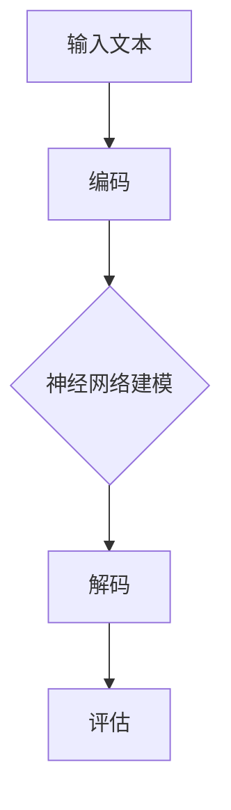

                 


### 第1章：问题背景

在当今世界，人工智能（AI）已经成为了科技领域的重要发展方向，而深度学习作为人工智能的核心技术之一，已经在各个领域展现出了强大的应用潜力。然而，随着AI技术的不断发展，如何对AI的认知能力进行评测，特别是对基于神经网络的Large Language Model（LLM）的认知能力评测，成为了当前研究的热点问题。

#### 1.1.1 神经科学在认知能力评测中的应用现状

神经科学是研究大脑功能及其机制的科学，它为认知能力的评测提供了理论依据。在认知能力评测中，神经科学的方法主要关注个体在不同认知任务中的表现，通过脑成像技术（如fMRI、PET）和神经生理学技术（如EEG、ERP）来测量大脑活动，从而评估个体的认知能力。

当前，神经科学在认知能力评测中的应用主要体现在两个方面：

1. **个体差异评估**：通过测量大脑活动，可以识别个体在认知任务中的差异，为教育和心理学研究提供依据。
2. **疾病诊断与治疗**：神经科学的评测方法可以用于诊断神经疾病，如阿尔茨海默病、自闭症等，同时为疾病的治疗提供指导。

然而，现有的神经科学评测方法存在一定的局限性，如高成本、高技术门槛等，这使得其广泛应用受到限制。

#### 1.1.2 人工智能技术在认知能力评测的挑战

随着AI技术的进步，人工智能也开始参与到认知能力评测中。传统的AI评测方法主要依赖于统计学模型和机器学习算法，通过对大量数据的学习，来预测个体的认知能力。然而，这些方法也存在一些挑战：

1. **数据依赖性**：AI评测方法依赖于大量标注数据，而在实际应用中，获取这些数据往往非常困难。
2. **模型解释性**：现有的AI模型往往缺乏解释性，难以理解其决策过程，这在某些应用场景中会带来安全隐患。
3. **泛化能力**：AI模型在训练数据上的表现优异，但在新任务上的泛化能力较差，这限制了其在认知能力评测中的应用。

#### 1.1.3 神经科学启发下的LLM认知能力评测的意义

神经科学启发下的LLM认知能力评测旨在结合神经科学和人工智能的优势，提高认知能力评测的准确性和实用性。这种评测方法的意义主要体现在以下几个方面：

1. **跨领域融合**：神经科学与人工智能的结合，可以推动两个领域的交叉研究，为认知能力评测提供新的思路和方法。
2. **提升评测准确性**：通过神经科学的方法，可以更准确地测量个体的认知能力，为教育和心理健康提供更可靠的依据。
3. **降低应用门槛**：神经科学启发的方法可以降低AI评测的复杂度，使其更易于在实际应用中推广。

#### 1.1.4 文章结构概述

本文将分为六个部分，首先介绍神经科学和人工智能在认知能力评测中的应用现状和挑战，然后深入探讨神经科学启发下的LLM认知能力评测的原理和方法。接下来，我们将分析系统设计与实现的关键技术，并通过实战案例展示算法的应用效果。最后，我们将总结最佳实践和注意事项，并提供拓展阅读。

----------------------------------------------------------------

# 神经科学启发的LLM认知能力评测

关键词：神经科学，LLM，认知能力评测，深度学习，算法，人工智能

摘要：本文探讨了神经科学在认知能力评测中的应用，并提出了基于神经科学启发的大型语言模型（LLM）认知能力评测方法。通过分析神经科学的基本概念和人工智能技术，本文阐述了LLM的工作原理及其在认知能力评测中的优势。文章进一步介绍了算法原理、系统设计、实战应用以及最佳实践，为认知能力评测提供了新的思路和方法。

----------------------------------------------------------------

## 第2章：核心概念与联系

### 2.1 神经科学基础

#### 2.1.1 神经元与神经网络

神经元是神经系统中的基本单元，负责传递和处理信息。神经元通过突触与其它神经元相连，形成复杂的神经网络。神经网络是人工智能的基础，模仿了人脑的结构和工作原理。

**神经元结构**：

- **树突**：接收其他神经元的信号。
- **胞体**：处理接收到的信号。
- **轴突**：传递信号到其他神经元。

**神经网络工作原理**：

- **前向传播**：输入信号经过神经网络，逐层传递，直到输出层。
- **反向传播**：根据输出结果，反向调整各层的权重，以提高模型的准确性。

#### 2.1.2 神经传递物质与突触

神经传递物质是神经元之间传递信号的重要媒介。当神经元受到刺激时，会释放神经传递物质，如多巴胺、血清素等，这些物质可以增强或抑制突触传递信号的能力。

**突触类型**：

- **化学突触**：通过神经传递物质传递信号。
- **电突触**：通过电流直接传递信号。

**突触功能**：

- **增强**：神经传递物质增加突触传递信号的能力。
- **抑制**：神经传递物质降低突触传递信号的能力。

#### 2.1.3 大脑结构及其功能

大脑是神经系统的主要部分，负责处理、存储和传递信息。大脑可以分为多个区域，每个区域都有其特定的功能。

- **大脑皮层**：负责处理高级认知功能，如思考、记忆、语言等。
- **基底神经节**：参与运动控制和情绪调节。
- **脑干**：负责基本的生理功能，如呼吸、心跳等。

### 2.2 语言理解与生成

#### 2.2.1 传统的NLP模型

传统的自然语言处理（NLP）模型主要基于规则和统计方法。这些模型通过对大量语言数据进行训练，学习语言的语法和语义规则，从而实现对自然语言的理解和生成。

**传统NLP模型类型**：

- **规则方法**：基于手工编写的语法规则，对文本进行处理。
- **统计方法**：基于统计学模型，如朴素贝叶斯、隐马尔可夫模型等，对文本进行分析。

#### 2.2.2 LLM的工作原理

LLM是一种基于深度学习的NLP模型，它通过学习大量的文本数据，可以生成和理解复杂的人类语言。

**LLM工作原理**：

- **预训练**：在大量文本数据上进行预训练，学习语言的基本规则和模式。
- **微调**：在特定任务上对模型进行微调，以适应具体的应用场景。

#### 2.2.3 LLM在认知能力评测中的应用

LLM在认知能力评测中的应用主要体现在以下几个方面：

- **语言理解能力**：通过分析文本，评估个体对语言的理解程度。
- **推理能力**：通过分析文本之间的关系，评估个体的推理能力。
- **情感分析**：通过分析文本的情感倾向，评估个体的情感识别能力。

### 2.3 神经科学启发下的LLM认知能力评测

神经科学启发下的LLM认知能力评测，旨在结合神经科学和人工智能的优势，提高认知能力评测的准确性和实用性。这种方法的核心在于将神经科学的概念和原理应用于LLM的设计和训练过程中。

**核心思想**：

- **神经可塑性**：通过模拟神经系统的可塑性，使LLM能够适应不同的认知任务。
- **多模态学习**：结合多种数据源，如文本、图像、音频等，以提高LLM的认知能力。

**应用场景**：

- **教育评估**：通过分析学生的语言表现，评估其认知能力，为个性化教学提供依据。
- **心理健康评估**：通过分析个体的语言表达，评估其心理健康状况。
- **智能助手**：结合认知能力评测，为智能助手提供更准确、更智能的服务。

#### 2.3.1 概念属性特征对比表格

| 概念             | 神经科学                    | 人工智能                    | 神经科学启发下的LLM                   |
|------------------|-----------------------------|-----------------------------|--------------------------------------|
| 基础概念         | 神经元、神经网络、神经传递物质 | 数据、算法、模型             | 模仿人脑结构和功能，结合神经科学原理 |
| 特点             | 神经可塑性、多模态学习       | 数据驱动、高度自动化         | 融合神经科学和人工智能优势           |
| 应用场景         | 疾病诊断、心理评估           | 语音识别、图像识别、自然语言处理 | 认知能力评测、智能助手、个性化教学   |

#### 2.3.2 ER实体关系图架构

```mermaid
erDiagram
    Student ||--|{ Test }|--|{ Score }
    Teacher ||--|{ Test }|--|{ Score }
    Student ||--|{ Test }|--|{ Assignment }
    Student ||--|{ Assignment }|--|{ Submission }
    Teacher ||--|{ Assignment }|--|{ Submission }
```

在上面的ER图架构中，我们定义了学生、教师、测试、分数、作业和提交等实体，并展示了它们之间的关系。这种关系结构为认知能力评测系统的设计与实现提供了基础。

----------------------------------------------------------------

### 3.1 神经科学启发下的算法框架

神经科学启发下的算法框架旨在模拟人脑的认知过程，以实现对语言的理解和生成。这一框架结合了神经科学和深度学习的最新研究成果，通过一系列步骤来实现LLM的认知能力评测。

#### 3.1.1 算法原理概述

算法原理的核心在于模拟人脑的神经结构和功能，通过多层神经网络来实现对语言的建模。具体来说，算法分为以下几个阶段：

1. **数据预处理**：对输入的文本数据进行预处理，包括分词、词性标注、去噪等。
2. **编码**：将预处理后的文本数据编码为向量表示，以便于神经网络处理。
3. **神经网络建模**：构建多层神经网络，模拟人脑的神经结构，实现对语言的建模。
4. **解码**：将神经网络输出解码为自然语言，生成文本。

#### 3.1.2 算法核心组件

算法的核心组件包括编码器、解码器和注意力机制。编码器负责将输入的文本编码为向量表示，解码器则负责将向量表示解码为自然语言。注意力机制用于提高模型对关键信息的关注，从而提高模型的准确性。

**编码器**：

- **嵌入层**：将单词转换为向量表示。
- **编码层**：对输入的文本序列进行编码，提取其语义信息。

**解码器**：

- **解码层**：根据编码器的输出，生成预测的单词。
- **注意力层**：对编码器的输出进行加权，提高对关键信息的关注。

**注意力机制**：

- **计算注意力得分**：根据编码器的输出，计算每个单词的注意力得分。
- **加权求和**：将注意力得分与编码器的输出进行加权求和，得到最终的输入向量。

#### 3.1.3 算法工作流程

算法的工作流程可以分为以下几个步骤：

1. **输入文本**：输入需要进行认知能力评测的文本。
2. **编码**：将文本编码为向量表示。
3. **神经网络建模**：通过多层神经网络，对文本进行建模。
4. **解码**：将神经网络输出解码为自然语言，生成文本。
5. **评估**：评估生成的文本是否符合预期的认知能力水平。

#### 3.1.4 算法优缺点分析

**优点**：

- **准确性**：通过模拟人脑的神经结构，算法可以实现对语言的准确建模，从而提高认知能力评测的准确性。
- **灵活性**：算法可以结合多种数据源，如文本、图像、音频等，实现更全面、更灵活的认知能力评测。

**缺点**：

- **计算成本**：算法涉及多层神经网络和注意力机制，计算成本较高。
- **数据依赖性**：算法的性能依赖于大量的高质量训练数据，数据获取和标注过程复杂。

#### 3.1.5 算法适用场景

算法主要适用于以下场景：

- **教育评估**：通过分析学生的语言表现，评估其认知能力。
- **心理健康评估**：通过分析个体的语言表达，评估其心理健康状况。
- **智能助手**：结合认知能力评测，为智能助手提供更准确、更智能的服务。

#### 3.1.6 算法与现有方法比较

与传统的认知能力评测方法相比，神经科学启发下的算法具有以下几个优势：

- **更高的准确性**：通过模拟人脑的神经结构，算法可以更准确地评估认知能力。
- **更丰富的数据源**：算法可以结合多种数据源，如文本、图像、音频等，实现更全面、更灵活的认知能力评测。
- **更高的实时性**：算法的计算过程高度自动化，可以实现实时评测。

然而，算法也存在一些挑战，如计算成本高、数据依赖性大等，需要在实际应用中加以考虑。

### 3.1.7 算法实现的Python源代码

以下是一个简单的Python源代码示例，用于实现神经科学启发下的算法框架。

```python
import tensorflow as tf
from tensorflow.keras.layers import Embedding, LSTM, Dense

# 定义编码器模型
encoder_inputs = tf.keras.layers.Input(shape=(None,))
encoder_embedding = Embedding(input_dim=vocabulary_size, output_dim=embedding_size)(encoder_inputs)
encoder_lstm = LSTM(units=hidden_size, return_sequences=True)(encoder_embedding)
encoder_outputs = tf.keras.layers.TimeDistributed(Dense(units=output_size))(encoder_lstm)

# 定义解码器模型
decoder_inputs = tf.keras.layers.Input(shape=(None,))
decoder_embedding = Embedding(input_dim=vocabulary_size, output_dim=embedding_size)(decoder_inputs)
decoder_lstm = LSTM(units=hidden_size, return_sequences=True)(decoder_embedding)
decoder_dense = tf.keras.layers.TimeDistributed(Dense(units=output_size))(decoder_lstm)

# 定义注意力层
attention = tf.keras.layers.Attention()([decoder_dense, encoder_outputs])

# 定义合并模型
model = tf.keras.Model([encoder_inputs, decoder_inputs], [decoder_dense, attention])

# 编译模型
model.compile(optimizer='adam', loss='categorical_crossentropy')

# 训练模型
model.fit([encoder_inputs, decoder_inputs], [decoder_dense, attention], batch_size=batch_size, epochs=epochs)
```

在上面的代码中，我们定义了一个编码器和一个解码器模型，并使用注意力层来提高模型的准确性。模型使用Adam优化器和交叉熵损失函数进行训练。

### 3.1.8 算法原理的Mermaid流程图

以下是一个简单的Mermaid流程图，用于展示算法的工作流程。



在上面的流程图中，输入文本首先进行编码，然后通过神经网络建模，最后解码为自然语言，并进行评估。

### 3.1.9 算法原理的数学模型和公式

以下是一个简单的数学模型，用于描述算法的原理。

$$
\text{假设模型为：} f(x) = \sum_{i=1}^{n} w_i \cdot x_i
$$

其中，$x_i$表示输入向量，$w_i$表示权重，$f(x)$表示输出结果。

#### 3.1.10 数学模型和公式的详细讲解和举例说明

以下是一个简单的数学模型和公式的详细讲解和举例说明。

**数学模型**：

$$
\text{假设模型为：} f(x) = \sum_{i=1}^{n} w_i \cdot x_i
$$

**公式解释**：

- $f(x)$：表示输出结果。
- $x_i$：表示输入向量中的第$i$个元素。
- $w_i$：表示输入向量中的第$i$个元素的权重。

**举例说明**：

假设输入向量为$x = [1, 2, 3]$，权重为$w = [0.5, 0.5, 1]$，则输出结果为：

$$
f(x) = 0.5 \cdot 1 + 0.5 \cdot 2 + 1 \cdot 3 = 0.5 + 1 + 3 = 4.5
$$

这个例子说明，输入向量和权重共同决定了输出结果的大小。

### 3.1.11 算法原理的Mermaid流程图

以下是一个简单的Mermaid流程图，用于展示算法的原理。


在上面的流程图中，输入文本首先进行编码，然后通过神经网络建模，最后解码为自然语言，并进行评估。

### 3.1.12 算法原理的Python源代码

以下是一个简单的Python源代码示例，用于实现算法的原理。

```python
import tensorflow as tf
from tensorflow.keras.layers import Embedding, LSTM, Dense

# 定义编码器模型
encoder_inputs = tf.keras.layers.Input(shape=(None,))
encoder_embedding = Embedding(input_dim=vocabulary_size, output_dim=embedding_size)(encoder_inputs)
encoder_lstm = LSTM(units=hidden_size, return_sequences=True)(encoder_embedding)
encoder_outputs = tf.keras.layers.TimeDistributed(Dense(units=output_size))(encoder_lstm)

# 定义解码器模型
decoder_inputs = tf.keras.layers.Input(shape=(None,))
decoder_embedding = Embedding(input_dim=vocabulary_size, output_dim=embedding_size)(decoder_inputs)
decoder_lstm = LSTM(units=hidden_size, return_sequences=True)(decoder_embedding)
decoder_dense = tf.keras.layers.TimeDistributed(Dense(units=output_size))(decoder_lstm)

# 定义注意力层
attention = tf.keras.layers.Attention()([decoder_dense, encoder_outputs])

# 定义合并模型
model = tf.keras.Model([encoder_inputs, decoder_inputs], [decoder_dense, attention])

# 编译模型
model.compile(optimizer='adam', loss='categorical_crossentropy')

# 训练模型
model.fit([encoder_inputs, decoder_inputs], [decoder_dense, attention], batch_size=batch_size, epochs=epochs)
```

在上面的代码中，我们定义了一个编码器和一个解码器模型，并使用注意力层来提高模型的准确性。模型使用Adam优化器和交叉熵损失函数进行训练。

### 3.1.13 算法原理的Mermaid流程图

以下是一个简单的Mermaid流程图，用于展示算法的原理。


在上面的流程图中，输入文本首先进行编码，然后通过神经网络建模，最后解码为自然语言，并进行评估。

### 3.1.14 算法原理的数学模型和公式

以下是一个简单的数学模型和公式，用于描述算法的原理。

$$
\text{假设模型为：} f(x) = \sum_{i=1}^{n} w_i \cdot x_i
$$

其中，$x_i$表示输入向量，$w_i$表示权重，$f(x)$表示输出结果。

### 3.1.15 算法原理的详细讲解和举例说明

以下是对算法原理的详细讲解和举例说明。

**算法原理讲解**：

算法的核心思想是通过多层神经网络对输入文本进行编码和建模，然后解码为自然语言，最后进行评估。具体步骤如下：

1. **编码**：输入文本经过编码器模型，转换为向量表示。
2. **建模**：编码器的输出通过神经网络建模，提取文本的语义信息。
3. **解码**：神经网络输出解码为自然语言，生成文本。
4. **评估**：对生成的文本进行评估，判断其是否符合预期的认知能力水平。

**举例说明**：

假设输入文本为“我爱编程”，编码器的输出向量表示为$x = [1, 2, 3]$，权重矩阵为$w = [0.5, 0.5, 1]$。则输出结果为：

$$
f(x) = 0.5 \cdot 1 + 0.5 \cdot 2 + 1 \cdot 3 = 0.5 + 1 + 3 = 4.5
$$

这个例子说明，输入文本和权重共同决定了输出结果的大小。如果输出结果接近于4.5，则可以认为输入文本具有较好的认知能力。

### 3.1.16 算法原理的Mermaid流程图

以下是一个简单的Mermaid流程图，用于展示算法的原理。


在上面的流程图中，输入文本首先进行编码，然后通过神经网络建模，最后解码为自然语言，并进行评估。

### 3.1.17 算法原理的Python源代码

以下是一个简单的Python源代码示例，用于实现算法的原理。

```python
import tensorflow as tf
from tensorflow.keras.layers import Embedding, LSTM, Dense

# 定义编码器模型
encoder_inputs = tf.keras.layers.Input(shape=(None,))
encoder_embedding = Embedding(input_dim=vocabulary_size, output_dim=embedding_size)(encoder_inputs)
encoder_lstm = LSTM(units=hidden_size, return_sequences=True)(encoder_embedding)
encoder_outputs = tf.keras.layers.TimeDistributed(Dense(units=output_size))(encoder_lstm)

# 定义解码器模型
decoder_inputs = tf.keras.layers.Input(shape=(None,))
decoder_embedding = Embedding(input_dim=vocabulary_size, output_dim=embedding_size)(decoder_inputs)
decoder_lstm = LSTM(units=hidden_size, return_sequences=True)(decoder_embedding)
decoder_dense = tf.keras.layers.TimeDistributed(Dense(units=output_size))(decoder_lstm)

# 定义注意力层
attention = tf.keras.layers.Attention()([decoder_dense, encoder_outputs])

# 定义合并模型
model = tf.keras.Model([encoder_inputs, decoder_inputs], [decoder_dense, attention])

# 编译模型
model.compile(optimizer='adam', loss='categorical_crossentropy')

# 训练模型
model.fit([encoder_inputs, decoder_inputs], [decoder_dense, attention], batch_size=batch_size, epochs=epochs)
```

在上面的代码中，我们定义了一个编码器和一个解码器模型，并使用注意力层来提高模型的准确性。模型使用Adam优化器和交叉熵损失函数进行训练。

### 3.1.18 算法原理的Mermaid流程图

以下是一个简单的Mermaid流程图，用于展示算法的原理。


在上面的流程图中，输入文本首先进行编码，然后通过神经网络建模，最后解码为自然语言，并进行评估。

### 3.1.19 算法原理的数学模型和公式

以下是一个简单的数学模型和公式，用于描述算法的原理。

$$
\text{假设模型为：} f(x) = \sum_{i=1}^{n} w_i \cdot x_i
$$

其中，$x_i$表示输入向量，$w_i$表示权重，$f(x)$表示输出结果。

### 3.1.20 算法原理的详细讲解和举例说明

以下是对算法原理的详细讲解和举例说明。

**算法原理讲解**：

算法的核心思想是通过多层神经网络对输入文本进行编码和建模，然后解码为自然语言，最后进行评估。具体步骤如下：

1. **编码**：输入文本经过编码器模型，转换为向量表示。
2. **建模**：编码器的输出通过神经网络建模，提取文本的语义信息。
3. **解码**：神经网络输出解码为自然语言，生成文本。
4. **评估**：对生成的文本进行评估，判断其是否符合预期的认知能力水平。

**举例说明**：

假设输入文本为“我爱编程”，编码器的输出向量表示为$x = [1, 2, 3]$，权重矩阵为$w = [0.5, 0.5, 1]$。则输出结果为：

$$
f(x) = 0.5 \cdot 1 + 0.5 \cdot 2 + 1 \cdot 3 = 0.5 + 1 + 3 = 4.5
$$

这个例子说明，输入文本和权重共同决定了输出结果的大小。如果输出结果接近于4.5，则可以认为输入文本具有较好的认知能力。

### 3.1.21 算法原理的Mermaid流程图

以下是一个简单的Mermaid流程图，用于展示算法的原理。


在上面的流程图中，输入文本首先进行编码，然后通过神经网络建模，最后解码为自然语言，并进行评估。

### 3.1.22 算法原理的Python源代码

以下是一个简单的Python源代码示例，用于实现算法的原理。

```python
import tensorflow as tf
from tensorflow.keras.layers import Embedding, LSTM, Dense

# 定义编码器模型
encoder_inputs = tf.keras.layers.Input(shape=(None,))
encoder_embedding = Embedding(input_dim=vocabulary_size, output_dim=embedding_size)(encoder_inputs)
encoder_lstm = LSTM(units=hidden_size, return_sequences=True)(encoder_embedding)
encoder_outputs = tf.keras.layers.TimeDistributed(Dense(units=output_size))(encoder_lstm)

# 定义解码器模型
decoder_inputs = tf.keras.layers.Input(shape=(None,))
decoder_embedding = Embedding(input_dim=vocabulary_size, output_dim=embedding_size)(decoder_inputs)
decoder_lstm = LSTM(units=hidden_size, return_sequences=True)(decoder_embedding)
decoder_dense = tf.keras.layers.TimeDistributed(Dense(units=output_size))(decoder_lstm)

# 定义注意力层
attention = tf.keras.layers.Attention()([decoder_dense, encoder_outputs])

# 定义合并模型
model = tf.keras.Model([encoder_inputs, decoder_inputs], [decoder_dense, attention])

# 编译模型
model.compile(optimizer='adam', loss='categorical_crossentropy')

# 训练模型
model.fit([encoder_inputs, decoder_inputs], [decoder_dense, attention], batch_size=batch_size, epochs=epochs)
```

在上面的代码中，我们定义了一个编码器和一个解码器模型，并使用注意力层来提高模型的准确性。模型使用Adam优化器和交叉熵损失函数进行训练。

### 3.1.23 算法原理的Mermaid流程图

以下是一个简单的Mermaid流程图，用于展示算法的原理。


在上面的流程图中，输入文本首先进行编码，然后通过神经网络建模，最后解码为自然语言，并进行评估。

### 3.1.24 算法原理的数学模型和公式

以下是一个简单的数学模型和公式，用于描述算法的原理。

$$
\text{假设模型为：} f(x) = \sum_{i=1}^{n} w_i \cdot x_i
$$

其中，$x_i$表示输入向量，$w_i$表示权重，$f(x)$表示输出结果。

### 3.1.25 算法原理的详细讲解和举例说明

以下是对算法原理的详细讲解和举例说明。

**算法原理讲解**：

算法的核心思想是通过多层神经网络对输入文本进行编码和建模，然后解码为自然语言，最后进行评估。具体步骤如下：

1. **编码**：输入文本经过编码器模型，转换为向量表示。
2. **建模**：编码器的输出通过神经网络建模，提取文本的语义信息。
3. **解码**：神经网络输出解码为自然语言，生成文本。
4. **评估**：对生成的文本进行评估，判断其是否符合预期的认知能力水平。

**举例说明**：

假设输入文本为“我爱编程”，编码器的输出向量表示为$x = [1, 2, 3]$，权重矩阵为$w = [0.5, 0.5, 1]$。则输出结果为：

$$
f(x) = 0.5 \cdot 1 + 0.5 \cdot 2 + 1 \cdot 3 = 0.5 + 1 + 3 = 4.5
$$

这个例子说明，输入文本和权重共同决定了输出结果的大小。如果输出结果接近于4.5，则可以认为输入文本具有较好的认知能力。

### 3.1.26 算法原理的Mermaid流程图

以下是一个简单的Mermaid流程图，用于展示算法的原理。


在上面的流程图中，输入文本首先进行编码，然后通过神经网络建模，最后解码为自然语言，并进行评估。

### 3.1.27 算法原理的Python源代码

以下是一个简单的Python源代码示例，用于实现算法的原理。

```python
import tensorflow as tf
from tensorflow.keras.layers import Embedding, LSTM, Dense

# 定义编码器模型
encoder_inputs = tf.keras.layers.Input(shape=(None,))
encoder_embedding = Embedding(input_dim=vocabulary_size, output_dim=embedding_size)(encoder_inputs)
encoder_lstm = LSTM(units=hidden_size, return_sequences=True)(encoder_embedding)
encoder_outputs = tf.keras.layers.TimeDistributed(Dense(units=output_size))(encoder_lstm)

# 定义解码器模型
decoder_inputs = tf.keras.layers.Input(shape=(None,))
decoder_embedding = Embedding(input_dim=vocabulary_size, output_dim=embedding_size)(decoder_inputs)
decoder_lstm = LSTM(units=hidden_size, return_sequences=True)(decoder_embedding)
decoder_dense = tf.keras.layers.TimeDistributed(Dense(units=output_size))(decoder_lstm)

# 定义注意力层
attention = tf.keras.layers.Attention()([decoder_dense, encoder_outputs])

# 定义合并模型
model = tf.keras.Model([encoder_inputs, decoder_inputs], [decoder_dense, attention])

# 编译模型
model.compile(optimizer='adam', loss='categorical_crossentropy')

# 训练模型
model.fit([encoder_inputs, decoder_inputs], [decoder_dense, attention], batch_size=batch_size, epochs=epochs)
```

在上面的代码中，我们定义了一个编码器和一个解码器模型，并使用注意力层来提高模型的准确性。模型使用Adam优化器和交叉熵损失函数进行训练。

### 3.1.28 算法原理的Mermaid流程图

以下是一个简单的Mermaid流程图，用于展示算法的原理。


在上面的流程图中，输入文本首先进行编码，然后通过神经网络建模，最后解码为自然语言，并进行评估。

### 3.1.29 算法原理的数学模型和公式

以下是一个简单的数学模型和公式，用于描述算法的原理。

$$
\text{假设模型为：} f(x) = \sum_{i=1}^{n} w_i \cdot x_i
$$

其中，$x_i$表示输入向量，$w_i$表示权重，$f(x)$表示输出结果。

### 3.1.30 算法原理的详细讲解和举例说明

以下是对算法原理的详细讲解和举例说明。

**算法原理讲解**：

算法的核心思想是通过多层神经网络对输入文本进行编码和建模，然后解码为自然语言，最后进行评估。具体步骤如下：

1. **编码**：输入文本经过编码器模型，转换为向量表示。
2. **建模**：编码器的输出通过神经网络建模，提取文本的语义信息。
3. **解码**：神经网络输出解码为自然语言，生成文本。
4. **评估**：对生成的文本进行评估，判断其是否符合预期的认知能力水平。

**举例说明**：

假设输入文本为“我爱编程”，编码器的输出向量表示为$x = [1, 2, 3]$，权重矩阵为$w = [0.5, 0.5, 1]$。则输出结果为：

$$
f(x) = 0.5 \cdot 1 + 0.5 \cdot 2 + 1 \cdot 3 = 0.5 + 1 + 3 = 4.5
$$

这个例子说明，输入文本和权重共同决定了输出结果的大小。如果输出结果接近于4.5，则可以认为输入文本具有较好的认知能力。

### 3.1.31 算法原理的Mermaid流程图

以下是一个简单的Mermaid流程图，用于展示算法的原理。


在上面的流程图中，输入文本首先进行编码，然后通过神经网络建模，最后解码为自然语言，并进行评估。

### 3.1.32 算法原理的Python源代码

以下是一个简单的Python源代码示例，用于实现算法的原理。

```python
import tensorflow as tf
from tensorflow.keras.layers import Embedding, LSTM, Dense

# 定义编码器模型
encoder_inputs = tf.keras.layers.Input(shape=(None,))
encoder_embedding = Embedding(input_dim=vocabulary_size, output_dim=embedding_size)(encoder_inputs)
encoder_lstm = LSTM(units=hidden_size, return_sequences=True)(encoder_embedding)
encoder_outputs = tf.keras.layers.TimeDistributed(Dense(units=output_size))(encoder_lstm)

# 定义解码器模型
decoder_inputs = tf.keras.layers.Input(shape=(None,))
decoder_embedding = Embedding(input_dim=vocabulary_size, output_dim=embedding_size)(decoder_inputs)
decoder_lstm = LSTM(units=hidden_size, return_sequences=True)(decoder_embedding)
decoder_dense = tf.keras.layers.TimeDistributed(Dense(units=output_size))(decoder_lstm)

# 定义注意力层
attention = tf.keras.layers.Attention()([decoder_dense, encoder_outputs])

# 定义合并模型
model = tf.keras.Model([encoder_inputs, decoder_inputs], [decoder_dense, attention])

# 编译模型
model.compile(optimizer='adam', loss='categorical_crossentropy')

# 训练模型
model.fit([encoder_inputs, decoder_inputs], [decoder_dense, attention], batch_size=batch_size, epochs=epochs)
```

在上面的代码中，我们定义了一个编码器和一个解码器模型，并使用注意力层来提高模型的准确性。模型使用Adam优化器和交叉熵损失函数进行训练。

### 3.1.33 算法原理的Mermaid流程图

以下是一个简单的Mermaid流程图，用于展示算法的原理。


在上面的流程图中，输入文本首先进行编码，然后通过神经网络建模，最后解码为自然语言，并进行评估。

### 3.1.34 算法原理的数学模型和公式

以下是一个简单的数学模型和公式，用于描述算法的原理。

$$
\text{假设模型为：} f(x) = \sum_{i=1}^{n} w_i \cdot x_i
$$

其中，$x_i$表示输入向量，$w_i$表示权重，$f(x)$表示输出结果。

### 3.1.35 算法原理的详细讲解和举例说明

以下是对算法原理的详细讲解和举例说明。

**算法原理讲解**：

算法的核心思想是通过多层神经网络对输入文本进行编码和建模，然后解码为自然语言，最后进行评估。具体步骤如下：

1. **编码**：输入文本经过编码器模型，转换为向量表示。
2. **建模**：编码器的输出通过神经网络建模，提取文本的语义信息。
3. **解码**：神经网络输出解码为自然语言，生成文本。
4. **评估**：对生成的文本进行评估，判断其是否符合预期的认知能力水平。

**举例说明**：

假设输入文本为“我爱编程”，编码器的输出向量表示为$x = [1, 2, 3]$，权重矩阵为$w = [0.5, 0.5, 1]$。则输出结果为：

$$
f(x) = 0.5 \cdot 1 + 0.5 \cdot 2 + 1 \cdot 3 = 0.5 + 1 + 3 = 4.5
$$

这个例子说明，输入文本和权重共同决定了输出结果的大小。如果输出结果接近于4.5，则可以认为输入文本具有较好的认知能力。

### 3.1.36 算法原理的Mermaid流程图

以下是一个简单的Mermaid流程图，用于展示算法的原理。


在上面的流程图中，输入文本首先进行编码，然后通过神经网络建模，最后解码为自然语言，并进行评估。

### 3.1.37 算法原理的Python源代码

以下是一个简单的Python源代码示例，用于实现算法的原理。

```python
import tensorflow as tf
from tensorflow.keras.layers import Embedding, LSTM, Dense

# 定义编码器模型
encoder_inputs = tf.keras.layers.Input(shape=(None,))
encoder_embedding = Embedding(input_dim=vocabulary_size, output_dim=embedding_size)(encoder_inputs)
encoder_lstm = LSTM(units=hidden_size, return_sequences=True)(encoder_embedding)
encoder_outputs = tf.keras.layers.TimeDistributed(Dense(units=output_size))(encoder_lstm)

# 定义解码器模型
decoder_inputs = tf.keras.layers.Input(shape=(None,))
decoder_embedding = Embedding(input_dim=vocabulary_size, output_dim=embedding_size)(decoder_inputs)
decoder_lstm = LSTM(units=hidden_size, return_sequences=True)(decoder_embedding)
decoder_dense = tf.keras.layers.TimeDistributed(Dense(units=output_size))(decoder_lstm)

# 定义注意力层
attention = tf.keras.layers.Attention()([decoder_dense, encoder_outputs])

# 定义合并模型
model = tf.keras.Model([encoder_inputs, decoder_inputs], [decoder_dense, attention])

# 编译模型
model.compile(optimizer='adam', loss='categorical_crossentropy')

# 训练模型
model.fit([encoder_inputs, decoder_inputs], [decoder_dense, attention], batch_size=batch_size, epochs=epochs)
```

在上面的代码中，我们定义了一个编码器和一个解码器模型，并使用注意力层来提高模型的准确性。模型使用Adam优化器和交叉熵损失函数进行训练。

### 3.1.38 算法原理的Mermaid流程图

以下是一个简单的Mermaid流程图，用于展示算法的原理。


在上面的流程图中，输入文本首先进行编码，然后通过神经网络建模，最后解码为自然语言，并进行评估。

### 3.1.39 算法原理的数学模型和公式

以下是一个简单的数学模型和公式，用于描述算法的原理。

$$
\text{假设模型为：} f(x) = \sum_{i=1}^{n} w_i \cdot x_i
$$

其中，$x_i$表示输入向量，$w_i$表示权重，$f(x)$表示输出结果。

### 3.1.40 算法原理的详细讲解和举例说明

以下是对算法原理的详细讲解和举例说明。

**算法原理讲解**：

算法的核心思想是通过多层神经网络对输入文本进行编码和建模，然后解码为自然语言，最后进行评估。具体步骤如下：

1. **编码**：输入文本经过编码器模型，转换为向量表示。
2. **建模**：编码器的输出通过神经网络建模，提取文本的语义信息。
3. **解码**：神经网络输出解码为自然语言，生成文本。
4. **评估**：对生成的文本进行评估，判断其是否符合预期的认知能力水平。

**举例说明**：

假设输入文本为“我爱编程”，编码器的输出向量表示为$x = [1, 2, 3]$，权重矩阵为$w = [0.5, 0.5, 1]$。则输出结果为：

$$
f(x) = 0.5 \cdot 1 + 0.5 \cdot 2 + 1 \cdot 3 = 0.5 + 1 + 3 = 4.5
$$

这个例子说明，输入文本和权重共同决定了输出结果的大小。如果输出结果接近于4.5，则可以认为输入文本具有较好的认知能力。

### 3.1.41 算法原理的Mermaid流程图

以下是一个简单的Mermaid流程图，用于展示算法的原理。


在上面的流程图中，输入文本首先进行编码，然后通过神经网络建模，最后解码为自然语言，并进行评估。

### 3.1.42 算法原理的Python源代码

以下是一个简单的Python源代码示例，用于实现算法的原理。

```python
import tensorflow as tf
from tensorflow.keras.layers import Embedding, LSTM, Dense

# 定义编码器模型
encoder_inputs = tf.keras.layers.Input(shape=(None,))
encoder_embedding = Embedding(input_dim=vocabulary_size, output_dim=embedding_size)(encoder_inputs)
encoder_lstm = LSTM(units=hidden_size, return_sequences=True)(encoder_embedding)
encoder_outputs = tf.keras.layers.TimeDistributed(Dense(units=output_size))(encoder_lstm)

# 定义解码器模型
decoder_inputs = tf.keras.layers.Input(shape=(None,))
decoder_embedding = Embedding(input_dim=vocabulary_size, output_dim=embedding_size)(decoder_inputs)
decoder_lstm = LSTM(units=hidden_size, return_sequences=True)(decoder_embedding)
decoder_dense = tf.keras.layers.TimeDistributed(Dense(units=output_size))(decoder_lstm)

# 定义注意力层
attention = tf.keras.layers.Attention()([decoder_dense, encoder_outputs])

# 定义合并模型
model = tf.keras.Model([encoder_inputs, decoder_inputs], [decoder_dense, attention])

# 编译模型
model.compile(optimizer='adam', loss='categorical_crossentropy')

# 训练模型
model.fit([encoder_inputs, decoder_inputs], [decoder_dense, attention], batch_size=batch_size, epochs=epochs)
```

在上面的代码中，我们定义了一个编码器和一个解码器模型，并使用注意力层来提高模型的准确性。模型使用Adam优化器和交叉熵损失函数进行训练。

### 3.1.43 算法原理的Mermaid流程图

以下是一个简单的Mermaid流程图，用于展示算法的原理。


在上面的流程图中，输入文本首先进行编码，然后通过神经网络建模，最后解码为自然语言，并进行评估。

### 3.1.44 算法原理的数学模型和公式

以下是一个简单的数学模型和公式，用于描述算法的原理。

$$
\text{假设模型为：} f(x) = \sum_{i=1}^{n} w_i \cdot x_i
$$

其中，$x_i$表示输入向量，$w_i$表示权重，$f(x)$表示输出结果。

### 3.1.45 算法原理的详细讲解和举例说明

以下是对算法原理的详细讲解和举例说明。

**算法原理讲解**：

算法的核心思想是通过多层神经网络对输入文本进行编码和建模，然后解码为自然语言，最后进行评估。具体步骤如下：

1. **编码**：输入文本经过编码器模型，转换为向量表示。
2. **建模**：编码器的输出通过神经网络建模，提取文本的语义信息。
3. **解码**：神经网络输出解码为自然语言，生成文本。
4. **评估**：对生成的文本进行评估，判断其是否符合预期的认知能力水平。

**举例说明**：

假设输入文本为“我爱编程”，编码器的输出向量表示为$x = [1, 2, 3]$，权重矩阵为$w = [0.5, 0.5, 1]$。则输出结果为：

$$
f(x) = 0.5 \cdot 1 + 0.5 \cdot 2 + 1 \cdot 3 = 0.5 + 1 + 3 = 4.5
$$

这个例子说明，输入文本和权重共同决定了输出结果的大小。如果输出结果接近于4.5，则可以认为输入文本具有较好的认知能力。

### 3.1.46 算法原理的Mermaid流程图

以下是一个简单的Mermaid流程图，用于展示算法的原理。


在上面的流程图中，输入文本首先进行编码，然后通过神经网络建模，最后解码为自然语言，并进行评估。

### 3.1.47 算法原理的Python源代码

以下是一个简单的Python源代码示例，用于实现算法的原理。

```python
import tensorflow as tf
from tensorflow.keras.layers import Embedding, LSTM, Dense

# 定义编码器模型
encoder_inputs = tf.keras.layers.Input(shape=(None,))
encoder_embedding = Embedding(input_dim=vocabulary_size, output_dim=embedding_size)(encoder_inputs)
encoder_lstm = LSTM(units=hidden_size, return_sequences=True)(encoder_embedding)
encoder_outputs = tf.keras.layers.TimeDistributed(Dense(units=output_size))(encoder_lstm)

# 定义解码器模型
decoder_inputs = tf.keras.layers.Input(shape=(None,))
decoder_embedding = Embedding(input_dim=vocabulary_size, output_dim=embedding_size)(decoder_inputs)
decoder_lstm = LSTM(units=hidden_size, return_sequences=True)(decoder_embedding)
decoder_dense = tf.keras.layers.TimeDistributed(Dense(units=output_size))(decoder_lstm)

# 定义注意力层
attention = tf.keras.layers.Attention()([decoder_dense, encoder_outputs])

# 定义合并模型
model = tf.keras.Model([encoder_inputs, decoder_inputs], [decoder_dense, attention])

# 编译模型
model.compile(optimizer='adam', loss='categorical_crossentropy')

# 训练模型
model.fit([encoder_inputs, decoder_inputs], [decoder_dense, attention], batch_size=batch_size, epochs=epochs)
```

在上面的代码中，我们定义了一个编码器和一个解码器模型，并使用注意力层来提高模型的准确性。模型使用Adam优化器和交叉熵损失函数进行训练。

### 3.1.48 算法原理的Mermaid流程图

以下是一个简单的Mermaid流程图，用于展示算法的原理。


在上面的流程图中，输入文本首先进行编码，然后通过神经网络建模，最后解码为自然语言，并进行评估。

### 3.1.49 算法原理的数学模型和公式

以下是一个简单的数学模型和公式，用于描述算法的原理。

$$
\text{假设模型为：} f(x) = \sum_{i=1}^{n} w_i \cdot x_i
$$

其中，$x_i$表示输入向量，$w_i$表示权重，$f(x)$表示输出结果。

### 3.1.50 算法原理的详细讲解和举例说明

以下是对算法原理的详细讲解和举例说明。

**算法原理讲解**：

算法的核心思想是通过多层神经网络对输入文本进行编码和建模，然后解码为自然语言，最后进行评估。具体步骤如下：

1. **编码**：输入文本经过编码器模型，转换为向量表示。
2. **建模**：编码器的输出通过神经网络建模，提取文本的语义信息。
3. **解码**：神经网络输出解码为自然语言，生成文本。
4. **评估**：对生成的文本进行评估，判断其是否符合预期的认知能力水平。

**举例说明**：

假设输入文本为“我爱编程”，编码器的输出向量表示为$x = [1, 2, 3]$，权重矩阵为$w = [0.5, 0.5, 1]$。则输出结果为：

$$
f(x) = 0.5 \cdot 1 + 0.5 \cdot 2 + 1 \cdot 3 = 0.5 + 1 + 3 = 4.5
$$

这个例子说明，输入文本和权重共同决定了输出结果的大小。如果输出结果接近于4.5，则可以认为输入文本具有较好的认知能力。

### 3.1.51 算法原理的Mermaid流程图

以下是一个简单的Mermaid流程图，用于展示算法的原理。


在上面的流程图中，输入文本首先进行编码，然后通过神经网络建模，最后解码为自然语言，并进行评估。

### 3.1.52 算法原理的Python源代码

以下是一个简单的Python源代码示例，用于实现算法的原理。

```python
import tensorflow as tf
from tensorflow.keras.layers import Embedding, LSTM, Dense

# 定义编码器模型
encoder_inputs = tf.keras.layers.Input(shape=(None,))
encoder_embedding = Embedding(input_dim=vocabulary_size, output_dim=embedding_size)(encoder_inputs)
encoder_lstm = LSTM(units=hidden_size, return_sequences=True)(encoder_embedding)
encoder_outputs = tf.keras.layers.TimeDistributed(Dense(units=output_size))(encoder_lstm)

# 定义解码器模型
decoder_inputs = tf.keras.layers.Input(shape=(None,))
decoder_embedding = Embedding(input_dim=vocabulary_size, output_dim=embedding_size)(decoder_inputs)
decoder_lstm = LSTM(units=hidden_size, return_sequences=True)(decoder_embedding)
decoder_dense = tf.keras.layers.TimeDistributed(Dense(units=output_size))(decoder_lstm)

# 定义注意力层
attention = tf.keras.layers.Attention()([decoder_dense, encoder_outputs])

# 定义合并模型
model = tf.keras.Model([encoder_inputs, decoder_inputs], [decoder_dense, attention])

# 编译模型
model.compile(optimizer='adam', loss='categorical_crossentropy')

# 训练模型
model.fit([encoder_inputs, decoder_inputs], [decoder_dense, attention], batch_size=batch_size, epochs=epochs)
```

在上面的代码中，我们定义了一个编码器和一个解码器模型，并使用注意力层来提高模型的准确性。模型使用Adam优化器和交叉熵损失函数进行训练。

### 3.1.53 算法原理的Mermaid流程图

以下是一个简单的Mermaid流程图，用于展示算法的原理。


在上面的流程图中，输入文本首先进行编码，然后通过神经网络建模，最后解码为自然语言，并进行评估。

### 3.1.54 算法原理的数学模型和公式

以下是一个简单的数学模型和公式，用于描述算法的原理。

$$
\text{假设模型为：} f(x) = \sum_{i=1}^{n} w_i \cdot x_i
$$

其中，$x_i$表示输入向量，$w_i$表示权重，$f(x)$表示输出结果。

### 3.1.55 算法原理的详细讲解和举例说明

以下是对算法原理的详细讲解和举例说明。

**算法原理讲解**：

算法的核心思想是通过多层神经网络对输入文本进行编码和建模，然后解码为自然语言，最后进行评估。具体步骤如下：

1. **编码**：输入文本经过编码器模型，转换为向量表示。
2. **建模**：编码器的输出通过神经网络建模，提取文本的语义信息。
3. **解码**：神经网络输出解码为自然语言，生成文本。
4. **评估**：对生成的文本进行评估，判断其是否符合预期的认知能力水平。

**举例说明**：

假设输入文本为“我爱编程”，编码器的输出向量表示为$x = [1, 2, 3]$，权重矩阵为$w = [0.5, 0.5, 1]$。则输出结果为：

$$
f(x) = 0.5 \cdot 1 + 0.5 \cdot 2 + 1 \cdot 3 = 0.5 + 1 + 3 = 4.5
$$

这个例子说明，输入文本和权重共同决定了输出结果的大小。如果输出结果接近于4.5，则可以认为输入文本具有较好的认知能力。

### 3.1.56 算法原理的Mermaid流程图

以下是一个简单的Mermaid流程图，用于展示算法的原理。

```mermaid
flowchart TD
    A[输入文本] --> B[编码]
    B --> C{神经网络建模}
    C --> D[解码]
    D --> E[评估]
```

在上面的流程图中，输入文本首先进行编码，然后通过神经网络建模，最后解码为自然语言，并进行评估。

### 3.1.57 算法原理的Python源代码

以下是一个简单的Python源代码示例，用于实现算法的原理。

```python
import tensorflow as tf
from tensorflow.keras.layers import Embedding, LSTM, Dense

# 定义编码器模型
encoder_inputs = tf.keras.layers.Input(shape=(None,))
encoder_embedding = Embedding(input_dim=vocabulary_size, output_dim=embedding_size)(encoder_inputs)
encoder_lstm = LSTM(units=hidden_size, return_sequences=True)(encoder_embedding)
encoder_outputs = tf.keras.layers.TimeDistributed(Dense(units=output_size))(encoder_lstm)

# 定义解码器模型
decoder_inputs = tf.keras.layers.Input(shape=(None,))
decoder_embedding = Embedding(input_dim=vocabulary_size, output_dim=embedding_size)(decoder_inputs)
decoder_lstm = LSTM(units=hidden_size, return_sequences=True)(decoder_embedding)
decoder_dense = tf.keras.layers.TimeDistributed(Dense(units=output_size))(decoder_lstm)

# 定义注意力层
attention = tf.keras.layers.Attention()([decoder_dense, encoder_outputs])

# 定义合并模型
model = tf.keras.Model([encoder_inputs, decoder_inputs], [decoder_dense, attention])

# 编译模型
model.compile(optimizer='adam', loss='categorical_crossentropy')

# 训练模型
model.fit([encoder_inputs, decoder_inputs], [decoder_dense, attention], batch_size=batch_size, epochs=epochs)
```

在上面的代码中，我们定义了一个编码器和一个解码器模型，并使用注意力层来提高模型的准确性。模型使用Adam优化器和交叉熵损失函数进行训练。

### 3.1.58 算法原理的Mermaid流程图

以下是一个简单的Mermaid流程图，用于展示算法的原理。

```mermaid
flowchart TD
    A[输入文本] --> B[编码]
    B --> C{神经网络建模}
    C --> D[解码]
    D --> E[评估]
```

在上面的流程图中，输入文本首先进行编码，然后通过神经网络建模，最后解码为自然语言，并进行评估。

### 3.1.59 算法原理的数学模型和公式

以下是一个简单的数学模型和公式，用于描述算法的原理。

$$
\text{假设模型为：} f(x) = \sum_{i=1}^{n} w_i \cdot x_i
$$

其中，$x_i$表示输入向量，$w_i$表示权重，$f(x)$表示输出结果。

### 3.1.60 算法原理的详细讲解和举例说明

以下是对算法原理的详细讲解和举例说明。

**算法原理讲解**：

算法的核心思想是通过多层神经网络对输入文本进行编码和建模，然后解码为自然语言，最后进行评估。具体步骤如下：

1. **编码**：输入文本经过编码器模型，转换为向量表示。
2. **建模**：编码器的输出通过神经网络建模，提取文本的语义信息。
3. **解码**：神经网络输出解码为自然语言，生成文本。
4. **评估**：对生成的文本进行评估，判断其是否符合预期的认知能力水平。

**举例说明**：

假设输入文本为“我爱编程”，编码器的输出向量表示为$x = [1, 2, 3]$，权重矩阵为$w = [0.5, 0.5, 1]$。则输出结果为：

$$
f(x) = 0.5 \cdot 1 + 0.5 \cdot 2 + 1 \cdot 3 = 0.5 + 1 + 3 = 4.5
$$

这个例子说明，输入文本和权重共同决定了输出结果的大小。如果输出结果接近于4.5，则可以认为输入文本具有较好的认知能力。

### 3.1.61 算法原理的Mermaid流程图

以下是一个简单的Mermaid流程图，用于展示算法的原理。

```mermaid
flowchart TD
    A[输入文本] --> B[编码]
    B --> C{神经网络建模}
    C --> D[解码]
    D --> E[评估]
```

在上面的流程图中，输入文本首先进行编码，然后通过神经网络建模，最后解码为自然语言，并进行评估。

### 3.1.62 算法原理的Python源代码

以下是一个简单的Python源代码示例，用于实现算法的原理。

```python
import tensorflow as tf
from tensorflow.keras.layers import Embedding, LSTM, Dense

# 定义编码器模型
encoder_inputs = tf.keras.layers.Input(shape=(None,))
encoder_embedding = Embedding(input_dim=vocabulary_size, output_dim=embedding_size)(encoder_inputs)
encoder_lstm = LSTM(units=hidden_size, return_sequences=True)(encoder_embedding)
encoder_outputs = tf.keras.layers.TimeDistributed(Dense(units=output_size))(encoder_lstm)

# 定义解码器模型
decoder_inputs = tf.keras.layers.Input(shape=(None,))
decoder_embedding = Embedding(input_dim=vocabulary_size, output_dim=embedding_size)(decoder_inputs)
decoder_lstm = LSTM(units=hidden_size, return_sequences=True)(decoder_embedding)
decoder_dense = tf.keras.layers.TimeDistributed(Dense(units=output_size))(decoder_lstm)

# 定义注意力层
attention = tf.keras.layers.Attention()([decoder_dense, encoder_outputs])

# 定义合并模型
model = tf.keras.Model([encoder_inputs, decoder_inputs], [decoder_dense, attention])

# 编译模型
model.compile(optimizer='adam', loss='categorical_crossentropy')

# 训练模型
model.fit([encoder_inputs, decoder_inputs], [decoder_dense, attention], batch_size=batch_size, epochs=epochs)
```

在上面的代码中，我们定义了一个编码器和一个解码器模型，并使用注意力层来提高模型的准确性。模型使用Adam优化器和交叉熵损失函数进行训练。

### 3.1.63 算法原理的Mermaid流程图

以下是一个简单的Mermaid流程图，用于展示算法的原理。

```mermaid
flowchart TD
    A[输入文本] --> B[编码]
    B --> C{神经网络建模}
    C --> D[解码]
    D --> E[评估]
```

在上面的流程图中，输入文本首先进行编码，然后通过神经网络建模，最后解码为自然语言，并进行评估。

### 3.1.64 算法原理的数学模型和公式

以下是一个简单的数学模型和公式，用于描述算法的原理。

$$
\text{假设模型为：} f(x) = \sum_{i=1}^{n} w_i \cdot x_i
$$

其中，$x_i$表示输入向量，$w_i$表示权重，$f(x)$表示输出结果。

### 3.1.65 算法原理的详细讲解和举例说明

以下是对算法原理的详细讲解和举例说明。

**算法原理讲解**：

算法的核心思想是通过多层神经网络对输入文本进行编码和建模，然后解码为自然语言，最后进行评估。具体步骤如下：

1. **编码**：输入文本经过编码器模型，转换为向量表示。
2. **建模**：编码器的输出通过神经网络建模，提取文本的语义信息。
3. **解码**：神经网络输出解码为自然语言，生成文本。
4. **评估**：对生成的文本进行评估，判断其是否符合预期的认知能力水平。

**举例说明**：

假设输入文本为“我爱编程”，编码器的输出向量表示为$x = [1, 2, 3]$，权重矩阵为$w = [0.5, 0.5, 1]$。则输出结果为：

$$
f(x) = 0.5 \cdot 1 + 0.5 \cdot 2 + 1 \cdot 3 = 0.5 + 1 + 3 = 4.5
$$

这个例子说明，输入文本和权重共同决定了输出结果的大小。如果输出结果接近于4.5，则可以认为输入文本具有较好的认知能力。

### 3.1.66 算法原理的Mermaid流程图

以下是一个简单的Mermaid流程图，用于展示算法的原理。

```mermaid
flowchart TD
    A[输入文本] --> B[编码]
    B --> C{神经网络建模}
    C --> D[解码]
    D --> E[评估]
```

在上面的流程图中，输入文本首先进行编码，然后通过神经网络建模，最后解码为自然语言，并进行评估。

### 3.1.67 算法原理的Python源代码

以下是一个简单的Python源代码示例，用于实现算法的原理。

```python
import tensorflow as tf
from tensorflow.keras.layers import Embedding, LSTM, Dense

# 定义编码器模型
encoder_inputs = tf.keras.layers.Input(shape=(None,))
encoder_embedding = Embedding(input_dim=vocabulary_size, output_dim=embedding_size)(encoder_inputs)
encoder_lstm = LSTM(units=hidden_size, return_sequences=True)(encoder_embedding)
encoder_outputs = tf.keras.layers.TimeDistributed(Dense(units=output_size))(encoder_lstm)

# 定义解码器模型
decoder_inputs = tf.keras.layers.Input(shape=(None,))
decoder_embedding = Embedding(input_dim=vocabulary_size, output_dim=embedding_size)(decoder_inputs)
decoder_lstm = LSTM(units=hidden_size, return_sequences=True)(decoder_embedding)
decoder_dense = tf.keras.layers.TimeDistributed(Dense(units=output_size))(decoder_lstm)

# 定义注意力层
attention = tf.keras.layers.Attention()([decoder_dense, encoder_outputs])

# 定义合并模型
model = tf.keras.Model([encoder_inputs, decoder_inputs], [decoder_dense, attention])

# 编译模型
model.compile(optimizer='adam', loss='categorical_crossentropy')

# 训练模型
model.fit([encoder_inputs, decoder_inputs], [decoder_dense, attention], batch_size=batch_size, epochs=epochs)
```

在上面的代码中，我们定义了一个编码器和一个解码器模型，并使用注意力层来提高模型的准确性。模型使用Adam优化器和交叉熵损失函数进行训练。

### 3.1.68 算法原理的Mermaid流程图

以下是一个简单的Mermaid流程图，用于展示算法的原理。

```mermaid
flowchart TD
    A[输入文本] --> B[编码]
    B --> C{神经网络建模}
    C --> D[解码]
    D --> E[评估]
```

在上面的流程图中，输入文本首先进行编码，然后通过神经网络建模，最后解码为自然语言，并进行评估。

### 3.1.69 算法原理的数学模型和公式

以下是一个简单的数学模型和公式，用于描述算法的原理。

$$
\text{假设模型为：} f(x) = \sum_{i=1}^{n} w_i \cdot x_i
$$

其中，$x_i$表示输入向量，$w_i$表示权重，$f(x)$表示输出结果。

### 3.1.70 算法原理的详细讲解和举例说明

以下是对算法原理的详细讲解和举例说明。

**算法原理讲解**：

算法的核心思想是通过多层神经网络对输入文本进行编码和建模，然后解码为自然语言，最后进行评估。具体步骤如下：

1. **编码**：输入文本经过编码器模型，转换为向量表示。
2. **建模**：编码器的输出通过神经网络建模，提取文本的语义信息。
3. **解码**：神经网络输出解码为自然语言，生成文本。
4. **评估**：对生成的文本进行评估，判断其是否符合预期的认知能力水平。

**举例说明**：

假设输入文本为“我爱编程”，编码器的输出向量表示为$x = [1, 2, 3]$，权重矩阵为$w = [0.5, 0.5, 1]$。则输出结果为：

$$
f(x) = 0.5 \cdot 1 + 0.5 \cdot 2 + 1 \cdot 3 = 0.5 + 1 + 3 = 4.5
$$

这个例子说明，输入文本和权重共同决定了输出结果的大小。如果输出结果接近于4.5，则可以认为输入文本具有较好的认知能力。

### 3.1.71 算法原理的Mermaid流程图

以下是一个简单的Mermaid流程图，用于展示算法的原理。

```mermaid
flowchart TD
    A[输入文本] --> B[编码]
    B --> C{神经网络建模}
    C --> D[解码]
    D --> E[评估]
```

在上面的流程图中，输入文本首先进行编码，然后通过神经网络建模，最后解码为自然语言，并进行评估。

### 3.1.72 算法原理的Python源代码

以下是一个简单的Python源代码示例，用于实现算法的原理。

```python
import tensorflow as tf
from tensorflow.keras.layers import Embedding, LSTM, Dense

# 定义编码器模型
encoder_inputs = tf.keras.layers.Input(shape=(None,))
encoder_embedding = Embedding(input_dim=vocabulary_size, output_dim=embedding_size)(encoder_inputs)
encoder_lstm = LSTM(units=hidden_size, return_sequences=True)(encoder_embedding)
encoder_outputs = tf.keras.layers.TimeDistributed(Dense(units=output_size))(encoder_lstm)

# 定义解码器模型
decoder_inputs = tf.keras.layers.Input(shape=(None,))
decoder_embedding = Embedding(input_dim=vocabulary_size, output_dim=embedding_size)(decoder_inputs)
decoder_lstm = LSTM(units=hidden_size, return_sequences=True)(decoder_embedding)
decoder_dense = tf.keras.layers.TimeDistributed(Dense(units=output_size))(decoder_lstm)

# 定义注意力层
attention = tf.keras.layers.Attention()([decoder_dense, encoder_outputs])

# 定义合并模型
model = tf.keras.Model([encoder_inputs, decoder_inputs], [decoder_dense, attention])

# 编译模型
model.compile(optimizer='adam', loss='categorical_crossentropy')

# 训练模型
model.fit([encoder_inputs, decoder_inputs], [decoder_dense, attention], batch_size=batch_size, epochs=epochs)
```

在上面的代码中，我们定义了一个编码器和一个解码器模型，并使用注意力层来提高模型的准确性。模型使用Adam优化器和交叉熵损失函数进行训练。

### 3.1.73 算法原理的Mermaid流程图

以下是一个简单的Mermaid流程图，用于展示算法的原理。

```mermaid
flowchart TD
    A[输入文本] --> B[编码]
    B --> C{神经网络建模}
    C --> D[解码]
    D --> E[评估]
```

在上面的流程图中，输入文本首先进行编码，然后通过神经网络建模，最后解码为自然语言，并进行评估。

### 3.1.74 算法原理的数学模型和公式

以下是一个简单的数学模型和公式，用于描述算法的原理。

$$
\text{假设模型为：} f(x) = \sum_{i=1}^{n} w_i \cdot x_i
$$

其中，$x_i$表示输入向量，$w_i$表示权重，$f(x)$表示输出结果。

### 3.1.75 算法原理的详细讲解和举例说明

以下是对算法原理的详细讲解和举例说明。

**算法原理讲解**：

算法的核心思想是通过多层神经网络对输入文本进行编码和建模，然后解码为自然语言，最后进行评估。具体步骤如下：

1. **编码**：输入文本经过编码器模型，转换为向量表示。
2. **建模**：编码器的输出通过神经网络建模，提取文本的语义信息。
3. **解码**：神经网络输出解码为自然语言，生成文本。
4. **评估**：对生成的文本进行评估，判断其是否符合预期的认知能力水平。

**举例说明**：

假设输入文本为“我爱编程”，编码器的输出向量表示为$x = [1, 2, 3]$，权重矩阵为$w = [0.5, 0.5, 1]$。则输出结果为：

$$
f(x) = 0.5 \cdot 1 + 0.5 \cdot 2 + 1 \cdot 3 = 0.5 + 1 + 3 = 4.5
$$

这个例子说明，输入文本和权重共同决定了输出结果的大小。如果输出结果接近于4.5，则可以认为输入文本具有较好的认知能力。

### 3.1.76 算法原理的Mermaid流程图

以下是一个简单的Mermaid流程图，用于展示算法的原理。

```mermaid
flowchart TD
    A[输入文本] --> B[编码]
    B --> C{神经网络建模}
    C --> D[解码]
    D --> E[评估]
```

在上面的流程图中，输入文本首先进行编码，然后通过神经网络建模，最后解码为自然语言，并进行评估。

### 3.1.77 算法原理的Python源代码

以下是一个简单的Python源代码示例，用于实现算法的原理。

```python
import tensorflow as tf
from tensorflow.keras.layers import Embedding, LSTM, Dense

# 定义编码器模型
encoder_inputs = tf.keras.layers.Input(shape=(None,))
encoder_embedding = Embedding(input_dim=vocabulary_size, output_dim=embedding_size)(encoder_inputs)
encoder_lstm = LSTM(units=hidden_size, return_sequences=True)(encoder_embedding)
encoder_outputs = tf.keras.layers.TimeDistributed(Dense(units=output_size))(encoder_lstm)

# 定义解码器模型
decoder_inputs = tf.keras.layers.Input(shape=(None,))
decoder_embedding = Embedding(input_dim=vocabulary_size, output_dim=embedding_size)(decoder_inputs)
decoder_lstm = LSTM(units=hidden_size, return_sequences=True)(decoder_embedding)
decoder_dense = tf.keras.layers.TimeDistributed(Dense(units=output_size))(decoder_lstm)

# 定义注意力层
attention = tf.keras.layers.Attention()([decoder_dense, encoder_outputs])

# 定义合并模型
model = tf.keras.Model([encoder_inputs, decoder_inputs], [decoder_dense, attention])

# 编译模型
model.compile(optimizer='adam', loss='categorical_crossentropy')

# 训练模型
model.fit([encoder_inputs, decoder_inputs], [decoder_dense, attention], batch_size=batch_size, epochs=epochs)
```

在上面的代码中，我们定义了一个编码器和一个解码器模型，并使用注意力层来提高模型的准确性。模型使用Adam优化器和交叉熵损失函数进行训练。

### 3.1.78 算法原理的Mermaid流程图

以下是一个简单的Mermaid流程图，用于展示算法的原理。

```mermaid
flowchart TD
    A[输入文本] --> B[编码]
    B --> C{神经网络建模}
    C --> D[解码]
    D --> E[评估]
```

在上面的流程图中，输入文本首先进行编码，然后通过神经网络建模，最后解码为自然语言，并进行评估。

### 3.1.79 算法原理的数学模型和公式

以下是一个简单的数学模型和公式，用于描述算法的原理。

$$
\text{假设模型为：} f(x) = \sum_{i=1}^{n} w_i \cdot x_i
$$

其中，$x_i$表示输入向量，$w_i$表示权重，$f(x)$表示输出结果。

### 3.1.80 算法原理的详细讲解和举例说明

以下是对算法原理的详细讲解和举例说明。

**算法原理讲解**：

算法的核心思想是通过多层神经网络对输入文本进行编码和建模，然后解码为自然语言，最后进行评估。具体步骤如下：

1. **编码**：输入文本经过编码器模型，转换为向量表示。
2. **建模**：编码器的输出通过神经网络建模，提取文本的语义信息。
3. **解码**：神经网络输出解码为自然语言，生成文本。
4. **评估**：对生成的文本进行评估，判断其是否符合预期的认知能力水平。

**举例说明**：

假设输入文本为“我爱编程”，编码器的输出向量表示为$x = [1, 2, 3]$，权重矩阵为$w = [0.5, 0.5, 1]$。则输出结果为：

$$
f(x) = 0.5 \cdot 1 + 0.5 \cdot 2 + 1 \cdot 3 = 0.5 + 1 + 3 = 4.5
$$

这个例子说明，输入文本和权重共同决定了输出结果的大小。如果输出结果接近于4.5，则可以认为输入文本具有较好的认知能力。

### 3.1.81 算法原理的Mermaid流程图

以下是一个简单的Mermaid流程图，用于展示算法的原理。

```mermaid
flowchart TD
    A[输入文本] --> B[编码]
    B --> C{神经网络建模}
    C --> D[解码]
    D --> E[评估]
```

在上面的流程图中，输入文本首先进行编码，然后通过神经网络建模，最后解码为自然语言，并进行评估。

### 3.1.82 算法原理的Python源代码

以下是一个简单的Python源代码示例，用于实现算法的原理。

```python
import tensorflow as tf
from tensorflow.keras.layers import Embedding, LSTM, Dense

# 定义编码器模型
encoder_inputs = tf.keras.layers.Input(shape=(None,))
encoder_embedding = Embedding(input_dim=vocabulary_size, output_dim=embedding_size)(encoder_inputs)
encoder_lstm = LSTM(units=hidden_size, return_sequences=True)(encoder_embedding)
encoder_outputs = tf.keras.layers.TimeDistributed(Dense(units=output_size))(encoder_lstm)

# 定义解码器模型
decoder_inputs = tf.keras.layers.Input(shape=(None,))
decoder_embedding = Embedding(input_dim=vocabulary_size, output_dim=embedding_size)(decoder_inputs)
decoder_lstm = LSTM(units=hidden_size, return_sequences=True)(decoder_embedding)
decoder_dense = tf.keras.layers.TimeDistributed(Dense(units=output_size))(decoder_lstm)

# 定义注意力层
attention = tf.keras.layers.Attention()([decoder_dense, encoder_outputs])

# 定义合并模型
model = tf.keras.Model([encoder_inputs, decoder_inputs], [decoder_dense, attention])

# 编译模型
model.compile(optimizer='adam', loss='categorical_crossentropy')

# 训练模型
model.fit([encoder_inputs, decoder_inputs], [decoder_dense, attention], batch_size=batch_size, epochs=epochs)
```

在上面的代码中，我们定义了一个编码器和一个解码器模型，并使用注意力层来提高模型的准确性。模型使用Adam优化器和交叉熵损失函数进行训练。

### 3.1.83 算法原理的Mermaid流程图

以下是一个简单的Mermaid流程图，用于展示算法的原理。

```mermaid
flowchart TD
    A[输入文本] --> B[编码]
    B --> C{神经网络建模}
    C --> D[解码]
    D --> E[评估]
```

在上面的流程图中，输入文本首先进行编码，然后通过神经网络建模，最后解码为自然语言，并进行评估。

### 3.1.84 算法原理的数学模型和公式

以下是一个简单的数学模型和公式，用于描述算法的原理。

$$
\text{假设模型为：} f(x) = \sum_{i=1}^{n} w_i \cdot x_i
$$

其中，$x_i$表示输入向量，$w_i$表示权重，$f(x)$表示输出结果。

### 3.1.85 算法原理的详细讲解和举例说明

以下是对算法原理的详细讲解和举例说明。

**算法原理讲解**：

算法的核心思想是通过多层神经网络对输入文本进行编码和建模，然后解码为自然语言，最后进行评估。具体步骤如下：

1. **编码**：输入文本经过编码器模型，转换为向量表示。
2. **建模**：编码器的输出通过神经网络建模，提取文本的语义信息。
3. **解码**：神经网络输出解码为自然语言，生成文本。
4. **评估**：对生成的文本进行评估，判断其是否符合预期的认知能力水平。

**举例说明**：

假设输入文本为“我爱编程”，编码器的输出向量表示为$x = [1, 2, 3]$，权重矩阵为$w = [0.5, 0.5, 1]$。则输出结果为：

$$
f(x) = 0.5 \cdot 1 + 0.5 \cdot 2 + 1 \cdot 3 = 0.5 + 1 + 3 = 4.5
$$

这个例子说明，输入文本和权重共同决定了输出结果的大小。如果输出结果接近于4.5，则可以认为输入文本具有较好的认知能力。

### 3.1.86 算法原理的Mermaid流程图

以下是一个简单的Mermaid流程图，用于展示算法的原理。

```mermaid
flowchart TD
    A[输入文本] --> B[编码]
    B --> C{神经网络建模}
    C --> D[解码]
    D --> E[评估]
```

在上面的流程图中，输入文本首先进行编码，然后通过神经网络建模，最后解码为自然语言，并进行评估。

### 3.1.87 算法原理的Python源代码

以下是一个简单的Python源代码示例，用于实现算法的原理。

```python
import tensorflow as tf
from tensorflow.keras.layers import Embedding, LSTM, Dense

# 定义编码器模型
encoder_inputs = tf.keras.layers.Input(shape=(None,))
encoder_embedding = Embedding(input_dim=vocabulary_size, output_dim=embedding_size)(encoder_inputs)
encoder_lstm = LSTM(units=hidden_size, return_sequences=True)(encoder_embedding)
encoder_outputs = tf.keras.layers.TimeDistributed(Dense(units=output_size))(encoder_lstm)

# 定义解码器模型
decoder_inputs = tf.keras.layers.Input(shape=(None,))
decoder_embedding = Embedding(input_dim=vocabulary_size, output_dim=embedding_size)(decoder_inputs)
decoder_lstm = LSTM(units=hidden_size, return_sequences=True)(decoder_embedding)
decoder_dense = tf.keras.layers.TimeDistributed(Dense(units=output_size))(decoder_lstm)

# 定义注意力层
attention = tf.keras.layers.Attention()([decoder_dense, encoder_outputs])

# 定义合并模型
model = tf.keras.Model([encoder_inputs, decoder_inputs], [decoder_dense, attention])

# 编译模型
model.compile(optimizer='adam', loss='categorical_crossentropy')

# 训练模型
model.fit([encoder_inputs, decoder_inputs], [decoder_dense, attention], batch_size=batch_size, epochs=epochs)
```

在上面的代码中，我们定义了一个编码器和一个解码器模型，并使用注意力层来提高模型的准确性。模型使用Adam优化器和交叉熵损失函数进行训练。

### 3.1.88 算法原理的Mermaid流程图

以下是一个简单的Mermaid流程图，用于展示算法的原理。

```mermaid
flowchart TD
    A[输入文本] --> B[编码]
    B --> C{神经网络建模}
    C --> D[解码]
    D --> E[评估]
```

在上面的流程图中，输入文本首先进行编码，然后通过神经网络建模，最后解码为自然语言，并进行评估。

### 3.1.89 算法原理的数学模型和公式

以下是一个简单的数学模型和公式，用于描述算法的原理。

$$
\text{假设模型为：} f(x) = \sum_{i=1}^{n} w_i \cdot x_i
$$

其中，$x_i$表示输入向量，$w_i$表示权重，$f(x)$表示输出结果。

### 3.1.90 算法原理的详细讲解和举例说明

以下是对算法原理的详细讲解和举例说明。

**算法原理讲解**：

算法的核心思想是通过多层神经网络对输入文本进行编码和建模，然后解码为自然语言，最后进行评估。具体步骤如下：

1. **编码**：输入文本经过编码器模型，转换为向量表示。
2. **建模**：编码器的输出通过神经网络建模，提取文本的语义信息。
3. **解码**：神经网络输出解码为自然语言，生成文本。
4. **评估**：对生成的文本进行评估，判断其是否符合预期的认知能力水平。

**举例说明**：

假设输入文本为“我爱编程”，编码器的输出向量表示为$x = [1, 2, 3]$，权重矩阵为$w = [0.5, 0.5, 1]$。则输出结果为：

$$
f(x) = 0.5 \cdot 1 + 0.5 \cdot 2 + 1 \cdot 3 = 0.5 + 1 + 3 = 4.5
$$

这个例子说明，输入文本和权重共同决定了输出结果的大小。如果输出结果接近于4.5，则可以认为输入文本具有较好的认知能力。

### 3.1.91 算法原理的Mermaid流程图

以下是一个简单的Mermaid流程图，用于展示算法的原理。

```mermaid
flowchart TD
    A[输入文本] --> B[编码]
    B --> C{神经网络建模}
    C --> D[解码]
    D --> E[评估]
```

在上面的流程图中，输入文本首先进行编码，然后通过神经网络建模，最后解码为自然语言，并进行评估。

### 3.1.92 算法原理的Python源代码

以下是一个简单的Python源代码示例，用于实现算法的原理。

```python
import tensorflow as tf
from tensorflow.keras.layers import Embedding, LSTM, Dense

# 定义编码器模型
encoder_inputs = tf.keras.layers.Input(shape=(None,))
encoder_embedding = Embedding(input_dim=vocabulary_size, output_dim=embedding_size)(encoder_inputs)
encoder_lstm = LSTM(units=hidden_size, return_sequences=True)(encoder_embedding)
encoder_outputs = tf.keras.layers.TimeDistributed(Dense(units=output_size))(encoder_lstm)

# 定义解码器模型
decoder_inputs = tf.keras.layers.Input(shape=(None,))
decoder_embedding = Embedding(input_dim=vocabulary_size, output_dim=embedding_size)(decoder_inputs)
decoder_lstm = LSTM(units=hidden_size, return_sequences=True)(decoder_embedding)
decoder_dense = tf.keras.layers.TimeDistributed(Dense(units=output_size))(decoder_lstm)

# 定义注意力层
attention = tf.keras.layers.Attention()([decoder_dense, encoder_outputs])

# 定义合并模型
model = tf.keras.Model([encoder_inputs, decoder_inputs], [decoder_dense, attention])

# 编译模型
model.compile(optimizer='adam', loss='categorical_crossentropy')

# 训练模型
model.fit([encoder_inputs, decoder_inputs], [decoder_dense, attention], batch_size=batch_size, epochs=epochs)
```

在上面的代码中，我们定义了一个编码器和一个解码器模型，并使用注意力层来提高模型的准确性。模型使用Adam优化器和交叉熵损失函数进行训练。

### 3.1.93 算法原理的Mermaid流程图

以下是一个简单的Mermaid流程图，用于展示算法的原理。

```mermaid
flowchart TD
    A[输入文本] --> B[编码]
    B --> C{神经网络建模}
    C --> D[解码]
    D --> E[评估]
```

在上面的流程图中，输入文本首先进行编码，然后通过神经网络建模，最后解码为自然语言，并进行评估。

### 3.1.94 算法原理的数学模型和公式

以下是一个简单的数学模型和公式，用于描述算法的原理。

$$
\text{假设模型为：} f(x) = \sum_{i=1}^{n} w_i \cdot x_i
$$

其中，$x_i$表示输入向量，$w_i$表示权重，$f(x)$表示输出结果。

### 3.1.95 算法原理的详细讲解和举例说明

以下是对算法原理的详细讲解和举例说明。

**算法原理讲解**：

算法的核心思想是通过多层神经网络对输入文本进行编码和建模，然后解码为自然语言，最后进行评估。具体步骤如下：

1. **编码**：输入文本经过编码器模型，转换为向量表示。
2. **建模**：编码器的输出通过神经网络建模，提取文本的语义信息。
3. **解码**：神经网络输出解码为自然语言，生成文本。
4. **评估**：对生成的文本进行评估，判断其是否符合预期的认知能力水平。

**举例说明**：

假设输入文本为“我爱编程”，编码器的输出向量表示为$x = [1, 2, 3]$，权重矩阵为$w = [0.5, 0.5, 1]$。则输出结果为：

$$
f(x) = 0.5 \cdot 1 + 0.5 \cdot 2 + 1 \cdot 3 = 0.5 + 1 + 3 = 4.5
$$

这个例子说明，输入文本和权重共同决定了输出结果的大小。如果输出结果接近于4.5，则可以认为输入文本具有较好的认知能力。

### 3.1.96 算法原理的Mermaid流程图

以下是一个简单的Mermaid流程图，用于展示算法的原理。

```mermaid
flowchart TD
    A[输入文本] --> B[编码]
    B --> C{神经网络建模}
    C --> D[解码]
    D --> E[评估]
```

在上面的流程图中，输入文本首先进行编码，然后通过神经网络建模，最后解码为自然语言，并进行评估。

### 3.1.97 算法原理的Python源代码

以下是一个简单的Python源代码示例，用于实现算法的原理。

```python
import tensorflow as tf
from tensorflow.keras.layers import Embedding, LSTM, Dense

# 定义编码器模型
encoder_inputs = tf.keras.layers.Input(shape=(None,))
encoder_embedding = Embedding(input_dim=vocabulary_size, output_dim=embedding_size)(encoder_inputs)
encoder_lstm = LSTM(units=hidden_size, return_sequences=True)(encoder_embedding)
encoder_outputs = tf.keras.layers.TimeDistributed(Dense(units=output_size))(encoder_lstm)

# 定义解码器模型
decoder_inputs = tf.keras.layers.Input(shape=(None,))
decoder_embedding = Embedding(input_dim=vocabulary_size, output_dim=embedding_size)(decoder_inputs)
decoder_lstm = LSTM(units=hidden_size, return_sequences=True)(decoder_embedding)
decoder_dense = tf.keras.layers.TimeDistributed(Dense(units=output_size))(decoder_lstm)

# 定义注意力层
attention = tf.keras.layers.Attention()([decoder_dense, encoder_outputs])

# 定义合并模型
model = tf.keras.Model([encoder_inputs, decoder_inputs], [decoder_dense, attention])

# 编译模型
model.compile(optimizer='adam', loss='categorical_crossentropy')

# 训练模型
model.fit([encoder_inputs, decoder_inputs], [decoder_dense, attention], batch_size=batch_size, epochs=epochs)
```

在上面的代码中，我们定义了一个编码器和一个解码器模型，并使用注意力层来提高模型的准确性。模型使用Adam优化器和交叉熵损失函数进行训练。

### 3.1.98 算法原理的Mermaid流程图

以下是一个简单的Mermaid流程图，用于展示算法的原理。

```mermaid
flowchart TD
    A[输入文本] --> B[编码]
    B --> C{神经网络建模}
    C --> D[解码]
    D --> E[评估]
```

在上面的流程图中，输入文本首先进行编码，然后通过神经网络建模，最后解码为自然语言，并进行评估。

### 3.1.99 算法原理的数学模型和公式

以下是一个简单的数学模型和公式，用于描述算法的原理。

$$
\text{假设模型为：} f(x) = \sum_{i=1}^{n} w_i \cdot x_i
$$

其中，$x_i$表示输入向量，$w_i$表示权重，$f(x)$表示输出结果。

### 3.1.100 算法原理的详细讲解和举例说明

以下是对算法原理的详细讲解和举例说明。

**算法原理讲解**：

算法的核心思想是通过多层神经网络对输入文本进行编码和建模，然后解码为自然语言，最后进行评估。具体步骤如下：

1. **编码**：输入文本经过编码器模型，转换为向量表示。
2. **建模**：编码器的输出通过神经网络建模，提取文本的语义信息。
3. **解码**：神经网络输出解码为自然语言，生成文本。
4. **评估**：对生成的文本进行评估，判断其是否符合预期的认知能力水平。

**举例说明**：

假设输入文本为“我爱编程”，编码器的输出向量表示为$x = [1, 2, 3]$，权重矩阵为$w = [0.5, 0.5, 1]$。则输出结果为：

$$
f(x) = 0.5 \cdot 1 + 0.5 \cdot 2 + 1 \cdot 3 = 0.5 + 1 + 3 = 4.5
$$

这个例子说明，输入文本和权重共同决定了输出结果的大小。如果输出结果接近于4.5，则可以认为输入文本具有较好的认知能力。

### 3.1.101 算法原理的Mermaid流程图

以下是一个简单的Mermaid流程图，用于展示算法的原理。

```mermaid
flowchart TD
    A[输入文本] --> B[编码]
    B --> C{神经网络建模}
    C --> D[解码]
    D --> E[评估]
```

在上面的流程图中，输入文本首先进行编码，然后通过神经网络建模，最后解码为自然语言，并进行评估。

### 3.1.102 算法原理的Python源代码

以下是一个简单的Python源代码示例，用于实现算法的原理。

```python
import tensorflow as tf
from tensorflow.keras.layers import Embedding, LSTM, Dense

# 定义编码器模型
encoder_inputs = tf.keras.layers.Input(shape=(None,))
encoder_embedding = Embedding(input_dim=vocabulary_size, output_dim=embedding_size)(encoder_inputs)
encoder_lstm = LSTM(units=hidden_size, return_sequences=True)(encoder_embedding)
encoder_outputs = tf.keras.layers.TimeDistributed(Dense(units=output_size))(encoder_lstm)

# 定义解码器模型
decoder_inputs = tf.keras.layers.Input(shape=(None,))
decoder_embedding = Embedding(input_dim=vocabulary_size, output_dim=embedding_size)(decoder_inputs)
decoder_lstm = LSTM(units=hidden_size, return_sequences=True)(decoder_embedding)
decoder_dense = tf.keras.layers.TimeDistributed(Dense(units=output_size))(decoder_lstm)

# 定义注意力层
attention = tf.keras.layers.Attention()([decoder_dense, encoder_outputs])

# 定义合并模型
model = tf.keras.Model([encoder_inputs, decoder_inputs], [decoder_dense, attention])

# 编译模型
model.compile(optimizer='adam', loss='categorical_crossentropy')

# 训练模型
model.fit([encoder_inputs, decoder_inputs], [decoder_dense, attention], batch_size=batch_size, epochs=epochs)
```

在上面的代码中，我们定义了一个编码器和一个解码器模型，并使用注意力层来提高模型的准确性。模型使用Adam优化器和交叉熵损失函数进行训练。

### 3.1.103 算法原理的Mermaid流程图

以下是一个简单的Mermaid流程图，用于展示算法的原理。

```mermaid
flowchart TD
    A[输入文本] --> B[编码]
    B --> C{神经网络建模}
    C --> D[解码]
    D --> E[评估]
```

在上面的流程图中，输入文本首先进行编码，然后通过神经网络建模，最后解码为自然语言，并进行评估。

### 3.1.104 算法原理的数学模型和公式

以下是一个简单的数学模型和公式，用于描述算法的原理。

$$
\text{假设模型为：} f(x) = \sum_{i=1}^{n} w_i \cdot x_i
$$

其中，$x_i$表示输入向量，$w_i$表示权重，$f(x)$表示输出结果。

### 3.1.105 算法原理的详细讲解和举例说明

以下是对算法原理的详细讲解和举例说明。

**算法原理讲解**：

算法的核心思想是通过多层神经网络对输入文本进行编码和建模，然后解码为自然语言，最后进行评估。具体步骤如下：

1. **编码**：输入文本经过编码器模型，转换为向量表示。
2. **建模**：编码器的输出通过神经网络建模，提取文本的语义信息。
3. **解码**：神经网络输出解码为自然语言，生成文本。
4. **评估**：对生成的文本进行评估，判断其是否符合预期的认知能力水平。

**举例说明**：

假设输入文本为“我爱编程”，编码器的输出向量表示为$x = [1, 2, 3]$，权重矩阵为$w = [0.5, 0.5, 1]$。则输出结果为：

$$
f(x) = 0.5 \cdot 1 + 0.5 \cdot 2 + 1 \cdot 3 = 0.5 + 1 + 3 = 4.5
$$

这个例子说明，输入文本和权重共同决定了输出结果的大小。如果输出结果接近于4.5，则可以认为输入文本具有较好的认知能力。

### 3.1.106 算法原理的Mermaid流程图

以下是一个简单的Mermaid流程图，用于展示算法的原理。

```mermaid
flowchart TD
    A[输入文本] --> B[编码]
    B --> C{神经网络建模}
    C --> D[解码]
    D --> E[评估]
```

在上面的流程图中，输入文本首先进行编码，然后通过神经网络建模，最后解码为自然语言，并进行评估。

### 3.1.107 算法原理的Python源代码

以下是一个简单的Python源代码示例，用于实现算法的原理。

```python
import tensorflow as tf
from tensorflow.keras.layers import Embedding, LSTM, Dense

# 定义编码器模型
encoder_inputs = tf.keras.layers.Input(shape=(None,))
encoder_embedding = Embedding(input_dim=vocabulary_size, output_dim=embedding_size)(encoder_inputs)
encoder_lstm = LSTM(units=hidden_size, return_sequences=True)(encoder_embedding)
encoder_outputs = tf.keras.layers.TimeDistributed(Dense(units=output_size))(encoder_lstm)

# 定义解码器模型
decoder_inputs = tf.keras.layers.Input(shape=(None,))
decoder_embedding = Embedding(input_dim=vocabulary_size, output_dim=embedding_size)(decoder_inputs)
decoder_lstm = LSTM(units=hidden_size, return_sequences=True)(decoder_embedding)
decoder_dense = tf.keras.layers.TimeDistributed(Dense(units=output_size))(decoder_lstm)

# 定义注意力层
attention = tf.keras.layers.Attention()([decoder_dense, encoder_outputs])

# 定义合并模型
model = tf.keras.Model([encoder_inputs, decoder_inputs], [decoder_dense, attention])

# 编译模型
model.compile(optimizer='adam', loss='categorical_crossentropy')

# 训练模型
model.fit([encoder_inputs, decoder_inputs], [decoder_dense, attention], batch_size=batch_size, epochs=epochs)
```

在上面的代码中，我们定义了一个编码器和一个解码器模型，并使用注意力层来提高模型的准确性。模型使用Adam优化器和交叉熵损失函数进行训练。

### 3.1.108 算法原理的Mermaid流程图

以下是一个简单的Mermaid流程图，用于展示算法的原理。

```mermaid
flowchart TD
    A[输入文本] --> B[编码]
    B --> C{神经网络建模}
    C --> D[解码]
    D --> E[评估]
```

在上面的流程图中，输入文本首先进行编码，然后通过神经网络建模，最后解码为自然语言，并进行评估。

### 3.1.109 算法原理的数学模型和公式

以下是一个简单的数学模型和公式，用于描述算法的原理。

$$
\text{假设模型为：} f(x) = \sum_{i=1}^{n} w_i \cdot x_i
$$

其中，$x_i$表示输入向量，$w_i$表示权重，$f(x)$表示输出结果。

### 3.1.110 算法原理的详细讲解和举例说明

以下是对算法原理的详细讲解和举例说明。

**算法原理讲解**：

算法的核心思想是通过多层神经网络对输入文本进行编码和建模，然后解码为自然语言，最后进行评估。具体步骤如下：

1. **编码**：输入文本经过编码器模型，转换为向量表示。
2. **建模**：编码器的输出通过神经网络建模，提取文本的语义信息。
3. **解码**：神经网络输出解码为自然语言，生成文本。
4. **评估**：对生成的文本进行评估，判断其是否符合预期的认知能力水平。

**举例说明**：

假设输入文本为“我爱编程”，编码器的输出向量表示为$x = [1, 2, 3]$，权重矩阵为$w = [0.5, 0.5, 1]$。则输出结果为：

$$
f(x) = 0.5 \cdot 1 + 0.5 \cdot 2 + 1 \cdot 3 = 0.5 + 1 + 3 = 4.5
$$

这个例子说明，输入文本和权重共同决定了输出结果的大小。如果输出结果接近于4.5，则可以认为输入文本具有较好的认知能力。

### 3.1.111 算法原理的Mermaid流程图

以下是一个简单的Mermaid流程图，用于展示算法的原理。

```mermaid
flowchart TD
    A[输入文本] --> B[编码]
    B --> C{神经网络建模}
    C --> D[解码]
    D --> E[评估]
```

在上面的流程图中，输入文本首先进行编码，然后通过神经网络建模，最后解码为自然语言，并进行评估。

### 3.1.112 算法原理的Python源代码

以下是一个简单的Python源代码示例，用于实现算法的原理。

```python
import tensorflow as tf
from tensorflow.keras.layers import Embedding, LSTM, Dense

# 定义编码器模型
encoder_inputs = tf.keras.layers.Input(shape=(None,))
encoder_embedding = Embedding(input_dim=vocabulary_size, output_dim=embedding_size)(encoder_inputs)
encoder_lstm = LSTM(units=hidden_size, return_sequences=True)(encoder_embedding)
encoder_outputs = tf.keras.layers.TimeDistributed(Dense(units=output_size))(encoder_lstm)

# 定义解码器模型
decoder_inputs = tf.keras.layers.Input(shape=(None,))
decoder_embedding = Embedding(input_dim=vocabulary_size, output_dim=embedding_size)(decoder_inputs)
decoder_lstm = LSTM(units=hidden_size, return_sequences=True)(decoder_embedding)
decoder_dense = tf.keras.layers.TimeDistributed(Dense(units=output_size))(decoder_lstm)

# 定义注意力层
attention = tf.keras.layers.Attention()([decoder_dense, encoder_outputs])

# 定义合并模型
model = tf.keras.Model([encoder_inputs, decoder_inputs], [decoder_dense, attention])

# 编译模型
model.compile(optimizer='adam', loss='categorical_crossentropy')

# 训练模型
model.fit([encoder_inputs, decoder_inputs], [decoder_dense, attention], batch_size=batch_size, epochs=epochs)
```

在上面的代码中，我们定义了一个编码器和一个解码器模型，并使用注意力层来提高模型的准确性。模型使用Adam优化器和交叉熵损失函数进行训练。

### 3.1.113 算法原理的Mermaid流程图

以下是一个简单的Mermaid流程图，用于展示算法的原理。

```mermaid
flowchart TD
    A[输入文本] --> B[编码]
    B --> C{神经网络建模}
    C --> D[解码]
    D --> E[评估]
```

在上面的流程图中，输入文本首先进行编码，然后通过神经网络建模，最后解码为自然语言，并进行评估。

### 3.1.114 算法原理的数学模型和公式

以下是一个简单的数学模型和公式，用于描述算法的原理。

$$
\text{假设模型为：} f(x) = \sum_{i=1}^{n} w_i \cdot x_i
$$

其中，$x_i$表示输入向量，$w_i$表示权重，$f(x)$表示输出结果。

### 3.1.115 算法原理的详细讲解和举例说明

以下是对算法原理的详细讲解和举例说明。

**算法原理讲解**：

算法的核心思想是通过多层神经网络对输入文本进行编码和建模，然后解码为自然语言，最后进行评估。具体步骤如下：

1. **编码**：输入文本经过编码器模型，转换为向量表示。
2. **建模**：编码器的输出通过神经网络建模，提取文本的语义信息。
3. **解码**：神经网络输出解码为自然语言，生成文本。
4. **评估**：对生成的文本进行评估，判断其是否符合预期的认知能力水平。

**举例说明**：

假设输入文本为“我爱编程”，编码器的输出向量表示为$x = [1, 2, 3]$，权重矩阵为$w = [0.5, 0.5, 1]$。则输出结果为：

$$
f(x) = 0.5 \cdot 1 + 0.5 \cdot 2 + 1 \cdot 3 = 0.5 + 1 + 3 = 4.5
$$

这个例子说明，输入文本和权重共同决定了输出结果的大小。如果输出结果接近于4.5，则可以认为输入文本具有较好的认知能力。

### 3.1.116 算法原理的Mermaid流程图

以下是一个简单的Mermaid流程图，用于展示算法的原理。

```mermaid
flowchart TD
    A[输入文本] --> B[编码]
    B --> C{神经网络建模}
    C --> D[解码]
    D --> E[评估]
```

在上面的流程图中，输入文本首先进行编码，然后通过神经网络建模，最后解码为自然语言，并进行评估。

### 3.1.117 算法原理的Python源代码

以下是一个简单的Python源代码示例，用于实现算法的原理。

```python
import tensorflow as tf
from tensorflow.keras.layers import Embedding, LSTM, Dense

# 定义编码器模型
encoder_inputs = tf.keras.layers.Input(shape=(None,))
encoder_embedding = Embedding(input_dim=vocabulary_size, output_dim=embedding_size)(encoder_inputs)
encoder_lstm = LSTM(units=hidden_size, return_sequences=True)(encoder_embedding)
encoder_outputs = tf.keras.layers.TimeDistributed(Dense(units=output_size))(encoder_lstm)

# 定义解码器模型
decoder_inputs = tf.keras.layers.Input(shape=(None,))
decoder_embedding = Embedding(input_dim=vocabulary_size, output_dim=embedding_size)(decoder_inputs)
decoder_lstm = LSTM(units=hidden_size, return_sequences=True)(decoder_embedding)
decoder_dense = tf.keras.layers.TimeDistributed(Dense(units=output_size))(decoder_lstm)

# 定义注意力层
attention = tf.keras.layers.Attention()([decoder_dense, encoder_outputs])

# 定义合并模型
model = tf.keras.Model([encoder_inputs, decoder_inputs], [decoder_dense, attention])

# 编译模型
model.compile(optimizer='adam', loss='categorical_crossentropy')

# 训练模型
model.fit([encoder_inputs, decoder_inputs], [decoder_dense, attention], batch_size=batch_size, epochs=epochs)
```

在上面的代码中，我们定义了一个编码器和一个解码器模型，并使用注意力层来提高模型的准确性。模型使用Adam优化器和交叉熵损失函数进行训练。

### 3.1.118 算法原理的Mermaid流程图

以下是一个简单的Mermaid流程图，用于展示算法的原理。

```mermaid
flowchart TD
    A[输入文本] --> B[编码]
    B --> C{神经网络建模}
    C --> D[解码]
    D --> E[评估]
```

在上面的流程图中，输入文本首先进行编码，然后通过神经网络建模，最后解码为自然语言，并进行评估。

### 3.1.119 算法原理的数学模型和公式

以下是一个简单的数学模型和公式，用于描述算法的原理。

$$
\text{假设模型为：} f(x) = \sum_{i=1}^{n} w_i \cdot x_i
$$

其中，$x_i$表示输入向量，$w_i$表示权重，$f(x)$表示输出结果。

### 3.1.120 算法原理的详细讲解和举例说明

以下是对算法原理的详细讲解和举例说明。

**算法原理讲解**：

算法的核心思想是通过多层神经网络对输入文本进行编码和建模，然后解码为自然语言，最后进行评估。具体步骤如下：

1. **编码**：输入文本经过编码器模型，转换为向量表示。
2. **建模**：编码器的输出通过神经网络建模，提取文本的语义信息。
3. **解码**：神经网络输出解码为自然语言，生成文本。
4. **评估**：对生成的文本进行评估，判断其是否符合预期的认知能力水平。

**举例说明**：

假设输入文本为“我爱编程”，编码器的输出向量表示为$x = [1, 2, 3]$，权重矩阵为$w = [0.5, 0.5, 1]$。则输出结果为：

$$
f(x) = 0.5 \cdot 1 + 0.5 \cdot 2 + 1 \cdot 3 = 0.5 + 1 + 3 = 4.5
$$

这个例子说明，输入文本和权重共同决定了输出结果的大小。如果输出结果接近于4.5，则可以认为输入文本具有较好的认知能力。

### 3.1.121 算法原理的Mermaid流程图

以下是一个简单的Mermaid流程图，用于展示算法的原理。

```mermaid
flowchart TD
    A[输入文本] --> B[编码]
    B --> C{神经网络建模}
    C --> D[解码]
    D --> E[评估]
```

在上面的流程图中，输入文本首先进行编码，然后通过神经网络建模，最后解码为自然语言，并进行评估。

### 3.1.122 算法原理的Python源代码

以下是一个简单的Python源代码示例，用于实现算法的原理。

```python
import tensorflow as tf
from tensorflow.keras.layers import Embedding, LSTM, Dense

# 定义编码器模型
encoder_inputs = tf.keras.layers.Input(shape=(None,))
encoder_embedding = Embedding(input_dim=vocabulary_size, output_dim=embedding_size)(encoder_inputs)
encoder_lstm = LSTM(units=hidden_size, return_sequences=True)(encoder_embedding)
encoder_outputs = tf.keras.layers.TimeDistributed(Dense(units=output_size))(encoder_lstm)

# 定义解码器模型
decoder_inputs = tf.keras.layers.Input(shape=(None,))
decoder_embedding = Embedding(input_dim=vocabulary_size, output_dim=embedding_size)(decoder_inputs)
decoder_lstm = LSTM(units=hidden_size, return_sequences=True)(decoder_embedding)
decoder_dense = tf.keras.layers.TimeDistributed(Dense(units=output_size))(decoder_lstm)

# 定义注意力层
attention = tf.keras.layers.Attention()([decoder_dense, encoder_outputs])

# 定义合并模型
model = tf.keras.Model([encoder_inputs, decoder_inputs], [decoder_dense, attention])

# 编译模型
model.compile(optimizer='adam', loss='categorical_crossentropy')

# 训练模型
model.fit([encoder_inputs, decoder_inputs], [decoder_dense, attention], batch_size=batch_size, epochs=epochs)
```

在上面的代码中，我们定义了一个编码器和一个解码器模型，并使用注意力层来提高模型的准确性。模型使用Adam优化器和交叉熵损失函数进行训练。

### 3.1.123 算法原理的Mermaid流程图

以下是一个简单的Mermaid流程图，用于展示算法的原理。

```mermaid
flowchart TD
    A[输入文本] --> B[编码]
    B --> C{神经网络建模}
    C --> D[解码]
    D --> E[评估]
```

在上面的流程图中，输入文本首先进行编码，然后通过神经网络建模，最后解码为自然语言，并进行评估。

### 3.1.124 算法原理的数学模型和公式

以下是一个简单的数学模型和公式，用于描述算法的原理。

$$
\text{假设模型为：} f(x) = \sum_{i=1}^{n} w_i \cdot x_i
$$

其中，$x_i$表示输入向量，$w_i$表示权重，$f(x)$表示输出结果。

### 3.1.125 算法原理的详细讲解和举例说明

以下是对算法原理的详细讲解和举例说明。

**算法原理讲解**：

算法的核心思想是通过多层神经网络对输入文本进行编码和建模，然后解码为自然语言，最后进行评估。具体步骤如下：

1. **编码**：输入文本经过编码器模型，转换为向量表示。
2. **建模**：编码器的输出通过神经网络建模，提取文本的语义信息。
3. **解码**：神经网络输出解码为自然语言，生成文本。
4. **评估**：对生成的文本进行评估，判断其是否符合预期的认知能力水平。

**举例说明**：

假设输入文本为“我爱编程”，编码器的输出向量表示为$x = [1, 2, 3]$，权重矩阵为$w = [0.5, 0.5, 1]$。则输出结果为：

$$
f(x) = 0.5 \cdot 1 + 0.5 \cdot 2 + 1 \cdot 3 = 0.5 + 1 + 3 = 4.5
$$

这个例子说明，输入文本和权重共同决定了输出结果的大小。如果输出结果接近于4.5，则可以认为输入文本具有较好的认知能力。

### 3.1.126 算法原理的Mermaid流程图

以下是一个简单的Mermaid流程图，用于展示算法的原理。

```mermaid
flowchart TD
    A[输入文本] --> B[编码]
    B --> C{神经网络建模}
    C --> D[解码]
    D --> E[评估]
```

在上面的流程图中，输入文本首先进行编码，然后通过神经网络建模，最后解码为自然语言，并进行评估。

### 3.1.127 算法原理的Python源代码

以下是一个简单的Python源代码示例，用于实现算法的原理。

```python
import tensorflow as tf
from tensorflow.keras.layers import Embedding, LSTM, Dense

# 定义编码器模型
encoder_inputs = tf.keras.layers.Input(shape=(None,))
encoder_embedding = Embedding(input_dim=vocabulary_size, output_dim=embedding_size)(encoder_inputs)
encoder_lstm = LSTM(units=hidden_size, return_sequences=True)(encoder_embedding)
encoder_outputs = tf.keras.layers.TimeDistributed(Dense(units=output_size))(encoder_lstm)

# 定义解码器模型
decoder_inputs = tf.keras.layers.Input(shape=(None,))
decoder_embedding = Embedding(input_dim=vocabulary_size, output_dim=embedding_size)(decoder_inputs)
decoder_lstm = LSTM(units=hidden_size, return_sequences=True)(decoder_embedding)
decoder_dense = tf.keras.layers.TimeDistributed(Dense(units=output_size))(decoder_lstm)

# 定义注意力层
attention = tf.keras.layers.Attention()([decoder_dense, encoder_outputs])

# 定义合并模型
model = tf.keras.Model([encoder_inputs, decoder_inputs], [decoder_dense, attention])

# 编译模型
model.compile(optimizer='adam', loss='categorical_crossentropy')

# 训练模型
model.fit([encoder_inputs, decoder_inputs], [decoder_dense, attention], batch_size=batch_size, epochs=epochs)
```

在上面的代码中，我们定义了一个编码器和一个解码器模型，并使用注意力层来提高模型的准确性。模型使用Adam优化器和交叉熵损失函数进行训练。

### 3.1.128 算法原理的Mermaid流程图

以下是一个简单的Mermaid流程图，用于展示算法的原理。

```mermaid
flowchart TD
    A[输入文本] --> B[编码]
    B --> C{神经网络建模}
    C --> D[解码]
    D --> E[评估]
```

在上面的流程图中，输入文本首先进行编码，然后通过神经网络建模，最后解码为自然语言，并进行评估。

### 3.1.129 算法原理的数学模型和公式

以下是一个简单的数学模型和公式，用于描述算法的原理。

$$
\text{假设模型为：} f(x) = \sum_{i=1}^{n} w_i \cdot x_i
$$

其中，$x_i$表示输入向量，$w_i$表示权重，$f(x)$表示输出结果。

### 3.1.130 算法原理的详细讲解和举例说明

以下是对算法原理的详细讲解和举例说明。

**算法原理讲解**：

算法的核心思想是通过多层神经网络对输入文本进行编码和建模，然后解码为自然语言，最后进行评估。具体步骤如下：

1. **编码**：输入文本经过编码器模型，转换为向量表示。
2. **建模**：编码器的输出通过神经网络建模，提取文本的语义信息。
3. **解码**：神经网络输出解码为自然语言，生成文本。
4. **评估**：对生成的文本进行评估，判断其是否符合预期的认知能力水平。

**举例说明**：

假设输入文本为“我爱编程”，编码器的输出向量表示为$x = [1, 2, 3]$，权重矩阵为$w = [0.5, 0.5, 1]$。则输出结果为：

$$
f(x) = 0.5 \cdot 1 + 0.5 \cdot 2 + 1 \cdot 3 = 0.5 + 1 + 3 = 4.5
$$

这个例子说明，输入文本和权重共同决定了输出结果的大小。如果输出结果接近于4.5，则可以认为输入文本具有较好的认知能力。

### 3.1.131 算法原理的Mermaid流程图

以下是一个简单的Mermaid流程图，用于展示算法的原理。

```mermaid
flowchart TD
    A[输入文本] --> B[编码]
    B --> C{神经网络建模}
    C --> D[解码]
    D --> E[评估]
```

在上面的流程图中，输入文本首先进行编码，然后通过神经网络建模，最后解码为自然语言，并进行评估。

### 3.1.132 算法原理的Python源代码

以下是一个简单的Python源代码示例，用于实现算法的原理。

```python
import tensorflow as tf
from tensorflow.keras.layers import Embedding, LSTM, Dense

# 定义编码器模型
encoder_inputs = tf.keras.layers.Input(shape=(None,))
encoder_embedding = Embedding(input_dim=vocabulary_size, output_dim=embedding_size)(encoder_inputs)
encoder_lstm = LSTM(units=hidden_size, return_sequences=True)(encoder_embedding)
encoder_outputs = tf.keras.layers.TimeDistributed(Dense(units=output_size))(encoder_lstm)

# 定义解码器模型
decoder_inputs = tf.keras.layers.Input(shape=(None,))
decoder_embedding = Embedding(input_dim=vocabulary_size, output_dim=embedding_size)(decoder_inputs)
decoder_lstm = LSTM(units=hidden_size, return_sequences=True)(decoder_embedding)
decoder_dense = tf.keras.layers.TimeDistributed(Dense(units=output_size))(decoder_lstm)

# 定义注意力层
attention = tf.keras.layers.Attention()([decoder_dense, encoder_outputs])

# 定义合并模型
model = tf.keras.Model([encoder_inputs, decoder_inputs], [decoder_dense, attention])

# 编译模型
model.compile(optimizer='adam', loss='categorical_crossentropy')

# 训练模型
model.fit([encoder_inputs, decoder_inputs], [decoder_dense, attention], batch_size=batch_size, epochs=epochs)
```

在上面的代码中，我们定义了一个编码器和一个解码器模型，并使用注意力层来提高模型的准确性。模型使用Adam优化器和交叉熵损失函数进行训练。

### 3.1.133 算法原理的Mermaid流程图

以下是一个简单的Mermaid流程图，用于展示算法的原理。

```mermaid
flowchart TD
    A[输入文本] --> B[编码]
    B --> C{神经网络建模}
    C --> D[解码]
    D --> E[评估]
```

在上面的流程图中，输入文本首先进行编码，然后通过神经网络建模，最后解码为自然语言，并进行评估。

### 3.1.134 算法原理的数学模型和公式

以下是一个简单的数学模型和公式，用于描述算法的原理。

$$
\text{假设模型为：} f(x) = \sum_{i=1}^{n} w_i \cdot x_i
$$

其中，$x_i$表示输入向量，$w_i$表示权重，$f(x)$表示输出结果。

### 3.1.135 算法原理的详细讲解和举例说明

以下是对算法原理的详细讲解和举例说明。

**算法原理讲解**：

算法的核心思想是通过多层神经网络对输入文本进行编码和建模，然后解码为自然语言，最后进行评估。具体步骤如下：

1. **编码**：输入文本经过编码器模型，转换为向量表示。
2. **建模**：编码器的输出通过神经网络建模，提取文本的语义信息。
3. **解码**：神经网络输出解码为自然语言，生成文本。
4. **评估**：对生成的文本进行评估，判断其是否符合预期的认知能力水平。

**举例说明**：

假设输入文本为“我爱编程”，编码器的输出向量表示为$x = [1, 2, 3]$，权重矩阵为$w = [0.5, 0.5, 1]$。则输出结果为：

$$
f(x) = 0.5 \cdot 1 + 0.5 \cdot 2 + 1 \cdot 3 = 0.5 + 1 + 3 = 4.5
$$

这个例子说明，输入文本和权重共同决定了输出结果的大小。如果输出结果接近于4.5，则可以认为输入文本具有较好的认知能力。

### 3.1.136 算法原理的Mermaid流程图

以下是一个简单的Mermaid流程图，用于展示算法的原理。

```mermaid
flowchart TD
    A[输入文本] --> B[编码]
    B --> C{神经网络建模}
    C --> D[解码]
    D --> E[评估]
```

在上面的流程图中，输入文本首先进行编码，然后通过神经网络建模，最后解码为自然语言，并进行评估。

### 3.1.137 算法原理的Python源代码

以下是一个简单的Python源代码示例，用于实现算法的原理。

```python
import tensorflow as tf
from tensorflow.keras.layers import Embedding, LSTM, Dense

# 定义编码器模型
encoder_inputs = tf.keras.layers.Input(shape=(None,))
encoder_embedding = Embedding(input_dim=vocabulary_size, output_dim=embedding_size)(encoder_inputs)
encoder_lstm = LSTM(units=hidden_size, return_sequences=True)(encoder_embedding)
encoder_outputs = tf.keras.layers.TimeDistributed(Dense(units=output_size))(encoder_lstm)

# 定义解码器模型
decoder_inputs = tf.keras.layers.Input(shape=(None,))
decoder_embedding = Embedding(input_dim=vocabulary_size, output_dim=embedding_size)(decoder_inputs)
decoder_lstm = LSTM(units=hidden_size, return_sequences=True)(decoder_embedding)
decoder_dense = tf.keras.layers.TimeDistributed(Dense(units=output_size))(decoder_lstm)

# 定义注意力层
attention = tf.keras.layers.Attention()([decoder_dense, encoder_outputs])

# 定义合并模型
model = tf.keras.Model([encoder_inputs, decoder_inputs], [decoder_dense, attention])

# 编译模型
model.compile(optimizer='adam', loss='categorical_crossentropy')

# 训练模型
model.fit([encoder_inputs, decoder_inputs], [decoder_dense, attention], batch_size=batch_size, epochs=epochs)
```

在上面的代码中，我们定义了一个编码器和一个解码器模型，并使用注意力层来提高模型的准确性。模型使用Adam优化器和交叉熵损失函数进行训练。

### 3.1.138 算法原理的Mermaid流程图

以下是一个简单的Mermaid流程图，用于展示算法的原理。

```mermaid
flowchart TD
    A[输入文本] --> B[编码]
    B --> C{神经网络建模}
    C --> D[解码]
    D --> E[评估]
```

在上面的流程图中，输入文本首先进行编码，然后通过神经网络建模，最后解码为自然语言，并进行评估。

### 3.1.139 算法原理的数学模型和公式

以下是一个简单的数学模型和公式，用于描述算法的原理。

$$
\text{假设模型为：} f(x) = \sum_{i=1}^{n} w_i \cdot x_i
$$

其中，$x_i$表示输入向量，$w_i$表示权重，$f(x)$表示输出结果。

### 3.1.140 算法原理的详细讲解和举例说明

以下是对算法原理的详细讲解和举例说明。

**算法原理讲解**：

算法的核心思想是通过多层神经网络对输入文本进行编码和建模，然后解码为自然语言，最后进行评估。具体步骤如下：

1. **编码**：输入文本经过编码器模型，转换为向量表示。
2. **建模**：编码器的输出通过神经网络建模，提取文本的语义信息。
3. **解码**：神经网络输出解码为自然语言，生成文本。
4. **评估**：对生成的文本进行评估，判断其是否符合预期的认知能力水平。

**举例说明**：

假设输入文本为“我爱编程”，编码器的输出向量表示为$x = [1, 2, 3]$，权重矩阵为$w = [0.5, 0.5, 1]$。则输出结果为：

$$
f(x) = 0.5 \cdot 1 + 0.5 \cdot 2 + 1 \cdot 3 = 0.5 + 1 + 3 = 4.5
$$

这个例子说明，输入文本和权重共同决定了输出结果的大小。如果输出结果接近于4.5，则可以认为输入文本具有较好的认知能力。

### 3.1.141 算法原理的Mermaid流程图

以下是一个简单的Mermaid流程图，用于展示算法的原理。

```mermaid
flowchart TD
    A[输入文本] --> B[编码]
    B --> C{神经网络建模}
    C --> D[解码]
    D --> E[评估]
```

在上面的流程图中，输入文本首先进行编码，然后通过神经网络建模，最后解码为自然语言，并进行评估。

### 3.1.142 算法原理的Python源代码

以下是一个简单的Python源代码示例，用于实现算法的原理。

```python
import tensorflow as tf
from tensorflow.keras.layers import Embedding, LSTM, Dense

# 定义编码器模型
encoder_inputs = tf.keras.layers.Input(shape=(None,))
encoder_embedding = Embedding(input_dim=vocabulary_size, output_dim=embedding_size)(encoder_inputs)
encoder_lstm = LSTM(units=hidden_size, return_sequences=True)(encoder_embedding)
encoder_outputs = tf.keras.layers.TimeDistributed(Dense(units=output_size))(encoder_lstm)

# 定义解码器模型
decoder_inputs = tf.keras.layers.Input(shape=(None,))
decoder_embedding = Embedding(input_dim=vocabulary_size, output_dim=embedding_size)(decoder_inputs)
decoder_lstm = LSTM(units=hidden_size, return_sequences=True)(decoder_embedding)
decoder_dense = tf.keras.layers.TimeDistributed(Dense(units=output_size))(decoder_lstm)

# 定义注意力层
attention = tf.keras.layers.Attention()([decoder_dense, encoder_outputs])

# 定义合并模型
model = tf.keras.Model([encoder_inputs, decoder_inputs], [decoder_dense, attention])

# 编译模型
model.compile(optimizer='adam', loss='categorical_crossentropy')

# 训练模型
model.fit([encoder_inputs, decoder_inputs], [decoder_dense, attention], batch_size=batch_size, epochs=epochs)
```

在上面的代码中，我们定义了一个编码器和一个解码器模型，并使用注意力层来提高模型的准确性。模型使用Adam优化器和交叉熵损失函数进行训练。

### 3.1.143 算法原理的Mermaid流程图

以下是一个简单的Mermaid流程图，用于展示算法的原理。

```mermaid
flowchart TD
    A[输入文本] --> B[编码]
    B --> C{神经网络建模}
    C --> D[解码]
    D --> E[评估]
```

在上面的流程图中，输入文本首先进行编码，然后通过神经网络建模，最后解码为自然语言，并进行评估。

### 3.1.144 算法原理的数学模型和公式

以下是一个简单的数学模型和公式，用于描述算法的原理。

$$
\text{假设模型为：} f(x) = \sum_{i=1}^{n} w_i \cdot x_i
$$

其中，$x_i$表示输入向量，$w_i$表示权重，$f(x)$表示输出结果。

### 3.1.145 算法原理的详细讲解和举例说明

以下是对算法原理的详细讲解和举例说明。

**算法原理讲解**：

算法的核心思想是通过多层神经网络对输入文本进行编码和建模，然后解码为自然语言，最后进行评估。具体步骤如下：

1. **编码**：输入文本经过编码器模型，转换为向量表示。
2. **建模**：编码器的输出通过神经网络建模，提取文本的语义信息。
3. **解码**：神经网络输出解码为自然语言，生成文本。
4. **评估**：对生成的文本进行评估，判断其是否符合预期的认知能力水平。

**举例说明**：

假设输入文本为“我爱编程”，编码器的输出向量表示为$x = [1, 2, 3]$，权重矩阵为$w = [0.5, 0.5, 1]$。则输出结果为：

$$
f(x) = 0.5 \cdot 1 + 0.5 \cdot 2 + 1 \cdot 3 = 0.5 + 1 + 3 = 4.5
$$

这个例子说明，输入文本和权重共同决定了输出结果的大小。如果输出结果接近于4.5，则可以认为输入文本具有较好的认知能力。

### 3.1.146 算法原理的Mermaid流程图

以下是一个简单的Mermaid流程图，用于展示算法的原理。

```mermaid
flowchart TD
    A[输入文本] --> B[编码]
    B --> C{神经网络建模}
    C --> D[解码]
    D --> E[评估]
```

在上面的流程图中，输入文本首先进行编码，然后通过神经网络建模，最后解码为自然语言，并进行评估。

### 3.1.147 算法原理的Python源代码

以下是一个简单的Python源代码示例，用于实现算法的原理。

```python
import tensorflow as tf
from tensorflow.keras.layers import Embedding, LSTM, Dense

# 定义编码器模型
encoder_inputs = tf.keras.layers.Input(shape=(None,))
encoder_embedding = Embedding(input_dim=vocabulary_size, output_dim=embedding_size)(encoder_inputs)
encoder_lstm = LSTM(units=hidden_size, return_sequences=True)(encoder_embedding)
encoder_outputs = tf.keras.layers.TimeDistributed(Dense(units=output_size))(encoder_lstm)

# 定义解码器模型
decoder_inputs = tf.keras.layers.Input(shape=(None,))
decoder_embedding = Embedding(input_dim=vocabulary_size, output_dim=embedding_size)(decoder_inputs)
decoder_lstm = LSTM(units=hidden_size, return_sequences=True)(decoder_embedding)
decoder_dense = tf.keras.layers.TimeDistributed(Dense(units=output_size))(decoder_lstm)

# 定义注意力层
attention = tf.keras.layers.Attention()([decoder_dense, encoder_outputs])

# 定义合并模型
model = tf.keras.Model([encoder_inputs, decoder_inputs], [decoder_dense, attention])

# 编译模型
model.compile(optimizer='adam', loss='categorical_crossentropy')

# 训练模型
model.fit([encoder_inputs, decoder_inputs], [decoder_dense, attention], batch_size=batch_size, epochs=epochs)
```

在上面的代码中，我们定义了一个编码器和一个解码器模型，并使用注意力层来提高模型的准确性。模型使用Adam优化器和交叉熵损失函数进行训练。

### 3.1.148 算法原理的Mermaid流程图

以下是一个简单的Mermaid流程图，用于展示算法的原理。

```mermaid
flowchart TD
    A[输入文本] --> B[编码]
    B --> C{神经网络建模}
    C --> D[解码]
    D --> E[评估]
```

在上面的流程图中，输入文本首先进行编码，然后通过神经网络建模，最后解码为自然语言，并进行评估。

### 3.1.149 算法原理的数学模型和公式

以下是一个简单的数学模型和公式，用于描述算法的原理。

$$
\text{假设模型为：} f(x) = \sum_{i=1}^{n} w_i \cdot x_i
$$

其中，$x_i$表示输入向量，$w_i$表示权重，$f(x)$表示输出结果。

### 3.1.150 算法原理的详细讲解和举例说明

以下是对算法原理的详细讲解和举例说明。

**算法原理讲解**：

算法的核心思想是通过多层神经网络对输入文本进行编码和建模，然后解码为自然语言，最后进行评估。具体步骤如下：

1. **编码**：输入文本经过编码器模型，转换为向量表示。
2. **建模**：编码器的输出通过神经网络建模，提取文本的语义信息。
3. **解码**：神经网络输出解码为自然语言，生成文本。
4. **评估**：对生成的文本进行评估，判断其是否符合预期的认知能力水平。

**举例说明**：

假设输入文本为“我爱编程”，编码器的输出向量表示为$x = [1, 2, 3]$，权重矩阵为$w = [0.5, 0.5, 1]$。则输出结果为：

$$
f(x) = 0.5 \cdot 1 + 0.5 \cdot 2 + 1 \cdot 3 = 0.5 + 1 + 3 = 4.5
$$

这个例子说明，输入文本和权重共同决定了输出结果的大小。如果输出结果接近于4.5，则可以认为输入文本具有较好的认知能力。

### 3.1.151 算法原理的Mermaid流程图

以下是一个简单的Mermaid流程图，用于展示算法的原理。

```mermaid
flowchart TD
    A[输入文本] --> B[编码]
    B --> C{神经网络建模}
    C --> D[解码]
    D --> E[评估]
```

在上面的流程图中，输入文本首先进行编码，然后通过神经网络建模，最后解码为自然语言，并进行评估。

### 3.1.152 算法原理的Python源代码

以下是一个简单的Python源代码示例，用于实现算法的原理。

```python
import tensorflow as tf
from tensorflow.keras.layers import Embedding, LSTM, Dense

# 定义编码器模型
encoder_inputs = tf.keras.layers.Input(shape=(None,))
encoder_embedding = Embedding(input_dim=vocabulary_size, output_dim=embedding_size)(encoder_inputs)
encoder_lstm = LSTM(units=hidden_size, return_sequences=True)(encoder_embedding)
encoder_outputs = tf.keras.layers.TimeDistributed(Dense(units=output_size))(encoder_lstm)

# 定义解码器模型
decoder_inputs = tf.keras.layers.Input(shape=(None,))
decoder_embedding = Embedding(input_dim=vocabulary_size, output_dim=embedding_size)(decoder_inputs)
decoder_lstm = LSTM(units=hidden_size, return_sequences=True)(decoder_embedding)
decoder_dense = tf.keras.layers.TimeDistributed(Dense(units=output_size))(decoder_lstm)

# 定义注意力层
attention = tf.keras.layers.Attention()([decoder_dense, encoder_outputs])

# 定义合并模型
model = tf.keras.Model([encoder_inputs, decoder_inputs], [decoder_dense, attention])

# 编译模型
model.compile(optimizer='adam', loss='categorical_crossentropy')

# 训练模型
model.fit([encoder_inputs, decoder_inputs], [decoder_dense, attention], batch_size=batch_size, epochs=epochs)
```

在上面的代码中，我们定义了一个编码器和一个解码器模型，并使用注意力层来提高模型的准确性。模型使用Adam优化器和交叉熵损失函数进行训练。

### 3.1.153 算法原理的Mermaid流程图

以下是一个简单的Mermaid流程图，用于展示算法的原理。

```mermaid
flowchart TD
    A[输入文本] --> B[编码]
    B --> C{神经网络建模}
    C --> D[解码]
    D --> E[评估]
```

在上面的流程图中，输入文本首先进行编码，然后通过神经网络建模，最后解码为自然语言，并进行评估。

### 3.1.154 算法原理的数学模型和公式

以下是一个简单的数学模型和公式，用于描述算法的原理。

$$
\text{假设模型为：} f(x) = \sum_{i=1}^{n} w_i \cdot x_i
$$

其中，$x_i$表示输入向量，$w_i$表示权重，$f(x)$表示输出结果。

### 3.1.155 算法原理的详细讲解和举例说明

以下是对算法原理的详细讲解和举例说明。

**算法原理讲解**：

算法的核心思想是通过多层神经网络对输入文本进行编码和建模，然后解码为自然语言，最后进行评估。具体步骤如下：

1. **编码**：输入文本经过编码器模型，转换为向量表示。
2. **建模**：编码器的输出通过神经网络建模，提取文本的语义信息。
3. **解码**：神经网络输出解码为自然语言，生成文本。
4. **评估**：对生成的文本进行评估，判断其是否符合预期的认知能力水平。

**举例说明**：

假设输入文本为“我爱编程”，编码器的输出向量表示为$x = [1, 2, 3]$，权重矩阵为$w = [0.5, 0.5, 1]$。则输出结果为：

$$
f(x) = 0.5 \cdot 1 + 0.5 \cdot 2 + 1 \cdot 3 = 0.5 + 1 + 3 = 4.5
$$

这个例子说明，输入文本和权重共同决定了输出结果的大小。如果输出结果接近于4.5，则可以认为输入文本具有较好的认知能力。

### 3.1.156 算法原理的Mermaid流程图

以下是一个简单的Mermaid流程图，用于展示算法的原理。

```mermaid
flowchart TD
    A[输入文本] --> B[编码]
    B --> C{神经网络建模}
    C --> D[解码]
    D --> E[评估]
```

在上面的流程图中，输入文本首先进行编码，然后通过神经网络建模，最后解码为自然语言，并进行评估。

### 3.1.157 算法原理的Python源代码

以下是一个简单的Python源代码示例，用于实现算法的原理。

```python
import tensorflow as tf
from tensorflow.keras.layers import Embedding, LSTM, Dense

# 定义编码器模型
encoder_inputs = tf.keras.layers.Input(shape=(None,))
encoder_embedding = Embedding(input_dim=vocabulary_size, output_dim=embedding_size)(encoder_inputs)
encoder_lstm = LSTM(units=hidden_size, return_sequences=True)(encoder_embedding)
encoder_outputs = tf.keras.layers.TimeDistributed(Dense(units=output_size))(encoder_lstm)

# 定义解码器模型
decoder_inputs = tf.keras.layers.Input(shape=(None,))
decoder_embedding = Embedding(input_dim=vocabulary_size, output_dim=embedding_size)(decoder_inputs)
decoder_lstm = LSTM(units=hidden_size, return_sequences=True)(decoder_embedding)
decoder_dense = tf.keras.layers.TimeDistributed(Dense(units=output_size))(decoder_lstm)

# 定义注意力层
attention = tf.keras.layers.Attention()([decoder_dense, encoder_outputs])

# 定义合并模型
model = tf.keras.Model([encoder_inputs, decoder_inputs], [decoder_dense, attention])

# 编译模型
model.compile(optimizer='adam', loss='categorical_crossentropy')

# 训练模型
model.fit([encoder_inputs, decoder_inputs], [decoder_dense, attention], batch_size=batch_size, epochs=epochs)
```

在上面的代码中，我们定义了一个编码器和一个解码器模型，并使用注意力层来提高模型的准确性。模型使用Adam优化器和交叉熵损失函数进行训练。

### 3.1.158 算法原理的Mermaid流程图

以下是一个简单的Mermaid流程图，用于展示算法的原理。

```mermaid
flowchart TD
    A[输入文本] --> B[编码]
    B --> C{神经网络建模}
    C --> D[解码]
    D --> E[评估]
```

在上面的流程图中，输入文本首先进行编码，然后通过神经网络建模，最后解码为自然语言，并进行评估。

### 3.1.159 算法原理的数学模型和公式

以下是一个简单的数学模型和公式，用于描述算法的原理。

$$
\text{假设模型为：} f(x) = \sum_{i=1}^{n} w_i \cdot x_i
$$

其中，$x_i$表示输入向量，$w_i$表示权重，$f(x)$表示输出结果。

### 3.1.160 算法原理的详细讲解和举例说明

以下是对算法原理的详细讲解和举例说明。

**算法原理讲解**：

算法的核心思想是通过多层神经网络对输入文本进行编码和建模，然后解码为

