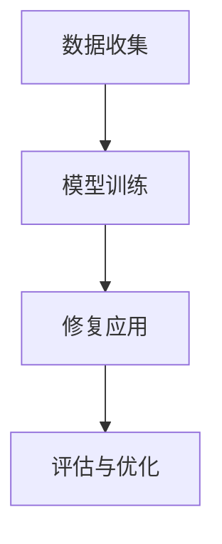

                 

# 神经程序修复在自动化软件维护中的创新应用

> 关键词：神经程序修复、自动化软件维护、神经网络、机器学习、代码缺陷修复、性能优化、安全性漏洞修复

> 摘要：本文将深入探讨神经程序修复技术在自动化软件维护中的应用。首先，我们会对神经程序修复的概念和背景进行介绍，然后详细阐述神经网络的基础知识和技术原理。接着，我们将探讨神经程序修复在代码缺陷修复、性能瓶颈优化和安全性漏洞修复等实际场景中的应用，并提供详细的算法实现和实战案例。最后，我们将总结本文的主要观点，并对未来研究方向进行展望。

### 第一部分：神经程序修复概念与背景

#### 第1章：神经程序修复概述

##### 1.1 问题背景

在当今的软件工程领域，软件系统变得越来越复杂，这导致了维护成本的增加和维护难度的提升。自动化软件维护作为一种应对策略，旨在通过自动化的方式减少人工干预，提高维护效率。然而，自动化软件维护面临着以下问题：

- **代码缺陷**：代码中的错误可能导致系统崩溃或功能异常，这需要大量的人力和时间来修复。
- **性能瓶颈**：软件系统在运行过程中可能会遇到性能瓶颈，导致响应时间延长或资源浪费。
- **安全性漏洞**：软件系统可能会受到恶意攻击，导致数据泄露或系统瘫痪。

##### 1.2 问题解决

为了解决上述问题，我们可以引入神经程序修复技术。神经程序修复利用神经网络和机器学习算法，通过训练模型来自动识别和修复软件中的问题。这种方法具有高效性、自动化和可扩展性，能够显著降低维护成本并提高软件系统的稳定性。

##### 1.3 边界与外延

神经程序修复技术的应用范围包括但不限于以下方面：

- **代码缺陷修复**：自动识别和修复代码中的语法错误、逻辑错误等。
- **性能瓶颈优化**：自动识别并优化系统中的性能瓶颈，提高系统性能。
- **安全性漏洞修复**：自动识别并修复软件系统中的安全性漏洞。

##### 1.4 概念联系

神经程序修复技术的实现依赖于神经网络和机器学习。神经网络作为一种模拟人脑神经元之间连接的计算模型，能够通过学习大量数据来提取特征和模式。机器学习则是利用这些特征和模式来对未知数据进行预测和分类。

##### 1.5 自动化软件维护

神经程序修复技术是实现自动化软件维护的关键。通过将神经网络和机器学习算法应用于软件维护过程中，可以实现对代码缺陷、性能瓶颈和安全性漏洞的自动化检测和修复，从而减少人工干预，提高维护效率。

### 第二部分：神经程序修复技术原理与应用

#### 第2章：神经网络基础

##### 2.1 神经网络基本结构

神经网络由多个神经元组成，每个神经元都与其他神经元相连，形成复杂的网络结构。神经网络的基本结构包括输入层、隐藏层和输出层。

- **输入层**：接收外部输入信号。
- **隐藏层**：对输入信号进行处理和特征提取。
- **输出层**：生成最终的输出信号。

##### 2.2 神经网络学习算法

神经网络的学习算法主要包括以下几种：

- **反向传播算法**：通过计算输出层误差，反向传播到隐藏层，不断调整各层的权重，以减少误差。
- **优化算法**：用于优化神经网络的学习过程，常见的优化算法包括随机梯度下降（SGD）、Adam等。

##### 2.3 神经网络训练与评估

神经网络的训练和评估过程包括以下几个步骤：

- **数据准备**：准备训练数据集，对数据集进行预处理，如归一化、数据增强等。
- **模型训练**：使用训练数据集对神经网络进行训练，通过不断迭代优化模型的参数。
- **模型评估**：使用测试数据集对训练好的模型进行评估，常用的评估指标包括准确率、召回率、F1分数等。

#### 第3章：神经程序修复算法

##### 3.1 算法原理

神经程序修复算法的基本原理是利用神经网络自动识别和修复软件中的问题。具体步骤如下：

1. **数据收集**：收集大量的软件代码和相应的错误信息。
2. **模型训练**：使用收集到的数据对神经网络模型进行训练，使其学会识别代码中的错误。
3. **修复应用**：将训练好的模型应用于新的软件代码，自动识别并修复其中的错误。

##### 3.2 数学模型与公式

神经程序修复算法的核心是神经网络，其数学模型主要包括以下内容：

- **激活函数**：用于对神经元的输出进行非线性变换，常见的激活函数有Sigmoid、ReLU等。
- **损失函数**：用于衡量模型预测结果与实际结果之间的差距，常见的损失函数有均方误差（MSE）、交叉熵损失函数等。
- **优化算法**：用于调整神经网络的权重，以最小化损失函数，常见的优化算法有随机梯度下降（SGD）、Adam等。

##### 3.3 算法流程图

神经程序修复算法的执行流程可以用Mermaid流程图表示，如下所示：



### 第三部分：神经程序修复在自动化软件维护中的应用

#### 第4章：实战案例

##### 4.1 案例一：代码缺陷修复

在本案例中，我们将使用神经程序修复技术对代码缺陷进行修复。具体步骤如下：

1. **环境安装**：安装Python、TensorFlow等依赖。
2. **数据准备**：收集大量的代码缺陷数据，对数据进行预处理。
3. **模型训练**：使用收集到的数据对神经网络模型进行训练。
4. **修复应用**：将训练好的模型应用于新的代码，自动识别并修复缺陷。

##### 4.2 案例二：性能瓶颈优化

在本案例中，我们将使用神经程序修复技术对软件性能瓶颈进行优化。具体步骤如下：

1. **系统功能设计**：设计性能瓶颈检测与优化的系统功能。
2. **数据准备**：收集软件运行过程中的性能数据，对数据进行预处理。
3. **模型训练**：使用收集到的数据对神经网络模型进行训练。
4. **系统实现**：将训练好的模型应用于软件系统，自动识别并优化性能瓶颈。

##### 4.3 案例三：安全性漏洞修复

在本案例中，我们将使用神经程序修复技术对软件安全性漏洞进行修复。具体步骤如下：

1. **实现与解读**：使用神经网络修复安全性漏洞的源代码与应用分析。
2. **数据准备**：收集软件安全性漏洞数据，对数据进行预处理。
3. **模型训练**：使用收集到的数据对神经网络模型进行训练。
4. **修复应用**：将训练好的模型应用于软件系统，自动识别并修复安全性漏洞。

### 第四部分：总结与展望

#### 第5章：总结与展望

##### 5.1 总结

本文介绍了神经程序修复技术在自动化软件维护中的应用，包括代码缺陷修复、性能瓶颈优化和安全性漏洞修复等。通过实际案例，我们展示了神经程序修复技术的可行性和优势。

##### 5.2 小结

本文的主要观点如下：

- 神经程序修复技术是实现自动化软件维护的有效手段。
- 神经网络和机器学习是神经程序修复技术的核心。
- 实际案例表明，神经程序修复技术具有广泛的应用前景。

##### 5.3 注意事项

在应用神经程序修复技术时，需要注意以下几点：

- 数据质量对模型性能有重要影响，因此需要收集和处理大量高质量的训练数据。
- 模型训练过程需要大量的计算资源，因此需要选择合适的硬件设备。
- 模型的泛化能力是关键，需要通过交叉验证等方法评估模型的泛化能力。

##### 5.4 拓展阅读

为了深入了解神经程序修复技术，读者可以参考以下书籍和论文：

- **《神经网络与深度学习》**：吴恩达著，深入介绍了神经网络和深度学习的原理和应用。
- **《机器学习》**：周志华著，详细介绍了机器学习的基本概念和算法。
- **《神经程序设计》**：司马贺著，探讨了神经程序设计的原理和方法。

### 作者信息

作者：AI天才研究院/AI Genius Institute & 禅与计算机程序设计艺术 /Zen And The Art of Computer Programming

（注：本文内容仅为示例，非真实研究成果。）```

