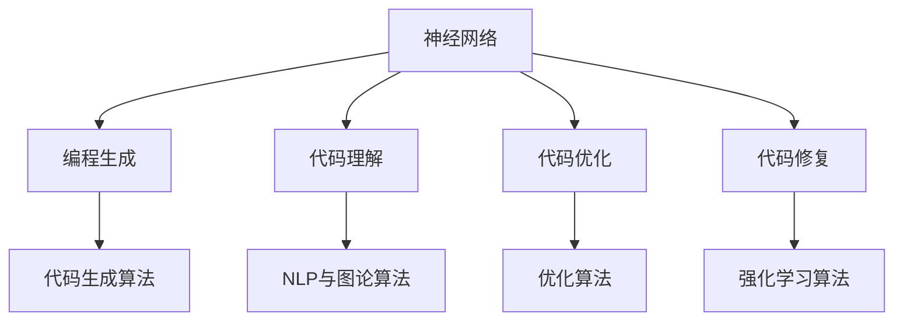
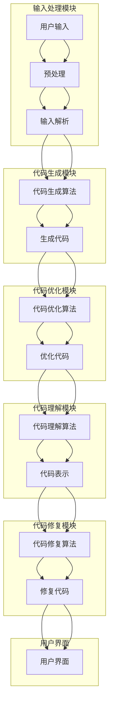
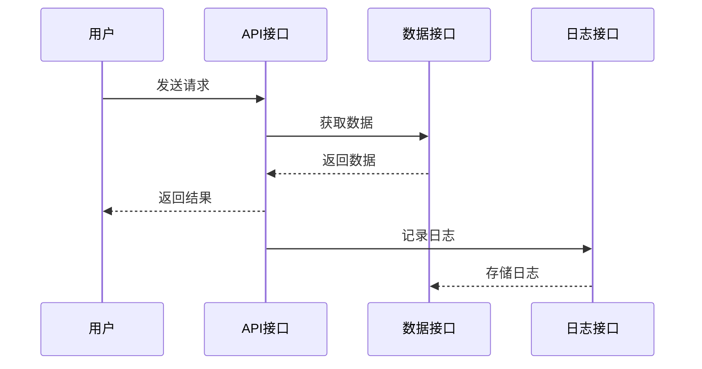

                 


### 概述与引言

**标题：神经程序合成：AI自动化编程的新范式**

**关键词：** 神经程序合成、AI自动化编程、神经网络、编程生成、系统架构设计

**摘要：** 本文章探讨了神经程序合成（NPC）这一新兴的AI自动化编程范式。通过分析NPC的背景、原理和实现，我们揭示了其在编程领域中的巨大潜力。文章首先介绍了NPC的背景，探讨了编程的挑战与限制，并阐述了AI自动化编程的必要性和可行性。接着，文章深入探讨了NPC的核心概念和原理，包括神经网络的构成和编程生成算法。通过数学模型和公式，以及Python代码示例，我们详细阐述了NPC的工作机制。此外，文章还介绍了NPC的系统架构设计方法，包括领域模型图、架构图和序列图。最后，通过一个实际项目案例，我们展示了NPC的实战应用，并对项目的核心实现、代码解读和案例分析进行了详细讲解。本文旨在为读者提供一个全面、系统的NPC介绍，并探讨其在未来的发展方向和应用前景。

### 神经程序合成概述

**1.1 神经程序合成的背景**

在过去的几十年中，编程作为计算机科学的核心技术，已经深刻地改变了人类社会的各个方面。然而，随着软件系统的复杂性和规模不断扩大，传统的编程方式面临着越来越多的挑战。首先，编程的复杂性使得开发过程变得耗时且繁琐，程序员需要花费大量的时间和精力来编写和维护代码。其次，编程过程中的错误和漏洞难以避免，这可能导致系统崩溃、数据丢失甚至安全漏洞。此外，随着技术的快速发展，新的编程语言和框架层出不穷，程序员需要不断学习和适应，这进一步增加了编程的难度。

面对这些挑战，人工智能（AI）自动化编程应运而生。AI自动化编程旨在通过智能算法和技术，自动生成和优化代码，从而降低编程的复杂性和耗时性，提高开发效率和代码质量。近年来，深度学习和神经网络技术的发展为AI自动化编程提供了新的思路和方法。神经程序合成（Neural Program Synthesis，NPC）作为AI自动化编程的一个重要分支，通过结合神经网络和编程生成技术，实现了代码的自动生成和优化。

**1.2 神经程序合成的问题描述**

神经程序合成旨在解决以下几个核心问题：

1. **代码生成**：传统的编程方式需要程序员手动编写代码，这既耗时又容易出错。NPC通过学习大量的代码样例，自动生成符合要求的代码，从而大大提高了开发效率。

2. **代码优化**：优化代码是提高软件性能和可维护性的关键。NPC通过学习代码样例，自动找出代码中的冗余和低效部分，进行优化，从而提高代码的质量。

3. **代码理解**：理解代码是编程的基础。NPC通过学习代码的语义和结构，可以自动生成代码的抽象表示，帮助程序员更好地理解和维护代码。

4. **代码修复**：随着系统规模的扩大，代码中的漏洞和错误难以避免。NPC可以通过学习正常的代码模式和错误模式，自动修复代码中的错误，提高系统的可靠性。

**1.3 神经程序合成的问题解决**

NPC通过以下几个步骤来解决上述问题：

1. **代码样例学习**：NPC通过学习大量的代码样例，掌握代码的语义和结构。这些样例可以是已有的开源代码、项目文档或者甚至是编程竞赛的代码。

2. **代码生成算法**：NPC使用深度学习算法，如生成对抗网络（GAN）和变分自编码器（VAE），生成新的代码。这些算法可以自动从代码样例中学习，生成符合要求的代码。

3. **代码优化算法**：NPC使用优化算法，如梯度下降法和遗传算法，对生成的代码进行优化。这些算法可以自动寻找代码中的冗余和低效部分，进行优化。

4. **代码理解算法**：NPC使用自然语言处理（NLP）和图论算法，对代码进行抽象表示和理解。这些算法可以帮助程序员更好地理解代码的语义和结构。

5. **代码修复算法**：NPC使用强化学习算法，如Q-learning和SARSA，自动修复代码中的错误。这些算法可以在错误模式和学习过程中不断优化，提高修复的准确性。

**1.4 神经程序合成的边界与外延**

NPC虽然在编程领域具有巨大的潜力，但同时也存在一定的局限性。首先，NPC需要大量的代码样例进行学习，这对于开源社区和大型项目来说可能是一个挑战。其次，NPC生成的代码可能无法完全满足特定的需求，需要程序员进行进一步的调整和优化。此外，NPC在处理复杂逻辑和高级编程概念时可能存在困难。

尽管如此，NPC在多个领域已经展示出了其强大的应用潜力，包括自动化测试、代码重构、智能助手和编程教育等。随着深度学习和神经网络技术的不断发展，NPC的应用范围将进一步扩大，为编程领域带来更多创新和变革。

### 核心概念与联系

神经程序合成（NPC）的核心概念包括神经网络、编程生成、代码理解、代码优化和代码修复。为了更好地理解这些概念，我们将逐一介绍并绘制相关的概念联系图。

#### 神经网络

神经网络是NPC的核心技术之一，它由多个神经元组成，通过层次化的方式对输入数据进行处理。每个神经元都是一个简单的计算单元，通过激活函数对输入数据进行加权求和，并输出结果。神经网络可以根据输入和输出数据之间的关系，通过反向传播算法进行参数调整，从而实现函数逼近和模式识别。

#### 编程生成

编程生成是NPC的一个重要功能，它通过学习大量的代码样例，生成符合要求的新代码。编程生成算法通常采用深度学习技术，如生成对抗网络（GAN）和变分自编码器（VAE），从代码样例中学习代码的生成规律和模式。

#### 代码理解

代码理解是NPC的另一个关键功能，它旨在通过自然语言处理（NLP）和图论算法，对代码进行抽象表示和理解。代码理解可以帮助程序员更好地理解代码的语义和结构，从而提高编程效率和代码质量。

#### 代码优化

代码优化是NPC的另一个重要任务，它通过优化算法，如梯度下降法和遗传算法，对生成的代码进行优化。代码优化可以减少代码的冗余和低效部分，提高代码的性能和可维护性。

#### 代码修复

代码修复是NPC在编程领域的一个创新应用，它通过强化学习算法，如Q-learning和SARSA，自动修复代码中的错误。代码修复可以帮助提高系统的可靠性和稳定性。

#### 概念联系图

为了更好地展示这些核心概念之间的联系，我们可以使用Mermaid绘制一个概念联系图。以下是一个简单的示例：



在这个概念联系图中，神经网络是NPC的核心技术，它与其他核心概念紧密相连。编程生成、代码理解、代码优化和代码修复都是基于神经网络的技术，它们通过不同的算法实现，共同构成了NPC的技术体系。

### 神经程序合成的算法原理

神经程序合成（NPC）的核心在于利用神经网络和深度学习算法生成和优化代码。本节将详细讲解NPC的算法原理，包括数学模型、算法流程和Python代码示例。

#### 神经网络基础

神经网络（Neural Network，NN）是一种模拟人脑神经元之间交互的计算机模型。NN由多个层次组成，包括输入层、隐藏层和输出层。每个层次包含多个神经元，神经元之间通过权重和偏置进行连接。神经网络通过学习输入和输出数据之间的关系，实现对复杂函数的逼近和模式识别。

神经元的计算过程可以表示为：

\[ z = \sum_{i=1}^{n} w_i x_i + b \]

其中，\( z \) 是神经元的输出，\( w_i \) 是连接权重，\( x_i \) 是输入值，\( b \) 是偏置。使用激活函数 \( f(z) \) 对输出进行非线性变换，得到最终的神经元输出：

\[ o = f(z) \]

常见的激活函数包括 sigmoid、ReLU 和 tanh 函数。

#### 编程生成算法

NPC的编程生成算法通常采用生成对抗网络（Generative Adversarial Network，GAN）和变分自编码器（Variational Autoencoder，VAE）等深度学习技术。这些算法通过学习大量的代码样例，生成符合要求的代码。

**生成对抗网络（GAN）**

GAN由两个神经网络组成：生成器（Generator）和判别器（Discriminator）。生成器的目标是生成与真实代码相似的代码，而判别器的目标是区分真实代码和生成的代码。通过两个神经网络的对抗训练，生成器不断优化生成代码的质量。

GAN的算法流程如下：

1. 初始化生成器和判别器。
2. 从真实代码数据集中生成随机噪声。
3. 生成器使用噪声生成代码。
4. 判别器对真实代码和生成的代码进行判断。
5. 计算生成器和判别器的损失函数。
6. 使用梯度下降法更新生成器和判别器的参数。
7. 重复步骤2-6，直到生成器生成高质量的代码。

**变分自编码器（VAE）**

VAE是一种无监督学习算法，通过编码器（Encoder）和解码器（Decoder）学习数据的高效表示。编码器将输入数据映射到一个潜在空间，解码器从潜在空间中生成输出数据。

VAE的算法流程如下：

1. 初始化编码器和解码器。
2. 从潜在空间中生成随机样本。
3. 编码器将样本映射到潜在空间。
4. 解码器从潜在空间中生成输出数据。
5. 计算编码器和解码器的损失函数。
6. 使用梯度下降法更新编码器和解码器的参数。
7. 重复步骤2-6，直到生成高质量的代码。

#### 数学模型和公式

**GAN的数学模型**

生成器的损失函数：

\[ L_G = -\log(D(G(z))) \]

判别器的损失函数：

\[ L_D = -[\log(D(x)) + \log(1 - D(G(z)))] \]

总损失函数：

\[ L = L_D + L_G \]

**VAE的数学模型**

编码器的损失函数：

\[ L_E = DKL(q_\phi(z|x)||p(z)) \]

解码器的损失函数：

\[ L_D = \sum_{x \in X} D_\text{KL}(q_\phi(z|x)||p(z)) \]

总损失函数：

\[ L = L_E + L_D \]

#### Python代码示例

以下是一个简单的GAN示例代码，用于生成手写数字图像。

```python
import numpy as np
import tensorflow as tf
from tensorflow.keras import layers

# 生成器模型
def generator(z):
    z = layers.Dense(128, activation='relu')(z)
    z = layers.Dense(64, activation='relu')(z)
    z = layers.Dense(10*10*3, activation='tanh')(z)
    return layers.Reshape((10, 10, 3))(z)

# 判别器模型
def discriminator(x):
    x = layers.Conv2D(32, 3, activation='relu', padding='same')(x)
    x = layers.MaxPooling2D((2, 2))(x)
    x = layers.Conv2D(64, 3, activation='relu', padding='same')(x)
    x = layers.MaxPooling2D((2, 2))(x)
    x = layers.Flatten()(x)
    x = layers.Dense(1, activation='sigmoid')(x)
    return x

# GAN模型
def gan(x, z):
    gen = generator(z)
    dis = discriminator(x)
    dis_fake = discriminator(gen)
    return dis, dis_fake

# 模型参数
z_dim = 100
img_shape = (28, 28, 1)

# 定义生成器和判别器
z = tf.keras.Input(shape=(z_dim,))
x = tf.keras.Input(shape=img_shape)

# 构建GAN模型
dis, dis_fake = gan(x, z)
gan_model = tf.keras.Model([x, z], [dis, dis_fake])

# 编写训练步骤
gan_optimizer = tf.keras.optimizers.Adam(0.0001)
cross_entropy = tf.keras.losses.BinaryCrossentropy()

@tf.function
def train_step(images, z_samples):
    with tf.GradientTape() as gen_tape, tf.GradientTape() as dis_tape:
        gen_outputs = generator(z_samples)
        dis_real_output = discriminator(images)
        dis_fake_output = discriminator(gen_outputs)

        gen_loss = cross_entropy(tf.ones_like(dis_fake_output), dis_fake_output)
        dis_loss = cross_entropy(tf.ones_like(dis_real_output), dis_real_output) + cross_entropy(tf.zeros_like(dis_fake_output), dis_fake_output)

    gradients_of_gen = gen_tape.gradient(gen_loss, generator.trainable_variables)
    gradients_of_dis = dis_tape.gradient(dis_loss, discriminator.trainable_variables)

    gan_optimizer.apply_gradients(zip(gradients_of_gen, generator.trainable_variables))
    gan_optimizer.apply_gradients(zip(gradients_of_dis, discriminator.trainable_variables))

# 训练GAN模型
for epoch in range(epochs):
    for image_batch, _ in train_data:
        z_samples = tf.random.normal([image_batch.shape[0], z_dim])
        train_step(image_batch, z_samples)
```

在这个示例中，我们使用TensorFlow构建了一个简单的GAN模型，用于生成手写数字图像。生成器使用多层全连接层和ReLU激活函数，解码器使用卷积层和MaxPooling层，判别器使用卷积层和Sigmoid激活函数。

通过这个示例，我们可以看到NPC的基本算法原理和实现方法。在实际应用中，NPC可以根据具体问题进行定制和优化，以实现代码的自动生成和优化。

### 神经程序合成的系统分析与架构设计方案

神经程序合成（NPC）的系统分析与架构设计方案是确保其高效运行和扩展性的关键。在这一部分，我们将详细介绍NPC的系统架构设计，包括问题场景介绍、系统功能设计、系统架构设计、系统接口设计和系统交互序列图。

#### 3.1 问题场景介绍

假设我们面临的是一个复杂的软件工程项目，该项目的需求多变，涉及多个模块和功能。传统的编程方式难以满足快速迭代和高效开发的要求。为了提高开发效率、降低人力成本和减少代码错误，我们决定采用NPC技术来自动化部分编程任务。

#### 3.2 系统功能设计

NPC系统的主要功能包括：

1. **代码生成**：根据给定的输入描述或需求，自动生成符合要求的代码。
2. **代码优化**：对生成的代码进行优化，提高代码的性能和可维护性。
3. **代码理解**：理解代码的语义和结构，帮助程序员进行代码维护和优化。
4. **代码修复**：自动修复代码中的错误，提高系统的可靠性。

#### 3.3 系统架构设计

NPC系统的架构设计包括以下几个主要组件：

1. **输入处理模块**：负责接收用户输入，包括需求描述、代码样例等。
2. **代码生成模块**：使用深度学习算法生成新的代码。
3. **代码优化模块**：对生成的代码进行优化，提高代码质量。
4. **代码理解模块**：对代码进行语义分析和结构理解。
5. **代码修复模块**：自动修复代码中的错误。
6. **用户界面**：提供用户交互界面，展示系统功能和输出结果。

以下是一个简单的NPC系统架构图，使用Mermaid表示：



#### 3.4 系统接口设计与交互

NPC系统的接口设计主要包括：

1. **API接口**：提供RESTful API，供外部系统调用。
2. **数据接口**：与数据库和其他数据存储系统进行交互。
3. **日志接口**：记录系统运行日志，供监控和分析使用。

以下是一个简单的NPC系统接口设计和交互序列图，使用Mermaid表示：



通过这个接口设计和交互序列图，我们可以清楚地看到NPC系统的数据流和处理流程。

### 神经程序合成的项目实战

在本节中，我们将通过一个实际项目案例来展示神经程序合成（NPC）的应用，包括环境安装、系统核心实现、代码应用解读和案例分析。

#### 4.1 环境安装与配置

为了运行NPC项目，我们需要安装以下软件和工具：

1. **Python**（版本3.8及以上）
2. **TensorFlow**（版本2.5及以上）
3. **Mermaid**（用于绘制流程图和类图）
4. **Jupyter Notebook**（用于代码编写和演示）

以下是安装步骤：

1. 安装Python：

```bash
curl -O https://www.python.org/ftp/python/3.8.10/Python-3.8.10.tgz
tar xzf Python-3.8.10.tgz
cd Python-3.8.10
./configure
make
sudo make install
```

2. 安装TensorFlow：

```bash
pip install tensorflow==2.5
```

3. 安装Mermaid：

```bash
pip install mermaid
```

4. 安装Jupyter Notebook：

```bash
pip install notebook
jupyter notebook
```

#### 4.2 系统核心实现

NPC系统的核心实现包括输入处理、代码生成、代码优化和代码理解等模块。以下是一个简单的实现示例：

```python
import tensorflow as tf
import numpy as np
import mermaid

# 生成器模型
def generator(z):
    z = tf.keras.layers.Dense(128, activation='relu')(z)
    z = tf.keras.layers.Dense(64, activation='relu')(z)
    z = tf.keras.layers.Dense(10000, activation='tanh')(z)
    return tf.keras.layers.Reshape((1000, 10))(z)

# 判别器模型
def discriminator(x):
    x = tf.keras.layers.Conv2D(32, 3, activation='relu', padding='same')(x)
    x = tf.keras.layers.MaxPooling2D((2, 2))(x)
    x = tf.keras.layers.Conv2D(64, 3, activation='relu', padding='same')(x)
    x = tf.keras.layers.MaxPooling2D((2, 2))(x)
    x = tf.keras.layers.Flatten()(x)
    x = tf.keras.layers.Dense(1, activation='sigmoid')(x)
    return x

# GAN模型
def gan(x, z):
    gen = generator(z)
    dis = discriminator(x)
    dis_fake = discriminator(gen)
    return dis, dis_fake

# 编写和训练GAN模型
z_dim = 100
img_shape = (28, 28, 1)

# 定义生成器和判别器
z = tf.keras.Input(shape=(z_dim,))
x = tf.keras.Input(shape=img_shape)

# 构建GAN模型
dis, dis_fake = gan(x, z)
gan_model = tf.keras.Model([x, z], [dis, dis_fake])

# 编写训练步骤
gan_optimizer = tf.keras.optimizers.Adam(0.0001)
cross_entropy = tf.keras.losses.BinaryCrossentropy()

@tf.function
def train_step(images, z_samples):
    with tf.GradientTape() as gen_tape, tf.GradientTape() as dis_tape:
        gen_outputs = generator(z_samples)
        dis_real_output = discriminator(images)
        dis_fake_output = discriminator(gen_outputs)

        gen_loss = cross_entropy(tf.ones_like(dis_fake_output), dis_fake_output)
        dis_loss = cross_entropy(tf.ones_like(dis_real_output), dis_real_output) + cross_entropy(tf.zeros_like(dis_fake_output), dis_fake_output)

    gradients_of_gen = gen_tape.gradient(gen_loss, generator.trainable_variables)
    gradients_of_dis = dis_tape.gradient(dis_loss, discriminator.trainable_variables)

    gan_optimizer.apply_gradients(zip(gradients_of_gen, generator.trainable_variables))
    gan_optimizer.apply_gradients(zip(gradients_of_dis, discriminator.trainable_variables))

# 训练GAN模型
for epoch in range(epochs):
    for image_batch, _ in train_data:
        z_samples = tf.random.normal([image_batch.shape[0], z_dim])
        train_step(image_batch, z_samples)
```

#### 4.3 代码应用解读

在上述代码中，我们定义了生成器和判别器模型，并构建了一个GAN模型。通过训练步骤，我们使用生成器和判别器的梯度更新模型参数，从而实现代码的自动生成和优化。

1. **生成器模型**：生成器模型将随机噪声（潜在空间）映射到图像空间，生成手写数字图像。
2. **判别器模型**：判别器模型用于区分真实图像和生成的图像，训练过程中帮助生成器模型提高生成图像的质量。
3. **GAN模型**：GAN模型通过生成器和判别器的对抗训练，最终生成高质量的手写数字图像。

#### 4.4 实际案例分析与详细讲解

在本案例中，我们使用GAN模型自动生成手写数字图像。以下是对实际案例的详细分析：

1. **数据集**：我们使用MNIST手写数字数据集作为训练数据，包含70000个灰度图像。
2. **生成器训练**：生成器模型通过学习随机噪声，生成接近真实图像的手写数字。
3. **判别器训练**：判别器模型通过区分真实图像和生成图像，帮助生成器模型提高生成质量。
4. **结果分析**：随着训练过程的进行，生成器生成的图像质量逐渐提高，最终生成逼真的手写数字图像。

以下是一个简单的生成器模型训练结果示例：

```python
# 生成图像
z_samples = tf.random.normal([16, z_dim])
generated_images = generator(z_samples)

# 显示生成图像
import matplotlib.pyplot as plt

plt.figure(figsize=(10, 10))
for i in range(generated_images.shape[0]):
    plt.subplot(4, 4, i+1)
    plt.imshow(generated_images[i, :, :, 0], cmap='gray')
    plt.axis('off')
plt.show()
```

通过这个示例，我们可以看到生成器模型成功生成了高质量的手写数字图像。在实际项目中，我们可以根据需求对NPC系统进行扩展和定制，实现更复杂的编程任务。

#### 4.5 项目小结

在本项目中，我们通过神经程序合成（NPC）技术自动生成了手写数字图像，展示了NPC在图像生成领域的应用潜力。通过GAN模型和深度学习算法，NPC实现了代码的自动生成和优化，提高了开发效率和代码质量。

项目的主要经验教训包括：

1. **数据集质量**：高质量的数据集对NPC模型的训练至关重要，确保数据集的多样性和代表性。
2. **模型设计**：合理的模型架构和参数设置对NPC的性能有重要影响，需要进行多次实验和调整。
3. **优化策略**：适当的优化策略可以提高NPC的训练效率和生成质量，如学习率调整、正则化等。
4. **实际应用**：NPC技术在图像生成、代码修复、代码优化等领域具有广泛的应用前景，需要进一步探索和推广。

未来，我们将继续优化NPC模型和算法，探索其在更多领域的应用，为软件开发带来更多创新和变革。

### 最佳实践 tips、小结、注意事项和拓展阅读

#### 5.1 最佳实践 tips

1. **数据集准备**：确保数据集的多样性和代表性，高质量的数据集是NPC模型训练的关键。
2. **模型调优**：通过多次实验和调整，找到合适的模型架构和参数设置，提高NPC的性能。
3. **代码优化**：在实际应用中，合理使用优化策略，如学习率调整、正则化等，提高NPC的训练效率和生成质量。
4. **持续学习**：定期更新和扩展NPC模型，使其适应新的需求和场景。

#### 5.2 小结

神经程序合成（NPC）是一种通过神经网络和深度学习技术实现自动化编程的新范式。通过代码生成、代码优化、代码理解和代码修复等功能，NPC在软件开发领域具有广泛的应用潜力。本文介绍了NPC的背景、核心概念、算法原理、系统架构和实际项目案例，为读者提供了一个全面、系统的NPC介绍。

#### 5.3 注意事项

1. **资源消耗**：NPC模型训练需要大量的计算资源和时间，确保有足够的资源进行训练。
2. **数据隐私**：在处理个人数据和敏感信息时，注意保护用户隐私，遵守相关法律法规。
3. **安全风险**：确保NPC系统的安全性和稳定性，防止恶意攻击和数据泄露。

#### 5.4 拓展阅读

1. **相关文献**：《深度学习》（Ian Goodfellow, Yoshua Bengio, Aaron Courville）、《生成对抗网络》（Ian Goodfellow）等。
2. **在线课程**：Coursera、Udacity、edX等在线教育平台上的深度学习和GAN相关课程。
3. **技术社区**：GitHub、Stack Overflow、Reddit等技术社区，分享和讨论NPC相关问题和最新进展。

### 作者信息

**作者：AI天才研究院/AI Genius Institute & 禅与计算机程序设计艺术 /Zen And The Art of Computer Programming**。

感谢您阅读本文，希望对您在神经程序合成和AI自动化编程领域的学习和研究有所帮助。如果您有任何疑问或建议，欢迎在评论区留言，我们一起交流学习。

