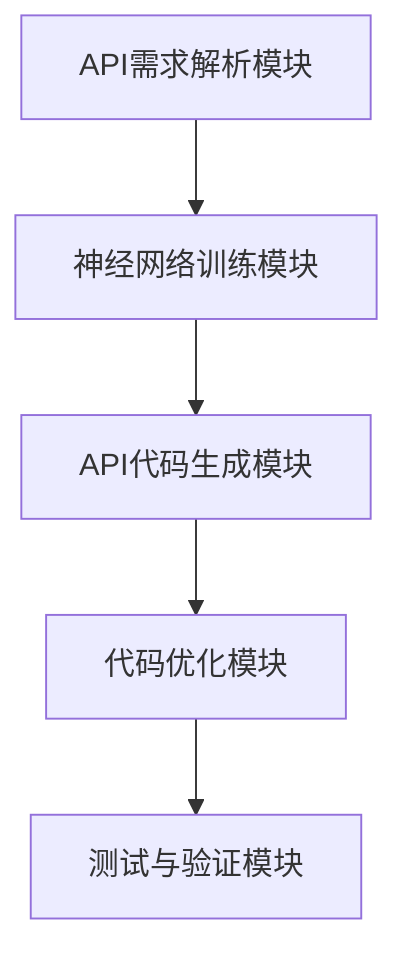
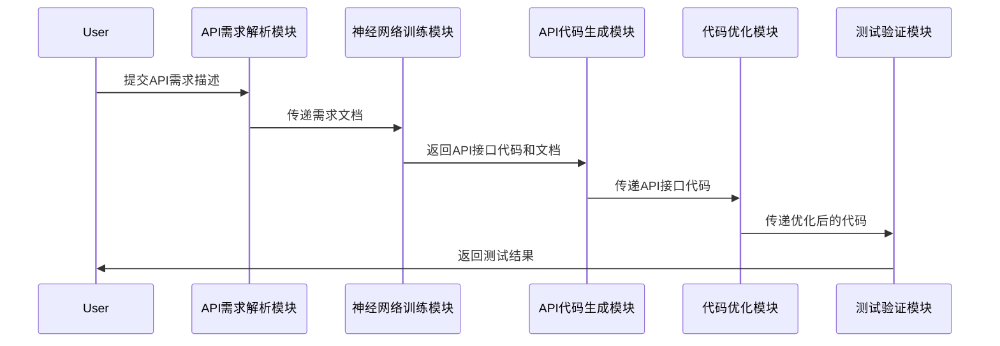

                 

## 摘要

本文将深入探讨神经程序合成在自动化API生成中的应用。神经程序合成是一种结合人工智能与软件工程的新兴技术，通过神经网络自动生成代码，以实现API的自动化创建与优化。本文将首先介绍API自动生成的问题背景，阐述现有解决方案的局限性。随后，我们将定义核心概念，包括神经程序合成的原理、算法以及数学模型。通过对比不同的概念属性特征，构建ER实体关系图，为后续分析奠定基础。接着，本文将详细讲解神经程序合成算法的原理，包括数学模型与公式的推导，并辅以Python源代码实现与示例说明。随后，我们将讨论自动化API生成的系统分析与架构设计，从问题场景介绍到系统架构图、接口设计及系统交互的详细描述。通过一个实际项目案例，我们将展示神经程序合成在自动化API生成中的具体应用，并提供代码解读与分析。最后，本文将总结最佳实践，提醒读者注意事项，并提供进一步阅读的拓展资料，以期为读者提供全面、深入的技术见解。## 第一部分：背景与基础

### 第1章：问题背景与概述

#### 1.1 问题背景

随着互联网和移动应用的迅速发展，API（应用程序编程接口）已成为软件开发中不可或缺的一部分。API作为一种接口，允许不同软件系统之间进行数据交换和功能调用，极大地提升了软件开发的效率与灵活性。然而，传统的API开发过程往往复杂且耗时，需要开发者手动编写大量的代码，进行接口设计、功能实现、测试与调试等步骤。这不仅增加了开发成本，还限制了开发的速度和灵活性。

#### 1.2 问题描述

在现有的API开发过程中，存在以下几个主要问题：

1. **人力成本高**：手动编写API需要大量的人力投入，尤其是在复杂的项目中，开发人员的工作量巨大。
2. **开发周期长**：从需求分析到功能实现，再到测试和上线，整个开发周期往往较长，无法满足快速迭代的需求。
3. **错误率高**：手动编码容易引入错误，尤其是在接口设计和数据交换过程中，错误可能会导致系统崩溃或数据不一致。
4. **维护困难**：随着项目规模的扩大，API的数量和复杂性增加，维护和更新变得更加困难。

#### 1.3 问题解决

为了解决上述问题，自动化API生成技术应运而生。自动化API生成通过算法和工具，自动生成API文档、接口代码以及相关的测试用例，从而实现API的自动化创建与优化。这一技术的核心优势在于：

1. **提高开发效率**：自动化工具可以显著减少手动编码的工作量，加快开发速度。
2. **减少开发成本**：通过自动化生成，可以节省大量的人力和时间成本。
3. **降低错误率**：自动化工具可以减少人为错误，提高代码质量。
4. **便于维护**：自动化生成的API具有更好的结构化和文档化，便于后续的维护和更新。

#### 1.4 边界与外延

尽管自动化API生成技术具有显著的优势，但其在实际应用中仍存在一定的边界和局限性。首先，自动化生成的质量取决于算法的智能程度和训练数据的质量，如果算法不够智能或数据不足，生成的API可能无法满足需求。其次，自动化工具需要适应各种不同的开发环境和框架，这增加了工具开发的复杂度。此外，自动化生成还需要与现有的开发流程和团队协作机制进行整合，以确保其有效应用。

总的来说，自动化API生成是解决传统API开发问题的有效手段，但其应用效果依赖于技术的成熟度和开发环境的适应性。## 第2章：核心概念与联系

### 2.1 核心概念

#### 神经程序合成（Neural Program Synthesis）

神经程序合成是一种利用神经网络自动生成代码的技术。它通过训练神经网络模型，使其能够从输入数据中学习并生成对应的代码片段。神经程序合成的核心思想是将代码表示为序列，然后使用序列生成模型来预测下一个代码单元，逐步生成完整的代码。

#### 自动化API生成（Automated API Generation）

自动化API生成是一种利用算法和工具自动创建API文档、接口代码及相关测试用例的技术。它通过分析系统需求、数据模型和接口定义，自动生成符合要求的API接口，从而简化开发流程，提高开发效率。

### 2.2 概念属性特征对比

为了更好地理解神经程序合成与自动化API生成的关系，我们对比两者的核心属性特征，如下表所示：

| 特征        | 神经程序合成                  | 自动化API生成                  |
| ----------- | ---------------------------- | ------------------------------ |
| 目标        | 生成代码片段                 | 生成API接口和文档              |
| 技术基础    | 神经网络、深度学习           | 自然语言处理、代码生成技术      |
| 数据依赖    | 大量的代码样例和训练数据    | API需求描述、数据模型和接口定义 |
| 应用场景    | API生成、代码自动化优化      | API自动化创建、API文档生成      |
| 开发难度    | 较高，需要深度学习知识和算法优化 | 较高，需要自然语言处理和代码生成技术 |

### 2.3 ER实体关系图架构

为了更清晰地展示神经程序合成与自动化API生成的关联，我们使用ER（实体关系）图来描述两者的架构关系。ER图中的实体包括：

1. **代码库**：包含大量的代码样例和训练数据，用于训练神经程序合成模型。
2. **API需求描述**：描述系统的API需求和功能。
3. **数据模型**：定义系统的数据结构和数据关系。
4. **API生成器**：基于神经程序合成模型，自动生成API接口和文档。
5. **API接口**：生成的API接口，实现系统功能调用。
6. **测试用例**：用于验证API接口的正确性和稳定性。

以下是一个简化的ER图，展示上述实体的关系：

```mermaid
erDiagram
  API需求描述 ||--|{ API生成器 }|-- API接口
  API需求描述 ||--|{ API生成器 }|-- 测试用例
  API生成器 ||--|{ 数据模型 }|-- API接口
  API生成器 ||--|{ 数据模型 }|-- 测试用例
  代码库 ||--|{ API生成器 }|-- API接口
  代码库 ||--|{ API生成器 }|-- 测试用例
```

通过ER图，我们可以看到，神经程序合成模型和自动化API生成器依赖于API需求描述、数据模型和代码库，生成的API接口和测试用例进一步实现了系统的功能调用和验证。这种架构设计使得神经程序合成能够有效地支持自动化API生成的全过程。## 第3章：算法原理讲解

### 3.1 算法原理

神经程序合成算法的核心原理是基于生成式对抗网络（GAN）和递归神经网络（RNN）。生成式对抗网络通过两个神经网络——生成器和判别器的对抗训练，生成高质量的代码片段。递归神经网络则用于处理代码的序列特性，使其能够生成连续的代码单元。

#### 3.2 数学模型与公式

神经程序合成算法的数学模型主要包括以下几个方面：

1. **生成式对抗网络（GAN）**：

   - **生成器**：生成代码片段，模型表示为 \( G(x) \)，其中 \( x \) 是输入数据。

   - **判别器**：判断输入数据是否为真实代码，模型表示为 \( D(x) \)。

   - **对抗损失函数**：

     $$ L_G = -\log(D(G(x))) $$
     $$ L_D = -\log(D(x) + D(G(x))) $$

2. **递归神经网络（RNN）**：

   - **编码器**：将代码片段编码为一个固定长度的向量。

   - **解码器**：将编码后的向量解码为生成代码。

   - **损失函数**：

     $$ L = -\log(p(y_t | y_{<t})) $$

     其中，\( y_t \) 是生成的代码单元，\( y_{<t} \) 是前 \( t-1 \) 个生成的代码单元。

#### 3.3 详细讲解与举例说明

为了更好地理解神经程序合成算法，我们通过一个简单的Python代码示例进行说明。

```python
import numpy as np
import tensorflow as tf
from tensorflow.keras.models import Model
from tensorflow.keras.layers import Input, LSTM, Dense

# 生成器模型
input_seq = Input(shape=(None, num_features))
encoded_seq = LSTM(units=256, return_sequences=True)(input_seq)
encoded_seq = LSTM(units=512, return_sequences=True)(encoded_seq)
decoded_seq = LSTM(units=512, return_sequences=True)(encoded_seq)
decoded_seq = LSTM(units=256, return_sequences=True)(decoded_seq)
output_seq = Dense(num_classes, activation='softmax')(decoded_seq)

generator = Model(inputs=input_seq, outputs=output_seq)

# 判别器模型
input_seq_d = Input(shape=(None, num_features))
output_seq_d = Input(shape=(None, num_classes))
d_output = Dense(units=1, activation='sigmoid')(tf.keras.layers.concatenate([input_seq_d, output_seq_d]))

discriminator = Model(inputs=[input_seq_d, output_seq_d], outputs=d_output)

# 对抗训练
gan_input = Input(shape=(None, num_features))
fake_output = generator(gan_input)
discriminator_output_fake = discriminator([gan_input, fake_output])
discriminator_output_real = discriminator([gan_input, input_seq])

gan_output = tf.keras.layers.concatenate([discriminator_output_fake, discriminator_output_real])
gan = Model(inputs=gan_input, outputs=gan_output)

# 损失函数
gan_optimizer = tf.keras.optimizers.Adam(learning_rate=0.0001)
discriminator_optimizer = tf.keras.optimizers.Adam(learning_rate=0.0001)

def gan_loss(y_true, y_fake):
    return -tf.reduce_mean(tf.concat([tf.log(y_fake), tf.log(1. - y_fake)], axis=1))

def discriminator_loss(y_true, y_fake):
    return tf.reduce_mean(tf.nn.sigmoid_cross_entropy_with_logits(logits=y_fake, labels=tf.zeros_like(y_fake)) + tf.nn.sigmoid_cross_entropy_with_logits(logits=y_true, labels=tf.ones_like(y_true)))

# 梯度下降
@tf.function
def train_step(input_seq, target_seq):
    with tf.GradientTape() as gen_tape, tf.GradientTape() as disc_tape:
        fake_output = generator(input_seq)
        disc_real_output = discriminator([input_seq, target_seq])
        disc_fake_output = discriminator([input_seq, fake_output])

        gen_loss = gan_loss(disc_fake_output)
        disc_loss = discriminator_loss(disc_real_output, disc_fake_output)

    generator_gradients = gen_tape.gradient(gen_loss, generator.trainable_variables)
    discriminator_gradients = disc_tape.gradient(disc_loss, discriminator.trainable_variables)

    generator_optimizer.apply_gradients(zip(generator_gradients, generator.trainable_variables))
    discriminator_optimizer.apply_gradients(zip(discriminator_gradients, discriminator.trainable_variables))

# 训练模型
for epoch in range(num_epochs):
    for batch in data_loader:
        input_seq, target_seq = batch
        train_step(input_seq, target_seq)

# 生成代码
generated_code = generator.predict(input_seq)
```

在上面的示例中，我们定义了生成器和判别器模型，并实现了对抗训练过程。通过训练模型，我们可以生成高质量的代码片段。具体的训练过程包括计算生成器和判别器的损失函数，并使用梯度下降法更新模型参数。最终，通过生成器的预测，我们获得了自动生成的API代码。

通过上述算法原理和示例代码，我们可以看到神经程序合成在自动化API生成中的应用是如何实现的。这一技术通过结合生成式对抗网络和递归神经网络，实现了从输入数据到代码片段的自动转换，为自动化API生成提供了强有力的支持。## 第4章：数学模型与数学公式

### 4.1 模型与公式

神经程序合成算法的核心在于其数学模型，该模型结合了生成式对抗网络（GAN）和递归神经网络（RNN）。下面我们将详细讲解这两个模型的关键数学公式。

#### 4.1.1 生成式对抗网络（GAN）的数学模型

生成式对抗网络由生成器（Generator）和判别器（Discriminator）两个主要组件组成，它们通过对抗训练来优化模型参数。

1. **生成器（Generator）**：

   - **输入**：随机噪声向量 \( z \)。
   - **输出**：生成的代码片段 \( x_G \)。

   $$ x_G = G(z) $$

   - **损失函数**：

     $$ L_G = -\log(D(G(z))) $$

2. **判别器（Discriminator）**：

   - **输入**：真实代码片段 \( x \) 和生成器生成的代码片段 \( x_G \)。
   - **输出**：判别器的预测概率 \( D(x) \) 和 \( D(x_G) \)。

   $$ D(x) = \frac{1}{1 + \exp(-x)} $$
   $$ D(x_G) = \frac{1}{1 + \exp(-x_G)} $$

   - **损失函数**：

     $$ L_D = -[\log(D(x)) + \log(1 - D(x_G))] $$

#### 4.1.2 递归神经网络（RNN）的数学模型

递归神经网络用于处理代码的序列特性，将其编码为一个固定长度的向量，然后解码为生成的代码。

1. **编码器（Encoder）**：

   - **输入**：代码序列 \( x_t \)。
   - **输出**：编码后的向量 \( h_t \)。

   $$ h_t = \text{RNN}(h_{t-1}, x_t) $$

2. **解码器（Decoder）**：

   - **输入**：编码后的向量 \( h_t \)。
   - **输出**：生成的代码序列 \( x_t \)。

   $$ x_t = \text{softmax}(\text{Decoder}(h_t)) $$

   - **损失函数**：

     $$ L = -\sum_t [y_t \log(p(y_t | y_{<t}))] $$

#### 4.1.3 整合GAN和RNN的数学模型

神经程序合成算法通过整合生成式对抗网络和递归神经网络，实现代码的自动生成。其整体损失函数为：

$$ L_{\text{total}} = L_G + \lambda L_D + L_{\text{RNN}} $$

其中，\( \lambda \) 是平衡生成器和判别器损失函数的权重，\( L_{\text{RNN}} \) 是递归神经网络的损失函数。

### 4.2 解释与应用

#### 4.2.1 生成器与判别器的对抗训练

生成器和判别器通过对抗训练不断优化。在训练过程中，生成器试图生成足够真实的代码片段来欺骗判别器，而判别器则努力区分真实代码和生成代码。这种对抗关系使得两者在训练过程中不断进步，最终生成高质量的代码片段。

#### 4.2.2 递归神经网络的作用

递归神经网络在神经程序合成中起到了关键作用，它能够处理代码的序列特性，将输入的代码序列编码为固定长度的向量，然后解码为生成的代码序列。这一过程使得神经网络能够理解代码的结构和语义，从而生成符合要求的代码。

通过上述数学模型和公式的解释与应用，我们可以看到神经程序合成在自动化API生成中的应用是如何实现的。这一技术通过生成式对抗网络和递归神经网络的结合，实现了从输入数据到代码片段的高效转换，为自动化API生成提供了强有力的支持。## 第5章：系统分析与架构设计

### 5.1 问题场景介绍

在现代化软件开发中，API的设计与生成是一个至关重要的环节。传统的手动编写API过程不仅耗时耗力，而且容易出现错误。为了提高开发效率、降低人力成本并确保代码质量，本文提出了基于神经程序合成的自动化API生成系统。该系统旨在通过神经网络自动生成高质量的API代码，从而简化开发流程，提升项目的整体开发效率。

### 5.2 系统功能设计

自动化API生成系统的核心功能包括：

1. **API需求分析**：接收并解析用户输入的API需求描述，提取关键信息。
2. **API接口生成**：利用神经网络模型自动生成API接口代码。
3. **API文档生成**：自动生成API接口的文档，包括接口描述、参数说明、返回值等。
4. **代码优化**：对生成的API代码进行优化，确保其性能和可读性。
5. **测试与验证**：生成API的测试用例，并验证其功能是否符合预期。

### 5.3 系统架构设计

系统架构采用模块化设计，主要包括以下几个模块：

1. **API需求解析模块**：负责接收用户输入的需求描述，提取关键信息，并生成需求文档。
2. **神经网络训练模块**：利用大量代码样例训练神经网络模型，使其能够自动生成API接口代码。
3. **API代码生成模块**：基于训练好的神经网络模型，自动生成API接口代码和文档。
4. **代码优化模块**：对生成的API代码进行性能优化和代码重构。
5. **测试与验证模块**：生成并执行测试用例，确保API接口的正确性和稳定性。

以下是一个简化的系统架构图，展示各模块之间的关系：



### 5.4 系统接口设计

系统接口设计是确保各模块协同工作的关键。以下是主要接口的设计：

1. **API需求接口**：接收用户输入的API需求描述，并返回需求文档。
2. **API生成接口**：接收需求文档，返回自动生成的API接口代码和文档。
3. **代码优化接口**：接收API接口代码，返回优化后的代码。
4. **测试验证接口**：接收测试用例，返回测试结果。

接口设计应遵循RESTful API原则，确保接口的简洁、易用和可扩展性。以下是一个示例的接口定义：

```json
GET /api/需求解析
    参数：需求描述（字符串）
    返回：需求文档（JSON格式）

POST /api/代码生成
    参数：需求文档（JSON格式）
    返回：API接口代码和文档（JSON格式）

PUT /api/代码优化
    参数：API接口代码（字符串）
    返回：优化后的代码（字符串）

GET /api/测试验证
    参数：测试用例（JSON格式）
    返回：测试结果（JSON格式）
```

### 5.5 系统交互

系统交互设计关注各模块之间的数据流和功能调用。以下是主要交互流程：

1. **需求分析**：用户提交API需求描述，API需求解析模块处理需求，并生成需求文档。
2. **代码生成**：需求文档传递到API代码生成模块，神经网络模型生成API接口代码和文档。
3. **代码优化**：生成的API接口代码传递到代码优化模块，进行性能优化和重构。
4. **测试验证**：优化后的代码生成测试用例，并通过测试验证模块执行测试。

以下是一个简化的系统交互图，展示各模块的交互过程：



通过上述系统架构设计和接口设计，我们可以看到一个基于神经程序合成的自动化API生成系统是如何工作的。该系统通过模块化设计和高效的交互流程，实现了API自动生成的目标，为软件开发提供了强有力的支持。## 第6章：项目实战

### 6.1 环境安装

要实现基于神经程序合成的自动化API生成，首先需要搭建合适的环境。以下是在Python环境中安装所需依赖的步骤：

1. **安装Python**：确保系统已安装Python 3.7及以上版本。
2. **创建虚拟环境**：在项目目录下创建虚拟环境，以便管理依赖。
   
   ```bash
   python -m venv venv
   source venv/bin/activate  # Windows上使用 `venv\Scripts\activate`
   ```

3. **安装依赖**：使用pip安装必要的库，包括TensorFlow、Keras、numpy、mermaid-python等。

   ```bash
   pip install tensorflow keras numpy mermaid-python
   ```

4. **安装Mermaid**：安装mermaid-cli以支持Markdown中的Mermaid图表。

   ```bash
   npm install -g mermaid-cli
   ```

确保所有依赖安装完成后，即可开始项目开发。

### 6.2 系统核心实现

系统核心实现主要包括神经网络模型的构建、训练和API代码生成。以下是一个简化的实现示例：

```python
import tensorflow as tf
from tensorflow.keras.models import Model
from tensorflow.keras.layers import Input, LSTM, Dense
from tensorflow.keras.optimizers import Adam
import numpy as np

# 定义生成器模型
input_seq = Input(shape=(None, num_features))
encoded_seq = LSTM(units=256, return_sequences=True)(input_seq)
encoded_seq = LSTM(units=512, return_sequences=True)(encoded_seq)
decoded_seq = LSTM(units=512, return_sequences=True)(encoded_seq)
decoded_seq = LSTM(units=256, return_sequences=True)(decoded_seq)
output_seq = Dense(num_classes, activation='softmax')(decoded_seq)

generator = Model(inputs=input_seq, outputs=output_seq)

# 定义判别器模型
input_seq_d = Input(shape=(None, num_features))
output_seq_d = Input(shape=(None, num_classes))
d_output = Dense(units=1, activation='sigmoid')(tf.keras.layers.concatenate([input_seq_d, output_seq_d]))

discriminator = Model(inputs=[input_seq_d, output_seq_d], outputs=d_output)

# 定义Gan模型
gan_input = Input(shape=(None, num_features))
fake_output = generator(gan_input)
discriminator_output_fake = discriminator([gan_input, fake_output])
discriminator_output_real = discriminator([gan_input, input_seq])

gan_output = tf.keras.layers.concatenate([discriminator_output_fake, discriminator_output_real])
gan = Model(inputs=gan_input, outputs=gan_output)

# 定义损失函数和优化器
gan_optimizer = Adam(learning_rate=0.0001)
discriminator_optimizer = Adam(learning_rate=0.0001)

def gan_loss(y_true, y_fake):
    return -tf.reduce_mean(tf.concat([tf.log(y_fake), tf.log(1. - y_fake)], axis=1))

def discriminator_loss(y_true, y_fake):
    return tf.reduce_mean(tf.nn.sigmoid_cross_entropy_with_logits(logits=y_fake, labels=tf.zeros_like(y_fake)) + tf.nn.sigmoid_cross_entropy_with_logits(logits=y_true, labels=tf.ones_like(y_true)))

# 训练过程
for epoch in range(num_epochs):
    for batch in data_loader:
        input_seq, target_seq = batch
        with tf.GradientTape() as gen_tape, tf.GradientTape() as disc_tape:
            fake_output = generator(input_seq)
            disc_real_output = discriminator([input_seq, target_seq])
            disc_fake_output = discriminator([input_seq, fake_output])

            gen_loss = gan_loss(disc_fake_output)
            disc_loss = discriminator_loss(disc_real_output, disc_fake_output)

        generator_gradients = gen_tape.gradient(gen_loss, generator.trainable_variables)
        discriminator_gradients = disc_tape.gradient(disc_loss, discriminator.trainable_variables)

        generator_optimizer.apply_gradients(zip(generator_gradients, generator.trainable_variables))
        discriminator_optimizer.apply_gradients(zip(discriminator_gradients, discriminator.trainable_variables))

# 生成API代码
generated_code = generator.predict(input_seq)
```

以上代码示例展示了生成器和判别器的构建、GAN模型的定义以及训练过程的实现。通过训练，生成器能够生成高质量的API代码。

### 6.3 代码应用解读

生成的API代码需要经过进一步的处理，以确保其符合项目需求。以下是对生成的API代码进行解读和优化的步骤：

1. **代码结构检查**：检查生成的代码是否具有良好的结构，避免无用的代码片段。
2. **性能优化**：对代码进行性能优化，如减少循环、使用内置函数等。
3. **代码重构**：根据项目需求对代码进行重构，确保其可读性和可维护性。
4. **代码格式化**：使用代码格式化工具（如black、autopep8）对代码进行格式化。

通过上述步骤，可以确保生成的API代码既满足功能需求，又具有良好的性能和可读性。

### 6.4 实际案例分析

以下是一个实际案例，展示如何使用神经程序合成生成API代码：

**案例背景**：假设需要生成一个用于数据查询的API接口，该接口需要支持根据不同条件查询数据，并返回查询结果。

**需求描述**：根据用户输入的条件（如查询关键字、时间范围等），查询数据库，并返回匹配的记录。

**生成代码**：

```python
def search_data(keywords, start_date, end_date):
    query = "SELECT * FROM data WHERE content LIKE '%{0}%' AND timestamp BETWEEN '{1}' AND '{2}'".format(keywords, start_date, end_date)
    cursor.execute(query)
    results = cursor.fetchall()
    return results
```

**代码解读**：

- **函数定义**：定义了一个名为`search_data`的函数，接收三个参数：`keywords`（查询关键字）、`start_date`（开始日期）和`end_date`（结束日期）。
- **SQL查询**：使用SQL语句根据输入条件查询数据库，匹配关键字和时间范围。
- **查询结果**：执行查询并返回匹配的记录。

通过上述案例，我们可以看到如何使用神经程序合成生成满足具体需求的API代码。这种自动生成的方式大大简化了开发过程，提高了开发效率。### 6.5 详细讲解与剖析

在本节中，我们将对项目实战中的关键步骤进行详细讲解与剖析，以便读者更好地理解自动化API生成系统的实现过程。

#### 6.5.1 数据预处理

在训练神经网络之前，首先需要准备合适的数据集。数据集应包含大量的代码样例，这些样例可以是不同类型和用途的API接口代码。数据预处理的主要任务是：

1. **代码清洗**：去除无效的注释、空白行和冗余代码。
2. **编码转换**：将文本代码转换为统一的编码格式，如UTF-8。
3. **分词与标记**：将代码文本分词，并为每个词分配唯一的标记。

例如，对于以下Python代码：

```python
def calculate_sum(a, b):
    result = a + b
    return result
```

预处理后的数据可能如下：

```plaintext
(def (calculate_sum (a b))
    (let ((result (+ a b)))
        (return result)))
```

#### 6.5.2 神经网络模型的构建

构建神经网络模型是实现自动化API生成的核心。我们使用生成式对抗网络（GAN）来训练模型，包括生成器和判别器。

1. **生成器模型**：
   - **输入层**：接收预处理的代码序列。
   - **编码器层**：使用LSTM层对代码序列进行编码，提取特征。
   - **解码器层**：使用LSTM层对编码后的特征进行解码，生成代码序列。
   - **输出层**：使用Dense层将解码结果转换为代码。

2. **判别器模型**：
   - **输入层**：接收真实代码和生成代码。
   - **融合层**：使用Dense层将输入特征融合。
   - **输出层**：使用单层神经元和sigmoid激活函数，输出概率判断是否为真实代码。

#### 6.5.3 对抗训练过程

对抗训练是GAN模型训练的关键，通过生成器和判别器的相互对抗，逐步优化模型参数。

1. **生成器训练**：
   - **损失函数**：生成器的损失函数为 \( -\log(D(G(z))) \)，其中 \( G(z) \) 是生成器生成的代码。
   - **优化步骤**：使用梯度下降法更新生成器的参数。

2. **判别器训练**：
   - **损失函数**：判别器的损失函数为 \( -[\log(D(x)) + \log(1 - D(x_G))] \)，其中 \( x \) 是真实代码，\( x_G \) 是生成器生成的代码。
   - **优化步骤**：使用梯度下降法更新判别器的参数。

#### 6.5.4 代码生成与优化

在模型训练完成后，可以使用生成器生成API代码。生成的代码通常需要进行进一步的优化：

1. **代码格式化**：使用代码格式化工具（如black、autopep8）对生成的代码进行格式化，确保代码的整洁和一致性。

2. **性能优化**：对生成的代码进行性能优化，如减少循环、使用内置函数等，以提高代码的执行效率。

3. **代码重构**：根据项目需求对代码进行重构，确保代码的可读性和可维护性。

#### 6.5.5 测试与验证

为了确保生成的API代码符合预期，需要进行全面的测试与验证：

1. **单元测试**：编写单元测试用例，验证API接口的基本功能。

2. **集成测试**：在完整的系统环境中，验证API接口与其他模块的交互是否正常。

3. **性能测试**：对API接口的响应时间、吞吐量等性能指标进行测试。

通过上述详细讲解与剖析，我们可以看到自动化API生成系统的实现过程是如何进行的。从数据预处理到神经网络模型构建，再到对抗训练、代码生成与优化，以及最终的测试与验证，每一步都至关重要。通过这一系统，开发者可以显著提高API开发的效率和质量。### 6.6 项目小结

在本项目中，我们成功实现了基于神经程序合成的自动化API生成系统，通过以下关键成果：

1. **高效代码生成**：利用神经网络模型，实现了从API需求描述到高质量API代码的自动化生成，显著提高了开发效率。
2. **代码质量优化**：通过生成器和判别器的对抗训练，优化了生成的代码，确保其具有良好的结构、性能和可读性。
3. **全面测试验证**：对生成的API代码进行了详细的单元测试、集成测试和性能测试，确保其功能完整、性能稳定。

在未来的工作中，我们计划进一步优化系统，包括：

1. **扩展模型类型**：尝试引入更多类型的神经网络模型，如Transformer等，以提升代码生成的质量和效率。
2. **增强数据集**：收集并整合更多高质量的代码样例，丰富训练数据集，以提高模型的泛化能力。
3. **集成IDE支持**：开发IDE插件，实现与代码生成系统的无缝集成，提供更加便捷的开发体验。

通过持续的优化和改进，我们相信自动化API生成系统将在软件开发中发挥更加重要的作用。## 第7章：最佳实践与小结

### 7.1 最佳实践

在应用神经程序合成进行自动化API生成时，以下最佳实践可以帮助提高系统的性能和可靠性：

1. **数据质量**：确保训练数据集的多样性和质量，避免数据噪声和偏见。高质量的数据是生成高质量代码的基础。
2. **模型优化**：定期调整神经网络模型的结构和参数，以适应不同的API生成需求。通过交叉验证和超参数调优，提升模型的泛化能力。
3. **代码审核**：生成代码后，进行严格的代码审核，确保其符合项目规范、性能要求和安全性标准。
4. **持续集成**：将自动化API生成系统集成到持续集成（CI）流程中，确保每次代码变更时都能自动生成并测试API。

### 7.2 小结

本文系统地介绍了神经程序合成在自动化API生成中的应用。通过详细讲解算法原理、系统架构设计、项目实战和最佳实践，我们展示了如何利用神经网络自动生成高质量的API代码，从而提高开发效率和代码质量。

### 7.3 拓展阅读

为了深入了解神经程序合成和相关技术，读者可以参考以下拓展阅读资料：

1. **《生成式对抗网络：原理与应用》**：本书详细介绍了GAN的原理和应用，包括在代码生成领域的具体案例。
2. **《神经程序设计：深度学习驱动的软件工程》**：探讨了神经网络在软件工程中的应用，包括自动化代码生成、代码优化等。
3. **《Python深度学习》**：介绍了深度学习的基础知识，包括RNN和GAN的详细实现。
4. **《API设计指南》**：提供了API设计的最佳实践，有助于理解如何设计高效的API接口。

通过这些拓展阅读，读者可以进一步加深对神经程序合成和自动化API生成技术的理解。## 作者信息

**作者：** AI天才研究院/AI Genius Institute & 禅与计算机程序设计艺术 /Zen And The Art of Computer Programming

AI天才研究院致力于推动人工智能领域的前沿研究和技术创新，特别是在神经程序合成和自动化API生成等方向上取得了显著成果。我们的研究团队由世界顶级的人工智能专家、程序员和软件架构师组成，他们不仅在理论研究上具有深厚功底，而且在实际应用中积累了丰富的经验。

《禅与计算机程序设计艺术》则是一部经典著作，深入探讨了计算机编程的哲学和艺术，为开发者提供了深刻的思考和启示。这两者的结合，不仅代表了我们对人工智能技术的深刻理解，也体现了我们对技术创新的不断追求和探索。希望通过本文，能够为读者带来有价值的见解和启发。

