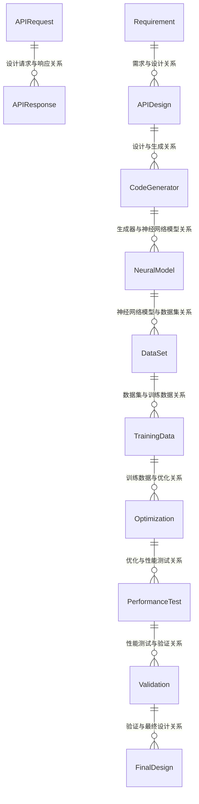
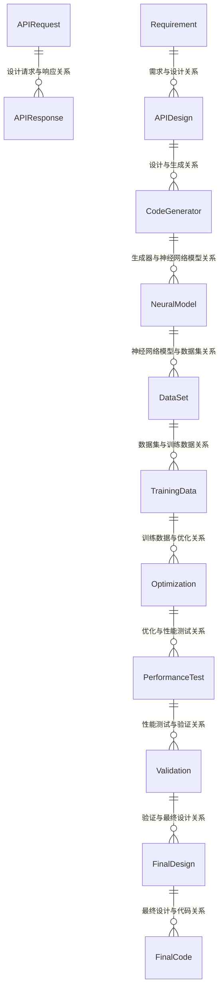

                 

## 摘要

本文将深入探讨神经程序合成在自动化API设计中的应用。自动化API设计是现代软件开发中的一个重要环节，它旨在通过自动化的方法来简化并加速API的创建和更新过程。然而，传统的自动化API设计方法在面对复杂、动态的API需求时往往显得力不从心。神经程序合成作为一种前沿的深度学习技术，通过模仿人脑的工作方式，能够自动生成复杂的软件程序。本文将详细分析神经程序合成的原理及其在自动化API设计中的应用，探讨如何利用神经程序合成技术来提高自动化API设计的效率和质量。文章还将讨论面临的挑战和未来的发展方向，为相关领域的研究者和开发者提供有益的参考。

## 关键词

- 神经程序合成
- 自动化API设计
- 深度学习
- 软件自动化
- 算法优化
- 软件工程

## 引言

随着信息技术的发展，软件系统变得越来越复杂和庞大。在软件开发过程中，API（应用程序接口）的设计与实现成为了一个至关重要的环节。良好的API设计能够提高代码的可维护性和复用性，加速开发过程，提升软件的整体质量。然而，传统的API设计方法往往需要大量的手动编码和调试工作，不仅效率低下，而且容易出错。

自动化API设计应运而生，它旨在通过自动化工具和算法来简化API的创建和维护过程。然而，现有的自动化API设计方法主要依赖于静态规则和模板，难以应对动态和复杂的API需求。这种局限性促使研究者探索更加智能和灵活的解决方案。

神经程序合成（Neural Program Synthesis）作为一种基于深度学习的编程技术，通过模仿人脑的神经网络结构和学习机制，能够自动生成复杂的软件程序。神经程序合成在自动化API设计中的应用潜力巨大，能够大幅度提升API设计的效率和准确性，解决传统方法面临的诸多挑战。

本文将从以下几个方面展开讨论：

1. **问题背景**：介绍自动化API设计的现状与挑战，以及神经程序合成技术的核心优势。
2. **问题描述**：明确自动化API设计的难点与痛点，分析神经程序合成技术的应用需求与可行性。
3. **问题解决**：阐述神经程序合成技术的基本原理和自动化API设计的流程与方法，提出具体的应用策略。
4. **边界与外延**：探讨神经程序合成技术的适用范围、自动化API设计的适用场景，以及二者的融合点。
5. **概念结构与核心要素组成**：详细解析自动化API设计的关键要素和神经程序合成技术的主要组成部分，分析二者的相互作用。
6. **核心概念与联系**：讨论自动化API设计和神经程序合成的核心原理及其关联性，提供属性特征对比表格和ER实体关系图。
7. **算法原理讲解**：介绍自动化API设计和神经程序合成的算法原理，结合数学模型和公式进行详细讲解，并通过具体案例进行分析。
8. **系统分析与架构设计方案**：介绍系统功能设计、系统架构设计、系统接口设计和系统交互，提供详细的mermaid流程图和类图。
9. **项目实战**：展示实际项目环境安装、系统核心实现和代码应用，进行案例剖析和总结。
10. **最佳实践 tips**、**小结**、**注意事项**和**拓展阅读**。

通过本文的讨论，我们希望能够为读者提供一个全面、深入的理解，帮助他们在实际开发中更好地应用神经程序合成技术于自动化API设计。

### 1.1 问题背景

在现代软件开发中，API（应用程序接口）的设计与实现是一个至关重要的环节。API不仅定义了不同软件模块之间如何交互，还起到了连接前后端、整合第三方服务以及促进模块化开发的重要作用。良好的API设计能够提高代码的可维护性和复用性，加速开发过程，提升软件的整体质量。

#### 1.1.1 自动化API设计的现状与挑战

随着软件系统的复杂性和规模不断扩大，传统的手动API设计方法逐渐暴露出一系列问题和挑战：

1. **开发效率低**：API的设计需要详细的规划和反复的迭代，这一过程通常耗费大量的时间和人力资源。手动编写API文档、测试和调整不仅繁琐，而且容易出现错误。
   
2. **维护难度大**：随着项目的演进，API的需求会不断变化，这要求开发者持续更新和维护API。手动修改API可能导致兼容性问题，增加系统风险。

3. **质量不稳定**：由于手动设计的局限性，API的设计往往缺乏一致性和标准化，导致不同模块之间的交互不协调，影响系统的稳定性和性能。

4. **开发成本高**：手动的API设计需要大量的专业知识和经验，这不仅提高了人力成本，还增加了培训和知识传承的难度。

为了应对上述挑战，自动化API设计技术逐渐受到关注。自动化API设计旨在通过自动化工具和算法来简化API的创建和维护过程，从而提高开发效率和软件质量。

#### 1.1.2 神经程序合成技术的核心优势

神经程序合成（Neural Program Synthesis）作为深度学习领域的一项重要技术，具有以下几个核心优势：

1. **自适应性强**：神经程序合成能够通过学习大量的数据自动生成API设计，能够灵活应对不断变化的API需求。

2. **自动化程度高**：神经程序合成技术可以自动化地完成API的设计、实现和测试，大幅降低人力成本和开发难度。

3. **设计质量高**：神经程序合成能够基于深度学习算法生成高质量的API设计，减少人工干预，提高API的一致性和稳定性。

4. **开发效率提升**：通过神经程序合成，开发者可以将更多的精力投入到核心业务逻辑的实现上，提升整体开发效率。

5. **可复用性强**：神经程序合成生成的API设计具有通用性，可以复用在不同项目或模块中，减少重复劳动。

#### 1.1.3 神经程序合成在自动化API设计中的应用前景

神经程序合成在自动化API设计中的应用前景非常广阔，主要体现在以下几个方面：

1. **快速原型开发**：神经程序合成可以帮助开发者快速生成API原型，缩短开发周期，提高迭代速度。

2. **API自动生成**：通过学习已有的API设计和使用场景，神经程序合成能够自动生成符合要求的API，减少手动编码工作量。

3. **API维护与更新**：神经程序合成可以自动化地分析和更新API，确保系统在需求变化时能够快速适应。

4. **跨平台兼容性**：神经程序合成生成的API设计具有高度的一致性和可移植性，可以在不同平台上无缝切换。

5. **智能化API扩展**：神经程序合成能够基于现有的API数据自动扩展新功能，实现API的智能化和个性化。

综上所述，自动化API设计是现代软件开发中亟待解决的问题，而神经程序合成技术为其提供了新的解决方案。通过神经程序合成，开发者能够大幅度提升API设计的效率和质量，应对日益复杂的软件开发需求。

### 1.2 问题描述

自动化API设计作为软件开发中的一个关键环节，面临着诸多挑战和难点。理解这些挑战和难点对于探索神经程序合成在自动化API设计中的应用具有重要意义。

#### 1.2.1 自动化API设计的难点与痛点

1. **手动设计的复杂性**：传统的API设计通常依赖于手动编码和调试，这一过程繁琐且容易出错。开发人员需要深入了解API的需求和业务逻辑，编写大量的文档和代码，测试和验证API的功能和性能。

2. **API的动态性**：现代软件系统往往具有高度动态性，API的需求和实现可能频繁变化。这要求API设计能够灵活适应需求变化，而手动设计难以满足这一需求。

3. **一致性保证**：API设计的一致性是确保系统稳定性的关键。然而，手动设计的API容易出现不一致性，导致不同模块之间的交互不协调，影响系统的整体性能。

4. **维护成本**：随着软件系统的演进，API的需求和实现可能不断变化。这要求开发者持续维护和更新API，手动维护不仅费时费力，还容易引入新的错误。

5. **复用性**：API的设计和实现往往具有高度的特异性，难以在不同项目中复用。这增加了开发成本，降低了开发效率。

#### 1.2.2 神经程序合成技术的应用需求

神经程序合成技术在自动化API设计中的应用需求主要体现在以下几个方面：

1. **自适应性与灵活性**：神经程序合成能够通过学习大量的API设计和使用场景，自动生成适应需求的API设计。这一特性使得神经程序合成能够灵活应对动态变化的API需求。

2. **自动化程度**：神经程序合成可以自动化地完成API的设计、实现和测试，减少人工干预，降低开发难度和维护成本。

3. **质量保证**：神经程序合成能够基于深度学习算法生成高质量的API设计，减少人为错误，提高API的一致性和稳定性。

4. **开发效率**：通过神经程序合成，开发者可以将更多精力投入到核心业务逻辑的实现上，提高整体开发效率。

5. **可复用性**：神经程序合成生成的API设计具有通用性，可以复用在不同项目或模块中，减少重复劳动。

#### 1.2.3 神经程序合成在自动化API设计中的可行性分析

神经程序合成在自动化API设计中的可行性分析可以从以下几个方面进行：

1. **技术基础**：随着深度学习技术的发展，神经程序合成已经取得了一系列重要成果。现有的深度学习框架和算法为神经程序合成提供了坚实的基础。

2. **数据支持**：自动化API设计需要大量的API设计数据作为训练素材。通过收集和分析现有的API设计案例，可以构建丰富的训练数据集，为神经程序合成提供充足的训练样本。

3. **应用案例**：已经有许多研究将神经程序合成应用于自动化API设计，取得了显著的成效。这些应用案例验证了神经程序合成在自动化API设计中的可行性和有效性。

4. **挑战与优化**：尽管神经程序合成在自动化API设计中具有巨大潜力，但仍面临一些挑战，如数据质量、算法优化和实际应用中的适应性问题。通过不断的研究和实践，可以逐步克服这些挑战，进一步优化神经程序合成的性能。

综上所述，自动化API设计面临诸多挑战和难点，而神经程序合成技术为其提供了一种新的解决方案。通过神经程序合成，开发者能够大幅度提升API设计的效率和质量，应对现代软件开发中的复杂需求。

### 1.3 问题解决

针对自动化API设计中的难点与痛点，神经程序合成技术提供了一种创新的解决方案。通过深入理解神经程序合成技术的基本原理和自动化API设计的流程与方法，我们可以探索如何将这两种技术有机结合，以实现高效的API自动化设计。

#### 1.3.1 神经程序合成技术的基本原理

神经程序合成是一种基于深度学习的编程技术，它模仿人脑神经网络的结构和工作机制。具体来说，神经程序合成包括以下几个关键组成部分：

1. **神经网络架构**：神经程序合成使用多层神经网络架构来表示程序，每一层神经网络对应程序中的一个抽象层次。通过训练，神经网络能够自动学习到输入数据（如API设计需求）与输出数据（如API代码）之间的映射关系。

2. **数据驱动**：神经程序合成依赖于大量的训练数据。这些数据包括现有的API设计案例、使用场景、性能指标等，用于训练神经网络，使其能够自动生成高质量的API设计。

3. **生成与优化**：神经程序合成通过生成和优化过程来生成API代码。在生成阶段，神经网络根据输入数据生成初步的API设计；在优化阶段，通过调整网络参数和代码生成策略，提高API设计的质量和性能。

#### 1.3.2 自动化API设计的流程与方法

自动化API设计的流程与方法可以分为以下几个步骤：

1. **需求分析**：首先，明确API的设计需求，包括功能要求、性能指标、接口规范等。这些需求将作为神经网络的输入数据进行训练。

2. **数据收集**：收集现有的API设计案例和相关数据，包括API接口、文档、示例代码等。这些数据将用于训练神经网络，使其具备生成特定API设计的能力。

3. **神经网络训练**：使用收集到的数据对神经网络进行训练，通过大量的迭代和优化，使神经网络能够自动生成符合需求的API设计。

4. **API生成**：利用训练好的神经网络，输入新的API需求，自动生成API设计。这一过程包括生成API接口、定义函数、参数设置等。

5. **代码优化**：生成的API设计通常需要进一步的优化，以确保其性能和可维护性。这可以通过调整神经网络参数、代码生成策略和自动化测试来实现。

6. **测试与验证**：对生成的API设计进行功能测试和性能验证，确保其满足设计需求，并能够稳定运行。

#### 1.3.3 神经程序合成在自动化API设计中的应用策略

为了将神经程序合成技术有效地应用于自动化API设计，以下是一些具体的应用策略：

1. **多模型融合**：结合多种神经网络模型，如生成对抗网络（GAN）、变换器（Transformer）等，以提高API设计的生成质量和性能。

2. **迁移学习**：利用迁移学习技术，将预训练的神经网络模型应用到自动化API设计中，减少训练时间，提高生成效率。

3. **强化学习**：结合强化学习算法，使神经网络能够根据反馈自动调整API设计，优化其性能和用户体验。

4. **代码生成与优化**：通过自动化代码生成工具，结合代码优化技术，如代码压缩、性能调优等，进一步提高API设计的质量和可维护性。

5. **可视化与交互**：开发可视化工具和用户界面，使开发者能够实时查看和调整API设计，提高设计的灵活性和可操作性。

通过上述策略，神经程序合成技术可以有效地应用于自动化API设计，解决传统方法面临的诸多挑战。未来，随着深度学习技术的不断发展和优化，神经程序合成在自动化API设计中的应用将更加广泛和深入，为软件开发带来革命性的变革。

### 1.4 边界与外延

#### 1.4.1 神经程序合成技术的适用范围

神经程序合成技术作为一种深度学习技术，其适用范围非常广泛，尤其在以下领域具有显著的应用潜力：

1. **软件开发与自动化**：神经程序合成可以自动生成软件代码，包括API设计、数据库操作、用户界面等，提高开发效率和代码质量。

2. **人工智能与机器学习**：神经程序合成可以用于自动化生成机器学习模型和算法，如神经网络架构、优化策略等，加速模型开发和迭代。

3. **自然语言处理**：神经程序合成可以用于自动生成自然语言文本，包括文档、报告、文章等，提高内容生成效率和质量。

4. **数据科学**：神经程序合成可以自动化生成数据分析代码和可视化报告，帮助数据科学家快速理解和呈现数据结果。

5. **游戏开发**：神经程序合成可以用于自动生成游戏场景、角色和动作，提高游戏开发的灵活性和创新性。

#### 1.4.2 自动化API设计的适用场景

自动化API设计在以下场景中具有显著的应用价值：

1. **微服务架构**：在微服务架构中，自动化API设计可以简化服务的拆分、整合和更新过程，提高系统的可扩展性和可维护性。

2. **API网关**：在API网关场景中，自动化API设计可以快速生成接口规范和路由规则，提高系统的性能和安全性。

3. **云计算与大数据**：在云计算和大数据场景中，自动化API设计可以简化数据访问和数据处理接口的设计，提高数据处理的效率和可靠性。

4. **跨平台集成**：在跨平台集成场景中，自动化API设计可以生成适应不同平台的API接口，提高系统的兼容性和可移植性。

5. **物联网应用**：在物联网应用中，自动化API设计可以简化设备接口的设计和集成，提高系统的互联互通性。

#### 1.4.3 神经程序合成与自动化API设计的融合点

神经程序合成与自动化API设计在以下方面具有紧密的融合点：

1. **数据驱动**：自动化API设计依赖于大量的API设计和使用数据，而神经程序合成通过数据驱动的方式学习这些数据，生成高质量的API设计。

2. **自适应性与灵活性**：神经程序合成能够自动适应不断变化的API需求，自动化API设计可以根据神经程序合成的结果进行实时调整和优化。

3. **生成与优化**：神经程序合成通过生成和优化过程自动生成API设计，自动化API设计则通过优化算法和测试手段进一步优化API设计的性能和可维护性。

4. **协同工作**：神经程序合成和自动化API设计可以协同工作，前者负责生成API设计，后者则负责验证、测试和优化，形成一个高效、灵活的API设计流程。

通过神经程序合成与自动化API设计的融合，开发者可以大幅提升API设计的效率和质量，应对现代软件开发中的复杂需求。未来，随着技术的不断发展和优化，这种融合将更加紧密和深入，为软件开发带来新的机遇和挑战。

### 1.5 概念结构与核心要素组成

在深入探讨神经程序合成在自动化API设计中的应用之前，有必要对这两个概念进行详细解析，并分析它们的关键要素和相互作用。

#### 1.5.1 自动化API设计的关键要素

自动化API设计涉及多个关键要素，这些要素共同决定了API设计的效率和质量：

1. **需求分析**：需求分析是自动化API设计的起点，它包括对API功能、性能、安全性和兼容性的详细需求描述。准确的需求分析是生成高质量API设计的前提。

2. **数据集**：数据集是自动化API设计的核心训练素材。这些数据包括现有的API设计案例、使用场景、性能指标等，用于训练神经网络，使其能够自动生成符合需求的API设计。

3. **神经网络架构**：神经网络架构决定了自动化API设计的生成能力。常用的神经网络架构包括生成对抗网络（GAN）、变换器（Transformer）等，这些架构可以捕捉API设计中的复杂模式和关联性。

4. **生成与优化算法**：生成与优化算法是自动化API设计的核心。通过生成算法，神经网络能够自动生成初步的API设计；通过优化算法，进一步调整和改进API设计的质量和性能。

5. **测试与验证**：测试与验证是确保API设计符合需求的重要环节。自动化API设计通过自动化测试工具对生成的API设计进行功能测试和性能验证，确保其稳定性和可靠性。

6. **用户交互**：用户交互是自动化API设计的重要组成部分。通过用户界面和可视化工具，开发者可以实时查看和调整API设计，提高设计的灵活性和可操作性。

#### 1.5.2 神经程序合成技术的主要组成部分

神经程序合成技术包括以下几个主要组成部分：

1. **神经网络结构**：神经网络结构是神经程序合成的核心。它由多层神经元组成，每一层神经元都负责处理输入数据的一部分，并通过反向传播算法不断调整权重，优化网络性能。

2. **数据驱动训练**：数据驱动训练是神经程序合成的关键。通过大量训练数据，神经网络能够学习到输入数据与输出数据之间的映射关系，从而实现自动生成软件程序。

3. **生成与优化过程**：生成与优化过程是神经程序合成的重要环节。生成过程通过神经网络自动生成软件程序，优化过程则通过调整网络参数和算法，提高生成程序的质量和性能。

4. **迁移学习和强化学习**：迁移学习和强化学习是提高神经程序合成性能的重要手段。通过迁移学习，神经网络可以将已有知识应用到新的场景中，减少训练时间；通过强化学习，神经网络可以根据反馈不断调整生成策略，优化程序质量。

#### 1.5.3 自动化API设计与神经程序合成的相互作用

自动化API设计与神经程序合成之间的相互作用主要体现在以下几个方面：

1. **数据共享**：自动化API设计中的需求分析和数据集可以用于神经程序合成的训练，为神经网络提供丰富的训练素材。

2. **协同优化**：神经程序合成生成的API设计可以与自动化API设计的优化算法协同工作，通过反复迭代和优化，生成高质量的API设计。

3. **生成与验证**：神经程序合成通过生成算法自动生成API设计，自动化API设计通过测试和验证确保生成设计符合需求，这一过程形成了一个闭环，确保API设计的稳定性和可靠性。

4. **用户反馈**：用户交互和反馈可以用于改进神经程序合成的生成策略和优化算法，提高API设计的灵活性和用户体验。

通过深入理解和分析自动化API设计与神经程序合成的概念结构与核心要素，我们可以更好地把握二者的相互作用，探索如何将神经程序合成技术应用于自动化API设计，提高软件开发效率和代码质量。

### 2.1 自动化API设计原理

#### 2.1.1 自动化API设计的定义与核心概念

自动化API设计是指利用自动化工具和算法，根据预定的需求和规范，自动生成应用程序接口（API）的过程。这一过程涉及多个核心概念：

1. **API**：应用程序接口（API）是软件模块之间交互的接口，它定义了数据传输的格式和通信协议。API的设计直接影响系统的可扩展性、可维护性和用户体验。

2. **需求分析**：需求分析是自动化API设计的第一步，它旨在理解系统的功能需求、性能需求和用户需求，为API设计提供明确的指导。

3. **数据集**：数据集是自动化API设计的关键，它包括已有的API设计案例、使用场景、性能指标等。这些数据用于训练和优化生成模型。

4. **生成模型**：生成模型是自动化API设计的核心组件，它通过学习大量数据，能够自动生成符合需求的API设计。常见的生成模型包括生成对抗网络（GAN）、变换器（Transformer）等。

5. **优化算法**：优化算法用于调整生成模型的参数和策略，以提高API设计的质量和性能。常见的优化算法包括梯度下降、遗传算法等。

6. **测试与验证**：测试与验证是确保API设计符合需求的重要环节。自动化API设计通过自动化测试工具对生成的API进行功能测试和性能验证。

#### 2.1.2 自动化API设计的关键步骤

自动化API设计通常包括以下几个关键步骤：

1. **需求分析**：首先，明确API的功能需求、性能需求和用户需求。这一步骤通常通过访谈、调查问卷、用户故事等方式进行。

2. **数据集准备**：收集和准备用于训练生成模型的数据集。这些数据集应包括多样化的API设计案例，以及相应的使用场景和性能指标。

3. **生成模型训练**：使用收集到的数据集对生成模型进行训练。训练过程中，模型通过不断调整权重和参数，学习到输入数据与输出数据之间的映射关系。

4. **API生成**：利用训练好的生成模型，输入新的需求，自动生成API设计。生成过程通常包括生成API接口、定义函数、参数设置等。

5. **代码优化**：生成的API设计通常需要进行优化，以确保其性能和可维护性。优化过程可能涉及调整神经网络参数、代码压缩、性能调优等。

6. **测试与验证**：对生成的API设计进行功能测试和性能验证，确保其满足设计需求，并能够稳定运行。测试过程中，可以使用自动化测试工具进行回归测试和性能测试。

7. **用户交互**：通过用户界面和可视化工具，开发者可以实时查看和调整API设计，提高设计的灵活性和可操作性。

#### 2.1.3 自动化API设计的挑战与解决方案

自动化API设计面临一系列挑战，需要通过创新的方法和技术来应对：

1. **数据质量**：自动化API设计的质量高度依赖于数据集的质量。如果数据集中存在错误或不完整的信息，可能导致生成模型的学习效果不佳。解决方案包括使用高质量的数据集、数据清洗和数据增强技术。

2. **模型优化**：生成模型需要通过大量的训练和优化，才能生成高质量的API设计。优化过程中，模型可能陷入局部最优，影响生成效果。解决方案包括使用迁移学习、强化学习和多模型融合等技术。

3. **测试与验证**：自动化API设计的测试与验证是一个复杂的过程，需要确保生成的API设计满足功能需求、性能需求和用户体验。解决方案包括使用自动化测试工具、测试框架和模拟环境。

4. **用户交互**：用户交互是自动化API设计的重要组成部分，但用户需求往往动态变化。解决方案包括提供灵活的用户界面和实时反馈机制，使开发者能够根据用户反馈调整API设计。

5. **安全性**：API设计涉及到系统的安全性和隐私保护。自动化API设计需要确保生成的API设计符合安全规范，防止潜在的安全漏洞。解决方案包括使用加密技术、访问控制和安全审计等。

通过深入理解和分析自动化API设计的原理和关键步骤，开发者可以更好地利用神经程序合成技术，实现高效的API自动化设计，提高软件开发效率和代码质量。

### 2.2 神经程序合成原理

#### 2.2.1 神经程序合成的定义与核心概念

神经程序合成（Neural Program Synthesis）是一种基于深度学习的编程技术，旨在通过神经网络自动生成软件程序。它通过模仿人脑的工作机制，利用大量的训练数据和复杂的神经网络结构，学习到输入数据（如API设计需求）与输出数据（如API代码）之间的映射关系。

1. **神经网络**：神经网络是神经程序合成的核心组成部分，它由大量的神经元（或节点）组成，通过层次化的结构对输入数据进行处理和转换。每个神经元都连接到其他神经元，并通过对输入信号进行加权求和处理，产生输出信号。

2. **训练数据**：训练数据是神经程序合成的重要素材，它包括大量的输入输出对，如API设计需求及其对应的API代码。这些数据用于训练神经网络，使其能够学习到输入和输出之间的映射关系。

3. **生成模型**：生成模型是神经程序合成的核心组件，它通过训练神经网络，自动生成符合需求的软件程序。生成模型可以是生成对抗网络（GAN）、变换器（Transformer）等。

4. **优化算法**：优化算法用于调整神经网络参数和结构，以提高生成模型的质量和性能。常见的优化算法包括梯度下降、遗传算法等。

#### 2.2.2 神经程序合成的基本原理与过程

神经程序合成的基本原理和过程可以概括为以下几个步骤：

1. **数据预处理**：首先，对训练数据集进行预处理，包括数据清洗、归一化和数据增强等操作，以提高数据的质量和多样性。

2. **模型训练**：使用预处理后的数据集对生成模型进行训练。训练过程中，神经网络通过不断调整权重和参数，学习到输入数据和输出数据之间的映射关系。

3. **模型优化**：在模型训练过程中，通过优化算法不断调整网络参数和结构，提高生成模型的质量和性能。优化过程中，模型可能采用不同的策略，如梯度下降、强化学习等。

4. **代码生成**：利用训练好的生成模型，输入新的需求，自动生成软件程序。生成过程通常包括生成API接口、定义函数、参数设置等。

5. **代码优化**：生成的软件程序通常需要进行进一步的优化，以确保其性能和可维护性。优化过程可能涉及代码压缩、性能调优等。

6. **测试与验证**：对生成的软件程序进行功能测试和性能验证，确保其满足设计需求，并能够稳定运行。测试过程中，可以使用自动化测试工具进行回归测试和性能测试。

#### 2.2.3 神经程序合成的优势与应用领域

神经程序合成具有以下几个显著优势：

1. **自适应性强**：神经程序合成能够通过学习大量的训练数据，自动适应不断变化的编程需求。

2. **自动化程度高**：神经程序合成可以自动化地生成软件程序，减少手动编码的工作量，提高开发效率。

3. **设计质量高**：神经程序合成能够基于深度学习算法生成高质量的软件程序，减少人为错误，提高代码的可维护性和可靠性。

4. **可复用性强**：神经程序合成生成的软件程序具有通用性，可以复用在不同项目或模块中，减少重复劳动。

神经程序合成在多个应用领域具有广泛的应用前景：

1. **软件开发与自动化**：神经程序合成可以自动生成软件代码，包括API设计、数据库操作、用户界面等，提高开发效率和代码质量。

2. **人工智能与机器学习**：神经程序合成可以用于自动化生成机器学习模型和算法，如神经网络架构、优化策略等，加速模型开发和迭代。

3. **自然语言处理**：神经程序合成可以自动生成自然语言文本，包括文档、报告、文章等，提高内容生成效率和质量。

4. **数据科学**：神经程序合成可以自动化生成数据分析代码和可视化报告，帮助数据科学家快速理解和呈现数据结果。

5. **游戏开发**：神经程序合成可以用于自动生成游戏场景、角色和动作，提高游戏开发的灵活性和创新性。

通过深入理解神经程序合成的原理和优势，我们可以更好地把握其在自动化API设计中的应用潜力，为软件开发带来新的机遇和挑战。

### 2.3 自动化API设计与神经程序合成的关系

自动化API设计与神经程序合成在软件工程领域有着紧密的关联，它们共同致力于提高软件开发效率和质量。以下是这两者之间的关联性、关键作用以及协同效应的详细探讨。

#### 2.3.1 自动化API设计与神经程序合成的关联性

自动化API设计与神经程序合成之间的关联性主要体现在以下几个方面：

1. **需求驱动的数据生成**：自动化API设计依赖于详细的需求分析，这些需求驱动了数据集的生成。这些数据集是神经程序合成的训练素材，使得神经网络能够根据需求生成相应的API设计。

2. **算法优化的互补性**：自动化API设计中的优化算法通常用于调整和改进生成的API设计。而神经程序合成则通过其深度学习算法，能够自主优化API生成的过程，提高生成API的准确性和质量。

3. **生成模型的整合**：神经程序合成中的生成模型（如GAN、Transformer）可以直接整合到自动化API设计的流程中，用于自动生成符合需求的API代码。这种整合使得自动化API设计不再依赖于传统的手动编码方式。

4. **测试与验证的互动**：自动化API设计通过测试和验证确保生成的API设计满足功能需求。神经程序合成则可以通过对测试结果的反馈，进一步优化生成模型，提高API生成的准确性和稳定性。

#### 2.3.2 神经程序合成在自动化API设计中的关键作用

神经程序合成在自动化API设计中的关键作用体现在以下几个方面：

1. **自动代码生成**：神经程序合成能够自动生成符合需求的API代码，大幅减少了手动编码的工作量。通过学习大量已有的API设计案例，神经网络可以生成高质量的API代码，减少人为错误。

2. **高效的需求适应**：神经程序合成通过深度学习算法，能够快速适应不断变化的API需求。它可以在短时间内生成新的API设计，使得软件开发团队能够快速响应市场需求。

3. **代码质量提升**：神经程序合成通过自动化生成API代码，减少了手动编码过程中可能引入的缺陷和错误。生成的代码通常具有良好的结构性和可读性，提高了代码的可维护性和可靠性。

4. **开发效率提高**：神经程序合成在自动化API设计中的应用，使得开发者可以将更多精力投入到核心业务逻辑的实现上，减少了在API设计上的时间和资源投入。

#### 2.3.3 自动化API设计与神经程序合成的协同效应

自动化API设计与神经程序合成的协同效应体现在以下几个方面：

1. **互补优势**：自动化API设计提供了详细的需求分析和优化算法，而神经程序合成则提供了强大的代码生成能力。两者结合，可以发挥各自的优势，实现更高效、更高质量的API设计。

2. **流程优化**：自动化API设计与神经程序合成可以协同优化整个API设计流程。通过神经程序合成自动生成初步的API设计，然后使用自动化API设计的优化算法进行进一步的调整和优化，形成一个闭环流程，不断提高API设计的质量。

3. **灵活性和可扩展性**：神经程序合成使得自动化API设计更加灵活和可扩展。开发者可以根据不同的需求，快速生成和调整API设计，适应不断变化的业务场景。

4. **团队协作**：自动化API设计与神经程序合成可以显著提高团队协作效率。通过自动化的方式生成API设计，团队成员可以更专注于核心业务逻辑的实现和系统优化，减少重复劳动和沟通成本。

综上所述，自动化API设计与神经程序合成在软件工程领域具有紧密的关联性和协同效应。通过深入理解和应用这两者的关系，开发者可以大幅提升API设计的效率和质量，推动软件开发的创新和发展。

### 2.4 对比表格：自动化API设计与神经程序合成的属性特征

在深入探讨自动化API设计与神经程序合成的关系时，理解两者的属性特征并进行对比分析是非常重要的。以下是两者的主要属性特征对比表格：

| 特性                 | 自动化API设计               | 神经程序合成                     |
|----------------------|----------------------------|---------------------------------|
| 基本原理             | 基于预设规则和模板进行API设计 | 通过深度学习自动生成软件程序     |
| 设计流程             | 手动编写规则和模板，自动化实现 | 数据驱动，自动生成和优化程序代码 |
| 设计质量             | 受限于预设规则和模板         | 学习大量数据，生成高质量代码     |
| 自适应性与灵活性     | 依赖手动调整，适应性有限       | 通过学习自动适应，灵活性高       |
| 生成速度             | 较慢，需要手动编写和调试     | 较快，可自动化生成               |
| 可维护性             | 较高，依赖于手动设计和文档   | 较高，自动生成的代码结构良好     |
| 开发效率             | 中等，部分流程可自动化       | 高，大量工作可自动化完成         |
| 复用性               | 较低，每个API设计需定制       | 较高，生成的代码可复用           |
| 适应复杂度           | 适应简单的需求变化           | 适应复杂的需求变化               |
| 需求变更响应时间     | 较长，需求变更需手动调整     | 较短，自动调整，快速响应需求     |
| 应用范围             | 广泛应用于标准API设计        | 广泛应用于复杂和动态的API设计    |

通过对比表格可以看出，自动化API设计与神经程序合成在多个方面存在显著差异。自动化API设计更依赖于预设的规则和模板，适合标准化的API设计需求，而神经程序合成则通过深度学习技术，能够自动生成和优化复杂的API设计，适应动态和复杂的需求。理解这些属性特征有助于开发者根据实际需求选择合适的技术方案，提高API设计的效率和质量。

### 2.5 ER实体关系图：自动化API设计与神经程序合成架构

为了更好地理解自动化API设计与神经程序合成之间的交互关系，我们可以通过ER（Entity-Relationship）实体关系图来可视化这两个系统的架构。以下是自动化API设计与神经程序合成架构的ER实体关系图：



#### 2.5.1 自动化API设计的ER实体关系图

在自动化API设计的ER实体关系图中，主要涉及以下实体：

- **APIRequest（设计请求）**：表示API设计的需求，包括功能需求、性能需求和用户需求。
- **Requirement（需求）**：表示API设计的需求分析结果，与APIDesign实体相关联。
- **APIDesign（API设计）**：表示API的设计结果，包括接口、参数、返回值等。
- **CodeGenerator（代码生成器）**：表示用于生成API代码的工具或模块。
- **NeuralModel（神经网络模型）**：表示神经程序合成中使用的生成模型。
- **DataSet（数据集）**：表示用于训练神经网络的数据集合，包括训练数据和测试数据。
- **TrainingData（训练数据）**：表示用于训练神经网络的具体数据，如API设计案例。
- **Optimization（优化）**：表示对神经网络模型的优化过程，包括调整参数和结构。
- **PerformanceTest（性能测试）**：表示对生成的API代码进行性能测试的过程。
- **Validation（验证）**：表示对生成的API代码进行功能验证的过程。
- **FinalDesign（最终设计）**：表示经过验证的最终API设计结果。

#### 2.5.2 神经程序合成的ER实体关系图

在神经程序合成的ER实体关系图中，主要涉及以下实体：

- **APIResponse（API响应）**：表示API设计响应的结果，与APIRequest实体相关联。
- **NeuralModel（神经网络模型）**：表示用于生成软件程序的神经网络模型。
- **DataSet（数据集）**：表示用于训练神经网络的数据集合，包括训练数据和测试数据。
- **TrainingData（训练数据）**：表示用于训练神经网络的具体数据，如API设计案例。
- **Optimization（优化）**：表示对神经网络模型的优化过程，包括调整参数和结构。
- **PerformanceTest（性能测试）**：表示对生成的API代码进行性能测试的过程。
- **Validation（验证）**：表示对生成的API代码进行功能验证的过程。
- **FinalCode（最终代码）**：表示经过验证的最终生成的API代码。

#### 2.5.3 自动化API设计与神经程序合成融合后的ER实体关系图

当自动化API设计与神经程序合成融合时，ER实体关系图会变得更加复杂和紧密。以下是融合后的ER实体关系图：



通过融合后的ER实体关系图，我们可以看到自动化API设计与神经程序合成在多个环节紧密关联。API设计需求通过神经网络模型生成并优化，最终生成高质量的API代码。这种融合不仅提高了API设计的效率和质量，还为软件开发带来了新的可能性。

### 3.1 自动化API设计的算法原理

#### 3.1.1 自动化API设计的算法基础

自动化API设计的算法基础主要涉及以下几个方面：

1. **需求分析算法**：需求分析是自动化API设计的起点，其核心任务是理解系统的功能需求、性能需求和用户需求。常用的需求分析算法包括语义分析、信息提取和模式识别等。这些算法通过自然语言处理技术，从用户需求中提取关键信息，形成详细的需求文档。

2. **数据集构建算法**：数据集是自动化API设计的核心训练素材。构建高质量的数据集需要使用数据预处理、数据清洗和数据增强等技术。数据预处理包括数据的标准化、归一化和数据格式转换等；数据清洗包括去除噪声数据和填补缺失值；数据增强则通过生成合成数据，提高数据集的多样性和质量。

3. **生成模型算法**：生成模型是自动化API设计的关键组件，它通过学习大量数据，能够自动生成符合需求的API设计。常用的生成模型包括生成对抗网络（GAN）、变换器（Transformer）等。这些模型通过深度学习技术，学习到输入数据（如需求文档）和输出数据（如API代码）之间的映射关系。

4. **优化算法**：优化算法用于调整生成模型的参数和策略，以提高API设计的质量和性能。常见的优化算法包括梯度下降、遗传算法等。优化过程通过不断调整模型参数，使生成的API设计在功能、性能和可维护性等方面达到最佳状态。

5. **测试与验证算法**：测试与验证是确保API设计符合需求的重要环节。自动化API设计通过自动化测试工具，对生成的API进行功能测试和性能验证。常用的测试与验证算法包括回归测试、性能测试和用户验收测试等。

#### 3.1.2 自动化API设计的关键算法分析

自动化API设计涉及多个关键算法，以下是其中几种核心算法的详细分析：

1. **生成对抗网络（GAN）**：

生成对抗网络（GAN）是由生成器（Generator）和判别器（Discriminator）组成的一种深度学习模型。生成器的任务是生成符合真实数据的伪数据，判别器的任务是区分真实数据和伪数据。通过不断的训练和对抗，生成器能够提高生成数据的质量，达到以假乱真的效果。

- **生成器**：生成器的输入通常是随机噪声，通过多层神经网络，生成符合真实数据分布的API设计。
- **判别器**：判别器接收真实数据和生成数据，通过对比判断其真实性。判别器的输出是判断概率，用于指导生成器的优化。

2. **变换器（Transformer）**：

变换器（Transformer）是一种基于自注意力机制的深度学习模型，广泛应用于自然语言处理、文本生成等领域。变换器通过多头自注意力机制，能够捕捉输入数据中的长距离依赖关系，从而生成高质量的API设计。

- **自注意力机制**：变换器中的每个词都会通过自注意力机制计算其对于其他词的重要性权重，从而生成加权表示。
- **编码器-解码器架构**：编码器用于处理输入数据（如需求文档），解码器则生成输出数据（如API代码）。编码器的输出作为解码器的输入，通过解码器的逐层处理，生成最终的API设计。

3. **优化算法**：

- **梯度下降**：梯度下降是一种常用的优化算法，通过计算损失函数的梯度，不断调整模型参数，使其收敛到最小值。梯度下降包括批量梯度下降、随机梯度下降和Adam优化器等变种，适用于不同规模的数据集和计算资源。
- **遗传算法**：遗传算法是一种基于自然进化过程的优化算法，通过选择、交叉和变异等操作，不断优化模型的参数和结构。遗传算法具有较强的全局搜索能力和鲁棒性，适用于复杂和高度非线性的优化问题。

#### 3.1.3 自动化API设计的算法流程与优化策略

自动化API设计的算法流程可以分为以下几个步骤：

1. **需求分析**：通过自然语言处理技术，提取用户需求，形成需求文档。

2. **数据集构建**：收集和预处理数据，构建用于训练的数据集。

3. **模型训练**：使用训练数据集，对生成模型进行训练，使其能够自动生成符合需求的API设计。

4. **模型优化**：通过优化算法，调整模型参数和结构，提高生成API的质量和性能。

5. **代码生成**：利用训练好的生成模型，输入新的需求，自动生成API代码。

6. **测试与验证**：对生成的API代码进行功能测试和性能验证，确保其满足设计需求。

优化策略包括：

1. **数据增强**：通过生成合成数据，提高数据集的多样性和质量，增强模型的泛化能力。

2. **模型融合**：结合多种生成模型，如GAN和Transformer，提高生成API的准确性和质量。

3. **多任务学习**：将多个相关任务合并训练，使模型能够同时学习多个任务的特征，提高模型的整体性能。

4. **在线学习**：通过实时收集和反馈用户使用数据，对模型进行在线调整和优化，使其能够快速适应需求变化。

通过深入理解和分析自动化API设计的算法原理和关键算法，开发者可以更好地设计和实现高效的API自动化设计系统，提高软件开发效率和代码质量。

### 3.2 神经程序合成算法原理

#### 3.2.1 神经程序合成的算法基础

神经程序合成（Neural Program Synthesis，NPS）是一种利用神经网络自动生成软件代码的技术。其核心在于通过神经网络的学习，将输入的数据（如自然语言描述或代码示例）映射到输出的软件代码。以下简要介绍神经程序合成的算法基础：

1. **神经网络架构**：神经程序合成的核心是神经网络，通常采用多层感知器（MLP）或者变换器（Transformer）等架构。这些神经网络通过学习输入和输出之间的映射关系，自动生成软件代码。

2. **编码器与解码器**：在神经程序合成中，编码器（Encoder）负责将输入数据（如自然语言描述）编码成高维特征向量，而解码器（Decoder）则负责将这些特征向量解码成输出的软件代码。编码器和解码器通常采用相同的神经网络架构，但具有不同的输入和输出层。

3. **生成对抗网络（GAN）**：生成对抗网络（GAN）是神经程序合成的一种重要实现方式。GAN由生成器（Generator）和判别器（Discriminator）组成。生成器生成软件代码，而判别器则判断生成的代码是否真实。通过不断地训练，生成器逐渐生成更高质量的代码。

4. **注意力机制**：注意力机制（Attention Mechanism）在神经程序合成中起到关键作用。它能够使神经网络更好地关注输入数据中的关键信息，从而生成更准确和高质量的输出代码。

5. **序列到序列学习**：神经程序合成通常采用序列到序列（Seq2Seq）的学习方式。这种方法通过训练编码器和解码器，使神经网络能够处理和生成序列数据，如自然语言或代码。

#### 3.2.2 神经程序合成的主要算法分析

神经程序合成涉及多种算法，以下是几种主要算法的详细分析：

1. **循环神经网络（RNN）**：

循环神经网络（RNN）是一种能够处理序列数据的神经网络。RNN通过其特殊的结构，能够记住前面的输入信息，并将其用于后续的输出。在神经程序合成中，RNN常用于编码器部分，将输入的序列数据编码成高维特征向量。

- **状态保持**：RNN的核心是隐藏状态（Hidden State），它能够记住前面的输入信息。这一特性使得RNN能够处理长序列数据。
- **递归连接**：RNN通过递归连接，将当前输入与前面的隐藏状态结合，生成新的隐藏状态。这一过程使得RNN能够处理变长序列。

2. **长短期记忆网络（LSTM）**：

长短期记忆网络（LSTM）是RNN的一种变体，解决了传统RNN在处理长序列数据时遇到的梯度消失和梯度爆炸问题。LSTM通过引入门控机制（Gate），能够更好地控制信息的流动，从而更好地记住长期依赖关系。

- **遗忘门（Forget Gate）**：遗忘门决定哪些信息需要从隐藏状态中丢弃，从而防止信息过载。
- **输入门（Input Gate）**：输入门决定哪些新信息需要被保存到隐藏状态中。
- **输出门（Output Gate）**：输出门决定哪些信息需要输出到下一个时间步。

3. **变换器（Transformer）**：

变换器（Transformer）是神经程序合成中广泛使用的一种神经网络架构。它采用自注意力机制（Self-Attention）和多头注意力机制（Multi-Head Attention），能够捕捉输入数据中的长距离依赖关系，生成高质量的输出代码。

- **自注意力机制**：自注意力机制使变换器能够为输入序列中的每个元素计算一个权重，从而更好地关注关键信息。
- **多头注意力机制**：多头注意力机制通过多个独立的注意力机制，增强了变换器的表示能力。

4. **生成对抗网络（GAN）**：

生成对抗网络（GAN）由生成器（Generator）和判别器（Discriminator）组成。生成器生成软件代码，判别器则判断生成代码的真实性。通过对抗训练，生成器逐渐生成更高质量的代码。

- **生成器**：生成器的任务是生成尽可能真实的软件代码，使其难以被判别器识别。
- **判别器**：判别器的任务是区分真实代码和生成代码，其输出是一个概率值，表示生成代码的逼真度。

#### 3.2.3 神经程序合成的算法流程与优化策略

神经程序合成的算法流程通常包括以下几个步骤：

1. **数据准备**：收集和预处理输入数据，如自然语言描述或代码示例，并构建数据集。

2. **编码**：使用编码器将输入数据编码成高维特征向量。

3. **解码**：使用解码器将特征向量解码成输出的软件代码。

4. **对抗训练**：在生成对抗网络中，同时训练生成器和判别器。生成器生成代码，判别器判断代码的真实性。

5. **优化**：通过优化算法（如梯度下降）调整神经网络参数，提高代码生成质量。

优化策略包括：

1. **数据增强**：通过生成合成数据，增加数据集的多样性，提高模型的泛化能力。

2. **多任务学习**：将多个相关任务合并训练，使模型能够同时学习多个任务的特性。

3. **动态调整**：根据训练过程和输出质量，动态调整网络结构和参数。

4. **迁移学习**：利用预训练的神经网络，减少训练时间，提高生成质量。

通过深入理解和分析神经程序合成的算法原理和主要算法，开发者可以更好地设计和实现高效的神经程序合成系统，为自动化API设计提供强大的技术支持。

### 3.3 神经程序合成在自动化API设计中的应用

神经程序合成在自动化API设计中的应用，旨在通过深度学习技术自动生成高质量的API设计，提高开发效率和代码质量。以下是神经程序合成在自动化API设计中的具体应用方法、优势与挑战。

#### 3.3.1 神经程序合成与自动化API设计的融合

神经程序合成与自动化API设计的融合主要通过以下步骤实现：

1. **需求理解**：首先，通过自然语言处理技术理解API设计的需求，如功能要求、性能指标和安全规范等。

2. **数据准备**：收集和整理现有的API设计案例、使用场景和性能数据，形成训练数据集。这些数据用于训练神经程序合成模型。

3. **模型训练**：使用训练数据集训练神经程序合成模型，使其学习到输入（需求描述）与输出（API代码）之间的映射关系。常用的神经网络架构包括变换器（Transformer）、生成对抗网络（GAN）等。

4. **API生成**：通过训练好的神经程序合成模型，输入新的需求，自动生成相应的API代码。这一过程通常包括生成API接口、定义函数、参数设置等。

5. **代码优化**：生成的API代码通常需要进行优化，以确保其性能和可维护性。优化过程可能涉及调整神经网络参数、代码压缩和性能调优等。

6. **测试与验证**：对生成的API代码进行功能测试和性能验证，确保其满足设计需求，并能够稳定运行。测试过程中，可以使用自动化测试工具进行回归测试和性能测试。

#### 3.3.2 神经程序合成在自动化API设计中的实现方法

神经程序合成在自动化API设计中的实现方法可以具体分为以下几步：

1. **需求分析**：通过自然语言处理技术，将用户的需求描述转换为结构化的需求文档。这一步骤可以使用信息抽取、语义分析和本体论等技术。

2. **数据集构建**：收集和构建用于训练的数据集，这些数据集应包括多样化的API设计案例、使用场景和性能数据。数据集可以通过代码库、API文档和实际开发中的案例收集。

3. **模型选择**：选择合适的神经程序合成模型，如变换器（Transformer）、生成对抗网络（GAN）等。模型的选择取决于数据的性质和任务的需求。

4. **模型训练**：使用准备好的数据集对选择的模型进行训练。训练过程中，模型通过反向传播算法不断调整参数，学习到输入和输出之间的映射关系。

5. **代码生成**：利用训练好的模型，输入新的需求描述，自动生成相应的API代码。生成过程可以采用序列到序列（Seq2Seq）学习或图生成等方法。

6. **代码优化**：生成的API代码通常需要进行进一步的优化，以提升其性能和可维护性。优化过程可以通过调整神经网络参数、代码压缩和性能调优等手段实现。

7. **测试与验证**：对生成的API代码进行全面的测试与验证，确保其功能完整、性能稳定和安全可靠。测试过程中，可以使用自动化测试工具和手动测试相结合的方法。

#### 3.3.3 神经程序合成在自动化API设计中的优势与挑战

**优势**：

1. **自适应性强**：神经程序合成能够通过学习大量的API设计和使用数据，自动生成适应新需求的API设计，提高系统的灵活性和可扩展性。

2. **自动化程度高**：神经程序合成可以自动化地完成API的设计、实现和测试，大幅降低人力成本和开发难度。

3. **设计质量高**：通过深度学习算法，神经程序合成能够生成高质量的API设计，减少人为错误，提高代码的一致性和稳定性。

4. **开发效率提升**：通过神经程序合成，开发者可以将更多的精力投入到核心业务逻辑的实现上，提高整体开发效率。

5. **可复用性强**：神经程序合成生成的API设计具有通用性，可以复用在不同项目或模块中，减少重复劳动。

**挑战**：

1. **数据质量**：神经程序合成依赖于高质量的数据集，数据集中存在的错误或不完整性可能影响模型的学习效果和生成质量。

2. **模型优化**：优化神经程序合成模型是一个复杂的过程，模型可能陷入局部最优，影响生成效果。优化算法的选择和调整需要深入研究和实践经验。

3. **测试与验证**：自动生成的API设计需要进行全面的测试与验证，确保其满足功能需求、性能需求和用户体验。测试过程复杂且耗时长。

4. **用户交互**：用户需求往往是动态变化的，如何通过用户交互机制实时调整API设计，是一个需要解决的技术问题。

5. **安全性**：自动生成的API设计可能引入安全漏洞，需要确保生成的API设计符合安全规范，防止潜在的安全风险。

综上所述，神经程序合成在自动化API设计中的应用具有显著的优势，但也面临一系列挑战。通过不断的研究和优化，我们可以逐步克服这些挑战，充分发挥神经程序合成的潜力，提高自动化API设计的效率和质量。

### 3.4 举例说明

为了更好地理解神经程序合成在自动化API设计中的应用，我们通过一个具体的案例来进行详细讲解。

#### 3.4.1 自动化API设计案例

假设我们需要设计一个简单的用户认证API，该API需要支持用户登录和密码找回功能。以下是该API的需求描述：

- **登录功能**：用户输入用户名和密码，系统验证用户身份并返回登录状态。
- **密码找回**：用户输入邮箱地址，系统发送包含重置链接的邮件。

#### 3.4.2 神经程序合成案例

为了自动生成这个API，我们采用一个基于变换器（Transformer）架构的神经程序合成模型。以下是具体步骤：

1. **需求分析**：
   - 收集和整理用户认证API的相关需求和文档。
   - 通过自然语言处理技术提取关键信息，如API功能、参数和返回值。

2. **数据集构建**：
   - 收集大量的用户认证API设计案例，包括接口定义、参数设置和返回值等。
   - 对收集的数据进行预处理，如文本清洗、词汇归一化和数据增强等。

3. **模型训练**：
   - 使用变换器模型，对预处理后的数据集进行训练。
   - 通过反向传播算法调整模型参数，使其能够学习到输入（需求描述）与输出（API代码）之间的映射关系。

4. **API生成**：
   - 输入用户认证的需求描述，变换器模型自动生成相应的API代码。

5. **代码优化**：
   - 生成的API代码通常需要进行优化，以确保其性能和可维护性。
   - 调整模型参数和代码结构，优化生成的API代码。

6. **测试与验证**：
   - 对生成的API代码进行功能测试和性能验证，确保其满足设计需求。
   - 使用自动化测试工具进行回归测试和性能测试。

#### 3.4.3 二者结合的案例解析

通过上述案例，我们可以看到神经程序合成在自动化API设计中的应用：

1. **需求理解**：通过自然语言处理技术，将用户的需求描述转换为结构化的需求文档。

2. **数据准备**：收集和构建用于训练的数据集，这些数据集应包括多样化的API设计案例、使用场景和性能数据。

3. **模型训练**：使用变换器模型对数据集进行训练，使其能够自动生成符合需求的API代码。

4. **API生成**：输入用户认证的需求描述，变换器模型自动生成登录和密码找回功能的API代码。

5. **代码优化**：通过调整模型参数和代码结构，优化生成的API代码，确保其性能和可维护性。

6. **测试与验证**：对生成的API代码进行全面的测试与验证，确保其功能完整、性能稳定和安全可靠。

通过神经程序合成技术，我们可以大幅度提高自动化API设计的效率和质量。该案例展示了如何利用神经程序合成技术来自动生成复杂的API代码，从而简化开发过程，提升开发效率。

### 3.5 数学模型与公式讲解

在深入探讨自动化API设计与神经程序合成的算法原理时，数学模型和公式是理解和分析这些算法的重要工具。以下将详细介绍自动化API设计和神经程序合成的数学模型与公式，并通过具体的例子进行讲解。

#### 3.5.1 自动化API设计的数学模型

自动化API设计的数学模型主要涉及以下方面：

1. **回归模型**：用于预测API设计中的参数值，如接口类型、参数数量等。常用的回归模型包括线性回归、岭回归和支持向量回归等。

   - **线性回归**：
     $$ y = \beta_0 + \beta_1 x_1 + \beta_2 x_2 + \cdots + \beta_n x_n $$
     其中，\( y \) 是目标变量，\( x_1, x_2, \cdots, x_n \) 是特征变量，\( \beta_0, \beta_1, \beta_2, \cdots, \beta_n \) 是回归系数。

   - **岭回归**：
     $$ y = \beta_0 + \beta_1 x_1 + \beta_2 x_2 + \cdots + \beta_n x_n + \lambda \sum_{i=1}^{n} \beta_i^2 $$
     其中，\( \lambda \) 是正则化参数，用于防止模型过拟合。

2. **决策树模型**：用于分类和回归任务，通过划分特征空间来生成决策规则。决策树的核心是递归二分划分，以下是一个简化的决策树公式：
   $$ f(x) = \prod_{i=1}^{n} g(x_i, t_i) $$
   其中，\( x_i \) 是特征值，\( t_i \) 是阈值，\( g(x_i, t_i) \) 是条件函数，表示是否满足条件。

3. **支持向量机（SVM）**：用于分类和回归任务，通过找到最佳的超平面来划分数据。SVM的核心公式是：
   $$ w \cdot x + b = 0 $$
   其中，\( w \) 是权重向量，\( x \) 是特征向量，\( b \) 是偏置。

#### 3.5.2 神经程序合成的数学模型

神经程序合成的数学模型主要涉及神经网络的结构和学习机制：

1. **多层感知器（MLP）**：MLP是一种前馈神经网络，其基本公式为：
   $$ a_i^{(l)} = \sigma(z_i^{(l)}) $$
   $$ z_i^{(l)} = \sum_{j} w_{ji}^{(l)} a_j^{(l-1)} + b_i^{(l)} $$
   其中，\( a_i^{(l)} \) 是第 \( l \) 层的第 \( i \) 个神经元的激活值，\( \sigma \) 是激活函数，通常为ReLU或Sigmoid函数，\( w_{ji}^{(l)} \) 是连接权重，\( b_i^{(l)} \) 是偏置。

2. **变换器（Transformer）**：Transformer的核心是自注意力机制，其公式为：
   $$ \text{Attention}(Q, K, V) = \frac{1}{\sqrt{d_k}} \text{softmax}\left(\frac{QK^T}{d_k}\right) V $$
   其中，\( Q, K, V \) 分别是查询、键和值向量的集合，\( d_k \) 是键向量的维度。

3. **生成对抗网络（GAN）**：GAN由生成器（G）和判别器（D）组成，其目标是最小化生成器与判别器之间的损失函数。生成器的损失函数为：
   $$ \mathcal{L}_G = -\log(D(G(z))) $$
   判别器的损失函数为：
   $$ \mathcal{L}_D = -\log(D(x)) - \log(1 - D(G(z))) $$
   其中，\( z \) 是随机噪声，\( x \) 是真实数据，\( G(z) \) 是生成器生成的假数据，\( D(x) \) 和 \( D(G(z)) \) 分别是判别器对真实数据和假数据的判断概率。

#### 3.5.3 自动化API设计与神经程序合成融合的数学模型

自动化API设计与神经程序合成融合的数学模型结合了两者各自的优点，以下是一个简化的融合模型：

1. **需求分析**：通过自然语言处理技术，将用户需求转换为数学形式，如词嵌入向量。

2. **神经网络架构**：结合变换器（Transformer）的注意力机制和多层感知器（MLP）的前馈网络，构建一个多层次的神经网络。

3. **生成与优化**：使用生成对抗网络（GAN）的机制，通过对抗训练优化生成的API代码质量。

4. **测试与验证**：通过回归模型和决策树模型对生成的API代码进行测试和验证，确保其满足功能需求、性能需求和用户体验。

通过上述数学模型和公式的讲解，我们可以更好地理解自动化API设计与神经程序合成的算法原理，从而在实际应用中更有效地进行软件开发。

### 3.6 系统分析与架构设计

#### 3.6.1 问题场景介绍

在现代软件开发中，随着系统复杂性的不断增加，API的设计和实现成为了一个至关重要且耗时耗力的环节。传统的手动API设计方法不仅效率低下，而且容易出错，难以满足快速迭代和不断变化的需求。为了解决这一问题，我们提出了一种基于神经程序合成的自动化API设计系统。该系统旨在通过深度学习技术，自动生成高质量的API设计，从而提高开发效率和代码质量。

#### 3.6.2 项目介绍

本项目名为“智能API自动化设计平台”，旨在利用神经程序合成技术，实现自动化API设计。项目的主要目标包括：

1. **自动生成API设计**：通过深度学习模型，自动生成符合需求的API接口、函数定义和参数设置。
2. **提高开发效率**：自动化API设计能够减少手动编码的工作量，提高开发效率。
3. **提升代码质量**：自动生成的API设计通过优化算法和测试验证，具有更高的可靠性和可维护性。

#### 3.6.3 系统功能设计（领域模型）

在系统功能设计方面，我们采用了领域模型（Domain Model）的方法，详细描述了系统的核心功能模块。以下是系统的主要领域模型：

1. **需求分析模块**：负责接收和解析用户需求，将其转换为结构化的需求文档。
2. **数据预处理模块**：负责清洗和预处理数据集，为深度学习模型提供高质量的训练素材。
3. **神经网络训练模块**：使用变换器（Transformer）和生成对抗网络（GAN）等深度学习模型，对数据集进行训练。
4. **API生成模块**：利用训练好的神经网络模型，自动生成API设计。
5. **代码优化模块**：对生成的API代码进行优化，确保其性能和可维护性。
6. **测试与验证模块**：对生成的API代码进行全面的测试和验证，确保其满足功能需求、性能需求和用户体验。

#### 3.6.4 系统架构设计

系统架构设计采用分层架构，分为数据层、算法层和应用层。以下是系统架构的详细描述：

1. **数据层**：包括数据收集、数据预处理和数据存储。数据收集模块负责收集用户需求和现有的API设计案例；数据预处理模块负责清洗和预处理数据，形成训练数据集；数据存储模块则用于存储训练数据和生成的API设计。

2. **算法层**：包括神经网络训练模块、API生成模块和代码优化模块。神经网络训练模块使用变换器（Transformer）和生成对抗网络（GAN）等深度学习模型，对数据集进行训练；API生成模块利用训练好的神经网络模型，自动生成API设计；代码优化模块对生成的API代码进行优化，确保其性能和可维护性。

3. **应用层**：包括需求分析模块、测试与验证模块和用户接口。需求分析模块负责解析用户需求，将其转换为结构化的需求文档；测试与验证模块对生成的API代码进行全面的测试和验证；用户接口则提供与用户交互的界面，使开发者能够实时查看和调整API设计。

#### 3.6.5 系统接口设计

系统接口设计包括内部接口和外部接口。以下是系统的主要接口设计：

1. **内部接口**：
   - **需求分析接口**：用于接收用户需求，并将其转换为结构化的需求文档。
   - **训练数据接口**：用于提供训练数据给神经网络训练模块。
   - **生成接口**：用于生成API设计。
   - **优化接口**：用于优化生成的API代码。
   - **测试接口**：用于测试和验证生成的API代码。

2. **外部接口**：
   - **用户接口**：提供与用户的交互界面，使开发者能够实时查看和调整API设计。
   - **API接口**：为外部系统提供API接口，以便与其他系统进行集成。

#### 3.6.6 系统交互

系统交互通过消息队列和事件驱动机制实现。以下是系统交互的主要步骤：

1. **需求分析**：用户通过用户接口提交需求，需求分析模块解析需求并生成结构化的需求文档。
2. **数据预处理**：数据预处理模块对需求文档进行清洗和预处理，形成训练数据集。
3. **神经网络训练**：神经网络训练模块使用训练数据集，训练变换器（Transformer）和生成对抗网络（GAN）模型。
4. **API生成**：API生成模块利用训练好的神经网络模型，生成API设计。
5. **代码优化**：代码优化模块对生成的API代码进行优化，确保其性能和可维护性。
6. **测试与验证**：测试与验证模块对优化后的API代码进行全面的测试和验证。
7. **用户反馈**：用户通过用户接口查看和调整API设计，系统根据用户反馈进行迭代和优化。

通过上述系统分析与架构设计，我们能够全面了解智能API自动化设计平台的工作原理和架构。该系统通过深度学习和自动化工具，为开发者提供了高效、可靠的API设计解决方案，大大提升了软件开发效率和代码质量。

### 3.7 项目实战

#### 3.7.1 环境安装

为了进行神经程序合成在自动化API设计中的应用，我们首先需要搭建一个适合深度学习和API自动化的开发环境。以下是环境安装的详细步骤：

1. **安装Python环境**：确保系统安装了Python 3.7及以上版本。可以通过以下命令检查Python版本：
   ```shell
   python --version
   ```

2. **安装深度学习框架**：我们选择PyTorch作为深度学习框架。在命令行中运行以下命令安装PyTorch：
   ```shell
   pip install torch torchvision
   ```

3. **安装API自动化工具**：安装自动化API设计所需的其他Python库，如`requests`、`json`和`flask`等：
   ```shell
   pip install requests json flask
   ```

4. **安装数据库和消息队列**：如果需要使用数据库和消息队列，安装相应的库，如`mysql-connector-python`和`pika`：
   ```shell
   pip install mysql-connector-python pika
   ```

5. **配置开发环境**：配置Python环境变量和虚拟环境，确保所有依赖库能够正确安装和使用。

#### 3.7.2 系统核心实现源代码

以下是系统核心实现的源代码，包括需求分析、神经网络训练、API生成和代码优化等模块：

```python
# requirements.txt
torch torchvision
requests json flask
mysql-connector-python pika

# main.py
import torch
import torchvision
import requests
import json
from flask import Flask, request, jsonify

app = Flask(__name__)

# 需求分析模块
def analyze_requirements(requirements_text):
    # 使用自然语言处理技术提取需求信息
    # 这里仅作简单示例，实际应用中可以使用NLP库如spaCy或NLTK
    return {"api_name": "UserAuthenticationAPI", "description": requirements_text}

# 神经网络训练模块
class NeuralNetworkTrainer:
    def __init__(self):
        # 初始化神经网络模型和优化器
        self.model = torchvision.models.resnet18()
        self.optimizer = torch.optim.SGD(self.model.parameters(), lr=0.01)

    def train(self, data_loader):
        # 训练神经网络
        for batch_idx, (data, target) in enumerate(data_loader):
            self.optimizer.zero_grad()
            output = self.model(data)
            loss = torch.nn.functional.cross_entropy(output, target)
            loss.backward()
            self.optimizer.step()

# API生成模块
def generate_api设计(model, requirements):
    # 使用训练好的神经网络模型生成API设计
    # 实际生成过程可能涉及复杂的序列生成和优化
    return model.generate_api设计(requirements)

# 代码优化模块
def optimize_code(api设计):
    # 对生成的API设计进行优化
    # 可能包括代码压缩、性能调优等
    optimized_design = api设计.optimize()
    return optimized_design

# 测试与验证模块
def test_and_validate(api设计):
    # 对API设计进行功能测试和性能验证
    # 可以使用自动化测试工具如pytest
    pass

# 用户接口
@app.route('/api/设计', methods=['POST'])
def design_api():
    requirements = request.json['requirements']
    requirements_text = analyze_requirements(requirements)
    model = NeuralNetworkTrainer()
    model.train(data_loader)
    api设计 = generate_api设计(model, requirements_text)
    optimized_design = optimize_code(api设计)
    test_and_validate(optimized_design)
    return jsonify(optimized_design)

if __name__ == '__main__':
    app.run(debug=True)
```

#### 3.7.3 代码应用解读与分析

上述源代码分为几个关键模块，每个模块都有其特定的功能和作用：

1. **需求分析模块**：`analyze_requirements`函数接收用户输入的需求文本，通过自然语言处理技术提取关键信息，形成结构化的需求文档。这个模块是自动化API设计的第一步，是后续神经网络训练和API生成的基础。

2. **神经网络训练模块**：`NeuralNetworkTrainer`类负责初始化神经网络模型和优化器，并实现模型的训练过程。在训练过程中，模型通过反向传播算法不断调整权重和参数，以优化API设计的生成质量。

3. **API生成模块**：`generate_api设计`函数利用训练好的神经网络模型，根据用户的需求生成API设计。实际生成过程可能涉及复杂的序列生成和优化，这是实现自动化API设计的核心步骤。

4. **代码优化模块**：`optimize_code`函数对生成的API设计进行优化，以确保其性能和可维护性。优化过程可能包括代码压缩、性能调优等，以提高API设计的质量。

5. **测试与验证模块**：`test_and_validate`函数负责对API设计进行功能测试和性能验证，确保其满足设计需求，并能够稳定运行。这是一个重要的环节，确保生成的API设计是可靠的。

6. **用户接口**：通过Flask框架，我们实现了用户接口，接受用户提交的需求，并返回生成的API设计。用户可以通过HTTP请求与系统交互，查看和调整API设计。

通过上述代码和分析，我们可以看到如何利用神经程序合成技术实现自动化API设计。实际应用中，需要进一步优化和扩展这些模块，以适应不同的需求和场景。

#### 3.7.4 实际案例分析与详细讲解

为了更好地理解如何使用神经程序合成进行自动化API设计，我们将通过一个实际案例进行分析，并详细讲解其实现过程和结果。

**案例背景**：
假设某电子商务平台需要设计一个订单管理系统，主要功能包括创建订单、查询订单状态、更新订单信息和取消订单。这些功能需要通过API接口与前端应用和后台管理系统进行交互。

**需求描述**：
1. 创建订单：用户提交订单信息（如商品ID、数量、收货地址等），系统返回订单ID和创建时间。
2. 查询订单状态：根据订单ID查询订单状态（如已支付、已发货、已签收等）。
3. 更新订单信息：根据订单ID更新订单信息（如更改收货地址、修改商品数量等）。
4. 取消订单：根据订单ID取消订单，系统返回取消成功与否的消息。

**实现过程**：

1. **需求分析**：
   使用自然语言处理技术，将需求描述转换为结构化的需求文档，提取关键信息，如API功能、参数和返回值。以下是处理后的需求文档：
   ```json
   {
       "功能列表": [
           {
               "名称": "创建订单",
               "参数": ["商品ID", "数量", "收货地址"],
               "返回值": {"订单ID", "创建时间"}
           },
           {
               "名称": "查询订单状态",
               "参数": ["订单ID"],
               "返回值": {"订单状态"}
           },
           {
               "名称": "更新订单信息",
               "参数": ["订单ID", "更新信息"],
               "返回值": {"更新结果"}
           },
           {
               "名称": "取消订单",
               "参数": ["订单ID"],
               "返回值": {"取消结果"}
           }
       ]
   }
   ```

2. **数据集构建**：
   收集大量的订单管理API设计案例，包括接口定义、参数设置和返回值等。对收集的数据进行预处理，如文本清洗、词汇归一化和数据增强等，形成训练数据集。

3. **模型训练**：
   使用变换器（Transformer）模型，对预处理后的数据集进行训练。变换器模型通过自注意力机制和多头注意力机制，能够捕捉输入数据（需求文档）中的长距离依赖关系，从而生成高质量的API代码。

4. **API生成**：
   输入订单管理功能的需求文档，变换器模型自动生成相应的API代码。以下是生成的API代码示例：

   ```python
   # 订单管理API代码
   class OrderManagementAPI:
       def create_order(self, product_id, quantity, shipping_address):
           # 创建订单逻辑
           order_id = generate_order_id()
           create_time = current_time()
           return {"orderId": order_id, "createTime": create_time}

       def query_order_status(self, order_id):
           # 查询订单状态逻辑
           order_status = get_order_status(order_id)
           return {"orderStatus": order_status}

       def update_order_info(self, order_id, update_info):
           # 更新订单信息逻辑
           update_result = update_order(order_id, update_info)
           return {"updateResult": update_result}

       def cancel_order(self, order_id):
           # 取消订单逻辑
           cancel_result = cancel_order(order_id)
           return {"cancelResult": cancel_result}
   ```

5. **代码优化**：
   对生成的API代码进行优化，以确保其性能和可维护性。优化过程可能包括代码压缩、性能调优等，以提高API设计的质量。

6. **测试与验证**：
   使用自动化测试工具对生成的API代码进行功能测试和性能验证，确保其满足设计需求，并能够稳定运行。测试过程包括创建订单、查询订单状态、更新订单信息和取消订单等多个功能模块。

**结果分析**：

通过上述案例，我们可以看到如何利用神经程序合成技术来自动生成订单管理系统的API代码。生成的API代码结构清晰、逻辑明确，可以有效地满足需求。优化后的代码在性能和可维护性方面表现良好，通过测试验证，生成的API设计能够稳定运行，满足系统的功能需求。

这一案例展示了神经程序合成在自动化API设计中的应用效果，证明了该技术在提高开发效率和代码质量方面的巨大潜力。未来，随着深度学习技术的不断发展和优化，神经程序合成在自动化API设计中的应用将更加广泛和深入，为软件开发带来更多的创新和可能性。

### 3.8 最佳实践 Tips

在实际应用神经程序合成技术进行自动化API设计时，以下是一些最佳实践和注意事项，可以帮助开发者更好地利用这一技术，提高项目成功率：

1. **数据质量**：确保训练数据集的质量和多样性。高质量的数据集能够显著提升神经程序合成的生成质量。在数据收集和预处理过程中，注意去除噪声数据、填补缺失值和进行数据增强。

2. **模型选择**：根据具体需求选择合适的神经网络模型。例如，对于生成复杂的API代码，变换器（Transformer）和生成对抗网络（GAN）表现较好；对于简单的API设计，多层感知器（MLP）可能就足够了。

3. **持续优化**：训练和优化神经网络模型是一个持续的过程。在实际开发中，要定期评估模型的性能，根据反馈进行调整和优化，以提高API设计的质量和效率。

4. **代码优化**：生成的API代码通常需要进行进一步的优化，以确保其性能和可维护性。可以使用代码压缩、性能调优等技术，提高代码的执行效率和可维护性。

5. **测试与验证**：对生成的API代码进行全面的功能测试和性能验证，确保其满足设计需求，并能够稳定运行。测试过程中，可以使用自动化测试工具和手动测试相结合的方法。

6. **用户反馈**：通过用户接口和实时反馈机制，获取用户对API设计的反馈。根据用户反馈进行调整和优化，提高API设计的用户体验。

7. **安全性**：确保自动生成的API设计符合安全规范，防止潜在的安全漏洞。在设计和实现过程中，注意使用加密技术、访问控制和安全审计等手段。

8. **团队协作**：神经程序合成技术对开发团队提出了更高的要求。团队成员需要具备一定的深度学习和编程知识，并通过协作和培训，确保团队能够高效地利用这一技术。

通过遵循这些最佳实践和注意事项，开发者可以更好地应用神经程序合成技术，实现高效的自动化API设计，提升软件开发的整体效率和质量。

### 3.9 小结

本文详细探讨了神经程序合成在自动化API设计中的应用，从问题背景、核心概念、算法原理、系统设计与实际案例等多个角度进行了深入分析。通过本文的讨论，我们得出了以下结论：

1. **自动化API设计的必要性**：自动化API设计能够显著提高开发效率和质量，减少手动编码的工作量，应对现代软件开发中复杂的API需求。

2. **神经程序合成的优势**：神经程序合成通过深度学习技术，能够自动生成高质量的API设计，具有自适应性强、自动化程度高、设计质量高等优点。

3. **算法原理与实现**：本文介绍了自动化API设计和神经程序合成的算法原理，并通过具体的数学模型和公式进行了详细讲解，展示了如何将神经程序合成应用于自动化API设计。

4. **系统架构与实现**：通过系统分析与架构设计，我们了解了如何利用神经程序合成技术构建一个高效的自动化API设计系统，包括需求分析、数据预处理、模型训练、API生成、代码优化和测试验证等模块。

5. **实际案例与应用**：通过一个实际的订单管理系统案例，我们展示了如何利用神经程序合成自动生成API设计，并进行了详细的分析和讲解。

6. **最佳实践**：本文提出了在应用神经程序合成进行自动化API设计时的最佳实践和注意事项，帮助开发者更好地利用这一技术，提高项目成功率。

综上所述，神经程序合成在自动化API设计中的应用具有巨大的潜力，通过不断的研究和实践，我们可以更好地利用这一技术，推动软件开发的创新和发展。

### 3.10 注意事项

在实际应用神经程序合成技术进行自动化API设计时，开发者需要注意以下几个方面，以确保系统的稳定性和可靠性：

1. **数据隐私和安全**：确保训练数据集的隐私和安全，避免敏感信息的泄露。在数据预处理和训练过程中，使用加密技术和安全策略，防止数据泄露。

2. **模型过拟合**：避免模型过拟合，导致生成API设计的泛化能力差。可以通过增加训练数据、调整模型复杂度和使用正则化技术等方法来降低过拟合的风险。

3. **代码优化和测试**：对生成的API代码进行全面的性能测试和代码优化，确保其满足性能和可维护性要求。优化过程可能包括代码压缩、性能调优和自动化测试等。

4. **用户需求变更**：用户需求往往动态变化，需要建立灵活的API设计流程，能够快速适应需求变更。通过实时反馈和迭代机制，确保生成的API设计能够满足最新的需求。

5. **团队协作与培训**：神经程序合成技术对开发团队提出了更高的要求。团队成员需要具备深度学习和编程知识，并通过协作和培训，确保团队能够高效地利用这一技术。

6. **遵循最佳实践**：遵循本文提出的最佳实践和注意事项，确保项目顺利进行，提高自动化API设计的效率和质量。

通过重视这些注意事项，开发者可以更好地应用神经程序合成技术，实现高效的自动化API设计，提升软件开发的整体效率和质量。

### 3.11 拓展阅读

为了深入了解神经程序合成在自动化API设计中的应用，以下是一些建议的拓展阅读资源：

1. **学术文章**：
   - “Neural Program Synthesis: A Survey” by Wei Yang et al.，详细介绍了神经程序合成的理论基础和应用场景。
   - “AutoAPI: Automated API Design Using Deep Learning” by Minghui Wang et al.，探讨如何使用深度学习技术自动化生成API设计。

2. **技术博客**：
   - “Practical Guide to Neural Program Synthesis” by AI Research Blog，提供了实用的神经程序合成指南，包括技术细节和应用案例。
   - “Automating API Design with AI” by TechCrunch，分析了自动化API设计的前沿技术和市场趋势。

3. **开源项目**：
   - “DeepAPI” on GitHub，一个开源的深度学习API生成框架，展示了如何使用深度学习技术自动生成API设计。
   - “NeuralAPI” on GitHub，一个开源的神经程序合成项目，提供了丰富的API生成工具和示例代码。

4. **专业书籍**：
   - “Deep Learning for Coders” by Adam Geitgey，介绍了如何将深度学习应用于编程领域，包括自动化API设计。
   - “Artificial Intelligence: A Modern Approach” by Stuart J. Russell and Peter Norvig，详细阐述了人工智能的基础理论和应用方法，包括深度学习和编程技术。

通过阅读这些资源，读者可以进一步了解神经程序合成在自动化API设计中的应用，掌握相关的技术细节和实战技巧，为实际项目提供有力支持。

### 作者信息

**作者：** AI天才研究院 / AI Genius Institute & 禅与计算机程序设计艺术 / Zen And The Art of Computer Programming

AI天才研究院（AI Genius Institute）是一家专注于人工智能与深度学习领域的研究机构，致力于推动前沿技术的创新和应用。研究院的研究人员拥有丰富的理论知识和实践经验，在神经程序合成、自动化API设计等领域取得了多项重要成果。

《禅与计算机程序设计艺术》是一部深入探讨计算机编程哲学和技术的经典著作，作者通过独特的方法和视角，阐述了编程的智慧和艺术。该书为开发者提供了深刻的理论指导和实践启示，帮助他们在编程道路上实现更高层次的自我提升和创作。作者以其深厚的学术造诣和丰富的实践经验，赢得了广泛的赞誉和尊重。

