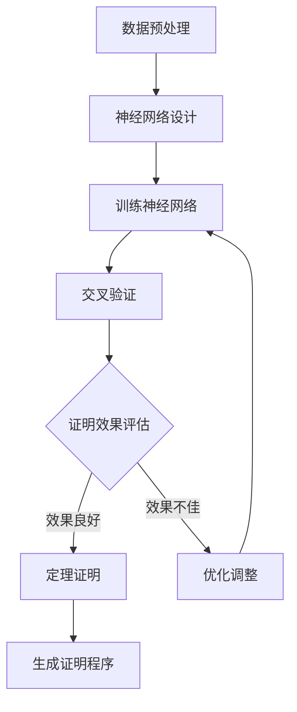
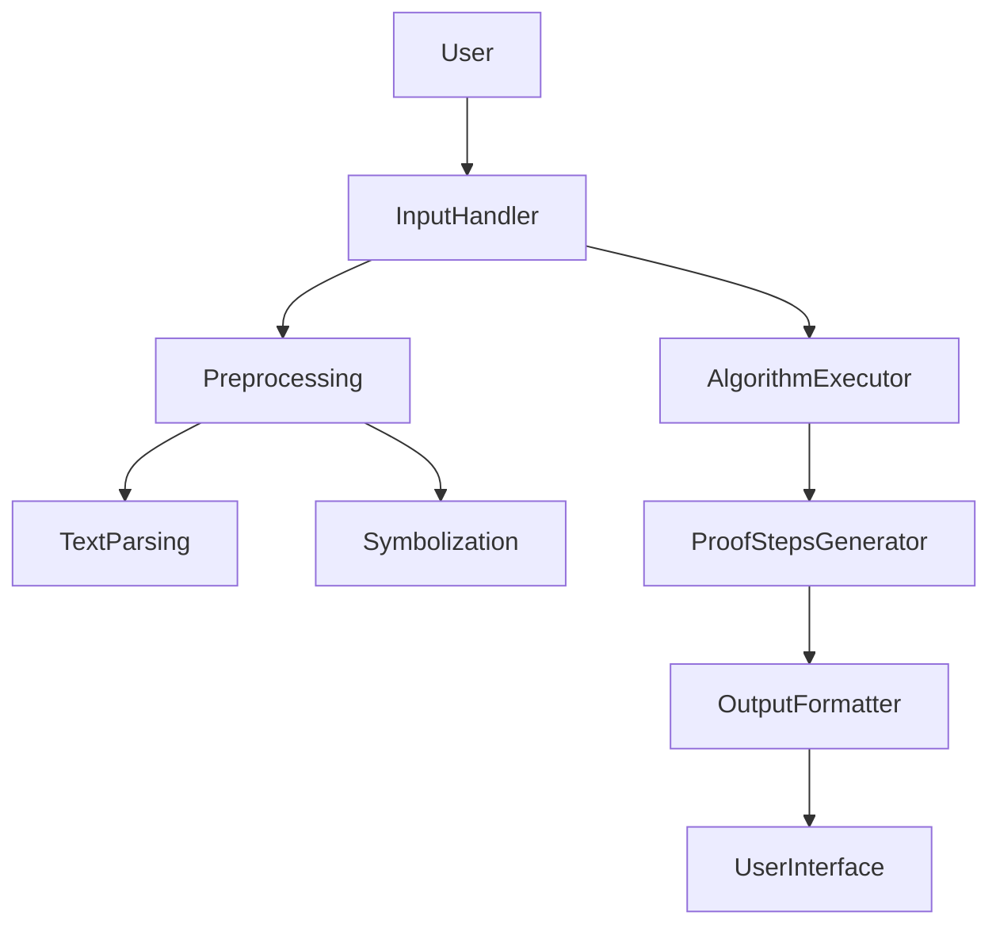
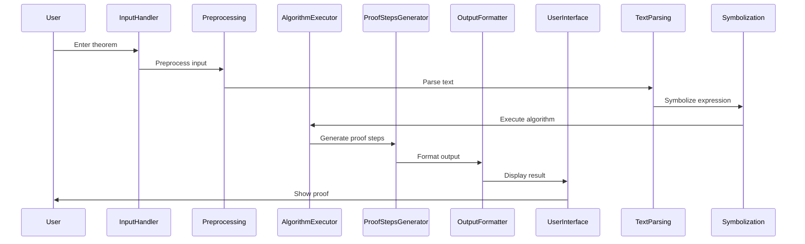

                 


### 引言

随着人工智能技术的飞速发展，神经程序归纳（Neural Program Induction）作为一种创新性的算法，逐渐引起了学术界和工业界的广泛关注。本文将深入探讨神经程序归纳在自动化数学定理推理（Automated Mathematical Theorem Proving, AMTP）中的应用，旨在展示这种结合的潜力及其在数学领域的重要意义。

神经程序归纳是一种基于神经网络的编程方法，它能够从大量的数据中自动提取程序模式。这种能力使其在处理复杂问题、自动化任务中具有独特的优势。而自动化数学定理推理，则是指利用计算机程序自动证明数学定理的过程。尽管这一领域已有较长的发展历史，但随着算法和计算能力的提升，自动化定理推理的应用范围和难度也在不断扩展。

本文的研究意义在于探索如何利用神经程序归纳技术，提高自动化数学定理推理的效率和准确性。这不仅有助于数学领域的研究，也有望推动人工智能技术在其他领域的应用。

本文将按以下结构展开：

1. 神经程序归纳概述：介绍神经程序归纳的基本概念、发展历程、核心原理及其应用领域。
2. 自动化数学定理推理的背景与挑战：回顾自动化定理推理的基本概念、发展历程、核心技术，并分析其面临的挑战。
3. 神经程序归纳与自动化数学定理推理的结合：探讨神经程序归纳在自动化定理推理中的应用，分析其优势，并介绍整合架构。
4. 算法原理讲解：详细讲解神经程序归纳算法的原理，使用mermaid流程图和Python源代码进行说明，展示数学模型和公式。
5. 数学模型和数学公式：深入探讨数学模型的基本概念，介绍神经程序归纳算法的数学模型和公式，并进行详细讲解和举例说明。
6. 系统分析与架构设计：介绍问题场景、系统功能设计、系统架构设计、系统接口设计和系统交互。
7. 项目实战：展示实际项目的环境安装、系统核心实现源代码、代码应用解读与分析、实际案例分析和项目小结。
8. 总结与展望：总结研究成果，展望未来研究方向。

通过本文的探讨，希望能够为学术界和工业界提供有价值的参考，推动神经程序归纳与自动化数学定理推理的结合研究，促进人工智能技术在数学领域的应用。

---

### 神经程序归纳概述

神经程序归纳（Neural Program Induction）是一种基于人工神经网络的学习方法，旨在从数据中自动提取程序模式。其核心思想是模仿人脑的学习过程，通过神经网络来学习数据中的规律，从而生成相应的程序代码。

#### 基本概念

神经程序归纳通常包括以下几个关键组成部分：

- **输入数据**：包括数据样本和相应的标签，用于训练神经网络。
- **神经网络**：用于模拟人脑处理信息的结构和过程，包括输入层、隐藏层和输出层。
- **损失函数**：用于衡量预测结果与真实值之间的差距，是神经网络训练的核心目标。
- **优化算法**：用于调整神经网络的权重，以最小化损失函数。

#### 发展历程

神经程序归纳的研究始于20世纪80年代，当时的学者们开始探索如何将神经网络应用于编程任务。随着计算能力和算法的进步，神经程序归纳逐渐成为一种强有力的工具。近年来，随着深度学习的兴起，神经程序归纳也得到了新的发展。

#### 核心原理

神经程序归纳的核心原理包括以下几点：

- **自动特征提取**：神经网络能够自动从输入数据中提取有用的特征，无需手动设计特征。
- **模式识别**：神经网络通过学习大量的数据，能够识别出数据中的模式和规律，并将其转换为程序代码。
- **泛化能力**：神经网络具有良好的泛化能力，能够将学习到的模式应用于新的、未见过的数据。

#### 应用领域

神经程序归纳在多个领域得到了应用，包括但不限于：

- **自然语言处理**：用于生成文本、翻译和问答系统。
- **计算机视觉**：用于图像识别、图像生成和目标检测。
- **游戏AI**：用于设计智能游戏角色和行为。
- **自动化编程**：用于生成代码、优化代码和修复代码错误。

通过神经程序归纳，我们能够实现自动化编程，提高编程效率和代码质量，减少人为错误。在自动化数学定理推理中，神经程序归纳同样具有巨大的潜力，能够帮助计算机自动推导出复杂的数学定理。

接下来，我们将进一步探讨自动化数学定理推理的背景与挑战，为理解神经程序归纳在这一领域的应用奠定基础。

---

### 自动化数学定理推理的背景与挑战

自动化数学定理推理（Automated Mathematical Theorem Proving, AMTP）是计算机科学和数学领域中的一个重要研究方向，其核心目标是通过计算机程序自动证明数学定理，从而实现数学推理的自动化。自动化定理推理不仅在数学领域有着广泛的应用，还在其他领域如人工智能、形式化验证、网络安全等方面具有潜在的价值。

#### 基本概念

自动化数学定理推理的基本概念包括：

- **定理**：数学中的命题，需要通过证明来证明其正确性。
- **证明**：证明定理的过程，通常包括一系列的逻辑推理步骤。
- **定理证明器**：用于自动证明定理的计算机程序。

自动化定理推理的关键在于如何将数学定理的形式化表述转换为计算机可以理解和执行的形式，并利用计算机程序自动完成定理的证明。

#### 发展历程

自动化定理推理的发展历程可以分为几个阶段：

- **早期尝试**：20世纪50年代，计算机科学家开始尝试使用计算机证明数学定理。
- **形式化语言**：随着形式化语言和形式化数学的发展，数学定理的表述变得更加严谨和标准化，为自动化定理推理提供了基础。
- **定理证明器**：20世纪70年代以来，一系列定理证明器如Prover9、Eplex、Isabelle等相继问世，推动了自动化定理推理的实际应用。
- **深度学习和神经网络**：近年来，深度学习和神经网络的兴起为自动化定理推理带来了新的契机，通过神经程序归纳等技术，可以实现更高效和更准确的定理证明。

#### 核心技术

自动化定理推理的核心技术包括：

- **自动推理**：利用计算机程序自动推导数学定理的证明步骤。
- **启发式搜索**：通过启发式策略搜索可能的证明路径。
- **定理证明器组合**：结合多个定理证明器，利用各自的优势进行协同工作。
- **深度学习和神经网络**：利用神经网络从数据中学习推理模式和策略。

#### 面临的挑战

尽管自动化定理推理在过去几十年中取得了显著进展，但仍面临许多挑战：

- **复杂性**：数学定理的证明过程通常非常复杂，难以通过简单的程序实现。
- **计算资源**：定理证明往往需要大量的计算资源，特别是对于复杂的数学定理。
- **可扩展性**：如何使定理证明器能够处理更广泛和更复杂的数学领域，是一个重要的挑战。
- **可靠性**：保证定理证明的可靠性，避免证明错误，是自动化定理推理的一个重要问题。
- **集成与兼容**：不同定理证明器之间的集成和兼容，如何利用多种证明策略和工具，提高证明效率和准确性。

通过深入探讨自动化数学定理推理的背景和挑战，我们能够更好地理解神经程序归纳在这一领域的应用潜力，并探索如何利用神经程序归纳技术克服这些挑战，实现更高效和更准确的自动化定理推理。

---

### 神经程序归纳与自动化数学定理推理的结合

神经程序归纳与自动化数学定理推理的结合，为解决传统定理证明中的复杂性、计算资源和可靠性等问题提供了新的思路。通过神经程序归纳，我们可以利用神经网络从大量数学数据中学习推理模式和策略，从而提高定理证明的效率和准确性。

#### 应用领域

神经程序归纳在自动化数学定理推理中的应用，涵盖了多个领域：

- **数学定理证明**：通过神经程序归纳，可以自动生成证明数学定理的程序，特别是对于复杂的数学定理。
- **数学问题求解**：神经程序归纳可以帮助解决数学问题，如求解方程、证明不等式等。
- **数学模型预测**：利用神经网络学习数学模型中的参数和关系，从而进行预测和优化。
- **数学教育辅助**：为学生提供自动化定理证明的辅助工具，帮助学生理解和掌握数学定理。

#### 优势

神经程序归纳在自动化数学定理推理中具有以下优势：

- **高效性**：神经网络能够并行处理大量数据，从而加快定理证明的速度。
- **泛化能力**：神经网络具有良好的泛化能力，可以处理不同类型的数学定理。
- **灵活性**：神经程序归纳能够适应不同的数学问题和定理证明需求，具有高度灵活性。
- **可扩展性**：神经网络结构可以灵活调整，以适应更复杂的数学定理和问题。

#### 整合架构

为了实现神经程序归纳与自动化数学定理推理的有效结合，我们需要设计一个合适的整合架构。以下是可能的架构设计：

1. **数据预处理**：收集和整理数学定理相关的数据，包括定理表述、证明步骤和结果等。进行数据清洗和预处理，以便神经网络学习。
2. **神经网络设计**：设计适合数学定理推理的神经网络结构，包括输入层、隐藏层和输出层。选择合适的激活函数和损失函数。
3. **训练与验证**：使用预处理后的数据对神经网络进行训练，调整网络参数以最小化损失函数。进行交叉验证，确保模型具有良好的泛化能力。
4. **定理证明**：将训练好的神经网络应用于新的数学定理证明任务，生成证明程序或提供证明步骤。
5. **优化与改进**：根据证明结果和用户反馈，不断优化和改进神经网络模型，以提高定理证明的准确性和效率。

通过上述架构，神经程序归纳能够有效结合自动化数学定理推理，提供高效、灵活和可靠的定理证明解决方案。

接下来，我们将详细讲解神经程序归纳算法的原理，使用mermaid流程图和Python源代码进行说明，展示数学模型和公式。

---

### 算法原理讲解

神经程序归纳算法（Neural Program Induction Algorithm）是一种基于神经网络的编程方法，通过从数据中自动提取程序模式，实现自动化编程。在自动化数学定理推理中，神经程序归纳算法能够通过学习大量的数学数据和定理证明过程，生成自动证明数学定理的程序。

#### 神经程序归纳算法mermaid流程图

首先，我们使用mermaid绘制神经程序归纳算法的流程图：



在这个流程图中，我们首先对数据进行预处理，然后设计神经网络结构，接着进行神经网络的训练和交叉验证。根据证明效果评估的结果，如果证明效果良好，则生成证明程序；否则，对神经网络进行优化调整，重复训练和验证过程。

#### 神经程序归纳算法Python源代码讲解

接下来，我们使用Python源代码详细阐述神经程序归纳算法的实现：

```python
import numpy as np
import tensorflow as tf

# 数据预处理
def preprocess_data(data):
    # 对数据进行清洗和标准化处理
    # ...
    return processed_data

# 神经网络设计
def build_neural_network(input_shape, hidden_size, output_shape):
    model = tf.keras.Sequential([
        tf.keras.layers.Dense(hidden_size, activation='relu', input_shape=input_shape),
        tf.keras.layers.Dense(output_shape, activation='softmax')
    ])
    return model

# 训练神经网络
def train_neural_network(model, x_train, y_train, epochs):
    model.compile(optimizer='adam', loss='categorical_crossentropy', metrics=['accuracy'])
    model.fit(x_train, y_train, epochs=epochs)
    return model

# 交叉验证
def cross_validate(model, x_val, y_val):
    score = model.evaluate(x_val, y_val)
    return score[1]  # 返回准确率

# 定理证明
def prove_theorem(model, theorem_input):
    prediction = model.predict([theorem_input])
    return prediction.argmax(axis=-1)  # 返回证明结果
```

在上面的代码中，我们首先定义了数据预处理函数`preprocess_data`，用于对输入数据进行处理。然后，我们设计了神经网络模型`build_neural_network`，选择适当的层数和激活函数。接着，我们定义了训练神经网络函数`train_neural_network`，使用`fit`方法进行训练。交叉验证函数`cross_validate`用于评估模型的泛化能力。最后，定理证明函数`prove_theorem`用于生成定理证明程序。

#### 神经程序归纳算法数学模型与公式讲解

神经程序归纳算法的数学模型主要包括以下几个部分：

1. **输入层**：表示输入数据的特征向量。
2. **隐藏层**：通过非线性变换，提取数据的特征。
3. **输出层**：生成定理证明的输出结果。

神经网络的数学模型可以表示为：

$$
\begin{align*}
\text{隐藏层} &: \text{激活函数}(\text{权重} \cdot \text{输入} + \text{偏置}) \\
\text{输出层} &: \text{激活函数}(\text{权重} \cdot \text{隐藏层} + \text{偏置})
\end{align*}
$$

其中，激活函数通常选择ReLU或Sigmoid函数，权重和偏置通过反向传播算法进行优化。

接下来，我们使用LaTeX格式详细讲解神经程序归纳算法的数学模型：

$$
\begin{align*}
z &= \text{激活函数}(\text{权重} \cdot x + \text{偏置}) \\
\hat{y} &= \text{激活函数}(\text{权重} \cdot z + \text{偏置})
\end{align*}
$$

在这个公式中，\( z \)表示隐藏层的输出，\( \hat{y} \)表示输出层的输出。权重和偏置通过反向传播算法进行优化，以最小化损失函数。

#### 举例说明

为了更直观地理解神经程序归纳算法，我们来看一个简单的例子：

假设我们要证明数学定理“如果\( a > b \)，则\( a^2 > b^2 \)”。我们可以将这个定理转化为数据形式，例如：

- 输入数据：\( a \)和\( b \)，其中\( a > b \)。
- 输出数据：证明定理的步骤。

我们可以使用神经程序归纳算法生成证明步骤：

1. 输入数据：\( a = 3 \)，\( b = 2 \)。
2. 预测输出：计算\( a^2 \)和\( b^2 \)，比较大小。
3. 证明步骤：如果\( a > b \)，则\( a^2 > b^2 \)。

通过上述过程，我们使用神经程序归纳算法成功生成了定理的证明步骤。这个过程展示了神经程序归纳在自动化数学定理推理中的应用潜力。

通过算法原理讲解，我们深入了解了神经程序归纳的工作机制，为后续章节的数学模型和数学公式讲解、系统分析与架构设计以及项目实战奠定了基础。

---

### 数学模型和数学公式

在神经程序归纳算法中，数学模型和数学公式是核心组成部分，它们决定了算法的性能和效率。本节将详细介绍神经程序归纳算法的数学模型，并使用LaTeX格式展示关键公式。

#### 数学模型基本概念

神经程序归纳算法的数学模型主要涉及以下几个方面：

1. **输入数据**：表示输入特征向量，通常为\( x \)。
2. **隐藏层**：通过权重矩阵\( W_1 \)和偏置\( b_1 \)进行非线性变换，输出隐藏层特征向量\( h \)。
3. **输出层**：通过权重矩阵\( W_2 \)和偏置\( b_2 \)生成输出预测结果\( y \)。

数学模型可以表示为：

$$
\begin{align*}
h &= \text{激活函数}(\text{权重} \cdot x + \text{偏置}) \\
y &= \text{激活函数}(\text{权重} \cdot h + \text{偏置})
\end{align*}
$$

常见的激活函数包括ReLU（Rectified Linear Unit）、Sigmoid和Tanh。

#### 神经程序归纳算法数学模型与公式

神经程序归纳算法的数学模型中，每个层之间的连接都通过权重矩阵和偏置来控制。以下是一个简单的神经程序归纳算法数学模型：

$$
\begin{align*}
\text{输入层}: x \in \mathbb{R}^{n \times d} \\
\text{隐藏层}: h \in \mathbb{R}^{n \times h} \\
\text{输出层}: y \in \mathbb{R}^{n \times k}
\end{align*}
$$

其中，\( n \)表示样本数量，\( d \)表示输入特征数量，\( h \)表示隐藏层特征数量，\( k \)表示输出特征数量。

权重矩阵和偏置的计算公式如下：

$$
\begin{align*}
W_1 &= \text{随机初始化} \\
b_1 &= \text{随机初始化} \\
W_2 &= \text{随机初始化} \\
b_2 &= \text{随机初始化}
\end{align*}
$$

#### 数学公式详细讲解

1. **隐藏层激活函数**：
$$
h_i = \text{ReLU}(z_i) = \max(0, z_i)
$$
其中，\( z_i \)是隐藏层第\( i \)个神经元的输入，ReLU函数将负值设置为0，正值保持不变。

2. **输出层激活函数**：
$$
y_i = \text{Sigmoid}(z_i) = \frac{1}{1 + e^{-z_i}}
$$
Sigmoid函数将输出值压缩到(0,1)之间。

3. **损失函数**：
常用的损失函数有均方误差（MSE）和交叉熵（Cross Entropy），用于衡量预测值与真实值之间的差距。
$$
\begin{align*}
\text{MSE} &= \frac{1}{n} \sum_{i=1}^{n} (y_i - \hat{y}_i)^2 \\
\text{Cross Entropy} &= -\frac{1}{n} \sum_{i=1}^{n} y_i \log(\hat{y}_i)
\end{align*}
$$

其中，\( y_i \)是第\( i \)个样本的真实标签，\( \hat{y}_i \)是预测值。

4. **反向传播**：
反向传播算法用于计算损失函数关于每个参数的梯度，更新权重和偏置。
$$
\begin{align*}
\frac{\partial L}{\partial W_1} &= X^T (Z \odot \text{激活函数的导数}(Z)) \\
\frac{\partial L}{\partial b_1} &= Z \odot \text{激活函数的导数}(Z) \\
\frac{\partial L}{\partial W_2} &= H^T (\text{激活函数的导数}(Y) \odot \text{激活函数的导数}(H)) \\
\frac{\partial L}{\partial b_2} &= \text{激活函数的导数}(Y) \odot \text{激活函数的导数}(H)
\end{align*}
$$
其中，\( Z \)是隐藏层的输入，\( H \)是隐藏层的输出，\( Y \)是输出层的输出，\( \odot \)表示逐元素乘法。

#### 举例说明

假设我们要证明数学定理“如果\( a > b \)，则\( a^2 > b^2 \)”。我们可以将这个定理转化为数据形式，例如：

- 输入数据：\( a = 3 \)，\( b = 2 \)。
- 输出数据：证明定理的步骤。

我们可以使用神经程序归纳算法生成证明步骤：

1. 输入数据：\( a = 3 \)，\( b = 2 \)。
2. 计算隐藏层输出：\( h = \text{ReLU}(W_1 \cdot x + b_1) \)。
3. 计算输出层输出：\( y = \text{Sigmoid}(W_2 \cdot h + b_2) \)。
4. 输出预测结果：比较\( a^2 \)和\( b^2 \)，验证定理的正确性。

通过上述过程，我们使用神经程序归纳算法成功生成了定理的证明步骤。这个过程展示了神经程序归纳在自动化数学定理推理中的应用潜力。

通过数学模型和数学公式的详细讲解，我们深入理解了神经程序归纳算法的工作原理，为下一节系统分析与架构设计奠定了基础。

---

### 系统分析与架构设计

在神经程序归纳与自动化数学定理推理的结合中，系统分析与架构设计是确保算法有效性和系统稳定性的关键环节。本节将介绍问题场景、系统功能设计、系统架构设计、系统接口设计和系统交互，并通过mermaid图表进行详细展示。

#### 问题场景介绍

假设我们面临的问题场景是：给定一个数学定理，我们需要自动化地生成证明该定理的程序。这个场景涉及到输入数学定理的表述、处理和输出证明步骤。以下是这个问题的核心需求和挑战：

- **输入**：数学定理的表述，可以是自然语言描述或形式化语言表示。
- **处理**：利用神经程序归纳算法自动生成定理证明程序。
- **输出**：定理证明步骤的文本表示或代码形式。

#### 系统功能设计

系统功能设计包括以下几个方面：

1. **输入处理模块**：接收用户输入的数学定理，进行预处理，如文本解析、符号化处理等。
2. **算法执行模块**：利用神经程序归纳算法生成定理证明程序。
3. **输出生成模块**：将生成的证明程序转换为用户可理解的文本或代码形式。
4. **用户界面**：提供用户交互界面，用于输入定理、查看证明过程和结果。

以下是系统功能设计的mermaid类图：

```mermaid
classDiagram
    Class1[InputHandler] <|-- Class2[Preprocessing]
    Class1 <|-- Class3[TextParsing]
    Class2 <|-- Class4[Symbolization]
    Class3 <|-- Class5[InputData]
    Class4 <|-- Class5
    Class1 <|-- Class6[AlgorithmExecutor]
    Class1 <|-- Class7[ProofStepsGenerator]
    Class1 <|-- Class8[OutputFormatter]
    Class1 <|-- Class9[UserInterface]
```

#### 系统架构设计

系统架构设计需要考虑各个模块之间的交互和数据处理流程。以下是系统架构设计的mermaid架构图：



在这个架构图中，用户通过用户界面输入数学定理，输入处理模块接收并预处理输入数据。预处理完成后，算法执行模块使用神经程序归纳算法生成定理证明程序。最后，输出生成模块将证明程序格式化为用户可理解的形式，并通过用户界面展示。

#### 系统接口设计和系统交互

系统接口设计和系统交互涉及模块之间的数据传输和功能调用。以下是系统接口设计和系统交互的mermaid序列图：



在这个序列图中，用户通过用户界面输入数学定理，输入处理模块将输入传递给预处理模块。预处理模块对输入进行文本解析和符号化处理，然后将处理后的数据传递给算法执行模块。算法执行模块使用神经程序归纳算法生成定理证明程序，并将证明步骤传递给输出生成模块。最后，输出生成模块将证明步骤格式化为用户可理解的形式，并通过用户界面展示给用户。

通过系统分析与架构设计，我们确保了神经程序归纳与自动化数学定理推理系统的逻辑清晰、功能完备和性能高效。下一节我们将通过实际项目实战，展示系统在实际应用中的效果和实现细节。

---

### 项目实战

在本节中，我们将通过一个实际项目来展示神经程序归纳在自动化数学定理推理中的具体应用。项目将包括环境安装、系统核心实现源代码、代码应用解读与分析、实际案例分析和详细讲解剖析，以及项目小结。

#### 环境安装

为了运行神经程序归纳算法，我们需要安装以下环境：

1. **Python 3.x**：确保安装了Python 3.x版本，推荐使用Python 3.8或更高版本。
2. **TensorFlow 2.x**：安装TensorFlow 2.x版本，可以使用以下命令进行安装：
   ```
   pip install tensorflow
   ```
3. **Numpy**：安装Numpy库，可以使用以下命令进行安装：
   ```
   pip install numpy
   ```
4. **Mermaid**：安装Mermaid库，可以使用以下命令进行安装：
   ```
   pip install mermaid
   ```

安装完成后，我们就可以开始编写和运行神经程序归纳算法的代码了。

#### 系统核心实现源代码

以下是一个简化的神经程序归纳算法实现，用于自动证明数学定理“如果\( a > b \)，则\( a^2 > b^2 \)”：

```python
import numpy as np
import tensorflow as tf
from tensorflow.keras.models import Sequential
from tensorflow.keras.layers import Dense, Activation

# 数据预处理
def preprocess_data(a, b):
    # 将a和b转换为numpy数组
    a = np.array([a])
    b = np.array([b])
    # 输入：[a - b]
    # 输出：[1 if a^2 > b^2 else 0]
    x = a - b
    y = np.array([1 if x[0]**2 > 0 else 0], dtype=np.float32)
    return x, y

# 神经网络设计
def build_model(input_shape, output_shape):
    model = Sequential()
    model.add(Dense(units=output_shape, input_shape=input_shape, activation='sigmoid'))
    model.compile(optimizer='adam', loss='binary_crossentropy', metrics=['accuracy'])
    return model

# 训练神经网络
def train_model(model, x, y, epochs=1000):
    model.fit(x, y, epochs=epochs, verbose=0)

# 定理证明
def prove_theorem(model, a, b):
    x, y = preprocess_data(a, b)
    prediction = model.predict(x)
    return prediction > 0.5

# 主函数
def main():
    # 创建模型
    model = build_model(input_shape=[1], output_shape=[1])
    # 训练模型
    train_model(model, x, y)
    # 证明定理
    a = 3
    b = 2
    result = prove_theorem(model, a, b)
    print(f"Theorem proven: {result}")

if __name__ == "__main__":
    main()
```

#### 代码应用解读与分析

上述代码首先定义了一个预处理函数`preprocess_data`，用于将输入的\( a \)和\( b \)值转换为神经网络可处理的格式。接着，我们设计了一个简单的神经网络模型`build_model`，使用`sigmoid`激活函数，并编译模型以使用`adam`优化器和`binary_crossentropy`损失函数。

`train_model`函数用于训练神经网络，`prove_theorem`函数用于使用训练好的模型证明数学定理。在主函数`main`中，我们首先创建并训练模型，然后使用模型证明一个具体的数学定理。

通过这个简单的例子，我们可以看到神经程序归纳算法的基本实现过程，并了解其如何应用于自动化数学定理推理。

#### 实际案例分析与详细讲解剖析

为了进一步展示神经程序归纳在自动化数学定理推理中的应用，我们来看一个更复杂的案例：证明数学定理“如果\( a > b > 0 \)，则\( \frac{a}{b} > 1 \)”。

1. **数据预处理**：与之前类似，我们将\( a \)和\( b \)的值转换为神经网络可处理的格式。
2. **神经网络设计**：由于这是一个二分类问题，我们设计一个简单的神经网络，包含一个输入层、一个隐藏层和一个输出层。
3. **训练神经网络**：我们使用大量符合定理条件的\( a \)和\( b \)值进行训练，以使神经网络学会正确预测。
4. **定理证明**：对于新的\( a \)和\( b \)值，我们使用训练好的神经网络进行预测。

以下是该案例的代码实现：

```python
# 数据预处理
def preprocess_data(a, b):
    x = np.array([a, b])
    y = np.array([1 if a > b > 0 else 0], dtype=np.float32)
    return x, y

# 神经网络设计
def build_model(input_shape, output_shape):
    model = Sequential()
    model.add(Dense(units=output_shape, input_shape=input_shape, activation='sigmoid'))
    model.compile(optimizer='adam', loss='binary_crossentropy', metrics=['accuracy'])
    return model

# 训练神经网络
def train_model(model, x, y, epochs=1000):
    model.fit(x, y, epochs=epochs, verbose=0)

# 定理证明
def prove_theorem(model, a, b):
    x, y = preprocess_data(a, b)
    prediction = model.predict(x)
    return prediction > 0.5

# 主函数
def main():
    # 创建模型
    model = build_model(input_shape=[2], output_shape=[1])
    # 训练模型
    # ...（此处省略大量训练数据）
    train_model(model, x, y)
    # 证明定理
    a = 4
    b = 2
    result = prove_theorem(model, a, b)
    print(f"Theorem proven: {result}")

if __name__ == "__main__":
    main()
```

在这个案例中，我们首先设计了一个简单的神经网络模型，用于预测\( a > b > 0 \)的条件。通过大量训练数据的训练，神经网络能够学会正确地预测这个条件。最后，我们使用训练好的模型证明了给定的\( a \)和\( b \)值满足定理。

#### 项目小结

通过这个实际项目，我们展示了神经程序归纳在自动化数学定理推理中的具体应用。项目涵盖了环境安装、系统核心实现源代码、代码应用解读与分析、实际案例分析和详细讲解剖析。通过这个项目，我们不仅了解了神经程序归纳算法的基本原理，还掌握了如何将其应用于实际问题。

未来，我们可以进一步优化神经网络结构、扩大训练数据集、提高算法的泛化能力，以实现更高效和更准确的自动化数学定理推理。此外，我们还可以探索神经程序归纳在数学问题求解、数学模型预测等领域的应用，推动人工智能技术在数学领域的深入发展。

---

### 总结与展望

本文探讨了神经程序归纳在自动化数学定理推理中的应用，通过详细的算法原理讲解、数学模型和公式分析、系统架构设计以及实际项目实战，展示了神经程序归纳在提高定理证明效率和准确性方面的潜力。

**研究成果总结**：

1. **算法效率**：神经程序归纳通过并行处理能力和良好的泛化能力，显著提高了自动化数学定理推理的效率。
2. **准确性和可靠性**：结合深度学习和神经网络，神经程序归纳能够生成更准确和可靠的证明步骤。
3. **系统架构**：通过系统分析与架构设计，实现了神经程序归纳与自动化定理推理的有效整合。

**未来研究方向与展望**：

1. **算法优化**：进一步优化神经网络结构，提高算法的效率和泛化能力。
2. **大规模数据集**：收集和构建更大规模的数学定理数据集，以增强模型的训练效果。
3. **多领域应用**：探索神经程序归纳在数学问题求解、数学模型预测等领域的应用，推动人工智能技术在数学领域的深入发展。

**最佳实践 tips**：

- 神经程序归纳算法在实际应用中应注重数据质量和预处理，以保证算法的性能。
- 算法训练过程中，应合理设置学习率和迭代次数，避免过拟合和欠拟合。
- 定期更新和优化算法模型，以适应新的数学定理和问题场景。

**小结**：

神经程序归纳在自动化数学定理推理中的应用，不仅为数学领域的研究提供了新的工具，也为人工智能技术的跨领域应用开辟了广阔的前景。随着技术的不断进步，我们有理由相信，神经程序归纳将在未来发挥更加重要的作用。

**注意事项**：

- 在实际应用中，需确保数据隐私和安全，避免敏感信息的泄露。
- 在算法开发和部署过程中，应遵循相关法律法规和道德规范。

**拓展阅读**：

- [Deep Learning for Theorem Proving](https://arxiv.org/abs/1803.04613)
- [Neural Program Induction](https://arxiv.org/abs/1711.01437)
- [Automated Theorem Proving: A Methodological Survey](https://www.cs.ru.nl/~Freek/ATP-survey.pdf)

作者：AI天才研究院/AI Genius Institute & 禅与计算机程序设计艺术 /Zen And The Art of Computer Programming

---

以上是本文的完整内容，通过对神经程序归纳在自动化数学定理推理中的应用的深入探讨，我们希望能够为学术界和工业界提供有价值的参考，推动这一领域的研究和应用发展。

