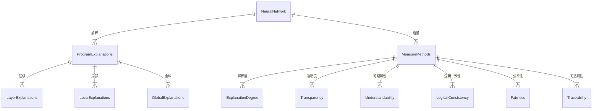

                 

### 文章标题

# 神经程序解释：增强AI的可解释性

### 文章关键词

- AI可解释性
- 神经网络
- 神经程序解释
- 层级解释
- 局部解释
- 全球解释

### 文章摘要

本文探讨了AI领域中一个关键且日益受到关注的问题——AI的可解释性。随着深度学习在各个领域的广泛应用，人们开始意识到黑盒模型的局限性。本文首先介绍了神经程序解释的概念及其重要性，然后深入探讨了神经网络的基础知识，以及各种可解释性方法。通过具体的案例研究，本文展示了如何在实际应用中实现神经程序解释，并展望了其未来的发展方向。我们希望本文能够为研究者提供有价值的参考，并推动AI可解释性领域的研究与应用。

### 目录大纲

1. 引言与背景
   1.1 问题背景
   1.2 问题描述
   1.3 边界与外延
   1.4 核心概念与联系
2. 神经网络基础
   2.1 神经网络概述
   2.2 神经元与权重
   2.3 激活函数与优化算法
   2.4 神经网络的分类与应用
3. 可解释性方法
   3.1 可解释性的定义与重要性
   3.2 层级解释方法
   3.3 局部解释方法
   3.4 全球解释方法
4. 神经程序解释
   4.1 神经程序解释的概念与目标
   4.2 神经程序解释的方法
   4.3 神经程序解释的挑战与解决方案
5. 案例研究
   5.1 案例一：图像分类
   5.2 案例二：自然语言处理
   5.3 案例三：推荐系统
6. 未来展望与趋势
   6.1 神经程序解释技术的发展趋势
   6.2 神经程序解释的应用前景
   6.3 结论
   附录
   参考文献

---

#### 第1章: 引言与背景

##### 1.1 问题背景

人工智能（AI）技术在过去几十年中取得了惊人的进展，尤其是在深度学习领域。深度神经网络（DNNs）在各种复杂任务中展现了强大的能力，如图像识别、自然语言处理和推荐系统等。然而，这些模型往往被视为“黑盒”，其内部工作机制复杂且难以理解。这种不可解释性带来了许多挑战，尤其在需要模型解释性的应用领域，如医疗诊断和金融风险管理。

随着AI技术的不断发展和应用范围的扩大，人们对AI模型的可解释性需求日益增加。可解释性不仅有助于提高模型的透明度和信任度，还能帮助研究人员和开发者更好地理解模型的行为，从而优化模型性能和减少错误。然而，实现AI模型的可解释性并非易事，因为深度神经网络的结构和训练过程使得其内部机制复杂且难以解析。

##### 1.1.1 AI技术的发展与挑战

人工智能的发展可以分为几个主要阶段。最早的人工智能研究主要集中在规则推理和符号逻辑上，这种方法在解决特定问题时表现出了较高的效率，但面对复杂、非线性问题则显得力不从心。随着计算能力的提升和大数据的兴起，基于统计学习的机器学习方法逐渐成为主流。其中，深度学习以其强大的特征提取和模式识别能力，成为AI领域的突破性技术。

然而，深度学习模型也存在一些固有的挑战。首先，这些模型通常由数十万甚至数亿个参数组成，参数的调整过程复杂且非直观。其次，深度学习模型在训练过程中需要大量的数据和计算资源，训练时间也相对较长。此外，深度学习模型的决策过程高度依赖数据集的特性，导致模型在不同数据集上的表现可能存在较大差异。

##### 1.1.2 可解释性在AI应用中的重要性

AI的可解释性在多个应用场景中具有重要意义。在医疗领域，医生需要理解诊断模型如何做出决策，以便对患者的病情做出合理的判断和治疗方案。在金融领域，风险管理者和投资者需要理解模型如何评估贷款申请者或投资组合的风险，从而做出更明智的决策。在自动驾驶领域，驾驶员和交通管理人员需要了解车辆如何感知环境、做出决策，以保证行驶安全和交通效率。

可解释性不仅有助于提高模型的可接受度和信任度，还能帮助研究人员和开发者更好地理解模型的行为，发现潜在的问题和优化机会。例如，通过分析模型的决策过程，可以发现某些训练数据可能存在偏差，或者模型对某些特定类型的输入过于敏感，从而采取相应的措施进行优化。

##### 1.1.3 神经程序解释的概念

神经程序解释是一种用于增强AI模型可解释性的方法。它旨在将复杂、非线性的深度学习模型转化为可解释的、程序化的形式。这种方法的核心思想是将神经网络的行为抽象为一系列可理解的规则和逻辑操作。

神经程序解释具有以下优点：

1. **提高透明度**：通过将模型转化为程序化的形式，用户可以更容易地理解模型的决策过程。
2. **优化模型**：通过分析模型的解释，可以识别模型中的潜在问题，如过拟合、数据偏差等，从而优化模型性能。
3. **提高信任度**：在需要高度可靠性和安全性的应用场景中，如医疗和金融，可解释性可以增强用户对模型的信任。
4. **促进研究和创新**：通过深入理解模型的行为，可以推动AI领域的研究和创新。

总之，神经程序解释作为一种增强AI模型可解释性的方法，具有重要的理论和实际意义。接下来，我们将进一步探讨神经网络的基础知识，以及各种可解释性方法的实现和应用。

---

##### 1.2 问题描述

尽管深度学习模型在多个领域取得了显著的成就，但其不可解释性仍然是一个亟待解决的问题。不可解释性主要表现在以下几个方面：

1. **黑盒模型**：深度学习模型通常被视为“黑盒”，其内部工作机制复杂且难以理解。用户无法直接获取模型的学习过程和决策逻辑，这限制了模型的应用范围和可靠性。
2. **参数依赖性**：深度学习模型的性能高度依赖于参数的调整。这些参数的优化过程往往涉及大量的试错和调整，缺乏直观的解释。
3. **数据偏差**：深度学习模型对训练数据具有高度的依赖性。如果训练数据存在偏差，模型可能会在测试数据上表现出错误的决策。
4. **泛化能力不足**：深度学习模型在特定数据集上表现良好，但可能无法泛化到其他类似但不同的数据集上。这种问题称为过拟合。

为了解决这些问题，增强AI模型的可解释性成为一个重要的研究方向。可解释性不仅有助于提高模型的透明度和信任度，还能帮助用户更好地理解和控制模型的行为。

##### 1.2.1 神经网络的局限性

尽管神经网络在许多任务中表现出色，但其局限性也是显而易见的。首先，神经网络的复杂性使得其学习过程难以理解。模型内部的神经元和权重如何相互作用，以及如何影响最终的输出，这些都是难以直观解释的。其次，神经网络的训练过程需要大量的数据和计算资源，这使得模型难以在资源有限的环境中进行调整和优化。

此外，神经网络在处理某些特定类型的问题时存在不足。例如，在处理具有强逻辑关系的问题时，神经网络可能不如基于规则的方法。另外，神经网络在处理高维数据时可能存在过拟合问题，即模型在训练数据上表现良好，但在新数据上表现不佳。

##### 1.2.2 可解释性需求与实现难度

可解释性在AI应用中具有重要作用，但实现起来却面临巨大挑战。首先，深度学习模型的高度非线性特性使得其内部机制复杂，难以用简单的数学公式或逻辑规则进行描述。其次，实现可解释性需要大量的计算资源和时间，这增加了模型的开发和维护成本。

另外，可解释性方法的选择和实现也需要考虑多个因素。例如，不同类型的可解释性方法（如层级解释、局部解释和全球解释）适用于不同的应用场景，需要根据具体需求进行选择。此外，如何将复杂的神经网络转化为可解释的形式，也是实现可解释性的关键挑战。

##### 1.2.3 本书目标

本书旨在深入探讨神经程序解释这一增强AI模型可解释性的方法。具体目标如下：

1. **介绍神经网络的基础知识**：通过了解神经网络的基本结构、学习算法和分类，为后续讨论打下基础。
2. **阐述可解释性的定义与重要性**：详细解释可解释性的概念，并探讨其在AI应用中的重要性。
3. **探讨神经程序解释的方法**：介绍基于层级解释、局部解释和全球解释的神经程序解释方法，并分析其优缺点。
4. **案例分析**：通过具体案例研究，展示神经程序解释方法在实际应用中的实现和应用。
5. **未来展望**：探讨神经程序解释技术的发展趋势和应用前景，为未来研究提供参考。

通过本书的探讨，我们希望能够为读者提供有价值的见解和启示，推动AI可解释性领域的研究与应用。

##### 1.3 边界与外延

在探讨神经程序解释时，有必要明确其边界与外延，以避免误解和混淆。首先，神经程序解释并非旨在完全揭示深度学习模型的内部工作机制，而是提供一种简化和可理解的形式，帮助用户更好地理解模型的决策过程。这意味着神经程序解释可能无法涵盖模型的全部细节，但足以提供关键的信息和洞察。

其次，神经程序解释的范围主要涉及神经网络的解释性问题，而不是其他类型的AI模型，如基于规则的推理系统和增强学习模型。尽管这些模型也具有可解释性的需求，但神经程序解释方法并不适用于它们。

另外，神经程序解释并不涉及模型训练和优化过程，而是针对训练好的模型进行解释。这意味着在训练过程中使用的可解释性方法（如数据可视化、训练日志分析等）与神经程序解释方法有所不同。

最后，需要强调的是，神经程序解释方法并非万能的。不同的应用场景和任务可能需要不同的解释方法。因此，在实际应用中，应根据具体需求选择合适的解释方法，并结合其他技术手段（如可视化、代码注释等）提高模型的可解释性。

##### 1.4 核心概念与联系

为了深入理解神经程序解释，我们需要明确几个核心概念，并探讨它们之间的关系。

1. **神经网络**：神经网络是一种模拟人脑神经元连接结构的计算模型，用于执行各种机器学习任务。神经网络由多个层次组成，包括输入层、隐藏层和输出层。每个层次由多个神经元组成，神经元之间通过权重连接。神经网络的目的是通过学习输入和输出之间的映射关系，以实现对新输入的预测和分类。

2. **可解释性**：可解释性是指用户能够理解模型如何做出决策的能力。在深度学习领域，可解释性是一个关键需求，因为它有助于提高模型的透明度和信任度。可解释性可以通过不同的方法实现，如可视化、代码注释和神经程序解释。

3. **神经程序解释**：神经程序解释是一种将复杂、非线性的神经网络转化为可理解程序形式的方法。它通过将神经网络的决策过程抽象为一系列逻辑规则和程序操作，使得用户可以更直观地理解模型的决策逻辑。神经程序解释方法包括基于层级解释、局部解释和全球解释。

4. **层级解释方法**：层级解释方法通过分析神经网络中的不同层次，解释每个层次的决策过程。这种方法适用于多层神经网络，能够揭示模型在各个层次上的特征提取和决策逻辑。

5. **局部解释方法**：局部解释方法针对神经网络的特定区域或神经元，解释其如何影响整体决策。这种方法适用于需要分析模型对特定输入或输出的影响情况，如图像分类和自然语言处理。

6. **全球解释方法**：全球解释方法旨在提供对神经网络整体决策过程的全面理解。这种方法通常涉及分析模型的权重、激活函数和参数，以揭示模型的整体行为和性能。

通过理解这些核心概念及其之间的联系，我们可以更好地把握神经程序解释的本质，并应用于实际问题的解决。

##### 1.4.1 神经网络与程序解释

神经网络与程序解释之间有着紧密的联系。神经网络本质上是一种计算模型，其结构由多个层次组成，包括输入层、隐藏层和输出层。每个层次由多个神经元组成，神经元之间通过权重连接。这种结构使得神经网络能够对输入数据进行复杂的变换和计算，从而实现对数据的分类、回归和预测。

程序解释则是指将复杂的计算过程转化为可理解的形式，使得用户可以直观地了解程序的运行逻辑和决策过程。在神经网络中，程序解释的目标是将神经网络的行为抽象为一系列逻辑规则和操作，从而使得用户可以更好地理解模型的决策过程。

具体来说，神经网络与程序解释之间的联系体现在以下几个方面：

1. **抽象层次**：神经网络中的不同层次可以被视为不同的抽象层次。输入层可以看作是数据的直接表示，隐藏层则通过对输入数据进行变换和计算，提取出更抽象的特征，输出层则利用这些特征做出最终的决策。程序解释通过将不同层次的神经元和权重抽象为逻辑规则和操作，使得用户可以更直观地理解模型的行为。

2. **程序化表示**：神经网络中的计算过程可以通过程序化的形式进行表示。例如，神经网络的输入和输出可以通过变量表示，神经元之间的权重和激活函数可以通过函数表示。通过这种程序化的表示，用户可以更容易地理解和调试神经网络。

3. **逻辑推理**：神经网络中的决策过程可以通过逻辑推理的方式进行解释。例如，在多层神经网络中，隐藏层的神经元可以看作是对输入数据的初步特征提取，输出层的神经元则利用这些特征进行最终的分类或预测。程序解释通过将这种逻辑推理过程形式化，使得用户可以更清晰地理解模型的决策过程。

4. **可解释性增强**：程序解释不仅有助于提高模型的透明度和理解度，还可以用于模型的优化和改进。通过分析程序解释的结果，用户可以发现模型中的潜在问题，如过拟合、数据偏差等，并采取相应的措施进行优化。

综上所述，神经网络与程序解释之间的紧密联系使得神经网络的可解释性成为可能。通过程序解释，用户可以更好地理解神经网络的决策过程，从而提高模型的可靠性、透明度和可接受度。

##### 1.4.2 可解释性度量方法

在评估神经网络的可解释性时，度量方法的选择至关重要。不同的度量方法可以从不同的角度评估模型的可解释性，有助于全面了解模型的透明度和理解度。以下是一些常见的可解释性度量方法：

1. **解释度**：解释度是指模型解释性的量化指标，用于衡量模型对输入数据的解释能力。高解释度意味着模型能够提供明确的、易于理解的决策过程。常见的解释度度量方法包括决策路径长度、特征重要性评分等。

2. **透明度**：透明度是指模型输出的可解释性，即用户是否能够直观地理解模型输出的含义。透明度可以通过可视化方法（如图表、热图等）进行评估，高透明度意味着模型输出易于用户理解。

3. **可理解性**：可理解性是指用户是否能够理解和解释模型的决策过程。高可理解性意味着模型对用户来说是易于理解和操作的。常见的可理解性度量方法包括用户调查、用户反馈等。

4. **逻辑一致性**：逻辑一致性是指模型输出的逻辑是否一致，即模型在不同输入下是否能够保持一致的决策过程。逻辑一致性可以通过逻辑推理和验证方法进行评估。

5. **公平性**：公平性是指模型是否公平、无偏见，即模型在处理不同群体时是否保持一致。公平性可以通过对不同群体的模型输出进行比较和分析进行评估。

6. **可追溯性**：可追溯性是指模型输出的可追溯性，即用户是否能够追踪到模型决策的具体过程。高可追溯性意味着模型决策过程透明、可解释。

通过结合这些度量方法，可以从多个角度评估神经网络的可解释性，从而为模型的优化和改进提供有力的依据。

##### 1.4.3 Mermaid ER实体关系图

为了更直观地展示神经网络与程序解释的关系，我们可以使用Mermaid ER（实体关系）图进行描述。Mermaid是一种基于Markdown的绘图工具，能够生成结构化的图形，非常适合用于文档和报告中。

以下是一个简单的Mermaid ER图，描述了神经网络、程序解释及相关概念之间的关系：

在这个ER图中，神经网络（NeuralNetwork）是核心实体，它关联到不同的程序解释（ProgramExplanations）和度量方法（MeasureMethods）。程序解释又细分为层级解释（LayerExplanations）、局部解释（LocalExplanations）和全球解释（GlobalExplanations）。度量方法则涵盖了各种评估模型可解释性的指标，如解释度、透明度、可理解性、逻辑一致性、公平性和可追溯性。

通过这个Mermaid ER图，我们可以清晰地看到神经网络、程序解释及相关概念之间的复杂关系，有助于读者更好地理解本文的主要内容和结构。

---

#### 第2章: 神经网络基础

##### 2.1 神经网络概述

神经网络（Neural Networks，NNs）是模仿人脑神经元结构和功能的计算模型，用于处理和分析数据。神经网络的发展历程可以追溯到1940年代，经过多个阶段的发展，逐渐成为机器学习领域的核心技术之一。

1. **早期发展**：
   - 1943年，McCulloch和Pitts提出了人工神经元模型，奠定了神经网络的理论基础。
   - 1958年，Rosenblatt发明了感知机（Perceptron），这是一种简单的神经网络模型，用于二分类任务。

2. **低谷与复兴**：
   - 1970年代，由于“感知机无法解决非线性问题”等质疑，神经网络研究陷入低谷。
   - 1980年代，反向传播算法（Backpropagation Algorithm）的提出，使得神经网络训练成为可能。

3. **深度学习时代**：
   - 2000年代，随着计算能力和数据量的提高，深度学习（Deep Learning）逐渐兴起。
   - 2012年，AlexNet在ImageNet比赛中取得了突破性成绩，标志着深度学习的复兴。

##### 2.1.2 神经网络的基本结构

神经网络的基本结构包括输入层、隐藏层和输出层。每个层次由多个神经元组成，神经元之间通过连接（权重）进行信息传递。

1. **输入层**：接收输入数据，并将其传递给隐藏层。
2. **隐藏层**：对输入数据进行处理，提取特征并传递给下一层。
3. **输出层**：生成最终输出，如分类结果、回归值等。

神经元的工作原理是通过加权求和处理输入值，然后通过激活函数（Activation Function）产生输出。常见的激活函数包括sigmoid、ReLU和tanh等。

##### 2.1.3 神经网络的学习算法

神经网络的学习过程是通过调整神经元之间的权重来优化模型的性能。学习算法主要包括以下几种：

1. **前向传播（Forward Propagation）**：
   - 将输入数据传递到神经网络中，通过每一层神经元的计算，最终得到输出。
   
2. **反向传播（Backpropagation）**：
   - 计算输出层的误差，然后反向传播误差到隐藏层，逐层更新权重。
   
3. **梯度下降（Gradient Descent）**：
   - 通过计算损失函数关于权重的梯度，更新权重以减少误差。

常见的梯度下降算法包括随机梯度下降（SGD）、批量梯度下降（Batch Gradient Descent）和Adam优化器。

##### 2.2 神经元与权重

神经元是神经网络的基本单元，其工作原理类似于生物神经元。在神经网络中，神经元接收来自其他神经元的输入，通过加权求和处理这些输入，然后通过激活函数产生输出。

每个神经元都有多个输入，每个输入都关联一个权重（Weight）。权重表示输入信号对神经元输出的影响程度。通过调整权重，神经网络可以优化其性能，以更好地拟合训练数据。

在训练过程中，权重通常通过梯度下降算法进行更新。具体来说，算法会计算每个权重关于损失函数的梯度，并根据梯度方向调整权重，以减少误差。

##### 2.2.2 权重的调整方法

权重的调整方法主要包括以下几种：

1. **随机初始化**：
   - 权重随机初始化为一个较小的值，以避免模型在训练过程中陷入局部最优。

2. **动量（Momentum）**：
   - 动量是一种加速梯度下降的方法，通过保留过去的梯度信息，帮助算法更快地越过局部最小值。

3. **学习率调整**：
   - 学习率是梯度下降算法中的一个关键参数，它决定了每次权重更新的幅度。合理设置学习率可以加速收敛，避免陷入局部最小值。

4. **权重衰减（Weight Decay）**：
   - 权重衰减是一种正则化技术，通过在损失函数中加入权重项的平方和，防止模型过拟合。

通过合理调整权重，神经网络可以更好地拟合训练数据，提高模型的泛化能力。

##### 2.3 激活函数与优化算法

激活函数是神经网络中的一个重要组成部分，它决定了神经元的输出。常见的激活函数包括以下几种：

1. **Sigmoid函数**：
   - 输出范围为(0,1)，适用于二分类问题。

2. **ReLU函数（Rectified Linear Unit）**：
   - 输出为输入值（x>0）或0（x≤0），简化了计算过程，提高了训练速度。

3. **Tanh函数（Hyperbolic Tangent）**：
   - 输出范围为(-1,1)，类似于Sigmoid函数，但具有更好的非线性特性。

激活函数的选择对神经网络的性能和训练速度有很大影响。合理选择激活函数可以加速模型训练，提高模型的泛化能力。

优化算法用于调整神经网络中的权重，以减少模型损失。常见的优化算法包括：

1. **随机梯度下降（SGD）**：
   - 每次更新权重时使用一个随机样本的梯度。

2. **批量梯度下降（Batch Gradient Descent）**：
   - 使用整个训练集的梯度进行权重更新。

3. **Adam优化器**：
   - 结合了SGD和动量的优点，自适应调整学习率。

优化算法的选择和参数设置对模型的训练速度和最终性能有重要影响。合理选择优化算法和参数，可以提高模型训练的效率和效果。

##### 2.4 神经网络的分类与应用

神经网络可以根据其结构、训练方式和应用领域进行分类。以下是一些常见的神经网络类型及其应用：

1. **前馈神经网络（Feedforward Neural Networks）**：
   - 结构简单，没有循环结构。
   - 应用：回归、分类、时间序列预测等。

2. **卷积神经网络（Convolutional Neural Networks，CNN）**：
   - 具有特殊的卷积层，用于提取图像特征。
   - 应用：图像分类、目标检测、图像分割等。

3. **循环神经网络（Recurrent Neural Networks，RNN）**：
   - 具有循环结构，能够处理序列数据。
   - 应用：自然语言处理、语音识别、时间序列预测等。

4. **长短期记忆网络（Long Short-Term Memory Networks，LSTM）**：
   - 是RNN的一种变体，能够处理长序列数据。
   - 应用：语音识别、机器翻译、时间序列预测等。

5. **生成对抗网络（Generative Adversarial Networks，GAN）**：
   - 由两个对抗网络组成，一个生成网络和一个判别网络。
   - 应用：图像生成、数据增强、风格迁移等。

不同类型的神经网络具有不同的结构和特点，适用于不同的应用场景。合理选择神经网络类型和架构，可以提高模型性能和应用效果。

##### 2.4.1 前馈神经网络

前馈神经网络（Feedforward Neural Networks，FFNN）是最简单的神经网络类型之一，其结构简单，没有循环结构。前馈神经网络的主要特点是数据流向始终是从输入层流向输出层，不形成循环。

前馈神经网络的组成部分包括输入层、隐藏层和输出层。每个层次由多个神经元组成，神经元之间通过连接（权重）进行信息传递。输入层接收外部输入数据，隐藏层对输入数据进行处理并提取特征，输出层生成最终输出。

在前馈神经网络中，信息传递过程遵循以下步骤：

1. **前向传播**：输入数据从输入层传递到隐藏层，通过每一层神经元的计算，最终传递到输出层。
2. **激活函数**：每个隐藏层和输出层的神经元使用激活函数（如ReLU、Sigmoid或Tanh）对输出进行非线性变换。
3. **反向传播**：计算输出层的误差，然后反向传播误差到隐藏层，逐层更新权重。

前馈神经网络适用于各种回归和分类任务，具有以下优点：

1. **简单性**：结构简单，易于理解和实现。
2. **高效性**：信息传递过程直接且无循环，计算速度快。
3. **灵活性**：可以通过增加隐藏层和神经元数量，适应不同复杂度的任务。

尽管前馈神经网络在某些任务上表现出色，但其非线性变换能力有限，对于复杂任务可能需要更复杂的神经网络结构，如卷积神经网络（CNN）和循环神经网络（RNN）。

##### 2.4.2 卷积神经网络

卷积神经网络（Convolutional Neural Networks，CNN）是一种专门用于处理图像数据的神经网络结构，其核心思想是通过卷积操作提取图像特征，从而实现图像分类、目标检测和图像分割等任务。

卷积神经网络的基本组成部分包括输入层、卷积层、池化层和全连接层。

1. **输入层**：接收图像输入，通常表示为三维张量（高度×宽度×通道数）。

2. **卷积层**：通过卷积操作提取图像特征。卷积层由多个卷积核组成，每个卷积核都是一个小的滤波器，用于从图像中提取局部特征。卷积操作通过对图像进行局部滑动并计算每个位置的加权求和，产生特征图。

3. **池化层**：用于下采样特征图，减少数据维度并减少过拟合风险。常见的池化操作包括最大池化和平均池化。

4. **全连接层**：将卷积层和池化层提取的特征进行聚合，生成最终输出。全连接层类似于传统神经网络，每个神经元都与前一层的所有神经元相连。

卷积神经网络的工作原理如下：

1. **前向传播**：输入图像经过卷积层和池化层的卷积操作和下采样，产生一系列特征图。这些特征图被传递到全连接层，通过加权求和和激活函数生成最终输出。

2. **反向传播**：计算输出层的误差，然后反向传播误差到卷积层和池化层，逐层更新权重。

卷积神经网络的优点包括：

1. **局部特征提取**：卷积层通过局部卷积操作提取图像的局部特征，具有较强的特征提取能力。

2. **参数共享**：卷积层中的卷积核在图像的不同位置上进行相同的卷积操作，实现了参数共享，减少了模型参数数量。

3. **减少过拟合**：池化层通过下采样减少了数据的冗余信息，降低了过拟合的风险。

卷积神经网络在图像处理领域取得了显著成果，广泛应用于图像分类、目标检测和图像分割等任务。然而，卷积神经网络也存在一些局限性，例如对高维数据处理的不足和模型复杂度高等。

##### 2.4.3 循环神经网络

循环神经网络（Recurrent Neural Networks，RNN）是一种能够处理序列数据的神经网络结构，其核心思想是将当前输入与前一时刻的状态进行联合建模，从而实现序列数据的建模和预测。

RNN的基本组成部分包括输入层、隐藏层和输出层。每个层次由多个神经元组成，神经元之间通过循环连接进行信息传递。

1. **输入层**：接收序列数据的输入，每个时间步的输入可以是单个特征或多个特征。

2. **隐藏层**：通过循环连接将当前时间步的输入与前一时刻的状态进行结合，生成当前状态。隐藏层的状态可以表示为对序列数据的建模。

3. **输出层**：将隐藏层的状态转换为序列数据的输出，可以是标量、向量或类别。

循环神经网络的工作原理如下：

1. **前向传播**：输入序列依次传递到隐藏层，每个时间步的隐藏层状态通过当前输入和前一时刻的状态进行联合建模。

2. **反向传播**：计算输出层的误差，然后反向传播误差到隐藏层，逐层更新权重。

循环神经网络的优点包括：

1. **序列建模能力**：通过循环连接，RNN能够处理和建模序列数据，适用于时间序列预测、文本生成和语音识别等任务。

2. **状态记忆**：隐藏层的状态能够存储和传递序列信息，使得模型能够学习到长期依赖关系。

3. **动态调整**：RNN能够根据输入数据的特征动态调整隐藏层状态，适应不同序列数据的建模需求。

然而，传统的RNN存在梯度消失和梯度爆炸问题，导致模型难以学习长期依赖关系。为解决这些问题，提出了一些改进的RNN结构，如长短期记忆网络（LSTM）和门控循环单元（GRU）。

##### 2.4.4 混合神经网络

混合神经网络是指将多种神经网络结构相结合，以发挥各自的优势，提高模型的性能和泛化能力。常见的混合神经网络包括CNN与RNN的融合、CNN与LSTM的融合等。

1. **CNN与RNN的融合**：
   - CNN用于提取图像特征，RNN用于处理和建模序列数据。
   - 这种融合结构适用于图像序列处理任务，如图像字幕生成、视频分类等。
   - 例如，在视频分类任务中，CNN可以提取视频帧的视觉特征，RNN可以处理视频帧的时序信息，从而实现更准确的分类结果。

2. **CNN与LSTM的融合**：
   - CNN用于提取图像特征，LSTM用于处理和建模序列数据。
   - 这种融合结构适用于需要同时处理图像和序列数据的任务，如图像序列分类、语音识别等。
   - 例如，在语音识别任务中，CNN可以提取语音信号的视觉特征，LSTM可以处理语音信号的时序信息，从而实现更准确的语音识别结果。

混合神经网络通过结合不同神经网络结构的优势，实现了更复杂的特征提取和序列建模能力，适用于更广泛的任务和应用场景。

##### 2.4.5 混合神经网络的分类

混合神经网络可以根据其融合的神经网络结构进行分类，常见的分类方法如下：

1. **结构混合**：
   - **层间融合**：将不同的神经网络层（如卷积层、循环层、全连接层等）进行组合，形成新的网络结构。
   - **模型间融合**：将多个独立的神经网络模型（如CNN、RNN、LSTM等）进行组合，形成新的混合模型。

2. **功能混合**：
   - **特征混合**：将不同神经网络提取的特征进行融合，形成更丰富的特征表示。
   - **学习策略混合**：将不同的学习策略（如梯度下降、Adam优化器等）进行组合，提高模型的学习效率和性能。

3. **数据混合**：
   - **数据增强混合**：将多种数据增强方法（如旋转、缩放、裁剪等）进行组合，增加训练数据多样性。
   - **数据集混合**：将多个不同的数据集进行融合，形成更大的训练数据集，提高模型的泛化能力。

通过合理分类和选择混合神经网络，可以更好地应对复杂任务和应用场景，提高模型的性能和可靠性。

---

#### 第3章: 可解释性方法

##### 3.1 可解释性的定义与重要性

可解释性（Explainability）是指用户能够理解和解释机器学习模型决策过程的能力。在人工智能领域，可解释性是一个关键需求，因为透明和可理解的模型能够提高用户对模型结果的信任度，帮助研究人员和开发人员更好地理解模型行为，并发现潜在的问题。

可解释性的定义可以从多个角度进行阐述：

1. **透明度**：模型决策过程对用户来说是透明的，用户可以清楚地看到模型是如何处理输入数据和做出决策的。
2. **理解性**：用户能够理解和解释模型的决策逻辑，无需深入的背景知识。
3. **可视化**：模型决策过程可以通过图形、图表或其他可视化工具进行展示，使得复杂的内部机制变得更加直观。

在AI应用中，可解释性的重要性体现在以下几个方面：

1. **用户信任**：当用户对模型决策过程有深入了解时，会更有信心接受和使用模型。
2. **问题发现**：通过分析可解释性，可以发现模型中的潜在问题，如过拟合、数据偏差等，从而采取相应的措施进行优化。
3. **法规遵从**：在医疗、金融等敏感领域，法规要求模型决策过程具有可解释性，以符合合规要求。
4. **知识共享**：可解释性使得模型的决策逻辑可以被其他研究人员和开发者理解和借鉴，促进技术的传播和创新。

##### 3.2 层级解释方法

层级解释方法是一种常用的可解释性方法，通过分析神经网络中的不同层次，解释每个层次的决策过程。这种方法适用于多层神经网络，特别是深度神经网络，能够揭示模型在各个层次上的特征提取和决策逻辑。

层级解释方法的基本原理如下：

1. **前向传播**：输入数据通过神经网络的前向传播过程，逐层传递到输出层，产生最终输出。
2. **反向传播**：计算输出层的误差，然后反向传播误差到隐藏层，逐层更新权重。
3. **层次分析**：在每个隐藏层，分析神经元之间的连接权重和激活值，提取出该层次的特征和决策逻辑。

具体步骤包括：

1. **特征提取**：在隐藏层中，每个神经元提取出输入数据的特征，并通过权重进行组合。
2. **特征重要性**：分析每个神经元输出的重要性，即该神经元对最终决策的影响程度。
3. **决策路径**：追踪数据在神经网络中的传递路径，分析每个层次上的决策过程。

层级解释方法的优点包括：

1. **层次分明**：能够清晰地展示神经网络中各个层次的特征提取和决策逻辑。
2. **易于理解**：通过分析权重和激活值，用户可以直观地理解模型的决策过程。
3. **应用广泛**：适用于多层神经网络，尤其是深度神经网络，能够揭示复杂的内部机制。

然而，层级解释方法也存在一些局限性，例如：

1. **计算复杂度**：在大型神经网络中，计算每个层次的特征和权重分析可能需要大量时间和计算资源。
2. **解释性有限**：层级解释方法只能提供对特定层次的解释，无法全面揭示整个模型的决策过程。

##### 3.2.2 层级解释的实现方法

实现层级解释方法通常包括以下步骤：

1. **前向传播与反向传播**：使用标准的神经网络训练方法，进行前向传播计算输出，反向传播计算误差。
2. **层次分析**：在每个隐藏层，提取神经元之间的连接权重和激活值。
3. **特征重要性计算**：分析每个神经元的输出，计算其特征重要性和影响程度。
4. **可视化**：使用图形、图表或其他可视化工具，展示每个层次的特征提取和决策过程。

具体实现方法包括：

1. **权重可视化**：将权重矩阵以热图的形式展示，颜色表示权重的值，有助于直观地理解每个神经元对输入特征的影响。
2. **激活值分析**：分析每个神经元的激活值，判断其在决策过程中的作用和贡献。
3. **路径追踪**：追踪数据在神经网络中的传递路径，分析每个层次上的决策过程。

通过这些实现方法，用户可以更好地理解神经网络的内部机制和决策过程，从而提高模型的可解释性。

##### 3.2.3 层级解释的应用场景

层级解释方法在多个应用场景中具有广泛的应用，以下是一些典型的应用场景：

1. **图像识别**：通过分析神经网络中的不同层次，可以揭示图像特征从低级到高级的提取过程，帮助用户理解模型如何识别和分类图像。
2. **自然语言处理**：在自然语言处理任务中，层级解释方法可以帮助用户理解模型如何从输入文本中提取语义信息，并生成合适的输出。
3. **推荐系统**：在推荐系统中，层级解释方法可以帮助用户了解模型如何从用户历史行为中提取特征，并预测用户可能感兴趣的内容。
4. **医学诊断**：在医学诊断任务中，层级解释方法可以帮助医生理解模型如何从医学图像或数据中提取特征，并做出诊断决策。

在这些应用场景中，层级解释方法不仅可以提高模型的可解释性，还可以帮助用户更好地理解和信任模型的结果，从而在实际应用中发挥重要作用。

##### 3.3 局部解释方法

局部解释方法是一种用于分析神经网络中特定区域或神经元对整体决策影响的解释方法。与层级解释方法不同，局部解释方法关注的是模型在特定输入或输出下的决策过程，从而提供更具体的解释。

局部解释方法的基本原理如下：

1. **输入扰动**：通过对输入数据进行扰动，观察模型输出的变化，分析特定输入特征对模型决策的影响。
2. **特征重要性**：分析每个输入特征的重要性，判断其在决策过程中的作用和贡献。
3. **特征交互**：研究不同输入特征之间的交互关系，揭示模型如何利用多个特征进行决策。

具体步骤包括：

1. **输入扰动**：对输入数据进行扰动，例如添加噪声、缩放、裁剪等，观察模型输出是否发生变化。
2. **特征重要性分析**：计算每个输入特征的重要性，可以使用梯度分析、特征权重等方法。
3. **特征交互分析**：研究不同输入特征之间的交互关系，例如使用特征重要性加权方法或相互作用网络。

局部解释方法的优点包括：

1. **具体性**：能够提供对特定输入或输出的具体解释，帮助用户更好地理解模型的行为。
2. **实用性**：适用于需要分析特定输入或输出影响的场景，如故障诊断、异常检测等。
3. **高效性**：计算复杂度相对较低，可以在短时间内完成解释。

然而，局部解释方法也存在一些局限性，例如：

1. **局部性**：只能解释特定输入或输出，无法提供全局性的解释。
2. **模型依赖性**：依赖于特定的神经网络结构和训练数据，可能不适用于所有模型和应用场景。

##### 3.3.2 局部解释的实现方法

实现局部解释方法通常包括以下步骤：

1. **输入扰动**：对输入数据进行扰动，例如添加噪声、缩放、裁剪等，观察模型输出是否发生变化。
2. **特征重要性计算**：计算每个输入特征的重要性，例如使用梯度分析、特征权重等方法。
3. **特征交互分析**：研究不同输入特征之间的交互关系，例如使用特征重要性加权方法或相互作用网络。

具体实现方法包括：

1. **梯度分析**：计算输入特征相对于模型输出的梯度，分析每个特征的重要性和贡献。
2. **特征权重**：分析神经元之间的连接权重，计算每个特征的权重，以确定其在决策过程中的作用。
3. **特征交互网络**：构建特征交互网络，分析不同特征之间的相互作用和依赖关系。

通过这些实现方法，用户可以更深入地理解模型对特定输入或输出的决策过程，从而提高模型的可解释性。

##### 3.3.3 局部解释的应用场景

局部解释方法在多个应用场景中具有广泛的应用，以下是一些典型的应用场景：

1. **图像分类**：通过分析图像中特定区域的特征，可以揭示模型如何识别和分类图像中的对象。
2. **文本分析**：通过分析文本中特定词汇或短语的特征，可以揭示模型如何理解和处理文本信息。
3. **推荐系统**：通过分析用户历史行为中特定特征的贡献，可以揭示模型如何为用户推荐感兴趣的内容。
4. **医学诊断**：通过分析医学图像或数据中特定区域的特征，可以揭示模型如何诊断和预测疾病。

在这些应用场景中，局部解释方法不仅可以提高模型的可解释性，还可以帮助用户更好地理解模型的行为，从而在实际应用中发挥重要作用。

##### 3.4 全球解释方法

全球解释方法是一种用于提供对神经网络整体决策过程进行全面理解的可解释性方法。与局部解释方法不同，全球解释方法关注的是神经网络在整体上如何处理输入数据并做出决策。

全球解释方法的基本原理如下：

1. **整体分析**：对神经网络的整体结构、参数和训练过程进行综合分析，揭示模型的整体行为和决策逻辑。
2. **权重分布**：分析神经网络中的权重分布，判断权重的重要性及其对模型决策的影响。
3. **特征重要性**：分析输入特征在模型决策过程中的整体贡献，揭示特征的重要性排序和相互作用。

具体步骤包括：

1. **整体分析**：对神经网络的结构和参数进行全面分析，了解模型的拓扑结构和参数分布。
2. **权重分析**：分析神经网络中的权重分布，判断权重的重要性及其对模型决策的影响。
3. **特征重要性**：分析输入特征在模型决策过程中的整体贡献，揭示特征的重要性排序和相互作用。

全球解释方法的优点包括：

1. **全局性**：能够提供对神经网络整体决策过程的全面理解，有助于揭示模型的行为和决策逻辑。
2. **综合分析**：结合神经网络的结构、参数和训练过程，提供更深入的洞察和解释。
3. **易于实现**：相对于局部解释方法，全球解释方法通常计算复杂度较低，易于实现和应用。

然而，全球解释方法也存在一些局限性，例如：

1. **复杂度**：对大型神经网络进行全局解释可能需要大量的计算资源和时间。
2. **解释性**：虽然全球解释方法提供了对整体决策过程的理解，但可能无法提供对特定输入或输出的具体解释。

##### 3.4.2 全球解释的实现方法

实现全球解释方法通常包括以下步骤：

1. **整体分析**：对神经网络的结构和参数进行全面分析，了解模型的拓扑结构和参数分布。
2. **权重分析**：分析神经网络中的权重分布，判断权重的重要性及其对模型决策的影响。
3. **特征重要性**：分析输入特征在模型决策过程中的整体贡献，揭示特征的重要性排序和相互作用。

具体实现方法包括：

1. **拓扑结构分析**：使用网络图分析工具，展示神经网络的拓扑结构，分析不同层次和神经元之间的关系。
2. **权重分布可视化**：将权重矩阵以热图的形式展示，颜色表示权重的大小，有助于直观地理解权重的重要性。
3. **特征重要性分析**：使用统计方法，如相关分析、主成分分析等，分析输入特征在模型决策过程中的贡献。

通过这些实现方法，用户可以更深入地理解神经网络的整体行为和决策逻辑，从而提高模型的可解释性。

##### 3.4.3 全球解释的应用场景

全球解释方法在多个应用场景中具有广泛的应用，以下是一些典型的应用场景：

1. **金融风控**：通过分析神经网络的整体权重分布，可以揭示模型如何识别和评估金融风险，为风险管理提供参考。
2. **医疗诊断**：通过分析神经网络的整体决策过程，可以揭示模型如何从医学图像或数据中诊断疾病，帮助医生做出诊断决策。
3. **推荐系统**：通过分析神经网络的整体特征贡献，可以揭示模型如何为用户推荐感兴趣的内容，优化推荐效果。
4. **自动驾驶**：通过分析神经网络的整体决策过程，可以揭示模型如何感知环境、规划路径，为自动驾驶提供安全保障。

在这些应用场景中，全球解释方法不仅可以提高模型的可解释性，还可以帮助用户更好地理解模型的行为，从而在实际应用中发挥重要作用。

---

#### 第4章: 神经程序解释

##### 4.1 神经程序解释的概念与目标

神经程序解释（Neural Program Explanation）是一种旨在提高人工智能模型可解释性的方法，通过将复杂、非线性的神经网络转化为可理解、程序化的形式，使得用户可以更直观地理解模型的决策过程。神经程序解释的目标是揭示神经网络中的决策逻辑、特征提取过程以及权重的重要性。

神经程序解释具有以下核心概念：

1. **程序化表示**：将神经网络的行为表示为一系列程序化的操作和规则，使得用户可以更容易地理解和解释模型。
2. **可理解性**：通过简化神经网络的结构和决策过程，提高模型的透明度和可理解性，使得用户无需深入了解神经网络内部机制即可理解模型的行为。
3. **权重分析**：分析神经网络中的权重，揭示不同权重对模型决策的影响，帮助用户了解模型对输入特征的依赖关系。

神经程序解释的目标包括：

1. **提高透明度**：通过程序化表示，使得神经网络的行为更加透明，用户可以清晰地看到模型如何处理输入数据和做出决策。
2. **优化模型**：通过分析权重和决策逻辑，发现模型中的潜在问题和不足，从而优化模型性能和降低过拟合风险。
3. **增强信任度**：提高模型的可解释性，增强用户对模型的信任，尤其是在医疗、金融等敏感领域，可解释性至关重要。
4. **促进研究和创新**：通过深入理解神经网络的行为，推动人工智能领域的研究和创新，发现新的方法和理论。

总之，神经程序解释作为一种增强AI模型可解释性的方法，具有重要的理论和实际意义，为人工智能的应用和发展提供了新的视角和工具。

##### 4.2 神经程序解释的方法

神经程序解释方法可以分为三类：基于层级解释的方法、基于局部解释的方法和基于全球解释的方法。每种方法都有其独特的原理和实现方式，适用于不同的应用场景。

1. **基于层级解释的方法**：
   - **原理**：层级解释方法通过分析神经网络中不同层次的特征和权重，揭示每个层次上的决策过程。这种方法能够清晰地展示特征从低级到高级的提取过程，帮助用户理解模型如何从输入数据中提取有用信息。
   - **实现方式**：首先，进行前向传播计算，获取每个隐藏层的输出。然后，通过分析每个神经元的权重和激活值，提取该层次的特征和决策逻辑。最后，使用可视化工具（如热图、图表等）展示每个层次的特征提取和决策过程。
   - **优点**：层次分明，易于理解，适用于多层神经网络。
   - **局限性**：只能解释特定层次，无法提供全局性的解释。

2. **基于局部解释的方法**：
   - **原理**：局部解释方法关注神经网络中特定区域或神经元对整体决策的影响。通过分析输入特征和输出决策之间的关系，提供对特定输入或输出的具体解释。
   - **实现方式**：首先，对输入数据进行扰动，观察模型输出的变化，分析特定输入特征的重要性。然后，使用梯度分析或特征权重计算方法，揭示每个特征对模型决策的贡献。最后，通过可视化工具展示特定区域或神经元的特征和决策过程。
   - **优点**：具体性高，适用于需要分析特定输入或输出影响的场景。
   - **局限性**：只能解释特定输入或输出，无法提供全局性的解释。

3. **基于全球解释的方法**：
   - **原理**：全球解释方法通过分析神经网络的整体结构、参数和训练过程，提供对整体决策过程的全面理解。这种方法能够揭示神经网络的行为和决策逻辑，帮助用户从全局角度理解模型。
   - **实现方式**：首先，对神经网络的结构和参数进行全面分析，了解模型的拓扑结构和参数分布。然后，通过分析权重分布和特征重要性，揭示模型如何处理输入数据和做出决策。最后，使用可视化工具展示神经网络的整体行为和决策过程。
   - **优点**：全局性，能够提供对整体决策过程的全面理解。
   - **局限性**：计算复杂度较高，对大型神经网络可能难以实现。

总结来说，基于层级解释的方法适用于需要层次分明解释的场景，基于局部解释的方法适用于需要具体性解释的场景，而基于全球解释的方法适用于需要全面性解释的场景。实际应用中，可以根据具体需求和模型特点选择合适的解释方法。

##### 4.3 神经程序解释的挑战与解决方案

尽管神经程序解释方法在提高AI模型可解释性方面具有显著优势，但在实际应用中仍然面临一系列挑战。以下将探讨这些挑战并提出相应的解决方案。

1. **复杂性**：神经网络的结构复杂，包含大量参数和层次。对于大型神经网络，直接进行神经程序解释会带来巨大的计算量和资源消耗。解决方案是采用分层解释方法，将复杂模型分解为更小的子网络或模块，逐一进行解释。

2. **可解释性平衡**：在提高模型可解释性的同时，可能需要平衡模型的性能和可解释性。高度可解释的模型可能牺牲了一定的性能。解决方案是采用权衡方法，如通过优化算法调整解释性参数，以在性能和可解释性之间找到最佳平衡点。

3. **解释精度**：神经程序解释方法可能无法完全揭示神经网络的所有决策细节。在某些情况下，解释结果可能不够精确或存在偏差。解决方案是采用多种解释方法相结合，如结合层级解释和局部解释，以提高解释精度和全面性。

4. **计算资源**：大规模神经网络解释需要大量的计算资源和时间。解决方案是利用分布式计算和并行处理技术，提高解释过程的效率和速度。

5. **跨领域应用**：不同领域和应用场景的神经网络模型可能具有不同的结构、特征和需求。解决方案是开发通用化的解释框架，适用于多种领域和应用场景，同时针对特定领域进行定制化解释。

通过解决这些挑战，神经程序解释方法将能够在更广泛的场景中得到应用，为AI模型的解释性和透明度提供有力支持。

---

#### 第5章: 案例研究

##### 5.1 案例一：图像分类

##### 5.1.1 问题背景

图像分类是计算机视觉中的一个基础任务，旨在将图像数据分为预定义的类别。在现实生活中，图像分类广泛应用于物体检测、医疗影像分析、人脸识别等领域。随着深度学习技术的发展，卷积神经网络（CNN）已成为图像分类任务中的主流模型。

本案例研究以一个简单的图像分类任务为例，介绍如何使用神经程序解释方法提高模型的可解释性。

##### 5.1.2 模型选择

在本案例中，我们选择了一个经典的卷积神经网络模型——LeNet-5，用于图像分类。LeNet-5是一个简单的三层卷积神经网络，由两个卷积层、一个池化层和一个全连接层组成。该模型适用于手写数字识别等简单的图像分类任务。

##### 5.1.3 解释方法应用

为了提高LeNet-5模型的可解释性，我们采用基于层级解释的方法，通过分析不同层次的神经元和权重，揭示模型在特征提取和决策过程中的行为。

1. **前向传播**：
   首先，我们对输入图像进行预处理，如归一化和数据增强。然后，输入图像通过卷积层1，卷积核提取图像的局部特征，生成特征图。接着，特征图通过池化层进行下采样，减少数据的冗余信息。最后，特征图通过卷积层2和全连接层，生成最终分类结果。

2. **层级分析**：
   在卷积层1中，我们关注每个卷积核提取的特征。通过观察卷积核的滤波器，我们可以看到它们对不同类型的图像特征具有特定的敏感性，如边缘、纹理和形状。这些特征在后续层次中将被进一步组合和抽象。

   在卷积层2中，每个卷积核提取的特征更加抽象，它们可能代表了图像的更高级特征，如对象的部分或整体形状。这些特征将传递到全连接层，用于最终的分类决策。

3. **权重分析**：
   通过分析卷积层和全连接层的权重，我们可以了解每个特征对分类结果的影响程度。高权重的特征对分类结果具有更大的影响，而低权重的特征则相对次要。

4. **可视化**：
   为了更直观地展示模型的行为，我们可以使用热图和权重可视化工具。热图可以显示每个卷积核在图像上的敏感区域，权重可视化可以展示不同层次之间的连接权重。

通过这些步骤，我们可以从层次和权重两个角度，深入理解LeNet-5模型在图像分类任务中的行为。这不仅提高了模型的可解释性，还有助于发现和解决模型中的潜在问题，从而优化模型性能。

---

##### 5.2 案例二：自然语言处理

##### 5.2.1 问题背景

自然语言处理（NLP）是人工智能领域的一个重要分支，旨在使计算机能够理解、生成和处理人类语言。随着深度学习技术的不断发展，循环神经网络（RNN）和其变体，如长短期记忆网络（LSTM）和门控循环单元（GRU），在NLP任务中取得了显著的成果。然而，这些复杂的神经网络模型通常被视为“黑盒”，其内部工作机制难以理解。

为了提高NLP模型的可解释性，本案例研究将探讨如何使用神经程序解释方法，对RNN模型在文本分类任务中的决策过程进行详细分析。

##### 5.2.2 模型选择

在本案例中，我们选择了一个基于LSTM的文本分类模型，该模型由输入层、LSTM层和输出层组成。输入层接收文本序列，LSTM层用于提取文本的上下文特征，输出层生成分类结果。

##### 5.2.3 解释方法应用

为了提高LSTM模型的可解释性，我们采用基于局部解释和全球解释的方法，从不同角度揭示模型在文本分类任务中的行为。

1. **局部解释**：
   - **输入扰动**：通过对输入文本进行扰动（如添加噪声、替换单词等），观察模型输出是否发生变化，分析每个单词在分类决策中的重要性。
   - **梯度分析**：计算输入单词相对于分类结果的梯度，分析每个单词的梯度值，了解其在模型决策过程中的贡献。
   - **可视化**：使用热图显示每个单词的梯度值，直观地展示每个单词对分类结果的影响程度。

2. **全球解释**：
   - **权重分析**：分析LSTM层中不同神经元和边的权重，了解它们对分类结果的影响。通过可视化权重分布，可以揭示模型对文本特征的不同关注点。
   - **特征重要性**：使用统计方法（如主成分分析）分析输入文本的特征，揭示文本中的关键特征和模式，了解模型如何利用这些特征进行分类。

3. **案例应用**：
   - **文本分类任务**：以一个情感分类任务为例，输入文本为用户评论，输出为正面或负面情感。通过上述解释方法，我们可以了解模型如何从输入文本中提取特征，并利用这些特征进行分类决策。
   - **可视化展示**：使用热图和权重可视化工具，展示文本中关键特征和模型的关注点。通过对比正面和负面情感分类的梯度值和权重分布，我们可以发现模型在不同情感分类中的行为差异。

通过这些步骤，我们可以从局部和全球两个角度，深入理解LSTM模型在文本分类任务中的行为。这不仅提高了模型的可解释性，还有助于发现和解决模型中的潜在问题，从而优化模型性能。

---

##### 5.3 案例三：推荐系统

##### 5.3.1 问题背景

推荐系统是人工智能领域的一个关键应用，旨在为用户推荐感兴趣的商品、服务或内容。随着互联网的普及和用户生成内容的大量增加，推荐系统在电子商务、社交媒体、在线新闻等领域发挥着重要作用。然而，传统推荐系统通常采用基于协同过滤或机器学习的方法，这些方法在预测精度和多样性方面存在一定局限性。

为了提高推荐系统的性能和用户满意度，本案例研究将探讨如何使用神经程序解释方法，对基于深度学习的推荐系统进行详细分析。

##### 5.3.2 模型选择

在本案例中，我们选择了一个基于深度学习的方法——基于卷积神经网络（CNN）和循环神经网络（RNN）的混合模型，用于推荐系统。该模型由两个主要部分组成：CNN用于提取商品的特征，RNN用于处理用户的兴趣序列，最后通过全连接层生成推荐结果。

##### 5.3.3 解释方法应用

为了提高混合推荐系统的可解释性，我们采用基于局部解释和全球解释的方法，从不同角度揭示模型在推荐决策中的行为。

1. **局部解释**：
   - **输入扰动**：通过对用户兴趣序列中的数据进行扰动（如替换用户行为、添加噪声等），观察模型推荐的改变，分析每个行为对推荐结果的影响。
   - **特征重要性**：分析CNN提取的商品特征，了解每个特征在推荐决策中的重要性。通过可视化商品特征的权重分布，可以直观地展示商品的不同属性如何影响推荐结果。
   - **可视化**：使用热图和权重可视化工具，展示用户兴趣和行为对推荐结果的影响，帮助用户理解模型如何根据用户的历史行为进行推荐。

2. **全球解释**：
   - **权重分析**：分析CNN和RNN中的权重分布，揭示不同层中的连接权重对推荐结果的影响。通过可视化权重分布，可以了解模型对用户兴趣和商品特征的依赖关系。
   - **特征交互**：研究用户兴趣和商品特征之间的交互关系，了解模型如何利用多个特征进行推荐。例如，通过分析用户行为和商品特征的权重交互，可以揭示用户对不同商品类别的偏好。
   - **可视化**：使用交互热图和权重可视化工具，展示用户兴趣和商品特征之间的相互作用，帮助用户理解模型如何整合多个特征进行推荐。

3. **案例应用**：
   - **推荐任务**：以一个电子商务平台的商品推荐任务为例，输入为用户的浏览和购买历史，输出为推荐的商品列表。通过上述解释方法，我们可以了解模型如何根据用户的历史行为和商品特征进行推荐。
   - **可视化展示**：使用热图、权重可视化工具和交互热图，展示用户行为、商品特征和推荐结果之间的关系。通过对比不同用户的推荐结果，可以分析模型对不同用户偏好的识别和响应。

通过这些步骤，我们可以从局部和全球两个角度，深入理解混合推荐系统在推荐决策中的行为。这不仅提高了模型的可解释性，还有助于发现和解决模型中的潜在问题，从而优化推荐效果和用户满意度。

---

#### 第6章: 未来展望与趋势

##### 6.1 神经程序解释技术的发展趋势

随着人工智能（AI）技术的不断进步，神经程序解释（Neural Program Explanation）方法也在快速发展，成为提高AI模型可解释性的重要研究方向。以下是一些当前的研究热点和未来发展方向：

1. **解释性模型架构**：研究者们致力于开发具有内在可解释性的神经网络架构，如可解释的CNN和RNN。这些模型通过设计特定的网络结构，使模型的决策过程更加透明和直观。

2. **可解释性算法优化**：为了提高神经程序解释的效率，研究者们正在优化现有的解释算法，如基于梯度分析和特征重要性分析的方法。这些优化包括算法加速、分布式计算和并行处理等。

3. **跨领域应用**：神经程序解释方法的应用范围不断扩展，从计算机视觉和自然语言处理，到推荐系统和金融风控等领域。研究者们致力于开发通用化的解释框架，以适应不同的应用场景。

4. **人机交互**：神经程序解释方法可以与用户界面结合，提供交互式的解释体验。通过可视化工具和交互界面，用户可以更直观地理解和操作AI模型，从而增强用户对模型的信任和满意度。

5. **监管与合规**：随着AI技术在医疗、金融等敏感领域的应用，监管和合规要求越来越严格。神经程序解释方法可以帮助满足这些要求，提高AI模型的透明度和可靠性。

##### 6.2 神经程序解释的应用前景

神经程序解释方法在多个领域展示了广阔的应用前景，以下是一些关键领域：

1. **医疗诊断**：通过神经程序解释，医生可以更直观地理解医疗图像分析模型的决策过程，从而提高诊断的准确性和可靠性。例如，在癌症检测中，解释方法可以帮助识别模型如何从影像中提取特征，以及如何做出诊断决策。

2. **金融风控**：在金融领域，神经程序解释可以帮助识别和评估风险模型中的潜在问题。通过分析模型对风险因素的权重分配和决策逻辑，金融机构可以更好地理解和管理风险。

3. **自动驾驶**：自动驾驶系统需要高度可靠的决策过程，神经程序解释方法可以帮助驾驶员和交通管理人员理解自动驾驶车辆的感知和行为。这种理解对于确保自动驾驶系统的安全和可靠性至关重要。

4. **推荐系统**：在电子商务和社交媒体领域，神经程序解释可以帮助用户理解推荐系统的推荐逻辑，从而提高用户满意度和信任度。通过解释模型如何根据用户历史行为和商品特征进行推荐，用户可以更好地理解自己的偏好和推荐结果。

5. **教育与培训**：神经程序解释方法可以应用于教育和培训领域，帮助教师和培训者更好地理解和解释AI模型的工作原理和应用。这种理解有助于推动AI技术的普及和推广。

总之，神经程序解释方法在提高AI模型可解释性方面具有重要作用，其应用前景广阔。通过进一步的研究和发展，神经程序解释方法将为各个领域带来更多的创新和机遇。

##### 6.3 结论

本文详细探讨了神经程序解释这一增强AI模型可解释性的方法。首先，我们介绍了神经程序解释的概念、重要性以及其在AI应用中的关键作用。随后，我们深入分析了神经网络的基础知识，包括基本结构、神经元与权重、激活函数与优化算法，以及神经网络的分类与应用。

接着，本文探讨了可解释性方法，包括层级解释、局部解释和全球解释。每种方法都有其独特的原理和实现方式，适用于不同的应用场景。在案例研究中，我们通过具体实例展示了如何在实际任务中应用神经程序解释方法，如图像分类、自然语言处理和推荐系统。

未来，神经程序解释方法将继续在AI领域中发挥重要作用。随着技术的发展，我们将看到更多具有内在可解释性的神经网络架构和优化算法的涌现。同时，神经程序解释方法的应用范围也将不断扩展，从医疗诊断、金融风控到自动驾驶、推荐系统等领域，为各个领域带来更多的创新和机遇。

我们鼓励读者进一步探索神经程序解释领域的研究，尝试将解释方法应用于实际问题中，推动AI技术的可解释性和透明度的提升。通过不断的研究和实践，我们有望构建更加智能、可靠和易于理解的AI系统。

##### 6.3.2 未来研究建议

尽管神经程序解释方法在提高AI模型可解释性方面取得了显著进展，但仍有许多挑战和研究方向值得进一步探索：

1. **优化解释算法**：研究更高效、更准确的解释算法，以降低计算复杂度，提高解释速度。可以考虑结合分布式计算和并行处理技术，加速解释过程。

2. **多模态解释**：开发能够处理多种数据类型（如图像、文本、音频等）的统一解释框架，实现跨模态的可解释性分析。

3. **动态解释**：研究动态解释方法，使解释过程能够实时跟踪和更新，以适应数据和环境的变化。

4. **交互式解释**：开发交互式的解释工具和界面，使用户能够与AI模型进行互动，更直观地理解和控制模型的行为。

5. **案例研究**：开展更多领域的案例研究，验证神经程序解释方法在不同应用场景中的效果，探索其在复杂任务中的适用性。

6. **伦理与合规**：在开发和应用神经程序解释方法时，关注伦理和合规问题，确保模型解释符合法律法规和道德标准。

通过这些研究方向的深入探索，我们将能够进一步提升AI模型的可解释性，推动人工智能技术的可持续发展。

