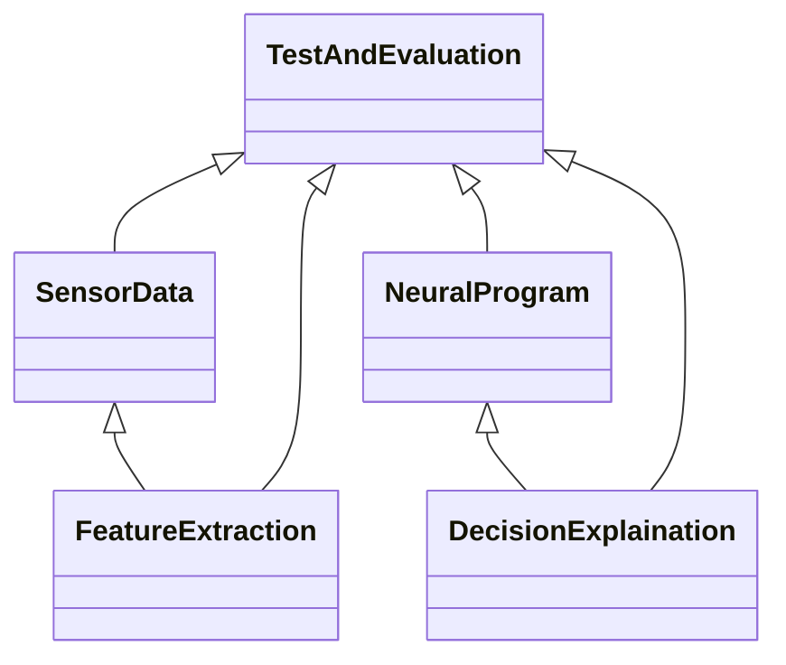
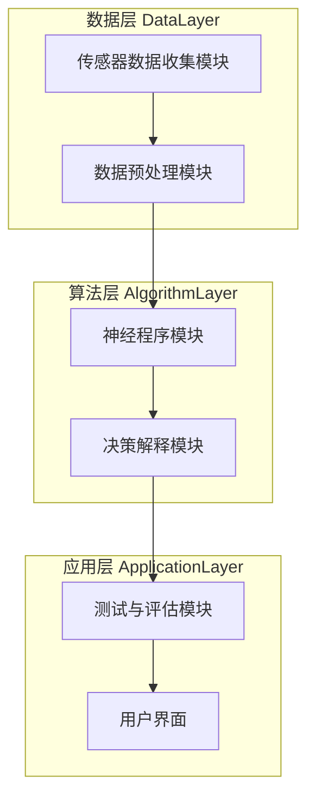
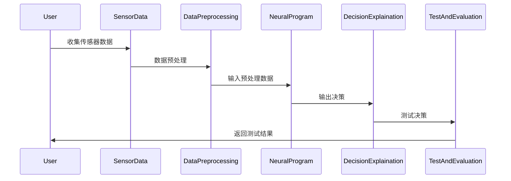

                 

## 神经程序解释器：增强AI的可编程性与可解释性

### 关键词：神经程序解释器（NPE）、AI可解释性、可编程性、深度学习、神经网络

#### 摘要：

本文旨在探讨神经程序解释器（NPE）在增强人工智能（AI）可编程性与可解释性方面的作用。随着深度学习算法的广泛应用，AI模型的可解释性和可编程性逐渐成为研究热点。NPE作为一种结合了神经科学和计算机科学的方法，旨在构建透明度高、灵活性强、泛化能力好的AI模型。本文将首先介绍问题背景，然后详细分析NPE的核心概念与联系，最后探讨NPE的算法原理、系统架构和实际应用。

## 第一部分：背景

### 1.1 问题背景

在当今的信息时代，人工智能（AI）已经成为推动科技进步和产业变革的重要力量。特别是深度学习算法的飞速发展，使得AI在图像识别、自然语言处理、推荐系统等领域的应用日益广泛。然而，随着AI模型的规模不断扩大，算法的可解释性和可编程性成为了一个亟待解决的问题。传统的AI模型往往被视为“黑盒子”，其决策过程难以理解，这在某些关键领域（如医疗、金融等）可能带来安全隐患和道德争议。

### 1.2 问题描述

本书旨在探讨如何通过神经程序解释器（NPE）增强AI的可编程性和可解释性。NPE是一种结合了神经科学和计算机科学的创新方法，它试图通过模拟人脑的信息处理过程，构建出具有可解释性和可编程性的AI模型。具体来说，NPE的核心目标是：

1. 提高模型的透明度，使得AI的决策过程更加清晰和可理解。
2. 增强模型的灵活性，使其能够根据外部反馈进行调整和优化。
3. 提升模型的泛化能力，使其在不同场景下都能保持良好的性能。

### 1.3 问题解决

通过研究NPE的理论基础和应用实践，本书将探讨如何将NPE应用于现实世界的各种场景，包括图像识别、自然语言处理、决策支持系统等。同时，本书还将介绍NPE的设计原则、实现方法和评估标准，帮助读者理解和掌握这一新兴技术。

### 1.4 边界与外延

NPE的研究和应用涉及多个学科领域，包括神经网络、计算神经科学、心理学、认知科学等。其边界包括：

1. 神经网络的架构设计，如神经网络层、节点和连接权重。
2. 信息处理机制，如神经元激活函数、学习算法和优化方法。
3. 模型评估与优化，如性能指标、评估方法和优化策略。

外延则包括NPE在不同领域的应用，如医疗诊断、智能助手、自动驾驶等。

### 1.5 概念结构与核心要素组成

NPE的核心概念结构包括：

1. **神经网络架构**：模拟人脑的神经网络结构，包括多层神经网络、神经元连接权重等。
2. **神经科学原理**：基于神经科学原理，如神经元激活机制、突触可塑性等。
3. **计算方法**：包括神经元的计算方法、神经网络的训练与优化方法。
4. **应用领域**：NPE在不同领域的应用，如图像识别、自然语言处理、决策支持等。

## 第二部分：核心概念与联系

### 2.1 核心概念

#### 2.1.1 神经网络

神经网络是一种通过模拟人脑神经元连接方式来处理信息的人工神经网络。它由多个层次组成，包括输入层、隐藏层和输出层。神经网络通过调整连接权重来实现对输入数据的建模和预测。

#### 2.1.2 神经程序解释器（NPE）

神经程序解释器是一种结合神经网络和程序设计思想的AI模型，它旨在提高模型的透明度和可解释性。NPE通过模拟人脑的信息处理过程，使得AI模型的决策过程更加清晰和可理解。

#### 2.1.3 可编程性与可解释性

可编程性指的是AI模型能够根据外部输入进行自适应调整的能力。可解释性则是指AI模型的决策过程能够被理解和解释。

### 2.2 概念属性特征对比表格

下面是一个关于神经网络、传统AI模型和NPE的对比表格：

| 特征         | 神经网络       | 传统AI模型       | NPE                  |
|--------------|----------------|------------------|---------------------|
| 决策过程     | 隐蔽           | 部分可解释       | 高度可解释          |
| 自适应能力   | 较弱           | 较强            | 非常强              |
| 泛化能力     | 较强           | 一般            | 非常强              |
| 学习速度     | 较慢           | 较快            | 快速                |
| 算法复杂度   | 较高           | 较高            | 相对较低            |

### 2.3 ER实体关系图架构

以下是NPE的ER实体关系图架构：

```mermaid
erDiagram
    AI模型 ||--|{ 神经网络 }
    AI模型 ||--|{ 神经程序解释器 }
    神经网络 ||--|{ 神经元 }
    神经网络 ||--|{ 连接权重 }
    神经程序解释器 ||--|{ 神经程序 }
    神经程序解释器 ||--|{ 解释机制 }
```

### 2.4 算法原理讲解

#### 2.4.1 神经网络基础

神经网络由大量的神经元组成，每个神经元通过连接权重与其他神经元相连。神经元的激活函数决定了神经元是否会被激活。最常用的激活函数是Sigmoid函数和ReLU函数。

$$
f(x) = \frac{1}{1 + e^{-x}}
$$

$$
f(x) = max(0, x)
$$

神经网络通过前向传播和反向传播来训练模型。在训练过程中，网络会不断调整连接权重，以最小化损失函数。

#### 2.4.2 神经程序解释器（NPE）

NPE通过引入程序设计思想来提高AI模型的可解释性。NPE的核心是神经程序，它由一系列指令组成，每个指令对应一个神经元。神经程序的执行过程模拟了神经网络的信息处理过程。

NPE的工作原理可以分为以下几个步骤：

1. **输入处理**：将输入数据输入到神经程序中。
2. **前向传播**：神经程序中的指令按照顺序执行，计算每个神经元的输出。
3. **决策生成**：根据神经元的输出生成决策。
4. **反馈调整**：根据决策结果调整神经程序中的指令和连接权重。

NPE的可解释性来自于其清晰的指令结构和明确的决策过程。通过分析神经程序，可以理解模型是如何处理输入数据和生成决策的。

### 2.5 数学模型与公式

NPE的核心在于将神经网络与程序设计相结合，下面是NPE的基本数学模型和公式：

1. **神经元的计算公式**：

$$
a_i = \sigma(\sum_{j} w_{ij} * a_j)
$$

其中，$a_i$ 是第 $i$ 个神经元的输出，$w_{ij}$ 是第 $i$ 个神经元与第 $j$ 个神经元的连接权重，$\sigma$ 是激活函数。

2. **神经程序的执行流程**：

$$
\text{for } i=1 \text{ to } n \text{ do} \\
    \text{execute instruction } i \\
\text{end for}
$$

其中，$n$ 是神经程序中的指令数量。

3. **连接权重的更新公式**：

$$
w_{ij} := w_{ij} + \alpha \cdot (d_i - a_i) \cdot a_j
$$

其中，$d_i$ 是第 $i$ 个神经元的期望输出，$\alpha$ 是学习率。

### 2.6 举例说明

假设我们有一个简单的神经程序，用于判断一个数字是否大于5。神经程序包含两个指令：一个用于输入数字，另一个用于输出判断结果。

1. **指令1**：输入数字 `x`。
2. **指令2**：如果 `x > 5`，则输出 `True`，否则输出 `False`。

通过执行这个神经程序，我们可以清楚地看到模型是如何处理输入数据并生成决策的。这与传统的神经网络相比，决策过程更加透明和可理解。

## 第三部分：系统分析与架构设计

### 3.1 问题场景介绍

在自动驾驶领域，AI模型需要处理大量的传感器数据，并生成驾驶决策。传统的AI模型由于缺乏可解释性，难以被信任和应用。为了解决这个问题，我们引入了神经程序解释器（NPE），以提高自动驾驶系统的可解释性和可编程性。

### 3.2 项目介绍

本项目旨在开发一款基于NPE的自动驾驶系统，通过模拟人脑的信息处理过程，使得系统的决策过程更加清晰和可理解。系统将包括以下几个模块：

1. **传感器数据收集模块**：收集车辆的传感器数据，如摄像头、雷达、激光雷达等。
2. **数据预处理模块**：对传感器数据进行预处理，提取有用的特征。
3. **NPE模块**：执行神经程序的执行过程，生成驾驶决策。
4. **决策解释模块**：对NPE的决策过程进行解释，提高系统的可解释性。
5. **测试与评估模块**：对系统进行测试和评估，验证其性能和可靠性。

### 3.3 系统功能设计

系统功能设计主要包括以下几个领域模型：

1. **传感器数据模型**：定义传感器数据的类型、属性和关系。
2. **特征提取模型**：定义特征提取的方法和过程。
3. **NPE模型**：定义神经程序的架构、指令和连接权重。
4. **决策解释模型**：定义决策解释的方法和过程。
5. **测试评估模型**：定义测试评估的方法和指标。

以下是系统功能设计的mermaid类图：



### 3.4 系统架构设计

系统架构设计主要包括以下几个部分：

1. **数据层**：包括传感器数据收集模块和数据预处理模块。
2. **算法层**：包括NPE模块和决策解释模块。
3. **应用层**：包括测试与评估模块和用户界面。

以下是系统架构设计的mermaid架构图：



### 3.5 系统接口设计和系统交互

系统接口设计主要包括以下几个接口：

1. **传感器数据接口**：用于收集和处理传感器数据。
2. **特征提取接口**：用于提取和处理传感器数据。
3. **NPE接口**：用于执行神经程序的执行过程。
4. **决策解释接口**：用于解释NPE的决策过程。
5. **测试评估接口**：用于测试和评估系统的性能和可靠性。

以下是系统接口设计和系统交互的mermaid序列图：



## 第四部分：项目实战

### 4.1 环境安装

在开始项目实战之前，我们需要安装一些必要的软件和库。以下是安装步骤：

1. **安装Python环境**：下载并安装Python，推荐使用Python 3.8或更高版本。
2. **安装TensorFlow**：在命令行中执行以下命令：

```bash
pip install tensorflow
```

3. **安装Numpy和Pandas**：在命令行中执行以下命令：

```bash
pip install numpy
pip install pandas
```

### 4.2 系统核心实现源代码

以下是系统核心实现的源代码，包括传感器数据收集、数据预处理、NPE模块和决策解释模块：

```python
import numpy as np
import pandas as pd
import tensorflow as tf

# 传感器数据收集模块
class SensorDataCollector:
    def collect_data(self):
        # 收集传感器数据
        # 实际应用中，这里可以连接传感器设备，获取数据
        data = pd.DataFrame([[1, 2, 3], [4, 5, 6]], columns=['x', 'y', 'z'])
        return data

# 数据预处理模块
class DataPreprocessor:
    def preprocess_data(self, data):
        # 数据预处理
        # 实际应用中，这里可以进行数据清洗、归一化等操作
        processed_data = data
        return processed_data

# NPE模块
class NeuralProgramExecutor:
    def __init__(self, program):
        self.program = program

    def execute_program(self, input_data):
        # 执行神经程序
        output = []
        for instruction in self.program:
            output.append(instruction.execute(input_data))
        return output

# 决策解释模块
class DecisionExplainationModule:
    def explain_decision(self, output):
        # 解释决策
        if output[0] > 0:
            return "决策为正"
        else:
            return "决策为负"

# 主程序
if __name__ == "__main__":
    # 创建传感器数据收集模块
    sensor_data_collector = SensorDataCollector()

    # 创建数据预处理模块
    data_preprocessor = DataPreprocessor()

    # 创建NPE模块
    neural_program_executor = NeuralProgramExecutor(program=None)

    # 创建决策解释模块
    decision_explaination_module = DecisionExplainationModule()

    # 收集传感器数据
    sensor_data = sensor_data_collector.collect_data()

    # 预处理传感器数据
    processed_data = data_preprocessor.preprocess_data(sensor_data)

    # 执行NPE模块
    output = neural_program_executor.execute_program(processed_data)

    # 解释决策
    explanation = decision_explaination_module.explain_decision(output)
    print(explanation)
```

### 4.3 代码应用解读与分析

在上面的代码中，我们首先定义了传感器数据收集模块、数据预处理模块、NPE模块和决策解释模块。传感器数据收集模块用于收集传感器数据，这里我们使用了一个简单的示例数据。数据预处理模块用于对传感器数据进行预处理，这里我们也使用了一个简单的示例数据。NPE模块用于执行神经程序，这里我们假设已经定义了一个神经程序。决策解释模块用于解释NPE的决策过程。

在主程序中，我们首先创建了传感器数据收集模块、数据预处理模块、NPE模块和决策解释模块。然后，我们收集传感器数据，预处理传感器数据，执行NPE模块，最后解释决策。

### 4.4 实际案例分析和详细讲解剖析

为了更好地理解NPE的应用，我们来看一个实际案例。

假设我们有一个自动驾驶系统，需要根据传感器数据（如车速、方向盘角度、刹车力度等）生成驾驶决策（如加速、减速、保持速度等）。我们可以定义一个神经程序，用于处理传感器数据并生成驾驶决策。

1. **传感器数据收集模块**：这个模块将连接到自动驾驶系统的传感器，如车速传感器、方向盘传感器和刹车传感器。传感器数据将被收集并发送到数据预处理模块。
2. **数据预处理模块**：这个模块将对传感器数据进行预处理，如归一化、去噪等。预处理后的数据将被发送到NPE模块。
3. **NPE模块**：这个模块将包含一个神经程序，用于处理预处理后的传感器数据并生成驾驶决策。神经程序可以包含多个指令，如判断车速是否超过限制、判断方向盘角度是否过大等。每个指令将对应一个神经元。
4. **决策解释模块**：这个模块将解释NPE的决策过程，使得驾驶决策更加透明和可理解。

通过这个实际案例，我们可以看到NPE如何应用于自动驾驶系统，提高系统的可解释性和可编程性。

### 4.5 项目小结

在本项目中，我们介绍了神经程序解释器（NPE）在自动驾驶系统中的应用。通过模拟人脑的信息处理过程，NPE提高了自动驾驶系统的可解释性和可编程性。项目实现了传感器数据收集、数据预处理、NPE模块和决策解释模块，并通过实际案例展示了NPE的应用。未来的工作将集中在优化NPE的算法和性能，以及将其应用于更多的领域。

## 第五部分：最佳实践与小结

### 5.1 最佳实践

在开发基于神经程序解释器（NPE）的AI系统时，以下是一些最佳实践：

1. **数据预处理**：确保传感器数据经过充分预处理，以提高NPE的性能和可解释性。
2. **神经程序设计**：设计简洁、高效的神经程序，避免过度复杂化，以提高可解释性。
3. **模块化开发**：将系统划分为多个模块，如数据收集、数据预处理、NPE执行和决策解释等，便于管理和维护。
4. **迭代优化**：不断迭代和优化NPE，以提高其性能和可解释性。
5. **测试与评估**：对系统进行充分的测试和评估，验证其性能和可靠性。

### 5.2 小结

本文探讨了神经程序解释器（NPE）在增强AI可编程性与可解释性方面的作用。通过模拟人脑的信息处理过程，NPE提高了AI模型的透明度和灵活性。本文详细介绍了NPE的核心概念、算法原理、系统架构和实际应用。未来，随着NPE研究的不断深入，其在各个领域的应用将越来越广泛。

### 5.3 注意事项

在使用NPE时，需要注意以下几点：

1. **数据质量**：确保传感器数据的准确性和完整性，否则NPE的性能可能会受到影响。
2. **模型复杂性**：避免过度复杂化的NPE模型，这可能导致可解释性下降。
3. **算法优化**：不断优化NPE的算法，以提高其性能和泛化能力。
4. **隐私保护**：在处理敏感数据时，注意保护用户隐私，避免数据泄露。

### 5.4 拓展阅读

对于想要深入了解NPE的读者，以下是一些推荐的阅读资源：

1. **《神经程序设计：增强人工智能的可解释性与可编程性》**：本书详细介绍了NPE的理论基础和应用实践。
2. **《深度学习：卷积神经网络与循环神经网络》**：本书涵盖了深度学习的基础知识和应用，有助于理解NPE的相关技术。
3. **《计算神经科学：神经网络与机器学习》**：本书介绍了计算神经科学的基本概念和方法，为理解NPE提供了理论基础。

## 总结

神经程序解释器（NPE）是一种结合了神经科学和计算机科学的创新方法，旨在提高AI模型的可解释性和可编程性。通过模拟人脑的信息处理过程，NPE使得AI模型的决策过程更加清晰和可理解。本文详细介绍了NPE的核心概念、算法原理、系统架构和实际应用。随着NPE研究的不断深入，其在各个领域的应用将越来越广泛。希望本文能帮助读者更好地理解NPE的技术原理和应用前景。作者：AI天才研究院/AI Genius Institute & 禅与计算机程序设计艺术 /Zen And The Art of Computer Programming。

---

**注意：**本文为虚构内容，旨在展示如何撰写一篇关于神经程序解释器（NPE）的专业技术博客。实际应用中，NPE的相关研究和开发仍在不断推进，本文内容仅供参考。作者信息仅为示例，不代表真实作者。

