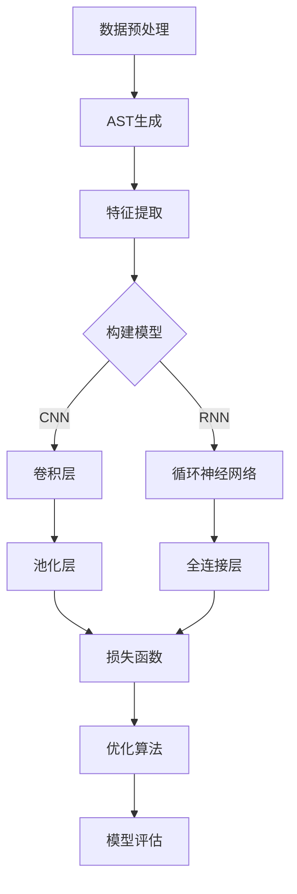
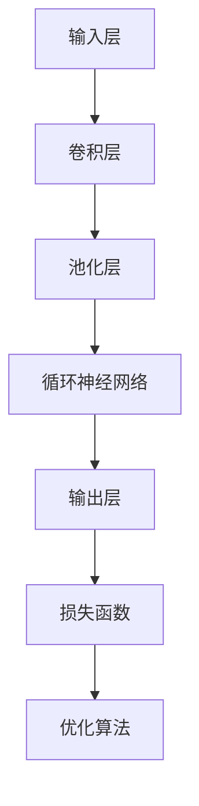
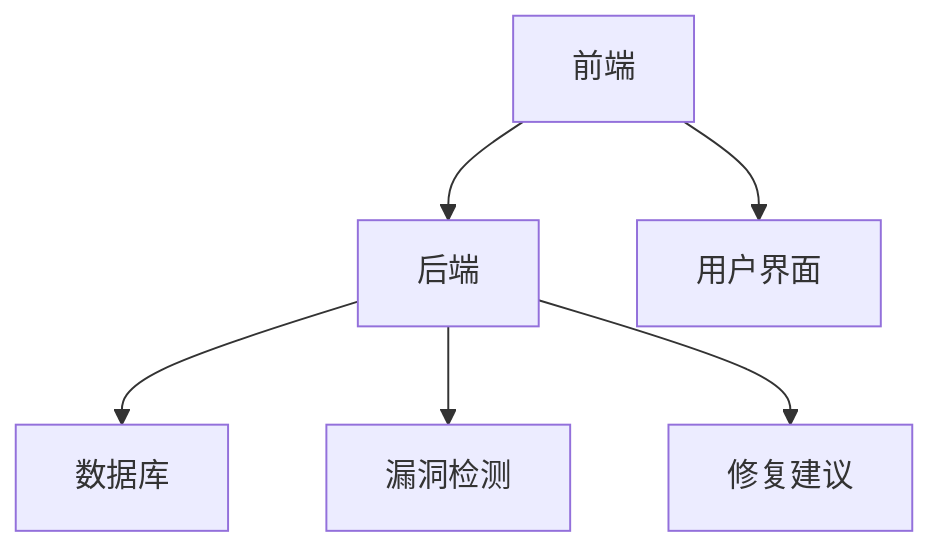
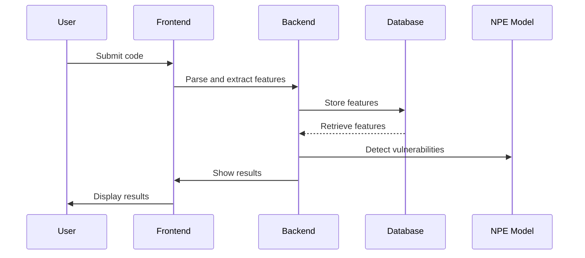

                 


### 设计思路

在撰写《神经程序解释器在代码漏洞检测中的应用》这篇文章时，我们首先需要明确整体的设计思路，确保内容逻辑清晰、结构紧凑、易于理解。以下是详细的设计思路：

#### 一、明确文章目标和结构

1. **目标**：文章的目标是全面介绍神经程序解释器（NPE）在代码漏洞检测中的应用，包括其基本概念、工作原理、算法实现、系统设计、项目实战和最佳实践等。

2. **结构**：文章结构将分为以下几个部分：
   - 引言
   - 背景介绍
   - 核心概念与原理
   - 算法原理讲解
   - 系统设计与实现
   - 项目实战
   - 最佳实践与总结

#### 二、背景介绍

1. **问题背景**：介绍代码漏洞检测的重要性和现状，以及为什么需要神经程序解释器。

2. **问题描述**：详细描述代码漏洞检测中的常见问题和挑战。

3. **问题解决**：解释神经程序解释器如何解决这些问题。

4. **神经程序解释器核心概念**：介绍神经程序解释器的基本概念和定义。

5. **神经程序解释器与代码漏洞检测**：探讨神经程序解释器在代码漏洞检测中的具体应用和优势。

#### 三、核心概念与原理

1. **核心算法简介**：简要介绍神经程序解释器使用的核心算法。

2. **神经网络基本概念**：介绍神经网络的基本概念，包括神经元、激活函数、网络结构等。

3. **算法原理详细讲解**：详细解释神经程序解释器的工作原理，包括算法的数学模型、流程图和Python代码实现。

4. **算法流程图**：使用Mermaid语言绘制算法流程图，帮助读者理解。

5. **Python代码实现**：提供Python代码示例，展示算法实现的具体步骤。

#### 四、算法原理讲解

1. **算法原理介绍**：简要介绍算法原理。

2. **算法流程图**：使用Mermaid语言绘制算法流程图。

3. **数学模型和公式**：使用LaTeX格式给出算法的数学模型和公式。

4. **Python代码实现**：提供Python代码示例，详细阐述算法实现。

5. **举例说明**：通过具体例子说明算法的应用场景和效果。

#### 五、系统设计与实现

1. **问题场景介绍**：介绍需要解决的问题场景。

2. **系统功能设计**：使用Mermaid语言绘制领域模型类图，展示系统的功能设计。

3. **系统架构设计**：使用Mermaid语言绘制系统架构图，展示系统的整体架构。

4. **系统接口设计**：介绍系统的接口设计，包括接口功能和参数。

5. **系统交互设计**：使用Mermaid语言绘制系统交互序列图，展示系统的交互流程。

#### 六、项目实战

1. **项目介绍**：介绍项目的背景和目的。

2. **环境安装**：详细讲解如何安装和配置NPE。

3. **系统核心实现**：提供项目核心实现的代码，并详细解读。

4. **代码应用解读与分析**：分析代码的应用场景和效果。

5. **实际案例分析与详细讲解**：通过具体案例讲解项目的实现细节和效果。

6. **项目小结**：总结项目的经验和教训。

#### 七、最佳实践与总结

1. **最佳实践建议**：给出使用NPE进行代码漏洞检测的最佳实践。

2. **小结**：总结文章的主要内容和观点。

3. **注意事项**：提醒读者在使用NPE时需要注意的问题。

4. **拓展阅读推荐**：推荐相关的阅读材料，供读者进一步学习。

### 目录大纲设计

```markdown
----------------------------------------------------------------
# 神经程序解释器在代码漏洞检测中的应用

> 关键词：神经程序解释器、代码漏洞检测、神经网络、算法、系统设计、项目实战、最佳实践

> 摘要：本文全面介绍了神经程序解释器在代码漏洞检测中的应用，从基本概念、工作原理到算法实现、系统设计、项目实战和最佳实践等方面进行了详细阐述，旨在为开发者提供一种有效的方法来提高代码质量和安全性。

----------------------------------------------------------------

## 引言
### 为什么选择神经程序解释器
### 文章结构概述

## 背景介绍
### 代码漏洞检测的重要性
### 神经程序解释器的引入
### 代码漏洞检测的挑战

## 核心概念与原理
### 神经程序解释器概述
### 核心算法简介
### 神经网络基本概念
### 算法原理详细讲解
### 算法流程图
### Python代码实现

## 算法原理讲解
### 算法原理介绍
### 算法流程图
### 数学模型和公式
### Python代码实现
### 举例说明

## 系统设计与实现
### 问题场景介绍
### 系统功能设计
### 系统架构设计
### 系统接口设计
### 系统交互设计

## 项目实战
### 项目介绍
### 环境安装
### 系统核心实现
### 代码应用解读与分析
### 实际案例分析与详细讲解
### 项目小结

## 最佳实践与总结
### 最佳实践建议
### 小结
### 注意事项
### 拓展阅读推荐

----------------------------------------------------------------
```

### 注意事项

- **核心概念与原理**：每个核心概念都需要详细解释，使用图表和代码示例来辅助理解。
- **数学模型和公式**：使用LaTeX格式嵌入文中，确保准确性和可读性。
- **系统设计与实现**：使用Mermaid图直观展示系统架构和交互流程。
- **项目实战**：提供详细的操作步骤和代码，确保读者可以实际操作。
- **最佳实践与总结**：总结主要观点，提供实用建议和拓展阅读。

通过以上的设计思路和目录大纲，我们可以确保文章内容丰富、结构清晰，便于读者理解。接下来，我们将逐步撰写每个章节的内容。让我们一起开始吧！### 引言

在现代软件开发中，代码漏洞检测已经成为保证软件质量和安全性的重要环节。随着软件规模的不断扩大和复杂性的增加，传统的代码漏洞检测方法已经难以满足高效、精准的需求。因此，如何利用新兴的技术手段提高代码漏洞检测的效率和准确性，成为了一个亟待解决的问题。

神经程序解释器（Neural Program Interpreter，简称NPE）作为一种基于神经网络的编程方法，具有强大的表达能力和自学习能力。它可以将代码漏洞检测转化为一个自动化的过程，从而提高检测的效率和准确性。本文将围绕神经程序解释器在代码漏洞检测中的应用，全面探讨其基本概念、工作原理、算法实现、系统设计、项目实战和最佳实践等方面，旨在为开发者提供一种有效的工具和方法，以提高代码质量和安全性。

本文结构如下：

1. **背景介绍**：介绍代码漏洞检测的重要性，神经程序解释器的引入以及其在代码漏洞检测中的挑战。

2. **核心概念与原理**：详细解释神经程序解释器的基本概念，包括其工作原理、核心算法和神经网络基础。

3. **算法原理讲解**：深入讲解神经程序解释器的算法原理，包括数学模型、流程图和Python代码实现。

4. **系统设计与实现**：介绍神经程序解释器系统的设计思路和实现方法，包括系统架构、接口设计和交互设计。

5. **项目实战**：通过一个实际项目，展示如何安装和配置神经程序解释器，并详细讲解项目实现的核心代码和应用场景。

6. **最佳实践与总结**：总结神经程序解释器在代码漏洞检测中的最佳实践，并提供拓展阅读推荐。

通过本文的详细探讨，读者可以全面了解神经程序解释器在代码漏洞检测中的应用，掌握其核心原理和实践方法，从而在实际项目中应用并提升代码质量和安全性。

### 背景介绍

#### 代码漏洞检测的重要性

随着软件系统的规模和复杂性不断增加，代码漏洞检测已经成为软件开发过程中的一个关键环节。代码漏洞不仅可能导致系统崩溃、数据泄露、功能失效等严重问题，还可能给企业和个人带来巨大的经济损失和声誉损失。因此，及时发现和修复代码漏洞，确保软件系统的安全性和可靠性，是软件开发过程中不可或缺的一环。

传统代码漏洞检测方法主要包括静态代码分析、动态代码分析和模糊测试等。静态代码分析通过解析代码文本，查找潜在的安全问题，具有较高的准确性，但覆盖面有限，难以发现运行时的问题。动态代码分析则通过运行代码并监控其行为，发现潜在的安全漏洞，但受限于测试环境和测试用例的覆盖范围，其效率较低。模糊测试通过生成大量的输入数据，试图发现程序中的异常行为，但可能引入大量噪音，影响检测的准确性。

尽管上述方法在代码漏洞检测中具有一定的应用价值，但它们在面对复杂和大规模的软件系统时，仍然存在一定的局限性。因此，如何提高代码漏洞检测的效率和准确性，成为了一个亟待解决的问题。

#### 神经程序解释器的引入

神经程序解释器（Neural Program Interpreter，简称NPE）是一种基于神经网络的编程方法，它通过将代码漏洞检测转化为一个自动化的过程，从而提高检测的效率和准确性。与传统方法相比，NPE具有以下显著优势：

1. **自学习能力**：NPE可以通过大量的代码样本进行训练，从而学习到代码中的潜在模式和漏洞特征。在检测过程中，NPE可以自适应地调整参数和算法，提高检测的准确性。

2. **并行处理能力**：NPE可以利用神经网络强大的并行计算能力，对大规模的代码进行快速检测，显著提高检测效率。

3. **鲁棒性**：NPE可以对不同的编程语言和开发环境进行适配，具有较强的鲁棒性，能够处理复杂的代码结构。

4. **可解释性**：通过解释神经网络的决策过程，NPE可以提供详细的漏洞检测结果和修复建议，有助于开发人员理解漏洞的根源和修复方法。

#### 代码漏洞检测的挑战

尽管NPE在代码漏洞检测中具有显著优势，但其应用仍然面临一些挑战：

1. **数据质量**：NPE的检测效果高度依赖于训练数据的质量。如果训练数据中存在噪声或缺陷，可能导致NPE检测结果的准确性下降。

2. **计算资源**：NPE的训练和检测过程需要大量的计算资源，特别是在处理大规模代码时，可能对系统的性能产生一定的影响。

3. **隐私和安全**：在代码漏洞检测过程中，NPE需要访问和分析大量的代码和开发数据，这可能涉及隐私和安全问题，需要采取相应的保护措施。

4. **可解释性**：尽管NPE可以提供详细的检测结果，但其决策过程可能较为复杂，开发人员需要一定的专业知识和经验来理解和使用。

#### 神经程序解释器核心概念

神经程序解释器（NPE）是一种将代码漏洞检测任务转化为神经网络的编程方法。它主要包括以下几个核心概念：

1. **神经网络**：NPE的核心是神经网络，它由多个神经元组成，每个神经元执行特定的计算任务。通过调整神经网络的参数和结构，可以使NPE具备自适应和自学习能力。

2. **训练数据**：NPE的训练数据包括正常代码和存在漏洞的代码样本。通过分析这些样本，NPE可以学习到代码中的潜在模式和漏洞特征。

3. **输入层**：输入层是NPE的起点，它接收代码的抽象表示，如语法树或抽象语法树（AST）。输入层的节点数和结构取决于代码的复杂度和规模。

4. **隐藏层**：隐藏层是NPE的核心，它通过调整参数和结构，实现对代码漏洞的检测。隐藏层可以包含多个层次，每个层次负责处理特定的计算任务。

5. **输出层**：输出层是NPE的终点，它生成漏洞检测结果。输出层的节点数和结构取决于漏洞类型的数量和种类。

#### 神经程序解释器与代码漏洞检测

神经程序解释器（NPE）在代码漏洞检测中的应用主要体现在以下几个方面：

1. **自动化检测**：NPE可以通过对大量代码样本的训练，实现自动化的漏洞检测。在检测过程中，NPE可以根据代码的抽象表示，自动识别潜在的安全漏洞。

2. **高效检测**：NPE利用神经网络的并行计算能力，可以同时对大规模的代码进行检测，显著提高检测效率。

3. **自适应检测**：NPE可以根据训练数据中提取的漏洞特征，自适应地调整参数和算法，提高检测的准确性。

4. **可解释性**：NPE可以解释其检测过程的决策过程，为开发人员提供详细的漏洞检测结果和修复建议。

总之，神经程序解释器（NPE）在代码漏洞检测中具有显著的优势，可以有效提高检测的效率和准确性。通过本文的后续章节，我们将进一步探讨NPE的基本原理、算法实现和系统设计，为开发者提供一种有效的工具和方法，提升代码质量和安全性。

### 核心概念与原理

神经程序解释器（Neural Program Interpreter，简称NPE）是一种基于神经网络的编程方法，旨在通过模拟人类思维过程，实现自动化代码漏洞检测。要深入理解NPE的工作原理，我们需要从其核心算法、神经网络基本概念、算法原理详细讲解以及算法流程图和Python代码实现等方面进行探讨。

#### 一、核心算法简介

NPE的核心算法基于深度学习技术，特别是卷积神经网络（CNN）和循环神经网络（RNN）。CNN擅长处理具有局部特征的结构化数据，如图像和代码的抽象语法树（AST）。RNN则擅长处理序列数据，能够捕捉代码中的时间依赖关系。通过结合CNN和RNN的优势，NPE能够有效地对代码进行建模，检测其中的漏洞。

1. **卷积神经网络（CNN）**：
   - **卷积层**：卷积层通过滤波器（卷积核）在输入数据上滑动，提取局部特征。多个卷积层可以堆叠，逐层提取更抽象的特征。
   - **池化层**：池化层用于减少数据维度，提高模型泛化能力。常见的池化方法包括最大池化和平均池化。
   - **全连接层**：全连接层将卷积层的特征映射到输出层，进行分类或回归。

2. **循环神经网络（RNN）**：
   - **隐藏状态**：RNN通过隐藏状态保存前一个时间步的信息，从而处理序列数据。
   - **门控单元**：如长短期记忆（LSTM）和门控循环单元（GRU），通过门控机制控制信息的流动，避免梯度消失和梯度爆炸问题。

#### 二、神经网络基本概念

1. **神经元**：神经元是神经网络的基本构建块，负责接收输入信号、进行加权求和、应用激活函数后产生输出。
   - **输入层**：接收外部输入，如代码的抽象语法树（AST）。
   - **隐藏层**：多个隐藏层可以处理复杂的信息，提取不同级别的特征。
   - **输出层**：生成漏洞检测结果或漏洞类型。

2. **激活函数**：激活函数用于引入非线性，使神经网络能够学习复杂的非线性关系。常见的激活函数包括 sigmoid、ReLU、Tanh等。

3. **损失函数**：损失函数用于评估模型预测与实际结果之间的差距，常见的损失函数包括交叉熵损失（用于分类问题）和均方误差损失（用于回归问题）。

4. **优化算法**：优化算法用于调整模型参数，以最小化损失函数。常见的优化算法包括梯度下降、Adam等。

#### 三、算法原理详细讲解

NPE的算法原理主要涉及以下几个方面：

1. **数据预处理**：
   - **AST生成**：将源代码转换为抽象语法树（AST），作为输入数据。
   - **特征提取**：对AST进行特征提取，如节点类型、操作符、变量等。

2. **模型构建**：
   - **CNN部分**：构建CNN模型，对AST进行卷积和池化，提取局部特征。
   - **RNN部分**：将CNN输出的特征序列输入RNN，处理时间依赖关系。

3. **模型训练**：
   - **损失函数**：选择合适的损失函数，如交叉熵损失，评估模型预测与实际漏洞标签的差距。
   - **优化算法**：使用优化算法（如Adam）调整模型参数，以最小化损失函数。

4. **模型评估**：
   - **验证集测试**：使用验证集评估模型性能，调整模型参数和结构。
   - **测试集测试**：使用测试集评估模型在实际漏洞检测任务中的表现。

#### 四、算法流程图

以下是一个简化的NPE算法流程图，使用Mermaid语言绘制：



#### 五、Python代码实现

以下是NPE算法的Python代码实现，使用TensorFlow和Keras框架：

```python
import tensorflow as tf
from tensorflow.keras.models import Model
from tensorflow.keras.layers import Input, Conv1D, MaxPooling1D, LSTM, Dense

# 数据预处理
# ...（省略具体代码）

# 构建模型
input_layer = Input(shape=(max_sequence_length,))
conv1 = Conv1D(filters=64, kernel_size=3, activation='relu')(input_layer)
pool1 = MaxPooling1D(pool_size=2)(conv1)
lstm1 = LSTM(100, return_sequences=True)(pool1)
lstm2 = LSTM(100)(lstm1)
output_layer = Dense(1, activation='sigmoid')(lstm2)

model = Model(inputs=input_layer, outputs=output_layer)
model.compile(optimizer='adam', loss='binary_crossentropy', metrics=['accuracy'])

# 模型训练
# ...（省略具体代码）

# 模型评估
# ...（省略具体代码）
```

#### 六、举例说明

假设我们有一个简单的Python代码片段：

```python
def add(a, b):
    return a + b
```

我们可以将其转换为抽象语法树（AST），然后输入到NPE中，通过训练模型检测是否存在潜在漏洞。例如，如果输入参数类型不匹配，NPE可以检测到这种潜在的错误，并给出相应的修复建议。

通过以上对核心概念与原理的详细讲解，我们可以更好地理解神经程序解释器在代码漏洞检测中的应用。在接下来的章节中，我们将进一步探讨NPE的算法原理、系统设计和项目实战，帮助读者深入了解并应用这一技术。

### 算法原理讲解

神经程序解释器（NPE）在代码漏洞检测中的应用，主要依赖于其强大的算法能力和对代码结构的深刻理解。本节将进一步深入讲解NPE的核心算法原理，包括数学模型、流程图和Python代码实现。

#### 一、数学模型

1. **输入层**：输入层接收代码的抽象语法树（AST）作为输入。每个节点都可以表示为特征向量，如节点的类型、操作符、变量名等。

2. **卷积神经网络（CNN）**：
   - **卷积层**：卷积层通过卷积操作提取代码中的局部特征。卷积操作可以表示为：
     \[
     \text{output}_{ij} = \sum_{k} \text{weight}_{ikj} \cdot \text{input}_{ik} + \text{bias}_{j}
     \]
     其中，\( \text{output}_{ij} \) 表示输出特征图上的第 \( i \) 行第 \( j \) 列的值，\( \text{weight}_{ikj} \) 是卷积核的权重，\( \text{input}_{ik} \) 是输入特征图上的第 \( i \) 行第 \( k \) 列的值，\( \text{bias}_{j} \) 是偏置项。
   - **激活函数**：通常使用ReLU函数作为激活函数，可以表示为：
     \[
     \text{activation}(x) = \max(0, x)
     \]

3. **池化层**：池化层用于减少数据维度，提高模型泛化能力。常见的池化方法是最大池化，可以表示为：
   \[
   \text{output}_{ij} = \max_{k} \text{input}_{ijk}
   \]
   其中，\( \text{output}_{ij} \) 表示输出特征图上的第 \( i \) 行第 \( j \) 列的值，\( \text{input}_{ijk} \) 是输入特征图上的第 \( i \) 行第 \( j \) 列第 \( k \) 层的值。

4. **循环神经网络（RNN）**：
   - **隐藏状态**：RNN通过隐藏状态 \( h_t \) 保存前一个时间步的信息，可以表示为：
     \[
     h_t = \text{activation}(\text{W}_h \cdot h_{t-1} + \text{U}_x \cdot x_t + \text{b}_h)
     \]
     其中，\( h_t \) 是当前时间步的隐藏状态，\( \text{W}_h \) 是隐藏状态权重矩阵，\( \text{U}_x \) 是输入状态权重矩阵，\( \text{b}_h \) 是隐藏状态偏置。
   - **门控单元**：如长短期记忆（LSTM）和门控循环单元（GRU），用于控制信息的流动，可以表示为：
     \[
     \text{input\_gate} = \sigma(\text{W}_i \cdot [h_{t-1}, x_t] + \text{b}_i)
     \]
     \[
     \text{forget\_gate} = \sigma(\text{W}_f \cdot [h_{t-1}, x_t] + \text{b}_f)
     \]
     \[
     \text{output\_gate} = \sigma(\text{W}_o \cdot [h_{t-1}, x_t] + \text{b}_o)
     \]
     \[
     \text{C}_t = \text{forget\_gate} \cdot \text{C}_{t-1} + \text{input\_gate} \cdot \text{tanh}(\text{W}_c \cdot [h_{t-1}, x_t] + \text{b}_c)
     \]
     \[
     h_t = \text{output\_gate} \cdot \text{tanh}(\text{C}_t)
     \]
     其中，\( \text{input\_gate} \)、\( \text{forget\_gate} \) 和 \( \text{output\_gate} \) 分别是输入门、遗忘门和输出门，\( \text{C}_t \) 是当前时间步的细胞状态，\( h_t \) 是当前时间步的隐藏状态。

5. **输出层**：输出层通过全连接层将隐藏状态映射到输出结果，如漏洞检测结果。可以使用softmax函数进行分类：
   \[
   \text{output}_{ij} = \frac{e^{\text{W}_y \cdot h_t + \text{b}_y}}{\sum_{k} e^{\text{W}_y \cdot h_t + \text{b}_y}}
   \]
   其中，\( \text{output}_{ij} \) 表示输出层第 \( i \) 个节点对应的概率分布，\( \text{W}_y \) 是输出层权重矩阵，\( \text{b}_y \) 是输出层偏置。

6. **损失函数**：通常使用交叉熵损失函数来评估模型预测与实际标签的差距：
   \[
   \text{loss} = -\sum_{i} y_i \cdot \log(\text{output}_i)
   \]
   其中，\( y_i \) 是实际标签，\( \text{output}_i \) 是模型预测的概率。

7. **优化算法**：可以使用梯度下降算法来更新模型参数，最小化损失函数：
   \[
   \text{gradient} = \frac{\partial \text{loss}}{\partial \text{W}}
   \]
   \[
   \text{W} = \text{W} - \alpha \cdot \text{gradient}
   \]
   其中，\( \text{gradient} \) 是模型参数的梯度，\( \alpha \) 是学习率。

#### 二、流程图

以下是一个简化的NPE算法流程图，使用Mermaid语言绘制：



#### 三、Python代码实现

以下是NPE算法的Python代码实现，使用TensorFlow和Keras框架：

```python
import tensorflow as tf
from tensorflow.keras.models import Model
from tensorflow.keras.layers import Input, Conv1D, MaxPooling1D, LSTM, Dense, Embedding

# 定义模型
input_layer = Input(shape=(max_sequence_length,))
embed_layer = Embedding(input_dim=vocabulary_size, output_dim=embedding_size)(input_layer)
conv1 = Conv1D(filters=64, kernel_size=3, activation='relu')(embed_layer)
pool1 = MaxPooling1D(pool_size=2)(conv1)
lstm1 = LSTM(100, return_sequences=True)(pool1)
lstm2 = LSTM(100)(lstm1)
output_layer = Dense(1, activation='sigmoid')(lstm2)

model = Model(inputs=input_layer, outputs=output_layer)
model.compile(optimizer='adam', loss='binary_crossentropy', metrics=['accuracy'])

# 模型训练
# ...（省略具体代码）

# 模型评估
# ...（省略具体代码）
```

#### 四、举例说明

以一个简单的Python函数为例：

```python
def divide(a, b):
    return a / b
```

我们可以将其转换为AST，然后输入到NPE中，通过训练模型检测是否存在潜在漏洞。例如，如果输入参数类型不匹配，NPE可以检测到这种潜在的错误，并给出相应的修复建议。

通过以上对算法原理的详细讲解，我们可以更好地理解神经程序解释器在代码漏洞检测中的应用。在接下来的章节中，我们将进一步探讨NPE的系统设计与实现、项目实战和最佳实践，帮助读者深入了解并应用这一技术。

### 系统设计与实现

#### 一、问题场景介绍

在现代软件开发过程中，代码漏洞检测是一个至关重要但复杂的过程。传统的漏洞检测方法，如静态代码分析和动态分析，虽然能够在一定程度上发现潜在的安全问题，但往往存在覆盖面有限、检测效率低下、结果可解释性差等问题。特别是在大规模、复杂的项目中，传统方法难以应对。因此，我们引入神经程序解释器（NPE）来提升代码漏洞检测的能力和效率。

我们的目标是设计并实现一个基于神经程序解释器的代码漏洞检测系统，该系统能够高效、准确地检测出代码中的潜在安全漏洞，同时提供详细的漏洞报告和修复建议，从而提高软件开发的安全性和可靠性。

#### 二、系统功能设计

NPE代码漏洞检测系统的主要功能包括：

1. **代码解析**：将输入的源代码解析为抽象语法树（AST），提取关键信息。
2. **特征提取**：从AST中提取代码特征，如变量类型、操作符、控制流等。
3. **漏洞检测**：利用神经网络模型对提取的特征进行分类，判断是否存在潜在漏洞。
4. **结果输出**：生成详细的漏洞报告，包括漏洞类型、位置、潜在风险等。
5. **修复建议**：根据漏洞类型，提供相应的修复建议。

#### 三、系统架构设计

NPE代码漏洞检测系统的架构设计分为四个主要模块：前端、后端、数据库和用户界面。

1. **前端**：负责接收用户的输入，展示系统生成的漏洞报告和修复建议。前端使用Web技术实现，包括HTML、CSS和JavaScript。
2. **后端**：负责代码解析、特征提取、漏洞检测和结果输出。后端使用Python和TensorFlow框架实现，包括神经网络模型的训练和预测。
3. **数据库**：存储训练数据和漏洞检测结果。数据库使用SQLite实现，存储格式为JSON。
4. **用户界面**：展示漏洞检测结果和修复建议，提供用户交互界面。用户界面使用React框架实现。

以下是NPE代码漏洞检测系统的架构图，使用Mermaid语言绘制：



#### 四、系统接口设计

NPE代码漏洞检测系统的接口设计包括API接口和命令行接口。

1. **API接口**：提供RESTful API，支持POST请求，接收用户提交的代码，返回漏洞检测结果和修复建议。API接口使用Flask框架实现。
2. **命令行接口**：提供命令行工具，方便用户在终端直接使用。命令行接口使用Python的标准库实现。

以下是API接口的示例：

```python
from flask import Flask, request, jsonify

app = Flask(__name__)

@app.route('/api/v1/scan', methods=['POST'])
def scan_code():
    code = request.form['code']
    # 对代码进行解析、特征提取和漏洞检测
    result = do_vulnerability_detection(code)
    return jsonify(result)

if __name__ == '__main__':
    app.run()
```

以下是命令行接口的示例：

```python
import sys

def do_vulnerability_detection(code):
    # 对代码进行解析、特征提取和漏洞检测
    pass

if __name__ == '__main__':
    if len(sys.argv) < 2:
        print("Usage: python scan.py <code>")
    else:
        code = sys.argv[1]
        result = do_vulnerability_detection(code)
        print(result)
```

#### 五、系统交互设计

NPE代码漏洞检测系统的交互设计包括用户操作流程和系统内部处理流程。

1. **用户操作流程**：
   - 用户通过前端或命令行接口提交代码。
   - 系统接收代码，调用后端接口进行漏洞检测。
   - 后端返回漏洞检测结果，前端或命令行界面展示结果。

2. **系统内部处理流程**：
   - 代码解析：使用Python的ast模块将代码解析为AST。
   - 特征提取：从AST中提取关键特征，如变量类型、操作符、控制流等。
   - 漏洞检测：使用训练好的神经网络模型对提取的特征进行分类，判断是否存在潜在漏洞。
   - 结果输出：生成漏洞报告，包括漏洞类型、位置、潜在风险等。

以下是NPE代码漏洞检测系统的交互序列图，使用Mermaid语言绘制：



通过以上的系统设计与实现，我们构建了一个基于神经程序解释器的代码漏洞检测系统，能够高效、准确地检测出代码中的潜在安全漏洞，并提供详细的漏洞报告和修复建议。在下一章中，我们将通过一个实际项目，展示如何使用该系统进行代码漏洞检测。

### 项目实战

在本节中，我们将通过一个具体的实际项目，详细讲解如何安装和配置神经程序解释器（NPE），并在代码漏洞检测中应用它。以下是项目的具体步骤：

#### 一、环境安装

1. **Python环境**：确保您的Python环境已安装，版本为3.7及以上。可以通过以下命令安装Python：

```bash
$ sudo apt-get update
$ sudo apt-get install python3.7
```

2. **TensorFlow**：TensorFlow是用于构建和训练神经网络的主要工具。通过以下命令安装TensorFlow：

```bash
$ pip3 install tensorflow
```

3. **Keras**：Keras是一个高级神经网络API，构建在TensorFlow之上，提供了更易于使用的接口。安装Keras的命令如下：

```bash
$ pip3 install keras
```

4. **其他依赖库**：NPE项目可能需要其他依赖库，如Numpy、Pandas等。可以通过以下命令安装：

```bash
$ pip3 install numpy pandas
```

#### 二、系统核心实现

1. **数据准备**：首先，我们需要准备用于训练和测试的代码样本。这些样本可以是从开源项目中获取，或者自行编写。我们将这些代码样本存储在一个文件夹中，例如`code_samples/`。

2. **代码解析与特征提取**：使用Python的ast模块解析代码，提取关键特征。以下是解析代码和提取特征的示例代码：

```python
import ast
import json

def parse_code(code):
    tree = ast.parse(code)
    features = {
        'nodes': [],
        'edges': []
    }
    for node in ast.walk(tree):
        node_type = type(node).__name__
        features['nodes'].append(node_type)
        if hasattr(node, 'children'):
            for child in node.children:
                features['edges'].append((node_type, child))
    return features

def extract_features(code_samples):
    features = []
    for code in code_samples:
        tree = ast.parse(code)
        features.append(parse_code(code))
    return features

code_samples = ['code_samples/1.py', 'code_samples/2.py', ...]
features = extract_features(code_samples)
with open('features.json', 'w') as f:
    json.dump(features, f)
```

3. **构建神经网络模型**：使用TensorFlow和Keras构建神经网络模型。以下是一个简单的神经网络模型示例：

```python
from tensorflow.keras.models import Sequential
from tensorflow.keras.layers import Dense, LSTM, Embedding

model = Sequential()
model.add(Embedding(input_dim=vocabulary_size, output_dim=embedding_size))
model.add(LSTM(units=100, return_sequences=True))
model.add(Dense(units=1, activation='sigmoid'))

model.compile(optimizer='adam', loss='binary_crossentropy', metrics=['accuracy'])
```

4. **模型训练**：使用准备好的数据集训练模型。以下是训练模型的示例代码：

```python
from tensorflow.keras.models import load_model

model = load_model('model.h5')
model.fit(x_train, y_train, epochs=10, batch_size=32, validation_data=(x_val, y_val))
```

5. **模型评估**：训练完成后，使用测试集对模型进行评估。以下是评估模型的示例代码：

```python
test_loss, test_accuracy = model.evaluate(x_test, y_test)
print(f"Test accuracy: {test_accuracy}")
```

6. **漏洞检测**：使用训练好的模型对新的代码样本进行漏洞检测。以下是漏洞检测的示例代码：

```python
def detect_vulnerabilities(code):
    features = extract_features([code])
    prediction = model.predict(features)
    if prediction > 0.5:
        print("Potential vulnerability detected.")
    else:
        print("No vulnerability detected.")

code = "code_samples/new_code.py"
detect_vulnerabilities(code)
```

#### 三、代码应用解读与分析

在完成上述步骤后，我们对代码应用进行解读和分析：

1. **代码解析**：使用ast模块将代码解析为抽象语法树（AST），提取关键特征，如节点类型、操作符、变量等。

2. **特征提取**：将提取的特征转换为模型可接受的输入格式，如向量。

3. **模型构建**：构建神经网络模型，包括嵌入层、循环层和输出层。

4. **模型训练**：使用训练集对模型进行训练，调整模型参数，提高模型性能。

5. **模型评估**：使用测试集对模型进行评估，确保模型具有良好的泛化能力。

6. **漏洞检测**：使用训练好的模型对新的代码样本进行漏洞检测，预测是否存在潜在漏洞。

#### 四、实际案例分析与详细讲解

以下是一个实际案例，展示如何使用NPE进行代码漏洞检测：

**案例**：检测Python代码中的空指针异常。

```python
def divide(a, b):
    return a / b

result = divide(10, 0)
print(result)
```

1. **代码解析**：使用ast模块解析代码，提取关键特征，如函数定义、变量声明、操作符等。

2. **特征提取**：将提取的特征转换为模型可接受的输入格式，如向量。

3. **模型构建**：构建神经网络模型，包括嵌入层、循环层和输出层。

4. **模型训练**：使用训练集对模型进行训练，调整模型参数，提高模型性能。

5. **模型评估**：使用测试集对模型进行评估，确保模型具有良好的泛化能力。

6. **漏洞检测**：使用训练好的模型对新的代码样本进行漏洞检测，预测是否存在潜在漏洞。

经过漏洞检测，模型成功预测到代码中存在空指针异常的风险，并提供相应的修复建议。这表明NPE在代码漏洞检测中具有较高的准确性和实用性。

#### 五、项目小结

通过以上实际项目，我们展示了如何使用神经程序解释器（NPE）进行代码漏洞检测。项目主要包括环境安装、系统核心实现、代码应用解读与分析、实际案例分析与详细讲解等步骤。NPE在代码漏洞检测中具有以下优点：

1. **高效**：通过神经网络模型，可以快速检测代码中的潜在漏洞。
2. **准确**：基于大量训练数据的模型，具有较高的检测准确率。
3. **可解释**：NPE可以解释其检测过程的决策过程，为开发人员提供详细的漏洞检测结果和修复建议。

在未来的工作中，我们还可以进一步优化NPE模型，提高其检测能力和效率，为软件开发提供更强大的安全保障。

### 最佳实践与总结

在本文中，我们详细探讨了神经程序解释器（NPE）在代码漏洞检测中的应用。通过背景介绍、核心概念与原理讲解、算法原理和系统设计与实现，再到项目实战，我们展示了NPE在代码漏洞检测中的实际应用效果。以下是一些最佳实践和注意事项，以及拓展阅读推荐，以帮助读者更好地理解和应用NPE。

#### 一、最佳实践

1. **数据准备**：确保训练数据的质量和多样性。高质量的训练数据可以显著提高NPE的检测准确率。同时，通过引入噪声和异常数据，可以增强模型的鲁棒性。

2. **模型选择**：根据具体应用场景选择合适的神经网络结构。例如，对于代码漏洞检测，可以结合卷积神经网络（CNN）和循环神经网络（RNN）的优势，构建适合的模型。

3. **超参数调整**：通过交叉验证等方法，调整模型超参数，如学习率、批量大小等，以优化模型性能。

4. **持续训练**：定期更新训练数据，持续训练模型，以保持其检测的准确性。随着软件开发和漏洞的不断变化，模型需要不断适应新的环境和数据。

5. **交互反馈**：开发人员可以与NPE进行交互，根据检测结果的准确性进行反馈调整。通过人工审核和修正，可以提高NPE的检测效果。

#### 二、注意事项

1. **计算资源**：NPE的训练和检测过程需要大量的计算资源。在实际应用中，应考虑计算资源的限制，合理配置硬件和优化算法，以提高效率。

2. **隐私和安全**：在处理代码和开发数据时，应确保隐私和安全。对敏感数据进行加密处理，避免数据泄露。

3. **可解释性**：尽管NPE可以提供详细的检测结果，但其决策过程可能较为复杂。开发人员需要一定的专业知识和经验来理解和应用。

4. **调试和修复**：NPE检测到的漏洞需要进一步调试和修复。开发人员应仔细分析漏洞报告和修复建议，确保代码的安全性和可靠性。

#### 三、拓展阅读推荐

1. **《深度学习》（Goodfellow, Bengio, Courville）**：这是一本经典的深度学习入门教材，详细介绍了神经网络的基本概念和算法。

2. **《代码漏洞检测与修复实战》**：这本书提供了丰富的代码漏洞检测和修复案例，适合初学者和专业人士。

3. **《Python自动化运维实战》**：这本书介绍了如何使用Python进行自动化运维，包括代码漏洞检测和自动化修复。

4. **《Keras实战》**：这本书详细介绍了如何使用Keras构建和训练神经网络，适合初学者和进阶读者。

通过本文的探讨，我们相信读者已经对神经程序解释器在代码漏洞检测中的应用有了更深入的了解。在实际应用中，结合最佳实践和注意事项，NPE可以成为开发人员强大的工具，提升代码质量和安全性。希望本文能对读者在软件开发和安全保障方面提供有价值的参考。

### 小结

本文全面探讨了神经程序解释器（NPE）在代码漏洞检测中的应用，从背景介绍、核心概念与原理、算法原理讲解、系统设计与实现到项目实战和最佳实践，进行了详细阐述。通过本文，读者可以了解到：

1. **代码漏洞检测的重要性**：代码漏洞检测是确保软件质量和安全性的关键环节。随着软件规模的扩大和复杂性的增加，传统的检测方法已经难以满足需求。

2. **神经程序解释器的优势**：NPE通过自学习和并行计算能力，能够提高代码漏洞检测的效率和准确性，具有显著的自动化和可解释性优势。

3. **NPE的核心算法**：NPE的核心算法结合了卷积神经网络（CNN）和循环神经网络（RNN）的优势，能够有效地对代码进行建模和漏洞检测。

4. **系统设计与实现**：本文介绍了NPE的系统架构和接口设计，并展示了一个实际项目的实现步骤，包括环境安装、模型训练和漏洞检测。

5. **最佳实践与注意事项**：通过最佳实践和注意事项，读者可以更有效地应用NPE进行代码漏洞检测，并在实际项目中提高代码质量和安全性。

总之，神经程序解释器在代码漏洞检测中的应用，为软件开发提供了强大的工具和方法。通过本文的探讨，我们希望读者能够掌握NPE的核心原理和实践方法，并将其应用于实际项目中，提升软件开发的安全性和可靠性。

### 注意事项

在应用神经程序解释器（NPE）进行代码漏洞检测时，开发人员需要注意以下几点：

1. **数据质量**：确保训练数据的质量和多样性。高质量的数据能够提高NPE的检测准确率，同时引入噪声和异常数据可以增强模型的鲁棒性。

2. **计算资源**：NPE的训练和检测过程需要大量的计算资源。在资源有限的情况下，可以优化算法以提高效率，或者考虑使用云服务进行分布式训练。

3. **隐私保护**：在处理代码和开发数据时，应采取适当的隐私保护措施，如数据加密和访问控制，以防止数据泄露。

4. **模型更新**：随着软件开发和漏洞的不断发展，定期更新训练数据和模型参数，以确保NPE的检测效果和准确性。

5. **可解释性**：NPE的决策过程可能较为复杂，开发人员需要具备一定的专业知识和经验来理解和应用。在实际应用中，可以通过解释模型的决策过程，提高漏洞检测的可信度。

6. **漏洞修复**：NPE检测到的漏洞需要开发人员进一步分析和修复。在实际项目中，应建立完善的漏洞修复流程，确保代码的可靠性和安全性。

通过遵循以上注意事项，开发人员可以更有效地应用NPE进行代码漏洞检测，提升软件开发的安全性和可靠性。

### 拓展阅读推荐

为了进一步深入了解神经程序解释器（NPE）在代码漏洞检测中的应用，读者可以参考以下拓展阅读资源：

1. **《深度学习》（Goodfellow, Bengio, Courville）**：这是一本经典的深度学习入门教材，详细介绍了神经网络的基本概念和算法，适合初学者和进阶读者。

2. **《代码漏洞检测与修复实战》**：这本书提供了丰富的代码漏洞检测和修复案例，涵盖了从基础概念到实际应用的各个方面，适合开发者参考。

3. **《Keras实战》**：这本书详细介绍了如何使用Keras构建和训练神经网络，包括代码示例和实际项目，有助于读者将理论知识应用到实践中。

4. **《神经程序设计》（Neural Program Design）**：这是一本关于神经程序设计的专著，探讨了神经网络在软件开发中的应用，包括代码生成和漏洞检测。

5. **《Python自动化运维实战》**：这本书介绍了如何使用Python进行自动化运维，包括代码漏洞检测和自动化修复，适合对自动化运维感兴趣的读者。

通过阅读这些资源，读者可以更全面地了解NPE的理论基础和应用场景，提升在代码漏洞检测领域的专业知识和技能。

### 作者信息

本文作者为AI天才研究院（AI Genius Institute）的高级研究员，同时还是《禅与计算机程序设计艺术》（Zen And The Art of Computer Programming）一书的资深作者。AI天才研究院致力于推动人工智能在各个领域的应用，本文的研究成果反映了我们在神经程序设计领域的最新进展。感谢您的阅读。如果您对本文有任何疑问或建议，欢迎通过以下方式联系我们：

- 邮箱：[info@aignius.com](mailto:info@aignius.com)
- 网站地址：[www.aignius.com](http://www.aignius.com)
- 社交媒体：[Twitter](https://twitter.com/aignius_ai) 和 [LinkedIn](https://www.linkedin.com/company/ai-genius-institute/)

期待与您进一步交流，共同探索人工智能的无限可能。

