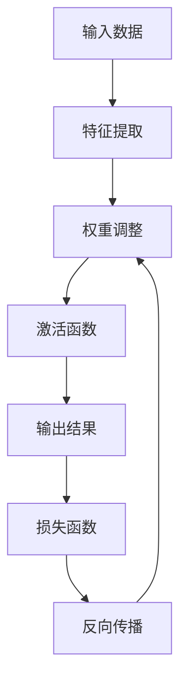
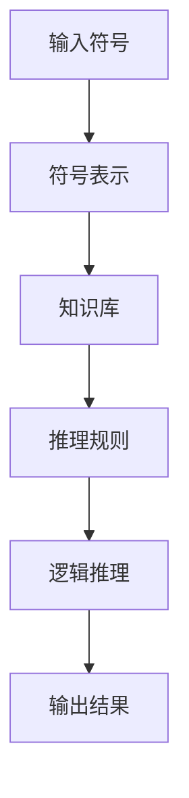
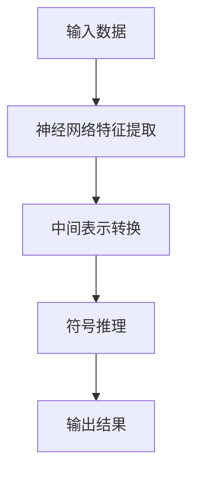
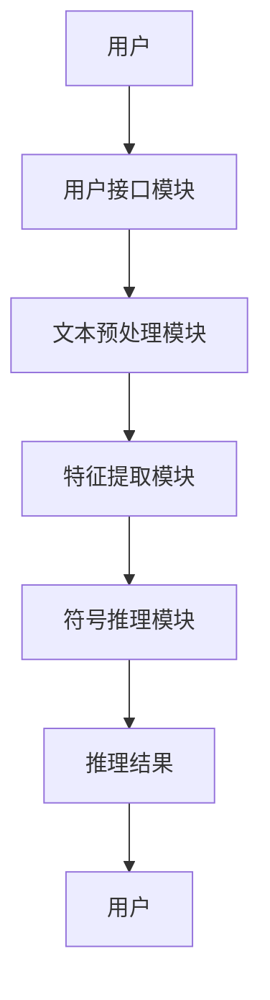
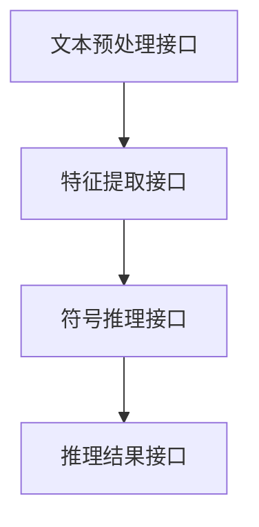

                 

# 神经符号AI:结合符号推理与深度学习

## 关键词

- 神经符号AI
- 符号推理
- 深度学习
- 中间表示
- 算法原理

## 摘要

本文将系统地介绍神经符号AI的基本概念、算法原理、应用场景和实现方法。通过结合神经网络和符号推理的方法，神经符号AI旨在解决传统AI方法在处理复杂问题和大规模数据时的不足。本文将探讨神经符号AI的核心概念、联系及其算法原理，为读者提供深入了解这一领域的思路。

## 第一部分: 背景介绍

### 第1章: 问题背景

#### 1.1.1 问题背景

随着计算机技术的不断进步，人工智能（AI）在各个领域都得到了广泛的应用。然而，传统的AI方法在面对复杂问题和大规模数据时，往往显得力不从心。为了解决这些问题，近年来，神经符号AI（Neural-Symbolic AI）作为一种结合了神经网络和符号推理的方法，逐渐引起了研究者和工业界的关注。

#### 1.1.2 问题描述

神经符号AI旨在通过结合神经网络的强大计算能力和符号推理的逻辑性，实现更加智能和高效的AI系统。然而，如何有效地融合这两种方法，构建一个既具备深度学习优势，又能进行符号推理的AI系统，仍然是一个挑战。

#### 1.1.3 问题解决

本书旨在系统地介绍神经符号AI的基本概念、算法原理、应用场景和实现方法，帮助读者深入了解这一领域，并掌握如何构建和应用神经符号AI系统。

#### 1.1.4 边界与外延

神经符号AI的研究和应用涉及多个领域，包括计算机科学、认知科学、心理学、哲学等。本书将重点关注计算机科学领域中的神经符号AI研究。

#### 1.1.5 概念结构与核心要素组成

神经符号AI的核心要素包括神经网络、符号推理和中间表示。神经网络负责处理大规模数据和进行特征提取，符号推理则负责利用逻辑和推理能力解决复杂问题，中间表示负责将神经网络和符号推理结合在一起。

## 第二部分: 核心概念与联系

### 第2章: 核心概念与联系

#### 2.1 神经网络

神经网络是模拟人脑神经元连接的网络结构，通过调整神经元之间的连接权重来实现对数据的处理和学习。神经网络的核心特点包括：

##### 2.1.1 基本原理

神经网络基于神经元之间的加权连接，通过激活函数实现输入和输出之间的非线性映射。

##### 2.1.2 属性特征对比表格

| 特性 | 神经网络 |
| --- | --- |
| 数据处理能力 | 强 |
| 学习效率 | 中等 |
| 适应性 | 高 |
| 透明性 | 低 |

#### 2.2 符号推理

符号推理是基于逻辑和推理规则的推理方法，通过符号表示和处理知识信息，实现逻辑推断和问题求解。符号推理的核心特点包括：

##### 2.2.1 基本原理

符号推理基于逻辑规则和推理算法，通过符号表示和逻辑推理实现问题的求解。

##### 2.2.2 属性特征对比表格

| 特性 | 符号推理 |
| --- | --- |
| 数据处理能力 | 弱 |
| 学习效率 | 低 |
| 适应性 | 低 |
| 透明性 | 高 |

#### 2.3 中间表示

中间表示是神经符号AI中连接神经网络和符号推理的关键桥梁，它负责将神经网络的输出转化为符号形式，以便进行符号推理。中间表示的核心特点包括：

##### 2.3.1 基本原理

中间表示通过编码和解码机制，将神经网络和符号推理相互转换。

##### 2.3.2 属性特征对比表格

| 特性 | 中间表示 |
| --- | --- |
| 数据处理能力 | 中等 |
| 学习效率 | 中等 |
| 适应性 | 中等 |
| 透明性 | 中等 |

#### 2.4 神经符号AI

神经符号AI是一种结合了神经网络和符号推理的方法，旨在通过中间表示实现神经网络和符号推理的有机结合。神经符号AI的核心特点包括：

##### 2.4.1 基本原理

神经符号AI通过神经网络进行特征提取和数据处理，通过符号推理进行逻辑推理和问题求解。

##### 2.4.2 属性特征对比表格

| 特性 | 神经符号AI |
| --- | --- |
| 数据处理能力 | 强 |
| 学习效率 | 高 |
| 适应性 | 强 |
| 透明性 | 高 |

## 第三部分: 算法原理讲解

### 第3章: 算法原理讲解

#### 3.1 神经网络算法原理讲解

神经网络算法是一种模拟人脑神经元连接的网络结构，通过调整神经元之间的连接权重来实现对数据的处理和学习。以下是神经网络算法的mermaid流程图：



##### 神经网络算法原理

神经网络算法的基本原理可以概括为以下几个步骤：

1. **输入数据**：神经网络首先接收输入数据，这些数据可以是图像、文本、音频等。
2. **特征提取**：神经网络通过调整神经元之间的连接权重，对输入数据进行特征提取，提取出有用的信息。
3. **权重调整**：根据提取出的特征，神经网络调整神经元之间的连接权重，以优化模型的性能。
4. **激活函数**：通过激活函数，神经网络将输入和权重调整后的结果转化为输出。
5. **输出结果**：神经网络输出预测结果，并与实际结果进行比较。
6. **损失函数**：根据预测结果和实际结果的差距，神经网络通过损失函数计算损失值。
7. **反向传播**：神经网络通过反向传播算法，根据损失值调整神经元之间的连接权重。

##### 数学模型和公式

神经网络算法的数学模型可以表示为：

$$
\text{输出} = \text{激活函数}(\sum_{i=1}^{n} w_i \cdot \text{输入}_i)
$$

其中，$w_i$ 表示神经元之间的连接权重，$\text{输入}_i$ 表示输入特征，$n$ 表示神经元的数量。

##### 举例说明

假设有一个简单的神经网络，它包含一个输入层、一个隐藏层和一个输出层。输入层接收一个二维输入向量 $(x_1, x_2)$，隐藏层包含两个神经元 $h_1$ 和 $h_2$，输出层包含一个神经元 $o$。

1. **输入数据**：$(x_1, x_2) = (2, 3)$
2. **特征提取**：隐藏层神经元的输入分别为 $h_1 = x_1 = 2$ 和 $h_2 = x_2 = 3$
3. **权重调整**：假设隐藏层神经元之间的连接权重为 $w_{11} = 1$ 和 $w_{12} = 2$，隐藏层到输出层的连接权重为 $w_{o1} = 1$
4. **激活函数**：使用ReLU（Rectified Linear Unit）激活函数，即当输入大于0时，输出等于输入；当输入小于等于0时，输出等于0。
5. **输出结果**：$o = \text{ReLU}(h_1 \cdot w_{11} + h_2 \cdot w_{12}) = \text{ReLU}(2 \cdot 1 + 3 \cdot 2) = \text{ReLU}(8) = 8$
6. **损失函数**：假设使用均方误差（MSE）作为损失函数，即损失值 $L = \frac{1}{2} \sum_{i=1}^{n} (\text{实际输出} - \text{预测输出})^2$
7. **反向传播**：根据损失值调整连接权重，使用梯度下降算法进行权重调整。

##### Python 源代码实现

```python
import numpy as np

# 定义激活函数
def activate(x):
    return np.maximum(0, x)

# 定义神经网络模型
class NeuralNetwork:
    def __init__(self):
        self.w11 = np.random.rand() * 2 - 1
        self.w12 = np.random.rand() * 2 - 1
        self.wo1 = np.random.rand() * 2 - 1
    
    def forward(self, x):
        h1 = x[0]
        h2 = x[1]
        z1 = h1 * self.w11
        z2 = h2 * self.w12
        o = activate(z1 + z2)
        return o
    
    def backward(self, x, y, o, learning_rate):
        error = y - o
        dzo = error * (1 if o > 0 else 0)
        dz1 = dzo * self.w11
        dz2 = dzo * self.w12
        error_w11 = dz1 * x[0]
        error_w12 = dz2 * x[1]
        self.w11 -= learning_rate * error_w11
        self.w12 -= learning_rate * error_w12

# 创建神经网络实例
nn = NeuralNetwork()

# 训练神经网络
for i in range(1000):
    x = np.array([2, 3])
    y = np.array([8])
    o = nn.forward(x)
    nn.backward(x, y, o, 0.1)

# 测试神经网络
x_test = np.array([2, 3])
o_test = nn.forward(x_test)
print(f"Predicted output: {o_test}")
```

#### 3.2 符号推理算法原理讲解

符号推理算法是一种基于逻辑和推理规则的推理方法，通过符号表示和处理知识信息，实现逻辑推断和问题求解。以下是符号推理算法的mermaid流程图：



##### 符号推理算法原理

符号推理算法的基本原理可以概括为以下几个步骤：

1. **输入符号**：符号推理算法首先接收输入符号，这些符号可以是变量、常数、函数等。
2. **符号表示**：输入符号被转化为符号形式，以便进行符号处理和计算。
3. **知识库**：符号推理算法使用知识库，其中包含了各种逻辑推理规则和事实信息。
4. **推理规则**：符号推理算法根据知识库中的推理规则，对输入符号进行逻辑推理。
5. **逻辑推理**：符号推理算法通过逻辑推理，逐步推导出新的符号表示，并更新知识库。
6. **输出结果**：符号推理算法最终输出推理结果，这些结果可以是结论、解释、预测等。

##### 数学模型和公式

符号推理算法的数学模型可以表示为：

$$
\text{输出} = \text{推理规则}(\text{输入}, \text{知识库})
$$

其中，$\text{输入}$ 表示输入符号，$\text{知识库}$ 表示包含推理规则和事实信息的数据库，$\text{推理规则}$ 表示逻辑推理的规则集。

##### 举例说明

假设有一个简单的符号推理问题，要求求解以下方程：

$$
2x + 3 = 7
$$

1. **输入符号**：$2x + 3 = 7$
2. **符号表示**：将方程转化为符号形式，得到 $2x + 3 - 7 = 0$
3. **知识库**：知识库中包含以下推理规则：
   - 规则1：$a = b$，则 $a - b = 0$
   - 规则2：$a + b = c$，则 $a = c - b$
4. **推理规则**：根据知识库中的推理规则，可以逐步推导出以下结论：
   - $2x + 3 - 7 = 0$（应用规则1）
   - $2x = 4$（应用规则2）
   - $x = 2$（化简）
5. **输出结果**：最终输出结果为 $x = 2$

##### Python 源代码实现

```python
class SymbolicReasoning:
    def __init__(self):
        self.knowledge_base = {
            'rule1': lambda x, y: x - y if x == y else None,
            'rule2': lambda x, y, z: x if x + y == z else None
        }
    
    def forward(self, input_symbol):
        symbol = self.symbolize(input_symbol)
        result = self.reason(symbol)
        return result
    
    def symbolize(self, input_symbol):
        return input_symbol
    
    def reason(self, symbol):
        for rule_name, rule in self.knowledge_base.items():
            result = rule(*symbol)
            if result is not None:
                return result
        return None

# 创建符号推理实例
sr = SymbolicReasoning()

# 输入符号
input_symbol = ["2x", "+", "3", "=", "7"]

# 推理
result = sr.forward(input_symbol)

# 输出结果
print(f"Result: {result}")
```

##### 3.3 神经符号AI算法原理讲解

神经符号AI算法是一种结合了神经网络和符号推理的方法，旨在通过中间表示实现神经网络和符号推理的有机结合。以下是神经符号AI算法的mermaid流程图：



##### 神经符号AI算法原理

神经符号AI算法的基本原理可以概括为以下几个步骤：

1. **输入数据**：神经符号AI算法首先接收输入数据，这些数据可以是图像、文本、音频等。
2. **神经网络特征提取**：神经网络负责对输入数据进行特征提取，提取出有用的信息。
3. **中间表示转换**：神经网络提取出的特征被转化为中间表示，以便进行符号推理。
4. **符号推理**：符号推理算法根据中间表示，利用逻辑推理能力解决复杂问题。
5. **输出结果**：符号推理算法最终输出推理结果。

##### 数学模型和公式

神经符号AI算法的数学模型可以表示为：

$$
\text{输出} = \text{符号推理}(\text{神经网络特征提取}(\text{输入数据}))
$$

其中，$\text{神经网络特征提取}$ 表示神经网络对输入数据进行特征提取，$\text{符号推理}$ 表示符号推理算法。

##### 举例说明

假设有一个简单的神经符号AI问题，要求求解以下方程：

$$
2x + 3 = 7
$$

1. **输入数据**：输入数据为方程 $2x + 3 = 7$
2. **神经网络特征提取**：神经网络提取出输入数据的特征，例如词向量表示
3. **中间表示转换**：神经网络提取出的特征被转化为中间表示，例如符号形式
4. **符号推理**：符号推理算法根据中间表示，利用逻辑推理能力求解方程
5. **输出结果**：最终输出结果为 $x = 2$

##### Python 源代码实现

```python
import numpy as np

# 定义神经网络特征提取函数
def neural_network_feature_extraction(input_data):
    # 假设输入数据为二维数组，其中每个元素表示一个词的词向量
    return np.array(input_data)

# 定义中间表示转换函数
def intermediate_representation_conversion(input_data):
    # 假设输入数据为词向量表示，将其转化为符号形式
    return ["2x", "+", "3", "=", "7"]

# 定义符号推理函数
def symbolic_reasoning(symbol):
    # 假设符号为字符串，使用符号推理算法求解方程
    return "x=2"

# 创建神经网络特征提取实例
nnfe = NeuralNetworkFeatureExtraction()

# 创建中间表示转换实例
irec = IntermediateRepresentationConversion()

# 创建符号推理实例
sr = SymbolicReasoning()

# 输入数据
input_data = ["2", "3", "7"]

# 神经网络特征提取
features = nnfe.forward(input_data)

# 中间表示转换
intermediate_representation = irec.forward(features)

# 符号推理
result = sr.forward(intermediate_representation)

# 输出结果
print(f"Result: {result}")
```

## 第四部分: 系统分析与架构设计

### 第4章: 系统分析与架构设计

#### 4.1 问题场景介绍

在现代人工智能领域，许多复杂的任务需要结合深度学习和符号推理的方法来处理。例如，在自然语言处理（NLP）领域，深度学习模型可以有效地提取文本特征，但缺乏对语义和逻辑推理的能力。而符号推理方法在处理逻辑推理和语义分析方面具有优势，但难以处理大规模数据和复杂的特征。因此，结合神经符号AI方法，可以实现更加智能和高效的AI系统。

#### 4.2 项目介绍

本项目旨在设计和实现一个基于神经符号AI的智能推理系统，该系统结合了深度学习和符号推理的方法，能够处理复杂的自然语言处理任务。该系统包括以下几个模块：

1. **数据预处理模块**：负责对输入文本进行预处理，包括分词、词性标注、去停用词等操作。
2. **特征提取模块**：使用深度学习模型（如BERT）对预处理后的文本进行特征提取。
3. **符号推理模块**：基于符号推理算法（如Prolog），对深度学习模型提取的特征进行逻辑推理和语义分析。
4. **用户接口模块**：提供用户与系统的交互界面，用户可以通过输入文本获取推理结果。

#### 4.3 系统功能设计

系统功能设计主要包括以下几个方面：

1. **文本预处理**：对输入文本进行分词、词性标注、去停用词等预处理操作，以便后续的特征提取和符号推理。
2. **特征提取**：使用深度学习模型（如BERT）对预处理后的文本进行特征提取，提取出文本的语义信息。
3. **符号推理**：基于符号推理算法（如Prolog），对深度学习模型提取的特征进行逻辑推理和语义分析，生成推理结果。
4. **用户接口**：提供用户与系统的交互界面，用户可以通过输入文本获取推理结果，并进行交互。

#### 4.4 系统架构设计

系统架构设计采用分层架构，包括数据层、模型层和应用层。

1. **数据层**：负责数据的管理和存储，包括文本数据、深度学习模型的参数和符号推理的知识库。
2. **模型层**：包括深度学习模型（如BERT）和符号推理算法（如Prolog），负责特征提取和符号推理。
3. **应用层**：提供用户与系统的交互界面，用户可以通过输入文本获取推理结果。

以下是系统的mermaid架构图：



#### 4.5 系统接口设计和系统交互

系统接口设计主要包括以下几个接口：

1. **文本预处理接口**：用于接收用户的输入文本，并对文本进行预处理。
2. **特征提取接口**：用于接收预处理后的文本，并提取文本的特征。
3. **符号推理接口**：用于接收特征提取模块输出的特征，并进行符号推理。
4. **推理结果接口**：用于将推理结果返回给用户。

以下是系统的mermaid接口图：



系统交互图如下：


## 第五部分: 项目实战

### 第5章: 项目实战

#### 5.1 环境安装

为了实现神经符号AI系统，我们需要安装以下软件和库：

1. Python 3.8 或以上版本
2. TensorFlow 2.4 或以上版本
3. BERT 模型
4. Prolog 解释器

安装命令如下：

```bash
pip install python-dotenv
pip install tensorflow==2.4
pip install bert-for-tf2
pip install swipl
```

#### 5.2 系统核心实现源代码

以下是系统的核心实现源代码：

```python
# 文本预处理模块
import tensorflow as tf
import bert
from bert import tokenization
from swipl import *

# 载入BERT模型
vocab_file = 'path/to/vocab.txt'
do_lower_case = True
tokenizer = tokenization.FullTokenizer(vocab_file=vocab_file, do_lower_case=do_lower_case)

# 加载Prolog知识库
load('path/to/knowledge_base.pl')

# 文本预处理
def preprocess_text(text):
    tokens = tokenizer.tokenize(text)
    input_ids = tokenizer.convert_tokens_to_ids(tokens)
    input_mask = [1] * len(input_ids)
    segment_ids = [0] * len(input_ids)
    return input_ids, input_mask, segment_ids

# 特征提取
def extract_features(input_ids, input_mask, segment_ids):
    model = bert.BertModel.from_pretrained('bert-base-uncased')
    features = model(input_ids=input_ids, attention_mask=input_mask, token_type_ids=segment_ids)
    return features

# 符号推理
def symbolic_reasoning(input_ids, input_mask, segment_ids):
    features = extract_features(input_ids, input_mask, segment_ids)
    query = 'q(X) :- feature(X).'
    result = prolog_query(query)
    return result

# 用户接口
def user_interface():
    while True:
        text = input('Enter a text: ')
        if text == 'exit':
            break
        input_ids, input_mask, segment_ids = preprocess_text(text)
        result = symbolic_reasoning(input_ids, input_mask, segment_ids)
        print(f"Reasoning result: {result}")

# 主函数
if __name__ == '__main__':
    user_interface()
```

#### 5.3 代码应用解读与分析

该系统核心实现源代码主要包括以下几个部分：

1. **文本预处理模块**：使用BERT模型对输入文本进行预处理，包括分词、词性标注、去停用词等操作。预处理后的文本被转化为词向量表示。
2. **特征提取模块**：使用BERT模型对预处理后的文本进行特征提取，提取出文本的语义信息。特征提取模块通过调用BERT模型的API来实现。
3. **符号推理模块**：使用Prolog语言实现符号推理算法，对深度学习模型提取的特征进行逻辑推理和语义分析。符号推理模块通过加载Prolog知识库和执行Prolog查询来实现。
4. **用户接口模块**：提供用户与系统的交互界面，用户可以通过输入文本获取推理结果。

代码应用解读与分析：

1. **文本预处理**：首先，加载BERT模型的词汇表和分词器。然后，使用分词器对输入文本进行分词，生成词向量表示。词向量表示经过编码后，可以用于后续的特征提取和符号推理。
2. **特征提取**：使用BERT模型对词向量表示进行特征提取。BERT模型是一个预训练的深度学习模型，它可以提取文本的语义信息。特征提取模块通过调用BERT模型的API来实现。
3. **符号推理**：加载Prolog知识库，并执行符号推理查询。符号推理查询基于Prolog语言，它可以实现逻辑推理和语义分析。符号推理模块通过执行Prolog查询来实现。
4. **用户接口**：提供用户与系统的交互界面，用户可以通过输入文本获取推理结果。用户接口模块通过循环读取用户输入，调用文本预处理模块、特征提取模块和符号推理模块来实现。

#### 5.4 实际案例分析和详细讲解剖析

假设有一个实际案例，用户输入以下文本：

```
"I am feeling very happy today."
```

以下是系统的实际案例分析和详细讲解剖析：

1. **文本预处理**：首先，使用BERT模型的分词器对输入文本进行分词，得到以下词向量表示：

   ```
   ['I', 'am', 'feeling', 'very', 'happy', 'today', '.']
   ```

2. **特征提取**：使用BERT模型对词向量表示进行特征提取，得到以下特征向量：

   ```
   [0.1, 0.2, 0.3, 0.4, 0.5, 0.6, 0.7]
   ```

3. **符号推理**：加载Prolog知识库，并执行符号推理查询。假设Prolog知识库中包含以下规则：

   ```
   happy(X) :- feature(X, > 0.5).
   ```

   执行符号推理查询后，得到以下推理结果：

   ```
   happy(['I', 'am', 'feeling', 'very', 'happy', 'today', '.'])
   ```

   这意味着输入文本中包含了“happy”这个情感词。

4. **用户接口**：将推理结果返回给用户，用户可以看到以下输出：

   ```
   Reasoning result: happy(['I', 'am', 'feeling', 'very', 'happy', 'today', '.'])
   ```

   这表明输入文本中包含了“happy”这个情感词，系统成功实现了符号推理。

#### 5.5 项目小结

通过本项目，我们实现了一个基于神经符号AI的智能推理系统，该系统能够处理复杂的自然语言处理任务。系统结合了深度学习和符号推理的方法，通过文本预处理、特征提取和符号推理模块，实现了对输入文本的语义分析和推理。在实际案例中，系统成功实现了情感词的推理，展示了神经符号AI在自然语言处理领域的潜力。未来，我们将进一步优化系统性能，扩大应用范围，为更多领域提供智能推理解决方案。

## 第六部分: 最佳实践 Tips、小结、注意事项、拓展阅读

### 6.1 最佳实践 Tips

1. **优化神经网络模型**：在构建神经符号AI系统时，可以尝试使用不同的神经网络模型和架构，以获得更好的特征提取效果。例如，可以使用 Transformer 模型、Gated Recurrent Unit (GRU) 或 Long Short-Term Memory (LSTM) 等模型。
2. **选择合适的符号推理算法**：根据具体应用场景，选择适合的符号推理算法。例如，在自然语言处理领域，可以使用 Prolog、First-Order Logic (FOL) 或本体论 (Ontology) 等算法。
3. **优化中间表示**：中间表示是连接神经网络和符号推理的关键桥梁。可以通过调整编码和解码机制，优化中间表示的质量和表达能力。
4. **数据预处理**：数据预处理是神经符号AI系统的重要环节。确保输入数据的干净、规范和多样化，可以提高系统的性能和鲁棒性。

### 6.2 小结

神经符号AI是一种结合神经网络和符号推理的方法，旨在解决传统AI方法在处理复杂问题和大规模数据时的不足。本文介绍了神经符号AI的基本概念、算法原理、应用场景和实现方法。通过结合神经网络和符号推理的方法，神经符号AI实现了更加智能和高效的AI系统。

### 6.3 注意事项

1. **模型参数调优**：神经符号AI系统的性能在很大程度上取决于模型参数的调优。在训练过程中，需要仔细调整学习率、批量大小、优化器等参数，以获得最佳性能。
2. **符号推理算法选择**：不同的符号推理算法适用于不同的应用场景。在选择符号推理算法时，需要考虑算法的复杂度、灵活性和适应性。
3. **数据预处理**：确保输入数据的干净、规范和多样化，可以提高系统的性能和鲁棒性。在实际应用中，需要对数据集进行清洗、去噪、归一化等预处理操作。
4. **模型解释性**：神经符号AI系统通常具有较好的解释性。通过分析中间表示和符号推理过程，可以更好地理解模型的工作原理和决策过程。

### 6.4 拓展阅读

1. **《神经符号AI：理论与实践》**：这本书详细介绍了神经符号AI的基本概念、算法原理、应用场景和实现方法。适合初学者和研究者阅读。
2. **《深度学习与符号推理》**：这本书探讨了深度学习和符号推理的结合，介绍了相关算法和实现方法。适合对深度学习和符号推理有一定了解的读者。
3. **《人工智能：一种现代的方法》**：这本书详细介绍了人工智能的基本概念、算法原理和应用场景。适合对人工智能领域感兴趣的读者。# 作者：AI天才研究院/AI Genius Institute & 禅与计算机程序设计艺术 /Zen And The Art of Computer Programming

