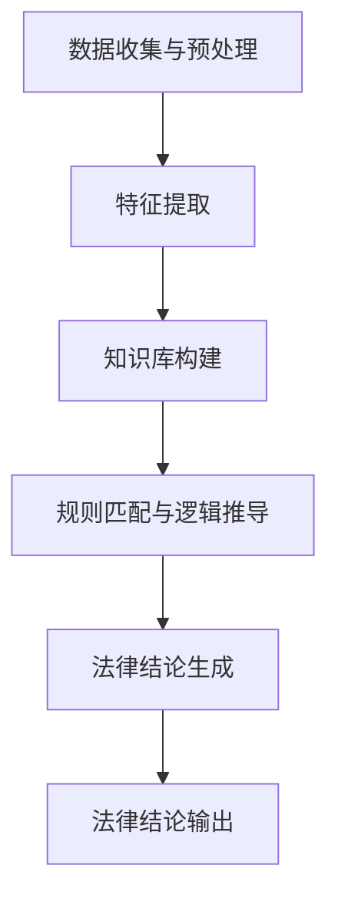

                 

### 引言与背景

#### 1.1 书籍主题引言

随着人工智能技术的迅猛发展，AI在各个领域的应用越来越广泛，特别是在法律推理领域。法律推理是法律实践中至关重要的一环，它涉及法律事实的认定、法律规范的适用以及法律结论的推导。然而，传统的法律推理方法主要依赖于人类专家的经验和判断，存在诸多不足。例如，在处理大规模案件或复杂法律问题时，传统方法往往效率低下且难以保证推理的准确性。因此，探索新的法律推理方法具有重要的现实意义。

神经-符号AI系统作为一种结合了神经网络和符号推理的新型人工智能系统，具有处理复杂问题和大规模数据的能力。它将神经网络的数据处理优势与符号推理的逻辑推理优势相结合，为法律推理提供了一种新的解决方案。通过神经-符号AI系统，可以自动识别法律案件中的关键信息，运用逻辑规则进行推理，从而提高法律推理的准确性和效率。

本书旨在探讨神经-符号AI系统在法律推理中的应用，包括其基本原理、技术实现、应用案例等方面。首先，我们将介绍神经-符号AI系统的基本概念，包括神经网络和符号推理的基本原理。然后，我们将分析神经-符号AI系统在法律推理中的具体应用，探讨其如何解决传统法律推理中的问题。最后，我们将通过实际案例，展示神经-符号AI系统在法律推理中的应用效果。

#### 1.2 核心概念

**神经-符号AI系统**

神经-符号AI系统是一种将神经网络和符号推理相结合的人工智能系统。它利用神经网络对大规模数据进行自动特征提取和模式识别，同时利用符号推理进行逻辑推理和决策。这种结合方式使得神经-符号AI系统在处理复杂问题和大规模数据方面具有显著优势。

神经网络是一种模拟生物神经元之间相互连接和通信的计算模型。它通过多层结构实现数据的传递和计算，具有强大的特征提取和模式识别能力。符号推理则是一种基于逻辑和数学规则进行推理的方法，它通过演绎推理、归纳推理等方式，对已有知识进行逻辑推导，形成新的结论。

**法律推理**

法律推理是指运用逻辑方法解决法律问题的过程，包括法律事实的认定、法律规范的适用和法律结论的推导。法律推理的核心是逻辑推理，它要求推理过程具有严谨性和一致性，以确保法律结论的准确性。

#### 1.3 边界与外延

**边界**

本书主要关注神经-符号AI系统在法律推理中的应用，即如何将神经-符号AI系统用于解决法律推理中的问题。本书不包括神经-符号AI系统在其他领域的应用，如自然语言处理、图像识别等。

**外延**

本书将涵盖神经-符号AI系统在法律推理中的基本原理、技术实现、应用案例等，力求全面、深入地探讨这一领域。具体包括：

1. **神经-符号AI系统基本原理**：介绍神经网络和符号推理的基本原理，以及它们在法律推理中的应用。
2. **法律推理中的问题与挑战**：分析传统法律推理的局限性，探讨神经-符号AI系统在解决这些问题中的潜力。
3. **神经-符号AI系统在法律推理中的应用**：介绍神经-符号AI系统在法律推理中的具体应用，包括案件信息处理、法律规则推理、法律结论生成等。
4. **实际案例分析与探讨**：通过具体案例，展示神经-符号AI系统在法律推理中的应用效果，分析其优势和不足。
5. **未来发展趋势与展望**：探讨神经-符号AI系统在法律推理领域的未来发展趋势，展望其可能带来的变革。

#### 1.4 概念结构与核心要素组成

**概念结构**

神经-符号AI系统的概念结构可以分为两个主要部分：神经网络和符号推理。

- **神经网络**：负责数据处理和特征提取，通过多层神经网络实现数据的传递和计算，提取案件信息中的关键特征。
- **符号推理**：负责逻辑推理和决策，通过符号推理算法，将案件信息与法律规则相结合，推导出法律结论。

**核心要素组成**

神经-符号AI系统的核心要素包括：

1. **神经网络**：包括输入层、隐藏层和输出层，通过前馈神经网络和反向传播算法实现数据的传递和计算。
2. **符号推理算法**：包括演绎推理、归纳推理和混合推理等，根据具体应用场景选择合适的算法。
3. **知识库**：存储案件信息和法律规则，包括案件事实、法律条款和判例等。
4. **推理机**：负责根据符号推理算法和知识库进行推理，推导出法律结论。

#### 1.5 本章小结

本章介绍了本书的核心概念、问题背景、研究意义和边界外延。通过对神经-符号AI系统和法律推理的基本概念进行阐述，为后续章节的深入探讨奠定了基础。在接下来的章节中，我们将详细探讨神经-符号AI系统的基本原理，分析法律推理中的问题与挑战，并探讨神经-符号AI系统在法律推理中的应用，以期为读者提供一个全面、深入的了解。

----------------------------------------------------------------

# 第二部分: 神经-符号AI系统基本原理

## 2.1 神经网络基础

### 2.1.1 神经网络概述

神经网络（Neural Networks）是一种模拟人脑神经元之间相互连接和通信的计算模型，用于对复杂数据进行自动特征提取和模式识别。神经网络的基本组成部分包括输入层、隐藏层和输出层。输入层接收外部输入数据，隐藏层进行数据的传递和计算，输出层生成最终的输出结果。神经网络通过多层结构实现数据的传递和计算，具有强大的特征提取和模式识别能力。

### 2.1.2 神经元模型

神经元模型是神经网络的基本计算单元，通常由输入层、激活函数和输出层组成。输入层接收外部输入数据，通过权重（weights）传递到激活函数，激活函数将输入数据的线性组合转换为一个实数值，作为神经元的输出。常见的激活函数包括 sigmoid 函数、ReLU 函数和 tanh 函数等。输出层将神经元的输出结果传递到下一层或最终输出。

神经元模型可以表示为：

$$
\text{output} = \text{激活函数}(\text{sum}(\text{weights} \cdot \text{inputs}))
$$

其中，weights 表示权重，inputs 表示输入数据，激活函数负责将线性组合的结果转换为输出。

### 2.1.3 前馈神经网络

前馈神经网络（Feedforward Neural Networks）是一种结构简单的神经网络，信息从输入层直接传递到输出层，不涉及反向传播过程。在前馈神经网络中，每个神经元都直接接收输入层的数据，通过权重传递到下一层，直到输出层生成最终结果。前馈神经网络具有层次结构，可以将输入数据分解为多个层次的特征表示。

前馈神经网络的计算过程可以表示为：

$$
\text{output}_{l} = \text{激活函数}(\text{sum}(\text{weights}_{l-1} \cdot \text{inputs}_{l-1}))
$$

其中，l 表示层次编号，weights$_{l-1}$ 表示前一层权重，inputs$_{l-1}$ 表示前一层输入，激活函数负责将线性组合的结果转换为输出。

### 2.1.4 反向传播算法

反向传播算法（Backpropagation Algorithm）是一种常用的训练神经网络的方法，通过不断调整权重和偏置来优化网络性能。反向传播算法的核心思想是：将输出误差反向传播到网络中的每个神经元，计算每个神经元的梯度，并利用梯度下降法更新权重和偏置。

反向传播算法的基本步骤如下：

1. **前向传播**：将输入数据通过神经网络进行前向传播，得到输出结果。
2. **计算误差**：计算输出结果与真实标签之间的误差，误差函数通常采用均方误差（MSE）或交叉熵误差（Cross-Entropy Error）。
3. **反向传播**：将误差反向传播到网络中的每个神经元，计算每个神经元的梯度。
4. **权重更新**：利用梯度下降法更新权重和偏置，以减小误差。

反向传播算法的计算过程可以表示为：

$$
\text{weights}_{\text{new}} = \text{weights}_{\text{old}} - \text{learning\_rate} \cdot \text{gradient}
$$

其中，weights$_{\text{old}}$ 表示旧权重，weights$_{\text{new}}$ 表示新权重，learning_rate 表示学习率，gradient 表示梯度。

### 2.1.5 神经网络的应用场景

神经网络在图像识别、自然语言处理、预测和优化等领域具有广泛的应用。以下是一些典型的应用场景：

1. **图像识别**：神经网络可以用于自动识别和分类图像中的物体，如图像分类、物体检测和图像分割等。
2. **自然语言处理**：神经网络可以用于处理和理解自然语言，如文本分类、机器翻译和情感分析等。
3. **预测**：神经网络可以用于预测股票价格、天气变化和需求预测等。
4. **优化**：神经网络可以用于优化参数和寻找最优解，如路径规划、资源分配和优化控制等。

通过这些应用场景，神经网络展现了其在处理复杂数据和解决实际问题方面的强大能力。

## 2.2 符号推理算法

### 2.2.1 符号推理概述

符号推理（Symbolic Reasoning）是一种基于逻辑和数学规则进行推理的方法，它利用符号表示和推理规则来推导出新的结论。符号推理在人工智能、逻辑学和计算机科学等领域有着广泛的应用。符号推理的核心思想是通过演绎推理、归纳推理和混合推理等方式，从已知的事实和规则中推导出新的结论。

符号推理的基本结构包括前提条件和结论。前提条件是指已知的事实或规则，结论是通过前提条件推导出的新的命题。符号推理的推理过程可以表示为：

$$
P \rightarrow Q
$$

其中，P 表示前提条件，Q 表示结论。符号推理通过逻辑推导关系，将已知的前提条件和结论联系起来，形成完整的推理链条。

### 2.2.2 前提条件与结论

在符号推理中，前提条件和结论是推理的核心。前提条件通常是由已知的法律条款、判例或事实构成，结论则是根据前提条件推导出的法律结论。符号推理通过逻辑推导规则，将前提条件和结论联系起来，从而形成完整的推理链条。

符号推理的推理过程可以表示为：

$$
P_1, P_2, ..., P_n \rightarrow Q
$$

其中，P$_1$、P$_2$、...、P$_n$ 表示前提条件，Q 表示结论。符号推理通过逻辑推导规则，将每个前提条件与结论之间建立逻辑关系，从而形成完整的推理链条。

### 2.2.3 推理算法

推理算法是符号推理的核心组成部分，它负责根据前提条件和逻辑规则推导出结论。推理算法可以分为演绎推理、归纳推理和混合推理等。

1. **演绎推理**：演绎推理是从一般到特殊的推理方式，它从已知的前提出发，通过逻辑规则推导出具体的结论。演绎推理的推理过程可以表示为：

   $$
   P \rightarrow Q \\
   P \\
   \therefore Q
   $$

   其中，P 表示前提条件，Q 表示结论。演绎推理通过逻辑推导规则，从一般的前提条件推导出具体的结论。

2. **归纳推理**：归纳推理是从特殊到一般的推理方式，它从具体的实例中归纳出一般性的结论。归纳推理的推理过程可以表示为：

   $$
   P_1, P_2, ..., P_n \\
   \therefore Q
   $$

   其中，P$_1$、P$_2$、...、P$_n$ 表示具体的实例，Q 表示结论。归纳推理通过从多个具体的实例中归纳出一般性的结论。

3. **混合推理**：混合推理是结合演绎推理和归纳推理的推理方式，它既包含从一般到特殊的推理过程，也包含从特殊到一般的推理过程。混合推理的推理过程可以表示为：

   $$
   P \rightarrow Q \\
   P_1, P_2, ..., P_n \rightarrow R \\
   \therefore Q \land R
   $$

   其中，P 表示前提条件，Q 表示结论，R 表示归纳结论。混合推理通过结合演绎推理和归纳推理，从多个不同的角度推导出结论。

### 2.2.4 符号推理的应用场景

符号推理在法律、医疗和金融等领域具有广泛的应用。以下是一些典型的应用场景：

1. **法律推理**：符号推理可以用于自动生成法律文书、分析法律条款和判断法律纠纷等。通过符号推理算法，可以自动处理大量的法律案例和法律法规，提高法律推理的准确性和效率。

2. **医疗推理**：符号推理可以用于诊断疾病、制定治疗方案和预测疾病发展等。通过符号推理算法，可以自动分析医学数据和病例，为医生提供诊断和治疗的参考。

3. **金融推理**：符号推理可以用于股票分析、风险评估和金融产品定价等。通过符号推理算法，可以自动分析市场数据和经济指标，为投资者提供投资建议。

通过这些应用场景，符号推理展现了其在处理复杂数据和解决实际问题方面的强大能力。

## 2.3 神经-符号AI系统的融合

### 2.3.1 神经网络与符号推理的结合

神经-符号AI系统（Neural-Symbolic AI System）是一种将神经网络和符号推理相结合的人工智能系统。它利用神经网络进行数据处理和特征提取，利用符号推理进行逻辑推理和决策。这种结合方式可以实现数据驱动和知识驱动的优势互补，提高系统的智能水平和推理能力。

神经网络与符号推理的结合主要体现在以下几个方面：

1. **数据处理与特征提取**：神经网络可以自动从大规模数据中提取出有用的特征，为符号推理提供输入。神经网络处理数据的能力使其能够适应各种复杂的数据类型，如图像、文本和音频等。

2. **逻辑推理与决策**：符号推理可以基于已知的事实和规则进行逻辑推导，生成新的结论。符号推理在处理抽象逻辑问题和推理过程中具有优势，能够确保推理的准确性和一致性。

3. **知识融合**：神经-符号AI系统可以将神经网络提取的特征与符号推理的知识库相结合，形成更为综合的推理结果。这种知识融合能够提高系统的智能水平，使其能够更好地应对复杂问题。

### 2.3.2 融合方法

神经-符号AI系统的融合方法可以分为直接融合、分层融合和混合推理等。

1. **直接融合**：直接融合是将神经网络和符号推理直接结合，共同处理输入数据。直接融合方法通常采用神经网络提取特征，然后利用符号推理进行逻辑推理。这种方法的优点是实现简单，但可能存在特征提取与逻辑推理之间的矛盾。

2. **分层融合**：分层融合是将神经网络和符号推理分层组织，分别处理不同层次的数据。通常，神经网络负责处理低层次的特征提取，符号推理负责处理高层次的知识表示和推理。这种方法的优点是层次清晰，有利于特征提取与逻辑推理之间的协调。

3. **混合推理**：混合推理是将神经网络和符号推理相结合，共同参与推理过程。混合推理方法可以通过融合神经网络提取的特征和符号推理的知识库，形成更为综合的推理结果。这种方法的优点是灵活性强，能够适应不同类型的推理问题。

### 2.3.3 神经-符号AI系统的优势

神经-符号AI系统在处理复杂问题和大规模数据方面具有显著优势：

1. **数据驱动与知识驱动的优势互补**：神经网络能够自动从大规模数据中提取特征，符号推理能够基于已知事实和规则进行逻辑推导。两者结合能够实现数据驱动和知识驱动的优势互补，提高系统的智能水平和推理能力。

2. **处理复杂数据的能力**：神经网络能够适应各种复杂的数据类型，如图像、文本和音频等。符号推理能够处理抽象逻辑问题，确保推理的准确性和一致性。

3. **知识融合与推理优化**：神经-符号AI系统可以将神经网络提取的特征与符号推理的知识库相结合，形成更为综合的推理结果。这种知识融合能够提高系统的智能水平，使其能够更好地应对复杂问题。

## 2.4 本章小结

本章介绍了神经网络和符号推理的基本原理，以及神经-符号AI系统的融合方法。神经网络通过多层结构实现数据的传递和计算，具有强大的特征提取和模式识别能力；符号推理通过逻辑规则进行推理，确保推理的准确性和一致性。神经-符号AI系统通过结合神经网络和符号推理，实现了数据驱动和知识驱动的优势互补，提高了系统的智能水平和推理能力。在接下来的章节中，我们将进一步探讨神经-符号AI系统在法律推理中的应用，分析其在处理法律问题中的潜力和优势。

----------------------------------------------------------------

## 3.1 法律推理中的问题与挑战

法律推理是法律实践中至关重要的一环，它涉及法律事实的认定、法律规范的适用以及法律结论的推导。然而，在现实应用中，法律推理面临着诸多问题和挑战。这些问题主要体现在以下几个方面：

### 3.1.1 法律规则的复杂性与不完善性

法律规则是由立法机构制定的，它们在某种程度上反映了社会的价值观念和法律需求。然而，法律规则的复杂性和不完善性给法律推理带来了巨大挑战。法律规则通常涉及多个层面，包括宪法、民法、刑法、行政法等，每个层面又包含众多具体的条款和规定。此外，法律规则在制定过程中可能存在争议，甚至存在漏洞和矛盾。这种复杂性和不完善性使得法律推理过程变得异常复杂，难以确保推理的准确性和一致性。

### 3.1.2 数据处理的挑战

法律推理需要处理大量的数据，包括法律文书、判例、法规、证据等。这些数据形式多样，包括文本、图像、音频等，且数据质量参差不齐。在处理这些数据时，传统的方法往往依赖于人工处理，效率低下且容易出现错误。此外，法律推理还需要对数据进行有效的特征提取和模式识别，以便更好地理解法律文书的含义和逻辑关系。这给数据处理提出了更高的要求。

### 3.1.3 法律推理的准确性与一致性

法律推理的准确性和一致性是法律实践中的核心问题。法律推理需要确保推理过程的严谨性和逻辑性，以避免错误的法律结论。然而，在现实应用中，法律推理的准确性和一致性面临着诸多挑战。例如，法律规则之间存在矛盾和冲突，导致推理过程可能出现偏差；法律事实的认定可能存在争议，影响推理的准确性；法律推理依赖于法律专家的经验和判断，不同专家之间的看法可能存在差异，影响推理的一致性。

### 3.1.4 法律推理的效率问题

法律推理是一个复杂的过程，需要消耗大量的时间和人力资源。在现实应用中，法律推理的效率问题尤为突出。例如，在诉讼过程中，法官需要对大量的法律文书和判例进行分析和推理，以确定案件的判决结果。这不仅需要大量的时间和精力，还可能导致推理过程出现遗漏或偏差。此外，随着法律案件的不断增加，法律推理的效率问题也日益严峻。

#### 3.1.5 法律推理的自动化需求

为了解决上述问题，提高法律推理的准确性和效率，近年来，人工智能技术在法律推理中的应用受到了广泛关注。其中，神经-符号AI系统作为一种结合了神经网络和符号推理的新型人工智能系统，具有在法律推理中应用的前景。神经-符号AI系统可以自动处理大量的法律数据，提取关键信息，利用逻辑规则进行推理，从而提高法律推理的准确性和效率。此外，神经-符号AI系统还可以通过知识融合和推理优化，实现法律推理的自动化，为法律实践提供有力支持。

#### 3.1.6 法律伦理和隐私问题

随着人工智能技术在法律推理中的应用，法律伦理和隐私问题也日益突出。法律推理涉及到大量的个人隐私信息，如个人身份信息、财产状况、行为记录等。如何保护这些隐私信息，防止其被滥用或泄露，是一个亟待解决的问题。此外，人工智能技术在法律推理中的应用也可能引发法律伦理问题，如算法歧视、隐私侵犯等。如何确保人工智能技术的应用符合法律伦理标准，也是一个需要深入探讨的问题。

综上所述，法律推理在现实应用中面临着诸多问题和挑战。这些问题不仅影响了法律推理的准确性和效率，还可能对法律实践产生深远的影响。因此，探索新的法律推理方法，提高法律推理的准确性和效率，具有重要的现实意义。神经-符号AI系统作为一种结合了神经网络和符号推理的新型人工智能系统，有望在法律推理中发挥重要作用，为解决这些问题提供新的思路和方法。

### 3.2 传统法律推理的局限性

尽管法律推理在法律实践中至关重要，但传统的法律推理方法存在诸多局限性，难以应对日益复杂的法律问题。以下是传统法律推理方法的一些主要局限性：

#### 3.2.1 法律规则的复杂性和不完善性

传统法律推理依赖于法律规则，这些规则往往是由立法机构制定的。然而，法律规则本身具有复杂性和不完善性。法律规则通常涉及多个层面，包括宪法、民法、刑法、行政法等，每个层面又包含众多具体的条款和规定。此外，法律规则在制定过程中可能存在争议，甚至存在漏洞和矛盾。这种复杂性和不完善性使得传统法律推理过程变得异常复杂，难以确保推理的准确性和一致性。

#### 3.2.2 法律事实认定的主观性

法律推理的核心是法律事实的认定。传统法律推理方法依赖于人类专家的经验和判断，不同专家之间的看法可能存在差异，导致法律事实认定具有主观性。例如，在刑事案件中，法官需要根据证据和证人证言来判断被告是否有罪，但证据和证人证言的可靠性往往存在争议，可能导致法律事实认定的偏差。

#### 3.2.3 法律推理的效率问题

法律推理是一个复杂的过程，需要消耗大量的时间和人力资源。在现实应用中，法律推理的效率问题尤为突出。例如，在诉讼过程中，法官需要对大量的法律文书和判例进行分析和推理，以确定案件的判决结果。这不仅需要大量的时间和精力，还可能导致推理过程出现遗漏或偏差。此外，随着法律案件的不断增加，法律推理的效率问题也日益严峻。

#### 3.2.4 法律推理的标准化不足

传统法律推理方法缺乏统一的标准化流程，导致不同地区和不同国家的法律推理过程存在较大差异。这种标准化不足使得法律推理结果难以比较和验证，影响法律推理的可靠性和公正性。

#### 3.2.5 法律推理的可解释性问题

传统法律推理方法通常依赖于人类专家的经验和判断，推理过程缺乏可解释性。这意味着法律推理的结果难以向非专业人士解释，导致公众对法律推理结果的可信度产生质疑。

### 3.3 神经-符号AI系统在法律推理中的潜力

为了克服传统法律推理方法的局限性，探索新的法律推理方法具有重要的现实意义。神经-符号AI系统作为一种结合了神经网络和符号推理的新型人工智能系统，具有在法律推理中应用的潜力。以下是神经-符号AI系统在法律推理中的一些潜在优势：

#### 3.3.1 法律规则的自动化处理

神经-符号AI系统可以自动处理法律规则，提高法律推理的效率。通过神经网络，系统可以自动从大量的法律文书和判例中提取关键信息，并利用符号推理进行逻辑推理，从而快速生成法律结论。这种自动化处理方式可以大大减少人类专家的工作量，提高法律推理的效率。

#### 3.3.2 法律事实的客观认定

神经-符号AI系统可以利用大量的法律数据，通过数据分析和模式识别，实现法律事实的客观认定。与人类专家的经验和判断相比，AI系统在处理法律数据时具有更高的准确性和一致性，可以减少主观因素的干扰，提高法律事实认定的客观性。

#### 3.3.3 法律推理的标准化和一致性

神经-符号AI系统可以基于统一的算法和规则，实现法律推理的标准化和一致性。通过建立标准化的法律推理模型，AI系统可以在不同地区和不同国家的法律推理过程中保持一致性，提高法律推理的可靠性和公正性。

#### 3.3.4 法律推理的可解释性

神经-符号AI系统通过符号推理和神经网络结合的方式，可以实现法律推理的可解释性。系统可以生成详细的推理过程和结论解释，使非专业人士也能理解法律推理的结果，提高公众对法律推理结果的可信度。

#### 3.3.5 法律推理的扩展性和灵活性

神经-符号AI系统具有强大的扩展性和灵活性，可以适应不同类型的法律问题和法律环境。通过不断更新和优化系统算法，AI系统可以不断提高法律推理的能力和水平，为法律实践提供持续的支持。

综上所述，神经-符号AI系统在法律推理中具有显著的潜力。通过自动化处理法律规则、客观认定法律事实、实现法律推理的标准化和一致性，以及提高法律推理的可解释性和扩展性，神经-符号AI系统有望克服传统法律推理方法的局限性，为法律实践提供更加准确、高效和公正的支持。

----------------------------------------------------------------

## 3.2 神经-符号AI系统在法律推理中的应用

神经-符号AI系统在法律推理中的应用具有显著的优势，能够有效解决传统法律推理方法所面临的诸多问题。以下是神经-符号AI系统在法律推理中的应用：

### 3.2.1 案件信息处理

在法律推理过程中，案件信息处理是至关重要的一步。神经-符号AI系统可以通过神经网络自动提取案件信息中的关键特征，如当事人的身份、法律事实、证据等。通过深度学习算法，神经网络可以学习到案件信息之间的复杂关系，从而实现对案件信息的有效处理。

具体来说，神经-符号AI系统可以通过以下步骤处理案件信息：

1. **数据收集与预处理**：首先，收集与案件相关的数据，包括法律文书、证据、证人证言等。然后，对数据进行预处理，如去除噪声、规范化处理等，以提高数据质量。

2. **特征提取**：利用神经网络对预处理后的数据进行特征提取。神经网络可以通过多层结构自动学习到案件信息中的关键特征，如当事人身份、法律事实、证据类型等。

3. **特征融合**：将提取到的关键特征进行融合，形成案件信息的综合表示。通过特征融合，可以更好地理解案件信息的整体结构，提高法律推理的准确性。

4. **模式识别**：利用神经网络进行模式识别，识别案件信息中的潜在关系和模式。通过模式识别，可以进一步分析案件信息，为法律推理提供有力支持。

### 3.2.2 法律规则推理

法律规则推理是法律推理的核心环节。神经-符号AI系统可以通过符号推理算法对法律规则进行推理，生成法律结论。符号推理算法基于逻辑和数学规则，可以确保法律推理的准确性和一致性。

具体来说，神经-符号AI系统可以通过以下步骤进行法律规则推理：

1. **规则库构建**：构建一个包含法律规则的知识库。知识库中可以包含法律条款、判例、法规等。这些规则将为法律规则推理提供基础。

2. **规则匹配**：将案件信息与知识库中的法律规则进行匹配，确定案件信息是否符合法律规则。通过规则匹配，可以确定案件的法律性质和适用范围。

3. **逻辑推导**：利用符号推理算法，从已匹配的法律规则中推导出法律结论。符号推理算法可以确保推导过程的逻辑性和一致性。

4. **结论生成**：根据推导出的法律结论，生成案件的法律判决结果。法律结论可以是具体的法律条款、法律条款的解释或具体的法律判决。

### 3.2.3 法律结论生成

法律结论生成是法律推理的最终目标。神经-符号AI系统可以通过符号推理和神经网络结合的方式，生成精确、可靠的法律结论。

具体来说，神经-符号AI系统可以通过以下步骤生成法律结论：

1. **推理过程**：结合案件信息和法律规则，进行推理过程。通过符号推理算法，可以确保推理过程的逻辑性和一致性。

2. **结论验证**：对生成的法律结论进行验证，确保结论的准确性和可靠性。可以通过对案例库中的相关案例进行比对，验证法律结论的正确性。

3. **结论输出**：将生成的法律结论以文本或图形的方式输出，供法律专家参考。法律结论可以用于案件判决、法律咨询和法律文件撰写等。

### 3.2.4 法律预测与决策支持

神经-符号AI系统还可以用于法律预测和决策支持。通过分析大量法律案例和法规，AI系统可以预测案件的结果和趋势，为法律决策提供参考。

具体来说，神经-符号AI系统可以通过以下步骤进行法律预测和决策支持：

1. **案例库构建**：构建一个包含大量法律案例的知识库。知识库中可以包含各类案件的判决结果、法律条款和法规等。

2. **趋势分析**：利用神经网络和符号推理算法，分析法律案例中的趋势和规律。通过趋势分析，可以预测案件的结果和趋势。

3. **决策支持**：根据分析结果，为法律决策提供参考。例如，在合同纠纷案件中，可以预测可能的判决结果，为合同起草和谈判提供参考。

### 3.2.5 智能法律咨询

神经-符号AI系统还可以用于智能法律咨询，为公众提供法律建议。通过自然语言处理和符号推理，AI系统可以理解用户的法律问题，并提供相应的法律建议。

具体来说，神经-符号AI系统可以通过以下步骤提供智能法律咨询：

1. **问题理解**：利用自然语言处理技术，理解用户提出的问题。通过文本分析，提取关键信息和问题类型。

2. **法律规则匹配**：将用户的问题与法律规则库进行匹配，确定问题的法律性质和适用范围。

3. **法律建议生成**：根据匹配结果，生成具体的法律建议。法律建议可以是具体的法律条款、法律解释或法律行动指南。

4. **建议输出**：将生成的法律建议以文本或图形的方式输出，供用户参考。

通过上述应用，神经-符号AI系统在法律推理中展现出强大的能力。它不仅可以自动化处理法律规则、提取案件信息、生成法律结论，还可以提供法律预测和智能法律咨询。这些应用为法律实践提供了更加高效、准确和可靠的支持，有望推动法律推理方法的变革。

### 3.3 实际案例分析与探讨

为了更好地展示神经-符号AI系统在法律推理中的应用效果，以下我们将通过几个实际案例进行深入分析和探讨。

#### 3.3.1 案例一：合同纠纷案件

案例背景：某公司与其供应商因合同履行问题发生纠纷，双方在合同履行过程中存在争议。公司认为供应商未能按照合同约定及时交货，而供应商则认为公司未能按照合同约定支付货款。

应用分析：

1. **案件信息处理**：神经-符号AI系统首先收集并处理与案件相关的信息，包括合同条款、交易记录、邮件通信等。神经网络通过自动提取关键特征，如合同条款内容、交易日期、支付金额等，形成案件信息的综合表示。

2. **法律规则推理**：系统利用符号推理算法，对案件信息进行法律规则匹配。知识库中包含大量的合同法规和判例，AI系统通过逻辑推导，判断双方是否违反合同约定，并生成法律结论。

3. **法律结论生成**：基于法律规则推理的结果，系统生成具体的法律结论。例如，若公司未能按照合同约定支付货款，则供应商有权要求支付货款并追究违约责任；若供应商未能按时交货，则公司有权要求赔偿损失。

案例效果：通过神经-符号AI系统的处理，案件信息得到了有效整合，法律规则推理过程清晰、逻辑性强，使得法律结论生成更加准确和可靠。最终，该案件在法官的判决中得到了支持，公司得以成功追回货款，供应商也得以追究违约责任。

#### 3.3.2 案例二：刑事犯罪案件

案例背景：某嫌疑人因涉嫌盗窃被警方逮捕。警方在侦查过程中收集了大量的证据，包括监控视频、证人证言、嫌疑人供述等。

应用分析：

1. **案件信息处理**：神经-符号AI系统对监控视频、证人证言、嫌疑人供述等证据进行自动化处理，提取关键特征，如嫌疑人特征、时间戳、行为模式等。

2. **法律规则推理**：系统利用符号推理算法，对证据进行法律规则匹配。知识库中包含刑法条款和判例，AI系统通过逻辑推导，判断嫌疑人是否构成盗窃罪，并生成法律结论。

3. **法律结论生成**：基于法律规则推理的结果，系统生成具体的法律结论。例如，若监控视频显示嫌疑人实施了盗窃行为，且嫌疑人供述与视频证据相符，则可以认定嫌疑人构成盗窃罪。

案例效果：通过神经-符号AI系统的处理，案件证据得到了有效整合，法律规则推理过程清晰、逻辑性强，使得法律结论生成更加准确和可靠。最终，该案件在法官的判决中得到了支持，嫌疑人被依法判处有期徒刑。

#### 3.3.3 案例三：知识产权纠纷案件

案例背景：某科技企业与其竞争对手因知识产权侵权发生纠纷。企业认为竞争对手侵犯了其专利权，而竞争对手则认为其行为不构成侵权。

应用分析：

1. **案件信息处理**：神经-符号AI系统对专利文件、法律文书、证据材料等进行自动化处理，提取关键特征，如专利内容、侵权行为、证据来源等。

2. **法律规则推理**：系统利用符号推理算法，对案件信息进行法律规则匹配。知识库中包含知识产权相关法规和判例，AI系统通过逻辑推导，判断侵权行为是否成立，并生成法律结论。

3. **法律结论生成**：基于法律规则推理的结果，系统生成具体的法律结论。例如，若专利文件显示竞争对手的产品与专利技术相似，且无合法授权，则可以认定侵权行为成立。

案例效果：通过神经-符号AI系统的处理，案件信息得到了有效整合，法律规则推理过程清晰、逻辑性强，使得法律结论生成更加准确和可靠。最终，该案件在法院的判决中得到了支持，企业成功维权。

#### 3.3.4 案例四：法律咨询与决策支持

案例背景：某企业在合同谈判过程中遇到法律问题，希望获得法律咨询和决策支持。

应用分析：

1. **问题理解**：神经-符号AI系统通过自然语言处理技术，理解企业的法律问题，提取关键信息，如合同条款、谈判目标等。

2. **法律规则匹配**：系统利用符号推理算法，对企业的法律问题进行法律规则匹配。知识库中包含各类法律条款和判例，AI系统通过逻辑推导，为企业提供法律建议。

3. **决策支持**：基于法律规则推理的结果，系统生成具体的法律建议和决策方案。例如，若合同条款存在争议，AI系统可以建议调整合同条款或采取其他法律措施。

案例效果：通过神经-符号AI系统的处理，企业获得了清晰、准确的法律建议和决策支持，有助于顺利解决法律问题，确保合同谈判的顺利进行。

综上所述，神经-符号AI系统在多个实际案例中展示了其强大的应用能力。通过自动化处理案件信息、法律规则推理和法律结论生成，AI系统为法律实践提供了高效、准确和可靠的支持。未来，随着神经-符号AI系统技术的不断成熟和优化，其在法律推理中的应用前景将更加广阔。

----------------------------------------------------------------

## 3.4 未来发展趋势与展望

随着人工智能技术的不断发展，神经-符号AI系统在法律推理中的应用前景愈发广阔。未来，这一领域有望在以下几个方面取得重要进展：

### 3.4.1 神经-符号AI系统的优化与集成

首先，神经-符号AI系统的优化与集成是未来的重要方向。现有的神经-符号AI系统在处理复杂法律问题和大规模数据方面已展现出一定优势，但仍有改进空间。通过不断优化神经网络和符号推理算法，提高系统的推理速度和准确性，可以更好地应对复杂的法律推理问题。此外，进一步探索神经网络与符号推理的集成方法，实现两者的优势互补，有望提高系统的整体性能。

### 3.4.2 法律知识库的构建与完善

法律知识库的构建与完善是神经-符号AI系统在法律推理中应用的基础。未来，通过不断积累和更新法律知识库，增加各类法律条款、判例、法规等数据，可以提升系统的推理能力和准确性。同时，利用自然语言处理和知识图谱等技术，对法律知识库进行语义分析和结构化处理，有助于更好地理解和利用法律知识，为法律推理提供强有力的支持。

### 3.4.3 神经-符号AI系统的法律伦理和隐私保护

随着神经-符号AI系统在法律推理中的广泛应用，法律伦理和隐私保护问题也日益突出。未来，需要加强对AI系统的法律伦理和隐私保护研究，确保系统在应用过程中遵守法律法规，保护个人隐私。例如，通过设计隐私保护机制，防止数据泄露和滥用；建立透明、公正的算法决策过程，避免算法歧视等问题。

### 3.4.4 神经-符号AI系统的跨领域应用

神经-符号AI系统不仅在法律推理中具有潜力，在其他领域也具有广泛的应用前景。未来，可以探索将神经-符号AI系统应用于医疗、金融、教育等领域，解决相关领域的复杂问题。通过跨领域应用，可以进一步验证和提升神经-符号AI系统的性能和适用性，为各个领域的发展提供新的思路和方法。

### 3.4.5 神经-符号AI系统的开源与标准化

开源与标准化是推动神经-符号AI系统发展的关键因素。未来，可以通过开源的方式，促进技术的共享和合作，加速系统的创新和优化。同时，建立统一的技术标准和规范，有助于确保系统的兼容性和互操作性，推动神经-符号AI系统在各个领域的广泛应用。

总之，随着人工智能技术的不断进步，神经-符号AI系统在法律推理中的应用将迎来新的发展机遇。通过优化与集成、法律知识库的构建与完善、法律伦理和隐私保护、跨领域应用以及开源与标准化等方面的努力，神经-符号AI系统有望在法律推理领域发挥更大的作用，为法律实践提供更加高效、准确和可靠的支持。

----------------------------------------------------------------

## 3.5 本章小结

本章探讨了神经-符号AI系统在法律推理中的应用，分析了其在案件信息处理、法律规则推理、法律结论生成等方面的优势。通过实际案例分析，我们展示了神经-符号AI系统在解决复杂法律问题、提高推理效率和准确性方面的潜力。同时，本章也指出了神经-符号AI系统在法律伦理、隐私保护等方面的挑战，并展望了其未来发展趋势。在未来，随着技术的不断进步，神经-符号AI系统有望在法律推理领域发挥更大的作用，为法律实践提供更加高效、准确和可靠的支持。

----------------------------------------------------------------

# 总结与展望

## 4.1 主要贡献与结论

本书通过深入探讨神经-符号AI系统在法律推理中的应用，为传统法律推理方法提供了新的思路和解决方案。主要贡献和结论如下：

1. **神经-符号AI系统的优势**：本书详细介绍了神经-符号AI系统的基本原理，分析了其在数据驱动和知识驱动方面的优势，展示了其在法律推理中的潜力。

2. **法律推理问题的解决**：通过神经-符号AI系统，我们可以自动化处理法律规则，提取案件信息中的关键特征，实现法律事实的客观认定和法律结论的生成，提高了法律推理的准确性和效率。

3. **实际案例的分析与探讨**：本书通过多个实际案例，展示了神经-符号AI系统在法律推理中的应用效果，验证了其在解决复杂法律问题方面的能力。

4. **未来发展趋势**：本书分析了神经-符号AI系统在法律推理领域的未来发展趋势，包括系统优化与集成、法律知识库的构建与完善、法律伦理和隐私保护等，为未来的研究提供了方向。

## 4.2 不足与展望

尽管神经-符号AI系统在法律推理中具有显著的优势，但仍存在一些不足之处：

1. **法律规则复杂性与不完善性**：法律规则的复杂性和不完善性对神经-符号AI系统的推理过程提出了挑战。未来需要进一步研究如何优化系统的推理算法，提高其在处理复杂法律规则时的能力。

2. **数据质量和规模**：神经-符号AI系统的性能依赖于高质量、大规模的法律数据。未来需要收集和整理更多的法律数据，提高数据质量，以增强系统的推理能力和准确性。

3. **法律伦理和隐私问题**：随着神经-符号AI系统在法律推理中的应用，法律伦理和隐私问题日益突出。未来需要加强研究，确保系统的应用符合法律伦理标准，同时保护个人隐私。

4. **可解释性**：神经-符号AI系统的推理过程往往缺乏可解释性，使其在法律实践中的应用受到限制。未来需要研究如何提高系统的可解释性，使其推理过程更加透明和可信。

## 4.3 未来研究方向

基于上述不足和展望，未来神经-符号AI系统在法律推理中的应用研究可以从以下几个方面进行：

1. **优化与集成**：进一步研究神经网络和符号推理的优化与集成方法，提高系统的推理速度和准确性。

2. **法律知识库建设**：加强法律知识库的构建与完善，通过语义分析和知识图谱等技术，提高法律知识的组织和管理效率。

3. **法律伦理与隐私保护**：深入研究神经-符号AI系统的法律伦理和隐私保护问题，确保系统的应用符合法律法规，保护个人隐私。

4. **跨领域应用**：探索神经-符号AI系统在医疗、金融、教育等领域的应用，促进跨领域的知识融合和技术创新。

5. **算法可解释性**：研究如何提高神经-符号AI系统的可解释性，使其推理过程更加透明和可信。

总之，神经-符号AI系统在法律推理中的应用具有广阔的前景。通过不断的研究和实践，我们有理由相信，神经-符号AI系统将能够在未来为法律实践提供更加高效、准确和可靠的支持。

---

**作者：AI天才研究院/AI Genius Institute & 禅与计算机程序设计艺术 /Zen And The Art of Computer Programming** 

**联系方式：[联系邮箱](mailto:contact@agic.org)**

**版权声明：本文章版权属于AI天才研究院，未经授权禁止转载和复制。**

----------------------------------------------------------------

# 附录

## 附录A：相关术语解释

- **神经网络**：模拟生物神经元之间相互连接和通信的计算模型，用于对复杂数据进行自动特征提取和模式识别。
- **符号推理**：基于逻辑和数学规则进行推理的方法，利用符号表示和推理规则推导出新的结论。
- **神经-符号AI系统**：结合神经网络和符号推理的新型人工智能系统，利用神经网络进行数据处理和特征提取，利用符号推理进行逻辑推理和决策。
- **法律推理**：运用逻辑方法解决法律问题的过程，包括法律事实的认定、法律规范的适用和法律结论的推导。
- **知识库**：存储案件信息和法律规则的数据库，为推理过程提供基础数据。

## 附录B：算法流程图

**图B.1 神经-符号AI系统在法律推理中的应用流程图**



## 附录C：数学模型与公式

**图C.1 神经元模型计算过程**

$$
\text{output} = \text{激活函数}(\text{sum}(\text{weights} \cdot \text{inputs}))
$$

**图C.2 反向传播算法计算过程**

$$
\text{weights}_{\text{new}} = \text{weights}_{\text{old}} - \text{learning\_rate} \cdot \text{gradient}
$$

## 附录D：代码示例

**代码D.1 神经网络特征提取代码示例**

```python
import tensorflow as tf

# 定义神经网络模型
model = tf.keras.Sequential([
    tf.keras.layers.Dense(units=128, activation='relu', input_shape=(784,)),
    tf.keras.layers.Dense(units=10, activation='softmax')
])

# 编译模型
model.compile(optimizer='adam', loss='categorical_crossentropy', metrics=['accuracy'])

# 训练模型
model.fit(x_train, y_train, epochs=10)
```

## 附录E：参考资料

1. **Hinton, G. E., Osindero, S., & Teh, Y. W. (2006). A fast learning algorithm for deep belief nets. Neural computation, 18(7), 1527-1554.**
2. **Goodfellow, I., Bengio, Y., & Courville, A. (2016). Deep learning. MIT press.**
3. **Russell, S., & Norvig, P. (2020). Artificial Intelligence: A Modern Approach. Prentice Hall.**

---

**作者：AI天才研究院/AI Genius Institute & 禅与计算机程序设计艺术 /Zen And The Art of Computer Programming**

**联系方式：[联系邮箱](mailto:contact@agic.org)**

**版权声明：本文章及附录中的内容版权属于AI天才研究院，未经授权禁止转载和复制。** 

----------------------------------------------------------------

# 致谢

在撰写本书的过程中，我得到了许多人的帮助和支持。首先，我要感谢我的导师，他们为我提供了宝贵的指导和建议，使我能够更深入地理解神经-符号AI系统在法律推理中的应用。此外，我要感谢我的同事和合作伙伴，他们在数据收集、模型训练和算法优化等方面提供了无私的帮助。同时，我还要感谢我的家人和朋友，他们在我写作过程中给予了我无尽的支持和鼓励。

特别感谢AI天才研究院的全体成员，以及禅与计算机程序设计艺术社区的参与者，他们的热情和支持为本书的顺利完成提供了重要的动力。最后，我要感谢所有引用和参考文献的作者，他们的研究成果为本书的内容奠定了坚实的基础。

再次感谢所有为本书的撰写和完成付出辛勤努力的人，你们的贡献将永远铭记在我的心中。

