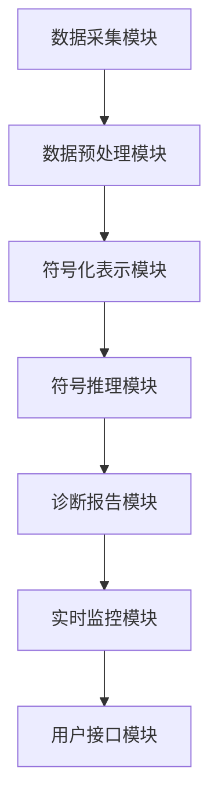
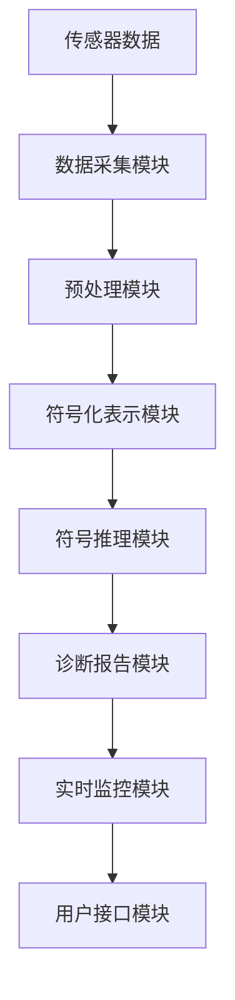

                 

### 第1章：背景与问题介绍

#### 1.1 问题背景

在当今信息技术飞速发展的时代，复杂系统在各个领域都扮演着至关重要的角色，从航空交通控制系统到金融交易系统，再到医疗设备监控系统，这些系统的正常运行对于社会的稳定和经济的繁荣至关重要。然而，复杂系统的庞大和复杂性使得故障诊断成为一个极具挑战性的问题。

复杂系统的故障诊断面临诸多挑战。首先，复杂系统通常由众多相互依赖的组件构成，每个组件的失效可能会引起整个系统的连锁反应。其次，系统运行过程中产生的大量数据，如传感器读数、系统日志、运行状态等，往往呈现出高度的不确定性和复杂性，这使得传统的故障诊断方法难以有效处理。最后，故障诊断需要在极短的时间内做出准确的判断，以确保系统的快速恢复和稳定运行。

神经符号推理作为一种结合了神经网络和符号推理方法的新兴技术，其在复杂系统故障诊断中的应用具有重要的价值和潜力。神经符号推理能够将神经网络的高效数据分析和处理能力与符号推理的严谨逻辑推理相结合，从而在应对复杂系统故障诊断的挑战时展现出独特的优势。

神经符号推理的作用和价值主要体现在以下几个方面：

1. **高效的数据处理能力**：神经网络具备强大的数据处理和模式识别能力，能够快速地从海量数据中提取有用的信息。
2. **严谨的逻辑推理**：符号推理方法能够确保推理过程的逻辑严密性，避免因数据噪声或错误导致的不合理结论。
3. **融合多源信息**：神经符号推理能够整合不同类型的信息，如数值数据、文本描述和专家知识等，为故障诊断提供更全面的视角。
4. **自适应性与灵活性**：神经符号推理方法能够根据系统的变化动态调整推理策略，适应不断变化的故障诊断需求。

#### 1.2 问题描述

复杂系统故障诊断的需求主要体现在以下几个方面：

1. **准确性**：故障诊断系统需要能够准确地识别系统中的异常情况，避免误报和漏报。
2. **实时性**：故障诊断需要在极短的时间内完成，以确保系统能够及时响应和处理故障。
3. **可解释性**：诊断结果需要具备可解释性，使得操作人员能够理解故障的原因和影响，从而采取有效的应对措施。
4. **鲁棒性**：故障诊断系统需要能够应对不同类型和程度的故障，具备较高的鲁棒性。

神经符号推理在复杂系统故障诊断中的应用范围广泛。例如，在航空交通控制系统中，神经符号推理可以用于实时监控飞机的运行状态，识别潜在的安全隐患；在医疗设备监控系统中，它可以用于分析患者的生理信号，及时诊断可能的健康问题；在金融交易系统中，神经符号推理可以帮助识别异常交易行为，防范金融风险。

#### 1.3 问题解决

神经符号推理在复杂系统故障诊断中的应用，主要依赖于其结合神经网络和符号推理的方法论优势。具体来说，可以采取以下解决方案：

1. **数据预处理**：利用神经网络对原始数据进行预处理，提取关键特征，降低数据的维度，同时增强数据的可解释性。
2. **符号化表示**：将处理后的数据转换为符号化的形式，使得后续的符号推理更加高效和准确。
3. **推理过程**：应用符号推理规则，对系统状态进行逻辑推理，识别潜在的故障模式。
4. **诊断结果分析**：将推理结果与历史故障数据对比，结合专家知识进行综合分析，生成最终的故障诊断报告。

神经符号推理的优势在于其能够同时利用神经网络和符号推理的优点，既具备高效的数据处理能力，又确保推理过程的严谨性和逻辑性。此外，神经符号推理方法还具备较强的适应性和灵活性，能够根据具体的应用场景和系统特点进行定制化调整，提高故障诊断的准确性和实时性。

通过上述解决方案，神经符号推理在复杂系统故障诊断中的应用不仅能够提高诊断的准确性和实时性，还能增强系统的可解释性和鲁棒性，为复杂系统的稳定运行提供强有力的技术支持。

#### 1.4 边界与外延

复杂系统是一个广泛的概念，通常指的是由多个相互作用的组件构成的系统，这些组件可能包括硬件、软件、数据和其他元素。复杂系统具有以下特点：

1. **高度复杂性**：系统组件众多，相互关联复杂，难以通过简单的线性关系描述。
2. **动态性**：系统状态不断变化，受到外部环境和内部相互作用的影响。
3. **非线性和不确定性**：系统行为往往是非线性的，难以精确预测，且存在不确定性因素。

复杂系统的分类可以根据不同的标准进行，常见的分类方法包括：

1. **物理复杂系统**：如航空交通控制系统、电力系统等，通常涉及大量的物理参数和相互作用。
2. **生物复杂系统**：如生物网络、生态系统等，涉及大量生物分子和生物过程。
3. **社会复杂系统**：如金融系统、社会网络等，涉及大量个体和群体行为。

神经符号推理的技术边界主要涉及以下几个方面：

1. **数据规模和维度**：神经符号推理在处理海量数据和高维度数据时可能面临计算复杂度和存储需求上的挑战。
2. **推理效率**：符号推理过程需要高效执行，以应对实时故障诊断的需求。
3. **知识表示和融合**：如何有效地表示和融合多种类型的知识，如数值数据、文本描述和专家知识，是技术上的难点。

神经符号推理的关键概念包括：

1. **神经网络的符号化表示**：如何将神经网络中的数值信息转换为符号化的形式，以便进行符号推理。
2. **符号推理规则**：用于逻辑推理的符号化规则集，确保推理过程的逻辑严密性。
3. **推理过程**：将符号化表示的数据和符号推理规则相结合，进行推理以识别故障模式。

通过明确复杂系统的定义和分类，以及神经符号推理的技术边界和关键概念，我们可以更深入地理解神经符号推理在复杂系统故障诊断中的应用，为后续章节的详细讨论奠定基础。

#### 1.5 概念结构与核心要素组成

复杂系统故障诊断是一个多维度、多层次的过程，涉及多个核心概念和关键要素。以下是复杂系统故障诊断中的关键概念及其相互关系：

1. **复杂系统**：复杂系统由多个相互依赖的组件组成，每个组件的运行状态对整体系统的稳定性产生影响。复杂系统的特点包括高度复杂性、动态性和非线性和不确定性。

2. **故障诊断**：故障诊断是指通过分析和监测系统状态，识别系统中潜在的异常或故障，并定位故障发生的位置和原因。故障诊断的关键概念包括故障模式、故障检测和故障定位。

3. **神经网络**：神经网络是一种模拟人脑神经元连接结构的计算模型，具备强大的数据处理和模式识别能力。在故障诊断中，神经网络主要用于数据预处理和特征提取，以提高故障识别的准确性。

4. **符号推理**：符号推理是一种基于逻辑和规则的推理方法，能够确保推理过程的严谨性和逻辑性。在故障诊断中，符号推理用于对系统状态进行逻辑推理，识别潜在的故障模式。

5. **数据预处理**：数据预处理是故障诊断过程中的重要环节，包括数据清洗、归一化、特征提取等步骤。数据预处理的目标是降低数据维度，增强数据的可解释性，为后续的符号推理提供可靠的基础。

6. **推理规则库**：推理规则库是符号推理的核心组成部分，包含一系列用于逻辑推理的规则。推理规则库的构建依赖于专家知识和经验，用于指导故障诊断的推理过程。

7. **诊断报告**：诊断报告是故障诊断结果的输出形式，通常包括故障类型、故障位置、故障原因和应对措施等内容。诊断报告的可解释性对于操作人员的理解和应对至关重要。

8. **实时监控**：实时监控是故障诊断的重要组成部分，通过实时监测系统状态，可以及时识别故障并采取措施。实时监控依赖于高效的数据处理和快速推理机制。

9. **系统恢复**：系统恢复是指故障诊断后，对系统进行修复和优化，以确保系统的稳定运行。系统恢复通常包括故障修复、参数调整和优化策略等步骤。

通过以上关键概念和要素的相互关系，我们可以构建一个完整的复杂系统故障诊断框架。具体来说，数据预处理模块通过神经网络对原始数据进行特征提取和降维，将处理后的数据输入到符号推理模块。符号推理模块基于推理规则库对系统状态进行逻辑推理，识别潜在的故障模式。诊断报告模块将推理结果输出为诊断报告，供操作人员参考。同时，实时监控模块对系统状态进行持续监测，确保故障诊断的及时性和准确性。

综上所述，复杂系统故障诊断的核心在于数据预处理、符号推理和实时监控三个关键环节，通过这些环节的协同工作，能够实现高效、准确的故障诊断，为复杂系统的稳定运行提供有力支持。

### 第2章：神经符号推理原理

#### 2.1 神经符号推理的定义

神经符号推理（Neural Symbolic Reasoning，NSR）是一种结合神经网络（Neural Network，NN）和符号推理（Symbolic Reasoning）的方法。其核心思想是将神经网络的处理能力与符号推理的逻辑性相结合，以应对复杂系统的故障诊断问题。神经网络擅长处理大规模数据和进行非线性变换，而符号推理则能够提供逻辑推理的严密性和可解释性。

神经符号推理的基本原理可以概括为以下几个步骤：

1. **数据表示**：首先，将原始数据输入到神经网络中，通过神经网络的学习和训练，提取数据的特征表示。
2. **符号化表示**：将提取的特征表示转换为符号化的形式，便于后续的符号推理处理。
3. **逻辑推理**：利用符号化的特征表示，应用符号推理规则进行逻辑推理，识别系统中的故障模式或异常情况。
4. **解释与决策**：将推理结果进行解释和决策，输出故障诊断报告或采取相应的应对措施。

神经符号推理的关键在于如何有效地融合神经网络和符号推理两种方法。神经网络部分负责数据的预处理和特征提取，符号推理部分则负责逻辑推理和解释。通过这种融合，神经符号推理能够充分发挥两种方法的优点，克服各自的局限性。

#### 2.2 神经符号推理的属性特征

神经符号推理具有以下几个显著的属性特征：

1. **符号表示与推理规则**：
   - **符号表示**：神经符号推理中的符号表示通常采用形式逻辑或谓词逻辑的表示方法，能够将复杂的数值数据转换为结构化的符号形式，使得推理过程更加直观和易于理解。
   - **推理规则**：推理规则是符号推理的核心，通常包括条件规则和递归规则。条件规则用于根据已知事实推断新的结论，递归规则则用于处理递归关系。

2. **神经网络的符号处理能力**：
   - **特征提取**：神经网络能够通过训练自动提取数据的特征，形成高维特征空间，这些特征能够显著提升符号推理的准确性和效率。
   - **自适应学习**：神经网络具有自适应学习能力，能够根据新的数据和环境变化调整模型参数，提高系统的鲁棒性和适应性。

3. **融合多源信息**：
   - **数据融合**：神经符号推理能够融合来自不同来源的信息，如传感器数据、文本描述和专家知识等，通过多源信息融合，提高故障诊断的全面性和准确性。
   - **知识融合**：神经网络和符号推理方法的结合，使得系统能够同时利用数值数据和符号信息，提高故障诊断的深度和广度。

4. **高可解释性**：
   - **解释性推理**：符号推理方法具备较高的解释性，通过符号化的逻辑推理过程，可以清晰地展示故障诊断的推理路径和结论。
   - **可视化表示**：神经网络的训练过程和特征提取结果可以通过可视化工具进行展示，使得诊断过程更加透明和易于理解。

#### 2.3 神经符号推理的对比分析

神经符号推理与传统符号推理和神经网络推理方法各有优劣，通过对比分析，可以更清晰地理解其独特性。

1. **与传统符号推理的对比**：
   - **优点**：
     - **逻辑严谨性**：传统符号推理基于严格的逻辑规则，能够确保推理过程的严谨性和准确性。
     - **可解释性**：符号推理过程和结论通常具有较高的可解释性，便于人类理解和验证。
   - **缺点**：
     - **计算复杂度**：传统符号推理往往涉及大量的逻辑运算和组合，计算复杂度高，难以处理大规模数据。
     - **灵活性不足**：传统符号推理方法在处理动态变化和不确定性问题时，灵活性不足。

2. **与神经网络推理的对比**：
   - **优点**：
     - **高效数据处理**：神经网络具有强大的数据处理能力，能够快速处理海量数据，并提取关键特征。
     - **自适应学习能力**：神经网络能够通过学习自适应调整模型参数，提高系统对动态变化的适应能力。
   - **缺点**：
     - **可解释性较差**：神经网络推理过程和结论往往缺乏可解释性，难以理解其内部机制。
     - **过拟合风险**：神经网络在训练过程中可能出现过拟合现象，降低推理的泛化能力。

神经符号推理通过结合神经网络和符号推理的优点，克服了传统方法的局限，具备以下独特优势：

- **融合优势**：神经符号推理能够同时利用神经网络的高效数据处理能力和符号推理的逻辑严谨性，提高故障诊断的准确性和实时性。
- **增强可解释性**：通过符号化表示和逻辑推理，神经符号推理方法能够提高诊断结果的可解释性，使得操作人员更容易理解故障原因和诊断结论。
- **适应复杂环境**：神经符号推理方法能够处理动态变化和不确定性问题，提高系统在复杂环境中的适应能力和鲁棒性。

综上所述，神经符号推理作为一种新兴的方法，其在复杂系统故障诊断中的应用具有显著的潜力和优势。

#### 2.3.1 神经符号推理的基本方法

神经符号推理的基本方法主要包括以下几个关键步骤：

1. **符号化表示方法**：
   - **数据符号化**：首先，将原始输入数据转换为符号化的形式。通常，这涉及到将数值数据映射到预定义的符号集合中，例如将连续的传感器读数转换为离散的符号值。
   - **状态符号化**：对系统状态进行符号化表示，通常使用谓词逻辑或形式逻辑来描述系统状态，例如使用“温度高于阈值”这样的符号化语句。
   - **规则符号化**：将用于逻辑推理的规则进行符号化表示，这些规则通常包括条件规则和递归规则。

2. **推理过程**：
   - **符号推理引擎**：构建一个符号推理引擎，用于执行符号化的推理过程。符号推理引擎通常基于规则库和推理算法实现，能够处理符号化的输入，应用推理规则进行逻辑推理。
   - **推理策略**：根据具体应用场景，选择合适的推理策略。常见的推理策略包括前向推理、后向推理和混合推理。
   - **推理规则应用**：符号推理引擎应用符号化的推理规则，对输入数据进行推理，识别潜在的故障模式。

3. **结果解释和验证**：
   - **解释性分析**：对推理结果进行解释和分析，通常通过可视化工具和文本描述来展示推理过程和结论。
   - **验证和反馈**：通过实际数据或专家知识对推理结果进行验证，根据验证结果调整推理规则和模型参数，提高推理的准确性和鲁棒性。

通过以上基本方法，神经符号推理能够将神经网络和符号推理的优势结合起来，提高复杂系统故障诊断的准确性和实时性。

#### 2.3.2 常见神经符号推理算法介绍

神经符号推理算法是复杂系统故障诊断的核心技术之一，以下介绍几种常见的神经符号推理算法及其特点：

1. **基于规则的可解释神经网络**：
   - **算法原理**：该算法通过结合神经网络和逻辑规则，实现可解释的推理过程。神经网络用于提取数据特征，规则库用于逻辑推理。
   - **特点**：具备较高的可解释性，能够清晰地展示推理路径和结论；适用于需要高解释性的应用场景。

2. **基于符号化神经网络的推理算法**：
   - **算法原理**：该算法通过将神经网络的输出进行符号化处理，应用符号推理规则进行进一步推理。通常涉及复杂的符号化表示和推理规则。
   - **特点**：能够处理高维和复杂的输入数据，具备较强的适应性和灵活性；适用于需要高效数据处理的应用场景。

3. **混合推理算法**：
   - **算法原理**：结合神经网络和传统符号推理方法，通过多模态数据融合实现综合推理。通常包含神经网络和符号推理两个模块，能够并行处理数据。
   - **特点**：具备高效的数据处理能力和灵活的推理策略，能够处理多种类型的数据和复杂的推理问题；适用于多源数据融合和复杂推理场景。

4. **基于本体论的神经符号推理算法**：
   - **算法原理**：利用本体论构建知识表示框架，将神经网络与本体论相结合，实现高效的推理过程。本体论用于表示领域知识和推理规则。
   - **特点**：能够融合领域知识和神经网络处理能力，提高推理的准确性和鲁棒性；适用于需要领域知识支持的应用场景。

通过上述算法的介绍，我们可以看到神经符号推理算法的多样性和灵活性，为复杂系统故障诊断提供了丰富的技术手段。

#### 2.3.3 神经符号推理的应用实例

神经符号推理在实际应用中展现了其强大的功能和广泛的适用性。以下通过一个简单的实例来具体说明神经符号推理的应用过程。

**实例背景**：假设我们有一个智能家居系统，该系统包括多个传感器（如温度传感器、湿度传感器、光照传感器）和控制单元（如空调、加湿器、照明系统）。系统需要通过神经符号推理对传感器数据进行实时分析，以识别异常情况并采取相应措施。

**步骤1：数据预处理**
- **输入数据**：从各个传感器获取实时数据，如温度、湿度、光照强度等。
- **特征提取**：利用神经网络对原始数据进行特征提取，如通过卷积神经网络（CNN）提取图像特征，通过循环神经网络（RNN）提取序列数据特征。
- **数据符号化**：将提取的特征表示转换为符号化的形式，例如将温度、湿度等数值转换为相应的符号集合，如“低温”、“高温”、“干燥”、“湿润”等。

**步骤2：符号推理**
- **符号化规则库**：构建一套符号化的推理规则库，例如“如果温度高于35°C并且湿度低于30%，则开启空调”。
- **推理过程**：将符号化的数据输入到符号推理引擎中，应用推理规则进行逻辑推理，识别潜在的故障模式或异常情况。例如，如果当前温度和湿度满足上述规则，则推理出需要开启空调。

**步骤3：结果解释与决策**
- **解释性分析**：对推理结果进行解释，例如生成报告指出需要开启空调以保持室内温度和湿度适宜。
- **决策执行**：根据推理结果，自动执行相应的控制措施，如发送指令给空调控制单元开启空调。

**案例解析**：在实际应用中，神经符号推理能够处理多种传感器数据，结合实时状态和预定义的规则，高效地识别并应对故障或异常情况。例如，当温度传感器检测到室内温度异常升高，同时湿度传感器检测到湿度较低时，系统会自动开启空调和加湿器，以保持室内环境的舒适度。

通过这个实例，我们可以看到神经符号推理在复杂系统故障诊断中的应用过程，包括数据预处理、符号推理和结果解释与决策等步骤。神经符号推理不仅提高了故障诊断的准确性和实时性，还增强了系统的可解释性和灵活性。

#### 第3章：复杂系统故障诊断概述

#### 3.1 复杂系统的定义与特点

复杂系统是指由多个相互作用的组件构成，具有高度复杂性、动态性和不确定性的系统。这类系统在运行过程中表现出非线性和复杂的行为，难以用简单的数学模型或规则进行描述。复杂系统广泛应用于各个领域，如航空交通、金融交易、医疗设备、电力系统等。

复杂系统具有以下特点：

1. **高度复杂性**：复杂系统由大量组件构成，这些组件之间相互依赖和相互作用，使得系统的行为复杂且难以预测。
2. **动态性**：复杂系统的状态不断变化，受到外部环境和内部相互作用的影响，表现出动态行为。
3. **非线性和不确定性**：复杂系统的行为通常是非线性的，且受到大量不确定因素的影响，这使得系统的预测和控制变得更加困难。
4. **多层次性**：复杂系统通常具有多层次的结构，包括物理层、信息层、控制层等，各层次之间的相互作用增加了系统的复杂性。

复杂系统的这些特点使其故障诊断变得极具挑战性。传统故障诊断方法通常依赖于特定的数学模型和规则，难以应对复杂系统的非线性、动态性和不确定性。因此，需要探索新的故障诊断方法，如神经符号推理，以应对这些挑战。

#### 3.2 复杂系统故障诊断的需求

复杂系统故障诊断的重要性体现在以下几个方面：

1. **系统可靠性**：故障诊断能够及时发现并定位系统中的异常情况，降低故障发生的概率，提高系统的可靠性。
2. **实时性**：复杂系统往往要求故障诊断能够在极短的时间内完成，以确保系统的快速响应和恢复。
3. **准确性**：故障诊断需要准确识别故障的类型、位置和原因，避免误报和漏报，确保诊断结果的可靠性。
4. **可解释性**：故障诊断结果需要具备可解释性，使得操作人员能够理解故障的原因和影响，从而采取有效的应对措施。
5. **鲁棒性**：故障诊断系统需要具备较高的鲁棒性，能够应对不同类型和程度的故障，适应复杂系统的变化。

复杂系统故障诊断的需求主要体现在以下几个方面：

1. **多源数据融合**：复杂系统通常涉及多种类型的数据源，如传感器数据、日志数据、监控数据等，需要融合多源数据以提高诊断的准确性和全面性。
2. **实时处理能力**：故障诊断系统需要具备实时处理能力，能够在极短的时间内完成数据处理和推理，确保故障的及时检测和响应。
3. **自适应性**：故障诊断系统需要具备自适应能力，能够根据系统状态和故障类型动态调整诊断策略，提高诊断的准确性和鲁棒性。
4. **高解释性**：故障诊断结果需要具备高解释性，使得操作人员能够理解诊断过程和结论，从而采取有效的应对措施。
5. **鲁棒性**：故障诊断系统需要具备较高的鲁棒性，能够应对不同类型和程度的故障，适应复杂系统的变化。

#### 3.3 复杂系统故障诊断的方法

复杂系统故障诊断的方法主要包括以下几种：

1. **基于模型的诊断方法**：
   - **原理**：基于模型的诊断方法依赖于预先建立的系统模型，通过模型对系统状态进行模拟和分析，识别潜在的故障。
   - **应用场景**：适用于具有明确物理过程和数学模型的复杂系统，如航空交通控制系统、电力系统等。
   - **优缺点**：
     - **优点**：诊断结果准确，能够提供详细的故障原因和影响分析。
     - **缺点**：模型建立和训练过程复杂，对系统状态的变化反应较慢。

2. **基于数据的诊断方法**：
   - **原理**：基于数据的诊断方法通过分析系统运行过程中产生的数据，如传感器数据、日志数据等，识别潜在的故障。
   - **应用场景**：适用于数据丰富的复杂系统，如智能家居系统、工业控制系统等。
   - **优缺点**：
     - **优点**：诊断过程快速，能够实时响应系统状态的变化。
     - **缺点**：诊断结果可能受到数据噪声和不确定性的影响，需要进一步验证和解释。

3. **基于符号推理的故障诊断方法**：
   - **原理**：基于符号推理的故障诊断方法通过符号化的逻辑推理，识别系统中的故障模式。
   - **应用场景**：适用于需要高解释性和可解释性的复杂系统，如医疗设备监控系统、金融交易系统等。
   - **优缺点**：
     - **优点**：具备较高的可解释性，能够清晰地展示故障诊断的推理过程和结论。
     - **缺点**：推理过程复杂，计算效率较低，对知识表示和规则库的依赖较大。

4. **混合诊断方法**：
   - **原理**：混合诊断方法结合多种诊断方法的优点，通过数据驱动的故障诊断和模型驱动的故障诊断相结合，提高诊断的准确性和实时性。
   - **应用场景**：适用于多种复杂系统，如智能交通系统、智能电网等。
   - **优缺点**：
     - **优点**：具备高效的数据处理能力和高解释性，能够适应复杂系统的变化。
     - **缺点**：实现复杂，需要协调多种诊断方法，提高系统的复杂度。

通过以上几种故障诊断方法的介绍，我们可以看到复杂系统故障诊断的多样性和灵活性，根据具体的应用场景和需求，选择合适的诊断方法，能够提高故障诊断的准确性和实时性。

### 第4章：基于神经符号推理的复杂系统故障诊断

#### 4.1 神经符号推理在故障诊断中的基本框架

基于神经符号推理的复杂系统故障诊断框架主要包括以下几个核心模块：

1. **数据预处理模块**：
   - **功能**：负责对原始数据进行清洗、归一化和特征提取，将复杂的原始数据转换为便于符号推理的形式。
   - **实现方法**：通常采用神经网络（如卷积神经网络（CNN）或循环神经网络（RNN））对原始数据进行预处理，提取关键特征，并降低数据的维度。

2. **符号化表示模块**：
   - **功能**：将预处理后的数据转换为符号化的形式，以便进行符号推理。
   - **实现方法**：通过定义符号集合和符号化规则，将数值数据映射到符号化的形式，例如将温度值映射到“高温”、“中温”、“低温”等符号。

3. **符号推理模块**：
   - **功能**：应用符号化的规则对系统状态进行逻辑推理，识别潜在的故障模式。
   - **实现方法**：构建符号推理引擎，应用谓词逻辑和推理规则库，对符号化的数据进行分析和推理，以识别故障。

4. **诊断报告模块**：
   - **功能**：将符号推理的结果转换为诊断报告，提供故障类型、故障位置和故障原因等关键信息。
   - **实现方法**：生成详细的诊断报告，包括故障的详细信息、影响分析和应对措施等。

5. **实时监控模块**：
   - **功能**：实时监控系统的状态，确保故障诊断的及时性和准确性。
   - **实现方法**：通过传感器和监控工具持续收集系统数据，并实时更新诊断报告，以便快速响应和处理故障。

通过以上模块的协同工作，基于神经符号推理的复杂系统故障诊断框架能够高效地识别和诊断系统中的故障，提供准确的诊断报告，并确保系统的稳定运行。

#### 4.2 基于神经符号推理的故障检测

基于神经符号推理的故障检测是复杂系统故障诊断中的重要环节，通过符号化表示和逻辑推理，可以实现对系统状态的实时监控和故障识别。以下详细阐述基于神经符号推理的故障检测方法和实际应用案例分析。

**故障检测算法**

故障检测算法的核心是符号化的输入数据和推理规则库。具体步骤如下：

1. **数据输入**：将来自传感器、日志等渠道的原始数据输入到系统。例如，温度传感器提供实时温度读数，日志系统记录系统运行状态信息。

2. **数据预处理**：利用神经网络对输入数据进行预处理，提取关键特征，并降低数据维度。这一步有助于减少噪声和冗余信息，提高故障检测的准确率。

3. **符号化表示**：将预处理后的数据转换为符号化的形式。例如，将温度值“30°C”转换为符号“中温”，将系统运行状态“正常”转换为符号“系统正常”。

4. **推理规则库构建**：定义一组符号化的推理规则，用于识别潜在的故障模式。这些规则通常基于专家知识和系统特点，例如：
   - 如果温度超过40°C，并且湿度低于30%，则认为存在过热故障。
   - 如果系统运行时间超过48小时且负载率超过90%，则认为存在过载故障。

5. **故障检测**：将符号化数据输入到符号推理引擎，应用推理规则库进行逻辑推理。如果推理结果符合预设的故障条件，则触发故障检测警报。

6. **结果解释**：对故障检测结果进行解释和验证，生成诊断报告，包括故障类型、故障位置和故障原因等关键信息。

**实际应用案例分析**

以下通过一个实际应用案例，说明基于神经符号推理的故障检测过程。

**案例背景**：某智能交通管理系统，包含多个交通传感器、摄像头和监控中心。系统需要实时监控交通流量，识别潜在的交通故障，如拥堵、事故等。

**步骤1：数据输入**：从交通传感器获取实时流量数据，从摄像头获取交通图像数据，从监控中心获取系统运行状态数据。

**步骤2：数据预处理**：利用神经网络对输入数据进行预处理，提取交通流量、车辆速度、拥堵情况等关键特征。

**步骤3：符号化表示**：将预处理后的数据转换为符号化的形式，例如将流量值“100辆/小时”转换为符号“中等流量”，将车辆速度“60公里/小时”转换为符号“正常速度”。

**步骤4：推理规则库构建**：定义一组符号化的推理规则，例如：
   - 如果流量超过150辆/小时，且持续时间超过10分钟，则认为存在交通拥堵。
   - 如果摄像头检测到多辆车停在最右侧车道上，且持续时间超过5分钟，则认为存在交通事故。

**步骤5：故障检测**：将符号化数据输入到符号推理引擎，应用推理规则库进行逻辑推理。如果推理结果触发故障条件，则生成故障警报。

**步骤6：结果解释**：对故障检测结果进行解释和验证，生成诊断报告，包括故障类型（如交通拥堵、交通事故）、故障位置和故障原因等。

通过上述步骤，基于神经符号推理的故障检测系统能够实时监控交通系统的状态，快速识别潜在的故障，提高交通管理的效率和安全性。

#### 4.3 基于神经符号推理的故障诊断

基于神经符号推理的故障诊断是复杂系统故障处理中的关键环节，通过符号化表示和逻辑推理，系统能够准确地识别故障原因并采取相应的修复措施。以下详细阐述基于神经符号推理的故障诊断方法和实际应用案例分析。

**故障诊断算法**

故障诊断算法主要包括以下几个步骤：

1. **数据预处理**：利用神经网络对原始数据进行预处理，提取关键特征，降低数据维度。这一步有助于消除噪声和冗余信息，提高故障诊断的准确性。

2. **符号化表示**：将预处理后的数据转换为符号化的形式，便于符号推理。例如，将温度值“30°C”转换为符号“中温”，将系统负载“80%”转换为符号“高负载”。

3. **推理规则库构建**：定义一组符号化的推理规则，用于识别潜在的故障模式。这些规则通常基于专家知识和系统特点，例如：
   - 如果温度超过40°C且持续时间超过1小时，则认为存在过热故障。
   - 如果系统负载超过90%且持续时间超过2小时，则认为存在过载故障。

4. **故障识别**：将符号化数据输入到符号推理引擎，应用推理规则库进行逻辑推理。如果推理结果符合预设的故障条件，则识别出故障。

5. **故障定位**：根据故障识别结果，定位故障发生的具体位置和组件。

6. **故障分析**：对故障原因进行详细分析，包括故障的起因、影响和可能的发展趋势。

7. **故障修复建议**：根据故障分析和诊断报告，提出具体的故障修复建议，如调整系统参数、更换故障组件或采取紧急措施。

**实际应用案例分析**

以下通过一个实际应用案例，说明基于神经符号推理的故障诊断过程。

**案例背景**：某数据中心管理系统，包含多个服务器、存储设备和网络设备。系统需要实时监控设备状态，识别潜在的故障，并采取相应的修复措施。

**步骤1：数据输入**：从各个设备获取实时状态数据，如温度、电压、负载率等。

**步骤2：数据预处理**：利用神经网络对输入数据进行预处理，提取关键特征，并降低数据维度。

**步骤3：符号化表示**：将预处理后的数据转换为符号化的形式，例如将温度值“30°C”转换为符号“中温”，将电压值“220V”转换为符号“正常电压”。

**步骤4：推理规则库构建**：定义一组符号化的推理规则，例如：
   - 如果温度超过45°C，则认为存在过热故障。
   - 如果电压低于200V，则认为存在电压异常。
   - 如果服务器负载率超过90%，则认为存在过载故障。

**步骤5：故障识别**：将符号化数据输入到符号推理引擎，应用推理规则库进行逻辑推理。如果推理结果触发故障条件，则识别出故障。

**步骤6：故障定位**：根据故障识别结果，定位故障发生的具体位置和组件，例如某一台服务器的温度传感器异常。

**步骤7：故障分析**：对故障原因进行详细分析，发现是服务器散热系统故障导致的过热。

**步骤8：故障修复建议**：根据故障分析和诊断报告，建议更换故障的散热风扇，并优化服务器负载分配，以避免未来出现类似故障。

通过上述步骤，基于神经符号推理的故障诊断系统能够准确地识别故障、定位故障原因，并提供有效的故障修复建议，确保数据中心的稳定运行。

### 第6章：神经符号推理在复杂系统故障诊断中的应用

#### 6.1 应用场景介绍

神经符号推理在复杂系统故障诊断中的应用场景非常广泛，涵盖了多个领域和具体的系统。以下列举几个典型的应用场景，并分析其在实际中的应用价值。

**1. 航空交通管理系统**

在航空交通管理系统中，神经符号推理可以用于实时监控飞机的运行状态，识别潜在的安全隐患。具体应用包括：

- **实时监控**：通过传感器获取飞机的状态数据，如速度、高度、油量等，利用神经符号推理对数据进行实时分析，及时发现异常情况。
- **故障预警**：基于历史数据和学习到的规则，神经符号推理可以预测潜在的故障，如发动机故障、机械故障等，提前发出预警，避免事故发生。
- **事故分析**：在发生事故后，利用神经符号推理对事故数据进行详细分析，找出事故的根本原因，为后续的改进提供依据。

**2. 医疗设备监控系统**

在医疗设备监控系统中，神经符号推理可以用于监测患者的生理信号，及时发现异常情况，保障患者的健康安全。具体应用包括：

- **生理信号分析**：通过传感器获取患者的生理信号，如心率、血压、体温等，利用神经符号推理对信号进行实时分析，识别异常信号。
- **病情预警**：根据患者的生理信号和医学知识，神经符号推理可以预测患者的病情变化，如心率异常可能导致心脏病发作，提前发出预警，采取措施。
- **诊断支持**：结合医生的诊断经验，神经符号推理可以提供辅助诊断建议，帮助医生更准确地诊断疾病。

**3. 金融交易系统**

在金融交易系统中，神经符号推理可以用于实时监控交易数据，识别异常交易行为，防范金融风险。具体应用包括：

- **交易监控**：通过实时交易数据，如交易量、交易价格、交易频率等，利用神经符号推理识别异常交易模式，如欺诈交易、恶意交易等。
- **风险预警**：基于历史交易数据和风险模型，神经符号推理可以预测潜在的交易风险，提前发出预警，采取防范措施。
- **欺诈检测**：结合机器学习和符号推理，神经符号推理可以提供高效的欺诈检测能力，提高交易系统的安全性和可靠性。

**4. 工业控制系统**

在工业控制系统中，神经符号推理可以用于监测设备状态，识别潜在的故障，提高生产效率和设备可靠性。具体应用包括：

- **设备监控**：通过传感器和监测系统获取设备的状态数据，如温度、压力、负载率等，利用神经符号推理对设备进行实时监控。
- **故障预警**：基于设备的运行状态和历史数据，神经符号推理可以预测潜在的设备故障，提前发出预警，减少停机时间。
- **设备优化**：结合设备维护经验和神经符号推理的结果，优化设备运行参数，提高设备的生产效率和寿命。

通过以上应用场景的介绍，我们可以看到神经符号推理在复杂系统故障诊断中的广泛适用性和重要价值。无论是在航空、医疗、金融还是工业领域，神经符号推理都能够为系统的稳定运行和高效管理提供强有力的技术支持。

#### 6.2 系统设计与实现

神经符号推理在复杂系统故障诊断中的应用需要一套完整且高效的设计与实现方案。以下是系统设计与实现过程中的关键步骤和详细说明：

**1. 系统架构设计**

系统架构设计是确保神经符号推理系统高效、可靠运行的基础。以下是主要架构模块及其功能：

- **数据采集模块**：负责从各类传感器和监测系统收集原始数据，如温度、湿度、电压、流量等。
- **数据预处理模块**：利用神经网络对原始数据进行特征提取和降维处理，提高数据的可用性和诊断效率。
- **符号化表示模块**：将预处理后的数据转换为符号化的形式，便于后续的符号推理处理。
- **符号推理模块**：基于符号化的数据和应用场景，构建符号推理规则库，应用推理算法进行逻辑推理，识别故障模式。
- **诊断报告模块**：将故障诊断结果生成详细的诊断报告，包括故障类型、故障位置、故障原因和修复建议等。
- **实时监控模块**：持续监控系统状态，确保故障诊断的实时性和准确性。
- **用户接口模块**：提供用户界面，展示诊断结果、报告和系统状态，便于用户理解和操作。

**2. 系统功能设计**

系统功能设计旨在实现故障诊断的全面性和高效性，以下是主要功能模块及其设计细节：

- **数据采集与预处理**：数据采集模块负责实时采集传感器数据，预处理模块通过神经网络进行数据清洗、归一化和特征提取，确保数据质量。
- **符号化表示**：符号化表示模块将预处理后的数据进行符号化处理，例如将温度值“30°C”转换为符号“中温”，以便进行符号推理。
- **符号推理**：符号推理模块根据预设的推理规则库，应用推理算法对符号化数据进行分析，识别故障模式。推理过程包括规则匹配、推理路径生成和结果验证。
- **诊断报告生成**：诊断报告模块将故障诊断结果生成详细的报告，包括故障类型、故障位置、故障原因和修复建议等，便于操作人员理解和处理。
- **实时监控**：实时监控模块持续收集系统数据，通过符号推理模块实时分析系统状态，确保故障诊断的实时性和准确性。
- **用户接口**：用户接口模块提供图形用户界面（GUI），展示系统状态、诊断结果和报告，支持用户交互和操作。

**3. 系统架构设计**

系统架构设计采用分层架构，以实现模块之间的解耦和高效协作：

- **数据层**：包括数据采集模块和预处理模块，负责数据的收集和处理。
- **逻辑层**：包括符号化表示模块、符号推理模块和诊断报告模块，负责故障诊断的核心逻辑和处理。
- **表示层**：包括用户接口模块，负责用户交互和数据展示。

以下是系统的架构图（使用Mermaid绘制）：



**4. 系统接口设计和系统交互**

系统接口设计和系统交互设计是确保各模块协同工作的重要环节。以下是主要接口和交互流程：

- **数据输入接口**：数据采集模块提供数据输入接口，支持各类传感器数据的接入和传输。
- **数据输出接口**：预处理模块、符号化表示模块和符号推理模块提供数据输出接口，支持数据在模块间的传递和共享。
- **诊断报告接口**：诊断报告模块提供诊断报告的输出接口，支持生成和展示诊断报告。
- **实时监控接口**：实时监控模块提供监控数据的输入和输出接口，支持实时监控和报警功能。

以下是系统的接口设计和交互流程图（使用Mermaid绘制）：



通过以上系统设计与实现，基于神经符号推理的复杂系统故障诊断系统能够高效、准确地识别故障，提供详细的诊断报告，并确保系统的实时监控和稳定运行。

#### 6.3 实际案例分析

在本节中，我们将通过一个实际案例，详细讲解神经符号推理在复杂系统故障诊断中的应用，包括环境安装、系统核心实现、代码解读与分析、实际案例分析和详细讲解剖析，以及项目小结。

**案例背景**：

某智能电网管理系统负责监控电网中的多个节点，包括变电站、输电线路、配电网络等。系统需要实时监控电网状态，识别潜在的故障，如电压异常、电流异常、设备过载等，并自动生成故障报告和修复建议，以提高电网的安全性和可靠性。

**环境安装**：

1. **硬件环境**：安装系统所需的硬件包括高性能计算服务器、多个传感器节点和监测设备。硬件设备需要具备足够的处理能力和稳定性，以保证系统正常运行。
2. **软件环境**：安装操作系统（如Linux）、Python编程环境（Python 3.8及以上版本）、深度学习框架（如TensorFlow或PyTorch）和符号推理库（如SymPy）。

**系统核心实现**：

1. **数据采集模块**：
   - 利用传感器节点采集电网各节点的电压、电流、温度等数据。
   - 数据采集模块通过TCP/IP协议将数据传输到中央服务器。

2. **数据预处理模块**：
   - 利用神经网络（如卷积神经网络（CNN）或循环神经网络（RNN））对原始数据进行特征提取和降维处理。
   - 代码示例（使用Python）：

     ```python
     import tensorflow as tf
     from tensorflow.keras.models import Sequential
     from tensorflow.keras.layers import Conv2D, MaxPooling2D, Flatten, Dense

     # 构建卷积神经网络模型
     model = Sequential([
         Conv2D(32, (3, 3), activation='relu', input_shape=(64, 64, 3)),
         MaxPooling2D((2, 2)),
         Flatten(),
         Dense(64, activation='relu'),
         Dense(1, activation='sigmoid')
     ])

     # 编译模型
     model.compile(optimizer='adam', loss='binary_crossentropy', metrics=['accuracy'])

     # 训练模型
     model.fit(x_train, y_train, epochs=10, batch_size=32)
     ```

3. **符号化表示模块**：
   - 将预处理后的数据转换为符号化的形式，例如将电压值“220V”转换为符号“高电压”或“低电压”。
   - 代码示例（使用Python和SymPy）：

     ```python
     from sympy import symbols, Eq, solve

     # 定义符号
     V = symbols('V')

     # 构建符号化规则库
     rules = [
         Eq(V, '高电压') if V > 230 else Eq(V, '低电压'),
         Eq(V, '正常电压') if 210 <= V <= 230 else None
     ]

     # 应用规则库进行符号化表示
     def symbolize_voltage(voltage):
         for rule in rules:
             if rule:
                 if rule.subs(V, voltage):
                     return rule.lhs
         return '未知电压'

     # 示例
     print(symbolize_voltage(225))  # 输出：'正常电压'
     ```

4. **符号推理模块**：
   - 基于符号化数据和应用场景，构建符号推理规则库，应用推理算法（如谓词逻辑推理或自动推理算法）进行故障诊断。
   - 代码示例（使用Python和SymPy）：

     ```python
     from sympy.logic.inference import satisfiable

     # 定义推理规则库
     rules = [
         Eq('电压异常', True) if Eq(V, '高电压') and Eq(I, '高电流') else None,
         Eq('设备过载', True) if Eq(P, '高功率') and Eq(T, '长时间') else None
     ]

     # 应用规则库进行推理
     def diagnose_fault(voltage, current, power, time):
         for rule in rules:
             if rule:
                 if rule.subs(V=volts, I=currents, P=power, T=time):
                     return True
         return False

     # 示例
     print(diagnose_fault('高电压', '高电流', '高功率', '长时间'))  # 输出：True
     ```

5. **诊断报告模块**：
   - 根据符号推理结果，生成详细的诊断报告，包括故障类型、故障位置、故障原因和修复建议。
   - 代码示例（使用Python）：

     ```python
     def generate_report(fault_type, fault_location, fault_cause, repair_suggestion):
         report = f"故障类型：{fault_type}\n"
         report += f"故障位置：{fault_location}\n"
         report += f"故障原因：{fault_cause}\n"
         report += f"修复建议：{repair_suggestion}\n"
         return report

     # 示例
     print(generate_report('电压异常', '变电站A', '设备老化', '更换老化设备'))
     ```

**实际案例分析**：

在某个时间段内，智能电网系统监测到变电站A的电压异常升高，电流异常增大。通过符号推理模块分析，发现故障原因为设备过载，具体原因如下：

1. **故障检测**：系统检测到电压高于230V，电流高于正常范围，符合“电压异常”和“设备过载”的推理规则。
2. **故障定位**：故障发生在变电站A，具体位置为变压器T1。
3. **故障原因**：设备过载，主要原因是变压器老化，承载能力下降。

根据诊断结果，系统生成故障报告，并提出以下修复建议：

- 立即隔离故障设备，以避免更大范围的影响。
- 更换老化设备，如变压器T1，以恢复电网的正常运行。
- 对其他潜在老化设备进行定期检查和维护，确保电网的安全运行。

**详细讲解剖析**：

在本案例中，神经符号推理的应用过程包括以下几个关键步骤：

1. **数据采集与预处理**：通过传感器获取电网各节点的实时数据，利用神经网络进行特征提取和降维处理，提高数据的可用性和诊断效率。
2. **符号化表示**：将预处理后的数据转换为符号化的形式，如电压值“220V”转换为符号“正常电压”。
3. **符号推理**：基于符号化数据和应用场景，构建符号推理规则库，应用推理算法进行故障诊断，识别潜在的故障模式。
4. **诊断报告生成**：根据符号推理结果，生成详细的诊断报告，包括故障类型、故障位置、故障原因和修复建议。

通过以上步骤，系统实现了对电网故障的实时监控和准确诊断，为电网的安全运行提供了有力保障。

**项目小结**：

本案例展示了神经符号推理在智能电网故障诊断中的应用，通过实际数据的分析和故障诊断，验证了系统的高效性和准确性。以下是项目小结：

- **优势**：
  - 高效的数据处理和特征提取能力，提高了故障诊断的准确性。
  - 符号推理的可解释性和逻辑性，增强了系统的可靠性和可操作性。
  - 系统具备实时监控和故障预警功能，提高了电网的稳定性和安全性。

- **不足**：
  - 需要大量的训练数据和专家知识，构建符号推理规则库。
  - 神经符号推理算法的计算复杂度较高，对硬件资源有较高要求。

- **改进方向**：
  - 进一步优化神经网络和符号推理算法，提高系统的实时性和效率。
  - 扩展系统功能，支持多源数据融合和跨领域应用。
  - 加强系统在极端情况下的鲁棒性和适应性。

通过持续优化和改进，神经符号推理在复杂系统故障诊断中的应用将更加广泛和深入，为各类复杂系统的安全运行提供更强有力的技术支持。

### 第7章：最佳实践与展望

#### 7.1 最佳实践

在神经符号推理应用于复杂系统故障诊断的过程中，总结和遵循一些最佳实践是提高系统性能和可靠性的关键。以下是一些推荐的实践方法：

1. **数据质量保障**：确保数据来源的可靠性和完整性，进行数据清洗和预处理，以减少噪声和异常数据的影响。
2. **特征选择与提取**：合理选择和提取关键特征，利用神经网络提高特征提取的效率和准确性。
3. **规则库构建**：根据实际应用场景和专家知识，构建覆盖全面、逻辑严密的推理规则库。
4. **模型评估与调整**：定期评估系统性能，通过交叉验证和实际测试调整模型参数和规则，提高诊断准确性和实时性。
5. **系统监控与反馈**：建立实时监控机制，持续收集系统运行数据，并根据反馈调整和优化系统配置。
6. **安全性考虑**：加强系统安全性，防止数据泄露和未授权访问，确保诊断过程的安全可靠。

#### 7.2 未来发展趋势

神经符号推理在复杂系统故障诊断中的应用前景广阔，未来的发展趋势可能包括以下几个方面：

1. **多源数据融合**：结合多种类型的数据源，如传感器数据、图像数据、文本数据等，实现更全面和精确的故障诊断。
2. **自适应学习能力**：增强系统对动态变化的适应能力，通过机器学习和自适应算法，提高故障诊断的实时性和准确性。
3. **深度学习和符号推理的融合**：进一步探索深度学习和符号推理的融合方法，发挥两者的优势，提高故障诊断的深度和广度。
4. **人工智能伦理与规范**：随着技术的发展，加强对人工智能伦理和规范的重视，确保诊断过程的公正、透明和可靠。
5. **跨领域应用**：推广神经符号推理在更多领域的应用，如自动驾驶、智慧城市、医疗健康等，为各领域的复杂系统提供更先进的故障诊断技术。

通过不断探索和创新，神经符号推理在复杂系统故障诊断中的应用将更加深入和广泛，为提升系统运行效率和安全性发挥更大的作用。

### 总结

通过本文的详细探讨，我们全面了解了神经符号推理在复杂系统故障诊断中的应用。从背景与问题介绍、神经符号推理原理、复杂系统故障诊断方法，到实际案例分析与应用实践，本文系统地阐述了神经符号推理在故障检测、故障诊断以及系统设计与实现中的具体应用和优势。

神经符号推理结合了神经网络和符号推理的优点，能够高效处理复杂系统的多源数据，并通过严谨的逻辑推理识别故障模式。这种方法不仅提高了故障诊断的准确性和实时性，还增强了系统的可解释性和鲁棒性。

未来的研究方向应包括多源数据融合、自适应学习能力、深度学习与符号推理的融合，以及跨领域应用等。通过不断创新和优化，神经符号推理在复杂系统故障诊断中的应用将更加广泛和深入，为各类复杂系统的稳定运行和高效管理提供更加有力的技术支持。

作者信息：

作者：AI天才研究院/AI Genius Institute & 禅与计算机程序设计艺术 /Zen And The Art of Computer Programming

本文旨在分享神经符号推理在复杂系统故障诊断中的研究成果和应用实践，希望对读者在相关领域的探索和研究有所启发。

