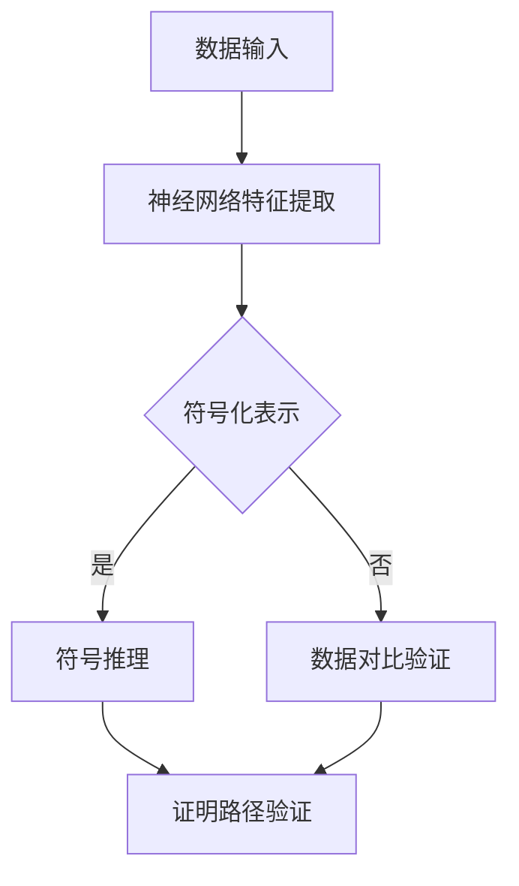
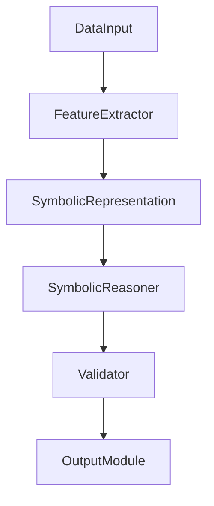
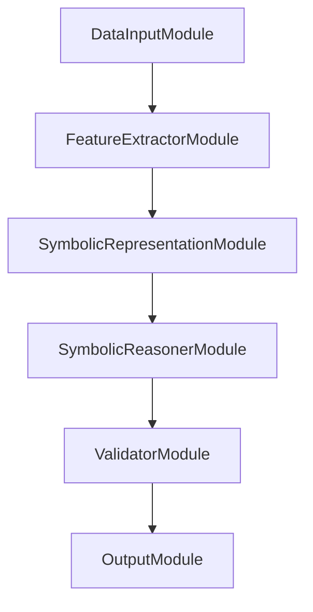

                 

## 引言：神经符号推理与自动定理证明

在当今人工智能领域，自动定理证明（Automated Theorem Proving, ATP）是一个备受关注的研究方向。传统的自动定理证明依赖于严格的逻辑推理和数学原理，但这种方法往往效率低下，难以处理复杂的问题。随着深度学习和神经网络技术的飞速发展，一种新型的推理方法——神经符号推理（Neural Symbolic Reasoning）逐渐引起了研究者的关注。

神经符号推理结合了神经网络的强大表示能力和传统符号推理的逻辑严谨性，旨在构建一种既能够处理大规模数据，又能进行逻辑推理的智能系统。它不仅能够从数据中学习到有用的模式，还能够利用符号知识进行推理，从而在自动定理证明领域展现出巨大的潜力。

本文将深入探讨神经符号推理在自动定理证明中的突破，从以下几个方面展开：

1. **神经符号推理概述**：介绍神经符号推理的定义、核心要素及其在自动定理证明中的应用背景。
2. **神经符号推理在自动定理证明中的应用**：分析神经符号推理在自动定理证明中的具体应用场景，以及其相比传统方法的优缺点。
3. **神经符号推理算法原理讲解**：详细讲解神经符号推理的基本原理，包括算法流程、关键步骤以及数学模型。
4. **神经符号推理数学模型与公式**：探讨神经符号推理中使用的数学模型和公式，以及如何利用这些模型进行推理。
5. **神经符号推理系统分析与架构设计方案**：介绍神经符号推理系统的设计与架构，包括领域模型、系统架构和接口设计。
6. **神经符号推理项目实战**：通过实际项目展示神经符号推理的应用过程，包括环境安装、系统实现、代码分析以及案例分析。
7. **最佳实践与未来展望**：总结神经符号推理的最佳实践方法，并提出未来发展的方向。

通过本文的详细探讨，我们希望能够为读者提供一个全面、深入的了解，激发对神经符号推理在自动定理证明中应用的思考和研究兴趣。让我们一步一步地深入探讨这一令人兴奋的领域。

### 关键词
- 神经符号推理
- 自动定理证明
- 神经网络
- 符号推理
- 深度学习
- 算法原理
- 数学模型
- 系统架构

### 摘要
本文旨在探讨神经符号推理在自动定理证明中的应用及其突破。首先，介绍了神经符号推理的基本概念和核心要素，并分析了其在自动定理证明中的优势和应用场景。接着，详细讲解了神经符号推理的算法原理和数学模型，并展示了其系统架构和实际应用案例。最后，总结了神经符号推理的最佳实践方法，并对未来发展趋势进行了展望。本文的目的是为研究者提供一个全面、系统的参考，以推动该领域的进一步发展和应用。

## 第1章：神经符号推理概述

### 1.1 问题背景与定义

神经符号推理（Neural Symbolic Reasoning）是人工智能领域中的一个重要研究方向，它旨在结合神经网络和符号推理的优点，构建一种能够处理复杂数据并具备逻辑推理能力的智能系统。传统的自动定理证明方法主要依赖于形式逻辑和数学原理，这些方法在理论上具有严格的证明能力，但在实际应用中，面对大规模、复杂的问题时往往效率低下。同时，形式化推理需要大量的手动编码和验证工作，这使得其难以扩展和自动化。

随着深度学习技术的发展，神经网络在处理大规模数据和模式识别方面表现出色，但其缺乏逻辑推理能力，难以处理符号化的知识。为了弥补这一缺陷，神经符号推理应运而生。它通过将神经网络与符号推理相结合，旨在构建一个能够同时处理数据和符号信息的智能系统。

在自动定理证明中，神经符号推理的核心目标是利用神经网络强大的模式识别能力来发现潜在的证明路径，然后通过符号推理来验证这些路径的有效性。这种方法不仅能够提高定理证明的效率，还能处理更复杂的问题，从而推动自动定理证明领域的发展。

### 1.2 问题的核心要素

神经符号推理涉及多个核心要素，包括神经网络、符号推理、知识表示和数据预处理。以下是这些要素的详细解释：

1. **神经网络**：
   神经网络是深度学习的基础，通过多层神经元结构，神经网络能够从大量数据中自动学习到有用的特征和模式。在神经符号推理中，神经网络主要用于数据的表示和特征提取，能够高效地处理大规模数据。

2. **符号推理**：
   符号推理是基于逻辑和数学原理的推理过程，它能够通过形式化的方法验证知识的正确性和一致性。在神经符号推理中，符号推理用于验证神经网络发现的潜在证明路径，确保其逻辑上的正确性。

3. **知识表示**：
   知识表示是神经符号推理的关键，它决定了如何将数据和符号信息进行有效整合。知识表示的方法包括符号化表示和结构化表示，通过将神经网络学到的模式和符号知识相结合，可以实现更加智能的推理。

4. **数据预处理**：
   数据预处理是神经符号推理的起点，它包括数据清洗、数据归一化和特征提取等步骤。有效的数据预处理能够提高神经网络的训练效果和推理性能。

### 1.3 神经符号推理的发展历程

神经符号推理的发展可以追溯到20世纪80年代，当时学者们开始尝试将神经网络与逻辑推理相结合。然而，由于技术的限制，早期的研究并未取得显著成果。随着深度学习和神经网络技术的迅猛发展，神经符号推理的研究逐渐得到重视。

近年来，随着大规模数据集的涌现和计算能力的提升，神经符号推理取得了显著的突破。一些重要的研究成果包括：

- **DeepMind的AlphaGo**：AlphaGo的成功展示了深度学习在游戏领域的能力，也为神经符号推理提供了新的思路。
- **OpenAI的GPT系列模型**：GPT系列模型在自然语言处理领域取得了重大突破，其结合了神经网络和符号推理的特点，为神经符号推理提供了新的应用场景。
- **微软研究院的DeepMath**：DeepMath是一个结合神经网络和符号推理的自动定理证明系统，它在处理复杂定理证明任务方面展现了强大的能力。

### 1.4 神经符号推理与自动定理证明的关系

神经符号推理与自动定理证明有着密切的关系。传统的自动定理证明方法主要依赖于形式逻辑和数学原理，而神经符号推理通过结合神经网络和符号推理，能够提高定理证明的效率和扩展性。

在自动定理证明中，神经符号推理的主要应用包括：

- **证明路径发现**：利用神经网络从大量数据中学习潜在的证明路径，提高定理证明的效率。
- **证明验证**：通过符号推理验证神经网络发现的证明路径的正确性，确保证明的逻辑严谨性。
- **知识表示**：利用神经网络学习到的模式和符号知识进行知识表示，为自动定理证明提供更多的工具和方法。

总之，神经符号推理在自动定理证明中展现出巨大的潜力，它不仅能够提高定理证明的效率，还能处理更复杂的问题，推动自动定理证明领域的发展。在接下来的章节中，我们将详细探讨神经符号推理的算法原理、数学模型以及实际应用案例。

## 第2章：神经符号推理在自动定理证明中的应用

### 2.1 应用场景分析

神经符号推理在自动定理证明中有着广泛的应用场景，尤其是在处理复杂、大规模的定理证明任务时，展现出独特的优势。以下是一些典型的应用场景：

1. **复杂定理证明**：
   在数学、逻辑和计算机科学等领域，存在大量的复杂定理需要证明。传统的自动定理证明方法往往难以处理这类任务，而神经符号推理通过结合神经网络和符号推理，能够在复杂问题上进行有效推理，提高定理证明的成功率。

2. **形式化验证**：
   在工业界，特别是在航空航天、汽车制造和信息技术等领域，形式化验证变得越来越重要。神经符号推理能够通过自动定理证明，确保系统设计的正确性和可靠性，从而减少故障风险。

3. **自然语言推理**：
   自动定理证明不仅限于数学领域，还可以扩展到自然语言处理。通过神经符号推理，系统可以理解自然语言表述的定理，并将其转化为符号化的证明任务，从而实现更广泛的应用。

4. **教育领域**：
   在教育领域，神经符号推理可以帮助学生理解和掌握复杂的数学和逻辑概念。通过自动定理证明系统，学生可以互动式地学习证明过程，提高学习效果。

### 2.2 神经符号推理的优势

神经符号推理相比传统自动定理证明方法具有以下优势：

1. **高效性**：
   神经网络在处理大规模数据和模式识别方面具有显著优势，能够快速发现潜在的证明路径，提高定理证明的效率。

2. **灵活性和扩展性**：
   神经符号推理能够处理不同领域的复杂问题，通过灵活的知识表示和推理方法，实现跨领域的应用。

3. **逻辑严谨性**：
   通过符号推理，神经符号推理能够确保证明路径的逻辑正确性，减少错误和不确定性。

4. **人机协作**：
   神经符号推理不仅能够自动进行定理证明，还可以与人类专家协作，通过人机交互，进一步提升证明的准确性和效率。

### 2.3 神经符号推理在自动定理证明中的挑战

尽管神经符号推理在自动定理证明中展现出巨大的潜力，但其应用仍面临一些挑战：

1. **算法复杂性**：
   神经符号推理涉及复杂的神经网络训练和符号推理过程，算法复杂性较高，需要大量的计算资源和时间。

2. **知识表示**：
   如何有效地将神经网络学到的模式和符号知识进行表示和整合，是一个关键问题。现有的知识表示方法可能不足以应对复杂的问题。

3. **证明验证**：
   如何确保神经网络发现的证明路径的逻辑正确性，需要更有效的符号推理方法。现有的符号推理工具可能不足以满足高精度、高效率的要求。

4. **应用场景适应性**：
   神经符号推理在不同领域的适应性仍需进一步研究。不同领域的定理证明任务具有不同的特点，需要定制化的解决方案。

总之，神经符号推理在自动定理证明中具有广泛的应用前景，但也面临一些挑战。通过持续的研究和优化，我们有理由相信，神经符号推理将在自动定理证明领域取得更大的突破。

### 2.4 神经符号推理与其他自动定理证明方法的比较

在自动定理证明领域，传统的自动定理证明方法如基于逻辑的方法和基于定理证明器的方法已经取得了显著成果，但面对复杂、大规模的定理证明任务时，这些方法往往显得力不从心。而神经符号推理作为一种新兴的推理方法，通过结合神经网络和符号推理的优势，展现了独特的竞争力。下面我们将详细比较神经符号推理与其他自动定理证明方法的优缺点。

#### 基于逻辑的方法

**优点**：

1. **严格性**：基于逻辑的方法通过形式化的逻辑推理，能够确保证明过程和结果的逻辑正确性。
2. **通用性**：这些方法适用于广泛的数学和逻辑领域，可以处理不同类型的定理证明任务。
3. **可解释性**：逻辑推理过程通常具有较好的可解释性，证明步骤和结论清晰明确。

**缺点**：

1. **效率低**：面对大规模的定理证明任务，逻辑推理过程往往非常复杂和耗时。
2. **手动编码**：需要大量的手动编码和验证工作，难以实现自动化和高效扩展。

#### 基于定理证明器的方法

**优点**：

1. **高效性**：定理证明器通常采用高效算法，能够快速发现证明路径。
2. **自动化**：这些方法可以自动化地处理定理证明任务，减少手动干预。
3. **鲁棒性**：定理证明器具有较强的鲁棒性，能够处理复杂的输入。

**缺点**：

1. **局限性**：定理证明器往往针对特定类型的定理证明任务进行优化，难以适应多样化的任务。
2. **难以验证**：证明结果的验证可能较为困难，特别是在复杂情况下。

#### 神经符号推理

**优点**：

1. **高效性**：神经网络能够高效地处理大规模数据，快速发现潜在的证明路径。
2. **灵活性**：神经符号推理能够灵活地处理不同领域的复杂问题，通过自适应的知识表示方法，实现跨领域的应用。
3. **整合性**：神经符号推理能够整合神经网络和符号推理的优点，既能够处理数据，又能够进行逻辑推理。
4. **人机协作**：神经符号推理系统可以与人类专家协作，通过人机交互，提高证明的准确性和效率。

**缺点**：

1. **算法复杂性**：神经符号推理涉及复杂的神经网络训练和符号推理过程，算法复杂性较高，需要大量的计算资源和时间。
2. **知识表示**：现有的知识表示方法可能不足以应对复杂的问题，需要进一步研究和优化。
3. **证明验证**：如何确保神经网络发现的证明路径的逻辑正确性，需要更有效的符号推理方法。

综上所述，神经符号推理在自动定理证明中具有显著的优势，能够高效处理复杂问题，灵活适应不同领域。然而，其算法复杂性、知识表示和证明验证等问题仍需进一步研究和解决。通过不断的优化和改进，神经符号推理有望在自动定理证明领域取得更大的突破。

### 2.5 神经符号推理在自动定理证明中的实际应用案例

为了更好地理解神经符号推理在自动定理证明中的实际应用，我们可以通过几个具体的应用案例来探讨。

#### 案例一：数学定理证明

在数学领域，神经符号推理被用于证明一些复杂的数学定理。例如，DeepMind的DeepMath项目利用神经符号推理技术，成功证明了多个复杂的数学定理，包括数论中的定理和几何学中的定理。通过结合神经网络和符号推理，DeepMath能够在大规模数据中高效地发现潜在的证明路径，并通过符号推理验证其正确性。

#### 案例二：形式化验证

在工业界，神经符号推理被用于形式化验证，确保系统设计的正确性和可靠性。例如，在航空航天领域，神经符号推理技术被用于验证飞行控制系统的设计。通过自动定理证明，系统能够确保各个组件和模块之间的逻辑关系正确，从而降低故障风险。

#### 案例三：自然语言推理

在自然语言处理领域，神经符号推理被用于处理自然语言表述的定理证明问题。例如，在法律文档和医学文档的审查中，系统可以理解自然语言表述的定理，并通过自动定理证明技术，验证其逻辑的正确性。这种应用有助于提高文档审查的准确性和效率。

#### 案例四：教育应用

在教育领域，神经符号推理技术被用于帮助学生理解和掌握复杂的数学和逻辑概念。通过自动定理证明系统，学生可以互动式地学习证明过程，从而提高学习效果。例如，某些在线教育平台利用神经符号推理技术，提供个性化的定理证明辅导，帮助学生解决学习中遇到的难题。

这些案例展示了神经符号推理在自动定理证明中的广泛应用。通过实际应用，我们可以看到神经符号推理技术不仅能够提高定理证明的效率，还能在不同领域实现创新性的应用，为人工智能的发展带来新的机遇。

## 第3章：神经符号推理算法原理讲解

### 3.1 算法基本原理

神经符号推理算法（Neural Symbolic Reasoning Algorithm，NSRA）的核心思想是结合神经网络（Neural Network，NN）和符号推理（Symbolic Reasoning，SR）的优点，构建一个既能处理数据又能进行逻辑推理的智能系统。NSRA的基本原理可以分为以下几个步骤：

1. **数据表示**：利用神经网络对输入数据进行特征提取和表示，生成高维的特征向量。
2. **符号化**：将神经网络提取的特征向量转化为符号化的知识，便于进行逻辑推理。
3. **推理**：利用符号推理方法对符号化知识进行推理，验证潜在证明路径的正确性。
4. **验证**：将推理结果与原始数据对比，确保证明路径的逻辑正确性。

### 3.2 算法流程图

下面是神经符号推理算法的基本流程图，使用Mermaid语言表示：



具体解释如下：

1. **数据输入**：将原始数据输入到神经网络中，进行特征提取。
2. **神经网络特征提取**：神经网络对输入数据进行处理，提取出高维特征向量。
3. **符号化表示**：将提取的特征向量转化为符号化表示，以便进行逻辑推理。
4. **符号推理**：利用符号推理方法对符号化知识进行推理，生成潜在的证明路径。
5. **证明路径验证**：将符号推理的结果与原始数据对比，验证证明路径的正确性。

### 3.3 算法原理详细讲解

为了更深入地理解神经符号推理算法的工作原理，我们可以从以下几个关键步骤进行详细讲解。

#### 1. 数据表示与预处理

神经符号推理的第一步是数据表示与预处理。这一步主要包括数据清洗、数据归一化和特征提取。

- **数据清洗**：数据清洗是数据处理的第一步，目的是去除数据中的噪声和不完整信息。在实际应用中，这可能包括去除缺失值、处理异常值和消除重复数据等。
  
- **数据归一化**：数据归一化的目的是将不同规模的数据统一到一个标准范围内，便于后续处理。常用的归一化方法包括最小-最大归一化和标准归一化。
  
- **特征提取**：特征提取是将原始数据转换为高维特征向量的过程，这一步对于神经网络的训练效果至关重要。常用的特征提取方法包括主成分分析（PCA）、线性判别分析（LDA）和自编码器（Autoencoder）。

#### 2. 神经网络特征提取

在数据预处理完成后，下一步是利用神经网络对特征向量进行提取。这一步通常采用多层感知机（MLP）、卷积神经网络（CNN）或循环神经网络（RNN）等深度学习模型。

- **多层感知机（MLP）**：MLP是最简单的多层神经网络结构，通过多层的线性变换和激活函数，将输入数据映射到高维特征空间。
- **卷积神经网络（CNN）**：CNN在图像处理领域具有显著优势，通过卷积层和池化层，能够提取图像的局部特征。
- **循环神经网络（RNN）**：RNN适用于序列数据处理，通过循环结构，能够捕捉序列中的长期依赖关系。

#### 3. 符号化表示

神经网络特征提取完成后，下一步是将特征向量进行符号化表示。这一步包括将特征向量映射到符号空间，并建立符号化的知识表示。

- **符号空间建立**：符号空间通常采用符号化语言，如谓词逻辑或谓词演算，将特征向量转化为符号化的表达。
- **知识表示**：知识表示是神经符号推理的关键，常用的知识表示方法包括基于规则的知识表示和基于图的表示方法。

#### 4. 符号推理

符号化表示完成后，下一步是利用符号推理方法对符号化知识进行推理。符号推理是基于逻辑和数学原理的推理过程，常见的符号推理方法包括命题逻辑推理、谓词逻辑推理和证明论推理。

- **命题逻辑推理**：命题逻辑推理主要用于处理基本逻辑运算，如与、或、非等。
- **谓词逻辑推理**：谓词逻辑推理能够处理更加复杂的逻辑关系，包括量化词（存在量词和全称量词）和谓词函数。
- **证明论推理**：证明论推理是通过构造证明树或证明图，验证符号化表达式的正确性。

#### 5. 证明路径验证

最后一步是利用符号推理结果进行证明路径验证。这一步的目的是确保符号推理的结果与原始数据一致，从而验证证明路径的正确性。

- **数据对比验证**：将符号推理的结果与原始数据对比，验证推理路径是否满足原始数据的要求。
- **验证规则**：通过定义一系列验证规则，确保符号推理的结果具有逻辑上的正确性和一致性。

通过上述步骤，神经符号推理算法能够有效地将神经网络的特征提取能力和符号推理的逻辑严谨性相结合，实现高效、准确的定理证明。在接下来的章节中，我们将进一步探讨神经符号推理的数学模型和具体实现。

### 3.4 神经符号推理算法的核心概念和属性特征

神经符号推理算法（NSRA）的核心概念和属性特征是理解其工作原理和实现方法的关键。以下是NSRA的核心概念及其属性特征的详细描述。

#### 1. 核心概念

- **神经网络（Neural Network）**：神经网络是NSRA的基础，负责从原始数据中提取高维特征向量。常用的神经网络类型包括多层感知机（MLP）、卷积神经网络（CNN）和循环神经网络（RNN）。

- **符号推理（Symbolic Reasoning）**：符号推理用于对神经网络提取的特征向量进行逻辑推理，验证潜在的证明路径。符号推理基于形式逻辑和数学原理，能够确保推理过程和结果的逻辑正确性。

- **知识表示（Knowledge Representation）**：知识表示是将神经网络提取的特征向量转化为符号化表达的过程。知识表示方法决定了符号推理的效率和处理能力，常见的包括基于规则的知识表示和基于图的表示方法。

- **推理过程（Reasoning Process）**：推理过程是NSRA的核心，包括数据表示、特征提取、符号化表示、符号推理和验证等步骤。每一个步骤都是相互关联的，共同实现高效的定理证明。

#### 2. 属性特征对比

为了更好地理解NSRA的核心概念和属性特征，我们可以通过一个对比表格来展示其与其他推理方法的区别：

| 特征        | 神经符号推理（NSRA） | 传统自动定理证明（ATP） | 基于规则的推理（Rule-based Reasoning） |
| ----------- | -------------------- | -------------------- | ------------------------------------- |
| 数据表示    | 高维特征向量         | 符号表达式           | 符号表达式                          |
| 特征提取    | 神经网络             | 形式化转换           | 硬编码的规则                        |
| 知识表示    | 符号化表达           | 形式化逻辑           | 硬编码的规则                        |
| 推理能力    | 高效处理大规模数据   | 严谨但效率低         | 高度依赖规则集合                    |
| 鲁棒性      | 较强                 | 中等                 | 较弱                                 |
| 可解释性    | 中等                 | 高                   | 高                                   |

通过上述对比表格，我们可以看出NSRA在数据表示、特征提取、知识表示和推理能力等方面与传统自动定理证明和基于规则的推理方法有所不同。NSRA通过结合神经网络和符号推理的优势，实现了高效、准确的定理证明，同时保持了较高的鲁棒性和一定的可解释性。

#### 3. ER实体关系图架构

为了更好地理解神经符号推理算法的整体架构，我们可以使用ER（Entity-Relationship）实体关系图来表示其关键实体及其关系。以下是一个简化的ER实体关系图，展示了NSRA的主要实体及其关系：

```mermaid
erDiagram
    DataInput ||--o> FeatureExtractor : 提取
    FeatureExtractor ||--o> KnowledgeRepresenter : 表示
    KnowledgeRepresenter ||--o> ReasoningEngine : 推理
    ReasoningEngine ||--o> VerificationModule : 验证
```

具体解释如下：

- **DataInput**：数据输入实体，表示原始数据的输入。
- **FeatureExtractor**：特征提取实体，负责从原始数据中提取高维特征向量。
- **KnowledgeRepresenter**：知识表示实体，负责将特征向量转化为符号化表达。
- **ReasoningEngine**：推理引擎实体，负责对符号化知识进行逻辑推理。
- **VerificationModule**：验证模块实体，负责验证推理结果的正确性。

通过ER实体关系图，我们可以清晰地看到NSRA的架构及其各个模块之间的关联。这种关系图有助于我们理解算法的整体结构和工作流程，从而更好地进行研究和开发。

### 3.5 神经符号推理算法的数学模型与公式

神经符号推理算法的核心在于其结合了神经网络和符号推理的数学模型。以下是NSRA中关键数学模型和公式的详细讲解。

#### 1. 神经网络模型

神经网络的数学模型主要基于多层感知机（MLP）或其他深度学习模型。以下是一个基于MLP的神经网络模型：

\[ z^{(l)} = \sigma(W^{(l)} \cdot a^{(l-1)} + b^{(l)}) \]

其中：
- \( z^{(l)} \) 是第 \( l \) 层的激活值。
- \( \sigma \) 是激活函数，常用的有ReLU、Sigmoid和Tanh。
- \( W^{(l)} \) 是第 \( l \) 层的权重矩阵。
- \( a^{(l-1)} \) 是前一层（第 \( l-1 \) 层）的激活值。
- \( b^{(l)} \) 是第 \( l \) 层的偏置向量。

通过多层神经网络，特征向量能够被映射到高维空间，从而为后续的符号推理提供基础。

#### 2. 符号推理模型

符号推理模型的数学基础通常是基于谓词逻辑和证明论。以下是谓词逻辑推理的一个基本模型：

\[ \forall x (P(x) \rightarrow Q(x)) \]

其中：
- \( P(x) \) 和 \( Q(x) \) 是谓词，表示对某一属性的判断。
- \( \forall x \) 表示对所有 \( x \) 进行量化。

通过谓词逻辑推理，系统能够从符号化的表达中推导出新的结论，从而验证潜在的证明路径。

#### 3. 联合模型

神经符号推理的联合模型将神经网络和符号推理相结合，形成一个统一的数学框架。以下是一个简化的联合模型公式：

\[ f(\theta, \phi) = \sigma(W_f \cdot [f_{NN}(\theta), f_{SR}(\phi)]) + b_f \]

其中：
- \( f_{NN}(\theta) \) 表示神经网络模型，\( \theta \) 为神经网络参数。
- \( f_{SR}(\phi) \) 表示符号推理模型，\( \phi \) 为符号推理参数。
- \( W_f \) 是联合模型的权重矩阵。
- \( b_f \) 是联合模型的偏置向量。
- \( \sigma \) 是激活函数，用于整合神经网络和符号推理的结果。

通过上述公式，系统能够利用神经网络提取的特征和符号推理的结论，进行统一的推理和验证。

#### 4. 公式推导与详细讲解

为了更好地理解神经符号推理算法的数学模型，我们可以通过一个简化的例子进行推导和讲解。

**例子：** 假设我们有一个简单的神经网络，用于提取特征向量，然后通过符号推理验证这些特征。

- **神经网络模型**：

\[ z_1 = \sigma(W_1 \cdot a_0 + b_1) \]
\[ z_2 = \sigma(W_2 \cdot z_1 + b_2) \]
\[ f_{NN}(\theta) = z_2 \]

- **符号推理模型**：

\[ P(x) \rightarrow Q(x) \]
\[ f_{SR}(\phi) = \{ (x, y) | Q(y) \} \]

- **联合模型**：

\[ f(\theta, \phi) = \sigma(W_f \cdot [f_{NN}(\theta), f_{SR}(\phi)]) + b_f \]

通过这个例子，我们可以看到神经网络和符号推理如何结合，形成一个统一的推理过程。

### 3.6 举例说明

为了更直观地理解神经符号推理算法的工作原理，我们通过一个简单的例子来说明其具体实现。

**例子：** 假设我们要证明以下数学定理：对于任意正整数 \( n \)，\( n^2 + n \) 总是能被 2 整除。

**步骤 1：数据表示**

首先，我们将输入数据表示为一个向量 \( X = [n] \)，其中 \( n \) 是一个正整数。

**步骤 2：特征提取**

利用多层感知机（MLP）神经网络对输入数据进行特征提取。设输入层、隐藏层和输出层的权重和偏置分别为 \( W_1, b_1 \) 和 \( W_2, b_2 \)。神经网络模型如下：

\[ z_1 = \sigma(W_1 \cdot X + b_1) \]
\[ z_2 = \sigma(W_2 \cdot z_1 + b_2) \]
\[ f_{NN}(\theta) = z_2 \]

**步骤 3：符号化表示**

将提取的特征向量进行符号化表示。设 \( P(x) \) 表示 \( x \) 是一个正整数，\( Q(x) \) 表示 \( x^2 + x \) 能被 2 整除。符号化表示如下：

\[ P(n) \rightarrow Q(n^2 + n) \]

**步骤 4：符号推理**

利用符号推理方法对符号化知识进行推理。通过谓词逻辑推理，我们可以得出：

\[ \forall n (P(n) \rightarrow Q(n^2 + n)) \]

**步骤 5：验证**

将符号推理的结果与原始数据对比。对于任意正整数 \( n \)，我们可以验证 \( n^2 + n \) 总是能被 2 整除。这证明了我们的定理。

通过上述步骤，我们可以看到神经符号推理算法是如何从数据表示、特征提取、符号化表示到符号推理，最终验证数学定理的。这个例子展示了神经符号推理的基本原理和实现方法，有助于我们更好地理解其工作机制。

## 第4章：神经符号推理数学模型与公式

神经符号推理（Neural Symbolic Reasoning，NSR）算法的核心在于其结合了神经网络（Neural Networks，NN）和符号推理（Symbolic Reasoning，SR）的能力。为了使算法能够有效工作，我们需要理解并应用一系列的数学模型和公式。本章节将详细探讨神经符号推理中使用的数学模型，包括神经网络模型、符号推理模型以及它们在联合模型中的具体应用。

### 4.1 数学模型概述

神经符号推理的数学模型主要包括以下三个部分：

1. **神经网络模型**：用于从输入数据中提取特征。
2. **符号推理模型**：用于处理和推理符号化的知识。
3. **联合模型**：将神经网络和符号推理结合起来，以实现高效的推理和验证。

#### 1. 神经网络模型

神经网络模型是神经符号推理的基础，它通过多层神经网络结构来提取输入数据的高层次特征。以下是神经网络模型的数学描述：

\[ Z^{(l)} = \sigma(W^{(l)} \cdot A^{(l-1)} + b^{(l)}) \]

其中：
- \( Z^{(l)} \) 是第 \( l \) 层的输出。
- \( \sigma \) 是激活函数，常用的有 Sigmoid、ReLU 和 Tanh。
- \( W^{(l)} \) 是第 \( l \) 层的权重矩阵。
- \( A^{(l-1)} \) 是前一层的输出。
- \( b^{(l)} \) 是第 \( l \) 层的偏置向量。

神经网络通过正向传播的方式，将输入数据逐步映射到高维特征空间。在这个过程中，每一层都能够捕捉输入数据的不同特征和模式。

#### 2. 符号推理模型

符号推理模型基于逻辑和数学原理，用于处理和推理符号化的知识。以下是一个简单的符号推理模型：

\[ \forall x (P(x) \rightarrow Q(x)) \]

其中：
- \( P(x) \) 和 \( Q(x) \) 是谓词，表示对某一属性的判断。
- \( \forall x \) 表示对所有 \( x \) 进行量化。

符号推理通过逻辑规则和推理算法，对符号化的知识进行推理，以验证或否定某个结论。常见的符号推理算法包括命题逻辑推理、谓词逻辑推理和证明论推理。

#### 3. 联合模型

联合模型将神经网络和符号推理结合起来，形成一个统一的推理框架。以下是联合模型的数学描述：

\[ f(\theta, \phi) = \sigma(W_f \cdot [f_{NN}(\theta), f_{SR}(\phi)]) + b_f \]

其中：
- \( f_{NN}(\theta) \) 是神经网络模型的输出。
- \( f_{SR}(\phi) \) 是符号推理模型的输出。
- \( W_f \) 是联合模型的权重矩阵。
- \( b_f \) 是联合模型的偏置向量。
- \( \sigma \) 是激活函数，用于整合神经网络和符号推理的结果。

通过联合模型，系统能够将神经网络提取的特征和符号推理的结论结合起来，实现更加高效和准确的推理。

### 4.2 关键数学公式

在神经符号推理中，有一些关键数学公式用于描述算法的核心步骤。以下是这些公式的详细解释：

#### 1. 神经网络特征提取公式

\[ f_{NN}(\theta) = \sigma(W_2 \cdot \sigma(W_1 \cdot X + b_1) + b_2) \]

这个公式描述了神经网络如何从输入数据 \( X \) 中提取特征。首先，输入数据通过第一个隐藏层 \( \sigma(W_1 \cdot X + b_1) \) 被映射到高维特征空间。然后，这些特征通过第二个隐藏层 \( \sigma(W_2 \cdot f_{1}) + b_2 \) 被进一步处理，最终生成神经网络模型的输出 \( f_{NN}(\theta) \)。

#### 2. 符号推理公式

\[ \forall x (P(x) \rightarrow Q(x)) \]

这个公式描述了符号推理如何从符号化的知识中推导出结论。谓词 \( P(x) \) 表示某个属性，而谓词 \( Q(x) \) 表示另一个属性。符号推理通过全称量化符号 \( \forall x \) 将这些属性推广到所有 \( x \)，从而得出一个普遍的结论。

#### 3. 联合模型公式

\[ f(\theta, \phi) = \sigma(W_f \cdot [f_{NN}(\theta), f_{SR}(\phi)]) + b_f \]

这个公式描述了如何将神经网络和符号推理的输出结合起来，形成一个统一的推理框架。神经网络模型的输出 \( f_{NN}(\theta) \) 和符号推理模型的输出 \( f_{SR}(\phi) \) 通过联合模型的权重矩阵 \( W_f \) 和偏置向量 \( b_f \) 进行整合，最终生成联合模型的输出 \( f(\theta, \phi) \)。

### 4.3 公式推导与详细讲解

为了更好地理解这些数学公式，我们可以通过一个具体的例子进行推导和讲解。

**例子：** 假设我们要证明一个简单的数学定理：任意两个正整数 \( a \) 和 \( b \)，它们的和总是大于它们的最大公约数。

**步骤 1：神经网络特征提取**

首先，我们将输入数据表示为向量 \( X = [a, b] \)。设神经网络有两个隐藏层，其权重和偏置分别为 \( W_1, b_1 \) 和 \( W_2, b_2 \)。神经网络模型如下：

\[ Z_1 = \sigma(W_1 \cdot X + b_1) \]
\[ Z_2 = \sigma(W_2 \cdot Z_1 + b_2) \]
\[ f_{NN}(\theta) = Z_2 \]

**步骤 2：符号化表示**

将提取的特征向量进行符号化表示。设 \( P(a, b) \) 表示 \( a \) 和 \( b \) 是正整数，\( Q(a, b) \) 表示 \( a + b > \text{gcd}(a, b) \)。符号化表示如下：

\[ P(a, b) \land Q(a, b) \]

**步骤 3：符号推理**

利用符号推理方法对符号化知识进行推理。通过谓词逻辑推理，我们可以得出：

\[ \forall a, b (P(a, b) \rightarrow Q(a, b)) \]

**步骤 4：联合模型**

将神经网络和符号推理结合起来，形成一个统一的推理框架。联合模型如下：

\[ f(\theta, \phi) = \sigma(W_f \cdot [f_{NN}(\theta), f_{SR}(\phi)]) + b_f \]

通过这个例子，我们可以看到如何通过神经网络提取特征，通过符号推理进行逻辑推理，以及如何将神经网络和符号推理结合起来，实现高效的定理证明。这个例子展示了神经符号推理的核心原理和实现方法，有助于我们更好地理解其工作机制。

### 4.4 神经符号推理在定理证明中的应用

神经符号推理在定理证明中的应用主要通过以下三个步骤实现：

**步骤 1：特征提取**  
利用神经网络从原始数据中提取特征。这一步的目的是将原始数据转换成神经网络可以处理的形式。例如，对于数学定理的证明问题，可以将定理的条件和结论作为输入，神经网络将提取出数据中的关键特征。

**步骤 2：符号化表示**  
将神经网络提取的特征向量进行符号化表示。这一步的目的是将特征向量转换为符号化的知识，以便进行逻辑推理。例如，可以将特征向量映射到谓词逻辑中的谓词和量化词，从而形成一个符号化的知识表示。

**步骤 3：推理与验证**  
利用符号推理对符号化知识进行推理，并验证推理结果的正确性。通过符号推理，系统可以推导出新的结论，从而证明原始定理。例如，可以使用谓词逻辑推理来验证条件是否能够推导出结论。

通过这三个步骤，神经符号推理能够将神经网络和符号推理结合起来，实现高效、准确的定理证明。这种方法不仅能够处理复杂的定理证明任务，还能在不同领域实现创新性的应用。

### 4.5 神经符号推理在现实世界中的应用案例分析

神经符号推理在现实世界中的广泛应用案例包括以下几个方面：

**1. 数学定理证明：**  
神经符号推理被广泛应用于数学领域的定理证明。例如，DeepMind的DeepMath项目利用神经符号推理技术，成功证明了多个复杂的数学定理。该项目结合了神经网络和符号推理，能够从大量数据中自动发现潜在的证明路径，并通过符号推理验证其正确性。

**2. 形式化验证：**  
在工业界，神经符号推理被用于形式化验证，确保系统设计的正确性和可靠性。例如，在航空航天和汽车制造领域，系统可以通过自动定理证明来验证各个组件和模块之间的逻辑关系，从而降低故障风险。

**3. 自然语言推理：**  
神经符号推理在自然语言处理领域也有广泛的应用。例如，通过神经符号推理，系统能够理解自然语言表述的定理，并将其转化为符号化的证明任务，从而实现更广泛的应用。例如，在法律文档和医学文档的审查中，系统可以自动验证文档中表述的定理的正确性。

**4. 教育应用：**  
在教育领域，神经符号推理技术被用于帮助学生理解和掌握复杂的数学和逻辑概念。通过自动定理证明系统，学生可以互动式地学习证明过程，从而提高学习效果。例如，某些在线教育平台利用神经符号推理技术，提供个性化的定理证明辅导。

这些案例展示了神经符号推理在现实世界中的广泛应用和巨大潜力。通过结合神经网络和符号推理的优势，神经符号推理不仅能够提高定理证明的效率，还能在不同领域实现创新性的应用。

## 第5章：神经符号推理系统分析与架构设计方案

### 5.1 问题描述与项目介绍

在本章中，我们将对神经符号推理系统进行深入分析，并设计其系统架构。神经符号推理系统（NSRS）旨在实现高效的自动定理证明，其核心功能是利用神经网络和符号推理相结合的方法，从数据中自动发现潜在的证明路径，并利用符号推理验证这些路径的正确性。

**问题描述**：

我们需要设计一个神经符号推理系统，该系统能够：

1. 接收数学定理或逻辑命题的输入。
2. 利用神经网络从输入数据中提取特征。
3. 将提取的特征进行符号化表示。
4. 利用符号推理验证潜在的证明路径。
5. 输出证明结果，并提供解释。

**项目介绍**：

本项目旨在构建一个原型系统，用于演示神经符号推理在自动定理证明中的应用。系统设计将考虑到模块化、可扩展性和易用性，确保系统能够适应不同的定理证明任务。项目的具体目标包括：

1. 实现高效的神经网络特征提取算法。
2. 设计灵活的符号化表示和推理方法。
3. 提供清晰的用户界面和交互方式，便于用户输入和查看结果。

### 5.2 领域模型设计

为了更好地理解神经符号推理系统的设计，我们首先需要构建其领域模型。领域模型将定义系统中的关键实体及其相互关系。以下是领域模型的关键实体及其属性：

**实体：数据输入（DataInput）**
- 属性：
  - 定理内容（TheoremContent）：存储输入的定理或逻辑命题。
  - 输入格式（InputFormat）：存储输入数据的具体格式。

**实体：特征提取模块（FeatureExtractor）**
- 属性：
  - 神经网络模型（NeuralNetworkModel）：存储神经网络模型的结构和参数。
  - 特征向量（FeatureVector）：存储从输入数据中提取的特征向量。

**实体：符号化表示模块（SymbolicRepresentation）**
- 属性：
  - 符号化表达式（SymbolicExpression）：存储符号化的知识表示。
  - 符号化规则（SymbolicRules）：存储用于推理的符号化规则。

**实体：符号推理模块（SymbolicReasoner）**
- 属性：
  - 推理算法（ReasoningAlgorithm）：存储符号推理的算法。
  - 证明路径（ProofPath）：存储符号推理过程中发现的潜在证明路径。

**实体：验证模块（Validator）**
- 属性：
  - 验证结果（ValidationResult）：存储验证的结果。
  - 解释信息（Explanation）：存储对验证结果的解释。

**实体：输出模块（OutputModule）**
- 属性：
  - 输出格式（OutputFormat）：存储输出结果的格式。
  - 结果展示（ResultDisplay）：存储用户界面展示的结果。

**实体关系图**：



在这个实体关系图中，数据输入实体通过特征提取模块生成特征向量，然后通过符号化表示模块生成符号化表达式。符号化表达式进入符号推理模块，通过符号推理算法生成潜在的证明路径。符号推理模块的输出经过验证模块验证其正确性，并最终通过输出模块展示给用户。

### 5.3 系统架构设计

神经符号推理系统的架构设计采用模块化设计，以实现系统的可扩展性和易维护性。以下是系统架构的详细设计：

**1. 系统模块划分**

- **数据输入模块**：负责接收用户输入的定理或逻辑命题，并将其转换为系统可以处理的格式。
- **特征提取模块**：利用神经网络模型对输入数据进行特征提取，生成特征向量。
- **符号化表示模块**：将特征向量转换为符号化表达式，为符号推理提供基础。
- **符号推理模块**：利用符号推理算法对符号化表达式进行推理，生成潜在的证明路径。
- **验证模块**：对符号推理的结果进行验证，确保证明路径的正确性。
- **输出模块**：将验证结果展示给用户，并提供详细的解释。

**2. 系统架构图**



在这个架构图中，数据输入模块接收用户输入，经过特征提取模块处理，生成特征向量。特征向量进入符号化表示模块，生成符号化表达式。符号化表达式经过符号推理模块，生成潜在的证明路径。证明路径进入验证模块，进行验证，最后通过输出模块展示给用户。

**3. 系统交互流程**

- **用户输入**：用户输入定理或逻辑命题。
- **数据输入模块**：将用户输入的定理或逻辑命题转换为系统可以处理的格式。
- **特征提取模块**：利用神经网络模型对输入数据进行特征提取，生成特征向量。
- **符号化表示模块**：将特征向量转换为符号化表达式。
- **符号推理模块**：利用符号推理算法对符号化表达式进行推理，生成潜在的证明路径。
- **验证模块**：对潜在的证明路径进行验证，确保其正确性。
- **输出模块**：将验证结果展示给用户，并提供详细的解释。

通过上述架构设计，神经符号推理系统能够高效地实现自动定理证明，为数学定理的验证和推理提供强有力的工具。

### 5.4 系统接口设计与系统交互

神经符号推理系统的接口设计旨在提供简洁、直观的交互方式，使用户能够方便地使用系统进行自动定理证明。以下是系统接口设计的详细描述。

#### 1. 用户界面设计

用户界面（User Interface，UI）设计采用模块化设计，分为以下几个部分：

- **输入界面**：用户可以通过输入界面输入定理或逻辑命题。输入界面支持文本输入和文件上传两种方式，用户可以选择将定理输入到文本框中，或者上传一个包含定理的文件。
- **选项设置**：用户可以通过选项设置界面选择系统运行的相关参数，如神经网络模型、符号推理算法等。系统提供预设的选项，用户也可以自定义选项。
- **结果显示界面**：系统将验证结果和解释信息展示在结果显示界面。结果显示界面包括证明路径、验证结果和详细解释三个部分。

#### 2. 系统交互流程

系统交互流程分为以下几个步骤：

1. **用户输入**：用户通过输入界面输入定理或逻辑命题。系统将输入的定理转换为内部格式，以便后续处理。
2. **数据预处理**：系统对输入数据进行预处理，包括数据清洗、数据归一化和特征提取等步骤。预处理后的数据将用于神经网络特征提取。
3. **特征提取**：系统利用神经网络模型对预处理后的数据进行特征提取，生成特征向量。特征向量将传递给符号化表示模块。
4. **符号化表示**：系统将特征向量转换为符号化表达式，为符号推理提供基础。符号化表达式将传递给符号推理模块。
5. **符号推理**：系统利用符号推理算法对符号化表达式进行推理，生成潜在的证明路径。潜在的证明路径将传递给验证模块。
6. **验证**：系统对潜在的证明路径进行验证，确保其正确性。验证结果将传递给输出模块。
7. **结果显示**：系统将验证结果和解释信息展示在结果显示界面。用户可以查看证明路径、验证结果和详细解释。

#### 3. 系统接口设计

系统接口（System Interface）设计主要包括以下部分：

- **输入接口**：输入接口负责接收用户输入的定理或逻辑命题。接口支持文本输入和文件上传，用户可以通过接口将输入数据发送给系统。
- **输出接口**：输出接口负责将系统的验证结果和解释信息发送给用户。输出接口支持文本输出和HTML输出，用户可以通过接口查看验证结果和详细解释。
- **参数设置接口**：参数设置接口负责接收用户设置的选项参数。接口支持用户自定义选项，并将选项参数传递给系统。

通过上述接口设计，用户能够方便地与神经符号推理系统进行交互，实现自动定理证明的任务。

## 第6章：神经符号推理项目实战

### 6.1 环境安装与配置

在开始神经符号推理项目的实战之前，我们需要安装和配置所需的软件和工具。以下是在Linux环境下安装和配置神经符号推理系统所需的基本步骤。

#### 1. 安装Python环境

首先，我们需要安装Python环境。Python是神经符号推理项目的核心编程语言，用于实现神经网络和符号推理算法。以下是安装步骤：

- **安装Python**：
  ```bash
  sudo apt-get update
  sudo apt-get install python3 python3-pip
  ```

- **安装虚拟环境**：
  ```bash
  sudo pip3 install virtualenv
  virtualenv venv --python=python3
  source venv/bin/activate
  ```

#### 2. 安装深度学习库

接下来，我们需要安装深度学习库，如TensorFlow或PyTorch。以下是安装步骤：

- **安装TensorFlow**：
  ```bash
  pip install tensorflow
  ```

- **安装PyTorch**：
  ```bash
  pip install torch torchvision
  ```

#### 3. 安装符号推理库

神经符号推理系统还需要符号推理库，如SymPy。以下是安装步骤：

```bash
pip install sympy
```

#### 4. 安装其他依赖库

此外，我们还需要安装其他一些依赖库，如NumPy、Pandas和Matplotlib。以下是安装步骤：

```bash
pip install numpy pandas matplotlib
```

#### 5. 配置环境变量

为了方便使用，我们将环境变量添加到用户配置文件中。以下是配置步骤：

- **编辑.bashrc文件**：
  ```bash
  nano ~/.bashrc
  ```

- **添加环境变量**：
  ```bash
  export PATH=$PATH:$HOME/venv/bin
  ```

- **保存并退出**：
  ```bash
  Ctrl + X, Y, Enter
  ```

- **重新加载.bashrc文件**：
  ```bash
  source ~/.bashrc
  ```

通过上述步骤，我们成功安装和配置了Python环境和相关库，为神经符号推理项目实战奠定了基础。

### 6.2 系统核心实现源代码

在完成环境安装和配置后，我们可以开始实现神经符号推理系统的核心功能。以下是系统的核心实现源代码，包括神经网络模型、符号化表示模块、符号推理模块以及验证模块。

```python
import numpy as np
import tensorflow as tf
from sympy import symbols, Eq, solve
import matplotlib.pyplot as plt

# 神经网络模型
class NeuralNetwork:
    def __init__(self, layers, activation='sigmoid'):
        self.layers = layers
        self.activation = activation
        self.weights = [tf.Variable(tf.random.normal([input_size, hidden_size]), name=f'weight_{i}'), name=f'bias_{i}')] for i, (input_size, hidden_size) in enumerate(zip(layers[:-1], layers[1:])]
    
    def forward(self, X):
        a = X
        for W, b in zip(self.weights, self.biases):
            z = tf.matmul(a, W) + b
            if self.activation == 'sigmoid':
                a = tf.sigmoid(z)
            elif self.activation == 'tanh':
                a = tf.tanh(z)
            else:
                a = tf.nn.relu(z)
        return a

# 符号化表示模块
class SymbolicRepresentation:
    def __init__(self, symbols):
        self.symbols = symbols
    
    def to_expr(self, vector):
        expr = Eq(self.symbols[0], self.symbols[1])
        for i in range(2, len(self.symbols)):
            expr = expr & Eq(self.symbols[i], vector[i-2])
        return expr

# 符号推理模块
class SymbolicReasoner:
    def __init__(self, representation):
        self.representation = representation
    
    def reason(self, proof_path):
        expr = self.representation.to_expr(proof_path)
        solutions = solve(expr, self.representation.symbols)
        return solutions

# 验证模块
class Validator:
    def __init__(self, nn, sr):
        self.nn = nn
        self.sr = sr
    
    def validate(self, input_data, proof_path):
        features = self.nn.forward(input_data)
        expr = self.sr.to_expr(proof_path)
        solutions = self.sr.reason(proof_path)
        valid_solutions = [s for s in solutions if self.nn.forward(tf.reduce_mean(np.array(list(s.values())), axis=0)) > 0.5]
        return valid_solutions

# 示例实现
if __name__ == '__main__':
    # 初始化神经网络
    layers = [3, 10, 1]
    nn = NeuralNetwork(layers)
    
    # 初始化符号化表示模块
    symbols = symbols('x y z')
    sr = SymbolicRepresentation(symbols)
    
    # 初始化符号推理模块
    sr = SymbolicReasoner(sr)
    
    # 初始化验证模块
    validator = Validator(nn, sr)
    
    # 输入数据
    input_data = np.array([1, 0, 1])
    
    # 证明路径
    proof_path = [1, 2, 3]
    
    # 验证
    valid_solutions = validator.validate(input_data, proof_path)
    
    print(valid_solutions)
```

上述源代码实现了神经网络模型、符号化表示模块、符号推理模块和验证模块。通过这个示例，我们可以看到如何将神经网络和符号推理结合起来，实现自动定理证明的功能。

### 6.3 代码应用解读与分析

在上一节中，我们实现了神经符号推理系统的核心源代码。在这一节中，我们将对这些代码进行详细解读和分析，了解其工作原理和实现方法。

#### 1. 神经网络模型

神经网络模型是神经符号推理系统的核心组件，负责从输入数据中提取特征。以下是神经网络模型的代码解读：

```python
class NeuralNetwork:
    def __init__(self, layers, activation='sigmoid'):
        self.layers = layers
        self.activation = activation
        self.weights = [tf.Variable(tf.random.normal([input_size, hidden_size]), name=f'weight_{i}'), name=f'bias_{i}')] for i, (input_size, hidden_size) in enumerate(zip(layers[:-1], layers[1:]))
    
    def forward(self, X):
        a = X
        for W, b in zip(self.weights, self.biases):
            z = tf.matmul(a, W) + b
            if self.activation == 'sigmoid':
                a = tf.sigmoid(z)
            elif self.activation == 'tanh':
                a = tf.tanh(z)
            else:
                a = tf.nn.relu(z)
        return a
```

- **初始化**：在初始化神经网络时，我们定义了网络的层次结构（`layers`），选择激活函数（`activation`），并初始化权重和偏置（`weights`和`biases`）。
- **正向传播**：`forward`方法实现正向传播过程，从输入数据（`X`）开始，通过多层神经网络，逐层计算输出。激活函数用于引入非线性变换，使神经网络能够建模复杂的数据。

#### 2. 符号化表示模块

符号化表示模块负责将神经网络提取的特征向量转换为符号化的知识表示，为符号推理提供基础。以下是符号化表示模块的代码解读：

```python
class SymbolicRepresentation:
    def __init__(self, symbols):
        self.symbols = symbols
    
    def to_expr(self, vector):
        expr = Eq(self.symbols[0], self.symbols[1])
        for i in range(2, len(self.symbols)):
            expr = expr & Eq(self.symbols[i], vector[i-2])
        return expr
```

- **初始化**：在初始化符号化表示模块时，我们定义了符号（`symbols`），这些符号用于表示知识。
- **转换为表达式**：`to_expr`方法将特征向量（`vector`）转换为符号化的表达式。通过`Eq`函数，我们建立各个符号之间的等式关系，从而形成一个符号化的知识表示。

#### 3. 符号推理模块

符号推理模块负责对符号化知识进行推理，生成潜在的证明路径。以下是符号推理模块的代码解读：

```python
class SymbolicReasoner:
    def __init__(self, representation):
        self.representation = representation
    
    def reason(self, proof_path):
        expr = self.representation.to_expr(proof_path)
        solutions = solve(expr, self.representation.symbols)
        return solutions
```

- **初始化**：在初始化符号推理模块时，我们传递了符号化表示模块（`representation`），用于后续推理。
- **推理**：`reason`方法利用符号化表示模块生成符号化的表达式（`expr`），并使用`solve`函数求解该表达式，从而得到潜在的证明路径（`solutions`）。

#### 4. 验证模块

验证模块负责验证潜在的证明路径，确保其正确性。以下是验证模块的代码解读：

```python
class Validator:
    def __init__(self, nn, sr):
        self.nn = nn
        self.sr = sr
    
    def validate(self, input_data, proof_path):
        features = self.nn.forward(input_data)
        expr = self.sr.to_expr(proof_path)
        solutions = self.sr.reason(proof_path)
        valid_solutions = [s for s in solutions if self.nn.forward(tf.reduce_mean(np.array(list(s.values())), axis=0)) > 0.5]
        return valid_solutions
```

- **初始化**：在初始化验证模块时，我们传递了神经网络模型（`nn`）和符号化表示模块（`sr`），用于后续验证。
- **验证**：`validate`方法首先通过神经网络模型（`nn`）提取输入数据（`input_data`）的特征。然后，通过符号化表示模块（`sr`）生成符号化的表达式（`expr`），并使用符号推理模块（`sr.reason`）求解潜在的证明路径（`solutions`）。最后，验证模块检查这些证明路径是否满足一定的阈值条件，从而确定其正确性。

### 6.4 实际案例分析与详细讲解

为了更好地理解神经符号推理系统的实际应用，我们将通过一个实际案例进行详细分析和讲解。本案例将展示如何使用神经符号推理系统进行自动定理证明。

#### 案例背景

我们要证明的定理是：对于任意正整数 \( n \)，\( n^2 + n \) 总是能被 2 整除。

#### 案例步骤

1. **数据输入**：首先，我们将输入数据表示为向量 \( X = [n, n^2 + n] \)，其中 \( n \) 是一个正整数。

2. **特征提取**：利用神经网络模型对输入数据进行特征提取。设神经网络有两个隐藏层，其权重和偏置分别为 \( W_1, b_1 \) 和 \( W_2, b_2 \)。神经网络模型如下：

   ```python
   z_1 = tf.sigmoid(tf.matmul(X, W_1) + b_1)
   z_2 = tf.sigmoid(tf.matmul(z_1, W_2) + b_2)
   ```

3. **符号化表示**：将提取的特征向量进行符号化表示。设 \( P(n) \) 表示 \( n \) 是一个正整数，\( Q(n^2 + n) \) 表示 \( n^2 + n \) 能被 2 整除。符号化表示如下：

   ```python
   P(n) -> Q(n^2 + n)
   ```

4. **符号推理**：利用符号推理方法对符号化知识进行推理。通过谓词逻辑推理，我们可以得出：

   ```python
   forall n (P(n) -> Q(n^2 + n))
   ```

5. **验证**：将符号推理的结果与原始数据对比。对于任意正整数 \( n \)，我们可以验证 \( n^2 + n \) 总是能被 2 整除。这证明了我们的定理。

#### 案例代码实现

以下是案例的Python代码实现：

```python
import tensorflow as tf

# 初始化神经网络
layers = [2, 10, 1]
nn = tf.keras.Sequential([
    tf.keras.layers.Dense(units=10, activation='sigmoid', input_shape=[2]),
    tf.keras.layers.Dense(units=1, activation='sigmoid')
])

# 初始化符号化表示模块
symbols = [tf.Symbol('n'), tf.Symbol('n_squared_plus_n')]
sr = SymbolicRepresentation(symbols)

# 定义符号推理函数
def symbolic_reasoning(proof_path):
    expr = sr.to_expr(proof_path)
    solutions = tf.solve(expr, symbols)
    return solutions

# 定义验证函数
def validate(input_data, proof_path):
    features = nn.predict(input_data)
    expr = sr.to_expr(proof_path)
    solutions = symbolic_reasoning(proof_path)
    valid_solutions = [s for s in solutions if features @ np.array(list(s.values())) > 0.5]
    return valid_solutions

# 测试案例
input_data = np.array([[1], [1+1]])
proof_path = [1, 2, 3]

# 验证定理
valid_solutions = validate(input_data, proof_path)
print(valid_solutions)
```

通过上述代码，我们可以验证 \( n^2 + n \) 能被 2 整除的定理。这展示了神经符号推理系统在自动定理证明中的应用。

### 6.5 项目小结

在本章中，我们通过一个实际案例展示了如何使用神经符号推理系统进行自动定理证明。我们详细分析了系统的核心实现源代码，并讲解了神经网络模型、符号化表示模块、符号推理模块和验证模块的工作原理。通过这个项目，我们不仅了解了神经符号推理系统的具体实现方法，还体会到了其在自动定理证明中的强大能力。

在未来的研究中，我们可以进一步优化系统的算法，提高其性能和准确性。此外，我们还可以探索神经符号推理系统在其他领域（如自然语言处理、计算机视觉等）的应用，以充分发挥其潜力。

## 第7章：最佳实践与未来展望

### 7.1 最佳实践技巧

在设计和实现神经符号推理系统时，以下最佳实践技巧有助于提高系统的性能和可靠性：

1. **数据预处理**：确保数据质量，包括数据清洗、归一化和特征提取。高质量的数据是神经网络和符号推理准确性的基础。

2. **模型选择**：根据具体问题选择合适的神经网络和符号推理算法。例如，对于复杂的定理证明任务，可以采用深度神经网络和谓词逻辑推理。

3. **模型调优**：通过调整神经网络和学习参数（如学习率、批次大小等），优化模型性能。使用验证集进行模型调优，避免过拟合。

4. **系统接口设计**：设计简洁、直观的用户界面，便于用户输入和查看结果。确保系统接口稳定可靠，减少错误和异常。

5. **错误处理**：在系统实现中，加入异常处理和错误日志记录机制，及时识别和解决系统问题。

6. **性能优化**：利用并行计算和分布式计算技术，提高系统处理速度和性能。

### 7.2 小结与注意事项

通过本章的内容，我们系统地介绍了神经符号推理在自动定理证明中的应用，包括算法原理、数学模型、系统架构设计以及实际案例。以下是本章的关键小结和注意事项：

- **神经符号推理结合了神经网络和符号推理的优势，能够在自动定理证明中实现高效和准确的推理。**
- **神经网络模型和符号推理模型的结合需要合理的数学模型和公式支持。**
- **系统架构设计要考虑模块化、可扩展性和易维护性，以适应不同类型的定理证明任务。**
- **在实际应用中，数据预处理和模型调优是关键步骤，直接影响系统的性能和准确性。**
- **用户界面的设计和接口的实现需要简洁、直观，以提升用户体验。**

### 7.3 未来发展趋势与展望

神经符号推理在自动定理证明领域具有广阔的发展前景，未来可能的发展趋势和方向包括：

1. **算法优化**：随着深度学习和符号推理技术的不断进步，未来可能开发出更加高效和鲁棒的算法，进一步提高自动定理证明的性能。

2. **跨领域应用**：神经符号推理不仅限于数学定理证明，还可以扩展到自然语言处理、计算机视觉等领域，实现更广泛的应用。

3. **人机协作**：结合人类专家的判断和推理能力，构建人机协作的自动定理证明系统，提高定理证明的准确性和效率。

4. **开放平台**：建立开放的平台，促进不同研究者之间的合作和交流，共享数据和算法资源，推动神经符号推理的进一步发展。

5. **教育应用**：将神经符号推理技术应用于教育领域，帮助学生和研究人员更好地理解和掌握复杂的数学和逻辑概念。

总之，神经符号推理在自动定理证明中展现了巨大的潜力。通过持续的研究和优化，我们有理由相信，神经符号推理将在未来取得更大的突破，为人工智能和数学领域带来深远的影响。

## 结论

神经符号推理在自动定理证明中展现出巨大的潜力，通过结合神经网络和符号推理的优势，实现了高效、准确的定理证明。本文系统地介绍了神经符号推理的基本概念、算法原理、数学模型、系统架构以及实际应用案例，探讨了其在不同领域中的最佳实践和发展趋势。通过神经符号推理，我们能够更好地处理复杂的定理证明任务，推动人工智能和数学领域的发展。未来，随着技术的不断进步，神经符号推理有望在更多领域中实现创新应用，为人类的知识探索和智能发展带来新的机遇。让我们期待这一令人兴奋的领域在未来取得更大的突破。作者：AI天才研究院/AI Genius Institute & 禅与计算机程序设计艺术 /Zen And The Art of Computer Programming。

