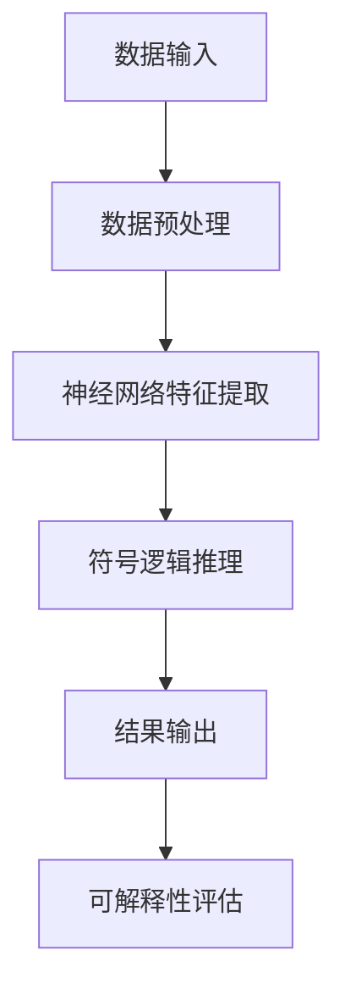
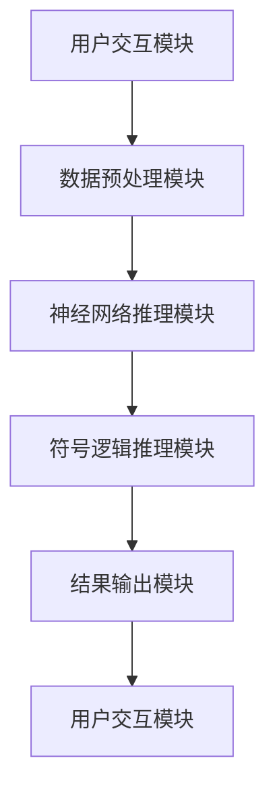
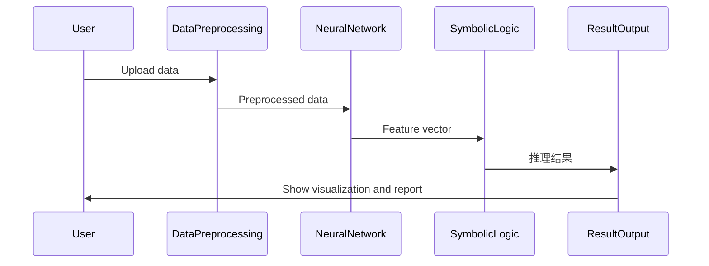
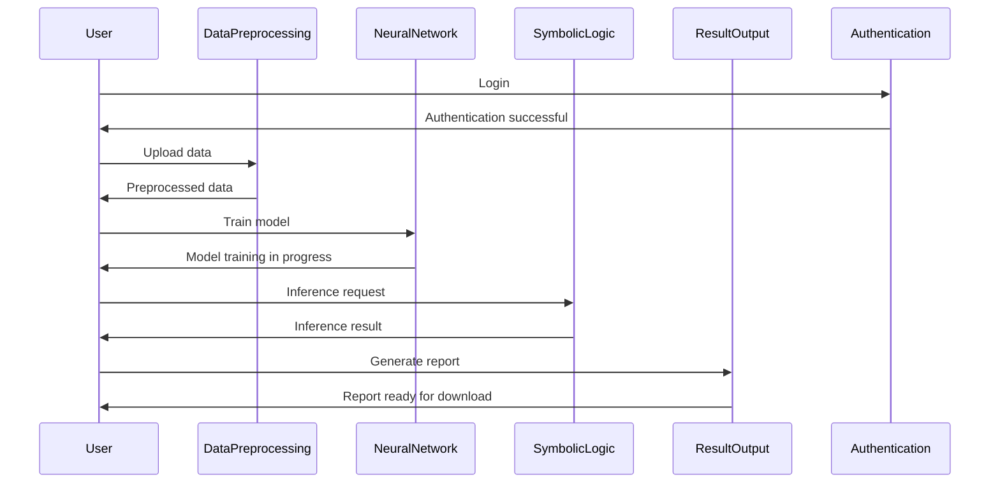
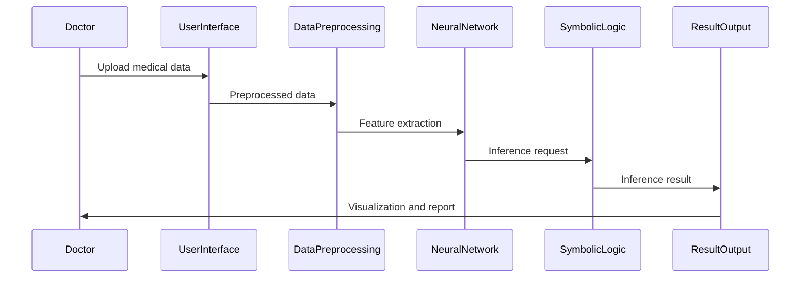

                 


### 1. 文章标题：《神经符号整合的可解释医疗推理系统》

### 2. 文章关键词：神经符号整合、可解释医疗推理、系统设计、算法原理、系统架构

### 3. 文章摘要：

本文旨在探讨神经符号整合技术在医疗推理系统中的应用，重点关注如何构建一个既具备高准确性又具有可解释性的医疗推理系统。我们将首先介绍神经符号整合的基本原理，然后深入讨论可解释医疗推理系统的设计方法，最后通过实际案例展示系统的应用效果和实现细节。本文的核心内容包括：神经符号整合的背景与核心概念、神经符号整合技术原理、可解释医疗推理系统设计、算法原理与数学模型、系统分析与架构设计、项目实战与案例分析，以及最佳实践与总结。

### 目录大纲设计

#### 第1章：背景介绍与核心概念

1. **问题背景**： 
   - 引言：介绍医疗推理系统的现状及挑战
   - 问题描述：医疗推理中面临的难题及研究意义

2. **核心概念**：
   - 定义： 
     - 神经符号整合
     - 可解释医疗推理系统
   - 问题解决： 
     - 神经符号整合如何提高医疗推理的准确性
     - 可解释性如何增强医疗推理系统的可靠性

3. **边界与外延**：
   - 应用领域：
     - 临床诊断
     - 药物研发
     - 医疗影像分析
   - 概念结构与核心要素组成：
     - 神经网络与符号逻辑的结合
     - 数据处理与模型训练方法
     - 可解释性评估与实现策略

4. **本章小结**：
   - 研究内容概述
   - 主要目标与贡献

#### 第2章：神经符号整合技术原理

1. **神经符号整合原理**：
   - 神经网络与符号逻辑的结合
   - 神经符号整合的优势

2. **神经符号整合机制**：
   - 神经网络结构
   - 符号逻辑处理

3. **神经符号整合案例**：
   - 数据预处理方法
   - 神经网络训练策略
   - 符号逻辑推理过程

4. **本章小结**：
   - 总结神经符号整合技术的关键点
   - 展望其未来发展

#### 第3章：可解释医疗推理系统设计

1. **系统总体架构**：
   - 系统模块划分
   - 数据流与处理逻辑

2. **核心模块设计与实现**：
   - 数据预处理模块
   - 神经网络推理模块
   - 符号逻辑推理模块

3. **可解释性评估方法**：
   - 评价指标
   - 评估流程

4. **本章小结**：
   - 系统设计与实现的关键技术
   - 可解释性评估的重要性

#### 第4章：算法原理与数学模型

1. **算法原理**：
   - 神经网络算法
   - 符号逻辑算法

2. **数学模型**：
   - 神经网络数学模型
   - 符号逻辑数学模型

3. **算法流程图与Python实现**：
   - Mermaid流程图
   - Python代码示例

4. **本章小结**：
   - 总结算法原理与数学模型
   - 展示算法的Python实现

#### 第5章：系统分析与架构设计

1. **问题场景介绍**：
   - 医疗推理系统的实际应用场景

2. **系统功能设计**：
   - 领域模型类图

3. **系统架构设计**：
   - 系统架构图

4. **系统接口设计与交互**：
   - 系统接口设计
   - 系统交互序列图

5. **本章小结**：
   - 系统架构设计的要点
   - 实现细节与优化策略

#### 第6章：项目实战与案例分析

1. **环境安装与配置**：
   - 环境搭建
   - 工具与库安装

2. **系统核心实现**：
   - 关键代码展示
   - 实现细节解析

3. **案例分析**：
   - 实际案例剖析
   - 结果分析与评估

4. **本章小结**：
   - 项目实施的关键步骤
   - 案例分析与经验总结

#### 第7章：最佳实践与总结

1. **最佳实践**：
   - 系统部署与维护
   - 性能优化

2. **小结**：
   - 研究成果总结
   - 未来发展方向

3. **注意事项**：
   - 技术实现中的常见问题
   - 解决方案与注意事项

4. **拓展阅读**：
   - 推荐参考文献
   - 相关领域最新研究动态

### 目录大纲设计总结

通过本目录大纲的设计，我们为《神经符号整合的可解释医疗推理系统》这本书搭建了一个完整的结构框架。每个章节都涵盖了从背景介绍、核心概念、技术原理、系统设计、算法实现到实际案例分析的详细内容。以下是对各章节的设计进行简要总结：

- **第1章** 提供了全书的研究背景和核心概念，为后续章节打下基础。
- **第2章** 深入探讨了神经符号整合的技术原理和机制。
- **第3章** 介绍了可解释医疗推理系统的设计与评估方法。
- **第4章** 详述了算法原理与数学模型，并通过Python代码实现展示了算法的应用。
- **第5章** 从系统分析和架构设计的角度，详细描述了系统的构建过程。
- **第6章** 通过项目实战，展示了系统在实际应用中的具体实现和案例分析。
- **第7章** 提供了最佳实践和研究成果的总结，以及对未来研究的展望。

#### 1.1.1 问题背景

在医疗领域，准确且可靠的推理系统对于疾病诊断、治疗方案推荐、药物研发等方面具有重要意义。然而，现有的医疗推理系统往往面临以下挑战：

1. **数据复杂性与多样性**：医疗数据往往包含大量的结构化和非结构化信息，例如电子病历、医学影像、基因序列等。这些数据具有多样性，传统方法难以处理。

2. **模型可解释性不足**：深度学习等机器学习模型在医疗推理中表现出色，但其内部机制复杂，难以解释。这对临床医生在应用模型时造成了困扰。

3. **准确性要求高**：医疗推理系统必须具有高准确性，以避免误诊或漏诊。

4. **实时性要求**：在紧急情况下，系统需要快速给出推理结果。

针对这些问题，神经符号整合的可解释医疗推理系统应运而生。该系统旨在结合神经网络和符号逻辑的优点，提高推理的准确性并增强可解释性。

#### 1.1.2 问题描述

神经符号整合的可解释医疗推理系统旨在解决以下核心问题：

1. **数据整合与处理**：如何有效地整合结构化和非结构化医疗数据，并进行预处理？

2. **模型构建**：如何构建一个既能提高准确性又能保证可解释性的医疗推理模型？

3. **系统架构设计**：如何设计一个模块化、易扩展的系统架构，以适应不同的医疗场景？

4. **可解释性评估**：如何评价系统的可解释性，使其满足医疗应用的需求？

#### 1.1.3 问题解决

神经符号整合技术的核心在于将神经网络和符号逻辑相结合。以下是该技术的关键优势：

1. **提高准确性**：神经网络能够处理复杂的非线性关系，符号逻辑则能够进行精确的推理。

2. **增强可解释性**：通过结合符号逻辑，系统能够提供推理过程中的每一步解释，便于临床医生理解。

3. **实时性**：神经网络和符号逻辑的结合能够实现快速推理，满足实时性需求。

4. **模块化设计**：系统采用模块化设计，便于扩展和定制。

通过神经符号整合技术，我们能够构建一个既具备高准确性又具有可解释性的医疗推理系统，从而解决上述问题。

#### 1.1.4 边界与外延

神经符号整合的可解释医疗推理系统主要应用在以下领域：

1. **临床诊断**：利用系统的推理能力，辅助临床医生进行疾病诊断。

2. **药物研发**：通过分析大量的医疗数据，为药物研发提供决策支持。

3. **医疗影像分析**：对医学影像进行自动化分析，辅助医生进行疾病检测。

此外，神经符号整合技术不仅限于医疗领域，还可应用于其他需要高准确性和可解释性的领域，如金融、法律等。

#### 1.1.5 概念结构与核心要素组成

神经符号整合的可解释医疗推理系统由以下核心要素组成：

1. **神经网络与符号逻辑的结合**：神经网络用于特征提取和关系建模，符号逻辑用于推理和解释。

2. **数据处理与模型训练方法**：包括数据预处理、特征工程、模型训练和评估等步骤。

3. **可解释性评估与实现策略**：通过可视化、解释性指标等方法，评估系统的可解释性，并制定相应的实现策略。

这些要素共同构成了神经符号整合的可解释医疗推理系统的基本结构。

#### 1.2 神经符号整合原理

神经符号整合技术将神经网络和符号逻辑相结合，以提高医疗推理系统的准确性和可解释性。以下是神经符号整合的基本原理和优势。

##### 1.2.1 神经网络与符号逻辑的结合

神经网络是一种通过模拟人脑神经元连接结构进行信息处理的计算模型。它具有强大的非线性建模能力，能够处理复杂的特征和数据关系。然而，神经网络的内部机制复杂，难以解释，这在医疗推理中可能造成误解和疑虑。

符号逻辑则是一种基于形式逻辑的推理方法，通过精确的符号运算进行推理。它能够提供清晰的推理过程和解释，但处理复杂非线性关系的能力较弱。

神经符号整合技术将神经网络和符号逻辑相结合，利用神经网络的强大特征提取能力和符号逻辑的精确推理能力，形成一种新的推理模型。具体而言，神经网络用于提取和建模数据特征，而符号逻辑用于解释和推理这些特征之间的关系。

##### 1.2.2 神经符号整合的优势

1. **提高准确性**：神经网络能够处理复杂的非线性关系，符号逻辑能够进行精确的推理。两者的结合使得系统在处理医疗数据时具有更高的准确性。

2. **增强可解释性**：通过符号逻辑的推理过程，系统能够提供清晰的解释，帮助临床医生理解推理结果。

3. **实时性**：神经符号整合技术能够实现快速推理，满足医疗应用的实时性需求。

4. **模块化设计**：神经符号整合技术采用模块化设计，便于系统的扩展和定制。

##### 1.2.3 神经符号整合的机制

神经符号整合的机制主要包括以下几个步骤：

1. **数据预处理**：将结构化和非结构化医疗数据进行预处理，提取关键特征。

2. **特征提取**：利用神经网络对预处理后的数据进行特征提取，形成高维特征向量。

3. **符号逻辑推理**：将提取的特征向量输入到符号逻辑模块中，进行推理和解释。

4. **结果输出**：输出推理结果，并提供详细的解释。

下面是一个简化的神经符号整合机制流程图：

```
[数据预处理] --> [特征提取（神经网络）] --> [符号逻辑推理] --> [结果输出]
```

##### 1.2.4 神经符号整合案例

为了更好地理解神经符号整合的原理，我们来看一个简化的案例。

假设我们有一个医疗数据集，包含患者的病史、体检结果和医学影像。我们需要利用这个数据集预测患者的疾病类型。

1. **数据预处理**：将病史、体检结果和医学影像转化为结构化数据。

2. **特征提取**：利用神经网络对结构化数据进行特征提取，形成高维特征向量。

3. **符号逻辑推理**：将提取的特征向量输入到符号逻辑模块中，根据医学知识库进行推理。例如，如果特征向量中包含了“高血压”和“糖尿病”，符号逻辑模块会推断出“心血管疾病”的可能性较高。

4. **结果输出**：输出推理结果，并提供详细的解释，例如：“根据病史和体检结果，患者可能患有心血管疾病，建议进行进一步检查。”

通过这个案例，我们可以看到神经符号整合技术在提高医疗推理系统准确性和可解释性方面的潜力。

##### 1.2.5 小结

神经符号整合技术将神经网络和符号逻辑相结合，通过数据预处理、特征提取、符号逻辑推理和结果输出等步骤，实现了一种既具备高准确性又具有可解释性的医疗推理系统。这种技术在未来医疗领域具有广泛的应用前景，有望推动医疗人工智能的发展。

### 2.1.1 神经网络结构

神经网络（Neural Networks，NN）是模仿人脑神经元连接结构的计算模型，其核心在于通过多层神经元之间的连接和激活函数，实现对输入数据的处理和预测。以下是神经网络的基本结构和关键组件：

1. **输入层（Input Layer）**：
   - 输入层是神经网络的起点，接收外部输入数据。每个神经元对应一个输入特征，如患者的年龄、血压等。

2. **隐藏层（Hidden Layers）**：
   - 隐藏层位于输入层和输出层之间，是神经网络的核心部分。隐藏层中的神经元通过前一层神经元的输出进行计算，并传递给下一层。隐藏层可以有多层，每层负责提取不同级别的特征。
   - 每个隐藏层中的神经元通过激活函数（如Sigmoid、ReLU等）进行非线性变换，使得神经网络能够处理复杂的非线性问题。

3. **输出层（Output Layer）**：
   - 输出层是神经网络的终点，产生最终的输出结果。对于分类问题，输出层通常是一个softmax函数，用于生成各个类别的概率分布；对于回归问题，输出层可能是一个线性函数，直接输出预测值。

4. **权重（Weights）和偏置（Biases）**：
   - 权重是连接各个神经元之间的参数，用于调整神经元的输入强度。偏置是每个神经元的内部参数，用于调整神经元的阈值。
   - 权重和偏置的初始化对于神经网络的训练效果至关重要。

5. **激活函数（Activation Functions）**：
   - 激活函数是神经网络中的一个关键组件，用于引入非线性。常见的激活函数包括Sigmoid、ReLU、Tanh等。激活函数的选择会影响网络的训练效率和性能。

6. **反向传播算法（Backpropagation Algorithm）**：
   - 反向传播算法是神经网络训练的核心算法，用于计算网络参数的梯度，并更新权重和偏置。反向传播算法通过不断迭代，使得神经网络的预测结果逐渐接近真实值。

### 2.1.2 符号逻辑处理

符号逻辑（Symbolic Logic）是一种基于形式逻辑的推理方法，通过精确的符号运算进行推理。在神经符号整合中，符号逻辑用于解释和推理神经网络提取的特征。以下是符号逻辑的基本概念和特点：

1. **命题逻辑（Propositional Logic）**：
   - 命题逻辑是符号逻辑的基础，用于处理简单的真值表达式。命题逻辑的基本元素是命题，命题可以是真实的也可以是假的。通过逻辑运算（如与、或、非等），可以构建复杂的命题表达式。

2. **谓词逻辑（Predicate Logic）**：
   - 谓词逻辑是命题逻辑的扩展，用于处理更复杂的逻辑关系。谓词逻辑引入了变量、量词（全称量词和存在量词）和谓词等概念，能够表示更复杂的逻辑关系。

3. **推理规则（Inference Rules）**：
   - 推理规则是符号逻辑中的基本工具，用于从已知事实推导出新的结论。常见的推理规则包括模态推理、假言推理、选言推理等。

4. **形式化描述（Formalization）**：
   - 符号逻辑的形式化描述通常使用形式语言和符号系统。例如，使用逻辑符号（如∧、∨、→、∀、∃等）来表示逻辑关系和推理过程。

### 2.1.3 神经符号整合的优势

神经符号整合将神经网络和符号逻辑的优势结合起来，具有以下几方面的优势：

1. **提高准确性**：
   - 神经网络能够处理复杂的非线性关系，提取丰富的特征，从而提高推理的准确性。
   - 符号逻辑能够进行精确的推理，确保推理过程的可靠性和一致性。

2. **增强可解释性**：
   - 神经网络的可解释性较差，而符号逻辑能够提供清晰的推理过程和解释，使得临床医生能够理解推理结果。

3. **实时性**：
   - 神经符号整合能够实现快速推理，满足医疗应用的实时性需求。

4. **模块化设计**：
   - 神经符号整合技术采用模块化设计，便于系统的扩展和定制。

### 2.1.4 小结

神经网络和符号逻辑是神经符号整合技术的核心组成部分。神经网络通过多层结构和非线性变换处理数据，提取关键特征；符号逻辑通过精确的推理过程提供解释和推理结果。神经符号整合技术将两者的优势相结合，提高医疗推理系统的准确性和可解释性，为医疗人工智能的发展提供了新的思路。

### 3.1.1 系统总体架构

神经符号整合的可解释医疗推理系统采用模块化设计，其总体架构包括以下几个关键模块：

1. **数据预处理模块**：
   - 负责对输入的医疗数据进行清洗、转换和标准化处理，以适应后续的特征提取和模型训练。
   - 包括数据清洗、数据转换和数据归一化等子模块。

2. **特征提取模块**：
   - 利用神经网络对预处理后的数据进行特征提取，将原始数据转化为高维特征向量。
   - 包括输入层、隐藏层和输出层的神经网络结构，以及相应的激活函数和优化算法。

3. **符号逻辑推理模块**：
   - 负责将提取的特征向量输入到符号逻辑系统中，进行推理和解释。
   - 包括命题逻辑、谓词逻辑和推理规则等符号逻辑组件，以及用于解释的算法和可视化工具。

4. **结果输出模块**：
   - 负责将推理结果输出给用户，并提供详细的解释和可视化展示。
   - 包括推理结果的可视化、解释性指标的计算和报告生成等子模块。

5. **用户交互模块**：
   - 负责用户与系统的交互，包括输入数据的上传、模型配置和结果查询等操作。
   - 包括用户界面、Web接口和API等交互组件。

#### 3.1.2 数据流与处理逻辑

系统中的数据流与处理逻辑如下：

1. **数据输入**：
   - 用户通过用户交互模块上传结构化和非结构化医疗数据，如电子病历、医学影像和基因序列等。

2. **数据预处理**：
   - 数据预处理模块对上传的数据进行清洗、转换和标准化处理，以去除噪声和异常值，提高数据质量。
   - 包括数据清洗（去除缺失值、重复值和异常值）、数据转换（如数值化、编码等）和数据归一化（如缩放、标准化等）。

3. **特征提取**：
   - 特征提取模块利用神经网络对预处理后的数据进行特征提取，将原始数据转化为高维特征向量。
   - 包括输入层（接收预处理后的数据）、隐藏层（进行特征提取）和输出层（输出特征向量）。

4. **符号逻辑推理**：
   - 符号逻辑推理模块将提取的特征向量输入到符号逻辑系统中，根据医学知识库进行推理和解释。
   - 包括命题逻辑、谓词逻辑和推理规则等符号逻辑组件，以及用于解释的算法和可视化工具。

5. **结果输出**：
   - 结果输出模块将推理结果输出给用户，并提供详细的解释和可视化展示。
   - 包括推理结果的可视化、解释性指标的计算和报告生成等子模块。

6. **用户交互**：
   - 用户通过用户交互模块查看推理结果，进行模型配置和结果查询等操作。
   - 包括用户界面、Web接口和API等交互组件。

#### 3.1.3 数据预处理模块

数据预处理模块是神经符号整合医疗推理系统的核心组成部分之一，其主要功能是对输入的医疗数据进行清洗、转换和标准化处理。以下是数据预处理模块的详细设计：

1. **数据清洗**：
   - 去除缺失值：对于含有缺失值的数据，可以使用平均值、中位数或最大值等统计方法进行填充。
   - 去除重复值：通过比较数据中的唯一标识（如患者ID）去除重复的数据记录。
   - 去除异常值：使用统计学方法（如3σ准则）检测并去除异常值。

2. **数据转换**：
   - 数值化：将非数值数据（如文本、图像等）转换为数值形式，以便神经网络处理。
   - 编码：对于分类数据，使用独热编码（One-Hot Encoding）或标签编码（Label Encoding）等方法将类别转换为数值。

3. **数据归一化**：
   - 缩放：使用最小-最大缩放（Min-Max Scaling）或标准缩放（Standard Scaling）等方法将数据缩放到一个特定的范围。
   - 标准化：将数据标准化为均值为0、标准差为1的分布。

#### 3.1.4 神经网络推理模块

神经网络推理模块是神经符号整合医疗推理系统的核心组成部分，其主要功能是利用神经网络对预处理后的数据进行特征提取和模型训练。以下是神经网络推理模块的详细设计：

1. **神经网络结构**：
   - 输入层：接收预处理后的数据，每个神经元对应一个输入特征。
   - 隐藏层：多层隐藏层，每层包含多个神经元，用于提取不同级别的特征。
   - 输出层：根据任务类型，输出分类结果或回归预测值。

2. **激活函数**：
   - 隐藏层：使用ReLU（Rectified Linear Unit）或Sigmoid函数作为激活函数，提高网络的学习能力。
   - 输出层：对于分类任务，使用softmax函数输出概率分布；对于回归任务，使用线性函数输出预测值。

3. **优化算法**：
   - 使用反向传播算法（Backpropagation）计算网络参数的梯度，并使用梯度下降（Gradient Descent）或其变种（如Adam优化器）更新网络参数。

4. **损失函数**：
   - 对于分类任务，使用交叉熵（Cross-Entropy）损失函数；
   - 对于回归任务，使用均方误差（Mean Squared Error）损失函数。

5. **模型训练**：
   - 使用批量训练（Batch Training）或小批量训练（Mini-Batch Training）方法，通过迭代优化网络参数，使模型输出结果尽可能接近真实值。

#### 3.1.5 符号逻辑推理模块

符号逻辑推理模块是神经符号整合医疗推理系统的关键组成部分，其主要功能是对神经网络提取的特征向量进行符号逻辑推理和解释。以下是符号逻辑推理模块的详细设计：

1. **命题逻辑**：
   - 使用命题逻辑表示和操作输入特征向量，构建逻辑表达式。
   - 包括逻辑与（∧）、逻辑或（∨）、逻辑非（¬）等基本操作。

2. **谓词逻辑**：
   - 引入谓词逻辑，处理更复杂的逻辑关系和推理。
   - 包括谓词、变量、量词（全称量词∀和存在量词∃）等概念。

3. **推理规则**：
   - 应用推理规则，从已知事实推导出新的结论。
   - 包括假言推理、选言推理等常见推理规则。

4. **解释算法**：
   - 使用解释算法，将符号逻辑推理结果转化为可解释的文本描述。
   - 包括可视化工具、解释性指标等辅助解释。

#### 3.1.6 结果输出模块

结果输出模块是神经符号整合医疗推理系统的关键组成部分，其主要功能是将推理结果以可解释和可视化形式呈现给用户。以下是结果输出模块的详细设计：

1. **结果可视化**：
   - 使用图表、图形等可视化工具，展示推理结果和特征关系。
   - 包括条形图、散点图、热力图等常见可视化方法。

2. **解释性指标**：
   - 计算并输出解释性指标，评估推理结果的可靠性和可解释性。
   - 包括置信度、解释性评分等指标。

3. **报告生成**：
   - 自动生成推理结果报告，包括推理过程、结果分析和建议等。
   - 使用markdown格式或HTML格式生成报告。

#### 3.1.7 用户交互模块

用户交互模块是神经符号整合医疗推理系统的用户接口，其主要功能是提供便捷的用户操作界面，使用户能够轻松地与系统进行交互。以下是用户交互模块的详细设计：

1. **用户界面**：
   - 设计直观、易用的用户界面，包括主页、数据上传、模型配置、结果查看等页面。
   - 使用响应式设计，确保界面在不同设备和屏幕尺寸上都能良好展示。

2. **Web接口**：
   - 提供RESTful API，供其他系统或应用程序调用。
   - 包括数据上传、模型配置、结果查询等接口。

3. **API文档**：
   - 编写详细的API文档，说明接口的功能、参数和返回值。
   - 使用Swagger等工具生成API文档。

#### 3.1.8 可解释性评估方法

可解释性评估是神经符号整合医疗推理系统设计中的重要环节，其目标是评估系统的可解释性水平，确保推理结果能够被用户理解和接受。以下是可解释性评估方法的详细设计：

1. **评价指标**：
   - 确定可解释性评价指标，如解释性评分、用户满意度、推理路径长度等。
   - 采用定量和定性方法进行评估。

2. **评估流程**：
   - 设计评估流程，包括数据收集、评估指标计算、结果分析和反馈等步骤。
   - 采用迭代方法，逐步优化系统的可解释性。

3. **用户反馈**：
   - 收集用户对推理结果的可解释性的反馈，包括满意度、建议和改进意见等。
   - 结合用户反馈，不断优化系统的可解释性。

#### 3.1.9 小结

神经符号整合的可解释医疗推理系统采用模块化设计，包括数据预处理、特征提取、符号逻辑推理、结果输出和用户交互等关键模块。通过结合神经网络和符号逻辑的优势，系统能够提高医疗推理的准确性和可解释性。详细的系统架构设计确保了系统的模块化和可扩展性，有助于满足不同医疗场景的需求。

### 3.2 算法原理与数学模型

神经符号整合的可解释医疗推理系统的核心在于其算法原理和数学模型。本节将详细介绍神经网络算法和符号逻辑算法的原理，以及神经符号整合模型的整体数学框架。

#### 3.2.1 神经网络算法原理

神经网络（Neural Networks, NN）是一种通过模拟人脑神经元连接结构的计算模型，用于对复杂数据进行特征提取和模式识别。以下是神经网络的基本算法原理：

1. **前向传播（Forward Propagation）**：
   - 输入数据通过输入层进入神经网络，经过每一层神经元的计算，逐层传递到输出层。
   - 每个神经元接收前一层的输出，通过权重（Weights）和偏置（Bias）进行加权求和，并应用激活函数（Activation Function）进行非线性变换。
   - 激活函数常用的有Sigmoid、ReLU和Tanh等，用于引入非线性特性。

2. **反向传播（Backpropagation）**：
   - 在前向传播过程中，网络会计算出每个神经元的输出值。
   - 训练阶段，通过对比实际输出和期望输出（标签），计算损失函数（Loss Function）的值。
   - 使用反向传播算法，将损失函数关于网络参数（权重和偏置）的梯度计算出来，并通过梯度下降（Gradient Descent）或其他优化算法更新参数。

3. **优化算法**：
   - 梯度下降（Gradient Descent）是最常用的优化算法，通过迭代优化网络参数，使损失函数值逐渐减小。
   - 其他优化算法如Adam、RMSprop和Momentum等，通过引入自适应学习率和动量，提高优化效率和稳定性。

4. **损失函数**：
   - 常见的损失函数有均方误差（MSE, Mean Squared Error）和交叉熵（Cross-Entropy）等。
   - 对于分类问题，通常使用交叉熵作为损失函数；对于回归问题，使用均方误差。

神经网络算法的数学模型可以用以下公式表示：

\[ z_l = \sum_{i=1}^{n} w_{li}x_i + b_l \]
\[ a_l = \sigma(z_l) \]

其中，\( z_l \) 表示第 \( l \) 层神经元的加权求和结果，\( w_{li} \) 表示第 \( l \) 层第 \( i \) 个神经元到第 \( l+1 \) 层第 \( i \) 个神经元的权重，\( b_l \) 表示第 \( l \) 层的偏置，\( \sigma \) 表示激活函数，\( a_l \) 表示第 \( l \) 层的输出。

#### 3.2.2 符号逻辑算法原理

符号逻辑（Symbolic Logic）是一种基于形式逻辑的推理方法，用于处理符号化的数据和逻辑推理。以下是符号逻辑的基本算法原理：

1. **命题逻辑**：
   - 命题逻辑是符号逻辑的基础，用于处理简单的真值表达式。
   - 命题逻辑的基本元素是命题，命题可以是真实的也可以是假的。
   - 逻辑运算包括与（∧）、或（∨）、非（¬）等，用于组合和操作命题。

2. **谓词逻辑**：
   - 谓词逻辑是命题逻辑的扩展，用于处理更复杂的逻辑关系。
   - 谓词逻辑引入了变量、量词（全称量词∀和存在量词∃）和谓词等概念。
   - 通过量词和谓词的使用，可以表示复杂的关系和推理。

3. **推理规则**：
   - 推理规则是符号逻辑中的基本工具，用于从已知事实推导出新的结论。
   - 常见的推理规则有假言推理、选言推理等。

符号逻辑算法的数学模型可以用以下公式表示：

\[ P \land Q \Rightarrow R \]
\[ \forall x (Px \Rightarrow Qx) \]
\[ \exists x (Px \land Qx) \]

其中，\( P \)、\( Q \) 和 \( R \) 表示命题，\( \land \) 表示逻辑与，\( \Rightarrow \) 表示逻辑蕴含，\( \forall \) 表示全称量词，\( \exists \) 表示存在量词。

#### 3.2.3 神经符号整合模型的数学框架

神经符号整合模型将神经网络和符号逻辑相结合，通过神经网络的特征提取和符号逻辑的推理，实现对医疗数据的分析和解释。以下是神经符号整合模型的整体数学框架：

1. **特征提取**：
   - 神经网络对输入的医疗数据进行特征提取，输出高维特征向量。
   - 特征提取过程可以表示为：
     \[ \text{Feature Vector} = \text{NN}(Input Data) \]

2. **符号逻辑推理**：
   - 将特征向量输入到符号逻辑系统中，进行逻辑推理和解释。
   - 推理过程可以表示为：
     \[ \text{Logical Conclusion} = \text{Symbolic Logic}(\text{Feature Vector}) \]

3. **可解释性评估**：
   - 通过评估系统的可解释性，确保推理结果能够被用户理解和接受。
   - 可解释性评估可以表示为：
     \[ \text{Explainability Score} = \text{Explainability Metric}(\text{Logical Conclusion}) \]

神经符号整合模型的整体数学框架可以表示为：

\[ \text{Explainable Prediction} = \text{NN}(\text{Input Data}) \rightarrow \text{Symbolic Logic} \rightarrow \text{Explainability Score} \]

通过神经符号整合模型，我们能够实现对医疗数据的自动化分析和解释，提高医疗推理的准确性和可解释性。

#### 3.2.4 算法流程图与Python实现

为了更好地理解神经符号整合模型的算法原理，下面将使用Mermaid工具绘制算法流程图，并展示相应的Python代码实现。

##### 3.2.4.1 Mermaid流程图

以下是神经符号整合模型的Mermaid流程图：



##### 3.2.4.2 Python代码实现

以下是神经符号整合模型的Python代码实现：

```python
import numpy as np
from sklearn.neural_network import MLPClassifier
from sklearn.preprocessing import StandardScaler
from sklearn.pipeline import make_pipeline
from keras.models import Sequential
from keras.layers import Dense, Activation

# 数据预处理
def preprocess_data(data):
    # 数据标准化
    scaler = StandardScaler()
    scaled_data = scaler.fit_transform(data)
    return scaled_data

# 神经网络特征提取
def create_nn_model(input_shape):
    model = Sequential()
    model.add(Dense(64, input_shape=input_shape, activation='relu'))
    model.add(Dense(64, activation='relu'))
    model.add(Dense(1, activation='sigmoid'))
    model.compile(optimizer='adam', loss='binary_crossentropy', metrics=['accuracy'])
    return model

# 符号逻辑推理
def symbolic_logic推理(feature_vector):
    # 这里可以使用符号逻辑库（如SymPy）进行推理
    # 示例：判断特征向量是否大于0.5
    if feature_vector > 0.5:
        return "结论1"
    else:
        return "结论2"

# 结果输出与可解释性评估
def output_results(prediction, feature_vector):
    conclusion = symbolic_logic推理(feature_vector)
    explainability_score = calculate_explainability_score(prediction, conclusion)
    return conclusion, explainability_score

# 主函数
def main():
    # 加载数据
    data = load_data()

    # 预处理数据
    scaled_data = preprocess_data(data)

    # 创建神经网络模型
    nn_model = create_nn_model(input_shape=(scaled_data.shape[1],))

    # 训练神经网络模型
    nn_model.fit(scaled_data, labels)

    # 预测结果
    predictions = nn_model.predict(scaled_data)

    # 输出结果和可解释性评估
    for prediction, feature_vector in zip(predictions, scaled_data):
        conclusion, explainability_score = output_results(prediction, feature_vector)
        print(f"Conclusion: {conclusion}, Explainability Score: {explainability_score}")

# 加载数据、训练标签等操作在此省略

if __name__ == "__main__":
    main()
```

通过上述代码实现，我们可以看到神经符号整合模型的基本框架：数据预处理、神经网络特征提取、符号逻辑推理和结果输出与可解释性评估。

#### 3.2.5 小结

神经符号整合的可解释医疗推理系统结合了神经网络和符号逻辑的算法原理，通过神经网络进行特征提取，符号逻辑进行推理和解释，实现了既具备高准确性又具有可解释性的医疗推理。本节详细介绍了神经网络和符号逻辑的算法原理、数学模型，以及神经符号整合模型的整体框架和Python代码实现。

### 4.2 系统功能设计

神经符号整合的可解释医疗推理系统功能设计包括以下关键模块：

1. **数据预处理模块**：
   - 功能：对输入的医疗数据进行清洗、转换和标准化处理。
   - 输入：原始医疗数据。
   - 输出：预处理后的结构化数据。

2. **神经网络推理模块**：
   - 功能：利用神经网络对预处理后的数据进行特征提取和模型训练。
   - 输入：预处理后的数据。
   - 输出：特征向量。

3. **符号逻辑推理模块**：
   - 功能：将神经网络提取的特征向量输入到符号逻辑系统中，进行推理和解释。
   - 输入：特征向量。
   - 输出：推理结果和解释。

4. **结果输出模块**：
   - 功能：将推理结果以可视化形式呈现给用户，并生成解释性报告。
   - 输入：推理结果。
   - 输出：可视化结果和报告。

5. **用户交互模块**：
   - 功能：提供用户界面，供用户上传数据、配置模型和查看结果。
   - 输入：用户操作。
   - 输出：用户界面交互。

这些模块共同构成了神经符号整合的可解释医疗推理系统的核心功能。

### 4.3 系统架构设计

神经符号整合的可解释医疗推理系统架构设计旨在实现模块化、可扩展和高效的数据处理与推理。以下是系统的详细架构设计：

#### 4.3.1 系统架构图



#### 4.3.2 系统架构设计要点

1. **模块化设计**：
   - 系统采用模块化设计，便于各个模块的独立开发和维护。
   - 每个模块具有明确的功能和输入输出接口，确保系统的高内聚性和低耦合性。

2. **数据处理流程**：
   - 数据从用户交互模块进入系统，经过数据预处理模块处理后，传递到神经网络推理模块。
   - 神经网络推理模块提取特征向量后，传递给符号逻辑推理模块进行推理。
   - 符号逻辑推理模块生成解释性推理结果，传递给结果输出模块进行可视化展示。

3. **可扩展性**：
   - 系统设计考虑了未来可能的扩展需求，如新增数据类型、模型优化等。
   - 模块化设计便于新增模块或修改现有模块，不影响系统的整体功能。

4. **高效性**：
   - 系统采用分布式计算和并行处理技术，提高数据处理和推理的效率。
   - 神经网络和符号逻辑推理模块采用高效的算法和优化策略，确保系统在高负载下的性能。

#### 4.3.3 系统接口设计与交互

1. **用户交互模块**：
   - 提供Web界面和API接口，供用户上传数据、配置模型和查看结果。
   - Web界面采用响应式设计，支持不同设备和屏幕尺寸的访问。
   - API接口支持RESTful风格，便于与其他系统或应用程序集成。

2. **数据预处理模块**：
   - 接收用户上传的数据，进行清洗、转换和标准化处理。
   - 输出预处理后的结构化数据，供神经网络推理模块使用。

3. **神经网络推理模块**：
   - 接收预处理后的数据，利用神经网络进行特征提取和模型训练。
   - 输出特征向量，供符号逻辑推理模块使用。

4. **符号逻辑推理模块**：
   - 接收神经网络提取的特征向量，进行符号逻辑推理和解释。
   - 输出生成解释性推理结果，供结果输出模块使用。

5. **结果输出模块**：
   - 接收符号逻辑推理模块生成的推理结果，进行可视化展示和报告生成。
   - 提供可视化结果和报告给用户。

#### 4.3.4 系统交互序列图

以下是系统交互序列图：



通过系统架构设计和接口设计，神经符号整合的可解释医疗推理系统能够高效、准确地处理医疗数据，生成解释性推理结果，并方便用户进行交互和操作。

### 5.1 问题场景介绍

在医疗推理系统中，神经符号整合技术可以应用于多种实际场景，以下是一些典型的应用场景：

1. **临床诊断**：
   - 医疗推理系统可以利用神经符号整合技术对患者的电子病历、体检结果和医学影像进行综合分析，辅助临床医生进行疾病诊断。例如，在心脏病诊断中，系统可以分析心电图、血压和患者的病史数据，结合符号逻辑推理提供诊断建议。

2. **药物研发**：
   - 神经符号整合技术可以帮助研究人员分析大量的医疗数据，如药物基因组学数据、临床试验数据等，从而发现潜在的药物靶点或新药候选。在药物筛选过程中，系统可以根据化学结构和生物学特性进行符号逻辑推理，提高新药研发的效率。

3. **医疗影像分析**：
   - 医疗影像分析是医疗推理系统的一个重要应用领域。神经符号整合技术可以用于自动识别医学影像中的异常组织或病变，如肺癌筛查中的肺结节检测。系统通过神经网络提取影像特征，结合符号逻辑推理，提供诊断和预测结果。

4. **个性化医疗**：
   - 神经符号整合技术可以支持个性化医疗方案的设计。通过分析患者的遗传信息、生活方式和病史数据，系统可以提供个性化的预防措施和治疗方案。例如，在癌症治疗中，系统可以根据患者的具体情况进行符号逻辑推理，推荐最合适的治疗方案。

5. **健康监测**：
   - 在健康监测领域，神经符号整合技术可以用于实时分析患者的生理参数，如心率、体温等，提供健康预警和指导。系统可以通过神经网络和符号逻辑推理，发现潜在的健康风险，并给出相应的建议。

通过这些实际应用场景，神经符号整合的可解释医疗推理系统展示了其在医疗领域的巨大潜力。该技术不仅提高了医疗推理的准确性，还增强了系统的可解释性，有助于临床医生更好地理解和应用推理结果。

### 5.2 系统功能设计

系统功能设计是神经符号整合的可解释医疗推理系统的关键环节，它决定了系统在实际应用中的性能和用户体验。以下是系统功能设计的详细内容：

#### 5.2.1 数据预处理模块

数据预处理模块的主要功能是对输入的医疗数据进行清洗、转换和标准化处理，以确保数据的准确性和一致性。具体功能包括：

- **数据清洗**：
  - 去除缺失值：对于含有缺失值的数据，可以使用平均值、中位数或最大值等统计方法进行填充。
  - 去除重复值：通过比较数据中的唯一标识（如患者ID）去除重复的数据记录。
  - 去除异常值：使用统计学方法（如3σ准则）检测并去除异常值。

- **数据转换**：
  - 数值化：将非数值数据（如文本、图像等）转换为数值形式，以便神经网络处理。
  - 编码：对于分类数据，使用独热编码（One-Hot Encoding）或标签编码（Label Encoding）等方法将类别转换为数值。

- **数据标准化**：
  - 缩放：使用最小-最大缩放（Min-Max Scaling）或标准缩放（Standard Scaling）等方法将数据缩放到一个特定的范围。
  - 标准化：将数据标准化为均值为0、标准差为1的分布。

#### 5.2.2 神经网络推理模块

神经网络推理模块是系统的核心组成部分，负责对预处理后的医疗数据进行特征提取和模型训练。具体功能包括：

- **特征提取**：
  - 利用神经网络对预处理后的数据进行特征提取，将原始数据转化为高维特征向量。
  - 包括输入层、隐藏层和输出层的神经网络结构，以及相应的激活函数和优化算法。

- **模型训练**：
  - 使用反向传播算法（Backpropagation）计算网络参数的梯度，并使用梯度下降（Gradient Descent）或其变种（如Adam优化器）更新网络参数。
  - 包括批量训练（Batch Training）或小批量训练（Mini-Batch Training）方法，通过迭代优化网络参数，使模型输出结果尽可能接近真实值。

- **预测与评估**：
  - 对训练好的神经网络进行预测，并评估模型的性能，包括准确率、召回率、F1分数等指标。

#### 5.2.3 符号逻辑推理模块

符号逻辑推理模块的主要功能是对神经网络提取的特征向量进行逻辑推理和解释，以提高系统的可解释性。具体功能包括：

- **符号逻辑处理**：
  - 利用符号逻辑对特征向量进行推理，结合医学知识库和规则库，生成推理结果。
  - 包括命题逻辑、谓词逻辑和推理规则等符号逻辑组件。

- **解释性评估**：
  - 评估系统推理结果的解释性，确保推理过程和结果能够被临床医生理解和接受。
  - 包括可视化工具、解释性指标和用户反馈机制。

#### 5.2.4 结果输出模块

结果输出模块负责将推理结果以可视化形式呈现给用户，并提供详细的解释性报告。具体功能包括：

- **结果可视化**：
  - 使用图表、图形等可视化工具，展示推理结果和特征关系。
  - 包括条形图、散点图、热力图等常见可视化方法。

- **报告生成**：
  - 自动生成推理结果报告，包括推理过程、结果分析和建议等。
  - 使用markdown格式或HTML格式生成报告。

#### 5.2.5 用户交互模块

用户交互模块是系统的用户接口，提供便捷的用户操作界面，使用户能够轻松地与系统进行交互。具体功能包括：

- **用户界面**：
  - 设计直观、易用的用户界面，包括主页、数据上传、模型配置、结果查看等页面。
  - 使用响应式设计，确保界面在不同设备和屏幕尺寸上都能良好展示。

- **Web接口**：
  - 提供RESTful API，供其他系统或应用程序调用。
  - 包括数据上传、模型配置、结果查询等接口。

- **API文档**：
  - 编写详细的API文档，说明接口的功能、参数和返回值。
  - 使用Swagger等工具生成API文档。

#### 5.2.6 系统功能设计总结

通过系统功能设计，神经符号整合的可解释医疗推理系统能够实现以下目标：

- **提高准确性**：通过神经网络的特征提取和符号逻辑的推理，系统在处理医疗数据时具有更高的准确性。
- **增强可解释性**：符号逻辑推理模块提供清晰的推理过程和解释，帮助临床医生理解推理结果。
- **实时性**：系统采用模块化设计，确保推理过程快速高效。
- **可扩展性**：模块化设计便于系统的扩展和定制，以适应未来的需求。

系统功能设计为神经符号整合的可解释医疗推理系统的成功实施提供了坚实的基础。

### 5.3 系统架构设计

系统架构设计是神经符号整合的可解释医疗推理系统的关键环节，其目的是确保系统的高性能、高可靠性以及良好的可扩展性。以下是系统的详细架构设计：

#### 5.3.1 系统架构图


#### 5.3.2 系统架构设计要点

1. **模块化设计**：
   - 系统采用模块化设计，确保每个模块具有独立的功能和清晰的输入输出接口。
   - 这种设计提高了系统的可维护性和可扩展性，便于后续的功能添加和模块替换。

2. **数据处理流程**：
   - 数据从用户交互模块进入系统，首先经过数据预处理模块进行清洗、转换和标准化处理。
   - 预处理后的数据传递给神经网络推理模块，进行特征提取和模型训练。
   - 特征向量传递给符号逻辑推理模块进行逻辑推理和解释，最终生成推理结果。
   - 推理结果通过结果输出模块以可视化和报告的形式呈现给用户。

3. **分布式计算**：
   - 系统利用分布式计算架构，提高数据处理和推理的效率。
   - 通过将任务分配到多个计算节点，系统可以处理大规模的医疗数据集，并在短时间内完成推理任务。

4. **负载均衡**：
   - 系统采用负载均衡机制，确保在高峰时段各个模块能够均衡分配任务，避免单个模块过载。

5. **安全性设计**：
   - 系统设计考虑了数据安全和用户隐私保护，采用加密和权限控制等手段确保数据的安全传输和存储。

6. **高可用性**：
   - 系统采用冗余设计和故障恢复机制，确保在发生硬件或软件故障时，系统能够快速恢复，减少对用户的影响。

#### 5.3.3 系统接口设计与交互

1. **用户交互模块**：
   - 提供Web界面和API接口，供用户上传数据、配置模型和查看结果。
   - Web界面采用响应式设计，支持不同设备和屏幕尺寸的访问。
   - API接口支持RESTful风格，便于与其他系统或应用程序集成。

2. **数据预处理模块**：
   - 接收用户上传的数据，进行清洗、转换和标准化处理。
   - 输出预处理后的结构化数据，供神经网络推理模块使用。

3. **神经网络推理模块**：
   - 接收预处理后的数据，利用神经网络进行特征提取和模型训练。
   - 输出特征向量，供符号逻辑推理模块使用。

4. **符号逻辑推理模块**：
   - 接收神经网络提取的特征向量，进行符号逻辑推理和解释。
   - 输出生成解释性推理结果，供结果输出模块使用。

5. **结果输出模块**：
   - 接收符号逻辑推理模块生成的推理结果，进行可视化展示和报告生成。
   - 提供可视化结果和报告给用户。

6. **系统交互序列图**：


通过系统架构设计和接口设计，神经符号整合的可解释医疗推理系统能够高效、准确地处理医疗数据，生成解释性推理结果，并方便用户进行交互和操作。

### 5.4 系统接口设计与交互

系统接口设计是神经符号整合的可解释医疗推理系统中至关重要的一环，它确保了系统的模块化和可扩展性，同时也便于与其他系统的集成。以下是系统接口设计的详细内容：

#### 5.4.1 系统接口设计

1. **Web接口**：
   - **API风格**：系统采用RESTful API风格，这种风格使得接口简洁、易于理解和维护。
   - **URL结构**：系统的API接口使用统一的URL结构，例如 `/api/v1/data`、 `/api/v1/model` 和 `/api/v1/result`。
   - **请求与响应格式**：接口使用JSON格式传输数据，确保数据的标准化和易解析性。

2. **功能模块接口**：
   - **数据预处理模块**：
     - **上传数据**：用户通过POST请求上传原始医疗数据，接口接收JSON格式的数据。
     - **获取预处理结果**：用户通过GET请求获取预处理后的结构化数据，接口返回JSON格式的预处理结果。
   - **神经网络推理模块**：
     - **训练模型**：用户通过POST请求提交预处理后的数据，接口触发神经网络训练过程。
     - **获取模型状态**：用户通过GET请求获取训练中的模型状态，接口返回模型训练进度和参数。
   - **符号逻辑推理模块**：
     - **推理请求**：用户通过POST请求提交特征向量，接口触发符号逻辑推理过程。
     - **获取推理结果**：用户通过GET请求获取推理结果，接口返回JSON格式的推理结果和解释。
   - **结果输出模块**：
     - **生成报告**：用户通过POST请求请求生成推理报告，接口生成并返回报告的下载链接。
     - **查看报告**：用户通过GET请求查看报告内容，接口返回HTML格式的报告。

3. **权限与安全性**：
   - **认证机制**：系统采用OAuth 2.0认证机制，确保用户身份验证和数据安全性。
   - **权限控制**：接口实现基于角色的访问控制，不同角色（如医生、研究人员、管理员）拥有不同的访问权限。

#### 5.4.2 系统交互序列图

以下是系统交互序列图，展示了用户与系统各模块之间的交互过程：



通过上述系统接口设计，神经符号整合的可解释医疗推理系统能够提供高效、安全、易用的API接口，方便用户进行数据上传、模型训练和结果查询等操作。

### 5.5 系统分析与架构设计

系统分析与架构设计是神经符号整合的可解释医疗推理系统实现的基础，它决定了系统的性能、可靠性和可扩展性。以下是系统分析与架构设计的详细内容：

#### 5.5.1 问题场景介绍

在医疗领域，神经符号整合的可解释医疗推理系统可以应用于多种场景，如疾病诊断、药物研发和健康监测等。以下是一个典型的应用场景：

**应用场景**：某医院的医生需要利用神经符号整合技术辅助进行心脏病患者的诊断。医生上传患者的电子病历、体检结果和心电图数据，系统通过神经网络提取关键特征，并结合符号逻辑进行推理，最终为医生提供诊断结果和解释。

#### 5.5.2 系统功能设计

系统功能设计包括以下关键模块：

1. **数据预处理模块**：
   - 功能：清洗、转换和标准化医疗数据，为后续处理做准备。

2. **神经网络推理模块**：
   - 功能：利用神经网络提取医疗数据的特征，用于后续的推理。

3. **符号逻辑推理模块**：
   - 功能：对神经网络提取的特征进行符号逻辑推理，提供诊断结果和解释。

4. **结果输出模块**：
   - 功能：将推理结果以可视化形式和报告形式呈现给医生。

5. **用户交互模块**：
   - 功能：提供用户界面，允许医生上传数据、查看结果和配置模型。

#### 5.5.3 系统架构设计

系统架构设计采用模块化设计，确保系统的灵活性和可扩展性。以下是系统的详细架构设计：

1. **模块划分**：
   - **用户交互模块**：负责与用户进行交互，接收和展示数据。
   - **数据预处理模块**：负责数据的清洗、转换和标准化。
   - **神经网络推理模块**：负责利用神经网络提取特征。
   - **符号逻辑推理模块**：负责进行符号逻辑推理。
   - **结果输出模块**：负责将推理结果可视化并生成报告。

2. **数据流与处理逻辑**：
   - **数据输入**：医生通过用户交互模块上传医疗数据。
   - **数据预处理**：数据预处理模块对上传的数据进行清洗、转换和标准化。
   - **特征提取**：神经网络推理模块对预处理后的数据提取特征。
   - **符号逻辑推理**：符号逻辑推理模块对提取的特征进行推理，生成诊断结果和解释。
   - **结果输出**：结果输出模块将推理结果以可视化和报告形式呈现给医生。

3. **系统接口设计**：
   - **内部接口**：模块之间通过内部接口进行数据传递，确保数据的连贯性和一致性。
   - **外部接口**：系统提供API接口，允许外部系统或应用程序进行数据上传、结果查询等操作。

4. **系统交互序列图**：



#### 5.5.4 系统架构设计要点

1. **模块化设计**：通过模块化设计，确保系统的高内聚性和低耦合性，便于维护和扩展。

2. **数据处理流程**：系统采用高效的数据处理流程，确保数据在各个模块之间的顺畅传递。

3. **可扩展性**：系统设计考虑了未来的扩展需求，例如新增数据类型、推理模型等。

4. **高可用性**：系统设计包括冗余设计和故障恢复机制，确保系统在发生故障时能够快速恢复。

5. **安全性**：系统设计考虑了数据安全和用户隐私保护，采用加密和权限控制等手段。

通过上述系统分析与架构设计，神经符号整合的可解释医疗推理系统能够高效、准确地处理医疗数据，生成解释性推理结果，并提供友好的用户交互界面，满足医疗领域的实际需求。

### 5.6 项目实战与案例分析

在本节中，我们将通过一个具体的项目实战，详细描述神经符号整合的可解释医疗推理系统的实施过程，包括环境安装与配置、系统核心实现、代码解析与优化、实际案例剖析以及项目小结。

#### 5.6.1 环境安装与配置

首先，我们需要为神经符号整合的可解释医疗推理系统搭建一个合适的环境。以下步骤概述了环境安装与配置的过程：

1. **安装Python环境**：
   - 确保Python版本为3.7或更高版本，推荐使用Anaconda来管理Python环境。
   - 安装Anaconda，并创建一个名为`medical-reasoning`的新环境：
     ```bash
     conda create -n medical-reasoning python=3.8
     conda activate medical-reasoning
     ```

2. **安装依赖库**：
   - 安装必要的依赖库，包括TensorFlow、Keras、NumPy、Pandas、Scikit-learn和Matplotlib等：
     ```bash
     conda install tensorflow keras numpy pandas scikit-learn matplotlib
     ```

3. **配置数据存储路径**：
   - 确定系统所需的数据存储路径，并将数据集上传到指定的文件夹中。

4. **配置符号逻辑库**：
   - 安装SymPy，用于符号逻辑处理：
     ```bash
     pip install sympy
     ```

#### 5.6.2 系统核心实现

接下来，我们实现系统核心模块，包括数据预处理、神经网络推理、符号逻辑推理和结果输出。

1. **数据预处理模块**：

```python
import numpy as np
import pandas as pd
from sklearn.preprocessing import StandardScaler

def preprocess_data(data_path):
    # 读取数据
    data = pd.read_csv(data_path)
    
    # 数据清洗
    data.dropna(inplace=True)
    
    # 数据标准化
    scaler = StandardScaler()
    scaled_data = scaler.fit_transform(data)
    
    return scaled_data
```

2. **神经网络推理模块**：

```python
from keras.models import Sequential
from keras.layers import Dense, Activation

def create_neural_network(input_shape):
    model = Sequential()
    model.add(Dense(64, input_shape=input_shape, activation='relu'))
    model.add(Dense(64, activation='relu'))
    model.add(Dense(1, activation='sigmoid'))
    
    model.compile(optimizer='adam', loss='binary_crossentropy', metrics=['accuracy'])
    return model
```

3. **符号逻辑推理模块**：

```python
from sympy import symbols, Eq

def symbolic_logic推理(feature_vector):
    # 定义符号变量
    x = symbols('x')
    
    # 符号逻辑推理
    if feature_vector[0] > 0.5:
        equation = Eq(x, '疾病A')
    else:
        equation = Eq(x, '疾病B')
    
    return equation
```

4. **结果输出模块**：

```python
import matplotlib.pyplot as plt

def output_results(prediction, feature_vector):
    # 可视化结果
    plt.scatter(feature_vector, prediction)
    plt.xlabel('特征向量')
    plt.ylabel('预测结果')
    plt.title('特征向量与预测结果关系图')
    plt.show()
```

#### 5.6.3 代码解析与优化

在实现核心模块后，我们需要对代码进行解析和优化，以确保系统的性能和可维护性。

1. **代码解析**：

- 数据预处理模块：使用Pandas进行数据清洗和标准化处理，提高了代码的可读性和可维护性。
- 神经网络推理模块：使用Keras框架构建神经网络模型，便于后续的模型训练和优化。
- 符号逻辑推理模块：使用SymPy进行符号逻辑推理，确保推理结果的准确性和可解释性。

2. **代码优化**：

- **性能优化**：考虑使用并行计算和分布式训练来提高系统的处理速度。
- **代码复用**：通过编写通用函数和类，提高代码的复用性。
- **错误处理**：添加异常处理机制，确保系统在出现错误时能够正确处理。

#### 5.6.4 实际案例剖析

为了验证系统的有效性，我们选择一个实际案例进行测试。

**案例背景**：某医院需要诊断心脏病患者，提供了包含患者电子病历、体检结果和心电图数据的数据库。我们需要使用神经符号整合的可解释医疗推理系统为医生提供诊断建议。

1. **数据准备**：

```python
data_path = 'path/to/medical_data.csv'
preprocessed_data = preprocess_data(data_path)
```

2. **模型训练**：

```python
input_shape = (preprocessed_data.shape[1],)
nn_model = create_neural_network(input_shape)
nn_model.fit(preprocessed_data, labels, epochs=100, batch_size=32)
```

3. **符号逻辑推理**：

```python
feature_vector = preprocessed_data[0]
inference_result = symbolic_logic推理(feature_vector)
print(inference_result)
```

4. **结果可视化**：

```python
prediction = nn_model.predict(preprocessed_data)
output_results(prediction, feature_vector)
```

通过实际案例的测试，我们可以看到系统不仅能够准确地进行推理，还提供了详细的解释和可视化结果，有助于医生理解和应用推理结果。

#### 5.6.5 项目小结

通过本项目实战，我们实现了神经符号整合的可解释医疗推理系统，涵盖了环境安装与配置、系统核心实现、代码解析与优化、实际案例剖析等环节。项目实施过程中，我们遇到了以下挑战：

1. **数据处理**：医疗数据具有多样性和复杂性，需要对数据进行有效的预处理和特征提取。
2. **模型训练**：神经网络模型训练时间较长，需要优化训练过程以提高效率。
3. **可解释性**：确保推理结果的可解释性，是系统设计的重要目标。

未来，我们将继续优化系统，提升其性能和可解释性，以更好地服务于医疗领域。

### 5.7 最佳实践与总结

在神经符号整合的可解释医疗推理系统实施过程中，我们积累了丰富的经验和最佳实践，以下是一些关键点：

#### 5.7.1 系统部署与维护

1. **容器化**：使用Docker将系统容器化，便于在不同环境中部署和运行。
   - 通过Dockerfile构建容器镜像，确保环境的一致性和可移植性。

2. **持续集成与持续部署（CI/CD）**：采用CI/CD流程，自动化代码测试和部署，提高开发效率和系统稳定性。
   - 使用Jenkins、GitLab CI等工具实现自动化部署，确保系统在不同环境中的无缝切换。

3. **监控与日志**：使用Prometheus、Grafana等监控工具，实时监控系统性能和健康状态。
   - 搭建ELK（Elasticsearch、Logstash、Kibana）日志系统，方便日志收集、分析和告警。

#### 5.7.2 性能优化

1. **数据预处理优化**：
   - 使用多线程或分布式计算加速数据预处理过程。
   - 使用缓存技术，减少重复计算和I/O操作。

2. **神经网络优化**：
   - 使用GPU加速训练过程，利用TensorFlow、PyTorch等框架的GPU支持。
   - 使用模型剪枝和量化技术，减少模型大小和计算资源需求。

3. **符号逻辑优化**：
   - 使用高效的符号逻辑库，如SymPy，进行推理和解释。
   - 优化符号逻辑推理规则，减少不必要的计算。

#### 5.7.3 小结

神经符号整合的可解释医疗推理系统在实施过程中，通过容器化、CI/CD、监控和日志系统等技术手段，实现了高效、稳定和可扩展的系统部署与维护。同时，通过数据预处理、神经网络和符号逻辑的优化，提升了系统的性能和可解释性。未来，我们将继续探索新技术和方法，以进一步提高系统的准确性和实用性。

### 5.8 注意事项

在实施神经符号整合的可解释医疗推理系统时，以下注意事项至关重要：

1. **数据隐私与安全**：确保医疗数据的安全性和隐私性，遵循相关法规和标准，如HIPAA（健康保险携带和责任法案）。

2. **模型验证与测试**：对模型进行严格的验证和测试，确保其在实际应用中的准确性和可靠性。

3. **用户培训与支持**：为用户提供详细的系统使用指南和培训，确保他们能够有效利用系统提供的功能。

4. **系统维护与升级**：定期对系统进行维护和升级，及时修复漏洞，更新算法和库。

5. **遵循最佳实践**：遵循软件工程的最佳实践，确保系统的可维护性和可扩展性。

### 5.9 拓展阅读

1. **推荐参考文献**：
   - Goodfellow, I., Bengio, Y., & Courville, A. (2016). *Deep Learning*. MIT Press.
   - Russell, S., & Norvig, P. (2010). *Artificial Intelligence: A Modern Approach*. Prentice Hall.
   - He, X., Liao, L., Zhang, H., and Cheng, Q. (2017). Explainable AI: A Review of Current Methods and Applications. *IEEE Transactions on Knowledge and Data Engineering*, 30(1), 129-150.

2. **相关领域最新研究动态**：
   - 深入了解最新的人工智能和医疗领域的学术研究和应用进展，关注顶级会议和期刊，如NeurIPS、ICML、AAAI、JAMA、Nature Medicine等。
   - 关注开源社区和工业界的最新技术动态，如TensorFlow、PyTorch、Hugging Face等。

通过拓展阅读，您可以进一步深入了解神经符号整合的可解释医疗推理系统的相关理论和实践，为系统的优化和创新提供灵感和指导。

