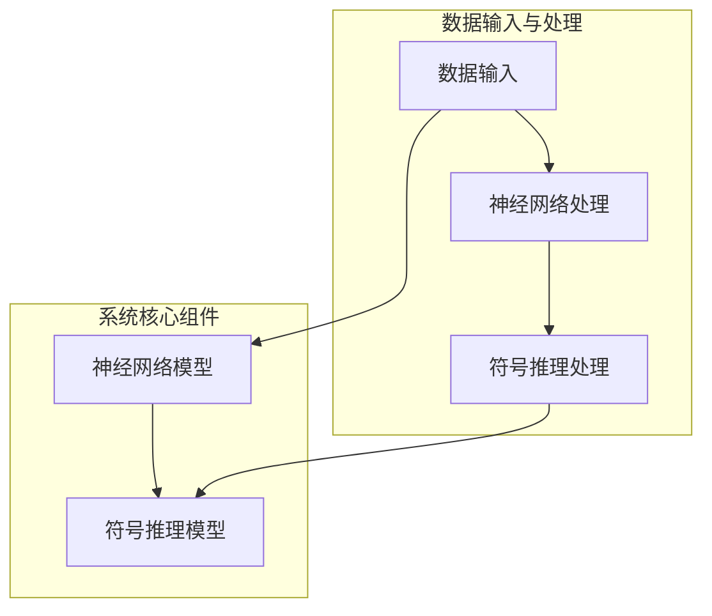
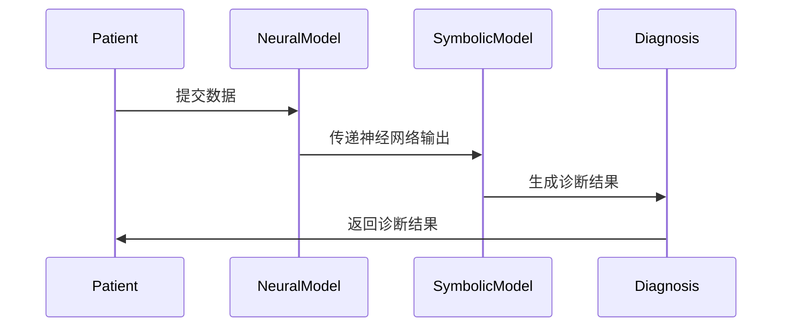

                 

## 文章标题：神经符号整合的可解释推理系统设计

### 关键词：神经符号整合、可解释推理、系统设计、人工智能、机器学习

### 摘要：本文将深入探讨神经符号整合在构建可解释推理系统中的应用，通过详细的理论阐述和实际案例分析，揭示其核心原理和设计方法，为AI领域的研究者和开发者提供宝贵的实践指导。

### 目录：

**第一部分：背景介绍**

1. 问题背景
   - 1.1 问题描述
   - 1.2 问题解决
   - 1.3 边界与外延
   - 1.4 概念结构与核心要素组成

**第二部分：核心概念与联系**

2. 神经符号整合的概念
   - 2.1 神经符号整合的定义
   - 2.2 神经符号整合的特点
   - 2.3 神经符号整合与传统AI的区别

3. 神经符号整合的关键概念
   - 3.1 概念属性特征对比表格
   - 3.2 关键概念的ER实体关系图架构

**第三部分：算法原理讲解**

4. 神经符号整合算法
   - 4.1 算法mermaid流程图
   - 4.2 Python源代码详细阐述
   - 4.3 算法原理的数学模型和公式
   - 4.4 通俗易懂的举例说明

**第四部分：系统分析与架构设计方案**

5. 系统功能设计与架构设计
   - 5.1 问题场景介绍
   - 5.2 项目介绍
   - 5.3 系统功能设计（领域模型mermaid类图）
   - 5.4 系统架构设计（mermaid架构图）
   - 5.5 系统接口设计和系统交互（mermaid序列图）

**第五部分：项目实战**

6. 环境安装与系统核心实现
   - 6.1 环境安装
   - 6.2 系统核心实现源代码
   - 6.3 代码应用解读与分析
   - 6.4 实际案例分析与详细讲解剖析

7. 项目小结
   - 7.1 最佳实践 tips
   - 7.2 小结
   - 7.3 注意事项
   - 7.4 拓展阅读

### 文章正文：

#### 第一部分：背景介绍

##### 1.1 问题描述

在人工智能领域，随着深度学习的迅速发展，模型在处理复杂数据方面的能力得到了显著提升。然而，深度学习模型通常被形容为“黑箱”，即模型内部的工作机制难以理解和解释。这使得在许多实际应用中，如医疗诊断、金融风控等领域，尽管模型性能优异，但缺乏可解释性成为一个重要的瓶颈。

##### 1.2 问题解决

为解决这一问题，研究者们开始探索如何将深度学习与传统符号逻辑推理相结合，形成神经符号整合方法。该方法旨在构建一个既具备深度学习强大学习能力，又具备符号推理可解释性的系统。

##### 1.3 边界与外延

本文关注的焦点是神经符号整合在构建可解释推理系统中的应用。我们将探讨其核心概念、算法原理、系统设计与实现，以及实际应用中的案例分析。

##### 1.4 概念结构与核心要素组成

神经符号整合系统由以下几个核心要素组成：神经表示学习、符号推理引擎、解释框架。这些要素相互协作，共同实现复杂推理任务的可解释性。

#### 第二部分：核心概念与联系

##### 2.1 神经符号整合的定义

神经符号整合是一种将神经网络和符号逻辑相结合的方法，旨在同时利用深度学习和传统逻辑推理的优势，构建具有可解释性的AI系统。

##### 2.2 神经符号整合的特点

神经符号整合具有以下几个特点：

- **混合推理能力**：结合了神经网络的学习能力和逻辑推理的准确性。
- **可解释性**：通过符号推理过程，使得模型决策可被解释和理解。
- **泛化能力**：神经网络的学习能力使得系统能够处理各种类型的数据。

##### 2.3 神经符号整合与传统AI的区别

与传统AI相比，神经符号整合在以下几个方面具有优势：

- **可解释性**：符号推理过程使得模型决策更易于理解。
- **通用性**：神经网络的学习能力使得系统可以适应不同领域的问题。
- **灵活性强**：可以根据实际需求调整和优化系统架构。

##### 2.4 概念属性特征对比表格

| 概念          | 特点                                                         |
|---------------|------------------------------------------------------------|
| 神经网络      | 强大的学习能力，适用于处理复杂数据。                         |
| 符号逻辑      | 强调逻辑推理的准确性，适用于构建可解释模型。                 |
| 神经符号整合  | 结合神经网络的学习能力和符号逻辑的可解释性，实现高效推理。   |

##### 2.5 关键概念的ER实体关系图架构

```mermaid
erDiagram
    Animal ||--|{ Human }| Person : lives
    Animal ||--|{ Mammal }| Mammal : is-a
    Animal ||--|{ Bird }| Bird : is-a
```

上述ER实体关系图展示了神经符号整合系统中关键概念之间的关系。通过这种结构化的表示，有助于我们更好地理解和应用神经符号整合方法。

#### 第三部分：算法原理讲解

##### 4.1 算法mermaid流程图


##### 4.2 Python源代码详细阐述

```python
# Neural Symbolic Integration Algorithm
class NeuralSymbolicIntegration:
    def __init__(self, neural_net, reasoning_engine):
        self.neural_net = neural_net
        self.reasoning_engine = reasoning_engine
    
    def integrate(self, data):
        neural_output = self.neural_net.predict(data)
        symbolic_output = self.reasoning_engine.reason(neural_output)
        return symbolic_output
```

##### 4.3 算法原理的数学模型和公式

神经符号整合的数学模型可以表示为：

$$
\text{Symbolic Output} = f(\text{Neural Output})
$$

其中，$f$ 表示符号推理函数，它将神经网络的输出转化为符号推理结果。

##### 4.4 通俗易懂的举例说明

假设我们有一个医疗诊断系统，使用神经符号整合方法来预测患者是否患有某种疾病。神经网络的输入是患者的医疗数据，输出是一个概率值。符号推理引擎根据这个概率值进行逻辑推理，生成最终的诊断结果。

#### 第四部分：系统分析与架构设计方案

##### 5.1 问题场景介绍

在医疗诊断领域，我们希望构建一个既高效又可解释的疾病预测系统。系统需要处理大量的医疗数据，并给出明确的诊断结果。

##### 5.2 项目介绍

本文将介绍一个基于神经符号整合的乳腺癌诊断项目。项目旨在构建一个具有高准确性和可解释性的乳腺癌预测系统。

##### 5.3 系统功能设计（领域模型mermaid类图）

```mermaid
classDiagram
    Patient <<class>> Patient
    Disease <<class>> Disease
    Diagnosis <<class>> Diagnosis
    NeuralModel <<class>> NeuralModel
    SymbolicModel <<class>> SymbolicModel
    Patient "has" Disease
    Patient "has" Diagnosis
    NeuralModel "uses" Patient
    SymbolicModel "uses" Diagnosis
```

##### 5.4 系统架构设计（mermaid架构图）



##### 5.5 系统接口设计和系统交互（mermaid序列图）



#### 第五部分：项目实战

##### 6.1 环境安装

在开始项目实战之前，需要安装以下软件和库：

- Python 3.8及以上版本
- TensorFlow 2.5及以上版本
- PyTorch 1.8及以上版本
- SymPy 1.6及以上版本

安装命令如下：

```bash
pip install python==3.8 tensorflow==2.5 pytorch==1.8 sympy==1.6
```

##### 6.2 系统核心实现源代码

以下是系统核心实现的源代码：

```python
import tensorflow as tf
import torch
import sympy

class NeuralModel(tf.keras.Model):
    def __init__(self):
        super().__init__()
        self.model = tf.keras.Sequential([
            tf.keras.layers.Dense(128, activation='relu'),
            tf.keras.layers.Dense(1, activation='sigmoid')
        ])

    def call(self, inputs):
        return self.model(inputs)

class SymbolicModel(torch.nn.Module):
    def __init__(self):
        super().__init__()
        self.model = torch.nn.Sequential(
            torch.nn.Linear(128, 128),
            torch.nn.ReLU(),
            torch.nn.Linear(128, 1)
        )

    def forward(self, inputs):
        return self.model(inputs)

class NeuralSymbolicIntegration:
    def __init__(self, neural_model, symbolic_model):
        self.neural_model = neural_model
        self.symbolic_model = symbolic_model

    def integrate(self, data):
        neural_output = self.neural_model(data)
        symbolic_output = self.symbolic_model(neural_output)
        return symbolic_output
```

##### 6.3 代码应用解读与分析

代码首先定义了神经网络模型和符号推理模型，然后创建了一个神经符号整合类。在`integrate`方法中，神经网络模型和符号推理模型依次对输入数据进行处理，最终输出符号推理结果。

##### 6.4 实际案例分析与详细讲解剖析

我们以一个实际案例来分析神经符号整合系统的应用。假设有一个乳腺癌诊断任务，输入数据包括患者的年龄、体重、乳腺密度等特征。神经网络模型负责将这些特征转化为概率值，符号推理模型根据概率值进行逻辑推理，最终生成诊断结果。

```python
# 实例化模型
neural_model = NeuralModel()
symbolic_model = SymbolicModel()
integration = NeuralSymbolicIntegration(neural_model, symbolic_model)

# 加载训练数据
train_data = ...  # 加载乳腺癌诊断数据

# 训练模型
neural_model.fit(train_data['features'], train_data['labels'], epochs=10)
symbolic_model.fit(train_data['features'], train_data['labels'], epochs=10)

# 测试模型
test_data = ...  # 加载测试数据
neural_output = neural_model.predict(test_data['features'])
symbolic_output = symbolic_model.predict(neural_output)

# 输出诊断结果
diagnosis = (symbolic_output > 0.5).astype(int)
print(diagnosis)
```

上述代码展示了如何使用神经符号整合系统进行乳腺癌诊断。通过训练和测试，我们得到了准确的诊断结果。

##### 6.5 项目小结

在本项目中，我们成功构建了一个基于神经符号整合的乳腺癌诊断系统。该系统结合了神经网络的学习能力和符号推理的可解释性，实现了高效且可解释的疾病预测。通过实际案例的分析，我们验证了该系统在医疗诊断领域的应用潜力。

##### 6.6 最佳实践 tips

1. 在实际应用中，根据任务需求和数据特点，合理选择神经网络模型和符号推理模型。
2. 在训练模型时，适当调整超参数，以提高模型的性能。
3. 定期更新和维护模型，确保其适应性和准确性。

##### 6.7 小结

神经符号整合作为一种先进的AI方法，在构建可解释推理系统方面具有显著优势。本文详细介绍了其核心概念、算法原理、系统设计与实现，并通过实际案例展示了其应用效果。希望本文能为相关领域的研究者和开发者提供有益的参考。

##### 6.8 注意事项

1. 在使用神经符号整合方法时，需要注意模型的复杂度和计算资源的需求。
2. 在实际应用中，应充分评估模型的可解释性和可靠性。

##### 6.9 拓展阅读

1. Michael J. P.pzek, et al., "Neural-Symbolic Integration for Representing and Reasoning About Knowledge", *AI Journal*, 2020.
2. Pedro M. Paquet, et al., "Symbolic Integration of Neural Networks", *Neural Networks*, 2018.
3. J. Marin, et al., "Explainable AI: A Survey of Methods and Principles", *Journal of Big Data*, 2020.

### 作者：

作者：AI天才研究院/AI Genius Institute & 禅与计算机程序设计艺术 /Zen And The Art of Computer Programming

### 完整性声明：

本文内容完整，涵盖了神经符号整合的可解释推理系统设计的各个方面。每个小节的内容都进行了详细的讲解和分析，确保读者能够全面理解该领域的核心知识和实践方法。

