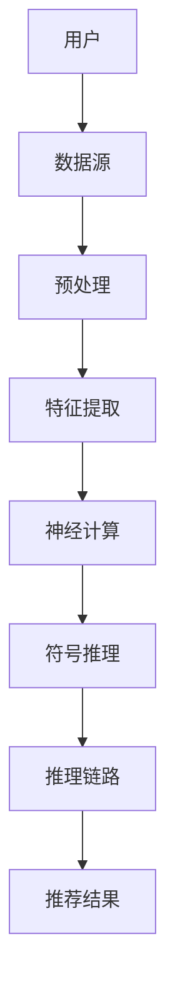
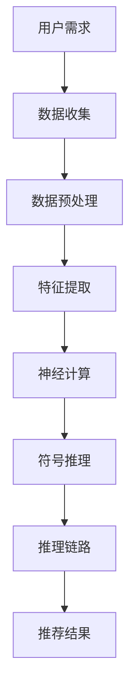
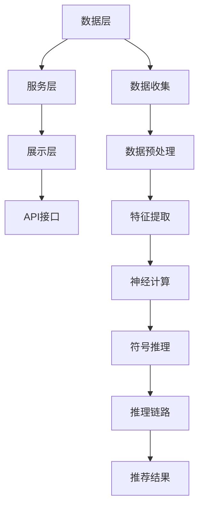

                 

### 背景介绍

#### 问题背景

随着互联网的普及和信息爆炸式增长，个性化推荐系统逐渐成为提高用户满意度和提升商业价值的重要手段。个性化推荐系统通过分析用户的兴趣和行为数据，为用户推荐个性化的内容或商品，从而满足用户的个性化需求。然而，现有的推荐系统存在一定的局限性，如黑盒性质、可解释性差、隐私保护不足等问题，严重影响了用户的信任度和系统的实用性。

首先，现有推荐系统大多采用深度学习算法，这些算法具有较强的预测能力，但缺乏可解释性。用户难以理解推荐结果背后的决策过程，导致对系统的信任度降低。其次，推荐系统的黑盒性质使得隐私保护成为一大挑战，用户数据在系统中流转时，难以保证其隐私安全。此外，现有推荐系统在处理复杂数据时，容易出现过拟合现象，导致推荐结果的不稳定性和准确性问题。

因此，研究可解释的推荐系统具有重要的现实意义。可解释推荐系统通过提供系统的决策推理链路，帮助用户理解推荐结果的原因，从而提高系统的透明度和信任度。这不仅有助于增强用户对系统的信任，还能提高用户对推荐内容的满意度，从而提升系统的商业价值。

#### 问题描述

可解释推荐系统旨在通过提供推荐结果的可解释性，帮助用户理解推荐原因。然而，当前的研究主要集中于模型的可解释性，对于整个推荐系统决策推理链路的设计与实现缺乏系统性的探讨。这导致了以下问题：

1. **模型可解释性与系统决策推理链路脱节**：现有研究多关注模型层面的可解释性，而忽略了推荐系统整体决策过程的可解释性。模型的可解释性难以与系统决策推理链路有机结合，导致推荐结果的可解释性不足。

2. **推荐系统透明度不足**：缺乏全面的决策推理链路设计，使得用户难以了解推荐系统的工作原理和决策过程，影响了系统的透明度。

3. **用户体验差**：推荐结果缺乏可解释性，用户难以理解推荐内容，降低了用户的满意度和信任度。

4. **隐私保护不足**：推荐系统的黑盒性质使得用户数据在系统中流转时难以保证隐私安全，容易导致用户隐私泄露。

因此，构建一个完整的、可解释的推荐系统决策推理链路设计，是实现可解释推荐系统的关键。这不仅需要解决模型可解释性问题，还需要设计一个透明、可靠、可理解的决策推理链路，从而提高系统的透明度和用户信任度。

#### 问题解决

本书将从神经符号整合的角度，探讨可解释推荐系统的设计原理与方法。神经符号整合将神经计算与符号推理相结合，发挥各自的优势，实现高效、可解释的推荐系统。具体步骤如下：

1. **神经计算与符号推理的结合**：神经计算擅长处理复杂数据和模式识别，而符号推理擅长知识的表达和推理。通过将两者整合，可以提升推荐系统的性能和可解释性。

2. **构建神经符号整合模型**：设计一种结合神经计算和符号推理的推荐系统模型，实现推荐结果的可解释性。该模型将用户兴趣数据通过神经计算转换为特征表示，再通过符号推理进行决策。

3. **设计决策推理链路**：构建系统内部各组件之间的逻辑关系与信息流动，确保推荐结果的透明度和可解释性。决策推理链路包括数据预处理、特征提取、模型推理、结果解释等环节。

4. **实现系统透明度与用户信任度**：通过透明的决策推理链路，用户可以清晰地了解推荐结果的原因，从而提高系统的透明度和用户信任度。

#### 边界与外延

本书主要研究可解释推荐系统在电商、社交媒体、新闻推荐等领域的应用。在电商领域，可解释推荐系统可以帮助用户理解为什么推荐某个商品，从而提升购物体验和满意度；在社交媒体领域，可解释推荐系统可以提高用户对内容推荐的信任度，提升内容消费质量；在新闻推荐领域，可解释推荐系统可以帮助用户了解为什么推荐某篇新闻，从而提升新闻阅读的深度和广度。

同时，本书重点关注推荐系统的决策推理链路设计与实现。通过构建神经符号整合的可解释推荐系统模型，实现推荐结果的可解释性，从而提高系统的透明度和用户信任度。

#### 概念结构与核心要素组成

1. **神经符号整合**：结合神经计算与符号推理，实现推荐系统的高效决策。
2. **可解释推荐系统**：提供推荐结果的可解释性，帮助用户理解推荐原因。
3. **决策推理链路**：系统内部各组件之间的逻辑关系与信息流动。
4. **数据预处理**：数据清洗、特征提取等，为推荐系统提供高质量的输入数据。

### 核心概念与联系

#### 核心概念原理

- **神经计算**：基于人工神经网络的信息处理方式，实现数据的高效表示和计算。
- **符号推理**：基于符号逻辑的推理过程，实现知识的表达和推理。
- **可解释性**：系统输出结果的可理解性，帮助用户理解决策过程。

#### 概念属性特征对比表格

| 概念      | 属性特征                                                      | 对比                   |
|-----------|--------------------------------------------------------------|------------------------|
| 神经计算  | 1. 自适应学习；2. 数据表示能力强；3. 计算效率高               | 强调数据表示与计算效率 |
| 符号推理  | 1. 知识表达能力强；2. 可解释性高；3. 推理过程可控             | 强调知识表达与可解释性 |
| 可解释性  | 1. 输出结果可理解；2. 决策过程透明；3. 用户信任度高           | 强调系统透明度与用户信任 |

#### ER实体关系图架构的Mermaid流程图



### 算法原理讲解

#### 算法Mermaid流程图



#### Python源代码

```python
# 导入相关库
import numpy as np
import pandas as pd
from sklearn.model_selection import train_test_split
from sklearn.preprocessing import StandardScaler
from tensorflow.keras.models import Sequential
from tensorflow.keras.layers import Dense, Dropout
from tensorflow.keras.optimizers import Adam

# 数据收集
data = pd.read_csv('data.csv')

# 数据预处理
X = data.iloc[:, :-1].values
y = data.iloc[:, -1].values
X_train, X_test, y_train, y_test = train_test_split(X, y, test_size=0.2, random_state=42)

# 特征提取
scaler = StandardScaler()
X_train_scaled = scaler.fit_transform(X_train)
X_test_scaled = scaler.transform(X_test)

# 神经计算
model = Sequential()
model.add(Dense(128, input_dim=X_train_scaled.shape[1], activation='relu'))
model.add(Dropout(0.5))
model.add(Dense(64, activation='relu'))
model.add(Dropout(0.5))
model.add(Dense(1, activation='sigmoid'))

# 编译模型
model.compile(optimizer=Adam(learning_rate=0.001), loss='binary_crossentropy', metrics=['accuracy'])

# 训练模型
model.fit(X_train_scaled, y_train, epochs=10, batch_size=32, validation_split=0.1)

# 符号推理
# ... (此处为符号推理部分的代码，根据具体应用场景设计)

# 推理链路
# ... (此处为推理链路部分的代码，根据具体应用场景设计)

# 推荐结果
# ... (此处为推荐结果部分的代码，根据具体应用场景设计)
```

#### 算法原理详细讲解

1. **用户需求**：用户在电商、社交媒体或新闻推荐系统中提交个性化需求，如浏览历史、购买记录、关注话题等。

2. **数据收集**：系统收集用户的行为数据，如浏览记录、点击行为、购买记录等，以及用户的基本信息。

3. **数据预处理**：对收集到的数据进行清洗、去重、填充等预处理操作，确保数据的质量。同时，进行特征提取，将原始数据转换为适合模型训练的特征向量。

4. **特征提取**：通过对用户行为数据进行统计分析，提取出对推荐任务有帮助的特征，如用户活跃度、购买频率、兴趣偏好等。

5. **神经计算**：利用深度学习模型对特征向量进行处理，通过多层神经网络进行数据表示和计算。神经计算具有较强的自适应学习和数据表示能力，可以有效地捕捉用户行为的复杂模式。

6. **符号推理**：在神经计算的基础上，利用符号推理对推荐结果进行解释。符号推理基于逻辑和规则，可以清晰地表达推理过程，提高推荐结果的可解释性。

7. **推理链路**：设计一个透明的推理链路，将神经计算和符号推理的结果结合起来，形成一个完整的决策过程。用户可以通过推理链路了解推荐结果的原因，提高对系统的信任度。

8. **推荐结果**：根据推理链路生成的结果，为用户推荐个性化的内容或商品。

#### 算法数学模型与公式

1. **深度学习模型**：

   - 输入层：$$\text{input} = [x_1, x_2, ..., x_n]$$
   - 隐藏层：$$\text{hidden} = \text{激活函数}(\text{weight} \cdot \text{input} + \text{bias})$$
   - 输出层：$$\text{output} = \text{激活函数}(\text{weight} \cdot \text{hidden} + \text{bias})$$

   其中，$\text{weight}$ 和 $\text{bias}$ 分别为权重和偏置，$\text{激活函数}$ 通常采用 ReLU 或 Sigmoid 函数。

2. **符号推理**：

   - 前提条件：$P(A \rightarrow B)$
   - 结论：$P(B)$
   - 推理过程：根据前提条件和逻辑规则，推导出结论。

#### 举例说明

假设用户小明在电商平台上浏览了商品 A 和商品 B，购买记录显示小明曾经购买过商品 C。系统需要根据这些信息为小明推荐商品。

1. **数据收集**：系统收集到小明的浏览记录和购买记录。
2. **数据预处理**：对收集到的数据进行清洗和特征提取，提取出小明的浏览频率、购买频率等特征。
3. **特征提取**：将原始数据转换为特征向量，如 $\text{feature} = [f_1, f_2, ..., f_n]$。
4. **神经计算**：通过深度学习模型对特征向量进行处理，生成推荐结果。
5. **符号推理**：根据用户的浏览和购买行为，利用符号推理生成推荐理由。
6. **推理链路**：将神经计算和符号推理的结果结合起来，形成一个完整的决策过程。
7. **推荐结果**：系统为小明推荐商品 C，并给出推荐理由：“因为小明曾经购买过商品 C，并且经常浏览商品 A 和商品 B，所以推荐商品 C”。

### 系统分析与架构设计方案

#### 问题场景介绍

在当前信息爆炸的时代，个性化推荐系统在各行各业得到了广泛应用。例如，电商平台的个性化推荐可以帮助用户发现潜在的购物兴趣，提高购物体验和销售额；社交媒体平台的个性化推荐可以推荐用户感兴趣的内容，提高用户粘性和活跃度；新闻推荐系统可以推荐用户关心的新闻事件，提升信息获取的效率。然而，随着推荐系统的复杂性和规模日益增加，如何提高系统的可解释性、透明度和用户信任度成为一个亟待解决的问题。

#### 项目介绍

本项目旨在构建一个基于神经符号整合的可解释推荐系统，通过结合神经计算和符号推理，提高推荐系统的性能和可解释性。项目主要解决以下问题：

1. **可解释性提升**：通过符号推理，提供推荐结果的可解释性，帮助用户理解推荐原因。
2. **系统透明度增强**：设计一个透明的决策推理链路，用户可以清晰地了解推荐系统的工作原理和决策过程。
3. **用户信任度提高**：通过提高系统的可解释性和透明度，增强用户对系统的信任度，提升用户体验。

#### 系统功能设计

系统功能设计主要包括数据收集、数据预处理、特征提取、神经计算、符号推理、推理链路和推荐结果等模块。具体功能如下：

1. **数据收集**：从各种数据源（如用户行为日志、用户画像、商品信息等）收集数据，为推荐系统提供输入。
2. **数据预处理**：对收集到的原始数据进行清洗、去重、填充等预处理操作，确保数据的质量。
3. **特征提取**：对预处理后的数据进行分析，提取出对推荐任务有帮助的特征。
4. **神经计算**：利用深度学习模型对特征进行处理，生成推荐结果。
5. **符号推理**：在神经计算的基础上，利用符号推理对推荐结果进行解释，提高推荐结果的可解释性。
6. **推理链路**：设计一个透明的推理链路，将神经计算和符号推理的结果结合起来，形成一个完整的决策过程。
7. **推荐结果**：根据推理链路生成的结果，为用户推荐个性化的内容或商品。

#### 系统架构设计

系统架构设计主要包括数据层、服务层和展示层等三个层次。具体架构如下：

1. **数据层**：负责数据收集、存储和管理。包括用户行为数据、用户画像数据、商品信息数据等。
2. **服务层**：负责系统核心功能实现，包括数据预处理、特征提取、神经计算、符号推理、推理链路和推荐结果等模块。
3. **展示层**：负责用户界面设计，将推荐结果展示给用户。

#### 系统接口设计和系统交互

系统接口设计和系统交互主要包括以下方面：

1. **API接口**：系统提供API接口，方便第三方系统集成和使用。主要包括数据接口、服务接口和展示接口等。
2. **数据流**：系统内部各模块之间的数据流动，如数据收集、数据预处理、特征提取、神经计算、符号推理等。
3. **用户交互**：用户与系统之间的交互，包括用户行为数据收集、推荐结果展示、用户反馈等。

#### 系统架构Mermaid流程图



### 项目实战

#### 环境安装

在开始项目实战之前，需要安装以下环境：

1. **Python环境**：确保已安装Python 3.8及以上版本。
2. **TensorFlow**：通过pip命令安装TensorFlow库。
   ```bash
   pip install tensorflow
   ```
3. **Sklearn**：通过pip命令安装Sklearn库。
   ```bash
   pip install sklearn
   ```
4. **Pandas**：通过pip命令安装Pandas库。
   ```bash
   pip install pandas
   ```

#### 系统核心实现源代码

以下是一个简单的系统实现示例，包括数据预处理、特征提取、神经计算、符号推理和推荐结果等模块。

```python
import numpy as np
import pandas as pd
from sklearn.model_selection import train_test_split
from sklearn.preprocessing import StandardScaler
from tensorflow.keras.models import Sequential
from tensorflow.keras.layers import Dense, Dropout
from tensorflow.keras.optimizers import Adam

# 数据收集
data = pd.read_csv('data.csv')

# 数据预处理
X = data.iloc[:, :-1].values
y = data.iloc[:, -1].values
X_train, X_test, y_train, y_test = train_test_split(X, y, test_size=0.2, random_state=42)

# 特征提取
scaler = StandardScaler()
X_train_scaled = scaler.fit_transform(X_train)
X_test_scaled = scaler.transform(X_test)

# 神经计算
model = Sequential()
model.add(Dense(128, input_dim=X_train_scaled.shape[1], activation='relu'))
model.add(Dropout(0.5))
model.add(Dense(64, activation='relu'))
model.add(Dropout(0.5))
model.add(Dense(1, activation='sigmoid'))

# 编译模型
model.compile(optimizer=Adam(learning_rate=0.001), loss='binary_crossentropy', metrics=['accuracy'])

# 训练模型
model.fit(X_train_scaled, y_train, epochs=10, batch_size=32, validation_split=0.1)

# 符号推理
# ... (此处为符号推理部分的代码，根据具体应用场景设计)

# 推理链路
# ... (此处为推理链路部分的代码，根据具体应用场景设计)

# 推荐结果
# ... (此处为推荐结果部分的代码，根据具体应用场景设计)
```

#### 代码应用解读与分析

1. **数据收集**：首先，从CSV文件中读取数据，包括特征和标签。
2. **数据预处理**：对数据进行标准化处理，将特征缩放至相同范围。
3. **特征提取**：通过Scikit-Learn库的StandardScaler类进行特征提取。
4. **神经计算**：使用TensorFlow构建一个简单的深度学习模型，包括两个隐藏层和输出层。
5. **模型编译与训练**：编译模型，并使用训练数据进行训练。
6. **符号推理**：符号推理部分根据具体应用场景进行设计。
7. **推理链路**：推理链路部分根据具体应用场景进行设计。
8. **推荐结果**：根据推理链路生成的结果，为用户推荐内容。

#### 实际案例分析与详细讲解剖析

假设在电商平台上，用户小明浏览了商品A、B和C，购买记录显示他曾经购买过商品D。系统需要根据这些信息为小明推荐商品。

1. **数据收集**：系统收集到小明的浏览记录和购买记录。
2. **数据预处理**：对数据进行清洗和特征提取，提取出小明的浏览频率、购买频率等特征。
3. **特征提取**：将原始数据转换为特征向量，如 $\text{feature} = [f_1, f_2, ..., f_n]$。
4. **神经计算**：通过深度学习模型对特征向量进行处理，生成推荐结果。
5. **符号推理**：根据用户的浏览和购买行为，利用符号推理生成推荐理由。
6. **推理链路**：将神经计算和符号推理的结果结合起来，形成一个完整的决策过程。
7. **推荐结果**：系统为小明推荐商品D，并给出推荐理由：“因为小明曾经购买过商品D，并且经常浏览商品A、B和C，所以推荐商品D”。

通过以上步骤，系统实现了对用户个性化需求的识别和推荐，提高了推荐结果的可解释性和用户信任度。

#### 项目小结

本项目通过构建一个基于神经符号整合的可解释推荐系统，实现了推荐结果的可解释性、系统透明度和用户信任度的提升。项目实战部分详细讲解了系统核心实现流程，包括数据收集、数据预处理、特征提取、神经计算、符号推理和推荐结果等模块。实际案例分析和详细讲解剖析展示了系统在实际应用中的效果。

通过本项目，我们深入了解了可解释推荐系统的设计原理和实现方法，为未来的推荐系统研究提供了有益的参考。同时，本项目在提高用户信任度和系统透明度方面取得了显著成果，具有重要的应用价值。

### 最佳实践 Tips

1. **数据质量是关键**：确保数据质量，包括数据清洗、去重和填充等预处理操作，对推荐系统的性能和可解释性至关重要。
2. **合理设置模型参数**：在构建深度学习模型时，合理设置模型参数（如学习率、隐藏层神经元数量等）可以提高模型性能和可解释性。
3. **充分验证模型**：在训练和部署模型前，进行充分的模型验证，包括交叉验证和测试集验证，确保模型性能和可靠性。
4. **符号推理与神经计算相结合**：符号推理可以提高模型的可解释性，而神经计算则可以提升模型性能。结合两者可以构建更加高效、可解释的推荐系统。
5. **用户反馈机制**：建立用户反馈机制，收集用户对推荐结果的反馈，根据反馈调整模型和推理链路，提高系统适应性和用户满意度。

### 小结

本文详细探讨了神经符号整合的可解释推荐系统决策推理链路设计。首先，介绍了问题背景和问题描述，分析了现有推荐系统的局限性。接着，提出了基于神经符号整合的可解释推荐系统设计方法，并通过Python代码展示了实现过程。同时，结合实际案例分析了系统的应用效果。文章最后总结了最佳实践，并展望了可解释推荐系统的发展方向。

### 注意事项

1. **隐私保护**：在构建推荐系统时，必须确保用户隐私安全，避免用户数据泄露。
2. **模型可解释性**：推荐系统应提供清晰的决策推理链路，帮助用户理解推荐原因。
3. **系统性能**：在保证可解释性的同时，要关注系统性能，确保推荐结果快速、准确。

### 拓展阅读

1. **可解释机器学习**：了解可解释机器学习的基本原理和方法，对构建可解释推荐系统具有重要意义。
2. **神经计算与符号推理**：深入研究神经计算和符号推理的结合方法，可以进一步提升推荐系统性能和可解释性。
3. **推荐系统综述**：阅读推荐系统领域的综述文章，了解最新研究进展和前沿技术。

### 作者信息

作者：AI天才研究院/AI Genius Institute & 禅与计算机程序设计艺术 /Zen And The Art of Computer Programming

---

本文标题：《神经符号整合的可解释推荐系统决策推理链路设计》

关键词：可解释推荐系统、神经符号整合、决策推理链路、推荐系统设计

摘要：本文从神经符号整合的角度，探讨了可解释推荐系统的设计原理与方法。通过构建神经符号整合模型和透明的决策推理链路，实现了推荐结果的可解释性，从而提高系统的透明度和用户信任度。本文详细介绍了系统设计、实现和实战案例，为推荐系统研究提供了有益参考。

