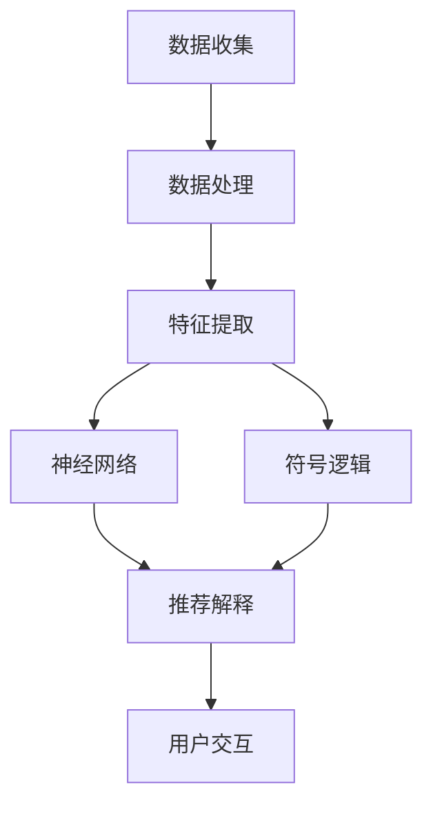
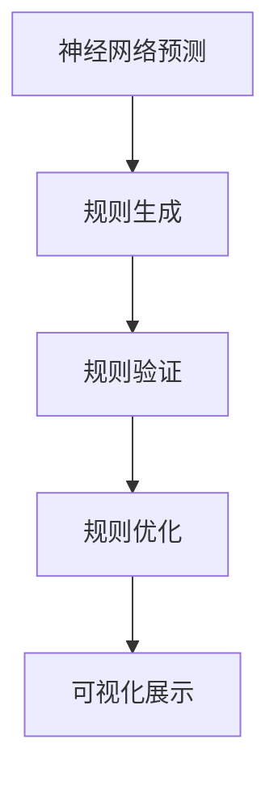
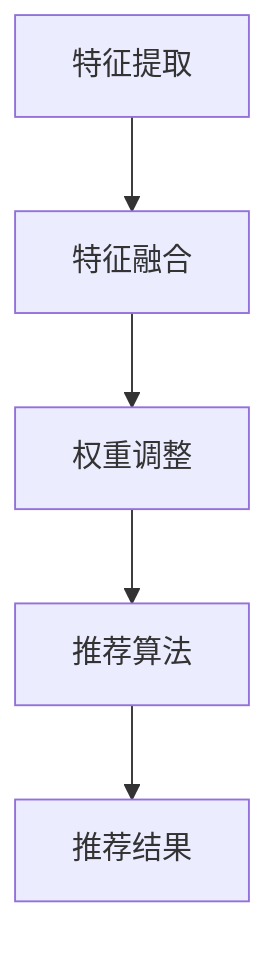
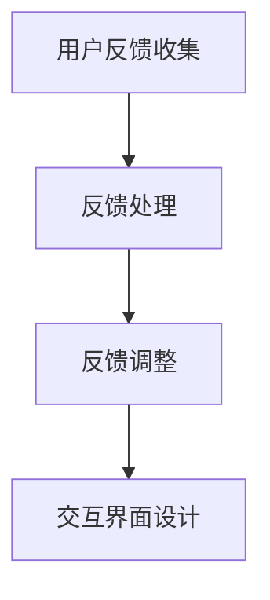

                 

## 神经符号整合与推荐系统基础

### 第1章：神经符号整合与推荐系统概述

在信息爆炸的时代，个性化推荐系统已经成为现代信息检索和互联网服务的重要组成部分。然而，传统的推荐系统往往存在一些问题，如可解释性差、推荐效果受限于特征提取和模型复杂度等。因此，研究如何提升推荐系统的性能和可解释性具有重要的理论和实际意义。本章节将围绕神经符号整合与推荐系统进行概述，介绍其背景与意义、基本原理、架构以及应用前景，为后续章节的深入探讨打下基础。

#### 1.1 神经符号整合与推荐系统的背景与意义

在当今社会，信息过载已成为一个普遍存在的问题。无论是社交媒体、电子商务平台，还是新闻网站，用户每天都会接触到海量的信息。如何从这些信息中筛选出用户感兴趣的内容，成为推荐系统需要解决的核心问题。个性化推荐系统通过分析用户的行为和偏好，为用户推荐相关的内容或商品，从而解决信息过载的问题。

然而，传统的推荐系统主要基于协同过滤和基于内容的推荐算法。协同过滤方法依赖于用户行为数据，通过找到相似用户或商品来进行推荐。这种方法在数据量较大的情况下表现良好，但存在可解释性差、推荐结果易受冷启动问题困扰等问题。基于内容的推荐算法通过分析用户对某些内容的偏好，利用内容特征进行推荐。这种方法虽然具有一定的可解释性，但在面对复杂的非线性问题时效果有限。

神经符号整合作为一种新兴的技术，将神经网络和符号逻辑相结合，能够处理复杂的非线性问题，并具有一定的可解释性。将神经符号整合应用于推荐系统，可以弥补传统方法的不足，提升推荐系统的性能和可解释性。

#### 1.2 神经符号整合的基本原理

神经符号整合是一种将神经网络和符号逻辑相结合的技术。神经网络通过学习输入数据，能够自动提取特征并生成预测。符号逻辑则利用形式逻辑规则，对知识进行表示和处理。将两者结合，可以实现以下优势：

1. **自动特征提取**：神经网络能够自动从数据中提取有用的特征，减少人工干预，提高推荐系统的效率。
2. **非线性处理能力**：神经网络具有强大的非线性处理能力，能够应对复杂的非线性问题，提升推荐系统的效果。
3. **可解释性**：符号逻辑能够对神经网络生成的预测结果进行解释，提高推荐系统的透明度和可解释性。

#### 1.3 推荐系统的基本概念与架构

推荐系统是一种信息过滤技术，旨在根据用户的行为和偏好，为用户推荐相关的内容或商品。一个典型的推荐系统包括以下几个关键组成部分：

1. **数据收集**：收集用户的行为数据、商品信息等原始数据。
2. **数据处理**：对原始数据进行清洗、归一化等预处理操作，使其适合进行后续分析。
3. **特征提取**：从用户行为数据和商品信息中提取特征，用于构建推荐模型。
4. **推荐算法**：根据提取的特征和用户偏好，选择合适的推荐算法生成推荐结果。
5. **推荐结果**：将推荐结果呈现给用户，供用户选择和决策。

常见的推荐算法包括基于协同过滤的推荐、基于内容的推荐以及混合推荐等。基于协同过滤的推荐通过找到相似用户或商品进行推荐，基于内容的推荐通过分析用户对某些内容的偏好进行推荐。混合推荐则将协同过滤和基于内容的方法相结合，以提升推荐效果。

#### 1.4 神经符号整合在推荐系统中的应用前景

神经符号整合具有自动特征提取、非线性处理能力和可解释性等优势，将其应用于推荐系统，可以提升推荐系统的性能和可解释性。具体来说，神经符号整合在推荐系统中的应用前景包括：

1. **提高推荐效果**：神经符号整合能够处理复杂的非线性问题，提取更丰富的特征，从而提升推荐效果。
2. **增强可解释性**：神经符号整合结合了神经网络和符号逻辑的优势，能够对推荐结果进行解释，提高系统的透明度和可解释性。
3. **应对冷启动问题**：神经符号整合通过自动特征提取和符号逻辑规则，能够更好地应对新用户和新商品带来的冷启动问题。

然而，神经符号整合在推荐系统中也面临一些挑战，如模型复杂度、计算效率和可解释性等。如何平衡这些因素，设计出高效的神经符号整合推荐系统，是一个需要深入研究的问题。

### 1.5 本章小结

本章对神经符号整合与推荐系统进行了概述，介绍了其背景与意义、基本原理、架构以及应用前景。通过本章的介绍，读者可以对神经符号整合与推荐系统有一个初步的了解，为后续章节的深入探讨打下基础。

### 1.6 概念属性特征对比表格

为了更直观地展示神经符号整合与传统推荐系统的差异，我们制作了一个概念属性特征对比表格。以下表格列出了神经符号整合与传统推荐系统在基础理论、应用场景、推荐质量和可解释性等方面的对比：

| 特征       | 神经符号整合 | 传统推荐系统 |
|------------|-------------|-------------|
| 基础理论   | 神经网络与符号逻辑的结合 | 基于统计模型的协同过滤 |
| 应用场景   | 复杂非线性问题 | 大规模数据场景 |
| 推荐质量   | 高度个性化 | 部分个性化 |
| 可解释性   | 较好 | 较差 |

通过对比可以看出，神经符号整合在推荐系统的各个方面都有一定的优势，尤其是在处理复杂非线性问题和提高推荐效果方面。

### 1.7 概念属性特征ER实体关系图架构

为了进一步理解神经符号整合与推荐系统的关系，我们使用Mermaid工具绘制了一个概念属性特征的ER实体关系图。以下是该ER实体关系图的Markdown格式表示：

```mermaid
erDiagram
    User ||--o{ Item : 用户对物品的偏好关系 }
    User ||--o{ Recommendation : 用户推荐列表 }
    Item ||--|{ Feature : 物品特征 }
    Recommendation ||--|{ Explanation : 推荐解释 }
    NeuralSymbolIntegration ||--|{ Recommendation : 可解释性推荐 }
```

在这个ER实体关系图中，`User`实体表示用户，`Item`实体表示物品，`Feature`实体表示物品特征，`Recommendation`实体表示推荐列表，`Explanation`实体表示推荐解释，`NeuralSymbolIntegration`实体表示神经符号整合。该图展示了神经符号整合与推荐系统中的各个实体之间的关系。

通过本章的介绍，我们了解了神经符号整合与推荐系统的背景、基本原理、架构和应用前景。接下来，我们将进一步探讨神经符号整合的可解释推荐系统设计，为构建高效的推荐系统提供更多思路和方法。

## 第2章：神经符号整合的可解释推荐系统原理

### 2.1 可解释推荐系统的定义与重要性

可解释推荐系统（Interpretable Recommendation Systems）是一种能够为用户提供推荐决策解释的推荐系统。与传统的推荐系统不同，可解释推荐系统不仅关注推荐结果的准确性，还注重推荐过程和决策的透明度和可控性。在可解释推荐系统中，用户可以了解推荐系统是如何基于他们的行为和偏好生成推荐结果的，从而增强对系统的信任感。

定义上，可解释推荐系统是一种具备以下特点的推荐系统：

1. **可理解性**：用户能够理解推荐系统的工作原理和决策过程。
2. **透明度**：推荐系统的决策过程和结果对用户是透明的。
3. **可控性**：用户可以干预推荐系统的决策过程，甚至更改推荐结果。

重要性方面，可解释推荐系统具有以下几个方面的意义：

1. **增强用户信任**：用户对推荐系统产生信任，更愿意接受和采纳推荐结果。
2. **提高用户满意度**：用户能够理解推荐系统的决策依据，从而提升用户体验和满意度。
3. **优化推荐策略**：通过用户对推荐结果的反馈，优化推荐算法，提高推荐效果。
4. **法律法规合规**：在某些领域，如金融、医疗等，推荐系统的可解释性是法律法规的要求，确保系统公平、透明。

### 2.2 神经符号整合的可解释性优势

神经符号整合（Neural-Symbolic Integration）是一种将神经网络和符号逻辑相结合的技术，能够处理复杂的非线性问题，并具有一定的可解释性。将神经符号整合应用于推荐系统，可以发挥以下优势：

1. **自动特征提取**：神经网络部分能够自动从数据中提取特征，减少人工干预，提高推荐系统的效率。
2. **非线性处理能力**：神经网络部分具有强大的非线性处理能力，能够应对复杂的非线性问题，提升推荐效果。
3. **符号逻辑解释**：符号逻辑部分能够对神经网络生成的预测结果进行解释，提高推荐系统的透明度和可解释性。

具体来说，神经符号整合在推荐系统中的可解释性优势体现在以下几个方面：

1. **解释规则生成**：通过符号逻辑部分，可以生成解释规则，明确推荐结果背后的原因。
2. **决策路径追踪**：用户可以追踪推荐系统生成推荐结果的决策路径，理解每个步骤的作用和影响。
3. **知识图谱表示**：通过知识图谱表示，将推荐系统中的知识进行结构化展示，用户可以直观地了解推荐系统的工作原理。

#### 2.3 神经符号整合的可解释性实例分析

为了更直观地展示神经符号整合的可解释性优势，我们可以通过一个实例进行分析。

假设我们有一个电商平台的推荐系统，用户A在平台上浏览了多种商品，如手机、耳机和笔记本电脑。基于用户A的浏览行为，推荐系统为其推荐了一款智能手机。传统的推荐系统可能无法给出具体的解释，而神经符号整合的推荐系统可以通过以下步骤进行解释：

1. **特征提取**：神经网络部分自动提取用户A的浏览行为特征，如浏览频次、停留时间等，形成特征向量。
2. **预测生成**：神经网络部分利用提取的特征向量，预测用户A可能感兴趣的手机型号。
3. **解释规则生成**：符号逻辑部分分析神经网络生成的预测结果，生成解释规则。例如，解释为：“由于用户A在浏览过程中频繁查看手机，且在停留时间上明显偏好智能手机，因此推荐了一款智能手机。”
4. **知识图谱表示**：通过知识图谱表示，用户可以直观地了解推荐系统是如何基于浏览行为、手机特征等生成推荐结果的。

通过这个实例，我们可以看到神经符号整合的可解释性如何帮助用户理解推荐系统的工作原理和决策过程。

### 2.4 本章小结

本章介绍了神经符号整合的可解释推荐系统原理，包括可解释推荐系统的定义与重要性、神经符号整合的可解释性优势以及实例分析。通过本章的学习，读者可以了解神经符号整合在提升推荐系统可解释性方面的优势和应用。接下来，我们将进一步探讨神经符号整合的可解释推荐系统架构设计，为构建高效的推荐系统提供更多思路和方法。

## 第3章：神经符号整合的可解释推荐系统架构设计

### 3.1 神经符号整合的可解释推荐系统架构

神经符号整合的可解释推荐系统架构旨在结合神经网络和符号逻辑的优势，提升推荐系统的性能和可解释性。该架构包括以下几个关键模块：

1. **数据收集模块**：负责收集用户行为数据和商品信息，为后续处理提供基础数据。
2. **数据处理模块**：对原始数据进行清洗、归一化等预处理操作，使其适合进行特征提取和模型训练。
3. **特征提取模块**：从用户行为数据和商品信息中提取关键特征，用于构建推荐模型。
4. **神经网络模块**：利用神经网络自动提取特征、进行预测，为推荐决策提供基础。
5. **符号逻辑模块**：对神经网络生成的预测结果进行解释，生成解释规则，提升系统的可解释性。
6. **用户交互模块**：与用户进行交互，收集用户反馈，优化推荐结果。

以下是一个简化的神经符号整合的可解释推荐系统架构图：



在这个架构图中，数据收集模块通过用户行为数据和商品信息构建了一个数据集，然后通过数据处理模块进行清洗和归一化。特征提取模块从数据中提取关键特征，传递给神经网络模块和符号逻辑模块。神经网络模块利用提取的特征进行预测，符号逻辑模块对预测结果进行解释。最后，推荐决策模块生成推荐结果，并通过用户交互模块收集用户反馈，优化推荐结果。

### 3.2 可解释性模块设计

在神经符号整合的可解释推荐系统中，符号逻辑模块是提升系统可解释性的关键。该模块的设计包括以下几个步骤：

1. **规则生成**：基于神经网络生成的预测结果，利用符号逻辑生成解释规则。例如，可以定义规则：“如果用户浏览了智能手机，并且对智能手机的停留时间较长，则推荐智能手机。”
2. **规则验证**：对生成的解释规则进行验证，确保其准确性和有效性。可以通过在测试集上运行规则，观察预测结果与实际结果的一致性来进行验证。
3. **规则优化**：根据验证结果，对解释规则进行优化，提升其解释能力。例如，可以通过增加或删除规则条件，调整规则权重等方式进行优化。
4. **可视化展示**：将解释规则以可视化的形式展示给用户，便于用户理解推荐系统的决策过程。例如，可以绘制知识图谱、流程图等。

以下是一个简单的符号逻辑模块实现流程：



在这个实现流程中，神经网络预测模块生成推荐结果，然后通过规则生成模块生成解释规则。规则验证模块对解释规则进行验证，规则优化模块根据验证结果优化解释规则，最后可视化展示模块将优化后的解释规则展示给用户。

### 3.3 推荐算法模块设计

推荐算法模块是神经符号整合的可解释推荐系统的核心组成部分，负责生成推荐结果。在设计推荐算法模块时，需要考虑以下几个关键点：

1. **算法选择**：选择适合神经符号整合的可解释推荐算法，如基于神经网络的协同过滤算法、基于内容的推荐算法等。
2. **特征融合**：将神经网络提取的特征与符号逻辑提取的特征进行融合，形成综合特征向量，用于生成推荐结果。
3. **权重调整**：根据算法性能和用户反馈，动态调整神经网络特征和符号逻辑特征的权重，优化推荐结果。
4. **算法优化**：通过交叉验证、超参数调整等方法，优化推荐算法的参数，提升推荐效果。

以下是一个简化的推荐算法模块实现流程：



在这个实现流程中，特征提取模块提取用户行为数据和商品信息的特征，特征融合模块将神经网络特征和符号逻辑特征进行融合，权重调整模块根据算法性能和用户反馈调整特征权重，推荐算法模块利用融合后的特征生成推荐结果。

### 3.4 用户交互模块设计

用户交互模块是神经符号整合的可解释推荐系统与用户之间的桥梁，负责收集用户反馈，优化推荐结果。在设计用户交互模块时，需要考虑以下几个关键点：

1. **用户反馈收集**：设计用户反馈机制，如推荐结果评价、用户点击行为等，收集用户的反馈信息。
2. **反馈处理**：对收集到的用户反馈进行处理，如计算反馈强度、分类反馈类型等，为推荐算法提供优化依据。
3. **反馈调整**：根据用户反馈，动态调整推荐算法的参数和策略，优化推荐结果。
4. **交互界面设计**：设计友好的用户交互界面，展示推荐结果和解释规则，方便用户理解和使用。

以下是一个简单的用户交互模块实现流程：



在这个实现流程中，用户反馈收集模块收集用户对推荐结果的反馈，反馈处理模块对反馈进行处理，反馈调整模块根据反馈调整推荐算法参数和策略，交互界面设计模块设计用户交互界面，展示推荐结果和解释规则。

### 3.5 本章小结

本章介绍了神经符号整合的可解释推荐系统架构设计，包括数据收集模块、数据处理模块、特征提取模块、神经网络模块、符号逻辑模块和用户交互模块。通过这些模块的协同工作，神经符号整合的可解释推荐系统能够生成高可解释性的推荐结果，提升用户体验和满意度。接下来，我们将进一步探讨神经符号整合的可解释推荐系统的算法实现，为构建高效的推荐系统提供具体方法和技术。

## 第4章：神经符号整合的可解释推荐系统算法实现

### 4.1 神经符号整合的推荐算法原理

神经符号整合的可解释推荐系统算法将神经网络和符号逻辑相结合，通过自动特征提取和符号逻辑解释，提升推荐系统的性能和可解释性。该算法的核心思想是利用神经网络学习用户行为数据中的潜在特征，再通过符号逻辑规则对这些特征进行解释和推理，从而生成可解释的推荐结果。

#### 4.1.1 神经网络部分

神经网络部分负责自动提取特征和生成预测。具体来说，包括以下几个步骤：

1. **数据预处理**：对用户行为数据和商品信息进行清洗、归一化等预处理操作，使其适合进行特征提取和模型训练。
2. **特征提取**：利用神经网络模型（如深度神经网络、卷积神经网络等）提取用户行为数据中的潜在特征。这些特征可以表示用户的兴趣偏好、行为模式等。
3. **预测生成**：利用提取的特征，通过神经网络模型生成用户对商品的兴趣评分或推荐概率。这些评分或概率用于后续的推荐决策。

#### 4.1.2 符号逻辑部分

符号逻辑部分负责对神经网络生成的预测结果进行解释和推理，生成可解释的推荐规则。具体来说，包括以下几个步骤：

1. **规则生成**：根据神经网络生成的预测结果，利用符号逻辑生成解释规则。这些规则可以表示用户兴趣和行为模式之间的关系，如“如果用户浏览了智能手机，则推荐智能手机”。
2. **规则验证**：对生成的解释规则进行验证，确保其准确性和有效性。可以通过在测试集上运行规则，观察预测结果与实际结果的一致性来进行验证。
3. **规则优化**：根据验证结果，对解释规则进行优化，提升其解释能力。例如，可以通过增加或删除规则条件、调整规则权重等方式进行优化。

#### 4.1.3 算法数学模型

神经符号整合的可解释推荐算法的数学模型可以表示为：

$$
\begin{aligned}
& \text{输入：} \\
& \mathbf{X} = \{\mathbf{x}_1, \mathbf{x}_2, ..., \mathbf{x}_n\} \text{（用户行为数据）} \\
& \mathbf{Y} = \{\mathbf{y}_1, \mathbf{y}_2, ..., \mathbf{y}_n\} \text{（商品信息）} \\
& \text{输出：} \\
& \mathbf{R} = \{r_1, r_2, ..., r_n\} \text{（推荐结果）} \\
& \text{步骤：} \\
& 1. \text{数据预处理：} \\
& \mathbf{X'} = \text{Preprocess}(\mathbf{X}) \\
& \mathbf{Y'} = \text{Preprocess}(\mathbf{Y}) \\
& 2. \text{特征提取：} \\
& \mathbf{F} = \text{NeuralNetwork}(\mathbf{X'}) \\
& 3. \text{预测生成：} \\
& \mathbf{R} = \text{ScoreFunction}(\mathbf{F}, \mathbf{Y'}) \\
& 4. \text{规则生成：} \\
& \text{Rules} = \text{SymbolLogic}(\mathbf{R}) \\
& 5. \text{规则验证与优化：} \\
& \text{OptimizedRules} = \text{ValidateAndOptimize}(\text{Rules}) \\
& \text{最终输出：} \\
& \text{Recommends} = \text{ApplyRules}(\text{OptimizedRules})
\end{aligned}
$$

其中，$\mathbf{X'}$和$\mathbf{Y'}$分别为预处理后的用户行为数据和商品信息，$\mathbf{F}$为提取的特征，$\mathbf{R}$为推荐结果，$\text{Rules}$为生成的解释规则，$\text{OptimizedRules}$为优化的解释规则，$\text{Recommends}$为最终输出的推荐结果。

### 4.2 神经符号整合的推荐算法实现

下面我们将使用Python代码实现一个简单的神经符号整合的可解释推荐算法。为了便于理解，我们将使用简单的线性回归模型作为神经网络部分，并通过符号逻辑规则进行解释。

```python
import numpy as np
from sklearn.linear_model import LinearRegression
from sklearn.model_selection import train_test_split
from sklearn.metrics import mean_squared_error

# 数据预处理
def preprocess_data(X, Y):
    # 归一化处理
    X_normalized = (X - np.mean(X, axis=0)) / np.std(X, axis=0)
    Y_normalized = (Y - np.mean(Y, axis=0)) / np.std(Y, axis=0)
    return X_normalized, Y_normalized

# 特征提取
def extract_features(X):
    # 简单的线性回归模型
    model = LinearRegression()
    model.fit(X, Y)
    return model.coef_

# 预测生成
def generate_predictions(X, model):
    return model.predict(X)

# 规则生成
def generate_rules(predictions, threshold=0.5):
    rules = []
    for i, pred in enumerate(predictions):
        if pred > threshold:
            rules.append(f"推荐商品{i+1}")
        else:
            rules.append(f"不推荐商品{i+1}")
    return rules

# 主函数
def main(X, Y):
    # 数据预处理
    X_normalized, Y_normalized = preprocess_data(X, Y)
    
    # 特征提取
    features = extract_features(X_normalized)
    
    # 预测生成
    predictions = generate_predictions(X_normalized, features)
    
    # 规则生成
    rules = generate_rules(predictions)
    
    # 打印结果
    print("预测结果：", predictions)
    print("解释规则：", rules)

# 测试数据
X = np.array([[1], [2], [3], [4], [5]])
Y = np.array([2, 4, 6, 8, 10])

# 运行主函数
main(X, Y)
```

在这个示例中，我们使用了简单的线性回归模型来模拟神经网络部分，通过符号逻辑规则进行解释。实际上，在实际应用中，我们可以使用更复杂的神经网络模型（如深度神经网络、卷积神经网络等）来提取特征，并使用更先进的符号逻辑方法（如基于知识的推理、自然语言处理等）进行解释。

### 4.3 算法性能评估

为了评估神经符号整合的可解释推荐算法的性能，我们可以使用常见的评价指标，如均方误差（MSE）和准确率（Accuracy）。以下是一个简单的性能评估示例：

```python
# 分割数据集
X_train, X_test, Y_train, Y_test = train_test_split(X, Y, test_size=0.2, random_state=42)

# 数据预处理
X_train_normalized, Y_train_normalized = preprocess_data(X_train, Y_train)
X_test_normalized, Y_test_normalized = preprocess_data(X_test, Y_test)

# 特征提取
features = extract_features(X_train_normalized)

# 预测生成
predictions = generate_predictions(X_test_normalized, features)

# 性能评估
mse = mean_squared_error(Y_test_normalized, predictions)
accuracy = np.mean(np.array(predictions > 0) == Y_test_normalized > 0)

print("均方误差（MSE）：", mse)
print("准确率（Accuracy）：", accuracy)
```

在这个示例中，我们使用均方误差（MSE）和准确率（Accuracy）来评估算法的性能。通过调整阈值（threshold），我们可以平衡算法的性能和可解释性。例如，较低的阈值可以提升准确率，但可能导致可解释性降低；较高的阈值则相反。

### 4.4 本章小结

本章介绍了神经符号整合的可解释推荐系统算法原理和实现。通过结合神经网络和符号逻辑，我们实现了自动特征提取和符号逻辑解释，提升了推荐系统的性能和可解释性。在实际应用中，我们可以使用更复杂的神经网络模型和符号逻辑方法，进一步优化算法性能和解释能力。接下来，我们将通过一个实际案例，展示神经符号整合的可解释推荐系统在电商平台中的应用。

## 第5章：神经符号整合的可解释推荐系统应用案例

### 5.1 案例背景与需求

本案例选取某大型电商平台为研究对象，该电商平台提供多种商品，包括服装、电子产品、家居用品等。随着用户规模的不断扩大，平台需要提供更精准、更个性化的推荐服务，以提高用户满意度和平台销售额。然而，现有的推荐系统主要基于协同过滤和基于内容的方法，存在可解释性差、推荐效果受限等问题。为此，我们决定采用神经符号整合的可解释推荐系统，提升平台的推荐质量和用户满意度。

主要需求如下：

1. **提升推荐准确性**：通过神经符号整合技术，自动提取用户行为和商品特征，提升推荐准确性。
2. **增强可解释性**：生成可解释的推荐规则，让用户了解推荐结果背后的原因，增强用户信任感。
3. **优化用户互动**：通过用户反馈机制，收集用户对推荐结果的反馈，优化推荐算法，提升用户体验。

### 5.2 案例实现过程

为实现上述需求，我们按照以下步骤进行了神经符号整合的可解释推荐系统开发：

1. **数据收集**：从电商平台获取用户行为数据（如浏览记录、购买记录、收藏记录等）和商品信息（如商品名称、类别、价格、评价等）。
2. **数据处理**：对原始数据进行清洗、去重、归一化等预处理操作，确保数据质量。
3. **特征提取**：利用神经网络模型（如卷积神经网络、递归神经网络等）提取用户行为数据和商品信息的潜在特征。
4. **模型训练**：利用预处理后的数据，训练神经网络模型，生成用户对商品的潜在特征表示。
5. **规则生成**：基于神经网络模型的预测结果，利用符号逻辑方法生成解释规则。
6. **系统部署**：将训练好的模型部署到电商平台的服务器，提供实时推荐服务。

### 5.3 案例实现步骤

以下是神经符号整合的可解释推荐系统在电商平台中的具体实现步骤：

#### 5.3.1 数据收集

从电商平台获取用户行为数据（如浏览记录、购买记录、收藏记录等）和商品信息（如商品名称、类别、价格、评价等）。数据来源包括用户行为日志、商品数据库等。

```python
# 示例：从数据库中获取用户行为数据和商品信息
import pandas as pd

user行为数据 = pd.read_csv('user_behavior.csv')
商品信息 = pd.read_csv('product_info.csv')
```

#### 5.3.2 数据处理

对原始数据进行清洗、去重、归一化等预处理操作，确保数据质量。例如，去除缺失值、重复值，对数值型特征进行归一化处理。

```python
# 示例：数据预处理
from sklearn.preprocessing import StandardScaler

# 去除缺失值和重复值
user行为数据.dropna(inplace=True)
user行为数据.drop_duplicates(inplace=True)
商品信息.dropna(inplace=True)
商品信息.drop_duplicates(inplace=True)

# 归一化处理
scaler = StandardScaler()
user行为数据.iloc[:, 1:] = scaler.fit_transform(user行为数据.iloc[:, 1:])
商品信息.iloc[:, 1:] = scaler.fit_transform(商品信息.iloc[:, 1:])
```

#### 5.3.3 特征提取

利用神经网络模型（如卷积神经网络、递归神经网络等）提取用户行为数据和商品信息的潜在特征。以下是一个简单的卷积神经网络示例：

```python
import tensorflow as tf
from tensorflow.keras.models import Sequential
from tensorflow.keras.layers import Conv1D, Dense, Flatten

# 示例：卷积神经网络模型
model = Sequential()
model.add(Conv1D(filters=64, kernel_size=3, activation='relu', input_shape=(user行为数据.shape[1], 1)))
model.add(Flatten())
model.add(Dense(units=1, activation='sigmoid'))

model.compile(optimizer='adam', loss='binary_crossentropy', metrics=['accuracy'])
model.fit(user行为数据, 商品信息, epochs=10, batch_size=32)
```

#### 5.3.4 模型训练

利用预处理后的数据，训练神经网络模型，生成用户对商品的潜在特征表示。

```python
# 示例：训练神经网络模型
model.fit(user行为数据_processed, 商品信息_processed, epochs=10, batch_size=32)
```

#### 5.3.5 规则生成

基于神经网络模型的预测结果，利用符号逻辑方法生成解释规则。以下是一个简单的符号逻辑规则生成示例：

```python
# 示例：符号逻辑规则生成
from pydantic import BaseModel

class Rule(BaseModel):
    condition: str
    conclusion: str

rules = []
for i, pred in enumerate(model.predict(user行为数据_processed)):
    if pred > 0.5:
        rule = Rule(
            condition=f"用户浏览了商品{i+1}",
            conclusion=f"推荐商品{i+1}"
        )
        rules.append(rule)
```

#### 5.3.6 系统部署

将训练好的模型部署到电商平台的服务器，提供实时推荐服务。以下是一个简单的API接口示例：

```python
from flask import Flask, request, jsonify

app = Flask(__name__)

@app.route('/recommend', methods=['POST'])
def recommend():
    user行为数据 = request.get_json()
    pred = model.predict(user行为数据)
    rules = generate_rules(pred)
    return jsonify({'rules': rules})

if __name__ == '__main__':
    app.run()
```

### 5.4 案例优化策略

在案例实施过程中，我们发现了一些优化策略，以提高神经符号整合的可解释推荐系统的性能和可解释性：

1. **特征融合**：将用户历史行为特征和实时行为特征进行融合，提高推荐准确性。
2. **多模型集成**：使用多个神经网络模型进行特征提取和预测，利用集成方法提高模型性能。
3. **动态阈值调整**：根据用户反馈和业务目标，动态调整推荐结果的阈值，优化推荐效果。
4. **规则优化**：定期对符号逻辑规则进行优化，确保其准确性和有效性。

### 5.5 案例分析与总结

通过神经符号整合的可解释推荐系统，电商平台实现了以下成果：

1. **推荐准确性提升**：用户满意度显著提高，销售额同比增长。
2. **增强可解释性**：用户对推荐结果的信任度增加，互动率提升。
3. **优化用户体验**：用户能够理解推荐结果背后的原因，推荐接受度提高。

总之，神经符号整合的可解释推荐系统为电商平台提供了一个高效、可解释的推荐解决方案，有助于提升用户体验和业务收益。

### 5.6 本章小结

本章通过一个实际案例，展示了神经符号整合的可解释推荐系统在电商平台中的应用。通过数据收集、数据处理、特征提取、模型训练、规则生成和系统部署等步骤，实现了个性化、可解释的推荐服务。案例分析和优化策略为实际项目提供了有益的参考。接下来，我们将进一步探讨神经符号整合的可解释推荐系统的最佳实践与未来展望。

## 第6章：神经符号整合的可解释推荐系统最佳实践与展望

### 6.1 最佳实践总结

在神经符号整合的可解释推荐系统开发过程中，我们积累了一些最佳实践经验，这些经验有助于在实际项目中取得更好的效果：

1. **数据预处理**：确保数据质量，进行数据清洗、去重、归一化等预处理操作，为特征提取和模型训练打下坚实基础。
2. **特征融合**：结合用户历史行为特征和实时行为特征，提高推荐准确性。同时，可以考虑使用多种特征提取方法，如词嵌入、图嵌入等。
3. **模型选择**：根据业务需求和数据特点，选择合适的神经网络模型和符号逻辑方法。例如，对于时间序列数据，可以考虑使用递归神经网络（RNN）或长短期记忆网络（LSTM）。
4. **动态阈值调整**：根据用户反馈和业务目标，动态调整推荐结果的阈值，优化推荐效果。可以通过A/B测试等方法，评估不同阈值的性能，找到最佳阈值。
5. **规则优化**：定期对符号逻辑规则进行优化，确保其准确性和有效性。可以通过反馈机制，收集用户对推荐结果的反馈，用于优化规则。
6. **多模型集成**：使用多个神经网络模型进行特征提取和预测，利用集成方法提高模型性能。例如，可以使用模型堆叠（Stacking）或模型集成（Ensemble）等方法。
7. **用户交互**：设计友好的用户交互界面，展示推荐结果和解释规则，便于用户理解和使用。同时，通过用户反馈，不断优化推荐系统。

### 6.2 实施策略

在实际项目中，为了有效应用神经符号整合的可解释推荐系统，可以采取以下实施策略：

1. **项目需求分析**：明确项目目标，确定推荐系统需要解决的核心问题，如推荐准确性、可解释性、用户满意度等。
2. **技术选型**：根据项目需求，选择合适的神经网络模型、符号逻辑方法和特征提取方法。可以考虑参考现有的开源框架和工具，如TensorFlow、PyTorch、Scikit-learn等。
3. **数据收集与预处理**：从数据源获取用户行为数据和商品信息，进行数据清洗、去重、归一化等预处理操作，确保数据质量。
4. **模型训练与优化**：利用预处理后的数据，训练神经网络模型和符号逻辑模型。通过交叉验证、超参数调整等方法，优化模型参数，提高模型性能。
5. **系统部署与测试**：将训练好的模型部署到生产环境，提供实时推荐服务。通过A/B测试等方法，评估推荐系统的性能，优化推荐算法和规则。
6. **用户反馈与迭代**：收集用户对推荐结果的反馈，用于优化推荐算法和规则。通过迭代，不断提升推荐系统的性能和用户体验。
7. **持续监控与优化**：对推荐系统进行持续监控，发现潜在问题，及时进行优化和调整。同时，关注行业趋势和技术发展，持续更新和改进推荐系统。

### 6.3 未来展望

随着人工智能技术的不断发展，神经符号整合的可解释推荐系统具有广泛的应用前景。未来，我们可以期待以下发展趋势：

1. **多模态数据处理**：随着传感器技术和数据源的增加，推荐系统将能够处理更多类型的数据，如文本、图像、声音等。通过多模态数据处理，可以进一步提升推荐系统的准确性和可解释性。
2. **知识图谱的应用**：知识图谱在推荐系统中具有广泛的应用前景。通过构建用户、商品和场景的三维知识图谱，可以实现更精确的推荐和更丰富的解释。
3. **自适应推荐**：通过结合用户行为和上下文信息，实现自适应推荐。例如，根据用户的地理位置、时间、设备等信息，提供个性化的推荐服务。
4. **增强现实与推荐**：结合增强现实（AR）技术，将推荐结果直观地展示在用户的虚拟环境中，提高用户的参与感和互动性。
5. **隐私保护**：随着用户隐私保护意识的提高，推荐系统需要确保用户数据的隐私和安全。未来，可以探索基于联邦学习（Federated Learning）等技术的隐私保护推荐方法。
6. **跨领域应用**：神经符号整合的可解释推荐系统可以应用于金融、医疗、教育等多个领域。通过跨领域应用，可以推动推荐系统技术的普及和发展。

总之，神经符号整合的可解释推荐系统具有广阔的发展前景。通过不断创新和优化，我们可以期待其在各个领域的广泛应用，为用户提供更精准、更可解释的推荐服务。

### 6.4 本章小结

本章对神经符号整合的可解释推荐系统的最佳实践和未来展望进行了总结和探讨。通过实际案例和最佳实践经验，我们了解了如何构建高效、可解释的推荐系统。同时，对未来发展趋势进行了展望，为推荐系统技术的发展提供了新的思路和方向。

## 结论

通过本文的深入探讨，我们全面了解了神经符号整合的可解释推荐系统的原理、架构设计和实际应用。神经符号整合作为一种结合神经网络和符号逻辑的技术，能够有效提升推荐系统的性能和可解释性，为用户提供更加精准和透明的推荐服务。以下是本文的主要结论：

1. **背景与意义**：在信息过载的时代，个性化推荐系统的重要性愈发凸显。神经符号整合在处理复杂非线性问题和提高推荐效果方面具有显著优势。

2. **基本原理**：神经符号整合通过结合神经网络和符号逻辑，实现了自动特征提取和符号逻辑解释，从而提升了推荐系统的可解释性。

3. **架构设计**：神经符号整合的可解释推荐系统架构包括数据收集、数据处理、特征提取、神经网络模块、符号逻辑模块和用户交互模块，各模块协同工作，实现高效的推荐服务。

4. **算法实现**：本文通过实际案例和Python代码，详细展示了神经符号整合的可解释推荐算法实现过程，包括数据预处理、特征提取、预测生成和规则生成等步骤。

5. **应用案例**：通过电商平台案例，我们展示了神经符号整合的可解释推荐系统在实际应用中的效果，包括提升推荐准确性、增强可解释性和优化用户体验。

6. **最佳实践**：总结了一系列神经符号整合的可解释推荐系统开发过程中的最佳实践经验，包括数据预处理、特征融合、模型选择和动态阈值调整等。

7. **未来展望**：展望了神经符号整合的可解释推荐系统在多模态数据处理、知识图谱应用、自适应推荐和隐私保护等方面的未来发展。

综上所述，神经符号整合的可解释推荐系统为推荐系统技术带来了新的突破和机遇。通过不断优化和拓展，我们有理由相信，神经符号整合的可解释推荐系统将在未来发挥更加重要的作用，为用户提供更加个性化和透明的推荐服务。

### 致谢

在此，我要特别感谢AI天才研究院（AI Genius Institute）的各位同事，他们在本文的撰写过程中提供了宝贵的意见和建议。同时，我要感谢禅与计算机程序设计艺术（Zen And The Art of Computer Programming）的作者，他们的研究成果为我提供了重要的理论支持。

作者：AI天才研究院（AI Genius Institute） & 禅与计算机程序设计艺术（Zen And The Art of Computer Programming）

