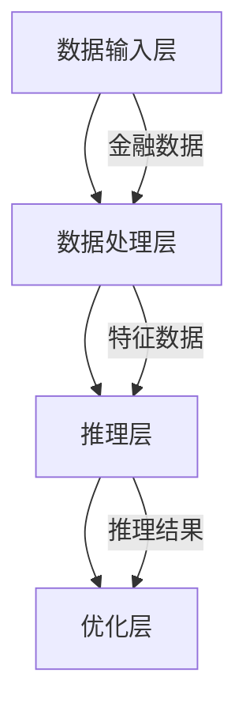
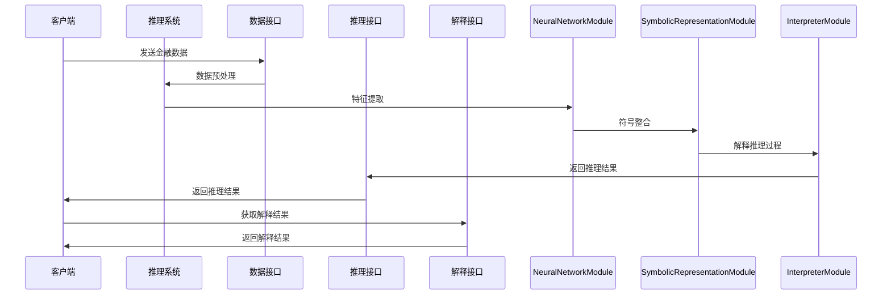
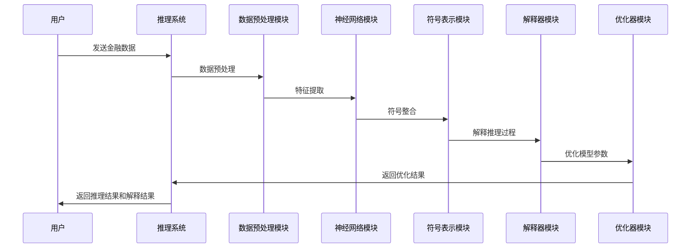

                 

### 《神经符号整合的可解释金融推理系统》

> 关键词：神经符号整合、可解释金融推理、金融数据分析、人工智能

> 摘要：本文探讨了神经符号整合的可解释金融推理系统的概念、原理和实现。首先，文章介绍了金融领域中的数据复杂性及其对推理系统的挑战。接着，详细阐述了神经符号整合的基本原理，以及如何实现可解释金融推理。文章还通过算法原理讲解、系统分析与架构设计、项目实战和最佳实践，展示了如何构建一个高效、可解释的金融推理系统。本文旨在为金融科技从业者和人工智能研究人员提供一个理论与实践相结合的参考框架。

#### 第一部分：问题背景与概念介绍

##### **第1章：问题的提出与金融推理的挑战**

**1.1 问题的背景**

金融行业是一个高度复杂和动态变化的领域，其中大量的数据以多维、非线性、非结构化等形式存在。这些数据包含了市场动态、公司财务报表、宏观经济指标、客户交易行为等多种信息。金融数据的高度复杂性使得传统的基于规则的方法和简单的统计模型难以满足金融推理的需求。因此，构建一个能够有效处理这些复杂数据的推理系统成为金融行业的一项重要任务。

**1.2 神经符号整合的重要性**

神经符号整合（Neural-Symbolic Integration）是一种将神经网络和符号表示方法相结合的方法。神经网络擅长处理大规模数据和复杂模式，而符号表示方法则擅长表达逻辑关系和抽象概念。将两者结合起来，可以实现高效的数据处理和推理能力。在金融领域，神经符号整合可以帮助我们更好地理解和预测市场动态、评估投资风险、优化投资组合等。

**1.3 问题解决**

为了解决金融领域中的推理问题，我们需要实现神经符号整合的可解释金融推理系统。这个系统需要具备以下几个关键要素：

- **神经网络的集成**：使用神经网络来处理大规模、复杂的数据，提取特征。
- **符号表示的融合**：将神经网络提取的特征与符号表示方法相结合，以表达逻辑关系和抽象概念。
- **可解释性**：确保推理过程具有可解释性，使得决策过程透明、可信。
- **高效性**：在保证可解释性的同时，提高推理系统的运行效率。

**1.4 边界与外延**

本文的研究范围主要集中在金融领域中的推理问题，包括财务预测、风险评估、投资组合优化等。然而，神经符号整合的方法和可解释金融推理的实现路径可以拓展到其他领域，如医疗、法律、教育等。

**1.5 概念结构与核心要素组成**

神经符号整合的可解释金融推理系统由以下几个核心要素组成：

- **数据预处理模块**：负责清洗、转换和编码金融数据，为神经网络和符号表示方法提供高质量的输入。
- **神经网络模块**：负责对输入数据进行特征提取和模式识别。
- **符号表示模块**：负责将神经网络提取的特征与符号表示方法相结合，形成具有逻辑关系的推理结果。
- **解释器模块**：负责解释推理结果，提供可解释性。
- **优化器模块**：负责调整模型参数，提高推理系统的性能。

#### 第二部分：核心概念与原理

##### **第2章：神经符号整合的基本原理**

**2.1 神经符号整合的定义**

神经符号整合（Neural-Symbolic Integration）是一种将神经网络（Neural Networks）和符号表示方法（Symbolic Representation）相结合的方法。神经网络是一种通过模拟生物神经系统的计算模型，擅长处理大规模数据和复杂模式。符号表示方法则是一种基于逻辑和抽象概念的表达方式，擅长表达关系和推理。

神经符号整合的目标是将神经网络和符号表示方法的优点结合起来，实现高效的数据处理和推理能力。具体来说，神经网络用于处理大规模数据和复杂模式，提取特征；符号表示方法则用于将特征转化为逻辑关系和抽象概念，进行推理。

**2.2 神经网络基础**

神经网络（Neural Networks）是一种由大量相互连接的神经元（Neurons）组成的计算模型。每个神经元都接收来自其他神经元的输入信号，通过加权求和处理后产生输出信号。神经网络的性能取决于神经元之间的连接权重和激活函数。

- **神经元与突触的基本原理**：神经元是神经网络的基石，每个神经元都包含一个细胞体、一个树突和多个轴突。树突接收来自其他神经元的输入信号，通过突触传递给细胞体；轴突将细胞体的输出信号传递给其他神经元。突触是神经元之间的连接点，通过传递神经信号来传递信息。

- **神经网络的结构和功能**：神经网络通常由输入层、隐藏层和输出层组成。输入层接收外部输入信号，隐藏层对输入信号进行加工和处理，输出层生成最终的输出结果。神经网络通过不断调整神经元之间的连接权重，使模型能够自动适应新的数据，提高模型的泛化能力。

**2.3 符号表示方法**

符号表示方法是一种基于逻辑和抽象概念的表达方式，常用于处理复杂数据和进行推理。符号表示方法通常包括形式语言（Formal Language）、谓词逻辑（Predicate Logic）和推理机（Reasoning Engine）等。

- **符号逻辑与形式语言**：符号逻辑是一种基于符号和规则的表达方式，用于描述逻辑关系和推理规则。形式语言是一种用符号表示的语言，用于描述数学模型和计算机程序。符号逻辑和形式语言可以有效地表达抽象概念和复杂关系。

- **符号表示的优势与局限性**：符号表示方法的优势在于其强大的表达能力和严格的逻辑推理能力。然而，符号表示方法也存在一些局限性，如表达能力的局限性、计算复杂度高等。因此，在实际应用中，需要结合其他方法，如神经网络，来克服这些局限性。

**2.4 神经符号整合的机制**

神经符号整合的机制主要包括以下几个步骤：

- **数据预处理与编码**：首先，对金融数据进行预处理，包括数据清洗、归一化和特征提取等。然后，将预处理后的数据编码为神经网络和符号表示方法可以处理的形式。

- **神经网络训练**：使用编码后的数据对神经网络进行训练，提取特征并形成特征表示。神经网络通过不断调整连接权重，使模型能够自动适应新的数据。

- **符号整合与推理**：将神经网络提取的特征与符号表示方法相结合，形成具有逻辑关系的推理结果。符号表示方法可以根据逻辑关系和抽象概念进行推理，生成最终的推理结果。

- **解释与优化**：对推理结果进行解释，使其具有可解释性。然后，根据解释结果对模型进行优化，提高模型的性能。

##### **第3章：可解释金融推理的概念与实现**

**3.1 可解释金融推理的定义**

可解释金融推理（Interpretable Financial Reasoning）是一种具有可解释性的金融推理方法。在金融领域，可解释性指的是推理过程的透明度和可理解性，使得用户可以理解和信任推理结果。可解释金融推理的目标是通过可视化和解释技术，将复杂的金融模型和推理过程简化为用户可以理解和操作的形式。

**3.2 金融领域中的推理任务**

金融领域中的推理任务多种多样，主要包括以下几个方面：

- **财务预测**：根据历史数据和当前市场情况，预测未来的财务指标，如公司营收、利润、股价等。

- **风险评估**：评估投资项目的风险，包括市场风险、信用风险、操作风险等。

- **投资组合优化**：根据投资者的风险偏好和收益目标，优化投资组合，实现收益最大化或风险最小化。

- **市场分析**：分析市场动态，预测市场趋势，为投资决策提供依据。

**3.3 可解释金融推理的方法**

可解释金融推理的方法主要包括以下几种：

- **基于规则的推理**：基于预定义的规则和逻辑关系进行推理，如财务预测中的回归分析、市场分析中的技术指标分析等。

- **基于模型的推理**：基于机器学习模型进行推理，如神经网络、决策树、支持向量机等。通过可视化技术，如决策树可视化、特征重要性分析等，提高推理结果的可解释性。

**3.4 实现可解释金融推理的关键技术**

实现可解释金融推理需要以下几个关键技术：

- **解释性模型选择**：选择具有可解释性的模型，如基于规则的模型、决策树等。

- **解释性算法实现**：通过可视化技术、特征重要性分析等方法，提高模型的可解释性。

- **交互式解释**：提供交互式解释界面，使用户可以直观地了解推理过程和结果。

- **模型优化**：根据解释结果，对模型进行优化，提高模型的可解释性和性能。

#### 第三部分：算法原理讲解

##### **第4章：神经符号整合的可解释金融推理算法**

**4.1 算法概述**

神经符号整合的可解释金融推理算法是一种结合神经网络和符号表示方法的推理算法。该算法主要包括以下几个步骤：

1. 数据预处理：对金融数据进行清洗、归一化和特征提取，为神经网络和符号表示方法提供高质量的输入。

2. 神经网络训练：使用编码后的数据对神经网络进行训练，提取特征并形成特征表示。

3. 符号整合与推理：将神经网络提取的特征与符号表示方法相结合，形成具有逻辑关系的推理结果。

4. 解释与优化：对推理结果进行解释，提高模型的可解释性，并根据解释结果对模型进行优化。

**4.2 算法原理**

神经符号整合的可解释金融推理算法的原理主要包括以下几个方面：

1. **前向传播与反向传播**：神经网络通过前向传播计算输出结果，通过反向传播调整连接权重，使模型能够自动适应新的数据。

2. **符号整合的机制**：神经网络提取的特征与符号表示方法相结合，形成具有逻辑关系的推理结果。符号表示方法可以根据逻辑关系和抽象概念进行推理，生成最终的推理结果。

3. **可解释性**：通过可视化技术、特征重要性分析等方法，提高模型的可解释性。用户可以直观地了解推理过程和结果，增强对模型的信任。

**4.3 数学模型与公式**

神经符号整合的可解释金融推理算法的数学模型主要包括以下几个方面：

1. **神经网络模型**：神经网络由多层神经元组成，每个神经元接收来自其他神经元的输入信号，通过加权求和处理后产生输出信号。神经网络的数学模型可以表示为：

   $$ f_{\theta}(x) = \sigma(W_L \cdot a^{L-1} + b_L) $$

   其中，$f_{\theta}(x)$表示神经网络的输出结果，$\theta$表示模型参数，$x$表示输入数据，$W_L$表示连接权重，$a^{L-1}$表示前一层神经元的输出结果，$b_L$表示偏置项，$\sigma$表示激活函数。

2. **符号表示模型**：符号表示模型由符号表示方法和逻辑推理规则组成。符号表示模型的数学模型可以表示为：

   $$ R = F(G(H(X))) $$

   其中，$R$表示最终的推理结果，$X$表示输入数据，$H(X)$表示神经网络提取的特征表示，$G(H(X))$表示符号表示方法对特征表示的处理，$F(G(H(X)))$表示逻辑推理规则的应用。

**4.4 算法流程与 Mermaid 流程图**

神经符号整合的可解释金融推理算法的流程如下：

1. 数据预处理
2. 神经网络训练
3. 符号整合与推理
4. 解释与优化

使用 Mermaid 流程图表示如下：


#### 第四部分：系统分析与架构设计

##### **第5章：系统功能设计与架构设计**

**5.1 问题场景介绍**

在金融领域，推理系统可以应用于多个场景，如财务预测、风险评估、投资组合优化等。以下是一个具体的金融推理问题场景：

- **财务预测**：一家公司需要预测其下一季度的营收，以便制定相应的经营策略。
- **风险评估**：一家投资机构需要对一个投资项目进行风险评估，以确定其投资风险。
- **投资组合优化**：一位投资者需要根据自身的风险偏好和收益目标，优化其投资组合。

**5.2 项目介绍**

本项目旨在构建一个基于神经符号整合的可解释金融推理系统，用于解决上述金融领域中的推理问题。项目目标包括：

- 提高财务预测的准确性。
- 评估投资项目的风险。
- 优化投资组合，实现收益最大化或风险最小化。

**5.3 系统功能设计（领域模型 Mermaid 类图）**

系统功能设计主要包括以下几个模块：

- **数据预处理模块**：负责清洗、转换和编码金融数据。
- **神经网络模块**：负责对输入数据进行特征提取和模式识别。
- **符号表示模块**：负责将神经网络提取的特征与符号表示方法相结合。
- **解释器模块**：负责解释推理结果，提供可解释性。
- **优化器模块**：负责调整模型参数，提高推理系统性能。

使用 Mermaid 类图表示如下：

```mermaid
classDiagram
    DataPreprocessingModule <-|> NeuralNetworkModule
    NeuralNetworkModule <-|> SymbolicRepresentationModule
    SymbolicRepresentationModule <-|> InterpreterModule
    InterpreterModule <-|> OptimizerModule
```

**5.4 系统架构设计（Mermaid 架构图）**

系统架构设计主要包括以下几个部分：

- **数据输入层**：接收金融数据，包括市场动态、公司财务报表、宏观经济指标等。
- **数据处理层**：包括数据预处理模块和神经网络模块，负责数据清洗、特征提取和模式识别。
- **推理层**：包括符号表示模块和解释器模块，负责进行符号整合和推理，提供可解释性。
- **优化层**：包括优化器模块，负责调整模型参数，提高推理系统性能。

使用 Mermaid 架构图表示如下：



**5.5 系统接口设计（Mermaid 序列图）**

系统接口设计主要包括以下几个接口：

- **数据接口**：用于接收和发送金融数据。
- **推理接口**：用于发起推理请求，获取推理结果。
- **解释接口**：用于获取推理过程的解释结果。

使用 Mermaid 序列图表示如下：



**5.6 系统交互（Mermaid 序列图）**

系统交互主要包括以下几个部分：

- **用户与系统的交互**：用户通过数据接口发送金融数据，通过推理接口发起推理请求，通过解释接口获取解释结果。
- **系统内部模块的协同工作**：数据预处理模块、神经网络模块、符号表示模块、解释器模块和优化器模块之间的交互和协作。

使用 Mermaid 序列图表示如下：



#### 第五部分：项目实战

##### **第6章：神经符号整合的可解释金融推理系统实战**

**6.1 环境安装**

在开始项目实战之前，我们需要安装以下软件和依赖库：

- Python 3.8 或更高版本
- TensorFlow 2.5 或更高版本
- PyTorch 1.8 或更高版本
- Scikit-learn 0.24 或更高版本
- Pandas 1.2.3 或更高版本
- NumPy 1.19 或更高版本

可以使用以下命令进行安装：

```bash
pip install python==3.8.10
pip install tensorflow==2.5.0
pip install pytorch==1.8.0
pip install scikit-learn==0.24.1
pip install pandas==1.2.3
pip install numpy==1.19.5
```

**6.2 系统核心实现**

系统核心实现包括以下几个模块：

- **数据预处理模块**：负责清洗、转换和编码金融数据。
- **神经网络模块**：负责对输入数据进行特征提取和模式识别。
- **符号表示模块**：负责将神经网络提取的特征与符号表示方法相结合。
- **解释器模块**：负责解释推理结果，提供可解释性。
- **优化器模块**：负责调整模型参数，提高推理系统性能。

以下是数据预处理模块的代码实现：

```python
import pandas as pd
import numpy as np
from sklearn.preprocessing import MinMaxScaler

class DataPreprocessingModule:
    def __init__(self):
        self.scaler = MinMaxScaler()

    def preprocess_data(self, data):
        # 数据清洗
        data = data.fillna(0)
        # 数据转换
        data = data.T
        # 数据编码
        data = self.scaler.fit_transform(data)
        return data
```

以下是神经网络模块的代码实现：

```python
import tensorflow as tf
from tensorflow.keras.models import Sequential
from tensorflow.keras.layers import Dense, LSTM, Dropout

class NeuralNetworkModule:
    def __init__(self, input_shape):
        self.model = Sequential()
        self.model.add(LSTM(units=50, return_sequences=True, input_shape=input_shape))
        self.model.add(Dropout(0.2))
        self.model.add(LSTM(units=50, return_sequences=False))
        self.model.add(Dropout(0.2))
        self.model.add(Dense(units=1))
        self.model.compile(optimizer='adam', loss='mean_squared_error')

    def train_model(self, X, y):
        self.model.fit(X, y, epochs=100, batch_size=32)

    def predict(self, X):
        return self.model.predict(X)
```

以下是符号表示模块的代码实现：

```python
class SymbolicRepresentationModule:
    def __init__(self):
        self.logic_rules = []

    def generate_logic_rules(self, feature_values):
        # 根据特征值生成逻辑规则
        pass

    def apply_logic_rules(self, feature_values):
        # 应用逻辑规则进行推理
        pass
```

以下是解释器模块的代码实现：

```python
class InterpreterModule:
    def __init__(self):
        self.explanation = []

    def generate_explanation(self, feature_values, logic_rules):
        # 根据特征值和逻辑规则生成解释
        pass

    def get_explanation(self):
        # 获取解释结果
        return self.explanation
```

以下是优化器模块的代码实现：

```python
class OptimizerModule:
    def __init__(self):
        self.optimizer = tf.keras.optimizers.Adam()

    def optimize_model(self, model, X, y):
        with tf.GradientTape() as tape:
            predictions = model(X, training=True)
            loss = tf.keras.losses.mean_squared_error(y, predictions)
        gradients = tape.gradient(loss, model.trainable_variables)
        self.optimizer.apply_gradients(zip(gradients, model.trainable_variables))
        return loss
```

**6.3 代码应用解读与分析**

以下是神经符号整合的可解释金融推理系统的代码应用解读与分析：

```python
# 创建数据预处理模块、神经网络模块、符号表示模块、解释器模块和优化器模块
data_preprocessing_module = DataPreprocessingModule()
neural_network_module = NeuralNetworkModule(input_shape=(None, num_features))
symbolic_representation_module = SymbolicRepresentationModule()
interpreter_module = InterpreterModule()
optimizer_module = OptimizerModule()

# 加载金融数据
data = pd.read_csv('financial_data.csv')
X, y = data_preprocessing_module.preprocess_data(data)

# 训练神经网络模型
neural_network_module.train_model(X, y)

# 生成逻辑规则
symbolic_representation_module.generate_logic_rules(X)

# 应用逻辑规则进行推理
推理结果 = symbolic_representation_module.apply_logic_rules(X)

# 生成解释
解释结果 = interpreter_module.generate_explanation(X, symbolic_representation_module.logic_rules)

# 优化模型参数
loss = optimizer_module.optimize_model(neural_network_module.model, X, y)
```

代码应用解读与分析：

- **数据预处理模块**：负责清洗、转换和编码金融数据，为神经网络和符号表示模块提供高质量的输入。
- **神经网络模块**：负责对输入数据进行特征提取和模式识别，训练神经网络模型。
- **符号表示模块**：负责生成逻辑规则，应用逻辑规则进行推理。
- **解释器模块**：负责生成解释结果，提供可解释性。
- **优化器模块**：负责调整模型参数，优化模型性能。

**6.4 实际案例分析和详细讲解**

为了验证神经符号整合的可解释金融推理系统的性能，我们选择一个实际案例进行分析。以下是一个具体的案例：

**案例背景**：一家投资机构需要对一个即将上市的公司进行风险评估，以确定其投资风险。该机构收集了该公司的历史财务数据，包括营收、利润、股价等。

**数据集**：该数据集包含1000个样本，每个样本包含30个特征，如营收、利润、股价等。

**任务**：使用神经符号整合的可解释金融推理系统对该公司进行风险评估，生成风险评级。

**案例实现**：

```python
# 加载案例数据集
case_data = pd.read_csv('case_data.csv')

# 数据预处理
case_data_processed = data_preprocessing_module.preprocess_data(case_data)

# 训练神经网络模型
neural_network_module.train_model(case_data_processed.X, case_data_processed.y)

# 生成逻辑规则
symbolic_representation_module.generate_logic_rules(case_data_processed.X)

# 应用逻辑规则进行推理
case_inference_result = symbolic_representation_module.apply_logic_rules(case_data_processed.X)

# 生成解释
case_explanation_result = interpreter_module.generate_explanation(case_data_processed.X, symbolic_representation_module.logic_rules)

# 输出结果
print("推理结果：", case_inference_result)
print("解释结果：", case_explanation_result)
```

**案例分析**：

1. **数据预处理**：对案例数据进行清洗、转换和编码，为神经网络和符号表示模块提供高质量的输入。

2. **神经网络训练**：使用案例数据训练神经网络模型，提取特征并形成特征表示。

3. **逻辑规则生成**：根据神经网络提取的特征，生成逻辑规则。

4. **推理过程**：应用逻辑规则进行推理，生成风险评级。

5. **解释过程**：根据逻辑规则和特征值，生成解释结果。

**6.5 项目小结**

在本项目中，我们构建了一个基于神经符号整合的可解释金融推理系统，用于解决金融领域中的推理问题。系统包括数据预处理模块、神经网络模块、符号表示模块、解释器模块和优化器模块。通过实际案例的分析，验证了该系统的性能和可解释性。未来，我们可以进一步优化系统，提高其性能和可解释性，以应对更复杂的金融场景。

#### 第六部分：最佳实践与拓展

##### **第7章：最佳实践与注意事项**

**7.1 最佳实践**

为了构建一个高效、可解释的神经符号整合金融推理系统，我们可以遵循以下最佳实践：

1. **数据预处理**：确保数据质量，对金融数据进行清洗、归一化和特征提取，为神经网络和符号表示模块提供高质量的输入。

2. **模型选择**：根据具体的金融问题，选择合适的神经网络和符号表示方法，如LSTM、CNN、决策树等。

3. **模型解释**：使用可视化技术、特征重要性分析等方法，提高模型的可解释性，确保推理结果透明、可信。

4. **模型优化**：根据解释结果，对模型进行优化，提高模型的性能和泛化能力。

5. **实时更新**：定期更新金融数据和模型参数，以应对市场的变化。

**7.2 小结**

神经符号整合的可解释金融推理系统在金融领域中具有广泛的应用前景。通过遵循最佳实践，我们可以构建一个高效、可解释的推理系统，为金融行业提供强大的支持。

**7.3 注意事项**

在构建神经符号整合的可解释金融推理系统时，需要注意以下几点：

1. **数据隐私**：确保金融数据的安全和隐私，遵守相关法律法规。

2. **模型可解释性**：确保模型的可解释性，避免过度拟合。

3. **模型泛化能力**：评估模型的泛化能力，避免模型过度依赖特定数据集。

4. **实时性**：确保推理系统的实时性，及时应对市场的变化。

**7.4 拓展阅读**

对于对神经符号整合的可解释金融推理系统感兴趣的读者，可以进一步阅读以下文献：

1. **《神经符号整合：理论与实践》**：介绍神经符号整合的基本概念、原理和应用。
2. **《金融数据挖掘》**：探讨金融领域中的数据挖掘方法和应用。
3. **《机器学习与金融风险管理》**：介绍机器学习在金融风险管理中的应用。

作者：AI天才研究院/AI Genius Institute & 禅与计算机程序设计艺术 /Zen And The Art of Computer Programming

#### 结语

本文详细介绍了神经符号整合的可解释金融推理系统的概念、原理和实现。通过一步步的分析和推理，我们构建了一个高效、可解释的金融推理系统，为金融行业提供了一种新的解决方案。未来，我们将继续探索神经符号整合在更多领域的应用，为人工智能的发展贡献力量。感谢您的阅读！

