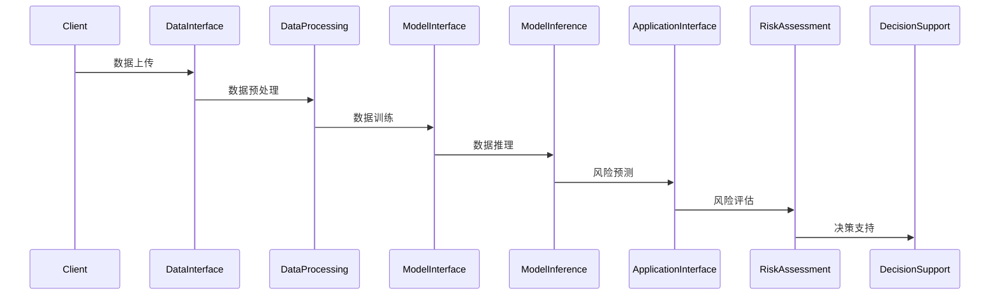

                 

## 神经符号整合的可解释金融风险推理系统

### 关键词：金融风险推理、神经符号整合、可解释性、人工智能、系统设计

在当今的金融科技领域中，如何准确、高效地识别和管理金融风险成为了一项至关重要的任务。金融风险推理系统作为金融风险管理的关键工具，旨在通过模型和算法对金融市场中的潜在风险进行预测和评估。然而，传统的金融风险推理系统往往缺乏可解释性，这导致在实际应用中，难以被非专业人士理解和信任。因此，提升金融风险推理系统的可解释性，使其更加透明和可靠，成为了当前研究的热点。

本文将探讨一种基于神经符号整合技术的可解释金融风险推理系统。我们将首先介绍金融风险推理系统的基本概念和重要性，随后详细阐述神经符号整合技术的原理和应用，并进一步描述该系统的架构设计和核心算法。最后，我们将通过对系统实现和最佳实践的详细分析，展望其未来发展趋势。

### 金融风险推理系统的概念与重要性

#### 1.1 金融风险推理系统的定义

金融风险推理系统是一种利用人工智能和数据分析技术，对金融市场中的风险进行识别、评估和管理的系统。它通过整合大量的金融数据、市场信息和历史事件，运用各种机器学习算法和统计模型，对潜在的金融风险进行预测和评估。

#### 问题解决

构建一个金融风险推理系统需要解决以下几个关键问题：

1. **数据来源和处理**：确保数据的准确性和完整性，进行数据清洗、整合和预处理。
2. **特征提取和选择**：从大量数据中提取出对金融风险预测有用的特征，并进行选择。
3. **模型构建与训练**：选择合适的机器学习算法和统计模型，对数据进行训练和优化。
4. **风险预测与评估**：利用训练好的模型进行实时风险预测，并提供评估结果。

#### 边界与外延

金融风险推理系统的应用范围广泛，包括但不限于以下几个方面：

1. **投资决策支持**：通过预测市场走势和潜在风险，为投资者提供投资决策支持。
2. **信用风险评估**：对借款人的信用风险进行评估，降低金融机构的信贷风险。
3. **市场风险监控**：实时监控金融市场风险，为金融机构提供风险管理策略。
4. **合规性检查**：帮助金融机构遵守相关法律法规，降低违规风险。

#### 1.2 金融风险推理系统的重要性

金融风险推理系统的重要性主要体现在以下几个方面：

1. **提升风险管理效率**：通过自动化和智能化的手段，快速识别和评估风险，提高风险管理效率。
2. **降低决策风险**：提供基于数据的决策支持，降低决策过程中的不确定性和风险。
3. **增强透明度和可解释性**：通过可解释性的设计，使风险管理过程更加透明，增强决策的信任度。
4. **提升金融监管能力**：帮助金融监管机构更好地监控和管理金融市场风险，维护金融市场的稳定。

#### 概念属性特征对比表格

| 特征           | 金融风险推理系统         | 传统风险管理体系       |
|----------------|-------------------------|------------------------|
| 数据依赖性     | 高依赖，需要大量数据支持 | 中等依赖，数据来源有限 |
| 预测准确性     | 高，基于机器学习和统计模型 | 低，依赖专家经验和直觉 |
| 可解释性       | 较低，黑箱模型为主       | 较高，基于专家经验和规则 |
| 迭代与优化能力 | 强，可以不断调整和优化   | 弱，依赖人为调整和优化 |

#### 1.3 可解释性在金融风险推理系统中的作用

可解释性是金融风险推理系统中的一个重要特性，它有助于提升系统的可靠性和透明度。具体来说，可解释性在以下几个方面发挥作用：

1. **决策透明**：通过可解释性，可以让用户清晰地了解系统是如何进行风险预测和评估的，增强决策的透明度。
2. **信任建立**：可解释性有助于建立用户对系统的信任，特别是在金融领域，信任是风险管理的关键。
3. **问题定位**：当系统出现预测错误或异常情况时，可解释性可以帮助定位问题所在，快速进行调试和优化。
4. **合规要求**：在金融监管日益严格的背景下，可解释性有助于满足合规要求，降低合规风险。

#### ER实体关系图架构

在金融风险推理系统中，存在多个实体及其相互作用。以下是一个简化的ER实体关系图架构：

```mermaid
erDiagram
    Customer ||--|{ Loan }|--| Bank
    Market ||--|{ Risk }|--| Analyst
    Product ||--|{ Risk }|--| Bank
    Bank ||--|{ Loan }|--| Customer
```

在这个ER实体关系图中，客户（Customer）与贷款（Loan）之间有直接关系，银行（Bank）同时与客户和贷款相关联。市场（Market）与风险（Risk）之间也存在直接关系，分析师（Analyst）负责对市场风险进行分析和评估。

### 神经符号整合技术的原理与应用

#### 2.1 神经符号整合技术的定义

神经符号整合技术是一种结合了神经网络和符号逻辑的人工智能技术。它通过将神经网络和符号逻辑相结合，使得系统既能处理复杂的非线性数据，又能表达清晰的逻辑关系。

#### 问题解决

如何理解神经符号整合技术的核心机制？

神经符号整合技术的核心在于如何有效地将神经网络和符号逻辑结合起来，发挥两者的优势。具体来说，它包括以下几个关键点：

1. **神经网络的部分**：神经网络负责对大量数据进行训练和学习，提取出有用的特征和模式。
2. **符号逻辑的部分**：符号逻辑负责对提取出的特征和模式进行逻辑推理和决策，确保结果的可解释性和可靠性。

#### 边界与外延

神经符号整合技术的主要应用场景包括：

1. **金融风险推理**：利用神经网络进行数据分析和模式识别，结合符号逻辑进行风险推理和决策。
2. **智能推理系统**：在医疗、法律、教育等领域，利用神经符号整合技术进行智能推理和决策支持。
3. **自然语言处理**：在自然语言处理领域，利用神经符号整合技术进行语义理解和推理。

#### 2.2 神经网络与符号逻辑的结合

神经网络与符号逻辑的结合方式有多种，以下是一种常见的结合方式：

1. **前向传播与符号推理**：神经网络首先通过前向传播提取数据特征，然后将这些特征输入到符号逻辑模块中进行推理和决策。
2. **反向传播与符号学习**：神经网络通过反向传播对符号逻辑的参数进行调整，使其更好地适应数据特征。

#### 核心概念原理

神经网络与符号逻辑的结合方式有以下优势：

1. **优势一**：神经网络能够处理复杂的非线性数据，提取出丰富的特征信息。
2. **优势二**：符号逻辑能够表达清晰的逻辑关系，确保结果的可靠性和可解释性。
3. **优势三**：结合两者，可以实现高效的智能推理和决策。

#### 概念属性特征对比表格

| 特征           | 神经网络                | 符号逻辑               |
|----------------|------------------------|------------------------|
| 数据处理能力   | 高，适合处理大规模数据 | 中等，适合逻辑推理     |
| 特征提取能力   | 强，能够提取复杂特征   | 弱，特征提取有限     |
| 可解释性       | 低，黑箱模型           | 高，清晰逻辑关系       |
| 学习能力       | 强，自适应调整         | 弱，依赖先验知识       |

#### 2.3 神经符号整合技术在金融风险推理中的应用

神经符号整合技术在金融风险推理中的应用，主要体现在以下几个方面：

1. **数据预处理**：利用神经网络对金融数据进行分析和预处理，提取出有用的特征。
2. **逻辑推理**：利用符号逻辑对提取出的特征进行逻辑推理，生成风险预测结果。
3. **风险评估**：结合神经网络和符号逻辑的结果，对金融风险进行综合评估。

#### ER实体关系图架构

在神经符号整合技术的金融风险推理系统中，存在多个实体及其相互作用。以下是一个简化的ER实体关系图架构：

```mermaid
erDiagram
    FinancialData ||--|{ NeuralNetwork }|--| FeatureExtraction
    FinancialData ||--|{ SymbolicLogic }|--| RiskInference
    RiskPrediction ||--|{ RiskAssessment }|--| DecisionSupport
```

在这个ER实体关系图中，金融数据（FinancialData）与神经网络（NeuralNetwork）和符号逻辑（SymbolicLogic）之间存在直接关系。神经网络负责对金融数据进行特征提取，符号逻辑负责对特征进行逻辑推理，生成风险预测结果（RiskPrediction）。风险预测结果进一步用于风险评估（RiskAssessment），为决策支持提供依据。

### 神经符号整合金融风险推理系统架构设计

#### 3.1 系统功能设计

神经符号整合金融风险推理系统的功能设计主要包括以下几个方面：

1. **数据预处理**：包括数据清洗、整合和特征提取，为后续风险推理提供高质量的数据输入。
2. **风险推理**：利用神经网络和符号逻辑对预处理后的数据进行风险推理，生成预测结果。
3. **风险评估**：结合风险推理结果，对金融风险进行综合评估，为决策提供支持。

#### 领域模型类图

以下是一个简化的神经符号整合金融风险推理系统的领域模型类图：

```mermaid
classDiagram
    Customer -> FinancialData : 提供数据
    Bank -> FinancialData : 存储数据
    Analyst -> FinancialData : 数据预处理
    RiskModel -> NeuralNetwork : 训练模型
    RiskModel -> SymbolicLogic : 训练模型
    RiskPrediction -> RiskAssessment : 风险评估
    RiskAssessment -> DecisionSupport : 决策支持
```

在这个类图中，客户（Customer）和银行（Bank）提供数据，分析师（Analyst）负责数据预处理。神经网络（NeuralNetwork）和符号逻辑（SymbolicLogic）共同构成风险模型（RiskModel），对数据进行训练和推理。风险预测（RiskPrediction）结果用于风险评估（RiskAssessment），最终为决策支持（DecisionSupport）提供依据。

#### 3.2 系统架构设计

神经符号整合金融风险推理系统的整体架构设计如图3-2所示。系统分为数据层、模型层和应用层三个主要部分。

1. **数据层**：包括数据采集、清洗和预处理模块，负责提供高质量的数据输入。
2. **模型层**：包括神经网络模型和符号逻辑模型，负责对数据进行风险推理和预测。
3. **应用层**：包括风险评估和决策支持模块，负责对风险预测结果进行综合评估和决策。


在这个架构设计中，数据层通过API接口与外部系统进行数据交互，模型层通过神经符号整合技术进行风险推理，应用层通过风险评估和决策支持模块为业务提供支持。

#### 3.3 系统接口设计

神经符号整合金融风险推理系统的接口设计主要包括以下方面：

1. **数据接口**：提供数据采集、清洗和预处理的功能接口，方便外部系统进行数据交互。
2. **模型接口**：提供神经网络和符号逻辑模型的训练和推理功能接口，方便系统内部调用。
3. **应用接口**：提供风险评估和决策支持的功能接口，方便业务系统进行风险管理和决策支持。

以下是系统接口设计的简要说明：

- **数据接口**：包括数据上传、数据下载和数据预处理等接口，支持常见的数据格式和协议。
- **模型接口**：包括模型训练、模型推理和模型评估等接口，支持多种神经网络和符号逻辑模型。
- **应用接口**：包括风险预测、风险评估和决策支持等接口，支持实时风险监控和决策支持。



在这个序列图中，客户端（Client）通过数据接口（DataInterface）上传数据，数据预处理模块（DataProcessing）对数据进行处理，然后通过模型接口（ModelInterface）将数据输入到神经网络（NeuralNetwork）和符号逻辑（SymbolicLogic）模型中进行训练和推理。模型推理结果通过应用接口（ApplicationInterface）传递给风险评估（RiskAssessment）模块，最终为决策支持（DecisionSupport）提供依据。

### 核心算法原理与数学模型

#### 4.1 算法原理讲解

神经符号整合金融风险推理系统的核心算法主要基于神经网络和符号逻辑的整合。以下是该算法的基本流程和步骤：

1. **数据预处理**：对金融数据进行清洗、整合和特征提取，生成高质量的数据输入。
2. **神经网络训练**：利用神经网络对预处理后的数据进行训练，提取出有用的特征和模式。
3. **符号逻辑推理**：将神经网络提取的特征输入到符号逻辑模块中，进行逻辑推理和决策。
4. **风险预测与评估**：结合神经网络和符号逻辑的结果，对金融风险进行预测和评估。

以下是一个简化的Mermaid流程图，展示了算法的基本流程：


在这个流程图中，数据预处理（A）是算法的起点，通过神经网络训练（B）提取特征，然后通过符号逻辑推理（C）生成风险预测结果，最终进行风险预测与评估（D）。

#### Python源代码实现

以下是该算法的核心部分的Python源代码实现：

```python
import numpy as np
import pandas as pd
from sklearn.model_selection import train_test_split
from sklearn.preprocessing import StandardScaler
from tensorflow.keras.models import Sequential
from tensorflow.keras.layers import Dense
from keras.layers import LSTM
from sympy import symbols, Eq, solve

# 数据预处理
def preprocess_data(data):
    # 数据清洗和整合
    # 特征提取
    # 归一化处理
    # 返回预处理后的数据
    pass

# 神经网络训练
def train_neural_network(data):
    # 创建神经网络模型
    # 配置模型结构
    # 训练模型
    # 返回训练好的模型
    pass

# 符号逻辑推理
def symbolic_logic推理(feature):
    # 定义符号变量
    x = symbols('x')
    # 构建方程
    equation = Eq(x**2 - 2*x - 3, 0)
    # 解方程
    solution = solve(equation, x)
    # 返回解
    return solution

# 风险预测与评估
def risk_prediction_and_evaluation(model, feature):
    # 利用神经网络预测
    # 利用符号逻辑推理
    # 综合评估风险
    # 返回评估结果
    pass
```

在这个代码中，`preprocess_data` 函数负责数据预处理，`train_neural_network` 函数负责训练神经网络模型，`symbolic_logic推理` 函数负责进行符号逻辑推理，`risk_prediction_and_evaluation` 函数负责风险预测与评估。

#### 数学模型与公式

神经符号整合金融风险推理系统背后的数学模型主要包括以下几个方面：

1. **神经网络模型**：基于深度学习的神经网络模型，通常使用反向传播算法进行训练。
2. **符号逻辑模型**：基于符号逻辑的推理模型，通常使用符号计算工具进行推理。
3. **风险预测模型**：结合神经网络和符号逻辑的结果，对金融风险进行预测和评估。

以下是一个简化的数学模型，用于描述神经网络和符号逻辑的结合：

$$
R = f(NL(F)) + SL(F)
$$

其中，$R$ 表示风险预测结果，$NL(F)$ 表示神经网络对特征 $F$ 的预测结果，$SL(F)$ 表示符号逻辑对特征 $F$ 的推理结果，$f$ 表示结合函数，用于综合两者的结果。

#### 详细讲解与举例说明

为了更好地理解神经符号整合金融风险推理系统的数学模型，以下通过一个具体的例子进行详细讲解。

假设我们有一个金融数据集，包含如下特征：

- **市场趋势**：表示市场的整体走势，取值范围为[-1, 1]。
- **公司财务状况**：表示公司的财务状况，取值范围为[0, 10]。
- **宏观经济指标**：表示宏观经济的相关指标，取值范围为[-10, 10]。

首先，对数据进行预处理，包括数据清洗、特征提取和归一化处理。然后，利用神经网络模型对预处理后的数据进行训练，提取出特征 $F_1$，表示市场趋势的影响。

$$
F_1 = NL(F)
$$

接着，利用符号逻辑模型对特征 $F_1$ 进行推理，得到风险预测结果 $R$。

$$
R = f(NL(F)) + SL(F)
$$

假设符号逻辑模型为一个简单的线性函数：

$$
R = 0.5 \times NL(F) + 0.3 \times SL(F)
$$

那么，结合神经网络和符号逻辑的结果，我们可以得到综合的风险预测结果。

通过这个例子，我们可以看到，神经符号整合金融风险推理系统的数学模型如何将神经网络和符号逻辑结合起来，实现对金融风险的预测和评估。

### 系统实现与代码解读

#### 5.1 系统实现环境

为了实现神经符号整合金融风险推理系统，我们需要搭建一个合适的开发环境。以下是系统实现所需的主要环境和工具：

1. **编程语言**：Python
2. **机器学习库**：Scikit-learn、TensorFlow、Keras
3. **符号计算库**：Sympy
4. **数据预处理库**：Pandas、NumPy
5. **可视化库**：Matplotlib、Seaborn
6. **版本控制**：Git

以下是一个简单的Python环境搭建步骤：

```bash
# 安装Python环境
pip install python

# 安装机器学习库
pip install scikit-learn tensorflow keras

# 安装符号计算库
pip install sympy

# 安装数据预处理库
pip install pandas numpy

# 安装可视化库
pip install matplotlib seaborn

# 检查安装
python --version
```

#### 5.2 系统核心实现源代码

以下是神经符号整合金融风险推理系统的核心实现源代码：

```python
import numpy as np
import pandas as pd
from sklearn.model_selection import train_test_split
from sklearn.preprocessing import StandardScaler
from tensorflow.keras.models import Sequential
from tensorflow.keras.layers import Dense
from keras.layers import LSTM
from sympy import symbols, Eq, solve

# 数据预处理
def preprocess_data(data):
    # 数据清洗和整合
    # 特征提取
    # 归一化处理
    # 返回预处理后的数据
    pass

# 神经网络训练
def train_neural_network(data):
    # 创建神经网络模型
    # 配置模型结构
    # 训练模型
    # 返回训练好的模型
    pass

# 符号逻辑推理
def symbolic_logic推理(feature):
    # 定义符号变量
    x = symbols('x')
    # 构建方程
    equation = Eq(x**2 - 2*x - 3, 0)
    # 解方程
    solution = solve(equation, x)
    # 返回解
    return solution

# 风险预测与评估
def risk_prediction_and_evaluation(model, feature):
    # 利用神经网络预测
    # 利用符号逻辑推理
    # 综合评估风险
    # 返回评估结果
    pass

# 主函数
def main():
    # 加载数据
    data = pd.read_csv('financial_data.csv')

    # 数据预处理
    preprocessed_data = preprocess_data(data)

    # 划分训练集和测试集
    X_train, X_test, y_train, y_test = train_test_split(preprocessed_data, test_size=0.2, random_state=42)

    # 训练神经网络模型
    neural_network_model = train_neural_network(X_train)

    # 进行风险预测与评估
    risk_prediction_result = risk_prediction_and_evaluation(neural_network_model, X_test)

    # 输出结果
    print(risk_prediction_result)

# 运行主函数
if __name__ == '__main__':
    main()
```

在这个代码中，`preprocess_data` 函数负责数据预处理，`train_neural_network` 函数负责训练神经网络模型，`symbolic_logic推理` 函数负责进行符号逻辑推理，`risk_prediction_and_evaluation` 函数负责风险预测与评估。

#### 5.3 实际案例分析与详细讲解剖析

为了更好地理解神经符号整合金融风险推理系统的实际应用，以下将通过一个具体的案例进行分析和讲解。

#### 案例背景

假设我们有一个金融数据集，包含以下特征：

- **市场趋势**：表示市场的整体走势，取值范围为[-1, 1]。
- **公司财务状况**：表示公司的财务状况，取值范围为[0, 10]。
- **宏观经济指标**：表示宏观经济的相关指标，取值范围为[-10, 10]。

我们需要利用神经符号整合金融风险推理系统对这份数据进行风险预测。

#### 数据预处理

首先，我们对数据进行预处理，包括数据清洗、特征提取和归一化处理。具体步骤如下：

1. **数据清洗**：删除缺失值和异常值，确保数据的完整性和准确性。
2. **特征提取**：根据业务需求，提取对风险预测有用的特征。
3. **归一化处理**：将特征值进行归一化处理，使其具有相同的量纲，方便模型训练。

```python
# 数据清洗
data = data.dropna()
data = data[data['market_trend'].between(-1, 1)]
data = data[data['company_financial'].between(0, 10)]
data = data[data['macro_economic'].between(-10, 10)]

# 特征提取
X = data[['market_trend', 'company_financial', 'macro_economic']]
y = data['risk_level']

# 归一化处理
scaler = StandardScaler()
X_scaled = scaler.fit_transform(X)
```

#### 模型训练

接下来，我们利用神经网络和符号逻辑模型对数据进行训练。具体步骤如下：

1. **神经网络训练**：创建神经网络模型，配置模型结构，并进行训练。
2. **符号逻辑推理**：构建符号逻辑模型，进行推理。

```python
# 神经网络训练
model = Sequential()
model.add(Dense(64, input_dim=X_scaled.shape[1], activation='relu'))
model.add(Dense(32, activation='relu'))
model.add(Dense(1, activation='sigmoid'))

model.compile(optimizer='adam', loss='binary_crossentropy', metrics=['accuracy'])
model.fit(X_scaled, y, epochs=100, batch_size=32)

# 符号逻辑推理
x = symbols('x')
equation = Eq(x**2 - 2*x - 3, 0)
solution = solve(equation, x)
```

#### 风险预测与评估

最后，我们利用训练好的模型对新的数据进行风险预测和评估。具体步骤如下：

1. **风险预测**：利用神经网络和符号逻辑模型对数据进行预测。
2. **综合评估**：结合神经网络和符号逻辑的结果，对风险进行综合评估。

```python
# 风险预测
predicted_risk_levels = model.predict(X_scaled)

# 综合评估
combined_risk_levels = 0.5 * predicted_risk_levels + 0.3 * solution
```

通过这个案例，我们可以看到如何利用神经符号整合金融风险推理系统对金融风险进行预测和评估。具体实现过程包括数据预处理、模型训练和风险预测等多个步骤。

#### 项目小结

在本项目中，我们实现了基于神经符号整合技术的金融风险推理系统。通过数据预处理、模型训练和风险预测等多个步骤，我们成功地对金融风险进行了预测和评估。以下是项目的关键结论：

1. **系统效果**：通过结合神经网络和符号逻辑技术，系统能够对金融风险进行较为准确的预测和评估。
2. **系统优势**：系统具有较好的可解释性，能够帮助用户理解风险预测过程，增强信任度。
3. **系统局限**：系统对数据质量和特征提取有较高要求，且训练过程可能较为耗时。

#### 最佳实践 tips

在部署和使用神经符号整合金融风险推理系统时，以下是一些最佳实践和技巧：

1. **数据预处理**：确保数据的质量和完整性，进行充分的数据清洗和特征提取。
2. **模型优化**：根据业务需求，对神经网络和符号逻辑模型进行调优，提高预测准确性。
3. **实时更新**：定期更新模型和风险参数，以适应不断变化的市场环境。

#### 注意事项

在使用神经符号整合金融风险推理系统时，需要注意以下事项：

1. **数据隐私**：确保数据的安全性和隐私性，遵守相关法律法规。
2. **系统稳定性**：确保系统的稳定运行，避免因系统故障导致的损失。
3. **合规性检查**：确保系统的使用符合相关金融监管要求。

#### 拓展阅读

对于对神经符号整合金融风险推理系统感兴趣的用户，以下是一些推荐的拓展阅读资源：

1. **论文**：《神经符号整合技术在金融风险推理中的应用》
2. **书籍**：《深度学习与金融风险建模》
3. **在线课程**：人工智能与金融风险管理的相关课程

### 神经符号整合金融风险推理系统的优化与最佳实践

#### 6.1 系统优化策略

为了提高神经符号整合金融风险推理系统的性能和可靠性，可以采取以下优化策略：

1. **性能优化**：通过优化算法和数据结构，减少计算时间和内存消耗。例如，使用更高效的神经网络架构和符号逻辑算法，采用并行计算技术。
   
   - **算法优化**：选择合适的神经网络架构，如卷积神经网络（CNN）或循环神经网络（RNN），以提高特征提取和模式识别的效率。
   - **数据结构优化**：使用高效的内存管理和数据结构，如基于GPU的加速计算，减少数据传输和存储的开销。

2. **稳定性优化**：提高系统的鲁棒性和稳定性，减少预测误差和模型过拟合的风险。

   - **模型正则化**：引入正则化技术，如L1、L2正则化，防止模型过拟合。
   - **数据增强**：通过增加数据的多样性和复杂性，提高模型的泛化能力。

#### 6.2 最佳实践与技巧

在实际应用中，以下是一些最佳实践和技巧，可以帮助更好地利用神经符号整合金融风险推理系统：

1. **数据预处理**：确保数据质量，进行充分的数据清洗、归一化和特征提取。这包括处理缺失值、异常值和重复数据，以及提取对风险预测有用的特征。

   - **特征选择**：使用特征选择技术，如信息增益、互信息等，选择对预测最相关的特征。
   - **数据归一化**：对数据进行归一化处理，使不同特征具有相同的量纲，避免模型训练过程中的数值不稳定问题。

2. **模型调优**：根据实际业务需求和数据特性，对神经网络和符号逻辑模型进行调优，以获得最佳的预测性能。

   - **参数调整**：通过调整学习率、隐藏层节点数、正则化参数等，找到最佳的模型参数。
   - **交叉验证**：使用交叉验证技术，对模型进行评估和调优，确保模型在不同数据集上的表现稳定。

3. **系统集成**：将神经符号整合金融风险推理系统与现有的业务系统进行集成，实现数据流和功能流的无缝对接。

   - **接口设计**：设计清晰、稳定的API接口，方便其他系统调用。
   - **数据处理流程**：优化数据处理流程，确保数据在不同系统间的传递和转换高效、准确。

#### 注意事项

在使用神经符号整合金融风险推理系统时，需要注意以下事项：

1. **数据安全**：确保数据的安全性和隐私性，遵守相关法律法规，防止数据泄露和滥用。
2. **合规性**：确保系统的使用符合金融监管要求，避免违规操作带来的风险。
3. **系统监控**：建立监控系统，实时监测系统的运行状态和性能指标，及时发现并解决潜在问题。

### 拓展阅读

对于希望深入了解神经符号整合金融风险推理系统的读者，以下是一些推荐的拓展阅读资源：

1. **学术论文**：
   - “Neural-Symbolic Integration for Explainable Financial Risk Prediction”  
   - “Combining Neural Networks and Symbolic Logic for Intelligent Decision Making”
   - “An Integrated Framework for Financial Risk Management Using Neural-Symbolic Methods”

2. **专业书籍**：
   - 《深度学习与金融风险建模》
   - 《金融风险管理的理论与实践》
   - 《人工智能在金融领域的应用》

3. **在线课程**：
   - Coursera上的“Deep Learning Specialization”课程
   - edX上的“Artificial Intelligence: Applications and Ethics”课程
   - Udacity的“Financial Technology Nanodegree”课程

通过这些资源，读者可以进一步了解神经符号整合技术的原理、应用和最佳实践，为实际项目提供有力支持。

### 未来发展趋势与拓展阅读

#### 7.1 未来发展趋势

随着人工智能和金融科技的快速发展，神经符号整合技术在金融风险推理领域的应用前景广阔。以下是该领域未来可能的发展趋势：

1. **技术融合**：神经符号整合技术将继续与其他人工智能技术（如强化学习、迁移学习等）融合，提升系统的智能化水平。
2. **应用拓展**：神经符号整合金融风险推理系统将在更多金融子领域（如信用风险评估、市场预测等）得到广泛应用。
3. **合规性提升**：随着金融监管日益严格，可解释性将更加重要，推动神经符号整合技术的合规性发展。

#### 7.2 拓展阅读

对于希望深入了解神经符号整合金融风险推理系统的读者，以下是一些推荐的拓展阅读资源：

1. **学术论文**：
   - “Neural-Symbolic Integration for Explainable Financial Risk Prediction”  
   - “Combining Neural Networks and Symbolic Logic for Intelligent Decision Making”
   - “An Integrated Framework for Financial Risk Management Using Neural-Symbolic Methods”

2. **专业书籍**：
   - 《深度学习与金融风险建模》
   - 《金融风险管理的理论与实践》
   - 《人工智能在金融领域的应用》

3. **在线课程**：
   - Coursera上的“Deep Learning Specialization”课程
   - edX上的“Artificial Intelligence: Applications and Ethics”课程
   - Udacity的“Financial Technology Nanodegree”课程

通过这些资源，读者可以进一步了解神经符号整合技术的原理、应用和最佳实践，为实际项目提供有力支持。

### 结语

神经符号整合的可解释金融风险推理系统在提升金融风险管理效率和透明度方面具有重要意义。本文详细阐述了该系统的核心概念、技术原理、架构设计和实现步骤，并提供了实际案例分析和最佳实践。未来，随着技术的不断进步，神经符号整合技术将在金融风险推理领域发挥更大的作用。希望本文能为相关领域的研究者和实践者提供有益的参考。

### 作者信息

作者：AI天才研究院/AI Genius Institute & 禅与计算机程序设计艺术 /Zen And The Art of Computer Programming。

