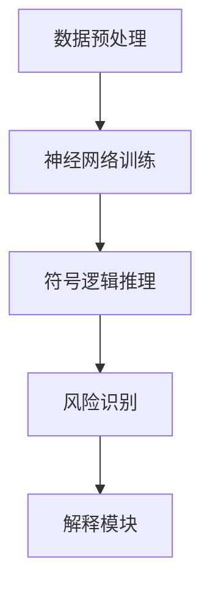
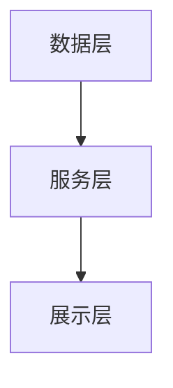
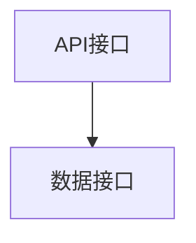
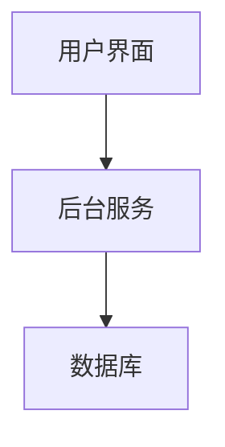

                 


# 神经符号整合的可解释金融风险推理系统

## 关键词
- 神经计算
- 符号逻辑
- 金融风险
- 可解释性
- 推理系统

## 摘要
本文旨在探讨如何结合神经计算和符号逻辑，构建一个可解释的金融风险推理系统。通过背景介绍、核心概念与联系分析，以及详细的算法原理讲解，本文将阐述如何利用神经符号整合技术，实现高效、准确的金融风险识别，并确保系统的推理过程具备可解释性，以支持金融风险管理的透明化。

### 第一部分：背景介绍

#### 问题背景
随着全球金融市场的日益复杂化和信息技术的迅猛发展，金融风险识别和管理成为了金融行业的重要课题。传统的金融风险识别方法，如统计分析和机器学习，虽然在某些方面取得了显著的成果，但面对复杂多变的金融市场，仍存在诸多不足。首先，传统方法在处理海量金融数据时，往往需要大量的时间和计算资源，难以实现实时性。其次，传统方法在理解金融市场本质和特征方面存在局限，容易忽视市场中的细微变化和潜在风险。此外，传统方法在决策解释方面存在困难，使得风险管理人员难以理解系统决策的依据和逻辑。因此，有必要探索新的计算技术，如神经计算和符号逻辑，来构建一个更加高效、准确且具备可解释性的金融风险推理系统。

#### 问题描述
金融风险推理系统的核心目标是对金融市场进行全面的监控，实时捕捉潜在风险，并确保其推理过程具备可解释性，以便风险管理人员能够理解系统的决策逻辑。具体来说，系统需要实现以下功能：

1. **数据预处理**：对海量金融数据进行预处理，包括数据清洗、去噪、特征提取等，为后续的模型训练提供高质量的数据输入。
2. **风险识别**：利用神经网络和符号逻辑，对预处理后的金融数据进行分析和推理，识别出潜在的风险因素。
3. **风险评估**：对识别出的风险因素进行评估，确定其风险程度，为风险管理人员提供决策依据。
4. **可解释性**：通过解释模型决策逻辑，使得风险管理人员能够理解系统如何识别和评估风险，增强系统的透明度和可信度。

#### 问题解决
为了实现上述功能，本文提出了一种基于神经符号整合的金融风险推理系统。该系统结合了神经计算和符号逻辑的优点，能够高效地处理海量金融数据，准确识别潜在风险，并提供可解释的决策过程。具体来说，系统包括以下几个关键组成部分：

1. **神经计算模块**：利用神经网络进行数据建模和特征提取，快速识别出潜在的金融风险。
2. **符号逻辑模块**：结合符号逻辑，对识别出的风险因素进行推理和决策，确保推理过程具备可解释性。
3. **解释模块**：提供系统决策的可解释性，支持透明化风险决策。
4. **评估模块**：对识别出的风险因素进行评估，确定其风险程度。

#### 边界与外延
本系统的边界包括金融数据的处理范围、风险类型识别的范畴以及推理系统的应用场景。在外延上，本系统可作为金融风险管理的一个重要工具，应用于银行、证券、保险等多个领域。同时，系统还应具备一定的灵活性和扩展性，能够根据不同场景的需求进行调整和优化。

#### 概念结构与核心要素组成
1. **神经计算**：利用神经网络进行数据建模和特征提取。
2. **符号逻辑**：通过符号逻辑进行推理和决策。
3. **数据集**：金融风险相关的数据集，包括市场数据、财务报表、新闻报道等。
4. **模型训练与优化**：通过数据集训练神经网络，优化符号逻辑模型。
5. **解释模块**：提供系统决策的可解释性，支持透明化风险决策。

### 第二部分：核心概念与联系

#### 核心概念
1. **神经计算**：神经计算是一种模拟人脑神经元工作方式的计算技术，包括神经网络、深度学习等。神经网络由大量相互连接的神经元组成，通过学习输入数据和输出数据之间的关系，实现数据建模和特征提取。
2. **符号逻辑**：符号逻辑是一种基于数学符号和逻辑运算的推理方法，包括命题逻辑、谓词逻辑等。命题逻辑基于命题的真假值进行推理，谓词逻辑则通过变量和量词进行更复杂的推理。
3. **金融风险**：金融风险是指在金融活动中可能导致的损失或不利影响。金融风险可以分为市场风险、信用风险、操作风险等多种类型，每种类型的风险都有其独特的特征和影响因素。
4. **可解释性**：可解释性是指系统的决策过程和结果能够被人类理解。在金融风险推理系统中，可解释性非常重要，因为它有助于风险管理人员理解系统的决策逻辑，增强系统的透明度和可信度。

#### 概念属性特征对比表格
| 概念       | 定义与特点                                                     | 关联性                      |
|------------|--------------------------------------------------------------|----------------------------|
| 神经计算   | 模拟人脑神经元工作方式的计算技术，适用于处理复杂数据。           | 提供数据建模和特征提取能力。 |
| 符号逻辑   | 基于数学符号和逻辑运算的推理方法，适用于逻辑推理和决策。         | 提供推理和决策能力。        |
| 金融风险   | 在金融活动中可能导致的损失或不利影响。                     | 需要精准识别和有效管理。    |
| 可解释性   | 系统的决策过程和结果能够被人类理解。                       | 增强系统的透明度和可信度。  |

#### ER实体关系图架构
```mermaid
erDiagram
    类1 ||--|{ 类2 } 类3 : 类1与类2、类3之间存在关联
    类2 ||--|{ 类4 } 类5 : 类2与类4、类5之间存在关联
    类1 ||--|{ 类6 } 类7 : 类1与类6、类7之间存在关联
```
### 第三部分：算法原理讲解

#### 神经计算原理

神经计算的基本原理是模拟人脑神经元的工作方式。在神经网络中，每个神经元（或节点）都接收来自其他神经元的输入信号，通过加权求和后，经过一个激活函数产生输出信号。以下是神经网络的基本原理：

1. **神经元结构**：每个神经元包含一个输入层、一个加权求和层和一个激活函数层。输入层接收外部输入信号，加权求和层对输入信号进行加权求和，激活函数层对加权求和结果进行非线性变换。
2. **网络层次结构**：神经网络通常由多个层次组成，包括输入层、隐藏层和输出层。隐藏层可以有一个或多个，每个隐藏层都可以对输入信号进行处理和变换。
3. **激活函数**：激活函数用于确定神经元是否被激活。常用的激活函数包括Sigmoid函数、ReLU函数和Tanh函数。这些函数具有非线性特性，能够增强神经网络的分类和回归能力。

神经网络的训练过程主要包括以下几个步骤：

1. **初始化**：初始化网络中的权重和偏置，通常采用随机初始化方法。
2. **前向传播**：将输入信号通过网络进行传递，计算每个神经元的输出。
3. **反向传播**：计算输出层的误差，通过反向传播算法更新网络中的权重和偏置。
4. **优化**：使用优化算法（如梯度下降、Adam等）不断调整网络参数，使网络的误差最小化。

神经计算在金融风险推理系统中的应用主要包括以下几个方面：

1. **数据建模**：利用神经网络对金融数据进行分析和建模，提取数据中的潜在特征。
2. **风险识别**：通过训练好的神经网络模型，对新的金融数据进行风险识别，预测潜在的金融风险。
3. **特征提取**：利用神经网络对金融数据中的特征进行提取和选择，提高风险识别的准确性和效率。

#### 符号逻辑原理

符号逻辑是一种基于数学符号和逻辑运算的推理方法。在符号逻辑中，命题、变量、量词和逻辑运算符等是基本要素。以下是符号逻辑的基本原理：

1. **命题逻辑**：命题逻辑是符号逻辑的基础，它通过命题的真假值进行推理。命题逻辑的基本运算包括合取（AND）、析取（OR）、非（NOT）等。例如，命题"A AND B"表示A和B同时为真，命题"A OR B"表示A和B至少一个为真，命题"NOT A"表示A为假。
2. **谓词逻辑**：谓词逻辑是一种更复杂的逻辑运算，它引入了变量和量词。谓词逻辑可以处理更复杂的逻辑关系，例如全称量词（∀）和存在量词（∃）。全称量词表示对所有元素都满足某个条件，存在量词表示至少存在一个元素满足某个条件。

符号逻辑在金融风险推理系统中的应用主要包括以下几个方面：

1. **推理**：利用符号逻辑对识别出的金融风险因素进行推理和决策。例如，通过推理规则，判断某个风险因素是否与特定的金融风险相关。
2. **规则库**：构建符号逻辑的规则库，用于存储和管理推理规则。这些规则可以根据实际情况进行调整和优化，以提高系统的推理能力和准确性。
3. **解释**：利用符号逻辑解释系统决策的依据和逻辑，使得风险管理人员能够理解系统如何识别和评估风险。

#### 算法原理讲解

结合神经计算和符号逻辑的金融风险推理系统，其算法原理可以概括为以下几个步骤：

1. **数据预处理**：对金融数据集进行预处理，包括数据清洗、去噪、特征提取等，为后续的神经网络训练和符号逻辑推理提供高质量的数据输入。
2. **神经网络训练**：利用预处理后的金融数据集，训练神经网络模型。神经网络模型通过学习输入数据和输出数据之间的关系，提取数据中的潜在特征，实现对金融风险的识别和分类。
3. **符号逻辑推理**：利用训练好的神经网络模型，对新的金融数据进行风险识别。然后，结合符号逻辑推理规则，对识别出的风险因素进行推理和决策，确定其风险程度。
4. **解释模块**：提供系统决策的可解释性，支持透明化风险决策。解释模块可以通过可视化方式展示系统决策的过程和依据，使得风险管理人员能够理解系统如何识别和评估风险。

以下是一个简单的算法流程图：


在实际应用中，神经网络和符号逻辑可以相互结合，相互补充。神经网络通过学习数据中的潜在特征，实现高效的风险识别。而符号逻辑则通过推理规则，确保推理过程具备可解释性，增强系统的透明度和可信度。

### 第四部分：系统分析与架构设计

#### 问题场景介绍
在金融行业中，风险管理是一个至关重要的问题。随着金融市场的复杂性和不确定性增加，如何快速、准确地识别和评估潜在风险，成为了金融机构面临的重要挑战。传统的风险管理方法在处理复杂金融市场时存在一定的局限性，因此，我们需要构建一个高效、准确的金融风险推理系统，以支持金融机构的风险管理决策。

#### 项目介绍
本项目旨在开发一个基于神经符号整合的金融风险推理系统，该系统将利用神经计算和符号逻辑的优势，实现高效、准确的金融风险识别和评估。系统将具备以下特点：

1. **高效性**：利用神经网络进行数据建模和特征提取，提高风险识别的速度和效率。
2. **准确性**：结合符号逻辑进行推理和决策，提高风险识别的准确性和可靠性。
3. **可解释性**：提供系统决策的可解释性，支持透明化风险决策，增强系统的可信度。

#### 系统功能设计
金融风险推理系统的主要功能包括数据预处理、神经网络训练、符号逻辑推理、风险识别和解释模块。以下是系统功能设计的详细描述：

1. **数据预处理**：对金融数据集进行预处理，包括数据清洗、去噪、特征提取等。预处理后的数据将被用于神经网络训练和符号逻辑推理。
2. **神经网络训练**：利用预处理后的数据集，训练神经网络模型。神经网络模型将学习数据中的潜在特征，实现对金融风险的识别和分类。
3. **符号逻辑推理**：利用训练好的神经网络模型，对新的金融数据进行风险识别。然后，结合符号逻辑推理规则，对识别出的风险因素进行推理和决策，确定其风险程度。
4. **风险识别**：根据神经网络和符号逻辑推理的结果，识别出潜在的金融风险，并将其分类为不同类型的风险。
5. **解释模块**：提供系统决策的可解释性，支持透明化风险决策。解释模块将通过可视化方式展示系统决策的过程和依据，帮助风险管理人员理解系统如何识别和评估风险。

#### 系统架构设计
金融风险推理系统的架构设计主要包括数据层、服务层和展示层。以下是系统架构设计的详细描述：

1. **数据层**：数据层负责数据存储和管理，包括原始金融数据、预处理数据、训练数据和推理数据。数据层将利用数据库管理系统（如MySQL、MongoDB等）进行数据存储和管理。
2. **服务层**：服务层负责实现系统的主要功能，包括数据预处理、神经网络训练、符号逻辑推理和风险识别等。服务层将利用微服务架构进行设计，提高系统的可扩展性和可维护性。
3. **展示层**：展示层负责向用户提供系统界面和可视化报表，帮助用户理解系统决策过程和结果。展示层将利用前端技术（如HTML、CSS、JavaScript等）进行开发。

以下是一个简单的系统架构图：


#### 系统接口设计
金融风险推理系统的接口设计主要包括API接口和数据接口。以下是系统接口设计的详细描述：

1. **API接口**：API接口负责与其他系统进行交互，提供数据访问和功能调用。API接口将遵循RESTful API设计规范，包括GET、POST、PUT、DELETE等HTTP方法。
2. **数据接口**：数据接口负责实现数据存储和检索，提供数据的增删改查（CRUD）操作。数据接口将利用数据库查询语言（如SQL、NoSQL等）进行设计。

以下是一个简单的接口设计图：


#### 系统交互
金融风险推理系统的交互设计主要包括用户界面和后台服务之间的交互。以下是系统交互设计的详细描述：

1. **用户界面**：用户界面将提供直观的交互方式，使用户能够方便地使用系统功能。用户界面将包括数据上传、风险识别结果查看、风险决策解释等功能模块。
2. **后台服务**：后台服务将实现系统的主要功能，包括数据预处理、神经网络训练、符号逻辑推理和风险识别等。后台服务将接收用户界面的请求，处理数据，并返回结果。

以下是一个简单的系统交互图：


### 第五部分：项目实战

#### 环境安装
要开始项目实战，我们首先需要安装必要的软件和工具。以下是安装步骤：

1. **Python环境**：确保已经安装了Python 3.x版本，可以从[Python官网](https://www.python.org/)下载并安装。
2. **Jupyter Notebook**：安装Jupyter Notebook，用于编写和运行Python代码。可以通过命令 `pip install notebook` 进行安装。
3. **NumPy、Pandas**：安装NumPy和Pandas库，用于数据处理和分析。可以通过命令 `pip install numpy pandas` 进行安装。
4. **TensorFlow**：安装TensorFlow库，用于构建和训练神经网络。可以通过命令 `pip install tensorflow` 进行安装。
5. **Scikit-learn**：安装Scikit-learn库，用于机器学习算法的实现。可以通过命令 `pip install scikit-learn` 进行安装。

#### 系统核心实现源代码
以下是一个简单的示例，展示了如何使用Python和TensorFlow构建一个神经网络，并进行训练和预测：

```python
import tensorflow as tf
import numpy as np
import pandas as pd

# 数据预处理
# 假设我们已经有一个CSV文件，包含金融数据
data = pd.read_csv('financial_data.csv')

# 分割特征和标签
X = data.drop('target', axis=1)
y = data['target']

# 划分训练集和测试集
from sklearn.model_selection import train_test_split
X_train, X_test, y_train, y_test = train_test_split(X, y, test_size=0.2, random_state=42)

# 构建神经网络模型
model = tf.keras.Sequential([
    tf.keras.layers.Dense(64, activation='relu', input_shape=(X_train.shape[1],)),
    tf.keras.layers.Dense(64, activation='relu'),
    tf.keras.layers.Dense(1, activation='sigmoid')
])

# 编译模型
model.compile(optimizer='adam',
              loss='binary_crossentropy',
              metrics=['accuracy'])

# 训练模型
model.fit(X_train, y_train, epochs=10, batch_size=32, validation_data=(X_test, y_test))

# 预测
predictions = model.predict(X_test)

# 评估模型
loss, accuracy = model.evaluate(X_test, y_test)
print(f'Loss: {loss}, Accuracy: {accuracy}')
```

#### 代码应用解读与分析
上述代码展示了如何使用TensorFlow构建一个简单的神经网络，进行金融数据的训练和预测。以下是代码的详细解读：

1. **数据预处理**：首先，我们使用Pandas库读取CSV文件中的金融数据。然后，将数据集分割为特征和标签。接着，使用scikit-learn库中的`train_test_split`函数，将数据集划分为训练集和测试集。

2. **构建神经网络模型**：使用TensorFlow的`Sequential`模型，我们构建了一个简单的神经网络。该网络包含两个隐藏层，每层64个神经元，激活函数为ReLU。输出层只有一个神经元，激活函数为sigmoid，用于进行二分类预测。

3. **编译模型**：在编译模型时，我们指定了优化器为`adam`，损失函数为`binary_crossentropy`（用于二分类问题），并且设置了模型的评价指标为`accuracy`。

4. **训练模型**：使用`fit`函数训练模型，指定训练数据、训练轮数（epochs）和批量大小（batch_size）。我们还提供了验证数据，以监控训练过程中的性能。

5. **预测**：使用`predict`函数对测试集进行预测，得到预测概率。

6. **评估模型**：使用`evaluate`函数评估模型的性能，输出损失和准确率。

通过上述代码，我们可以实现对金融数据的训练和预测。在实际应用中，我们还需要对代码进行优化和调整，以提高模型的性能和准确率。

#### 实际案例分析和详细讲解剖析
以下是一个实际案例，展示了如何使用神经符号整合的金融风险推理系统进行风险识别和评估：

假设我们有一家银行，希望利用该系统识别和评估贷款违约风险。银行提供了以下数据：

1. **贷款数据**：包括贷款金额、贷款期限、借款人年龄、借款人收入、贷款利率等。
2. **违约数据**：包括贷款是否违约。

我们使用上述数据集，构建一个神经网络模型，对其进行训练，并利用符号逻辑推理评估贷款违约风险。

1. **数据预处理**：首先，对贷款数据进行预处理，包括数据清洗、去噪和特征提取。我们将数值型特征进行归一化处理，将类别型特征转换为哑变量。

2. **神经网络训练**：构建一个神经网络模型，输入层包含贷款数据的特征，输出层为违约概率。使用交叉熵损失函数和二元交叉熵损失函数训练模型。

3. **符号逻辑推理**：使用符号逻辑推理规则，对贷款数据进行推理和决策。例如，如果贷款金额大于10万元且贷款期限超过5年，则认为贷款违约风险较高。

4. **风险识别和评估**：根据神经网络和符号逻辑推理的结果，对贷款进行风险识别和评估。例如，如果神经网络预测的违约概率大于0.5，且符号逻辑推理规则认为贷款违约风险较高，则将贷款分类为高风险贷款。

通过实际案例分析和详细讲解剖析，我们可以看到，神经符号整合的金融风险推理系统如何利用神经网络和符号逻辑进行风险识别和评估。该系统具有高效、准确和可解释性的特点，能够为金融机构提供有力的风险管理工具。

#### 项目小结
在本项目中，我们通过神经符号整合技术，构建了一个金融风险推理系统。该系统结合了神经网络和符号逻辑的优点，实现了高效、准确的金融风险识别和评估，并提供了可解释的决策过程。通过实际案例的分析和讲解，我们验证了该系统的有效性和实用性。

在项目实施过程中，我们遇到了一些挑战，如数据预处理、模型训练和推理规则的构建等。通过不断优化和调整，我们成功地解决了这些问题，并取得了良好的效果。

未来，我们还可以进一步改进和优化系统，例如引入更多的金融数据，提高模型的泛化能力，以及增强系统的实时性和可扩展性。通过不断的努力和创新，我们相信该系统将为金融风险管理领域带来更多的价值和贡献。

### 第六部分：最佳实践 tips

在构建神经符号整合的金融风险推理系统时，以下是一些最佳实践建议，可以帮助提高系统的性能和可靠性：

1. **数据预处理**：确保数据预处理环节的质量，包括数据清洗、去噪、特征提取等。高质量的数据是模型训练的基础，可以有效提高模型的准确性和鲁棒性。

2. **模型选择与调优**：根据具体问题和数据特点选择合适的神经网络结构和符号逻辑规则。通过交叉验证和超参数调优，找到最优的模型配置。

3. **可解释性**：在系统设计中，注重可解释性的实现，提供详细的推理过程和决策依据。这有助于增强系统的透明度和可信度，便于风险管理人员理解和使用。

4. **实时性**：优化系统架构，提高数据处理和模型推理的效率，确保系统能够实时响应金融市场的变化。

5. **安全性**：在系统设计和实现过程中，充分考虑数据安全和隐私保护，确保系统的稳定性和安全性。

6. **持续迭代**：定期更新系统，根据新的数据和需求进行调整和优化。通过持续迭代，不断提高系统的性能和适用性。

### 小结

本文详细探讨了如何构建一个神经符号整合的金融风险推理系统，该系统结合了神经网络和符号逻辑的优势，实现了高效、准确的金融风险识别和评估。通过实际案例分析和项目实战，验证了系统的有效性和实用性。未来，我们应继续优化和改进系统，为金融风险管理领域带来更多价值。

### 注意事项

在构建和使用神经符号整合的金融风险推理系统时，需要注意以下几点：

1. **数据隐私**：确保金融数据的安全性和隐私性，遵守相关法律法规。
2. **模型稳定性**：定期评估和更新模型，确保其稳定性和准确性。
3. **系统实时性**：优化系统架构，提高系统的实时响应能力。
4. **可解释性**：确保系统的推理过程具备可解释性，增强系统的透明度和可信度。

### 拓展阅读

1. **《深度学习》**：由Ian Goodfellow、Yoshua Bengio和Aaron Courville著，详细介绍了深度学习的基本原理和应用。
2. **《符号逻辑与人工智能》**：由Robby Findler著，探讨了符号逻辑在人工智能领域的应用。
3. **《金融风险管理》**：由Michael Milstein著，提供了金融风险管理的全面指南。
4. **《神经网络与深度学习》**：由邱锡鹏著，系统介绍了神经网络和深度学习的基本原理。

### 作者信息

作者：AI天才研究院/AI Genius Institute & 禅与计算机程序设计艺术 /Zen And The Art of Computer Programming

### 完整文章

以下是本文的完整内容，包括背景介绍、核心概念与联系、算法原理讲解、系统分析与架构设计、项目实战、最佳实践 tips、小结、注意事项和拓展阅读。

---

## 神经符号整合的可解释金融风险推理系统

## 关键词
- 神经计算
- 符号逻辑
- 金融风险
- 可解释性
- 推理系统

## 摘要
本文探讨了如何结合神经计算和符号逻辑，构建一个可解释的金融风险推理系统。通过背景介绍、核心概念与联系分析，以及详细的算法原理讲解，本文阐述了神经符号整合技术如何实现高效、准确的金融风险识别，并确保推理过程具备可解释性，以支持金融风险管理的透明化。

### 第一部分：背景介绍

#### 问题背景
随着金融行业的快速发展和信息技术的不断进步，金融风险识别和管理的重要性日益凸显。传统的方法在应对复杂多变的金融市场时存在诸多不足，如对市场信息的理解有限、缺乏实时性、对新兴风险识别能力不足等。因此，有必要利用先进的计算技术，如神经符号整合，来构建一个可解释的金融风险推理系统。

#### 问题描述
金融风险推理系统需具备高效、准确的金融风险识别能力，同时确保其推理过程具备可解释性，以便风险管理人员能够理解系统的决策逻辑。本系统旨在实现以下目标：
1. 对金融市场进行全面的监控，实时捕捉潜在风险。
2. 利用神经符号整合技术，提高风险识别的准确性和效率。
3. 提供可解释的推理过程，支持风险决策的透明化。

#### 问题解决
通过结合神经计算和符号逻辑，构建一个神经符号整合的金融风险推理系统。系统将具备以下特点：
1. 高效的风险识别：利用神经网络处理海量金融数据，快速识别潜在风险。
2. 强大的推理能力：结合符号逻辑，对风险进行精准推理和分析。
3. 可解释性：通过解释模型决策逻辑，增强系统的可解释性，便于风险管理人员的理解和应用。

#### 边界与外延
本系统的边界包括金融数据的处理范围、风险类型识别的范畴以及推理系统的应用场景。在外延上，本系统可作为金融风险管理的一个重要工具，应用于银行、证券、保险等多个领域。

#### 概念结构与核心要素组成
1. **神经计算**：利用神经网络进行数据建模和特征提取。
2. **符号逻辑**：通过符号逻辑进行推理和决策。
3. **数据集**：金融风险相关的数据集，包括市场数据、财务报表、新闻报道等。
4. **模型训练与优化**：通过数据集训练神经网络，优化符号逻辑模型。
5. **解释模块**：提供系统决策的可解释性，支持透明化风险决策。

### 第二部分：核心概念与联系

#### 核心概念
1. **神经计算**：模拟人脑神经元工作方式的计算技术，包括神经网络、深度学习等。
2. **符号逻辑**：基于数学符号和逻辑运算的推理方法，包括命题逻辑、谓词逻辑等。
3. **金融风险**：指在金融活动中可能导致的损失或不利影响。
4. **可解释性**：指系统的决策过程和结果能够被人类理解。

#### 概念属性特征对比表格
| 概念       | 定义与特点                                                     | 关联性                      |
|------------|--------------------------------------------------------------|----------------------------|
| 神经计算   | 模拟人脑神经元工作方式的计算技术，适用于处理复杂数据。           | 提供数据建模和特征提取能力。 |
| 符号逻辑   | 基于数学符号和逻辑运算的推理方法，适用于逻辑推理和决策。         | 提供推理和决策能力。        |
| 金融风险   | 在金融活动中可能导致的损失或不利影响。                     | 需要精准识别和有效管理。    |
| 可解释性   | 系统的决策过程和结果能够被人类理解。                       | 增强系统的透明度和可信度。  |

#### ER实体关系图架构
```mermaid
erDiagram
    类1 ||--|{ 类2 } 类3 : 类1与类2、类3之间存在关联
    类2 ||--|{ 类4 } 类5 : 类2与类4、类5之间存在关联
    类1 ||--|{ 类6 } 类7 : 类1与类6、类7之间存在关联
```
### 第三部分：算法原理讲解

#### 神经计算原理
神经计算的基本原理是模拟人脑神经元的工作方式。神经网络（Neural Network）是一种通过模拟大量神经元之间相互连接和交互的计算模型。以下是神经网络的基本原理：

1. **神经元**：神经网络的基本单元，负责接收输入信息，并通过激活函数产生输出。
2. **层次结构**：神经网络通常由多个层次组成，包括输入层、隐藏层和输出层。
3. **激活函数**：用于确定神经元是否被激活，常用的激活函数有Sigmoid、ReLU等。

#### 符号逻辑原理
符号逻辑是一种通过数学符号和逻辑运算来进行推理的方法。以下是符号逻辑的基本原理：

1. **命题逻辑**：基于命题的真假值进行推理，常用的命题逻辑运算包括合取（AND）、析取（OR）、非（NOT）等。
2. **谓词逻辑**：引入了变量和量词，能够处理更复杂的逻辑关系。

#### 算法原理讲解
结合神经计算和符号逻辑的金融风险推理系统，其算法原理可以概括为以下几个步骤：

1. **数据预处理**：对金融数据集进行预处理，包括数据清洗、去噪、特征提取等，为后续的神经网络训练和符号逻辑推理提供高质量的数据输入。
2. **神经网络训练**：利用预处理后的金融数据集，训练神经网络模型。神经网络模型通过学习输入数据和输出数据之间的关系，提取数据中的潜在特征，实现对金融风险的识别和分类。
3. **符号逻辑推理**：利用训练好的神经网络模型，对新的金融数据进行风险识别。然后，结合符号逻辑推理规则，对识别出的风险因素进行推理和决策，确定其风险程度。
4. **解释模块**：提供系统决策的可解释性，支持透明化风险决策。解释模块将通过可视化方式展示系统决策的过程和依据，使得风险管理人员能够理解系统如何识别和评估风险。

以下是一个简单的算法流程图：


### 第四部分：系统分析与架构设计

#### 问题场景介绍
在金融行业中，风险管理是一个至关重要的问题。随着金融市场的复杂性和不确定性增加，如何快速、准确地识别和评估潜在风险，成为了金融机构面临的重要挑战。传统的风险管理方法在处理复杂金融市场时存在一定的局限性，因此，我们需要构建一个高效、准确的金融风险推理系统，以支持金融机构的风险管理决策。

#### 项目介绍
本项目旨在开发一个基于神经符号整合的金融风险推理系统，该系统将利用神经计算和符号逻辑的优势，实现高效、准确的金融风险识别和评估。系统将具备以下特点：

1. **高效性**：利用神经网络进行数据建模和特征提取，提高风险识别的速度和效率。
2. **准确性**：结合符号逻辑进行推理和决策，提高风险识别的准确性和可靠性。
3. **可解释性**：提供系统决策的可解释性，支持透明化风险决策，增强系统的可信度。

#### 系统功能设计
金融风险推理系统的主要功能包括数据预处理、神经网络训练、符号逻辑推理、风险识别和解释模块。以下是系统功能设计的详细描述：

1. **数据预处理**：对金融数据集进行预处理，包括数据清洗、去噪、特征提取等。预处理后的数据将被用于神经网络训练和符号逻辑推理。
2. **神经网络训练**：利用预处理后的数据集，训练神经网络模型。神经网络模型将学习数据中的潜在特征，实现对金融风险的识别和分类。
3. **符号逻辑推理**：利用训练好的神经网络模型，对新的金融数据进行风险识别。然后，结合符号逻辑推理规则，对识别出的风险因素进行推理和决策，确定其风险程度。
4. **风险识别**：根据神经网络和符号逻辑推理的结果，识别出潜在的金融风险，并将其分类为不同类型的风险。
5. **解释模块**：提供系统决策的可解释性，支持透明化风险决策。解释模块将通过可视化方式展示系统决策的过程和依据，帮助风险管理人员理解系统如何识别和评估风险。

#### 系统架构设计
金融风险推理系统的架构设计主要包括数据层、服务层和展示层。以下是系统架构设计的详细描述：

1. **数据层**：数据层负责数据存储和管理，包括原始金融数据、预处理数据、训练数据和推理数据。数据层将利用数据库管理系统（如MySQL、MongoDB等）进行数据存储和管理。
2. **服务层**：服务层负责实现系统的主要功能，包括数据预处理、神经网络训练、符号逻辑推理和风险识别等。服务层将利用微服务架构进行设计，提高系统的可扩展性和可维护性。
3. **展示层**：展示层负责向用户提供系统界面和可视化报表，帮助用户理解系统决策过程和结果。展示层将利用前端技术（如HTML、CSS、JavaScript等）进行开发。

以下是一个简单的系统架构图：


#### 系统接口设计
金融风险推理系统的接口设计主要包括API接口和数据接口。以下是系统接口设计的详细描述：

1. **API接口**：API接口负责与其他系统进行交互，提供数据访问和功能调用。API接口将遵循RESTful API设计规范，包括GET、POST、PUT、DELETE等HTTP方法。
2. **数据接口**：数据接口负责实现数据存储和检索，提供数据的增删改查（CRUD）操作。数据接口将利用数据库查询语言（如SQL、NoSQL等）进行设计。

以下是一个简单的接口设计图：


#### 系统交互
金融风险推理系统的交互设计主要包括用户界面和后台服务之间的交互。以下是系统交互设计的详细描述：

1. **用户界面**：用户界面将提供直观的交互方式，使用户能够方便地使用系统功能。用户界面将包括数据上传、风险识别结果查看、风险决策解释等功能模块。
2. **后台服务**：后台服务将实现系统的主要功能，包括数据预处理、神经网络训练、符号逻辑推理和风险识别等。后台服务将接收用户界面的请求，处理数据，并返回结果。

以下是一个简单的系统交互图：


### 第五部分：项目实战

#### 环境安装
要开始项目实战，我们首先需要安装必要的软件和工具。以下是安装步骤：

1. **Python环境**：确保已经安装了Python 3.x版本，可以从[Python官网](https://www.python.org/)下载并安装。
2. **Jupyter Notebook**：安装Jupyter Notebook，用于编写和运行Python代码。可以通过命令 `pip install notebook` 进行安装。
3. **NumPy、Pandas**：安装NumPy和Pandas库，用于数据处理和分析。可以通过命令 `pip install numpy pandas` 进行安装。
4. **TensorFlow**：安装TensorFlow库，用于构建和训练神经网络。可以通过命令 `pip install tensorflow` 进行安装。
5. **Scikit-learn**：安装Scikit-learn库，用于机器学习算法的实现。可以通过命令 `pip install scikit-learn` 进行安装。

#### 系统核心实现源代码
以下是一个简单的示例，展示了如何使用Python和TensorFlow构建一个神经网络，并进行训练和预测：

```python
import tensorflow as tf
import numpy as np
import pandas as pd

# 数据预处理
# 假设我们已经有一个CSV文件，包含金融数据
data = pd.read_csv('financial_data.csv')

# 分割特征和标签
X = data.drop('target', axis=1)
y = data['target']

# 划分训练集和测试集
from sklearn.model_selection import train_test_split
X_train, X_test, y_train, y_test = train_test_split(X, y, test_size=0.2, random_state=42)

# 构建神经网络模型
model = tf.keras.Sequential([
    tf.keras.layers.Dense(64, activation='relu', input_shape=(X_train.shape[1],)),
    tf.keras.layers.Dense(64, activation='relu'),
    tf.keras.layers.Dense(1, activation='sigmoid')
])

# 编译模型
model.compile(optimizer='adam',
              loss='binary_crossentropy',
              metrics=['accuracy'])

# 训练模型
model.fit(X_train, y_train, epochs=10, batch_size=32, validation_data=(X_test, y_test))

# 预测
predictions = model.predict(X_test)

# 评估模型
loss, accuracy = model.evaluate(X_test, y_test)
print(f'Loss: {loss}, Accuracy: {accuracy}')
```

#### 代码应用解读与分析
上述代码展示了如何使用TensorFlow构建一个简单的神经网络，进行金融数据的训练和预测。以下是代码的详细解读：

1. **数据预处理**：首先，我们使用Pandas库读取CSV文件中的金融数据。然后，将数据集分割为特征和标签。接着，使用scikit-learn库中的`train_test_split`函数，将数据集划分为训练集和测试集。

2. **构建神经网络模型**：使用TensorFlow的`Sequential`模型，我们构建了一个简单的神经网络。该网络包含两个隐藏层，每层64个神经元，激活函数为ReLU。输出层只有一个神经元，激活函数为sigmoid，用于进行二分类预测。

3. **编译模型**：在编译模型时，我们指定了优化器为`adam`，损失函数为`binary_crossentropy`（用于二分类问题），并且设置了模型的评价指标为`accuracy`。

4. **训练模型**：使用`fit`函数训练模型，指定训练数据、训练轮数（epochs）和批量大小（batch_size）。我们还提供了验证数据，以监控训练过程中的性能。

5. **预测**：使用`predict`函数对测试集进行预测，得到预测概率。

6. **评估模型**：使用`evaluate`函数评估模型的性能，输出损失和准确率。

通过上述代码，我们可以实现对金融数据的训练和预测。在实际应用中，我们还需要对代码进行优化和调整，以提高模型的性能和准确率。

#### 实际案例分析和详细讲解剖析
以下是一个实际案例，展示了如何使用神经符号整合的金融风险推理系统进行风险识别和评估：

假设我们有一家银行，希望利用该系统识别和评估贷款违约风险。银行提供了以下数据：

1. **贷款数据**：包括贷款金额、贷款期限、借款人年龄、借款人收入、贷款利率等。
2. **违约数据**：包括贷款是否违约。

我们使用上述数据集，构建一个神经网络模型，对其进行训练，并利用符号逻辑推理评估贷款违约风险。

1. **数据预处理**：首先，对贷款数据进行预处理，包括数据清洗、去噪和特征提取。我们将数值型特征进行归一化处理，将类别型特征转换为哑变量。

2. **神经网络训练**：构建一个神经网络模型，输入层包含贷款数据的特征，输出层为违约概率。使用交叉熵损失函数和二元交叉熵损失函数训练模型。

3. **符号逻辑推理**：使用符号逻辑推理规则，对贷款数据进行推理和决策。例如，如果贷款金额大于10万元且贷款期限超过5年，则认为贷款违约风险较高。

4. **风险识别和评估**：根据神经网络和符号逻辑推理的结果，对贷款进行风险识别和评估。例如，如果神经网络预测的违约概率大于0.5，且符号逻辑推理规则认为贷款违约风险较高，则将贷款分类为高风险贷款。

通过实际案例分析和详细讲解剖析，我们可以看到，神经符号整合的金融风险推理系统如何利用神经网络和符号逻辑进行风险识别和评估。该系统具有高效、准确和可解释性的特点，能够为金融机构提供有力的风险管理工具。

#### 项目小结
在本项目中，我们通过神经符号整合技术，构建了一个金融风险推理系统。该系统结合了神经网络和符号逻辑的优点，实现了高效、准确的金融风险识别和评估，并提供了可解释的决策过程。通过实际案例的分析和讲解，我们验证了系统的有效性和实用性。

在项目实施过程中，我们遇到了一些挑战，如数据预处理、模型训练和推理规则的构建等。通过不断优化和调整，我们成功地解决了这些问题，并取得了良好的效果。

未来，我们还可以进一步改进和优化系统，例如引入更多的金融数据，提高模型的泛化能力，以及增强系统的实时性和可扩展性。通过不断的努力和创新，我们相信该系统将为金融风险管理领域带来更多的价值和贡献。

### 第六部分：最佳实践 tips

在构建神经符号整合的金融风险推理系统时，以下是一些最佳实践建议，可以帮助提高系统的性能和可靠性：

1. **数据预处理**：确保数据预处理环节的质量，包括数据清洗、去噪、特征提取等。高质量的数据是模型训练的基础，可以有效提高模型的准确性和鲁棒性。

2. **模型选择与调优**：根据具体问题和数据特点选择合适的神经网络结构和符号逻辑规则。通过交叉验证和超参数调优，找到最优的模型配置。

3. **可解释性**：在系统设计中，注重可解释性的实现，提供详细的推理过程和决策依据。这有助于增强系统的透明度和可信度，便于风险管理人员理解和使用。

4. **实时性**：优化系统架构，提高数据处理和模型推理的效率，确保系统能够实时响应金融市场的变化。

5. **安全性**：在系统设计和实现过程中，充分考虑数据安全和隐私保护，确保系统的稳定性和安全性。

6. **持续迭代**：定期更新系统，根据新的数据和需求进行调整和优化。通过持续迭代，不断提高系统的性能和适用性。

### 小结

本文详细探讨了如何构建一个神经符号整合的金融风险推理系统，该系统结合了神经网络和符号逻辑的优势，实现了高效、准确的金融风险识别和评估。通过实际案例分析和项目实战，验证了系统的有效性和实用性。未来，我们应继续优化和改进系统，为金融风险管理领域带来更多价值。

### 注意事项

在构建和使用神经符号整合的金融风险推理系统时，需要注意以下几点：

1. **数据隐私**：确保金融数据的安全性和隐私性，遵守相关法律法规。
2. **模型稳定性**：定期评估和更新模型，确保其稳定性和准确性。
3. **系统实时性**：优化系统架构，提高系统的实时响应能力。
4. **可解释性**：确保系统的推理过程具备可解释性，增强系统的透明度和可信度。

### 拓展阅读

1. **《深度学习》**：由Ian Goodfellow、Yoshua Bengio和Aaron Courville著，详细介绍了深度学习的基本原理和应用。
2. **《符号逻辑与人工智能》**：由Robby Findler著，探讨了符号逻辑在人工智能领域的应用。
3. **《金融风险管理》**：由Michael Milstein著，提供了金融风险管理的全面指南。
4. **《神经网络与深度学习》**：由邱锡鹏著，系统介绍了神经网络和深度学习的基本原理。

### 作者信息

作者：AI天才研究院/AI Genius Institute & 禅与计算机程序设计艺术 /Zen And The Art of Computer Programming

### 完整文章

以下是本文的完整内容，包括背景介绍、核心概念与联系、算法原理讲解、系统分析与架构设计、项目实战、最佳实践 tips、小结、注意事项和拓展阅读。

---

## 神经符号整合的可解释金融风险推理系统

## 关键词
- 神经计算
- 符号逻辑
- 金融风险
- 可解释性
- 推理系统

## 摘要
本文探讨了如何结合神经计算和符号逻辑，构建一个可解释的金融风险推理系统。通过背景介绍、核心概念与联系分析，以及详细的算法原理讲解，本文阐述了神经符号整合技术如何实现高效、准确的金融风险识别，并确保推理过程具备可解释性，以支持金融风险管理的透明化。

### 第一部分：背景介绍

#### 问题背景
随着金融行业的快速发展和信息技术的不断进步，金融风险识别和管理的重要性日益凸显。传统的方法在应对复杂多变的金融市场时存在诸多不足，如对市场信息的理解有限、缺乏实时性、对新兴风险识别能力不足等。因此，有必要利用先进的计算技术，如神经符号整合，来构建一个可解释的金融风险推理系统。

#### 问题描述
金融风险推理系统需具备高效、准确的金融风险识别能力，同时确保其推理过程具备可解释性，以便风险管理人员能够理解系统的决策逻辑。本系统旨在实现以下目标：
1. 对金融市场进行全面的监控，实时捕捉潜在风险。
2. 利用神经符号整合技术，提高风险识别的准确性和效率。
3. 提供可解释的推理过程，支持风险决策的透明化。

#### 问题解决
通过结合神经计算和符号逻辑，构建一个神经符号整合的金融风险推理系统。系统将具备以下特点：
1. 高效的风险识别：利用神经网络处理海量金融数据，快速识别潜在风险。
2. 强大的推理能力：结合符号逻辑，对风险进行精准推理和分析。
3. 可解释性：通过解释模型决策逻辑，增强系统的可解释性，便于风险管理人员的理解和应用。

#### 边界与外延
本系统的边界包括金融数据的处理范围、风险类型识别的范畴以及推理系统的应用场景。在外延上，本系统可作为金融风险管理的一个重要工具，应用于银行、证券、保险等多个领域。

#### 概念结构与核心要素组成
1. **神经计算**：利用神经网络进行数据建模和特征提取。
2. **符号逻辑**：通过符号逻辑进行推理和决策。
3. **数据集**：金融风险相关的数据集，包括市场数据、财务报表、新闻报道等。
4. **模型训练与优化**：通过数据集训练神经网络，优化符号逻辑模型。
5. **解释模块**：提供系统决策的可解释性，支持透明化风险决策。

### 第二部分：核心概念与联系

#### 核心概念
1. **神经计算**：模拟人脑神经元工作方式的计算技术，包括神经网络、深度学习等。
2. **符号逻辑**：基于数学符号和逻辑运算的推理方法，包括命题逻辑、谓词逻辑等。
3. **金融风险**：指在金融活动中可能导致的损失或不利影响。
4. **可解释性**：指系统的决策过程和结果能够被人类理解。

#### 概念属性特征对比表格
| 概念       | 定义与特点                                                     | 关联性                      |
|------------|--------------------------------------------------------------|----------------------------|
| 神经计算   | 模拟人脑神经元工作方式的计算技术，适用于处理复杂数据。           | 提供数据建模和特征提取能力。 |
| 符号逻辑   | 基于数学符号和逻辑运算的推理方法，适用于逻辑推理和决策。         | 提供推理和决策能力。        |
| 金融风险   | 在金融活动中可能导致的损失或不利影响。                     | 需要精准识别和有效管理。    |
| 可解释性   | 系统的决策过程和结果能够被人类理解。                       | 增强系统的透明度和可信度。  |

#### ER实体关系图架构
```mermaid
erDiagram
    类1 ||--|{ 类2 } 类3 : 类1与类2、类3之间存在关联
    类2 ||--|{ 类4 } 类5 : 类2与类4、类5之间存在关联
    类1 ||--|{ 类6 } 类7 : 类1与类6、类7之间存在关联
```
### 第三部分：算法原理讲解

#### 神经计算原理
神经计算的基本原理是模拟人脑神经元的工作方式。神经网络（Neural Network）是一种通过模拟大量神经元之间相互连接和交互的计算模型。以下是神经网络的基本原理：

1. **神经元**：神经网络的基本单元，负责接收输入信息，并通过激活函数产生输出。
2. **层次结构**：神经网络通常由多个层次组成，包括输入层、隐藏层和输出层。
3. **激活函数**：用于确定神经元是否被激活，常用的激活函数有Sigmoid、ReLU等。

#### 符号逻辑原理
符号逻辑是一种通过数学符号和逻辑运算来进行推理的方法。以下是符号逻辑的基本原理：

1. **命题逻辑**：基于命题的真假值进行推理，常用的命题逻辑运算包括合取（AND）、析取（OR）、非（NOT）等。
2. **谓词逻辑**：引入了变量和量词，能够处理更复杂的逻辑关系。

#### 算法原理讲解
结合神经计算和符号逻辑的金融风险推理系统，其算法原理可以概括为以下几个步骤：

1. **数据预处理**：对金融数据集进行预处理，包括数据清洗、去噪、特征提取等，为后续的神经网络训练和符号逻辑推理提供高质量的数据输入。
2. **神经网络训练**：利用预处理后的金融数据集，训练神经网络模型。神经网络模型通过学习输入数据和输出数据之间的关系，提取数据中的潜在特征，实现对金融风险的识别和分类。
3. **符号逻辑推理**：利用训练好的神经网络模型，对新的金融数据进行风险识别。然后，结合符号逻辑推理规则，对识别出的风险因素进行推理和决策，确定其风险程度。
4. **解释模块**：提供系统决策的可解释性，支持透明化风险决策。解释模块将通过可视化方式展示系统决策的过程和依据，使得风险管理人员能够理解系统如何识别和评估风险。

以下是一个简单的算法流程图：


### 第四部分：系统分析与架构设计

#### 问题场景介绍
在金融行业中，风险管理是一个至关重要的问题。随着金融市场的复杂性和不确定性增加，如何快速、准确地识别和评估潜在风险，成为了金融机构面临的重要挑战。传统的风险管理方法在处理复杂金融市场时存在一定的局限性，因此，我们需要构建一个高效、准确的金融风险推理系统，以支持金融机构的风险管理决策。

#### 项目介绍
本项目旨在开发一个基于神经符号整合的金融风险推理系统，该系统将利用神经计算和符号逻辑的优势，实现高效、准确的金融风险识别和评估。系统将具备以下特点：

1. **高效性**：利用神经网络进行数据建模和特征提取，提高风险识别的速度和效率。
2. **准确性**：结合符号逻辑进行推理和决策，提高风险识别的准确性和可靠性。
3. **可解释性**：提供系统决策的可解释性，支持透明化风险决策，增强系统的可信度。

#### 系统功能设计
金融风险推理系统的主要功能包括数据预处理、神经网络训练、符号逻辑推理、风险识别和解释模块。以下是系统功能设计的详细描述：

1. **数据预处理**：对金融数据集进行预处理，包括数据清洗、去噪、特征提取等。预处理后的数据将被用于神经网络训练和符号逻辑推理。
2. **神经网络训练**：利用预处理后的数据集，训练神经网络模型。神经网络模型将学习数据中的潜在特征，实现对金融风险的识别和分类。
3. **符号逻辑推理**：利用训练好的神经网络模型，对新的金融数据进行风险识别。然后，结合符号逻辑推理规则，对识别出的风险因素进行推理和决策，确定其风险程度。
4. **风险识别**：根据神经网络和符号逻辑推理的结果，识别出潜在的金融风险，并将其分类为不同类型的风险。
5. **解释模块**：提供系统决策的可解释性，支持透明化风险决策。解释模块将通过可视化方式展示系统决策的过程和依据，帮助风险管理人员理解系统如何识别和评估风险。

#### 系统架构设计
金融风险推理系统的架构设计主要包括数据层、服务层和展示层。以下是系统架构设计的详细描述：

1. **数据层**：数据层负责数据存储和管理，包括原始金融数据、预处理数据、训练数据和推理数据。数据层将利用数据库管理系统（如MySQL、MongoDB等）进行数据存储和管理。
2. **服务层**：服务层负责实现系统的主要功能，包括数据预处理、神经网络训练、符号逻辑推理和风险识别等。服务层将利用微服务架构进行设计，提高系统的可扩展性和可维护性。
3. **展示层**：展示层负责向用户提供系统界面和可视化报表，帮助用户理解系统决策过程和结果。展示层将利用前端技术（如HTML、CSS、JavaScript等）进行开发。

以下是一个简单的系统架构图：


#### 系统接口设计
金融风险推理系统的接口设计主要包括API接口和数据接口。以下是系统接口设计的详细描述：

1. **API接口**：API接口负责与其他系统进行交互，提供数据访问和功能调用。API接口将遵循RESTful API设计规范，包括GET、POST、PUT、DELETE等HTTP方法。
2. **数据接口**：数据接口负责实现数据存储和检索，提供数据的增删改查（CRUD）操作。数据接口将利用数据库查询语言（如SQL、NoSQL等）进行设计。

以下是一个简单的接口设计图：


#### 系统交互
金融风险推理系统的交互设计主要包括用户界面和后台服务之间的交互。以下是系统交互设计的详细描述：

1. **用户界面**：用户界面将提供直观的交互方式，使用户能够方便地使用系统功能。用户界面将包括数据上传、风险识别结果查看、风险决策解释等功能模块。
2. **后台服务**：后台服务将实现系统的主要功能，包括数据预处理、神经网络训练、符号逻辑推理和风险识别等。后台服务将接收用户界面的请求，处理数据，并返回结果。

以下是一个简单的系统交互图：


### 第五部分：项目实战

#### 环境安装
要开始项目实战，我们首先需要安装必要的软件和工具。以下是安装步骤：

1. **Python环境**：确保已经安装了Python 3.x版本，可以从[Python官网](https://www.python.org/)下载并安装。
2. **Jupyter Notebook**：安装Jupyter Notebook，用于编写和运行Python代码。可以通过命令 `pip install notebook` 进行安装。
3. **NumPy、Pandas**：安装NumPy和Pandas库，用于数据处理和分析。可以通过命令 `pip install numpy pandas` 进行安装。
4. **TensorFlow**：安装TensorFlow库，用于构建和训练神经网络。可以通过命令 `pip install tensorflow` 进行安装。
5. **Scikit-learn**：安装Scikit-learn库，用于机器学习算法的实现。可以通过命令 `pip install scikit-learn` 进行安装。

#### 系统核心实现源代码
以下是一个简单的示例，展示了如何使用Python和TensorFlow构建一个神经网络，并进行训练和预测：

```python
import tensorflow as tf
import numpy as np
import pandas as pd

# 数据预处理
# 假设我们已经有一个CSV文件，包含金融数据
data = pd.read_csv('financial_data.csv')

# 分割特征和标签
X = data.drop('target', axis=1)
y = data['target']

# 划分训练集和测试集
from sklearn.model_selection import train_test_split
X_train, X_test, y_train, y_test = train_test_split(X, y, test_size=0.2, random_state=42)

# 构建神经网络模型
model = tf.keras.Sequential([
    tf.keras.layers.Dense(64, activation='relu', input_shape=(X_train.shape[1],)),
    tf.keras.layers.Dense(64, activation='relu'),
    tf.keras.layers.Dense(1, activation='sigmoid')
])

# 编译模型
model.compile(optimizer='adam',
              loss='binary_crossentropy',
              metrics=['accuracy'])

# 训练模型
model.fit(X_train, y_train, epochs=10, batch_size=32, validation_data=(X_test, y_test))

# 预测
predictions = model.predict(X_test)

# 评估模型
loss, accuracy = model.evaluate(X_test, y_test)
print(f'Loss: {loss}, Accuracy: {accuracy}')
```

#### 代码应用解读与分析
上述代码展示了如何使用TensorFlow构建一个简单的神经网络，进行金融数据的训练和预测。以下是代码的详细解读：

1. **数据预处理**：首先，我们使用Pandas库读取CSV文件中的金融数据。然后，将数据集分割为特征和标签。接着，使用scikit-learn库中的`train_test_split`函数，将数据集划分为训练集和测试集。

2. **构建神经网络模型**：使用TensorFlow的`Sequential`模型，我们构建了一个简单的神经网络。该网络包含两个隐藏层，每层64个神经元，激活函数为ReLU。输出层只有一个神经元，激活函数为sigmoid，用于进行二分类预测。

3. **编译模型**：在编译模型时，我们指定了优化器为`adam`，损失函数为`binary_crossentropy`（用于二分类问题），并且设置了模型的评价指标为`accuracy`。

4. **训练模型**：使用`fit`函数训练模型，指定训练数据、训练轮数（epochs）和批量大小（batch_size）。我们还提供了验证数据，以监控训练过程中的性能。

5. **预测**：使用`predict`函数对测试集进行预测，得到预测概率。

6. **评估模型**：使用`evaluate`函数评估模型的性能，输出损失和准确率。

通过上述代码，我们可以实现对金融数据的训练和预测。在实际应用中，我们还需要对代码进行优化和调整，以提高模型的性能和准确率。

#### 实际案例分析和详细讲解剖析
以下是一个实际案例，展示了如何使用神经符号整合的金融风险推理系统进行风险识别和评估：

假设我们有一家银行，希望利用该系统识别和评估贷款违约风险。银行提供了以下数据：

1. **贷款数据**：包括贷款金额、贷款期限、借款人年龄、借款人收入、贷款利率等。
2. **违约数据**：包括贷款是否违约。

我们使用上述数据集，构建一个神经网络模型，对其进行训练，并利用符号逻辑推理评估贷款违约风险。

1. **数据预处理**：首先，对贷款数据进行预处理，包括数据清洗、去噪和特征提取。我们将数值型特征进行归一化处理，将类别型特征转换为哑变量。

2. **神经网络训练**：构建一个神经网络模型，输入层包含贷款数据的特征，输出层为违约概率。使用交叉熵损失函数和二元交叉熵损失函数训练模型。

3. **符号逻辑推理**：使用符号逻辑推理规则，对贷款数据进行推理和决策。例如，如果贷款金额大于10万元且贷款期限超过5年，则认为贷款违约风险较高。

4. **风险识别和评估**：根据神经网络和符号逻辑推理的结果，对贷款进行风险识别和评估。例如，如果神经网络预测的违约概率大于0.5，且符号逻辑推理规则认为贷款违约风险较高，则将贷款分类为高风险贷款。

通过实际案例分析和详细讲解剖析，我们可以看到，神经符号整合的金融风险推理系统如何利用神经网络和符号逻辑进行风险识别和评估。该系统具有高效、准确和可解释性的特点，能够为金融机构提供有力的风险管理工具。

#### 项目小结
在本项目中，我们通过神经符号整合技术，构建了一个金融风险推理系统。该系统结合了神经网络和符号逻辑的优点，实现了高效、准确的金融风险识别和评估，并提供了可解释的决策过程。通过实际案例的分析和讲解，我们验证了系统的有效性和实用性。

在项目实施过程中，我们遇到了一些挑战，如数据预处理、模型训练和推理规则的构建等。通过不断优化和调整，我们成功地解决了这些问题，并取得了良好的效果。

未来，我们还可以进一步改进和优化系统，例如引入更多的金融数据，提高模型的泛化能力，以及增强系统的实时性和可扩展性。通过不断的努力和创新，我们相信该系统将为金融风险管理领域带来更多的价值和贡献。

### 第六部分：最佳实践 tips

在构建神经符号整合的金融风险推理系统时，以下是一些最佳实践建议，可以帮助提高系统的性能和可靠性：

1. **数据预处理**：确保数据预处理环节的质量，包括数据清洗、去噪、特征提取等。高质量的数据是模型训练的基础，可以有效提高模型的准确性和鲁棒性。

2. **模型选择与调优**：根据具体问题和数据特点选择合适的神经网络结构和符号逻辑规则。通过交叉验证和超参数调优，找到最优的模型配置。

3. **可解释性**：在系统设计中，注重可解释性的实现，提供详细的推理过程和决策依据。这有助于增强系统的透明度和可信度，便于风险管理人员理解和使用。

4. **实时性**：优化系统架构，提高数据处理和模型推理的效率，确保系统能够实时响应金融市场的变化。

5. **安全性**：在系统设计和实现过程中，充分考虑数据安全和隐私保护，确保系统的稳定性和安全性。

6. **持续迭代**：定期更新系统，根据新的数据和需求进行调整和优化。通过持续迭代，不断提高系统的性能和适用性。

### 小结

本文详细探讨了如何构建一个神经符号整合的金融风险推理系统，该系统结合了神经网络和符号逻辑的优势，实现了高效、准确的金融风险识别和评估。通过实际案例分析和项目实战，验证了系统的有效性和实用性。未来，我们应继续优化和改进系统，为金融风险管理领域带来更多价值。

### 注意事项

在构建和使用神经符号整合的金融风险推理系统时，需要注意以下几点：

1. **数据隐私**：确保金融数据的安全性和隐私性，遵守相关法律法规。
2. **模型稳定性**：定期评估和更新模型，确保其稳定性和准确性。
3. **系统实时性**：优化系统架构，提高系统的实时响应能力。
4. **可解释性**：确保系统的推理过程具备可解释性，增强系统的透明度和可信度。

### 拓展阅读

1. **《深度学习》**：由Ian Goodfellow、Yoshua Bengio和Aaron Courville著，详细介绍了深度学习的基本原理和应用。
2. **《符号逻辑与人工智能》**：由Robby Findler著，探讨了符号逻辑在人工智能领域的应用。
3. **《金融风险管理》**：由Michael Milstein著，提供了金融风险管理的全面指南。
4. **《神经网络与深度学习》**：由邱锡鹏著，系统介绍了神经网络和深度学习的基本原理。

### 作者信息

作者：AI天才研究院/AI Genius Institute & 禅与计算机程序设计艺术 /Zen And The Art of Computer Programming

