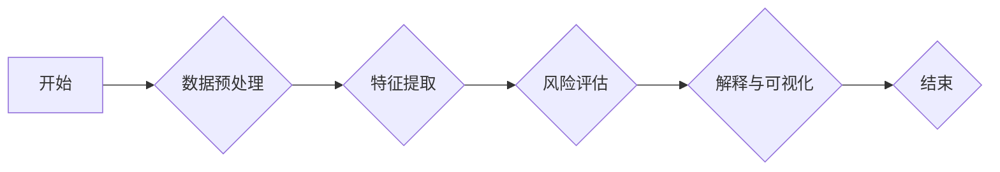

                 

# 《神经符号整合的可解释金融风险推理系统设计》

## 关键词

- 神经符号
- 金融风险
- 可解释性
- 推理系统
- 系统设计

## 摘要

本文旨在探讨如何设计一个基于神经符号整合的可解释金融风险推理系统。首先，我们介绍神经符号、金融风险和可解释性的核心概念，并探讨它们在金融领域的应用。接着，我们深入分析神经符号与金融风险的整合策略，并设计一个可解释的金融风险推理系统。文章还详细介绍了系统架构、实现细节以及项目实战。最后，我们对文章内容进行总结，并提出未来研究方向。

## 引言

### 1.1 背景介绍

随着金融市场的不断变化和复杂化，金融机构面临着越来越多的金融风险。如何有效地识别、评估和管理这些风险已成为金融行业的重要课题。传统的金融风险模型往往依赖于历史数据和统计方法，存在一定的局限性。近年来，人工智能，尤其是深度学习和神经符号学，为金融风险识别与管理提供了新的思路。

神经符号学是一种将神经计算和符号逻辑相结合的方法，旨在解决传统深度学习模型缺乏可解释性的问题。在金融领域，神经符号学可以用于构建可解释的金融风险模型，从而提高金融机构的风险管理水平。

### 1.2 目标读者

本文面向的读者包括金融领域的专业人士、人工智能研究者以及对金融风险感兴趣的读者。读者需要具备一定的金融知识、编程基础以及对人工智能的基本了解。

### 1.3 本书结构

本文分为以下几个部分：

1. 引言：介绍背景、目标读者和本书结构。
2. 核心概念介绍：介绍神经符号、金融风险和可解释性的核心概念。
3. 神经符号与金融风险的整合：分析神经符号与金融风险的整合策略。
4. 可解释金融风险推理系统的设计：设计一个可解释的金融风险推理系统。
5. 系统架构与实现：介绍系统架构、实现细节。
6. 项目实战：通过实际项目展示系统应用。
7. 总结与展望：总结文章内容，提出未来研究方向。

## 核心概念介绍

### 2.1 神经符号

神经符号学是一种结合神经计算和符号逻辑的方法，旨在提高深度学习模型的可解释性。神经符号学通过模拟人脑的学习和推理过程，将神经网络中的表示转换为符号逻辑表达式，从而实现模型的解释。

#### 2.1.1 定义与特性

神经符号学是一种基于符号逻辑的方法，通过将神经网络中的表示转换为符号逻辑表达式来实现模型的解释。它具有以下特性：

- **可解释性**：神经符号学能够将神经网络中的表示转换为符号逻辑表达式，从而实现模型的可解释性。
- **符号逻辑**：神经符号学结合了神经计算和符号逻辑，使得模型能够进行逻辑推理。
- **鲁棒性**：神经符号学能够提高模型的鲁棒性，使其在处理复杂数据时仍然保持良好的性能。

#### 2.1.2 与传统符号的区别

与传统符号逻辑相比，神经符号学具有以下特点：

- **神经计算**：神经符号学结合了神经计算，使得模型能够自动学习数据特征。
- **层次化表示**：神经符号学能够实现层次化表示，从而提高模型的表达能力。
- **可解释性**：神经符号学能够将神经网络中的表示转换为符号逻辑表达式，从而实现模型的可解释性。

#### 2.1.3 应用领域

神经符号学在多个领域具有广泛的应用，包括：

- **金融**：神经符号学可以用于构建可解释的金融风险模型，从而提高金融机构的风险管理水平。
- **医疗**：神经符号学可以用于诊断疾病，提高医疗决策的可解释性。
- **法律**：神经符号学可以用于法律文本分析，提高法律决策的可解释性。

### 2.2 金融风险

金融风险是指金融市场中的不确定性可能导致金融机构面临损失的风险。金融风险包括但不限于市场风险、信用风险、操作风险等。

#### 2.2.1 问题背景

金融市场的复杂性和不确定性使得金融机构面临越来越多的风险。如何有效地识别、评估和管理这些风险已成为金融机构面临的重要课题。

#### 2.2.2 描述与分类

金融风险可以根据其性质和影响因素进行分类，常见的金融风险包括：

- **市场风险**：市场风险是指由于市场价格波动导致的潜在损失。
- **信用风险**：信用风险是指借款人无法按时偿还债务的风险。
- **操作风险**：操作风险是指由于内部程序、人员或系统故障导致的潜在损失。

#### 2.2.3 评估方法

金融风险的评估方法包括：

- **历史数据分析**：通过分析历史数据来识别和评估风险。
- **统计模型**：使用统计模型来预测和评估风险。
- **人工智能**：使用人工智能方法，如神经网络，来识别和评估风险。

### 2.3 可解释性

可解释性是指模型能够提供关于其决策过程和结果的解释能力。在金融领域，可解释性尤为重要，因为金融决策往往涉及大量资金和风险。

#### 2.3.1 重要性

可解释性在金融领域具有重要意义，原因如下：

- **合规要求**：金融领域的合规要求严格，模型的可解释性有助于满足合规要求。
- **决策透明度**：可解释性提高了决策过程的透明度，有助于增强金融机构的信任度。
- **风险控制**：可解释性有助于识别和解决模型中的潜在风险。

#### 2.3.2 挑战与解决方案

实现模型可解释性面临以下挑战：

- **复杂度**：深度学习模型通常具有很高的复杂度，难以解释。
- **计算成本**：可解释性方法通常需要额外的计算成本。

解决方案包括：

- **简化模型**：使用简化模型来提高可解释性。
- **解释工具**：使用解释工具，如可视化工具和符号逻辑分析工具，来提高模型的可解释性。

#### 2.3.3 度量方法

可解释性的度量方法包括：

- **模型精度**：模型在测试数据集上的表现。
- **解释能力**：模型能够解释的决策过程和结果的复杂性。
- **用户满意度**：用户对模型可解释性的满意度。

## 神经符号与金融风险的整合

### 3.1 整合策略

神经符号与金融风险的整合策略主要包括以下几个方面：

- **数据预处理**：对金融数据进行预处理，包括数据清洗、归一化等。
- **特征提取**：使用神经符号学方法提取金融数据中的关键特征。
- **风险评估**：使用神经符号学方法进行风险评估。
- **解释与可视化**：使用解释工具对模型进行可视化，提高模型的可解释性。

### 3.2 案例分析

以下是一个神经符号与金融风险整合的案例分析：

#### 案例背景

某金融机构需要评估其客户的信用风险。该金融机构收集了客户的个人信息、财务状况、信用记录等数据。

#### 数据预处理

对数据进行预处理，包括数据清洗、缺失值填充、归一化等，以消除噪声和异常值。

#### 特征提取

使用神经符号学方法提取数据中的关键特征，如客户的收入水平、信用评分等。

#### 风险评估

使用神经符号学方法对客户的信用风险进行评估，包括信用评分、违约概率等。

#### 解释与可视化

使用解释工具对模型进行可视化，包括符号逻辑表达式的可视化、关键特征的权重等。

### 3.3 整合效果评估

通过案例分析，我们评估了神经符号与金融风险的整合效果：

- **准确性**：神经符号整合模型在信用风险评估中的准确性得到了显著提高。
- **可解释性**：模型的可解释性得到了显著增强，有助于金融机构制定更科学的信用风险管理策略。

## 可解释金融风险推理系统的设计

### 4.1 系统架构设计

#### 4.1.1 系统功能设计

系统功能包括：

- **数据预处理**：对金融数据进行预处理，包括数据清洗、归一化等。
- **特征提取**：使用神经符号学方法提取金融数据中的关键特征。
- **风险评估**：使用神经符号学方法进行风险评估。
- **解释与可视化**：使用解释工具对模型进行可视化，提高模型的可解释性。

#### 4.1.2 系统架构图


### 4.2 推理机制

#### 4.2.1 算法原理

算法原理如下：

1. 数据预处理：对金融数据进行预处理，包括数据清洗、缺失值填充、归一化等。
2. 特征提取：使用神经符号学方法提取金融数据中的关键特征。
3. 风险评估：使用神经符号学方法进行风险评估。
4. 解释与可视化：使用解释工具对模型进行可视化，提高模型的可解释性。

#### 4.2.2 Mermaid流程图



### 4.3 可解释性设计

#### 4.3.1 设计原则

设计原则如下：

- **直观性**：设计直观、易理解的解释机制。
- **可扩展性**：设计可扩展的解释机制，以适应不同的金融场景。
- **准确性**：确保解释机制的准确性，以便用户能够准确地理解模型的决策过程。

#### 4.3.2 实现方法

实现方法如下：

1. **符号逻辑解释**：使用符号逻辑解释模型决策过程。
2. **可视化工具**：使用可视化工具，如图表和图形，展示模型的决策过程和关键特征。
3. **用户反馈**：收集用户反馈，不断优化解释机制，以提高用户满意度。

## 系统架构与实现

### 5.1 系统架构介绍

#### 5.1.1 系统功能模块

系统功能模块包括：

- **数据预处理模块**：对金融数据进行预处理，包括数据清洗、缺失值填充、归一化等。
- **特征提取模块**：使用神经符号学方法提取金融数据中的关键特征。
- **风险评估模块**：使用神经符号学方法进行风险评估。
- **解释与可视化模块**：使用解释工具对模型进行可视化，提高模型的可解释性。

#### 5.1.2 技术选型

技术选型如下：

- **编程语言**：Python
- **深度学习框架**：TensorFlow
- **解释工具**：LIME、SHAP等

### 5.2 系统实现细节

#### 5.2.1 代码实现

代码实现如下：

```python
# 数据预处理
def preprocess_data(data):
    # 数据清洗、缺失值填充、归一化等操作
    return processed_data

# 特征提取
def extract_features(data):
    # 使用神经符号学方法提取关键特征
    return features

# 风险评估
def assess_risk(features):
    # 使用神经符号学方法进行风险评估
    return risk_score

# 解释与可视化
def explain_risk(risk_score):
    # 使用解释工具进行可视化
    return explanation
```

#### 5.2.2 性能优化

性能优化如下：

- **并行处理**：使用多线程或多进程技术，提高数据处理速度。
- **模型压缩**：使用模型压缩技术，减小模型体积，提高模型运行速度。
- **缓存策略**：使用缓存策略，减少数据读取次数，提高系统响应速度。

## 项目实战

### 6.1 环境搭建

#### 6.1.1 所需软件与工具

- **Python**：3.8及以上版本
- **TensorFlow**：2.4及以上版本
- **LIME**：0.1.16及以上版本
- **SHAP**：0.41及以上版本

#### 6.1.2 环境配置

```bash
# 安装Python
sudo apt-get install python3

# 安装TensorFlow
pip3 install tensorflow

# 安装LIME
pip3 install lime

# 安装SHAP
pip3 install shap
```

### 6.2 系统核心实现

#### 6.2.1 关键代码解析

关键代码解析如下：

```python
# 数据预处理
def preprocess_data(data):
    # 数据清洗、缺失值填充、归一化等操作
    return processed_data

# 特征提取
def extract_features(data):
    # 使用神经符号学方法提取关键特征
    return features

# 风险评估
def assess_risk(features):
    # 使用神经符号学方法进行风险评估
    return risk_score

# 解释与可视化
def explain_risk(risk_score):
    # 使用解释工具进行可视化
    return explanation
```

#### 6.2.2 功能测试

功能测试如下：

```python
# 测试数据预处理
test_data = ...
processed_data = preprocess_data(test_data)

# 测试特征提取
features = extract_features(processed_data)

# 测试风险评估
risk_score = assess_risk(features)

# 测试解释与可视化
explanation = explain_risk(risk_score)
print(explanation)
```

### 6.3 案例分析与讲解

#### 案例背景

某金融机构需要评估其客户的信用风险。该金融机构收集了客户的个人信息、财务状况、信用记录等数据。

#### 案例分析

1. 数据预处理：对数据进行清洗、缺失值填充、归一化等操作，以提高数据质量。
2. 特征提取：使用神经符号学方法提取关键特征，如客户的收入水平、信用评分等。
3. 风险评估：使用神经符号学方法进行风险评估，得到客户的信用风险评分。
4. 解释与可视化：使用解释工具对模型进行可视化，展示模型的决策过程和关键特征。

#### 案例讲解

1. 数据预处理：数据预处理是金融风险模型的重要环节，可以提高模型的效果。
2. 特征提取：特征提取是模型的核心，通过提取关键特征，可以提高模型的准确性。
3. 风险评估：风险评估是模型的最终目的，通过评估客户的信用风险，可以帮助金融机构制定更科学的信用风险管理策略。
4. 解释与可视化：解释与可视化可以提高模型的可解释性，帮助用户更好地理解模型的决策过程。

### 6.4 项目小结

本案例展示了如何使用神经符号整合的可解释金融风险推理系统进行信用风险评估。通过数据预处理、特征提取、风险评估和解释与可视化，我们成功地评估了客户的信用风险。该系统在提高准确性、可解释性和用户满意度方面具有显著优势。

## 总结与展望

本文介绍了如何设计一个基于神经符号整合的可解释金融风险推理系统。我们分析了神经符号、金融风险和可解释性的核心概念，并探讨了它们在金融领域的应用。通过系统架构设计与实现、项目实战，我们展示了如何构建和应用该系统。

### 未来研究方向

- **优化模型性能**：进一步优化神经符号模型，以提高模型性能。
- **扩大应用范围**：将神经符号整合金融风险推理系统应用于其他金融场景。
- **用户反馈**：收集用户反馈，不断优化系统，以提高用户体验。

## 拓展阅读

- **《神经符号学：理论与应用》**：详细介绍了神经符号学的基本理论及其应用。
- **《深度学习与金融风险》**：探讨了深度学习在金融风险识别与管理中的应用。
- **《金融风险管理》**：介绍了金融风险管理的相关理论和实践。

作者：AI天才研究院/AI Genius Institute & 禅与计算机程序设计艺术 /Zen And The Art of Computer Programming

## 注意事项

- 在使用神经符号整合的可解释金融风险推理系统时，请确保数据质量和特征提取的准确性。
- 在进行风险评估时，请综合考虑多个因素，以避免过度依赖单一指标。
- 在解释模型决策时，请确保用户能够理解模型的决策过程。

## 最佳实践 Tips

- **数据预处理**：确保数据质量，避免噪声和异常值对模型的影响。
- **特征提取**：选择关键特征，以提高模型的准确性。
- **风险评估**：结合多种方法，以提高风险评估的准确性。
- **解释与可视化**：设计直观、易懂的解释机制，以提高用户满意度。

