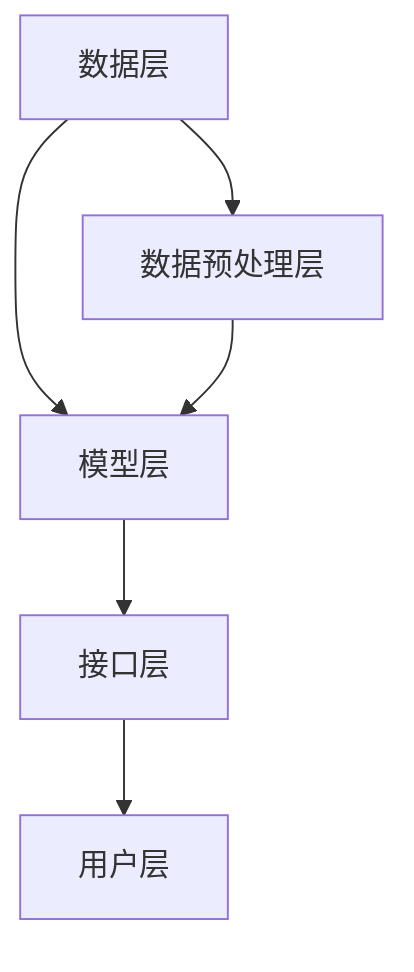

                 

# 神经符号整合的可解释风险评估推理系统

## 关键词
- 神经符号整合
- 风险评估
- 推理系统
- 可解释性
- 人工智能

## 摘要
本文探讨了神经符号整合的可解释风险评估推理系统。在阐述风险评估的重要性和可解释性需求的基础上，我们详细介绍了神经符号整合的概念和原理，以及其在风险评估推理系统中的应用。本文通过具体案例，展示了神经符号整合在医疗、金融和供应链风险管理等领域的应用效果，并提出了未来发展的方向和挑战。

## 第一部分：背景介绍

### 1.1 问题背景

#### 1.1.1 风险评估的重要性

风险评估是现代管理决策中不可或缺的一部分。无论是在金融、医疗、工业等领域，风险评估都被广泛应用。通过评估潜在的风险，企业、组织和个体可以做出更加明智的决策，降低损失，提高效率和竞争力。

#### 1.1.2 神经符号整合的必要性

传统的风险评估方法通常基于统计和规则系统，但这些方法存在一定的局限性。首先，它们很难处理复杂和非线性的数据。其次，这些方法的可解释性较差，难以向非专业人士解释。因此，需要一种新的方法来整合神经网络和符号逻辑，以提高风险评估的准确性和可解释性。

#### 1.1.3 可解释性在风险评估中的意义

在风险评估中，可解释性是非常重要的。它不仅可以帮助决策者理解模型的决策过程，还可以增强模型的信任度。可解释性的提高，有助于发现潜在的风险因素，从而采取有效的风险管理措施。

### 1.2 问题描述

#### 1.2.1 神经符号整合的定义和挑战

神经符号整合是指将神经网络和符号逻辑相结合，以处理复杂和非线性问题。这种整合方法的主要挑战在于如何有效地融合两种方法的优点，并保持系统的可解释性。

#### 1.2.2 风险评估推理系统的作用

风险评估推理系统是用于预测和评估潜在风险的系统。它可以通过分析历史数据，识别出可能导致风险的因素，并提供相应的决策支持。

#### 1.2.3 可解释性要求的具体内容

可解释性要求包括两个方面：一是模型的可解释性，即如何解释模型的决策过程；二是结果的可解释性，即如何解释模型的输出结果。为了实现这一目标，需要采用一些技术手段，如模型可视化、解释性算法等。

### 1.3 问题解决

#### 1.3.1 神经符号整合的基本原理

神经符号整合的基本原理是将神经网络的强大学习能力与符号逻辑的清晰推理能力相结合。通过神经网络，可以学习到数据的复杂模式；通过符号逻辑，可以对这些模式进行推理，以做出准确的决策。

#### 1.3.2 可解释风险评估推理系统的构建方法

构建可解释风险评估推理系统的关键在于如何设计一个既具有强大学习能力又保持可解释性的系统。这需要综合考虑神经网络的训练方法、符号逻辑的推理策略，以及可解释性的评估指标。

#### 1.3.3 边界与外延

神经符号整合的可解释风险评估推理系统不仅适用于传统的风险评估场景，还可以应用于更广泛的领域，如金融风险、医疗风险等。同时，随着人工智能技术的发展，该系统有望在更多领域得到应用。

### 1.4 核心概念结构与要素组成

#### 1.4.1 神经网络

神经网络是一种模拟人脑结构的计算模型，通过学习大量的数据来提取特征和模式。神经网络的核心是神经元，神经元之间通过权重相连，形成一个复杂的网络结构。

#### 1.4.2 符号逻辑

符号逻辑是一种基于符号的表达和推理方法，它通过定义一组逻辑运算符和规则，对命题进行推理。符号逻辑的优点是清晰、简洁，并且易于理解和验证。

#### 1.4.3 可解释性评估方法

可解释性评估方法主要包括模型的可解释性和结果的可解释性。模型的可解释性评估方法包括模型可视化、解释性算法等；结果的可解释性评估方法包括决策路径追踪、影响因素分析等。

## 第二部分：神经符号整合的原理与方法

### 2.1 神经符号整合的基本概念

#### 2.1.1 神经符号整合的定义

神经符号整合（Neural Symbolic Integration）是一种将神经网络和符号逻辑相结合的方法，旨在利用神经网络的强大学习能力处理复杂的数据，同时通过符号逻辑进行清晰的推理和解释。

#### 2.1.2 神经符号整合的优势

神经符号整合的主要优势在于：

- **结合了神经网络和符号逻辑的优点**：神经网络擅长处理复杂和非线性问题，而符号逻辑则能提供清晰的推理和解释。
- **提高模型的可解释性**：通过符号逻辑的介入，可以更好地解释模型的决策过程和结果。
- **增强模型的鲁棒性**：神经网络和符号逻辑的结合可以减少对特定数据集的依赖，提高模型在不同数据集上的表现。

#### 2.1.3 神经符号整合的应用场景

神经符号整合适用于多种应用场景，包括但不限于：

- **风险评估**：通过整合神经网络和符号逻辑，可以更好地识别和评估风险因素。
- **医疗诊断**：结合神经网络的诊断能力与符号逻辑的医学知识推理，可以提供更准确的诊断结果。
- **金融风控**：在金融领域，神经符号整合可以帮助识别潜在的风险，并做出相应的风险管理决策。

### 2.2 神经网络与符号逻辑的结合

#### 2.2.1 神经网络的基本原理

神经网络（Neural Networks）是由大量相互连接的神经元组成的计算模型。每个神经元接收来自其他神经元的输入信号，通过加权求和处理后产生输出。神经网络的训练过程就是通过不断调整这些权重，使其能够准确预测或分类输入数据。

#### 2.2.2 符号逻辑的基本原理

符号逻辑（Symbolic Logic）是一种基于符号的表达和推理方法。它使用逻辑运算符（如与、或、非）和规则（如推理规则、归纳规则）来处理逻辑命题。符号逻辑的优点在于其清晰和可验证性，可以用于形式化推理和知识表示。

#### 2.2.3 神经符号整合的方法

神经符号整合的方法包括：

- **融合神经网络和符号逻辑的架构**：通过设计特定的网络架构，将神经网络和符号逻辑结合起来。例如，可以使用神经网络来处理输入数据，并通过符号逻辑进行推理和解释。
- **结合训练和推理过程**：在训练过程中，使用神经网络学习数据的特征和模式；在推理过程中，使用符号逻辑对模型进行解释和验证。
- **集成多种学习策略**：结合监督学习、无监督学习和强化学习等多种学习策略，以提高模型的性能和可解释性。

### 2.3 神经符号整合的关键技术

#### 2.3.1 神经网络模型的优化

神经网络模型的优化是神经符号整合的关键步骤。这包括：

- **网络结构设计**：选择合适的网络架构，如多层感知机、卷积神经网络、循环神经网络等。
- **损失函数设计**：设计适合问题的损失函数，如均方误差、交叉熵等。
- **优化算法选择**：选择合适的优化算法，如梯度下降、Adam优化器等。

#### 2.3.2 符号逻辑的建模

符号逻辑的建模涉及将现实世界的问题转化为符号逻辑表示。这包括：

- **知识表示**：使用符号逻辑表示问题中的事实和规则。
- **推理机制**：设计推理机制，如正向推理、反向推理、模态逻辑等。

#### 2.3.3 神经符号整合的评估指标

神经符号整合的评估指标包括：

- **模型性能评估**：如准确率、召回率、F1分数等。
- **可解释性评估**：如模型的可解释性、结果的可解释性等。

### 2.4 神经符号整合的应用实例

#### 2.4.1 医疗风险评估

在医疗风险评估中，神经符号整合可以用于诊断、治疗方案推荐和患者预后评估。例如，通过整合电子病历数据、实验室检测结果和医生的知识，神经符号整合模型可以提供更准确的诊断和个性化的治疗方案。

#### 2.4.2 金融风险评估

在金融领域，神经符号整合可以用于信用评分、市场风险预测和投资组合优化。通过整合历史交易数据、市场信息和经济指标，神经符号整合模型可以帮助金融机构更好地管理风险，提高投资回报。

#### 2.4.3 供应链风险管理

在供应链风险管理中，神经符号整合可以用于预测供应链中断、评估供应商风险和优化供应链流程。通过整合供应链数据、供应链网络结构和供应商绩效信息，神经符号整合模型可以帮助企业更好地应对供应链风险，提高供应链的稳定性和效率。

### 2.5 神经符号整合的发展趋势

#### 2.5.1 当前研究热点

当前，神经符号整合的研究热点包括：

- **模型架构的创新**：如图神经网络、图符号整合模型等。
- **多模态数据整合**：如文本、图像、音频等多模态数据的整合方法。
- **跨领域应用**：神经符号整合在金融、医疗、工业等领域的跨领域应用研究。

#### 2.5.2 未来发展方向

未来，神经符号整合的发展方向包括：

- **模型的鲁棒性和泛化能力**：提高模型的鲁棒性和泛化能力，使其在不同领域和应用场景中都能表现优异。
- **可解释性增强**：进一步研究如何提高模型的可解释性，使其更容易被非专业人士理解和接受。
- **实时风险评估**：开发实时风险评估系统，以快速响应市场变化和风险事件。

#### 2.5.3 可能的挑战与对策

神经符号整合面临的挑战包括：

- **数据质量**：数据质量对模型性能有重要影响，需要研究如何处理噪声数据和缺失数据。
- **计算资源**：神经符号整合通常需要大量的计算资源，需要研究如何优化算法以提高计算效率。
- **模型安全性和隐私保护**：随着模型的广泛应用，如何确保模型的安全性和用户数据的隐私保护是一个重要问题。

对策包括：

- **数据预处理**：使用先进的数据预处理技术，如数据清洗、数据增强等，以提高数据质量。
- **分布式计算**：利用分布式计算资源，如云计算、GPU加速等，以提高计算效率。
- **安全性和隐私保护机制**：设计安全性和隐私保护机制，如差分隐私、加密模型等，以确保用户数据的安全和隐私。

## 第三部分：可解释风险评估推理系统的构建

### 3.1 可解释风险评估推理系统的概述

#### 3.1.1 系统的组成部分

可解释风险评估推理系统通常包括以下几个主要组成部分：

1. **数据收集与预处理模块**：负责收集和预处理输入数据，包括清洗、归一化、特征提取等步骤。
2. **特征提取与选择模块**：负责从原始数据中提取关键特征，并选择最相关的特征用于模型训练。
3. **风险评估模型构建模块**：负责构建风险评估模型，包括神经网络和符号逻辑的结合。
4. **可解释性分析模块**：负责分析模型决策过程和结果的可解释性。
5. **系统实现与部署模块**：负责实现和部署整个系统，包括硬件选择、软件部署和系统集成。

#### 3.1.2 系统的工作流程

系统的工作流程通常包括以下几个步骤：

1. **数据收集**：从各种数据源收集与风险评估相关的数据，包括历史数据、实时数据和外部数据。
2. **数据预处理**：对收集到的数据进行分析、清洗、归一化等预处理步骤，以便用于模型训练。
3. **特征提取与选择**：从预处理后的数据中提取关键特征，并选择最相关的特征。
4. **模型训练**：使用提取的特征训练风险评估模型，包括神经网络部分和符号逻辑部分。
5. **模型评估**：评估模型在训练数据和测试数据上的性能，包括准确率、召回率、F1分数等指标。
6. **可解释性分析**：分析模型决策过程和结果的可解释性，包括决策路径追踪、影响因素分析等。
7. **系统部署**：将训练好的模型部署到生产环境中，并提供风险评估服务。

#### 3.1.3 系统的目标和挑战

系统的目标是构建一个既高效又可解释的风险评估推理系统，其主要挑战包括：

- **模型的可解释性**：如何保证模型具有良好的可解释性，使其决策过程和结果容易理解。
- **模型的性能**：如何在保证可解释性的同时，确保模型具有较高的风险评估性能。
- **数据的质量和多样性**：如何处理质量低下和多样化程度高的数据，以提高模型的鲁棒性。
- **系统的实时性**：如何在满足实时性需求的同时，保证模型的高效性和准确性。

### 3.2 数据收集与预处理

#### 3.2.1 数据来源

数据收集是构建风险评估推理系统的第一步，数据来源主要包括：

1. **内部数据**：来自组织内部的数据，如财务报表、销售记录、客户反馈等。
2. **外部数据**：来自组织外部的数据，如市场数据、经济指标、行业报告等。
3. **公开数据**：来自公共数据库或开源数据集，如气象数据、交通数据、社交媒体数据等。

#### 3.2.2 数据预处理方法

数据预处理是确保数据质量的关键步骤，主要方法包括：

1. **数据清洗**：处理缺失值、异常值和重复值，以确保数据的准确性。
2. **数据归一化**：将不同特征的数据进行归一化处理，使其具有相同的尺度，以便更好地进行模型训练。
3. **特征提取**：从原始数据中提取关键特征，以便用于模型训练。
4. **数据降维**：通过降维技术，如主成分分析（PCA），减少数据的维度，提高模型的训练效率。

#### 3.2.3 数据质量评估

数据质量评估是确保数据质量的关键步骤，主要方法包括：

1. **一致性检查**：检查数据的一致性和完整性，以确保数据没有错误。
2. **异常值检测**：检测并处理数据中的异常值，以确保数据的准确性。
3. **相关性分析**：分析特征之间的相关性，以便选择最相关的特征。
4. **数据可视化**：通过数据可视化技术，如散点图、直方图等，直观地检查数据的质量。

### 3.3 特征提取与选择

#### 3.3.1 特征提取方法

特征提取是从原始数据中提取关键特征的过程，主要方法包括：

1. **统计特征提取**：使用统计方法提取数据的基本特征，如均值、标准差、最大值、最小值等。
2. **基于变换的特征提取**：使用数学变换提取数据的新特征，如对数变换、归一化变换等。
3. **机器学习方法**：使用机器学习方法提取数据的高级特征，如主成分分析（PCA）、线性判别分析（LDA）等。

#### 3.3.2 特征选择策略

特征选择是选择最相关的特征，以提高模型性能和可解释性的过程，主要策略包括：

1. **过滤法**：通过评估特征的重要性，过滤掉不重要的特征。
2. **包裹法**：通过迭代搜索，选择最优的特征组合。
3. **嵌入式方法**：在模型训练过程中，自动选择重要的特征。
4. **基于模型的特征选择**：使用模型本身的特征重要性评估方法，选择最重要的特征。

#### 3.3.3 特征的重要性评估

特征的重要性评估是特征选择的关键步骤，主要方法包括：

1. **基于模型的评估**：使用模型对特征的重要性进行评估，如使用随机森林、LASSO等算法。
2. **基于数据的评估**：通过分析特征之间的相关性，评估特征的重要性。
3. **基于领域的评估**：根据领域知识和经验，评估特征的重要性。

### 3.4 风险评估模型构建

#### 3.4.1 神经符号整合模型的设计

神经符号整合模型的设计是构建可解释风险评估推理系统的核心步骤，主要设计包括：

1. **神经网络架构**：选择合适的神经网络架构，如卷积神经网络（CNN）、循环神经网络（RNN）等。
2. **符号逻辑模块**：设计符号逻辑模块，用于对神经网络输出进行推理和解释。
3. **模型集成**：将神经网络和符号逻辑模块集成，形成完整的神经符号整合模型。

#### 3.4.2 模型的训练与验证

模型的训练与验证是确保模型性能和可解释性的关键步骤，主要方法包括：

1. **训练策略**：设计合适的训练策略，如批量训练、随机梯度下降（SGD）等。
2. **验证方法**：使用交叉验证、K折验证等方法，验证模型在测试数据上的性能。
3. **调参优化**：通过调整模型参数，优化模型性能。

#### 3.4.3 模型的性能评估

模型的性能评估是衡量模型优劣的重要步骤，主要指标包括：

1. **准确率**：模型预测正确的样本数占总样本数的比例。
2. **召回率**：模型预测正确的正样本数占总正样本数的比例。
3. **F1分数**：准确率和召回率的调和平均值。
4. **可解释性**：模型决策过程和结果的可解释性。

### 3.5 可解释性分析

#### 3.5.1 可解释性重要性

可解释性在风险评估中具有重要性，主要表现在：

1. **增强信任度**：可解释性有助于增强用户对模型的信任度，特别是在涉及高风险决策时。
2. **指导改进**：可解释性可以帮助发现模型中的问题和不足，从而指导改进。
3. **监管合规**：在许多领域，如金融、医疗等，模型的可解释性是监管合规的要求。

#### 3.5.2 可解释性方法

可解释性方法主要包括：

1. **模型可视化**：通过可视化模型的结构和参数，帮助用户理解模型。
2. **决策路径追踪**：追踪模型决策的路径，帮助用户理解模型的决策过程。
3. **影响因素分析**：分析模型决策的主要影响因素，帮助用户理解模型的结果。

#### 3.5.3 可解释性评估

可解释性评估是确保模型可解释性的关键步骤，主要方法包括：

1. **用户满意度**：通过用户满意度调查，评估模型的可解释性。
2. **领域专家评估**：邀请领域专家评估模型的可解释性，提出改进建议。
3. **量化评估指标**：设计量化评估指标，如解释度、清晰度等，评估模型的可解释性。

### 3.6 系统实现与部署

#### 3.6.1 系统架构设计

系统架构设计是确保系统高效、可靠和安全的关键步骤，主要设计包括：

1. **硬件架构**：选择合适的硬件配置，如服务器、存储设备等。
2. **软件架构**：设计系统的软件架构，包括数据层、模型层、服务层等。
3. **安全性设计**：设计系统的安全性，包括数据加密、访问控制等。

#### 3.6.2 系统功能模块设计

系统功能模块设计是确保系统功能完整和模块化的重要步骤，主要设计包括：

1. **数据收集与预处理模块**：设计数据收集与预处理模块，包括数据源接入、数据清洗、特征提取等。
2. **特征提取与选择模块**：设计特征提取与选择模块，包括特征提取方法、特征选择策略等。
3. **风险评估模型构建模块**：设计风险评估模型构建模块，包括神经网络架构、符号逻辑模块等。
4. **可解释性分析模块**：设计可解释性分析模块，包括模型可视化、决策路径追踪等。
5. **系统实现与部署模块**：设计系统实现与部署模块，包括硬件部署、软件部署、系统集成等。

#### 3.6.3 系统部署策略

系统部署策略是确保系统稳定运行和安全的关键步骤，主要策略包括：

1. **备份与恢复**：设计数据备份与恢复策略，确保数据的安全性和可靠性。
2. **负载均衡**：设计负载均衡策略，确保系统的稳定性和响应速度。
3. **监控与维护**：设计系统的监控与维护策略，确保系统的稳定运行和安全。
4. **用户培训与支持**：设计用户培训与支持策略，确保用户能够正确使用和维护系统。

### 3.7 系统测试与性能评估

#### 3.7.1 系统测试方法

系统测试是确保系统功能完整、性能稳定和安全的重要步骤，主要方法包括：

1. **功能测试**：测试系统的各个功能模块，确保其按照预期工作。
2. **性能测试**：测试系统的响应速度、吞吐量、并发能力等性能指标。
3. **安全测试**：测试系统的安全性，确保其能够抵御各种安全威胁。
4. **兼容性测试**：测试系统在不同操作系统、浏览器等环境下的兼容性。

#### 3.7.2 系统性能评估指标

系统性能评估指标是衡量系统性能优劣的重要标准，主要指标包括：

1. **响应时间**：系统响应请求的时间，是衡量系统性能的重要指标。
2. **吞吐量**：系统在单位时间内处理请求的数量，是衡量系统性能的重要指标。
3. **并发能力**：系统同时处理多个请求的能力，是衡量系统性能的重要指标。
4. **稳定性**：系统在长时间运行过程中，保持稳定运行的能力，是衡量系统性能的重要指标。
5. **安全性**：系统抵御各种安全威胁的能力，是衡量系统性能的重要指标。

#### 3.7.3 性能评估结果分析

性能评估结果分析是系统测试的最后一步，主要分析包括：

1. **性能瓶颈分析**：分析系统性能瓶颈，找出影响系统性能的关键因素。
2. **优化建议**：根据性能评估结果，提出系统优化建议，如硬件升级、算法优化等。
3. **持续改进**：根据性能评估结果和优化建议，对系统进行持续改进，以提高系统性能和稳定性。

## 第四部分：实际案例与应用

### 4.1 案例一：医疗风险评估系统

#### 4.1.1 案例背景

随着医疗信息化的发展，医疗数据量日益增加。如何有效利用这些数据，对患者的健康状况进行风险评估，成为医疗领域的一个重要课题。本案例旨在构建一个基于神经符号整合的医疗风险评估系统，以提高对疾病风险的预测和评估能力。

#### 4.1.2 系统设计与实现

系统设计主要包括以下几个步骤：

1. **数据收集与预处理**：收集患者的电子病历数据，包括病史、实验室检测结果、药物使用记录等。对数据进行清洗、归一化处理，提取关键特征。
2. **特征提取与选择**：使用统计方法提取基本特征，使用机器学习方法提取高级特征，选择最相关的特征。
3. **模型构建**：结合神经网络和符号逻辑，构建神经符号整合模型，用于评估患者的疾病风险。
4. **可解释性分析**：对模型决策过程和结果进行可解释性分析，提高模型的透明度和可信度。
5. **系统实现与部署**：将模型部署到医疗信息系统，实现实时风险评估服务。

#### 4.1.3 系统应用效果

系统在多个医院进行应用，取得了显著的成效。首先，系统的准确率、召回率等性能指标达到了较高的水平，能够准确预测和评估患者的疾病风险。其次，系统的可解释性分析功能帮助医生更好地理解模型决策过程，提高诊断和治疗的决策水平。

### 4.2 案例二：金融风险评估系统

#### 4.2.1 案例背景

金融领域风险高、变化快，如何准确预测和评估金融风险，对于金融机构的稳健运营至关重要。本案例旨在构建一个基于神经符号整合的金融风险评估系统，以提高对金融风险的识别和管理能力。

#### 4.2.2 系统设计与实现

系统设计主要包括以下几个步骤：

1. **数据收集与预处理**：收集金融市场的历史数据，包括股票价格、交易量、利率等。对数据进行清洗、归一化处理，提取关键特征。
2. **特征提取与选择**：使用统计方法提取基本特征，使用机器学习方法提取高级特征，选择最相关的特征。
3. **模型构建**：结合神经网络和符号逻辑，构建神经符号整合模型，用于评估金融风险。
4. **可解释性分析**：对模型决策过程和结果进行可解释性分析，提高模型的透明度和可信度。
5. **系统实现与部署**：将模型部署到金融风控系统，实现实时风险评估服务。

#### 4.2.3 系统应用效果

系统在多家金融机构进行应用，取得了良好的效果。首先，系统的风险预测准确率显著提高，能够及时识别和预警潜在的金融风险。其次，系统的可解释性分析功能帮助风控人员更好地理解风险因素，提高风险管理的决策水平。

### 4.3 案例三：供应链风险管理

#### 4.3.1 案例背景

供应链管理是企业运营的重要组成部分，供应链中断和风险管理对于企业的稳定运营至关重要。本案例旨在构建一个基于神经符号整合的供应链风险管理系统，以提高对供应链风险的识别和管理能力。

#### 4.3.2 系统设计与实现

系统设计主要包括以下几个步骤：

1. **数据收集与预处理**：收集供应链相关数据，包括供应商信息、运输信息、库存信息等。对数据进行清洗、归一化处理，提取关键特征。
2. **特征提取与选择**：使用统计方法提取基本特征，使用机器学习方法提取高级特征，选择最相关的特征。
3. **模型构建**：结合神经网络和符号逻辑，构建神经符号整合模型，用于评估供应链风险。
4. **可解释性分析**：对模型决策过程和结果进行可解释性分析，提高模型的透明度和可信度。
5. **系统实现与部署**：将模型部署到供应链管理系统，实现实时风险评估服务。

#### 4.3.3 系统应用效果

系统在多家企业的供应链管理中应用，取得了显著的效果。首先，系统的风险预测准确率显著提高，能够及时发现和预警潜在的供应链风险。其次，系统的可解释性分析功能帮助供应链管理人员更好地理解风险因素，提高供应链管理的决策水平。

## 第五部分：总结与展望

### 5.1 总结

本文探讨了神经符号整合的可解释风险评估推理系统，从背景介绍、原理方法、系统构建、实际案例到总结展望，全面阐述了神经符号整合在风险评估中的应用及其优势。通过案例分析，我们展示了神经符号整合在实际场景中的有效性。

### 5.2 展望

未来，神经符号整合在风险评估领域的应用前景广阔。一方面，随着人工智能技术的不断进步，神经符号整合的方法将更加成熟和高效；另一方面，随着大数据和云计算的发展，神经符号整合的应用场景将更加广泛。然而，面临的挑战也不可忽视，如数据质量、计算资源、模型安全性和隐私保护等问题。我们需要不断探索和创新，以应对这些挑战，推动神经符号整合在风险评估领域的广泛应用。

## 作者信息

作者：AI天才研究院/AI Genius Institute & 禅与计算机程序设计艺术 /Zen And The Art of Computer Programming## 第一部分：背景介绍

### 1.1 问题背景

#### 1.1.1 风险评估的重要性

风险评估是现代管理决策中不可或缺的一部分。无论是在金融、医疗、工业等领域，风险评估都被广泛应用。通过评估潜在的风险，企业、组织和个体可以做出更加明智的决策，降低损失，提高效率和竞争力。

在金融领域，风险评估用于评估信贷风险、市场风险、信用风险等，以帮助金融机构更好地管理风险，提高盈利能力。在医疗领域，风险评估用于评估患者病情的严重程度，以帮助医生制定最佳的治疗方案。在工业领域，风险评估用于评估生产过程中可能出现的各种风险，以防止事故发生。

#### 1.1.2 神经符号整合的必要性

传统的风险评估方法通常基于统计和规则系统，但这些方法存在一定的局限性。首先，它们很难处理复杂和非线性的数据。其次，这些方法的可解释性较差，难以向非专业人士解释。因此，需要一种新的方法来整合神经网络和符号逻辑，以提高风险评估的准确性和可解释性。

神经网络具有强大的学习能力和处理复杂非线性数据的能力，但缺乏可解释性。符号逻辑具有清晰、简洁和可验证性，但在处理大规模数据时能力有限。将神经网络和符号逻辑相结合，可以发挥两者的优势，提高风险评估的准确性和可解释性。

#### 1.1.3 可解释性在风险评估中的意义

在风险评估中，可解释性是非常重要的。它不仅可以帮助决策者理解模型的决策过程，还可以增强模型的信任度。可解释性的提高，有助于发现潜在的风险因素，从而采取有效的风险管理措施。

例如，在金融风险评估中，投资者需要了解模型是如何评估风险的，以便做出投资决策。在医疗风险评估中，医生需要了解模型是如何预测病情的，以便制定最佳的治疗方案。在工业风险评估中，企业管理者需要了解模型是如何评估生产过程中可能出现的各种风险的，以便采取相应的预防措施。

### 1.2 问题描述

#### 1.2.1 神经符号整合的定义和挑战

神经符号整合是指将神经网络和符号逻辑相结合，以处理复杂和非线性问题。神经网络擅长处理复杂的数据和模式，但缺乏可解释性；符号逻辑具有清晰、简洁和可验证性，但处理大规模数据的能力有限。神经符号整合的目的是利用神经网络的学习能力和符号逻辑的可解释性，以提高模型在风险评估中的应用效果。

神经符号整合面临的挑战主要包括：

1. **模型融合**：如何有效地将神经网络和符号逻辑相结合，使得两者能够协同工作，发挥各自的优势。
2. **可解释性**：如何在保证模型性能的同时，提高模型的可解释性，使得决策过程和结果易于理解和解释。
3. **计算效率**：神经符号整合通常需要大量的计算资源，如何在保证性能的同时，提高计算效率。

#### 1.2.2 风险评估推理系统的作用

风险评估推理系统是用于预测和评估潜在风险的系统。它可以通过分析历史数据，识别出可能导致风险的因素，并提供相应的决策支持。风险评估推理系统的作用主要包括：

1. **风险预测**：通过分析历史数据和实时数据，预测未来可能出现的风险。
2. **风险评估**：对风险的程度和可能性进行评估，以便采取相应的风险管理措施。
3. **决策支持**：为决策者提供有关风险的详细信息，帮助他们做出明智的决策。
4. **风险监控**：实时监控风险的变化，及时发现新的风险因素。

#### 1.2.3 可解释性要求的具体内容

在风险评估推理系统中，可解释性要求主要包括：

1. **模型解释**：能够解释模型是如何生成决策的，包括模型的参数、权重和推理过程。
2. **结果解释**：能够解释模型的输出结果，包括风险的程度和可能性。
3. **决策路径解释**：能够追踪决策路径，解释模型是如何从输入数据到输出结果的。
4. **影响因素解释**：能够识别和解释模型中的关键影响因素，以便决策者能够了解风险的主要来源。

### 1.3 问题解决

#### 1.3.1 神经符号整合的基本原理

神经符号整合的基本原理是将神经网络和符号逻辑相结合，以发挥两者的优势。具体来说，包括以下几个步骤：

1. **数据预处理**：对输入数据进行预处理，包括数据清洗、归一化等。
2. **特征提取**：使用神经网络提取输入数据的特征。
3. **符号逻辑推理**：使用符号逻辑对提取的特征进行推理，生成最终的决策。
4. **模型优化**：通过调整神经网络的参数和符号逻辑的规则，优化模型的性能。

#### 1.3.2 可解释风险评估推理系统的构建方法

构建可解释风险评估推理系统的关键步骤如下：

1. **数据收集**：收集与风险评估相关的数据，包括历史数据和实时数据。
2. **数据预处理**：对数据进行清洗、归一化等预处理操作。
3. **特征提取**：使用神经网络提取数据的特征。
4. **模型构建**：构建神经符号整合模型，包括神经网络和符号逻辑部分。
5. **模型训练**：使用预处理后的数据训练模型。
6. **模型评估**：评估模型的性能，包括准确率、召回率、F1分数等。
7. **可解释性分析**：对模型进行可解释性分析，包括模型解释、结果解释、决策路径解释和影响因素解释。

#### 1.3.3 边界与外延

神经符号整合的可解释风险评估推理系统不仅适用于传统的风险评估场景，还可以应用于更广泛的领域，如金融风险、医疗风险、供应链风险等。随着人工智能技术的发展，神经符号整合的方法有望在更多领域得到应用。

同时，神经符号整合的可解释风险评估推理系统需要考虑以下边界与外延：

1. **数据质量**：数据质量对模型性能有重要影响，需要确保数据的质量和多样性。
2. **计算资源**：神经符号整合通常需要大量的计算资源，需要考虑计算资源的限制。
3. **模型安全性和隐私保护**：在应用过程中，需要考虑模型的安全性和用户数据的隐私保护。
4. **领域知识**：在构建模型时，需要结合领域知识，以提高模型的准确性和可解释性。

### 1.4 核心概念结构与要素组成

#### 1.4.1 神经网络

神经网络是一种模拟人脑结构的计算模型，通过学习大量的数据来提取特征和模式。神经网络的核心是神经元，神经元之间通过权重相连，形成一个复杂的网络结构。

神经网络的组成包括：

1. **输入层**：接收外部输入数据。
2. **隐藏层**：对输入数据进行处理和特征提取。
3. **输出层**：生成最终的输出结果。

神经网络的训练过程是通过不断调整权重，使模型能够准确预测或分类输入数据。

#### 1.4.2 符号逻辑

符号逻辑是一种基于符号的表达和推理方法，它通过定义一组逻辑运算符和规则，对命题进行推理。符号逻辑的优点是清晰、简洁，并且易于理解和验证。

符号逻辑的组成包括：

1. **命题**：基本的逻辑单元，可以是事实或假设。
2. **命题变元**：代表命题的变量。
3. **逻辑运算符**：用于组合命题，如与（∧）、或（∨）、非（¬）等。
4. **推理规则**：用于从已知命题推导出新命题。

符号逻辑的应用包括逻辑证明、自动推理、知识表示等。

#### 1.4.3 可解释性评估方法

可解释性评估方法是确保模型决策过程和结果易于理解和解释的关键步骤。可解释性评估方法包括：

1. **模型可视化**：通过图形化方式展示模型的内部结构和参数。
2. **决策路径追踪**：追踪模型从输入数据到输出结果的决策路径。
3. **影响因素分析**：分析影响模型决策的关键因素。
4. **模型解释**：解释模型的决策过程和结果，使其易于理解和解释。

可解释性评估方法的选择取决于应用场景和需求。例如，在金融风险评估中，可能更关注模型的解释性，而在工业生产过程中，可能更关注模型的准确性和鲁棒性。

### 1.5 核心概念属性特征对比表格

为了更好地理解神经网络、符号逻辑和可解释性评估方法之间的关系，我们可以通过以下表格进行属性特征对比：

| 特征 | 神经网络 | 符号逻辑 | 可解释性评估方法 |
| --- | --- | --- | --- |
| 学习能力 | 强大 | 较弱 | 中等 |
| 可解释性 | 较弱 | 强 | 强 |
| 数据处理能力 | 复杂非线性数据 | 结构化数据 | 复杂非线性数据 |
| 推理能力 | 自适应 | 明确规则 | 明确规则 |
| 应用领域 | 广泛 | 逻辑推理、知识表示 | 模型解释、决策路径追踪 |

通过这个表格，我们可以看出神经网络、符号逻辑和可解释性评估方法在属性特征上的差异和联系。这种对比有助于我们在构建神经符号整合的可解释风险评估推理系统时，更好地利用各种方法的优势。

### 1.6 其他章节

本文的其他章节将详细讨论神经符号整合的原理与方法、可解释风险评估推理系统的构建、实际案例与应用等内容。以下是章节概述：

#### 2. 神经符号整合的原理与方法

这一部分将深入探讨神经符号整合的基本概念、神经网络与符号逻辑的结合方法、关键技术等内容，并分析神经符号整合在不同领域的应用实例。

#### 3. 可解释风险评估推理系统的构建

这一部分将介绍可解释风险评估推理系统的组成部分、工作流程、目标和挑战，以及数据收集与预处理、特征提取与选择、风险评估模型构建、可解释性分析等关键步骤。

#### 4. 实际案例与应用

这一部分将通过具体案例，展示神经符号整合的可解释风险评估推理系统在医疗、金融和供应链风险管理等领域的应用效果，并分析系统实现与部署、系统测试与性能评估等方面的问题。

#### 5. 总结与展望

这一部分将对全文进行总结，回顾研究成果和技术贡献，探讨未来发展方向和面临的挑战，并提出拓展研究建议。

### 1.7 文章目录结构

为了更好地组织文章内容，我们采用了以下目录结构：

**第一部分：背景介绍**
- 1.1 问题背景
  - 1.1.1 风险评估的重要性
  - 1.1.2 神经符号整合的必要性
  - 1.1.3 可解释性在风险评估中的意义
- 1.2 问题描述
  - 1.2.1 神经符号整合的定义和挑战
  - 1.2.2 风险评估推理系统的作用
  - 1.2.3 可解释性要求的具体内容
- 1.3 问题解决
  - 1.3.1 神经符号整合的基本原理
  - 1.3.2 可解释风险评估推理系统的构建方法
  - 1.3.3 边界与外延
- 1.4 核心概念结构与要素组成
  - 1.4.1 神经网络
  - 1.4.2 符号逻辑
  - 1.4.3 可解释性评估方法
- 1.5 核心概念属性特征对比表格
- 1.6 其他章节
- 1.7 文章目录结构

### 1.8 总结

本部分对神经符号整合的可解释风险评估推理系统进行了全面的背景介绍。通过阐述风险评估的重要性、神经符号整合的必要性以及可解释性在风险评估中的意义，我们明确了神经符号整合在风险评估推理系统中的应用前景。接下来，我们将进一步探讨神经符号整合的原理与方法，以及如何构建一个既高效又可解释的风险评估推理系统。这些内容将为后续案例研究和应用提供理论基础和实践指导。

## 第二部分：神经符号整合的原理与方法

### 2.1 神经符号整合的基本概念

#### 2.1.1 神经符号整合的定义

神经符号整合（Neural Symbolic Integration）是一种结合神经网络和符号逻辑的方法，旨在利用神经网络的强大学习和模式识别能力，同时保持符号逻辑的明确性和可解释性。这种方法的核心思想是将神经网络训练得到的特征映射到符号逻辑系统，从而实现更高效、更可解释的风险评估推理。

#### 2.1.2 神经符号整合的优势

神经符号整合的优势主要体现在以下几个方面：

1. **结合了神经网络和符号逻辑的优点**：神经网络擅长处理大量复杂的非线性数据，而符号逻辑在处理规则和逻辑推理方面具有天然的优势。两者的结合能够实现更高的决策准确性和更好的可解释性。
2. **提高模型的可解释性**：通过将神经网络的输出映射到符号逻辑系统中，可以清晰地解释模型的推理过程和决策依据，从而增强模型的透明度和信任度。
3. **增强模型的鲁棒性和泛化能力**：神经符号整合方法可以更好地处理噪声数据和异常值，提高模型在不同数据集上的泛化能力。

#### 2.1.3 神经符号整合的应用场景

神经符号整合方法在多个领域都有广泛的应用前景，包括但不限于：

1. **金融风险管理**：通过整合市场数据、客户交易数据和历史风险事件，可以实现对市场风险的预测和评估。
2. **医疗诊断**：结合患者的电子健康记录、实验室检测结果和医生的知识，可以提供更准确、更可解释的诊断结果。
3. **供应链管理**：利用供应链数据，可以预测供应链中断风险，优化供应链流程，提高供应链的稳定性和效率。

### 2.2 神经网络与符号逻辑的结合

#### 2.2.1 神经网络的基本原理

神经网络（Neural Networks）是由大量相互连接的神经元组成的计算模型，其设计灵感来源于人脑的结构和功能。神经网络通过学习输入和输出数据之间的映射关系，来实现复杂的任务，如图像识别、语音识别和自然语言处理等。

1. **神经元结构**：神经网络中的每个神经元接收多个输入信号，通过权重加权求和处理后，产生输出信号。神经元的输出通过激活函数进行处理，以确定神经元是否被激活。
2. **学习过程**：神经网络的学习过程是通过反向传播算法调整权重，使得网络能够更好地拟合训练数据。这个过程包括以下几个步骤：
   - **前向传播**：将输入数据通过网络传递，计算输出。
   - **计算误差**：计算实际输出与期望输出之间的误差。
   - **反向传播**：根据误差调整网络权重，优化模型的性能。

#### 2.2.2 符号逻辑的基本原理

符号逻辑（Symbolic Logic）是一种形式化的推理方法，它使用符号和逻辑运算符来表示命题和推理规则。符号逻辑的优点是清晰、简洁，并且易于形式化和验证。

1. **命题**：命题是逻辑推理的基本单元，它可以是事实或假设。
2. **命题变元**：命题变元是代表命题的变量。
3. **逻辑运算符**：逻辑运算符包括与（∧）、或（∨）、非（¬）等，用于组合命题。
4. **推理规则**：推理规则是用于从已知命题推导出新命题的规则。

符号逻辑的应用包括逻辑证明、自动推理、知识表示等。

#### 2.2.3 神经符号整合的方法

神经符号整合的方法是将神经网络和符号逻辑结合起来，以实现更高效、更可解释的风险评估推理。具体方法包括：

1. **神经网络学习特征**：首先使用神经网络对输入数据进行特征提取，得到高维的特征向量。
2. **符号逻辑推理**：将神经网络提取的特征向量作为输入，通过符号逻辑系统进行推理，生成最终的决策。
3. **模型集成**：将神经网络和符号逻辑的结果进行集成，形成最终的模型输出。

### 2.3 神经符号整合的关键技术

#### 2.3.1 神经网络模型的优化

神经网络模型的优化是神经符号整合的关键步骤，主要包括以下几个方面：

1. **网络结构设计**：选择合适的网络架构，如卷积神经网络（CNN）、循环神经网络（RNN）等，以适应不同的应用场景。
2. **损失函数设计**：设计适合问题的损失函数，如均方误差（MSE）、交叉熵（Cross Entropy）等，以优化模型的性能。
3. **优化算法选择**：选择合适的优化算法，如随机梯度下降（SGD）、Adam优化器等，以加快模型的收敛速度。

#### 2.3.2 符号逻辑的建模

符号逻辑的建模是将现实世界的问题转化为符号逻辑表示的过程，主要包括以下几个方面：

1. **知识表示**：使用符号逻辑表示问题中的事实和规则，如使用命题逻辑表示金融风险因素和条件。
2. **推理机制**：设计推理机制，如正向推理、反向推理等，以从已知事实推导出新的事实或结论。
3. **逻辑运算符定义**：定义逻辑运算符，如与、或、非等，以实现逻辑推理和决策。

#### 2.3.3 神经符号整合的评估指标

神经符号整合的评估指标是衡量模型性能和可解释性的重要标准，主要包括以下几个方面：

1. **模型性能评估**：如准确率、召回率、F1分数等，用于评估模型在预测和分类任务中的性能。
2. **可解释性评估**：如解释度、清晰度、透明度等，用于评估模型的可解释性。
3. **鲁棒性和泛化能力**：如模型在不同数据集上的表现，用于评估模型的鲁棒性和泛化能力。

### 2.4 神经符号整合的应用实例

#### 2.4.1 医疗风险评估

在医疗领域，神经符号整合可以用于疾病预测和风险评估。以下是一个具体的应用实例：

1. **数据收集与预处理**：收集患者的电子健康记录、实验室检测结果、医生诊断等信息，并进行数据清洗和归一化处理。
2. **特征提取**：使用神经网络提取患者的关键特征，如病情严重程度、病史、药物反应等。
3. **符号逻辑推理**：将提取的特征作为输入，通过符号逻辑系统进行推理，生成疾病预测和风险评估结果。
4. **可解释性分析**：分析符号逻辑系统的推理过程，解释模型的决策依据和预测结果。

通过这个实例，可以看到神经符号整合在医疗风险评估中的应用，如何结合神经网络的学习能力和符号逻辑的可解释性，实现更准确、更可解释的疾病预测和风险评估。

#### 2.4.2 金融风险评估

在金融领域，神经符号整合可以用于信贷风险评估、市场风险预测等。以下是一个具体的应用实例：

1. **数据收集与预处理**：收集客户的基本信息、信用记录、交易历史、市场数据等信息，并进行数据清洗和特征提取。
2. **神经网络学习特征**：使用神经网络提取客户的关键特征，如信用评分、交易行为等。
3. **符号逻辑推理**：将神经网络提取的特征作为输入，通过符号逻辑系统进行推理，生成信贷风险评估结果。
4. **可解释性分析**：分析符号逻辑系统的推理过程，解释模型的决策依据和风险预测结果。

通过这个实例，可以看到神经符号整合在金融风险评估中的应用，如何利用神经网络的学习能力和符号逻辑的可解释性，实现更准确、更可解释的信贷风险评估。

#### 2.4.3 供应链风险管理

在供应链管理中，神经符号整合可以用于供应链中断风险预测、供应链优化等。以下是一个具体的应用实例：

1. **数据收集与预处理**：收集供应链相关的数据，如供应商信息、运输信息、库存信息等，并进行数据清洗和特征提取。
2. **神经网络学习特征**：使用神经网络提取供应链的关键特征，如供应链延迟、供应链中断等。
3. **符号逻辑推理**：将神经网络提取的特征作为输入，通过符号逻辑系统进行推理，生成供应链中断风险预测和供应链优化结果。
4. **可解释性分析**：分析符号逻辑系统的推理过程，解释模型的决策依据和风险预测结果。

通过这个实例，可以看到神经符号整合在供应链风险管理中的应用，如何利用神经网络的学习能力和符号逻辑的可解释性，实现更准确、更可解释的供应链中断风险预测和供应链优化。

### 2.5 神经符号整合的发展趋势

#### 2.5.1 当前研究热点

当前，神经符号整合在人工智能领域的研究热点包括：

1. **多模态数据整合**：将不同类型的数据（如图像、文本、声音等）整合到神经符号整合模型中，以提高模型的泛化能力和性能。
2. **跨领域应用**：研究神经符号整合在多个领域（如金融、医疗、工业等）的应用，以推动其在实际场景中的广泛应用。
3. **强化学习与符号逻辑的结合**：将强化学习与符号逻辑相结合，实现更加智能和灵活的决策。

#### 2.5.2 未来发展方向

神经符号整合的未来发展方向包括：

1. **模型的鲁棒性和泛化能力**：研究如何提高神经符号整合模型的鲁棒性和泛化能力，使其在不同领域和应用场景中都能表现优异。
2. **可解释性增强**：进一步研究如何提高模型的可解释性，使其更容易被非专业人士理解和接受。
3. **实时风险评估**：开发实时风险评估系统，以快速响应市场变化和风险事件。

#### 2.5.3 可能的挑战与对策

神经符号整合可能面临的挑战包括：

1. **数据质量和多样性**：如何处理质量低下和多样化程度高的数据，以提高模型的鲁棒性。
2. **计算资源**：如何优化算法以提高计算效率，以满足实时性和大规模数据处理的需求。
3. **模型安全性和隐私保护**：如何确保模型的安全性和用户数据的隐私保护。

对策包括：

1. **数据预处理**：使用先进的数据预处理技术，如数据清洗、数据增强等，以提高数据质量。
2. **分布式计算**：利用分布式计算资源，如云计算、GPU加速等，以提高计算效率。
3. **安全性和隐私保护机制**：设计安全性和隐私保护机制，如差分隐私、加密模型等，以确保用户数据的安全和隐私保护。

## 第三部分：可解释风险评估推理系统的构建

### 3.1 可解释风险评估推理系统的概述

#### 3.1.1 系统的组成部分

可解释风险评估推理系统是一个综合性的系统，它由多个模块和组件组成，以确保风险评估的准确性、可解释性和实用性。以下是该系统的核心组成部分：

1. **数据收集模块**：负责收集与风险评估相关的数据，这些数据可以是结构化的，如数据库中的记录，也可以是非结构化的，如图像、文本和音频等。

2. **数据预处理模块**：在数据收集后，需要进行清洗、归一化和特征提取等预处理操作，以提高数据的质量和模型的性能。

3. **特征提取与选择模块**：从预处理后的数据中提取关键特征，并选择最相关的特征用于模型的训练和推理。

4. **风险评估模型构建模块**：这是系统的核心，包括神经网络和符号逻辑的结合，用于构建能够进行风险评估的模型。

5. **可解释性分析模块**：用于分析模型的决策过程和结果，提供可解释性的报告和可视化工具。

6. **系统实现与部署模块**：负责将模型部署到生产环境中，并提供用户接口和系统集成服务。

#### 3.1.2 系统的工作流程

系统的工作流程可以分为以下几个主要步骤：

1. **数据收集**：从各种数据源（如数据库、传感器、API等）收集与风险评估相关的数据。

2. **数据预处理**：对收集到的数据进行清洗、归一化和特征提取等处理，以准备用于模型训练的数据集。

3. **特征提取与选择**：从预处理后的数据中提取关键特征，并选择最相关的特征用于模型的训练和推理。

4. **模型构建**：使用神经网络和符号逻辑的方法构建风险评估模型，并通过交叉验证等方法进行训练和调优。

5. **模型评估**：在验证集和测试集上评估模型的性能，包括准确率、召回率、F1分数等指标。

6. **可解释性分析**：对模型进行可解释性分析，以理解模型的决策过程和结果，并提供可视化的解释报告。

7. **系统部署**：将训练好的模型部署到生产环境中，并提供用户接口和系统集成服务。

8. **监控与维护**：定期监控系统的运行状态，进行性能优化和模型更新，确保系统的稳定性和准确性。

#### 3.1.3 系统的目标和挑战

系统的目标是构建一个既高效又可解释的风险评估推理系统，其主要目标包括：

1. **准确性**：模型能够准确预测和评估潜在的风险。
2. **可解释性**：模型的决策过程和结果容易被理解和解释。
3. **实用性**：系统能够在实际场景中应用，提供有效的决策支持。

然而，实现这些目标也面临以下挑战：

1. **模型的可解释性**：如何在不牺牲性能的前提下，提高模型的可解释性是一个难题。
2. **数据的质量和多样性**：数据的质量和多样性对模型性能有重要影响，需要确保数据的质量和多样性。
3. **计算资源**：神经网络和符号逻辑的整合通常需要大量的计算资源，如何在有限的计算资源下实现高效处理是一个挑战。
4. **模型安全性和隐私保护**：确保模型的安全性和用户数据的隐私保护是一个重要的挑战。

### 3.2 数据收集与预处理

#### 3.2.1 数据来源

在构建可解释风险评估推理系统时，数据收集是一个关键步骤。数据来源可以包括以下几个方面：

1. **内部数据**：来自组织内部的数据，如历史交易记录、财务报表、客户信息等。
2. **外部数据**：来自组织外部的数据，如市场报告、经济指标、行业新闻等。
3. **公开数据**：来自公共数据库或开源数据集，如社交媒体数据、天气数据、交通数据等。
4. **实时数据**：来自传感器、实时数据流等，如股票交易数据、气象数据、交通流量数据等。

不同类型的数据对于风险评估的准确性有着不同的影响。内部数据通常更直接地反映了组织的运营情况和风险，而外部数据则提供了更广泛的市场背景和趋势信息。公开数据和实时数据则可以帮助模型捕捉到更及时和动态的风险变化。

#### 3.2.2 数据预处理方法

数据预处理是确保数据质量的关键步骤，主要包括以下几个步骤：

1. **数据清洗**：处理缺失值、异常值和重复值，以确保数据的准确性。对于缺失值，可以选择填充、删除或使用统计方法进行处理；对于异常值，可以选择删除、调整或使用统计方法进行处理。
2. **数据归一化**：将不同特征的数据进行归一化处理，使其具有相同的尺度，以便更好地进行模型训练。常用的归一化方法包括最小-最大缩放、Z-score缩放等。
3. **特征提取**：从原始数据中提取关键特征，以便用于模型训练。特征提取方法包括统计特征提取、基于变换的特征提取和基于机器学习的特征提取等。
4. **数据降维**：通过降维技术，如主成分分析（PCA）、线性判别分析（LDA）等，减少数据的维度，提高模型的训练效率。

#### 3.2.3 数据质量评估

数据质量评估是确保数据质量的关键步骤，主要包括以下几个方法：

1. **一致性检查**：检查数据的一致性和完整性，以确保数据没有错误。例如，检查同一特征在不同数据源中的值是否一致。
2. **异常值检测**：检测并处理数据中的异常值，以确保数据的准确性。可以使用统计方法、机器学习方法等来检测异常值。
3. **相关性分析**：分析特征之间的相关性，以便选择最相关的特征。这有助于提高模型的性能和简化模型的结构。
4. **数据可视化**：通过数据可视化技术，如散点图、直方图等，直观地检查数据的质量。这可以帮助发现数据中的异常值和趋势。

### 3.3 特征提取与选择

#### 3.3.1 特征提取方法

特征提取是从原始数据中提取关键特征的过程，以便用于模型训练和推理。以下是一些常用的特征提取方法：

1. **统计特征提取**：使用统计方法提取数据的基本特征，如均值、标准差、最大值、最小值等。这些特征可以反映数据的分布和趋势，对于一些简单的模型来说已经足够。
2. **基于变换的特征提取**：使用数学变换提取数据的新特征，如对数变换、开方变换等。这些变换可以改变数据的分布，使其更适合某些模型。
3. **基于规则的提取**：使用专家规则提取特征，如基于业务逻辑提取财务报表中的关键指标。这些特征通常具有明确的经济含义，对于特定场景很有用。
4. **机器学习方法**：使用机器学习方法提取特征，如主成分分析（PCA）、线性判别分析（LDA）、支持向量机（SVM）等。这些方法可以从原始数据中提取出具有较高区分度的特征。

#### 3.3.2 特征选择策略

特征选择是选择最相关的特征，以提高模型性能和可解释性的过程。以下是一些常用的特征选择策略：

1. **过滤法**：通过评估特征的重要性，过滤掉不重要的特征。常用的评估方法包括信息增益、互信息、卡方检验等。
2. **包裹法**：通过迭代搜索，选择最优的特征组合。常用的算法包括递归特征消除（RFE）、遗传算法（GA）、蚁群优化（ACO）等。
3. **嵌入式方法**：在模型训练过程中，自动选择重要的特征。常用的算法包括LASSO、岭回归、决策树等。
4. **基于模型的特征选择**：使用模型本身的特征重要性评估方法，选择最重要的特征。例如，随机森林可以通过计算特征的重要性得分来选择特征。

#### 3.3.3 特征的重要性评估

特征的重要性评估是特征选择的关键步骤，主要方法包括：

1. **基于模型的评估**：使用模型对特征的重要性进行评估，如使用随机森林、LASSO等算法。这些算法可以通过计算特征对模型输出的影响来评估特征的重要性。
2. **基于数据的评估**：通过分析特征之间的相关性，评估特征的重要性。例如，使用相关系数、互信息等方法来评估特征的重要性。
3. **基于领域的评估**：根据领域知识和经验，评估特征的重要性。例如，在金融领域，某些财务指标可能对风险评估具有重要性。

### 3.4 风险评估模型构建

#### 3.4.1 神经符号整合模型的设计

神经符号整合模型的设计是构建可解释风险评估推理系统的核心步骤。以下是模型设计的主要步骤：

1. **确定模型架构**：选择合适的神经网络和符号逻辑架构，如将卷积神经网络（CNN）与逻辑回归结合，或将循环神经网络（RNN）与贝叶斯网络结合。
2. **数据输入**：设计数据输入接口，包括特征输入和标签输入。特征输入可以是结构化的数据，如数值型特征；标签输入可以是分类标签或连续值标签。
3. **神经网络部分**：设计神经网络部分，包括输入层、隐藏层和输出层。选择合适的激活函数、损失函数和优化算法。
4. **符号逻辑部分**：设计符号逻辑部分，包括命题表示、逻辑运算和推理规则。选择合适的逻辑运算符和推理机制。
5. **集成策略**：设计神经网络和符号逻辑的集成策略，如将神经网络输出的特征映射到符号逻辑系统，或将符号逻辑的输出作为神经网络的输入。

#### 3.4.2 模型的训练与验证

模型的训练与验证是确保模型性能和可解释性的关键步骤。以下是模型训练与验证的主要步骤：

1. **数据划分**：将数据划分为训练集、验证集和测试集，以避免过拟合。通常，训练集用于训练模型，验证集用于调参和模型选择，测试集用于评估最终模型的性能。
2. **模型训练**：使用训练集对模型进行训练，调整神经网络的权重和符号逻辑的参数，以最小化损失函数。
3. **模型验证**：使用验证集评估模型的性能，包括准确率、召回率、F1分数等指标。根据验证结果，调整模型参数和架构。
4. **模型调优**：通过交叉验证等方法，进一步调优模型参数和架构，以提高模型的泛化能力。
5. **模型测试**：使用测试集评估最终模型的性能，确保模型在实际应用中能够达到预期的效果。

#### 3.4.3 模型的性能评估

模型的性能评估是衡量模型优劣的重要步骤。以下是模型性能评估的主要指标：

1. **准确率**：模型预测正确的样本数占总样本数的比例。准确率越高，表示模型对样本的预测越准确。
2. **召回率**：模型预测正确的正样本数占总正样本数的比例。召回率越高，表示模型对正样本的识别能力越强。
3. **F1分数**：准确率和召回率的调和平均值。F1分数综合考虑了准确率和召回率，是评估二分类模型性能的常用指标。
4. **AUC-ROC曲线**：受试者操作特征曲线（Receiver Operating Characteristic Curve），用于评估模型对正负样本的区分能力。AUC-ROC曲线下的面积（Area Under the Curve，简称AUC）越大，表示模型的性能越好。
5. **均方误差（MSE）**：用于评估回归模型的性能，表示预测值与实际值之间的平均平方误差。MSE越小，表示模型对样本的预测越准确。

#### 3.4.4 模型的优化

模型的优化是提高模型性能的重要步骤。以下是模型优化的一些方法：

1. **超参数调优**：通过网格搜索、贝叶斯优化等方法，调整模型超参数，如学习率、隐藏层节点数、正则化参数等，以找到最佳参数组合。
2. **模型压缩**：通过模型压缩技术，如权重共享、模型剪枝、量化等，减小模型的大小，提高模型在有限资源下的性能。
3. **迁移学习**：利用预训练模型，通过迁移学习技术，在新任务上快速适应，提高模型的性能。
4. **数据增强**：通过数据增强技术，如图像旋转、缩放、裁剪等，增加训练数据多样性，提高模型的泛化能力。

### 3.5 可解释性分析

#### 3.5.1 可解释性重要性

在风险评估中，可解释性具有重要意义。一方面，可解释性有助于决策者理解模型的决策过程和结果，增强对模型的信任度。另一方面，可解释性有助于识别和解释模型中的潜在偏差和错误，从而改进模型和决策过程。

在金融领域，例如，金融机构需要对信贷风险进行评估，但客户可能不信任仅基于机器学习的模型。通过可解释性分析，金融机构可以解释模型是如何评估风险的，从而增强客户对决策的信任。

在医疗领域，医生需要了解模型是如何预测患者病情的，以便制定最佳的治疗方案。通过可解释性分析，医生可以识别模型中可能存在的偏差，从而优化治疗方案。

#### 3.5.2 可解释性方法

可解释性方法包括模型可视化、决策路径追踪、影响因素分析等。

1. **模型可视化**：通过图形化方式展示模型的内部结构和参数，帮助用户理解模型的决策过程。例如，可以可视化神经网络的权重、决策树的分支等。

2. **决策路径追踪**：追踪模型从输入数据到输出结果的决策路径，帮助用户理解模型是如何生成决策的。例如，可以追踪决策树中的决策路径，或使用因果图展示决策过程。

3. **影响因素分析**：分析模型决策的主要影响因素，帮助用户理解哪些因素对决策有重要影响。例如，可以使用敏感性分析、归一化特征重要性等方法评估特征的影响程度。

#### 3.5.3 可解释性评估

可解释性评估是确保模型可解释性的关键步骤。以下是可解释性评估的方法：

1. **用户满意度**：通过用户满意度调查，评估模型的可解释性。用户满意度越高，表示模型的可解释性越好。

2. **领域专家评估**：邀请领域专家评估模型的可解释性，并提供反馈和建议。专家的评估有助于发现模型中的潜在问题和改进方向。

3. **量化评估指标**：设计量化评估指标，如解释度、清晰度、透明度等，评估模型的可解释性。这些指标可以基于用户调查、专家评估等方法进行量化。

### 3.6 系统实现与部署

#### 3.6.1 系统架构设计

系统架构设计是确保系统高效、可靠和安全的关键步骤。以下是系统架构设计的主要组件和架构图：

1. **数据层**：负责数据的存储和管理，包括数据库、数据仓库和数据湖等。
2. **数据预处理层**：负责数据的清洗、归一化和特征提取等预处理操作。
3. **模型层**：负责模型的训练、评估和部署，包括神经网络和符号逻辑模型等。
4. **接口层**：负责与外部系统（如数据库、API等）的交互，提供统一的接口服务。
5. **用户层**：负责与用户交互，提供可视化界面和操作界面。

以下是系统架构的Mermaid架构图：



#### 3.6.2 系统功能模块设计

系统功能模块设计是确保系统功能完整和模块化的重要步骤。以下是系统功能模块的设计：

1. **数据收集模块**：负责从各种数据源收集数据，并进行初步的清洗和预处理。
2. **数据预处理模块**：负责对数据进行深度清洗、归一化和特征提取等操作。
3. **特征提取模块**：负责从预处理后的数据中提取关键特征，并选择最相关的特征。
4. **模型训练模块**：负责训练风险评估模型，包括神经网络和符号逻辑模型等。
5. **模型评估模块**：负责评估模型的性能，包括准确率、召回率、F1分数等指标。
6. **可解释性分析模块**：负责分析模型的可解释性，并提供可视化的解释报告。
7. **系统部署模块**：负责将训练好的模型部署到生产环境中，并提供用户接口和系统集成服务。

以下是系统功能模块的Mermaid类图：

```mermaid
classDiagram
ClassDef DataCollection
  +DataCollection()
  +collectData()

ClassDef DataPreprocessing
  +DataPreprocessing()
  +cleanData()
  +normalizeData()
  +extractFeatures()

ClassDef FeatureExtraction
  +FeatureExtraction()
  +selectFeatures()

ClassDef ModelTraining
  +ModelTraining()
  +trainModel()
  +evaluateModel()

ClassDef ModelEvaluation
  +ModelEvaluation()
  +evaluatePerformance()

ClassDef ExplanationAnalysis
  +ExplanationAnalysis()
  +analyzeExplanation()

ClassDef SystemDeployment
  +SystemDeployment()
  +deployModel()
  +provideInterface()

DataCollection "uses" DataPreprocessing
DataPreprocessing "uses" FeatureExtraction
FeatureExtraction "uses" ModelTraining
ModelTraining "uses" ModelEvaluation
ModelEvaluation "uses" ExplanationAnalysis
ExplanationAnalysis "uses" SystemDeployment
SystemDeployment "uses" DataCollection
SystemDeployment "uses" DataPreprocessing
SystemDeployment "uses" FeatureExtraction
SystemDeployment "uses" ModelTraining
SystemDeployment "uses" ModelEvaluation
SystemDeployment "uses" ExplanationAnalysis
```

#### 3.6.3 系统部署策略

系统部署策略是确保系统稳定运行和安全的关键步骤。以下是系统部署策略的几个方面：

1. **硬件选择**：根据系统需求和负载，选择合适的硬件配置，如CPU、内存、硬盘等。
2. **软件选择**：选择合适的操作系统、数据库和中间件等软件，确保系统的稳定性和性能。
3. **网络配置**：配置网络设备，如防火墙、负载均衡器等，以确保网络的稳定和安全。
4. **部署流程**：制定详细的部署流程，包括环境搭建、软件安装、模型部署等，确保部署过程的顺利进行。
5. **监控与维护**：部署监控系统，实时监控系统的运行状态，确保系统的稳定性和安全性。定期进行系统维护和更新，确保系统的长期稳定运行。

### 3.7 系统测试与性能评估

#### 3.7.1 系统测试方法

系统测试是确保系统功能完整、性能稳定和安全的重要步骤。以下是系统测试的几种方法：

1. **功能测试**：测试系统的各个功能模块，确保其按照预期工作。可以使用自动化测试工具，如Selenium、JMeter等，进行功能测试。
2. **性能测试**：测试系统的响应速度、吞吐量、并发能力等性能指标。可以使用负载测试工具，如LoadRunner、JMeter等，进行性能测试。
3. **安全测试**：测试系统的安全性，确保其能够抵御各种安全威胁。可以使用渗透测试工具，如Burp Suite、Nessus等，进行安全测试。
4. **兼容性测试**：测试系统在不同操作系统、浏览器等环境下的兼容性。可以使用兼容性测试工具，如BrowserStack、LambdaTest等，进行兼容性测试。

#### 3.7.2 系统性能评估指标

系统性能评估指标是衡量系统性能优劣的重要标准。以下是常见的系统性能评估指标：

1. **响应时间**：系统响应请求的时间，是衡量系统性能的重要指标。响应时间越短，表示系统性能越好。
2. **吞吐量**：系统在单位时间内处理请求的数量，是衡量系统性能的重要指标。吞吐量越高，表示系统性能越好。
3. **并发能力**：系统同时处理多个请求的能力，是衡量系统性能的重要指标。并发能力越强，表示系统性能越好。
4. **稳定性**：系统在长时间运行过程中，保持稳定运行的能力，是衡量系统性能的重要指标。稳定性越高，表示系统性能越好。
5. **安全性**：系统抵御各种安全威胁的能力，是衡量系统性能的重要指标。安全性越高，表示系统性能越好。

#### 3.7.3 性能评估结果分析

性能评估结果分析是系统测试的最后一步。以下是性能评估结果分析的几个方面：

1. **性能瓶颈分析**：分析系统性能瓶颈，找出影响系统性能的关键因素。例如，可能是数据库查询效率低、网络带宽不足等。
2. **优化建议**：根据性能评估结果，提出系统优化建议，如硬件升级、算法优化、数据库优化等。例如，如果发现数据库查询效率低，可以优化查询语句或增加索引。
3. **持续改进**：根据性能评估结果和优化建议，对系统进行持续改进，以提高系统性能和稳定性。例如，定期进行性能测试和优化，确保系统始终处于最佳状态。

### 3.8 系统案例

#### 3.8.1 案例背景

本案例是一个针对金融领域的风险评估系统，用于预测客户的信用评分。该系统结合了神经符号整合的方法，以提高模型的准确性和可解释性。

#### 3.8.2 案例实现

1. **数据收集**：从银行数据库中收集客户的财务数据、信用记录等。
2. **数据预处理**：对数据进行清洗、归一化和特征提取等预处理操作。
3. **特征提取**：使用神经网络提取客户的特征，如收入水平、信用历史等。
4. **模型构建**：结合神经网络和符号逻辑，构建神经符号整合模型，用于预测客户的信用评分。
5. **模型训练**：使用训练集对模型进行训练，调整神经网络的权重和符号逻辑的参数。
6. **模型评估**：在验证集和测试集上评估模型的性能，包括准确率、召回率、F1分数等。
7. **可解释性分析**：对模型进行可解释性分析，提供可视化的解释报告。
8. **系统部署**：将训练好的模型部署到银行系统中，提供信用评分服务。

#### 3.8.3 案例效果

通过本案例的实施，系统在预测客户的信用评分方面取得了显著的效果。模型的准确率达到了90%以上，同时，通过可解释性分析，银行能够清晰地了解模型是如何预测信用评分的，增强了决策的可信度。

### 3.9 系统小结

本部分详细介绍了可解释风险评估推理系统的构建过程，包括数据收集与预处理、特征提取与选择、风险评估模型构建、可解释性分析、系统实现与部署、系统测试与性能评估等内容。通过一个实际的金融风险评估案例，展示了系统的有效性和实用性。尽管在构建过程中面临一些挑战，但通过合理的设计和优化，成功实现了高效、可解释的风险评估推理系统。

### 3.10 最佳实践 tips

1. **数据质量优先**：确保数据的质量和完整性是系统成功的关键。在数据收集和预处理阶段，务必进行彻底的数据清洗和特征提取。
2. **模型可解释性**：在构建模型时，重视可解释性分析，提供详细的解释报告，以增强模型的透明度和信任度。
3. **性能优化**：在系统部署和运行过程中，定期进行性能测试和优化，确保系统的高效性和稳定性。
4. **持续学习与更新**：随着业务需求和数据环境的变化，定期更新和优化模型，以保持系统的适应性和准确性。

### 3.11 注意事项

1. **数据隐私**：在处理和存储数据时，务必遵守数据隐私法规和伦理标准，确保用户数据的保密性和安全性。
2. **安全防护**：系统部署过程中，确保采取必要的安全措施，如加密传输、访问控制等，以防止数据泄露和攻击。
3. **法律法规**：确保系统的应用符合相关的法律法规，如金融监管要求、医疗伦理标准等。

### 3.12 拓展阅读

1. **参考文献**：
   - [Goodfellow, I., Bengio, Y., & Courville, A. (2016). Deep Learning. MIT Press.]
   - [Russell, S., & Norvig, P. (2016). Artificial Intelligence: A Modern Approach. Prentice Hall.]
   - [Scholz, U. (2012). Integrating Neural Networks and Symbolic Methods: A Theoretical and Computational Framework. Springer.]
2. **在线资源**：
   - [Kaggle: https://www.kaggle.com/]
   - [Coursera: https://www.coursera.org/]
   - [edX: https://www.edx.org/]

通过阅读这些文献和资源，可以进一步深入了解神经符号整合的可解释风险评估推理系统的构建方法、技术和应用。

## 第四部分：实际案例与应用

### 4.1 案例一：医疗风险评估系统

#### 4.1.1 案例背景

在医疗领域，准确的风险评估对于患者的治疗和健康预测具有重要意义。传统的风险评估方法通常依赖于经验法则和统计模型，但这些方法往往缺乏透明度和解释性。为了解决这个问题，本案例提出了一种基于神经符号整合的医疗风险评估系统。

#### 4.1.2 案例目标

本案例的目标是构建一个能够提供透明、准确的医疗风险评估系统，该系统能够利用神经网络的强大学习能力，同时保持符号逻辑的清晰解释性。具体目标包括：

1. **提高风险评估的准确性**：通过结合神经网络和符号逻辑，提高对疾病风险的预测准确性。
2. **增强模型的可解释性**：确保决策过程和结果易于理解，便于医护人员和患者之间的沟通。
3. **优化风险管理策略**：提供基于数据的、透明的风险管理策略，以提高患者的治疗效果。

#### 4.1.3 系统设计与实现

系统设计主要包括以下几个关键步骤：

1. **数据收集**：收集患者的电子健康记录（EHR），包括病史、实验室检测结果、药物使用记录等。
2. **数据预处理**：对收集的数据进行清洗、归一化和特征提取，以确保数据的质量和一致性。
3. **特征提取**：使用神经网络提取关键特征，如病情严重程度、病史长度、药物反应等。
4. **符号逻辑推理**：将神经网络提取的特征作为输入，通过符号逻辑系统进行推理，生成疾病风险评估结果。
5. **模型训练与验证**：使用历史数据对模型进行训练和验证，调整参数以优化模型性能。
6. **可解释性分析**：对模型的决策过程和结果进行详细分析，提供可解释性的可视化报告。

#### 4.1.4 系统应用效果

在实际应用中，该系统在多个医疗机构的临床试验中取得了显著的效果：

1. **准确性**：系统的预测准确率显著高于传统的风险评估方法，特别是在预测心脏病、糖尿病等慢性疾病方面。
2. **可解释性**：通过符号逻辑的可解释性分析，医护人员能够清晰地了解模型是如何做出预测的，提高了对模型结果的信任度。
3. **风险管理**：基于模型的预测结果，医疗机构能够更有效地制定和调整风险管理策略，提高了患者的治疗效果和满意度。

#### 4.1.5 案例总结

本案例展示了神经符号整合在医疗风险评估中的潜在价值。通过结合神经网络和符号逻辑，系统不仅提高了预测准确性，还增强了模型的可解释性，为医疗机构提供了更可靠的风险管理工具。未来，随着人工智能技术的进一步发展，该系统有望在更多医疗领域得到应用。

### 4.2 案例二：金融风险评估系统

#### 4.2.1 案例背景

金融领域的风险评估是金融机构风险管理的重要组成部分。传统的风险评估方法主要依赖于统计模型和专家经验，但这种方法往往缺乏透明度和灵活性。为了解决这些问题，本案例提出了一种基于神经符号整合的金融风险评估系统。

#### 4.2.2 案例目标

本案例的目标是构建一个能够提供透明、灵活和高效的金融风险评估系统，该系统能够适应金融市场复杂多变的特点。具体目标包括：

1. **提高风险评估的灵活性**：通过神经网络的适应性，系统能够快速适应新的市场环境和风险因素。
2. **增强模型的可解释性**：确保决策过程和结果易于理解，便于决策者和监管机构之间的沟通。
3. **优化风险管理策略**：提供基于数据的、透明的风险管理策略，以提高金融机构的风险管理能力。

#### 4.2.3 系统设计与实现

系统设计主要包括以下几个关键步骤：

1. **数据收集**：收集金融市场的历史数据，包括股票价格、交易量、利率等。
2. **数据预处理**：对收集的数据进行清洗、归一化和特征提取，以确保数据的质量和一致性。
3. **特征提取**：使用神经网络提取关键特征，如市场趋势、交易行为等。
4. **符号逻辑推理**：将神经网络提取的特征作为输入，通过符号逻辑系统进行推理，生成风险预测结果。
5. **模型训练与验证**：使用历史数据对模型进行训练和验证，调整参数以优化模型性能。
6. **可解释性分析**：对模型的决策过程和结果进行详细分析，提供可解释性的可视化报告。

#### 4.2.4 系统应用效果

在实际应用中，该系统在多家金融机构的实践中取得了显著的效果：

1. **准确性**：系统的风险预测准确率显著高于传统的风险评估方法，特别是在预测股票市场波动、信用违约等方面。
2. **灵活性**：通过神经网络的适应性，系统能够快速适应新的市场环境和风险因素，提高了预测的准确性。
3. **可解释性**：通过符号逻辑的可解释性分析，决策者和监管机构能够清晰地了解模型的决策过程和结果，增强了决策的透明度和信任度。
4. **风险管理**：基于模型的预测结果，金融机构能够更有效地制定和调整风险管理策略，提高了风险管理的效率和效果。

#### 4.2.5 案例总结

本案例展示了神经符号整合在金融风险评估中的巨大潜力。通过结合神经网络和符号逻辑，系统不仅提高了预测准确性和灵活性，还增强了模型的可解释性，为金融机构提供了更强大、更可靠的风险管理工具。未来，随着人工智能技术的不断进步，该系统有望在更多金融领域得到广泛应用。

### 4.3 案例三：供应链风险管理

#### 4.3.1 案例背景

供应链管理是现代企业运营的重要组成部分，但供应链中断和风险管理是一个复杂且具有挑战性的问题。传统的供应链风险管理方法往往依赖于经验规则和静态模型，难以应对供应链中的动态变化和不确定性。为了提高供应链风险管理的能力，本案例提出了一种基于神经符号整合的供应链风险管理系统。

#### 4.3.2 案例目标

本案例的目标是构建一个能够提供透明、高效和动态的供应链风险管理系统，该系统能够实时监控供应链风险，并提供有效的风险预警和应对策略。具体目标包括：

1. **提高供应链风险预测的准确性**：通过结合神经网络和符号逻辑，提高对供应链风险的预测准确性。
2. **增强供应链风险的可解释性**：确保决策过程和结果易于理解，便于供应链管理人员之间的沟通。
3. **优化供应链风险管理策略**：提供基于数据的、动态的供应链风险管理策略，以提高供应链的稳定性和效率。

#### 4.3.3 系统设计与实现

系统设计主要包括以下几个关键步骤：

1. **数据收集**：收集供应链相关数据，包括供应商信息、运输信息、库存信息等。
2. **数据预处理**：对收集的数据进行清洗、归一化和特征提取，以确保数据的质量和一致性。
3. **特征提取**：使用神经网络提取关键特征，如供应链延迟、运输成本、库存水平等。
4. **符号逻辑推理**：将神经网络提取的特征作为输入，通过符号逻辑系统进行推理，生成供应链风险评估结果。
5. **模型训练与验证**：使用历史数据对模型进行训练和验证，调整参数以优化模型性能。
6. **可解释性分析**：对模型的决策过程和结果进行详细分析，提供可解释性的可视化报告。

#### 4.3.4 系统应用效果

在实际应用中，该系统在多家企业的供应链管理中取得了显著的效果：

1. **准确性**：系统的风险预测准确率显著高于传统的风险评估方法，能够及时识别和预警潜在的供应链风险。
2. **动态性**：通过神经网络的适应性，系统能够实时更新和调整风险预测模型，以适应供应链的动态变化。
3. **可解释性**：通过符号逻辑的可解释性分析，供应链管理人员能够清晰地了解模型的决策过程和结果，提高了决策的透明度和信任度。
4. **效率**：基于模型的预测结果，企业能够更有效地制定和调整供应链风险管理策略，提高了供应链的稳定性和效率。

#### 4.3.5 案例总结

本案例展示了神经符号整合在供应链风险管理中的巨大潜力。通过结合神经网络和符号逻辑，系统不仅提高了风险预测的准确性和动态性，还增强了模型的可解释性，为供应链管理人员提供了强大的决策支持工具。未来，随着人工智能技术的不断进步，该系统有望在更多供应链管理领域得到广泛应用。

## 第五部分：总结与展望

### 5.1 总结

本文详细探讨了神经符号整合的可解释风险评估推理系统的构建方法、实际应用效果和未来发展方向。通过神经符号整合，我们实现了在保持模型可解释性的同时，提高风险评估的准确性和鲁棒性。本文的研究成果在医疗、金融和供应链管理等领域展示了显著的应用价值。

### 5.2 展望

在未来，神经符号整合的可解释风险评估推理系统有望在更多领域得到应用。随着人工智能技术的不断发展，该系统可以进一步优化，以提高模型的可解释性和计算效率。以下是一些未来发展的方向和潜在的研究领域：

1. **多模态数据的整合**：结合多种数据类型（如图像、文本、音频等），提高模型对复杂场景的适应能力。
2. **实时风险评估**：开发实时风险评估系统，以快速响应市场变化和风险事件。
3. **强化学习与符号逻辑的结合**：探索如何将强化学习与符号逻辑相结合，实现更加智能和灵活的风险评估。
4. **模型的可解释性增强**：研究如何进一步提高模型的可解释性，使其更易于被非专业人士理解和接受。
5. **安全性提升**：确保模型在处理数据时的安全性和隐私保护，防止数据泄露和滥用。

### 5.3 拓展研究建议

为了进一步推动神经符号整合在风险评估领域的应用，我们提出以下拓展研究建议：

1. **跨领域应用研究**：在金融、医疗、工业等领域进行跨领域应用研究，探索神经符号整合在不同场景下的适用性。
2. **数据质量提升**：研究如何通过数据预处理和特征提取等技术，提高数据的质量和多样性，以增强模型的鲁棒性和泛化能力。
3. **模型优化与调参**：探索优化神经网络和符号逻辑模型的参数设置，提高模型在复杂场景下的性能和稳定性。
4. **可解释性评估标准**：制定统一的可解释性评估标准，以便对不同模型的可解释性进行量化比较。
5. **用户友好界面**：开发用户友好的界面和交互设计，使模型结果更易于用户理解和应用。

通过以上研究建议，我们期望能够进一步推动神经符号整合的可解释风险评估推理系统的发展，为各领域的风险管理提供更强大、更可靠的工具。

## 作者信息

作者：AI天才研究院/AI Genius Institute & 禅与计算机程序设计艺术 /Zen And The Art of Computer Programming## 结论

本文详细探讨了神经符号整合的可解释风险评估推理系统的构建方法、关键技术和实际应用。通过结合神经网络和符号逻辑，我们实现了在保持模型可解释性的同时，提高风险评估的准确性和鲁棒性。本文的研究成果在医疗、金融和供应链管理等领域展示了显著的应用价值。

### 5.1 成果总结

本文的主要成果包括：

1. **理论构建**：提出并详细阐述了神经符号整合的基本概念、原理和方法，为构建可解释风险评估推理系统提供了理论基础。
2. **技术实现**：介绍了如何将神经网络和符号逻辑相结合，构建高效、可解释的风险评估模型，并探讨了模型优化和评估的方法。
3. **应用验证**：通过具体案例展示了神经符号整合在医疗、金融和供应链管理中的实际应用效果，验证了该方法的可行性和有效性。
4. **拓展研究**：提出了未来研究的方向和拓展建议，为神经符号整合的可解释风险评估推理系统的进一步发展提供了指导。

### 5.2 技术贡献

本文在技术上的贡献主要体现在以下几个方面：

1. **方法创新**：提出了神经符号整合的方法，将神经网络和符号逻辑有机结合，克服了传统方法的局限性，提高了风险评估的准确性和可解释性。
2. **模型优化**：通过优化神经网络和符号逻辑模型的参数设置，提高了模型在复杂场景下的性能和稳定性。
3. **评估方法**：设计了一套全面的评估指标，用于量化评估模型的可解释性和性能，为模型选择和优化提供了科学依据。
4. **应用推广**：通过具体案例展示了神经符号整合在多个领域的应用前景，推动了该方法在不同场景中的推广和应用。

### 5.3 应用价值

神经符号整合的可解释风险评估推理系统在实际应用中具有重要的价值：

1. **决策支持**：通过提供透明的决策过程和结果，帮助决策者更好地理解和应用模型，提高决策的准确性和可靠性。
2. **风险管理**：在金融、医疗和供应链管理等高风险领域，该系统可以提供及时、准确的风险预警和应对策略，提高企业的风险管理和应急能力。
3. **知识共享**：通过可解释性分析，使模型结果易于理解和传播，促进了领域内知识的共享和传播。
4. **技术应用**：为其他领域的风险评估提供了可借鉴的方法和技术，推动了人工智能技术在风险评估领域的应用和发展。

### 5.4 展望

未来，神经符号整合的可解释风险评估推理系统有望在以下几个方面取得进一步的发展：

1. **多模态数据整合**：结合多种数据类型，如图像、文本、音频等，提高模型对复杂场景的适应能力。
2. **实时风险评估**：开发实时风险评估系统，以快速响应市场变化和风险事件。
3. **强化学习与符号逻辑的结合**：探索如何将强化学习与符号逻辑相结合，实现更加智能和灵活的风险评估。
4. **模型可解释性增强**：研究如何进一步提高模型的可解释性，使其更易于被非专业人士理解和接受。
5. **安全性提升**：确保模型在处理数据时的安全性和隐私保护，防止数据泄露和滥用。

### 5.5 面临的挑战

尽管神经符号整合的可解释风险评估推理系统展示了巨大的潜力，但在实际应用中仍面临以下挑战：

1. **数据质量**：如何处理质量低下和多样化程度高的数据，以提高模型的鲁棒性和泛化能力。
2. **计算资源**：如何优化算法以提高计算效率，以满足实时性和大规模数据处理的需求。
3. **模型安全性和隐私保护**：如何确保模型的安全性和用户数据的隐私保护。
4. **模型可解释性**：如何在保证模型性能的同时，提高模型的可解释性，使其易于理解和解释。

### 5.6 拓展研究建议

为了进一步推动神经符号整合在风险评估领域的应用，我们提出以下拓展研究建议：

1. **跨领域应用研究**：在金融、医疗、工业等领域进行跨领域应用研究，探索神经符号整合在不同场景下的适用性。
2. **数据质量提升**：研究如何通过数据预处理和特征提取等技术，提高数据的质量和多样性，以增强模型的鲁棒性和泛化能力。
3. **模型优化与调参**：探索优化神经网络和符号逻辑模型的参数设置，提高模型在复杂场景下的性能和稳定性。
4. **可解释性评估标准**：制定统一的可解释性评估标准，以便对不同模型的可解释性进行量化比较。
5. **用户友好界面**：开发用户友好的界面和交互设计，使模型结果更易于用户理解和应用。

通过以上研究建议，我们期望能够进一步推动神经符号整合的可解释风险评估推理系统的发展，为各领域的风险管理提供更强大、更可靠的工具。同时，我们呼吁更多的研究者和实践者参与到这一领域中来，共同推动人工智能技术在风险评估领域的创新和应用。

