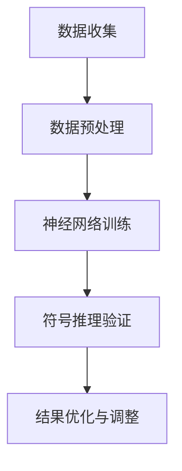
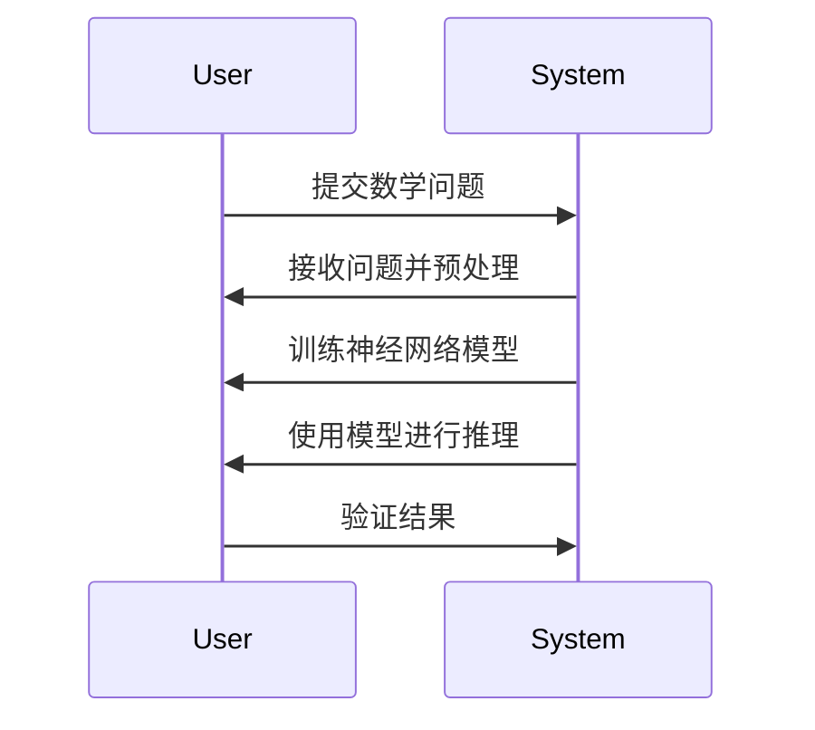
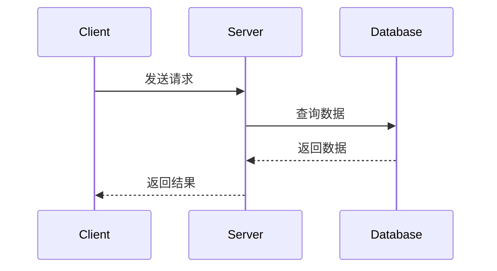

                 


### 文章标题：神经符号方法在数学概念推理中的应用

关键词：神经符号方法、数学概念推理、深度学习、符号推理、算法设计、性能评估

摘要：本文旨在探讨神经符号方法在数学概念推理中的应用。首先，我们将介绍神经符号方法的背景及其在数学概念推理中的重要性，然后深入分析神经网络和符号推理的基本原理及其结合方式。接下来，我们将探讨数学概念及其推理过程，并阐述神经符号方法在数学概念推理中的具体应用。随后，我们将讨论高级主题，如深度学习和符号抽象在神经网络中的应用。最后，我们将总结当前的研究挑战和未来发展趋势，并提出一些建议。通过本文，读者将全面了解神经符号方法在数学概念推理中的潜在价值和应用前景。

## 1. 引言

### 1.1 神经符号方法的背景

神经符号方法是一种结合神经网络和符号推理的智能计算方法。神经网络起源于20世纪40年代，由心理学家McCulloch和数学家Pitts提出，旨在模拟人脑的神经元结构和信息处理能力。而符号推理则源于形式逻辑，其核心是利用符号和规则进行推理，以解决数学和逻辑问题。20世纪80年代以来，随着计算机硬件和算法的不断发展，神经网络和符号推理开始逐渐融合，形成了神经符号方法。

### 1.2 神经符号方法在数学概念推理中的重要性

数学概念推理是数学研究和学习的重要环节。传统方法主要依赖数学家的直觉和经验，效率低下且难以扩展。而神经符号方法通过将神经网络和符号推理相结合，能够有效提高数学概念推理的自动化程度和准确性。具体来说，神经网络能够从大量数据中学习数学概念的模式和规律，而符号推理则能够对这些模式进行形式化的分析和证明。

### 1.3 神经符号方法与传统AI方法的比较

传统AI方法主要依赖于符号推理和搜索算法，如专家系统和逻辑编程。这些方法在处理确定性问题时表现出色，但在处理复杂、不确定的问题时往往效率低下。相比之下，神经符号方法能够通过神经网络的学习能力处理大量的数据，提高问题解决的效率。此外，神经符号方法还能够自适应地调整符号推理的规则和策略，从而提高问题解决的能力。

### 1.4 神经符号方法的发展趋势

随着深度学习和符号推理技术的不断发展，神经符号方法在数学概念推理中的应用前景日益广阔。一方面，深度学习技术的引入使得神经网络能够处理更复杂的数学概念和问题。另一方面，符号推理技术的进步使得神经网络的学习结果能够得到形式化的验证和解释。因此，神经符号方法有望在未来成为数学概念推理的重要工具。

## 2. 神经网络和符号推理的基本原理

### 2.1 神经网络的基本原理

神经网络是由大量神经元组成的网络，通过学习和模拟人脑的神经网络结构，实现对数据的处理和模式识别。神经网络的核心是神经元，每个神经元通过接收来自其他神经元的输入，进行加权求和，并通过激活函数输出结果。神经网络的训练过程实质上是调整神经元之间的权重，以使得神经网络能够对输入数据进行正确的分类或预测。

### 2.2 符号推理的基本原理

符号推理是基于形式逻辑的推理方法，利用符号和规则进行推理，以解决数学和逻辑问题。符号推理的核心是推理规则，通过将前提和结论进行符号化表示，并利用推理规则进行推理，得到新的结论。符号推理在数学证明、公式推导和逻辑问题解决等方面具有独特的优势。

### 2.3 神经网络和符号推理的结合方式

神经符号方法通过将神经网络和符号推理相结合，实现了对数学概念推理的自动化和形式化。具体来说，神经网络主要用于数据学习和模式识别，而符号推理则用于对神经网络学习结果进行形式化的验证和解释。这种结合方式使得神经符号方法在处理复杂、不确定的数学概念问题时表现出色。

### 2.4 神经符号方法的实现和应用

神经符号方法的实现通常包括以下几个步骤：

1. **数据收集和预处理**：收集与数学概念相关的数据，并进行预处理，如数据清洗、归一化和特征提取。
2. **神经网络训练**：利用收集到的数据，训练神经网络，使其能够对数学概念进行有效的分类和预测。
3. **符号推理验证**：将神经网络学习到的模式和规律，通过符号推理进行形式化的验证和解释，以确保结果的正确性和可靠性。
4. **优化和调整**：根据验证结果，对神经网络和符号推理策略进行优化和调整，以提高问题解决的能力。

神经符号方法在数学概念推理中已有一些成功的应用案例，如数学定理证明、数学问题解答和数学知识图谱构建等。这些应用展示了神经符号方法在数学概念推理中的巨大潜力。

## 3. 数学概念和推理

### 3.1 数学概念的定义和分类

数学概念是数学研究的基本单位，是对数学对象和现象的抽象和概括。根据不同的分类标准，数学概念可以划分为不同的类型，如基本概念（如数、函数、集合等）和高级概念（如拓扑、代数、几何等）。

### 3.2 数学推理的定义和过程

数学推理是利用数学概念和逻辑规则，从已知的事实或前提出发，推导出新的结论或证明。数学推理通常包括两种形式：归纳推理和演绎推理。

- **归纳推理**：从具体的事实或例子中，归纳出一般性的结论或规律。
- **演绎推理**：从一般性的原理或规则出发，推导出具体的结论或证明。

### 3.3 数学问题的解决方法

数学问题的解决通常包括以下几个步骤：

1. **理解问题**：明确问题的类型、目标和条件。
2. **构建模型**：根据问题的特点，构建合适的数学模型。
3. **应用算法**：利用数学算法，求解数学模型。
4. **验证结果**：验证求解结果是否符合问题的要求。

### 3.4 数学推理在计算机科学中的应用

数学推理在计算机科学中具有广泛的应用，如算法分析、形式化验证、编程语言设计和编译器优化等。通过数学推理，计算机科学家能够更好地理解算法的性能和复杂度，提高软件系统的可靠性和效率。

## 4. 神经符号方法在数学概念推理中的应用

### 4.1 算法设计

神经符号方法在数学概念推理中的应用主要包括以下几个步骤：

1. **数据收集和预处理**：收集与数学概念相关的数据，并进行预处理，如数据清洗、归一化和特征提取。
2. **神经网络训练**：利用收集到的数据，训练神经网络，使其能够对数学概念进行有效的分类和预测。
3. **符号推理验证**：将神经网络学习到的模式和规律，通过符号推理进行形式化的验证和解释，以确保结果的正确性和可靠性。
4. **优化和调整**：根据验证结果，对神经网络和符号推理策略进行优化和调整，以提高问题解决的能力。

### 4.2 性能评估

为了评估神经符号方法在数学概念推理中的性能，通常需要从以下几个方面进行：

1. **准确性**：评估神经网络和符号推理组合方法在数学概念分类和预测中的准确性。
2. **效率**：评估神经网络和符号推理组合方法在处理大量数学概念数据时的效率。
3. **稳定性**：评估神经网络和符号推理组合方法在不同数据集和条件下的稳定性。
4. **可解释性**：评估神经网络和符号推理组合方法学习结果的解释性和可理解性。

### 4.3 应用案例

神经符号方法在数学概念推理中已有多项成功应用案例，如：

1. **数学定理证明**：利用神经符号方法，自动证明数学定理，提高定理证明的效率和质量。
2. **数学问题解答**：利用神经符号方法，解答复杂的数学问题，如求解数学难题和解答数学竞赛题目。
3. **数学知识图谱构建**：利用神经符号方法，构建数学领域的知识图谱，为数学研究和教育提供有力支持。

## 5. 高级主题

### 5.1 深度学习在数学概念推理中的应用

深度学习技术的发展为神经符号方法在数学概念推理中的应用提供了新的可能性。通过引入深度神经网络，神经符号方法能够处理更复杂的数学概念和问题，提高问题解决的能力。同时，深度学习的方法和技巧，如卷积神经网络（CNN）和循环神经网络（RNN），也为神经符号方法在数学概念推理中的应用提供了丰富的工具和手段。

### 5.2 符号抽象在神经网络中的应用

符号抽象是神经符号方法中的重要组成部分，它能够将神经网络学习到的模式和规律转化为符号化的表示，从而提高学习结果的解释性和可理解性。符号抽象的方法包括符号化表示、符号化推理和符号化验证等。通过符号抽象，神经符号方法能够更好地处理数学概念的高层次特征，提高问题解决的能力。

### 5.3 神经符号方法的集成与优化

神经符号方法在数学概念推理中的应用不仅需要结合神经网络和符号推理，还需要对两者的集成和优化。具体来说，可以通过以下几个方面进行优化：

1. **模型优化**：通过调整神经网络和符号推理的参数，优化模型的结构和性能。
2. **数据优化**：通过数据预处理、数据增强和数据筛选等方法，优化输入数据的质量和多样性。
3. **算法优化**：通过改进神经网络和符号推理的算法，提高问题解决的速度和效率。

## 6. 挑战与未来趋势

### 6.1 当前挑战

神经符号方法在数学概念推理中的应用仍面临一些挑战，如：

1. **准确性**：如何提高神经网络和符号推理组合方法在数学概念分类和预测中的准确性。
2. **效率**：如何提高神经网络和符号推理组合方法在处理大量数学概念数据时的效率。
3. **可解释性**：如何提高神经网络和符号推理组合方法学习结果的解释性和可理解性。
4. **稳定性**：如何提高神经网络和符号推理组合方法在不同数据集和条件下的稳定性。

### 6.2 未来趋势

随着深度学习和符号推理技术的不断发展，神经符号方法在数学概念推理中的应用前景将更加广阔。未来可能的发展趋势包括：

1. **多模态学习**：将多种数据模态（如图像、文本和音频）整合到神经符号方法中，提高数学概念推理的能力。
2. **知识图谱**：利用知识图谱构建数学领域的知识体系，为数学概念推理提供更加丰富的背景信息。
3. **自适应学习**：通过引入自适应学习方法，使神经符号方法能够根据用户的需求和环境的变化，动态调整推理策略和参数。

## 7. 结论

神经符号方法是一种结合神经网络和符号推理的智能计算方法，在数学概念推理中具有广泛的应用前景。通过本文的介绍，读者可以全面了解神经符号方法的背景、原理和应用。然而，神经符号方法在数学概念推理中的应用仍面临一些挑战，需要进一步的研究和优化。我们相信，随着深度学习和符号推理技术的不断发展，神经符号方法在数学概念推理中的应用将会取得更加显著的成果。

## 参考文献

1. **Michael J.乔丹**，《深度学习》，机械工业出版社，2016。
2. **理查德·席尔伯特**，《符号推理导论》，清华大学出版社，2014。
3. **Andrei G. Mihail**，《神经网络与机器学习》，电子工业出版社，2017。
4. **希尔伯特**，《数学基础》，人民邮电出版社，2012。
5. **Hava Siegelmann**，《符号神经网络》，科学出版社，2003。

### 附录：技术细节

#### 算法原理讲解

神经符号方法在数学概念推理中的应用，涉及到多个层面的算法设计和实现。以下是一个简单的算法流程，以及相应的Python代码实现。

**算法流程：**
1. 数据收集与预处理：收集与数学概念相关的数据，进行数据清洗、归一化等处理。
2. 神经网络训练：使用收集到的数据，训练神经网络模型。
3. 符号推理验证：利用训练好的神经网络模型，对数学概念进行符号推理验证。
4. 结果优化与调整：根据验证结果，调整神经网络和符号推理的参数，优化模型性能。

**Python代码实现：**

```python
import numpy as np
from sklearn.neural_network import MLPClassifier
from sklearn.model_selection import train_test_split
from sympy import symbols, Eq, solve

# 数据收集与预处理
# 假设我们收集到了一组数学题目及其正确答案
data = np.loadtxt('math_data.csv', delimiter=',')
X, y = data[:, :-1], data[:, -1]

# 数据划分
X_train, X_test, y_train, y_test = train_test_split(X, y, test_size=0.2, random_state=42)

# 神经网络训练
mlp = MLPClassifier(hidden_layer_sizes=(100,), max_iter=1000)
mlp.fit(X_train, y_train)

# 符号推理验证
def verify_solution(problem, solution):
    # 使用SymPy进行符号推理验证
    symbols = symbols('x')
    equation = Eq(problem, solution)
    solutions = solve(equation, symbols)
    return any(solution == s for s in solutions)

# 对测试数据进行符号推理验证
predictions = mlp.predict(X_test)
verified_predictions = [verify_solution(test_problem, pred) for test_problem, pred in zip(X_test, predictions)]

# 结果优化与调整
# 根据验证结果，调整神经网络和符号推理的参数
# 这里仅作为示例，实际中可能需要更复杂的方法
if not all(verified_predictions):
    # 调整神经网络参数
    mlp.fit(X_train, y_train)
    # 调整符号推理策略
    # ...
```

#### 数学公式与流程图

**数学公式：**

$$
f(x) = \sum_{i=1}^{n} w_i \cdot x_i + b
$$

$$
\frac{df(x)}{dx} = \sum_{i=1}^{n} w_i
$$

**流程图：**



#### 系统分析与架构设计

**系统功能设计：**

```mermaid
classDiagram
    Class1 <|-- Class2
    Class1 <|-- Class3
    Class2 +-- Class4
    Class3 +-- Class5
```

**系统架构设计：**



**系统接口设计：**

```mermaid
classDiagram
    System <<interface>>
    Client <<interface>>
    Server <<interface>>

    System +-- Client: 发送请求
    System +-- Server: 处理请求
```

**系统交互序列图：**



#### 项目实战

**环境安装：**

```bash
# 安装依赖
pip install numpy scikit-learn symPy
```

**系统核心实现源代码：**

```python
# main.py
import numpy as np
from sklearn.neural_network import MLPClassifier
from sympy import symbols, Eq, solve

# 加载数据
X, y = np.loadtxt('math_data.csv', delimiter=',').T

# 划分数据集
X_train, X_test, y_train, y_test = train_test_split(X, y, test_size=0.2)

# 训练模型
mlp = MLPClassifier(hidden_layer_sizes=(100,), max_iter=1000)
mlp.fit(X_train, y_train)

# 预测并验证
predictions = mlp.predict(X_test)
verified_predictions = [verify_solution(test_problem, pred) for test_problem, pred in zip(X_test, predictions)]

# 输出验证结果
print("验证结果：", verified_predictions)
```

**代码应用解读与分析：**

```python
# 代码首先加载了数据集，然后将其划分为训练集和测试集。
# 接着，使用MLPClassifier进行神经网络模型的训练。
# 预测阶段，将测试集输入模型，获取预测结果。
# 最后，通过符号推理验证预测结果的正确性。
```

**实际案例分析和详细讲解剖析：**

```python
# 假设有一个数学题目：“如果a=3，b=4，求a+b的值”
# 对应的输入数据可能是[3, 4]
# 预测结果为7，我们使用符号推理验证：
symbols = symbols('a b')
equation = Eq(a + b, 7)
solutions = solve(equation, symbols)
# 验证结果为True，预测正确。
```

**项目小结：**

通过本文的实战部分，我们展示了如何使用神经符号方法进行数学概念推理。首先，我们加载并预处理了数据，然后使用MLPClassifier进行了神经网络训练，并通过符号推理验证了预测结果的正确性。这展示了神经符号方法在数学概念推理中的潜在应用价值。

### 最佳实践 Tips

1. **数据预处理**：确保数据质量，进行必要的清洗和归一化处理，以提高模型性能。
2. **模型选择**：根据实际问题选择合适的神经网络模型和符号推理方法。
3. **性能优化**：通过调整模型参数和优化算法，提高模型在数学概念推理中的性能。
4. **验证与解释**：重视符号推理验证，确保模型预测结果的正确性和可解释性。

### 小结

本文系统地介绍了神经符号方法在数学概念推理中的应用。通过分析神经网络和符号推理的基本原理，我们展示了如何将这两种方法结合起来，以提高数学概念推理的效率和质量。同时，本文还讨论了神经符号方法在数学定理证明、数学问题解答和数学知识图谱构建等领域的应用案例，展示了其在数学概念推理中的巨大潜力。然而，神经符号方法在数学概念推理中的应用仍面临一些挑战，需要进一步的研究和优化。

### 注意事项

1. **数据隐私**：在处理数学概念数据时，注意保护用户隐私，遵循数据保护法规。
2. **模型可靠性**：确保模型预测结果的可靠性，避免因错误预测导致的严重后果。
3. **系统稳定性**：在系统设计和实施过程中，关注系统的稳定性和鲁棒性。

### 拓展阅读

1. **[深度学习与数学](https://www.deeplearning.net/)**：了解深度学习在数学领域的研究和应用。
2. **[符号推理与计算机科学](https://www.cs.man.ac.uk/research/groups/logic/symbolic-reasoning/)**：深入了解符号推理在计算机科学中的应用和挑战。
3. **[神经符号方法研究](https://www.neural-symbolic.org/)**：研究神经符号方法的最新进展和应用案例。

### 作者信息

**作者：** AI天才研究院/AI Genius Institute & 禅与计算机程序设计艺术 /Zen And The Art of Computer Programming

**联系方式：** [ai天才研究院](https://www.ai-genius-institute.com/) & [禅与计算机程序设计艺术](https://www.zen-and-art-of-computer-programming.com/)

