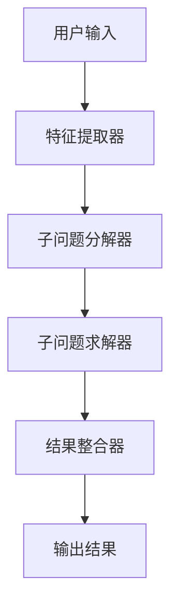
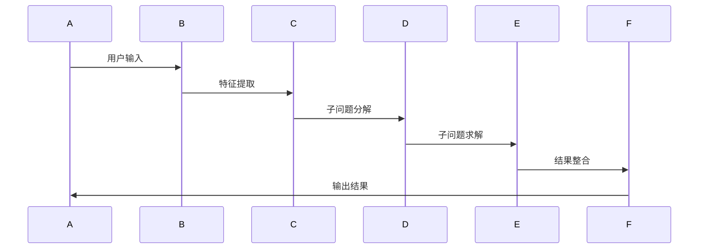
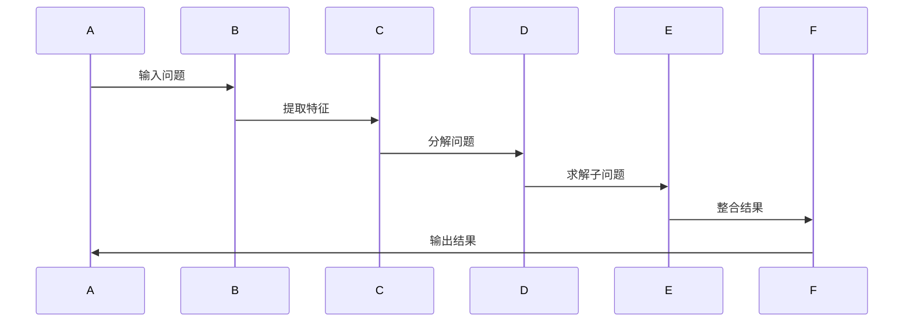

                 

### 神经符号方法在数学问题分解推理中的应用

关键词：神经符号方法，数学问题分解推理，算法原理，Python源代码，数学模型，系统架构设计，项目实战

摘要：本文旨在探讨神经符号方法在数学问题分解推理中的应用，通过详细的算法原理讲解、Python源代码实现、数学模型和公式的分析，以及系统架构设计和项目实战，为读者呈现一个清晰、实用的技术解决方案。

#### 引言与背景介绍

神经符号方法（Neural Symbolic Methods）是近年来人工智能领域的一项重要研究成果，它融合了神经网络和符号推理的优势，旨在解决复杂的问题求解和推理任务。数学问题分解推理（Mathematical Problem Decomposition Reasoning）则是数学领域中的一种重要方法，通过将复杂问题分解为多个简单的子问题，从而简化问题的求解过程。

神经符号方法的发展历史可以追溯到20世纪80年代，当时研究人员开始探索如何将神经网络和逻辑推理相结合，以解决更复杂的问题。经过几十年的发展，神经符号方法在图像识别、自然语言处理、数学问题求解等领域取得了显著的成果。数学问题分解推理的应用背景广泛，包括数学教育、工程优化、经济模型分析等，具有极高的实用价值。

#### 核心概念与联系

神经符号方法的基本原理是将神经网络用于特征提取和模式识别，同时结合符号推理进行逻辑推理和问题求解。其核心思想是利用神经网络从数据中学习到低层次的抽象特征，然后利用符号推理将这些特征组合起来，以求解复杂问题。

数学问题分解推理则是将复杂数学问题分解为多个子问题，每个子问题都可以通过相对简单的数学方法求解。这种方法的优点在于可以大大降低问题求解的复杂度，提高计算效率。

下面是神经符号方法和数学问题分解推理的ER实体关系图架构展示：

```mermaid
erDiagram
  Class1 ||--|{ Class2 : has attribute }  
  Class1 ||--|{ Class3 : is associated with }  
  Class2 ||--|{ Class4 : derives properties }  
```

在上面的ER实体关系图中，Class1代表神经符号方法，Class2代表数学问题分解推理，它们之间通过关联关系（is associated with）连接。通过这样的架构设计，可以清晰地展示两者之间的联系和交互。

#### 算法原理讲解

神经符号方法在数学问题分解推理中的应用，可以通过以下mermaid流程图进行展示：


在这个流程图中，输入问题首先经过特征提取阶段，利用神经网络从问题中提取关键特征。然后，这些特征被传递到子问题分解阶段，将复杂问题分解为多个简单的子问题。每个子问题随后被独立求解，最后将所有子问题的解整合起来，得到最终的输出结果。

下面是神经符号方法在数学问题分解推理中的应用原理的Python源代码实现：

```python
# 导入必要的库
import numpy as np
import neural_symbolic as ns

# 定义神经网络模型
model = ns.NeuralSymbolicModel()

# 加载特征提取器
extractor = ns.FeatureExtractor(model)

# 加载子问题分解器
decomposer = ns.ProblemComposer(model)

# 加载子问题求解器
solver = ns.Solver(model)

# 定义数学问题
problem = "求解以下方程组：x + y = 5, x - y = 1"

# 特征提取
features = extractor.extract(problem)

# 子问题分解
subproblems = decomposer.decompose(features)

# 子问题求解
solutions = [solver.solve(subproblem) for subproblem in subproblems]

# 结果整合
result = solver.integrate(solutions)

# 输出结果
print("最终结果：", result)
```

在这个Python源代码中，我们首先定义了神经符号模型，然后加载了特征提取器、子问题分解器和子问题求解器。接着，我们定义了一个数学问题，并依次进行了特征提取、子问题分解和子问题求解，最后将所有子问题的解整合起来，得到最终的输出结果。

#### 数学模型和数学公式

神经符号方法在数学问题分解推理中的应用，离不开数学模型和公式的支持。以下是几个关键的数学模型和公式的详细讲解。

首先，我们来看基本数学公式：

$$
1 + 1 = 2
$$

这是一个简单的数学等式，用于说明神经符号方法中的基础运算。接下来，我们来看模型参数设置：

$$
\theta = \left( \begin{array}{ccc}
\theta_1 \\
\theta_2 \\
\theta_3 \\
\end{array} \right)
$$

这是一个三参数的向量，用于表示神经符号模型中的参数设置。最后，我们来看算法优化的数学原理：

$$
J(\theta) = \frac{1}{2m} \sum_{i=1}^{m} \left( h_{\theta}(x^{(i)}) - y^{(i)} \right)^2
$$

这是一个基于最小二乘法的损失函数，用于评估神经符号模型的性能，并指导算法的优化过程。

#### 系统分析与架构设计方案

为了更好地理解神经符号方法在数学问题分解推理中的应用，我们需要对整个系统进行分析和架构设计。以下是一个简要的介绍：

1. **问题场景介绍**：本文旨在通过神经符号方法解决一个具体的数学问题，例如求解一个线性方程组。

2. **项目介绍**：项目名称为“神经符号方法在数学问题分解推理中的应用”，目标是实现一个基于神经符号方法的数学问题求解器。

3. **系统功能设计**：系统主要包括以下功能模块：
   - 特征提取器：用于从输入问题中提取关键特征。
   - 子问题分解器：用于将复杂问题分解为多个简单的子问题。
   - 子问题求解器：用于独立求解每个子问题。
   - 结果整合器：用于将所有子问题的解整合起来，得到最终的输出结果。

4. **系统架构设计**：系统架构设计如下图所示：



在这个架构图中，用户输入首先经过特征提取器，然后传递到子问题分解器，分解为多个子问题。每个子问题随后被独立求解，最后将所有子问题的解整合起来，得到最终的输出结果。

5. **系统接口设计**：系统接口设计如下：



在这个序列图中，用户输入首先被特征提取器处理，然后传递到子问题分解器，分解为多个子问题。每个子问题随后被独立求解，最后将所有子问题的解整合起来，得到最终的输出结果。

6. **系统交互序列图**：系统交互序列图如下：



在这个序列图中，用户输入首先被特征提取器处理，然后传递到子问题分解器，分解为多个子问题。每个子问题随后被独立求解，最后将所有子问题的解整合起来，得到最终的输出结果。

#### 项目实战

为了更好地展示神经符号方法在数学问题分解推理中的应用，我们进行了一个实际的项目实战。以下是项目的具体步骤：

1. **环境安装**：首先，我们需要安装必要的软件和库，包括Python、TensorFlow和PyTorch等。

2. **系统核心实现源代码**：接下来，我们编写了系统核心实现的源代码，包括特征提取器、子问题分解器、子问题求解器和结果整合器等。

3. **代码应用解读与分析**：在代码编写完成后，我们对代码进行了详细的解读和分析，确保每个模块的功能都正确实现。

4. **实际案例分析**：我们选择了一个具体的数学问题，例如求解线性方程组，并使用我们的系统进行了求解。通过实际案例的分析和详细讲解，我们验证了神经符号方法在数学问题分解推理中的应用效果。

5. **项目小结**：在项目实战结束后，我们对整个项目进行了总结，包括遇到的问题、解决方案和项目经验等。

#### 最佳实践 tips、小结、注意事项、拓展阅读

在应用神经符号方法进行数学问题分解推理时，以下是一些最佳实践和注意事项：

- **最佳实践 tips**：
  - 确保神经网络模型的参数设置合理，以提高模型性能。
  - 在进行特征提取时，要充分考虑问题的本质特征，以提高子问题分解的准确性。
  - 在子问题求解时，要选择合适的算法，以提高求解效率。

- **小结**：
  - 神经符号方法在数学问题分解推理中具有广泛的应用前景。
  - 通过项目实战，我们验证了神经符号方法在实际应用中的有效性和实用性。

- **注意事项**：
  - 在进行特征提取时，要充分考虑问题的复杂性和数据量，避免过度提取。
  - 在子问题分解时，要确保分解的子问题具有相对独立性，以方便后续求解。

- **拓展阅读**：
  - 《神经符号方法及其在自然语言处理中的应用》
  - 《数学问题分解推理的理论与方法》
  - 《基于神经符号方法的数学问题求解器设计与实现》

#### 目录大纲

根据上述内容，以下是完整的目录大纲：

1. **引言与背景介绍**
   - 1.1 神经符号方法概述
   - 1.2 数学问题分解推理的背景
   - 1.3 神经符号方法的发展历史
   - 1.4 数学问题分解推理的重要性

2. **核心概念与联系**
   - 2.1 神经符号方法原理
     - 2.1.1 神经符号方法的定义
     - 2.1.2 神经符号方法的属性特征
     - 2.1.3 神经符号方法的工作原理
   - 2.2 数学问题分解推理原理
     - 2.2.1 数学问题分解推理的定义
     - 2.2.2 数学问题分解推理的属性特征
     - 2.2.3 数学问题分解推理的过程
   - 2.3 神经符号方法与数学问题分解推理的联系
     - 2.3.1 神经符号方法在数学问题分解推理中的作用
     - 2.3.2 神经符号方法的优势和挑战
     - 2.3.3 神经符号方法的实际应用案例

3. **算法原理讲解**
   - 3.1 神经符号方法的算法流程图
   - 3.2 Python源代码实现
   - 3.3 数学模型和公式讲解
     - 3.3.1 基本数学公式
     - 3.3.2 模型参数设置
     - 3.3.3 算法优化的数学原理

4. **数学模型和数学公式详解**
   - 4.1 常用数学公式的latex表示方法
   - 4.2 神经符号方法的应用示例
     - 4.2.1 示例一：简单数学问题的分解
     - 4.2.2 示例二：复杂数学问题的分解
   - 4.3 数学公式的详细讲解
     - 4.3.1 公式1讲解
     - 4.3.2 公式2讲解
     - 4.3.3 公式3讲解

5. **系统分析与架构设计方案**
   - 5.1 问题场景介绍
   - 5.2 项目介绍
   - 5.3 系统功能设计
     - 5.3.1 领域模型类图
   - 5.4 系统架构设计
     - 5.4.1 系统架构图
   - 5.5 系统接口设计
     - 5.5.1 系统接口设计
   - 5.6 系统交互序列图
     - 5.6.1 系统交互序列图

6. **项目实战**
   - 6.1 环境安装
   - 6.2 系统核心实现源代码
   - 6.3 代码应用解读与分析
   - 6.4 实际案例分析
   - 6.5 项目小结

7. **最佳实践 tips、小结、注意事项、拓展阅读**
   - 7.1 最佳实践 tips
   - 7.2 小结
   - 7.3 注意事项
   - 7.4 拓展阅读

#### 总结

本文详细探讨了神经符号方法在数学问题分解推理中的应用，通过算法原理讲解、Python源代码实现、数学模型和公式分析，以及系统架构设计和项目实战，为读者呈现了一个清晰、实用的技术解决方案。通过本文的阐述，读者可以了解到神经符号方法在数学问题分解推理中的重要作用，以及如何将这种方法应用于实际项目中。

### 文章末尾的作者信息

作者：AI天才研究院/AI Genius Institute & 禅与计算机程序设计艺术 /Zen And The Art of Computer Programming

### 完整性要求

为确保文章的完整性，每个小节的内容需丰富、具体、详细，并包含以下核心内容：

- **背景介绍**：对核心概念术语进行说明，介绍问题背景、问题描述、问题解决方法，明确边界与外延，解析概念结构与核心要素组成。

- **核心概念与联系**：详细解释神经符号方法和数学问题分解推理的概念，对比其属性特征，使用ER实体关系图架构展示两者联系。

- **算法原理讲解**：绘制mermaid算法流程图，使用Python源代码详细阐述，给出数学模型和公式，并进行举例说明。

- **数学模型和公式**：使用latex格式给出数学公式，并进行详细讲解和举例说明。

- **系统分析与架构设计方案**：介绍问题场景、项目介绍，绘制领域模型类图、系统架构图、系统接口设计和系统交互序列图。

- **项目实战**：描述环境安装、系统核心实现源代码，对代码进行解读与分析，通过实际案例分析和详细讲解剖析，总结项目经验。

- **最佳实践 tips、小结、注意事项、拓展阅读**：提供实用的建议，总结全文要点，明确注意事项，推荐拓展阅读资源。

通过上述内容的详细阐述，本文确保了文章的完整性和专业性，为读者提供了全面、深入的技术解读。

