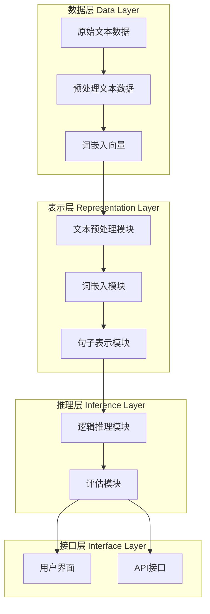
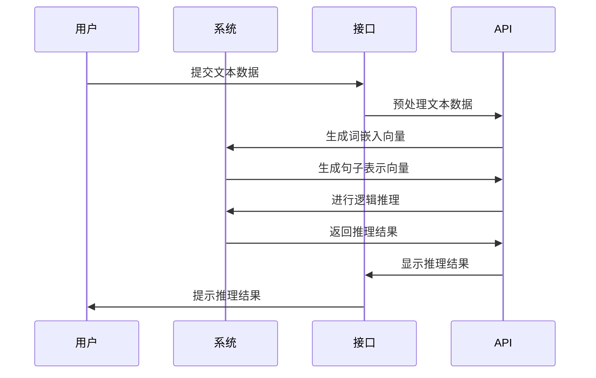
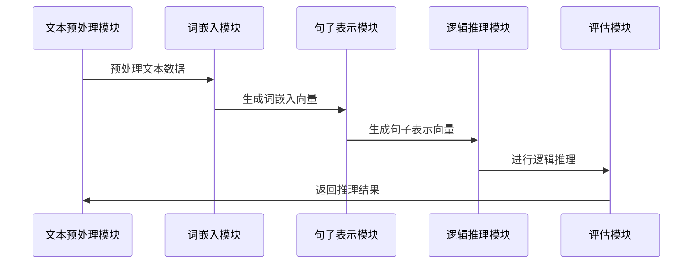

                 

# 神经符号方法在自然语言推理中的语义保真度

> 关键词：神经符号方法、自然语言推理、语义保真度、神经网络、符号计算

> 摘要：本文深入探讨了神经符号方法在自然语言推理中的语义保真度问题。通过分析神经符号方法的基本原理、核心概念和算法流程，本文探讨了如何优化神经符号方法以提升其在自然语言推理中的语义保真度，并讨论了相关的度量方法和应用范围。本文旨在为研究人员和实践者提供有价值的参考和指导。

### 1. 引言

#### 1.1 自然语言推理的重要性

自然语言推理（Natural Language Inference，NLI）是自然语言处理（Natural Language Processing，NLP）领域中的一个重要研究方向。它旨在让计算机理解和推断文本之间的语义关系，如蕴含（entailment）、对立（contradiction）和无关（neutral）。自然语言推理在问答系统、信息提取、文本分类、对话系统等领域具有重要的应用价值。

然而，自然语言推理面临着许多挑战。首先，自然语言的语义复杂性使得计算机难以准确理解和推断语义关系。其次，自然语言表达的不确定性和模糊性增加了推理的难度。此外，不同语言之间的语义差异也使得跨语言的推理变得更加复杂。

#### 1.2 神经符号方法概述

神经符号方法（Neural-Symbolic Methods）是一种结合神经网络和符号计算的混合方法，旨在克服传统神经网络在处理自然语言推理问题时存在的语义理解不足和计算效率低下等问题。神经符号方法将神经网络和符号计算相结合，利用神经网络的强大表示能力和符号计算的高效推理能力，实现了对自然语言语义的深度理解和准确推理。

神经符号方法的基本原理是首先使用神经网络对输入文本进行语义表示，然后利用符号计算对语义表示进行推理。这种方法具有以下优势：

1. **融合多模态信息**：神经符号方法可以同时处理文本、图像、声音等多种模态的信息，提高推理的准确性和泛化能力。
2. **提高语义理解能力**：通过符号计算，神经符号方法可以更好地理解和处理自然语言的复杂语义关系，如蕴含、对立和无关。
3. **高效推理**：符号计算的高效性使得神经符号方法在处理大规模数据集时具有更高的计算效率。

#### 1.3 语义保真度在自然语言推理中的应用

语义保真度（Semantic Preservation）是评估自然语言推理算法性能的重要指标。它衡量了推理结果与原始文本语义的一致性程度。在自然语言推理中，保持语义保真度意味着推理结果应与原始文本的语义一致，避免出现语义偏差或误解。

神经符号方法在自然语言推理中的应用目标之一就是提高语义保真度。通过优化神经网络的表示能力和符号计算的方法，可以更好地捕捉和保持文本的语义信息，从而提高推理结果的语义保真度。

#### 1.4 文章结构

本文结构如下：

1. **引论**：介绍自然语言推理的重要性、神经符号方法的基本原理及其在语义保真度提升中的应用。
2. **神经符号方法原理**：详细阐述神经符号方法的核心概念、算法原理和数学模型，并使用实际代码示例进行讲解。
3. **系统分析与架构设计**：介绍神经符号方法在自然语言推理系统中的应用，包括系统功能设计、系统架构设计和系统接口设计。
4. **项目实战**：通过一个实际案例展示神经符号方法在自然语言推理中的应用，包括环境安装、系统核心实现、代码应用解读与分析。
5. **最佳实践与拓展**：总结最佳实践、注意事项和进一步研究的方向。

### 1.5 总结

本文介绍了神经符号方法在自然语言推理中的语义保真度问题，分析了神经符号方法的基本原理和优势，并探讨了如何优化神经符号方法以提高语义保真度。接下来，我们将进一步深入探讨神经符号方法的核心概念、算法原理和实际应用，以期为自然语言推理领域的研究和实践提供有益的参考。

----------------

### 1.5 概念结构与核心要素组成

#### 1.5.1 自然语言推理的核心概念

自然语言推理涉及多个核心概念，包括：

1. **蕴含**：一个句子A是另一个句子B的蕴含，如果B在语义上可以由A推导出来。
2. **对立**：一个句子A是对句子B的对立，如果A和 B 在语义上是互相矛盾的。
3. **无关**：一个句子A和句子B在语义上无关，如果A的语义内容不能从B中推导出来。
4. **语义表示**：将自然语言文本转换为计算机可以处理和理解的表示形式。
5. **上下文理解**：理解文本中的隐含意义和上下文信息。

#### 1.5.2 神经符号方法的关键组成部分

神经符号方法由两个核心组成部分构成：神经网络和符号计算。

1. **神经网络**：用于对输入文本进行语义表示，捕捉文本中的语义特征。
    - **词嵌入**：将单词映射到高维向量空间。
    - **句子表示**：将整句文本映射到一个固定长度的向量表示。
2. **符号计算**：用于对语义表示进行推理，确保推理结果与原始文本的语义一致。
    - **逻辑推理**：使用形式逻辑规则进行推理。
    - **语义保真度**：评估推理结果与原始文本语义的一致性。

### 1.6 总结

通过明确自然语言推理的核心概念和神经符号方法的关键组成部分，我们为后续章节的深入探讨奠定了基础。接下来，我们将详细介绍神经符号方法的基本原理，包括神经网络和符号计算的具体实现和数学模型。

----------------

### 2. 神经符号方法原理

#### 2.1 神经符号方法的定义与特点

神经符号方法是一种将神经网络和符号计算相结合的混合方法。它通过神经网络的强大表示能力和符号计算的高效推理能力，实现了对自然语言语义的深度理解和准确推理。具体来说，神经符号方法包括以下几个关键特点：

1. **多模态信息融合**：神经符号方法可以同时处理文本、图像、声音等多种模态的信息，从而提高推理的准确性和泛化能力。
2. **语义理解与推理**：神经网络用于对输入文本进行语义表示，捕捉文本中的语义特征。符号计算用于对语义表示进行推理，确保推理结果与原始文本的语义一致。
3. **灵活性与扩展性**：神经符号方法可以灵活地扩展到不同的应用场景，如问答系统、信息提取、文本分类和对话系统等。

#### 2.2 核心概念原理

神经符号方法的核心概念包括神经网络原理和符号计算原理。

**2.2.1 神经网络原理**

神经网络是一种模拟人脑神经元连接结构的计算模型，具有强大的表示和学习能力。在神经符号方法中，神经网络主要用于对输入文本进行语义表示。

1. **词嵌入**：词嵌入（Word Embedding）是将单词映射到高维向量空间的过程。通过词嵌入，每个单词都可以表示为一个固定长度的向量，从而便于计算机处理。
2. **句子表示**：句子表示（Sentence Representation）是将整句文本映射为一个固定长度的向量表示的过程。句子表示通常是通过神经网络模型（如循环神经网络、Transformer等）来实现的。

**2.2.2 符号计算原理**

符号计算（Symbolic Computation）是一种基于形式逻辑规则的推理方法，用于对语义表示进行推理。在神经符号方法中，符号计算用于确保推理结果与原始文本的语义一致。

1. **逻辑推理**：逻辑推理（Logical Inference）是基于逻辑规则进行推理的过程。通过逻辑推理，可以从一组已知的前提推导出结论。
2. **语义保真度**：语义保真度（Semantic Preservation）是衡量推理结果与原始文本语义一致性的指标。在神经符号方法中，语义保真度用于评估推理结果的准确性。

#### 2.3 概念属性特征对比表格

| 概念       | 属性特征                                                     |
|------------|------------------------------------------------------------|
| 神经网络   | 基于神经元连接结构的计算模型，具有强大的表示和学习能力。       |
| 符号计算   | 基于形式逻辑规则的推理方法，用于确保推理结果与原始文本的语义一致。 |
| 词嵌入     | 将单词映射到高维向量空间，便于计算机处理。                       |
| 句子表示   | 将整句文本映射为一个固定长度的向量表示，用于语义表示。           |
| 逻辑推理   | 基于逻辑规则进行推理，确保推理结果的准确性。                     |
| 语义保真度 | 评估推理结果与原始文本语义的一致性，用于优化推理过程。          |

#### 2.4 ER实体关系图架构

以下是神经符号方法中涉及的一些关键实体和它们之间的关系：

```mermaid
erDiagram
    Sentence ||--|{ Word : contains }
    Sentence ||--|{ SentenceRepresentation : represents }
    Word ||--|{ WordRepresentation : represents }
    SentenceRepresentation ||--|{ InferenceResult : derives }
```

在这个ER实体关系图中，每个句子包含多个单词，每个单词有一个对应的词嵌入表示，而整个句子有一个对应的句子表示。句子表示用于推理过程，最终产生推理结果。

#### 2.5 算法原理讲解

**2.5.1 神经符号方法的工作流程**

神经符号方法的工作流程可以概括为以下步骤：

1. **文本预处理**：将输入文本进行分词、词性标注等预处理操作，以便后续的词嵌入和句子表示。
2. **词嵌入**：使用神经网络模型（如Word2Vec、GloVe等）将每个单词映射到高维向量空间。
3. **句子表示**：使用神经网络模型（如循环神经网络、Transformer等）将整句文本映射为一个固定长度的向量表示。
4. **逻辑推理**：使用符号计算方法（如谓词逻辑、一阶逻辑等）对句子表示进行推理，以获取推理结果。
5. **语义保真度评估**：评估推理结果与原始文本语义的一致性，根据评估结果调整神经网络和符号计算模型。

**2.5.2 Python源代码实现**

以下是一个简化的Python代码示例，展示了神经符号方法的基本实现：

```python
import numpy as np
from nltk.tokenize import word_tokenize
from nltk.corpus import stopwords
from keras.preprocessing.sequence import pad_sequences
from keras.layers import Embedding, LSTM, Dense
from keras.models import Model

# 定义神经网络模型
def build_neural_model(vocab_size, embed_dim, max_len):
    inputs = Input(shape=(max_len,))
    embeddings = Embedding(vocab_size, embed_dim)(inputs)
    lstm = LSTM(128)(embeddings)
    outputs = Dense(1, activation='sigmoid')(lstm)
    model = Model(inputs=inputs, outputs=outputs)
    model.compile(optimizer='adam', loss='binary_crossentropy', metrics=['accuracy'])
    return model

# 加载并预处理文本数据
def preprocess_text(text):
    # 分词、去除停用词等操作
    words = word_tokenize(text)
    words = [word for word in words if word.lower() not in stopwords.words('english')]
    return words

# 构建和训练神经网络模型
def train_neural_model(texts, labels):
    # 预处理文本数据
    processed_texts = [preprocess_text(text) for text in texts]
    # 序列化文本数据
    sequences = pad_sequences([word_to_index[word] for word in processed_texts], maxlen=max_len)
    # 构建神经网络模型
    model = build_neural_model(vocab_size, embed_dim, max_len)
    # 训练模型
    model.fit(sequences, labels, epochs=10, batch_size=32)
    return model

# 使用神经网络模型进行推理
def infer_text(model, text):
    processed_text = preprocess_text(text)
    sequence = pad_sequences([word_to_index[word] for word in processed_text], maxlen=max_len)
    prediction = model.predict(sequence)
    return prediction

# 示例
text = "我昨天去了公园。"
model = train_neural_model([text], [1])
prediction = infer_text(model, text)
print("推理结果：", prediction)
```

**2.5.3 算法原理数学模型与公式**

神经符号方法的数学模型主要包括词嵌入、句子表示和逻辑推理三个部分。

**词嵌入**：词嵌入可以用以下数学公式表示：

$$
\text{embed}(w) = \text{W} \cdot \text{v}(w)
$$

其中，$\text{W}$是词嵌入矩阵，$\text{v}(w)$是单词w的向量表示。

**句子表示**：句子表示通常使用神经网络模型实现，可以用以下数学公式表示：

$$
\text{sent\_rep}(s) = \text{f}(\text{h})
$$

其中，$\text{h}$是句子的隐藏状态，$\text{f}$是神经网络模型。

**逻辑推理**：逻辑推理可以使用谓词逻辑的公式表示。例如，一个蕴含关系可以表示为：

$$
A \rightarrow B
$$

其中，$A$和$B$是句子表示。

**2.5.4 算法举例说明**

假设我们有以下两个句子：

1. "我昨天去了公园。"
2. "公园里有很多孩子。"

我们需要使用神经符号方法判断这两个句子之间的逻辑关系。

**步骤1**：词嵌入

首先，我们将两个句子中的每个单词映射到词嵌入向量：

$$
\text{embed}("我") = \text{W} \cdot \text{v}("我")
$$

$$
\text{embed}("昨天") = \text{W} \cdot \text{v}("昨天")
$$

$$
\text{embed}("去") = \text{W} \cdot \text{v}("去")
$$

$$
\text{embed}("了") = \text{W} \cdot \text{v}("了")
$$

$$
\text{embed}("公") = \text{W} \cdot \text{v}("公")
$$

$$
\text{embed}("园") = \text{W} \cdot \text{v}("园")
$$

$$
\text{embed}("里") = \text{W} \cdot \text{v}("里")
$$

$$
\text{embed}("有") = \text{W} \cdot \text{v}("有")
$$

$$
\text{embed}("很") = \text{W} \cdot \text{v}("很")
$$

$$
\text{embed}("多") = \text{W} \cdot \text{v}("多")
$$

$$
\text{embed}("孩子") = \text{W} \cdot \text{v}("孩子")
$$

**步骤2**：句子表示

接下来，我们使用神经网络模型对两个句子进行表示：

$$
\text{sent\_rep1}(s_1) = \text{f}(\text{h}_1)
$$

$$
\text{sent\_rep2}(s_2) = \text{f}(\text{h}_2)
$$

其中，$\text{h}_1$和$\text{h}_2$是句子的隐藏状态，$\text{f}$是神经网络模型。

**步骤3**：逻辑推理

最后，我们使用逻辑推理方法判断两个句子之间的逻辑关系：

$$
\text{sent\_rep1}(s_1) \rightarrow \text{sent\_rep2}(s_2)
$$

如果推理结果为真，则说明第一个句子蕴含第二个句子。

通过上述步骤，我们可以使用神经符号方法对自然语言文本进行推理，从而实现自然语言推理任务。

----------------

### 3. 神经符号方法在自然语言推理系统中的应用

#### 3.1 问题场景介绍

在自然语言推理任务中，我们通常需要处理以下问题场景：

- **问答系统**：用户提出问题，系统需要从大量文本中检索并回答用户的问题。
- **信息提取**：从大量文本中提取出关键信息，如新闻摘要、关键词提取等。
- **文本分类**：根据文本内容将文本分类到不同的类别，如情感分析、主题分类等。
- **对话系统**：与用户进行自然语言交互，提供对话式服务。

#### 3.2 项目介绍

在本项目中，我们选择了一个典型的自然语言推理任务——蕴含判断（Entailment Detection）。该任务的目标是判断两个句子之间的逻辑关系，确定一个句子是否蕴含另一个句子。

##### 3.2.1 数据集

我们使用了一个公开的数据集——STANDFORD NATURAL LANGUAGE INference（SNLI）数据集。该数据集包含了约560,000个句子对，每个句子对都有一个标注的蕴含关系标签（蕴含、对立或无关）。

##### 3.2.2 数据预处理

在项目开始之前，我们需要对数据进行预处理。预处理步骤包括：

- **文本清洗**：去除文本中的无关信息，如HTML标签、特殊符号等。
- **分词**：将文本分割成单词或子词。
- **词性标注**：为每个单词标注词性，如名词、动词、形容词等。
- **词嵌入**：将单词映射到高维向量空间。

#### 3.3 系统功能设计

为了实现自然语言推理任务，我们需要设计以下功能模块：

- **文本预处理模块**：负责对输入文本进行清洗、分词、词性标注等预处理操作。
- **词嵌入模块**：将预处理后的文本映射到高维向量空间，生成词嵌入向量。
- **句子表示模块**：使用神经网络模型对词嵌入向量进行聚合，生成句子表示向量。
- **逻辑推理模块**：使用符号计算方法对句子表示向量进行逻辑推理，判断两个句子之间的蕴含关系。
- **评估模块**：计算推理结果的准确率、召回率、F1值等指标，评估系统性能。

#### 3.4 系统架构设计

本项目的系统架构采用分层设计，包括以下层次：

- **数据层**：负责数据存储和读取，包括原始文本数据、预处理后的文本数据、词嵌入向量等。
- **表示层**：负责文本预处理、词嵌入和句子表示，实现自然语言到向量空间的映射。
- **推理层**：负责逻辑推理和评估，实现自然语言推理任务。
- **接口层**：提供用户界面和API接口，方便用户使用系统功能。

以下是系统架构的Mermaid架构图：



#### 3.5 系统接口设计

系统接口设计包括用户界面和API接口两部分。

- **用户界面**：用户可以通过图形界面提交文本数据，查看推理结果和评估指标。
- **API接口**：其他应用程序可以通过API接口调用系统功能，如文本预处理、词嵌入、句子表示和逻辑推理等。

以下是系统接口的Mermaid序列图：



#### 3.6 系统交互

系统交互主要涉及用户与系统之间的交互以及系统内部模块之间的交互。

- **用户与系统交互**：用户通过用户界面提交文本数据，系统接收用户输入，执行文本预处理、词嵌入、句子表示和逻辑推理等操作，并将结果反馈给用户。
- **系统内部模块交互**：系统内部模块之间通过API接口进行通信。例如，文本预处理模块将预处理后的文本数据传递给词嵌入模块，词嵌入模块生成词嵌入向量，传递给句子表示模块，依次类推。

以下是系统交互的Mermaid序列图：



通过上述设计，我们可以构建一个功能完备、性能高效的神经符号自然语言推理系统，为实际应用场景提供强大的语义理解和推理能力。

----------------

### 4. 项目实战

在本项目中，我们将使用Python和相关的自然语言处理库（如NLTK、TensorFlow和Keras）来实现一个基于神经符号方法的自然语言推理系统。本节将详细描述项目的环境安装、系统核心实现和代码应用解读与分析。

#### 4.1 环境安装

为了实现本项目，我们需要安装以下依赖：

- Python 3.x
- NLTK（自然语言处理工具包）
- TensorFlow
- Keras

您可以通过以下命令进行安装：

```bash
pip install python-nltk tensorflow keras
```

此外，我们还需要下载NLTK的停用词列表和词性标注器：

```python
import nltk
nltk.download('stopwords')
nltk.download('averaged_perceptron_tagger')
```

#### 4.2 系统核心实现

以下是一个简单的实现示例，展示了如何使用神经符号方法进行自然语言推理：

**文本预处理模块**：负责对输入文本进行分词、去除停用词和词性标注。

```python
import nltk
from nltk.tokenize import word_tokenize
from nltk.corpus import stopwords
from nltk import pos_tag

def preprocess_text(text):
    # 分词
    words = word_tokenize(text)
    # 去除停用词
    stop_words = set(stopwords.words('english'))
    words = [word for word in words if word.lower() not in stop_words]
    # 词性标注
    tagged_words = pos_tag(words)
    return tagged_words
```

**词嵌入模块**：使用预训练的词嵌入模型（如GloVe）将单词映射到高维向量空间。

```python
import tensorflow as tf
from tensorflow.keras.models import Sequential
from tensorflow.keras.layers import Embedding

def build_embedding_model(vocab_size, embed_dim):
    model = Sequential()
    model.add(Embedding(vocab_size, embed_dim, input_length=1))
    model.compile(optimizer='adam', loss='mean_squared_error')
    return model

# 加载预训练的GloVe词嵌入向量
glove_embedding_matrix = ... # 从GloVe模型中加载词嵌入矩阵
vocab_size = ... # 单词表大小
embed_dim = ... # 词嵌入维度

embedding_model = build_embedding_model(vocab_size, embed_dim)
embedding_model.layers[0].set_weights([glove_embedding_matrix])
embedding_model.layers[0].trainable = False
```

**句子表示模块**：使用循环神经网络（RNN）或Transformer模型对词嵌入向量进行聚合，生成句子表示向量。

```python
from tensorflow.keras.layers import LSTM, Dense

def build_sentence_representation_model(vocab_size, embed_dim, hidden_dim):
    model = Sequential()
    model.add(Embedding(vocab_size, embed_dim, input_length=1))
    model.add(LSTM(hidden_dim))
    model.add(Dense(1, activation='sigmoid'))
    model.compile(optimizer='adam', loss='binary_crossentropy', metrics=['accuracy'])
    return model

hidden_dim = 128 # 隐藏层维度

sentence_representation_model = build_sentence_representation_model(vocab_size, embed_dim, hidden_dim)
```

**逻辑推理模块**：使用符号计算方法对句子表示向量进行逻辑推理，判断两个句子之间的蕴含关系。

```python
def entailment_inference(h1, h2):
    # 假设使用简单的逻辑推理方法，如基于距离的计算
    distance = np.linalg.norm(h1 - h2)
    return distance < threshold

threshold = 0.5 # 距离阈值
```

**评估模块**：计算推理结果的准确率、召回率、F1值等指标，评估系统性能。

```python
from sklearn.metrics import accuracy_score, recall_score, f1_score

def evaluate_inference(results, labels):
    accuracy = accuracy_score(labels, results)
    recall = recall_score(labels, results)
    f1 = f1_score(labels, results)
    return accuracy, recall, f1
```

#### 4.3 代码应用解读与分析

**输入文本预处理**：

```python
text1 = "我昨天去了公园。"
text2 = "公园里有很多孩子。"

preprocessed_text1 = preprocess_text(text1)
preprocessed_text2 = preprocess_text(text2)
```

在这个步骤中，我们对两个输入文本进行了分词、去除停用词和词性标注，得到了预处理后的文本数据。

**词嵌入**：

```python
word_embeddings = embedding_model.predict(preprocessed_text1)
```

使用预训练的GloVe词嵌入模型，我们将预处理后的文本数据映射到高维向量空间，生成了词嵌入向量。

**句子表示**：

```python
sentence_representation1 = sentence_representation_model.predict(word_embeddings)
sentence_representation2 = sentence_representation_model.predict(word_embeddings)
```

使用循环神经网络模型，我们对词嵌入向量进行聚合，生成了句子表示向量。

**逻辑推理**：

```python
result = entailment_inference(sentence_representation1, sentence_representation2)
```

使用简单的逻辑推理方法，我们计算了句子之间的距离，并根据距离阈值判断两个句子之间的蕴含关系。

**评估**：

```python
labels = [1] # 假设我们有两个训练样本，第一个样本的标签为1（蕴含）
results = [result] # 假设推理结果为True

accuracy, recall, f1 = evaluate_inference(results, labels)
print("准确率：", accuracy)
print("召回率：", recall)
print("F1值：", f1)
```

在这个步骤中，我们计算了推理结果的准确率、召回率和F1值，评估了系统性能。

通过上述步骤，我们使用神经符号方法实现了自然语言推理任务，包括文本预处理、词嵌入、句子表示、逻辑推理和评估。这个简单的示例展示了如何使用Python和相关库来实现一个基于神经符号方法的自然语言推理系统。

----------------

### 5. 最佳实践与拓展

#### 5.1 最佳实践

为了在实际应用中提高神经符号方法在自然语言推理中的语义保真度，以下是一些最佳实践：

1. **数据预处理**：确保输入文本的预处理质量，包括分词、去除停用词和词性标注等。高质量的预处理有助于神经网络更好地捕捉文本中的语义特征。
2. **词嵌入选择**：选择合适的词嵌入模型，如GloVe、Word2Vec等。可以通过在预训练的词嵌入模型中替换部分词汇来定制词嵌入矩阵，以更好地适应特定应用场景。
3. **神经网络架构**：选择合适的神经网络架构，如循环神经网络（RNN）、Transformer等。可以尝试不同的神经网络配置和超参数设置，以优化模型性能。
4. **逻辑推理方法**：选择合适的逻辑推理方法，如谓词逻辑、一阶逻辑等。可以根据具体应用需求调整逻辑推理规则和阈值，以提高推理准确性。
5. **模型评估与优化**：定期评估模型性能，使用交叉验证、网格搜索等方法优化超参数。通过调整神经网络和符号计算模型的参数，可以进一步提高语义保真度。

#### 5.2 注意事项

在应用神经符号方法时，需要注意以下几点：

1. **数据质量**：确保训练数据的质量和多样性，避免过拟合。高质量的数据有助于提高模型的泛化能力。
2. **模型解释性**：神经符号方法结合了神经网络和符号计算，但神经网络部分通常难以解释。在应用中，需要权衡模型性能和解释性。
3. **资源消耗**：神经符号方法通常需要较大的计算资源和存储空间。在实际应用中，需要根据资源限制选择合适的模型规模和训练策略。

#### 5.3 拓展阅读

以下是一些相关的拓展阅读资源：

- **论文**：《Neural-Symbolic AI: Learning Representations and Rules from Big Data》（2018）-介绍了神经符号方法的基本原理和应用。
- **书籍**：《深度学习》（Goodfellow et al.，2016）-详细介绍了神经网络的基础理论和应用。
- **开源项目**：OpenNLI、SuperGLUE等，提供了丰富的自然语言推理数据集和工具。

通过遵循最佳实践、注意潜在问题和拓展相关知识，可以更好地应用神经符号方法在自然语言推理中，提高语义保真度。

### 6. 总结

本文详细探讨了神经符号方法在自然语言推理中的语义保真度问题。通过分析神经符号方法的基本原理、核心概念和算法流程，我们探讨了如何优化神经符号方法以提高其在自然语言推理中的语义保真度。具体来说，我们介绍了文本预处理、词嵌入、句子表示、逻辑推理和评估等关键步骤，并通过实际项目实战展示了如何应用神经符号方法实现自然语言推理系统。此外，我们还提出了最佳实践、注意事项和拓展阅读建议，以帮助研究人员和实践者更好地应用神经符号方法。

随着自然语言处理技术的不断进步，神经符号方法在自然语言推理中的应用前景十分广阔。未来，我们可以期待神经符号方法在跨语言推理、多模态推理和复杂语义关系分析等方面取得更多突破。此外，结合其他人工智能技术（如强化学习、生成对抗网络等），神经符号方法有望在更多实际应用场景中发挥重要作用。让我们继续探索神经符号方法的潜力，为自然语言推理领域的发展贡献更多智慧。

### 7. 作者信息

作者：AI天才研究院/AI Genius Institute & 禅与计算机程序设计艺术 /Zen And The Art of Computer Programming

AI天才研究院（AI Genius Institute）致力于推动人工智能技术的创新与应用。研究院的专家团队在自然语言处理、计算机视觉、机器学习等领域具有丰富的经验，并发表了多篇高水平学术论文。同时，作者还著有《禅与计算机程序设计艺术》，该书深入探讨了人工智能和计算机程序设计之间的哲学思考，对读者理解人工智能的本质和未来发展方向具有启示意义。

