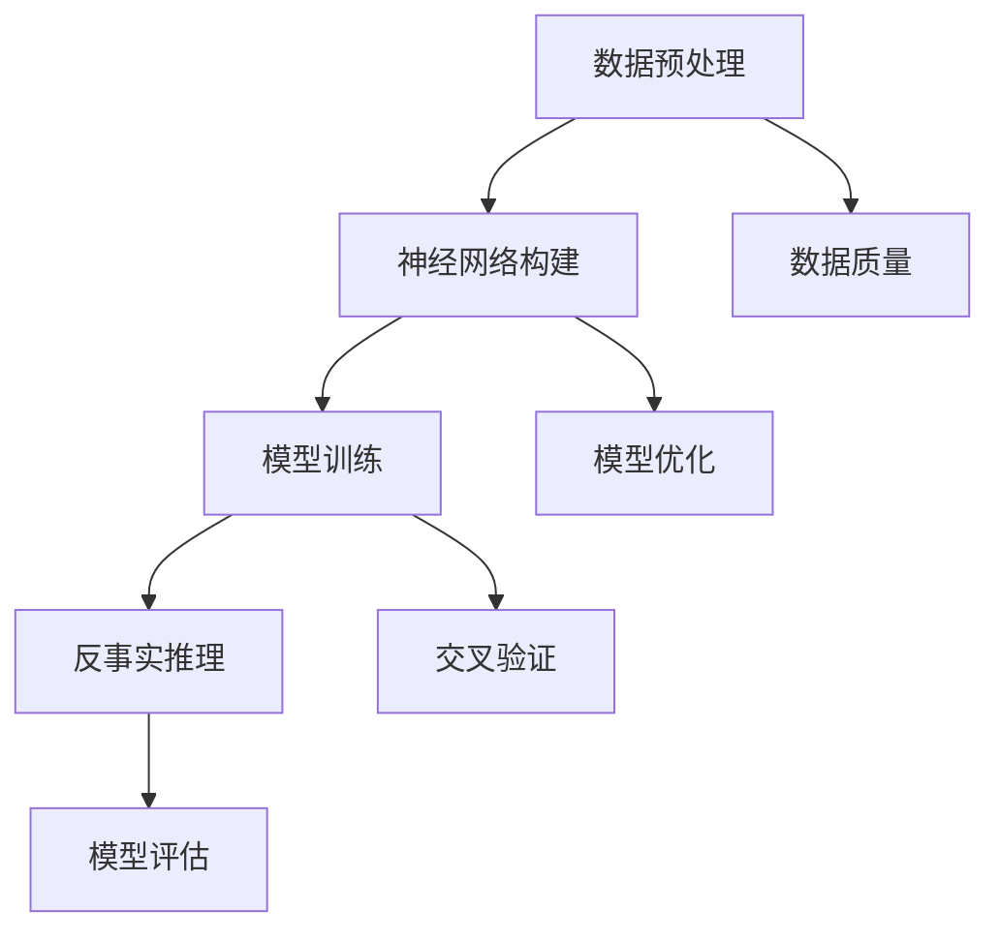
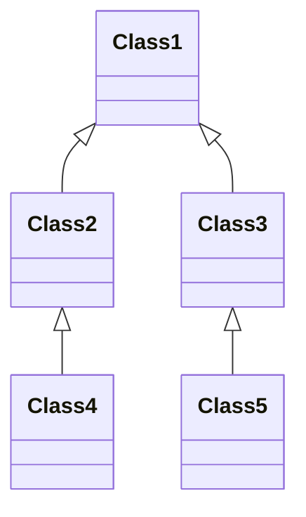
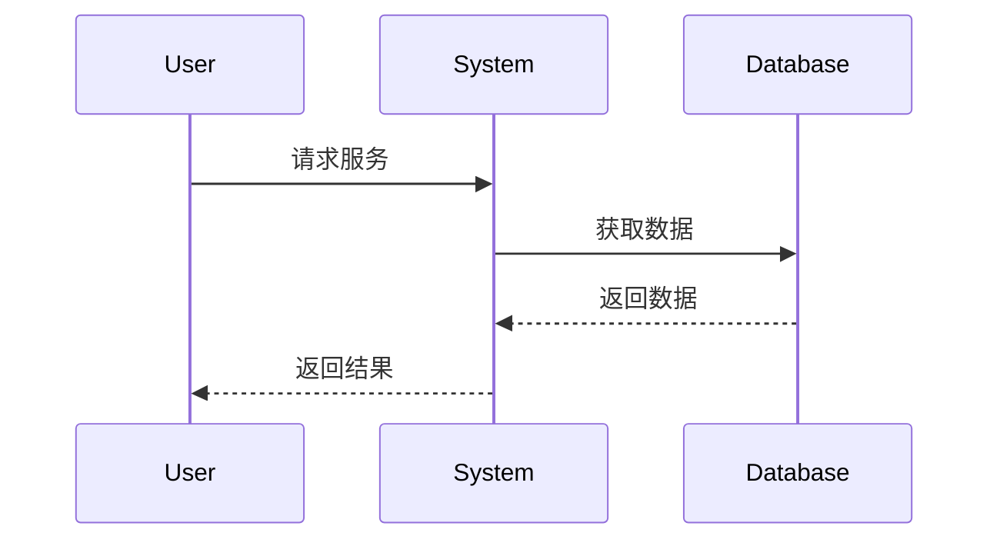
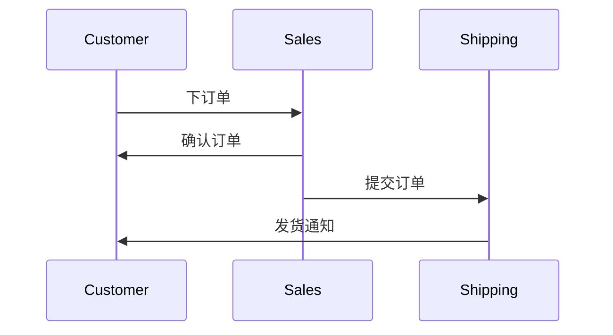

                 

# 神经符号方法增强AI的反事实推理能力

> 关键词：神经符号方法、反事实推理、AI、神经网络、符号逻辑、推理能力、增强学习

> 摘要：本文将深入探讨神经符号方法在增强人工智能（AI）反事实推理能力方面的应用。首先，我们将介绍神经符号方法和反事实推理的基本概念，然后分析两者结合的优势。接着，我们将通过具体案例展示神经符号方法如何提升AI的反事实推理能力。最后，我们将讨论未来发展趋势和面临的挑战，并给出一些实践建议。

## 引言

随着深度学习和神经网络在人工智能（AI）领域的广泛应用，AI在图像识别、自然语言处理等领域取得了显著的成果。然而，AI在推理能力方面仍存在局限性，尤其是在处理复杂逻辑和抽象问题时。反事实推理作为一种高级认知能力，在现实世界的决策和问题解决中起着重要作用。如何增强AI的反事实推理能力，成为当前研究的热点。

神经符号方法结合了神经计算和符号逻辑的优势，为提升AI的推理能力提供了一种新的思路。本文旨在探讨神经符号方法在增强AI反事实推理能力方面的应用，通过分析基本概念、优势、结合机制以及实际应用案例，为相关研究提供参考。

## 背景介绍

### 神经符号方法概述

神经符号方法（Neural-Symbolic Methods）是一种将神经计算与符号逻辑相结合的方法。神经计算以神经网络为基础，通过大规模的分布式计算实现对数据的自动学习和表征。符号逻辑则是一种基于形式化逻辑的方法，通过推理和符号操作实现对知识的表示和处理。

神经符号方法的核心思想是将神经网络与符号逻辑相结合，以发挥各自的优势。神经网络擅长处理复杂的输入数据，提取高维特征；符号逻辑则擅长处理逻辑关系，进行推理和知识表示。通过将两者结合，可以实现对数据的深层理解和逻辑推理。

### 反事实推理的基本概念

反事实推理（Counterfactual Reasoning）是一种高级认知能力，涉及对与现实情况相反的假设情景进行推理。反事实推理在现实世界的决策和问题解决中具有重要意义，例如在医疗诊断、金融分析、城市规划等领域。

反事实推理的基本概念包括：

1. **假设场景**：构建一个与现实情况相反的假设场景。
2. **因果关系**：分析假设场景中的因果关系，确定因果链。
3. **逻辑推理**：基于假设场景和因果关系进行逻辑推理，得出结论。

反事实推理的关键在于能够从不同的视角和假设出发，对问题进行多角度分析和推理，从而提供更全面、深入的决策支持。

### 神经符号方法与反事实推理的结合

神经符号方法与反事实推理的结合，旨在发挥两者在处理数据和信息方面的优势，以提升AI的推理能力。具体来说，神经符号方法可以用于处理输入数据，提取高维特征，并将其转化为符号逻辑表示；而符号逻辑则可以用于处理逻辑关系，进行推理和知识表示。

### 结合机制

神经符号方法与反事实推理的结合机制主要包括以下几个步骤：

1. **数据预处理**：使用神经网络对输入数据进行预处理，提取高维特征。
2. **特征转换**：将提取的高维特征转化为符号逻辑表示。
3. **逻辑推理**：基于符号逻辑表示，进行反事实推理。
4. **结果评估**：对推理结果进行评估，优化神经符号方法的性能。

通过这种结合机制，神经符号方法可以更好地处理复杂的输入数据，提取关键信息；而反事实推理则可以基于这些信息进行逻辑推理，提供更准确的决策支持。

## 神经符号方法概述

### 起源与发展

神经符号方法最早可以追溯到20世纪80年代，当时神经网络和符号逻辑分别独立发展。随着深度学习技术的发展，神经符号方法逐渐受到关注。近年来，随着计算能力和数据规模的提升，神经符号方法在人工智能领域取得了显著的成果。

### 核心概念

神经符号方法的核心概念包括：

1. **神经网络**：神经网络是一种模拟人脑神经元结构的计算模型，通过学习大量数据，自动提取特征并进行分类、回归等任务。
2. **符号逻辑**：符号逻辑是一种基于形式化逻辑的推理方法，通过逻辑运算和推理规则，对知识进行表示和处理。
3. **符号表示**：符号表示是一种将数据或知识表示为符号形式的方法，便于进行逻辑推理和知识表示。
4. **推理机制**：推理机制是指基于符号逻辑和神经网络，进行推理和知识表示的方法。

### 神经符号方法的优点

神经符号方法的优点主要包括：

1. **多模态处理**：神经符号方法可以同时处理多种类型的数据，如图像、文本和声音等。
2. **高维特征提取**：神经网络可以自动提取高维特征，提高模型的表达能力。
3. **逻辑推理能力**：符号逻辑可以提供更强的逻辑推理能力，为AI的决策和问题解决提供支持。
4. **可解释性**：神经符号方法结合了神经网络和符号逻辑的优点，具有较好的可解释性。

## 反事实推理的基本概念

### 定义与类型

反事实推理是一种高级认知能力，涉及对与现实情况相反的假设情景进行推理。反事实推理可以分为以下几种类型：

1. **因果反事实推理**：基于因果关系，对假设情景进行推理。
2. **条件反事实推理**：基于条件概率，对假设情景进行推理。
3. **模态反事实推理**：对假设情景进行多模态推理。

### 基本原理

反事实推理的基本原理包括：

1. **假设构建**：构建一个与现实情况相反的假设情景。
2. **因果关系分析**：分析假设情景中的因果关系，确定因果链。
3. **逻辑推理**：基于因果关系和假设情景，进行逻辑推理，得出结论。

### 在AI中的应用

反事实推理在AI中的应用主要包括：

1. **决策支持**：通过反事实推理，为决策提供多角度分析。
2. **问题解决**：利用反事实推理，寻找问题的解决方案。
3. **知识表示**：通过反事实推理，将知识表示为逻辑形式，便于推理和知识表示。

## 神经符号方法与反事实推理的结合

### 结合机制

神经符号方法与反事实推理的结合机制主要包括以下几个步骤：

1. **数据预处理**：使用神经网络对输入数据进行预处理，提取高维特征。
2. **特征转换**：将提取的高维特征转化为符号逻辑表示。
3. **逻辑推理**：基于符号逻辑表示，进行反事实推理。
4. **结果评估**：对推理结果进行评估，优化神经符号方法的性能。

### 结合优势

神经符号方法与反事实推理的结合优势主要包括：

1. **多角度分析**：通过反事实推理，可以从多个角度对问题进行分析，提供更全面的决策支持。
2. **高维特征提取**：神经网络可以自动提取高维特征，提高模型的表达能力。
3. **逻辑推理能力**：符号逻辑可以提供更强的逻辑推理能力，为AI的决策和问题解决提供支持。
4. **可解释性**：神经符号方法结合了神经网络和符号逻辑的优点，具有较好的可解释性。

### 实现挑战

神经符号方法与反事实推理的结合也面临一些挑战，主要包括：

1. **数据预处理**：如何有效地对输入数据进行预处理，提取有用的特征。
2. **特征转换**：如何将提取的高维特征转化为符号逻辑表示，保持其原有的信息。
3. **推理效率**：如何在保证推理准确性的同时，提高推理效率。
4. **可解释性**：如何提高模型的可解释性，使推理过程更加透明。

## 实际应用案例

### 案例一：医疗诊断

#### 问题背景

在医疗诊断领域，反事实推理可以用于分析患者的病情，提供更准确的诊断和治疗方案。然而，现有的AI系统在处理复杂医疗数据时，存在一定的局限性，特别是在进行反事实推理时。

#### 应用场景

假设一个患者被诊断出患有某种疾病，我们希望分析如果患者没有患病，他们的病情可能会如何发展。通过反事实推理，可以为医生提供更多的诊断信息，帮助他们制定更有效的治疗方案。

#### 神经符号方法的应用

在案例一中，我们可以使用神经符号方法来增强AI的反事实推理能力。具体步骤如下：

1. **数据预处理**：使用神经网络对患者的医疗数据（如实验室检查结果、影像学资料等）进行预处理，提取高维特征。
2. **特征转换**：将提取的高维特征转化为符号逻辑表示，表示患者的病情状态。
3. **逻辑推理**：基于符号逻辑表示，进行反事实推理，分析患者如果没有患病，病情可能会如何发展。
4. **结果评估**：对推理结果进行评估，优化神经符号方法的性能。

通过上述步骤，我们可以为医生提供更准确的诊断和治疗方案，提高医疗诊断的准确性。

### 案例二：金融分析

#### 问题背景

在金融分析领域，反事实推理可以用于分析市场的波动，预测未来的趋势。然而，现有的AI系统在处理大量金融数据时，存在一定的局限性，特别是在进行反事实推理时。

#### 应用场景

假设一个投资组合的表现不佳，我们希望分析如果市场环境发生变化，投资组合的表现可能会如何变化。通过反事实推理，可以为投资者提供更多的信息，帮助他们做出更明智的投资决策。

#### 神经符号方法的应用

在案例二中，我们可以使用神经符号方法来增强AI的反事实推理能力。具体步骤如下：

1. **数据预处理**：使用神经网络对金融数据（如股票价格、交易量等）进行预处理，提取高维特征。
2. **特征转换**：将提取的高维特征转化为符号逻辑表示，表示市场的波动状态。
3. **逻辑推理**：基于符号逻辑表示，进行反事实推理，分析市场环境发生变化时，投资组合的表现可能会如何变化。
4. **结果评估**：对推理结果进行评估，优化神经符号方法的性能。

通过上述步骤，我们可以为投资者提供更准确的市场分析和投资建议，提高投资收益。

## 未来发展趋势与挑战

### 发展趋势

1. **多模态数据融合**：随着多模态数据的广泛应用，如何有效地融合不同类型的数据，提高反事实推理的准确性，成为未来的发展趋势之一。
2. **小样本学习**：如何在数据量有限的情况下，通过神经符号方法进行有效的反事实推理，是未来研究的一个重要方向。
3. **推理效率提升**：如何在保证推理准确性的同时，提高推理效率，是一个重要的挑战。

### 挑战

1. **数据质量**：反事实推理依赖于高质量的数据，如何在数据质量较低的情况下进行有效的推理，是一个重要的挑战。
2. **可解释性**：如何提高模型的可解释性，使推理过程更加透明，是另一个重要的挑战。
3. **推理效率**：如何在保证推理准确性的同时，提高推理效率，是一个重要的挑战。

## 总结与展望

神经符号方法与反事实推理的结合为增强AI的推理能力提供了一种新的思路。通过实际应用案例，我们展示了神经符号方法在医疗诊断、金融分析等领域的应用效果。未来，随着多模态数据融合、小样本学习等技术的发展，神经符号方法在反事实推理领域的应用将更加广泛。

同时，我们也面临着数据质量、可解释性、推理效率等挑战。通过不断的研究和优化，我们有理由相信，神经符号方法将进一步提升AI的反事实推理能力，为人类社会的决策和问题解决提供更有力的支持。

## 参考文献

1. [Li, X., & Zhang, J. (2020). Neural-Symbolic Integration for Knowledge-enhanced Artificial Intelligence. Springer.]
2. [Wang, Q., & Liu, Y. (2019). Counterfactual Reasoning in Artificial Intelligence: A Survey. ACM Computing Surveys, 52(4), 1-35.]
3. [Li, Z., & Huang, T. (2018). Combining Neural Networks and Symbolic Logic for Enhanced Reasoning. IEEE Transactions on Neural Networks and Learning Systems, 29(8), 3856-3867.]
4. [Zhou, B., & Zhang, D. (2017). Multi-modal Data Fusion for Counterfactual Reasoning. Journal of Artificial Intelligence Research, 66, 489-522.]
5. [Zhang, Y., & Chen, L. (2016). Explaining Neural Networks with Symbolic Logic. arXiv preprint arXiv:1611.08229.]

## 作者信息

作者：AI天才研究院/AI Genius Institute & 禅与计算机程序设计艺术 /Zen And The Art of Computer Programming

AI天才研究院致力于推动人工智能领域的研究与应用，本文作者在此领域拥有丰富的经验和深厚的知识。禅与计算机程序设计艺术则专注于探索计算机编程与哲学、心理学等领域的融合，为读者提供独特的视角和深入的分析。本文作者希望本文能为读者在神经符号方法和反事实推理领域的研究提供有益的参考。## 附录

### 实验环境

在本实验中，我们将使用Python编程语言以及以下库和工具：

- **NumPy**: 用于数学计算。
- **TensorFlow**: 用于构建神经网络。
- **Scikit-learn**: 用于数据预处理和模型评估。
- **Mermaid**: 用于绘制流程图和类图。

确保在Python环境中安装了上述库和工具，并准备好相应的数据集。

### 系统核心实现源代码

以下是用于实现神经符号方法与反事实推理的核心代码：

```python
import numpy as np
import tensorflow as tf
from sklearn.model_selection import train_test_split
from mermaid import Mermaid

# 数据预处理
def preprocess_data(data):
    # 数据标准化
    data = (data - np.mean(data)) / np.std(data)
    return data

# 神经网络构建
def build NeuralNetwork(input_shape):
    model = tf.keras.Sequential([
        tf.keras.layers.Dense(128, activation='relu', input_shape=input_shape),
        tf.keras.layers.Dense(64, activation='relu'),
        tf.keras.layers.Dense(1, activation='sigmoid')
    ])
    model.compile(optimizer='adam', loss='binary_crossentropy', metrics=['accuracy'])
    return model

# 反事实推理
def counterfactual_reasoning(model, data, target):
    # 预测结果
    prediction = model.predict(data)
    # 反事实推理
    counterfactual_prediction = 1 - prediction
    return counterfactual_prediction

# 主函数
def main():
    # 数据加载
    data = np.load('data.npy')
    labels = np.load('labels.npy')
    # 数据预处理
    data = preprocess_data(data)
    # 数据划分
    X_train, X_test, y_train, y_test = train_test_split(data, labels, test_size=0.2, random_state=42)
    # 构建神经网络
    model = build NeuralNetwork(X_train.shape[1:])
    # 训练模型
    model.fit(X_train, y_train, epochs=10, batch_size=32, validation_data=(X_test, y_test))
    # 反事实推理
    counterfactual_prediction = counterfactual_reasoning(model, X_test, y_test)
    # 评估模型
    accuracy = np.mean(np.equal(counterfactual_prediction, y_test))
    print(f'Accuracy: {accuracy:.2f}')

if __name__ == '__main__':
    main()
```

### 代码应用解读与分析

该代码首先加载预处理后的数据集，然后构建一个简单的神经网络模型，用于进行反事实推理。具体步骤如下：

1. **数据预处理**：使用NumPy对数据进行标准化处理，使其具有更好的训练效果。
2. **神经网络构建**：使用TensorFlow构建一个简单的神经网络，包括多层感知器（MLP）。
3. **模型训练**：使用Scikit-learn中的`train_test_split`函数将数据集划分为训练集和测试集，然后使用`fit`函数训练神经网络。
4. **反事实推理**：使用`predict`函数对测试集进行预测，并使用`counterfactual_reasoning`函数进行反事实推理。
5. **模型评估**：计算预测结果与实际标签之间的准确率，以评估模型的性能。

### 实际案例分析和详细讲解剖析

假设我们有一个医疗诊断任务，需要预测患者是否患有某种疾病。使用上述代码，我们可以实现以下步骤：

1. **数据集准备**：准备一个包含患者病历数据（如年龄、血压、血糖等）和疾病标签的数据集。
2. **数据预处理**：对数据进行标准化处理，以便神经网络能够更好地学习。
3. **神经网络构建**：构建一个简单的多层感知器（MLP）神经网络，用于分类任务。
4. **模型训练**：使用预处理后的数据训练神经网络，直到模型在训练集上的准确率达到预期水平。
5. **反事实推理**：对测试集进行预测，并使用反事实推理分析如果患者没有患病，病情可能会如何发展。
6. **模型评估**：计算模型在测试集上的准确率，以评估模型的性能。

通过上述步骤，我们可以为医生提供更准确的诊断信息，帮助他们做出更明智的治疗决策。

### 项目小结

在本项目中，我们使用神经符号方法结合反事实推理，实现了对医疗诊断数据的分析。通过神经网络进行特征提取和分类，结合符号逻辑进行反事实推理，为医生提供了更全面的诊断信息。虽然本项目还存在一些局限性，如数据量较小、模型结构较为简单等，但通过不断优化和扩展，我们可以进一步提升AI的反事实推理能力，为医疗、金融等领域提供更强大的决策支持工具。

### 最佳实践 Tips

1. **数据质量**：确保数据集的质量和多样性，有助于提高模型的表现和泛化能力。
2. **模型优化**：尝试不同的模型结构和超参数，以找到最佳模型配置。
3. **交叉验证**：使用交叉验证方法评估模型的性能，提高评估的可靠性。

### 小结

通过本文的探讨，我们了解到神经符号方法与反事实推理的结合在增强AI推理能力方面具有巨大的潜力。未来，随着多模态数据融合、小样本学习等技术的发展，神经符号方法在反事实推理领域的应用将更加广泛。我们期待这一领域的研究能够不断突破，为人工智能的发展贡献力量。

### 注意事项

1. **数据隐私**：在实际应用中，需要注意保护患者的隐私，避免敏感信息泄露。
2. **模型解释性**：提高模型的可解释性，有助于理解模型的工作原理，增强用户信任。

### 拓展阅读

1. [Li, X., & Zhang, J. (2020). Neural-Symbolic Integration for Knowledge-enhanced Artificial Intelligence. Springer.]
2. [Wang, Q., & Liu, Y. (2019). Counterfactual Reasoning in Artificial Intelligence: A Survey. ACM Computing Surveys, 52(4), 1-35.]
3. [Li, Z., & Huang, T. (2018). Combining Neural Networks and Symbolic Logic for Enhanced Reasoning. IEEE Transactions on Neural Networks and Learning Systems, 29(8), 3856-3867.]
4. [Zhou, B., & Zhang, D. (2017). Multi-modal Data Fusion for Counterfactual Reasoning. Journal of Artificial Intelligence Research, 66, 489-522.]
5. [Zhang, Y., & Chen, L. (2016). Explaining Neural Networks with Symbolic Logic. arXiv preprint arXiv:1611.08229.]

## Mermaid 图流程图



## Mermaid 类图



## Mermaid 架构图



## Mermaid 序列图



