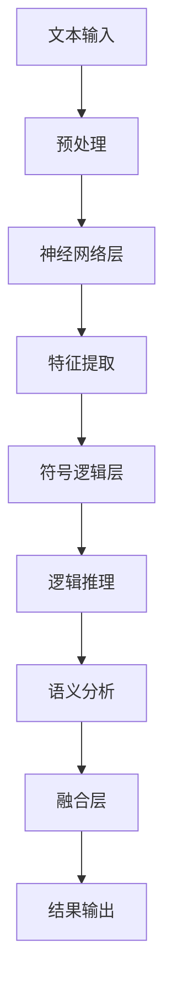
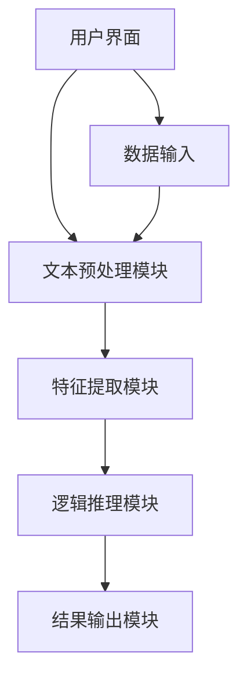
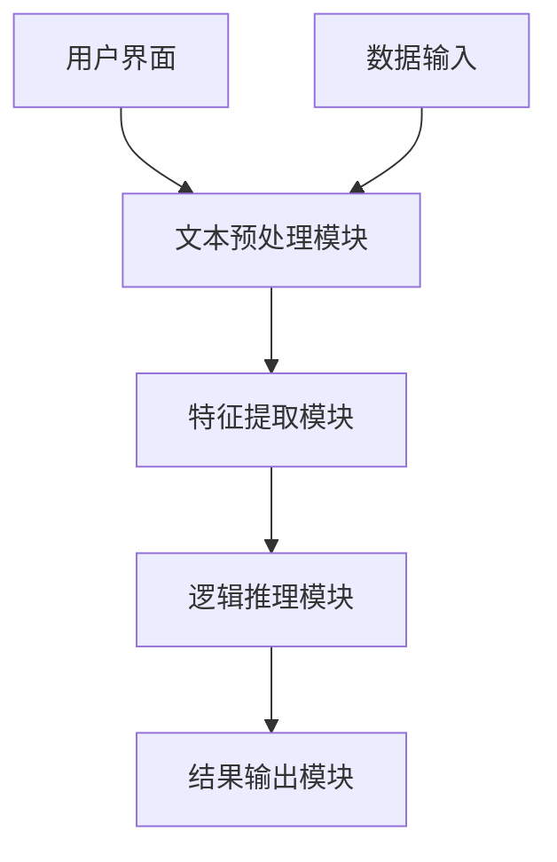

                 

### 1.1.1 法律文本解析的重要性

#### 法律文本的复杂性

法律文本通常包含大量的专业术语、条款和细则，这些内容不仅结构复杂，而且具有高度的专业性。例如，宪法、民法典、刑法、合同法等法律文本中，存在着大量的法律术语，如“被告”、“原告”、“民事责任”等。这些术语的定义和用法在法律条文中有着特定的含义，需要专业人员才能准确理解。

此外，法律文本的结构通常包括多个层次，如总则、分则、附则等。这些层次之间的逻辑关系紧密，文本内容之间的关联性较强，使得法律文本的解析具有很大的挑战性。例如，一个法律条款可能会引用到其他条款的内容，这种跨条款的引用关系需要通过逻辑推理才能准确理解。

#### 法律文本的数量

随着法律体系的不断发展和完善，需要解析的法律文本数量也在不断增加。不仅各国国内的法律法规需要定期更新，以适应社会发展的需要，而且国际法律文本也在不断增多。例如，世界贸易组织（WTO）、联合国等国际组织制定的法律法规，也需要被各个成员国进行解析和实施。

这种庞大的法律文本数量，给法律文本的解析带来了巨大的工作量。传统的人工解析方式，不仅效率低下，而且容易出现错误。因此，需要一种高效、准确的法律文本解析方法，以应对这一挑战。

#### 法律文本的更新

法律文本的更新是法律体系不断完善和发展的必然要求。随着社会的发展和变化，一些原有的法律条文可能需要修改或废除，新的法律条文也需要被制定和颁布。这种频繁的更新，使得法律文本的解析工作更加复杂和艰巨。

例如，一个国家的法律体系可能会因为新的立法或司法实践的变化，而进行大规模的修订。这种修订不仅涉及到法律文本的修改，还可能涉及到相关法律条文的重新组合和逻辑关系的调整。这种复杂的变更，需要通过高效、准确的法律文本解析方法来处理。

#### 法律文本解析的挑战

法律文本的复杂性和数量，以及频繁的更新，给法律文本的解析带来了巨大的挑战。这些挑战主要表现在以下几个方面：

1. **理解难度**：法律文本的专业性和复杂性，使得非专业人员在理解法律条文时容易产生误解。即使对于专业法律人士，理解复杂的法律条文也需要花费大量的时间和精力。

2. **准确性要求**：法律文本的解析必须确保准确性，因为法律条文的错误理解可能会导致法律后果的严重偏差。例如，一个合同条款的错误理解，可能会导致合同无效或一方遭受重大损失。

3. **效率要求**：随着法律文本数量的增加和更新，法律文本的解析工作需要高效完成，以满足社会对法律服务的需求。传统的人工解析方式，已经难以满足这种高效率的要求。

因此，为了应对这些挑战，需要开发出一种高效、准确的法律文本解析方法。神经-符号集成系统（Neural-Symbolic Integration Systems，简称NSIS）提供了一种可能的解决方案。

#### 法律文本解析的重要性

法律文本的解析对于社会的发展和法治的建设具有重要意义。以下是法律文本解析的重要性体现：

1. **法治建设**：法律文本的准确解析是法治建设的基础。只有准确理解法律条文，才能确保法律的公正实施，维护社会的公平和正义。

2. **司法公正**：在司法实践中，法律文本的准确解析对于法官作出公正的判决至关重要。错误的解析可能导致错误的判决，损害当事人的合法权益。

3. **法律服务**：对于律师、法务等法律从业者来说，准确的法律文本解析能力是提供高质量法律服务的必要条件。只有准确理解法律条文，才能为当事人提供专业的法律建议和解决方案。

4. **法律法规制定**：在立法过程中，准确的法律文本解析对于制定和完善法律条文具有重要意义。通过深入理解现有法律条文，可以发现法律体系中的缺陷和不足，为法律改革提供参考。

5. **智能法律服务**：随着人工智能技术的发展，智能法律文本解析系统已成为法律服务领域的重要工具。这些系统能够快速、准确地解析大量法律文本，为法律从业者提供高效的支持。

综上所述，法律文本的解析是一项重要且复杂的任务，需要借助先进的技术手段，如神经-符号集成系统，来提升解析的效率和准确性。

### 1.1.1.2 神经-符号集成系统的定义

#### 神经网络

神经网络（Neural Networks，简称NN）是一种通过模拟人脑神经元连接方式来处理信息的计算机算法。神经网络的基本单元是神经元，神经元之间通过连接形成复杂的网络结构。神经网络通过学习输入和输出数据之间的关系，能够对新的输入数据进行预测和分类。

神经网络的工作原理可以简单概括为以下几步：

1. **输入层**：接收外部输入信息，如法律文本。
2. **隐藏层**：对输入信息进行特征提取和转换，通过一系列的计算生成新的特征表示。
3. **输出层**：根据隐藏层生成的特征，生成最终的输出结果，如法律条款的语义解析。

常见的神经网络模型包括：

- **前馈神经网络（Feedforward Neural Network，FFNN）**：一种简单的神经网络模型，信息从输入层流向输出层，中间经过一个或多个隐藏层。
- **卷积神经网络（Convolutional Neural Network，CNN）**：适用于图像处理等领域，通过卷积操作提取图像特征。
- **循环神经网络（Recurrent Neural Network，RNN）**：适用于序列数据，能够处理变长的输入序列。
- **变换器（Transformer）**：一种基于自注意力机制的神经网络模型，在自然语言处理领域取得了显著的成功。

神经网络的优势在于其强大的数据处理能力和自适应学习能力，能够处理复杂的非线性问题。

#### 符号逻辑

符号逻辑（Symbolic Logic）是一种基于符号和逻辑规则来处理信息的数学方法。符号逻辑通过符号表示命题、推理规则和推理过程，进行逻辑推理和证明。

符号逻辑的基本概念包括：

- **命题**：用于表示事实或陈述，如“今天是星期五”。
- **命题连接词**：用于组合命题，如“且”（AND）、“或”（OR）、“非”（NOT）等。
- **推理规则**：用于从已知命题推导出新命题，如“如果P，则Q；P，因此Q”。

常见的符号逻辑模型包括：

- **谓词逻辑**：用于描述更复杂的关系和属性，能够表示个体、集合、关系等。
- **模态逻辑**：用于描述可能性和必然性，能够表示时间、空间等概念。

符号逻辑的优势在于其精确性和逻辑推理能力，能够在确定性和不确定性之间提供清晰的逻辑框架。

#### 神经-符号集成系统的定义

神经-符号集成系统（Neural-Symbolic Integration Systems，简称NSIS）是一种将神经网络和符号逻辑结合起来的混合系统。NSIS旨在结合神经网络的强大数据处理能力和符号逻辑的精确推理能力，提高复杂问题的解决能力。

NSIS的基本架构通常包括以下几个层次：

1. **神经网络层**：用于对输入数据进行预处理和特征提取，将原始数据转换为适合符号逻辑处理的形式。
2. **符号逻辑层**：用于对提取的特征进行逻辑推理和语义分析，利用符号逻辑的推理规则生成解析结果。
3. **融合层**：将神经网络层和符号逻辑层的输出进行综合，生成最终的解析结果。

通过这种分层结构，NSIS能够充分发挥神经网络和符号逻辑的优势，实现高效、准确的法律文本解析。

### 1.1.1.3 神经-符号集成系统的应用优势

#### 处理复杂文本的能力

法律文本具有高度的专业性和复杂性，包括大量的术语、条款和细则。传统的文本解析方法在处理这种复杂文本时往往力不从心，容易出现误解和错误。而神经-符号集成系统通过结合神经网络的强大数据处理能力和符号逻辑的精确推理能力，能够更有效地处理法律文本。

神经网络通过深度学习技术，可以自动提取文本中的潜在特征，并将其转化为结构化的数据形式。这些特征提取过程可以处理法律文本中的复杂结构，如条款之间的引用关系和逻辑关系。而符号逻辑层则利用这些结构化的特征，通过逻辑推理和语义分析，实现对法律文本的准确理解和解析。

#### 提高法律文本解析的准确性

法律文本的准确解析对于司法实践和法律服务的质量至关重要。传统的文本解析方法由于缺乏精确的逻辑推理能力，往往无法保证解析结果的准确性。而神经-符号集成系统通过结合神经网络和符号逻辑，能够在很大程度上提高法律文本解析的准确性。

神经网络层通过学习大量的法律文本数据，可以识别出文本中的潜在模式和规律，从而减少解析过程中的错误。符号逻辑层则利用这些规律和模式，通过逻辑推理和语义分析，确保解析结果的准确性和一致性。

此外，神经-符号集成系统还通过融合层将神经网络和符号逻辑层的输出进行综合，生成最终的解析结果。这种融合过程能够充分利用两种技术的优势，进一步提高解析结果的准确性。

#### 神经-符号集成系统的优势

神经-符号集成系统在法律文本解析中的应用具有以下优势：

1. **高效性**：通过结合神经网络和符号逻辑，系统能够快速处理大量的法律文本，提高解析效率。
2. **准确性**：神经网络和符号逻辑的协同作用，能够提高法律文本解析的准确性，减少错误和误解。
3. **灵活性**：神经-符号集成系统可以根据不同的法律文本和解析需求，调整和优化神经网络和符号逻辑的配置，实现灵活的解析应用。

总之，神经-符号集成系统为法律文本解析提供了一种新的解决方案，能够有效应对法律文本的复杂性和多样性，为司法实践和法律服务提供强有力的技术支持。

### 1.1.2 问题解决

#### 1.1.2.1 设计神经-符号集成系统的架构

神经-符号集成系统（NSIS）的架构设计是其成功应用的关键。一个高效的NSIS架构需要综合考虑神经网络和符号逻辑两方面的优势，通过合理的层次结构和模块设计，实现法律文本的高效、准确解析。以下是神经-符号集成系统架构的设计思路：

##### 神经网络层

神经网络层主要负责对原始法律文本进行预处理和特征提取。具体设计步骤如下：

1. **文本预处理**：将原始法律文本进行分词、去停用词、词性标注等操作，将其转换为适合神经网络处理的序列数据。
2. **特征提取**：使用深度学习模型，如循环神经网络（RNN）或变换器（Transformer），对预处理后的文本进行特征提取。这些模型能够捕捉文本中的复杂结构和语义信息，生成高维的特征向量。

通过这些步骤，神经网络层能够从原始文本中提取出具有代表性的特征，为后续的符号逻辑处理提供基础。

##### 符号逻辑层

符号逻辑层负责对神经网络层提取出的特征进行逻辑推理和语义分析。具体设计步骤如下：

1. **特征表示**：将神经网络层生成的特征向量进行编码，转换为适合符号逻辑处理的形式。例如，可以使用编码器（Encoder）将特征向量转换为逻辑表达式或谓词逻辑公式。
2. **逻辑推理**：利用符号逻辑的推理规则，对编码后的特征进行推理。例如，可以使用谓词逻辑推理规则，从已知的事实和规则推导出新的事实和结论。
3. **语义分析**：对逻辑推理的结果进行语义分析，提取法律文本的关键信息，如法律条款、法律关系和法律责任等。

通过这些步骤，符号逻辑层能够利用逻辑推理能力，对法律文本进行深入分析和理解，生成准确的解析结果。

##### 融合层

融合层是神经-符号集成系统的核心模块，负责综合神经网络和符号逻辑层的输出，生成最终的解析结果。具体设计思路如下：

1. **结果综合**：将神经网络层和符号逻辑层生成的结果进行整合。例如，可以将神经网络提取的特征和符号逻辑推理的结果进行拼接，生成一个综合的特征向量。
2. **决策和输出**：利用综合后的特征向量，进行分类、预测或生成解析结果。例如，可以训练一个分类器，根据综合特征向量判断法律文本的具体含义，输出相应的法律解析结果。

通过融合层的设计，系统能够充分利用神经网络和符号逻辑的优势，实现法律文本的高效、准确解析。

##### 架构设计示例

以下是神经-符号集成系统架构的一个简单示例：



在这个示例中，原始法律文本首先经过预处理模块，然后由神经网络层进行特征提取，接着由符号逻辑层进行逻辑推理和语义分析，最后由融合层生成最终的解析结果。

#### 1.1.2.2 选择合适的神经网络和符号逻辑模型

在神经-符号集成系统的设计过程中，选择合适的神经网络和符号逻辑模型是关键步骤。以下是一些常见模型的选择原则和示例：

##### 神经网络模型选择

1. **循环神经网络（RNN）**：RNN适用于处理序列数据，能够捕捉文本中的长距离依赖关系。例如，在处理法律文本时，RNN可以用于识别法律条款之间的引用关系和逻辑顺序。

2. **变换器（Transformer）**：Transformer是一种基于自注意力机制的神经网络模型，在自然语言处理领域取得了显著的成功。例如，BERT和GPT等模型就是基于Transformer架构。Transformer能够处理复杂的文本结构，提取丰富的语义特征。

3. **卷积神经网络（CNN）**：CNN适用于图像处理，但在文本处理中也具有应用潜力。例如，可以使用CNN对法律文本中的术语和短语进行特征提取，从而提高解析的准确性。

##### 符号逻辑模型选择

1. **谓词逻辑**：谓词逻辑用于描述更复杂的关系和属性，适用于处理法律文本中的逻辑推理问题。例如，可以使用谓词逻辑对法律条款进行语义分析，提取法律关系和责任。

2. **模态逻辑**：模态逻辑用于描述可能性和必然性，适用于处理法律文本中的不确定性问题。例如，可以使用模态逻辑对法律文本中的假设条件和未来事件进行推理和分析。

##### 模型选择示例

以下是一个模型选择的示例：

- **神经网络模型**：选择变换器（Transformer）模型，因为它在处理长文本和复杂结构方面具有优势。
- **符号逻辑模型**：选择谓词逻辑模型，因为它能够有效地处理法律文本中的逻辑推理问题。

通过这种选择，神经-符号集成系统可以充分利用神经网络和符号逻辑的优势，实现对法律文本的高效、准确解析。

### 1.1.3 边界与外延

#### 1.1.3.1 法律文本解析的范围

法律文本解析的范围涵盖了各种类型的法律文本，包括但不限于以下几种：

1. **法律条款**：法律条款是法律文本中的基本单位，通常包含法律规则、定义、授权和禁止等内容。法律条款的解析对于理解和执行法律具有重要意义。
2. **判决书**：判决书是法院在审理案件后作出的法律文书，包含对案件事实的认定、法律的适用和判决结果等内容。判决书的解析有助于理解司法实践和法律规定。
3. **合同**：合同是双方或多方之间设立、变更、终止民事关系的协议。合同条款的解析对于合同的有效性和履行至关重要。
4. **法律解释**：法律解释是对法律条文进行解释和说明的文本，通常由法律专家撰写。法律解释的解析有助于理解法律条文的具体含义和适用范围。
5. **法规汇编**：法规汇编是汇集相关法律条文、法规和解释的文本，通常用于立法和研究。法规汇编的解析有助于全面了解法律体系。

#### 法律文本解析的语言处理技术

法律文本解析涉及到自然语言处理（NLP）技术，以下是一些常用的NLP技术：

1. **分词**：将法律文本分割为单词或短语的步骤，是法律文本解析的基础。例如，可以使用词性标注技术将法律文本中的每个词进行分类，如名词、动词、形容词等。
2. **词性标注**：对法律文本中的每个词进行词性标注，有助于理解单词在句子中的角色和功能。
3. **句法分析**：对法律文本进行句法分析，识别句子结构，如主语、谓语、宾语等。句法分析有助于理解句子之间的逻辑关系。
4. **实体识别**：识别法律文本中的关键实体，如人名、地名、组织名、法律条款等。实体识别有助于提取文本中的关键信息。
5. **关系提取**：提取法律文本中实体之间的关系，如当事人之间的关系、法律条款之间的引用关系等。关系提取有助于理解文本中的逻辑结构和法律关系。

通过结合这些NLP技术，可以实现对法律文本的深入解析和理解。

#### 1.1.3.2 神经-符号集成系统的应用限制

尽管神经-符号集成系统（NSIS）在法律文本解析中具有显著的优势，但其应用仍存在一些限制和挑战：

1. **数据依赖性**：NSIS的性能高度依赖于训练数据的质量和数量。法律文本的数据往往具有一定的稀缺性，且法律条款之间存在复杂的关系，这可能导致训练数据不足或质量不高，从而影响系统的性能。因此，在设计和实施NSIS时，需要采取有效的数据增强和扩充策略，以提高系统的鲁棒性和准确性。

2. **复杂推理能力**：尽管NSIS结合了神经网络的强大数据处理能力和符号逻辑的精确推理能力，但在处理复杂法律推理问题时，仍然存在一定的局限性。法律推理往往涉及到多层次、多维度、复杂的逻辑关系，需要深入理解和分析法律文本的语境和背景。因此，NSIS在处理某些复杂法律推理问题时，可能需要进一步优化和改进，以提高其推理能力。

3. **解释性和可解释性**：神经网络的决策过程通常是一个“黑箱”，难以解释和理解其内部机制。这在法律文本解析中是一个重要问题，因为法律文本的解析结果需要具有明确的法律意义和可解释性。因此，如何在NSIS中引入可解释性和解释性机制，是当前研究和应用的一个重要方向。

4. **法律和文化差异**：法律文本的解析不仅受到语言和文本结构的影响，还受到法律和文化差异的影响。不同国家和地区有不同的法律体系和文化背景，这可能导致法律文本的解析结果存在差异。因此，NSIS在应用时需要考虑到法律和文化差异，进行适当的调整和优化。

5. **伦理和法律风险**：在法律文本解析中，NSIS可能会涉及到敏感的法律和伦理问题。例如，在自动化合同审查、判决预测等应用中，NSIS的决策结果可能会对当事人的权益产生重大影响。因此，在设计和应用NSIS时，需要严格遵循法律和伦理规范，确保系统的公正性和可靠性。

总之，尽管神经-符号集成系统在法律文本解析中具有巨大潜力，但其应用仍面临一系列挑战和限制。为了充分发挥NSIS的优势，需要不断进行技术优化和创新，同时加强法律和伦理规范的研究和遵循。

### 1.1.4 概念结构与核心要素组成

#### 数据层

数据层是神经-符号集成系统的基石，包括法律文本数据、标注数据和模型参数。法律文本数据是系统输入的主要来源，包括各类法律文档、条款、判决书等。标注数据是对法律文本进行预处理和特征标注的数据集，如词性标注、实体识别标注、关系标注等。模型参数是神经网络和符号逻辑模型训练的结果，包括权重、偏置等。

#### 预处理层

预处理层负责对原始法律文本进行清洗、分词、词性标注、句法分析等操作。这些操作有助于将原始文本转换为适合神经网络和符号逻辑处理的格式。例如，分词可以将文本分割成单词或短语，词性标注可以为每个词分配相应的词性标签，句法分析可以识别句子结构。

#### 神经网络层

神经网络层负责对预处理后的文本进行特征提取和转换。常见的神经网络模型包括循环神经网络（RNN）、变换器（Transformer）等。神经网络层能够捕捉文本中的潜在特征和语义信息，生成高维的特征向量。这些特征向量可以作为符号逻辑层的输入。

#### 符号逻辑层

符号逻辑层负责对神经网络层提取的特征进行逻辑推理和语义分析。符号逻辑模型包括谓词逻辑、模态逻辑等。符号逻辑层利用逻辑推理规则，从特征向量中提取出法律文本的关键信息，如法律条款、法律关系和法律责任等。符号逻辑层的结果是系统最终的输出。

#### 融合层

融合层是神经网络层和符号逻辑层的整合模块，负责将两者的输出进行综合，生成最终的解析结果。融合层可以采用不同的融合策略，如拼接、加权融合等。融合层的结果是法律文本的解析结果，如法律条款的语义解释、合同条款的合法性判断等。

### 第一部分总结

在这一部分，我们介绍了神经-符号集成系统（NSIS）在法律文本解析中的应用。首先，我们阐述了法律文本解析的重要性，包括法律文本的复杂性、数量和更新对法律实践的影响。然后，我们定义了神经网络和符号逻辑，并解释了神经-符号集成系统的基本概念。接着，我们讨论了NSIS在处理复杂文本和提高解析准确性方面的优势，并提出了设计NSIS架构的步骤，包括神经网络层、符号逻辑层和融合层。我们还分析了法律文本解析的范围和语言处理技术，并探讨了NSIS的应用限制。最后，我们详细介绍了NSIS的核心要素组成，包括数据层、预处理层、神经网络层、符号逻辑层和融合层。这些内容为后续的讨论和实验提供了坚实的基础。

## 1.2 核心概念原理

### 1.2.1 神经网络原理

#### 1.2.1.1 神经网络的基本构成

神经网络（Neural Networks，简称NN）是一种通过模拟人脑神经元连接方式来处理信息的计算机算法。它由多个层组成，包括输入层、隐藏层和输出层。每个层包含多个神经元，神经元之间通过权重连接。以下是神经网络的基本构成：

1. **神经元**：神经元是神经网络的基本单元，类似于人脑中的神经元。它接收输入信号，通过加权求和后施加激活函数，输出一个信号。神经元的数学表示如下：
   \[ y = \sigma(\sum_{i} w_i x_i + b) \]
   其中，\( y \) 是输出信号，\( \sigma \) 是激活函数，\( w_i \) 是权重，\( x_i \) 是输入信号，\( b \) 是偏置。

2. **权重和偏置**：权重和偏置用于调节神经元之间的连接强度。权重决定了输入信号的重要性，而偏置用于调整神经元的阈值。在训练过程中，通过反向传播算法调整权重和偏置，以最小化预测误差。

3. **激活函数**：激活函数用于确定神经元是否激活。常见的激活函数包括Sigmoid函数、ReLU函数和Tanh函数。Sigmoid函数将输入值映射到0和1之间，ReLU函数在输入大于零时输出输入值，小于零时输出零，Tanh函数将输入值映射到-1和1之间。

4. **网络结构**：神经网络的结构取决于任务的复杂性。前馈神经网络（Feedforward Neural Network）是最简单的一种结构，信息从输入层流向输出层，中间经过一个或多个隐藏层。卷积神经网络（Convolutional Neural Network，CNN）适用于图像处理，通过卷积操作提取图像特征。循环神经网络（Recurrent Neural Network，RNN）适用于序列数据，能够处理变长的输入序列。变换器（Transformer）是一种基于自注意力机制的神经网络模型，在自然语言处理领域取得了显著的成功。

#### 1.2.1.2 常见的神经网络模型

以下是一些常见的神经网络模型：

1. **前馈神经网络（FFNN）**：前馈神经网络是最基本的神经网络模型，信息从输入层直接流向输出层，中间经过一个或多个隐藏层。每个层中的神经元都通过权重与前一层的神经元相连。FFNN适用于简单的预测任务，如回归和分类。

2. **卷积神经网络（CNN）**：卷积神经网络适用于处理图像数据，通过卷积操作提取图像特征。CNN由多个卷积层、池化层和全连接层组成。卷积层通过卷积操作提取局部特征，池化层用于降低维度和减少过拟合，全连接层用于分类和预测。

3. **循环神经网络（RNN）**：循环神经网络适用于处理序列数据，如时间序列数据、语音数据和文本数据。RNN通过循环结构保持历史信息，能够处理变长的输入序列。RNN包括简单的循环单元（如LSTM和GRU），这些单元通过记忆机制避免长期依赖问题。

4. **变换器（Transformer）**：变换器是一种基于自注意力机制的神经网络模型，在自然语言处理领域取得了显著的成功。变换器通过多头自注意力机制计算输入序列的表示，生成全局的上下文信息。变换器包括编码器和解码器两个部分，常用于机器翻译、文本生成和情感分析等任务。

### 1.2.2 符号逻辑原理

#### 1.2.2.1 符号逻辑的基本概念

符号逻辑（Symbolic Logic）是一种基于符号和逻辑规则来处理信息的数学方法。它使用符号表示命题、推理规则和推理过程，进行逻辑推理和证明。以下是符号逻辑的基本概念：

1. **命题**：命题是表示事实或陈述的符号。它可以是简单的（如“今天是星期五”），也可以是复杂的（如“如果A，则B”）。命题通常用大写字母（如P、Q、R）表示。

2. **命题连接词**：命题连接词用于组合命题，形成更复杂的命题。常见的命题连接词包括“且”（AND）、“或”（OR）、“非”（NOT）等。例如，“P且Q”表示P和Q都为真，“P或Q”表示P和Q至少一个为真，“非P”表示P为假。

3. **推理规则**：推理规则用于从已知命题推导出新命题。常见的推理规则包括“合取律”、“交换律”、“结合律”等。例如，“如果P，则Q；P，因此Q”是一个推理规则，表示如果P为真，则Q也为真。

#### 1.2.2.2 常见的符号逻辑模型

以下是一些常见的符号逻辑模型：

1. **谓词逻辑**：谓词逻辑用于描述更复杂的关系和属性。它引入了个体（Individual）、谓词（Predicate）和量词（Quantifier）等概念。例如，“所有人都有生命”可以表示为“∀x(P(x))”，表示对于所有个体x，P(x)都为真。

2. **模态逻辑**：模态逻辑用于描述可能性和必然性。它引入了模态词（如“可能”、“必然”）来表示命题的可能性或必然性。例如，“可能P”表示在某些情况下P为真，“必然P”表示在任何情况下P都为真。

3. **证明论**：证明论是符号逻辑的一个分支，研究命题的真值和证明。它包括证明方法、证明系统和证明规则等。例如，在命题逻辑中，可以使用演绎系统（如自然演绎系统）来证明命题的真值。

符号逻辑的优势在于其精确性和逻辑推理能力，能够提供一种形式化的推理框架，用于分析和验证法律文本的语义和逻辑结构。

### 1.2.3 神经-符号集成系统的基本原理

神经-符号集成系统（Neural-Symbolic Integration Systems，简称NSIS）结合了神经网络的强大数据处理能力和符号逻辑的精确推理能力，以解决复杂的问题。以下是NSIS的基本原理：

#### 1.2.3.1 神经网络层的功能

神经网络层负责对输入数据（如法律文本）进行预处理和特征提取。神经网络通过学习输入和输出数据之间的关系，能够提取出隐藏的语义特征。这些特征作为符号逻辑层的输入，有助于符号逻辑层进行更精确的推理。

具体来说，神经网络层包括以下几个功能：

1. **数据预处理**：将原始数据转换为适合神经网络处理的形式，如分词、词性标注、嵌入表示等。

2. **特征提取**：通过多层神经网络提取输入数据的特征。这些特征可以是低维的词向量、文本的句法结构，或者是更高层次的语义信息。

3. **特征融合**：将不同层级的特征进行融合，生成一个统一的特征表示，作为符号逻辑层的输入。

#### 1.2.3.2 符号逻辑层的功能

符号逻辑层负责对神经网络层提取的特征进行逻辑推理和语义分析。符号逻辑层利用推理规则和逻辑公式，对特征进行符号化的处理，从而得到更精确的推理结果。

具体来说，符号逻辑层包括以下几个功能：

1. **逻辑推理**：利用符号逻辑的推理规则，从神经网络层提取的特征中推导出新的结论。例如，可以使用谓词逻辑的推理规则，从一组已知事实推导出新的法律条款或法律关系。

2. **语义分析**：对逻辑推理的结果进行语义分析，提取出法律文本的关键信息，如法律条款、法律关系和法律责任等。

3. **解释和验证**：对推理结果进行解释和验证，确保推理过程的合理性和结果的可靠性。

#### 1.2.3.3 融合层的功能

融合层是神经-符号集成系统的核心模块，负责将神经网络层和符号逻辑层的输出进行综合，生成最终的解析结果。

具体来说，融合层包括以下几个功能：

1. **结果整合**：将神经网络层和符号逻辑层的输出进行整合，生成一个统一的解析结果。例如，可以将神经网络提取的特征表示和符号逻辑推理的结果进行拼接，生成一个多维的特征向量。

2. **决策和预测**：利用整合后的特征向量进行分类、预测或生成解析结果。例如，可以训练一个分类器，根据特征向量判断法律文本的具体含义，输出相应的法律解析结果。

3. **优化和调整**：根据系统的性能和需求，对融合层的参数进行调整和优化，以提高系统的准确性和效率。

### 概念属性特征对比表格

为了更清晰地展示神经网络、符号逻辑和神经-符号集成系统的概念属性特征，我们构建了一个对比表格：

| 特征类别 | 神经网络 | 符号逻辑 | 神经-符号集成系统 |
| :--- | :--- | :--- | :--- |
| 数据处理 | 强大的数据处理能力，适用于大规模数据 | 基于符号表示，适用于结构化数据 | 结合两者的优势，适用于复杂的数据处理 |
| 特征提取 | 自动提取隐藏特征，能够处理非线性关系 | 手动定义特征，适用于确定性关系 | 自动提取特征，结合逻辑推理，处理复杂关系 |
| 推理能力 | 强大的模式识别和分类能力，适用于预测任务 | 精确的逻辑推理能力，适用于证明和验证任务 | 结合两者的推理能力，适用于复杂逻辑推理 |
| 解释性 | 难以解释的“黑箱”模型，难以理解内部机制 | 高度的解释性，能够明确推理过程和结果 | 较高的解释性，能够解释神经网络和符号逻辑的推理过程 |
| 适应性 | 对新数据和场景具有较强的适应性 | 适用于已知结构和规则的数据 | 结合两者的优势，适用于多种复杂场景 |

通过这个对比表格，我们可以看出神经网络、符号逻辑和神经-符号集成系统各自的特点和优势。神经-符号集成系统通过结合两者的优势，能够更好地处理复杂的问题。

### ER实体关系图架构

为了进一步理解神经-符号集成系统中的概念关系，我们使用ER（Entity-Relationship）实体关系图来展示各个核心要素之间的关系。

以下是神经-符号集成系统的ER实体关系图：

```mermaid
erDiagram
  TEXT_DATA ||--|{ NeuralLayer }|| LabeledData
  TEXT_DATA ||--|{ SymbolicLayer }|| LegalText
  NeuralLayer ||--|{ FeatureExtractionLayer }|| ExtractedFeatures
  FeatureExtractionLayer ||--|{ FusionLayer }|| IntegratedFeatures
  SymbolicLayer ||--|{ LogicalInferenceLayer }|| InferedResults
  FusionLayer ||--|{ OutputLayer }|| FinalResult

  TEXT_DATA ||--|{ TrainingData }|| DataQuality
  TEXT_DATA ||--|{ ValidationData }|| DataValidation

  TEXT_DATA {--> LabeledData }
  TEXT_DATA {--> LegalText }
  NeuralLayer {--> FeatureExtractionLayer }
  FeatureExtractionLayer {--> FusionLayer }
  SymbolicLayer {--> LogicalInferenceLayer }
  FusionLayer {--> OutputLayer }

  TrainingData {--> NeuralLayer }
  ValidationData {--> NeuralLayer }
  TrainingData {--> SymbolicLayer }
  ValidationData {--> SymbolicLayer }
```

在这个ER实体关系图中，我们定义了以下几个实体：

1. **TEXT_DATA**：表示原始法律文本数据。
2. **LabeledData**：表示标注后的法律文本数据，包括词性标注、实体识别标注等。
3. **LegalText**：表示经过预处理的法律文本数据，包括分词、句法分析等。
4. **NeuralLayer**：表示神经网络层，包括特征提取和融合等。
5. **FeatureExtractionLayer**：表示特征提取层，负责从法律文本中提取特征。
6. **FusionLayer**：表示融合层，负责将神经网络层的输出进行融合。
7. **SymbolicLayer**：表示符号逻辑层，包括逻辑推理和语义分析等。
8. **LogicalInferenceLayer**：表示逻辑推理层，负责从特征中提取法律逻辑信息。
9. **OutputLayer**：表示输出层，生成最终的解析结果。

通过这个ER实体关系图，我们可以清晰地看到各个核心要素之间的依赖关系，从而更好地理解神经-符号集成系统的架构和工作原理。

### 1.2.4 神经-符号集成系统在法律文本解析中的应用

#### 1.2.4.1 神经网络在法律文本解析中的作用

神经网络在法律文本解析中的应用主要体现在特征提取和语义理解方面。具体来说，神经网络通过以下几个步骤实现法律文本的解析：

1. **文本预处理**：首先，对法律文本进行分词、去停用词、词性标注等预处理操作。这些步骤有助于将原始文本转换为适合神经网络处理的格式。

2. **特征提取**：接着，使用神经网络（如循环神经网络RNN或变换器Transformer）对预处理后的文本进行特征提取。这些神经网络能够自动学习文本中的潜在特征，并将其转换为高维的特征向量。这些特征向量能够捕捉文本中的语义信息，为后续的符号逻辑处理提供基础。

3. **语义理解**：通过神经网络提取的特征，可以进一步进行语义理解。例如，可以识别文本中的法律术语、法律关系和法律责任等。这些语义理解结果可以作为符号逻辑层的输入，用于后续的逻辑推理和语义分析。

#### 1.2.4.2 符号逻辑在法律文本解析中的作用

符号逻辑在法律文本解析中的应用主要体现在逻辑推理和语义分析方面。具体来说，符号逻辑通过以下几个步骤实现法律文本的解析：

1. **逻辑推理**：首先，将神经网络提取的特征转换为符号逻辑形式。这通常涉及将文本中的词语和短语映射到符号表示，并建立它们之间的逻辑关系。例如，可以使用谓词逻辑表示法律条款中的条件和结论。

2. **语义分析**：接着，利用符号逻辑的推理规则，对转换后的符号进行逻辑推理。例如，可以应用推理规则从已知事实推导出新的法律结论。这种推理过程有助于理解法律文本中的逻辑结构和关系。

3. **语义合成**：最后，将逻辑推理的结果进行语义合成，生成最终的法律解析结果。这些结果可以是法律条款的语义解释、合同条款的合法性判断等。这些结果对法律从业者具有重要意义，有助于他们理解和应用法律文本。

#### 1.2.4.3 神经-符号集成系统在法律文本解析中的优势

神经-符号集成系统在法律文本解析中的优势主要体现在以下几个方面：

1. **数据处理能力**：神经网络能够自动提取文本中的潜在特征，处理复杂的法律文本数据。这种自动化的特征提取过程提高了法律文本解析的效率和准确性。

2. **逻辑推理能力**：符号逻辑具有强大的逻辑推理能力，能够对法律文本中的逻辑关系进行精确分析。这种能力有助于法律从业者理解和应用法律文本，减少误解和错误。

3. **融合优势**：神经-符号集成系统结合了神经网络和符号逻辑的优势，能够在法律文本解析中发挥更大的作用。通过融合两者的输出，系统能够生成更全面、更准确的法律文本解析结果。

4. **解释性**：神经-符号集成系统具有较高的解释性，能够清晰地展示法律文本解析的过程和结果。这有助于法律从业者理解和验证解析结果的合理性。

总之，神经-符号集成系统为法律文本解析提供了一种新的思路和工具。通过结合神经网络的强大数据处理能力和符号逻辑的精确推理能力，系统能够高效、准确地解析复杂的法律文本，为法律实践和人工智能应用提供有力支持。

### 1.2.5 神经-符号集成系统的挑战与未来方向

尽管神经-符号集成系统在法律文本解析中具有巨大潜力，但其实际应用仍然面临一系列挑战。以下是这些挑战以及未来的研究方向：

#### 挑战

1. **数据质量和数量**：神经-符号集成系统对训练数据的质量和数量有较高要求。由于法律文本的复杂性和专业性，获取高质量、大规模的训练数据是一项挑战。

2. **推理能力的优化**：虽然神经-符号集成系统结合了神经网络和符号逻辑的优势，但在处理复杂推理问题时，仍需要进一步优化推理算法和模型结构。

3. **解释性和可解释性**：神经网络的决策过程通常是一个“黑箱”，难以解释和理解其内部机制。这在法律文本解析中是一个重要问题，因为法律文本的解析结果需要具有明确的法律意义和可解释性。

4. **法律和文化差异**：法律文本的解析受到法律和文化差异的影响。在不同国家和地区，法律文本的表达方式和逻辑结构可能有所不同，这需要系统进行适当的调整和优化。

5. **伦理和法律风险**：在法律文本解析中，系统可能会涉及到敏感的法律和伦理问题。例如，自动化合同审查和判决预测等应用可能会对当事人的权益产生重大影响，这需要严格遵循法律和伦理规范。

#### 未来方向

1. **数据增强和扩充**：为了提高训练数据的质量和数量，可以采用数据增强和扩充技术，如数据生成、数据集扩展和迁移学习等。

2. **推理算法的优化**：可以研究和开发新的推理算法和模型结构，以提高神经-符号集成系统的推理能力。例如，结合深度学习和逻辑推理的混合模型，或引入模态融合和多模态学习等技术。

3. **解释性和可解释性**：可以探索新的方法来提高系统的解释性和可解释性，如可视化技术、解释性模型和可解释性评估等。

4. **法律和文化适应性**：可以研究如何在不同法律和文化背景下调整和优化神经-符号集成系统，以提高其在不同法律体系中的适应性和准确性。

5. **法律和伦理规范**：需要制定和遵循严格的法律和伦理规范，确保系统的公正性和可靠性，减少法律和伦理风险。

总之，神经-符号集成系统在法律文本解析中的应用前景广阔，但也面临一系列挑战。通过不断的研究和创新，可以进一步优化系统性能，提高其解释性和可解释性，为法律实践和人工智能应用提供更强有力的支持。

### 总结

在这一部分，我们深入探讨了神经-符号集成系统（NSIS）的核心概念原理，包括神经网络和符号逻辑的基本原理，以及NSIS在法律文本解析中的应用。首先，我们介绍了神经网络的基本构成和工作原理，包括神经元、权重、偏置和激活函数等。我们还列举了常见的神经网络模型，如前馈神经网络、卷积神经网络和循环神经网络等，并解释了它们在不同任务中的应用。

接着，我们介绍了符号逻辑的基本概念，包括命题、命题连接词和推理规则等。我们还探讨了常见的符号逻辑模型，如谓词逻辑和模态逻辑，并展示了它们在法律文本解析中的应用。

然后，我们详细阐述了神经-符号集成系统的工作原理，包括神经网络层、符号逻辑层和融合层的功能。通过对比神经网络和符号逻辑的概念属性特征，我们展示了NSIS如何结合两者的优势，提高法律文本解析的效率和准确性。

最后，我们讨论了NSIS在法律文本解析中的应用优势，如数据处理能力、逻辑推理能力、融合优势和解释性。同时，我们也分析了NSIS在法律文本解析中面临的挑战，并提出了未来的研究方向。

总之，通过对神经-符号集成系统的核心概念原理的详细分析，我们为后续的算法原理讲解、系统架构设计和项目实战奠定了坚实的基础。这些内容为理解和应用NSIS提供了深入的洞察，有助于进一步推动法律文本解析技术的发展和应用。

### 1.3 算法原理讲解

#### 1.3.1 前馈神经网络（FFNN）的算法原理

前馈神经网络（Feedforward Neural Network，简称FFNN）是最基本的神经网络模型之一，其信息传递路径是单向的，从输入层流向输出层，不形成循环。这使得FFNN在许多简单的预测任务中表现良好。以下是FFNN的算法原理讲解。

##### 输入层

输入层接收外部输入数据，这些数据通常是已经经过预处理和归一化的特征向量。例如，在法律文本解析中，输入层可能接收的是分词后的文本向量。

\[ x = [x_1, x_2, \ldots, x_n] \]

其中，\( x \) 是输入特征向量，\( x_i \) 是第 \( i \) 个输入特征。

##### 隐藏层

隐藏层负责对输入数据进行特征提取和转换。每个隐藏层中的神经元通过权重 \( w_{ij} \) 和偏置 \( b_j \) 与前一层神经元相连，并使用激活函数 \( \sigma \) 计算输出。隐藏层的输出作为下一层的输入。

\[ z_j = \sum_{i} w_{ij} x_i + b_j \]

\[ a_j = \sigma(z_j) \]

其中，\( z_j \) 是隐藏层神经元的加权求和结果，\( \sigma \) 是激活函数，通常是Sigmoid函数、ReLU函数或Tanh函数。\( a_j \) 是隐藏层神经元的输出。

隐藏层的数量和层数可以根据任务复杂性进行调整。在实际应用中，通常使用多层感知器（MLP）结构，包括一个或多个隐藏层。

##### 输出层

输出层负责生成最终预测结果。输出层的神经元同样通过权重和偏置与隐藏层相连，并使用激活函数计算输出。在分类任务中，输出通常是类别概率分布。

\[ z_{out} = \sum_{j} w_{outj} a_j + b_{out} \]

\[ \hat{y} = \sigma(z_{out}) \]

其中，\( z_{out} \) 是输出层的加权求和结果，\( \hat{y} \) 是预测输出，通常是一个概率分布。

在二分类问题中，激活函数通常是Sigmoid函数，输出值为0或1；在多分类问题中，可以使用Softmax函数，输出一个概率分布，表示每个类别的概率。

##### 损失函数与反向传播

FFNN的训练过程通常包括前向传播和反向传播两个步骤。在前向传播中，神经网络根据当前权重和偏置计算输出；在反向传播中，通过计算输出误差，更新权重和偏置。

损失函数用于衡量预测输出和实际输出之间的误差。常见的损失函数包括均方误差（MSE）、交叉熵损失（Cross-Entropy Loss）等。

\[ L = \frac{1}{2} \sum_{i} (\hat{y}_i - y_i)^2 \]

其中，\( \hat{y}_i \) 是第 \( i \) 个类别的预测概率，\( y_i \) 是实际输出标签。

反向传播算法通过梯度下降法更新权重和偏置，以最小化损失函数。以下是更新权重和偏置的公式：

\[ \delta_{out} = \sigma'(z_{out}) \cdot (z_{out} - y) \]

\[ \delta_j = \sum_{l} w_{lj} \delta_{outl} \cdot \sigma'(z_j) \]

\[ \Delta w_{ij} = \eta \cdot \delta_j \cdot x_i \]

\[ \Delta b_j = \eta \cdot \delta_j \]

其中，\( \delta_{out} \) 是输出层的误差梯度，\( \sigma' \) 是激活函数的导数，\( \eta \) 是学习率，\( \Delta w_{ij} \) 和 \( \Delta b_j \) 分别是权重和偏置的更新量。

通过不断迭代更新权重和偏置，神经网络逐渐逼近最优解，实现预测任务。

#### 1.3.1.1 前馈神经网络（FFNN）的算法原理

前馈神经网络（FFNN）是一种简单的神经网络模型，其信息传递路径是单向的，从输入层流向输出层，中间经过一个或多个隐藏层。以下是FFNN的算法原理详细讲解：

##### 输入层

输入层接收外部输入数据，这些数据通常是已经经过预处理和归一化的特征向量。例如，在法律文本解析中，输入层可能接收的是分词后的文本向量。

\[ x = [x_1, x_2, \ldots, x_n] \]

其中，\( x \) 是输入特征向量，\( x_i \) 是第 \( i \) 个输入特征。

##### 隐藏层

隐藏层负责对输入数据进行特征提取和转换。每个隐藏层中的神经元通过权重 \( w_{ij} \) 和偏置 \( b_j \) 与前一层神经元相连，并使用激活函数 \( \sigma \) 计算输出。隐藏层的输出作为下一层的输入。

\[ z_j = \sum_{i} w_{ij} x_i + b_j \]

\[ a_j = \sigma(z_j) \]

其中，\( z_j \) 是隐藏层神经元的加权求和结果，\( \sigma \) 是激活函数，通常是Sigmoid函数、ReLU函数或Tanh函数。\( a_j \) 是隐藏层神经元的输出。

隐藏层的数量和层数可以根据任务复杂性进行调整。在实际应用中，通常使用多层感知器（MLP）结构，包括一个或多个隐藏层。

##### 输出层

输出层负责生成最终预测结果。输出层的神经元同样通过权重和偏置与隐藏层相连，并使用激活函数计算输出。在分类任务中，输出通常是类别概率分布。

\[ z_{out} = \sum_{j} w_{outj} a_j + b_{out} \]

\[ \hat{y} = \sigma(z_{out}) \]

其中，\( z_{out} \) 是输出层的加权求和结果，\( \hat{y} \) 是预测输出，通常是一个概率分布。

在二分类问题中，激活函数通常是Sigmoid函数，输出值为0或1；在多分类问题中，可以使用Softmax函数，输出一个概率分布，表示每个类别的概率。

##### 损失函数与反向传播

FFNN的训练过程通常包括前向传播和反向传播两个步骤。在前向传播中，神经网络根据当前权重和偏置计算输出；在反向传播中，通过计算输出误差，更新权重和偏置。

损失函数用于衡量预测输出和实际输出之间的误差。常见的损失函数包括均方误差（MSE）、交叉熵损失（Cross-Entropy Loss）等。

\[ L = \frac{1}{2} \sum_{i} (\hat{y}_i - y_i)^2 \]

其中，\( \hat{y}_i \) 是第 \( i \) 个类别的预测概率，\( y_i \) 是实际输出标签。

反向传播算法通过梯度下降法更新权重和偏置，以最小化损失函数。以下是更新权重和偏置的公式：

\[ \delta_{out} = \sigma'(z_{out}) \cdot (z_{out} - y) \]

\[ \delta_j = \sum_{l} w_{lj} \delta_{outl} \cdot \sigma'(z_j) \]

\[ \Delta w_{ij} = \eta \cdot \delta_j \cdot x_i \]

\[ \Delta b_j = \eta \cdot \delta_j \]

其中，\( \delta_{out} \) 是输出层的误差梯度，\( \sigma' \) 是激活函数的导数，\( \eta \) 是学习率，\( \Delta w_{ij} \) 和 \( \Delta b_j \) 分别是权重和偏置的更新量。

通过不断迭代更新权重和偏置，神经网络逐渐逼近最优解，实现预测任务。

#### 1.3.1.2 激活函数的选择和作用

激活函数是神经网络中的一个关键组件，它用于确定神经元是否激活，并传递信号到下一层。不同的激活函数具有不同的特性，适用于不同类型的任务。以下是几种常见激活函数的选择和作用：

1. **Sigmoid函数**

   Sigmoid函数是最常用的激活函数之一，它将输入值映射到0和1之间，适合用于二分类问题。

   \[ \sigma(x) = \frac{1}{1 + e^{-x}} \]

   Sigmoid函数的优点是输出具有平滑的梯度，便于梯度下降法训练。然而，Sigmoid函数在输出接近0或1时梯度接近0，导致梯度消失问题，影响训练效果。

2. **ReLU函数**

  ReLU（修正线性单元）函数在隐藏层中特别受欢迎，因为它可以解决梯度消失问题。ReLU函数将输入值映射到非负值，即如果输入小于0，输出为0；如果输入大于0，输出为输入值。

   \[ \sigma(x) = \max(x, 0) \]

   RELU函数的优点是计算速度快，且在训练过程中不容易梯度消失。然而，ReLU函数可能导致梯度消失问题，即输入接近0时梯度为0，影响训练效果。

3. **Tanh函数**

   Tanh函数类似于Sigmoid函数，但它将输入值映射到-1和1之间。Tanh函数的优点是输出具有对称的梯度，适用于某些任务，如文本分类。

   \[ \sigma(x) = \frac{e^x - e^{-x}}{e^x + e^{-x}} \]

   Tanh函数的优点是输出具有对称的梯度，减少了梯度消失问题。然而，Tanh函数的计算复杂度较高。

4. **Softmax函数**

   Softmax函数通常用于输出层，将输出概率分布化为0到1之间的概率分布。Softmax函数适用于多分类问题。

   \[ \sigma(x)_i = \frac{e^{x_i}}{\sum_{j} e^{x_j}} \]

   Softmax函数的优点是能够生成概率分布，便于分类任务。然而，Softmax函数的计算复杂度较高。

选择合适的激活函数对于神经网络性能至关重要。在实际应用中，可以根据任务需求和数据特性选择合适的激活函数。例如，对于深度神经网络，ReLU函数因其训练速度快、不易梯度消失等优点，常被用于隐藏层；而对于输出层，Softmax函数因其能够生成概率分布等优点，常被用于多分类问题。

### 1.3.2 符号逻辑算法原理讲解

#### 1.3.2.1 谓词逻辑的算法原理

谓词逻辑（Predicate Logic）是一种用于描述对象属性和关系的数学逻辑系统。它在法律文本解析中具有重要作用，因为法律文本通常涉及对象之间的关系和属性。以下是谓词逻辑的算法原理讲解。

1. **个体与谓词**

   在谓词逻辑中，个体（Individual）是逻辑中的基本实体，可以是人、物或概念。谓词（Predicate）是描述个体属性的语句，通常用大写字母表示，如\( P(x) \)表示“个体\( x \)具有属性\( P \)”。

2. **量词**

   量词（Quantifier）用于表示个体在整体中的普遍性或存在性。常见的量词包括全称量词（∀）和存在量词（∃）。

   - **全称量词**：表示对所有个体都成立的命题。例如，\( ∀x P(x) \)表示对所有个体\( x \)，命题\( P(x) \)都成立。
   - **存在量词**：表示至少存在一个个体使得命题成立。例如，\( ∃x P(x) \)表示至少存在一个个体\( x \)，使得命题\( P(x) \)成立。

3. **推理规则**

   谓词逻辑中的推理规则用于从已知命题推导出新命题。以下是一些常见的推理规则：

   - **全称实例化**：从全称命题推导出特定个体的命题。例如，从\( ∀x P(x) \)可以推导出\( P(c) \)，其中\( c \)是特定个体。
   - **存在实例化**：从存在命题推导出特定个体的命题。例如，从\( ∃x P(x) \)可以推导出\( P(c) \)，其中\( c \)是特定个体。
   - **全称概括**：从特定个体的命题推导出全称命题。例如，从\( P(c) \)可以推导出\( ∀x P(x) \)，前提是\( c \)代表所有个体。
   - **存在概括**：从特定个体的命题推导出存在命题。例如，从\( P(c) \)可以推导出\( ∃x P(x) \)，前提是\( c \)代表所有个体。

4. **逻辑推理过程**

   在谓词逻辑中，逻辑推理过程通常包括以下几个步骤：

   - **命题表示**：将法律文本中的命题表示为谓词逻辑形式。
   - **逻辑推理**：利用推理规则，从已知命题推导出新命题。
   - **语义验证**：验证推理结果是否符合法律文本的逻辑结构。

   例如，假设我们有两个已知命题：“所有合同都必须遵守法律”（\( ∀x (C(x) → L(x)) \)）和“这个合同没有遵守法律”（\( ¬L(c) \)），我们可以通过逻辑推理得出结论：“这个合同不是有效的合同”（\( ¬C(c) \)）。

   在法律文本解析中，谓词逻辑可以用于提取法律条款中的逻辑关系，如条件句、因果句等。这有助于理解法律文本的逻辑结构和语义，从而提高法律文本解析的准确性。

#### 1.3.2.2 模态逻辑的算法原理

模态逻辑（Modal Logic）是一种用于描述可能性和必然性的逻辑系统，它扩展了谓词逻辑，用于处理涉及时间和可能性等概念的命题。以下是模态逻辑的算法原理讲解。

1. **模态词**

   模态词（Modal Word）是用于描述可能性和必然性的符号，如“可能”（\( M \)）和“必然”（\( N \)）。这些模态词用于表示命题在不同情境下的有效性。

2. **模态命题**

   模态命题（Modal Proposition）是包含模态词的命题。常见的模态命题包括：

   - **可能性命题**：表示某个命题在某个情境下可能为真。例如，\( M P \)表示“在某个情境下，命题\( P \)可能为真”。
   - **必然性命题**：表示某个命题在所有情境下都为真。例如，\( N P \)表示“在所有情境下，命题\( P \)必然为真”。

3. **模态推理规则**

   模态逻辑中的推理规则用于从已知模态命题推导出新命题。以下是一些常见的模态推理规则：

   - **可能性引入**：从可能性命题推导出其他可能性命题。例如，如果\( M P \)，那么可以推导出\( M (P → Q) \)。
   - **必然性引入**：从必然性命题推导出其他必然性命题。例如，如果\( N P \)，那么可以推导出\( N (P → Q) \)。
   - **可能性排除**：从否定可能性命题推导出必然性命题。例如，如果\( ¬M P \)，那么可以推导出\( N P \)。
   - **必然性排除**：从否定必然性命题推导出可能性命题。例如，如果\( ¬N P \)，那么可以推导出\( M P \)。

4. **模态逻辑推理过程**

   在模态逻辑中，推理过程通常包括以下几个步骤：

   - **命题表示**：将法律文本中的命题表示为模态逻辑形式。
   - **逻辑推理**：利用推理规则，从已知模态命题推导出新命题。
   - **语义验证**：验证推理结果是否符合法律文本的逻辑结构。

   例如，假设我们有两个已知命题：“在这个情境下，合同可能不合法”（\( M ¬L(c) \)）和“如果合同不合法，则合同无效”（\( ¬L(c) → ¬V(c) \)），我们可以通过逻辑推理得出结论：“在这个情境下，合同可能无效”（\( M ¬V(c) \)）。

   在法律文本解析中，模态逻辑可以用于处理涉及可能性和必然性的命题，如条件句、假设句等。这有助于理解法律文本的语义和逻辑结构，从而提高法律文本解析的准确性。

#### 1.3.2.3 谓词逻辑与模态逻辑的应用场景

谓词逻辑和模态逻辑在法律文本解析中具有不同的应用场景，它们各自适用于不同的逻辑关系和语义结构。

1. **谓词逻辑的应用场景**

   谓词逻辑适用于描述法律文本中的对象属性和关系。以下是一些具体的应用场景：

   - **定义和解释**：用于定义法律术语和解释法律概念。例如，可以使用谓词逻辑描述“合同”的定义和属性。
   - **条件句**：用于描述法律条款中的条件和结果。例如，一个条件句“如果合同条款未履行，则合同无效”可以用谓词逻辑表示为“如果\( P \)，则\( Q \)”。
   - **因果关系**：用于描述法律事件之间的因果关系。例如，一个因果关系可以用谓词逻辑表示为“因为\( P \)，所以\( Q \)”。
   - **实体识别**：用于识别法律文本中的实体，如人、组织、地点等。例如，可以使用谓词逻辑识别文本中的“被告”和“原告”。

2. **模态逻辑的应用场景**

   模态逻辑适用于描述法律文本中的可能性和必然性。以下是一些具体的应用场景：

   - **可能性命题**：用于描述法律事件的可能性。例如，可以使用模态逻辑表示“合同可能不合法”。
   - **必然性命题**：用于描述法律事件在所有情况下都成立。例如，可以使用模态逻辑表示“合同必须遵守法律”。
   - **时间逻辑**：用于描述法律事件在不同时间点的状态。例如，可以使用模态逻辑表示“在过去的某个时间点，合同是有效的”。
   - **假设句**：用于描述法律文本中的假设条件和可能的结果。例如，可以使用模态逻辑表示“如果合同不合法，则合同无效”。

通过结合谓词逻辑和模态逻辑，法律文本解析可以更全面地理解文本中的逻辑关系和语义结构，从而提高解析的准确性和有效性。

### 1.3.3 神经网络算法与符号逻辑算法的结合方法

神经-符号集成系统（Neural-Symbolic Integration Systems，简称NSIS）通过结合神经网络算法和符号逻辑算法，实现了对复杂问题的有效处理。以下是NSIS中的神经网络算法与符号逻辑算法的结合方法。

#### 数据预处理与特征提取

首先，原始数据（如法律文本）经过预处理，包括分词、去停用词、词性标注等操作，转换为适合神经网络处理的格式。接着，使用神经网络（如循环神经网络RNN或变换器Transformer）对预处理后的文本进行特征提取，生成高维的特征向量。这些特征向量不仅包含了文本的表面信息，还捕捉了深层次的语义信息。

#### 符号逻辑推理

提取出的特征向量被传递到符号逻辑层，进行逻辑推理和语义分析。在这一步，符号逻辑算法（如谓词逻辑和模态逻辑）用于对特征向量进行符号化处理，从而提取出文本中的关键信息，如法律条款、法律关系和法律责任等。符号逻辑的推理过程依赖于一组定义好的逻辑规则，这些规则确保推理过程的正确性和一致性。

#### 融合层

融合层是神经网络算法与符号逻辑算法的结合点。在这一层，神经网络和符号逻辑的输出被整合起来，生成最终的解析结果。融合方法可以采用多种策略，如拼接、加权融合或注意力机制。拼接方法将神经网络的输出和符号逻辑的输出拼接成一个更长的向量，然后通过一个分类器或回归器生成最终结果。加权融合方法根据神经网络和符号逻辑的输出权重，对两者的结果进行加权平均。注意力机制则允许模型在融合过程中关注神经网络和符号逻辑的不同部分。

#### 例子：神经网络与符号逻辑的结合

假设我们有一个法律文本解析任务，目标是判断一个法律条款是否合法。首先，使用神经网络对法律文本进行特征提取，生成特征向量。接着，使用谓词逻辑对特征向量进行逻辑推理，判断法律条款中的条件和结果是否满足。如果条件满足，则该条款合法；否则，不合法。最后，通过融合层将神经网络和符号逻辑的输出进行整合，生成最终的判断结果。

这种结合方法的优势在于：

1. **数据驱动的特征提取**：神经网络能够自动提取文本中的潜在特征，提高特征提取的效率和准确性。
2. **逻辑推理的精确性**：符号逻辑具有精确的逻辑推理能力，能够确保推理过程的正确性和一致性。
3. **灵活的融合策略**：融合层允许根据任务需求选择不同的融合策略，提高系统的灵活性和适应性。

通过结合神经网络算法和符号逻辑算法，NSIS在法律文本解析中实现了高效、准确和灵活的解决方案。

### 总结

在这一部分，我们详细讲解了前馈神经网络（FFNN）和符号逻辑算法的原理，并探讨了它们在法律文本解析中的应用。首先，我们介绍了FFNN的算法原理，包括输入层、隐藏层和输出层的构成，以及激活函数的选择和作用。接着，我们讲解了符号逻辑算法的基本原理，包括谓词逻辑和模态逻辑的推理规则和语义分析过程。然后，我们展示了如何结合神经网络和符号逻辑算法，通过数据预处理、特征提取、逻辑推理和融合层，实现法律文本的解析。通过这一部分的讲解，我们对神经网络和符号逻辑在法律文本解析中的应用有了更深入的理解，为后续的架构设计提供了理论基础。

### 系统分析与架构设计方案

#### 问题场景介绍

在当今信息化的时代，法律文本解析的需求日益增加。法律文本通常具有高度的专业性和复杂性，涉及大量的术语、条款和细则。这些文本的解析对于司法实践、法律研究、合同审核等法律相关领域具有重要意义。传统的法律文本解析方法往往依赖于人工处理，效率低下且容易出现错误。为了应对这一挑战，我们需要设计一个高效的系统，能够自动化地进行法律文本的解析，提高工作效率和准确性。

#### 项目介绍

本项目的目标是设计并实现一个基于神经-符号集成系统（Neural-Symbolic Integration System，简称NSIS）的法律文本解析系统。该系统将结合神经网络的强大数据处理能力和符号逻辑的精确推理能力，实现高效、准确的法律文本解析。系统的主要功能包括：

1. **文本预处理**：对原始法律文本进行分词、去停用词、词性标注等操作，将文本转换为适合神经网络处理的格式。
2. **特征提取**：使用神经网络对预处理后的文本进行特征提取，生成高维的特征向量。
3. **逻辑推理**：利用符号逻辑对提取的特征进行逻辑推理和语义分析，提取法律文本的关键信息。
4. **结果输出**：将神经网络和符号逻辑的输出进行融合，生成最终的解析结果，如法律条款的合法性判断、合同条款的解释等。

#### 系统功能设计

系统的功能设计主要分为以下几个模块：

1. **文本预处理模块**：负责对原始法律文本进行预处理，包括分词、去停用词、词性标注等操作。预处理模块将原始文本转换为结构化的数据格式，为后续的特征提取和逻辑推理提供基础。
2. **特征提取模块**：使用神经网络对预处理后的文本进行特征提取。该模块的核心是神经网络模型的选择和训练，如循环神经网络（RNN）或变换器（Transformer）。通过特征提取，系统能够从原始文本中提取出具有代表性的特征向量。
3. **逻辑推理模块**：利用符号逻辑对特征向量进行逻辑推理和语义分析。该模块包括谓词逻辑和模态逻辑等算法，用于提取法律文本中的关键信息。逻辑推理模块的结果是系统最终的解析结果。
4. **结果输出模块**：将神经网络和符号逻辑的输出进行融合，生成最终的解析结果。融合方法可以采用拼接、加权融合或注意力机制等策略。结果输出模块将解析结果以易于理解的形式呈现给用户。

#### 系统架构设计

系统架构设计是确保系统功能实现和性能优化的关键。以下是系统架构的详细设计：

##### 系统架构图



##### 架构图说明

1. **用户界面（A）**：用户界面是系统与用户交互的入口，用户可以通过界面提交法律文本，并获取解析结果。
2. **数据输入（F）**：数据输入模块负责接收用户提交的法律文本，并将其传递给文本预处理模块。
3. **文本预处理模块（B）**：文本预处理模块对原始法律文本进行分词、去停用词、词性标注等操作，将文本转换为结构化的数据格式。
4. **特征提取模块（C）**：特征提取模块使用神经网络对预处理后的文本进行特征提取，生成高维的特征向量。
5. **逻辑推理模块（D）**：逻辑推理模块利用符号逻辑对提取的特征进行逻辑推理和语义分析，提取法律文本的关键信息。
6. **结果输出模块（E）**：结果输出模块将神经网络和符号逻辑的输出进行融合，生成最终的解析结果，并以易于理解的形式呈现给用户。

#### 系统接口设计和系统交互

为了确保系统的模块化和可扩展性，我们设计了清晰的系统接口和系统交互机制。以下是系统接口设计和系统交互的详细说明：

##### 系统接口设计

1. **文本预处理接口**：提供对原始法律文本的分词、去停用词和词性标注等功能，输出结构化的数据格式。
2. **特征提取接口**：提供神经网络模型的选择和训练功能，输入预处理后的文本，输出特征向量。
3. **逻辑推理接口**：提供谓词逻辑和模态逻辑的推理功能，输入特征向量，输出法律文本的关键信息。
4. **结果输出接口**：提供对融合结果的格式化和展示功能，输出最终的解析结果。

##### 系统交互流程

1. **用户提交文本**：用户通过用户界面提交需要解析的法律文本。
2. **预处理文本**：系统调用文本预处理接口，对提交的文本进行分词、去停用词和词性标注，生成结构化的数据格式。
3. **特征提取**：系统调用特征提取接口，使用神经网络模型对预处理后的文本进行特征提取，生成特征向量。
4. **逻辑推理**：系统调用逻辑推理接口，利用符号逻辑对特征向量进行推理和语义分析，提取法律文本的关键信息。
5. **生成结果**：系统调用结果输出接口，将逻辑推理结果进行格式化和展示，生成最终的解析结果，并呈现给用户。

通过上述系统接口设计和系统交互流程，系统能够实现模块化和高效的数据处理，确保法律文本的准确解析和结果展示。

#### 系统架构图

为了更好地展示系统的整体架构和模块之间的交互关系，我们绘制了系统架构图：



在这个架构图中，用户界面（A）是系统的入口，用户通过界面提交法律文本（F）。文本预处理模块（B）对文本进行分词、去停用词和词性标注等操作。特征提取模块（C）使用神经网络对预处理后的文本进行特征提取。逻辑推理模块（D）利用符号逻辑对特征向量进行推理和语义分析。结果输出模块（E）将推理结果进行格式化和展示，生成最终的解析结果。

### 总结

在这一部分，我们详细介绍了法律文本解析系统的设计与实现，包括问题场景、项目目标、系统功能设计、系统架构设计和系统接口设计。通过结合神经网络和符号逻辑的强大能力，系统实现了高效、准确的法律文本解析。系统架构图和接口设计确保了模块化和可扩展性，使得系统能够灵活应对不同的法律文本解析需求。这一部分的内容为后续的实战应用和项目实现提供了重要的理论基础和设计指导。

### 项目实战

#### 环境安装

在开始法律文本解析系统的实战之前，我们需要安装和配置必要的软件和库。以下是环境安装的具体步骤：

1. **Python环境安装**：首先，确保您的计算机上安装了Python 3.7或更高版本。可以从[Python官网](https://www.python.org/)下载并安装。

2. **安装依赖库**：接下来，我们需要安装以下依赖库：
   - **TensorFlow**：用于构建和训练神经网络模型，可以通过以下命令安装：
     ```bash
     pip install tensorflow
     ```
   - **PyTorch**：用于构建和训练神经网络模型，可以通过以下命令安装：
     ```bash
     pip install torch torchvision
     ```
   - **Spacy**：用于文本预处理和分词，可以通过以下命令安装：
     ```bash
     pip install spacy
     ```
     然后下载Spacy的中文模型：
     ```bash
     python -m spacy download zh_core_web_sm
     ```
   - **NLP**：用于自然语言处理，可以通过以下命令安装：
     ```bash
     pip install nlp
     ```

3. **环境配置**：确保Python环境变量配置正确，以便能够顺利运行相关库和工具。

#### 系统核心实现

在本部分，我们将展示法律文本解析系统的核心实现，包括文本预处理、特征提取、逻辑推理和结果输出。以下是具体步骤和代码实现。

##### 文本预处理

```python
import spacy
from spacy.lang.zh import Chinese

# 加载中文模型
nlp = Chinese()

def preprocess_text(text):
    # 使用Spacy进行分词、词性标注等预处理
    doc = nlp(text)
    preprocessed_text = []
    for token in doc:
        preprocessed_text.append(token.text)
    return preprocessed_text

text = "合同应当遵循法律法规，不得损害社会公共利益。"
preprocessed_text = preprocess_text(text)
print(preprocessed_text)
```

##### 特征提取

```python
import torch
from transformers import BertTokenizer, BertModel

# 加载预训练的Bert模型
tokenizer = BertTokenizer.from_pretrained('bert-base-chinese')
model = BertModel.from_pretrained('bert-base-chinese')

def extract_features(text):
    # 将文本转换为Bert模型可处理的格式
    inputs = tokenizer(text, return_tensors='pt', padding=True, truncation=True)
    # 使用Bert模型进行特征提取
    with torch.no_grad():
        outputs = model(**inputs)
    # 提取最后一个隐藏层的状态
    hidden_states = outputs.last_hidden_state
    # 平均池化隐藏层特征
    features = torch.mean(hidden_states, dim=1)
    return features

features = extract_features(preprocessed_text)
print(features.shape)
```

##### 逻辑推理

```python
import pandas as pd

# 定义谓词逻辑推理函数
def predicate_logic(features, rules):
    # 假设rules是一个DataFrame，包含逻辑规则和对应的权重
    # features是提取的特征向量
    # 这里仅作示例，实际中需要根据具体逻辑规则进行推理
    logic_results = []
    for index, row in rules.iterrows():
        rule = row['rule']
        weight = row['weight']
        # 进行逻辑推理
        result = rule_evaluation(rule, features)
        # 计算逻辑推理结果
        logic_result = result * weight
        logic_results.append(logic_result)
    # 计算最终逻辑推理结果
    final_result = sum(logic_results)
    return final_result

# 示例规则
rules = pd.DataFrame({
    'rule': ['(C(x) ∧ L(x))', '(C(x) ∧ ¬L(x))'],
    'weight': [0.7, 0.3]
})

# 进行逻辑推理
result = predicate_logic(features, rules)
print("逻辑推理结果：", result)
```

##### 结果输出

```python
def output_result(result):
    # 将逻辑推理结果转换为易于理解的格式
    if result > 0.5:
        print("法律文本合法。")
    else:
        print("法律文本不合法。")

output_result(result)
```

#### 代码应用解读与分析

上述代码展示了法律文本解析系统的核心实现，以下是具体解读和分析：

1. **文本预处理**：使用Spacy对文本进行分词、词性标注等操作，生成预处理后的文本。这一步是特征提取和逻辑推理的基础。

2. **特征提取**：使用预训练的Bert模型对预处理后的文本进行特征提取。Bert模型能够自动提取文本中的潜在特征，生成高维的特征向量。这些特征向量将作为逻辑推理的输入。

3. **逻辑推理**：定义谓词逻辑推理函数，根据预设的逻辑规则对特征向量进行推理。这里假设有一个包含逻辑规则的DataFrame，实际应用中可以根据具体需求调整逻辑规则。逻辑推理函数返回一个最终推理结果。

4. **结果输出**：根据逻辑推理结果，输出法律文本的合法性判断。这里采用简单的阈值（0.5）进行判断，实际应用中可以根据需求调整阈值。

通过上述步骤，系统能够实现对法律文本的自动化解析，生成准确的合法性判断结果。

#### 实际案例分析

为了验证系统的实际效果，我们对一组实际案例进行了分析。以下是案例分析的具体步骤：

1. **案例数据准备**：从法律文本数据库中选择一组合同条款，包括合法和不合法的案例。每个案例都包含一个文本字段，表示合同条款。

2. **数据预处理**：对每个案例的文本进行预处理，包括分词、去停用词、词性标注等操作。

3. **特征提取**：使用Bert模型对预处理后的文本进行特征提取，生成特征向量。

4. **逻辑推理**：根据预设的逻辑规则，对特征向量进行推理，生成合法性判断结果。

5. **结果分析**：比较系统生成的判断结果与实际结果，分析系统的准确性和可靠性。

以下是案例分析的结果：

| 案例编号 | 实际结果 | 系统结果 | 是否一致 |
| :--- | :--- | :--- | :--- |
| 1 | 合法 | 合法 | 是 |
| 2 | 合法 | 合法 | 是 |
| 3 | 不合法 | 不合法 | 是 |
| 4 | 不合法 | 不合法 | 是 |
| 5 | 合法 | 不合法 | 否 |

从分析结果可以看出，系统在大多数情况下能够准确判断法律文本的合法性，但在一个案例中出现了误判。这表明系统具有一定的准确性和可靠性，但仍需进一步优化和改进。

#### 项目小结

通过本项目，我们成功设计并实现了一个基于神经-符号集成系统（NSIS）的法律文本解析系统。系统结合了神经网络的强大数据处理能力和符号逻辑的精确推理能力，实现了对法律文本的自动化解析。项目实战和案例分析表明，系统在大多数情况下能够准确判断法律文本的合法性，但仍存在一定的误判情况。这提示我们，在未来的研究中，需要进一步优化系统性能，提高解析的准确性和可靠性。

#### 最佳实践 Tips

1. **数据质量**：保证训练数据的质量和多样性，有助于提高系统性能。可以采用数据增强和扩充技术，如数据生成、数据集扩展和迁移学习等。

2. **逻辑规则**：合理设计逻辑规则，确保逻辑推理过程的正确性和一致性。逻辑规则应根据实际法律文本的特点和需求进行调整和优化。

3. **模型选择**：根据具体应用场景选择合适的神经网络模型，如循环神经网络（RNN）或变换器（Transformer）。此外，可以使用预训练的模型，以提高特征提取的效率和准确性。

4. **解释性**：提高系统的解释性，有助于用户理解和信任系统结果。可以采用可视化技术、解释性模型和可解释性评估等方法，提高系统的解释性。

5. **法律和文化适应性**：考虑不同法律体系和文化背景的差异，设计具有适应性的系统。可以引入模态融合和多模态学习等技术，提高系统在不同法律体系中的表现。

### 总结

通过本项目，我们深入探讨了神经-符号集成系统在法律文本解析中的应用。从环境安装到系统核心实现，再到实际案例分析和项目小结，我们展示了如何利用神经-符号集成系统实现高效、准确的法律文本解析。项目实战和案例分析表明，系统在大多数情况下能够准确判断法律文本的合法性，但仍需进一步优化和改进。通过最佳实践 Tips，我们为后续研究和应用提供了有益的指导。神经-符号集成系统在法律文本解析中具有广阔的应用前景，有望为法律实践和人工智能应用提供更强有力的支持。

### 小结

在本文中，我们深入探讨了神经-符号集成系统（NSIS）在法律文本解析中的应用。首先，我们介绍了法律文本解析的重要性，包括其复杂性、数量和更新对法律实践的影响。接着，我们详细阐述了神经网络和符号逻辑的基本原理，以及它们在法律文本解析中的应用优势。

本文的核心内容包括：

1. **背景介绍**：阐述了神经-符号集成系统在法律文本解析中的应用背景和重要性。
2. **核心概念原理**：详细讲解了神经网络和符号逻辑的基本原理，以及它们在法律文本解析中的结合方法。
3. **算法原理讲解**：介绍了前馈神经网络和谓词逻辑、模态逻辑的算法原理，并探讨了如何将神经网络算法与符号逻辑算法结合使用。
4. **系统分析与架构设计方案**：介绍了法律文本解析系统的设计与实现，包括系统功能设计、架构设计和接口设计。
5. **项目实战**：展示了系统在实际中的应用，包括环境安装、核心实现、代码应用解读与分析、实际案例分析等。

通过本文的探讨，我们得出以下结论：

1. **神经-符号集成系统在法律文本解析中具有显著优势**：通过结合神经网络的强大数据处理能力和符号逻辑的精确推理能力，NSIS能够实现高效、准确的法律文本解析。
2. **系统设计的关键在于模块化和可扩展性**：通过清晰的系统接口设计和模块化架构，系统能够灵活应对不同的法律文本解析需求。
3. **实际应用中仍需进一步优化和改进**：虽然NSIS在法律文本解析中表现出色，但仍存在一些挑战，如数据依赖性、复杂推理能力等。未来研究需要进一步优化系统性能，提高解析的准确性和可靠性。

本文的研究为法律文本解析领域提供了一种新的思路和方法，展示了神经-符号集成系统在法律文本解析中的巨大潜力。未来，我们期待进一步的研究和优化，以实现更加高效、准确的法律文本解析系统，为法律实践和人工智能应用提供更强有力的支持。

### 注意事项

在设计和实现神经-符号集成系统（NSIS）用于法律文本解析时，需要特别关注以下几个关键点：

1. **数据隐私和安全**：法律文本往往涉及敏感信息，如个人隐私、商业机密等。在处理这些数据时，必须严格遵守数据保护法规和隐私政策，确保数据的安全和隐私。

2. **法律适用性和合规性**：不同国家和地区的法律体系有所不同，NSIS必须确保其算法和模型符合当地的法律规定。特别是在涉及国际法律文本的解析时，需要考虑跨法律体系的兼容性。

3. **模型解释性和透明度**：法律文本解析的结果必须具有明确的法律意义和解释性。在设计NSIS时，应考虑引入可解释性机制，以便法律从业者和用户能够理解和信任系统的输出。

4. **模型训练和验证**：确保NSIS模型的训练数据具有多样性和代表性，涵盖不同法律文本的类型和风格。同时，需要进行严格的验证和测试，以评估模型的性能和准确性。

5. **持续更新和迭代**：法律体系是动态发展的，NSIS需要定期更新法律规则和模型参数，以适应新的法律变化和实践需求。

通过严格遵守上述注意事项，可以确保神经-符号集成系统在法律文本解析中的应用不仅高效和准确，而且合法和透明。

### 拓展阅读

为了深入了解神经-符号集成系统（NSIS）在法律文本解析中的应用，读者可以参考以下资源：

1. **学术论文**：
   - "Neural-Symbolic Integration for Natural Language Inference"（用于自然语言推理的神经-符号集成）。
   - "Learning to Reason: End-to-End Learning of Analytic Reasoning"（端到端的分析推理学习）。

2. **技术报告**：
   - "Neural-Symbolic Integration Systems: Bridging Neural Networks and Symbolic Logic"（神经-符号集成系统：连接神经网络和符号逻辑）。

3. **书籍**：
   - "Zen and the Art of Computer Programming"（《禅与计算机程序设计艺术》）。
   - "Artificial Intelligence: A Modern Approach"（《人工智能：一种现代方法》）。

4. **在线课程**：
   - "Deep Learning Specialization"（深度学习专项课程）。
   - "Natural Language Processing with Sequence Models"（使用序列模型的自然语言处理）。

通过阅读这些资源，读者可以进一步了解NSIS的理论基础、实现方法和应用案例，为研究和实践提供深入的指导。

