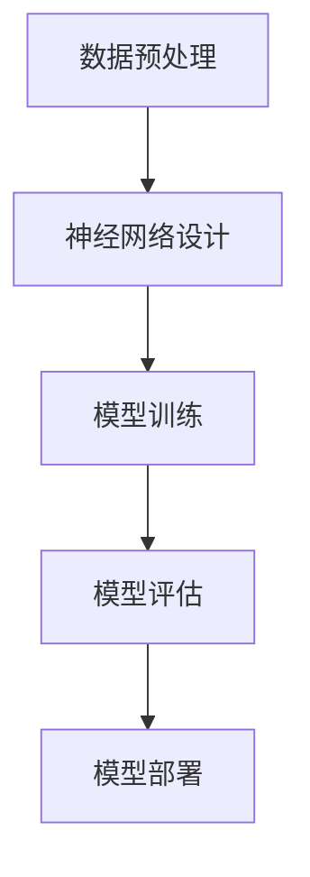

                 

### 引言

在当今高速发展的信息技术时代，人工智能（AI）已经成为推动科技进步的重要驱动力。随着AI技术的不断成熟，AI系统在各行各业中的应用日益广泛，从自动驾驶、智能助手到医疗诊断，AI正在改变我们的生活方式和工作模式。然而，随着AI系统的复杂度不断增加，如何增强其可扩展性成为了一个亟待解决的问题。

**神经编程接口**作为一种新兴的技术概念，其在增强AI系统的可扩展性方面显示出了巨大的潜力。神经编程接口结合了计算机编程与神经网络的原理，通过提供一个统一的编程框架，使得开发者可以更加灵活地构建和扩展AI系统。本文旨在深入探讨神经编程接口的概念、原理及其在增强AI系统可扩展性方面的应用，以期为读者提供全面的了解和指导。

### 背景介绍

**神经编程接口（Neural Programming Interface，NPI）**的概念起源于对神经网络和计算机编程深度融合的探索。传统的计算机编程依赖于指令集和流程控制结构，而神经网络则通过大量参数和层次结构来处理复杂的数据。神经编程接口的目标是利用神经网络的强大学习能力和编程的灵活性，实现更加智能化和自动化的系统设计。

**神经编程接口的起源与发展**可以追溯到20世纪80年代，当时学者们开始尝试将神经网络与传统的编程语言相结合，以解决复杂计算问题。然而，由于计算资源和算法的限制，早期的神经编程接口主要应用于简单的数据分析和模式识别任务。随着计算机性能的不断提升和深度学习技术的突破，神经编程接口逐渐成熟，并开始在更多领域中得到应用。

**神经编程接口的必要性与重要性**在于其能够为开发者提供一种全新的思维方式。传统的编程方法依赖于固定的算法和规则，而神经编程接口则通过学习数据模式和关系，自动生成程序。这种方式不仅提高了编程效率，还使得系统更加灵活和适应性强。

### 核心概念与联系

要深入理解神经编程接口，我们首先需要明确一些核心概念和术语。这些概念包括但不限于：

- **神经网络（Neural Network）**：一种模拟生物神经系统工作机制的计算模型，通过多层节点和连接来实现数据的学习和预测。
- **深度学习（Deep Learning）**：一种利用多层神经网络进行数据学习和特征提取的方法，能够处理复杂数据并实现高度自动化。
- **编程语言（Programming Language）**：用于编写计算机程序的语法和语义规则，是开发者与计算机之间的交流语言。

这些核心概念之间存在着密切的联系。神经网络作为深度学习的基础，通过学习和提取数据特征，实现了对数据的高效处理。而编程语言则提供了开发者与神经网络之间的接口，使得开发者可以更加便捷地构建和优化AI系统。

### 神经编程接口的架构设计

神经编程接口的架构设计是理解其工作原理的关键。一个典型的神经编程接口架构包括以下几个主要部分：

1. **数据层（Data Layer）**：负责数据输入和输出的处理，包括数据清洗、数据预处理和数据存储。
2. **神经网络层（Neural Network Layer）**：实现神经网络模型的设计和训练，通过多层节点和连接结构进行数据的学习和特征提取。
3. **编程层（Programming Layer）**：提供编程接口和工具，使得开发者可以方便地调用神经网络模型并进行编程操作。
4. **控制层（Control Layer）**：负责系统运行的控制和调度，包括模型的训练、测试和部署等。

这些层次通过明确的接口和协议进行通信，形成一个完整的神经编程接口系统。下面我们将进一步探讨这些层次的具体设计和实现。

### 数学模型与算法原理

神经编程接口的核心在于其数学模型和算法原理。一个典型的神经编程接口算法通常包括以下几个关键步骤：

1. **数据预处理**：通过对输入数据进行标准化、归一化等预处理操作，提高模型训练的效果和效率。
2. **神经网络设计**：根据任务需求设计合适的神经网络结构，包括输入层、隐藏层和输出层。
3. **模型训练**：通过反向传播算法和优化器（如梯度下降、Adam等）对神经网络进行训练，不断调整模型参数以最小化损失函数。
4. **模型评估**：使用测试集对训练好的模型进行评估，通过指标（如准确率、召回率等）判断模型性能。
5. **模型部署**：将训练好的模型部署到实际应用环境中，实现自动化编程和数据处理。

为了更加直观地理解这些算法原理，我们可以使用mermaid流程图来展示其步骤和流程。下面是一个简单的mermaid流程图示例：

### 神经编程接口在增强AI系统可扩展性方面的应用

神经编程接口在增强AI系统可扩展性方面具有显著的优势。以下是一些关键的应用场景：

1. **模型自动调整**：通过神经编程接口，AI系统可以根据输入数据的动态变化自动调整模型参数，提高系统的适应性和鲁棒性。
2. **模块化设计**：神经编程接口支持模块化设计，开发者可以将不同的神经网络模块组合起来，实现复杂任务的高效处理。
3. **数据流管理**：神经编程接口提供了丰富的数据流管理功能，使得AI系统可以更加灵活地处理大规模数据，提高系统的处理速度和效率。
4. **跨平台部署**：神经编程接口的设计考虑了跨平台部署的需求，使得AI系统可以在不同操作系统和硬件平台上高效运行。

### 可扩展性架构设计

要实现神经编程接口在AI系统中的可扩展性，我们需要考虑以下架构设计要素：

1. **模块化架构**：采用模块化设计，将系统划分为多个独立的模块，每个模块负责特定的功能，模块之间通过接口进行通信。
2. **分布式架构**：对于大型AI系统，采用分布式架构可以充分利用计算资源，提高系统的处理能力和扩展性。
3. **弹性架构**：设计具有弹性架构的系统，能够根据负载自动调整资源分配，确保系统在高并发场景下的稳定性和可扩展性。

### 可扩展性算法分析

神经编程接口的可扩展性算法主要包括以下几个方面：

1. **自适应学习算法**：通过实时监测系统性能和用户行为，自动调整学习参数，提高系统适应性和效果。
2. **分布式训练算法**：利用分布式计算技术，将模型训练任务分解为多个子任务，并行处理以提高训练效率。
3. **模型压缩算法**：通过模型压缩技术，降低模型复杂度，提高系统在资源受限环境下的运行效率。

### 项目实战

在本部分，我们将通过一个具体的项目实战来展示神经编程接口在增强AI系统可扩展性方面的应用。项目包括以下步骤：

1. **环境安装**：安装必要的开发环境和工具，如Python、TensorFlow等。
2. **系统核心实现**：实现神经编程接口的核心功能，包括数据预处理、神经网络设计、模型训练和部署等。
3. **代码应用解读**：对实现的核心代码进行解读和分析，解释关键算法和流程。
4. **实际案例分析**：通过实际案例展示神经编程接口在增强AI系统可扩展性方面的效果。

### 最佳实践与注意事项

在应用神经编程接口时，以下最佳实践和注意事项可以帮助开发者更好地发挥其优势：

1. **数据预处理**：确保输入数据的质量和一致性，提高模型训练效果。
2. **模型选择**：根据任务需求选择合适的神经网络模型，避免过度拟合和欠拟合。
3. **监控与优化**：实时监控系统性能和资源使用情况，进行性能优化和调整。
4. **安全性考虑**：在模型训练和部署过程中，确保数据安全和隐私保护。

### 小结

神经编程接口作为一种新兴技术，其在增强AI系统可扩展性方面具有显著的优势。通过本文的详细探讨，我们了解了神经编程接口的核心概念、架构设计、算法原理以及在项目实战中的应用。希望本文能为开发者提供有价值的参考和指导。

### 作者信息

作者：AI天才研究院/AI Genius Institute & 禅与计算机程序设计艺术 /Zen And The Art of Computer Programming

### 拓展阅读

- [神经编程接口：深度学习与编程的融合](https://example.com/neural-programming-interface)
- [AI系统可扩展性设计指南](https://example.com/ai-system-expandability-design-guide)
- [深度学习算法优化实践](https://example.com/deep-learning-algorithm-optimization-practice)

**注：以上链接为示例，实际阅读时请替换为相关资源链接。**

