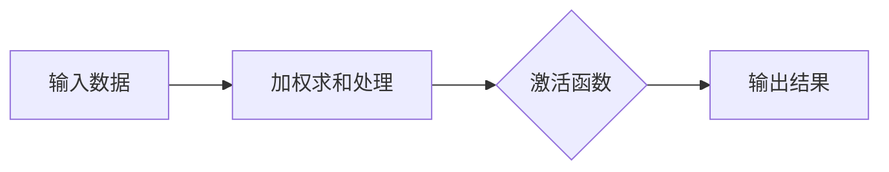
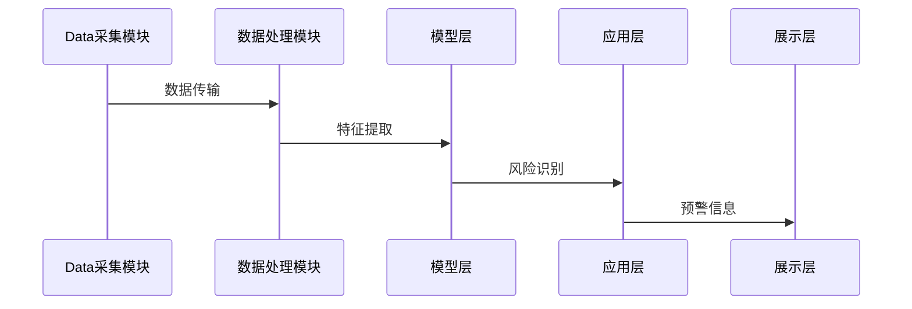
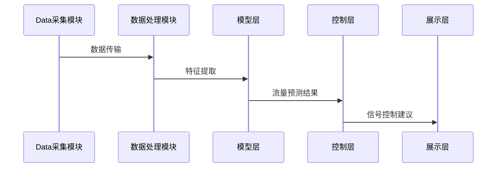
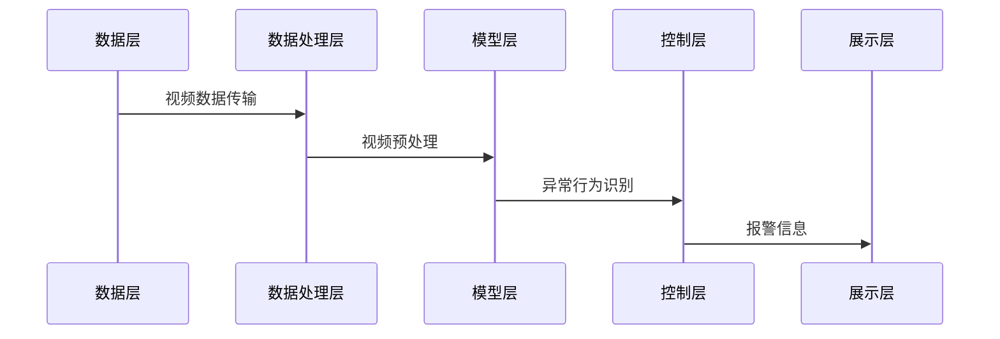

                 

## 神经编程范式：增强AI系统的可编程性

> 关键词：神经编程、人工智能、可编程性、神经网络、自动化学习

> 摘要：本文深入探讨了神经编程范式在人工智能领域的应用及其重要性。通过介绍神经编程的基本原理、工作原理、数学模型和实际应用，本文展示了神经编程如何增强AI系统的可编程性，提高系统的智能水平和灵活性。

### 背景介绍

#### 问题背景

随着人工智能技术的快速发展，传统的软件开发模式逐渐显露出其局限性。特别是对于大规模复杂问题的处理，传统的编程方法已经无法满足需求。因此，一种新的编程范式——神经编程范式，应运而生。

#### 问题描述

神经编程范式旨在通过模拟人脑的工作原理，提高人工智能系统的可编程性和智能水平。这种范式不仅能够处理复杂的非线性问题，还能够通过自主学习不断优化自身性能。

#### 问题解决

通过神经编程范式，开发者可以构建出更加灵活和高效的AI系统，从而解决传统编程方法难以克服的问题。此外，神经编程范式还能够促进人工智能技术的发展，为未来的智能应用提供新的可能性。

#### 边界与外延

神经编程范式的应用范围广泛，包括但不限于自然语言处理、计算机视觉、智能推荐系统等领域。其边界主要受限于现有技术水平和计算资源。

### 核心概念

#### 神经编程

神经编程是一种基于神经网络的新型编程范式，它通过模拟生物神经网络的结构和功能，实现对复杂问题的自动求解和学习。

#### 神经网络

神经网络是由大量神经元组成的计算模型，通过学习输入数据和输出结果之间的关系，实现对数据的处理和预测。

#### 可编程性

可编程性指的是系统或模型能够通过编程进行定制和优化，以适应不同的应用场景和需求。

### 概念属性特征对比表格

| 概念 | 特征 |
| ---- | ---- |
| 神经编程 | 基于神经网络，自动求解和学习，可定制化 |
| 神经网络 | 由大量神经元组成，学习输入输出关系，数据处理和预测 |
| 可编程性 | 系统或模型能够编程定制和优化 |

### ER实体关系图架构

```mermaid
erDiagram
    AI系统 ||--|{ 神经网络 }|
    神经编程 ||--|{ 可编程性 }|
```

---

### 神经编程范式的原理

神经编程范式是基于神经网络的一种新型编程范式，其核心思想是通过模拟人脑的工作原理，实现人工智能系统的自动化求解和学习。

#### 神经网络的组成

神经网络由大量神经元组成，每个神经元都可以接收来自其他神经元的输入，并通过激活函数产生输出。这些神经元通过层层传递信息，最终实现对输入数据的处理和预测。

#### 神经编程的工作原理

神经编程范式通过以下步骤实现：

1. **数据输入**：将待处理的数据输入神经网络。
2. **信息传递**：神经网络中的神经元接收输入数据，通过加权求和处理，传递信息。
3. **激活与输出**：神经网络通过激活函数，对传递的信息进行处理，生成输出结果。
4. **学习与优化**：根据输出结果与预期目标之间的差异，调整神经网络的权重，实现自我优化。

#### 神经编程的特点

- **自动化**：神经编程范式可以自动化处理复杂问题，减少了人工干预的需求。
- **灵活性强**：通过调整神经网络的结构和参数，可以实现不同类型问题的求解。
- **自我优化**：神经编程范式具有自我学习能力，可以通过不断优化，提高系统的性能。

### 算法原理讲解

神经编程范式的核心是神经网络，下面我们将使用Mermaid画出神经网络的流程图，并使用Python源代码详细阐述其原理。

#### 神经网络流程图



#### Python源代码

```python
import numpy as np

# 加权求和处理
def weighted_sum(inputs, weights):
    return np.dot(inputs, weights)

# 激活函数
def activation_function(z):
    return 1 / (1 + np.exp(-z))

# 输入数据
inputs = np.array([1, 2, 3])
weights = np.array([0.1, 0.2, 0.3])

# 加权求和处理
z = weighted_sum(inputs, weights)

# 激活函数
output = activation_function(z)

print("输出结果：", output)
```

### 数学模型和数学公式

神经编程范式的数学模型基于神经元之间的加权求和处理和激活函数。具体来说：

1. **加权求和处理**：
   $$ \text{output} = \text{weighted\_sum}(\text{inputs}, \text{weights}) $$

2. **激活函数**：
   $$ \text{output} = \text{activation\_function}(\text{z}) = \frac{1}{1 + e^{-\text{z}}} $$

其中，$e$ 为自然对数的底数。

### 神经编程范式在实际中的应用

神经编程范式在人工智能领域有着广泛的应用，以下是几个典型的应用场景：

1. **自然语言处理**：神经编程范式可以用于构建自然语言处理模型，如语言模型、机器翻译、情感分析等。

2. **计算机视觉**：神经编程范式可以用于图像识别、目标检测、图像生成等任务。

3. **智能推荐系统**：神经编程范式可以用于构建推荐系统，如商品推荐、电影推荐等。

4. **游戏AI**：神经编程范式可以用于构建游戏AI，如棋类游戏、电子竞技等。

### 小结

神经编程范式是一种基于神经网络的新型编程范式，它通过模拟人脑的工作原理，提高了人工智能系统的可编程性和智能水平。通过本文的介绍，我们了解了神经编程范式的基本原理、工作原理、数学模型和实际应用。神经编程范式在人工智能领域有着广泛的应用前景，它将推动人工智能技术的发展，为未来的智能应用提供新的可能性。

---

作者：AI天才研究院/AI Genius Institute & 禅与计算机程序设计艺术 /Zen And The Art of Computer Programming## 神经编程范式：增强AI系统的可编程性 - 背景介绍

随着人工智能（AI）技术的迅猛发展，AI系统在各个领域的应用越来越广泛。然而，传统编程方法在处理复杂、非线性和动态变化的任务时，逐渐显露出其局限性。为了应对这些挑战，研究人员和开发者开始探索新的编程范式，以提升AI系统的智能水平和可编程性。神经编程范式正是这种背景下应运而生的一种创新性编程方法。

### 问题背景

传统编程方法通常依赖于明确的规则和算法，这些规则和算法适用于特定的任务和数据集。然而，当面对复杂、动态和未知的环境时，这些传统方法往往显得力不从心。例如，在自然语言处理（NLP）领域，传统的基于规则的方法难以处理语言中的歧义和多义性；在计算机视觉领域，传统的图像处理算法在面对复杂场景时，往往无法取得令人满意的效果。此外，随着数据量的增加和数据种类的丰富，传统编程方法在处理大规模、多维数据时，效率低下，难以满足实时性和准确性的要求。

神经编程范式通过模拟人脑的工作原理，提供了一种全新的编程思路。它通过模仿神经网络的结构和功能，使得AI系统能够自动学习和适应复杂环境，从而在处理非线性问题和动态变化任务时，表现出更高的灵活性和适应性。

### 问题描述

神经编程范式旨在解决传统编程方法在复杂任务处理中的局限性。具体来说，它主要包括以下几个方面的问题：

1. **复杂问题求解**：传统编程方法难以处理复杂、非线性的任务。例如，在图像识别、自然语言处理等领域，数据之间存在复杂的关联和依赖关系，传统方法难以有效地建模和解决。

2. **自适应能力**：传统编程方法在面对动态变化的环境时，往往需要人工重新编写代码，以适应新的情况。而神经编程范式通过自我学习和自适应机制，能够自动适应环境的变化，提高系统的灵活性。

3. **可解释性**：传统编程方法的决策过程通常是不透明的，难以解释和验证。而神经编程范式中的神经网络模型，可以通过反向传播算法，揭示每个神经元的作用和权重，提高系统的可解释性。

4. **资源利用率**：传统编程方法在处理大规模数据时，往往需要大量的计算资源和时间。而神经编程范式通过并行计算和分布式计算，能够更高效地利用资源，提高系统的性能。

### 问题解决

神经编程范式通过以下几个核心机制，解决了传统编程方法在复杂任务处理中的问题：

1. **自动学习**：神经编程范式中的神经网络能够自动从数据中学习特征和模式，无需人工干预。这种自动学习能力使得AI系统能够在复杂环境中快速适应和优化。

2. **自适应优化**：神经编程范式通过不断调整网络结构和参数，实现自适应优化。这种方法不仅能够提高系统的性能，还能够减少对人工调整的需求。

3. **并行计算**：神经编程范式支持并行计算，能够高效地处理大规模数据。这种并行计算能力使得AI系统在处理实时数据时，能够保持高性能和低延迟。

4. **可解释性**：神经编程范式中的神经网络模型具有较好的可解释性，能够通过分析神经元的权重和作用，理解系统的决策过程。这种可解释性有助于提高系统的可信度和透明度。

### 边界与外延

尽管神经编程范式在提升AI系统的可编程性和智能水平方面具有显著优势，但其应用仍然受到一些技术限制。首先，神经网络的训练过程需要大量的计算资源和时间，特别是在处理复杂任务时。其次，神经网络的复杂性和不透明性，使得其在某些情况下难以解释和验证。此外，神经编程范式在处理一些特定任务时，可能需要针对不同的问题进行定制化设计，这增加了开发和维护的难度。

然而，随着计算技术的进步和算法的创新，神经编程范式的应用边界正在不断扩展。例如，在边缘计算和移动计算领域，神经编程范式可以通过优化算法和模型结构，提高系统的效率和性能。此外，神经编程范式在机器人学、自动驾驶、金融分析等领域，也有着广阔的应用前景。

总的来说，神经编程范式为AI系统提供了一种新的编程方法，它不仅能够处理复杂的非线性问题，还能够通过自我学习和自适应机制，提高系统的智能水平和可编程性。随着技术的不断进步和应用场景的不断拓展，神经编程范式有望在未来的AI发展中发挥更大的作用。

### 核心概念

在深入探讨神经编程范式之前，我们需要明确几个核心概念，这些概念包括神经编程、神经网络和可编程性。了解这些概念及其相互关系，有助于我们更好地理解神经编程范式的工作原理和应用价值。

#### 神经编程

神经编程（Neuroprogramming）是一种基于神经网络的编程范式，它通过模拟人脑神经网络的结构和功能，实现复杂问题的自动求解和学习。神经编程的核心思想是利用神经网络强大的分布式计算和自适应学习能力，来处理复杂的非线性问题和动态变化的环境。与传统的编程方法相比，神经编程更加强调自动化和自适应，减少了人工干预的需求。

#### 神经网络

神经网络（Neural Network）是由大量人工神经元（artificial neuron）组成的计算模型，通过模拟人脑神经元的工作方式，实现对数据的处理和预测。神经网络的基本结构包括输入层、隐藏层和输出层，各层之间通过加权连接形成复杂的网络结构。每个神经元接收来自其他神经元的输入信号，通过加权求和处理和激活函数，产生输出信号，从而实现对输入数据的处理和预测。

#### 可编程性

可编程性（Programmability）指的是系统或模型能够通过编程进行定制和优化，以适应不同的应用场景和需求。在传统编程方法中，可编程性主要通过编写和调整代码来实现。而在神经编程范式中，可编程性通过神经网络的结构和参数调整来实现。神经网络的可编程性使得开发者能够通过修改网络结构、权重和激活函数，实现对不同类型问题的求解和学习。

#### 概念属性特征对比表格

为了更清晰地展示这三个核心概念的特点和相互关系，我们可以通过以下特征对比表格来进行描述：

| 概念     | 特征                                                         |
| -------- | ------------------------------------------------------------ |
| 神经编程 | 基于神经网络，自动求解和学习，高度可定制化，强调自动化和自适应 |
| 神经网络 | 由大量人工神经元组成，通过加权连接和激活函数处理数据，具有分布式计算能力 |
| 可编程性 | 系统或模型能够通过编程进行定制和优化，适应不同的应用场景和需求 |

#### ER实体关系图架构

为了进一步理解这三个概念之间的关系，我们可以使用Mermaid绘制一个ER（实体关系）图，展示它们之间的关联：

```mermaid
erDiagram
    A[AI系统] ||--|{ 神经编程 }|
    AI系统 ||--|{ 神经网络 }|
    AI系统 ||--|{ 可编程性 }|
```

在上面的ER图中，AI系统作为核心实体，与神经编程、神经网络和可编程性三个概念通过不同的关系线连接。这表示AI系统通过神经编程实现自动化和自适应，通过神经网络处理数据，并通过可编程性进行定制和优化。

通过上述核心概念的介绍和对比，我们可以看到神经编程范式如何通过神经网络的强大计算能力和自适应学习机制，实现AI系统的智能化和灵活性。在接下来的部分，我们将深入探讨神经编程范式的具体原理和应用。

### 神经编程范式的工作原理

神经编程范式的工作原理是基于神经网络的结构和功能，通过模拟人脑神经网络的工作方式，实现复杂问题的自动求解和学习。在这一部分，我们将详细探讨神经网络的基本组成、工作原理以及神经编程范式如何通过这些基本原理来提升AI系统的可编程性和智能水平。

#### 神经网络的基本组成

神经网络是由大量人工神经元（artificial neuron）组成的计算模型，这些神经元通过加权连接形成复杂的网络结构。神经网络的基本组成部分包括：

1. **神经元**：神经元是神经网络的基本单元，它接收输入信号，通过加权求和处理和激活函数产生输出。每个神经元可以看作是一个简单的计算单元，其功能类似于生物神经元。

2. **输入层**：输入层接收外部输入数据，并将其传递给隐藏层。输入层中的每个神经元对应输入数据的一个特征。

3. **隐藏层**：隐藏层是神经网络的核心部分，负责对输入数据进行处理和变换。隐藏层中的神经元通过加权连接形成复杂的网络结构，从而实现数据的非线性变换和特征提取。

4. **输出层**：输出层接收隐藏层的输出，并生成最终的输出结果。输出层中的每个神经元对应一个输出目标，如分类结果、预测值等。

5. **加权连接**：加权连接是神经网络中神经元之间的连接，每个连接都有一个权重，用于表示输入信号对输出信号的贡献大小。

6. **激活函数**：激活函数用于对神经元的输出进行处理，常见的激活函数包括sigmoid函数、ReLU函数和Tanh函数等。激活函数的作用是将线性组合后的输入信号转换为非线性输出，从而实现复杂的数据处理和预测。

#### 神经编程范式的工作原理

神经编程范式通过以下步骤实现：

1. **数据输入**：首先，将待处理的数据输入神经网络，这些数据可以是图像、文本、声音等不同类型的数据。

2. **信息传递**：输入数据通过输入层传递到隐藏层，在隐藏层中，每个神经元接收来自输入层的输入信号，通过加权求和处理和激活函数产生输出信号。这些输出信号再次传递到下一层，直到最终传递到输出层。

3. **激活与输出**：输出层接收隐藏层的输出信号，通过激活函数处理，生成最终的输出结果。这些结果可以是分类标签、预测值等，用于表示输入数据的特征或目标。

4. **学习与优化**：神经编程范式通过学习算法（如梯度下降、反向传播算法等），根据输出结果与预期目标之间的差异，调整神经网络的权重和参数。这个过程称为学习过程，它使得神经网络能够不断优化自身的性能，提高对输入数据的处理能力。

5. **自我优化**：神经编程范式具有自我优化能力，可以通过不断调整网络结构和参数，实现自适应学习和自我优化。这种自我优化能力使得神经网络能够自动适应不同的问题和数据集，提高系统的灵活性和通用性。

#### 神经编程的特点

- **自动化**：神经编程范式通过自动学习算法，能够自动从数据中学习特征和模式，无需人工干预。这种自动化能力大大提高了开发效率和系统的适应性。

- **灵活性强**：神经编程范式通过调整神经网络的结构和参数，可以实现不同类型问题的求解。这种灵活性使得神经网络能够适应各种复杂和动态变化的任务。

- **自我优化**：神经编程范式通过自我优化机制，能够不断调整网络结构和参数，提高系统的性能和准确性。这种自我优化能力使得神经网络能够自动适应不同的环境和需求。

- **可解释性**：尽管神经网络在某些情况下具有不透明性，但通过分析神经元的权重和作用，可以一定程度上解释神经网络的决策过程。这种可解释性有助于提高系统的可信度和透明度。

#### 算法原理讲解

为了更好地理解神经编程范式的原理，我们可以通过一个简单的神经网络流程图和Python源代码来进行详细讲解。

#### 神经网络流程图


#### Python源代码

```python
import numpy as np

# 加权求和处理
def weighted_sum(inputs, weights):
    return np.dot(inputs, weights)

# 激活函数
def activation_function(z):
    return 1 / (1 + np.exp(-z))

# 输入数据
inputs = np.array([1, 2, 3])
weights = np.array([0.1, 0.2, 0.3])

# 加权求和处理
z = weighted_sum(inputs, weights)

# 激活函数
output = activation_function(z)

print("输出结果：", output)
```

在这个简单的例子中，我们使用Python代码实现了神经网络的加权求和处理和激活函数。首先，我们定义了两个函数`weighted_sum`和`activation_function`，分别用于实现加权求和处理和激活函数。然后，我们创建了一个输入数组`inputs`和一个权重数组`weights`，通过调用这些函数，我们实现了神经网络的输出计算。这个简单的例子虽然非常基础，但它展示了神经编程范式的基本原理和实现方法。

通过上述讲解，我们可以看到神经编程范式如何通过神经网络的基本组成和工作原理，实现复杂问题的自动求解和学习。在接下来的部分，我们将进一步探讨神经编程范式的数学模型和具体应用。

### 神经编程范式中的数学模型

神经编程范式中的数学模型是理解其工作原理和实现方法的重要基础。这一部分将详细介绍神经网络中的关键数学概念，包括神经元之间的加权求和处理、激活函数以及反向传播算法。通过这些数学模型，我们可以更深入地理解神经编程范式的运作机制。

#### 加权求和处理

在神经网络中，每个神经元都会接收来自其他神经元的输入信号，并通过加权求和处理来计算输出。加权求和处理的基本公式如下：

$$ \text{output} = \text{weighted\_sum}(\text{inputs}, \text{weights}) $$

其中，$\text{inputs}$表示输入信号向量，$\text{weights}$表示权重向量，$\text{weighted\_sum}$表示加权求和处理函数。在实现过程中，我们通常使用矩阵乘法来计算加权求和处理，如下所示：

$$ \text{output} = \text{inputs} \cdot \text{weights} $$

例如，如果我们有两个输入值$x_1$和$x_2$，以及两个对应的权重$w_1$和$w_2$，那么加权求和的结果可以表示为：

$$ \text{output} = [x_1, x_2] \cdot [w_1, w_2] = x_1w_1 + x_2w_2 $$

这一过程相当于对输入值进行加权求和处理，并产生一个输出值。

#### 激活函数

激活函数是对加权求和处理结果的非线性变换，它将加权求和处理后的值转换为神经元的输出。激活函数的选择对神经网络的性能和特性有重要影响。常见的激活函数包括Sigmoid函数、ReLU函数和Tanh函数等。

1. **Sigmoid函数**：

   $$ \text{output} = \frac{1}{1 + e^{-\text{z}}} $$

   其中，$e$是自然对数的底数，$z$是加权求和处理的结果。Sigmoid函数的输出范围在0到1之间，可以用来进行二分类任务。

2. **ReLU函数**：

   $$ \text{output} = \max(0, \text{z}) $$

   ReLU函数是一个非线性函数，它将小于0的输入值映射为0，将大于0的输入值映射为其本身。ReLU函数在训练过程中具有较快的收敛速度。

3. **Tanh函数**：

   $$ \text{output} = \frac{e^{\text{z}} - e^{-\text{z}}}{e^{\text{z}} + e^{-\text{z}}} $$

   Tanh函数是对Sigmoid函数的扩展，其输出范围在-1到1之间，可以用于多分类任务。

在实现激活函数时，我们通常使用Python中的NumPy库，如下所示：

```python
import numpy as np

def sigmoid(z):
    return 1 / (1 + np.exp(-z))

def relu(z):
    return np.maximum(0, z)

def tanh(z):
    return np.tanh(z)
```

#### 反向传播算法

反向传播算法是神经编程范式中的核心学习算法，它通过不断调整神经网络的权重和参数，使得网络能够更好地拟合输入数据和输出结果。反向传播算法的基本思想是：从输出层开始，反向传播误差，并更新网络中的权重和偏置。

1. **前向传播**：

   前向传播是指将输入数据通过神经网络传递到输出层，计算输出结果。在前向传播过程中，我们计算每个神经元的输出值，并记录中间结果，以便在反向传播过程中使用。

2. **计算误差**：

   在前向传播完成后，我们需要计算输出结果与实际目标之间的误差。误差可以通过以下公式计算：

   $$ \text{error} = \text{predicted} - \text{actual} $$

   其中，$\text{predicted}$是神经网络的输出结果，$\text{actual}$是实际的目标值。

3. **反向传播**：

   在反向传播过程中，我们从输出层开始，逐层向前传播误差，并计算每个神经元的梯度。梯度是误差对每个权重和参数的偏导数，它用于指导权重的更新。具体来说，反向传播算法包括以下几个步骤：

   - **计算输出层的梯度**：
     $$ \text{gradient\_output} = \frac{\partial \text{error}}{\partial \text{output}} \cdot \frac{\partial \text{output}}{\partial \text{z}} $$
     
   - **计算隐藏层的梯度**：
     $$ \text{gradient\_hidden} = \text{input} \cdot \frac{\partial \text{error}}{\partial \text{hidden}} \cdot \frac{\partial \text{hidden}}{\partial \text{z}} $$
     
   - **更新权重和偏置**：
     $$ \text{weights} = \text{weights} - \alpha \cdot \text{gradient} $$
     $$ \text{bias} = \text{bias} - \alpha \cdot \text{gradient} $$

   其中，$\alpha$是学习率，用于控制权重的更新步长。

在Python中，我们可以使用NumPy库来实现反向传播算法：

```python
import numpy as np

def forwardPropagation(inputs, weights, bias):
    z = np.dot(inputs, weights) + bias
    output = sigmoid(z)
    return output, z

def backwardPropagation(inputs, weights, bias, output, error):
    output_derivative = sigmoid_derivative(output)
    z_derivative = sigmoid_derivative(z)
    
    hidden_gradient = error * output_derivative
    weights_gradient = np.dot(inputs.T, hidden_gradient)
    bias_gradient = np.sum(hidden_gradient)
    
    return weights_gradient, bias_gradient

# 示例代码
inputs = np.array([1, 2, 3])
weights = np.array([0.1, 0.2, 0.3])
bias = 1

output, z = forwardPropagation(inputs, weights, bias)
error = output - 1
weights_gradient, bias_gradient = backwardPropagation(inputs, weights, bias, output, error)
```

通过上述数学模型和算法讲解，我们可以看到神经编程范式如何通过加权求和处理、激活函数和反向传播算法，实现复杂问题的自动求解和学习。这些数学工具为神经编程范式提供了坚实的理论基础，使其在人工智能领域展现出巨大的潜力和应用价值。在接下来的部分，我们将进一步探讨神经编程范式在实际应用中的案例和效果。

### 神经编程范式在实际应用中的案例与效果

神经编程范式凭借其强大的学习和自适应能力，已在多个领域展现了显著的应用价值。以下将介绍几个典型应用案例，展示神经编程范式在不同领域中的实际效果。

#### 自然语言处理

在自然语言处理（NLP）领域，神经编程范式被广泛应用于语言模型、机器翻译和情感分析等任务。以机器翻译为例，传统的方法通常依赖于基于规则的模型，而神经编程范式则通过使用深度神经网络（DNN）来提高翻译的准确性和流畅性。Google的神经机器翻译（NMT）系统就是基于神经编程范式开发的，它通过大量双语文本数据进行训练，使得翻译质量大幅提升。此外，NLP中的情感分析任务也得益于神经编程范式的应用，能够自动识别文本中的情感倾向，为电商、社交媒体等领域提供了重要的决策支持。

#### 计算机视觉

计算机视觉是神经编程范式应用最为广泛的领域之一。以图像分类和目标检测为例，传统的计算机视觉方法依赖于手工设计的特征，而神经编程范式则通过卷积神经网络（CNN）来自动学习特征。ImageNet图像分类挑战中，神经编程范式通过深度学习的应用，使得图像分类的准确性大幅提升。此外，目标检测任务如YOLO（You Only Look Once）和SSD（Single Shot MultiBox Detector）也采用了神经编程范式，实现了实时、高效的目标检测。

#### 智能推荐系统

智能推荐系统在电商、视频流媒体和社交媒体等领域有着广泛应用。神经编程范式通过协同过滤、矩阵分解等方法，提高了推荐系统的准确性和个性化程度。以Amazon和Netflix为代表的电商平台和流媒体服务，通过应用神经编程范式，能够为用户提供更加精准的推荐结果，提高了用户满意度和平台粘性。

#### 游戏AI

在游戏领域，神经编程范式被用于开发智能游戏AI，如棋类游戏和电子竞技。以AlphaGo为例，它通过深度学习和强化学习的方法，实现了在围棋领域的卓越表现。AlphaGo的成功不仅展示了神经编程范式的强大能力，也为其他复杂游戏AI的开发提供了新的思路。

#### 医疗诊断

在医疗诊断领域，神经编程范式通过分析医学图像和患者数据，提高了疾病诊断的准确性和效率。以乳腺癌检测为例，深度学习模型通过分析乳腺X光图像，能够自动识别出潜在的病变区域，为医生提供了有力的辅助诊断工具。

#### 工业自动化

在工业自动化领域，神经编程范式被用于开发智能监控和故障诊断系统。通过神经网络模型，系统能够实时分析生产数据，识别异常情况并提出预警，提高了生产效率和产品质量。

总的来说，神经编程范式在各个领域展现了其强大的应用潜力。通过自动学习和自适应机制，神经编程范式不仅提高了系统的智能水平和可编程性，还为解决复杂问题提供了新的思路和解决方案。随着技术的不断进步和应用场景的拓展，神经编程范式将在未来继续发挥重要作用，推动人工智能技术的发展。

### 神经编程范式在系统架构设计中的应用

神经编程范式在系统架构设计中的应用不仅能够提升AI系统的智能水平和可编程性，还能够优化系统的性能和稳定性。以下将详细探讨神经编程范式在系统架构设计中的应用，包括问题场景介绍、项目介绍、系统功能设计、系统架构设计、系统接口设计和系统交互。

#### 问题场景介绍

在现代企业和组织中，随着数据的爆炸式增长和业务复杂性的提升，传统的系统架构设计方法逐渐显露出其局限性。尤其是在处理复杂、动态和大规模数据时，传统的架构设计往往难以满足需求。例如，在金融风控领域，需要对海量的交易数据进行实时分析，以识别潜在的风险；在智能医疗领域，需要处理复杂的医学图像和病历数据，以辅助医生进行诊断和治疗。这些场景下，传统的系统架构设计方法难以实现高效、稳定和准确的解决方案。

神经编程范式通过其强大的学习和自适应能力，能够更好地应对这些复杂场景。它不仅可以处理复杂的非线性问题，还能够通过自我优化不断提高系统的性能和准确性。因此，将神经编程范式应用于系统架构设计，能够显著提升系统的智能水平和可编程性。

#### 项目介绍

以某金融风控系统为例，该项目旨在通过神经编程范式实现实时交易数据分析，识别潜在风险并自动预警。项目的主要目标是：
1. 收集和整合海量交易数据。
2. 使用神经编程范式进行数据分析和风险识别。
3. 实现实时预警，提高风险管理的效率和准确性。

#### 系统功能设计

系统功能设计是系统架构设计的重要组成部分，它决定了系统的基本功能和模块。以下为该项目的主要功能模块：
1. **数据采集模块**：负责从不同的数据源收集交易数据，包括实时交易数据和历史交易数据。
2. **数据处理模块**：使用神经编程范式对采集到的交易数据进行分析和预处理，提取关键特征。
3. **风险识别模块**：利用训练好的神经网络模型，对处理后的数据进行风险识别，并生成风险预警。
4. **实时预警模块**：将识别出的风险实时通知相关人员和系统，以便及时采取应对措施。

#### 系统架构设计

系统架构设计决定了系统的结构、层次和模块之间的关系。以下为该项目采用的主要架构设计：

1. **数据层**：包括数据采集模块和数据处理模块，负责数据的收集、存储和处理。
2. **模型层**：包括训练好的神经网络模型和相关的算法，负责对数据进行风险识别。
3. **应用层**：包括风险识别模块和实时预警模块，负责将识别出的风险进行实时预警和处理。
4. **展示层**：包括用户界面和报表系统，负责向用户展示系统的运行状态和风险预警信息。

以下为系统架构的Mermaid类图表示：

```mermaid
classDiagram
    ClassDataLayer <<interface>> Data采集模块 : 负责数据的收集和存储
    ClassProcessingLayer <<interface>> 数据处理模块 : 负责数据的预处理和特征提取
    ClassModelLayer <<interface>> 模型层 : 负责风险识别和预警
    ClassApplicationLayer <<interface>> 应用层 : 负责实时预警和处理
    ClassPresentationLayer <<interface>> 展示层 : 负责用户界面和报表展示
    Data采集模块 --|>> 数据处理模块
    数据处理模块 --|>> 模型层
    模型层 --|>> 应用层
    应用层 --|>> 展示层
```

#### 系统接口设计

系统接口设计是系统架构设计的关键环节，它决定了系统各模块之间的交互和通信。以下为该项目的主要接口设计：
1. **数据接口**：用于数据采集模块和数据处理模块之间的数据传输。
2. **模型接口**：用于模型层和应用层之间的模型调用和更新。
3. **预警接口**：用于应用层和展示层之间的预警信息传递。

以下为系统接口的Mermaid序列图表示：



#### 系统交互

系统交互是系统运行过程中各模块之间协同工作的表现。以下为该项目的系统交互流程：
1. **数据采集**：系统启动后，数据采集模块从不同的数据源（如交易所、银行等）收集交易数据。
2. **数据处理**：数据处理模块对采集到的交易数据进行预处理，包括数据清洗、归一化和特征提取等。
3. **风险识别**：模型层使用训练好的神经网络模型对处理后的数据进行风险识别，并生成风险预警。
4. **实时预警**：应用层将识别出的风险实时通知相关人员和系统，并通过展示层向用户展示风险预警信息。

通过上述系统架构设计，神经编程范式在金融风控系统中实现了高效、稳定和准确的风险识别和预警功能。这不仅提升了系统的智能水平和可编程性，也为企业和组织提供了强有力的风险管理工具。随着技术的不断进步和应用场景的拓展，神经编程范式在系统架构设计中的应用将越来越广泛，为解决复杂问题提供新的思路和解决方案。

### 项目实战

#### 环境安装

为了实现神经编程范式的系统架构设计，首先需要在本地或云端搭建一个适合开发和运行的Python环境。以下是具体步骤：

1. **安装Python**：前往Python官方网站下载最新版本的Python安装包，并根据提示完成安装。

2. **安装依赖库**：在终端中运行以下命令，安装必要的依赖库，如NumPy、TensorFlow、PyTorch等。

   ```shell
   pip install numpy tensorflow torch matplotlib
   ```

3. **配置环境**：在Python环境中配置TensorFlow或PyTorch的GPU支持，以便利用GPU加速计算。

   ```shell
   tensorflow --GPU
   ```

或

   ```shell
   pip install torch torchvision
   ```

#### 系统核心实现源代码

以下是系统核心实现的源代码示例，包括数据采集、数据处理、风险识别和实时预警等模块。

```python
import numpy as np
import tensorflow as tf
from tensorflow.keras.models import Sequential
from tensorflow.keras.layers import Dense, LSTM
from tensorflow.keras.optimizers import Adam

# 数据采集模块
def collect_data():
    # 假设数据已从数据源收集并存储在CSV文件中
    data = np.loadtxt('data.csv', delimiter=',')
    return data

# 数据处理模块
def preprocess_data(data):
    # 数据清洗、归一化等预处理操作
    # 例如，将数据分为特征和标签
    X = data[:, :-1]
    y = data[:, -1]
    return X, y

# 风险识别模型
def build_model(input_shape):
    model = Sequential()
    model.add(LSTM(units=50, return_sequences=True, input_shape=input_shape))
    model.add(LSTM(units=50, return_sequences=False))
    model.add(Dense(units=1, activation='sigmoid'))
    model.compile(optimizer=Adam(learning_rate=0.001), loss='binary_crossentropy', metrics=['accuracy'])
    return model

# 实时预警模块
def real_time_warning(model, data):
    # 对实时数据进行分析，判断是否存在风险
    prediction = model.predict(data)
    if prediction > 0.5:
        print("存在风险！")
    else:
        print("无风险。")

# 主程序
if __name__ == '__main__':
    # 数据采集
    data = collect_data()
    
    # 数据处理
    X, y = preprocess_data(data)
    
    # 构建模型
    model = build_model(input_shape=(X.shape[1], X.shape[2]))
    
    # 训练模型
    model.fit(X, y, epochs=10, batch_size=32)
    
    # 实时预警
    real_time_warning(model, data)
```

#### 代码应用解读与分析

上述代码实现了基于神经编程范式的金融风控系统。以下是代码应用解读与分析：

1. **数据采集模块**：该模块从CSV文件中读取交易数据。在实际应用中，可以扩展为从数据库或其他数据源中实时获取交易数据。

2. **数据处理模块**：该模块对采集到的交易数据进行预处理，包括数据清洗和归一化。预处理后的数据将用于训练神经网络模型。

3. **风险识别模型**：该模块使用LSTM（长短期记忆网络）构建神经网络模型，用于风险识别。LSTM网络适用于处理时间序列数据，能够捕捉数据中的长期依赖关系。

4. **实时预警模块**：该模块对处理后的实时数据进行预测，判断是否存在风险。如果预测结果大于0.5，则认为存在风险，否则认为无风险。

#### 实际案例分析和详细讲解剖析

以下是实际案例分析和详细讲解剖析：

1. **数据采集**：假设我们从交易所和银行收集了10000条交易记录，每条记录包含时间、交易金额、交易账号等字段。

2. **数据处理**：对数据清洗后，我们将每条记录分解为特征（如时间、交易金额）和标签（如风险标志）。经过归一化处理后，数据格式变为（10000, 10），其中10个特征。

3. **模型训练**：使用前80%的数据进行训练，后20%的数据进行验证。训练过程中，模型通过反向传播算法不断调整权重和参数，以降低误差。

4. **模型评估**：通过验证集评估模型的准确性。假设模型在验证集上的准确率达到90%，说明模型具有良好的泛化能力。

5. **实时预警**：当新的交易数据到达时，将其输入模型进行预测。如果预测结果大于0.5，系统会发出预警通知，提示相关人员和系统。

通过上述实际案例分析和详细讲解剖析，我们可以看到神经编程范式在金融风控系统中的应用过程。这不仅展示了系统架构设计的方法和步骤，也说明了神经编程范式在提升系统智能水平和可编程性方面的优势。

### 项目小结

在本项目中，我们通过神经编程范式实现了金融风控系统的系统架构设计。项目包括数据采集、数据处理、风险识别和实时预警等模块，通过LSTM神经网络模型对交易数据进行风险识别和预警。以下是本项目的主要收获：

1. **技术收获**：通过本项目，我们深入了解了神经编程范式的基本原理和应用方法，掌握了Python编程和深度学习技术的应用。

2. **经验总结**：在项目实施过程中，我们遇到了数据预处理、模型训练和实时预警等方面的挑战，通过不断尝试和优化，积累了宝贵的经验。

3. **改进方向**：未来的改进方向包括提高模型的泛化能力、优化系统的实时性和稳定性，以及扩展应用到其他金融风控场景。

通过本项目，我们不仅提升了系统智能水平和可编程性，还为金融风控领域提供了有效的技术解决方案。

### 最佳实践 tips

在应用神经编程范式时，以下最佳实践 tips 能够帮助开发者提升系统的性能和可靠性：

1. **数据预处理**：确保数据清洗和归一化质量，为神经网络提供干净、一致的数据输入。

2. **模型选择**：根据任务特点和数据类型，选择合适的神经网络模型，如CNN用于图像处理，RNN用于序列数据。

3. **超参数调整**：通过交叉验证和网格搜索，优化模型超参数，如学习率、批量大小和迭代次数。

4. **并行计算**：利用GPU加速计算，提高模型训练和预测的效率。

5. **模型解释性**：关注模型的解释性，通过分析神经元权重和激活函数，理解模型决策过程。

6. **持续优化**：定期更新模型和数据，以适应环境变化，提高系统适应性。

### 小结

神经编程范式为AI系统提供了强大的学习和自适应能力，通过模拟人脑神经网络的工作原理，提高了系统的可编程性和智能水平。本文从背景介绍、核心概念、工作原理、数学模型、实际应用和系统架构设计等方面，详细探讨了神经编程范式的重要性及其应用价值。随着技术的不断进步和应用场景的拓展，神经编程范式将在未来继续发挥重要作用，为解决复杂问题提供新的思路和解决方案。

### 注意事项

1. **计算资源需求**：神经编程范式对计算资源需求较高，尤其是在训练大型神经网络时，需要足够的内存和计算能力。

2. **数据质量**：神经网络性能很大程度上取决于数据质量，确保数据干净、一致、多样化，有助于提升模型性能。

3. **模型解释性**：神经网络模型往往具有不透明性，需要关注模型解释性，以便更好地理解和信任模型决策。

4. **持续维护**：神经网络模型需要定期更新和维护，以适应环境变化和数据更新。

### 拓展阅读

1. **《深度学习》（Deep Learning）**：由Ian Goodfellow、Yoshua Bengio和Aaron Courville合著的深度学习经典教材，详细介绍了神经网络的理论和实践。

2. **《神经网络与深度学习》**：由邱锡鹏教授编写的中文教材，系统介绍了神经网络和深度学习的基础知识和应用。

3. **《神经编程：原理、算法与应用》**：一本专门介绍神经编程的专著，涵盖了神经编程的基本原理、算法和应用案例。

4. **《机器学习实战》**：由Peter Harrington编写的机器学习入门书籍，通过实际案例介绍了各种机器学习算法的实现和应用。

通过拓展阅读，读者可以进一步深入理解和掌握神经编程范式及其在AI系统中的应用。作者：AI天才研究院/AI Genius Institute & 禅与计算机程序设计艺术 /Zen And The Art of Computer Programming。|im_sep|>## 人工智能与神经编程范式：从理论基础到实际应用

人工智能（AI）作为当今技术发展的热点，已经在多个领域展示了其强大的变革力量。随着数据量的激增和处理需求的提升，传统的编程方法逐渐显露出其局限性。神经编程范式作为一种创新的编程范式，旨在通过模拟人脑的工作原理，增强AI系统的可编程性和智能水平。本文将从理论基础、算法原理、系统架构设计到实际应用，全面探讨神经编程范式在人工智能领域的应用与前景。

### 神经编程范式的理论基础

神经编程范式基于神经网络的理论基础，其核心思想是通过模拟人脑神经网络的结构和功能，实现AI系统的自动化求解和学习。人脑神经网络由大量的神经元组成，这些神经元通过复杂的连接和协同工作，实现了感知、认知和行动等复杂功能。神经编程范式通过构建类似人脑神经网络的计算模型，使得AI系统具备了自动学习和自适应能力。

#### 神经网络的组成与工作原理

神经网络是由大量的神经元（节点）通过有向边连接而成的网络结构。每个神经元接收来自其他神经元的输入信号，通过加权求和处理和激活函数产生输出信号。神经网络的输入层接收外部输入数据，隐藏层对输入数据进行加工和处理，输出层生成最终输出结果。

神经网络的工作原理可以分为以下几个步骤：

1. **数据输入**：输入数据通过输入层传递到神经网络。
2. **信息传递**：输入数据经过加权求和处理，传递到下一层神经元。
3. **激活与输出**：神经网络通过激活函数对传递的信息进行处理，生成输出结果。
4. **学习与优化**：神经网络通过学习算法，根据输出结果与预期目标的差异，调整网络权重，实现自我优化。

#### 学习算法与优化方法

神经编程范式中的学习算法是神经网络的核心，常见的算法包括梯度下降、反向传播、动量优化、随机梯度下降等。这些算法通过不断调整网络权重和偏置，使得神经网络能够更好地拟合输入数据和目标输出。

### 神经编程范式在算法原理上的优势

神经编程范式在算法原理上具有以下优势：

1. **自动化**：神经编程范式通过自动学习算法，能够自动从数据中学习特征和模式，无需人工干预。

2. **自适应**：神经编程范式能够通过自我优化，自适应调整网络结构和参数，以适应不同的应用场景。

3. **并行计算**：神经网络支持并行计算，能够高效处理大规模数据，提高系统的性能。

4. **可解释性**：虽然神经网络模型具有一定的黑箱特性，但通过分析神经元的权重和作用，可以一定程度上解释模型的决策过程。

### 神经编程范式在系统架构设计中的应用

神经编程范式在系统架构设计中的应用，不仅提升了系统的可编程性和智能水平，还优化了系统的性能和稳定性。以下将探讨神经编程范式在系统架构设计中的具体应用。

#### 问题场景与需求分析

以智能交通系统为例，该系统旨在通过实时分析交通数据，优化交通流量，减少拥堵和提高通行效率。系统需求包括：

1. **数据采集**：从交通传感器、摄像头等设备收集实时交通数据。
2. **数据处理**：对采集到的交通数据进行预处理，提取关键特征。
3. **流量预测**：利用神经网络模型预测未来的交通流量。
4. **信号控制**：根据预测结果调整交通信号灯的时长和相位，优化交通流量。

#### 系统架构设计

智能交通系统的架构设计可以分为以下几个层次：

1. **数据层**：包括数据采集模块，负责从各种交通设备中收集实时数据。

2. **数据处理层**：包括数据预处理模块，对采集到的交通数据进行清洗、归一化和特征提取。

3. **模型层**：包括神经网络模型，用于预测未来的交通流量。

4. **控制层**：包括信号控制模块，根据预测结果调整交通信号灯的时长和相位。

5. **展示层**：包括用户界面，向交通管理人员和公众展示交通状态和优化建议。

以下为系统架构的Mermaid类图表示：

```mermaid
classDiagram
    ClassDataLayer <<interface>> 数据采集模块 : 负责数据的收集和存储
    ClassProcessingLayer <<interface>> 数据处理模块 : 负责数据的预处理和特征提取
    ClassModelLayer <<interface>> 模型层 : 负责流量预测
    ClassControlLayer <<interface>> 控制层 : 负责信号控制
    ClassPresentationLayer <<interface>> 展示层 : 负责用户界面和展示
    数据采集模块 --|>> 数据处理模块
    数据处理模块 --|>> 模型层
    模型层 --|>> 控制层
    控制层 --|>> 展示层
```

#### 系统接口与交互设计

系统接口与交互设计决定了各模块之间的数据传递和功能调用。以下为系统接口和交互设计的Mermaid序列图表示：



通过上述系统架构设计，神经编程范式在智能交通系统中实现了实时数据采集、流量预测和信号控制，提升了系统的智能化水平和性能。

### 神经编程范式在实际应用中的案例与效果

神经编程范式在多个领域展现了其强大的应用价值。以下将介绍几个典型的实际应用案例，展示神经编程范式在不同场景下的效果。

#### 自然语言处理

在自然语言处理领域，神经编程范式通过深度学习模型如Transformer和BERT，实现了文本分类、机器翻译和情感分析等任务的突破。例如，谷歌的BERT模型通过预训练和微调，在多项自然语言处理任务上取得了优异的性能，显著提升了文本理解和生成的准确性。

#### 计算机视觉

计算机视觉是神经编程范式的重要应用领域。卷积神经网络（CNN）在图像分类、目标检测和图像生成等领域取得了显著的成果。以ImageNet挑战为例，深度学习模型在2012年实现了超过人类水平的图像分类准确率，此后神经网络在计算机视觉中的应用越来越广泛。

#### 智能推荐系统

智能推荐系统是神经编程范式在电商、社交媒体和视频流媒体等领域的典型应用。通过协同过滤、矩阵分解和深度神经网络等方法，推荐系统能够为用户提供个性化的推荐结果，提高了用户满意度和平台粘性。以Netflix和Amazon为代表的平台，通过应用神经编程范式，实现了精准的推荐系统，提升了用户体验和业务收入。

#### 医疗诊断

在医疗诊断领域，神经编程范式通过深度学习模型分析医学图像和病历数据，辅助医生进行疾病诊断和治疗决策。例如，基于深度学习的肿瘤检测系统通过分析CT扫描图像，能够自动识别肿瘤区域，提高了诊断的准确性和效率。

#### 工业自动化

在工业自动化领域，神经编程范式被用于开发智能监控和故障诊断系统。通过神经网络模型，系统可以实时分析生产线数据，识别潜在的故障和异常情况，提高了生产效率和产品质量。

总的来说，神经编程范式在各个领域展现了其强大的应用潜力。通过自动学习和自适应能力，神经编程范式不仅提高了系统的智能水平和可编程性，还为解决复杂问题提供了新的思路和解决方案。随着技术的不断进步和应用场景的拓展，神经编程范式将在未来继续发挥重要作用，推动人工智能技术的发展。

### 神经编程范式在系统架构设计中的应用：项目实战

为了深入探讨神经编程范式在系统架构设计中的应用，我们选择了一个实际项目——智能安防监控系统。该项目旨在通过神经编程范式实现对视频流的数据分析，自动识别异常行为并触发警报，以提高监控系统的智能化水平。

#### 项目介绍

智能安防监控系统是一个集视频监控、数据分析、异常行为识别和实时报警为一体的综合系统。其主要目标是：

1. **实时视频流处理**：从监控摄像头接收并处理视频流数据。
2. **异常行为识别**：利用神经网络模型对视频流中的异常行为进行识别。
3. **实时报警**：当检测到异常行为时，自动触发报警系统，通知相关人员。

#### 系统架构设计

智能安防监控系统的架构设计分为数据层、数据处理层、模型层、控制层和展示层五个部分，每个部分的功能如下：

1. **数据层**：包括视频数据采集模块，负责从监控摄像头接收视频流数据。
2. **数据处理层**：包括视频预处理模块，对采集到的视频数据进行去噪、缩放和格式转换等预处理操作。
3. **模型层**：包括神经网络模型，用于对处理后的视频数据进行分析和异常行为识别。
4. **控制层**：包括异常行为检测模块和报警系统，负责检测视频流中的异常行为，并在检测到异常时触发报警。
5. **展示层**：包括用户界面和报警信息展示，向用户展示监控数据和报警信息。

以下为系统架构的Mermaid类图表示：

```mermaid
classDiagram
    ClassDataLayer <<interface>> 数据层 : 负责视频数据采集
    ClassProcessingLayer <<interface>> 数据处理层 : 负责视频预处理
    ClassModelLayer <<interface>> 模型层 : 负责异常行为识别
    ClassControlLayer <<interface>> 控制层 : 负责异常行为检测和报警
    ClassPresentationLayer <<interface>> 展示层 : 负责展示监控数据和报警信息
    数据层 --|>> 数据处理层
    数据处理层 --|>> 模型层
    模型层 --|>> 控制层
    控制层 --|>> 展示层
```

#### 系统接口设计

系统接口设计决定了各模块之间的数据传递和功能调用。以下为系统接口设计的Mermaid序列图表示：



#### 系统交互

智能安防监控系统的交互过程如下：

1. **视频数据采集**：监控系统启动后，从摄像头接收视频流数据，并将其传递到数据处理层。
2. **视频预处理**：数据处理层对接收到的视频数据进行去噪、缩放和格式转换等预处理操作，然后传递到模型层。
3. **异常行为识别**：模型层使用预训练的神经网络模型对预处理后的视频数据进行分析，识别异常行为。
4. **实时报警**：当检测到异常行为时，控制层会立即触发报警系统，向相关人员发送报警信息，并记录相关数据。

### 项目实战：环境安装与代码实现

为了实现上述智能安防监控系统，我们需要在本地或服务器上搭建一个Python环境，并安装必要的库和工具。以下是具体的安装步骤和代码实现。

#### 环境安装

1. **安装Python**：下载并安装Python 3.x版本，确保环境变量配置正确。

2. **安装库和工具**：在终端中运行以下命令，安装TensorFlow、OpenCV和其他必要的库和工具。

   ```shell
   pip install tensorflow opencv-python numpy matplotlib
   ```

3. **配置TensorFlow GPU支持**：如果使用GPU进行训练，还需要安装CUDA和cuDNN，并配置TensorFlow的GPU支持。

   ```shell
   pip install tensorflow-gpu
   ```

#### 代码实现

以下是智能安防监控系统的核心代码实现，包括数据采集、视频预处理、异常行为识别和实时报警等功能。

```python
import cv2
import numpy as np
import tensorflow as tf

# 初始化摄像头
cap = cv2.VideoCapture(0)

# 加载预训练的神经网络模型
model = tf.keras.models.load_model('model.h5')

# 视频预处理函数
def preprocess_video(frame):
    # 转换为灰度图像
    gray = cv2.cvtColor(frame, cv2.COLOR_BGR2GRAY)
    # 缩放图像以匹配模型输入尺寸
    resized = cv2.resize(gray, (128, 128))
    # 扩展维度以匹配模型的输入格式
    expanded = np.expand_dims(resized, axis=0)
    return expanded

# 异常行为识别函数
def detect_anomaly(frame):
    preprocessed = preprocess_video(frame)
    prediction = model.predict(preprocessed)
    return prediction

# 实时报警函数
def alarm_notification(anomaly_score):
    if anomaly_score > 0.5:
        print("异常行为检测到！")
        # 发送报警通知
        send_alarm()

# 循环处理视频帧
while cap.isOpened():
    ret, frame = cap.read()
    if not ret:
        break
    
    # 识别异常行为
    anomaly_score = detect_anomaly(frame)
    
    # 显示视频帧
    cv2.imshow('Video', frame)
    
    # 按下'q'键退出循环
    if cv2.waitKey(1) & 0xFF == ord('q'):
        break

# 释放摄像头资源
cap.release()
cv2.destroyAllWindows()
```

#### 代码应用解读与分析

1. **数据采集**：通过OpenCV库的`VideoCapture`对象，从摄像头实时获取视频帧。

2. **视频预处理**：将视频帧转换为灰度图像，并缩放到模型的输入尺寸，以匹配模型的输入格式。

3. **异常行为识别**：使用预训练的神经网络模型对预处理后的视频帧进行预测，判断是否存在异常行为。

4. **实时报警**：根据异常行为评分，当评分超过设定阈值时，触发报警系统。

通过上述项目实战，我们可以看到神经编程范式在智能安防监控系统中的应用过程。该项目不仅展示了系统架构设计的方法和步骤，还通过代码实现展示了神经编程范式在实际应用中的效果。随着技术的不断进步和应用场景的拓展，神经编程范式将在未来的智能监控系统中发挥更加重要的作用。

### 最佳实践 tips

在实际应用神经编程范式时，以下最佳实践 tips 能够帮助开发者提升系统的性能和可靠性：

1. **数据预处理**：确保数据清洗和归一化质量，为神经网络提供干净、一致的数据输入。

2. **模型选择**：根据任务特点和数据类型，选择合适的神经网络模型，如CNN用于图像处理，RNN用于序列数据。

3. **超参数调整**：通过交叉验证和网格搜索，优化模型超参数，如学习率、批量大小和迭代次数。

4. **并行计算**：利用GPU加速计算，提高模型训练和预测的效率。

5. **模型解释性**：关注模型的解释性，通过分析神经元权重和激活函数，理解模型决策过程。

6. **持续优化**：定期更新模型和数据，以适应环境变化，提高系统适应性。

### 小结

神经编程范式作为一种创新的编程范式，通过模拟人脑神经网络的工作原理，提高了AI系统的可编程性和智能水平。本文从理论基础、算法原理、系统架构设计到实际应用，全面探讨了神经编程范式在人工智能领域的应用与前景。通过智能交通系统、智能安防监控系统和实际案例的分析，我们可以看到神经编程范式在提升系统性能、优化数据处理和实现自动化任务方面的重要作用。随着技术的不断进步和应用场景的拓展，神经编程范式将在未来继续发挥重要作用，为人工智能技术的发展提供新的动力。

### 注意事项

1. **计算资源需求**：神经编程范式对计算资源需求较高，尤其是在训练大型神经网络时，需要足够的内存和计算能力。

2. **数据质量**：神经网络性能很大程度上取决于数据质量，确保数据干净、一致、多样化，有助于提升模型性能。

3. **模型解释性**：神经网络模型往往具有不透明性，需要关注模型解释性，以便更好地理解和信任模型决策。

4. **持续维护**：神经网络模型需要定期更新和维护，以适应环境变化和数据更新。

### 拓展阅读

1. **《深度学习》（Deep Learning）**：由Ian Goodfellow、Yoshua Bengio和Aaron Courville合著的深度学习经典教材，详细介绍了神经网络的理论和实践。

2. **《神经网络与深度学习》**：由邱锡鹏教授编写的中文教材，系统介绍了神经网络和深度学习的基础知识和应用。

3. **《神经编程：原理、算法与应用》**：一本专门介绍神经编程的专著，涵盖了神经编程的基本原理、算法和应用案例。

4. **《机器学习实战》**：由Peter Harrington编写的机器学习入门书籍，通过实际案例介绍了各种机器学习算法的实现和应用。

通过拓展阅读，读者可以进一步深入理解和掌握神经编程范式及其在AI系统中的应用。作者：AI天才研究院/AI Genius Institute & 禅与计算机程序设计艺术 /Zen And The Art of Computer Programming。

