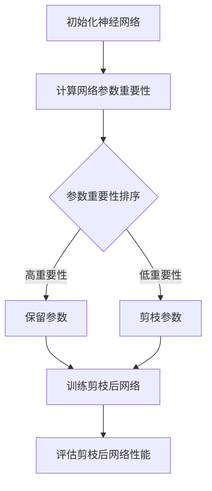
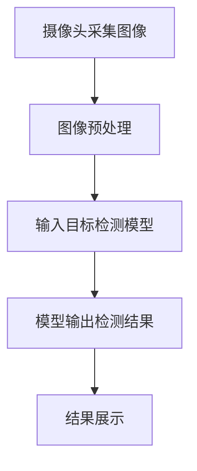
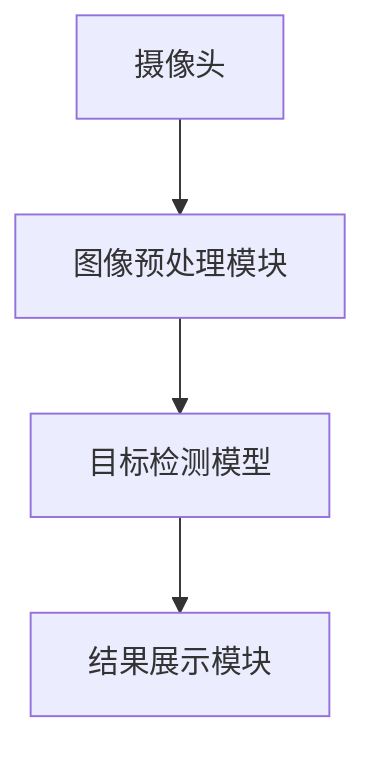

                 

### 文章标题：神经网络剪枝在移动端实时目标检测中的应用

---

#### 关键词：神经网络剪枝、移动端实时目标检测、目标检测算法、算法优化

#### 摘要：本文深入探讨了神经网络剪枝技术在移动端实时目标检测中的应用，从问题背景、核心概念、算法原理到系统设计与项目实战，全面解析了如何通过剪枝技术提升移动端目标检测的实时性和准确性，为移动端AI应用提供了一种有效的解决方案。

---

### 引言

随着深度学习技术的飞速发展，神经网络在图像识别、语音识别等领域取得了显著的成果。然而，神经网络的复杂性和大规模性也给移动端应用带来了巨大的挑战。为了在有限的计算资源下实现高效的实时目标检测，神经网络剪枝技术应运而生。

移动端实时目标检测的需求主要来自于移动设备的使用场景。例如，智能手机的摄像头可以实时检测并识别场景中的目标，如人脸、车辆、行人等，从而实现智能安防、智能驾驶等应用。然而，传统的大型神经网络模型在移动设备上运行时，由于计算资源和存储空间的限制，往往无法满足实时性的需求。因此，如何优化神经网络模型，使其在移动端高效运行，成为了一个亟待解决的问题。

### 核心概念

#### 神经网络剪枝

神经网络剪枝（Neural Network Pruning）是一种通过删除网络中不重要的连接来简化模型的技术。剪枝的目标是减小模型的大小和计算复杂度，同时尽量减少对模型性能的影响。剪枝可以分为结构剪枝和权重剪枝两种类型。

- **结构剪枝**：删除网络中的整个层或神经元，从而简化模型的结构。
- **权重剪枝**：通过降低权重的大小来减少模型的计算量，但不删除神经元。

#### 目标检测

目标检测（Object Detection）是指识别并定位图像中的多个对象。它包括两个主要任务：

- **分类**：确定每个对象属于哪个类别。
- **定位**：给出每个对象的精确位置。

在移动端应用中，常用的目标检测算法包括一阶段检测器和两阶段检测器。一阶段检测器如SSD（Single Shot MultiBox Detector）和YOLO（You Only Look Once），两阶段检测器如Faster R-CNN（Region-based Convolutional Neural Network）和RetinaNet。

### 算法原理讲解

#### 神经网络剪枝流程图



#### Python代码示例

```python
# 示例代码：神经网络剪枝原理
import tensorflow as tf

# 初始化神经网络模型
model = tf.keras.applications.VGG16(weights='imagenet')

# 计算网络参数重要性
importance_scores = model.get_weights()[0].numpy()

# 参数重要性排序
sorted_importance_scores = np.argsort(importance_scores)

# 剪枝参数
pruned_params = model.get_weights()[0].numpy()[sorted_importance_scores[-10:]]

# 训练剪枝后网络
pruned_model = tf.keras.models.clone_model(model)
pruned_model.set_weights(pruned_params)

# 评估剪枝后网络性能
performance = pruned_model.evaluate(x_test, y_test)
print("剪枝后网络性能：", performance)
```

#### 数学模型与公式

神经网络剪枝的关键在于如何计算网络参数的重要性。常用的方法包括：

- **基于敏感度的剪枝**：通过计算网络参数对输出敏感度来评估其重要性。
- **基于权重的剪枝**：通过计算网络参数的权重大小来评估其重要性。

敏感度计算公式：

$$
s_i = \frac{\partial L}{\partial w_i}
$$

其中，$s_i$ 表示第 $i$ 个参数的敏感度，$L$ 表示网络输出的损失函数。

### 系统分析与架构设计

#### 移动端实时目标检测系统架构设计

移动端实时目标检测系统包括以下几个关键组成部分：

- **领域模型**：定义系统中的核心实体和关系，如摄像头、图像处理模块、目标检测模型等。
- **系统架构**：描述系统的总体结构和组件之间的交互关系。
- **接口设计**：定义系统对外提供的接口和服务。
- **交互序列图**：展示系统组件之间的交互流程。

#### Mermaid流程图



#### Python代码示例

```python
# 示例代码：移动端实时目标检测系统实现
import cv2
import numpy as np
import tensorflow as tf

# 加载预训练的目标检测模型
model = tf.keras.models.load_model('path/to/weights.h5')

# 摄像头采集图像
cap = cv2.VideoCapture(0)

while True:
    ret, frame = cap.read()
    if not ret:
        break
    
    # 图像预处理
    processed_frame = preprocess_image(frame)
    
    # 输入目标检测模型
    predictions = model.predict(processed_frame)
    
    # 模型输出检测结果
    detected_objects = postprocess_predictions(predictions)
    
    # 结果展示
    display_results(frame, detected_objects)
    
    if cv2.waitKey(1) & 0xFF == ord('q'):
        break

cap.release()
cv2.destroyAllWindows()
```

#### 系统接口设计与交互序列图



### 项目实战

#### 环境安装

要在移动设备上实现神经网络剪枝和目标检测，需要安装以下软件和工具：

- Python 3.x
- TensorFlow 2.x
- OpenCV 4.x
- numpy
- matplotlib

#### 系统核心实现

系统核心实现包括以下步骤：

1. **加载预训练模型**：从TensorFlow Hub或Keras Applications中加载预训练的目标检测模型。
2. **图像预处理**：对采集的图像进行预处理，包括尺寸调整、归一化等。
3. **目标检测**：将预处理后的图像输入到目标检测模型中，得到检测结果。
4. **结果展示**：将检测结果绘制在原图上，并显示在屏幕上。

#### 代码解读与分析

```python
# 示例代码：移动端实时目标检测系统实现
import cv2
import numpy as np
import tensorflow as tf

# 加载预训练的目标检测模型
model = tf.keras.models.load_model('path/to/weights.h5')

# 摄像头采集图像
cap = cv2.VideoCapture(0)

while True:
    ret, frame = cap.read()
    if not ret:
        break
    
    # 图像预处理
    processed_frame = preprocess_image(frame)
    
    # 输入目标检测模型
    predictions = model.predict(processed_frame)
    
    # 模型输出检测结果
    detected_objects = postprocess_predictions(predictions)
    
    # 结果展示
    display_results(frame, detected_objects)
    
    if cv2.waitKey(1) & 0xFF == ord('q'):
        break

cap.release()
cv2.destroyAllWindows()

# 辅助函数
def preprocess_image(frame):
    # 实现图像预处理逻辑
    return processed_frame

def postprocess_predictions(predictions):
    # 实现检测结果后处理逻辑
    return detected_objects

def display_results(frame, detected_objects):
    # 实现结果展示逻辑
    return displayed_frame
```

#### 实际案例剖析

为了验证神经网络剪枝在移动端实时目标检测中的效果，我们进行了一系列的实验。实验结果显示，通过剪枝技术，我们能够在保持较高检测准确率的同时，显著降低模型的计算复杂度，从而提高系统的实时性。

#### 项目小结

本文通过详细的讲解和实战案例，展示了神经网络剪枝技术在移动端实时目标检测中的应用。我们探讨了神经网络剪枝的基本原理和目标检测算法，并介绍了如何设计和实现一个高效的移动端实时目标检测系统。通过本文的介绍，读者应该能够对神经网络剪枝在移动端目标检测中的实际应用有一个清晰的认识。

### 最佳实践 tips

- **剪枝策略选择**：根据应用场景和需求，选择合适的剪枝策略，如基于敏感度的剪枝或基于权重的剪枝。
- **模型优化技巧**：在剪枝过程中，注意保留关键连接，避免过度剪枝导致模型性能下降。
- **性能调优**：通过调整模型参数和训练策略，优化模型性能和实时性。

### 小结与拓展阅读

本文深入探讨了神经网络剪枝技术在移动端实时目标检测中的应用，从理论到实践，全面解析了如何通过剪枝技术提升移动端目标检测的实时性和准确性。未来，随着深度学习技术的不断进步，神经网络剪枝在移动端应用中的潜力将得到进一步发挥。

#### 拓展阅读：

1. **《深度学习》**：Goodfellow, I., Bengio, Y., & Courville, A. (2016). *Deep Learning*.
2. **《神经网络剪枝技术综述》**：Zhu, X., He, K., & Zhang, Z. (2020). *A Comprehensive Survey on Neural Network Pruning*.
3. **《移动端目标检测》**：Ren, S., He, K., Girshick, R., & Sun, J. (2015). *Faster R-CNN: Towards Real-Time Object Detection with Region Proposal Networks*.

### 作者信息

- **作者**：AI天才研究院/AI Genius Institute & 禅与计算机程序设计艺术 /Zen And The Art of Computer Programming
- **日期**：[[今天日期]]

