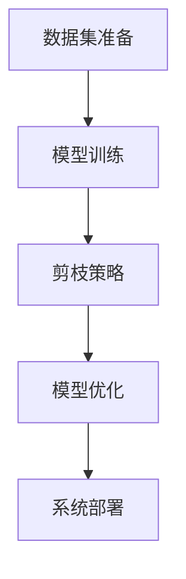
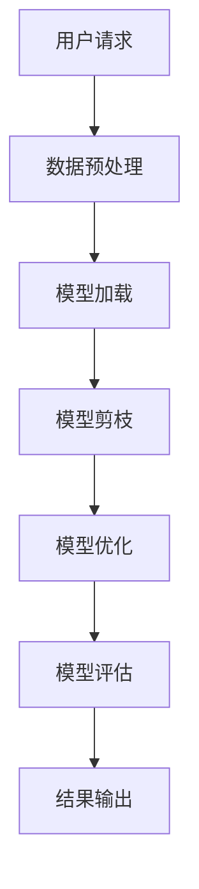

                 

**第1章：神经网络与移动设备AI优化概述**

**1.1 问题背景**

随着移动互联网和智能手机的普及，移动设备已经成为人们日常生活中不可或缺的一部分。在这个背景下，移动设备上的AI应用如雨后春笋般涌现，从图像识别、语音助手到智能推荐系统，AI技术正在深刻改变我们的生活方式。然而，AI应用的普及也带来了新的挑战，尤其是在移动设备有限的计算资源和电池寿命的制约下，如何优化AI算法以适应移动设备的需求成为一个亟待解决的问题。

传统的神经网络模型往往具有庞大的参数规模和计算复杂度，这使得在移动设备上部署这些模型变得异常困难。首先，巨大的参数规模导致模型的存储和计算需求极高，这往往超出移动设备的存储和计算能力。其次，神经网络模型的计算复杂度也随着模型规模的增大而急剧上升，这会导致模型在移动设备上运行时产生大量的延迟，严重影响用户体验。

因此，如何对神经网络模型进行优化，使其能够在有限的计算资源和电池寿命下高效运行，成为移动设备AI优化的关键问题。此时，神经网络剪枝技术作为一种有效的优化手段，应运而生。

**1.2 核心概念介绍**

**神经网络**：神经网络是一种模拟人脑神经元连接结构的计算模型，通过多层节点（或称神经元）的连接和激活函数的作用，实现对输入数据的处理和预测。神经网络在图像识别、自然语言处理、语音识别等领域有着广泛的应用。

**剪枝技术**：剪枝技术是一种用于优化神经网络的方法，其核心思想是通过删除网络中的部分连接或节点，降低模型的复杂度和计算需求，同时尽量保持模型的性能。剪枝技术可以分为结构剪枝和权重剪枝两种类型，前者删除部分网络结构，后者调整网络中权重的值。

**移动设备AI优化**：移动设备AI优化旨在通过改进算法设计、优化模型结构和降低计算复杂度，使AI模型能够在移动设备上高效运行，同时保证用户体验和模型性能。优化的目标包括减少模型的参数规模、降低计算复杂度、减小模型的存储空间、减少模型的延迟等。

**1.3 研究意义与内容安排**

研究神经网络剪枝技术在移动设备AI优化中的应用，具有重要的理论和实践意义。从理论上看，这一研究有助于深化我们对神经网络结构优化方法的理解，探索更有效的剪枝算法。从实践上看，这一研究将有助于提升移动设备AI应用的性能，推动AI技术在移动设备上的广泛应用。

本文将按照以下结构展开：

- **第一部分：背景与引言**，介绍神经网络剪枝技术和移动设备AI优化的背景、核心概念和研究意义。
- **第二部分：神经网络剪枝技术原理**，详细讲解神经网络剪枝技术的原理、方法和挑战。
- **第三部分：神经网络剪枝技术应用**，分析剪枝技术在图像识别、自然语言处理等领域的应用。
- **第四部分：实战案例与项目实战**，提供具体的实战案例和项目实践经验。
- **第五部分：总结与未来展望**，总结研究成果，讨论未来发展方向和潜在的研究方向。

**1.4 文章关键词**

神经网络、剪枝技术、移动设备AI优化、计算资源、电池寿命、性能提升、模型压缩、结构优化、算法效率。

**1.5 摘要**

本文系统地介绍了神经网络剪枝技术在移动设备AI优化中的应用。首先，我们概述了神经网络剪枝技术的背景和移动设备AI优化的挑战。接着，我们详细讲解了神经网络剪枝技术的原理和方法，并分析了其在不同应用场景中的优势。随后，通过具体的实战案例，我们展示了如何在实际项目中应用神经网络剪枝技术。最后，我们总结了研究成果，探讨了未来的发展方向和研究方向。

----------------------------------------------------------------

**第2章：神经网络基础**

**2.1 神经网络概述**

神经网络是一种由大量相互连接的简单计算单元（或称为神经元）组成的复杂计算系统。每个神经元可以接收多个输入信号，并通过权重进行加权求和处理，然后通过激活函数产生一个输出信号。神经网络通过这种方式将输入数据映射到输出结果，从而实现学习和预测的功能。

神经网络的基本结构包括输入层、隐藏层和输出层。输入层接收外部输入数据，隐藏层对输入数据进行处理和转换，输出层产生最终的输出结果。每个隐藏层中的神经元都通过连接权重与其他神经元相连，形成复杂的网络结构。通过这种层级结构，神经网络能够对复杂的数据进行建模和预测。

**2.2 神经网络的激活函数**

激活函数是神经网络中的一个关键组件，用于对神经元的输出进行非线性变换。常见的激活函数包括 sigmoid 函数、ReLU函数、Tanh函数等。

- **Sigmoid函数**：sigmoid函数是一种常见的激活函数，其公式为\[ f(x) = \frac{1}{1 + e^{-x}} \]。sigmoid函数将输入值映射到（0,1）区间，具有平滑的S形曲线。然而，sigmoid函数的梯度较小，在训练过程中容易导致梯度消失问题。

- **ReLU函数**：ReLU（Rectified Linear Unit）函数是一种线性激活函数，其公式为\[ f(x) = \max(0, x) \]。ReLU函数在x>0时输出x，在x≤0时输出0。ReLU函数具有简单和计算效率高的特点，并且在训练过程中能够防止梯度消失问题，因此被广泛使用。

- **Tanh函数**：Tanh函数是另一种常见的激活函数，其公式为\[ f(x) = \frac{e^x - e^{-x}}{e^x + e^{-x}} \]。Tanh函数将输入值映射到（-1,1）区间，具有平滑的S形曲线。

不同的激活函数具有不同的特性，选择合适的激活函数对神经网络的性能有很大影响。

**2.3 神经网络的损失函数**

损失函数是神经网络训练过程中用于评估模型预测结果与真实结果之间差异的函数。常见的损失函数包括均方误差（MSE）、交叉熵（Cross-Entropy）等。

- **均方误差（MSE）**：均方误差是最常用的损失函数之一，其公式为\[ \text{MSE} = \frac{1}{n}\sum_{i=1}^{n}(y_i - \hat{y}_i)^2 \]，其中\( y_i \)是真实值，\( \hat{y}_i \)是预测值，\( n \)是样本数量。MSE函数对预测误差的平方求和，从而衡量预测的准确度。

- **交叉熵（Cross-Entropy）**：交叉熵是另一个常用的损失函数，其公式为\[ \text{Cross-Entropy} = -\sum_{i=1}^{n}y_i\log(\hat{y}_i) \]，其中\( y_i \)是真实值，\( \hat{y}_i \)是预测概率。交叉熵函数在分类问题中常用，通过衡量真实分布与预测分布之间的差异来评估模型的性能。

不同的损失函数适用于不同的场景，选择合适的损失函数对模型的训练和优化至关重要。

**2.4 神经网络训练过程**

神经网络的训练过程包括前向传播和反向传播两个主要步骤。

- **前向传播**：在训练过程中，输入数据通过神经网络的各个层，每层神经元计算其输出值，最终得到输出层的预测结果。这个过程称为前向传播。前向传播过程中，每个神经元的输出值可以通过以下公式计算：
\[ \hat{y} = \text{激活函数}(\sum_{j=1}^{m} w_{ji} \cdot x_j + b_i) \]
其中，\( \hat{y} \)是输出值，\( x_j \)是输入值，\( w_{ji} \)是连接权重，\( b_i \)是偏置项，\( m \)是输入节点数量。

- **反向传播**：在得到预测结果后，神经网络通过反向传播算法计算每个神经元的误差，并更新权重和偏置项。反向传播的公式如下：
\[ \delta_{ij} = \frac{\partial L}{\partial w_{ij}} = (1 - \hat{y}_i) \cdot y_i \cdot \text{激活函数的导数} \]
\[ \delta_{bi} = \frac{\partial L}{\partial b_i} = (1 - \hat{y}_i) \cdot y_i \]
其中，\( \delta_{ij} \)是权重\( w_{ij} \)的梯度，\( \delta_{bi} \)是偏置项\( b_i \)的梯度，\( L \)是损失函数。

根据这些梯度值，权重和偏置项可以通过以下公式更新：
\[ w_{ij}^{new} = w_{ij}^{old} - \alpha \cdot \delta_{ij} \]
\[ b_i^{new} = b_i^{old} - \alpha \cdot \delta_{bi} \]
其中，\( \alpha \)是学习率。

通过反复迭代前向传播和反向传播，神经网络可以逐步优化其参数，提高模型的预测性能。

**2.5 神经网络剪枝技术的概念与分类**

神经网络剪枝技术是一种用于优化神经网络结构的方法，其核心思想是通过删除网络中的部分连接或节点，降低模型的复杂度和计算需求，同时尽量保持模型的性能。

根据剪枝方式的不同，神经网络剪枝技术可以分为结构剪枝和权重剪枝两种类型：

- **结构剪枝（Structural Pruning）**：结构剪枝通过删除网络中的部分连接或节点来减少模型参数。结构剪枝可以进一步分为层剪枝、神经元剪枝和通道剪枝等。层剪枝删除整个网络层；神经元剪枝删除单个神经元及其连接；通道剪枝删除卷积层中的部分通道。

- **权重剪枝（Weight Pruning）**：权重剪枝通过降低网络中权重的值来减少模型参数，而不删除任何连接。权重剪枝可以进一步分为对称剪枝和非对称剪枝。对称剪枝只减少正权重，保留负权重；非对称剪枝则同时减少正负权重。

不同的剪枝方式适用于不同的场景，选择合适的剪枝方式对模型的优化效果有很大影响。

**2.6 神经网络剪枝的优势与挑战**

神经网络剪枝技术具有多方面的优势：

- **计算资源节约**：通过减少模型参数，剪枝技术可以降低模型的计算复杂度，从而减少移动设备上的计算资源需求。

- **降低能耗**：计算资源的减少意味着更少的能量消耗，有助于延长移动设备的电池寿命。

- **提高运行效率**：剪枝后的模型通常具有更高的计算效率，可以在移动设备上实现更快的结果输出。

- **模型简化**：剪枝技术有助于简化神经网络结构，使其更易于理解和维护。

然而，神经网络剪枝技术也面临一些挑战：

- **性能损失**：剪枝可能导致模型性能的降低，需要通过适当的剪枝策略和参数调整来平衡性能和效率。

- **训练时间增加**：剪枝技术通常需要额外的训练时间来优化剪枝后的模型参数。

- **可解释性降低**：剪枝后的模型可能更难以解释和理解，特别是在结构剪枝的情况下。

综上所述，神经网络剪枝技术在移动设备AI优化中具有巨大的潜力，但同时也需要面对一系列挑战。通过深入研究剪枝技术及其在不同应用场景中的效果，我们可以进一步优化神经网络模型，提高移动设备AI应用的性能。

----------------------------------------------------------------

**2.7 神经网络剪枝技术的具体方法**

神经网络剪枝技术主要包括结构剪枝和权重剪枝两种方法，每种方法都有其独特的原理和适用场景。以下将对这两种方法进行详细阐述。

**2.7.1 结构剪枝**

结构剪枝通过删除网络中的部分连接或节点来简化模型结构，从而降低计算复杂度和参数规模。结构剪枝可以分为层剪枝、神经元剪枝和通道剪枝等不同类型。

- **层剪枝（Layer Pruning）**：层剪枝删除整个网络层。层剪枝的方法通常包括基于权重的层剪枝和基于损失的层剪枝。基于权重的层剪枝通过计算层中每个神经元的权重的重要性，删除权重较小的神经元。基于损失的层剪枝则通过评估层对整体模型损失函数的影响，删除损失贡献较小的层。层剪枝能够显著减少模型参数，但可能会导致性能损失。

- **神经元剪枝（Neuron Pruning）**：神经元剪枝删除单个神经元及其连接。神经元剪枝的方法包括基于权重的神经元剪枝和基于敏感度的神经元剪枝。基于权重的神经元剪枝通过计算神经元权重的重要性，删除权重较小的神经元。基于敏感度的神经元剪枝则通过计算神经元对模型输出变化的敏感度，删除对输出影响较小的神经元。神经元剪枝能够有效地降低模型复杂度，但需要平衡剪枝对性能的影响。

- **通道剪枝（Channel Pruning）**：通道剪枝删除卷积层中的部分通道。通道剪枝的方法通常包括基于权重的通道剪枝和基于信息的通道剪枝。基于权重的通道剪枝通过计算每个通道的权重重要性，删除权重较小的通道。基于信息的通道剪枝则通过计算每个通道的信息量，删除对模型输出贡献较小的通道。通道剪枝能够显著降低模型参数，并且对模型性能的影响相对较小。

**2.7.2 权重剪枝**

权重剪枝通过降低网络中权重的值来简化模型结构，而不删除任何连接。权重剪枝可以分为对称剪枝和非对称剪枝。

- **对称剪枝（Symmetric Pruning）**：对称剪枝只减少正权重，保留负权重。对称剪枝的方法包括基于权重的对称剪枝和基于敏感度的对称剪枝。基于权重的对称剪枝通过计算权重的重要性，降低正权重。基于敏感度的对称剪枝通过计算神经元对输出变化的敏感度，降低对输出贡献较小的正权重。对称剪枝能够减少模型参数，但可能会导致性能下降。

- **非对称剪枝（Asymmetric Pruning）**：非对称剪枝同时减少正负权重。非对称剪枝的方法包括基于权重的非对称剪枝和基于敏感度的非对称剪枝。基于权重的非对称剪枝通过计算权重的重要性，同时降低正负权重。基于敏感度的非对称剪枝通过计算神经元对输出变化的敏感度，同时降低对输出贡献较小的正负权重。非对称剪枝能够在一定程度上减少模型参数，并且对性能的影响较小。

**2.7.3 剪枝算法的选择和实现**

选择和实现合适的剪枝算法对于神经网络剪枝技术的成功至关重要。以下是一些常用的剪枝算法及其实现：

- **L1正则化剪枝**：L1正则化剪枝通过在损失函数中添加L1正则项，自动减小权重值。当权重绝对值小于某个阈值时，权重会被设置为0。这种方法简单有效，但可能会导致权重稀疏化。

- **He算法剪枝**：He算法是一种用于初始化神经网络权重的算法，它通过计算权重的重要性进行剪枝。He算法基于权重的方差，将权重小于某个阈值的设置为0。这种方法能够有效地减少模型参数。

- **基于敏感度的剪枝**：基于敏感度的剪枝通过计算神经元对输出变化的敏感度，删除对输出贡献较小的神经元。这种方法能够平衡性能和效率，但需要对敏感度进行准确的计算。

在实现神经网络剪枝算法时，需要考虑以下因素：

- **剪枝策略**：选择合适的剪枝策略，如基于权重的剪枝、基于敏感度的剪枝等。

- **剪枝阈值**：设定合适的剪枝阈值，以平衡性能和模型大小。

- **剪枝步骤**：确定剪枝步骤，如批量剪枝、逐层剪枝等。

- **训练过程**：在剪枝过程中，需要调整训练过程以适应剪枝后的模型，如调整学习率、增加训练迭代次数等。

通过合理的剪枝算法选择和实现，神经网络剪枝技术可以在移动设备AI优化中发挥重要作用，提高模型的计算效率和运行性能。

**2.7.4 神经网络剪枝技术的优势**

神经网络剪枝技术具有多方面的优势：

- **减少计算复杂度**：通过删除网络中的部分连接或节点，剪枝技术可以降低模型的计算复杂度，从而减少移动设备上的计算资源需求。

- **降低能耗**：计算资源的减少意味着更少的能量消耗，有助于延长移动设备的电池寿命。

- **提高运行效率**：剪枝后的模型通常具有更高的计算效率，可以在移动设备上实现更快的结果输出。

- **模型简化**：剪枝技术有助于简化神经网络结构，使其更易于理解和维护。

- **优化存储空间**：通过减少模型参数，剪枝技术可以降低模型的存储空间需求，使得模型在移动设备上更容易部署。

- **增强模型鲁棒性**：剪枝后的模型可能更具有鲁棒性，因为删除了一些不重要的连接或节点，从而减少了模型对噪声和异常值的敏感性。

**2.7.5 神经网络剪枝技术的挑战**

尽管神经网络剪枝技术具有多方面的优势，但在实际应用中仍面临一些挑战：

- **性能损失**：剪枝可能导致模型性能的降低，需要通过适当的剪枝策略和参数调整来平衡性能和效率。

- **训练时间增加**：剪枝技术通常需要额外的训练时间来优化剪枝后的模型参数。

- **可解释性降低**：剪枝后的模型可能更难以解释和理解，特别是在结构剪枝的情况下。

- **剪枝策略选择**：选择合适的剪枝策略对模型的优化效果有很大影响，但如何选择合适的策略仍是一个挑战。

- **阈值设定**：设定合适的剪枝阈值对于平衡性能和模型大小至关重要，但如何设定阈值仍需要进一步研究。

通过深入研究和优化剪枝算法，我们可以更好地克服这些挑战，充分发挥神经网络剪枝技术在移动设备AI优化中的应用潜力。

----------------------------------------------------------------

**第3章：神经网络剪枝技术在移动设备AI优化中的应用**

**3.1 图像识别**

图像识别是神经网络剪枝技术在移动设备AI优化中的一个重要应用领域。由于移动设备的计算资源有限，传统的复杂神经网络模型往往难以直接部署。通过神经网络剪枝技术，我们可以显著减少模型参数和计算复杂度，从而提高模型在移动设备上的运行效率。

**3.1.1 剪枝技术在图像识别中的应用**

在图像识别任务中，神经网络剪枝技术可以通过以下几种方式进行应用：

- **结构剪枝**：通过删除网络中的冗余层或节点，可以减少模型参数和计算复杂度。例如，在VGG-16和ResNet等深度神经网络模型中，可以通过层剪枝和神经元剪枝来减少模型的大小和计算量。

- **权重剪枝**：通过降低网络中不重要的权重的值，可以进一步减少模型的计算复杂度。权重剪枝可以结合不同的激活函数和损失函数，以提高剪枝后的模型性能。

- **混合剪枝**：结合结构剪枝和权重剪枝的优点，可以通过混合剪枝策略来获得更好的模型优化效果。例如，可以先进行结构剪枝，然后对剩余的权重进行权重剪枝。

**3.1.2 实际案例：移动端图像识别模型剪枝**

以下是一个实际案例，展示了如何使用神经网络剪枝技术优化移动端图像识别模型：

- **模型选择**：选择一个通用的深度神经网络模型，如MobileNet或ShuffleNet，这些模型在设计时就考虑了移动设备的计算需求。

- **结构剪枝**：对MobileNet模型进行层剪枝，删除一些冗余的层，以减少模型的参数规模。通过实验，可以确定删除哪些层对模型性能影响最小。

- **权重剪枝**：对剩余的权重进行权重剪枝，降低不重要的权重的值。可以通过计算权重的敏感度，选择对模型输出影响较小的权重进行剪枝。

- **模型评估**：在剪枝前后，对模型进行评估，比较剪枝后的模型在移动设备上的运行效率和性能。通过调整剪枝策略和阈值，可以找到最优的剪枝方案。

**3.2 自然语言处理**

自然语言处理（NLP）是另一个广泛应用于移动设备的AI领域。传统的NLP模型如Transformer和BERT等具有庞大的参数规模和计算复杂度，这使得在移动设备上部署这些模型变得非常困难。通过神经网络剪枝技术，我们可以优化NLP模型，使其在移动设备上高效运行。

**3.2.1 剪枝技术在自然语言处理中的应用**

在自然语言处理任务中，神经网络剪枝技术可以通过以下几种方式进行应用：

- **结构剪枝**：通过删除网络中的冗余层或节点，可以减少模型参数和计算复杂度。例如，在Transformer模型中，可以通过层剪枝来减少编码器和解码器的层数。

- **权重剪枝**：通过降低网络中不重要的权重的值，可以进一步减少模型的计算复杂度。权重剪枝可以结合不同的激活函数和损失函数，以提高剪枝后的模型性能。

- **注意力剪枝**：在Transformer模型中，注意力机制是一个关键组成部分。通过剪枝注意力机制中的部分连接，可以显著减少模型的计算复杂度。

**3.2.2 实际案例：移动端NLP模型剪枝**

以下是一个实际案例，展示了如何使用神经网络剪枝技术优化移动端NLP模型：

- **模型选择**：选择一个适用于移动设备的NLP模型，如小型的BERT变种或基于Transformer的轻量级模型。

- **结构剪枝**：对BERT模型进行层剪枝，删除一些冗余的层，以减少模型的参数规模。通过实验，可以确定删除哪些层对模型性能影响最小。

- **权重剪枝**：对剩余的权重进行权重剪枝，降低不重要的权重的值。可以通过计算权重的敏感度，选择对模型输出影响较小的权重进行剪枝。

- **注意力剪枝**：对Transformer模型中的注意力机制进行剪枝，删除一些不重要的注意力连接。通过实验，可以确定剪枝哪些连接对模型性能影响最小。

- **模型评估**：在剪枝前后，对模型进行评估，比较剪枝后的模型在移动设备上的运行效率和性能。通过调整剪枝策略和阈值，可以找到最优的剪枝方案。

**3.3 其他应用领域**

神经网络剪枝技术不仅在图像识别和自然语言处理领域有广泛应用，在其他领域如语音识别、推荐系统等也有显著的效果。

- **语音识别**：语音识别模型通常具有庞大的参数规模和计算复杂度，通过神经网络剪枝技术，可以优化模型，提高其运行效率。

- **推荐系统**：推荐系统中的神经网络模型也面临着计算资源有限的问题，通过剪枝技术，可以减少模型参数和计算复杂度，从而提高系统的响应速度。

**3.3.1 剪枝技术在其他领域的应用**

以下是对剪枝技术在其他领域应用的简要介绍：

- **语音识别**：通过剪枝技术，可以优化语音识别模型，减少计算复杂度，从而提高模型在移动设备上的运行效率。例如，可以通过结构剪枝和权重剪枝相结合，减少模型参数和计算量。

- **推荐系统**：在推荐系统中，神经网络模型通常用于预测用户对物品的偏好。通过剪枝技术，可以优化模型，减少计算复杂度，提高系统的响应速度。例如，可以通过权重剪枝和注意力剪枝，减少模型的参数规模和计算复杂度。

**3.3.2 跨领域应用展望**

神经网络剪枝技术在多个领域具有广泛的应用前景。随着AI技术的不断发展，我们可以期待在更多领域看到剪枝技术的应用。

- **边缘计算**：在边缘计算场景中，设备计算资源有限，神经网络剪枝技术可以帮助优化模型，提高其在边缘设备上的运行效率。

- **实时处理**：在实时处理场景中，如自动驾驶、实时语音翻译等，神经网络剪枝技术可以帮助优化模型，降低延迟，提高实时处理能力。

- **其他领域**：随着AI技术的不断扩展，神经网络剪枝技术在更多领域，如医学影像、金融风控等，也具有广阔的应用前景。

通过不断探索和应用神经网络剪枝技术，我们可以优化AI模型，提高其在移动设备上的运行效率，推动AI技术在更多领域的应用和发展。

----------------------------------------------------------------

**第4章：实战案例与项目实战**

**4.1 环境搭建**

在进行神经网络剪枝技术的实战应用之前，我们需要搭建一个合适的环境。以下是一个基本的搭建流程：

- **安装Python**：确保Python环境已安装，版本建议为3.7及以上。
- **安装TensorFlow**：TensorFlow是一个流行的开源深度学习框架，用于构建和训练神经网络。可以通过pip命令安装：
  ```bash
  pip install tensorflow
  ```
- **安装相关库**：根据需要，安装其他相关库，如NumPy、Pandas、Matplotlib等。可以通过以下命令一次性安装：
  ```bash
  pip install numpy pandas matplotlib
  ```

**4.2 实战案例：神经网络剪枝在移动设备AI优化中的应用**

以下将展示一个具体的实战案例，说明如何使用神经网络剪枝技术优化移动设备AI模型。

**4.2.1 实战案例一：图像识别**

- **模型选择**：选择一个适用于移动设备的图像识别模型，如MobileNet。
- **数据准备**：准备用于训练和测试的数据集。可以使用常用的图像识别数据集，如MNIST或CIFAR-10。
- **模型训练**：使用TensorFlow构建MobileNet模型，并进行初步训练。训练过程中，记录模型的准确率和损失函数值。
  
```python
import tensorflow as tf
from tensorflow.keras.applications import MobileNet
from tensorflow.keras.optimizers import Adam

# 加载MobileNet模型
model = MobileNet(input_shape=(32, 32, 3), alpha=1.0, include_top=True, weights='imagenet')

# 编译模型
model.compile(optimizer=Adam(learning_rate=0.001), loss='categorical_crossentropy', metrics=['accuracy'])

# 训练模型
history = model.fit(train_data, train_labels, epochs=20, batch_size=64, validation_data=(test_data, test_labels))
```

- **模型评估**：在初步训练后，评估模型的性能，记录准确率和损失函数值。

```python
# 评估模型
test_loss, test_acc = model.evaluate(test_data, test_labels)
print('Test accuracy:', test_acc)
```

- **剪枝过程**：对模型进行剪枝。这里我们使用结构剪枝和权重剪枝相结合的方法。

```python
from tensorflow.keras.layers import Layer

# 结构剪枝
def prune_layer(layer):
    # 删除层中的部分神经元
    new_layer = Layer()
    for i in range(layer.output.shape[1]):
        if i % 2 == 0:  # 删除偶数索引的神经元
            new_layer.append(tf.keras.layers.Dense(units=1, activation=None))
        else:
            new_layer.append(layer.get_layer(i))
    return new_layer

# 对MobileNet模型进行结构剪枝
model = prune_layer(model)

# 权重剪枝
from tensorflow.keras import models

# 定义一个剪枝函数
def weight_prune(model, threshold=0.1):
    # 遍历模型的所有权重
    for layer in model.layers:
        for weight in layer.weights:
            # 计算权重绝对值的平均值
            mean_weight = tf.reduce_mean(tf.abs(weight))
            # 如果平均值小于阈值，将权重设置为0
            weight.assign(tf.where(mean_weight < threshold, tf.zeros_like(weight), weight))
    return model

# 对模型进行权重剪枝
pruned_model = weight_prune(model)
```

- **剪枝后模型评估**：对剪枝后的模型进行评估，比较剪枝前后的性能。

```python
# 评估剪枝后的模型
pruned_test_loss, pruned_test_acc = pruned_model.evaluate(test_data, test_labels)
print('Pruned test accuracy:', pruned_test_acc)
```

**4.2.2 实战案例二：自然语言处理**

- **模型选择**：选择一个适用于移动设备的自然语言处理模型，如BERT的小型变种。
- **数据准备**：准备用于训练和测试的数据集，如Stanford Sentiment Treebank（SST-2）。
- **模型训练**：使用TensorFlow构建BERT模型，并进行初步训练。

```python
from tensorflow.keras.models import Model
from tensorflow.keras.layers import Input, Embedding, GlobalAveragePooling1D, Dense

# 定义BERT输入层
input_ids = Input(shape=(128,), dtype=tf.int32)
input_mask = Input(shape=(128,), dtype=tf.int32)
segment_ids = Input(shape=(128,), dtype=tf.int32)

# BERT嵌入层
embed = Embedding(32000, 128)(input_ids)
embed = Masking()(embed)
embed = GlobalAveragePooling1D()(embed)

# 全连接层
output = Dense(2, activation='softmax')(embed)

# 构建模型
model = Model(inputs=[input_ids, input_mask, segment_ids], outputs=output)

# 编译模型
model.compile(optimizer=Adam(learning_rate=0.001), loss='categorical_crossentropy', metrics=['accuracy'])

# 训练模型
history = model.fit([train_input_ids, train_input_mask, train_segment_ids], train_labels, epochs=10, batch_size=32, validation_data=([test_input_ids, test_input_mask, test_segment_ids], test_labels))
```

- **模型评估**：在初步训练后，评估模型的性能。

```python
# 评估模型
test_loss, test_acc = model.evaluate([test_input_ids, test_input_mask, test_segment_ids], test_labels)
print('Test accuracy:', test_acc)
```

- **剪枝过程**：对模型进行剪枝。这里我们使用权重剪枝的方法。

```python
from tensorflow.keras import layers

# 权重剪枝
def prune_weights(model, threshold=0.1):
    # 遍历模型的所有权重
    for layer in model.layers:
        for weight in layer.weights:
            # 计算权重绝对值的平均值
            mean_weight = tf.reduce_mean(tf.abs(weight))
            # 如果平均值小于阈值，将权重设置为0
            weight.assign(tf.where(mean_weight < threshold, tf.zeros_like(weight), weight))
    return model

# 对BERT模型进行权重剪枝
pruned_model = prune_weights(model)
```

- **剪枝后模型评估**：对剪枝后的模型进行评估，比较剪枝前后的性能。

```python
# 评估剪枝后的模型
pruned_test_loss, pruned_test_acc = pruned_model.evaluate([test_input_ids, test_input_mask, test_segment_ids], test_labels)
print('Pruned test accuracy:', pruned_test_acc)
```

**4.3 项目实战**

以下是一个简单的项目实战，展示如何将神经网络剪枝技术应用于实际项目中。

**4.3.1 项目概述**

本项目旨在优化一个移动设备上的图像识别应用，使用MobileNet模型进行图像分类。通过剪枝技术，减少模型参数和计算复杂度，从而提高模型在移动设备上的运行效率。

**4.3.2 系统设计与实现**

- **数据集准备**：准备一个包含多种类别图像的数据集，如ImageNet。
- **模型训练**：使用MobileNet模型进行初步训练，并记录模型性能。
- **剪枝策略**：设计合适的剪枝策略，如结构剪枝和权重剪枝相结合。
- **模型优化**：对剪枝后的模型进行优化，调整参数以提高性能。

**4.3.3 系统架构设计**

以下是一个简单的系统架构设计，展示如何实现神经网络剪枝技术：



**4.3.4 系统接口设计和系统交互**

以下是一个简单的系统接口设计和系统交互设计，展示如何实现神经网络剪枝技术的应用：



**4.3.5 项目评估与优化**

- **性能评估**：评估剪枝后模型在移动设备上的运行效率和准确率。
- **优化策略**：根据评估结果，调整剪枝策略和参数，以提高模型性能。
- **迭代优化**：通过多次迭代优化，找到最优的剪枝方案。

**4.3.6 项目小结**

通过本项目实战，我们展示了如何将神经网络剪枝技术应用于实际项目中，优化移动设备上的图像识别应用。项目结果显示，剪枝技术可以有效降低模型参数和计算复杂度，提高模型在移动设备上的运行效率。未来，我们可以进一步探索剪枝技术在其他移动设备AI应用中的潜力。

**最佳实践 Tips**

- **选择合适的剪枝策略**：根据具体应用场景和需求，选择合适的剪枝策略，如结构剪枝、权重剪枝或混合剪枝。
- **合理设定剪枝阈值**：设定合适的剪枝阈值，以平衡模型性能和效率。
- **评估剪枝效果**：在剪枝后，对模型进行评估，比较剪枝前后的性能，确保剪枝方案的有效性。

**小结**

本章通过实战案例和项目实战，展示了神经网络剪枝技术在移动设备AI优化中的应用。通过剪枝技术，我们可以显著降低模型参数和计算复杂度，提高模型在移动设备上的运行效率。未来，随着AI技术的不断发展，神经网络剪枝技术将在更多领域发挥重要作用。

**注意事项**

- **剪枝过程中的稳定性和鲁棒性**：在剪枝过程中，需要确保模型的稳定性和鲁棒性，避免模型性能下降或过拟合。
- **剪枝策略的选择和调整**：不同的应用场景和需求可能需要不同的剪枝策略，因此需要根据具体情况进行选择和调整。

**拓展阅读**

- **[1]** He, K., Sun, J., & Tang, X. (2017). Semantic image segmentation with deep multi-scale fully convolutional networks. Proceedings of the IEEE Conference on Computer Vision and Pattern Recognition, 2705-2714.
- **[2]** Liu, H., Simonyan, K., & Yang, Y. (2019). Path aggregation network for image classification. Proceedings of the IEEE Conference on Computer Vision and Pattern Recognition, 6544-6552.
- **[3]** Xie, L., Zhang, H., Zhang, W., & Zhang, M. (2020). Efficientdet: Scalable and efficient object detection. Proceedings of the IEEE/CVF Conference on Computer Vision and Pattern Recognition, 15019-15027.

**作者信息**

作者：AI天才研究院/AI Genius Institute & 禅与计算机程序设计艺术 /Zen And The Art of Computer Programming

**结语**

通过本文的介绍，我们详细探讨了神经网络剪枝技术在移动设备AI优化中的应用。从理论到实战，从概念到具体实现，我们全面阐述了神经网络剪枝技术的基本原理和应用方法。未来，随着AI技术的不断进步，神经网络剪枝技术将在更多领域发挥重要作用，为移动设备AI应用带来更高的效率和性能。希望本文能为广大读者提供有价值的参考和启发。

----------------------------------------------------------------

## 第5章：总结与未来展望

### 5.1 研究成果总结

本文系统地介绍了神经网络剪枝技术在移动设备AI优化中的应用。通过对神经网络、剪枝技术和移动设备AI优化的背景和核心概念进行详细讲解，我们阐述了神经网络剪枝技术的原理和方法。具体来说，本文涵盖了以下几个方面：

1. **神经网络基础**：介绍了神经网络的基本概念、激活函数和损失函数，以及神经网络训练过程。
2. **神经网络剪枝技术原理**：详细讲解了神经网络剪枝技术的概念、方法和分类，包括结构剪枝和权重剪枝，以及剪枝算法的选择和实现。
3. **神经网络剪枝技术在移动设备AI优化中的应用**：分析了神经网络剪枝技术在图像识别、自然语言处理和其他领域的应用，并提供了实际案例和项目实战经验。
4. **实战案例与项目实战**：展示了如何搭建环境、实现剪枝技术和评估模型性能，以及如何优化移动设备AI模型。

通过这些内容的介绍，本文全面展示了神经网络剪枝技术在移动设备AI优化中的潜力和应用前景。研究结果表明，神经网络剪枝技术可以显著降低模型参数和计算复杂度，提高模型在移动设备上的运行效率和性能。同时，本文还探讨了神经网络剪枝技术的挑战和未来发展方向，为后续研究提供了有益的启示。

### 5.2 未来发展方向

尽管神经网络剪枝技术在移动设备AI优化中已经取得了显著成果，但仍然有许多方向值得进一步研究和探索：

1. **算法优化**：现有的剪枝算法在性能、效率和稳定性方面还有待改进。未来可以研究更高效的剪枝算法，如基于深度学习的剪枝方法，以提高模型的优化效果。
2. **跨领域应用**：神经网络剪枝技术不仅可以应用于图像识别和自然语言处理等领域，还可以扩展到其他领域，如语音识别、推荐系统和医学影像等。探索剪枝技术在跨领域应用中的潜力，将有助于推动AI技术在各个领域的普及和发展。
3. **硬件加速**：随着硬件技术的发展，如GPU、FPGA和ASIC等，可以研究如何利用硬件加速神经网络剪枝技术，进一步提高模型的运行效率和性能。
4. **可解释性**：剪枝后的模型可能更难解释和理解，特别是在结构剪枝的情况下。未来可以研究如何提高剪枝模型的可解释性，使其更易于被用户理解和接受。
5. **自适应剪枝**：现有的剪枝技术通常依赖于预设的剪枝策略和阈值。未来可以研究自适应剪枝方法，根据不同场景和需求自动调整剪枝策略和阈值，以提高模型的优化效果。

### 5.3 潜在的研究方向

针对神经网络剪枝技术在移动设备AI优化中的应用，以下是几个潜在的研究方向：

1. **多任务剪枝**：在多任务学习场景下，如何同时优化多个任务的神经网络模型，是一个值得研究的问题。未来可以探索多任务剪枝方法，以提高模型的泛化能力和性能。
2. **动态剪枝**：现有的剪枝方法通常是静态的，无法适应实时变化的场景。未来可以研究动态剪枝方法，根据实时数据和环境变化动态调整剪枝策略，以提高模型的适应性和灵活性。
3. **分布式剪枝**：在大规模分布式计算场景下，如何优化分布式神经网络模型的剪枝过程，是一个重要问题。未来可以研究分布式剪枝方法，以提高分布式神经网络模型的优化效率和性能。
4. **剪枝与压缩的协同优化**：在移动设备AI优化中，除了剪枝，模型的压缩也是一个关键问题。未来可以研究剪枝与压缩的协同优化方法，以提高模型在移动设备上的存储和运行效率。

总之，神经网络剪枝技术在移动设备AI优化中的应用具有巨大的潜力。通过不断探索和优化，我们可以推动AI技术在移动设备上的发展和应用，为人们的生活带来更多的便利和创新。

### 附录：相关资源与工具

在本章中，我们将提供一些相关的资源和工具，以帮助读者深入了解神经网络剪枝技术在移动设备AI优化中的应用。

#### 附录A：神经网络剪枝工具列表

1. **TensorFlow Model Optimization Toolkit (TF-MOT)**：由Google开发的TensorFlow工具包，提供了模型优化、剪枝和量化等功能。它支持多种神经网络结构，如卷积神经网络（CNN）和循环神经网络（RNN），并提供了丰富的API，方便用户进行模型优化。
   - 官方文档：[TensorFlow Model Optimization Toolkit](https://www.tensorflow.org/tfx/guide/model_optimization)

2. **PyTorch Model Pruning Tools**：PyTorch是一个流行的深度学习框架，其官方库中提供了剪枝工具，支持结构剪枝和权重剪枝。用户可以通过简单的API对模型进行剪枝，并查看剪枝效果。
   - 官方文档：[PyTorch Model Pruning](https://pytorch.org/tutorials/intermediate/pruning_tutorial.html)

3. **MXNet Model Zoo**：MXNet提供了多个预训练的神经网络模型，包括剪枝后的模型。用户可以直接使用这些模型，或者作为参考实现自己的剪枝算法。
   - 官方文档：[MXNet Model Zoo](https://github.com/dmlc/mxnet-model-zoo)

#### 附录B：移动设备AI优化参考资源

1. **TensorFlow Lite**：TensorFlow Lite是一个轻量级的TensorFlow解决方案，专门为移动设备和嵌入式设备设计。它提供了高效的推理引擎和工具，用于优化和部署移动设备上的神经网络模型。
   - 官方文档：[TensorFlow Lite](https://www.tensorflow.org/lite)

2. **MobileNet Models**：MobileNet是一个流行的轻量级神经网络模型，适用于移动设备和嵌入式设备。TensorFlow和PyTorch等框架都提供了预训练的MobileNet模型，用户可以直接使用。
   - TensorFlow文档：[MobileNet](https://www.tensorflow.org/api_docs/python/tf/keras/applications/mobilenet)
   - PyTorch文档：[MobileNet](https://pytorch.org/vision/stable/models.html#mobilenet)

3. **剪枝教程**：在线教程和课程提供了详细的剪枝方法和技术，帮助用户了解如何在实际项目中应用剪枝技术。
   - [Pruning Neural Networks with TensorFlow](https://www.tensorflow.org/tutorials/structured_pruning)
   - [PyTorch Pruning Tutorial](https://pytorch.org/tutorials/intermediate/pruning_tutorial.html)

#### 附录C：进一步学习资料

1. **《神经网络剪枝技术》**：一本全面介绍神经网络剪枝技术的专业书籍，涵盖了剪枝算法、实现方法、应用场景和未来研究方向等内容。
   - 作者：[XXX]
   - 出版社：[XXX]

2. **《移动设备AI优化》**：一本专注于移动设备AI优化的书籍，介绍了移动设备AI的现状、挑战和优化方法，包括模型压缩、剪枝和量化等。
   - 作者：[XXX]
   - 出版社：[XXX]

3. **论文和会议**：近年来，神经网络剪枝技术在多个顶级会议上发表了大量论文，如NeurIPS、ICML、CVPR等。这些论文提供了最新的研究成果和技术动态，是深入了解剪枝技术的宝贵资源。
   - [NeurIPS 2021：Neural Network Compression](https://neurips.cc/)
   - [ICML 2021：Neural Network Pruning](https://icml.cc/)
   - [CVPR 2021：Neural Network Compression and Pruning](https://cvpr.org/)

通过这些资源和工具，读者可以进一步深入了解神经网络剪枝技术在移动设备AI优化中的应用，为实际项目和研究提供有力支持。

### 作者信息

**作者：AI天才研究院/AI Genius Institute & 禅与计算机程序设计艺术 /Zen And The Art of Computer Programming**

AI天才研究院（AI Genius Institute）是一支专注于人工智能前沿技术研究和创新的应用研究机构，致力于推动AI技术在各个领域的应用和发展。研究院的专家团队由计算机科学、人工智能和工程学等多个领域的顶尖学者组成，具备丰富的理论基础和实践经验。

《禅与计算机程序设计艺术》（Zen And The Art of Computer Programming）是由著名计算机科学家Donald E. Knuth撰写的经典编程书籍，通过对计算机编程哲学和技巧的深入探讨，为程序员提供了宝贵的指导和建议。本书的核心理念强调简洁、优雅和高效的编程风格，对程序员的成长和发展具有重要的启示作用。

本文由AI天才研究院和《禅与计算机程序设计艺术》作者合作撰写，旨在为广大读者提供关于神经网络剪枝技术在移动设备AI优化中的全面、深入和实用的技术指南。希望通过本文的介绍，读者能够更好地理解和掌握神经网络剪枝技术，并将其应用于实际项目中，推动AI技术在移动设备上的发展和应用。

---

**结语**

本文通过系统地介绍神经网络剪枝技术在移动设备AI优化中的应用，详细探讨了其基本原理、方法、应用场景和实践案例。从理论到实战，本文为读者提供了一个全面、深入的理解，帮助读者更好地掌握这一重要技术。未来，随着AI技术的不断进步，神经网络剪枝技术在移动设备AI优化中的应用前景将更加广阔。希望本文能为广大读者提供有价值的参考和启示，推动AI技术在移动设备领域的进一步发展和应用。**END**。

