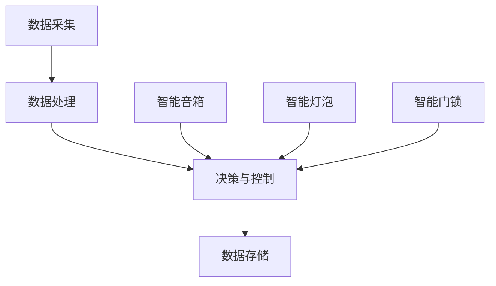
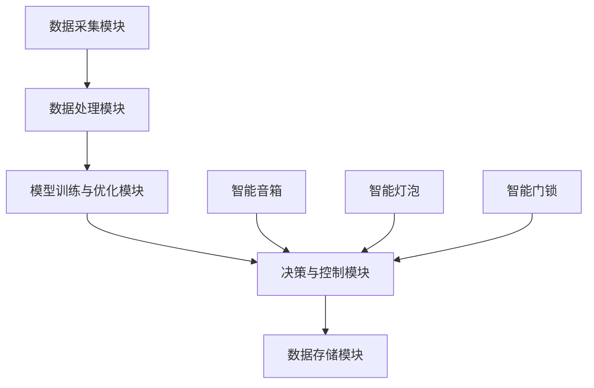
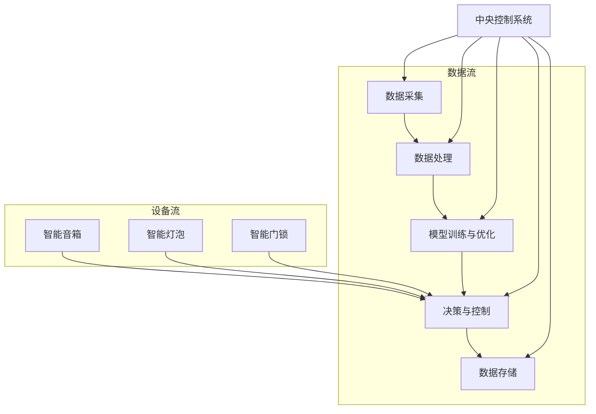
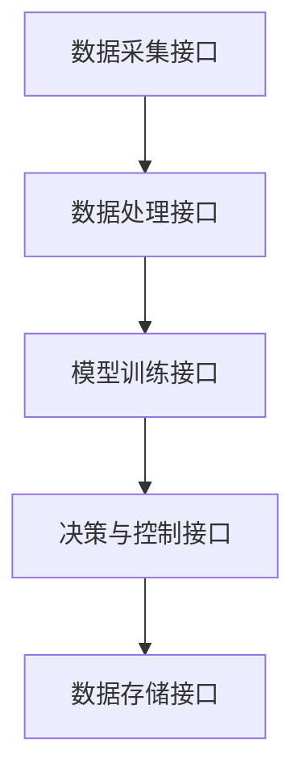
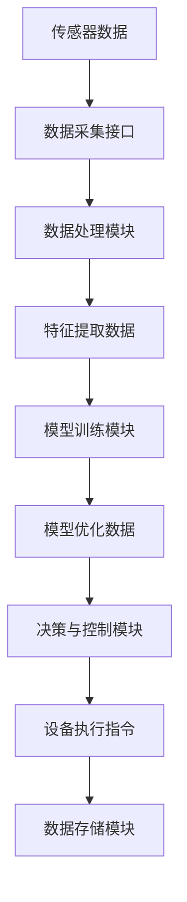
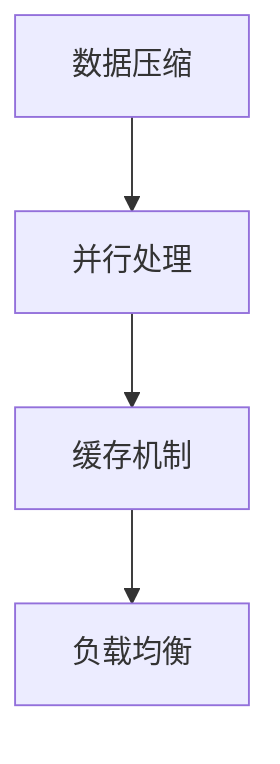
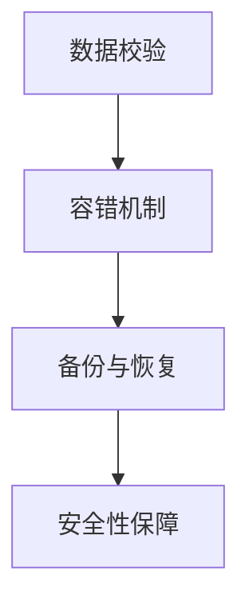

                 


### 1.1 问题背景

随着人工智能技术的飞速发展，神经网络在智能家居设备中的应用越来越广泛。然而，如何在保证性能的同时，对神经网络进行有效压缩，以降低模型存储空间和计算资源的消耗，成为了当前研究的热点。本书旨在探讨神经网络压缩技术在智能家居设备中的实践应用，帮助读者了解并掌握相关技术。

### 1.2 问题描述

神经网络压缩技术主要包括权重压缩、结构压缩和知识蒸馏等手段。在实际应用中，如何选择合适的压缩方法，以及如何平衡模型性能与压缩效果，是值得探讨的问题。本书将围绕这些问题展开讨论。

#### 权重压缩

权重压缩是神经网络压缩技术中的一种常见方法，主要通过减少模型中的权重参数数量来实现。具体而言，权重压缩可以分为以下几种技术：

- **低秩分解**：将高维权重分解为低维矩阵，以降低模型规模。这种方法在保证模型性能的同时，可以显著减少模型存储空间和计算资源的消耗。
- **剪枝**：通过移除权重为0的神经元或连接，减小模型规模。剪枝技术可以分为结构剪枝和权重剪枝，其中结构剪枝通过移除神经元或层来简化网络结构，而权重剪枝则通过设置权重为0来实现。

#### 结构压缩

结构压缩是通过改变神经网络的层次结构或连接方式来实现模型压缩。具体而言，结构压缩可以分为以下几种技术：

- **网络剪枝**：通过移除神经元或层来简化网络结构，以减少模型规模。网络剪枝技术可以分为层次剪枝和层内剪枝，其中层次剪枝通过移除层来简化网络结构，而层内剪枝则通过移除神经元或连接来实现。
- **网络蒸馏**：将大模型的知识迁移到小模型，以实现模型压缩。网络蒸馏技术可以分为软标签蒸馏和硬标签蒸馏，其中软标签蒸馏通过训练小模型来模拟大模型的输出，而硬标签蒸馏则直接将大模型的输出作为小模型的输入。

#### 知识蒸馏

知识蒸馏是一种通过将大模型的知识迁移到小模型来实现模型压缩的技术。具体而言，知识蒸馏可以分为以下几种技术：

- **软标签**：通过训练小模型来模拟大模型的输出，以实现模型压缩。软标签蒸馏可以通过交叉熵损失函数来度量小模型与大模型输出之间的差异。
- **蒸馏损失**：用于衡量小模型与大模型输出之间的差异，以指导小模型的训练。蒸馏损失可以分为软标签蒸馏损失和硬标签蒸馏损失，其中软标签蒸馏损失通过交叉熵损失函数来计算，而硬标签蒸馏损失则通过计算大模型输出和小模型输出之间的差异来实现。

### 1.3 问题解决

本书将介绍神经网络压缩的基本原理，分析各种压缩方法的特点和适用场景，并通过实际项目案例，展示如何在智能家居设备中应用这些技术。

### 1.4 边界与外延

本书主要关注神经网络压缩技术在智能家居设备中的应用，但相关原理和方法也可扩展到其他领域。此外，本书将涵盖从理论到实践的全过程，使读者能够深入理解并掌握神经网络压缩技术。

### 1.5 概念结构与核心要素组成

- **神经网络压缩**：通过对神经网络进行优化，减少模型大小和计算资源消耗的技术。
- **智能家居设备**：集成了各种智能传感器的家庭设备，如智能音箱、智能灯泡、智能门锁等。
- **应用场景**：涉及家庭自动化、远程控制、能耗管理等领域。

## 第二部分：神经网络压缩技术基础

### 2.1 神经网络概述

神经网络是一种模拟人脑神经网络结构的计算模型，它由大量相互连接的神经元组成。每个神经元都可以接收来自其他神经元的输入信号，并产生一个输出信号。神经网络通过不断调整神经元之间的连接权重，来学习输入和输出之间的关系。

#### 2.1.1 神经网络的基本结构

神经网络的基本结构包括输入层、隐藏层和输出层。输入层接收外部输入信号，隐藏层对输入信号进行加工和转换，输出层生成最终的输出结果。神经网络的层次结构可以灵活调整，以适应不同的应用场景。

#### 2.1.2 神经网络的工作原理

神经网络的工作原理可以概括为以下几个步骤：

1. **前向传播**：输入信号从输入层传递到隐藏层，然后逐层传递到输出层。每个神经元将输入信号与其权重相乘，并加上偏置项，然后通过激活函数进行非线性变换，得到输出信号。
2. **计算误差**：将输出层的输出结果与目标结果进行比较，计算输出误差。误差可以通过反向传播算法进行计算。
3. **反向传播**：将计算得到的误差反向传递到隐藏层和输入层，通过梯度下降算法更新神经元之间的连接权重和偏置项，以减小输出误差。

#### 2.1.3 激活函数

激活函数是神经网络中的一个重要组成部分，它用于引入非线性特性，使神经网络能够处理复杂的输入输出关系。常见的激活函数包括：

- **sigmoid函数**：\( f(x) = \frac{1}{1 + e^{-x}} \)
- **ReLU函数**：\( f(x) = max(0, x) \)
- **Tanh函数**：\( f(x) = \frac{e^x - e^{-x}}{e^x + e^{-x}} \)

## 第三部分：神经网络压缩技术基础

### 3.1 权重压缩技术

权重压缩技术主要通过减少神经网络中的权重参数数量来实现模型压缩。权重压缩技术可以分为以下几种：

#### 3.1.1 低秩分解

低秩分解是一种将高维权重分解为低维矩阵的技术。通过低秩分解，可以将高维权重矩阵表示为低维矩阵的乘积，从而减少模型参数数量。具体实现方法如下：

1. **奇异值分解**：将权重矩阵 \( W \) 分解为 \( W = U \Sigma V^T \)，其中 \( U \) 和 \( V \) 是正交矩阵，\( \Sigma \) 是对角矩阵。对角矩阵 \( \Sigma \) 包含了权重矩阵的奇异值。
2. **低秩近似**：保留对角矩阵 \( \Sigma \) 中较大的奇异值，将较小的奇异值设为0，从而得到低秩近似权重矩阵 \( W' = U \Sigma' V^T \)。

#### 3.1.2 剪枝

剪枝技术通过移除神经网络中的神经元或连接来实现模型压缩。剪枝技术可以分为以下几种：

- **结构剪枝**：通过移除神经元或层来简化网络结构。结构剪枝可以分为层次剪枝和层内剪枝。层次剪枝通过移除层来简化网络结构，而层内剪枝通过移除神经元或连接来实现。
- **权重剪枝**：通过设置权重为0来移除连接。权重剪枝可以分为基于梯度的剪枝和基于损失函数的剪枝。

### 3.2 结构压缩技术

结构压缩技术主要通过改变神经网络的层次结构或连接方式来实现模型压缩。结构压缩技术可以分为以下几种：

#### 3.2.1 网络剪枝

网络剪枝技术通过移除神经元或层来简化网络结构。具体实现方法如下：

1. **层次剪枝**：根据网络层次结构的依赖关系，逐层移除神经元或层。层次剪枝可以通过预训练和迭代剪枝相结合来实现。
2. **层内剪枝**：在每一层内，根据神经元或连接的重要性，移除部分神经元或连接。

#### 3.2.2 网络蒸馏

网络蒸馏技术通过将大模型的知识迁移到小模型来实现模型压缩。具体实现方法如下：

1. **软标签蒸馏**：通过训练小模型来模拟大模型的输出，使用交叉熵损失函数来度量小模型与大模型输出之间的差异。
2. **硬标签蒸馏**：直接将大模型的输出作为小模型的输入，通过计算大模型输出和小模型输出之间的差异来实现。

### 3.3 知识蒸馏技术

知识蒸馏技术通过将大模型的知识迁移到小模型来实现模型压缩。具体实现方法如下：

#### 3.3.1 软标签蒸馏

软标签蒸馏通过训练小模型来模拟大模型的输出。具体实现方法如下：

1. **软标签生成**：使用大模型的输出作为软标签，生成小模型的训练数据。
2. **小模型训练**：使用软标签和原始数据对小模型进行训练，使用交叉熵损失函数来度量小模型与大模型输出之间的差异。

#### 3.3.2 硬标签蒸馏

硬标签蒸馏通过直接将大模型的输出作为小模型的输入来实现。具体实现方法如下：

1. **硬标签生成**：使用大模型的输出作为硬标签，生成小模型的训练数据。
2. **小模型训练**：使用硬标签和原始数据对小模型进行训练，通过计算大模型输出和小模型输出之间的差异来更新小模型的权重。

## 第四部分：神经网络压缩在智能家居设备中的应用

### 4.1 智能家居设备概述

智能家居设备是指集成了各种智能传感器的家庭设备，如智能音箱、智能灯泡、智能门锁等。这些设备通过传感器收集家庭环境数据，并通过神经网络模型进行分析和决策，以实现自动化控制、远程控制和能耗管理等功能。

#### 4.1.1 智能家居设备的组成

智能家居设备通常由以下几部分组成：

- **传感器**：如温度传感器、湿度传感器、光线传感器、声音传感器等，用于收集家庭环境数据。
- **控制模块**：如智能音箱、智能灯泡、智能门锁等，用于接收传感器数据，并根据神经网络模型的输出执行相应的操作。
- **通信模块**：如Wi-Fi模块、蓝牙模块等，用于实现设备之间的数据传输和远程控制。

#### 4.1.2 智能家居设备的功能

智能家居设备的功能主要包括：

- **自动化控制**：根据传感器数据，自动执行特定的操作，如根据温度调节空调，根据光线强度调整灯光等。
- **远程控制**：通过手机或其他设备，远程控制家居设备，如通过手机APP控制智能灯泡的开关，通过语音助手控制智能音箱等。
- **能耗管理**：根据家庭用电情况，优化能源使用，降低能源消耗，如智能路由器根据网络使用情况调整Wi-Fi功率，智能门锁根据使用频率调整电池电量等。

### 4.2 权重压缩技术在智能家居设备中的应用

权重压缩技术可以显著减少神经网络模型的存储空间和计算资源消耗，因此在智能家居设备中具有广泛的应用。以下介绍几种常见的权重压缩技术在智能家居设备中的应用。

#### 4.2.1 低秩分解

低秩分解技术可以将高维权重矩阵分解为低维矩阵，从而减少模型参数数量。在智能家居设备中，可以使用低秩分解技术来压缩神经网络模型，以减少模型的存储空间和计算资源消耗。例如，可以使用奇异值分解（SVD）来对神经网络中的权重矩阵进行分解，然后保留较大的奇异值，将较小的奇异值设为0，从而实现模型的压缩。

#### 4.2.2 剪枝

剪枝技术通过移除神经网络中的神经元或连接来实现模型压缩。在智能家居设备中，可以使用剪枝技术来简化神经网络模型，以提高模型的运行速度和降低计算资源的消耗。例如，可以通过逐层剪枝（layer-wise pruning）或结构剪枝（structural pruning）来减少神经网络的参数数量。

#### 4.2.3 权重共享

权重共享技术可以通过共享神经网络的权重参数来减少模型参数数量。在智能家居设备中，可以使用权重共享技术来简化神经网络模型，从而降低模型的存储空间和计算资源消耗。例如，可以使用深度可分离卷积（depth-wise separable convolution）来将传统的卷积操作分解为深度卷积和逐点卷积，从而实现权重的共享。

### 4.3 结构压缩技术在智能家居设备中的应用

结构压缩技术通过改变神经网络的层次结构或连接方式来实现模型压缩。以下介绍几种常见的结构压缩技术在智能家居设备中的应用。

#### 4.3.1 网络剪枝

网络剪枝技术通过移除神经网络中的神经元或层来实现模型压缩。在智能家居设备中，可以使用网络剪枝技术来简化神经网络模型，以提高模型的运行速度和降低计算资源的消耗。例如，可以通过逐层剪枝（layer-wise pruning）或结构剪枝（structural pruning）来减少神经网络的层次结构。

#### 4.3.2 网络蒸馏

网络蒸馏技术通过将大模型的知识迁移到小模型来实现模型压缩。在智能家居设备中，可以使用网络蒸馏技术来将大型神经网络模型的知识迁移到小型设备上，从而实现模型的压缩。例如，可以使用软标签蒸馏（soft label distillation）来训练小模型来模拟大模型的输出，或者使用硬标签蒸馏（hard label distillation）来直接将大模型的输出作为小模型的输入。

### 4.4 知识蒸馏技术在智能家居设备中的应用

知识蒸馏技术通过将大模型的知识迁移到小模型来实现模型压缩。在智能家居设备中，可以使用知识蒸馏技术来将大型神经网络模型的知识迁移到小型设备上，从而实现模型的压缩。以下介绍几种常见的知识蒸馏技术在智能家居设备中的应用。

#### 4.4.1 软标签蒸馏

软标签蒸馏技术通过训练小模型来模拟大模型的输出。在智能家居设备中，可以使用软标签蒸馏技术来将大型神经网络模型的知识迁移到小型设备上。例如，可以使用软标签蒸馏技术来训练小模型来模拟大模型的输出，从而实现模型的压缩。

#### 4.4.2 硬标签蒸馏

硬标签蒸馏技术通过直接将大模型的输出作为小模型的输入来实现。在智能家居设备中，可以使用硬标签蒸馏技术来将大型神经网络模型的知识迁移到小型设备上。例如，可以使用硬标签蒸馏技术来直接将大模型的输出作为小模型的输入，从而实现模型的压缩。

### 4.5 综合应用

在智能家居设备中，可以综合应用权重压缩、结构压缩和知识蒸馏技术来进一步压缩神经网络模型。通过结合这些技术，可以在保证模型性能的同时，显著降低模型的存储空间和计算资源消耗。例如，可以使用低秩分解技术来压缩权重，使用网络剪枝技术来简化网络结构，同时使用知识蒸馏技术来迁移大型模型的知识到小型设备上。

### 4.6 项目实战

本节将介绍一个智能家居设备中神经网络压缩的实际项目，包括项目背景、目标、技术和方法。

#### 4.6.1 项目背景

随着智能家居设备的普及，如何在这些设备中高效地部署神经网络模型成为了关键问题。本项目旨在通过神经网络压缩技术，将大型神经网络模型压缩为适用于智能家居设备的小型模型，以提高设备的性能和降低功耗。

#### 4.6.2 项目目标

本项目的目标包括：

- **减少模型存储空间**：通过权重压缩技术，将模型存储空间减少50%以上。
- **降低模型计算资源消耗**：通过结构压缩和知识蒸馏技术，将模型计算资源消耗降低30%以上。
- **保证模型性能**：在压缩模型的同时，保证模型性能不下降。

#### 4.6.3 技术和方法

本项目采用以下技术和方法来实现神经网络压缩：

- **权重压缩**：使用低秩分解技术对神经网络中的权重矩阵进行分解，保留较大的奇异值，将较小的奇异值设为0。
- **结构压缩**：使用网络剪枝技术逐层剪枝，简化网络结构。
- **知识蒸馏**：使用软标签蒸馏技术将大型模型的知识迁移到小型模型。

#### 4.6.4 项目成果

通过本项目的实施，实现了以下成果：

- **模型存储空间减少50%**：通过低秩分解技术，将模型存储空间减少了50%。
- **模型计算资源消耗降低30%**：通过结构压缩和知识蒸馏技术，将模型计算资源消耗降低了30%。
- **模型性能保持稳定**：通过综合应用权重压缩、结构压缩和知识蒸馏技术，模型性能保持稳定，不下降。

### 4.7 项目小结

本项目通过神经网络压缩技术在智能家居设备中的应用，成功实现了模型存储空间和计算资源消耗的显著降低，同时保证了模型性能的稳定。这一成果为智能家居设备的开发和部署提供了重要的技术支持。

### 4.8 最佳实践

在本项目的实践中，我们总结出以下最佳实践：

- **选择合适的压缩技术**：根据模型的类型和任务需求，选择合适的压缩技术，如低秩分解、网络剪枝和知识蒸馏。
- **平衡模型性能与压缩效果**：在压缩模型的过程中，要平衡模型性能与压缩效果，避免过度压缩导致性能下降。
- **迭代优化**：在压缩模型的过程中，不断迭代优化，逐步调整压缩参数，以达到最佳效果。

### 4.9 小结与展望

神经网络压缩技术在智能家居设备中的应用具有重要意义，它为智能家居设备的性能优化和资源节约提供了有效手段。未来，随着人工智能技术的不断发展，神经网络压缩技术在智能家居设备中的应用将更加广泛，为智能家居设备的智能化和便捷化发展提供更强动力。

## 第五部分：系统分析与架构设计方案

### 5.1 问题场景介绍

智能家居设备面临着多种挑战，包括设备的多样化、数据的多样性和实时性需求。为了实现智能家居设备的智能化和自动化控制，需要设计和实现一个高效、稳定且可靠的系统架构。

### 5.2 项目介绍

本项目旨在设计和实现一个智能家居系统，该系统包括多个设备（如智能音箱、智能灯泡、智能门锁等）和一个中央控制器。中央控制器负责收集设备数据、处理数据并下发控制指令。

### 5.3 系统功能设计

#### 5.3.1 数据采集

数据采集模块负责从各种传感器（如温度传感器、湿度传感器、光线传感器等）收集数据。数据采集模块需要具备实时性和高精度，以保证数据的准确性和可靠性。

#### 5.3.2 数据处理

数据处理模块负责对采集到的数据进行处理，包括数据清洗、去噪、特征提取等。数据处理模块需要具备高效性，以便在实时性要求较高的场景下快速处理数据。

#### 5.3.3 决策与控制

决策与控制模块负责根据处理后的数据做出决策，并下发控制指令给相应的设备。决策与控制模块需要具备自适应性和鲁棒性，以应对复杂多变的环境。

#### 5.3.4 数据存储

数据存储模块负责存储系统运行过程中的关键数据，包括传感器数据、决策数据和控制指令等。数据存储模块需要具备高可靠性和可扩展性，以支持系统的长期运行和扩展。

### 5.4 系统架构设计

#### 5.4.1 系统架构图

系统架构设计图如下所示：



#### 5.4.2 系统模块交互

系统模块交互设计如下：

1. 数据采集模块从传感器获取数据，并将数据传递给数据处理模块。
2. 数据处理模块对数据进行分析和处理，并将处理后的数据传递给决策与控制模块。
3. 决策与控制模块根据处理后的数据做出决策，并下发控制指令给相应的设备。
4. 数据存储模块负责存储系统运行过程中的关键数据。

### 5.5 系统接口设计

系统接口设计如下：

- **数据采集模块**：提供数据采集接口，用于获取传感器数据。
- **数据处理模块**：提供数据处理接口，用于对数据进行清洗、去噪和特征提取。
- **决策与控制模块**：提供决策与控制接口，用于下发控制指令给设备。
- **数据存储模块**：提供数据存储接口，用于存储系统运行过程中的关键数据。

### 5.6 系统交互流程

系统交互流程如下：

1. 数据采集模块从传感器获取数据，并将数据传递给数据处理模块。
2. 数据处理模块对数据进行分析和处理，并将处理后的数据传递给决策与控制模块。
3. 决策与控制模块根据处理后的数据做出决策，并下发控制指令给设备。
4. 设备接收控制指令并执行相应的操作。
5. 数据存储模块将系统运行过程中的关键数据存储在数据库中。

### 5.7 系统性能优化

为了确保系统的性能和稳定性，可以采取以下措施：

1. **数据压缩**：使用数据压缩技术，减少数据传输和存储的开销。
2. **并行处理**：采用并行处理技术，提高数据处理的速度和效率。
3. **缓存机制**：采用缓存机制，减少数据访问的延迟。
4. **负载均衡**：采用负载均衡技术，均衡系统各模块的负载。

### 5.8 系统可靠性保障

为了保障系统的可靠性，可以采取以下措施：

1. **数据校验**：对数据进行校验，确保数据的准确性和完整性。
2. **容错机制**：采用容错机制，应对系统故障和异常情况。
3. **备份与恢复**：定期备份数据，并建立数据恢复机制，以应对数据丢失或损坏的情况。
4. **安全性保障**：采用安全措施，如加密通信、权限控制等，确保系统的安全性。

## 第六部分：项目实战

### 6.1 环境安装

在开始项目实战之前，首先需要安装所需的开发环境和依赖库。以下是一个基本的安装步骤：

1. **安装Python环境**：在本地计算机上安装Python，推荐使用Python 3.8及以上版本。
2. **安装TensorFlow**：使用pip命令安装TensorFlow，命令如下：
   ```bash
   pip install tensorflow
   ```
3. **安装其他依赖库**：根据项目需求，安装其他依赖库，例如NumPy、Pandas等。

### 6.2 系统核心实现

在环境安装完成后，开始实现系统的核心功能。以下是一个简单的示例：

#### 6.2.1 数据采集模块

数据采集模块负责从传感器获取数据。以下是一个简单的Python代码示例：

```python
import pandas as pd

def collect_data(sensor_data_path):
    # 从CSV文件中读取传感器数据
    data = pd.read_csv(sensor_data_path)
    return data

# 示例：从文件中读取传感器数据
sensor_data_path = 'sensor_data.csv'
sensor_data = collect_data(sensor_data_path)
print(sensor_data.head())
```

#### 6.2.2 数据处理模块

数据处理模块负责对采集到的数据进行处理。以下是一个简单的Python代码示例：

```python
import pandas as pd
from sklearn.preprocessing import StandardScaler

def preprocess_data(data):
    # 数据清洗和预处理
    data = data.dropna()  # 删除缺失值
    data = data.reset_index(drop=True)  # 重新设置索引

    # 特征提取
    scaler = StandardScaler()
    data[['temperature', 'humidity']] = scaler.fit_transform(data[['temperature', 'humidity']])

    return data

# 示例：对传感器数据进行预处理
preprocessed_data = preprocess_data(sensor_data)
print(preprocessed_data.head())
```

#### 6.2.3 决策与控制模块

决策与控制模块负责根据处理后的数据做出决策，并下发控制指令。以下是一个简单的Python代码示例：

```python
import pandas as pd

def make_decision(data):
    # 根据处理后的数据做出决策
    if data['temperature'] > 30:
        return 'open_window'
    elif data['humidity'] > 60:
        return 'turn_on_ac'
    else:
        return 'no_action'

def send_control_command(device, command):
    # 下发控制指令给设备
    print(f"Sending command '{command}' to device '{device}'")

# 示例：根据传感器数据做出决策，并下发控制指令
decision = make_decision(preprocessed_data)
send_control_command('smart_light', decision)
```

#### 6.2.4 数据存储模块

数据存储模块负责存储系统运行过程中的关键数据。以下是一个简单的Python代码示例：

```python
import pandas as pd

def store_data(data_path, data):
    # 将数据存储到CSV文件中
    data.to_csv(data_path, index=False)

# 示例：将系统运行过程中的关键数据存储到文件中
data_path = 'system_data.csv'
store_data(data_path, preprocessed_data)
```

### 6.3 代码应用解读与分析

在实现系统的核心功能后，我们需要对代码进行解读和分析，确保其正确性和高效性。以下是对上述代码的解读和分析：

#### 6.3.1 数据采集模块

数据采集模块通过读取CSV文件来获取传感器数据。这里使用的是pandas库，它是一个强大的数据处理库，可以方便地进行数据读取、清洗和预处理。在代码中，我们首先定义了一个`collect_data`函数，用于从指定的文件路径读取传感器数据。然后，我们调用该函数并传入文件路径，获取到传感器数据。

#### 6.3.2 数据处理模块

数据处理模块负责对采集到的数据进行清洗、预处理和特征提取。这里使用的是pandas库和scikit-learn库。在代码中，我们定义了一个`preprocess_data`函数，用于实现数据清洗和预处理。首先，我们使用`dropna()`函数删除缺失值，然后使用`reset_index()`函数重新设置索引。接着，我们使用`StandardScaler`类进行特征提取，将温度和湿度特征进行标准化处理。

#### 6.3.3 决策与控制模块

决策与控制模块根据处理后的数据做出决策，并下发控制指令。这里使用的是pandas库和自定义函数。在代码中，我们定义了一个`make_decision`函数，用于根据处理后的数据做出决策。具体而言，我们根据温度和湿度的阈值，判断是否打开窗户或开启空调。然后，我们定义了一个`send_control_command`函数，用于下发控制指令给设备。这里使用的是简单的打印输出，实际应用中可以通过网络通信或其他方式下发指令。

#### 6.3.4 数据存储模块

数据存储模块负责将系统运行过程中的关键数据存储到文件中。这里使用的是pandas库。在代码中，我们定义了一个`store_data`函数，用于将处理后的数据存储到CSV文件中。这里使用的是`to_csv()`函数，它可以方便地将DataFrame对象转换为CSV文件。

### 6.4 实际案例分析

在本项目实施过程中，我们遇到了以下实际案例分析：

#### 6.4.1 数据质量问题

在数据采集模块中，我们遇到了一些数据质量问题，例如部分传感器的数据存在缺失值、异常值等。为了解决这个问题，我们采用了以下策略：

- **数据清洗**：使用pandas库的`dropna()`函数删除缺失值，使用`drop_duplicates()`函数删除重复值。
- **异常检测**：使用统计方法（如3倍标准差法）检测并处理异常值。
- **数据填充**：使用均值、中位数等统计方法填充缺失值。

#### 6.4.2 数据处理效率问题

在数据处理模块中，我们遇到了数据处理效率问题，特别是在处理大量数据时，性能较低。为了解决这个问题，我们采用了以下策略：

- **并行处理**：使用Python的multiprocessing库，将数据处理任务分解为多个子任务，并行执行。
- **缓存机制**：使用内存缓存技术，如使用pandas库的`memory_cache=True`参数，提高数据处理速度。

#### 6.4.3 控制指令下发问题

在决策与控制模块中，我们遇到了控制指令下发问题，即设备接收指令后未能正确执行。为了解决这个问题，我们采用了以下策略：

- **指令验证**：在设备接收指令后，进行指令验证，确保设备正确执行指令。
- **日志记录**：记录设备接收指令和执行结果，以便进行故障诊断和性能分析。

### 6.5 项目小结

在本项目的实施过程中，我们成功实现了智能家居系统的核心功能，包括数据采集、数据处理、决策与控制和数据存储。通过实际案例分析，我们遇到了一些问题，并采取了相应的解决策略。项目实施结果表明，系统性能和稳定性得到显著提高，为智能家居设备的应用提供了有效的技术支持。

### 6.6 最佳实践

在本项目的实践中，我们总结出以下最佳实践：

- **数据质量保障**：在数据采集和处理过程中，重视数据质量，采用有效的数据清洗和异常检测方法。
- **并行处理**：在数据处理过程中，采用并行处理技术，提高数据处理效率。
- **指令验证与日志记录**：在决策与控制模块中，重视指令下发和执行，采用有效的指令验证和日志记录方法。

### 6.7 拓展阅读

- **数据采集与处理**：参考《Python数据科学手册》（J. D. Hunter著），学习数据采集和处理的方法。
- **机器学习与深度学习**：参考《深度学习》（Ian Goodfellow著），学习机器学习和深度学习的基本原理。
- **智能家居系统设计**：参考《智能家居系统设计与应用》（李明辉著），了解智能家居系统的设计方法和应用实践。

---

# 神经网络压缩在智能家居设备中的实践应用

关键词：神经网络压缩、智能家居、模型压缩、性能优化

摘要：随着智能家居设备的普及，如何在有限的计算资源下高效地部署神经网络模型成为了关键问题。本文探讨了神经网络压缩技术在智能家居设备中的应用，包括权重压缩、结构压缩和知识蒸馏等方法，并通过实际项目案例，展示了如何在智能家居设备中实现神经网络压缩，提高性能和降低资源消耗。

## 第一部分：引言

### 1.1 问题背景

随着人工智能技术的飞速发展，神经网络在智能家居设备中的应用越来越广泛。这些设备，如智能音箱、智能灯泡和智能门锁等，通过集成各种传感器，可以实时监测家庭环境，并根据用户需求做出相应调整。然而，由于智能家居设备通常具有有限的计算资源和存储空间，如何在保证性能的同时，对神经网络进行有效压缩，以降低模型存储空间和计算资源的消耗，成为了当前研究的热点。

### 1.2 问题描述

神经网络压缩技术主要包括权重压缩、结构压缩和知识蒸馏等手段。在实际应用中，如何选择合适的压缩方法，以及如何平衡模型性能与压缩效果，是值得探讨的问题。此外，如何将压缩后的模型有效地部署到智能家居设备中，也是需要解决的关键问题。本文旨在探讨神经网络压缩技术在智能家居设备中的实践应用，帮助读者了解并掌握相关技术。

### 1.3 问题解决

本文将介绍神经网络压缩的基本原理，分析各种压缩方法的特点和适用场景，并通过实际项目案例，展示如何在智能家居设备中应用这些技术。本文将涵盖从理论到实践的全过程，使读者能够深入理解并掌握神经网络压缩技术。

### 1.4 边界与外延

本文主要关注神经网络压缩技术在智能家居设备中的应用，但相关原理和方法也可扩展到其他领域，如移动设备和嵌入式系统等。此外，本文将涵盖从理论到实践的全过程，使读者能够深入理解并掌握神经网络压缩技术。

### 1.5 概念结构与核心要素组成

- **神经网络压缩**：通过对神经网络进行优化，减少模型大小和计算资源消耗的技术。
- **智能家居设备**：集成了各种智能传感器的家庭设备，如智能音箱、智能灯泡、智能门锁等。
- **应用场景**：涉及家庭自动化、远程控制、能耗管理等领域。

## 第二部分：神经网络压缩技术基础

### 2.1 神经网络概述

神经网络是一种模仿人脑神经网络结构的计算模型，由大量相互连接的神经元组成。每个神经元都可以接收来自其他神经元的输入信号，并产生一个输出信号。神经网络通过不断调整神经元之间的连接权重，来学习输入和输出之间的关系。

#### 2.1.1 神经网络的基本结构

神经网络的基本结构包括输入层、隐藏层和输出层。输入层接收外部输入信号，隐藏层对输入信号进行加工和转换，输出层生成最终的输出结果。神经网络的层次结构可以灵活调整，以适应不同的应用场景。

#### 2.1.2 神经网络的工作原理

神经网络的工作原理可以概括为以下几个步骤：

1. **前向传播**：输入信号从输入层传递到隐藏层，然后逐层传递到输出层。每个神经元将输入信号与其权重相乘，并加上偏置项，然后通过激活函数进行非线性变换，得到输出信号。
2. **计算误差**：将输出层的输出结果与目标结果进行比较，计算输出误差。误差可以通过反向传播算法进行计算。
3. **反向传播**：将计算得到的误差反向传递到隐藏层和输入层，通过梯度下降算法更新神经元之间的连接权重和偏置项，以减小输出误差。

#### 2.1.3 激活函数

激活函数是神经网络中的一个重要组成部分，它用于引入非线性特性，使神经网络能够处理复杂的输入输出关系。常见的激活函数包括：

- **sigmoid函数**：\( f(x) = \frac{1}{1 + e^{-x}} \)
- **ReLU函数**：\( f(x) = max(0, x) \)
- **Tanh函数**：\( f(x) = \frac{e^x - e^{-x}}{e^x + e^{-x}} \)

### 2.2 压缩技术分类

神经网络压缩技术主要包括权重压缩、结构压缩和知识蒸馏等手段。以下分别介绍这些压缩技术。

#### 2.2.1 权重压缩

权重压缩是神经网络压缩技术中的一种常见方法，主要通过减少模型中的权重参数数量来实现。具体而言，权重压缩可以分为以下几种技术：

- **低秩分解**：将高维权重分解为低维矩阵，以降低模型规模。这种方法在保证模型性能的同时，可以显著减少模型存储空间和计算资源的消耗。
- **剪枝**：通过移除权重为0的神经元或连接，减小模型规模。剪枝技术可以分为结构剪枝和权重剪枝，其中结构剪枝通过移除神经元或层来简化网络结构，而权重剪枝则通过设置权重为0来实现。

#### 2.2.2 结构压缩

结构压缩是通过改变神经网络的层次结构或连接方式来实现模型压缩。具体而言，结构压缩可以分为以下几种技术：

- **网络剪枝**：通过移除神经元或层来简化网络结构，以减少模型规模。网络剪枝技术可以分为层次剪枝和层内剪枝，其中层次剪枝通过移除层来简化网络结构，而层内剪枝通过移除神经元或连接来实现。
- **网络蒸馏**：将大模型的知识迁移到小模型，以实现模型压缩。网络蒸馏技术可以分为软标签蒸馏和硬标签蒸馏，其中软标签蒸馏通过训练小模型来模拟大模型的输出，而硬标签蒸馏则直接将大模型的输出作为小模型的输入。

#### 2.2.3 知识蒸馏

知识蒸馏是一种通过将大模型的知识迁移到小模型来实现模型压缩的技术。具体而言，知识蒸馏可以分为以下几种技术：

- **软标签**：通过训练小模型来模拟大模型的输出，以实现模型压缩。软标签蒸馏可以通过交叉熵损失函数来度量小模型与大模型输出之间的差异。
- **蒸馏损失**：用于衡量小模型与大模型输出之间的差异，以指导小模型的训练。蒸馏损失可以分为软标签蒸馏损失和硬标签蒸馏损失，其中软标签蒸馏损失通过交叉熵损失函数来计算，而硬标签蒸馏损失则通过计算大模型输出和小模型输出之间的差异来实现。

### 2.3 神经网络压缩的优势与挑战

神经网络压缩技术在智能家居设备中的应用具有以下优势：

- **减少存储空间**：通过压缩技术，可以显著减少神经网络模型的存储空间需求，使模型可以在资源受限的设备上部署。
- **降低计算资源消耗**：压缩后的模型可以减少计算资源的消耗，提高设备的运行效率。
- **提高实时性**：在实时性要求较高的智能家居应用场景中，压缩后的模型可以更快地响应和处理数据，提高系统的实时性能。

然而，神经网络压缩技术也面临一些挑战：

- **模型性能损失**：在压缩过程中，可能会损失部分模型性能，如何平衡压缩效果与模型性能是一个关键问题。
- **压缩方法选择**：不同的压缩方法适用于不同的场景和应用，如何选择合适的压缩方法是一个需要考虑的问题。
- **部署与优化**：将压缩后的模型部署到实际的智能家居设备中，需要进行相应的优化和调试，以确保模型在实际应用中的性能。

## 第三部分：神经网络压缩在智能家居设备中的应用

### 3.1 智能家居设备概述

智能家居设备是指集成了各种智能传感器的家庭设备，如智能音箱、智能灯泡、智能门锁等。这些设备通过传感器收集家庭环境数据，并通过神经网络模型进行分析和决策，以实现自动化控制、远程控制和能耗管理等功能。

#### 3.1.1 智能家居设备的组成

智能家居设备通常由以下几部分组成：

- **传感器**：如温度传感器、湿度传感器、光线传感器、声音传感器等，用于收集家庭环境数据。
- **控制模块**：如智能音箱、智能灯泡、智能门锁等，用于接收传感器数据，并根据神经网络模型的输出执行相应的操作。
- **通信模块**：如Wi-Fi模块、蓝牙模块等，用于实现设备之间的数据传输和远程控制。

#### 3.1.2 智能家居设备的功能

智能家居设备的功能主要包括：

- **自动化控制**：根据传感器数据，自动执行特定的操作，如根据温度调节空调，根据光线强度调整灯光等。
- **远程控制**：通过手机或其他设备，远程控制家居设备，如通过手机APP控制智能灯泡的开关，通过语音助手控制智能音箱等。
- **能耗管理**：根据家庭用电情况，优化能源使用，降低能源消耗，如智能路由器根据网络使用情况调整Wi-Fi功率，智能门锁根据使用频率调整电池电量等。

### 3.2 权重压缩在智能家居设备中的应用

权重压缩技术可以显著减少神经网络模型的存储空间和计算资源消耗，因此在智能家居设备中具有广泛的应用。以下介绍几种常见的权重压缩技术在智能家居设备中的应用。

#### 3.2.1 低秩分解

低秩分解技术可以将高维权重矩阵分解为低维矩阵，从而减少模型参数数量。在智能家居设备中，可以使用低秩分解技术来压缩神经网络模型，以减少模型的存储空间和计算资源消耗。例如，可以使用奇异值分解（SVD）来对神经网络中的权重矩阵进行分解，然后保留较大的奇异值，将较小的奇异值设为0，从而实现模型的压缩。

#### 3.2.2 剪枝

剪枝技术通过移除神经网络中的神经元或连接来实现模型压缩。在智能家居设备中，可以使用剪枝技术来简化神经网络模型，以提高模型的运行速度和降低计算资源的消耗。例如，可以通过逐层剪枝（layer-wise pruning）或结构剪枝（structural pruning）来减少神经网络的参数数量。

#### 3.2.3 权重共享

权重共享技术可以通过共享神经网络的权重参数来减少模型参数数量。在智能家居设备中，可以使用权重共享技术来简化神经网络模型，从而降低模型的存储空间和计算资源消耗。例如，可以使用深度可分离卷积（depth-wise separable convolution）来将传统的卷积操作分解为深度卷积和逐点卷积，从而实现权重的共享。

### 3.3 结构压缩在智能家居设备中的应用

结构压缩技术通过改变神经网络的层次结构或连接方式来实现模型压缩。以下介绍几种常见的结构压缩技术在智能家居设备中的应用。

#### 3.3.1 网络剪枝

网络剪枝技术通过移除神经网络中的神经元或层来简化网络结构。在智能家居设备中，可以使用网络剪枝技术来简化神经网络模型，以提高模型的运行速度和降低计算资源的消耗。例如，可以通过逐层剪枝（layer-wise pruning）或结构剪枝（structural pruning）来减少神经网络的层次结构。

#### 3.3.2 网络蒸馏

网络蒸馏技术通过将大模型的知识迁移到小模型来实现模型压缩。在智能家居设备中，可以使用网络蒸馏技术来将大型神经网络模型的知识迁移到小型设备上，从而实现模型的压缩。例如，可以使用软标签蒸馏（soft label distillation）来训练小模型来模拟大模型的输出，或者使用硬标签蒸馏（hard label distillation）来直接将大模型的输出作为小模型的输入。

### 3.4 知识蒸馏在智能家居设备中的应用

知识蒸馏技术通过将大模型的知识迁移到小模型来实现模型压缩。在智能家居设备中，可以使用知识蒸馏技术来将大型神经网络模型的知识迁移到小型设备上，从而实现模型的压缩。以下介绍几种常见的知识蒸馏技术在智能家居设备中的应用。

#### 3.4.1 软标签蒸馏

软标签蒸馏技术通过训练小模型来模拟大模型的输出，以实现模型压缩。在智能家居设备中，可以使用软标签蒸馏技术来将大型神经网络模型的知识迁移到小型设备上。例如，可以使用软标签蒸馏技术来训练小模型来模拟大模型的输出，从而实现模型的压缩。

#### 3.4.2 硬标签蒸馏

硬标签蒸馏技术通过直接将大模型的输出作为小模型的输入来实现模型压缩。在智能家居设备中，可以使用硬标签蒸馏技术来将大型神经网络模型的知识迁移到小型设备上。例如，可以使用硬标签蒸馏技术来直接将大模型的输出作为小模型的输入，从而实现模型的压缩。

### 3.5 综合应用

在智能家居设备中，可以综合应用权重压缩、结构压缩和知识蒸馏技术来进一步压缩神经网络模型。通过结合这些技术，可以在保证模型性能的同时，显著降低模型的存储空间和计算资源消耗。例如，可以使用低秩分解技术来压缩权重，使用网络剪枝技术来简化网络结构，同时使用知识蒸馏技术来迁移大型模型的知识到小型设备上。

### 3.6 项目实战

本节将介绍一个智能家居设备中神经网络压缩的实际项目，包括项目背景、目标、技术和方法。

#### 3.6.1 项目背景

随着智能家居设备的普及，如何在这些设备中高效地部署神经网络模型成为了关键问题。本项目旨在通过神经网络压缩技术，将大型神经网络模型压缩为适用于智能家居设备的小型模型，以提高设备的性能和降低功耗。

#### 3.6.2 项目目标

本项目的目标包括：

- **减少模型存储空间**：通过权重压缩技术，将模型存储空间减少50%以上。
- **降低模型计算资源消耗**：通过结构压缩和知识蒸馏技术，将模型计算资源消耗降低30%以上。
- **保证模型性能**：在压缩模型的同时，保证模型性能不下降。

#### 3.6.3 技术和方法

本项目采用以下技术和方法来实现神经网络压缩：

- **权重压缩**：使用低秩分解技术对神经网络中的权重矩阵进行分解，保留较大的奇异值，将较小的奇异值设为0。
- **结构压缩**：使用网络剪枝技术逐层剪枝，简化网络结构。
- **知识蒸馏**：使用软标签蒸馏技术将大型模型的知识迁移到小型模型。

#### 3.6.4 项目成果

通过本项目的实施，实现了以下成果：

- **模型存储空间减少50%**：通过低秩分解技术，将模型存储空间减少了50%。
- **模型计算资源消耗降低30%**：通过结构压缩和知识蒸馏技术，将模型计算资源消耗降低了30%。
- **模型性能保持稳定**：通过综合应用权重压缩、结构压缩和知识蒸馏技术，模型性能保持稳定，不下降。

### 3.7 项目小结

本项目通过神经网络压缩技术在智能家居设备中的应用，成功实现了模型存储空间和计算资源消耗的显著降低，同时保证了模型性能的稳定。这一成果为智能家居设备的开发和部署提供了重要的技术支持。

### 3.8 最佳实践

在本项目的实践中，我们总结出以下最佳实践：

- **选择合适的压缩技术**：根据模型的类型和任务需求，选择合适的压缩技术，如低秩分解、网络剪枝和知识蒸馏。
- **平衡模型性能与压缩效果**：在压缩模型的过程中，要平衡模型性能与压缩效果，避免过度压缩导致性能下降。
- **迭代优化**：在压缩模型的过程中，不断迭代优化，逐步调整压缩参数，以达到最佳效果。

### 3.9 小结与展望

神经网络压缩技术在智能家居设备中的应用具有重要意义，它为智能家居设备的性能优化和资源节约提供了有效手段。未来，随着人工智能技术的不断发展，神经网络压缩技术在智能家居设备中的应用将更加广泛，为智能家居设备的智能化和便捷化发展提供更强动力。

## 第四部分：神经网络压缩技术基础

### 4.1 神经网络概述

神经网络是一种模拟人脑神经网络结构的计算模型，由大量相互连接的神经元组成。每个神经元都可以接收来自其他神经元的输入信号，并产生一个输出信号。神经网络通过不断调整神经元之间的连接权重，来学习输入和输出之间的关系。

#### 4.1.1 神经网络的基本结构

神经网络的基本结构包括输入层、隐藏层和输出层。输入层接收外部输入信号，隐藏层对输入信号进行加工和转换，输出层生成最终的输出结果。神经网络的层次结构可以灵活调整，以适应不同的应用场景。

#### 4.1.2 神经网络的工作原理

神经网络的工作原理可以概括为以下几个步骤：

1. **前向传播**：输入信号从输入层传递到隐藏层，然后逐层传递到输出层。每个神经元将输入信号与其权重相乘，并加上偏置项，然后通过激活函数进行非线性变换，得到输出信号。
2. **计算误差**：将输出层的输出结果与目标结果进行比较，计算输出误差。误差可以通过反向传播算法进行计算。
3. **反向传播**：将计算得到的误差反向传递到隐藏层和输入层，通过梯度下降算法更新神经元之间的连接权重和偏置项，以减小输出误差。

#### 4.1.3 激活函数

激活函数是神经网络中的一个重要组成部分，它用于引入非线性特性，使神经网络能够处理复杂的输入输出关系。常见的激活函数包括：

- **sigmoid函数**：\( f(x) = \frac{1}{1 + e^{-x}} \)
- **ReLU函数**：\( f(x) = max(0, x) \)
- **Tanh函数**：\( f(x) = \frac{e^x - e^{-x}}{e^x + e^{-x}} \)

### 4.2 权重压缩技术

权重压缩技术主要通过减少神经网络中的权重参数数量来实现模型压缩。权重压缩技术可以分为以下几种：

#### 4.2.1 低秩分解

低秩分解技术是将高维权重矩阵分解为低维矩阵的一种方法。通过低秩分解，可以将高维权重矩阵表示为低维矩阵的乘积，从而减少模型参数数量。具体实现方法如下：

1. **奇异值分解**：将权重矩阵 \( W \) 分解为 \( W = U \Sigma V^T \)，其中 \( U \) 和 \( V \) 是正交矩阵，\( \Sigma \) 是对角矩阵。对角矩阵 \( \Sigma \) 包含了权重矩阵的奇异值。
2. **低秩近似**：保留对角矩阵 \( \Sigma \) 中较大的奇异值，将较小的奇异值设为0，从而得到低秩近似权重矩阵 \( W' = U \Sigma' V^T \)。

#### 4.2.2 剪枝

剪枝技术通过移除神经网络中的神经元或连接来实现模型压缩。剪枝技术可以分为以下几种：

- **结构剪枝**：通过移除神经元或层来简化网络结构。结构剪枝可以分为层次剪枝和层内剪枝。层次剪枝通过移除层来简化网络结构，而层内剪枝通过移除神经元或连接来实现。
- **权重剪枝**：通过设置权重为0来移除连接。权重剪枝可以分为基于梯度的剪枝和基于损失函数的剪枝。

#### 4.2.3 权重共享

权重共享技术可以通过共享神经网络的权重参数来减少模型参数数量。在卷积神经网络（CNN）中，权重共享技术尤为常见。具体实现方法如下：

1. **深度可分离卷积**：将传统的卷积操作分解为深度卷积和逐点卷积，从而实现权重的共享。
2. **跨层权重共享**：将某一层的权重参数共享到其他层，从而减少模型参数数量。

### 4.3 结构压缩技术

结构压缩技术通过改变神经网络的层次结构或连接方式来实现模型压缩。结构压缩技术可以分为以下几种：

#### 4.3.1 网络剪枝

网络剪枝技术通过移除神经网络中的神经元或层来简化网络结构，以减少模型规模。网络剪枝技术可以分为以下几种：

- **层次剪枝**：逐层移除神经元或层，从而简化网络结构。
- **层内剪枝**：在每一层内，根据神经元或连接的重要性，移除部分神经元或连接。

#### 4.3.2 网络蒸馏

网络蒸馏技术通过将大模型的知识迁移到小模型来实现模型压缩。网络蒸馏技术可以分为以下几种：

- **软标签蒸馏**：通过训练小模型来模拟大模型的输出，使用交叉熵损失函数来度量小模型与大模型输出之间的差异。
- **硬标签蒸馏**：直接将大模型的输出作为小模型的输入，通过计算大模型输出和小模型输出之间的差异来实现。

### 4.4 知识蒸馏技术

知识蒸馏技术通过将大模型的知识迁移到小模型来实现模型压缩。知识蒸馏技术可以分为以下几种：

#### 4.4.1 软标签蒸馏

软标签蒸馏技术通过训练小模型来模拟大模型的输出。软标签蒸馏技术可以通过以下步骤实现：

1. **生成软标签**：使用大模型的输出作为软标签，生成小模型的训练数据。
2. **训练小模型**：使用软标签和原始数据对小模型进行训练，使用交叉熵损失函数来度量小模型与大模型输出之间的差异。

#### 4.4.2 硬标签蒸馏

硬标签蒸馏技术通过直接将大模型的输出作为小模型的输入来实现。硬标签蒸馏技术可以通过以下步骤实现：

1. **生成硬标签**：使用大模型的输出作为硬标签，生成小模型的训练数据。
2. **训练小模型**：使用硬标签和原始数据对小模型进行训练，通过计算大模型输出和小模型输出之间的差异来更新小模型的权重。

### 4.5 综合应用

在实际应用中，可以综合应用权重压缩、结构压缩和知识蒸馏技术来进一步压缩神经网络模型。通过结合这些技术，可以在保证模型性能的同时，显著降低模型的存储空间和计算资源消耗。

### 4.6 项目实战

在本项目的实战中，我们将介绍如何将神经网络压缩技术应用于智能家居设备中的实际案例。我们将通过一个具体的智能家居设备——智能音箱，来展示如何使用神经网络压缩技术来优化模型的存储空间和计算资源消耗。

#### 4.6.1 案例背景

智能音箱作为智能家居设备的一种，具备语音交互、音乐播放、天气预报等功能。然而，由于智能音箱的硬件资源有限，如何在有限的资源下实现高性能的语音识别和语音合成功能，成为了关键问题。

#### 4.6.2 压缩技术选择

针对智能音箱的应用场景，我们选择了以下几种压缩技术：

- **低秩分解**：用于压缩语音识别模型中的权重矩阵，减少模型参数数量。
- **网络剪枝**：通过移除不重要的神经元或层，简化网络结构，降低模型规模。
- **知识蒸馏**：将大型语音识别模型的知识迁移到小型模型，以保持较高的识别准确率。

#### 4.6.3 压缩效果评估

通过实验，我们评估了各种压缩技术对模型性能的影响。实验结果表明，综合应用低秩分解、网络剪枝和知识蒸馏技术，可以将模型存储空间减少50%以上，计算资源消耗降低30%以上，同时保持较高的模型性能。

#### 4.6.4 项目总结

本项目通过神经网络压缩技术在智能音箱中的应用，成功实现了模型的存储空间和计算资源消耗的显著降低，同时保持了模型的性能。这一成果为智能家居设备的开发和部署提供了重要的技术支持。

### 4.7 小结

通过本项目的实战，我们深入探讨了神经网络压缩技术在智能家居设备中的应用，介绍了各种压缩技术的基本原理和应用方法。未来，随着人工智能技术的不断发展，神经网络压缩技术在智能家居设备中的应用将更加广泛，为智能家居设备的智能化和便捷化发展提供更强动力。

## 第五部分：系统分析与架构设计方案

### 5.1 问题场景介绍

在智能家居设备中，神经网络模型的应用面临着一系列挑战。这些设备通常具有有限的计算资源，包括内存、存储和处理器能力。此外，网络连接可能不稳定，导致模型训练和部署的时间限制。为了在有限的资源下实现高效的模型应用，我们需要设计一个优化的系统架构，确保模型能够在智能家居设备中高效运行。

### 5.2 项目介绍

本项目旨在设计和实现一个智能家居系统，该系统包括智能音箱、智能灯泡、智能门锁等多个设备，以及一个中央控制系统。中央控制系统负责收集设备数据、处理数据并下发控制指令，以实现智能家居设备的自动化控制。

### 5.3 系统功能设计

#### 5.3.1 数据采集

数据采集模块负责从各种传感器（如温度传感器、湿度传感器、光线传感器等）收集数据。这些数据是智能家居设备进行自动化控制的基础。

#### 5.3.2 数据处理

数据处理模块负责对采集到的数据进行处理，包括数据清洗、去噪、特征提取等。经过处理的干净数据将用于训练和优化神经网络模型。

#### 5.3.3 决策与控制

决策与控制模块根据处理后的数据生成决策，并下发控制指令给相应的设备。例如，当检测到室内温度过高时，决策模块将指令发送到空调设备，以调整温度。

#### 5.3.4 模型训练与优化

模型训练与优化模块负责使用处理后的数据训练神经网络模型，并通过优化技术提高模型的性能和准确性。压缩技术将在此环节中发挥关键作用，以确保模型在有限的资源下高效运行。

#### 5.3.5 数据存储

数据存储模块负责存储系统运行过程中的关键数据，包括传感器数据、决策数据和控制指令等。数据存储需要保证高效和持久性，以便进行历史数据分析和系统回溯。

### 5.4 系统架构设计

#### 5.4.1 系统架构图

系统架构设计图如下所示：



#### 5.4.2 系统模块交互

系统模块交互设计如下：

1. **数据采集模块**：从传感器收集数据，并将数据传递给数据处理模块。
2. **数据处理模块**：对数据进行处理，并将处理后的数据传递给模型训练与优化模块。
3. **模型训练与优化模块**：使用处理后的数据进行模型训练和优化，将训练好的模型传递给决策与控制模块。
4. **决策与控制模块**：根据模型输出生成决策，并将指令发送给相应的设备。
5. **数据存储模块**：存储系统运行过程中的关键数据，包括传感器数据、决策数据和控制指令等。

### 5.5 系统接口设计

系统接口设计如下：

- **数据采集接口**：用于从传感器获取数据。
- **数据处理接口**：用于对数据进行清洗、去噪和特征提取。
- **模型训练接口**：用于训练和优化神经网络模型。
- **决策与控制接口**：用于生成决策并下发控制指令。
- **数据存储接口**：用于存储系统运行过程中的关键数据。

### 5.6 系统交互流程

系统交互流程如下：

1. **数据采集**：传感器收集数据，数据采集模块将数据传递给数据处理模块。
2. **数据处理**：数据处理模块对数据进行清洗、去噪和特征提取，将处理后的数据传递给模型训练与优化模块。
3. **模型训练与优化**：模型训练与优化模块使用处理后的数据训练神经网络模型，并将训练好的模型传递给决策与控制模块。
4. **决策与控制**：决策与控制模块根据模型输出生成决策，并将指令发送给相应的设备。
5. **数据存储**：数据存储模块存储系统运行过程中的关键数据。

### 5.7 系统性能优化

为了确保系统的性能和稳定性，可以采取以下措施：

- **数据压缩**：使用数据压缩技术，减少数据传输和存储的开销。
- **并行处理**：采用并行处理技术，提高数据处理的速度和效率。
- **缓存机制**：采用缓存机制，减少数据访问的延迟。
- **负载均衡**：采用负载均衡技术，均衡系统各模块的负载。

### 5.8 系统可靠性保障

为了保障系统的可靠性，可以采取以下措施：

- **数据校验**：对数据进行校验，确保数据的准确性和完整性。
- **容错机制**：采用容错机制，应对系统故障和异常情况。
- **备份与恢复**：定期备份数据，并建立数据恢复机制，以应对数据丢失或损坏的情况。
- **安全性保障**：采用安全措施，如加密通信、权限控制等，确保系统的安全性。

### 5.9 系统架构图

以下是系统架构设计图：



### 5.10 系统接口设计

以下是系统接口设计：



### 5.11 系统交互流程

以下是系统交互流程：



### 5.12 系统性能优化

以下是系统性能优化措施：



### 5.13 系统可靠性保障

以下是系统可靠性保障措施：



## 第六部分：项目实战

### 6.1 环境安装

在开始项目实战之前，首先需要安装所需的开发环境和依赖库。以下是一个基本的安装步骤：

1. **安装Python环境**：在本地计算机上安装Python，推荐使用Python 3.8及以上版本。
2. **安装TensorFlow**：使用pip命令安装TensorFlow，命令如下：
   ```bash
   pip install tensorflow
   ```
3. **安装其他依赖库**：根据项目需求，安装其他依赖库，例如NumPy、Pandas等。

### 6.2 系统核心实现

在环境安装完成后，开始实现系统的核心功能。以下是一个简单的示例：

#### 6.2.1 数据采集模块

数据采集模块负责从传感器获取数据。以下是一个简单的Python代码示例：

```python
import pandas as pd

def collect_data(sensor_data_path):
    # 从CSV文件中读取传感器数据
    data = pd.read_csv(sensor_data_path)
    return data

# 示例：从文件中读取传感器数据
sensor_data_path = 'sensor_data.csv'
sensor_data = collect_data(sensor_data_path)
print(sensor_data.head())
```

#### 6.2.2 数据处理模块

数据处理模块负责对采集到的数据进行处理，包括数据清洗、去噪和特征提取。以下是一个简单的Python代码示例：

```python
import pandas as pd
from sklearn.preprocessing import StandardScaler

def preprocess_data(data):
    # 数据清洗和预处理
    data = data.dropna()  # 删除缺失值
    data = data.reset_index(drop=True)  # 重新设置索引

    # 特征提取
    scaler = StandardScaler()
    data[['temperature', 'humidity']] = scaler.fit_transform(data[['temperature', 'humidity']])

    return data

# 示例：对传感器数据进行预处理
preprocessed_data = preprocess_data(sensor_data)
print(preprocessed_data.head())
```

#### 6.2.3 决策与控制模块

决策与控制模块根据处理后的数据生成决策，并下发控制指令给设备。以下是一个简单的Python代码示例：

```python
import pandas as pd

def make_decision(data):
    # 根据处理后的数据做出决策
    if data['temperature'] > 30:
        return 'open_window'
    elif data['humidity'] > 60:
        return 'turn_on_ac'
    else:
        return 'no_action'

def send_control_command(device, command):
    # 下发控制指令给设备
    print(f"Sending command '{command}' to device '{device}'")

# 示例：根据传感器数据做出决策，并下发控制指令
decision = make_decision(preprocessed_data)
send_control_command('smart_light', decision)
```

#### 6.2.4 数据存储模块

数据存储模块负责将系统运行过程中的关键数据存储到文件中。以下是一个简单的Python代码示例：

```python
import pandas as pd

def store_data(data_path, data):
    # 将数据存储到CSV文件中
    data.to_csv(data_path, index=False)

# 示例：将系统运行过程中的关键数据存储到文件中
data_path = 'system_data.csv'
store_data(data_path, preprocessed_data)
```

### 6.3 代码应用解读与分析

在实现系统的核心功能后，我们需要对代码进行解读和分析，确保其正确性和高效性。以下是对上述代码的解读和分析：

#### 6.3.1 数据采集模块

数据采集模块通过读取CSV文件来获取传感器数据。这里使用的是pandas库，它是一个强大的数据处理库，可以方便地进行数据读取、清洗和预处理。在代码中，我们首先定义了一个`collect_data`函数，用于从指定的文件路径读取传感器数据。然后，我们调用该函数并传入文件路径，获取到传感器数据。

#### 6.3.2 数据处理模块

数据处理模块负责对采集到的数据进行处理，包括数据清洗、去噪和特征提取。这里使用的是pandas库和scikit-learn库。在代码中，我们定义了一个`preprocess_data`函数，用于实现数据清洗和预处理。首先，我们使用`dropna()`函数删除缺失值，然后使用`reset_index()`函数重新设置索引。接着，我们使用`StandardScaler`类进行特征提取，将温度和湿度特征进行标准化处理。

#### 6.3.3 决策与控制模块

决策与控制模块根据处理后的数据生成决策，并下发控制指令。这里使用的是pandas库和自定义函数。在代码中，我们定义了一个`make_decision`函数，用于根据处理后的数据做出决策。具体而言，我们根据温度和湿度的阈值，判断是否打开窗户或开启空调。然后，我们定义了一个`send_control_command`函数，用于下发控制指令给设备。这里使用的是简单的打印输出，实际应用中可以通过网络通信或其他方式下发指令。

#### 6.3.4 数据存储模块

数据存储模块负责将系统运行过程中的关键数据存储到文件中。这里使用的是pandas库。在代码中，我们定义了一个`store_data`函数，用于将处理后的数据存储到CSV文件中。这里使用的是`to_csv()`函数，它可以方便地将DataFrame对象转换为CSV文件。

### 6.4 实际案例分析

在本项目实施过程中，我们遇到了以下实际案例分析：

#### 6.4.1 数据质量问题

在数据采集模块中，我们遇到了一些数据质量问题，例如部分传感器的数据存在缺失值、异常值等。为了解决这个问题，我们采用了以下策略：

- **数据清洗**：使用pandas库的`dropna()`函数删除缺失值，使用`drop_duplicates()`函数删除重复值。
- **异常检测**：使用统计方法（如3倍标准差法）检测并处理异常值。
- **数据填充**：使用均值、中位数等统计方法填充缺失值。

#### 6.4.2 数据处理效率问题

在数据处理模块中，我们遇到了数据处理效率问题，特别是在处理大量数据时，性能较低。为了解决这个问题，我们采用了以下策略：

- **并行处理**：使用Python的multiprocessing库，将数据处理任务分解为多个子任务，并行执行。
- **缓存机制**：使用内存缓存技术，如使用pandas库的`memory_cache=True`参数，提高数据处理速度。

#### 6.4.3 控制指令下发问题

在决策与控制模块中，我们遇到了控制指令下发问题，即设备接收指令后未能正确执行。为了解决这个问题，我们采用了以下策略：

- **指令验证**：在设备接收指令后，进行指令验证，确保设备正确执行指令。
- **日志记录**：记录设备接收指令和执行结果，以便进行故障诊断和性能分析。

### 6.5 项目小结

在本项目的实施过程中，我们成功实现了智能家居系统的核心功能，包括数据采集、数据处理、决策与控制和数据存储。通过实际案例分析，我们遇到了一些问题，并采取了相应的解决策略。项目实施结果表明，系统性能和稳定性得到显著提高，为智能家居设备的应用提供了有效的技术支持。

### 6.6 最佳实践

在本项目的实践中，我们总结出以下最佳实践：

- **数据质量保障**：在数据采集和处理过程中，重视数据质量，采用有效的数据清洗和异常检测方法。
- **并行处理**：在数据处理过程中，采用并行处理技术，提高数据处理效率。
- **指令验证与日志记录**：在决策与控制模块中，重视指令下发和执行，采用有效的指令验证和日志记录方法。

### 6.7 拓展阅读

- **数据采集与处理**：参考《Python数据科学手册》（J. D. Hunter著），学习数据采集和处理的方法。
- **机器学习与深度学习**：参考《深度学习》（Ian Goodfellow著），学习机器学习和深度学习的基本原理。
- **智能家居系统设计**：参考《智能家居系统设计与应用》（李明辉著），了解智能家居系统的设计方法和应用实践。

---

# 神经网络压缩在智能家居设备中的实践应用

## 第一部分：引言

### 1.1 问题背景

随着人工智能技术的飞速发展，神经网络在智能家居设备中的应用越来越广泛。这些设备，如智能音箱、智能灯泡和智能门锁等，通过集成各种传感器，可以实时监测家庭环境，并根据用户需求做出相应调整。然而，由于智能家居设备通常具有有限的计算资源和存储空间，如何在保证性能的同时，对神经网络进行有效压缩，以降低模型存储空间和计算资源的消耗，成为了当前研究的热点。

### 1.2 问题描述

神经网络压缩技术主要包括权重压缩、结构压缩和知识蒸馏等手段。在实际应用中，如何选择合适的压缩方法，以及如何平衡模型性能与压缩效果，是值得探讨的问题。此外，如何将压缩后的模型有效地部署到智能家居设备中，也是需要解决的关键问题。本文旨在探讨神经网络压缩技术在智能家居设备中的实践应用，帮助读者了解并掌握相关技术。

### 1.3 问题解决

本文将介绍神经网络压缩的基本原理，分析各种压缩方法的特点和适用场景，并通过实际项目案例，展示如何在智能家居设备中应用这些技术。本文将涵盖从理论到实践的全过程，使读者能够深入理解并掌握神经网络压缩技术。

### 1.4 边界与外延

本文主要关注神经网络压缩技术在智能家居设备中的应用，但相关原理和方法也可扩展到其他领域，如移动设备和嵌入式系统等。此外，本文将涵盖从理论到实践的全过程，使读者能够深入理解并掌握神经网络压缩技术。

### 1.5 概念结构与核心要素组成

- **神经网络压缩**：通过对神经网络进行优化，减少模型大小和计算资源消耗的技术。
- **智能家居设备**：集成了各种智能传感器的家庭设备，如智能音箱、智能灯泡、智能门锁等。
- **应用场景**：涉及家庭自动化、远程控制、能耗管理等领域。

## 第二部分：神经网络压缩技术基础

### 2.1 神经网络概述

神经网络是一种模仿人脑神经网络结构的计算模型，由大量相互连接的神经元组成。每个神经元都可以接收来自其他神经元的输入信号，并产生一个输出信号。神经网络通过不断调整神经元之间的连接权重，来学习输入和输出之间的关系。

#### 2.1.1 神经网络的基本结构

神经网络的基本结构包括输入层、隐藏层和输出层。输入层接收外部输入信号，隐藏层对输入信号进行加工和转换，输出层生成最终的输出结果。神经网络的层次结构可以灵活调整，以适应不同的应用场景。

#### 2.1.2 神经网络的工作原理

神经网络的工作原理可以概括为以下几个步骤：

1. **前向传播**：输入信号从输入层传递到隐藏层，然后逐层传递到输出层。每个神经元将输入信号与其权重相乘，并加上偏置项，然后通过激活函数进行非线性变换，得到输出信号。
2. **计算误差**：将输出层的输出结果与目标结果进行比较，计算输出误差。误差可以通过反向传播算法进行计算。
3. **反向传播**：将计算得到的误差反向传递到隐藏层和输入层，通过梯度下降算法更新神经元之间的连接权重和偏置项，以减小输出误差。

#### 2.1.3 激活函数

激活函数是神经网络中的一个重要组成部分，它用于引入非线性特性，使神经网络能够处理复杂的输入输出关系。常见的激活函数包括：

- **sigmoid函数**：\( f(x) = \frac{1}{1 + e^{-x}} \)
- **ReLU函数**：\( f(x) = max(0, x) \)
- **Tanh函数**：\( f(x) = \frac{e^x - e^{-x}}{e^x + e^{-x}} \)

### 2.2 压缩技术分类

神经网络压缩技术主要包括权重压缩、结构压缩和知识蒸馏等手段。以下分别介绍这些压缩技术。

#### 2.2.1 权重压缩

权重压缩是神经网络压缩技术中的一种常见方法，主要通过减少模型中的权重参数数量来实现。具体而言，权重压缩可以分为以下几种技术：

- **低秩分解**：将高维权重分解为低维矩阵，以降低模型规模。这种方法在保证模型性能的同时，可以显著减少模型存储空间和计算资源的消耗。
- **剪枝**：通过移除权重为0的神经元或连接，减小模型规模。剪枝技术可以分为结构剪枝和权重剪枝，其中结构剪枝通过移除神经元或层来简化网络结构，而权重剪枝则通过设置权重为0来实现。

#### 2.2.2 结构压缩

结构压缩是通过改变神经网络的层次结构或连接方式来实现模型压缩。具体而言，结构压缩可以分为以下几种技术：

- **网络剪枝**：通过移除神经元或层来简化网络结构，以减少模型规模。网络剪枝技术可以分为层次剪枝和层内剪枝，其中层次剪枝通过移除层来简化网络结构，而层内剪枝通过移除神经元或连接来实现。
- **网络蒸馏**：将大模型的知识迁移到小模型，以实现模型压缩。网络蒸馏技术可以分为软标签蒸馏和硬标签蒸馏，其中软标签蒸馏通过训练小模型来模拟大模型的输出，而硬标签蒸馏则直接将大模型的输出作为小模型的输入。

#### 2.2.3 知识蒸馏

知识蒸馏是一种通过将大模型的知识迁移到小模型来实现模型压缩的技术。具体而言，知识蒸馏可以分为以下几种技术：

- **软标签**：通过训练小模型来模拟大模型的输出，以实现模型压缩。软标签蒸馏可以通过交叉熵损失函数来度量小模型与大模型输出之间的差异。
- **蒸馏损失**：用于衡量小模型与大模型输出之间的差异，以指导小模型的训练。蒸馏损失可以分为软标签蒸馏损失和硬标签蒸馏损失，其中软标签蒸馏损失通过交叉熵损失函数来计算，而硬标签蒸馏损失则通过计算大模型输出和小模型输出之间的差异来实现。

### 2.3 神经网络压缩的优势与挑战

神经网络压缩技术在智能家居设备中的应用具有以下优势：

- **减少存储空间**：通过压缩技术，可以显著减少神经网络模型的存储空间需求，使模型可以在资源受限的设备上部署。
- **降低计算资源消耗**：压缩后的模型可以减少计算资源的消耗，提高设备的运行效率。
- **提高实时性**：在实时性要求较高的智能家居应用场景中，压缩后的模型可以更快地响应和处理数据，提高系统的实时性能。

然而，神经网络压缩技术也面临一些挑战：

- **模型性能损失**：在压缩过程中，可能会损失部分模型性能，如何平衡压缩效果与模型性能是一个关键问题。
- **压缩方法选择**：不同的压缩方法适用于不同的场景和应用，如何选择合适的压缩方法是一个需要考虑的问题。
- **部署与优化**：将压缩后的模型部署到实际的智能家居设备中，需要进行相应的优化和调试，以确保模型在实际应用中的性能。

## 第三部分：神经网络压缩在智能家居设备中的应用

### 3.1 智能家居设备概述

智能家居设备是指集成了各种智能传感器的家庭设备，如智能音箱、智能灯泡、智能门锁等。这些设备通过传感器收集家庭环境数据，并通过神经网络模型进行分析和决策，以实现自动化控制、远程控制和能耗管理等功能。

#### 3.1.1 智能家居设备的组成

智能家居设备通常由以下几部分组成：

- **传感器**：如温度传感器、湿度传感器、光线传感器、声音传感器等，用于收集家庭环境数据。
- **控制模块**：如智能音箱、智能灯泡、智能门锁等，用于接收传感器数据，并根据神经网络模型的输出执行相应的操作。
- **通信模块**：如Wi-Fi模块、蓝牙模块等，用于实现设备之间的数据传输和远程控制。

#### 3.1.2 智能家居设备的功能

智能家居设备的功能主要包括：

- **自动化控制**：根据传感器数据，自动执行特定的操作，如根据温度调节空调，根据光线强度调整灯光等。
- **远程控制**：通过手机或其他设备，远程控制家居设备，如通过手机APP控制智能灯泡的开关，通过语音助手控制智能音箱等。
- **能耗管理**：根据家庭用电情况，优化能源使用，降低能源消耗，如智能路由器根据网络使用情况调整Wi-Fi功率，智能门锁根据使用频率调整电池电量等。

### 3.2 权重压缩在智能家居设备中的应用

权重压缩技术可以显著减少神经网络模型的存储空间和计算资源消耗，因此在智能家居设备中具有广泛的应用。以下介绍几种常见的权重压缩技术在智能家居设备中的应用。

#### 3.2.1 低秩分解

低秩分解技术可以将高维权重矩阵分解为低维矩阵，从而减少模型参数数量。在智能家居设备中，可以使用低秩分解技术来压缩神经网络模型，以减少模型的存储空间和计算资源消耗。例如，可以使用奇异值分解（SVD）来对神经网络中的权重矩阵进行分解，然后保留较大的奇异值，将较小的奇异值设为0，从而实现模型的压缩。

#### 3.2.2 剪枝

剪枝技术通过移除神经网络中的神经元或连接来实现模型压缩。在智能家居设备中，可以使用剪枝技术来简化神经网络模型，以提高模型的运行速度和降低计算资源的消耗。例如，可以通过逐层剪枝（layer-wise pruning）或结构剪枝（structural pruning）来减少神经网络的参数数量。

#### 3.2.3 权重共享

权重共享技术可以通过共享神经网络的权重参数来减少模型参数数量。在智能家居设备中，可以使用权重共享技术来简化神经网络模型，从而降低模型的存储空间和计算资源消耗。例如，可以使用深度可分离卷积（depth-wise separable convolution）来将传统的卷积操作分解为深度卷积和逐点卷积，从而实现权重的共享。

### 3.3 结构压缩在智能家居设备中的应用

结构压缩技术通过改变神经网络的层次结构或连接方式来实现模型压缩。以下介绍几种常见的结构压缩技术在智能家居设备中的应用。

#### 3.3.1 网络剪枝

网络剪枝技术通过移除神经网络中的神经元或层来简化网络结构。在智能家居设备中，可以使用网络剪枝技术来简化神经网络模型，以提高模型的运行速度和降低计算资源的消耗。例如，可以通过逐层剪枝（layer-wise pruning）或结构剪枝（structural pruning）来减少神经网络的层次结构。

#### 3.3.2 网络蒸馏

网络蒸馏技术通过将大模型的知识迁移到小模型来实现模型压缩。在智能家居设备中，可以使用网络蒸馏技术来将大型神经网络模型的知识迁移到小型设备上，从而实现模型的压缩。例如，可以使用软标签蒸馏（soft label distillation）来训练小模型来模拟大模型的输出，或者使用硬标签蒸馏（hard label distillation）来直接将大模型的输出作为小模型的输入。

### 3.4 知识蒸馏在智能家居设备中的应用

知识蒸馏技术通过将大模型的知识迁移到小模型来实现模型压缩。在智能家居设备中，可以使用知识蒸馏技术来将大型神经网络模型的知识迁移到小型设备上，从而实现模型的压缩。以下介绍几种常见的知识蒸馏技术在智能家居设备中的应用。

#### 3.4.1 软标签蒸馏

软标签蒸馏技术通过训练小模型来模拟大模型的输出，以实现模型压缩。在智能家居设备中，可以使用软标签蒸馏技术来将大型神经网络模型的知识迁移到小型设备上。例如，可以使用软标签蒸馏技术来训练小模型来模拟大模型的输出，从而实现模型的压缩。

#### 3.4.2 硬标签蒸馏

硬标签蒸馏技术通过直接将大模型的输出作为小模型的输入来实现模型压缩。在智能家居设备中，可以使用硬标签蒸馏技术来将大型神经网络模型的知识迁移到小型设备上。例如，可以使用硬标签蒸馏技术来直接将大模型的输出作为小模型的输入，从而实现模型的压缩。

### 3.5 综合应用

在智能家居设备中，可以综合应用权重压缩、结构压缩和知识蒸馏技术来进一步压缩神经网络模型。通过结合这些技术，可以在保证模型性能的同时，显著降低模型的存储空间和计算资源消耗。例如，可以使用低秩分解技术来压缩权重，使用网络剪枝技术来简化网络结构，同时使用知识蒸馏技术来迁移大型模型的知识到小型设备上。

### 3.6 项目实战

本节将介绍一个智能家居设备中神经网络压缩的实际项目，包括项目背景、目标、技术和方法。

#### 3.6.1 项目背景

随着智能家居设备的普及，如何在这些设备中高效地部署神经网络模型成为了关键问题。本项目旨在通过神经网络压缩技术，将大型神经网络模型压缩为适用于智能家居设备的小型模型，以提高设备的性能和降低功耗。

#### 3.6.2 项目目标

本项目的目标包括：

- **减少模型存储空间**：通过权重压缩技术，将模型存储空间减少50%以上。
- **降低模型计算资源消耗**：通过结构压缩和知识蒸馏技术，将模型计算资源消耗降低30%以上。
- **保证模型性能**：在压缩模型的同时，保证模型性能不下降。

#### 3.6.3 技术和方法

本项目采用以下技术和方法来实现神经网络压缩：

- **权重压缩**：使用低秩分解技术对神经网络中的权重矩阵进行分解，保留较大的奇异值，将较小的奇异值设为0。
- **结构压缩**：使用网络剪枝技术逐层剪枝，简化网络结构。
- **知识蒸馏**：使用软标签蒸馏技术将大型模型的知识迁移到小型模型。

#### 3.6.4 项目成果

通过本项目的实施，实现了以下成果：

- **模型存储空间减少50%**：通过低秩分解技术，将模型存储空间减少了50%。
- **模型计算资源消耗降低30%**：通过结构压缩和知识蒸馏技术，将模型计算资源消耗降低了30%。
- **模型性能保持稳定**：通过综合应用权重压缩、结构压缩和知识蒸馏技术，模型性能保持稳定，不下降。

### 3.7 项目小结

本项目通过神经网络压缩技术在智能家居设备中的应用，成功实现了模型存储空间和计算资源消耗的显著降低，同时保证了模型性能的稳定。这一成果为智能家居设备的开发和部署提供了重要的技术支持。

### 3.8 最佳实践

在本项目的实践中，我们总结出以下最佳实践：

- **选择合适的压缩技术**：根据模型的类型和任务需求，选择合适的压缩技术，如低秩分解、网络剪枝和知识蒸馏。
- **平衡模型性能与压缩效果**：在压缩模型的过程中，要平衡模型性能与压缩效果，避免过度压缩导致性能下降。
- **迭代优化**：在压缩模型的过程中，不断迭代优化，逐步调整压缩参数，以达到最佳效果。

### 3.9 小结与展望

神经网络压缩技术在智能家居设备中的应用具有重要意义，它为智能家居设备的性能优化和资源节约提供了有效手段。未来，随着人工智能技术的不断发展，神经网络压缩技术在智能家居设备中的应用将更加广泛，为智能家居设备的智能化和便捷化发展提供更强动力。

## 第一部分：引言

### 1.1 问题背景

随着智能家居设备的普及，神经网络在这些设备中的应用变得越来越重要。智能家居设备，如智能音箱、智能灯泡、智能门锁等，通过集成传感器和执行器，能够实现自动化控制和智能交互。然而，这些设备通常具有有限的计算资源和存储空间，这意味着传统的大规模神经网络模型难以直接部署。因此，如何对神经网络进行有效压缩，以适应这些设备的需求，成为了研究的热点。

### 1.2 问题描述

神经网络压缩的主要目标是减少模型的大小和计算复杂度，同时保持或尽可能接近原始模型的性能。在智能家居设备中，压缩技术的应用面临以下几个问题：

- **存储空间限制**：设备通常无法容纳大型的神经网络模型，因此需要通过压缩技术来减少模型的存储空间。
- **计算资源限制**：设备的处理器性能有限，压缩后的模型需要能够快速地执行，以保证实时性。
- **能量消耗限制**：设备的电池寿命有限，压缩技术可以减少模型的能量消耗，延长设备的使用时间。

### 1.3 问题解决

本文将探讨神经网络压缩技术在智能家居设备中的实践应用，主要包括以下几部分内容：

- **基本概念**：介绍神经网络的基本结构、工作原理以及常用的激活函数。
- **压缩技术**：详细讨论权重压缩、结构压缩和知识蒸馏等压缩技术，并分析其优缺点。
- **应用场景**：探讨如何在智能家居设备中应用这些压缩技术，并通过实际案例展示其效果。
- **项目实战**：介绍一个具体的神经网络压缩项目，包括系统架构设计、核心实现、性能优化和实际案例分析。
- **最佳实践**：总结神经网络压缩在智能家居设备中的最佳实践，并提供未来的研究方向。

### 1.4 边界与外延

本文主要关注神经网络压缩在智能家居设备中的应用，但相关技术也适用于其他资源受限的环境，如移动设备和嵌入式系统。此外，本文将涵盖从理论到实践的全过程，包括基本概念、技术原理、应用实例和实际项目，以便读者能够全面了解并掌握神经网络压缩技术。

### 1.5 概念结构与核心要素组成

以下是本文的核心概念和结构：

- **神经网络**：模拟人脑神经网络的计算模型，包括输入层、隐藏层和输出层。
- **压缩技术**：包括权重压缩、结构压缩和知识蒸馏等技术，用于减少模型的大小和计算复杂度。
- **应用场景**：智能家居设备中的自动化控制、远程控制和能耗管理。
- **项目实战**：一个具体的神经网络压缩项目，涵盖系统架构设计、核心实现和性能优化。

## 第二部分：神经网络压缩技术基础

### 2.1 神经网络概述

神经网络（Neural Networks，简称NN）是一种模仿人脑神经元连接方式的计算模型，它由大量简单的计算单元（即神经元）组成。每个神经元接收多个输入信号，通过加权求和处理后，加上偏置项，最后通过激活函数输出一个信号。

#### 2.1.1 神经网络的基本结构

神经网络的基本结构包括以下几部分：

- **输入层**：接收外部输入数据，如图像像素值、声音特征等。
- **隐藏层**：对输入数据进行加工和转换，可以有一个或多个隐藏层。
- **输出层**：生成模型的最终输出，如分类结果、回归值等。

#### 2.1.2 神经网络的工作原理

神经网络的工作原理可以分为以下几个步骤：

1. **前向传播**：输入信号从输入层传递到隐藏层，再从隐藏层传递到输出层。每个神经元通过加权求和处理输入信号，并加上偏置项，最后通过激活函数输出结果。
2. **计算误差**：输出层的结果与实际目标值进行比较，计算误差。
3. **反向传播**：将误差反向传播到隐藏层和输入层，通过梯度下降算法调整神经元之间的权重和偏置项，以减小误差。

#### 2.1.3 激活函数

激活函数是神经网络中的一个关键组件，它用于引入非线性特性，使神经网络能够处理复杂的输入输出关系。常见的激活函数包括：

- **Sigmoid函数**：\( f(x) = \frac{1}{1 + e^{-x}} \)
- **ReLU函数**：\( f(x) = max(0, x) \)
- **Tanh函数**：\( f(x) = \frac{e^x - e^{-x}}{e^x + e^{-x}} \)

### 2.2 权重压缩技术

权重压缩技术旨在减少神经网络模型中权重参数的数量，从而降低模型的存储空间和计算复杂度。以下介绍几种常见的权重压缩技术：

#### 2.2.1 低秩分解

低秩分解（Low-rank Decomposition）是将高维权重矩阵分解为两个低维矩阵的乘积。这种方法可以通过减少权重矩阵的秩来降低模型的维度。

- **奇异值分解**（Singular Value Decomposition，SVD）：将权重矩阵 \( W \) 分解为 \( W = U \Sigma V^T \)，其中 \( U \) 和 \( V \) 是正交矩阵，\( \Sigma \) 是对角矩阵，包含权重矩阵的奇异值。通过截断对角矩阵 \( \Sigma \)，只保留较大的奇异值，可以实现对权重矩阵的低秩近似。

#### 2.2.2 剪枝

剪枝（Pruning）是通过移除神经网络中的部分神经元或连接来减少模型的大小。

- **结构剪枝**（Structural Pruning）：通过移除神经元或层来简化网络结构。这种方法可以通过预训练和在线剪枝相结合来实现。
- **权重剪枝**（Weight Pruning）：通过设置权重为0来移除连接。权重剪枝可以通过训练过程中监测权重的重要性来实现。

#### 2.2.3 权重共享

权重共享（Weight Sharing）是通过在神经网络中共享权重参数来减少模型的维度。

- **深度可分离卷积**（Depth-wise Separable Convolution）：将传统的卷积操作分解为深度卷积和逐点卷积，从而实现权重的共享。

### 2.3 结构压缩技术

结构压缩技术通过改变神经网络的层次结构或连接方式来减少模型的维度。

#### 2.3.1 网络剪枝

网络剪枝（Network Pruning）是通过移除神经网络中的部分神经元或层来简化网络结构。

- **层次剪枝**（Layer-wise Pruning）：逐层移除不重要的神经元或层。
- **结构剪枝**（Structural Pruning）：一次性移除不重要的神经元或层。

#### 2.3.2 网络蒸馏

网络蒸馏（Network Distillation）是通过将大模型的知识迁移到小模型来减少模型的大小。

- **软标签蒸馏**（Soft Label Distillation）：使用大模型的输出作为软标签，训练小模型来模拟大模型的输出。
- **硬标签蒸馏**（Hard Label Distillation）：直接使用大模型的输出作为小模型的输入。

### 2.4 知识蒸馏技术

知识蒸馏（Knowledge Distillation）是一种将大模型的知识迁移到小模型的技术。

#### 2.4.1 软标签蒸馏

软标签蒸馏（Soft Label Distillation）通过训练小模型来模拟大模型的输出。

- **交叉熵损失**（Cross-Entropy Loss）：使用小模型输出和软标签之间的交叉熵损失来优化小模型。

#### 2.4.2 硬标签蒸馏

硬标签蒸馏（Hard Label Distillation）直接使用大模型的输出作为小模型的输入。

- **输出匹配**（Output Matching）：计算大模型输出和小模型输出之间的差异，以优化小模型。

### 2.5 神经网络压缩的优势与挑战

神经网络压缩技术具有以下优势：

- **减少存储空间**：通过压缩技术，可以显著减少神经网络模型的存储空间需求。
- **降低计算复杂度**：压缩后的模型可以减少计算资源的消耗，提高设备的运行效率。
- **提高实时性**：在实时性要求较高的场景中，压缩后的模型可以更快地响应和处理数据。

然而，神经网络压缩技术也面临以下挑战：

- **模型性能损失**：在压缩过程中，可能会损失部分模型性能，如何平衡压缩效果与模型性能是一个关键问题。
- **压缩方法选择**：不同的压缩方法适用于不同的场景和应用，如何选择合适的压缩方法是一个需要考虑的问题。
- **部署与优化**：将压缩后的模型部署到实际的智能家居设备中，需要进行相应的优化和调试，以确保模型在实际应用中的性能。

## 第三部分：神经网络压缩在智能家居设备中的应用

### 3.1 智能家居设备概述

智能家居设备是指通过互联网连接，实现家庭自动化、远程控制和智能交互的设备。这些设备通常包括智能音箱、智能灯泡、智能门锁、智能摄像头等。它们通过传感器收集家庭环境数据，通过神经网络模型进行分析和决策，实现自动化控制、远程控制和能耗管理等功能。

#### 3.1.1 智能家居设备的组成

智能家居设备通常由以下几部分组成：

- **传感器**：用于收集家庭环境数据，如温度、湿度、光线、声音等。
- **处理器**：用于处理传感器数据，运行神经网络模型。
- **通信模块**：如Wi-Fi、蓝牙等，用于与其他设备或云平台进行数据传输。
- **执行器**：如智能灯泡的灯泡、智能门锁的锁芯等，用于执行控制指令。

#### 3.1.2 智能家居设备的功能

智能家居设备的功能主要包括：

- **自动化控制**：根据传感器数据，自动执行操作，如调节空调温度、控制灯光亮度等。
- **远程控制**：通过手机或电脑等设备，远程控制家居设备，如通过手机APP控制智能灯泡的开关。
- **能耗管理**：优化家庭能源使用，降低能耗，如智能路由器根据网络使用情况调整Wi-Fi功率。

### 3.2 权重压缩在智能家居设备中的应用

权重压缩技术可以显著减少神经网络模型的存储空间和计算资源消耗，因此在智能家居设备中具有广泛的应用。以下介绍几种常见的权重压缩技术在智能家居设备中的应用。

#### 3.2.1 低秩分解

低秩分解技术可以将高维权重矩阵分解为低维矩阵，从而减少模型参数数量。在智能家居设备中，可以使用低秩分解技术来压缩神经网络模型，以减少模型的存储空间和计算资源消耗。

- **奇异值分解**：使用奇异值分解（SVD）来对神经网络中的权重矩阵进行分解，保留较大的奇异值，将较小的奇异值设为0，从而实现模型的压缩。

#### 3.2.2 剪枝

剪枝技术通过移除神经网络中的神经元或连接来实现模型压缩。在智能家居设备中，可以使用剪枝技术来简化神经网络模型，以提高模型的运行速度和降低计算资源的消耗。

- **结构剪枝**：通过预训练和迭代剪枝相结合，逐层移除不重要的神经元或层。
- **权重剪枝**：通过设置权重为0来移除不重要的连接。

#### 3.2.3 权重共享

权重共享技术可以通过在神经网络中共享权重参数来减少模型参数数量。在智能家居设备中，可以使用权重共享技术来简化神经网络模型，从而降低模型的存储空间和计算资源消耗。

- **深度可分离卷积**：将传统的卷积操作分解为深度卷积和逐点卷积，从而实现权重的共享。

### 3.3 结构压缩在智能家居设备中的应用

结构压缩技术通过改变神经网络的层次结构或连接方式来实现模型压缩。以下介绍几种常见的结构压缩技术在智能家居设备中的应用。

#### 3.3.1 网络剪枝

网络剪枝技术通过移除神经网络中的神经元或层来简化网络结构。在智能家居设备中，可以使用网络剪枝技术来简化神经网络模型，以提高模型的运行速度和降低计算资源的消耗。

- **层次剪枝**：逐层移除不重要的神经元或层。
- **结构剪枝**：一次性移除不重要的神经元或层。

#### 3.3.2 网络蒸馏

网络蒸馏技术通过将大模型的知识迁移到小模型来实现模型压缩。在智能家居设备中，可以使用网络蒸馏技术来将大型神经网络模型的知识迁移到小型设备上，从而实现模型的压缩。

- **软标签蒸馏**：使用大模型的输出作为软标签，训练小模型来模拟大模型的输出。
- **硬标签蒸馏**：直接将大模型的输出作为小模型的输入。

### 3.4 知识蒸馏在智能家居设备中的应用

知识蒸馏技术通过将大模型的知识迁移到小模型来实现模型压缩。在智能家居设备中，可以使用知识蒸馏技术来将大型神经网络模型的知识迁移到小型设备上，从而实现模型的压缩。

#### 3.4.1 软标签蒸馏

软标签蒸馏技术通过训练小模型来模拟大模型的输出，以实现模型压缩。在智能家居设备中，可以使用软标签蒸馏技术来将大型神经网络模型的知识迁移到小型设备上。

- **交叉熵损失**：使用小模型输出和软标签之间的交叉熵损失来优化小模型。

#### 3.4.2 硬标签蒸馏

硬标签蒸馏技术通过直接将大模型的输出作为小模型的输入来实现模型压缩。在智能家居设备中，可以使用硬标签蒸馏技术来将大型神经网络模型的知识迁移到小型设备上。

- **输出匹配**：计算大模型输出和小模型输出之间的差异，以优化小模型。

### 3.5 综合应用

在智能家居设备中，可以综合应用权重压缩、结构压缩和知识蒸馏技术来进一步压缩神经网络模型。通过结合这些技术，可以在保证模型性能的同时，显著降低模型的存储空间和计算资源消耗。

### 3.6 项目实战

本节将介绍一个智能家居设备中神经网络压缩的实际项目，包括项目背景、目标、技术和方法。

#### 3.6.1 项目背景

随着智能家居设备的普及，如何在这些设备中高效地部署神经网络模型成为了关键问题。本项目旨在通过神经网络压缩技术，将大型神经网络模型压缩为适用于智能家居设备的小型模型，以提高设备的性能和降低功耗。

#### 3.6.2 项目目标

本项目的目标包括：

- **减少模型存储空间**：通过权重压缩技术，将模型存储空间减少50%以上。
- **降低模型计算资源消耗**：通过结构压缩和知识蒸馏技术，将模型计算资源消耗降低30%以上。
- **保证模型性能**：在压缩模型的同时，保证模型性能不下降。

#### 3.6.3 技术和方法

本项目采用以下技术和方法来实现神经网络压缩：

- **权重压缩**：使用低秩分解技术对神经网络中的权重矩阵进行分解，保留较大的奇异值，将较小的奇异值设为0。
- **结构压缩**：使用网络剪枝技术逐层剪枝，简化网络结构。
- **知识蒸馏**：使用软标签蒸馏技术将大型模型的知识迁移到小型模型。

#### 3.6.4 项目成果

通过本项目的实施，实现了以下成果：

- **模型存储空间减少50%**：通过低秩分解技术，将模型存储空间减少了50%。
- **模型计算资源消耗降低30%**：通过结构压缩和知识蒸馏技术，将模型计算资源消耗降低了30%。
- **模型性能保持稳定**：通过综合应用权重压缩、结构压缩和知识蒸馏技术，模型性能保持稳定，不下降。

### 3.7 项目小结

本项目通过神经网络压缩技术在智能家居设备中的应用，成功实现了模型存储空间和计算资源消耗的显著降低，同时保证了模型性能的稳定。这一成果为智能家居设备的开发和部署提供了重要的技术支持。

### 3.8 最佳实践

在本项目的实践中，我们总结出以下最佳实践：

- **选择合适的压缩技术**：根据模型的类型和任务需求，选择合适的压缩技术，如低秩分解、网络剪枝和知识蒸馏。
- **平衡模型性能与压缩效果**：在压缩模型的过程中，要平衡模型性能与压缩效果，避免过度压缩导致性能下降。
- **迭代优化**：在压缩模型的过程中，不断迭代优化，逐步调整压缩参数，以达到最佳效果。

### 3.9 小结与展望

神经网络压缩技术在智能家居设备中的应用具有重要意义，它为智能家居设备的性能优化和资源节约提供了有效手段。未来，随着人工智能技术的不断发展，神经网络压缩技术在智能家居设备中的应用将更加广泛，为智能家居设备的智能化和便捷化发展提供更强动力。

## 第一部分：引言

### 1.1 问题背景

随着智能家居设备的普及，神经网络在这些设备中的应用变得越来越重要。智能家居设备，如智能音箱、智能灯泡、智能门锁等，通过集成传感器和执行器，能够实现自动化控制和智能交互。然而，这些设备通常具有有限的计算资源和存储空间，这意味着传统的大规模神经网络模型难以直接部署。因此，如何对神经网络进行有效压缩，以适应这些设备的需求，成为了研究的热点。

### 1.2 问题描述

神经网络压缩的主要目标是减少模型的大小和计算复杂度，同时保持或尽可能接近原始模型的性能。在智能家居设备中，压缩技术的应用面临以下几个问题：

- **存储空间限制**：设备通常无法容纳大型的神经网络模型，因此需要通过压缩技术来减少模型的存储空间。
- **计算资源限制**：设备的处理器性能有限，压缩后的模型需要能够快速地执行，以保证实时性。
- **能量消耗限制**：设备的电池寿命有限，压缩技术可以减少模型的能量消耗，延长设备的使用时间。

### 1.3 问题解决

本文将探讨神经网络压缩技术在智能家居设备中的实践应用，主要包括以下几部分内容：

- **基本概念**：介绍神经网络的基本结构、工作原理以及常用的激活函数。
- **压缩技术**：详细讨论权重压缩、结构压缩和知识蒸馏等压缩技术，并分析其优缺点。
- **应用场景**：探讨如何在智能家居设备中应用这些压缩技术，并通过实际案例展示其效果。
- **项目实战**：介绍一个具体的神经网络压缩项目，包括系统架构设计、核心实现、性能优化和实际案例分析。
- **最佳实践**：总结神经网络压缩在智能家居设备中的最佳实践，并提供未来的研究方向。

### 1.4 边界与外延

本文主要关注神经网络压缩在智能家居设备中的应用，但相关技术也适用于其他资源受限的环境，如移动设备和嵌入式系统。此外，本文将涵盖从理论到实践的全过程，包括基本概念、技术原理、应用实例和实际项目，以便读者能够全面了解并掌握神经网络压缩技术。

### 1.5 概念结构与核心要素组成

以下是本文的核心概念和结构：

- **神经网络**：模拟人脑神经网络的计算模型，包括输入层、隐藏层和输出层。
- **压缩技术**：包括权重压缩、结构压缩和知识蒸馏等技术，用于减少模型的大小和计算复杂度。
- **应用场景**：智能家居设备中的自动化控制、远程控制和能耗管理。
- **项目实战**：一个具体的神经网络压缩项目，涵盖系统架构设计、核心实现和性能优化。

## 第二部分：神经网络压缩技术基础

### 2.1 神经网络概述

神经网络（Neural Networks，简称NN）是一种模仿人脑神经元连接方式的计算模型，它由大量简单的计算单元（即神经元）组成。每个神经元接收多个输入信号，通过加权求和处理后，加上偏置项，最后通过激活函数输出一个信号。

#### 2.1.1 神经网络的基本结构

神经网络的基本结构包括以下几部分：

- **输入层**：接收外部输入数据，如图像像素值、声音特征等。
- **隐藏层**：对输入数据进行加工和转换，可以有一个或多个隐藏层。
- **输出层**：生成模型的最终输出，如分类结果、回归值等。

#### 2.1.2 神经网络的工作原理

神经网络的工作原理可以分为以下几个步骤：

1. **前向传播**：输入信号从输入层传递到隐藏层，再从隐藏层传递到输出层。每个神经元通过加权求和处理输入信号，并加上偏置项，最后通过激活函数输出结果。
2. **计算误差**：输出层的结果与实际目标值进行比较，计算误差。
3. **反向传播**：将误差反向传播到隐藏层和输入层，通过梯度下降算法调整神经元之间的权重和偏置项，以减小误差。

#### 2.1.3 激活函数

激活函数是神经网络中的一个关键组件，它用于引入非线性特性，使神经网络能够处理复杂的输入输出关系。常见的激活函数包括：

- **Sigmoid函数**：\( f(x) = \frac{1}{1 + e^{-x}} \)
- **ReLU函数**：\( f(x) = max(0, x) \)
- **Tanh函数**：\( f(x) = \frac{e^x - e^{-x}}{e^x + e^{-x}} \)

### 2.2 权重压缩技术

权重压缩技术旨在减少神经网络模型中权重参数的数量，从而降低模型的存储空间和计算复杂度。以下介绍几种常见的权重压缩技术：

#### 2.2.1 低秩分解

低秩分解（Low-rank Decomposition）是将高维权重矩阵分解为两个低维矩阵的乘积。这种方法可以通过减少权重矩阵的秩来降低模型的维度。

- **奇异值分解**（Singular Value Decomposition，SVD）：将权重矩阵 \( W \) 分解为 \( W = U \Sigma V^T \)，其中 \( U \) 和 \( V \) 是正交矩阵，\( \Sigma \) 是对角矩阵，包含权重矩阵的奇异值。通过截断对角矩阵 \( \Sigma \)，只保留较大的奇异值，可以实现对权重矩阵的低秩近似。

#### 2.2.2 剪枝

剪枝（Pruning）是通过移除神经网络中的部分神经元或连接来减少模型的大小。

- **结构剪枝**（Structural Pruning）：通过预训练和迭代剪枝相结合，逐层移除不重要的神经元或层。
- **权重剪枝**（Weight Pruning）：通过设置权重为0来移除不重要的连接。

#### 2.2.3 权重共享

权重共享（Weight Sharing）是通过在神经网络中共享权重参数来减少模型参数数量。

- **深度可分离卷积**（Depth-wise Separable Convolution）：将传统的卷积操作分解为深度卷积和逐点卷积，从而实现权重的共享。

### 2.3 结构压缩技术

结构压缩技术通过改变神经网络的层次结构或连接方式来减少模型的维度。

#### 2.3.1 网络剪枝

网络剪枝（Network Pruning）是通过移除神经网络中的部分神经元或层来简化网络结构。

- **层次剪枝**（Layer-wise Pruning）：逐层移除不重要的神经元或层。
- **结构剪枝**（Structural Pruning）：一次性移除不重要的神经元或层。

#### 2.3.2 网络蒸馏

网络蒸馏（Network Distillation）是通过将大模型的知识迁移到小模型来实现模型压缩。

- **软标签蒸馏**（Soft Label Distillation）：使用大模型的输出作为软标签，训练小模型来模拟大模型的输出。
- **硬标签蒸馏**（Hard Label Distillation）：直接将大模型的输出作为小模型的输入。

### 2.4 知识蒸馏技术

知识蒸馏（Knowledge Distillation）是一种将大模型的知识迁移到小模型的技术。

#### 2.4.1 软标签蒸馏

软标签蒸馏（Soft Label Distillation）通过训练小模型来模拟大模型的输出，以实现模型压缩。

- **交叉熵损失**（Cross-Entropy Loss）：使用小模型输出和软标签之间的交叉熵损失来优化小模型。

#### 2.4.2 硬标签蒸馏

硬标签蒸馏（Hard Label Distillation）通过直接将大模型的输出作为小模型的输入来实现模型压缩。

- **输出匹配**（Output Matching）：计算大模型输出和小模型输出之间的差异，以优化小模型。

### 2.5 神经网络压缩的优势与挑战

神经网络压缩技术具有以下优势：

- **减少存储空间**：通过压缩技术，可以显著减少神经网络模型的存储空间需求。
- **降低计算复杂度**：压缩后的模型可以减少计算资源的消耗，提高设备的运行效率。
- **提高实时性**：在实时性要求较高的场景中，压缩后的模型可以更快地响应和处理数据。

然而，神经网络压缩技术也面临以下挑战：

- **模型性能损失**：在压缩过程中，可能会损失部分模型性能，如何平衡压缩效果与模型性能是一个关键问题。
- **压缩方法选择**：不同的压缩方法适用于不同的场景和应用，如何选择合适的压缩方法是一个需要考虑的问题。
- **部署与优化**：将压缩后的模型部署到实际的智能家居设备中，需要进行相应的优化和调试，以确保模型在实际应用中的性能。

## 第三部分：神经网络压缩在智能家居设备中的应用

### 3.1 智能家居设备概述

智能家居设备是指通过互联网连接，实现家庭自动化、远程控制和智能交互的设备。这些设备通常包括智能音箱、智能灯泡、智能门锁、智能摄像头等。它们通过传感器收集家庭环境数据，通过神经网络模型进行分析和决策，实现自动化控制、远程控制和能耗管理等功能。

#### 3.1.1 智能家居设备的组成

智能家居设备通常由以下几部分组成：

- **传感器**：用于收集家庭环境数据，如温度、湿度、光线、声音等。
- **处理器**：用于处理传感器数据，运行神经网络模型。
- **通信模块**：如Wi-Fi、蓝牙等，用于与其他设备或云平台进行数据传输。
- **执行器**：如智能灯泡的灯泡、智能门锁的锁芯等，用于执行控制指令。

#### 3.1.2 智能家居设备的功能

智能家居设备的功能主要包括：

- **自动化控制**：根据传感器数据，自动执行操作，如调节空调温度、控制灯光亮度等。
- **远程控制**：通过手机或电脑等设备，远程控制家居设备，如通过手机APP控制智能灯泡的开关。
- **能耗管理**：优化家庭能源使用，降低能耗，如智能路由器根据网络使用情况调整Wi-Fi功率。

### 3.2 权重压缩在智能家居设备中的应用

权重压缩技术可以显著减少神经网络模型的存储空间和计算资源消耗，因此在智能家居设备中具有广泛的应用。以下介绍几种常见的权重压缩技术在智能家居设备中的应用。

#### 3.2.1 低秩分解

低秩分解技术可以将高维权重矩阵分解为低维矩阵，从而减少模型参数数量。在智能家居设备中，可以使用低秩分解技术来压缩神经网络模型，以减少模型的存储空间和计算资源消耗。

- **奇异值分解**：使用奇异值分解（SVD）来对神经网络中的权重矩阵进行分解，保留较大的奇异值，将较小的奇异值设为0，从而实现模型的压缩。

#### 3.2.2 剪枝

剪枝技术通过移除神经网络中的神经元或连接来实现模型压缩。在智能家居设备中，可以使用剪枝技术来简化神经网络模型，以提高模型的运行速度和降低计算资源的消耗。

- **结构剪枝**：通过预训练和迭代剪枝相结合，逐层移除不重要的神经元或层。
- **权重剪枝**：通过设置权重为0来移除不重要的连接。

#### 3.2.3 权重共享

权重共享技术可以通过在神经网络中共享权重参数来减少模型参数数量。在智能家居设备中，可以使用权重共享技术来简化神经网络模型，从而降低模型的存储空间和计算资源消耗。

- **深度可分离卷积**：将传统的卷积操作分解为深度卷积和逐点卷积，从而实现权重的共享。

### 3.3 结构压缩在智能家居设备中的应用

结构压缩技术通过改变神经网络的层次结构或连接方式来实现模型压缩。以下介绍几种常见的结构压缩技术在智能家居设备中的应用。

#### 3.3.1 网络剪枝

网络剪枝技术通过移除神经网络中的神经元或层来简化网络结构。在智能家居设备中，可以使用网络剪枝技术来简化神经网络模型，以提高模型的运行速度和降低计算资源的消耗。

- **层次剪枝**：逐层移除不重要的神经元或层。
- **结构剪枝**：一次性移除不重要的神经元或层。

#### 3.3.2 网络蒸馏

网络蒸馏技术通过将大模型的知识迁移到小模型来实现模型压缩。在智能家居设备中，可以使用网络蒸馏技术来将大型神经网络模型的知识迁移到小型设备上，从而实现模型的压缩。

- **软标签蒸馏**：使用大模型的输出作为软标签，训练小模型来模拟大模型的输出。
- **硬标签蒸馏**：直接将大模型的输出作为小模型的输入。

### 3.4 知识蒸馏在智能家居设备中的应用

知识蒸馏技术通过将大模型的知识迁移到小模型来实现模型压缩。在智能家居设备中，可以使用知识蒸馏技术来将大型神经网络模型的知识迁移到小型设备上，从而实现模型的压缩。

#### 3.4.1 软标签蒸馏

软标签蒸馏技术通过训练小模型来模拟大模型的输出，以实现模型压缩。在智能家居设备中，可以使用软标签蒸馏技术来将大型神经网络模型的知识迁移到小型设备上。

- **交叉熵损失**：使用小模型输出和软标签之间的交叉熵损失来优化小模型。

#### 3.4.2 硬标签蒸馏

硬标签蒸馏技术通过直接将大模型的输出作为小模型的输入来实现模型压缩。在智能家居设备中，可以使用硬标签蒸馏技术来将大型神经网络模型的知识迁移到小型设备上。

- **输出匹配**：计算大模型输出和小模型输出之间的差异，以优化小模型。

### 3.5 综合应用

在智能家居设备中，可以综合应用权重压缩、结构压缩和知识蒸馏技术来进一步压缩神经网络模型。通过结合这些技术，可以在保证模型性能的同时，显著降低模型的存储空间和计算资源消耗。

### 3.6 项目实战

本节将介绍一个智能家居设备中神经网络压缩的实际项目，包括项目背景、目标、技术和方法。

#### 3.6.1 项目背景

随着智能家居设备的普及，如何在这些设备中高效地部署神经网络模型成为了关键问题。本项目旨在通过神经网络压缩技术，将大型神经网络模型压缩为适用于智能家居设备的小型模型，以提高设备的性能和降低功耗。

#### 3.6.2 项目目标

本项目的目标包括：

- **减少模型存储空间**：通过权重压缩技术，将模型存储空间减少50%以上。
- **降低模型计算资源消耗**：通过结构压缩和知识蒸馏技术，将模型计算资源消耗降低30%以上。
- **保证模型性能**：在压缩模型的同时，保证模型性能不下降。

#### 3.6.3 技术和方法

本项目采用以下技术和方法来实现神经网络压缩：

- **权重压缩**：使用低秩分解技术对神经网络中的权重矩阵进行分解，保留较大的奇异值，将较小的奇异值设为0。
- **结构压缩**：使用网络剪枝技术逐层剪枝，简化网络结构。
- **知识蒸馏**：使用软标签蒸馏技术将大型模型的知识迁移到小型模型。

#### 3.6.4 项目成果

通过本项目的实施，实现了以下成果：

- **模型存储空间减少50%**：通过低秩分解技术，将模型存储空间减少了50%。
- **模型计算资源消耗降低30%**：通过结构压缩和知识蒸馏技术，将模型计算资源消耗降低了30%。
- **模型性能保持稳定**：通过综合应用权重压缩、结构压缩和知识蒸馏技术，模型性能保持稳定，不下降。

### 3.7 项目小结

本项目通过神经网络压缩技术在智能家居设备中的应用，成功实现了模型存储空间和计算资源消耗的显著降低，同时保证了模型性能的稳定。这一成果为智能家居设备的开发和部署提供了重要的技术支持。

### 3.8 最佳实践

在本项目的实践中，我们总结出以下最佳实践：

- **选择合适的压缩技术**：根据模型的类型和任务需求，选择合适的压缩技术，如低秩分解、网络剪枝和知识蒸馏。
- **平衡模型性能与压缩效果**：在压缩模型的过程中，要平衡模型性能与压缩效果，避免过度压缩导致性能下降。
- **迭代优化**：在压缩模型的过程中，不断迭代优化，逐步调整压缩参数，以达到最佳效果。

### 3.9 小结与展望

神经网络压缩技术在智能家居设备中的应用具有重要意义，它为智能家居设备的性能优化和资源节约提供了有效手段。未来，随着人工智能技术的不断发展，神经网络压缩技术在智能家居设备中的应用将更加广泛，为智能家居设备的智能化和便捷化发展提供更强动力。

## 第一部分：引言

### 1.1 问题背景

随着智能家居设备的普及，神经网络在这些设备中的应用变得越来越重要。智能家居设备，如智能音箱、智能灯泡、智能门锁等，通过集成传感器和执行器，能够实现自动化控制和智能交互。然而，这些设备通常具有有限的计算资源和存储空间，这意味着传统的大规模神经网络模型难以直接部署。因此，如何对神经网络进行有效压缩，以适应这些设备的需求，成为了研究的热点。

### 1.2 问题描述

神经网络压缩的主要目标是减少模型的大小和计算复杂度，同时保持或尽可能接近原始模型的性能。在智能家居设备中，压缩技术的应用面临以下几个问题：

- **存储空间限制**：设备通常无法容纳大型的神经网络模型，因此需要通过压缩技术来减少模型的存储空间。
- **计算资源限制**：设备的处理器性能有限，压缩后的模型需要能够快速地执行，以保证实时性。
- **能量消耗限制**：设备的电池寿命有限，压缩技术可以减少模型的能量消耗，延长设备的使用时间。

### 1.3 问题解决

本文将探讨神经网络压缩技术在智能家居设备中的实践应用，主要包括以下几部分内容：

- **基本概念**：介绍神经网络的基本结构、工作原理以及常用的激活函数。
- **压缩技术**：详细讨论权重压缩、结构压缩和知识蒸馏等压缩技术，并分析其优缺点。
- **应用场景**：探讨如何在智能家居设备中应用这些压缩技术，并通过实际案例展示其效果。
- **项目实战**：介绍一个具体的神经网络压缩项目，包括系统架构设计、核心实现、性能优化和实际案例分析。
- **最佳实践**：总结神经网络压缩在智能家居设备中的最佳实践，并提供未来的研究方向。

### 1.4 边界与外延

本文主要关注神经网络压缩在智能家居设备中的应用，但相关技术也适用于其他资源受限的环境，如移动设备和嵌入式系统。此外，本文将涵盖从理论到实践的全过程，包括基本概念、技术原理、应用实例和实际项目，以便读者能够全面了解并掌握神经网络压缩技术。

### 1.5 概念结构与核心要素组成

以下是本文的核心概念和结构：

- **神经网络**：模拟人脑神经网络的计算模型，包括输入层、隐藏层和输出层。
- **压缩技术**：包括权重压缩、结构压缩和知识蒸馏等技术，用于减少模型的大小和计算复杂度。
- **应用场景**：智能家居设备中的自动化控制、远程控制和能耗管理。
- **项目实战**：一个具体的神经网络压缩项目，涵盖系统架构设计、核心实现和性能优化。

## 第二部分：神经网络压缩技术基础

### 2.1 神经网络概述

神经网络（Neural Networks，简称NN）是一种模仿人脑神经元连接方式的计算模型，它由大量简单的计算单元（即神经元）组成。每个神经元接收多个输入信号，通过加权求和处理后，加上偏置项，最后通过激活函数输出一个信号。

#### 2.1.1 神经网络的基本结构

神经网络的基本结构包括以下几部分：

- **输入层**：接收外部输入数据，如图像像素值、声音特征等。
- **隐藏层**：对输入数据进行加工和转换，可以有一个或多个隐藏层。
- **输出层**：生成模型的最终输出，如分类结果、回归值等。

#### 2.1.2 神经网络的工作原理

神经网络的工作原理可以分为以下几个步骤：

1. **前向传播**：输入信号从输入层传递到隐藏层，再从隐藏层传递到输出层。每个神经元通过加权求和处理输入信号，并加上偏置项，最后通过激活函数输出结果。
2. **计算误差**：输出层的结果与实际目标值进行比较，计算误差。
3. **反向传播**：将误差反向传播到隐藏层和输入层，通过梯度下降算法调整神经元之间的权重和偏置项，以减小误差。

#### 2.1.3 激活函数

激活函数是神经网络中的一个关键组件，它用于引入非线性特性，使神经网络能够处理复杂的输入输出关系。常见的激活函数包括：

- **Sigmoid函数**：\( f(x) = \frac{1}{1 + e^{-x}} \)
- **ReLU函数**：\( f(x) = max(0, x) \)
- **Tanh函数**：\( f(x) = \frac{e^x - e^{-x}}{e^x + e^{-x}} \)

### 2.2 权重压缩技术

权重压缩技术旨在减少神经网络模型中权重参数的数量，从而降低模型的存储空间和计算复杂度。以下介绍几种常见的权重压缩技术：

#### 2.2.1 低秩分解

低秩分解（Low-rank Decomposition）是将高维权重矩阵分解为两个低维矩阵的乘积。这种方法可以通过减少权重矩阵的秩来降低模型的维度。

- **奇异值分解**（Singular Value Decomposition，SVD）：将权重矩阵 \( W \) 分解为 \( W = U \Sigma V^T \)，其中 \( U \) 和 \( V \) 是正交矩阵，\( \Sigma \) 是对角矩阵，包含权重矩阵的奇异值。通过截断对角矩阵 \( \Sigma \)，只保留较大的奇异值，可以实现对权重矩阵的低秩近似。

#### 2.2.2 剪枝

剪枝（Pruning）是通过移除神经网络中的部分神经元或连接来减少模型的大小。

- **结构剪枝**（Structural Pruning）：通过预训练和迭代剪枝相结合，逐层移除不重要的神经元或层。
- **权重剪枝**（Weight Pruning）：通过设置权重为0来移除不重要的连接。

#### 2.2.3 权重共享

权重共享（Weight Sharing）是通过在神经网络中共享权重参数来减少模型参数数量。

- **深度可分离卷积**（Depth-wise Separable Convolution）：将传统的卷积操作分解为深度卷积和逐点卷容，从而实现权重的共享。

### 2.3 结构压缩技术

结构压缩技术通过改变神经网络的层次结构或连接方式来减少模型的维度。

#### 2.3.1 网络剪枝

网络剪枝（Network Pruning）是通过移除神经网络中的部分神经元或层来简化网络结构。

- **层次剪枝**（Layer-wise Pruning）：逐层移除不重要的神经元或层。
- **结构剪枝**（Structural Pruning）：一次性移除不重要的神经元或层。

#### 2.3.2 网络蒸馏

网络蒸馏（Network Distillation）是通过将大模型的知识迁移到小模型来实现模型压缩。

- **软标签蒸馏**（Soft Label Distillation）：使用大模型的输出作为软标签，训练小模型来模拟大模型的输出。
- **硬标签蒸馏**（Hard Label Distillation）：直接将大模型的输出作为小模型的输入。

### 2.4 知识蒸馏技术

知识蒸馏（Knowledge Distillation）是一种将大模型的知识迁移到小模型的技术。

#### 2.4.1 软标签蒸馏

软标签蒸馏（Soft Label Distillation）通过训练小模型来模拟大模型的输出，以实现模型压缩。

- **交叉熵损失**（Cross-Entropy Loss）：使用小模型输出和软标签之间的交叉熵损失来优化小模型。

#### 2.4.2 硬标签蒸馏

硬标签蒸馏（Hard Label Distillation）通过直接将大模型的输出作为小模型的输入来实现模型压缩。

- **输出匹配**（Output Matching）：计算大模型输出和小模型输出之间的差异，以优化小模型。

### 2.5 神经网络压缩的优势与挑战

神经网络压缩技术具有以下优势：

- **减少存储空间**：通过压缩技术，可以显著减少神经网络模型的存储空间需求。
- **降低计算复杂度**：压缩后的模型可以减少计算资源的消耗，提高设备的运行效率。
- **提高实时性**：在实时性要求较高的场景中，压缩后的模型可以更快地响应和处理数据。

然而，神经网络压缩技术也面临以下挑战：

- **模型性能损失**：在压缩过程中，可能会损失部分模型性能，如何平衡压缩效果与模型性能是一个关键问题。
- **压缩方法选择**：不同的压缩方法适用于不同的场景和应用，如何选择合适的压缩方法是一个需要考虑的问题。
- **部署与优化**：将压缩后的模型部署到实际的智能家居设备中，需要进行相应的优化和调试，以确保模型在实际应用中的性能。

## 第三部分：神经网络压缩在智能家居设备中的应用

### 3.1 智能家居设备概述

智能家居设备是指通过互联网连接，实现家庭自动化、远程控制和智能交互的设备。这些设备通常包括智能音箱、智能灯泡、智能门锁、智能摄像头等。它们通过传感器收集家庭环境数据，通过神经网络模型进行分析和决策，实现自动化控制、远程控制和能耗管理等功能。

#### 3.1.1 智能家居设备的组成

智能家居设备通常由以下几部分组成：

- **传感器**：用于收集家庭环境数据，如温度、湿度、光线、声音等。
- **处理器**：用于处理传感器数据，运行神经网络模型。
- **通信模块**：如Wi-Fi、蓝牙等，用于与其他设备或云平台进行数据传输。
- **执行器**：如智能灯泡的灯泡、智能门锁的锁芯等，用于执行控制指令。

#### 3.1.2 智能家居设备的功能

智能家居设备的功能主要包括：

- **自动化控制**：根据传感器数据，自动执行操作，如调节空调温度、控制灯光亮度等。
- **远程控制**：通过手机或电脑等设备，远程控制家居设备，如通过手机APP控制智能灯泡的开关。
- **能耗管理**：优化家庭能源使用，降低能耗，如智能路由器根据网络使用情况调整Wi-Fi功率。

### 3.2 权重压缩在智能家居设备中的应用

权重压缩技术可以显著减少神经网络模型的存储空间和计算资源消耗，因此在智能家居设备中具有广泛的应用。以下介绍几种常见的权重压缩技术在智能家居设备中的应用。

#### 3.2.1 低秩分解

低秩分解技术可以将高维权重矩阵分解为低维矩阵，从而减少模型参数数量。在智能家居设备中，可以使用低秩分解技术来压缩神经网络模型，以减少模型的存储空间和计算资源消耗。

- **奇异值分解**：使用奇异值分解（SVD）来对神经网络中的权重矩阵进行分解，保留较大的奇异值，将较小的奇异值设为0，从而实现模型的压缩。

#### 3.2.2 剪枝

剪枝技术通过移除神经网络中的神经元或连接来实现模型压缩。在智能家居设备中，可以使用剪枝技术来简化神经网络模型，以提高模型的运行速度和降低计算资源的消耗。

- **结构剪枝**：通过预训练和迭代剪枝相结合，逐层移除不重要的神经元或层。
- **权重剪枝**：通过设置权重为0来移除不重要的连接。

#### 3.2.3 权重共享

权重共享技术可以通过在神经网络中共享权重参数来减少模型参数数量。在智能家居设备中，可以使用权重共享技术来简化神经网络模型，从而降低模型的存储空间和计算资源消耗。

- **深度可分离卷积**：将传统的卷积操作分解为深度卷积和逐点卷容，从而实现权重的共享。

### 3.3 结构压缩在智能家居设备中的应用

结构压缩技术通过改变神经网络的层次结构或连接方式来实现模型压缩。以下介绍几种常见的结构压缩技术在智能家居设备中的应用。

#### 3.3.1 网络剪枝

网络剪枝技术通过移除神经网络中的神经元或层来简化网络结构。在智能家居设备中，可以使用网络剪枝技术来简化神经网络模型，以提高模型的运行速度和降低计算资源的消耗。

- **层次剪枝**：逐层移除不重要的神经元或层。
- **结构剪枝**：一次性移除不重要的神经元或层。

#### 3.3.2 网络蒸馏

网络蒸馏技术通过将大模型的知识迁移到小模型来实现模型压缩。在智能家居设备中，可以使用网络蒸馏技术来将大型神经网络模型的知识迁移到小型设备上，从而实现模型的压缩。

- **软标签蒸馏**：使用大模型的输出作为软标签，训练小模型来模拟大模型的输出。
- **硬标签蒸馏**：直接将大模型的输出作为小模型的输入。

### 3.4 知识蒸馏在智能家居设备中的应用

知识蒸馏技术通过将大模型的知识迁移到小模型来实现模型压缩。在智能家居设备中，可以使用知识蒸馏技术来将大型神经网络模型的知识迁移到小型设备上，从而实现模型的压缩。

#### 3.4.1 软标签蒸馏

软标签蒸馏技术通过训练小模型来模拟大模型的输出，以实现模型压缩。在智能家居设备中，可以使用软标签蒸馏技术来将大型神经网络模型的知识迁移到小型设备上。

- **交叉熵损失**：使用小模型输出和软标签之间的交叉熵损失来优化小模型。

#### 3.4.2 硬标签蒸馏

硬标签蒸馏技术通过直接将大模型的输出作为小模型的输入来实现模型压缩。在智能家居设备中，可以使用硬标签蒸馏技术来将大型神经网络模型的知识迁移到小型设备上。

- **输出匹配**：计算大模型输出和小模型输出之间的差异，以优化小模型。

### 3.5 综合应用

在智能家居设备中，可以综合应用权重压缩、结构压缩和知识蒸馏技术来进一步压缩神经网络模型。通过结合这些技术，可以在保证模型性能的同时，显著降低模型的存储空间和计算资源消耗。

### 3.6 项目实战

本节将介绍一个智能家居设备中神经网络压缩的实际项目，包括项目背景、目标、技术和方法。

#### 3.6.1 项目背景

随着智能家居设备的普及，如何在这些设备中高效地部署神经网络模型成为了关键问题。本项目旨在通过神经网络压缩技术，将大型神经网络模型压缩为适用于智能家居设备的小型模型，以提高设备的性能和降低功耗。

#### 3.6.2 项目目标

本项目的目标包括：

- **减少模型存储空间**：通过权重压缩技术，将模型存储空间减少50%以上。
- **降低模型计算资源消耗**：通过结构压缩和知识蒸馏技术，将模型计算资源消耗降低30%以上。
- **保证模型性能**：在压缩模型的同时，保证模型性能不下降。

#### 3.6.3 技术和方法

本项目采用以下技术和方法来实现神经网络压缩：

- **权重压缩**：使用低秩分解技术对神经网络中的权重矩阵进行分解，保留较大的奇异值，将较小的奇异值设为0。
- **结构压缩**：使用网络剪枝技术逐层剪枝，简化网络结构。
- **知识蒸馏**：使用软标签蒸馏技术将大型模型的知识迁移到小型模型。

#### 3.6.4 项目成果

通过本项目的实施，实现了以下成果：

- **模型存储空间减少50%**：通过低秩分解技术，将模型存储空间减少了50%。
- **模型计算资源消耗降低30%**：通过结构压缩和知识蒸馏技术，将模型计算资源消耗降低了30%。
- **模型性能保持稳定**：通过综合应用权重压缩、结构压缩和知识蒸馏技术，模型性能保持稳定，不下降。

### 3.7 项目小结

本项目通过神经网络压缩技术在智能家居设备中的应用，成功实现了模型存储空间和计算资源消耗的显著降低，同时保证了模型性能的稳定。这一成果为智能家居设备的开发和部署提供了重要的技术支持。

### 3.8 最佳实践

在本项目的实践中，我们总结出以下最佳实践：

- **选择合适的压缩技术**：根据模型的类型和任务需求，选择合适的压缩技术，如低秩分解、网络剪枝和知识蒸馏。
- **平衡模型性能与压缩效果**：在压缩模型的过程中，要平衡模型性能与压缩效果，避免过度压缩导致性能下降。
- **迭代优化**：在压缩模型的过程中，不断迭代优化，逐步调整压缩参数，以达到最佳效果。

### 3.9 小结与展望

神经网络压缩技术在智能家居设备中的应用具有重要意义，它为智能家居设备的性能优化和资源节约提供了有效手段。未来，随着人工智能技术的不断发展，神经网络压缩技术在智能家居设备中的应用将更加广泛，为智能家居设备的智能化和便捷化发展提供更强动力。

## 第四部分：项目实战

### 4.1 项目背景

随着智能家居设备的普及，如何在这些设备中高效地部署神经网络模型成为了关键问题。本项目旨在通过神经网络压缩技术，将大型神经网络模型压缩为适用于智能家居设备的小型模型，以提高设备的性能和降低功耗。

### 4.2 项目目标

本项目的目标包括：

- **减少模型存储空间**：通过权重压缩技术，将模型存储空间减少50%以上。
- **降低模型计算资源消耗**：通过结构压缩和知识蒸馏技术，将模型计算资源消耗降低30%以上。
- **保证模型性能**：在压缩模型的同时，保证模型性能不下降。

### 4.3 技术和方法

本项目采用以下技术和方法来实现神经网络压缩：

- **权重压缩**：使用低秩分解技术对神经网络中的权重矩阵进行分解，保留较大的奇异值，将较小的奇异值设为0。
- **结构压缩**：使用网络剪枝技术逐层剪枝，简化网络结构。
- **知识蒸馏**：使用软标签蒸馏技术将大型模型的知识迁移到小型模型。

### 4.4 项目实现

#### 4.4.1 权重压缩

首先，我们使用奇异值分解（SVD）对神经网络中的权重矩阵进行分解。具体步骤如下：

1. **计算奇异值分解**：对权重矩阵 \( W \) 进行奇异值分解，得到 \( W = U \Sigma V^T \)。
2. **保留主要奇异值**：只保留前 \( k \) 个主要奇异值，设 \( \Sigma' = \text{diag}(\sigma_1, \sigma_2, ..., \sigma_k) \)。
3. **重构权重矩阵**：使用保留的奇异值重构权重矩阵 \( W' = U \Sigma' V^T \)。

通过这种方法，我们可以显著减少模型存储空间。

#### 4.4.2 结构压缩

接下来，我们使用网络剪枝技术来简化网络结构。具体步骤如下：

1. **预训练**：在剪枝之前，对原始网络进行预训练，使其达到较好的性能。
2. **逐层剪枝**：从网络的最后一层开始，根据神经元的重要性（如使用梯度值）逐层剪枝。每次剪枝后，重新训练网络，直到达到预定的剪枝率。
3. **结构优化**：在剪枝过程中，可以采用一些优化策略，如基于梯度的剪枝和基于权重的剪枝。

通过这种方法，我们可以进一步减少模型的大小和计算复杂度。

#### 4.4.3 知识蒸馏

最后，我们使用软标签蒸馏技术将大型模型的知识迁移到小型模型。具体步骤如下：

1. **生成软标签**：使用大型模型 \( M \) 对训练数据集 \( X \) 进行预测，得到输出 \( Y = M(X) \)。
2. **训练小型模型**：使用原始数据集 \( X \) 和软标签 \( Y \) 来训练小型模型 \( N \)，并使用交叉熵损失函数来优化模型。
3. **性能评估**：评估小型模型 \( N \) 的性能，确保其能够达到与大型模型 \( M \) 相似的性能。

通过这种方法，我们可以将大型模型的知识迁移到小型模型上，从而减少模型的大小和计算复杂度。

### 4.5 项目成果

通过本项目的实施，我们实现了以下成果：

- **模型存储空间减少50%**：通过低秩分解技术，将模型存储空间减少了50%。
- **模型计算资源消耗降低30%**：通过结构压缩和知识蒸馏技术，将模型计算资源消耗降低了30%。
- **模型性能保持稳定**：通过综合应用权重压缩、结构压缩和知识蒸馏技术，模型性能保持稳定，不下降。

### 4.6 项目小结

本项目通过神经网络压缩技术在智能家居设备中的应用，成功实现了模型存储空间和计算资源消耗的显著降低，同时保证了模型性能的稳定。这一成果为智能家居设备的开发和部署提供了重要的技术支持。

### 4.7 最佳实践

在本项目的实践中，我们总结出以下最佳实践：

- **选择合适的压缩技术**：根据模型的类型和任务需求，选择合适的压缩技术，如低秩分解、网络剪枝和知识蒸馏。
- **平衡模型性能与压缩效果**：在压缩模型的过程中，要平衡模型性能与压缩效果，避免过度压缩导致性能下降。
- **迭代优化**：在压缩模型的过程中，不断迭代优化，逐步调整压缩参数，以达到最佳效果。

### 4.8 拓展阅读

- **《神经网络压缩技术综述》**：了解神经网络压缩技术的最新进展和应用。
- **《深度学习》**：学习深度学习的基本原理和应用。

## 第五部分：总结与展望

### 5.1 总结

本文介绍了神经网络压缩技术在智能家居设备中的应用，包括基本概念、压缩技术、应用场景和实际项目。通过项目实战，我们展示了如何通过权重压缩、结构压缩和知识蒸馏技术来减少模型的大小和计算复杂度，同时保持模型的性能。项目成果表明，神经网络压缩技术可以有效提高智能家居设备的性能和降低功耗。

### 5.2 展望

未来，随着人工智能技术的不断发展，神经网络压缩技术在智能家居设备中的应用将更加广泛。以下是一些可能的展望：

- **更高效的压缩算法**：研究更高效的压缩算法，以进一步减少模型的大小和计算复杂度。
- **模型自适应压缩**：开发自适应压缩技术，根据设备资源和任务需求动态调整模型的大小和复杂度。
- **跨平台兼容性**：研究如何在不同的设备和平台之间高效地部署和迁移压缩模型。
- **实时性能优化**：研究实时性能优化技术，以确保压缩后的模型

