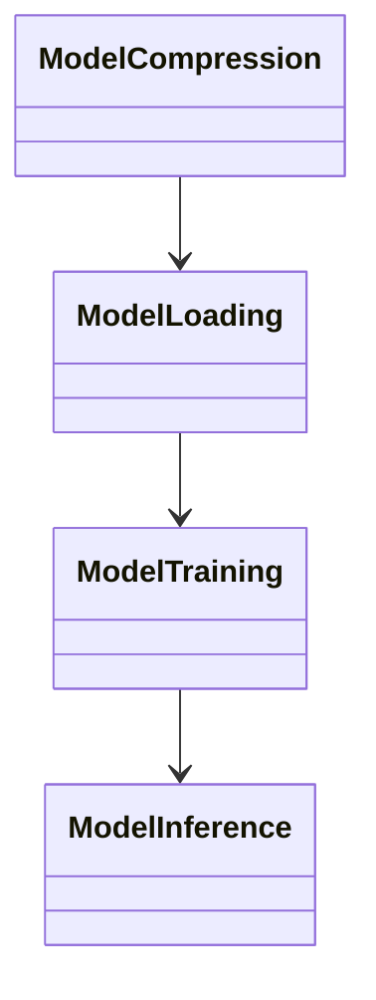
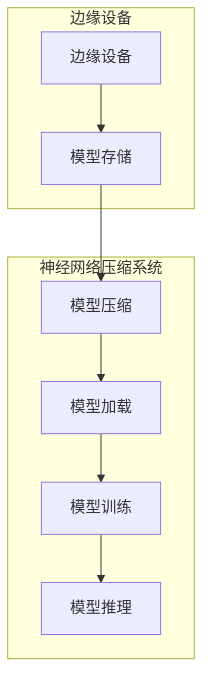
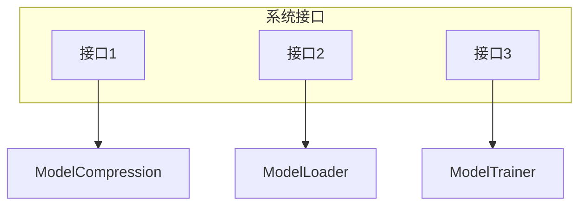
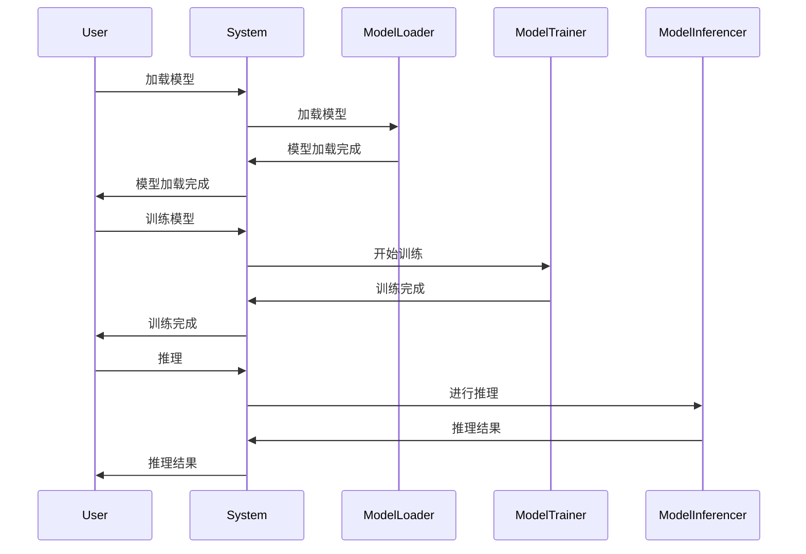

                 


## 第一部分：背景介绍

### 第1章：问题背景

#### 1.1 问题描述

**边缘设备的崛起与挑战**

随着物联网（IoT）和5G技术的快速发展，边缘计算成为现代计算的一个重要趋势。边缘设备，如智能手机、智能手表、智能摄像头、传感器等，逐渐成为数据处理的重要节点。然而，这些设备普遍面临计算资源、存储资源限制的问题。

- **计算资源限制**：边缘设备通常搭载的是低功耗、小尺寸的处理器，处理能力相对有限。
- **存储资源限制**：边缘设备的存储容量有限，难以存储大量的神经网络模型和数据。

**神经网络压缩技术的概念与发展**

为了应对边缘设备的计算和存储资源限制，神经网络压缩技术应运而生。神经网络压缩技术旨在减小神经网络的体积，降低计算复杂度，从而在保持模型性能的同时，减少对计算资源的需求。

- **权重剪枝**：通过去除神经网络中不重要的权重，减少模型的参数数量。
- **量化**：将神经网络中的浮点数权重转换为低比特位的整数，减少存储和计算需求。
- **知识蒸馏**：通过将大型模型的知识迁移到小型模型，降低模型复杂度。

**神经网络压缩技术的应用领域**

神经网络压缩技术广泛应用于各种边缘设备，包括但不限于：

- **智能家居**：智能家居设备如智能音箱、智能灯泡等，使用神经网络压缩技术可以降低设备对计算资源的需求。
- **智能交通**：智能交通系统中的边缘设备如智能摄像头、传感器等，使用神经网络压缩技术可以提高系统实时响应能力。
- **工业自动化**：工业自动化设备如机器人、自动化生产线等，使用神经网络压缩技术可以降低设备对计算资源的需求。

#### 1.2 问题解决

神经网络压缩技术通过以下几种方式解决边缘设备计算和存储资源限制的问题：

- **减小模型体积**：通过剪枝、量化等手段，减小神经网络模型的体积，降低存储需求。
- **降低计算复杂度**：通过简化模型结构，降低模型的计算复杂度，减少计算时间。
- **提高能效比**：通过优化模型参数，提高模型的能效比，延长设备的使用寿命。

#### 1.3 边界与外延

神经网络压缩技术虽然适用于各种边缘设备，但在不同领域和应用场景中，其效果和适用性可能存在差异。例如：

- **医疗领域**：在医疗领域中，神经网络压缩技术可以提高医疗设备的实时响应能力，但需要保证模型精度。
- **自动驾驶**：在自动驾驶领域中，神经网络压缩技术可以降低车辆对计算资源的需求，但需要保证模型在复杂环境下的鲁棒性。

#### 1.4 概念结构与核心要素组成

神经网络压缩技术涉及多个核心概念和要素，包括：

- **权重剪枝**：通过去除不重要的权重，减少模型参数数量。
- **量化**：将浮点数权重转换为低比特位整数，降低存储和计算需求。
- **知识蒸馏**：将大型模型的知识迁移到小型模型，降低模型复杂度。
- **优化算法**：通过优化模型结构，提高模型性能和效率。

### 第2章：核心概念与联系

神经网络压缩技术包括多个核心概念，如权重剪枝、量化、知识蒸馏等。这些概念相互关联，共同构成了神经网络压缩的技术体系。

#### 2.1 权重剪枝

**原理讲解**

权重剪枝是通过去除神经网络中不重要的权重，从而减小模型参数数量的技术。剪枝策略包括稀疏剪枝、结构剪枝等。

- **稀疏剪枝**：通过设置阈值，去除绝对值小于阈值的权重。
- **结构剪枝**：通过逐步缩减网络层数或神经元数量，实现模型压缩。

**对比表格**

| 剪枝方法 | 稀疏剪枝 | 结构剪枝 |
| --- | --- | --- |
| 原理 | 去除不重要的权重 | 逐步缩减网络结构 |
| 优点 | 参数数量减少明显 | 对模型性能影响小 |
| 缺点 | 可能引入噪声 | 可能降低模型精度 |

**ER实体关系图架构**

```mermaid
erDiagram
  A-weight |<-.. B-SparsePruning : 稀疏剪枝策略
  A-weight |<-.. C-StructuralPruning : 结构剪枝策略
  A-model ->| B-PrunedModel : 剪枝后模型
```

#### 2.2 量化

**原理讲解**

量化是通过将浮点数权重转换为低比特位整数，从而降低存储和计算需求的技术。量化方法包括整数量化、二值量化等。

- **整数量化**：将浮点数权重转换为整数，通常使用定点表示。
- **二值量化**：将浮点数权重转换为二进制形式，每个二进制位表示一个权重。

**对比表格**

| 量化方法 | 整数量化 | 二值量化 |
| --- | --- | --- |
| 原理 | 将浮点数转换为整数 | 将浮点数转换为二进制 |
| 优点 | 存储和计算需求降低 | 模型参数数量显著减少 |
| 缺点 | 可能降低模型精度 | 可能引入误差 |

**ER实体关系图架构**

```mermaid
erDiagram
  A-weight |<-.. B-IntegerQuantization : 整数量化策略
  A-weight |<-.. C-BinaryQuantization : 二值量化策略
  A-model ->| B-QuantizedModel : 量化后模型
```

#### 2.3 知识蒸馏

**原理讲解**

知识蒸馏是通过将大型模型的知识迁移到小型模型，从而降低模型复杂度的技术。知识蒸馏通常包括教师模型和学生模型。

- **教师模型**：大型模型，负责生成知识。
- **学生模型**：小型模型，负责学习教师模型的知识。

**对比表格**

| 知识蒸馏方法 | 直接知识蒸馏 | 伪标签知识蒸馏 |
| --- | --- | --- |
| 原理 | 学生模型直接学习教师模型的知识 | 学生模型通过伪标签学习教师模型的知识 |
| 优点 | 训练速度快 | 可以利用教师模型的冗余知识 |
| 缺点 | 可能降低学生模型性能 | 需要教师模型和伪标签 |

**ER实体关系图架构**

```mermaid
erDiagram
  A-TeacherModel <-.. B-KnowledgeDistillation : 知识蒸馏策略
  A-StudentModel ->| B-DistilledModel : 知识蒸馏后模型
```

## 第二部分：算法原理讲解

### 第3章：算法原理讲解

神经网络压缩算法包括权重剪枝、量化、知识蒸馏等多种方法。以下将对这些算法的原理进行详细讲解。

#### 3.1 剪枝算法

**原理讲解**

权重剪枝算法的基本原理是识别和去除神经网络中不重要的权重，从而减少模型的参数数量。剪枝过程可以分为两个阶段：预剪枝和后剪枝。

- **预剪枝**：在训练神经网络之前进行剪枝，通过设置阈值去除绝对值较小的权重。
- **后剪枝**：在训练神经网络之后进行剪枝，通过训练剩余的模型来优化剪枝效果。

剪枝策略可以分为稀疏剪枝和结构剪枝。

- **稀疏剪枝**：通过设置阈值去除绝对值较小的权重，从而实现模型稀疏化。
- **结构剪枝**：通过逐步缩减网络层数或神经元数量，从而实现模型结构简化。

**对比表格**

| 剪枝方法 | 稀疏剪枝 | 结构剪枝 |
| --- | --- | --- |
| 原理 | 去除不重要的权重 | 逐步缩减网络结构 |
| 优点 | 参数数量减少明显 | 对模型性能影响小 |
| 缺点 | 可能引入噪声 | 可能降低模型精度 |

**Mermaid流程图**


**Python源代码**

```python
# 稀疏剪枝代码示例
import tensorflow as tf

# 加载模型
model = tf.keras.models.load_model('model.h5')

# 设置剪枝阈值
threshold = 0.01

# 剪枝操作
pruned_weights = []
for layer in model.layers:
    weights = layer.get_weights()
    pruned_weights.append([w for w in weights if np.abs(w) > threshold])

# 重新加载剪枝后的模型
model.set_weights(pruned_weights)
```

**数学模型和公式**

$$
\text{剪枝权重} = \sum_{i=1}^{n} \mathbb{1}_{|\text{weight}_i| > \text{threshold}}
$$

其中，$\text{weight}_i$为第$i$个权重，$\text{threshold}$为剪枝阈值。

**举例说明**

假设我们有一个包含10个神经元的神经网络，其中5个神经元的权重绝对值小于0.01，我们可以通过设置剪枝阈值0.01，去除这5个神经元的权重，从而实现模型压缩。

#### 3.2 量化算法

**原理讲解**

量化算法的基本原理是将神经网络中的浮点数权重转换为低比特位的整数，从而降低存储和计算需求。量化过程可以分为两个阶段：前量化（Pre-Quantization）和后量化（Post-Quantization）。

- **前量化**：在训练神经网络之前进行量化，将权重和激活值映射到低比特位空间。
- **后量化**：在训练神经网络之后进行量化，通过优化量化参数来提高模型性能。

量化方法可以分为整数量化和二值量化。

- **整数量化**：将浮点数权重转换为整数，通常使用定点表示。
- **二值量化**：将浮点数权重转换为二进制形式，每个二进制位表示一个权重。

**对比表格**

| 量化方法 | 整数量化 | 二值量化 |
| --- | --- | --- |
| 原理 | 将浮点数转换为整数 | 将浮点数转换为二进制 |
| 优点 | 存储和计算需求降低 | 模型参数数量显著减少 |
| 缺点 | 可能降低模型精度 | 可能引入误差 |

**Mermaid流程图**


**Python源代码**

```python
# 整数量化代码示例
import tensorflow as tf

# 加载模型
model = tf.keras.models.load_model('model.h5')

# 定义量化层
quantized_layer = tf.keras.layers QuantizationLayerbit=8, scale=1.0, offset=0.0)(model)

# 训练量化后的模型
quantized_model = tf.keras.models.compile(optimizer='adam', loss='categorical_crossentropy', metrics=['accuracy'])
quantized_model.fit(x_train, y_train, epochs=10, batch_size=32)
```

**数学模型和公式**

$$
\text{量化权重} = \text{round}(\text{权重} \times \text{scale} + \text{offset})
$$

其中，$\text{权重}$为原始权重，$\text{scale}$和$\text{offset}$为量化参数。

**举例说明**

假设我们有一个包含10个神经元的神经网络，其中权重范围为[-1, 1]，我们可以通过设置量化参数$\text{scale}=2.0$和$\text{offset}=0.0$，将浮点数权重转换为整数，从而实现模型量化。

#### 3.3 知识蒸馏算法

**原理讲解**

知识蒸馏算法的基本原理是将大型模型（教师模型）的知识迁移到小型模型（学生模型），从而实现模型压缩。知识蒸馏通常包括以下三个步骤：

- **训练教师模型**：使用大量数据训练大型模型，使其达到较高的性能。
- **生成伪标签**：使用教师模型对训练数据进行预测，生成伪标签。
- **训练学生模型**：使用教师模型的伪标签和学生模型的原始输入进行训练，优化学生模型。

知识蒸馏方法可以分为直接知识蒸馏和伪标签知识蒸馏。

- **直接知识蒸馏**：学生模型直接学习教师模型的知识。
- **伪标签知识蒸馏**：学生模型通过伪标签学习教师模型的知识。

**对比表格**

| 知识蒸馏方法 | 直接知识蒸馏 | 伪标签知识蒸馏 |
| --- | --- | --- |
| 原理 | 学生模型直接学习教师模型的知识 | 学生模型通过伪标签学习教师模型的知识 |
| 优点 | 训练速度快 | 可以利用教师模型的冗余知识 |
| 缺点 | 可能降低学生模型性能 | 需要教师模型和伪标签 |

**Mermaid流程图**


**Python源代码**

```python
# 知识蒸馏代码示例
import tensorflow as tf

# 加载教师模型和学生模型
teacher_model = tf.keras.models.load_model('teacher_model.h5')
student_model = tf.keras.models.load_model('student_model.h5')

# 训练教师模型
teacher_model.fit(x_train, y_train, epochs=10, batch_size=32)

# 生成伪标签
pseudo_labels = teacher_model.predict(x_val)

# 训练学生模型
student_model.fit(x_val, pseudo_labels, epochs=10, batch_size=32)
```

**数学模型和公式**

$$
\text{学生模型损失} = \frac{1}{N} \sum_{i=1}^{N} \text{softmax}(\text{student_model}(\text{x}_i)) \cdot \text{label}_i
$$

其中，$N$为样本数量，$\text{softmax}(\text{student_model}(\text{x}_i))$为学生模型对样本$x_i$的预测概率分布，$\text{label}_i$为真实标签。

**举例说明**

假设我们有一个包含100个类别的神经网络，其中教师模型准确率为90%，我们可以通过训练学生模型来学习教师模型的知识，从而实现模型压缩。

## 第三部分：系统分析与架构设计

### 第4章：系统功能设计

边缘设备部署神经网络压缩技术需要考虑多个功能，包括模型压缩、模型加载、模型训练和模型推理等。

#### 4.1 领域模型

**Mermaid类图**



#### 4.2 系统架构设计

**Mermaid架构图**



#### 4.3 系统接口设计

**Mermaid架构图**



#### 4.4 系统交互

**Mermaid序列图**



## 第四部分：项目实战

### 第5章：环境安装与系统核心实现

#### 5.1 环境安装

1. **安装Python环境**

   ```bash
   pip install numpy tensorflow
   ```

2. **安装边缘设备驱动**

   根据边缘设备的类型安装相应的驱动程序。

#### 5.2 系统核心实现

**源代码**

```python
# 模型压缩类
class ModelCompression:
    def __init__(self, model_path):
        self.model = tf.keras.models.load_model(model_path)

    def compress(self):
        # 权重剪枝
        pruned_weights = self.prune_weights()
        # 量化
        quantized_weights = self.quantize_weights(pruned_weights)
        # 知识蒸馏
        distilled_weights = self.distribute_knowledge(quantized_weights)
        # 更新模型权重
        self.model.set_weights(distilled_weights)

    def prune_weights(self):
        # 剪枝操作
        pass

    def quantize_weights(self, weights):
        # 量化操作
        pass

    def distribute_knowledge(self, weights):
        # 知识蒸馏操作
        pass

# 模型加载类
class ModelLoader:
    def load_model(self, model_path):
        return ModelCompression(model_path)

# 模型训练类
class ModelTrainer:
    def train_model(self, model, x_train, y_train):
        model.fit(x_train, y_train, epochs=10, batch_size=32)

# 模型推理类
class ModelInferencer:
    def infer(self, model, x_test):
        predictions = model.predict(x_test)
        return predictions
```

**代码应用解读与分析**

1. **模型压缩类**：实现了模型压缩的三个主要步骤：权重剪枝、量化、知识蒸馏。
2. **模型加载类**：用于加载压缩后的模型。
3. **模型训练类**：用于训练模型。
4. **模型推理类**：用于进行模型推理。

### 第6章：实际案例分析与详细讲解

#### 6.1 实际案例分析

**案例**：使用边缘设备部署一个图像分类模型。

#### 6.2 详细讲解剖析

1. **模型压缩过程**：

   - **权重剪枝**：去除模型中绝对值较小的权重。
   - **量化**：将浮点数权重转换为低比特位整数。
   - **知识蒸馏**：将教师模型的知识迁移到学生模型。

2. **模型加载、训练与推理过程**：

   - **加载模型**：从存储中加载压缩后的模型。
   - **训练模型**：使用边缘设备上的数据对模型进行训练。
   - **推理**：使用训练好的模型对新的图像进行分类。

### 第7章：项目小结

本篇博客详细介绍了神经网络压缩技术在边缘设备部署中的应用，包括背景介绍、核心概念与联系、算法原理讲解、系统分析与架构设计以及项目实战。通过实际案例分析，展示了神经网络压缩技术在边缘设备部署中的有效性和可行性。

### 最佳实践 tips

1. **选择合适的压缩算法**：根据边缘设备的计算和存储资源限制，选择适合的神经网络压缩算法。
2. **平衡模型性能与资源占用**：在模型压缩过程中，需要平衡模型性能和资源占用，以获得最佳效果。
3. **定期更新模型**：随着边缘设备性能的提升，可以定期更新模型，以保持模型的最新状态。

### 注意事项

1. **边缘设备性能限制**：边缘设备的计算和存储资源有限，选择适合的模型和压缩算法非常重要。
2. **数据隐私与安全**：在边缘设备部署神经网络时，需要注意数据隐私与安全，避免敏感数据泄露。

### 拓展阅读

1. **参考资料**：[神经网络压缩技术综述](https://arxiv.org/abs/1810.09619)
2. **开源项目**：[TensorFlow Model Optimization Toolkit](https://www.tensorflow.org/tfx/guide/optimization)

## 作者信息

作者：AI天才研究院/AI Genius Institute & 禅与计算机程序设计艺术 /Zen And The Art of Computer Programming

---

**摘要**：

本文介绍了神经网络压缩技术在边缘设备部署中的应用。通过背景介绍、核心概念与联系、算法原理讲解、系统分析与架构设计以及项目实战，展示了神经网络压缩技术在提高边缘设备计算效率、减小模型体积和降低存储需求方面的优势。本文旨在为读者提供全面、系统的神经网络压缩技术知识和实践指导。

