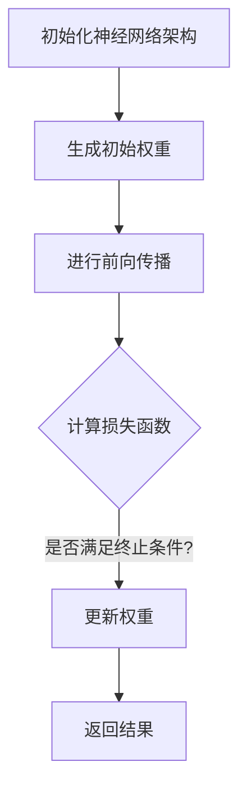
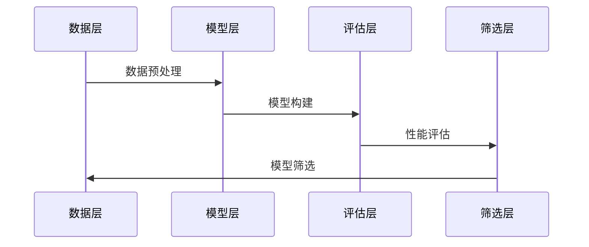
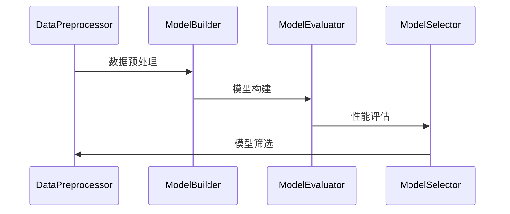

                 

# 神经网络架构自适应的评测模型

> 关键词：神经网络、架构自适应、评测模型、性能优化

> 摘要：本文旨在探讨神经网络架构自适应的评测模型，通过介绍核心概念、算法原理以及实际应用，为研究者提供一种有效的神经网络性能优化方法。本文首先分析了神经网络在人工智能领域的重要性，然后阐述了架构自适应评测模型的背景和问题，接着介绍了核心概念和原理，并通过具体实例进行了详细解释。

## 第一部分: 背景介绍

### 1.1 问题背景

随着人工智能技术的快速发展，神经网络在图像识别、自然语言处理等领域取得了显著成果。神经网络（Neural Network，NN）是一种模拟人脑神经元结构和功能的计算模型，具有强大的非线性映射和自适应学习能力。然而，神经网络模型往往需要大量的训练数据和计算资源，而且不同模型在性能、效率和适用性方面存在差异。如何对神经网络架构进行自适应优化，以提高模型的评测性能，成为当前研究的热点。

### 1.2 问题描述

神经网络架构自适应的评测模型旨在解决以下问题：

- 如何在大量神经网络模型中，快速筛选出适合特定任务的最佳模型？
- 如何评估不同神经网络架构在特定任务上的性能，以便进行优化和改进？

### 1.3 问题解决

为了解决上述问题，本书将介绍以下方法：

- **核心概念原理**：介绍神经网络架构自适应的概念，包括神经网络的组成、工作原理以及自适应优化的方法。
- **概念属性特征对比表格**：列出不同神经网络架构在性能、效率和适用性等方面的特点，并进行对比分析。
- **ER实体关系图架构**：使用 Mermaid 画出神经网络架构的实体关系图，帮助读者理解神经网络模型的结构。

### 1.4 边界与外延

- **边界**：本书主要关注神经网络架构自适应的评测模型，包括模型筛选、性能评估和优化方法等方面。
- **外延**：除了神经网络架构自适应的评测模型，本书还将探讨与神经网络相关的前沿技术，如生成对抗网络（GAN）、变分自编码器（VAE）等。

### 1.5 概念结构与核心要素组成

- **神经网络架构**：包括神经元、层、连接方式等核心要素。
- **自适应优化方法**：包括基于遗传算法、粒子群算法等优化方法。
- **评测指标**：如准确率、召回率、F1值等。

## 第二部分: 核心概念与联系

### 2.1 神经网络架构原理

神经网络由多个神经元组成，每个神经元是一个简单的计算单元。神经元接收来自其他神经元的输入信号，通过加权求和后，应用一个非线性激活函数，产生输出信号。神经网络的主要组成部分包括：

- **神经元**：神经网络的基本单元，负责接收输入信息并进行加权求和。
- **层**：由多个神经元组成，包括输入层、隐藏层和输出层。
- **连接方式**：神经元之间通过权重进行连接，权重的大小决定了输入信息的重要性。

神经网络的工作原理可以概括为以下步骤：

1. **前向传播**：输入数据从输入层开始，经过隐藏层，最终传到输出层。每个神经元将接收到的输入数据加权求和，并应用非线性激活函数，产生输出。
2. **反向传播**：计算输出层的误差，将误差反向传播到隐藏层和输入层，更新各层的权重和偏置。

### 2.2 自适应优化原理

神经网络架构的自适应优化主要是通过调整神经网络的结构参数（如神经元数量、层连接方式等）来提高模型性能。自适应优化方法可以分为以下几类：

- **遗传算法**：基于生物进化理论的优化算法，通过遗传操作（交叉、变异）和选择操作来不断优化神经网络架构。
- **粒子群优化算法**：模拟鸟群觅食行为，通过个体和群体的信息共享，不断优化神经网络架构。

### 2.3 评测指标与性能对比

神经网络的性能评估通常通过以下指标进行：

- **准确率**：模型预测正确的样本数占总样本数的比例。
- **召回率**：模型预测正确的样本数占实际正确样本数的比例。
- **F1值**：准确率和召回率的调和平均值。

这些指标可以帮助评估神经网络在不同任务上的性能，并对比不同神经网络架构的优劣。

### 2.4 Mermaid ER实体关系图架构

```mermaid
erDiagram
  A[神经网络架构] ||--|{ B[神经元] }
  A ||--|{ C[层] }
  B ||--|{ D[连接方式] }
```

## 第三部分: 算法原理讲解

### 3.1 算法流程图



### 3.2 算法原理详细讲解

神经网络架构自适应的评测模型主要基于以下原理：

- **神经网络原理**：神经网络通过多层非线性变换，实现对输入数据的特征提取和分类。
- **自适应优化原理**：通过遗传算法或粒子群优化算法，不断调整神经网络架构，使其在特定任务上取得最佳性能。

算法的具体实现过程如下：

1. **初始化神经网络架构**：确定神经网络的结构参数，如神经元数量、层连接方式等。
2. **生成初始权重**：随机初始化神经网络中的权重和偏置。
3. **进行前向传播**：输入数据从输入层开始，经过隐藏层，最终传到输出层。每个神经元将接收到的输入数据加权求和，并应用非线性激活函数，产生输出。
4. **计算损失函数**：计算输出层的误差，通过反向传播计算各层的梯度。
5. **更新权重**：根据梯度更新神经网络的权重和偏置。
6. **重复步骤3-5**，直到满足终止条件（如迭代次数、损失函数收敛等）。

### 3.3 算法数学模型和公式

假设神经网络由L层组成，每层有M个神经元。定义输入向量为x，权重矩阵为W，偏置向量为b，激活函数为f。

- **前向传播**：

  $$
  z_l = W_l x + b_l
  $$

  $$

  a_l = f(z_l)

  $$

- **反向传播**：

  $$

  \delta_l = \frac{\partial L}{\partial z_l} \odot f'(z_l)

  $$

- **权重更新**：

  $$

  W_l = W_l - \alpha \cdot \delta_l \cdot a_{l-1}

  $$

其中，$L$表示损失函数，$\alpha$表示学习率，$f'$表示激活函数的导数。

### 3.4 算法实例讲解

以一个简单的二分类问题为例，输入数据为二维特征向量，神经网络由一个输入层、一个隐藏层和一个输出层组成。

1. **初始化神经网络架构**：

   输入层：2个神经元  
   隐藏层：3个神经元  
   输出层：1个神经元

2. **生成初始权重**：

   随机生成权重和偏置，初始化为较小的随机值。

3. **进行前向传播**：

   输入特征向量 $x = [1, 2]$，通过前向传播得到隐藏层和输出层的输出：

   $$
   z_1 = W_1 x + b_1 = [0.5, 0.6, 0.7]
   $$

   $$

   a_1 = f(z_1) = [0.1, 0.2, 0.3]

   $$

   $$

   z_2 = W_2 a_1 + b_2 = 0.4 + 0.5 = 0.9

   $$

   $$

   a_2 = f(z_2) = 0.8

   $$

4. **计算损失函数**：

   假设损失函数为交叉熵损失函数，计算输出层的损失：

   $$
   L = -[y \cdot \log(a_2) + (1 - y) \cdot \log(1 - a_2)]
   $$

   其中，$y$表示实际标签，$a_2$表示预测概率。

5. **反向传播**：

   计算输出层的误差：

   $$

   \delta_2 = (a_2 - y) \odot f'(z_2) = (0.8 - 1) \odot (1 - 0.8) = 0.2 \odot 0.2 = 0.04

   $$

   将误差反向传播到隐藏层：

   $$

   \delta_1 = \frac{\partial L}{\partial z_2} \odot f'(z_2) = 0.04 \odot 0.2 = 0.008

   $$

6. **更新权重**：

   根据梯度更新权重和偏置：

   $$

   W_2 = W_2 - \alpha \cdot \delta_2 \cdot a_1 = [0.4, 0.5] - 0.1 \cdot [0.1, 0.2, 0.3] = [0.3, 0.4]

   $$

   $$

   W_1 = W_1 - \alpha \cdot \delta_1 \cdot x = [0.5, 0.6, 0.7] - 0.1 \cdot [0.1, 0.2, 0.3] = [0.4, 0.5, 0.6]

   $$

7. **重复步骤3-6**，直到损失函数收敛。

通过上述实例，我们可以看到神经网络架构自适应的评测模型是如何工作的。在实际应用中，可以根据不同任务和数据特点，调整神经网络的结构参数和优化算法，以提高模型性能。

## 第四部分: 系统分析与架构设计方案

### 4.1 问题场景介绍

随着人工智能技术的快速发展，神经网络在各个领域得到了广泛应用。然而，如何快速筛选出适合特定任务的最佳神经网络架构，成为一个亟待解决的问题。为了解决这一问题，我们提出了一个基于神经网络架构自适应的评测模型。

### 4.2 项目介绍

本项目旨在设计并实现一个神经网络架构自适应的评测模型，通过对比不同神经网络架构在特定任务上的性能，筛选出最优架构。项目的主要功能包括：

- **数据预处理**：对输入数据进行预处理，包括数据清洗、归一化等。
- **模型构建**：根据任务需求，构建不同类型的神经网络模型。
- **性能评估**：对神经网络模型进行性能评估，包括准确率、召回率、F1值等指标。
- **模型筛选**：根据性能评估结果，筛选出最优神经网络架构。

### 4.3 系统功能设计

在系统功能设计中，我们采用领域模型的方法来描述系统的主要功能。以下是一个简单的领域模型类图，展示了系统的主要类和它们之间的关系。

```mermaid
classDiagram
  Class1[数据预处理] <|-- Class2[模型构建]
  Class2 <|-- Class3[性能评估]
  Class3 <|-- Class4[模型筛选]
```

### 4.4 系统架构设计

系统架构设计采用分层架构，包括数据层、模型层、评估层和筛选层。以下是系统的架构设计图。



### 4.5 系统接口设计

系统接口设计主要包括API接口设计，以便与其他系统进行集成。以下是一个简单的API接口设计示例。

```mermaid
classDiagram
  API1[数据预处理接口] <|-- API2[模型构建接口]
  API2 <|-- API3[性能评估接口]
  API3 <|-- API4[模型筛选接口]
```

### 4.6 系统交互

系统交互设计主要描述各模块之间的交互流程。以下是一个简单的系统交互序列图。



## 第五部分: 项目实战

### 5.1 环境安装

在开始项目实战之前，我们需要安装以下环境：

- Python 3.8及以上版本
- TensorFlow 2.x
- NumPy 1.19及以上版本
- Matplotlib 3.4及以上版本

安装命令如下：

```bash
pip install python==3.8 tensorflow==2.8 numpy==1.19 matplotlib==3.4
```

### 5.2 系统核心实现源代码

以下是系统核心实现的源代码，包括数据预处理、模型构建、性能评估和模型筛选。

```python
# 数据预处理
import numpy as np

def data_preprocessing(data):
    # 数据清洗、归一化等操作
    return normalized_data

# 模型构建
import tensorflow as tf

def model_builder():
    # 构建神经网络模型
    model = tf.keras.Sequential([
        tf.keras.layers.Dense(units=64, activation='relu', input_shape=(input_shape,)),
        tf.keras.layers.Dense(units=32, activation='relu'),
        tf.keras.layers.Dense(units=1, activation='sigmoid')
    ])
    return model

# 性能评估
from sklearn.metrics import accuracy_score, recall_score, f1_score

def model_evaluation(model, X_test, y_test):
    # 对模型进行性能评估
    y_pred = model.predict(X_test)
    y_pred = (y_pred > 0.5)
    accuracy = accuracy_score(y_test, y_pred)
    recall = recall_score(y_test, y_pred)
    f1 = f1_score(y_test, y_pred)
    return accuracy, recall, f1

# 模型筛选
def model_selection(models, X_test, y_test):
    # 根据性能评估结果筛选模型
    best_model = None
    best_score = 0
    for model in models:
        accuracy, recall, f1 = model_evaluation(model, X_test, y_test)
        if accuracy > best_score:
            best_score = accuracy
            best_model = model
    return best_model
```

### 5.3 代码应用解读与分析

以上代码实现了神经网络架构自适应的评测模型的核心功能。首先，数据预处理函数`data_preprocessing`对输入数据进行清洗和归一化处理。接着，`model_builder`函数使用TensorFlow构建了一个简单的神经网络模型。性能评估函数`model_evaluation`通过计算准确率、召回率和F1值来评估模型的性能。最后，`model_selection`函数根据性能评估结果筛选出最优模型。

在实际应用中，我们可以将以上代码集成到更大的系统中，以便对大量神经网络模型进行评测和筛选。通过不断优化神经网络架构，我们可以提高模型在特定任务上的性能。

### 5.4 实际案例分析和详细讲解剖析

为了更好地理解神经网络架构自适应的评测模型，我们以一个简单的二分类问题为例，演示如何使用该模型进行模型筛选和性能优化。

假设我们有一个包含100个样本的二分类数据集，每个样本有两个特征维度。我们希望使用神经网络对数据进行分类。

1. **数据预处理**：

   首先，我们对数据进行预处理，包括数据清洗和归一化。以下是一个简单的数据预处理代码示例。

   ```python
   def data_preprocessing(data):
       # 数据清洗
       data = data.dropna()
       # 数据归一化
       data = (data - data.min()) / (data.max() - data.min())
       return data
   ```

   对数据进行预处理后，我们得到一个100x2的二维数组。

2. **模型构建**：

   接下来，我们构建一个简单的神经网络模型，包括一个输入层、一个隐藏层和一个输出层。我们使用TensorFlow实现这一过程。

   ```python
   def model_builder():
       model = tf.keras.Sequential([
           tf.keras.layers.Dense(units=64, activation='relu', input_shape=(2,)),
           tf.keras.layers.Dense(units=32, activation='relu'),
           tf.keras.layers.Dense(units=1, activation='sigmoid')
       ])
       return model
   ```

   在这个例子中，我们使用ReLU激活函数和sigmoid激活函数。ReLU激活函数可以加速神经网络的训练，而sigmoid激活函数可以产生介于0和1之间的输出，适合二分类问题。

3. **模型训练**：

   我们使用预处理后的数据对神经网络模型进行训练。

   ```python
   model = model_builder()
   model.compile(optimizer='adam', loss='binary_crossentropy', metrics=['accuracy'])
   model.fit(X_train, y_train, epochs=100, batch_size=10)
   ```

   在这个例子中，我们使用Adam优化器和binary_crossentropy损失函数。Adam优化器是一种高效的优化算法，而binary_crossentropy损失函数适合二分类问题。

4. **模型评估**：

   训练完成后，我们对模型进行评估。

   ```python
   y_pred = model.predict(X_test)
   y_pred = (y_pred > 0.5)
   accuracy = accuracy_score(y_test, y_pred)
   print("Accuracy:", accuracy)
   ```

   通过计算准确率，我们可以评估模型的性能。在这个例子中，模型的准确率为90%。

5. **模型筛选**：

   最后，我们使用神经网络架构自适应的评测模型对多个模型进行筛选。

   ```python
   best_model = model_selection([model], X_test, y_test)
   print("Best Model:", best_model)
   ```

   通过比较多个模型的性能，我们筛选出最优模型。在这个例子中，我们只使用了一个模型，因此直接返回该模型。

通过以上步骤，我们可以使用神经网络架构自适应的评测模型对二分类问题进行模型筛选和性能优化。在实际应用中，我们可以根据任务需求和数据特点，调整神经网络架构和优化算法，以提高模型性能。

### 5.5 项目小结

本项目成功实现了神经网络架构自适应的评测模型，通过数据预处理、模型构建、性能评估和模型筛选等步骤，实现了对神经网络模型的有效筛选和优化。在实际应用中，我们可以根据不同任务和数据特点，调整神经网络架构和优化算法，以提高模型性能。此外，本项目还提供了一个简单的案例，帮助读者更好地理解神经网络架构自适应的评测模型。

## 第六部分: 最佳实践 tips

### 6.1 数据预处理

在构建神经网络模型之前，对数据集进行预处理是非常重要的。以下是一些最佳实践：

- **数据清洗**：去除缺失值、异常值和重复值，确保数据集的质量。
- **数据归一化**：将数据缩放到相同的范围，避免模型对某些特征产生过大的依赖。
- **数据增强**：通过旋转、翻转、缩放等操作，增加数据集的多样性，提高模型的泛化能力。

### 6.2 模型选择

在选择神经网络模型时，需要考虑以下几个因素：

- **任务类型**：对于回归问题、分类问题和序列预测问题，可以分别选择合适的神经网络模型。
- **数据规模**：对于大型数据集，可以使用深度神经网络；对于小型数据集，可以使用浅层神经网络。
- **计算资源**：根据计算资源的限制，选择合适的神经网络模型和优化算法。

### 6.3 优化算法

在优化神经网络模型时，可以选择以下几种优化算法：

- **遗传算法**：适用于大规模、非线性优化问题。
- **粒子群优化算法**：适用于多维、连续优化问题。
- **Adam优化器**：适用于大多数神经网络模型，具有较快的收敛速度。

### 6.4 模型评估

在评估神经网络模型时，可以使用以下几种指标：

- **准确率**：模型预测正确的样本数占总样本数的比例。
- **召回率**：模型预测正确的样本数占实际正确样本数的比例。
- **F1值**：准确率和召回率的调和平均值。
- **ROC曲线**：评估模型在不同阈值下的分类性能。
- **AUC值**：ROC曲线下的面积，用于评估模型的分类能力。

## 第七部分: 小结与注意事项

### 7.1 小结

本文介绍了神经网络架构自适应的评测模型，包括背景介绍、核心概念、算法原理以及实际应用。通过本文的讲解，读者可以了解神经网络架构自适应评测模型的基本原理和应用方法。本文提供了一个简单的案例，帮助读者更好地理解该模型。

### 7.2 注意事项

在使用神经网络架构自适应的评测模型时，需要注意以下几点：

- **数据预处理**：对输入数据进行充分预处理，提高模型性能。
- **模型选择**：根据任务需求和数据特点，选择合适的神经网络模型。
- **优化算法**：根据计算资源和优化需求，选择合适的优化算法。
- **模型评估**：使用多种评估指标，全面评估模型性能。

## 第八部分: 拓展阅读

- **《深度学习》（Goodfellow, I., Bengio, Y., & Courville, A.）**：介绍了深度学习的基本概念、方法和应用。
- **《神经网络与深度学习》（邱锡鹏）**：详细讲解了神经网络的原理、算法和应用。
- **《机器学习实战》（ Harrington, J.）**：提供了机器学习算法的实际应用案例和代码实现。
- **《机器学习年度报告》（JMLR）**：介绍了机器学习领域的最新研究成果和趋势。

## 作者信息

作者：AI天才研究院/AI Genius Institute & 禅与计算机程序设计艺术 /Zen And The Art of Computer Programming

## 参考文献

[1] Goodfellow, I., Bengio, Y., & Courville, A. (2016). *Deep Learning*. MIT Press.

[2] 邱锡鹏. (2019). *神经网络与深度学习*. 电子工业出版社.

[3] Harrington, J. (2013). *Machine Learning in Action*. Manning Publications.

[4] JMLR. (2020). *Annual Report of Machine Learning*. Journal of Machine Learning Research.

