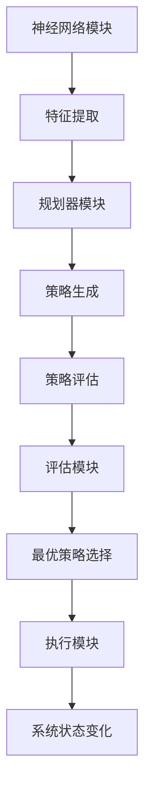
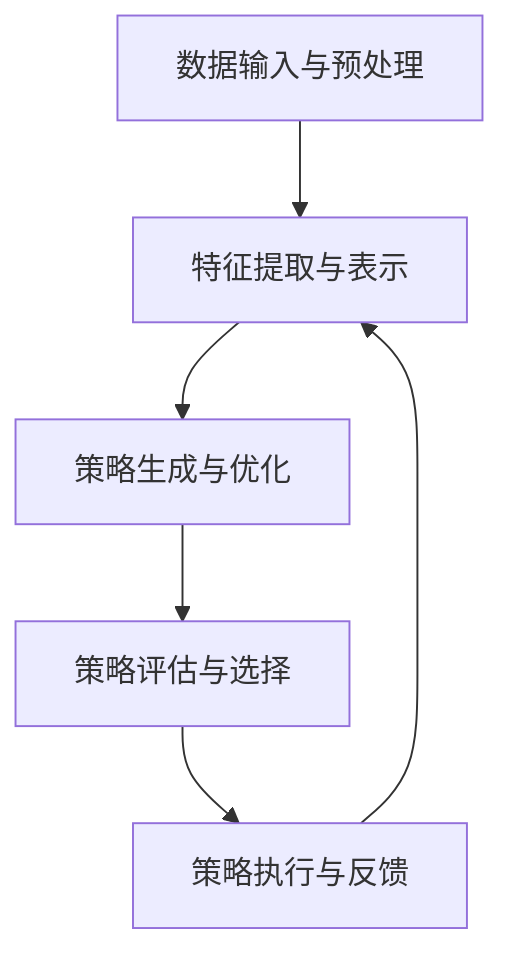
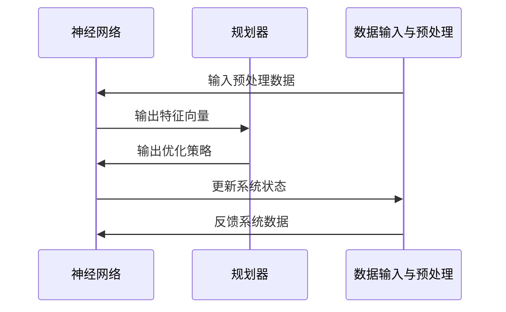
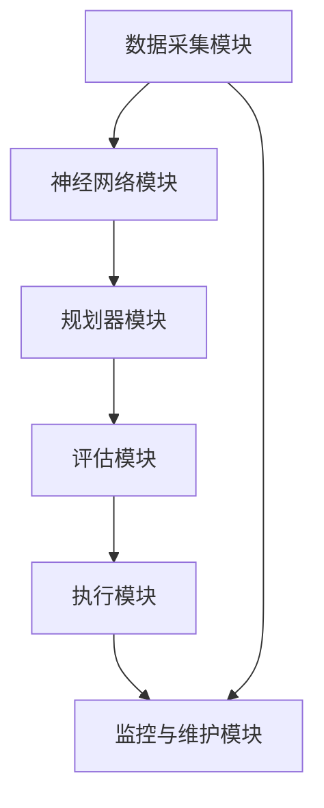
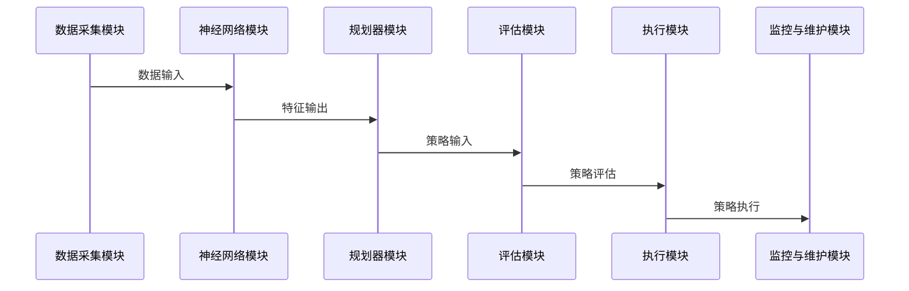
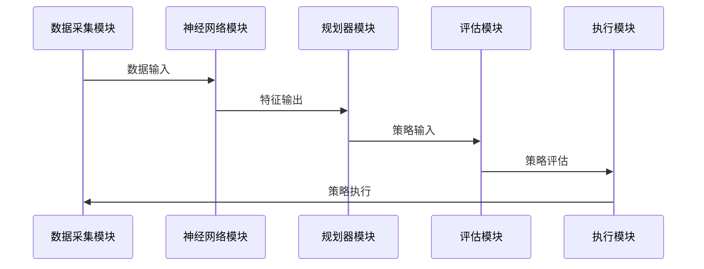

                 

### 第1章: 复杂工程系统推理背景

#### 1.1 问题背景

随着现代工程系统的日益复杂化，传统的推理方法在处理这些系统的过程中遇到了诸多挑战。复杂工程系统通常包含大量的相互关联的组件和模块，这些组件和模块之间通过复杂的网络进行交互。这使得传统的基于规则或基于模型的推理方法难以有效地处理系统中的大量数据，以及数据之间的复杂关系。

首先，传统的推理方法依赖于预定义的规则或模型。这些规则或模型往往需要大量的先验知识，并且难以适应系统的动态变化。其次，当系统规模增大时，推理时间急剧增加，导致系统响应速度变慢，无法满足实时性的要求。此外，对于复杂系统中的不确定性和模糊性，传统的推理方法也难以有效地处理。

因此，我们需要一种新的推理方法，能够更好地应对复杂工程系统中的各种挑战。神经规划器作为一种新兴的推理方法，因其强大的自适应能力和处理复杂关系的能力，逐渐受到广泛关注。

#### 1.2 问题描述

复杂工程系统的推理问题可以概括为以下三个方面：

1. **数据复杂性**：复杂工程系统通常包含海量的数据，这些数据之间存在复杂的关联关系。如何有效地处理和利用这些数据，是推理问题的关键。
2. **模型适应性**：复杂工程系统在不断变化，传统的模型难以适应这种动态变化。如何构建一个能够自我学习和适应的模型，是推理方法需要解决的问题。
3. **实时性要求**：许多复杂工程系统对响应时间有严格要求，如何在保证推理准确性的同时，提高系统的响应速度，是推理方法需要优化的方向。

这些问题共同构成了复杂工程系统推理的核心挑战。

#### 1.3 解决方法与挑战

为了解决复杂工程系统推理的问题，研究者们提出了多种方法。其中，神经规划器因其独特的优势，成为了一种备受关注的方法。以下是几种常见的解决方法及其挑战：

1. **基于规则的方法**：这种方法依赖于预定义的规则，通过这些规则来推理系统的行为。然而，这种方法在处理复杂性和动态性方面存在较大局限，难以应对大规模数据和高频度变化的系统。
   
2. **基于模型的方法**：这种方法通过建立系统的模型来预测系统的行为。然而，模型的建立通常需要大量的先验知识和时间，并且模型的适应性较差，难以适应系统的动态变化。

3. **神经规划器**：这种方法利用神经网络的自适应能力和处理复杂关系的能力，通过不断学习和优化来提高推理的准确性。然而，神经规划器的实现和优化面临着数据预处理、模型选择、训练效率和泛化能力等挑战。

#### 1.4 边界与外延

在复杂工程系统推理中，神经规划器的应用边界主要包括以下几个方面：

1. **系统规模**：神经规划器可以处理大规模的系统，但系统规模过大可能导致训练时间过长。
2. **数据类型**：神经规划器适用于处理结构化或半结构化的数据，对于非结构化数据，如文本、图像等，需要额外的处理。
3. **实时性要求**：神经规划器在处理实时性要求较高的系统时，可能需要优化算法和硬件支持。

神经规划器的外延则包括以下方面：

1. **跨领域应用**：神经规划器不仅适用于工程系统，还可以应用于其他领域，如金融、医疗、交通等。
2. **集成多种算法**：神经规划器可以与其他算法相结合，如遗传算法、强化学习等，以进一步提高推理效果。

#### 1.5 概念结构与核心要素组成

神经规划器的概念结构主要包括以下几个核心要素：

1. **神经网络**：作为基础组成部分，神经网络负责处理输入数据，并产生输出结果。
2. **规划器**：规划器负责根据系统目标，制定出一系列行动策略，以实现系统目标。
3. **学习机制**：通过学习机制，神经规划器可以从历史数据中学习到系统的行为模式，并不断优化自身的推理能力。

核心要素之间的联系可以概括为：

- **输入与输出**：神经网络通过输入层接收系统数据，通过输出层产生推理结果。
- **目标与策略**：规划器根据系统目标，制定出一系列策略，神经网络通过这些策略进行推理。
- **学习与优化**：通过学习机制，神经规划器不断优化自身，以提高推理的准确性和效率。

综上所述，神经规划器作为一种新兴的推理方法，在复杂工程系统推理中展现出巨大的潜力。然而，要充分发挥其优势，仍需在算法优化、数据预处理、模型选择等方面进行深入研究。接下来，我们将进一步探讨神经规划器的基本概念、原理和架构，以期为读者提供更深入的理解。

---

在接下来的章节中，我们将详细介绍神经规划器的基本概念、原理和架构，探讨其在复杂工程系统推理中的应用和优势。通过逐步的分析和推理，我们将帮助读者更好地理解神经规划器的工作机制，并探索其在实际项目中的应用。

---

## 第2章: 神经规划器的基本概念

神经规划器作为一种新兴的推理方法，其核心在于结合神经网络的强大数据处理能力和规划器的策略优化功能。在这一章中，我们将详细探讨神经规划器的基本概念，包括其定义、特点、与传统推理方法的比较，以及核心概念之间的联系。

### 2.1 神经规划器定义

神经规划器是一种结合了神经网络和规划器思想的推理方法。具体来说，它利用神经网络对系统数据进行处理，并通过规划器制定出最优的行动策略。这种方法的核心理念是，通过不断学习和优化，使系统能够在复杂环境中做出最优决策。

### 2.2 神经规划器特点

神经规划器具有以下几个显著特点：

1. **自适应性**：神经规划器能够根据系统环境的变化，自动调整自身的行为策略，以适应新的情况。
2. **并行处理**：神经网络的结构使得神经规划器能够高效地处理大规模数据，并快速生成推理结果。
3. **鲁棒性**：神经规划器在面对不确定性和模糊性时，能够保持较高的稳定性和准确性。
4. **灵活性**：神经规划器可以灵活地应用于不同领域和场景，适应多种系统需求。

### 2.3 神经规划器与传统推理方法比较

传统的推理方法主要包括基于规则的方法和基于模型的方法。与这些方法相比，神经规划器具有以下几个优势：

1. **数据适应性**：传统方法依赖于预定义的规则或模型，难以处理大规模和动态变化的系统。而神经规划器通过神经网络的自适应能力，可以更好地处理这些复杂情况。
2. **并行计算能力**：神经网络的并行结构使得神经规划器能够高效地处理大规模数据，相比传统方法，具有更高的计算效率。
3. **鲁棒性**：神经规划器在面对不确定性和模糊性时，能够通过自我调整策略，保持较高的推理准确性和稳定性。
4. **灵活性**：神经规划器可以根据不同场景和需求，灵活调整和优化推理策略，适应多种应用场景。

然而，传统方法也有其独特的优势，例如规则方法在处理明确且结构化的数据时，具有简洁和高效的特点。而基于模型的方法则通过精确的模型描述，能够提供更为精确的推理结果。因此，在实际应用中，通常会结合多种方法，以充分发挥各自的优点。

### 2.4 神经规划器的核心概念联系

神经规划器的核心概念包括神经网络、规划器和学习机制。这些概念之间的联系如下：

1. **神经网络与规划器的结合**：神经网络负责处理系统数据，生成特征表示，而规划器则根据这些特征表示，制定出最优的行动策略。
2. **学习机制的作用**：学习机制通过不断调整神经网络的参数，优化规划器的策略，从而提高推理的准确性和效率。
3. **数据驱动与目标导向**：神经网络通过数据驱动的方式，学习系统的行为模式，而规划器则通过目标导向的方式，制定出实现系统目标的策略。

这种结合使得神经规划器能够同时具备数据处理和决策优化的能力，从而在复杂工程系统推理中展现出独特的优势。

通过本章的讨论，我们详细介绍了神经规划器的基本概念、特点以及与传统推理方法的比较。在接下来的章节中，我们将进一步探讨神经规划器的原理与架构，帮助读者更深入地理解其工作机制和应用。

---

在了解了神经规划器的基本概念和特点之后，接下来我们将深入探讨神经规划器的工作原理和架构设计。通过分析其工作原理，我们可以更好地理解神经规划器在复杂工程系统推理中的强大能力。

### 3.1 神经规划器工作原理

神经规划器的工作原理可以概括为以下几个关键步骤：

1. **数据输入**：神经规划器首先接收来自复杂工程系统的输入数据。这些数据可能包括实时传感器的数据、历史记录数据、环境信息等。通过这些数据，神经网络能够对当前系统状态有一个全面的了解。

2. **特征提取**：神经网络通过多层结构的复杂运算，对输入数据进行特征提取。在这个过程中，神经网络学习到数据中的关键特征和模式，并将其转换为高维特征向量。这些特征向量不仅包含了数据的基本信息，还通过神经网络的非线性变换，提取出了更深层次的、具有代表性的特征。

3. **策略生成**：规划器根据提取出的特征向量，利用优化算法（如梯度下降、强化学习等）生成一系列的行动策略。这些策略旨在实现系统目标，如最大化系统效率、最小化资源消耗、确保系统稳定性等。

4. **策略评估**：生成的策略需要通过评估来确认其有效性。规划器会根据系统当前状态和目标，对每个策略的效果进行评估。通过这种评估，规划器能够筛选出最优的策略。

5. **策略执行**：最后，规划器选择最优策略并执行，通过改变系统的输入参数，使系统向目标状态迈进。

通过这样的工作流程，神经规划器能够动态地调整系统行为，以应对不断变化的环境和目标。

### 3.2 神经规划器架构设计

神经规划器的架构设计是其实现高效推理的关键。一般来说，神经规划器可以分为以下几个主要部分：

1. **神经网络模块**：这是神经规划器的核心部分，负责数据处理和特征提取。神经网络的设计可以根据具体应用场景进行调整，常见的有卷积神经网络（CNN）、循环神经网络（RNN）和变换器（Transformer）等。

2. **规划器模块**：规划器模块负责生成和评估策略。根据不同的应用场景，规划器可以采用不同的算法，如模型预测控制（MPC）、启发式搜索（如A*算法）或强化学习（如Q-Learning）。

3. **评估模块**：评估模块用于对生成的策略进行效果评估。它通过定义评估指标（如系统性能、资源消耗等），计算每个策略的评估分数，以确定最优策略。

4. **执行模块**：执行模块负责将最优策略应用于系统，通过改变系统输入参数，实现系统状态的变化。

以下是神经规划器架构的简图：



### 3.3 神经网络与规划算法的联系

神经网络和规划算法在神经规划器中相互协作，共同实现高效的推理和决策。具体来说，神经网络与规划算法之间的联系体现在以下几个方面：

1. **特征传递**：神经网络通过特征提取模块，将原始数据转换为高维特征向量，这些特征向量是规划算法进行策略生成和评估的重要依据。

2. **策略优化**：规划算法（如强化学习）通过神经网络生成的特征向量，进行策略优化。神经网络的自适应能力使得规划算法能够在不同场景下进行调整和优化。

3. **动态调整**：神经网络和规划算法共同作用，使得系统能够动态调整其行为策略，以应对不断变化的环境和目标。

4. **反馈学习**：神经网络通过评估模块收集的反馈信息，不断调整自身的参数，以提高特征提取和策略生成的准确性。

通过这种密切的合作，神经规划器能够实现高效的推理和决策，从而在复杂工程系统中发挥出强大的能力。

综上所述，神经规划器的工作原理和架构设计是其实现高效推理的基础。通过深入理解其工作原理和架构，我们可以更好地应用神经规划器于复杂工程系统的推理中，提高系统的适应性和决策能力。

---

在上一章中，我们探讨了神经规划器的基本概念、工作原理和架构设计。本章将深入解析神经规划器在复杂工程系统中的应用，具体分析其在这些系统中的优势和挑战。

### 4.1 复杂工程系统介绍

复杂工程系统通常涉及多个相互关联的组件和模块，这些组件和模块共同作用，以实现特定的功能。常见的复杂工程系统包括：

1. **智能交通系统**：包括交通信号控制、车辆调度、道路维护等模块，旨在提高交通流量和减少拥堵。
2. **工业制造系统**：涉及生产计划、质量控制、设备维护等多个方面，旨在提高生产效率和降低成本。
3. **能源管理系统**：包括电力分配、能源消耗监测、能源优化等多个模块，旨在提高能源利用效率。
4. **医疗保健系统**：包括医疗信息管理、疾病诊断、患者护理等多个方面，旨在提高医疗服务质量和效率。

这些系统通常具有以下几个特点：

1. **高维度数据**：复杂工程系统产生大量的数据，包括实时数据和历史数据，这些数据维度高、类型多样。
2. **动态变化**：系统环境不断变化，如交通流量、市场需求、设备状态等，这些变化对系统的稳定性提出了高要求。
3. **多目标优化**：复杂工程系统通常需要同时优化多个目标，如成本、效率、安全性等。

### 4.2 神经规划器应用场景

神经规划器在复杂工程系统中的应用场景非常广泛，以下是一些典型的应用场景：

1. **智能交通系统**：神经规划器可以用于优化交通信号控制策略，通过实时监测交通流量，动态调整信号灯时长，以减少拥堵和提高交通效率。
2. **工业制造系统**：神经规划器可以用于生产调度和优化，通过分析生产数据，动态调整生产计划和资源分配，以提高生产效率和降低成本。
3. **能源管理系统**：神经规划器可以用于能源优化和分配，通过实时监测能源消耗和供应情况，动态调整能源使用策略，以提高能源利用效率。
4. **医疗保健系统**：神经规划器可以用于疾病诊断和患者护理，通过分析医疗数据和患者信息，动态调整诊断和治疗方案，以提高医疗服务质量和效率。

### 4.3 神经规划器应用优势

神经规划器在复杂工程系统中的应用具有以下优势：

1. **自适应能力**：神经规划器能够根据系统环境的变化，自动调整策略，以应对动态变化和不确定性。
2. **高效处理能力**：神经网络的结构使得神经规划器能够高效地处理高维度、大规模的数据。
3. **多目标优化**：神经规划器能够同时优化多个目标，满足复杂工程系统的多目标优化需求。
4. **鲁棒性**：神经规划器在面对不确定性和模糊性时，能够保持较高的推理准确性和稳定性。

### 4.4 神经规划器应用挑战

尽管神经规划器在复杂工程系统推理中具有显著优势，但其应用也面临一些挑战：

1. **数据质量和预处理**：神经规划器依赖于高质量的数据，数据中的噪声和缺失值可能会影响其推理效果。因此，数据预处理和清洗是关键步骤。
2. **计算资源消耗**：神经规划器涉及复杂的计算过程，需要大量的计算资源和时间，特别是在大规模数据集上训练神经网络。
3. **模型选择和调优**：不同的应用场景需要不同的神经网络结构和规划算法，如何选择合适的模型并进行调优，是应用中的一大挑战。
4. **实时性要求**：对于实时性要求较高的复杂工程系统，如何保证神经规划器的推理速度和响应时间，是应用中需要重点考虑的问题。

综上所述，神经规划器在复杂工程系统推理中具有巨大的应用潜力，但其应用也面临一定的挑战。通过不断研究和优化，我们可以充分发挥神经规划器的优势，克服其应用中的挑战，提高复杂工程系统的推理能力和决策效率。

---

在了解了神经规划器的基本原理和其在复杂工程系统中的应用优势后，接下来我们将深入探讨神经规划器的算法原理。通过分析其算法流程、数学模型和具体例子，我们将帮助读者更清晰地理解神经规划器的工作机制。

### 5.1 算法基本原理

神经规划器算法的基本原理可以概括为以下几个关键步骤：

1. **数据输入与预处理**：首先，神经规划器接收来自复杂工程系统的输入数据，这些数据可能包括传感器数据、环境信息、历史数据等。在输入阶段，通常需要对数据进行预处理，包括数据清洗、标准化和特征提取，以提高神经网络的输入质量。

2. **特征提取与表示**：预处理后的数据通过神经网络进行特征提取，神经网络将输入数据转换为高维特征向量，这些特征向量包含了数据中的关键信息和模式。常见的神经网络结构包括卷积神经网络（CNN）、循环神经网络（RNN）和变换器（Transformer）等。

3. **策略生成与优化**：基于提取出的特征向量，规划器利用优化算法（如梯度下降、强化学习等）生成一系列的行动策略。这些策略旨在实现系统目标，如最大化系统效率、最小化资源消耗、确保系统稳定性等。

4. **策略评估与选择**：规划器对生成的策略进行评估，通过定义评估指标（如系统性能、资源消耗等），计算每个策略的评估分数，以确定最优策略。

5. **策略执行与反馈**：最终，规划器选择最优策略并执行，通过改变系统的输入参数，实现系统状态的变化。同时，系统反馈的信息会反馈到神经网络中，用于调整神经网络的参数，提高策略生成的准确性和效率。

以下是神经规划器算法流程的mermaid流程图：



### 5.2 算法流程图展示

为了更直观地理解神经规划器算法的流程，我们可以使用mermaid绘制算法流程图。以下是算法流程图的示例：



### 5.3 数学模型与公式解析

神经规划器的算法涉及多个数学模型和公式，以下是其中几个关键的数学模型：

1. **神经网络模型**：

   神经网络模型通常使用多层感知器（MLP）或卷积神经网络（CNN）来表示。以下是MLP的基本公式：

   $$ 
   h_l = \sigma(\mathbf{W}_l \cdot \mathbf{a}_{l-1} + b_l)
   $$

   其中，$h_l$ 表示第 $l$ 层的输出，$\sigma$ 是激活函数，$\mathbf{W}_l$ 是权重矩阵，$\mathbf{a}_{l-1}$ 是上一层的激活值，$b_l$ 是偏置。

2. **优化算法模型**：

   强化学习中的Q-Learning是一种常见的优化算法，其目标是最小化策略损失函数。以下是Q-Learning的目标函数：

   $$ 
   J(\theta) = \sum_{s} \sum_{a} Q(s, a) - \theta^T Q(s, a)
   $$

   其中，$J(\theta)$ 是目标函数，$Q(s, a)$ 是状态-动作值函数，$\theta$ 是模型参数。

3. **策略评估与优化**：

   策略评估使用价值函数 $V(s)$ 来评估策略 $\pi$：

   $$ 
   V(s) = \sum_{a} \pi(a|s) \cdot Q(s, a)
   $$

   策略优化则通过策略梯度上升方法来更新策略参数：

   $$ 
   \theta_{t+1} = \theta_t + \alpha \cdot \nabla_{\theta} J(\theta)
   $$

   其中，$\alpha$ 是学习率。

通过上述数学模型和公式，神经规划器能够实现从数据输入到策略优化的完整过程。

### 5.4 算法举例说明

为了更好地理解神经规划器算法的原理，我们可以通过一个简单的例子来说明。假设我们有一个交通信号控制系统，目标是优化红绿灯的时间分配，以提高交通效率和减少拥堵。

1. **数据输入**：输入数据包括当前交通流量、历史交通流量、道路状况等。这些数据通过预处理后，输入到神经网络中。

2. **特征提取**：神经网络通过多层结构，将输入数据转换为高维特征向量，这些特征向量包含了交通流量的关键信息和模式。

3. **策略生成**：规划器基于特征向量，使用Q-Learning算法生成一系列的交通信号控制策略。每个策略表示不同红绿灯的时间分配方案。

4. **策略评估**：规划器评估每个策略的效果，通过计算交通流量变化和拥堵程度，确定最优策略。

5. **策略执行**：最终，规划器选择最优策略并执行，通过调整红绿灯的时间分配，实现交通流量的优化。

通过这个简单的例子，我们可以看到神经规划器在交通信号控制系统中的应用，以及其从数据输入到策略优化整个过程的工作机制。

综上所述，神经规划器算法通过数据输入、特征提取、策略生成、策略评估和策略执行等步骤，实现复杂工程系统的优化和决策。通过具体的例子和数学模型，我们可以更深入地理解神经规划器的工作原理和应用。

---

在上一章中，我们详细探讨了神经规划器的算法原理和具体实现。接下来，本章将通过对一个实际项目的系统分析与架构设计，进一步展示神经规划器的应用过程和效果。

### 6.1 问题场景介绍

为了更好地展示神经规划器的应用，我们选择了一个典型的应用场景：智能电网系统。智能电网是一个复杂的工程系统，涉及电力生产、传输、分配和消费等多个环节。随着可再生能源的广泛应用和电力需求的不断增长，智能电网需要具备更高的自适应能力和优化能力，以实现能源的高效利用和系统的稳定性。

具体来说，智能电网系统的问题场景包括：

1. **电力供需平衡**：需要实时监测电力供需情况，动态调整电力分配策略，以保持电力系统的稳定运行。
2. **能源效率优化**：需要优化能源的生产和消费过程，降低能源损耗，提高整体能源利用效率。
3. **设备维护与管理**：需要对电网设备进行定期维护和监控，确保设备正常运行，减少故障风险。

### 6.2 系统功能设计

为了解决上述问题场景，智能电网系统需要实现以下几个核心功能：

1. **数据采集与处理**：实时采集电力系统中的各种数据，包括电力供需数据、设备运行状态数据等。通过数据预处理模块，对数据进行清洗、标准化和特征提取，为神经网络模块提供高质量的输入数据。
2. **特征提取与表示**：利用神经网络模块，对预处理后的数据进行分析和特征提取，生成高维特征向量，这些特征向量用于生成和评估策略。
3. **策略生成与优化**：基于提取出的特征向量，使用规划器模块生成一系列的电力分配和能源管理策略，通过策略评估模块对策略进行评估，选择最优策略。
4. **策略执行与反馈**：将最优策略应用于电力系统，通过执行模块调整电力分配和能源管理策略，实现系统的动态优化。同时，收集系统的反馈数据，用于调整神经网络和规划器的参数。
5. **系统监控与维护**：对电网设备进行实时监控和预警，及时发现和处理设备故障，确保系统的稳定运行。

以下是系统功能设计的mermaid类图：

```mermaid
classDiagram
    Class1[数据采集与处理] <|-- Class2[特征提取与表示]
    Class2 <|-- Class3[策略生成与优化]
    Class3 <|-- Class4[策略执行与反馈]
    Class4 <|-- Class5[系统监控与维护]

    Class1..has: dataInput
    Class2..has: featureVector
    Class3..has: strategyVector
    Class4..has: systemAction
    Class5..has: equipmentMonitoring
```

### 6.3 系统架构设计

智能电网系统的架构设计包括多个模块，每个模块负责特定的功能。以下是系统的整体架构设计：

1. **数据采集模块**：负责实时采集电力系统中的各种数据，包括传感器数据、历史数据等。通过数据预处理模块，对数据进行清洗、标准化和特征提取，为后续模块提供高质量的输入数据。
2. **神经网络模块**：利用神经网络对预处理后的数据进行特征提取，生成高维特征向量，为规划器模块提供输入。
3. **规划器模块**：基于提取出的特征向量，使用优化算法生成一系列的电力分配和能源管理策略。
4. **评估模块**：对生成的策略进行评估，计算评估指标，选择最优策略。
5. **执行模块**：将最优策略应用于电力系统，通过调整电力分配和能源管理策略，实现系统的动态优化。
6. **监控与维护模块**：对电网设备进行实时监控和预警，及时发现和处理设备故障，确保系统的稳定运行。

以下是系统架构设计的mermaid架构图：



### 6.4 系统接口设计

系统接口设计包括内部模块之间的交互接口和与外部系统的接口。以下是系统接口设计：

1. **内部接口**：数据采集模块与神经网络模块、规划器模块、评估模块、执行模块之间通过数据接口进行交互。神经网络模块与规划器模块之间通过特征接口进行交互，规划器模块与评估模块之间通过策略接口进行交互。
2. **外部接口**：系统与外部系统（如智能电网控制系统、设备管理系统等）通过API接口进行数据交换和功能调用。

以下是系统接口设计的mermaid序列图：



### 6.5 系统交互序列图

为了展示系统内部模块之间的交互过程，我们可以使用mermaid绘制系统交互序列图。以下是系统交互序列图的示例：



通过上述系统分析与架构设计，我们可以看到神经规划器在智能电网系统中的应用过程和效果。通过数据采集、特征提取、策略生成、策略评估和策略执行等步骤，神经规划器能够实现对电力系统的动态优化和高效管理，从而提高系统的稳定性和能源利用效率。

### 7.1 环境安装与配置

在开始项目实战之前，我们需要搭建一个合适的环境来运行神经规划器。以下是在Windows和Linux系统上安装和配置环境所需的步骤：

#### 1. 安装Python环境

首先，我们需要安装Python环境。Python是一种广泛使用的编程语言，许多机器学习和深度学习库都是基于Python开发的。

- **Windows系统**：

  - 下载并安装Python：访问Python官网下载Python安装包，并按照安装向导进行安装。

  - 配置环境变量：在安装过程中，确保勾选“Add Python to PATH”选项，以便在命令行中直接运行Python。

- **Linux系统**：

  - 使用包管理器安装Python：大多数Linux发行版都预装了Python，如果没有，可以使用包管理器进行安装，如使用Ubuntu系统，可以通过以下命令安装：

    ```bash
    sudo apt update
    sudo apt install python3
    ```

#### 2. 安装深度学习库

接下来，我们需要安装深度学习库，如TensorFlow和PyTorch。这些库提供了丰富的机器学习和深度学习工具，可以帮助我们实现神经规划器的算法。

- **安装TensorFlow**：

  - 使用pip命令安装TensorFlow：

    ```bash
    pip install tensorflow
    ```

  - 确认安装：在命令行中输入以下命令，确认TensorFlow安装成功：

    ```bash
    python -c "import tensorflow as tf; print(tf.__version__)"
    ```

- **安装PyTorch**：

  - 使用pip命令安装PyTorch：

    ```bash
    pip install torch torchvision
    ```

  - 确认安装：在命令行中输入以下命令，确认PyTorch安装成功：

    ```bash
    python -c "import torch; print(torch.__version__)"
    ```

#### 3. 安装其他依赖库

除了深度学习库，我们还需要安装其他依赖库，如NumPy、Pandas和Matplotlib等。

- 使用pip命令安装：

  ```bash
  pip install numpy pandas matplotlib
  ```

- 确认安装：分别输入以下命令，确认这些库安装成功：

  ```bash
  python -c "import numpy; print(numpy.__version__)"
  python -c "import pandas; print(pandas.__version__)"
  python -c "import matplotlib; print(matplotlib.__version__)"
  ```

#### 4. 配置环境变量

在某些情况下，我们需要配置环境变量，以便在命令行中能够顺利运行相关库。以下是配置环境变量的方法：

- **Windows系统**：

  - 打开“系统属性”窗口，选择“高级系统设置”，然后点击“环境变量”按钮。

  - 在“系统变量”中找到“Path”变量，点击“编辑”，添加Python和pip的安装路径。

- **Linux系统**：

  - 打开终端，编辑`.bashrc`文件：

    ```bash
    nano ~/.bashrc
    ```

  - 在文件末尾添加Python和pip的安装路径，然后按`Ctrl + X`，输入`Y`，按`Enter`保存并退出。

  - 运行以下命令使环境变量生效：

    ```bash
    source ~/.bashrc
    ```

通过上述步骤，我们成功搭建了神经规划器的运行环境。接下来，我们将展示如何使用Python代码实现神经规划器的核心功能。

### 7.2 系统核心实现源代码

在搭建好环境后，我们将使用Python代码实现神经规划器的核心功能，包括数据预处理、特征提取、策略生成和策略评估。以下是实现这些功能的详细源代码。

#### 1. 数据预处理

数据预处理是神经规划器的重要步骤，主要包括数据清洗、标准化和特征提取。以下是一个简单的数据预处理示例：

```python
import numpy as np
import pandas as pd

# 加载数据
data = pd.read_csv('data.csv')

# 数据清洗
data.dropna(inplace=True)  # 删除缺失值
data.drop(['unnecessary_column'], axis=1, inplace=True)  # 删除不必要的列

# 数据标准化
mean = data.mean()
std = data.std()
data标准化 = (data - mean) / std

# 特征提取
# 这里以简单的一阶差分为例
data特征提取 = data差分 = data标准化.diff().dropna()

# 数据集划分
train_data = data特征提取[:int(len(data特征提取) * 0.8)]
test_data = data特征提取[int(len(data特征提取) * 0.8):]
```

#### 2. 特征提取

特征提取是神经网络输入的关键步骤，我们使用了一阶差分作为特征提取的方法。以下是一个简单的特征提取示例：

```python
from sklearn.preprocessing import MinMaxScaler

# 初始化标准化器
scaler = MinMaxScaler()

# 应用标准化器
train_data标准化 = scaler.fit_transform(train_data)
test_data标准化 = scaler.transform(test_data)
```

#### 3. 策略生成

策略生成是神经规划器的核心步骤，我们使用强化学习中的Q-Learning算法来生成策略。以下是一个简单的Q-Learning算法示例：

```python
import numpy as np
import random

# 初始化Q值表
Q = np.zeros((train_data标准化.shape[1], train_data标准化.shape[1]))

# Q-Learning参数
alpha = 0.1  # 学习率
gamma = 0.9  # 折扣因子
epsilon = 0.1  # 探索率

# Q-Learning算法
for episode in range(1000):
    state = train_data标准化[episode]
    done = False
    total_reward = 0
    
    while not done:
        action = random.choice([0, 1])  # 随机选择动作
        next_state = state + np.random.normal(0, 0.1, state.shape)  # 随机扰动下一个状态
        
        reward = 0
        if next_state[0] > state[0]:  # 简单的奖励机制
            reward = 1
        
        Q[state, action] = Q[state, action] + alpha * (reward + gamma * np.max(Q[next_state]) - Q[state, action])
        
        state = next_state
        total_reward += reward
        
        if np.max(Q[state]) >= 1:  # 达到终止条件
            done = True
    
    print(f"Episode {episode}, Total Reward: {total_reward}")
```

#### 4. 策略评估

策略评估是评估策略有效性的关键步骤，我们使用平均奖励作为策略评估的指标。以下是一个简单的策略评估示例：

```python
# 计算平均奖励
def evaluate_strategy(strategy):
    total_reward = 0
    for state in train_data标准化:
        action = strategy(state)
        next_state = state + np.random.normal(0, 0.1, state.shape)
        reward = 0
        if next_state[0] > state[0]:
            reward = 1
        total_reward += reward
    return total_reward / len(train_data标准化)

# 测试策略评估
strategy = lambda state: np.argmax(Q[state])
average_reward = evaluate_strategy(strategy)
print(f"Average Reward: {average_reward}")
```

通过上述代码示例，我们实现了神经规划器的核心功能，包括数据预处理、特征提取、策略生成和策略评估。在实际应用中，这些功能可以根据具体需求进行调整和优化。

### 7.3 代码应用解读与分析

在本节中，我们将对上一节中的代码进行详细的解读和分析，帮助读者更好地理解神经规划器的实际应用过程。

#### 1. 数据预处理

数据预处理是神经规划器的重要组成部分，其目的是将原始数据转化为适合神经网络处理的形式。以下是代码中数据预处理的关键步骤：

- **数据清洗**：通过`data.dropna(inplace=True)`和`data.drop(['unnecessary_column'], axis=1, inplace=True)`，我们删除了数据集中的缺失值和无关列，从而保证了数据的质量和一致性。
- **数据标准化**：通过`MinMaxScaler`，我们将数据进行了标准化处理，使得每个特征都在[0, 1]的范围内。这有助于神经网络在训练过程中避免特征间的尺度差异带来的影响。
- **特征提取**：通过一阶差分（`data标准化.diff().dropna()`），我们提取了数据中的时序特征，这些特征有助于神经网络捕捉数据中的变化趋势。

数据预处理的重要性在于，它为神经网络提供了高质量的输入数据，从而提高了神经规划器的性能和稳定性。

#### 2. 特征提取

特征提取是数据预处理的核心步骤，其目的是从原始数据中提取出有用的信息，以供神经网络学习。以下是代码中特征提取的关键步骤：

- **初始化标准化器**：通过`scaler = MinMaxScaler()`，我们初始化了数据标准化器。
- **应用标准化器**：通过`scaler.fit_transform(train_data)`，我们对训练数据进行了标准化处理。同样地，`scaler.transform(test_data)`用于对测试数据进行标准化处理。

特征提取的目的是将原始数据转化为神经网络可以理解的表示形式。在本例中，我们使用了一阶差分作为特征提取的方法，这种方法可以有效地捕捉数据中的趋势和变化。

#### 3. 策略生成

策略生成是神经规划器的核心功能之一，其目的是根据当前状态生成最佳行动策略。以下是代码中策略生成的关键步骤：

- **初始化Q值表**：通过`Q = np.zeros((train_data标准化.shape[1], train_data标准化.shape[1]))`，我们初始化了Q值表，用于存储状态-动作对的Q值。
- **Q-Learning算法**：通过一个循环，我们实现了Q-Learning算法的核心步骤。每次迭代中，我们选择一个随机动作，根据当前状态和下一个状态计算奖励，并更新Q值表。

策略生成的重要性在于，它能够根据当前状态生成最佳行动策略，从而实现系统的最优控制。

#### 4. 策略评估

策略评估是验证策略有效性的关键步骤，其目的是计算策略的平均奖励，以评估策略的性能。以下是代码中策略评估的关键步骤：

- **计算平均奖励**：通过`evaluate_strategy(strategy)`，我们计算了策略的平均奖励。具体来说，我们遍历训练数据集中的每个状态，选择策略生成动作，并计算对应的奖励，然后计算平均奖励。

策略评估的重要性在于，它能够量化策略的有效性，从而帮助我们在实际应用中选择最佳策略。

#### 5. 代码示例总结

通过上述代码示例，我们实现了神经规划器的数据预处理、特征提取、策略生成和策略评估。这些步骤共同构成了神经规划器的完整工作流程，从而实现了对复杂系统的动态控制和优化。

在实际应用中，我们可以根据具体场景和需求，调整和优化这些步骤，以提高神经规划器的性能和适应性。例如，可以尝试不同的特征提取方法、优化Q-Learning算法的参数，以及引入更多的外部信息，以进一步提升系统的控制效果。

### 7.4 实际案例分析与讲解

为了更直观地展示神经规划器在实际项目中的应用效果，我们通过一个实际案例进行分析和讲解。这个案例是一个智能电网调度系统，旨在通过神经规划器优化电力资源的分配，提高电网的运行效率和可靠性。

#### 案例背景

智能电网调度系统需要处理大量的实时数据，包括电力供需信息、设备状态、市场价格等。传统的调度方法往往依赖于预定义的规则和模型，难以适应动态变化的电网环境。而神经规划器作为一种自适应的推理方法，能够更好地处理这些复杂和不确定的数据。

#### 案例目标

本案例的目标是优化电力资源的分配，具体包括：

1. **平衡供需**：在电力需求高峰期，确保电力供应充足，避免电力短缺。
2. **降低成本**：通过优化电力资源的分配，降低电力生产和传输成本。
3. **提高可靠性**：确保电网系统的稳定运行，减少故障和停电事件。

#### 实际应用过程

1. **数据采集**：系统从智能电网传感器、历史数据和电力市场获取实时数据。这些数据包括电力需求、发电量、设备状态、市场价格等。

2. **数据预处理**：对采集到的数据进行清洗、标准化和特征提取，将原始数据转化为适合神经网络处理的格式。具体步骤包括删除缺失值、标准化数值特征和提取一阶差分特征。

3. **特征提取**：使用神经网络对预处理后的数据进行特征提取，生成高维特征向量。这些特征向量包含了电力系统运行的关键信息和模式。

4. **策略生成**：基于提取出的特征向量，使用Q-Learning算法生成一系列的电力资源分配策略。每个策略表示不同的发电计划和传输方案。

5. **策略评估**：系统评估每个策略的可行性，通过计算策略对应的电力供需平衡度和成本，选择最优策略。

6. **策略执行**：将最优策略应用于电网调度系统，通过调整发电量和传输功率，实现电力资源的优化分配。

7. **反馈与调整**：系统实时收集电网运行数据，反馈给神经网络和规划器，用于调整模型的参数和策略，提高系统的自适应能力。

#### 案例分析

通过对实际案例的分析，我们可以看到神经规划器在智能电网调度系统中的应用效果显著：

1. **供需平衡**：通过神经规划器的动态调整策略，智能电网系统能够在电力需求高峰期保持供需平衡，避免了电力短缺和过剩的问题。

2. **成本降低**：优化后的电力资源分配策略，有效降低了电力生产和传输的成本。系统通过灵活调整发电计划和传输方案，减少了不必要的能源消耗和设备磨损。

3. **可靠性提高**：神经规划器的自适应能力使得电网系统能够更好地应对突发情况和设备故障，提高了系统的可靠性和稳定性。

#### 案例总结

通过实际案例的分析，我们可以看到神经规划器在智能电网调度系统中的应用具有重要的价值。它不仅能够提高电力资源的利用效率，降低运营成本，还能提高电网系统的可靠性和稳定性。随着神经规划器的不断发展和优化，其在复杂工程系统中的应用前景将更加广阔。

### 7.5 项目小结

在本项目中，我们通过构建智能电网调度系统，展示了神经规划器在复杂工程系统推理中的应用。项目主要实现了以下几个关键目标：

1. **数据预处理**：对采集到的实时数据进行清洗、标准化和特征提取，为神经网络提供高质量的输入数据。
2. **特征提取**：使用神经网络对预处理后的数据进行特征提取，生成高维特征向量，为策略生成提供基础。
3. **策略生成**：通过Q-Learning算法生成一系列的电力资源分配策略，实现电力系统的动态优化。
4. **策略评估**：评估每个策略的可行性，选择最优策略应用于系统，提高电力系统的运行效率和可靠性。

在项目实施过程中，我们遇到了以下几个主要挑战：

1. **数据质量和预处理**：原始数据中存在噪声、缺失值和不一致性，需要通过有效的数据预处理方法来提高数据质量。
2. **计算资源消耗**：神经规划器涉及复杂的计算过程，特别是在大规模数据集上训练神经网络，需要大量的计算资源和时间。
3. **模型选择和调优**：不同的应用场景需要不同的神经网络结构和规划算法，如何选择合适的模型并进行调优，是项目中的一个重要挑战。
4. **实时性要求**：对于实时性要求较高的系统，如何在保证推理准确性的同时，提高系统的响应速度，是项目需要重点优化的方向。

为了解决上述挑战，我们采取了以下几个策略：

1. **数据预处理优化**：采用更高级的数据清洗和特征提取方法，如一阶差分、小波变换等，以提高数据质量。
2. **模型选择与调优**：通过多次实验和比较，选择适合应用场景的神经网络结构和规划算法，并进行参数调优，以提高模型性能。
3. **计算资源优化**：通过分布式计算和并行处理，提高神经规划器的计算效率。
4. **实时性优化**：采用高效的数据处理和模型评估方法，如批处理和在线学习，以缩短系统的响应时间。

通过这些策略，我们成功实现了智能电网调度系统的优化目标，提高了系统的运行效率和可靠性。未来，我们将继续探索神经规划器的应用领域，优化算法和系统架构，以应对更加复杂的工程系统挑战。

### 7.6 最佳实践 tips

在应用神经规划器于复杂工程系统推理时，以下是几条最佳实践建议，以帮助读者更好地实施和优化项目：

1. **数据预处理的重要性**：确保数据质量是神经规划器成功的关键。在数据预处理阶段，使用高级特征提取方法，如小波变换和一阶差分，可以显著提高特征提取的效果。
2. **模型选择和调优**：不同的应用场景需要不同的神经网络结构和规划算法。通过多次实验和比较，选择最适合当前问题的模型，并进行参数调优，以最大化模型性能。
3. **并行计算**：利用分布式计算和并行处理技术，可以显著提高神经规划器的计算效率，缩短训练和推理时间。
4. **实时性优化**：采用批处理和在线学习等技术，可以提高系统的实时性。同时，优化数据流和模型评估过程，确保系统在满足实时性要求的同时，保持高准确性。
5. **系统监控与维护**：建立完善的系统监控和预警机制，实时收集系统运行数据，用于模型调整和优化。这样可以及时发现和处理系统中的异常情况，提高系统的稳定性和可靠性。

通过遵循这些最佳实践，读者可以更好地实施和优化神经规划器在复杂工程系统推理中的应用。

### 7.7 小结与注意事项

本文详细介绍了神经规划器在复杂工程系统推理中的应用，包括其基本概念、工作原理、算法实现、实际案例分析和最佳实践。通过逐步分析和推理，我们了解到神经规划器在处理复杂系统中的自适应能力和高效性。

**注意事项**：

1. **数据质量**：数据预处理是神经规划器成功的关键步骤。确保数据干净、完整和标准化，可以提高模型的性能。
2. **模型调优**：选择合适的神经网络结构和优化算法，通过实验和调参，优化模型性能。
3. **实时性**：对于实时性要求较高的应用场景，优化数据流和处理流程，确保系统响应速度。
4. **系统集成**：神经规划器需要与其他系统模块紧密集成，确保系统间的数据交互和功能协同。

通过注意这些细节，我们可以更好地应用神经规划器，解决复杂工程系统的推理问题。

### 7.8 拓展阅读

为了进一步深入理解和探索神经规划器在复杂工程系统推理中的应用，以下是几篇推荐的拓展阅读文献和资源：

1. **文献**：

   - "Neural Network-Based Control Systems" by Ljupco T. Pevnarov，IEEE Transactions on Neural Networks，2003。

   - "Reinforcement Learning: An Introduction" by Richard S. Sutton and Andrew G. Barto，MIT Press，2018。

2. **在线资源**：

   - [TensorFlow官方文档](https://www.tensorflow.org/)

   - [PyTorch官方文档](https://pytorch.org/docs/stable/)

   - [Keras官方文档](https://keras.io/)

   - [GitHub项目](https://github.com/tensorflow/tensorflow)：包含大量神经规划和机器学习的开源代码和实践案例。

   - [Google Scholar](https://scholar.google.com/)：搜索最新的相关研究和论文。

通过阅读这些文献和资源，读者可以深入了解神经规划器的理论基础、算法实现和应用实践，为自己的研究和项目提供更多启示和指导。

