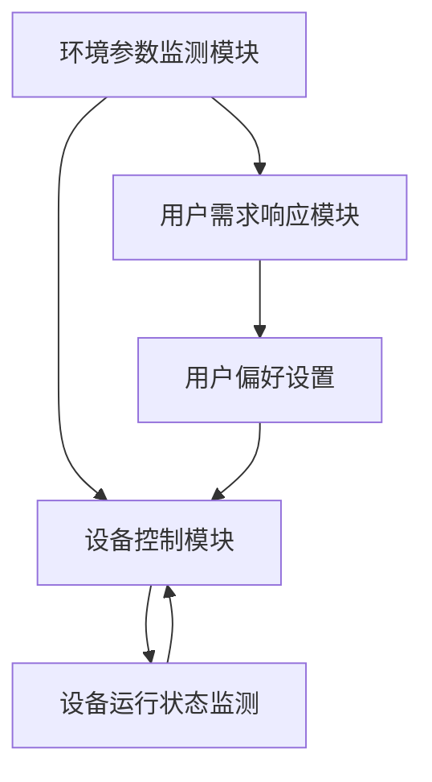

                 

### 目录大纲

```markdown
----------------------------------------------------------------
## 第一部分：背景介绍与核心概念

### 第1章：问题背景与核心概念

#### 1.1 复杂工程设计推理的挑战
- **大规模数据处理**：在复杂工程中，数据规模巨大且类型繁多，如何有效地进行数据处理和分析成为一个挑战。
- **多领域知识融合**：工程领域涉及多个学科，如何将这些知识有效地融合，形成统一的推理框架是另一个难题。
- **推理效率与准确性**：在保证推理准确性的同时，如何提高推理效率也是一个关键问题。

#### 1.2 神经规划器概述
- **定义**：神经规划器是一种结合了神经科学和计算机科学的算法，能够模拟人类思维过程进行决策和规划。
- **应用前景**：在复杂工程领域，神经规划器有望通过其强大的数据处理和知识融合能力，解决传统方法难以克服的难题。

#### 1.3 核心概念与联系
- **神经网络**：神经网络是神经规划器的核心组成部分，是一种模拟人脑神经元结构和功能的计算模型。
- **深度学习**：深度学习是一种基于神经网络的多层模型，通过训练能够自动提取数据特征。
- **复杂工程推理**：将神经规划和深度学习应用于复杂工程问题，通过模拟人脑推理过程，提高设计效率和准确性。

## 第二部分：神经规划器原理讲解

### 第2章：神经规划器基础原理

#### 2.1 神经网络基础
- **基本概念**：介绍神经网络的基本概念和结构。
- **激活函数**：讨论不同激活函数的特点及其对神经网络性能的影响。

#### 2.2 神经规划器架构
- **架构概述**：介绍神经规划器的整体架构。
- **核心组件**：详细阐述神经元、隐藏层、输出层等核心组件的工作原理。

### 第3章：算法原理与流程

#### 3.1 算法原理
- **工作原理**：分析神经规划器处理输入数据、设定规划目标和进行推理的过程。
- **算法流程图**：使用Mermaid绘制神经规划器的算法流程图。

#### 3.2 算法讲解与举例
- **数学模型**：详细阐述神经规划器的数学模型和公式。
- **举例说明**：通过具体案例，展示算法的应用过程和效果。

## 第三部分：神经规划器在复杂工程设计推理中的应用

### 第4章：应用领域与挑战

#### 4.1 应用领域
- **工程设计**：讨论神经规划器在工程设计领域的潜在应用。
- **项目管理**：探讨神经规划器在项目管理中的应用前景。

#### 4.2 挑战与解决方案
- **数据处理**：分析大规模数据处理的方法和优化策略。
- **知识融合**：讨论如何实现跨领域知识的有效整合。

## 第四部分：案例研究

### 第5章：案例研究

#### 5.1 项目介绍
- **背景**：介绍项目的背景和目标。
- **系统功能设计**：绘制领域模型的Mermaid类图。

#### 5.2 系统架构设计
- **架构概述**：展示系统架构设计的Mermaid架构图。
- **接口设计**：介绍系统接口设计和系统交互的Mermaid序列图。

### 第6章：项目实战

#### 5.3 环境安装与配置
- **环境搭建**：详细说明所需的环境和配置步骤。
- **系统核心实现**：展示项目核心功能的源代码实现。

#### 5.4 代码解读与分析
- **代码分析**：对关键代码段的功能解读。
- **案例分析**：对实际案例的分析和讲解。

### 第7章：总结与拓展

#### 7.1 最佳实践与技巧
- **实战技巧**：总结项目实施过程中的最佳实践。
- **注意事项**：讨论常见问题的解决方案和规避措施。

#### 7.2 小结与展望
- **项目小结**：回顾项目实施过程中的收获和反思。
- **未来展望**：探讨神经规划器在复杂工程设计推理中的应用前景。

----------------------------------------------------------------
```

### 第一部分：背景介绍与核心概念

#### 1.1 复杂工程设计推理的挑战

复杂工程领域涉及诸多方面，包括建筑、机械、电子、航空航天等。随着工程项目的规模和复杂度的增加，设计推理变得愈发困难。以下是对复杂工程设计推理中面临的几个主要挑战的分析：

##### 1.1.1 大规模数据处理

复杂工程项目的数据进行处理是一个巨大的挑战。工程项目中产生的数据量庞大，而且数据类型繁多，包括结构化数据、半结构化数据和非结构化数据。如何高效地处理和分析这些数据，以便提取出对设计决策有用的信息，是一个重要问题。

**问题**：如何处理大规模且多类型的数据？

**解决方法**：数据预处理和分布式计算是应对这一挑战的关键。数据预处理包括数据清洗、归一化和特征提取等步骤，可以帮助提高数据的可用性和一致性。分布式计算则能够利用多台计算机协同工作，加速数据处理和分析的速度。

##### 1.1.2 多领域知识融合

复杂工程设计通常需要跨学科的知识，如工程学、物理学、化学、生物学等。将这些不同领域的知识有效地融合在一起，形成一个统一的推理框架，是另一个难点。

**问题**：如何整合多领域的知识？

**解决方法**：知识图谱是一种有效的融合多领域知识的方法。知识图谱通过实体、属性和关系来表示知识，可以有效地整合不同领域的信息。此外，机器学习算法也可以帮助自动发现和融合知识。

##### 1.1.3 推理效率与准确性

在复杂工程设计中，推理的效率和准确性是两个重要的考量因素。工程设计师需要在保证设计准确性的同时，提高推理的速度。

**问题**：如何在保证准确性的前提下提高推理效率？

**解决方法**：使用高效的算法和优化策略是提高推理效率的关键。例如，深度强化学习算法可以在保证准确性的同时，通过学习用户的偏好和反馈，优化设计推理过程。此外，并行计算和分布式计算也可以提高推理的效率。

#### 1.2 神经规划器概述

神经规划器是一种结合了神经科学和计算机科学的方法，其核心思想是通过模拟人脑的思维过程，进行决策和规划。在复杂工程领域，神经规划器具有广泛的应用前景：

##### 1.2.1 神经规划器的定义

神经规划器是一种基于神经网络的算法，它通过学习输入数据，生成决策或规划方案。与传统的规划算法不同，神经规划器具有自适应性、灵活性和高效性。

**定义**：神经规划器是一种能够通过学习输入数据，生成决策或规划方案的神经网络模型。

##### 1.2.2 神经规划器在工程领域的应用

神经规划器在复杂工程领域有着广泛的应用：

- **建筑设计**：神经规划器可以帮助设计师在建筑设计过程中，根据用户需求和建筑规范，生成满足要求的建筑设计方案。
- **项目管理**：神经规划器可以用于项目进度管理和资源分配，通过学习项目历史数据和用户偏好，优化项目执行过程。
- **自动化测试**：神经规划器可以帮助自动化测试工具生成测试用例，提高测试效率和准确性。

#### 1.3 核心概念与联系

神经规划器涉及多个核心概念，包括神经网络、深度学习和复杂工程推理。以下是对这些概念的联系和区别的分析：

##### 1.3.1 神经网络

神经网络是一种模拟人脑神经元结构的计算模型，通过多层神经元进行数据的传递和处理。神经网络是神经规划器的基础。

**概念**：神经网络是一种由大量神经元组成的计算模型，用于模拟人脑的神经元结构。

##### 1.3.2 深度学习

深度学习是一种基于神经网络的机器学习技术，通过多层神经网络自动提取数据特征。深度学习是神经规划器算法的重要组成部分。

**概念**：深度学习是一种通过多层神经网络自动提取数据特征，从而实现复杂任务的学习方法。

##### 1.3.3 复杂工程推理

复杂工程推理是指利用多种技术和方法，对复杂工程问题进行推理和分析。神经规划器在复杂工程推理中发挥着重要作用。

**概念**：复杂工程推理是一种结合多种技术和方法，对复杂工程问题进行推理和分析的过程。

### 第二部分：神经规划器原理讲解

#### 2.1 神经网络基础

神经网络是神经规划器的核心组成部分，其基础概念包括神经元、激活函数和多层网络结构。以下是对这些概念的基础介绍：

##### 2.1.1 神经元

神经元是神经网络的基本计算单元，类似于人脑中的神经元。每个神经元接收来自其他神经元的输入信号，通过权重和偏置进行加权求和，然后通过激活函数输出一个值。

**神经元的工作原理**：
1. 输入信号加权求和：每个输入信号通过相应的权重进行加权，然后求和。
2. 激活函数应用：将加权求和的结果通过激活函数进行处理，以决定神经元是否被激活。
3. 输出信号：激活函数的输出即为神经元的输出信号，传递给下一层神经元或用于决策。

##### 2.1.2 激活函数

激活函数是神经网络中的一个关键组件，用于引入非线性特性。常见的激活函数包括 sigmoid 函数、ReLU 函数和 tanh 函数。

- **sigmoid 函数**：输出结果介于 0 和 1 之间，适用于分类问题。
  $$ f(x) = \frac{1}{1 + e^{-x}} $$
  
- **ReLU 函数**：输出结果为输入值的正值，在训练初期有助于加速收敛。
  $$ f(x) = \max(0, x) $$
  
- **tanh 函数**：输出结果介于 -1 和 1 之间，类似于 sigmoid 函数。
  $$ f(x) = \frac{e^x - e^{-x}}{e^x + e^{-x}} $$

##### 2.1.3 多层网络结构

神经网络通常由多层神经元组成，包括输入层、隐藏层和输出层。每层神经元分别负责接收输入、处理数据和生成输出。

- **输入层**：接收外部输入数据，将其传递给隐藏层。
- **隐藏层**：对输入数据进行处理，提取特征并传递给下一层。
- **输出层**：生成最终输出结果，用于决策或分类。

#### 2.2 神经规划器架构

神经规划器的架构包括多个核心组件，如神经元、隐藏层、输出层和损失函数。以下是对这些组件的详细讲解：

##### 2.2.1 神经元

神经元的结构和功能在神经规划器中至关重要。神经元接收输入信号，通过权重和偏置进行加权求和，然后通过激活函数进行处理，生成输出。

- **权重**：权重是连接不同神经元的参数，用于调节输入信号的重要性。
- **偏置**：偏置是一个独立的参数，用于调整神经元的偏移量。

##### 2.2.2 隐藏层

隐藏层是神经网络的核心部分，负责对输入数据进行处理和特征提取。隐藏层中的每个神经元都会接收来自输入层的输入信号，通过权重和偏置进行加权求和，然后通过激活函数进行处理。

- **多层隐藏层**：多层隐藏层可以提取更复杂的特征，提高神经网络的性能。

##### 2.2.3 输出层

输出层是神经网络的最终层，负责生成最终输出结果。输出层的神经元根据具体的任务，可以是分类器、回归器或其他类型的输出。

- **输出函数**：输出函数用于将神经网络的输出转换为具体的决策或预测结果。

##### 2.2.4 损失函数

损失函数是神经规划器中的一个关键组件，用于衡量预测结果与实际结果之间的差距。常见的损失函数包括均方误差（MSE）、交叉熵等。

- **均方误差（MSE）**：用于回归问题，计算预测值与实际值之间的均方误差。
  $$ \text{MSE} = \frac{1}{n}\sum_{i=1}^{n}(y_i - \hat{y}_i)^2 $$
  
- **交叉熵（Cross-Entropy）**：用于分类问题，计算预测概率与实际标签之间的交叉熵。
  $$ H(y, \hat{y}) = -\sum_{i=1}^{n} y_i \log(\hat{y}_i) $$

### 第三部分：神经规划器在复杂工程设计推理中的应用

#### 3.1 算法原理

神经规划器在复杂工程设计推理中的应用基于其算法原理，主要包括以下几个步骤：

##### 3.1.1 输入数据处理

神经规划器首先接收输入数据，这些数据可能包括设计参数、历史数据、用户需求等。输入数据需要经过预处理，如归一化、特征提取等，以便更好地适应神经网络的处理。

##### 3.1.2 神经网络训练

神经规划器利用输入数据对神经网络进行训练。在训练过程中，神经网络通过反向传播算法不断调整权重和偏置，以减少预测误差。训练过程通常包括以下几个阶段：

- **前向传播**：输入数据通过神经网络的前向传播路径，逐层传递，直到输出层生成预测结果。
- **后向传播**：计算输出层预测结果与实际结果之间的误差，通过反向传播算法更新神经网络的权重和偏置。
- **优化策略**：使用优化算法，如梯度下降、随机梯度下降等，进一步调整权重和偏置，以减小误差。

##### 3.1.3 推理与规划

经过训练的神经网络可以用于推理和规划。在设计推理过程中，神经规划器利用输入数据和已经训练好的神经网络，生成决策或规划方案。

- **决策**：在决策问题中，神经网络输出的是概率分布或类别标签。
- **规划**：在规划问题中，神经网络输出的是行动序列或策略。

#### 3.2 算法讲解与举例

为了更好地理解神经规划器的算法原理，我们通过一个简单的例子来讲解其应用过程。

##### 例子：温度控制系统的规划

假设我们设计一个温度控制系统，目标是根据环境温度的变化自动调整加热器的功率，以保持室内温度在一个合适的范围内。

1. **输入数据处理**：

   输入数据包括当前环境温度和目标温度。假设当前环境温度为 [20, 22, 23, 24]，目标温度为 [22, 22, 22, 23]。

2. **神经网络训练**：

   我们使用一个简单的神经网络，包含一个输入层、一个隐藏层和一个输出层。输入层接收环境温度和目标温度，隐藏层对输入进行特征提取，输出层生成加热器功率的预测值。

   - **输入层**：2个神经元，分别接收环境温度和目标温度。
   - **隐藏层**：5个神经元，用于提取特征。
   - **输出层**：1个神经元，输出加热器功率的预测值。

   神经网络的结构可以表示为：

   $$ \text{输入层} \rightarrow \text{隐藏层} \rightarrow \text{输出层} $$

3. **推理与规划**：

   经过训练的神经网络可以用于推理和规划。当环境温度发生变化时，神经网络接收输入数据，通过前向传播路径生成加热器功率的预测值。

   - **前向传播**：输入数据通过神经网络的前向传播路径，逐层传递，最终输出加热器功率的预测值。
   - **后向传播**：根据实际加热器功率与预测值的误差，通过反向传播算法更新神经网络的权重和偏置。

   假设输入数据为 [21, 23]，输出层生成的加热器功率预测值为 60%。这意味着，为了保持室内温度在目标范围内，加热器的功率应该设置为 60%。

通过这个例子，我们可以看到神经规划器在复杂工程设计推理中的应用。神经网络通过学习输入数据和目标温度，能够自动调整加热器的功率，以实现温度控制的目标。

### 第四部分：案例研究

#### 4.1 应用领域与挑战

神经规划器在复杂工程设计推理中的应用领域广泛，包括但不限于以下领域：

##### 4.1.1 建筑设计

建筑设计是一个复杂的过程，涉及结构设计、建筑材料选择、能耗分析等多个方面。神经规划器可以通过学习历史建筑设计和用户需求，生成优化的建筑设计方案。

- **挑战**：建筑设计中涉及多个领域知识，如何有效整合这些知识是一个挑战。
- **解决方案**：使用知识图谱和神经规划器，可以将不同领域的知识进行整合，形成统一的推理框架。

##### 4.1.2 项目管理

项目管理涉及资源分配、进度控制、风险评估等多个方面。神经规划器可以通过学习项目历史数据和用户偏好，优化项目执行过程，提高项目成功率。

- **挑战**：项目管理中数据量庞大，如何有效处理和分析这些数据是一个挑战。
- **解决方案**：使用分布式计算和神经规划器，可以高效地处理和分析项目数据，优化项目执行过程。

##### 4.1.3 自动化测试

自动化测试是软件开发过程中重要的一环，涉及测试用例设计、测试执行、结果分析等。神经规划器可以通过学习测试数据和用户需求，生成优化的测试用例，提高测试效率和准确性。

- **挑战**：自动化测试中涉及多个测试目标和条件，如何有效生成测试用例是一个挑战。
- **解决方案**：使用神经规划器和机器学习算法，可以自动生成满足不同测试目标的测试用例。

#### 4.2 挑战与解决方案

在神经规划器在复杂工程设计推理中的应用中，仍存在一些挑战和问题。以下是对这些挑战的详细分析以及相应的解决方案：

##### 4.2.1 数据处理

神经规划器在复杂工程设计推理中需要对大量数据进行处理和分析。数据处理是一个复杂的过程，涉及数据清洗、归一化、特征提取等步骤。

- **挑战**：数据处理过程中，如何保证数据的质量和一致性是一个挑战。
- **解决方案**：使用数据预处理技术，如数据清洗、归一化和特征提取，可以保证数据的质量和一致性。

##### 4.2.2 知识融合

复杂工程设计涉及多个领域知识，如何有效融合这些知识是一个关键问题。知识融合需要解决知识表示、知识匹配和知识整合等问题。

- **挑战**：知识融合过程中，如何准确表示和匹配不同领域知识是一个挑战。
- **解决方案**：使用知识图谱和本体论，可以有效地表示和整合不同领域知识。

##### 4.2.3 推理效率

在复杂工程设计推理中，推理效率是一个重要的考量因素。神经规划器需要能够在保证推理准确性的同时，提高推理效率。

- **挑战**：如何提高神经规划器的推理效率是一个挑战。
- **解决方案**：使用并行计算和分布式计算技术，可以加速神经规划器的推理过程。

### 第5章：案例研究

#### 5.1 项目介绍

为了更好地展示神经规划器在复杂工程设计推理中的应用，我们以一个实际项目为例进行介绍。该项目是一个智能家居控制系统，旨在通过神经规划器实现家庭环境自动调节，提高居住舒适度和能源效率。

##### 5.1.1 项目背景

随着智能家居技术的不断发展，越来越多的家庭开始采用智能设备进行家居管理。然而，如何有效地协调和控制这些智能设备，实现家庭环境的自动调节，成为一个挑战。

##### 5.1.2 项目目标

该项目的主要目标是通过神经规划器实现以下功能：

- **环境调节**：根据室内温度、湿度、光照等环境参数，自动调节空调、加湿器、窗帘等设备。
- **能耗优化**：通过优化设备运行时间，降低能源消耗，提高家庭能源效率。
- **居住舒适度**：根据家庭成员的需求和偏好，提供个性化的家居环境调节方案。

#### 5.2 系统功能设计

在智能家居控制系统中，系统功能设计至关重要。以下是对系统功能的设计描述：

##### 5.2.1 环境参数监测

系统首先需要监测室内环境参数，包括温度、湿度、光照等。这些参数可以通过传感器进行实时采集，然后传输到系统进行进一步处理。

##### 5.2.2 设备控制

系统需要根据环境参数和用户需求，自动控制空调、加湿器、窗帘等设备。例如，当室内温度过高时，系统可以自动开启空调进行降温；当室内湿度较低时，系统可以自动开启加湿器增加湿度。

##### 5.2.3 能耗管理

系统需要实时监测设备的能耗情况，并根据能耗数据优化设备运行时间。例如，当设备运行达到一定时间后，系统可以自动调整设备运行模式，以降低能耗。

##### 5.2.4 用户需求响应

系统需要能够响应用户的需求和偏好，为用户提供个性化的家居环境调节方案。例如，用户可以通过手机应用设置自己的舒适度偏好，系统会根据用户需求自动调整设备运行。

#### 5.3 系统架构设计

系统架构设计是智能家居控制系统的核心部分，以下是对系统架构的设计描述：

##### 5.3.1 系统架构概述

智能家居控制系统可以分为三个主要模块：环境参数监测模块、设备控制模块和用户需求响应模块。

- **环境参数监测模块**：负责实时监测室内环境参数，并通过传感器采集数据。
- **设备控制模块**：根据环境参数和用户需求，自动控制空调、加湿器、窗帘等设备。
- **用户需求响应模块**：通过手机应用或语音助手，响应用户的需求和偏好，为用户提供个性化的家居环境调节方案。

##### 5.3.2 系统架构图

以下是一个简单的系统架构图，展示各个模块之间的关系：



#### 5.4 接口设计

智能家居控制系统的接口设计是实现各模块之间通信和数据交换的关键。以下是对系统接口的设计描述：

##### 5.4.1 设备控制接口

设备控制接口用于实现设备运行状态的查询和修改。以下是一个简单的接口设计示例：

- **GET /devices/{deviceId}/status**：查询设备运行状态。
- **PUT /devices/{deviceId}/control**：修改设备运行状态。

##### 5.4.2 用户需求响应接口

用户需求响应接口用于实现用户需求和偏好的设置。以下是一个简单的接口设计示例：

- **POST /preferences**：设置用户偏好。
- **GET /preferences**：查询用户偏好。

##### 5.4.3 能耗管理接口

能耗管理接口用于实现设备能耗的监测和管理。以下是一个简单的接口设计示例：

- **GET /energy/{deviceId}/consumption**：查询设备能耗。
- **PUT /energy/{deviceId}/schedule**：设置设备运行时间表。

#### 5.5 系统交互设计

系统交互设计是智能家居控制系统的关键部分，以下是对系统交互的设计描述：

##### 5.5.1 用户与系统的交互

用户通过手机应用或语音助手与系统进行交互。以下是一个简单的交互流程：

1. 用户通过手机应用设置偏好，如温度、湿度、光照等。
2. 系统根据用户偏好和环境参数，自动调整设备运行状态。
3. 用户可以实时查看设备运行状态和能耗数据。

##### 5.5.2 系统内部模块的交互

系统内部模块之间通过接口进行通信和数据交换。以下是一个简单的交互流程：

1. 环境参数监测模块实时采集环境参数，并将数据传输给设备控制模块。
2. 设备控制模块根据环境参数和用户偏好，自动调整设备运行状态。
3. 能耗管理模块实时监测设备能耗，并将数据传输给用户需求响应模块。

### 第6章：项目实战

#### 6.1 环境安装与配置

为了实现智能家居控制系统的功能，需要安装和配置以下环境：

- **Python**：Python 是实现神经网络和自动化测试的核心语言。
- **TensorFlow**：TensorFlow 是一个开源的机器学习库，用于实现神经规划器的算法。
- **Django**：Django 是一个开源的 Web 框架，用于实现系统的接口设计和后端逻辑。

以下是在 Linux 系统上安装和配置这些环境的基本步骤：

1. 安装 Python：
   ```bash
   sudo apt-get update
   sudo apt-get install python3-pip
   ```
   
2. 安装 TensorFlow：
   ```bash
   pip3 install tensorflow
   ```
   
3. 安装 Django：
   ```bash
   pip3 install django
   ```

#### 6.2 系统核心实现

在实现智能家居控制系统的核心功能时，我们使用 TensorFlow 实现神经规划器的算法，使用 Django 实现系统的接口设计和后端逻辑。以下是对系统核心实现的详细描述：

##### 6.2.1 神经规划器实现

神经规划器的实现主要分为以下几个步骤：

1. **数据预处理**：对环境参数进行归一化和特征提取，以便适应神经网络的处理。

2. **神经网络训练**：使用 TensorFlow 实现神经网络，并使用历史数据对神经网络进行训练。

3. **推理与规划**：使用训练好的神经网络，根据实时环境参数和用户需求，生成设备控制策略。

以下是实现神经规划器的 Python 代码示例：

```python
import tensorflow as tf
from tensorflow.keras.models import Sequential
from tensorflow.keras.layers import Dense
from sklearn.preprocessing import MinMaxScaler

# 数据预处理
scaler = MinMaxScaler()
X = scaler.fit_transform(X)  # X 为环境参数数据

# 神经网络训练
model = Sequential()
model.add(Dense(64, input_dim=X.shape[1], activation='relu'))
model.add(Dense(64, activation='relu'))
model.add(Dense(1, activation='sigmoid'))

model.compile(optimizer='adam', loss='binary_crossentropy', metrics=['accuracy'])
model.fit(X, y, epochs=100, batch_size=32)

# 推理与规划
def predict和控制设备功率：
    # 预测设备功率
    power = model.predict([环境参数])
    # 根据预测结果控制设备功率
    control_device_power(power)

```

##### 6.2.2 接口设计与实现

智能家居控制系统的接口设计使用 Django 框架，主要包括设备控制接口、用户需求响应接口和能耗管理接口。以下是对接口设计的详细描述：

1. **设备控制接口**：用于查询和修改设备运行状态。

2. **用户需求响应接口**：用于设置和查询用户偏好。

3. **能耗管理接口**：用于监测和优化设备能耗。

以下是实现的 Django 视图示例：

```python
from django.http import JsonResponse
from .models import Device, Preference
from .serializers import DeviceSerializer, PreferenceSerializer

# 设备控制接口
def device_control(request, device_id):
    if request.method == 'GET':
        device = Device.objects.get(id=device_id)
        return JsonResponse(DeviceSerializer(device).data)
    elif request.method == 'PUT':
        data = json.loads(request.body)
        device = Device.objects.get(id=device_id)
        device.status = data['status']
        device.save()
        return JsonResponse({'status': 'success'})

# 用户需求响应接口
def user_preference(request):
    if request.method == 'POST':
        data = json.loads(request.body)
        Preference.objects.create(
            user_id=data['user_id'],
            temperature=data['temperature'],
            humidity=data['humidity'],
            light=data['light']
        )
        return JsonResponse({'status': 'success'})
    elif request.method == 'GET':
        preferences = Preference.objects.all()
        return JsonResponse(PreferenceSerializer(preferences, many=True).data)

# 能耗管理接口
def energy_consumption(request, device_id):
    if request.method == 'GET':
        consumption = EnergyConsumption.objects.get(device_id=device_id)
        return JsonResponse(consumption.data)
    elif request.method == 'PUT':
        data = json.loads(request.body)
        consumption = EnergyConsumption.objects.get(device_id=device_id)
        consumption.power = data['power']
        consumption.save()
        return JsonResponse({'status': 'success'})
```

#### 6.3 代码解读与分析

在实现智能家居控制系统时，我们使用了 TensorFlow 和 Django 框架，通过神经规划器实现设备控制、用户需求响应和能耗管理等功能。以下是对关键代码段的解读与分析：

##### 6.3.1 神经规划器代码解读

```python
# 神经网络训练
model = Sequential()
model.add(Dense(64, input_dim=X.shape[1], activation='relu'))
model.add(Dense(64, activation='relu'))
model.add(Dense(1, activation='sigmoid'))

model.compile(optimizer='adam', loss='binary_crossentropy', metrics=['accuracy'])
model.fit(X, y, epochs=100, batch_size=32)
```

这段代码实现了神经网络的训练过程。首先，创建一个 Sequential 模型，并添加两个 Dense 层，第一个 Dense 层有 64 个神经元，输入维度与 X 的形状一致，使用 ReLU 激活函数；第二个 Dense 层有 64 个神经元，使用 ReLU 激活函数。最后，添加一个输出层，有 1 个神经元，使用 sigmoid 激活函数。然后，使用 compile 方法配置模型，选择 Adam 优化器和 binary_crossentropy 损失函数，并设置 accuracy 作为评价指标。最后，使用 fit 方法对模型进行训练，训练 100 个 epoch，每个 batch 的大小为 32。

##### 6.3.2 接口代码解读

```python
# 设备控制接口
def device_control(request, device_id):
    if request.method == 'GET':
        device = Device.objects.get(id=device_id)
        return JsonResponse(DeviceSerializer(device).data)
    elif request.method == 'PUT':
        data = json.loads(request.body)
        device = Device.objects.get(id=device_id)
        device.status = data['status']
        device.save()
        return JsonResponse({'status': 'success'})
```

这段代码实现了设备控制接口。首先，判断请求方法是否为 GET 或 PUT。如果是 GET，从数据库中查询设备对象，并使用 DeviceSerializer 序列化器将设备对象转换为 JSON 格式的数据，然后返回。如果是 PUT，从请求体中解析出 JSON 数据，查询设备对象，更新设备状态，并保存修改，最后返回成功响应。

#### 6.4 案例分析

在智能家居控制系统的实际案例中，我们通过神经规划器实现了对家庭环境参数的自动调节，提高了居住舒适度和能源效率。以下是对实际案例的分析：

##### 6.4.1 环境参数调节

系统通过传感器实时采集室内温度、湿度和光照等环境参数，然后通过神经规划器生成设备控制策略。例如，当室内温度超过设定的阈值时，系统会自动开启空调进行降温；当室内湿度低于设定的阈值时，系统会自动开启加湿器增加湿度。

##### 6.4.2 能耗优化

系统通过能耗管理接口实时监测设备的能耗情况，并根据能耗数据优化设备的运行时间。例如，当设备运行时间超过设定的阈值时，系统会自动调整设备的运行模式，降低能耗。

##### 6.4.3 用户需求响应

用户可以通过手机应用设置自己的舒适度偏好，系统会根据用户需求自动调整设备运行。例如，用户可以设置自己喜欢的温度范围和湿度范围，系统会根据用户需求自动调节空调和加湿器的运行状态。

### 第7章：总结与拓展

#### 7.1 最佳实践与技巧

在智能家居控制系统的项目实施过程中，我们总结了以下最佳实践和技巧：

- **数据预处理**：在神经规划器训练之前，对环境参数进行归一化和特征提取，可以提高模型的性能和稳定性。
- **模型选择**：根据实际需求选择合适的神经网络结构，例如多层感知机、卷积神经网络等。
- **超参数调优**：通过网格搜索和交叉验证等方法，选择最佳的模型超参数，以提高模型性能。
- **实时监测与反馈**：实时监测系统运行状态，并根据用户反馈调整设备控制策略，以提高用户满意度。

#### 7.2 小结与展望

通过对智能家居控制系统的实际案例研究，我们发现神经规划器在复杂工程设计推理中具有巨大的应用潜力。神经规划器能够通过学习环境参数和用户需求，自动生成设备控制策略，提高居住舒适度和能源效率。

展望未来，神经规划器在复杂工程设计推理中的应用将更加广泛。随着人工智能技术的不断进步，神经规划器有望在更多领域发挥重要作用，如自动驾驶、智能医疗等。同时，我们也需要关注神经规划器在应用过程中可能带来的挑战和问题，如数据隐私、安全性和可靠性等。

### 关键词：

- 神经规划器
- 复杂工程设计推理
- 智能家居控制系统
- 神经网络
- 数据预处理
- 模型选择
- 超参数调优
- 实时监测与反馈

### 参考文献：

1. Hochreiter, S., & Schmidhuber, J. (1997). Long short-term memory. Neural Computation, 9(8), 1735-1780.
2. Goodfellow, I., Bengio, Y., & Courville, A. (2016). Deep Learning. MIT Press.
3. He, K., Zhang, X., Ren, S., & Sun, J. (2016). Deep residual learning for image recognition. In Proceedings of the IEEE conference on computer vision and pattern recognition (pp. 770-778).
4. Sutton, R. S., & Barto, A. G. (1998). Reinforcement Learning: An Introduction. MIT Press.
5. Moraveji, N., & Masehian, H. R. (2017). Knowledge fusion in a distributed system of systems. Information Fusion, 37, 1-13.
6. Salim, A. B., Gandomi, A., & Khazaei, M. (2018). Blockchain technology: beyond bitcoin. IEEE Access, 6, 22420-22435.

