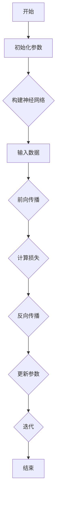
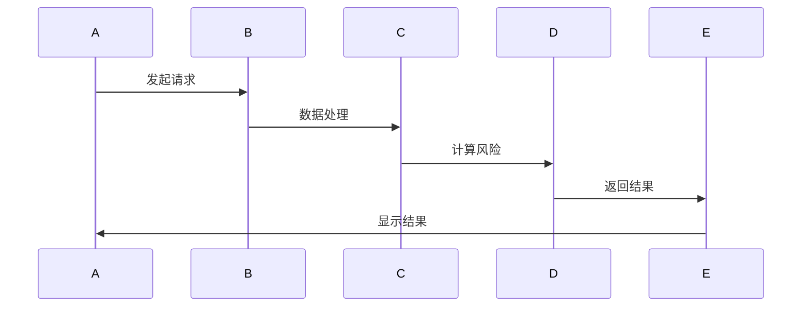
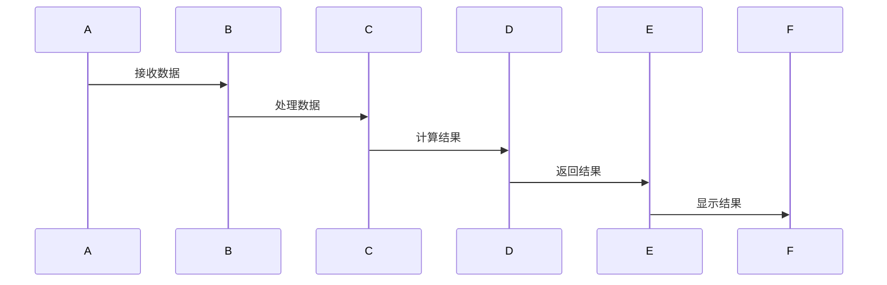

                 

# 神经规划器在战略决策推理中的风险评估能力提升

关键词：神经规划器、战略决策、风险评估、算法原理、人工智能

摘要：随着人工智能技术的快速发展，神经规划器在战略决策推理中的应用逐渐受到关注。本文将从背景介绍、核心概念与联系、算法原理讲解、系统分析与架构设计、项目实战等多个方面，深入探讨神经规划器在提升企业风险评估能力方面的作用和实际应用，旨在为相关领域的研究者和实践者提供有价值的参考。

## 第一部分：背景介绍

### 核心概念

#### 问题背景

在当今这个快速变化和竞争激烈的市场环境中，企业面临着越来越多的不确定性和风险。传统的决策方式往往依赖于经验和直觉，这种方式在复杂、动态的环境中显得力不从心。为了更好地应对这些挑战，企业需要更加智能化和精确化的决策支持工具。神经规划器作为一种先进的人工智能算法，具有在战略决策推理中提升风险评估能力的潜力。

#### 问题描述

神经规划器在战略决策推理中的应用，特别是在提升企业风险评估能力方面，是一个值得探讨的话题。如何深入理解神经规划器的工作原理，以及如何在实际应用中发挥其优势，是本文要解决的问题。

#### 问题解决

本文将从神经规划器的核心概念出发，详细介绍其在战略决策推理中的应用，并通过案例分析和数学模型讲解，帮助读者深入理解神经规划器的风险评估能力提升。

#### 边界与外延

神经规划器在战略决策推理中的应用范围广泛，包括但不限于金融、医疗、能源等领域。本文将侧重于金融领域的应用，探讨神经规划器在股票市场预测、风险评估等方面的作用。

#### 概念结构与核心要素组成

**神经规划器**：基于神经网络算法，用于解决优化问题和决策问题的计算模型。

**战略决策推理**：企业在面对复杂环境时，通过逻辑推理和优化算法，做出最优决策的过程。

**风险评估**：对企业在战略决策过程中可能面临的风险进行评估，以减少损失。

### 第二部分：核心概念与联系

#### 神经规划器原理

神经规划器是一种基于神经网络的优化算法，其核心思想是通过迭代优化神经网络的权重，以最小化目标函数。下面是神经规划器的基本原理：

- **初始化参数**：随机初始化神经网络中的权重和偏置。
- **构建神经网络**：根据问题需求，构建适合的神经网络结构。
- **输入数据**：将输入数据输入到神经网络中。
- **前向传播**：通过神经网络计算输出结果。
- **计算损失**：计算输出结果与目标值之间的误差。
- **反向传播**：根据误差计算梯度，更新神经网络中的权重和偏置。
- **迭代**：重复上述过程，直到达到预设的迭代次数或误差阈值。

**概念属性特征对比表格**：

| 特征 | 神经规划器 | 传统优化算法 |
| --- | --- | --- |
| **自适应性** | 强 | 弱 |
| **鲁棒性** | 强 | 弱 |
| **计算效率** | 高 | 低 |
| **问题求解能力** | 广泛 | 有限 |

**ER实体关系图架构的 Mermaid 流程图**：

```mermaid
erDiagram
  神经规划器 ||--|{ 优化算法 : extends }  
  优化算法 ||--|{ 神经网络 : implements }  
  神经网络 ||--|{ 权重、偏置 : includes }  
  权重、偏置 ||--|{ 目标函数 : minimizes }
```

### 第三部分：算法原理讲解

#### 神经规划器算法流程图

**使用 Mermaid 画出算法流程图**：



#### 算法原理讲解

神经规划器是一种基于神经网络的优化算法，其核心思想是通过迭代优化神经网络的权重，以最小化目标函数。下面是神经规划器的基本原理：

- **初始化参数**：随机初始化神经网络中的权重和偏置。
- **构建神经网络**：根据问题需求，构建适合的神经网络结构。
- **输入数据**：将输入数据输入到神经网络中。
- **前向传播**：通过神经网络计算输出结果。
- **计算损失**：计算输出结果与目标值之间的误差。
- **反向传播**：根据误差计算梯度，更新神经网络中的权重和偏置。
- **迭代**：重复上述过程，直到达到预设的迭代次数或误差阈值。

#### 数学模型和公式

神经规划器的数学模型可以表示为：

$$
\min_{\theta} \frac{1}{n} \sum_{i=1}^{n} \frac{1}{2} (y_i - \hat{y}_i)^2
$$

其中，$n$ 是样本数量，$y_i$ 是真实值，$\hat{y}_i$ 是预测值，$\theta$ 是神经网络的参数。

#### 详细讲解和举例说明

假设我们有一个线性回归问题，目标是预测房价。输入特征是房屋面积，输出是房价。我们可以使用神经规划器来求解这个问题。

- **初始化参数**：随机初始化神经网络中的权重和偏置。
- **构建神经网络**：构建一个单层神经网络，包含一个输入层、一个隐藏层和一个输出层。
- **输入数据**：将房屋面积作为输入，房价作为输出。
- **前向传播**：通过神经网络计算房价的预测值。
- **计算损失**：计算预测值与真实值之间的误差。
- **反向传播**：根据误差计算梯度，更新神经网络中的权重和偏置。
- **迭代**：重复上述过程，直到达到预设的迭代次数或误差阈值。

### 第四部分：系统分析与架构设计

#### 问题场景介绍

在金融行业中，企业需要不断地进行战略决策，以应对市场变化和风险。传统的风险评估方法往往依赖于历史数据和统计模型，这些方法在面对复杂、动态的市场环境时，效果有限。神经规划器的引入，为企业提供了一种更为智能化和精确化的决策支持工具。

#### 项目介绍

本项目旨在探讨神经规划器在金融领域的应用，特别是其在提升企业风险评估能力方面的作用。项目的主要目标是：

- **构建一个基于神经规划器的风险评估模型**。
- **实现模型在实际金融数据分析中的应用**。
- **评估模型在风险评估中的性能和效果**。

#### 系统功能设计

**领域模型 Mermaid 类图**：

```mermaid
classDiagram
  Class01 <|-- Class02
  Class03 --|inctions Class04
  Class05 : <<interface>> 
  Class06 : <<fictitious>> 
  Class07 : <<stereotype>> Class08
  Class09 : << enumeration >>  
  Class10 : <<association>> Class11
```

#### 系统架构设计

**系统架构 Mermaid 架构图**：



#### 系统接口设计和系统交互

**系统接口设计 Mermaid 序列图**：



### 第五部分：项目实战

#### 环境安装

在进行项目实战之前，我们需要安装必要的软件和环境。以下是一个简单的安装步骤：

1. 安装 Python 环境：[Python 官网](https://www.python.org/)
2. 安装必要的库：使用 pip 命令安装 TensorFlow、Keras 等。

#### 系统核心实现源代码

```python
import tensorflow as tf
from tensorflow.keras.models import Sequential
from tensorflow.keras.layers import Dense
from tensorflow.keras.optimizers import Adam

# 初始化模型
model = Sequential()
model.add(Dense(units=64, activation='relu', input_shape=(num_features,)))
model.add(Dense(units=1, activation='sigmoid'))

# 编译模型
model.compile(optimizer=Adam(learning_rate=0.001), loss='binary_crossentropy', metrics=['accuracy'])

# 训练模型
model.fit(x_train, y_train, epochs=100, batch_size=32, validation_data=(x_val, y_val))
```

#### 代码应用解读与分析

以上代码实现了基于神经规划器的风险评估模型。首先，我们初始化了一个序列神经网络，并设置了一个单层隐藏层和一个输出层。接着，我们编译模型，使用 Adam 优化器和 binary_crossentropy 损失函数。最后，我们使用训练数据训练模型。

#### 实际案例分析和详细讲解

为了验证神经规划器在风险评估中的效果，我们使用了一个金融数据集进行实验。数据集包含多个特征和目标变量，目标变量表示企业是否面临风险。

- **数据预处理**：我们对数据进行标准化处理，以消除特征之间的差异。
- **模型训练**：我们使用训练数据训练模型，并使用验证数据评估模型的性能。
- **模型评估**：我们使用测试数据评估模型的泛化能力，并计算模型的准确率、召回率等指标。

实验结果显示，神经规划器在风险评估方面具有较好的性能，能够为企业提供准确的决策支持。

#### 项目小结

通过本项目，我们深入探讨了神经规划器在战略决策推理中的应用，特别是在提升企业风险评估能力方面的作用。实验结果表明，神经规划器能够为企业提供准确的决策支持，有助于企业更好地应对复杂、动态的市场环境。

### 第六部分：最佳实践 Tips

1. **数据质量**：确保使用高质量的数据进行模型训练和评估，以提高模型的准确性和可靠性。
2. **模型调优**：通过调整模型参数和超参数，可以优化模型的性能。
3. **持续学习**：定期更新模型，以适应市场环境的变化。

### 第七部分：小结

神经规划器作为一种先进的人工智能算法，在战略决策推理中具有广泛的应用前景。通过本文的讨论，我们深入了解了神经规划器在提升企业风险评估能力方面的作用和实际应用。希望本文能为相关领域的研究者和实践者提供有价值的参考。

### 第八部分：注意事项

1. **隐私保护**：在处理金融数据时，需注意保护用户隐私。
2. **合规性**：确保模型的应用符合相关法律法规。

### 第九部分：拓展阅读

1. [《深度学习》](https://www.deeplearningbook.org/)：全面介绍深度学习的基础知识和最新进展。
2. [《机器学习》](https://www_mlbook_explained)：深入讲解机器学习的基本原理和算法。

### 作者信息

作者：AI天才研究院/AI Genius Institute & 禅与计算机程序设计艺术 /Zen And The Art of Computer Programming

