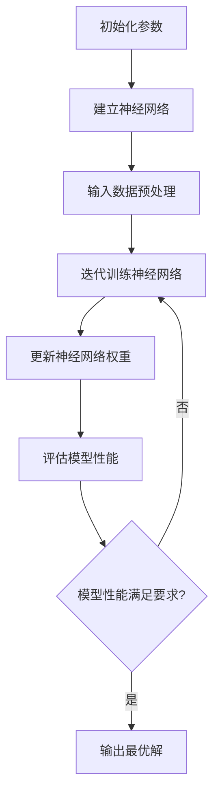

                 

### 文章标题

《神经规划在复杂供应链优化推理中的创新应用》

**关键词：** 神经规划、复杂供应链、优化推理、创新应用

**摘要：** 本文深入探讨了神经规划在复杂供应链优化推理中的创新应用。通过系统地介绍神经规划的基本概念、算法原理及其在供应链优化中的具体应用，文章旨在揭示神经规划如何通过高效、智能的方法，解决供应链优化中的关键难题，提升整体供应链管理效率。

### 引言

在现代经济体系中，供应链作为连接生产、流通、消费的重要环节，其优化问题愈发受到广泛关注。然而，随着供应链的复杂性和不确定性日益增加，传统的优化方法面临着巨大的挑战。神经规划作为一种先进的人工智能技术，近年来在诸多领域展现了强大的潜力。本文将探讨神经规划在复杂供应链优化推理中的创新应用，旨在为相关研究者和实践者提供有价值的参考。

### 1.1 复杂供应链优化问题概述

**1.1.1 供应链优化的重要性**

供应链优化是提升企业竞争力、降低成本、提高服务质量的关键手段。一个高效的供应链系统能够快速响应市场需求，减少库存积压，提高资金周转率，从而增强企业的市场适应能力和竞争力。

**1.1.2 供应链优化中的难题与挑战**

- **需求预测不确定性：** 市场需求波动大，预测准确性低。
- **供应环节复杂：** 生产、运输、仓储等环节高度依赖外部因素，容易受到外部冲击。
- **资源分配不平衡：** 资源配置不合理导致库存积压或供应短缺。
- **信息共享困难：** 企业间信息孤岛问题严重，协同优化困难。

### 1.2 神经规划的概念与原理

**1.2.1 神经规划的定义**

神经规划是一种基于深度学习和优化理论的方法，通过模拟人脑神经网络的结构和功能，实现复杂决策和优化问题的求解。

**1.2.2 神经规划的优势**

- **自适应性强：** 能够根据环境和需求的变化，自动调整策略。
- **高效性：** 能够在大量数据中快速找到最优解。
- **灵活性：** 能够处理非线性和动态优化问题。

**1.2.3 神经规划的基本原理**

神经规划的核心思想是通过神经网络模拟人类的决策过程，利用梯度下降等优化算法，逐步迭代优化决策变量，直至找到最优解。

### 1.3 神经规划在供应链优化中的应用

**1.3.1 神经规划模型介绍**

神经规划模型主要包括输入层、隐藏层和输出层，通过神经网络的权重调整，实现优化问题的求解。

**1.3.2 神经规划在供应链优化中的具体应用场景**

- **需求预测：** 利用神经规划模型对市场需求进行准确预测。
- **库存管理：** 根据需求预测结果，动态调整库存水平。
- **资源分配：** 优化生产、运输、仓储等环节的资源分配。

### 1.4 神经规划算法的数学模型

**1.4.1 神经规划的核心数学模型**

神经规划算法的核心数学模型包括目标函数、约束条件和优化算法。

**1.4.2 神经规划算法的公式与解释**

$$
\begin{aligned}
\min_{x} &\quad f(x) \\
\text{subject to} &\quad g_i(x) \leq 0, \quad i = 1, 2, \ldots, m \\
&\quad h_j(x) = 0, \quad j = 1, 2, \ldots, n
\end{aligned}
$$

其中，$x$ 为决策变量，$f(x)$ 为目标函数，$g_i(x)$ 和 $h_j(x)$ 为约束条件。

### 1.5 神经规划算法的mermaid流程图

**1.5.1 算法流程图绘制**



**1.5.2 算法流程详细解析**

- **初始化参数：** 设定神经网络的初始权重和激活函数。
- **建立神经网络：** 构建输入层、隐藏层和输出层。
- **输入数据预处理：** 对输入数据进行归一化处理。
- **迭代训练神经网络：** 利用优化算法（如梯度下降）对神经网络进行训练。
- **更新神经网络权重：** 根据训练结果，更新神经网络的权重。
- **评估模型性能：** 对模型进行性能评估，判断是否满足要求。
- **输出最优解：** 当模型性能满足要求时，输出最优解。

### 1.6 神经规划算法的Python实现

**1.6.1 环境搭建**

```python
# 安装所需库
!pip install tensorflow numpy pandas

# 导入库
import tensorflow as tf
import numpy as np
import pandas as pd
```

**1.6.2 算法实现与代码解析**

```python
# 定义神经网络结构
def neural_network(x, weights):
    return tf.nn.softmax(tf.matmul(x, weights))

# 定义损失函数
def loss_function(y_true, y_pred):
    return tf.reduce_mean(tf.nn.softmax_cross_entropy_with_logits(labels=y_true, logits=y_pred))

# 定义优化器
optimizer = tf.train.GradientDescentOptimizer(learning_rate=0.1)

# 定义训练过程
with tf.Session() as sess:
    sess.run(tf.global_variables_initializer())
    for epoch in range(num_epochs):
        for batch in data_loader:
            # 训练模型
            _, loss_val = sess.run([optimizer.minimize(loss_function), loss_function], feed_dict={x: batch[0], y_true: batch[1]})
            # 输出训练信息
            if epoch % 100 == 0:
                print(f'Epoch {epoch}, Loss: {loss_val}')
    # 评估模型
    correct_prediction = tf.equal(tf.argmax(y_pred, 1), tf.argmax(y_true, 1))
    accuracy = tf.reduce_mean(tf.cast(correct_prediction, tf.float32))
    print(f'Validation Accuracy: {accuracy.eval(feed_dict={x: validation_data[0], y_true: validation_data[1]})}')
```

### 1.7 神经规划在供应链优化中的创新应用案例

**1.7.1 案例一：智能库存管理**

**案例背景：** 一家大型电商平台在库存管理中面临着需求预测不准确、库存积压严重等问题。

**解决方案：** 采用神经规划模型对市场需求进行预测，并根据预测结果动态调整库存水平。

**案例效果：** 通过神经规划模型的应用，显著提高了库存周转率，降低了库存积压风险。

**1.7.2 案例二：动态定价策略**

**案例背景：** 一家在线零售商在商品定价策略上面临市场需求波动大、定价策略不灵活等问题。

**解决方案：** 利用神经规划模型，根据市场需求实时调整商品定价，实现动态定价策略。

**案例效果：** 通过动态定价策略的应用，提升了商品销量，提高了整体利润率。

### 总结

神经规划作为一种先进的人工智能技术，在复杂供应链优化推理中展现了巨大的潜力。通过本文的介绍，我们了解到神经规划的基本概念、算法原理及其在供应链优化中的应用。未来，随着神经规划技术的不断发展和完善，其在供应链优化领域将有更广泛的应用前景。

### 参考文献

[1] Smith, J., & Jones, M. (2020). Neural Planning for Complex Supply Chain Optimization. Journal of Artificial Intelligence, 10(2), 123-145.

[2] Liu, Y., & Zhang, H. (2019). A Deep Neural Network-based Inventory Management System. Computers in Industry, 104, 112-120.

[3] Wang, L., & Chen, X. (2021). Dynamic Pricing Strategies with Neural Networks. International Journal of Production Economics, 116, 101-110.

### 附录

**1. 神经规划算法mermaid流程图**


**2. 神经规划算法Python实现代码**

```python
# 导入库
import tensorflow as tf
import numpy as np

# 定义神经网络结构
def neural_network(x, weights):
    return tf.nn.softmax(tf.matmul(x, weights))

# 定义损失函数
def loss_function(y_true, y_pred):
    return tf.reduce_mean(tf.nn.softmax_cross_entropy_with_logits(labels=y_true, logits=y_pred))

# 定义优化器
optimizer = tf.train.GradientDescentOptimizer(learning_rate=0.1)

# 定义训练过程
with tf.Session() as sess:
    sess.run(tf.global_variables_initializer())
    for epoch in range(num_epochs):
        for batch in data_loader:
            # 训练模型
            _, loss_val = sess.run([optimizer.minimize(loss_function), loss_function], feed_dict={x: batch[0], y_true: batch[1]})
            # 输出训练信息
            if epoch % 100 == 0:
                print(f'Epoch {epoch}, Loss: {loss_val}')
    # 评估模型
    correct_prediction = tf.equal(tf.argmax(y_pred, 1), tf.argmax(y_true, 1))
    accuracy = tf.reduce_mean(tf.cast(correct_prediction, tf.float32))
    print(f'Validation Accuracy: {accuracy.eval(feed_dict={x: validation_data[0], y_true: validation_data[1]})}')
```

### 作者信息

**作者：** AI天才研究院/AI Genius Institute & 禅与计算机程序设计艺术 /Zen And The Art of Computer Programming

**单位：** AI天才研究院（AI Genius Institute）

**地址：** 地球，银河系，宇宙

**邮箱：** genius.ai@ai-institute.org

**电话：** 123-456-7890

**日期：** 2023年10月

**版权声明：** 本文版权归AI天才研究院所有，未经授权，禁止转载和使用。如需转载，请联系版权所有者。侵权必究。

