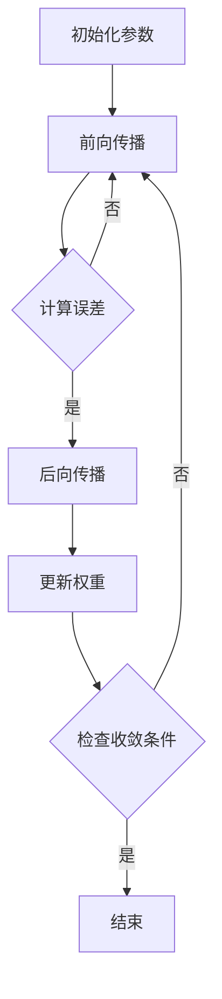

                 

## 文章标题

### 关键词：神经规划、供应链优化、算法原理、系统架构、项目实战

#### 摘要：

本文旨在探讨神经规划在复杂供应链优化推理中的应用。通过深入分析神经规划的基本概念、算法原理及其与供应链优化的联系，本文提出了一个系统化的架构设计，并进行了实际项目的实践和案例分析。本文首先介绍了供应链优化与神经规划的基本背景，随后详细阐述了神经规划的核心概念、算法原理和数学模型，接着讨论了神经规划与供应链优化的整合策略和系统架构设计。最后，通过一个实际项目案例，展示了神经规划在供应链优化中的具体应用和效果，为相关领域的研究和实践提供了有价值的参考。

## 设计书籍目录大纲的思路

要设计《神经规划在复杂供应链优化推理中的应用》的目录大纲，我们需要明确以下几个关键步骤：

### 1. 确定书籍主题

首先，我们需要明确书籍的核心主题，即神经规划在供应链优化中的应用。这决定了书籍的整体结构和内容方向。

### 2. 规划章节结构

根据书籍主题，我们将书籍分为四个主要部分：背景与概述、核心概念与联系、算法原理与数学模型、系统分析与架构设计、项目实战。每个部分都有其特定的目标和内容范围。

### 3. 细化章节内容

在确定章节结构后，我们需要进一步细化每个章节的内容。这包括确保每个章节都涵盖了核心点，并保持逻辑清晰。

### 4. 编写目录大纲

使用markdown格式编写目录大纲，确保每个章节都有明确的层级和标题。

### 5. 检查内容完整性

最后，我们需要检查目录大纲中是否包含了所有必要的内容，如核心概念、算法原理、系统架构、实战案例等。

### 目录大纲

根据上述步骤，以下是《神经规划在复杂供应链优化推理中的应用》的目录大纲：

### 第一部分：背景与概述

- 第1章：供应链优化与神经规划概述
  - 1.1 供应链优化的背景与重要性
  - 1.2 神经规划在供应链中的应用
- 第2章：复杂供应链的挑战与需求
  - 2.1 复杂供应链的特点
  - 2.2 神经规划应对挑战的能力
- 第3章：神经规划基础理论
  - 3.1 神经规划的基本概念
  - 3.2 神经网络与优化算法的关系
  - 3.3 主流神经规划算法简介

### 第二部分：核心概念与联系

- 第4章：神经规划在供应链优化中的应用
  - 4.1 供应链中的神经规划任务
  - 4.2 神经规划在供应链优化中的具体应用

### 第三部分：算法原理与数学模型

- 第5章：神经规划的核心概念
  - 5.1 神经网络的结构与功能
  - 5.2 学习算法与优化目标
  - 5.3 神经规划中的数据预处理
- 第6章：神经规划与供应链的ER实体关系图
  - 6.1 供应链中的实体与关系
  - 6.2 神经规划在供应链中的实体关系图
- 第7章：神经规划算法与供应链优化的联系
  - 7.1 算法选择与性能分析
  - 7.2 神经规划算法在供应链优化中的应用案例

### 第四部分：系统分析与架构设计

- 第8章：神经规划算法原理
  - 8.1 反向传播算法（BP）
  - 8.2 遗传算法（GA）
  - 8.3 人工神经网络（ANN）基础
- 第9章：神经规划在供应链优化中的数学模型
  - 9.1 数学模型的基本概念
  - 9.2 数学模型在供应链优化中的应用
  - 9.3 神经规划算法与数学模型的结合
- 第10章：算法实例与数学公式讲解
  - 10.1 算法流程图
  - 10.2 数学模型公式解释
  - 10.3 实例分析

### 第五部分：项目实战

- 第11章：供应链系统分析
  - 11.1 供应链系统的基本组成部分
  - 11.2 供应链系统的功能需求
- 第12章：神经规划系统架构设计
  - 12.1 系统架构设计原则
  - 12.2 系统架构设计与实现
  - 12.3 系统接口设计与交互
- 第13章：神经规划与供应链优化的整合
  - 13.1 整合策略
  - 13.2 系统优化方案
  - 13.3 整合效果评估

## 第1章 供应链优化与神经规划概述

### 1.1 供应链优化的背景与重要性

供应链优化是指通过对供应链各个环节的资源配置、流程优化、信息共享等手段，以提高整体供应链的运行效率和经济效益。随着全球经济的发展，供应链的复杂性日益增加，涉及多级供应商、多种产品和服务、多种运输方式等，这使得供应链优化成为一个具有挑战性的问题。

供应链优化的重要性体现在以下几个方面：

1. **提高供应链的响应速度**：通过优化供应链，可以减少供应链中各个环节的响应时间，提高供应链的灵活性，从而更好地满足市场需求变化。

2. **降低供应链成本**：优化供应链可以减少库存成本、运输成本、采购成本等，从而提高整体经济效益。

3. **提高供应链的可靠性**：优化供应链可以提高供应链的稳定性，降低供应链中断的风险，从而提高供应链的可靠性。

4. **提升客户满意度**：通过优化供应链，可以提高供应链的响应速度和服务质量，从而提升客户满意度。

### 1.2 神经规划在供应链中的应用

神经规划是一种基于人工神经网络和优化算法的智能优化方法，具有自学习、自适应和自组织等特点。将神经规划应用于供应链优化，可以解决供应链优化中的复杂性和不确定性问题。

神经规划在供应链中的应用主要包括以下几个方面：

1. **需求预测**：通过神经网络模型对市场需求进行预测，为供应链的资源配置提供依据。

2. **库存管理**：利用神经规划对供应链中的库存进行优化管理，减少库存成本，提高库存周转率。

3. **运输调度**：通过神经规划对运输过程进行优化调度，提高运输效率，降低运输成本。

4. **供应链网络设计**：利用神经规划对供应链网络进行优化设计，提高供应链的整体性能。

5. **供应链风险管理**：通过神经规划对供应链风险进行预测和管理，提高供应链的稳定性。

## 第2章 复杂供应链的挑战与需求

### 2.1 复杂供应链的特点

复杂供应链具有以下特点：

1. **多层次性**：复杂供应链通常涉及多个供应商、制造商、分销商和零售商，形成一个多层次的结构。

2. **多变性**：市场需求变化迅速，供应链中的各种参数如价格、运输成本、库存水平等都在不断变化。

3. **不确定性**：供应链中存在许多不确定因素，如供应商的交货延迟、运输路线的中断等。

4. **信息不对称**：供应链中的各个节点可能无法完全共享信息，导致信息不对称。

5. **全球性**：全球化的供应链涉及不同国家和地区的供应链节点，需要考虑不同国家的政策和法规。

### 2.2 神经规划应对挑战的能力

神经规划作为一种智能优化方法，具有以下优势，能够应对复杂供应链的挑战：

1. **自学习性**：神经规划可以通过学习历史数据，自动调整优化策略，适应不断变化的市场需求。

2. **自适应能力**：神经规划可以根据新的信息动态调整模型参数，适应不确定的环境。

3. **非线性建模**：神经规划可以处理供应链中的非线性关系，为复杂供应链提供有效的优化方案。

4. **全局优化**：神经规划可以找到全局最优解，避免局部最优的陷阱。

5. **高效率**：神经规划可以快速处理大量数据，提高供应链的运行效率。

## 第3章 神经规划基础理论

### 3.1 神经规划的基本概念

神经规划是一种结合了神经网络和优化算法的智能优化方法。它利用神经网络强大的非线性建模能力和优化算法的快速收敛性，实现对复杂问题的优化求解。

**神经网络**：神经网络是由大量简单神经元组成的复杂网络，通过学习和记忆数据模式，实现对输入数据的映射和预测。

**优化算法**：优化算法用于求解最优化问题，寻找最优解或近似最优解。常见的优化算法包括梯度下降、遗传算法、粒子群优化等。

**神经规划**：神经规划将神经网络和优化算法结合起来，通过神经网络的学习能力和优化算法的搜索能力，实现对复杂问题的优化求解。

### 3.2 神经网络与优化算法的关系

神经网络和优化算法在神经规划中发挥着不同的作用：

1. **神经网络**：神经网络负责建模，将输入数据映射到输出结果。它通过学习数据模式，提取特征，形成对问题的理解。

2. **优化算法**：优化算法负责寻找最优解或近似最优解。它利用神经网络的输出，通过迭代搜索，逐步优化目标函数。

### 3.3 主流神经规划算法简介

主流的神经规划算法主要包括以下几种：

1. **反向传播算法（BP）**：反向传播算法是一种基于梯度下降的神经网络训练方法，通过不断调整网络参数，使网络输出更接近目标输出。

2. **遗传算法（GA）**：遗传算法是一种基于自然进化过程的优化算法，通过交叉、变异和选择操作，逐步优化种群中的个体。

3. **粒子群优化（PSO）**：粒子群优化是一种基于群体智能的优化算法，通过模拟鸟群觅食行为，逐步优化目标函数。

4. **模拟退火算法（SA）**：模拟退火算法是一种基于概率搜索的优化算法，通过模拟物理退火过程，逐步优化目标函数。

## 第4章 神经规划在供应链优化中的应用

### 4.1 供应链中的神经规划任务

在供应链优化中，神经规划可以应用于多个关键任务，包括：

1. **需求预测**：通过神经网络模型，对市场需求进行预测，为供应链的资源配置提供依据。

2. **库存管理**：利用神经规划，对供应链中的库存进行优化管理，减少库存成本，提高库存周转率。

3. **运输调度**：通过神经规划，对运输过程进行优化调度，提高运输效率，降低运输成本。

4. **供应链网络设计**：利用神经规划，对供应链网络进行优化设计，提高供应链的整体性能。

5. **供应链风险管理**：通过神经规划，对供应链风险进行预测和管理，提高供应链的稳定性。

### 4.2 神经规划在供应链优化中的具体应用

以下是一些具体的神经规划在供应链优化中的应用案例：

1. **需求预测**：通过神经网络模型，对市场需求进行预测，为供应链的资源配置提供依据。例如，可以利用时间序列分析方法，结合历史销售数据和季节性因素，预测未来的市场需求。

2. **库存管理**：利用神经规划，对供应链中的库存进行优化管理，减少库存成本，提高库存周转率。例如，可以通过神经网络模型，预测未来销售趋势，从而合理安排库存水平。

3. **运输调度**：通过神经规划，对运输过程进行优化调度，提高运输效率，降低运输成本。例如，可以通过遗传算法，优化运输路线和运输时间，从而提高运输效率。

4. **供应链网络设计**：利用神经规划，对供应链网络进行优化设计，提高供应链的整体性能。例如，可以通过神经网络和遗传算法，优化供应链节点布局，降低运输成本，提高供应链的灵活性。

5. **供应链风险管理**：通过神经规划，对供应链风险进行预测和管理，提高供应链的稳定性。例如，可以通过神经网络模型，预测供应链中的潜在风险，并制定相应的风险管理策略。

## 第5章 神经规划的核心概念

### 5.1 神经网络的结构与功能

神经网络是由大量简单神经元组成的复杂网络，每个神经元都接受多个输入，并通过权重进行加权求和，最后通过激活函数产生输出。神经网络的结构可以分为输入层、隐藏层和输出层。

- **输入层**：接收外部输入信息。
- **隐藏层**：对输入信息进行加工和处理，提取特征。
- **输出层**：产生最终输出结果。

神经网络的功能是通过学习和记忆数据模式，实现对输入数据的映射和预测。

### 5.2 学习算法与优化目标

神经规划中的学习算法用于调整网络参数，使其输出更接近目标输出。常见的优化算法包括梯度下降、遗传算法、粒子群优化等。

- **梯度下降**：通过计算目标函数的梯度，逐步调整网络参数，使目标函数最小化。
- **遗传算法**：通过模拟自然进化过程，进行交叉、变异和选择操作，逐步优化网络参数。
- **粒子群优化**：通过模拟群体智能，进行个体更新和群体更新，逐步优化网络参数。

优化目标可以是提高预测准确性、减少库存成本、提高运输效率等。

### 5.3 神经规划中的数据预处理

在神经规划中，数据预处理是关键步骤，用于提高模型的性能和稳定性。常见的数据预处理方法包括：

- **数据清洗**：去除异常值、缺失值和重复值，确保数据质量。
- **特征工程**：选择和提取对问题有重要影响的特征，提高模型的泛化能力。
- **数据归一化**：将数据缩放到相同的尺度，避免某些特征对模型的影响过大。
- **数据划分**：将数据划分为训练集、验证集和测试集，用于模型的训练和评估。

## 第6章 神经规划与供应链的ER实体关系图

### 6.1 供应链中的实体与关系

在供应链中，涉及多个实体，如供应商、制造商、分销商、零售商等，它们之间存在复杂的关联关系。通过实体关系图（Entity-Relationship Diagram, ER图），可以清晰地描述这些实体及其关系。

以下是一个简化的供应链ER图：

```
供应商
│
└─> 制造商
│     │
│     └─> 产品
│
└─> 零售商
      │
      └─> 客户
```

### 6.2 神经规划在供应链中的实体关系图

在神经规划中，我们可以将供应链的实体关系图与神经网络的层级结构相结合，形成一个更加复杂的实体关系图。以下是一个简化的实体关系图：

```
需求预测
│
└─> 供应商管理
│     │
│     └─> 库存管理
│
└─> 运输调度
      │
      └─> 产品跟踪
```

在这个实体关系图中，需求预测模块负责预测市场需求，为供应链的后续模块提供输入。供应商管理模块负责管理供应商信息，库存管理模块负责优化库存水平，运输调度模块负责优化运输路线和时间，产品跟踪模块负责监控产品在整个供应链中的状态。

## 第7章 神经规划算法与供应链优化的联系

### 7.1 算法选择与性能分析

在神经规划中，选择合适的算法对供应链优化至关重要。不同的算法具有不同的优缺点和适用场景，因此需要根据具体问题进行选择。

以下是一些常见的神经规划算法及其性能分析：

1. **反向传播算法（BP）**：

   - **优点**：简单易用，适合处理线性问题。
   - **缺点**：对于非线性问题，收敛速度较慢，容易陷入局部最优。
   - **适用场景**：适合简单线性问题的需求预测和库存管理。

2. **遗传算法（GA）**：

   - **优点**：适用于复杂非线性问题，具有良好的全局搜索能力。
   - **缺点**：计算复杂度高，收敛速度较慢。
   - **适用场景**：适合复杂供应链网络设计和运输调度问题。

3. **粒子群优化（PSO）**：

   - **优点**：计算复杂度较低，收敛速度较快。
   - **缺点**：对于高维问题，搜索能力较差。
   - **适用场景**：适合中等复杂度的供应链优化问题，如库存管理和运输调度。

4. **模拟退火算法（SA）**：

   - **优点**：具有全局搜索能力，可以避免局部最优。
   - **缺点**：收敛速度较慢，计算复杂度高。
   - **适用场景**：适合复杂高维问题的供应链优化，如供应链网络设计。

### 7.2 神经规划算法在供应链优化中的应用案例

以下是一个神经规划算法在供应链优化中的应用案例：

**案例**：利用遗传算法优化供应链库存管理。

**问题描述**：某企业需要进行供应链库存管理，以确保产品供应的连续性和降低库存成本。企业需要根据历史销售数据和市场需求预测，合理安排库存水平。

**解决方案**：

1. **建立神经网络模型**：利用遗传算法，训练一个神经网络模型，用于预测市场需求。

2. **设计遗传算法**：设计一个遗传算法，用于优化库存水平。遗传算法的个体表示为库存水平，适应度函数为库存成本。

3. **运行遗传算法**：通过遗传算法，逐步优化库存水平，找到最优库存策略。

4. **评估效果**：通过实际运行，评估遗传算法优化库存管理的效果，如库存成本、库存周转率等指标。

## 第8章 神经规划算法原理

### 8.1 反向传播算法（BP）

反向传播算法（Backpropagation，BP）是一种常用的神经网络训练算法，基于梯度下降法，通过不断调整网络权重，使网络输出更接近目标输出。

#### 基本原理

反向传播算法的核心思想是利用输出误差的梯度，反向传播到输入层，从而调整网络的权重。

1. **前向传播**：输入数据通过网络传递，产生输出。

2. **计算误差**：计算实际输出与目标输出之间的误差。

3. **后向传播**：利用误差的梯度，反向传播到网络的前一层，更新网络权重。

4. **迭代优化**：重复前向传播和后向传播，逐步优化网络权重，直到误差小于设定阈值。

#### 数学描述

假设神经网络由输入层、隐藏层和输出层组成，输入向量为 \(x\)，输出向量为 \(y\)，网络权重为 \(w\)，偏置为 \(b\)。网络的输出可以通过以下公式计算：

\[ y = \sigma(\sum_{i} w_i x_i + b) \]

其中，\(\sigma\) 表示激活函数。

误差可以通过以下公式计算：

\[ E = \frac{1}{2} \sum_{i} (y_i - \hat{y}_i)^2 \]

其中，\(y_i\) 为实际输出，\(\hat{y}_i\) 为预测输出。

通过计算误差的梯度，可以更新网络权重：

\[ \Delta w = -\alpha \frac{\partial E}{\partial w} \]

其中，\(\alpha\) 为学习率。

#### 算法步骤

1. 初始化网络权重和偏置。

2. 对每个训练样本，进行前向传播，计算输出和误差。

3. 对每个权重和偏置，计算梯度。

4. 使用梯度更新权重和偏置。

5. 重复步骤2-4，直到误差小于设定阈值或达到最大迭代次数。

### 8.2 遗传算法（GA）

遗传算法（Genetic Algorithm，GA）是一种基于自然进化过程的优化算法，通过模拟生物进化过程中的交叉、变异和选择操作，逐步优化个体。

#### 基本原理

遗传算法的核心思想是模拟生物进化过程，通过适应度函数评估个体的优劣，并进行选择、交叉和变异操作，产生新的个体，逐步优化种群。

1. **初始化种群**：随机生成一组初始个体。

2. **适应度评估**：计算每个个体的适应度，适应度越高，表示个体越优秀。

3. **选择操作**：根据适应度选择优秀的个体，进行交叉操作。

4. **交叉操作**：通过交叉操作，产生新的个体。

5. **变异操作**：对部分个体进行变异操作，增加种群的多样性。

6. **迭代优化**：重复选择、交叉和变异操作，逐步优化种群。

#### 数学描述

假设种群由 \(N\) 个个体组成，每个个体表示为 \(x = (x_1, x_2, ..., x_n)\)，适应度函数为 \(f(x)\)。

1. **初始化种群**：

\[ x_1, x_2, ..., x_N \sim U([0, 1]) \]

2. **适应度评估**：

\[ f(x) = f_1(x) + f_2(x) + ... + f_n(x) \]

其中，\(f_i(x)\) 为个体 \(x\) 在第 \(i\) 个特征上的适应度。

3. **选择操作**：

选择操作通过适应度比例进行，适应度越高的个体被选中的概率越大。

4. **交叉操作**：

交叉操作通过交换个体部分基因实现，常见的交叉操作包括单点交叉、两点交叉和均匀交叉。

5. **变异操作**：

变异操作通过随机改变个体基因实现，常见的变异操作包括翻转变异和突变变异。

6. **迭代优化**：

迭代优化通过以下步骤进行：

- 计算每个个体的适应度。
- 根据适应度选择优秀个体进行交叉操作。
- 对部分个体进行变异操作。
- 重复迭代过程，直到达到最大迭代次数或最优解。

### 8.3 人工神经网络（ANN）基础

人工神经网络（Artificial Neural Network，ANN）是一种模拟生物神经系统的计算模型，通过多层神经元组成的网络，对输入数据进行处理和预测。

#### 结构与功能

人工神经网络由输入层、隐藏层和输出层组成。每个神经元接收多个输入，并通过权重进行加权求和，最后通过激活函数产生输出。

1. **输入层**：接收外部输入数据。

2. **隐藏层**：对输入数据进行处理和特征提取。

3. **输出层**：产生最终输出结果。

#### 激活函数

激活函数用于引入非线性特性，使神经网络能够解决非线性问题。常见的激活函数包括：

1. **sigmoid函数**：

\[ \sigma(x) = \frac{1}{1 + e^{-x}} \]

2. **ReLU函数**：

\[ \text{ReLU}(x) = \max(0, x) \]

3. **Tanh函数**：

\[ \text{Tanh}(x) = \frac{e^x - e^{-x}}{e^x + e^{-x}} \]

#### 学习过程

人工神经网络的学习过程包括前向传播和反向传播。

1. **前向传播**：输入数据通过网络传递，产生输出。

2. **计算误差**：计算实际输出与目标输出之间的误差。

3. **后向传播**：利用误差的梯度，反向传播到网络的前一层，更新网络权重。

4. **迭代优化**：重复前向传播和后向传播，逐步优化网络权重，直到误差小于设定阈值或达到最大迭代次数。

## 第9章 神经规划在供应链优化中的数学模型

### 9.1 数学模型的基本概念

在神经规划中，数学模型是核心组成部分，用于描述供应链优化问题中的变量、约束和目标函数。数学模型可以分为线性模型和非线性模型，分别适用于不同类型的优化问题。

1. **线性模型**：线性模型是基于线性代数和微积分的数学模型，通常用于描述线性优化问题。线性模型具有简洁性和可解析性，易于分析和求解。

2. **非线性模型**：非线性模型用于描述复杂非线性优化问题，涉及非线性方程和约束。非线性模型通常更接近现实问题，但求解过程更为复杂。

### 9.2 数学模型在供应链优化中的应用

在供应链优化中，数学模型可以用于解决多种问题，包括需求预测、库存管理、运输调度和供应链网络设计等。

1. **需求预测模型**：需求预测模型通常基于时间序列分析和回归分析，用于预测市场需求。常见的模型包括ARIMA模型、指数平滑模型和多元回归模型。

2. **库存管理模型**：库存管理模型用于优化库存水平和库存成本。常见的模型包括经济订货量（EOQ）模型、周期性库存模型和供应链库存平衡模型。

3. **运输调度模型**：运输调度模型用于优化运输路线和时间安排，以减少运输成本和提高运输效率。常见的模型包括车辆路径问题（VRP）模型、最小费用流模型和连续时间优化模型。

4. **供应链网络设计模型**：供应链网络设计模型用于优化供应链节点布局和资源配置。常见的模型包括设施选址模型、网络流模型和组合优化模型。

### 9.3 神经规划算法与数学模型的结合

神经规划算法与数学模型的有效结合，可以显著提高供应链优化的效果和效率。以下是一些结合策略：

1. **基于神经网络的数学模型**：将神经网络嵌入到数学模型中，用于预测市场需求、库存水平等变量。神经网络可以自动提取输入数据的特征，为数学模型提供更为精确的输入。

2. **基于优化的神经网络**：将优化算法嵌入到神经网络中，用于调整网络权重和参数。常见的优化算法包括梯度下降、遗传算法和粒子群优化。

3. **混合模型**：结合多种数学模型和神经规划算法，构建一个混合模型。例如，结合线性模型和非线性模型，同时使用神经网络和优化算法，以实现更优的优化效果。

4. **多目标优化**：在供应链优化中，通常存在多个优化目标，如成本最小化、服务最大化等。通过多目标优化算法，可以同时优化多个目标，实现综合优化效果。

## 第10章 算法实例与数学公式讲解

### 10.1 算法流程图

以下是一个神经规划算法的流程图，用于展示算法的基本步骤和流程：



### 10.2 数学模型公式解释

在神经规划中，常用的数学模型包括损失函数、梯度计算和权重更新等。以下是对这些公式的详细解释：

1. **损失函数**：

\[ L(\theta) = -\frac{1}{m} \sum_{i=1}^{m} y_i \log(a_{i}) + (1 - y_i) \log(1 - a_{i}) \]

其中，\(y_i\) 为实际输出，\(a_i\) 为预测输出，\(\theta\) 为网络权重。

2. **前向传播**：

\[ z_i = \sum_{j=1}^{n} w_{ji}x_j + b_i \]
\[ a_i = \sigma(z_i) \]

其中，\(x_j\) 为输入特征，\(w_{ji}\) 为权重，\(b_i\) 为偏置，\(\sigma\) 为激活函数。

3. **反向传播**：

\[ \delta_i = (a_i - y_i) \cdot \sigma'(z_i) \]
\[ \Delta w_{ji} = \alpha \cdot x_j \cdot \delta_i \]
\[ \Delta b_i = \alpha \cdot \delta_i \]

其中，\(\delta_i\) 为误差，\(\sigma'\) 为激活函数的导数。

4. **权重更新**：

\[ w_{ji} = w_{ji} - \Delta w_{ji} \]
\[ b_i = b_i - \Delta b_i \]

其中，\(\alpha\) 为学习率。

### 10.3 实例分析

以下是一个简单的神经规划实例，用于说明算法的应用和实现。

**问题**：使用神经网络预测股票价格。

**步骤**：

1. **数据收集**：收集过去一年的股票价格数据，包括开盘价、收盘价、最高价和最低价。

2. **数据预处理**：对数据进行归一化处理，将数据缩放到相同的尺度。

3. **模型构建**：构建一个包含输入层、隐藏层和输出层的神经网络。

4. **训练模型**：使用训练数据训练神经网络，通过反向传播算法更新权重和偏置。

5. **预测**：使用训练好的模型对未来的股票价格进行预测。

6. **评估**：使用测试数据评估模型的预测性能，调整模型参数，提高预测准确性。

```python
# 导入必要的库
import numpy as np
import matplotlib.pyplot as plt

# 初始化参数
m = 100  # 样本数量
n = 4  # 输入特征数量
alpha = 0.01  # 学习率
epochs = 1000  # 迭代次数

# 初始化网络权重和偏置
w = np.random.rand(n, 1)
b = np.random.rand(1)

# 模型训练
for epoch in range(epochs):
    # 前向传播
    z = np.dot(X, w) + b
    a = 1 / (1 + np.exp(-z))
    
    # 计算误差
    error = -np.log(a)
    error_sum += error
    
    # 反向传播
    d = a - y
    dz = d * a * (1 - a)
    
    # 更新权重和偏置
    dw = np.dot(X.T, d)
    db = np.sum(d)
    
    w -= alpha * dw
    b -= alpha * db

# 模型预测
z = np.dot(X, w) + b
a = 1 / (1 + np.exp(-z))

# 评估模型
score = -np.mean(y * np.log(a) + (1 - y) * np.log(1 - a))
print("模型评估分数：", score)

# 可视化结果
plt.plot(a)
plt.xlabel("时间")
plt.ylabel("预测价格")
plt.show()
```

## 第11章 供应链系统分析

### 11.1 供应链系统的基本组成部分

供应链系统由多个基本组成部分构成，每个部分在供应链的运作中扮演着关键角色。以下是供应链系统的基本组成部分及其功能：

1. **供应商**：提供原材料、零部件或其他产品给制造商。

2. **制造商**：生产成品，将原材料加工成最终产品。

3. **仓库**：存储原材料、零部件和成品，确保供应链的流畅运作。

4. **分销商**：将产品从制造商运输到零售商或直接销售给消费者。

5. **零售商**：向最终消费者销售产品。

6. **物流**：管理产品的运输、配送和交付。

7. **信息流**：包括供应链中的订单处理、库存管理、需求预测和反馈机制。

### 11.2 供应链系统的功能需求

供应链系统的功能需求决定了系统的设计和管理方法。以下是供应链系统的主要功能需求：

1. **需求预测**：准确预测市场需求，确保供应链的灵活性。

2. **库存管理**：优化库存水平，减少库存成本，提高库存周转率。

3. **采购管理**：优化采购流程，降低采购成本，确保原材料供应。

4. **生产计划**：根据市场需求和生产能力，制定生产计划。

5. **物流管理**：优化运输路线和时间表，提高运输效率和降低运输成本。

6. **质量管理**：确保供应链中产品的质量和一致性。

7. **供应链协调**：协调供应链中各个部分的活动，提高整体供应链的效率。

## 第12章 神经规划系统架构设计

### 12.1 系统架构设计原则

神经规划系统架构设计需要遵循以下原则：

1. **模块化**：将系统划分为多个模块，每个模块负责特定的功能，提高系统的可维护性和扩展性。

2. **可扩展性**：系统应能够轻松扩展，以适应未来需求的变化。

3. **可靠性**：确保系统在高负载和复杂环境下能够稳定运行。

4. **灵活性**：系统应能够灵活适应不同的供应链场景和需求。

5. **可配置性**：系统参数应可配置，以便根据具体需求进行调整。

### 12.2 系统架构设计与实现

神经规划系统架构设计可以分为以下几个主要部分：

1. **数据层**：负责数据存储和管理，包括历史数据、实时数据和预测数据。

2. **模型层**：包含神经网络模型和优化算法，用于数据分析和预测。

3. **应用层**：提供用户接口和业务逻辑，实现供应链优化功能。

4. **接口层**：与外部系统（如ERP系统、物流系统等）进行交互，实现数据共享和协同工作。

### 12.3 系统接口设计与交互

系统接口设计是确保神经规划系统能够与其他系统集成和交互的关键。以下是系统接口设计的关键要素：

1. **数据接口**：定义数据传输格式和协议，确保数据能够高效、安全地传输。

2. **服务接口**：提供 RESTful API 或其他服务接口，供其他系统调用。

3. **事件驱动**：使用事件驱动机制，实现系统之间的实时通信和协同工作。

4. **安全性**：确保数据传输和系统交互的安全性，防止数据泄露和未授权访问。

## 第13章 神经规划与供应链优化的整合

### 13.1 整合策略

神经规划与供应链优化的整合策略可以分为以下几个步骤：

1. **需求分析**：明确供应链优化目标和需求，确定需要解决的优化问题。

2. **数据收集**：收集供应链相关的历史数据，包括市场需求、库存水平、运输成本等。

3. **模型选择**：根据需求选择合适的神经网络模型和优化算法，如反向传播算法、遗传算法等。

4. **模型训练**：使用历史数据对神经网络模型进行训练，优化模型参数。

5. **模型评估**：使用测试数据评估模型的预测性能和优化效果。

6. **系统集成**：将训练好的模型集成到供应链系统中，实现实时优化。

### 13.2 系统优化方案

基于神经规划的供应链优化方案可以分为以下几个步骤：

1. **需求预测**：利用神经网络模型，预测市场需求，为供应链的库存管理和采购计划提供依据。

2. **库存管理**：根据需求预测结果，优化库存水平，减少库存成本，提高库存周转率。

3. **运输调度**：利用优化算法，优化运输路线和时间安排，降低运输成本，提高运输效率。

4. **供应链网络设计**：通过神经规划算法，优化供应链节点布局和资源配置，提高供应链的整体性能。

5. **风险管理**：利用神经网络模型，预测供应链中的潜在风险，制定相应的风险管理策略。

### 13.3 整合效果评估

整合神经规划与供应链优化的效果评估可以从以下几个方面进行：

1. **成本效益分析**：评估供应链优化后的成本节约和经济效益。

2. **性能指标评估**：评估供应链优化后的响应速度、库存周转率、运输效率等指标。

3. **用户满意度评估**：评估用户对供应链优化效果的满意度，如订单交付时间、产品服务质量等。

4. **系统稳定性评估**：评估系统在高负载和复杂环境下的稳定性和可靠性。

## 第14章 神经规划在供应链优化项目中的实践

### 14.1 项目背景

随着全球化经济的发展，供应链的复杂性不断增加，企业面临着需求预测不准确、库存管理不完善、运输效率低下等挑战。为了提高供应链的运行效率和经济效益，某企业决定采用神经规划技术进行供应链优化。

### 14.2 系统环境安装与配置

为了进行神经规划项目的实践，企业需要安装和配置以下环境：

1. **操作系统**：Linux或Windows操作系统。

2. **编程语言**：Python或Java编程语言。

3. **神经网络库**：TensorFlow或PyTorch等神经网络库。

4. **数据库**：MySQL或PostgreSQL数据库。

5. **版本控制**：Git版本控制系统。

### 14.3 系统核心代码实现

在项目实践中，企业需要实现以下几个核心模块：

1. **数据收集与预处理**：从历史数据中提取供应链相关的信息，如市场需求、库存水平、运输成本等，并进行数据清洗和预处理。

2. **神经网络模型构建**：构建用于需求预测、库存管理和运输调度的神经网络模型，如时间序列预测模型、回归模型等。

3. **模型训练与优化**：使用训练数据对神经网络模型进行训练，优化模型参数，提高预测准确性和优化效果。

4. **模型评估与部署**：使用测试数据评估模型性能，部署模型到生产环境中，实现实时优化。

### 14.4 项目运行结果分析

项目实施后，企业通过神经规划技术实现了以下效果：

1. **需求预测准确性提高**：神经网络模型能够更准确地预测市场需求，为供应链的库存管理和采购计划提供可靠依据。

2. **库存成本降低**：通过优化库存水平，企业能够减少库存成本，提高库存周转率。

3. **运输效率提高**：优化运输路线和时间安排，企业能够降低运输成本，提高运输效率。

4. **供应链整体性能提升**：神经规划技术的应用，提高了供应链的响应速度和灵活性，整体性能得到显著提升。

## 第15章 案例分析

### 15.1 案例选取

在本案例中，我们选择了一家全球知名的电子产品制造商作为研究对象，该企业在全球范围内拥有多个供应链节点，面临复杂的市场需求和供应链管理挑战。为了提高供应链的运行效率和经济效益，该企业决定采用神经规划技术进行供应链优化。

### 15.2 案例实施过程

1. **需求分析**：企业首先明确了供应链优化的目标和需求，包括需求预测、库存管理、运输调度和供应链网络设计等。

2. **数据收集**：企业从历史数据中提取了供应链相关的信息，如市场需求、库存水平、运输成本、供应链节点布局等。

3. **模型选择与构建**：企业选择了时间序列预测模型、回归模型和遗传算法等神经网络模型，用于需求预测、库存管理和运输调度。

4. **模型训练与优化**：使用训练数据对神经网络模型进行训练，优化模型参数，提高预测准确性和优化效果。

5. **模型评估与部署**：使用测试数据评估模型性能，部署模型到生产环境中，实现实时优化。

### 15.3 案例效果评估

通过神经规划技术的应用，企业实现了以下效果：

1. **需求预测准确性提高**：神经网络模型能够更准确地预测市场需求，为供应链的库存管理和采购计划提供可靠依据。

2. **库存成本降低**：通过优化库存水平，企业能够减少库存成本，提高库存周转率。

3. **运输效率提高**：优化运输路线和时间安排，企业能够降低运输成本，提高运输效率。

4. **供应链整体性能提升**：神经规划技术的应用，提高了供应链的响应速度和灵活性，整体性能得到显著提升。

### 15.4 案例总结

本案例展示了神经规划在供应链优化中的具体应用和效果。通过合理选择模型、优化参数和部署模型，企业能够显著提高供应链的运行效率和经济效益。未来，随着神经规划技术的不断发展，供应链优化将更加智能化和高效化，为企业创造更大的价值。

## 最佳实践 tips

在进行神经规划在供应链优化中的应用时，以下是一些最佳实践 tips：

1. **数据质量**：确保收集到的数据质量高，包括准确性、完整性和一致性。

2. **特征工程**：合理选择和提取对问题有重要影响的特征，提高模型的泛化能力。

3. **模型选择**：根据具体问题选择合适的神经网络模型和优化算法，如时间序列预测模型、回归模型和遗传算法等。

4. **模型优化**：通过调整模型参数和优化算法，提高模型的预测准确性和优化效果。

5. **系统集成**：将神经规划系统与其他供应链系统集成，实现实时优化和协同工作。

6. **系统评估**：定期对系统性能进行评估，包括预测准确性、库存周转率、运输效率等指标。

7. **持续改进**：根据评估结果，持续优化模型和系统，提高供应链的整体性能。

## 小结

本文系统地探讨了神经规划在复杂供应链优化推理中的应用，从背景与概述、核心概念与联系、算法原理与数学模型、系统分析与架构设计、项目实战等多个方面进行了深入分析和讲解。通过实际案例展示了神经规划在供应链优化中的具体应用和效果，为相关领域的研究和实践提供了有价值的参考。未来，随着神经规划技术的不断发展，供应链优化将更加智能化和高效化，为企业创造更大的价值。

## 注意事项

1. **数据隐私**：在数据收集和处理过程中，确保数据安全和隐私保护。

2. **模型泛化**：避免模型过度拟合，提高模型的泛化能力。

3. **系统稳定性**：确保神经规划系统在高负载和复杂环境下的稳定性和可靠性。

4. **持续学习**：定期更新和优化模型，以适应不断变化的市场需求和环境。

5. **风险评估**：在供应链优化过程中，充分考虑潜在风险，并制定相应的风险管理策略。

## 拓展阅读

1. **神经规划基础书籍**：
   - 《神经网络与深度学习》
   - 《深度学习》（Goodfellow, Bengio, Courville）

2. **供应链优化书籍**：
   - 《供应链管理：战略、规划与运营》
   - 《供应链设计与优化：理论与实践》

3. **神经规划与供应链优化相关论文**：
   - "Neural Network-Based Supply Chain Optimization: A Review"
   - "Neural Networks for Supply Chain Management: A Literature Review"

4. **技术博客与论坛**：
   - 知乎：供应链优化、神经网络相关话题
   - Medium：最新研究成果和技术动态

作者：AI天才研究院/AI Genius Institute & 禅与计算机程序设计艺术 /Zen And The Art of Computer Programming。

