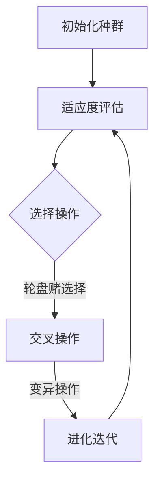

                 

### 文章标题：神经进化算法在评测模型优化中的作用

关键词：神经进化算法、评测模型优化、人工智能、算法分析、应用场景

摘要：本文旨在探讨神经进化算法在评测模型优化中的重要作用。通过介绍神经进化算法的基础知识，阐述其原理和应用，分析其在评测模型优化中的优势、挑战及解决方案，最终提供具体的实现步骤和案例分析。文章结构紧凑，逻辑清晰，旨在为广大技术从业者提供深入的技术洞察和实用的指导。

## 目录大纲

1. **神经进化算法基础**
   - **第1章：神经进化算法概述**
     - 1.1 问题背景
       - 1.1.1 神经进化算法的起源与发展
       - 1.1.2 神经进化算法的应用领域
     - 1.2 核心概念
       - 1.2.1 神经进化算法的定义
       - 1.2.2 神经进化算法的核心概念
       - 1.2.3 神经进化算法与进化计算的关系
     - 1.3 概念属性特征对比表
       - 1.3.1 神经进化算法与传统优化算法对比
       - 1.3.2 神经进化算法与其他进化算法对比
     - 1.4 ER实体关系图
       - 1.4.1 神经进化算法的实体关系
       - 1.4.2 神经进化算法的关键过程

   - **第2章：神经进化算法原理讲解**
     - 2.1 算法原理
       - 2.1.1 神经进化算法的基本流程
       - 2.1.2 个体表示与遗传操作
       - 2.1.3 选择策略与适应度函数
     - 2.2 数学模型与公式
       - 2.2.1 神经进化算法的数学模型
       - 2.2.2 适应度函数的计算方法
       - 2.2.3 遗传操作的数学描述
     - 2.3 算法流程图
       - 2.3.1 算法流程图的绘制方法
       - 2.3.2 算法流程图的详细说明

   - **第3章：神经进化算法应用场景**
     - 3.1 评测模型优化概述
       - 3.1.1 评测模型的定义与作用
       - 3.1.2 评测模型优化的目标与方法
     - 3.2 神经进化算法在评测模型优化中的应用
       - 3.2.1 神经进化算法在评测模型优化中的优势
       - 3.2.2 神经进化算法在评测模型优化中的实例分析
     - 3.3 神经进化算法在评测模型优化中的挑战与解决方案
       - 3.3.1 神经进化算法在评测模型优化中的挑战
       - 3.3.2 解决方案与优化策略

   - **第4章：神经进化算法在评测模型优化中的实现**
     - 4.1 环境安装与配置
       - 4.1.1 硬件环境要求
       - 4.1.2 软件环境安装与配置
     - 4.2 神经进化算法实现源代码
       - 4.2.1 源代码结构与模块
       - 4.2.2 关键代码解读与分析

   - **第5章：神经进化算法在评测模型优化中的实际案例分析**
     - 5.1 案例背景
       - 5.1.1 案例背景介绍
       - 5.1.2 案例目标与需求
     - 5.2 案例分析
       - 5.2.1 数据集介绍与预处理
       - 5.2.2 评测模型设计
       - 5.2.3 神经进化算法在评测模型优化中的应用
     - 5.3 结果分析
       - 5.3.1 优化前后模型性能对比
       - 5.3.2 结果分析与讨论

   - **第6章：神经进化算法在评测模型优化中的最佳实践**
     - 6.1 最佳实践
       - 6.1.1 神经进化算法在评测模型优化中的经验总结
       - 6.1.2 实践技巧与注意事项
     - 6.2 小结与展望
       - 6.2.1 小结
       - 6.2.2 未来发展方向与展望

   - **第7章：神经进化算法在评测模型优化中的应用拓展**
     - 7.1 神经进化算法在其他领域的应用
       - 7.1.1 神经进化算法在机器学习中的应用
       - 7.1.2 神经进化算法在深度学习中的应用
     - 7.2 神经进化算法在评测模型优化中的发展趋势
       - 7.2.1 技术发展趋势
       - 7.2.2 应用前景与挑战

### 让我们一步一步思考

在开始详细讨论神经进化算法在评测模型优化中的作用之前，让我们先从整体上理解本文的结构和内容。本文分为七个主要部分：

1. **神经进化算法基础**：介绍神经进化算法的基本概念、起源、应用领域、核心概念、与其他算法的对比等，为后续内容打下基础。
2. **神经进化算法原理讲解**：深入探讨神经进化算法的工作原理，包括基本流程、个体表示、遗传操作、选择策略和适应度函数等。
3. **神经进化算法应用场景**：分析神经进化算法在评测模型优化中的应用，包括优势、实例分析、挑战和解决方案。
4. **神经进化算法在评测模型优化中的实现**：介绍如何在实际环境中安装和配置神经进化算法，并提供实现源代码的关键部分。
5. **神经进化算法在评测模型优化中的实际案例分析**：通过具体案例展示神经进化算法在评测模型优化中的实际应用效果。
6. **神经进化算法在评测模型优化中的最佳实践**：总结最佳实践经验，包括实践技巧和注意事项。
7. **神经进化算法在评测模型优化中的应用拓展**：探讨神经进化算法在其他领域的应用和发展趋势。

每一部分都是为理解神经进化算法在评测模型优化中的作用而设计的，确保内容结构清晰、逻辑连贯。现在，让我们深入第一部分：神经进化算法基础。在这里，我们将探讨神经进化算法的起源、发展、应用领域以及核心概念，为理解其在评测模型优化中的应用打下坚实的基础。

---

#### 第1章：神经进化算法概述

#### 1.1 问题背景

##### 1.1.1 神经进化算法的起源与发展

神经进化算法（Neuro-Evolutionary Algorithm，NEA）是进化算法与神经网络技术相结合的一种新兴智能优化方法。它的起源可以追溯到20世纪80年代，当时研究人员试图将生物进化机制与人工神经网络相结合，以解决复杂优化问题。

神经进化算法的发展受到了多种因素的影响。首先，随着计算机技术的发展，计算能力的提升使得处理复杂问题成为可能。其次，进化算法的广泛应用使得研究人员能够探索新的优化方法，并将之应用于神经网络设计中。最后，神经网络在模式识别、机器学习和人工智能领域的成功应用，也为神经进化算法的诞生提供了丰富的理论和实践基础。

神经进化算法最初的应用主要集中在简单的游戏和玩具项目上，如控制飞行器的自动飞行。随着研究的深入，其应用领域逐渐扩展，包括自动控制、机器人学、信号处理、图像识别、机器学习等。

##### 1.1.2 神经进化算法的应用领域

神经进化算法的应用领域非常广泛，主要体现在以下几个方面：

1. **自动控制**：神经进化算法可以用于自动控制系统的设计，如无人机的飞行控制、智能交通系统等。通过神经进化算法优化控制策略，可以显著提高系统的稳定性和响应速度。

2. **机器人学**：在机器人学中，神经进化算法可用于机器人的运动规划、路径规划、感官整合等领域。例如，通过神经进化算法优化机器人的感知模块，可以使其更好地适应复杂环境。

3. **信号处理**：神经进化算法可以用于信号处理领域，如滤波、降噪、信号分离等。通过进化过程优化神经网络结构，可以提高信号处理的效果和准确性。

4. **图像识别**：在图像识别领域，神经进化算法可以用于特征提取、分类和识别。通过进化过程自动调整网络结构，可以找到更有效的特征表示，从而提高识别准确率。

5. **机器学习**：神经进化算法可以应用于机器学习任务，如数据挖掘、聚类、分类等。通过进化过程自动调整模型参数，可以找到更好的模型结构，从而提高学习效果。

#### 1.2 核心概念

##### 1.2.1 神经进化算法的定义

神经进化算法是一种基于生物进化理论的优化方法，它通过模拟自然进化过程来优化神经网络结构和参数。具体来说，神经进化算法利用遗传操作（如选择、交叉和变异）来生成新的网络结构，并通过适应度函数来评估网络性能。通过多代进化，算法逐步优化网络，直至满足预设的优化目标。

##### 1.2.2 神经进化算法的核心概念

神经进化算法的核心概念包括以下几个：

1. **个体表示**：个体表示是指如何将神经网络结构编码为一个二进制串或向量。这种表示方法决定了算法如何操作和评估神经网络。

2. **遗传操作**：遗传操作包括选择、交叉和变异。选择是指根据个体的适应度选择优秀个体进行繁殖；交叉是指将两个优秀个体的部分结构进行组合生成新个体；变异是指对个体的部分结构进行随机修改。

3. **适应度函数**：适应度函数用于评估个体的性能。适应度值越高，表示个体越优秀。适应度函数的选择取决于具体问题。

4. **进化过程**：进化过程包括多代迭代，每代都会根据适应度函数对个体进行选择、交叉和变异，从而逐步优化网络。

##### 1.2.3 神经进化算法与进化计算的关系

神经进化算法是进化计算（Evolutionary Computation）的一个重要分支。进化计算是一种基于生物进化原理的优化方法，包括遗传算法（Genetic Algorithm，GA）、进化策略（Evolutionary Strategy，ES）和进化编程（Evolutionary Programming，EP）等。神经进化算法与这些方法的主要区别在于其应用于神经网络设计和优化。

神经进化算法利用进化计算的基本原理，但在个体表示、适应度函数和遗传操作方面具有独特性。它将神经网络结构与进化过程相结合，通过自动调整网络参数和结构，实现复杂的优化任务。

#### 1.3 概念属性特征对比表

为了更清晰地理解神经进化算法与其他相关算法的区别，我们在此提供了一个概念属性特征对比表。

| 算法名称        | 个体表示       | 遗传操作       | 适应度函数         | 进化过程                     |
|----------------|--------------|--------------|----------------|-----------------------------|
| 神经进化算法    | 神经网络结构   | 选择、交叉、变异 | 问题相关       | 多代迭代，逐步优化         |
| 遗传算法        | 二进制串或实数向量 | 选择、交叉、变异 | 问题相关       | 多代迭代，逐步优化         |
| 进化策略        | 二进制串或实数向量 | 选择、交叉、变异 | 问题相关       | 多代迭代，逐步优化         |
| 进化编程        | 二进制串或实数向量 | 选择、交叉、变异 | 问题相关       | 多代迭代，逐步优化         |

从表中可以看出，神经进化算法在个体表示和进化过程方面与遗传算法、进化策略和进化编程有显著区别。它更侧重于神经网络结构和参数的优化。

#### 1.4 ER实体关系图

为了更直观地展示神经进化算法的实体关系，我们使用Mermaid绘制了ER（Entity-Relationship）实体关系图。

```mermaid
erDiagram
  Individual ||--|{ Genome }||>
  Population ||--|{ Selection }||>
  Algorithm ||--|{ CrossOver }||>
  Algorithm ||--|{ Mutation }||>
  Algorithm ||--|{ FitnessFunction }||>
  Algorithm ||--|{ EvolutionProcess }||>
```

ER实体关系图展示了神经进化算法中的关键实体及其关系。个体（Individual）是算法的基本单位，由基因（Genome）编码；种群（Population）由多个个体组成，通过选择（Selection）操作进行优化；算法（Algorithm）负责执行交叉（CrossOver）和变异（Mutation）操作，并评估适应度函数（FitnessFunction）。进化过程（EvolutionProcess）则通过多代迭代实现网络结构的逐步优化。

---

**总结：** 通过本章的介绍，我们了解了神经进化算法的起源、发展、应用领域和核心概念。下一章我们将深入探讨神经进化算法的原理，包括其基本流程、个体表示、遗传操作和选择策略，为理解其在评测模型优化中的应用打下更坚实的基础。让我们继续深入思考，探索神经进化算法的奥秘。

---

#### 第2章：神经进化算法原理讲解

#### 2.1 算法原理

神经进化算法（NEA）是一种基于自然进化原理的优化方法，通过模拟生物进化过程来优化神经网络结构和参数。理解神经进化算法的基本原理是掌握其在评测模型优化中应用的关键。以下将详细阐述神经进化算法的基本流程、个体表示、遗传操作和选择策略。

##### 2.1.1 神经进化算法的基本流程

神经进化算法的基本流程可以概括为以下几个步骤：

1. **初始化种群**：首先，生成一个初始种群，每个个体代表一个可能的神经网络结构。这些个体通常由随机生成的基因编码表示。
   
2. **适应度评估**：利用适应度函数对种群中的每个个体进行评估，适应度函数根据个体在解决特定问题上的表现来计算其适应度值。适应度值越高，表示个体越优秀。

3. **选择操作**：根据适应度值，从种群中选择出适应度较高的个体，作为下一代种群的基础。

4. **交叉操作**：在选出的个体中，通过交叉操作生成新的个体。交叉操作是指将两个优秀个体的基因进行组合，产生新的基因组合，从而生成新的神经网络结构。

5. **变异操作**：对新生成的个体进行变异操作。变异操作是指对个体的基因进行随机修改，以增加种群的多样性。

6. **进化迭代**：重复上述步骤，通过多代进化逐步优化种群中的个体，直至满足优化目标。

##### 2.1.2 个体表示与遗传操作

个体表示是神经进化算法的核心之一，它决定了算法如何操作和评估神经网络结构。在神经进化算法中，个体通常由一组基因编码表示，这些基因编码定义了神经网络的结构和参数。

1. **个体表示**：个体表示可以采用多种形式，如二进制编码、实值编码、树结构编码等。二进制编码是一种常见的表示方法，其中每个基因对应一个二进制位，表示神经网络中一个特定的连接或参数。实值编码则使用实数来表示基因，更适合处理连续参数。

2. **遗传操作**：
   - **选择操作**：选择操作是根据个体的适应度值进行选择。常用的选择方法包括轮盘赌选择、锦标赛选择和排名选择等。轮盘赌选择根据个体的适应度值分配选择概率，适应度值越高，选择概率越大；锦标赛选择则从种群中随机选择多个个体进行竞争，选择表现最好的个体；排名选择则是根据个体的适应度值对种群进行排序，选择排名靠前的个体。
   - **交叉操作**：交叉操作是指将两个优秀个体的基因进行组合，生成新的基因组合。常见的交叉方法包括单点交叉、多点交叉和均匀交叉等。单点交叉是指在个体基因中随机选择一个交叉点，将交叉点前后的基因进行交换；多点交叉则是选择多个交叉点，对基因进行交换；均匀交叉则是在个体基因中随机选择一部分基因进行交换。
   - **变异操作**：变异操作是指对个体的基因进行随机修改，以增加种群的多样性。变异操作可以采用随机变异、适应度比例变异和增量变异等方法。随机变异是指随机改变个体基因的一个或多个位；适应度比例变异则是根据个体的适应度值调整变异概率；增量变异则是通过增加或减少个体基因的值来实现变异。

##### 2.1.3 选择策略与适应度函数

选择策略和适应度函数是神经进化算法中的关键组成部分，它们决定了算法的收敛速度和优化效果。

1. **选择策略**：选择策略的选择对算法的性能有重要影响。合理的选择策略可以提高算法的搜索效率，避免陷入局部最优。常用的选择策略包括：
   - **轮盘赌选择**：根据个体适应度值在轮盘中分配选择概率，适应度值越高，选择概率越大。
   - **锦标赛选择**：从种群中随机选择多个个体进行比较，选择表现最好的个体。
   - **排名选择**：根据个体适应度值对种群进行排序，选择排名靠前的个体。

2. **适应度函数**：适应度函数是评估个体适应度的依据，通常与具体问题相关。适应度函数的选取直接影响算法的优化效果。常见的适应度函数包括：
   - **最大化函数**：个体适应度值与其要优化的目标函数值成正比。
   - **最小化函数**：个体适应度值与其要优化的目标函数值成反比。
   - **概率适应度函数**：个体适应度值与其在种群中的排名相关，排名越靠前，适应度值越高。

##### 2.1.4 数学模型与公式

神经进化算法的数学模型包括个体表示、遗传操作、适应度函数和进化过程。以下是一个简化的数学模型：

1. **个体表示**：设个体 $I$ 的基因编码为 $G = (g_1, g_2, ..., g_n)$，其中 $g_i$ 表示个体的第 $i$ 个基因。
   
2. **适应度函数**：设适应度函数为 $f(I)$，用于评估个体 $I$ 的适应度值。

3. **选择操作**：选择操作可以用概率分布 $P(I)$ 表示，适应度值越高，个体被选择的概率越大。常见的概率分布有：
   $$ P(I) = \frac{f(I)}{\sum_{I'} f(I')} $$

4. **交叉操作**：交叉操作可以用交叉概率 $P_c$ 表示，用于控制交叉发生的概率。交叉操作可以表示为：
   $$ g_{cross} = (g_{1:cross}, g_{cross+1:end}) \oplus (g_{1:cross}, g_{cross+1:end}) $$
   其中，$\oplus$ 表示交叉操作。

5. **变异操作**：变异操作可以用变异概率 $P_m$ 表示，用于控制变异发生的概率。变异操作可以表示为：
   $$ g_{mut} = g + \epsilon $$
   其中，$\epsilon$ 是一个小的随机扰动。

6. **进化过程**：进化过程可以通过迭代更新种群实现。每次迭代包括适应度评估、选择操作、交叉操作和变异操作。进化过程可以用以下公式表示：
   $$ I_{next} = f(I) \times P(I) \times P_c \times P_m $$

通过上述数学模型，我们可以从理论上理解和分析神经进化算法的优化过程。

##### 2.1.5 算法流程图

为了更直观地理解神经进化算法的工作流程，我们使用Mermaid绘制了算法流程图。



算法流程图展示了神经进化算法的基本流程，包括初始化种群、适应度评估、选择操作、交叉操作和变异操作，以及进化迭代。每次迭代都会根据适应度评估结果更新种群，从而逐步优化神经网络结构。

---

**总结：** 通过本章的讲解，我们对神经进化算法的基本原理有了更深入的理解。从基本流程、个体表示、遗传操作到选择策略，我们逐步剖析了神经进化算法的工作机制。下一章，我们将探讨神经进化算法在评测模型优化中的应用场景，分析其优势、挑战和解决方案。让我们继续思考，探索神经进化算法在评测模型优化中的实际应用。

