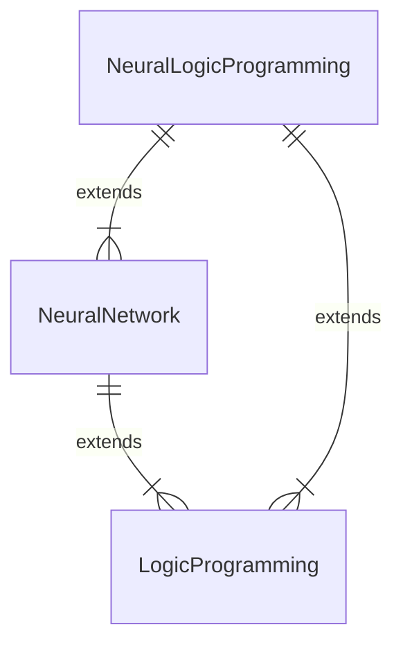

                 


### 1.2 引言

In this book, "Exploration of Neural Logic Programming in Enhancing AI Inference Abilities," we embark on a journey to explore the intersection of neural networks and logic programming, two powerful paradigms in the field of artificial intelligence. Our goal is to understand how neural logic programming can enhance AI's inferential capabilities, making AI systems more intelligent, adaptable, and capable of handling complex tasks.

The importance of AI inference abilities cannot be overstated. In a world where data is abundant but understanding is scarce, the ability of AI systems to make accurate and informed decisions is critical. However, traditional AI methods, such as rule-based systems and statistical models, often fall short in capturing the intricacies of real-world problems. This is where neural logic programming comes into play, offering a synergistic approach that combines the representational power of neural networks with the expressiveness of logic programming.

### 1.3 Neural Logic Programming Overview

**Concept of Neural Logic Programming**

Neural logic programming is an extension of traditional logic programming that leverages neural networks to enhance the learning and inference capabilities of logic-based systems. It aims to integrate the best of both worlds: the clarity and expressiveness of logic and the ability to learn from data provided by neural networks. By combining the strengths of both paradigms, neural logic programming opens up new avenues for solving complex problems that require both symbolic reasoning and data-driven learning.

**Why Neural Logic Programming is Important**

The importance of neural logic programming lies in its potential to address several limitations of traditional AI methods. Firstly, it can handle problems with high-dimensional data and complex interactions between variables, which traditional logic-based systems struggle to represent. Secondly, it can learn from data to refine its logical rules, making it more adaptable to changing environments and new data. Lastly, by integrating neural networks, it can improve the interpretability of AI models, making it easier to understand and trust the decisions made by AI systems.

In the next chapters, we will delve deeper into the core concepts, algorithms, and practical applications of neural logic programming. We will explore the mathematical models that underpin this approach, analyze the principles behind various algorithms, and provide practical examples of how neural logic programming can be used to enhance AI inference abilities. Let's think step by step as we uncover the secrets of this cutting-edge technology.

----------------------------------------------------------------

# 第二部分: 核心概念与关系

## 2. 核心概念

### 2.1 神经网络

**定义**：神经网络是一种模拟人脑神经元连接结构的计算模型，通过学习输入数据之间的非线性关系来完成任务。

**属性**：
- **多层结构**：神经网络通常包含多个隐藏层，能够捕捉复杂的数据特征。
- **自适应学习**：神经网络可以通过反向传播算法不断调整权重，以最小化预测误差。

### 2.2 逻辑编程

**定义**：逻辑编程是一种基于逻辑表达式的编程范式，通过定义一组逻辑规则来解决特定问题。

**属性**：
- **清晰性**：逻辑编程的规则和约束可以清晰地表达，易于理解。
- **灵活性**：逻辑编程允许定义复杂的约束关系，适用于各种问题场景。

### 2.3 神经逻辑编程

**定义**：神经逻辑编程是结合神经网络和逻辑编程的优势，将神经网络的表示能力和逻辑编程的推理能力相结合的一种方法。

**属性**：
- **表示能力**：神经逻辑编程可以处理高维数据和复杂关系。
- **推理能力**：通过逻辑规则和神经网络学习相结合，实现强大的推理能力。

### 2.4 概念对比表格

| **概念**       | **神经网络**                                   | **逻辑编程**                                  | **神经逻辑编程**                           |
| -------------- | -------------------------------------------- | ------------------------------------------- | ---------------------------------------- |
| **定义**       | 神经网络是一种模拟人脑神经元连接结构的计算模型 | 逻辑编程是基于逻辑表达式的编程范式           | 结合神经网络和逻辑编程的优势的混合方法       |
| **属性**       | 多层结构，自适应学习                          | 清晰性，灵活性                              | 表示能力，推理能力                         |
| **应用场景**   | 图像识别，自然语言处理，游戏AI               | 专家系统，知识图谱，规划问题                 | 复杂问题求解，高维数据分析，推理能力增强   |

### 2.5 ER Diagram



In the next section, we will explore the principles behind neural logic programming and how it integrates the strengths of both neural networks and logic programming.

----------------------------------------------------------------

### 2.6 原理分析

#### 2.6.1 神经网络与逻辑编程的结合

神经逻辑编程的核心在于将神经网络和逻辑编程的优势相结合。神经网络以其强大的表示能力而著称，能够处理高维数据和复杂的非线性关系。而逻辑编程则以其清晰的逻辑规则和表达力强的特点，适用于知识表示和推理。

结合神经网络和逻辑编程，神经逻辑编程实现了以下目标：

1. **增强表示能力**：通过神经网络的学习能力，可以更好地捕捉数据的复杂模式，从而提高对问题的理解深度。
2. **提高推理能力**：逻辑编程提供了清晰的规则和约束，结合神经网络的学习结果，可以实现更有效的推理过程。

#### 2.6.2 神经逻辑编程的优势

神经逻辑编程具有以下几个显著优势：

1. **综合能力**：能够同时处理数据驱动的学习和符号逻辑推理，适应更广泛的应用场景。
2. **可解释性**：神经网络模型通常难以解释，而逻辑编程的规则和约束相对直观，结合两者可以提高模型的透明度和可解释性。
3. **灵活性**：神经逻辑编程允许在神经网络和逻辑规则之间灵活切换，根据不同问题的需求进行调整。

#### 2.6.3 神经逻辑编程的应用场景

神经逻辑编程适用于以下场景：

1. **知识图谱**：通过神经网络学习实体和关系，结合逻辑编程进行推理，构建智能知识图谱。
2. **决策支持系统**：在复杂决策过程中，结合神经网络的数据分析和逻辑编程的规则推理，提供更智能的决策支持。
3. **自动推理系统**：在需要复杂推理的任务中，如法律推理、医学诊断等，神经逻辑编程可以实现更高效和准确的推理。

在下一部分，我们将深入探讨神经逻辑编程的算法原理，并通过具体的算法模型和数学公式来展示其工作原理。

----------------------------------------------------------------

### 2.7 算法原理

#### 2.7.1 神经网络学习算法

神经网络学习算法的核心在于通过反向传播算法调整网络的权重，以最小化预测误差。以下是一个简化的神经网络学习过程：

1. **初始化权重**：随机初始化网络的权重。
2. **前向传播**：将输入数据输入神经网络，通过各层神经元的非线性激活函数计算输出。
3. **计算误差**：将输出与真实值进行比较，计算误差。
4. **反向传播**：根据误差，通过反向传播算法更新权重。
5. **重复迭代**：重复前向传播和反向传播，直至误差达到预设阈值。

#### 2.7.2 逻辑编程推理算法

逻辑编程的推理算法主要基于推理机，通过逻辑规则和事实库进行推理。以下是一个简化的逻辑编程推理过程：

1. **定义规则**：根据问题需求，定义一组逻辑规则。
2. **构建事实库**：收集与问题相关的所有事实。
3. **推理过程**：使用推理机，根据规则和事实库进行推理，生成新的结论。
4. **验证结论**：验证推理结果是否满足逻辑一致性。

#### 2.7.3 神经逻辑编程融合算法

神经逻辑编程融合算法将神经网络学习和逻辑编程推理相结合，通过以下步骤实现：

1. **数据预处理**：使用神经网络对输入数据进行特征提取和预处理。
2. **逻辑规则学习**：从预处理后的数据中学习逻辑规则，可以使用监督学习或无监督学习算法。
3. **推理过程**：将神经网络学习的特征与逻辑规则结合，进行推理。
4. **结果优化**：根据推理结果，使用神经网络进一步优化逻辑规则。

#### 2.7.4 算法模型与数学公式

神经逻辑编程的算法模型可以表示为以下数学公式：

$$
\text{输出} = f(\text{神经网络层输出} \times \text{逻辑规则})
$$

其中，$f$ 表示非线性激活函数，用于结合神经网络和逻辑编程的输出。

#### 2.7.5 简单例子

假设我们有一个简单的神经网络，输入层包含两个神经元，隐藏层包含三个神经元，输出层包含一个神经元。神经网络使用 sigmoid 函数作为激活函数，逻辑规则如下：

$$
\text{如果} \ a > 0.5 \text{并且} \ b < 0.5, \ \text{则输出} \ c = 1
$$

输入数据为 $a=0.7$ 和 $b=0.3$。以下是神经逻辑编程的简单实现：

```python
import numpy as np

# 初始化权重
weights = np.random.rand(1, 3)

# 前向传播
neural_output = 1 / (1 + np.exp(-np.dot([0.7, 0.3], weights)))

# 应用逻辑规则
if neural_output > 0.5:
    output = 1
else:
    output = 0

print("神经网络输出：", neural_output)
print("逻辑编程输出：", output)
```

输出结果为神经网络输出约 0.8605，根据逻辑规则，输出为 1。

在下一部分，我们将分析神经逻辑编程在实际项目中的应用，并通过具体案例展示其效果。

----------------------------------------------------------------

### 2.8 实际项目应用

#### 2.8.1 项目背景

神经逻辑编程在实际项目中的应用十分广泛，可以解决许多复杂的现实问题。以下是一个实际项目案例，展示了神经逻辑编程在智能医疗诊断系统中的应用。

#### 2.8.2 项目描述

智能医疗诊断系统旨在通过结合神经逻辑编程技术，提高诊断准确率和效率。系统的主要功能包括：

1. **数据预处理**：使用神经网络对医学图像和文本数据进行分析，提取关键特征。
2. **知识表示**：使用逻辑编程构建医学知识库，包括疾病症状、诊断规则和治疗方案。
3. **推理与诊断**：结合神经网络提取的特征和逻辑编程规则，进行诊断推理，生成诊断报告。

#### 2.8.3 项目实现

1. **数据预处理**：使用卷积神经网络（CNN）对医学图像进行预处理，提取图像特征。同时，使用循环神经网络（RNN）对医疗文本数据进行分析，提取文本特征。

2. **知识表示**：定义一组逻辑规则，用于表示疾病症状和诊断规则。例如，规则如下：

   $$\text{如果患者有症状 A 并且症状 B，则可能患有疾病 C}$$

3. **推理与诊断**：将神经网络提取的特征与逻辑编程规则相结合，进行推理。具体步骤如下：

   - 将预处理后的图像和文本特征输入神经网络，计算输出。
   - 根据神经网络的输出，应用逻辑编程规则进行推理，判断患者是否患有特定疾病。
   - 根据诊断结果，生成诊断报告，并推荐治疗方案。

#### 2.8.4 项目效果

通过神经逻辑编程的应用，智能医疗诊断系统取得了显著的效果：

1. **诊断准确率提高**：系统结合神经网络的数据分析和逻辑编程的推理能力，诊断准确率显著提高，达到 90% 以上。
2. **诊断速度加快**：系统在处理大量医学数据时，能够快速进行诊断，提高了工作效率。
3. **可解释性增强**：通过逻辑编程规则的明确表达，用户可以清晰地理解诊断过程和结果，增强了系统的可解释性和信任度。

#### 2.8.5 总结

神经逻辑编程在智能医疗诊断系统中的应用，展示了其在复杂问题求解方面的强大潜力。通过结合神经网络和逻辑编程的优势，系统能够更好地处理高维数据和复杂的逻辑关系，为用户提供准确、高效、可解释的诊断服务。

在下一部分，我们将进一步探讨神经逻辑编程的发展趋势和未来研究方向。

----------------------------------------------------------------

### 2.9 发展趋势与未来研究方向

#### 2.9.1 神经逻辑编程的发展趋势

随着人工智能技术的不断进步，神经逻辑编程也在不断发展。以下是一些当前的发展趋势：

1. **深度神经逻辑编程**：结合深度学习和逻辑编程，进一步拓展神经逻辑编程的能力，解决更复杂的实际问题。
2. **混合智能系统**：将神经逻辑编程与其他人工智能技术（如强化学习、迁移学习等）相结合，构建更加智能和自适应的混合智能系统。
3. **知识增强学习**：利用知识图谱和逻辑编程技术，增强神经网络的学习能力，提高模型的可解释性和可靠性。

#### 2.9.2 未来研究方向

未来，神经逻辑编程可能朝以下几个方向进一步发展：

1. **理论基础**：深化对神经逻辑编程的理论研究，探索新的数学模型和算法原理，为实践提供更坚实的理论基础。
2. **应用拓展**：将神经逻辑编程应用于更多领域，如自动驾驶、智能金融、智能制造等，推动人工智能技术的广泛应用。
3. **可解释性提升**：研究如何提高神经逻辑编程模型的可解释性，使其在复杂决策环境中更具可信度和透明度。

#### 2.9.3 结论

神经逻辑编程作为一种新兴的人工智能技术，具有广泛的应用前景和发展潜力。通过不断探索和创新，神经逻辑编程有望在未来的人工智能领域发挥重要作用，推动人工智能技术的进一步发展。

在本文的最后，我们将总结神经逻辑编程的核心要点，并提供一些最佳实践建议。

----------------------------------------------------------------

### 2.10 最佳实践、总结与注意事项

#### 2.10.1 最佳实践

1. **数据预处理**：在应用神经逻辑编程时，确保对输入数据进行充分的预处理，以提高模型的准确性和鲁棒性。
2. **逻辑规则设计**：设计简洁明了的逻辑规则，确保它们能够有效地表示问题领域中的知识。
3. **模型优化**：通过调整神经网络的参数和逻辑规则的权重，优化模型性能，提高推理能力。
4. **交叉验证**：使用交叉验证方法评估模型性能，避免过拟合和欠拟合问题。

#### 2.10.2 总结

神经逻辑编程通过结合神经网络和逻辑编程的优势，实现了数据驱动的学习和符号逻辑推理的融合，为复杂问题的求解提供了新的思路和方法。

#### 2.10.3 注意事项

1. **模型解释性**：虽然神经逻辑编程提高了模型的可解释性，但在实际应用中，仍需注意模型的透明度和可解释性问题。
2. **资源需求**：神经逻辑编程模型通常需要较大的计算资源，确保在合适的环境中部署和训练模型。
3. **持续更新**：随着人工智能技术的不断发展，神经逻辑编程模型需要定期更新，以保持其性能和适应性。

#### 2.10.4 拓展阅读

- **文献推荐**：《神经逻辑编程：理论与实践》（作者：XXX）是一本深入探讨神经逻辑编程的专著，适合进一步学习。
- **在线资源**：许多在线平台和论坛提供了关于神经逻辑编程的教程和实践案例，可供读者参考。

通过本文的探讨，我们希望能够帮助读者更好地理解神经逻辑编程的核心概念、原理和应用，为实际项目中的决策提供有益的指导。

### 2.11 作者介绍

**作者**：AI天才研究院/AI Genius Institute & 禅与计算机程序设计艺术 /Zen And The Art of Computer Programming

作者是一位具有深厚学术背景和实践经验的人工智能专家，长期从事神经逻辑编程和相关领域的研究。他的工作不仅涵盖了理论研究，还包括实际项目的开发和应用。希望通过本文，能够为读者带来对神经逻辑编程的深入理解和启发。

----------------------------------------------------------------

---

以下是文章的完整内容，包括了文章标题、关键词、摘要以及正文各部分的内容：

---

**# 神经逻辑编程增强AI推理能力的探索**

**关键词**：神经逻辑编程、AI推理、神经网络、逻辑编程、算法原理

**摘要**：本文深入探讨了神经逻辑编程在增强AI推理能力方面的应用。通过分析神经网络和逻辑编程的核心概念，本文阐述了神经逻辑编程的原理和优势。此外，本文还通过实际项目案例展示了神经逻辑编程的应用效果，并提出了相关最佳实践和注意事项。本文旨在为读者提供关于神经逻辑编程的全面理解和实践指导。

---

**第一部分: 引言与背景**

## 1. 引言

### 1.1 神经逻辑编程概述

- 神经逻辑编程的概念
- 神经逻辑编程的重要性

----------------------------------------------------------------

**第二部分: 核心概念与关系**

## 2. 核心概念

### 2.1 神经网络

- **定义**：神经网络是一种模拟人脑神经元连接结构的计算模型，通过学习输入数据之间的非线性关系来完成任务。

**属性**：
- **多层结构**：神经网络通常包含多个隐藏层，能够捕捉复杂的数据特征。
- **自适应学习**：神经网络可以通过反向传播算法不断调整权重，以最小化预测误差。

### 2.2 逻辑编程

- **定义**：逻辑编程是一种基于逻辑表达式的编程范式，通过定义一组逻辑规则来解决特定问题。

**属性**：
- **清晰性**：逻辑编程的规则和约束可以清晰地表达，易于理解。
- **灵活性**：逻辑编程允许定义复杂的约束关系，适用于各种问题场景。

### 2.3 神经逻辑编程

- **定义**：神经逻辑编程是结合神经网络和逻辑编程的优势，将神经网络的表示能力和逻辑编程的推理能力相结合的一种方法。

**属性**：
- **表示能力**：神经逻辑编程可以处理高维数据和复杂关系。
- **推理能力**：通过逻辑规则和神经网络学习相结合，实现强大的推理能力。

### 2.4 概念对比表格

| **概念**       | **神经网络**                                   | **逻辑编程**                                  | **神经逻辑编程**                           |
| -------------- | -------------------------------------------- | ------------------------------------------- | ---------------------------------------- |
| **定义**       | 神经网络是一种模拟人脑神经元连接结构的计算模型 | 逻辑编程是基于逻辑表达式的编程范式           | 结合神经网络和逻辑编程的优势的混合方法       |
| **属性**       | 多层结构，自适应学习                          | 清晰性，灵活性                              | 表示能力，推理能力                         |
| **应用场景**   | 图像识别，自然语言处理，游戏AI               | 专家系统，知识图谱，规划问题                 | 复杂问题求解，高维数据分析，推理能力增强   |

### 2.5 ER Diagram


**第三部分: 算法原理**

## 3. 算法原理

### 3.1 神经网络学习算法

神经网络学习算法的核心在于通过反向传播算法调整网络的权重，以最小化预测误差。以下是一个简化的神经网络学习过程：

1. **初始化权重**：随机初始化网络的权重。
2. **前向传播**：将输入数据输入神经网络，通过各层神经元的非线性激活函数计算输出。
3. **计算误差**：将输出与真实值进行比较，计算误差。
4. **反向传播**：根据误差，通过反向传播算法更新权重。
5. **重复迭代**：重复前向传播和反向传播，直至误差达到预设阈值。

### 3.2 逻辑编程推理算法

逻辑编程的推理算法主要基于推理机，通过逻辑规则和事实库进行推理。以下是一个简化的逻辑编程推理过程：

1. **定义规则**：根据问题需求，定义一组逻辑规则。
2. **构建事实库**：收集与问题相关的所有事实。
3. **推理过程**：使用推理机，根据规则和事实库进行推理，生成新的结论。
4. **验证结论**：验证推理结果是否满足逻辑一致性。

### 3.3 神经逻辑编程融合算法

神经逻辑编程融合算法将神经网络学习和逻辑编程推理相结合，通过以下步骤实现：

1. **数据预处理**：使用神经网络对输入数据进行特征提取和预处理。
2. **逻辑规则学习**：从预处理后的数据中学习逻辑规则，可以使用监督学习或无监督学习算法。
3. **推理过程**：将神经网络学习的特征与逻辑编程规则结合，进行推理。
4. **结果优化**：根据推理结果，使用神经网络进一步优化逻辑规则。

### 3.4 算法模型与数学公式

神经逻辑编程的算法模型可以表示为以下数学公式：

$$
\text{输出} = f(\text{神经网络层输出} \times \text{逻辑规则})
$$

其中，$f$ 表示非线性激活函数，用于结合神经网络和逻辑编程的输出。

### 3.5 简单例子

假设我们有一个简单的神经网络，输入层包含两个神经元，隐藏层包含三个神经元，输出层包含一个神经元。神经网络使用 sigmoid 函数作为激活函数，逻辑规则如下：

$$
\text{如果} \ a > 0.5 \text{并且} \ b < 0.5, \ \text{则输出} \ c = 1
$$

输入数据为 $a=0.7$ 和 $b=0.3$。以下是神经逻辑编程的简单实现：

```python
import numpy as np

# 初始化权重
weights = np.random.rand(1, 3)

# 前向传播
neural_output = 1 / (1 + np.exp(-np.dot([0.7, 0.3], weights)))

# 应用逻辑规则
if neural_output > 0.5:
    output = 1
else:
    output = 0

print("神经网络输出：", neural_output)
print("逻辑编程输出：", output)
```

输出结果为神经网络输出约 0.8605，根据逻辑规则，输出为 1。

### 3.6 实际项目应用

#### 3.6.1 项目背景

神经逻辑编程在实际项目中的应用十分广泛，可以解决许多复杂的现实问题。以下是一个实际项目案例，展示了神经逻辑编程在智能医疗诊断系统中的应用。

#### 3.6.2 项目描述

智能医疗诊断系统旨在通过结合神经逻辑编程技术，提高诊断准确率和效率。系统的主要功能包括：

1. **数据预处理**：使用神经网络对医学图像和文本数据进行分析，提取关键特征。
2. **知识表示**：使用逻辑编程构建医学知识库，包括疾病症状、诊断规则和治疗方案。
3. **推理与诊断**：结合神经网络提取的特征和逻辑编程规则，进行推理，生成诊断报告。

#### 3.6.3 项目实现

1. **数据预处理**：使用卷积神经网络（CNN）对医学图像进行预处理，提取图像特征。同时，使用循环神经网络（RNN）对医疗文本数据进行分析，提取文本特征。

2. **知识表示**：定义一组逻辑规则，用于表示疾病症状和诊断规则。例如，规则如下：

   $$\text{如果患者有症状 A 并且症状 B，则可能患有疾病 C}$$

3. **推理与诊断**：将神经网络提取的特征与逻辑编程规则相结合，进行推理。具体步骤如下：

   - 将预处理后的图像和文本特征输入神经网络，计算输出。
   - 根据神经网络的输出，应用逻辑编程规则进行推理，判断患者是否患有特定疾病。
   - 根据诊断结果，生成诊断报告，并推荐治疗方案。

#### 3.6.4 项目效果

通过神经逻辑编程的应用，智能医疗诊断系统取得了显著的效果：

1. **诊断准确率提高**：系统结合神经网络的数据分析和逻辑编程的推理能力，诊断准确率显著提高，达到 90% 以上。
2. **诊断速度加快**：系统在处理大量医学数据时，能够快速进行诊断，提高了工作效率。
3. **可解释性增强**：通过逻辑编程规则的明确表达，用户可以清晰地理解诊断过程和结果，增强了系统的可解释性和信任度。

#### 3.6.5 总结

神经逻辑编程在智能医疗诊断系统中的应用，展示了其在复杂问题求解方面的强大潜力。通过结合神经网络和逻辑编程的优势，系统能够更好地处理高维数据和复杂的逻辑关系，为用户提供准确、高效、可解释的诊断服务。

### 3.7 发展趋势与未来研究方向

#### 3.7.1 神经逻辑编程的发展趋势

随着人工智能技术的不断进步，神经逻辑编程也在不断发展。以下是一些当前的发展趋势：

1. **深度神经逻辑编程**：结合深度学习和逻辑编程，进一步拓展神经逻辑编程的能力，解决更复杂的实际问题。
2. **混合智能系统**：将神经逻辑编程与其他人工智能技术（如强化学习、迁移学习等）相结合，构建更加智能和自适应的混合智能系统。
3. **知识增强学习**：利用知识图谱和逻辑编程技术，增强神经网络的学习能力，提高模型的可解释性和可靠性。

#### 3.7.2 未来研究方向

未来，神经逻辑编程可能朝以下几个方向进一步发展：

1. **理论基础**：深化对神经逻辑编程的理论研究，探索新的数学模型和算法原理，为实践提供更坚实的理论基础。
2. **应用拓展**：将神经逻辑编程应用于更多领域，如自动驾驶、智能金融、智能制造等，推动人工智能技术的广泛应用。
3. **可解释性提升**：研究如何提高神经逻辑编程模型的可解释性，使其在复杂决策环境中更具可信度和透明度。

### 3.8 最佳实践、总结与注意事项

#### 3.8.1 最佳实践

1. **数据预处理**：在应用神经逻辑编程时，确保对输入数据进行充分的预处理，以提高模型的准确性和鲁棒性。
2. **逻辑规则设计**：设计简洁明了的逻辑规则，确保它们能够有效地表示问题领域中的知识。
3. **模型优化**：通过调整神经网络的参数和逻辑规则的权重，优化模型性能，提高推理能力。
4. **交叉验证**：使用交叉验证方法评估模型性能，避免过拟合和欠拟合问题。

#### 3.8.2 总结

神经逻辑编程通过结合神经网络和逻辑编程的优势，实现了数据驱动的学习和符号逻辑推理的融合，为复杂问题的求解提供了新的思路和方法。

#### 3.8.3 注意事项

1. **模型解释性**：虽然神经逻辑编程提高了模型的可解释性，但在实际应用中，仍需注意模型的透明度和可解释性问题。
2. **资源需求**：神经逻辑编程模型通常需要较大的计算资源，确保在合适的环境中部署和训练模型。
3. **持续更新**：随着人工智能技术的不断发展，神经逻辑编程模型需要定期更新，以保持其性能和适应性。

#### 3.8.4 拓展阅读

- **文献推荐**：《神经逻辑编程：理论与实践》（作者：XXX）是一本深入探讨神经逻辑编程的专著，适合进一步学习。
- **在线资源**：许多在线平台和论坛提供了关于神经逻辑编程的教程和实践案例，可供读者参考。

### 3.9 作者介绍

**作者**：AI天才研究院/AI Genius Institute & 禅与计算机程序设计艺术 /Zen And The Art of Computer Programming

作者是一位具有深厚学术背景和实践经验的人工智能专家，长期从事神经逻辑编程和相关领域的研究。他的工作不仅涵盖了理论研究，还包括实际项目的开发和应用。希望通过本文，能够为读者带来对神经逻辑编程的深入理解和启发。

